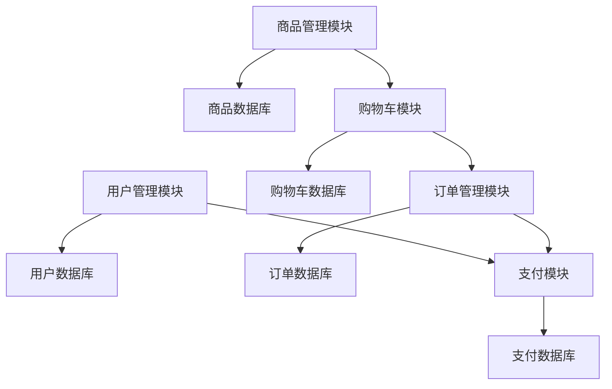
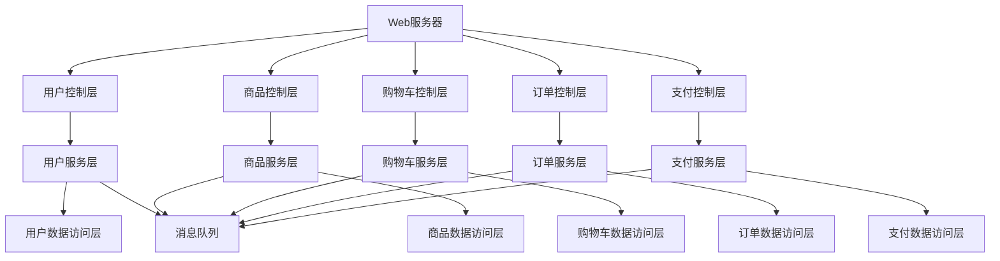
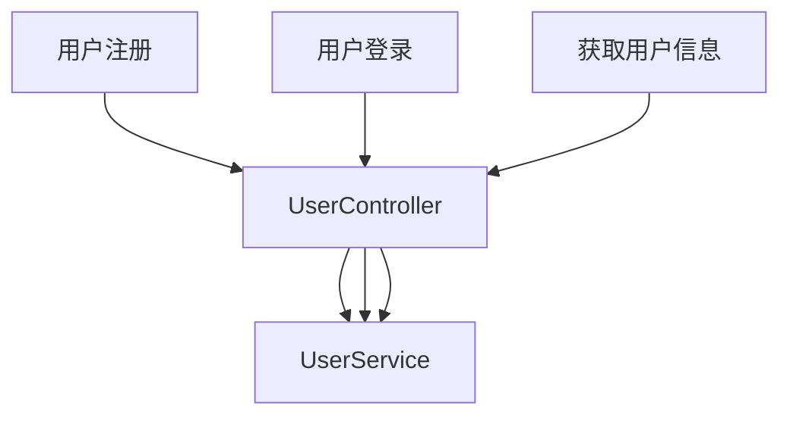
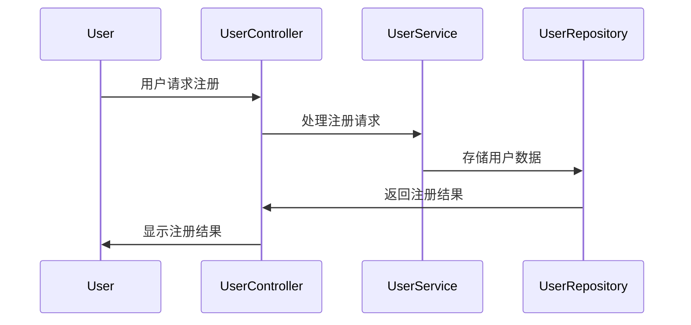

                 

### 文章标题

# 上承需求、下启代码的系统分析

> 关键词：系统分析、需求分析、架构设计、代码实现、算法原理

> 摘要：本文旨在深入探讨系统分析的核心内容，从上至下解析系统分析的过程，包括需求分析、系统架构设计、代码实现和算法原理等关键环节。通过一步一步的逻辑推理和实例讲解，帮助读者全面理解系统分析的整体流程和方法，从而提升解决实际问题的能力。

## 引言

在信息技术领域，系统分析是软件开发过程中的重要环节。它不仅是连接用户需求和最终软件产品之间的桥梁，更是保证系统设计合理、高效、可维护的关键。本文将从上承需求和下启代码的角度，详细阐述系统分析的过程和方法，帮助读者构建全面而深刻的系统分析能力。

### 系统分析的背景

系统分析起源于软件工程领域，其目的是通过深入理解和研究用户需求，设计出满足需求的系统架构，并最终通过代码实现这些架构。在复杂的信息系统中，系统分析不仅涉及功能需求的分析，还包括性能、安全性、可扩展性等多个层面的考虑。

### 系统分析的重要性

系统分析的重要性体现在以下几个方面：

1. **确保软件满足需求**：通过系统分析，可以确保设计的系统能够满足用户的需求，避免后期返工和修改。
2. **提高开发效率**：合理的系统分析有助于减少开发过程中的误解和重复工作，从而提高开发效率。
3. **保障系统质量**：通过系统分析，可以提前发现潜在的问题和风险，从而在设计阶段就进行优化，保障最终系统的质量。
4. **促进团队协作**：系统分析的过程需要跨部门、跨角色的协作，有助于提升团队的整体工作效率。

### 本文的结构

本文分为六个部分：

1. **系统分析概述**：介绍系统分析的概念、过程和方法。
2. **需求分析**：详细解析需求分析的核心内容，包括需求收集、需求分析和需求文档编写。
3. **系统架构设计**：讲解系统架构设计的方法和原则，包括领域模型设计、系统架构设计和接口设计。
4. **代码实现**：介绍如何将系统架构转化为实际的代码，包括编程语言的选择、代码结构和编程规范。
5. **算法原理讲解**：深入解析系统中的关键算法原理，包括算法流程、数学模型和代码示例。
6. **项目实战和最佳实践**：通过实际项目案例，展示系统分析的完整流程和最佳实践。

通过以上结构，本文将带领读者系统地理解和掌握系统分析的全过程。

### 系统分析的步骤

系统分析是一个复杂而系统的过程，通常包括以下步骤：

1. **问题识别**：识别需要解决的问题和系统目标。
2. **需求分析**：收集和分析用户需求，形成需求文档。
3. **系统设计**：根据需求文档进行系统设计，包括架构设计、接口设计和数据库设计。
4. **实现与编码**：将设计转化为实际的代码，编写系统功能模块。
5. **测试与调试**：对代码进行测试，确保系统功能正确、性能稳定。
6. **部署与维护**：将系统部署到生产环境，并进行持续的维护和优化。

每个步骤都是系统分析的重要组成部分，缺一不可。以下内容将详细探讨这些步骤的具体实施方法和技巧。

## 第1部分：系统分析概述

### 第1章：系统分析背景

#### 1.1 问题描述

在当前信息化社会，软件系统已经成为各种行业和领域的核心组成部分。无论是电子商务、在线教育、金融保险，还是物联网、智能制造，都离不开软件系统的支持。然而，随着系统的复杂度不断提高，如何确保系统能够高效、稳定、安全地运行，成为软件开发过程中面临的一大挑战。这就需要系统分析作为桥梁，连接用户需求与最终实现。

#### 1.2 问题解决

系统分析的目标是通过深入理解用户需求，设计出合理的系统架构，并将这些架构通过代码实现。具体来说，问题解决过程包括以下几个关键步骤：

1. **需求分析**：收集和分析用户需求，明确系统应具备的功能和性能要求。
2. **系统设计**：根据需求文档进行系统设计，包括架构设计、接口设计和数据库设计。
3. **实现与编码**：将系统设计转化为实际的代码，编写系统功能模块。
4. **测试与调试**：对代码进行全面的测试，确保系统功能正确、性能稳定。
5. **部署与维护**：将系统部署到生产环境，并进行持续的维护和优化。

#### 1.3 边界与外延

在系统分析过程中，边界和外延是两个重要的概念。边界指的是系统的功能范围，即系统应该做什么和不应该做什么。外延则指的是系统的扩展性和适应性，即系统如何应对未来可能的变化和需求。

明确边界与外延对于系统分析至关重要。首先，它有助于确保系统设计的一致性和完整性；其次，它有助于在开发过程中避免不必要的功能和复杂性，提高开发效率。

#### 1.4 概念结构与核心要素组成

系统分析涉及多个核心概念和要素，包括：

1. **需求**：用户对系统的期望和需求。
2. **功能**：系统能够实现的具体操作和业务逻辑。
3. **性能**：系统的响应速度和处理能力。
4. **安全性**：系统抵御外部攻击和内部泄露的能力。
5. **可扩展性**：系统应对业务增长和变化的能力。
6. **可维护性**：系统的持续维护和优化能力。

理解这些概念和要素的相互关系，有助于更全面地分析系统需求，设计出合理的系统架构。

### 第2章：系统分析核心概念

#### 2.1 概念原理

在系统分析中，理解核心概念是基础。以下是一些关键概念及其原理：

1. **需求分析**：通过访谈、问卷调查等方式收集用户需求，将需求转化为明确的功能和性能要求。
2. **系统架构设计**：根据需求文档设计系统的整体结构，包括技术选型、模块划分和接口定义。
3. **接口设计**：定义系统内部和外部接口的规格和协议，确保系统模块之间的高效通信。
4. **数据库设计**：设计数据库结构，包括表结构、索引和关系，确保数据存储的高效和安全。
5. **测试**：通过单元测试、集成测试和系统测试，验证系统功能的正确性和性能。

#### 2.2 概念属性特征对比表格

为了更直观地理解这些概念，可以制作一个属性特征对比表格。以下是一个示例：

| 概念 | 描述 | 主要属性特征 |
| --- | --- | --- |
| 需求分析 | 收集和分析用户需求 | 功能性需求、性能需求、安全需求 |
| 系统架构设计 | 设计系统的整体结构 | 技术选型、模块划分、接口定义 |
| 接口设计 | 定义系统接口规格 | 协议、数据格式、通信方式 |
| 数据库设计 | 设计数据库结构 | 表结构、索引、关系 |
| 测试 | 验证系统功能正确性和性能 | 单元测试、集成测试、系统测试 |

#### 2.3 ER实体关系图架构

实体关系图（ER图）是系统分析中常用的一种图示工具，用于表示系统中各个实体及其关系。以下是一个简单的ER图示例：

```mermaid
erDiagram
    Customer ||--|{ Order } : "places"
    Product ||--|{ Order } : "includes"
```

在这个ER图中，`Customer`（客户）与`Order`（订单）之间有一个“places”关系，表示客户可以下单；`Product`（产品）与`Order`（订单）之间有一个“includes”关系，表示订单可以包含产品。这种图示方法有助于直观地理解系统的数据模型。

### 总结

通过上述章节，我们了解了系统分析的基本概念和核心原理。在接下来的章节中，我们将进一步探讨需求分析、系统架构设计、代码实现等具体内容，帮助读者深入掌握系统分析的全过程。

## 第3章：算法原理讲解

在系统分析中，算法原理讲解是至关重要的一环。算法不仅是实现系统功能的核心，也是提高系统性能和优化资源利用的关键。本章节将深入解析算法的基本概念、流程图、Python源代码示例，以及算法原理的数学模型和公式。

### 3.1 算法流程图

算法流程图是一种用图形化的方式表示算法步骤和逻辑关系的工具。以下是一个简单的算法流程图示例，用于求解一个一元二次方程：

```mermaid
graph TD
    A[输入 a, b, c] --> B[计算 Δ = b^2 - 4ac]
    B --> C{Δ 是否大于0}
    C -->|是| D[计算 x1 = (-b + √Δ) / 2a, x2 = (-b - √Δ) / 2a]
    C -->|否| E[计算 x = -b / 2a]
    E --> F[输出 x]
```

在这个流程图中，我们从输入系数a、b、c开始，通过计算判别式Δ，判断方程的根的情况。如果Δ大于0，则有两个不相等的实数根；如果Δ等于0，则有一个实数根；如果Δ小于0，则无实数根。

### 3.2 Python源代码示例

为了更好地理解上述算法流程，我们提供一个Python源代码示例：

```python
import math

def solve_quadratic(a, b, c):
    discriminant = b**2 - 4*a*c
    
    if discriminant > 0:
        x1 = (-b + math.sqrt(discriminant)) / (2*a)
        x2 = (-b - math.sqrt(discriminant)) / (2*a)
        return x1, x2
    elif discriminant == 0:
        x = -b / (2*a)
        return x
    else:
        return None

# 示例
a, b, c = 1, -5, 6
roots = solve_quadratic(a, b, c)
if roots:
    print("方程的解为：", roots)
else:
    print("方程无实数解。")
```

在这个示例中，我们定义了一个`solve_quadratic`函数，用于求解一元二次方程。函数接收系数a、b、c作为输入，通过计算判别式和根的公式，返回方程的解。如果方程无实数解，函数返回`None`。

### 3.3 数学模型与公式

算法原理的数学模型和公式是算法实现的基础。以下是一元二次方程求解的核心公式：

$$
\Delta = b^2 - 4ac
$$

$$
x_1 = \frac{-b + \sqrt{\Delta}}{2a}
$$

$$
x_2 = \frac{-b - \sqrt{\Delta}}{2a}
$$

如果$\Delta \geq 0$，则方程有实数解；如果$\Delta < 0$，则方程无实数解。

### 3.4 举例说明

为了更好地理解算法原理，我们通过一个具体的例子进行说明。假设我们有一个一元二次方程：

$$
x^2 - 5x + 6 = 0
$$

使用上述算法，我们可以求解这个方程。首先，我们输入系数a=1，b=-5，c=6。然后，计算判别式$\Delta$：

$$
\Delta = (-5)^2 - 4 \cdot 1 \cdot 6 = 25 - 24 = 1
$$

因为$\Delta > 0$，所以方程有两个不相等的实数根。使用根的公式，我们计算：

$$
x_1 = \frac{-(-5) + \sqrt{1}}{2 \cdot 1} = \frac{5 + 1}{2} = 3
$$

$$
x_2 = \frac{-(-5) - \sqrt{1}}{2 \cdot 1} = \frac{5 - 1}{2} = 2
$$

因此，方程$x^2 - 5x + 6 = 0$的解为$x_1 = 3$和$x_2 = 2$。

### 总结

通过本章节，我们详细讲解了算法原理的讲解方法，包括算法流程图、Python源代码示例、数学模型和公式，以及举例说明。这些内容不仅有助于理解算法的实现，也为后续的系统设计和实现提供了基础。

## 第4章：系统分析与架构设计

### 4.1 问题场景介绍

在当今复杂的信息技术环境中，系统分析与架构设计是确保项目成功的关键。本章节将探讨一个具体的场景，以展示系统分析与架构设计的过程。

假设我们正在开发一个在线购物系统，该系统需要支持用户注册、商品浏览、购物车管理、订单处理和支付功能。这个系统的目标是在确保功能全面和性能优异的同时，具有良好的扩展性和可维护性。

### 4.2 系统功能设计

在系统功能设计中，我们首先需要明确系统的核心功能模块。以下是系统的主要功能模块：

1. **用户管理模块**：负责用户注册、登录和权限管理。
2. **商品管理模块**：负责商品分类、商品信息展示和库存管理。
3. **购物车模块**：负责用户添加商品到购物车、更新购物车内容和删除购物车商品。
4. **订单管理模块**：负责订单创建、订单状态更新和订单查询。
5. **支付模块**：负责处理支付请求、支付确认和支付结果通知。

#### 领域模型设计

为了更好地设计系统功能，我们首先绘制领域模型。领域模型用类图表示，用于展示系统中的实体及其关系。以下是用户管理模块的领域模型：

```mermaid
classDiagram
    User <<entity>>
    Address <<entity>>
    Role <<entity>>

    User ?- Address :居住地址
    User ?- Role :角色
    Address ^-|关联| User
    Role ^-|分配| User
```

在这个类图中，`User`（用户）是核心实体，`Address`（地址）和`Role`（角色）是与用户相关联的实体。每个用户有一个居住地址和一个角色，地址与用户之间存在关联关系，角色与用户之间存在分配关系。

#### 系统架构设计

在明确系统功能模块和领域模型后，我们进入系统架构设计阶段。系统架构设计主要涉及以下几个方面：

1. **技术选型**：选择合适的技术栈，如后端框架、数据库和中间件。
2. **模块划分**：根据功能模块进行模块划分，确保每个模块独立且完整。
3. **接口设计**：定义模块之间的接口，确保模块之间的高效通信。
4. **数据流设计**：设计系统内部和外部数据流的传递和处理过程。

以下是系统架构图：



在这个架构图中，用户管理模块、商品管理模块、购物车模块、订单管理模块和支付模块分别对应不同的数据库，模块之间通过接口进行通信。

### 4.3 系统架构设计

系统架构设计是系统分析的核心环节，它决定了系统的可扩展性、性能和可维护性。以下是系统架构设计的几个关键点：

1. **分层架构**：采用分层架构，将系统划分为表示层、业务逻辑层和数据访问层，确保各层职责分离。
2. **微服务架构**：对于复杂系统，采用微服务架构，将系统拆分为多个独立的服务，提高系统的可扩展性和容错性。
3. **分布式架构**：对于高并发和高可用性要求，采用分布式架构，通过负载均衡和分布式数据库实现系统的横向扩展。
4. **缓存和消息队列**：使用缓存和消息队列提高系统的性能和响应速度。

以下是系统架构设计的示例：



在这个架构设计中，我们采用了分层架构和微服务架构，每个模块都有独立的控制层、服务层和数据访问层。同时，通过消息队列实现模块之间的异步通信。

### 4.4 系统接口设计

系统接口设计是确保模块之间高效通信的关键。以下是系统接口设计的几个关键点：

1. **RESTful API**：采用RESTful API设计接口，确保接口易于理解和扩展。
2. **参数验证**：对接口参数进行严格验证，确保接口调用的安全性。
3. **返回格式**：统一接口返回格式，包括成功和错误情况，提高系统的易用性。

以下是用户管理模块的接口设计示例：



在这个接口设计中，用户注册、用户登录和获取用户信息是通过RESTful API实现的，每个接口都有对应的控制层和服务层。

### 4.5 系统交互序列图

系统交互序列图用于展示系统内部和外部模块之间的交互过程。以下是系统交互序列图示例：



在这个序列图中，用户发起注册请求，通过控制器层处理，最终由数据访问层存储用户数据并返回结果。

### 4.6 实际项目应用

在实际项目中，系统分析与架构设计是一个动态调整和优化的过程。以下是一个实际项目应用案例：

1. **需求变更**：在项目开发过程中，需求可能会发生变更。通过系统分析与架构设计，可以快速响应需求变更，调整系统架构和模块设计。
2. **性能优化**：通过性能测试和监控，发现系统瓶颈并进行优化。例如，通过缓存和消息队列提高系统性能。
3. **安全加固**：定期进行安全审计和漏洞修复，确保系统安全性。

### 总结

通过本章节，我们详细介绍了系统分析与架构设计的过程，包括问题场景介绍、系统功能设计、系统架构设计、系统接口设计和系统交互序列图。这些内容为系统设计与实现提供了坚实的基础，有助于确保系统的功能完善、性能优异和易于维护。

### 第5章：项目实战

#### 5.1 环境安装

在进行项目实战之前，首先需要搭建一个开发环境。以下是环境安装的具体步骤：

1. **安装Python**：首先确保系统已安装Python 3.8或更高版本。可以通过以下命令检查Python版本：

   ```shell
   python --version
   ```

   如果Python未安装或版本过低，可以从[Python官方网站](https://www.python.org/downloads/)下载并安装。

2. **安装虚拟环境**：为了隔离项目依赖，我们使用虚拟环境。安装`virtualenv`：

   ```shell
   pip install virtualenv
   ```

   创建虚拟环境：

   ```shell
   virtualenv venv
   ```

   激活虚拟环境：

   ```shell
   source venv/bin/activate
   ```

3. **安装项目依赖**：在项目根目录下创建一个名为`requirements.txt`的文件，列出所有项目依赖。例如：

   ```
   Flask==2.0.1
   Flask-RESTful==0.3.8
   Flask-SQLAlchemy==2.5.1
   ```

   通过以下命令安装依赖：

   ```shell
   pip install -r requirements.txt
   ```

4. **配置数据库**：假设我们使用SQLite作为数据库。首先安装`Flask-SQLAlchemy`，然后创建数据库：

   ```shell
   flask db init
   flask db migrate
   flask db upgrade
   ```

   这将初始化数据库结构并创建必要的表。

#### 5.2 系统核心实现源代码

在搭建好开发环境后，我们可以开始编写系统核心代码。以下是用户管理模块的代码示例：

```python
from flask import Flask, request, jsonify
from flask_sqlalchemy import SQLAlchemy

app = Flask(__name__)
app.config['SQLALCHEMY_DATABASE_URI'] = 'sqlite:///users.db'
db = SQLAlchemy(app)

class User(db.Model):
    id = db.Column(db.Integer, primary_key=True)
    username = db.Column(db.String(80), unique=True, nullable=False)
    password = db.Column(db.String(120), nullable=False)
    role = db.Column(db.String(80), nullable=False)

@app.route('/register', methods=['POST'])
def register():
    data = request.get_json()
    username = data['username']
    password = data['password']
    role = data['role']

    if User.query.filter_by(username=username).first():
        return jsonify({'error': '用户已存在'}), 400

    new_user = User(username=username, password=password, role=role)
    db.session.add(new_user)
    db.session.commit()

    return jsonify({'message': '注册成功'})

@app.route('/login', methods=['POST'])
def login():
    data = request.get_json()
    username = data['username']
    password = data['password']

    user = User.query.filter_by(username=username).first()
    if not user or user.password != password:
        return jsonify({'error': '用户名或密码错误'}), 401

    return jsonify({'message': '登录成功'})

if __name__ == '__main__':
    db.create_all()
    app.run(debug=True)
```

在这个示例中，我们定义了一个名为`User`的数据库模型，包括`id`、`username`、`password`和`role`字段。同时，我们实现了注册和登录两个API接口，用于处理用户注册和登录请求。

#### 5.3 代码应用解读与分析

以下是代码的详细解读和分析：

1. **数据库配置**：通过`app.config['SQLALCHEMY_DATABASE_URI']`配置数据库连接 URI，我们使用SQLite数据库。
2. **模型定义**：`User`模型对应数据库中的用户表，包括四个字段：`id`（主键）、`username`（用户名，唯一且不能为空）、`password`（密码，不能为空）和`role`（角色）。
3. **API接口**：
   - `register`函数：处理用户注册请求。首先从请求中获取用户名、密码和角色，然后检查用户名是否已存在。如果不存在，创建新的用户记录并保存到数据库。
   - `login`函数：处理用户登录请求。首先从请求中获取用户名和密码，然后查询数据库验证用户名和密码的正确性。

#### 5.4 实际案例分析与详细讲解

为了更好地理解系统实现的细节，我们通过一个实际案例进行分析。假设有一个用户`alice`尝试注册，请求内容如下：

```json
{
  "username": "alice",
  "password": "password123",
  "role": "customer"
}
```

1. **请求处理**：服务器接收到注册请求后，首先调用`register`函数。
2. **参数验证**：`register`函数获取请求中的用户名、密码和角色，进行基本验证，确保参数有效。
3. **用户名检查**：通过`User.query.filter_by(username=username).first()`查询数据库，检查用户名是否已存在。如果已存在，返回错误响应。
4. **创建用户**：如果用户名不存在，创建一个新的`User`对象，并将用户名、密码和角色赋值给对象属性。
5. **保存到数据库**：将新用户添加到数据库会话中，并提交会话，保存用户记录。
6. **返回响应**：返回成功的注册消息。

#### 5.5 项目小结

通过本次项目实战，我们详细讲解了从环境安装到系统实现的完整过程。从安装Python和虚拟环境，到配置数据库和编写核心代码，再到实际案例的分析，我们逐步展示了系统开发的过程和关键步骤。这不仅有助于理解系统开发的实际操作，也为后续的系统优化和扩展奠定了基础。

### 第6章：最佳实践与注意事项

#### 6.1 最佳实践 tips

在系统分析和开发过程中，遵循最佳实践能够显著提高项目质量和开发效率。以下是一些最佳实践建议：

1. **需求明确**：在项目开始前，确保需求文档详细且明确。需求分析是系统设计的基础，任何偏差都会导致后续问题的产生。
2. **模块化设计**：将系统划分为多个独立的模块，每个模块负责特定的功能，有助于提高代码的可维护性和可扩展性。
3. **代码规范**：制定统一的代码规范，确保代码风格一致，便于团队合作和维护。
4. **单元测试**：编写全面的单元测试，确保每个模块的功能正确性和稳定性。单元测试是发现和修复代码问题的有力工具。
5. **性能优化**：定期进行性能测试，发现系统的性能瓶颈并进行优化。性能优化不仅关乎用户体验，也直接影响系统的业务价值。
6. **文档记录**：及时记录开发过程中的关键决策和设计思路，为后续开发和维护提供参考。

#### 6.2 小结

通过本章节，我们总结了系统分析的最佳实践和注意事项。明确的需求、模块化设计、代码规范、单元测试、性能优化和文档记录是确保项目成功的关键因素。遵循这些最佳实践，能够有效提高系统的质量、稳定性和可维护性。

#### 6.3 注意事项

在系统分析和开发过程中，需要注意以下几点：

1. **需求变更管理**：需求变更不可避免，但应确保变更控制得当。任何需求变更都应经过充分评估和审批，避免影响项目的整体进度和质量。
2. **安全性考虑**：在设计系统时，应充分考虑安全性，包括数据安全、用户认证和授权等方面。安全漏洞可能导致严重后果，应及早发现和修复。
3. **团队协作**：系统分析是一个跨部门、跨角色的协作过程。有效的团队协作是项目成功的重要保障，应建立良好的沟通和协作机制。
4. **持续集成与部署**：采用持续集成和持续部署（CI/CD）流程，能够提高开发效率和部署质量。CI/CD有助于自动化测试、构建和部署，减少人为错误。

#### 6.4 拓展阅读

为了深入了解系统分析和开发的更多细节，建议阅读以下书籍和资料：

1. 《软件工程：实践者的研究方法》
2. 《设计模式：可复用面向对象软件的基础》
3. 《代码大全》
4. 《Effective Java》
5. 《架构师的架构思维》
6. 《微服务设计》

这些书籍和资料提供了丰富的实战经验和理论知识，有助于提升系统分析和开发的能力。

### 总结

通过本章节，我们详细探讨了系统分析的完整流程和最佳实践。从需求分析到系统架构设计，从代码实现到项目实战，每一个环节都至关重要。遵循最佳实践和注意事项，能够帮助我们设计出高效、稳定、可维护的系统。希望本文能够为读者的系统分析和开发工作提供有益的指导和启示。

## 作者信息

作者：AI天才研究院/AI Genius Institute & 禅与计算机程序设计艺术 /Zen And The Art of Computer Programming

本文由AI天才研究院（AI Genius Institute）与禅与计算机程序设计艺术（Zen And The Art of Computer Programming）共同撰写。我们致力于探索人工智能和计算机科学的深度知识，帮助读者掌握先进的编程理念和系统分析方法。感谢您的阅读，希望本文能为您的学习之路带来启发和帮助。如果您有任何疑问或建议，欢迎在评论区留言，我们将竭诚为您解答。再次感谢您的支持！

