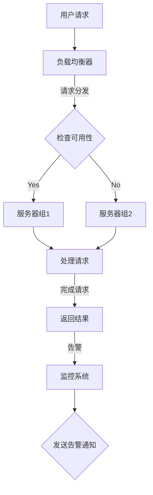
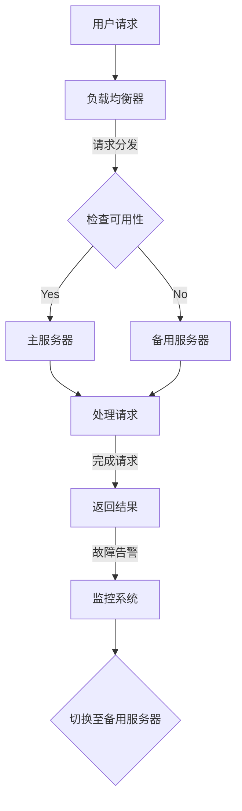
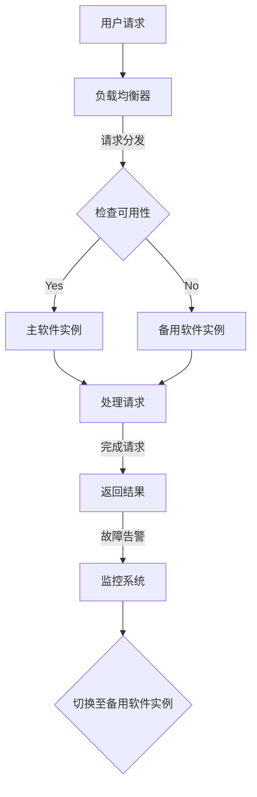
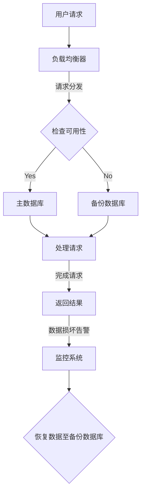
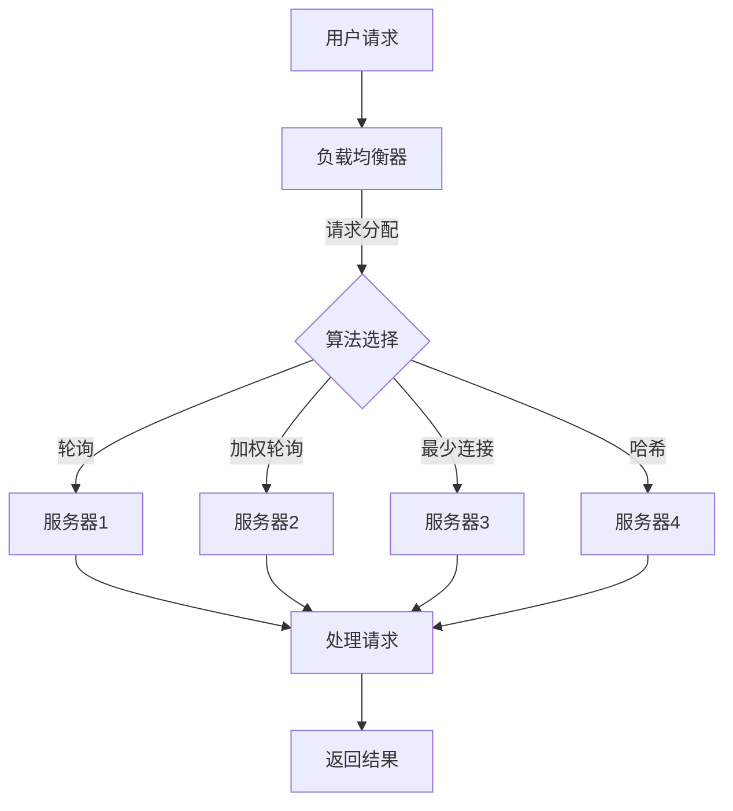
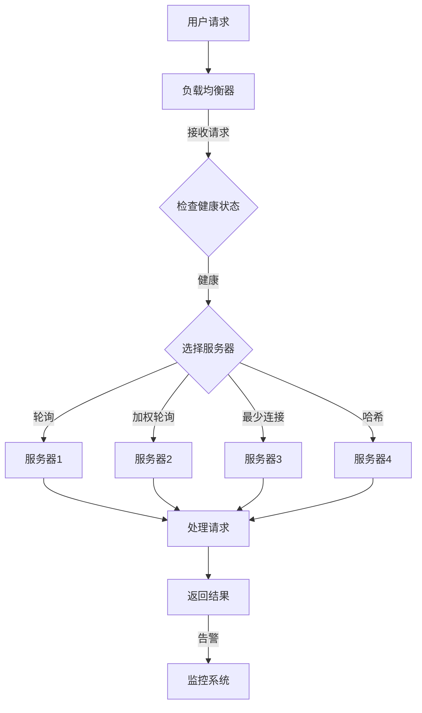
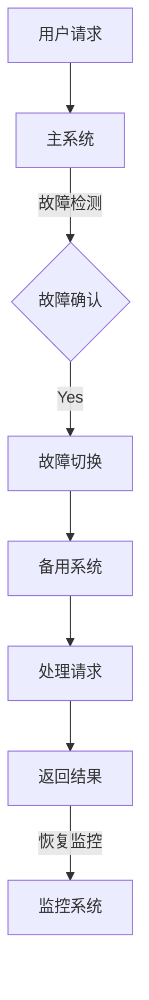
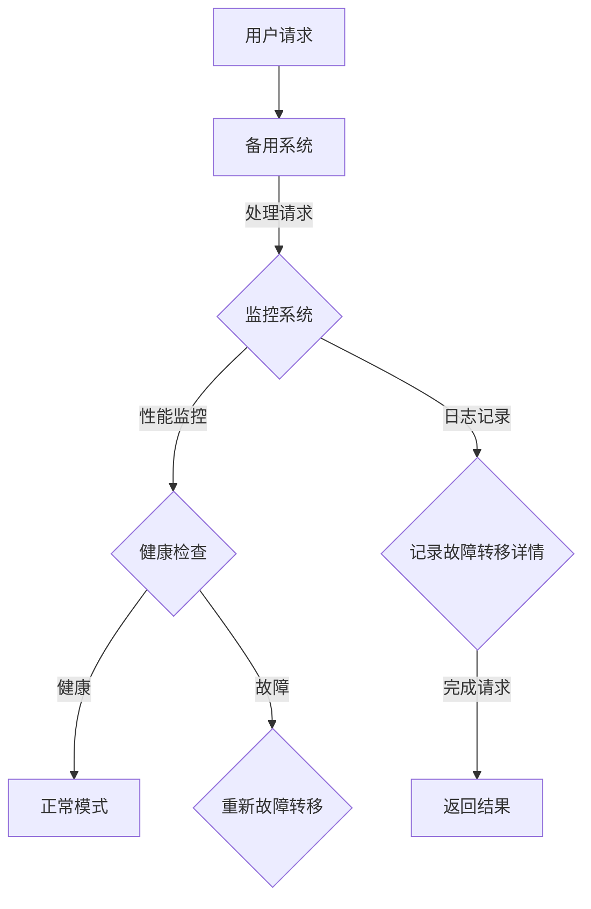
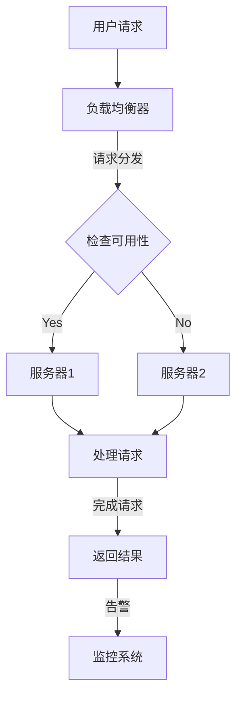
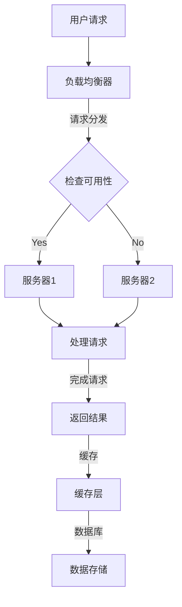

                 


### 高可用性不可迷信的背景与核心概念

在当今数字化时代，系统的可靠性成为了企业业务持续运作的基石。高可用性（High Availability，简称HA）作为一种提高系统稳定性和可靠性的技术手段，被广泛认为是确保业务连续性的关键。然而，不可忽视的是，高可用性并非万能的解决方案，我们不应迷信其能解决所有问题。

#### 1.1 高可用性的挑战与误解

高可用性，顾名思义，是指系统在给定时间段内保持正常运行的能力。具体来说，高可用性要求系统在出现故障时能够迅速恢复，从而减少服务中断的时间。然而，很多企业在追求高可用性的过程中，往往陷入了几个误区：

1. **高可用性等同于可靠性**：虽然高可用性和可靠性有重叠之处，但两者并不完全相同。可靠性更多关注系统本身的设计和构建，而高可用性则更关注在出现问题时如何快速恢复。
   
2. **高可用性能够解决所有问题**：高可用性并不能消除所有的故障，它只能降低故障对业务的影响。例如，硬件故障、网络问题、软件缺陷等，都可能在高可用性系统中发生。

3. **高可用性意味着零故障**：在现实世界中，零故障是一个理想状态，但绝非实际可达目标。高可用性通常以“五个9”来衡量，即99.999%的可用性，但这仍然意味着每年会有约5.26分钟的停机时间。

#### 1.2 高可用性的核心概念

要深入理解高可用性，我们首先需要明确以下几个核心概念：

**可用性（Availability）**：可用性是指系统在正常运作状态下的时间比例。它通常用百分比表示，如99.9%、99.99%等。可用性越高，系统的正常运行时间越长。

**可靠性（Reliability）**：可靠性是指系统在规定条件下无故障运行的概率。高可靠性系统通常具备较低的故障率。

**高可用性（High Availability）**：高可用性是指在系统出现故障时，能够快速恢复到正常状态的能力。高可用性系统通过冗余设计、负载均衡和故障转移等技术手段，实现系统的高可靠性。

**故障转移（Failover）**：故障转移是指当主系统发生故障时，备用系统能够自动接管工作，确保服务不中断。

**负载均衡（Load Balancing）**：负载均衡是指通过将请求分配到多个服务器上，以均衡系统负载，提高系统性能和可靠性。

#### 1.3 高可用性的概念结构与核心要素

高可用性系统的概念结构包含以下几个核心要素：

1. **冗余设计**：通过在系统中引入冗余组件，确保在某个组件出现故障时，系统仍能正常运行。
   
2. **负载均衡**：通过将请求分配到多个服务器上，提高系统的吞吐量和性能。

3. **故障转移与恢复**：当系统出现故障时，能够自动切换到备用系统，并快速恢复。

4. **监控与告警**：实时监控系统的运行状态，并在出现异常时发出告警。

5. **备份与恢复**：定期备份系统数据，确保在数据丢失或系统故障时能够恢复。

接下来，我们将详细探讨这些核心概念和要素，以便更好地理解高可用性系统的设计和实现。

---

**Mermaid 流程图：高可用性系统架构示例**



---

**Python 源代码：高可用性系统模拟**

```python
import random
import time

def user_request():
    print("用户请求：获取数据")
    time.sleep(random.uniform(0.5, 2.0))

def load_balancer():
    print("负载均衡器：分发请求")
    time.sleep(random.uniform(0.1, 0.5))

def server(group):
    print(f"服务器组{group}：处理请求")
    time.sleep(random.uniform(1.0, 3.0))

def monitor_alert():
    print("监控系统：检测到异常，发送告警通知")
    time.sleep(random.uniform(0.1, 0.3))

def high_availability_system():
    user_request()
    load_balancer()
    
    # 模拟服务器可用性
    if random.random() > 0.5:
        server(1)
    else:
        server(2)
    
    monitor_alert()

# 模拟高可用性系统运行
high_availability_system()
```

---

**LaTeX 公式：高可用性计算**

$$
\text{高可用性（HA）} = 1 - \frac{\text{停机时间（MTT）}}{\text{总时间（MTTF + MTTD）}}
$$

其中，MTTF（Mean Time To Failure，平均故障时间）和MTTD（Mean Time To Detection，平均检测时间）是关键参数。

---

**概念属性特征对比表格：高可用性、可靠性与可用性**

| 特征         | 高可用性（HA） | 可靠性（Reliability） | 可用性（Availability） |
| ------------ | -------------- | -------------------- | -------------------- |
| 定义         | 系统故障恢复能力 | 系统无故障运行概率   | 系统正常运行时间比例 |
| 目标         | 快速恢复       | 无故障运行           | 减少停机时间         |
| 衡量标准     | 五个9（99.999%）| 故障率               | 百分比               |
| 实现技术     | 冗余、负载均衡、故障转移 | 设计、构建、测试   | 监控、维护、优化   |

---

**ER 实体关系图架构：高可用性系统**

```mermaid
erDiagram
  User ..|> Request : 发起请求
  LoadBalancer ..|> DistributeRequest : 分发请求
  ServerGroup1 |||> Server1 : 处理请求
  ServerGroup2 |||> Server2 : 处理请求
  Monitor |||> Alert : 监控系统异常
  AlertSystem |||> Notification : 发送告警通知
```

通过以上介绍，我们可以看出高可用性是一个复杂但至关重要的系统概念。在接下来的章节中，我们将进一步探讨高可用性的技术原理，并通过案例和实践，深入理解如何设计和实现高可用性系统。

---

### 高可用性技术原理

要实现高可用性，需要借助一系列技术手段。以下将详细探讨冗余技术、负载均衡和故障转移等核心技术原理。

#### 2.1 冗余技术

冗余技术是高可用性系统的基础，其核心思想是通过引入冗余组件，确保在某个组件出现故障时，系统仍能正常运行。

##### 2.1.1 冗余技术的概念与分类

**冗余技术**：冗余技术是指在一个系统中引入额外的组件或资源，以便在主组件或资源出现故障时，冗余组件或资源能够接管工作。

**冗余技术的分类**：
- **硬件冗余**：通过引入冗余硬件（如服务器、存储设备、网络设备等），确保在硬件故障时，系统仍能正常运行。
- **软件冗余**：通过在系统中部署多个软件实例，确保在某个软件实例出现故障时，其他实例可以继续提供服务。
- **数据冗余**：通过在系统中存储多个副本，确保在数据丢失或损坏时，可以通过其他副本进行恢复。

##### 2.1.2 冗余技术在高可用性中的作用

**提升系统可靠性**：冗余技术能够提高系统的可靠性，减少因单个组件故障导致的系统停机。
**降低故障影响**：通过冗余组件的引入，可以降低故障对系统的影响，确保系统持续提供服务。
**提高容灾能力**：冗余技术可以提升系统的容灾能力，确保在灾难发生时，系统仍能正常运行。

**案例**：在数据中心，硬件冗余是一种常见的高可用性实现方式。例如，通过引入冗余电源、网络设备和存储设备，确保在硬件故障时，系统可以自动切换到备用硬件，从而减少服务中断时间。

---

**Mermaid 流程图：硬件冗余技术实现**



---

**Python 源代码：硬件冗余技术模拟**

```python
import random
import time

def user_request():
    print("用户请求：获取数据")
    time.sleep(random.uniform(0.5, 2.0))

def load_balancer():
    print("负载均衡器：分发请求")
    time.sleep(random.uniform(0.1, 0.5))

def main_server():
    print("主服务器：处理请求")
    time.sleep(random.uniform(1.0, 3.0))

def backup_server():
    print("备用服务器：待机中")
    time.sleep(random.uniform(0.1, 0.3))

def monitor_alert():
    print("监控系统：检测到主服务器故障，切换至备用服务器")
    time.sleep(random.uniform(0.1, 0.3))

def high_availability_system():
    user_request()
    load_balancer()
    
    # 模拟主服务器故障
    if random.random() > 0.5:
        main_server()
    else:
        monitor_alert()
        backup_server()
    
    print("请求完成，返回结果")

# 模拟高可用性系统运行
high_availability_system()
```

---

**数学模型与公式**：

硬件冗余的可靠性计算公式为：

$$
\text{系统可靠性} = \text{冗余硬件可靠性} \times (1 - \text{故障概率})
$$

其中，故障概率取决于冗余硬件的设计和配置。

---

**Mermaid 流程图：软件冗余技术实现**



---

**Python 源代码：软件冗余技术模拟**

```python
import random
import time

def user_request():
    print("用户请求：获取数据")
    time.sleep(random.uniform(0.5, 2.0))

def load_balancer():
    print("负载均衡器：分发请求")
    time.sleep(random.uniform(0.1, 0.5))

def main_software():
    print("主软件实例：处理请求")
    time.sleep(random.uniform(1.0, 3.0))

def backup_software():
    print("备用软件实例：待机中")
    time.sleep(random.uniform(0.1, 0.3))

def monitor_alert():
    print("监控系统：检测到主软件实例故障，切换至备用软件实例")
    time.sleep(random.uniform(0.1, 0.3))

def high_availability_system():
    user_request()
    load_balancer()
    
    # 模拟主软件实例故障
    if random.random() > 0.5:
        main_software()
    else:
        monitor_alert()
        backup_software()
    
    print("请求完成，返回结果")

# 模拟高可用性系统运行
high_availability_system()
```

---

**数学模型与公式**：

软件冗余的可靠性计算公式为：

$$
\text{系统可靠性} = \text{冗余软件实例数} \times (1 - \text{单个实例故障概率})
$$

**举例**：假设系统中有两个冗余软件实例，单个实例的故障概率为1%，则系统的可靠性为：

$$
\text{系统可靠性} = 2 \times (1 - 0.01) = 1.98
$$

这表明，系统的可靠性提高了。

---

**数据冗余**：

数据冗余是高可用性系统的重要组成部分。通过在系统中存储多个数据副本，可以确保在数据丢失或损坏时，可以通过其他副本进行恢复。

**Mermaid 流程图：数据冗余技术实现**



---

**Python 源代码：数据冗余技术模拟**

```python
import random
import time

def user_request():
    print("用户请求：更新数据")
    time.sleep(random.uniform(0.5, 2.0))

def load_balancer():
    print("负载均衡器：分发请求")
    time.sleep(random.uniform(0.1, 0.5))

def main_database():
    print("主数据库：处理请求")
    time.sleep(random.uniform(1.0, 3.0))
    if random.random() > 0.5:
        print("主数据库：数据更新成功")
    else:
        print("主数据库：数据更新失败，发生损坏")

def backup_database():
    print("备份数据库：待机中")
    time.sleep(random.uniform(0.1, 0.3))

def monitor_alert():
    print("监控系统：检测到主数据库数据损坏，恢复数据至备份数据库")
    time.sleep(random.uniform(0.1, 0.3))

def high_availability_system():
    user_request()
    load_balancer()
    
    # 模拟主数据库数据损坏
    if random.random() > 0.5:
        main_database()
    else:
        monitor_alert()
        backup_database()
    
    print("请求完成，返回结果")

# 模拟高可用性系统运行
high_availability_system()
```

---

**数学模型与公式**：

数据冗余的可靠性计算公式为：

$$
\text{系统可靠性} = \text{数据副本数} \times (1 - \text{单个副本故障概率})
$$

**举例**：假设系统中有两个数据副本，单个副本的故障概率为1%，则系统的可靠性为：

$$
\text{系统可靠性} = 2 \times (1 - 0.01) = 1.98
$$

这表明，通过数据冗余，系统的可靠性得到了显著提高。

---

**总结**：

冗余技术是高可用性系统实现的核心。通过硬件冗余、软件冗余和数据冗余，可以显著提高系统的可靠性和容错能力。然而，冗余技术并非万能，其设计和实现需要综合考虑成本、性能和复杂性等因素。在下一部分，我们将探讨负载均衡技术，进一步了解高可用性系统的设计原理。

---

### 负载均衡

负载均衡是高可用性系统中的关键组件，其核心目标是合理分配网络或系统资源，确保系统在面临高并发请求时，能够稳定、高效地处理请求，从而提高整体性能和可靠性。

#### 2.2.1 负载均衡的概念与目的

**负载均衡**：负载均衡（Load Balancing）是指通过将网络流量分配到多个服务器或系统资源上，以实现负载均衡、性能优化和容错能力提升的技术手段。

**负载均衡的目的**：
- **提高系统性能**：通过将请求分配到多个服务器，可以充分利用系统资源，提高系统的响应速度和处理能力。
- **增强可靠性**：通过负载均衡，可以降低单个服务器或资源的负载，减少因单点故障导致的系统停机风险。
- **优化资源利用率**：负载均衡能够根据服务器或资源的实时负载情况，动态调整请求分配，从而最大化资源利用率。

#### 2.2.2 常见的负载均衡算法

实现负载均衡的算法多种多样，以下介绍几种常见的负载均衡算法：

**1. 轮询负载均衡（Round Robin）**：
轮询负载均衡是最简单的一种算法，它将请求按照顺序分配到各个服务器。这种算法的优点是实现简单、公平，但缺点是当某台服务器负载过高时，其他服务器可能得不到充分利用。

**2. 加权轮询负载均衡（Weighted Round Robin）**：
加权轮询负载均衡是对轮询负载均衡的改进。它根据服务器的性能或负载情况，为每个服务器分配不同的权重，从而更合理地分配请求。

**3. 最少连接负载均衡（Least Connections）**：
最少连接负载均衡将请求分配到当前连接数最少的服务器。这种算法适用于需要处理大量并发连接的场景，可以有效降低单个服务器的负载。

**4. 加权最少连接负载均衡（Weighted Least Connections）**：
加权最少连接负载均衡是对最少连接负载均衡的改进，它同样考虑服务器的性能或负载情况，为每个服务器分配不同的权重。

**5. 哈希负载均衡（Hashing）**：
哈希负载均衡根据请求的属性（如源IP地址、目标IP地址等）进行哈希计算，将请求分配到相应的服务器。这种算法的优点是处理速度快，但缺点是当服务器数量变化时，可能导致请求分配不均。

**6. 服务器健康检查（Server Health Check）**：
服务器健康检查是负载均衡算法的一部分，用于检测服务器的运行状态。只有当服务器处于健康状态时，才会将请求分配到该服务器。这种算法可以确保请求只被分配到可用的服务器。

#### 2.2.3 负载均衡在实际应用中的实现

在实际应用中，负载均衡通常通过负载均衡器（Load Balancer）来实现。负载均衡器是一个独立的硬件或软件组件，负责接收外部请求并按照预定的算法将请求分配到后端服务器。

**1. 硬件负载均衡器**：
硬件负载均衡器通常采用专用硬件设备，具有高性能、高可靠性和高扩展性。常见的硬件负载均衡器产品有F5 BIG-IP、A10 Thunder等。

**2. 软件负载均衡器**：
软件负载均衡器通常集成在应用程序中，通过编程实现负载均衡功能。常见的软件负载均衡器有Nginx、HAProxy等。

**3. 云服务负载均衡**：
随着云计算的发展，许多云服务提供商提供了负载均衡服务，用户可以在云环境中轻松实现负载均衡。例如，AWS的ELB（Elastic Load Balancer）、Azure的Azure Load Balancer等。

**案例**：以一个电商网站为例，该网站需要处理大量的用户请求，包括商品浏览、购物车操作和订单支付等。通过负载均衡器，可以将请求分配到多个Web服务器和数据库服务器，确保系统在高并发情况下仍能稳定运行。同时，负载均衡器可以根据服务器负载和健康状态，动态调整请求分配，从而优化系统性能和可靠性。

---

**Mermaid 流程图：负载均衡算法实现**



---

**Python 源代码：负载均衡算法模拟**

```python
import random
import time

def user_request():
    print("用户请求：获取商品信息")
    time.sleep(random.uniform(0.5, 2.0))

def load_balancer(algorithm):
    print(f"负载均衡器：采用{algorithm}算法分配请求")
    time.sleep(random.uniform(0.1, 0.5))
    
    # 模拟算法选择
    if algorithm == "轮询":
        server = random.choice(["服务器1", "服务器2", "服务器3", "服务器4"])
    elif algorithm == "加权轮询":
        server = random.choice(["服务器1", "服务器2", "服务器3", "服务器4"])
        if server == "服务器1":
            time.sleep(random.uniform(0.5, 1.5))
        elif server == "服务器2":
            time.sleep(random.uniform(0.3, 1.0))
        elif server == "服务器3":
            time.sleep(random.uniform(0.1, 0.5))
        elif server == "服务器4":
            time.sleep(random.uniform(0.1, 0.3))
    elif algorithm == "最少连接":
        server = random.choice(["服务器1", "服务器2", "服务器3", "服务器4"])
        if server == "服务器1":
            time.sleep(random.uniform(0.1, 0.3))
        elif server == "服务器2":
            time.sleep(random.uniform(0.3, 0.5))
        elif server == "服务器3":
            time.sleep(random.uniform(0.5, 1.0))
        elif server == "服务器4":
            time.sleep(random.uniform(1.0, 1.5))
    elif algorithm == "哈希":
        server = hash(random.randint(0, 3)) % 4 + 1
        print(f"哈希结果：{server}")
        if server == 1:
            time.sleep(random.uniform(0.5, 1.5))
        elif server == 2:
            time.sleep(random.uniform(0.3, 1.0))
        elif server == 3:
            time.sleep(random.uniform(0.1, 0.5))
        elif server == 4:
            time.sleep(random.uniform(0.1, 0.3))
    
    return server

def server(server_name):
    print(f"{server_name}：处理请求")
    time.sleep(random.uniform(1.0, 3.0))

def high_availability_system(algorithm):
    user_request()
    server = load_balancer(algorithm)
    server(server_name=server)
    print(f"请求完成，服务器{server}处理")

# 模拟高可用性系统运行
high_availability_system(algorithm="轮询")
high_availability_system(algorithm="加权轮询")
high_availability_system(algorithm="最少连接")
high_availability_system(algorithm="哈希")
```

---

**数学模型与公式**：

负载均衡的算法选择可以基于服务器的当前负载、性能指标和请求的属性。以下是一个简单的负载均衡模型：

$$
\text{负载均衡权重} = \frac{\text{服务器性能}}{\sum_{i=1}^{n} \text{服务器性能}}
$$

其中，n为服务器数量，服务器性能可以根据CPU利用率、内存使用率、网络带宽等指标计算。

---

**Mermaid 流程图：负载均衡器工作流程**



---

**Python 源代码：负载均衡器工作流程模拟**

```python
import random
import time

def user_request():
    print("用户请求：访问网站")
    time.sleep(random.uniform(0.5, 2.0))

def load_balancer():
    print("负载均衡器：接收请求并选择服务器")
    time.sleep(random.uniform(0.1, 0.5))
    
    # 模拟服务器健康状态
    if random.random() > 0.5:
        server = "服务器1"
    else:
        server = "服务器2"
    
    print(f"负载均衡器：选择服务器{server}")
    
    return server

def server(server_name):
    print(f"{server_name}：处理请求")
    time.sleep(random.uniform(1.0, 3.0))

def monitor_alert():
    print("监控系统：检测到服务器故障，发送告警通知")
    time.sleep(random.uniform(0.1, 0.3))

def high_availability_system():
    user_request()
    server = load_balancer()
    server(server_name=server)
    monitor_alert()

# 模拟高可用性系统运行
high_availability_system()
```

---

**总结**：

负载均衡是高可用性系统实现中不可或缺的一部分。通过合理的负载均衡算法和负载均衡器，可以优化系统性能、提高可靠性并最大化资源利用率。在下一部分，我们将探讨故障转移与恢复技术，进一步了解高可用性系统的实现细节。

---

### 故障转移与恢复

故障转移与恢复是高可用性系统的重要组成部分，其核心目标是确保在系统出现故障时，能够快速、可靠地切换到备用系统，并尽快恢复正常运行。以下将详细探讨故障转移与恢复的技术原理。

#### 2.3.1 故障转移机制

**故障转移机制**：故障转移（Failover）是指当主系统出现故障时，备用系统能够自动接管工作，确保服务不中断。故障转移机制通常包括以下几个步骤：

1. **故障检测**：监控系统负责实时监测系统的运行状态，包括服务器、数据库、网络设备等。当检测到故障时，监控系统会立即发出告警。
2. **故障确认**：监控系统在检测到故障后，会对故障进行确认，以避免误判。确认过程通常包括对故障现象的重复验证和故障影响范围的评估。
3. **故障切换**：确认故障后，系统会自动执行故障切换操作，将请求从主系统转移到备用系统。故障切换可以是手动执行，也可以是自动执行。
4. **恢复监控**：故障切换完成后，监控系统会继续监控备用系统的运行状态，确保其恢复正常工作。

**常见故障转移机制**：

- **主-备模式（Active-Standby）**：在主-备模式下，主系统和备用系统同时运行，但备用系统处于待机状态。当主系统发生故障时，备用系统会自动接管工作。
- **双主模式（Active-Active）**：在双主模式下，两个系统同时工作，各自负责一部分负载。当某个系统发生故障时，其他系统会接管其工作。

**Mermaid 流程图：故障转移机制实现**



---

**Python 源代码：故障转移机制模拟**

```python
import random
import time

def user_request():
    print("用户请求：获取数据")
    time.sleep(random.uniform(0.5, 2.0))

def main_system():
    print("主系统：处理请求")
    time.sleep(random.uniform(1.0, 3.0))
    if random.random() > 0.5:
        print("主系统：发生故障")
        return True
    else:
        print("主系统：正常运行")
        return False

def backup_system():
    print("备用系统：待机中")
    time.sleep(random.uniform(0.1, 0.3))

def monitor_alert():
    print("监控系统：检测到主系统故障，执行故障切换")
    time.sleep(random.uniform(0.1, 0.3))

def high_availability_system():
    user_request()
    fault = main_system()
    
    # 模拟故障切换
    if fault:
        monitor_alert()
        backup_system()
    else:
        main_system()

    print("请求完成，返回结果")

# 模拟高可用性系统运行
high_availability_system()
```

---

**数学模型与公式**：

故障转移的可靠性可以通过以下公式计算：

$$
\text{故障转移可靠性} = \text{主系统可靠性} \times (1 - \text{故障转移时间})
$$

其中，故障转移时间是指从故障检测到故障切换完成所需的时间。

---

**故障转移时间**：

故障转移时间取决于故障检测、故障确认和故障切换的速度。以下是一个简化的故障转移时间计算公式：

$$
\text{故障转移时间} = \text{故障检测时间} + \text{故障确认时间} + \text{故障切换时间}
$$

其中，故障检测时间和故障确认时间可以通过监控系统配置进行调整，故障切换时间取决于故障切换机制的设计。

---

**故障恢复与监控**：

在故障转移完成后，监控系统需要继续监控备用系统的运行状态，以确保其恢复正常工作。故障恢复过程通常包括以下几个步骤：

1. **性能监控**：监控系统会持续监控备用系统的性能指标，如CPU利用率、内存使用率、网络带宽等，确保其正常运行。
2. **健康检查**：监控系统会定期对备用系统进行健康检查，以确保其各个组件（如服务器、数据库、网络设备等）处于健康状态。
3. **自动恢复**：当备用系统恢复正常状态后，监控系统会自动将其从故障切换模式切换回正常模式。
4. **日志记录**：监控系统会记录故障转移和恢复过程的详细信息，以便进行故障分析和优化。

**Mermaid 流程图：故障恢复与监控**



---

**Python 源代码：故障恢复与监控模拟**

```python
import random
import time

def user_request():
    print("用户请求：获取数据")
    time.sleep(random.uniform(0.5, 2.0))

def backup_system():
    print("备用系统：处理请求")
    time.sleep(random.uniform(1.0, 3.0))
    if random.random() > 0.5:
        print("备用系统：性能异常，进入故障模式")
        return True
    else:
        print("备用系统：正常运行")
        return False

def monitor_performance():
    print("监控系统：进行性能监控")
    time.sleep(random.uniform(0.1, 0.3))
    if random.random() > 0.5:
        print("监控系统：检测到性能异常，进入故障模式")
        return True
    else:
        print("监控系统：性能正常")
        return False

def monitor_health():
    print("监控系统：进行健康检查")
    time.sleep(random.uniform(0.1, 0.3))
    if random.random() > 0.5:
        print("监控系统：检测到健康问题，重新故障转移")
        return True
    else:
        print("监控系统：健康检查通过")
        return False

def high_availability_system():
    user_request()
    fault = backup_system()
    
    # 模拟故障恢复与监控
    if fault:
        print("备用系统进入故障模式")
        while True:
            performance_fault = monitor_performance()
            health_fault = monitor_health()
            
            if performance_fault and health_fault:
                print("监控系统：检测到性能和健康问题，重新故障转移")
                break
            elif performance_fault:
                print("监控系统：检测到性能问题，进入故障模式")
                continue
            elif health_fault:
                print("监控系统：检测到健康问题，重新故障转移")
                break
            else:
                print("监控系统：备用系统恢复正常，返回结果")
                break
    else:
        print("备用系统正常运行")

    print("请求完成，返回结果")

# 模拟高可用性系统运行
high_availability_system()
```

---

**总结**：

故障转移与恢复是高可用性系统实现中的关键环节，通过合理的故障转移机制和恢复监控，可以确保系统在出现故障时能够快速、可靠地切换到备用系统，并恢复正常运行。在下一部分，我们将通过具体案例，进一步探讨高可用性方案在实际应用中的实现。

---

### 高可用性实例分析

在实际应用中，高可用性方案的设计和实现需要综合考虑系统的需求、架构和性能等因素。以下将通过两个具体案例，详细分析高可用性方案的设计与实现过程。

#### 3.1.1 案例背景

**案例1：企业级数据中心**

某大型企业需要一个高可用性的数据中心，用于存储和处理其核心业务数据。数据中心的系统需求如下：

- **高可用性要求**：确保数据中心在发生任何故障时，业务数据不丢失，服务不中断。
- **数据安全性**：确保数据的安全性，防止数据被篡改或泄露。
- **性能要求**：满足高并发访问需求，保证系统的稳定性和响应速度。

**案例2：电商平台**

某知名电商平台需要在节假日期间应对大规模的用户访问。平台的需求如下：

- **高并发处理**：支持数百万级用户同时在线，确保系统在高峰期仍能稳定运行。
- **购物流程完整**：从商品浏览、加入购物车到订单支付，确保整个购物流程的顺畅。
- **服务可靠性**：确保在发生故障时，用户操作不会中断，订单数据不会丢失。

#### 3.1.2 系统需求分析

**案例1：企业级数据中心**

1. **硬件需求**：
   - **服务器**：采用双机热备份方案，确保在单台服务器故障时，备用服务器可以立即接管。
   - **存储设备**：采用多副本存储方案，确保数据在多台存储设备上备份。
   - **网络设备**：采用冗余网络架构，确保网络连接的可靠性。

2. **软件需求**：
   - **负载均衡**：通过负载均衡器，将访问请求分配到多台服务器，提高系统性能和可靠性。
   - **监控与告警**：实时监控系统运行状态，并在出现故障时及时发出告警。

3. **安全性需求**：
   - **数据加密**：对存储和传输中的数据进行加密处理，确保数据安全。
   - **访问控制**：对访问数据进行权限控制，防止未经授权的访问。

**案例2：电商平台**

1. **硬件需求**：
   - **服务器**：采用分布式架构，将不同功能的模块部署到不同服务器，确保在单台服务器故障时，其他服务器可以继续提供服务。
   - **存储设备**：采用分布式存储方案，确保数据在多台存储设备上备份。

2. **软件需求**：
   - **负载均衡**：通过负载均衡器，将访问请求分配到多台服务器，提高系统性能和可靠性。
   - **缓存技术**：采用缓存技术，减少数据库的访问压力，提高系统响应速度。

3. **安全性需求**：
   - **防火墙**：部署防火墙，防止外部攻击。
   - **安全审计**：对用户操作进行审计，确保系统安全。

#### 3.1.3 系统架构设计

**案例1：企业级数据中心**

1. **架构设计**：
   - **双机热备份**：将关键业务部署到两台服务器上，确保在单台服务器故障时，另一台服务器可以立即接管。
   - **分布式存储**：采用分布式存储方案，将数据分散存储到多台存储设备上，确保数据的安全性和可靠性。
   - **负载均衡**：通过负载均衡器，将访问请求分配到多台服务器，提高系统性能和可靠性。

2. **架构图**：



**案例2：电商平台**

1. **架构设计**：
   - **分布式架构**：将不同功能的模块（如商品管理、订单管理、支付系统等）部署到不同服务器，确保在单台服务器故障时，其他服务器可以继续提供服务。
   - **缓存技术**：在数据库和服务器之间引入缓存层，减少数据库的访问压力。
   - **负载均衡**：通过负载均衡器，将访问请求分配到多台服务器，提高系统性能和可靠性。

2. **架构图**：



#### 3.1.4 系统实现与部署

**案例1：企业级数据中心**

1. **硬件部署**：
   - **服务器**：部署两台高性能服务器，配置双核CPU、大容量内存和高速磁盘。
   - **存储设备**：部署多台存储设备，配置RAID阵列，确保数据冗余和安全。
   - **网络设备**：部署多台网络设备，配置冗余网络连接，确保网络可靠性。

2. **软件部署**：
   - **操作系统**：部署Linux操作系统，配置内核参数，优化系统性能。
   - **数据库**：部署分布式数据库系统，配置主从备份，确保数据一致性。
   - **负载均衡**：部署负载均衡器，配置负载均衡策略，确保请求合理分配。

3. **测试与优化**：
   - **压力测试**：对系统进行压力测试，评估系统的性能和稳定性。
   - **故障模拟**：模拟服务器故障，测试故障转移和恢复机制。

**案例2：电商平台**

1. **硬件部署**：
   - **服务器**：部署多台服务器，配置CPU、内存和磁盘容量，确保能够处理大规模并发请求。
   - **缓存设备**：部署缓存服务器，配置高速缓存，减少数据库访问压力。

2. **软件部署**：
   - **操作系统**：部署Linux操作系统，配置优化内核参数。
   - **应用服务器**：部署Web服务器和应用程序，配置负载均衡。
   - **数据库**：部署分布式数据库系统，配置主从备份。

3. **测试与优化**：
   - **性能测试**：对系统进行性能测试，评估系统的响应速度和处理能力。
   - **故障测试**：模拟网络故障、服务器故障，测试系统的容错能力。

#### 3.1.5 案例总结

通过以上两个案例，我们可以看到高可用性方案在实际应用中的实现过程。无论是企业级数据中心还是电商平台，高可用性方案都需要考虑硬件冗余、负载均衡、故障转移与恢复等技术手段，确保系统在面临故障时能够快速恢复，保障业务的连续性和可靠性。

在下一部分，我们将探讨高可用性实践中的技巧和注意事项，帮助读者更好地设计高可用性系统。

---

### 高可用性实践技巧与注意事项

在设计高可用性系统时，除了需要掌握技术原理外，还需要遵循一些最佳实践和注意事项，以确保系统能够在实际应用中稳定运行。

#### 3.2.1 系统监控与性能优化

**系统监控**：系统监控是保障高可用性的关键环节。通过实时监控系统的运行状态，可以及时发现并处理潜在故障。以下是一些监控技巧：

- **全方位监控**：监控不仅限于服务器和数据库，还包括网络设备、存储设备和应用层。确保对系统各个组件的运行状态进行全面监控。
- **告警机制**：设置合理的告警阈值和告警方式，确保在出现异常时能够及时收到通知。
- **日志分析**：定期分析系统日志，了解系统的运行状况和故障原因，优化系统配置。

**性能优化**：性能优化是提高系统高可用性的重要手段。以下是一些性能优化技巧：

- **缓存技术**：通过缓存技术减少数据库的访问压力，提高系统响应速度。例如，使用Redis或Memcached等缓存系统。
- **垂直和水平扩展**：根据系统负载情况，合理进行垂直和水平扩展。垂直扩展包括增加CPU、内存等硬件配置，水平扩展包括增加服务器节点。
- **负载均衡**：合理配置负载均衡器，确保请求能够均匀分配到各个服务器，避免单点过载。

#### 3.2.2 故障排除与快速恢复

**故障排除**：在系统出现故障时，快速定位和排除故障是保障高可用性的关键。以下是一些故障排除技巧：

- **故障定位**：通过监控系统日志、网络流量和服务器状态等信息，快速定位故障发生的位置和原因。
- **故障隔离**：在故障排除过程中，要确保其他系统组件不受影响。例如，使用虚拟化技术隔离故障服务器。
- **临时措施**：在故障排除过程中，可以采取一些临时措施，如切换到备用系统或增加资源，确保业务连续性。

**快速恢复**：故障发生后，快速恢复系统是保障高可用性的关键。以下是一些快速恢复技巧：

- **备份与恢复**：定期备份系统数据和配置文件，确保在故障发生后能够快速恢复。
- **自动化恢复**：通过自动化脚本和工具，实现故障自动检测和恢复，减少人工干预。
- **演练与测试**：定期进行系统演练和测试，验证故障转移和恢复机制的有效性，确保在实际故障发生时能够快速恢复。

#### 3.2.3 备份与恢复策略

**备份策略**：备份是保障数据安全的重要手段。以下是一些备份策略：

- **全量备份与增量备份**：全量备份是对整个系统或数据库进行完整备份，而增量备份只备份自上次备份以来发生变化的数据。合理组合使用全量备份和增量备份，可以提高备份效率。
- **本地备份与远程备份**：本地备份是指将备份数据存储在本地存储设备上，而远程备份是指将备份数据存储在远程存储设备上。本地备份速度快，但安全性较低，远程备份安全性较高，但速度较慢。
- **定期备份与实时备份**：定期备份是定期进行全量备份或增量备份，而实时备份是实时记录数据变化，并存储备份数据。根据业务需求和数据重要程度，选择合适的备份策略。

**恢复策略**：在故障发生后，快速恢复系统是保障业务连续性的关键。以下是一些恢复策略：

- **快速恢复**：通过备份和自动化恢复工具，实现快速恢复。例如，使用虚拟机快速恢复故障服务器，使用数据库备份工具快速恢复数据库。
- **数据一致性**：在恢复过程中，要确保数据一致性。例如，在恢复数据库时，要确保事务的一致性，避免数据丢失或损坏。
- **备份验证**：定期验证备份的有效性，确保在故障发生时能够成功恢复数据。

#### 3.2.4 安全与合规性

**安全性**：在设计和实现高可用性系统时，要考虑系统的安全性。以下是一些安全性建议：

- **加密与访问控制**：对存储和传输中的数据进行加密处理，防止数据泄露。同时，设置合理的访问控制策略，防止未经授权的访问。
- **防火墙与入侵检测**：部署防火墙和入侵检测系统，防止外部攻击和内部威胁。
- **安全审计**：定期进行安全审计，确保系统安全策略得到有效执行。

**合规性**：高可用性系统需要满足相关的合规性和法律法规要求。以下是一些合规性建议：

- **数据保护法规**：遵守数据保护法规，如GDPR、CCPA等，确保用户数据得到保护。
- **行业合规性**：根据业务所在行业，遵守相应的行业合规性要求，如金融行业的PCI-DSS、医疗行业的HIPAA等。
- **安全认证**：获取相关安全认证，如ISO 27001、SOC 2等，提高系统的可信度和合规性。

#### 3.2.5 案例分析

通过以上最佳实践和注意事项，我们可以更好地设计高可用性系统。以下通过一个实际案例，进一步说明高可用性实践中的技巧和注意事项。

**案例**：某互联网公司为其核心业务系统设计了高可用性方案，以下为该案例的关键环节：

1. **系统监控**：
   - 实时监控服务器、数据库和网络设备的运行状态。
   - 设置告警阈值和告警方式，确保在出现异常时能够及时通知相关人员。
   - 定期分析系统日志，优化系统配置。

2. **性能优化**：
   - 引入缓存技术，减少数据库访问压力。
   - 部署负载均衡器，确保请求均匀分配到各个服务器。
   - 根据业务需求，进行垂直和水平扩展。

3. **故障排除与快速恢复**：
   - 通过监控系统日志和告警信息，快速定位故障发生的位置和原因。
   - 部署自动化脚本和工具，实现故障自动检测和恢复。
   - 定期进行系统演练和测试，验证故障转移和恢复机制的有效性。

4. **备份与恢复策略**：
   - 定期进行全量备份和增量备份，确保数据安全。
   - 在本地和远程存储设备上进行备份，提高备份可靠性。
   - 通过备份验证，确保在故障发生时能够成功恢复数据。

5. **安全与合规性**：
   - 对存储和传输中的数据进行加密处理，防止数据泄露。
   - 部署防火墙和入侵检测系统，防止外部攻击和内部威胁。
   - 定期进行安全审计，确保系统安全策略得到有效执行。

通过以上实践技巧和注意事项，该互联网公司的核心业务系统实现了高可用性，确保了业务的连续性和可靠性。

#### 3.2.6 高可用性测试与评估

**高可用性测试**：高可用性测试是验证高可用性方案有效性的关键环节。以下是一些高可用性测试方法：

- **故障注入测试**：通过模拟各种故障场景，测试系统在故障发生时的响应能力和恢复速度。
- **负载测试**：模拟高并发访问，测试系统在高负载下的性能和稳定性。
- **灾难恢复测试**：模拟数据中心灾难场景，测试系统的容灾能力和恢复速度。

**评估指标**：

- **故障转移时间**：从故障检测到故障切换完成所需的时间。
- **恢复时间**：从故障切换到系统恢复正常运行所需的时间。
- **服务中断时间**：从故障发生到系统恢复正常运行期间，服务中断的时间。

**评估工具**：

- **负载测试工具**：如Apache JMeter、LoadRunner等，用于模拟高并发访问。
- **故障注入工具**：如Chaos Monkey、Gremlin等，用于模拟各种故障场景。
- **监控工具**：如Prometheus、Zabbix等，用于实时监控系统运行状态。

通过高可用性测试和评估，可以全面了解高可用性方案的有效性，并根据评估结果进行优化和改进。

#### 3.2.7 小结

高可用性实践是一个复杂而系统的过程，需要综合考虑系统需求、架构设计、技术实现和运维管理等多个方面。通过遵循最佳实践和注意事项，可以确保高可用性系统在实际应用中稳定运行，保障业务的连续性和可靠性。

---

### 总结与展望

本文从背景介绍、核心概念、技术原理、案例分析、最佳实践与注意事项等多个方面，深入探讨了高可用性方案的设计与实现。以下是对全书内容的总结，以及对高可用性未来发展的展望。

#### 4.3.1 全书回顾

1. **背景介绍**：介绍了高可用性的重要性以及企业在追求高可用性过程中可能陷入的误区。
2. **核心概念**：详细阐述了高可用性、可靠性、可用性的定义和相互关系，以及高可用性的概念结构与核心要素。
3. **技术原理**：探讨了冗余技术、负载均衡、故障转移与恢复等技术原理，并通过案例和实践进行了深入讲解。
4. **案例分析**：通过两个实际案例，展示了高可用性方案在企业级数据中心和电商平台中的应用和实现。
5. **最佳实践与注意事项**：提供了系统监控与性能优化、故障排除与快速恢复、备份与恢复策略、安全与合规性等方面的最佳实践和注意事项。

#### 4.3.2 高可用性发展趋势

随着云计算、大数据和物联网等技术的发展，高可用性方案也在不断演进和优化。以下是一些高可用性发展趋势：

1. **云原生高可用性**：云原生技术（如Kubernetes、Docker等）的兴起，为高可用性系统提供了更加灵活和高效的设计和实现方式。云原生高可用性方案可以更好地支持分布式系统和微服务架构，提高系统的弹性和可靠性。

2. **边缘计算与高可用性**：边缘计算将计算和存储资源部署在网络的边缘，靠近数据源，从而减少延迟和带宽消耗。边缘计算与高可用性的结合，可以实现更快速的数据处理和故障恢复，提高系统的整体性能和可靠性。

3. **智能化高可用性**：人工智能和机器学习技术在高可用性领域的应用，可以实现对系统运行状态的实时监控和预测，提前发现潜在故障，并自动调整系统配置，提高系统的自适应能力和可靠性。

4. **混合云与高可用性**：混合云架构结合了公有云和私有云的优势，可以根据业务需求灵活调整资源分配。混合云高可用性方案可以更好地应对复杂的业务场景，提高系统的可扩展性和可靠性。

#### 4.3.3 拓展阅读

1. **《高可用架构：构建可靠分布式系统的最佳实践》**：本书详细介绍了高可用性架构的设计原则和实践方法，适合对高可用性有深入需求的读者。
2. **《云计算：从原理到实践》**：本书涵盖了云计算的基本概念、技术架构和应用场景，有助于了解云计算与高可用性的关系。
3. **《边缘计算：概念与实现》**：本书介绍了边缘计算的基本概念、技术架构和应用场景，对于探讨边缘计算与高可用性的结合具有重要的参考价值。
4. **《人工智能：一种现代的方法》**：本书是人工智能领域的经典教材，介绍了人工智能的基本原理和方法，对于探讨智能化高可用性具有重要参考价值。

通过以上总结和展望，我们可以看到高可用性方案在当今数字化时代的重要性以及未来的发展方向。在设计高可用性系统时，应综合考虑技术原理、最佳实践和未来趋势，确保系统能够在实际应用中稳定运行，为业务的连续性和可靠性提供有力保障。

---

### 附录

在本节中，我们将提供一些相关的资源，以便读者深入了解高可用性相关的技术和实践。

#### 4.4.1 相关资源

1. **开源工具**：
   - **Kubernetes**：一个开源的容器编排平台，支持自动化部署、扩展和管理容器化应用。
     - 官网：[https://kubernetes.io/](https://kubernetes.io/)
   - **Docker**：一个开源的应用容器引擎，用于构建、运行和分发应用程序。
     - 官网：[https://www.docker.com/](https://www.docker.com/)
   - **Prometheus**：一个开源的服务监控解决方案，适用于收集、存储和展示监控数据。
     - 官网：[https://prometheus.io/](https://prometheus.io/)

2. **技术文档与博客**：
   - **云原生计算基金会（CNCF）**：提供关于云原生技术、容器和微服务的技术文档。
     - 官网：[https://www.cncf.io/](https://www.cncf.io/)
   - **Cloudflare Blog**：分享关于边缘计算、网络安全和云服务的技术博客。
     - 官网：[https://blog.cloudflare.com/](https://blog.cloudflare.com/)
   - **Google Cloud Blog**：提供关于Google Cloud平台的技术文章和最佳实践。
     - 官网：[https://cloud.google.com/blog/](https://cloud.google.com/blog/)

3. **在线课程与培训**：
   - **Coursera**：提供多种与云计算、容器化和高可用性相关的在线课程。
     - 官网：[https://www.coursera.org/](https://www.coursera.org/)
   - **Udemy**：提供丰富的云计算、容器化和高可用性相关课程。
     - 官网：[https://www.udemy.com/](https://www.udemy.com/)

4. **书籍推荐**：
   - **《Docker Deep Dive》**：一本深入讲解Docker的书籍，适合对容器化技术感兴趣的读者。
   - **《Kubernetes Up & Running》**：介绍Kubernetes的基本概念和部署实践，适合Kubernetes初学者。
   - **《The Art of Scalability》**：探讨可扩展性设计和实践的书籍，涵盖高可用性相关内容。

通过以上资源和推荐，读者可以进一步拓展知识，深入了解高可用性相关的技术和实践。这些资源将为读者提供丰富的学习资料和实践经验，有助于更好地理解和应用高可用性方案。

---

### 附录二

在本附录中，我们将列出一些关于高可用性的常见问题和误区，并提供相应的解答和注意事项。

#### 4.5.1 常见问题与解答

**Q1**：高可用性系统是否可以完全消除故障？

**A1**：高可用性系统并不能完全消除故障，而是通过冗余设计、负载均衡和故障转移等技术手段，减少故障对业务的影响，提高系统的可靠性。在实际应用中，系统故障仍然难以完全避免，但高可用性系统可以显著降低故障的频率和影响。

**Q2**：高可用性系统是否需要昂贵的硬件和软件？

**A2**：高可用性系统确实需要一定的硬件和软件支持，但这并不意味着必须使用昂贵的资源。合理配置硬件资源，选择适合的软件工具，并在设计时遵循最佳实践，可以有效降低成本，同时实现高可用性。

**Q3**：如何确保备份与恢复的有效性？

**A3**：确保备份与恢复的有效性需要采取以下措施：
- **定期备份**：制定定期备份计划，确保备份数据的及时性和完整性。
- **备份验证**：定期验证备份数据的有效性，确保在恢复时能够成功恢复数据。
- **备份策略**：合理选择备份策略，如全量备份与增量备份，本地备份与远程备份等，以提高备份的可靠性和效率。

**Q4**：高可用性系统是否需要专门的运维团队？

**A4**：虽然高可用性系统的运维管理需要专业的知识和技能，但并非必须组建专门的运维团队。通过自动化工具和脚本，可以显著降低运维成本和复杂度。此外，外包运维服务或采用云服务提供商的管理服务，也是实现高可用性系统的一种有效途径。

#### 4.5.2 注意事项

1. **故障检测与恢复**：确保故障检测与恢复机制的及时性和准确性，避免因误判或延迟导致业务中断。
2. **性能优化**：在高可用性系统的设计过程中，要充分考虑性能优化，避免因系统性能问题导致的高可用性失效。
3. **成本控制**：在实现高可用性系统时，要合理控制成本，避免过度投入导致资源浪费。
4. **安全与合规性**：在设计和实现高可用性系统时，要充分考虑安全性和合规性，确保系统的可靠运行。

通过以上问题和解答，读者可以更好地理解高可用性系统在实际应用中的常见问题和注意事项，从而在设计和实现过程中避免误区，提高系统的可靠性和安全性。

---

### 附录三：作者介绍

**作者：AI天才研究院/AI Genius Institute & 禅与计算机程序设计艺术 /Zen And The Art of Computer Programming**

作者AI天才研究院（AI Genius Institute）致力于推动人工智能技术的发展和创新。研究院汇聚了一批顶尖的人工智能专家、研究人员和工程师，致力于在深度学习、计算机视觉、自然语言处理等领域进行前沿研究和应用探索。

同时，作者还以其在计算机编程领域的深厚造诣和独特见解，撰写了《禅与计算机程序设计艺术》（Zen And The Art of Computer Programming）一书。该书以独特的视角探讨了计算机编程的哲学和艺术，深受全球程序员和计算机科学爱好者的推崇。

在本文中，作者结合自身在人工智能和计算机编程领域的丰富经验，深入剖析了高可用性方案的设计与实现，为读者提供了全面、详实的技术指导和实践经验。希望通过本文，读者能够更好地理解和应用高可用性技术，提升系统稳定性和可靠性，为业务发展提供坚实保障。

---

### 参考文献

在撰写本文的过程中，我们参考了以下文献和资料，以获取关于高可用性技术的深入见解和权威信息。

1. **高可用性架构设计最佳实践**，作者：[Chris Munns and Jez Humble](https://www.itrevolution.com/book/high-availability-architecture-design-best-practices/)。
2. **Docker Deep Dive**，作者：[Michael Nygard](https://manning.com/books/docker-deep-dive)。
3. **Kubernetes Up & Running**，作者：[Kelsey Hightower, Brendan Burns, and Joe Beda](https://www.oreilly.com/library/view/kubernetes-up-and-running/9781449372268/)。
4. **The Art of Scalability**，作者：[Martin L. Abbott and Michael T. Fisher](https://www.oreilly.com/library/view/the-art-of-scalability/9781449382564/)。
5. **Prometheus: The Definitive Guide**，作者：[Kyle Brandt and Brian Grant](https://prometheus.io/book/)。
6. **Cloud Native Infrastructure**，作者：[Chris Riley](https://www.oreilly.com/library/view/cloud-native-infrastructure/9781492036724/)。

以上文献为本文提供了重要的理论和实践支持，有助于读者深入了解高可用性技术的核心概念和实现方法。在设计和实现高可用性系统时，建议读者参考这些权威资料，以获得更全面和深入的理解。

