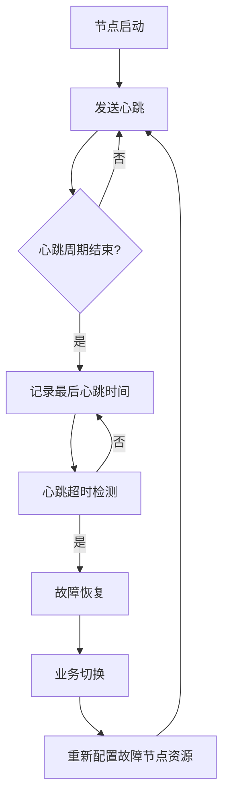
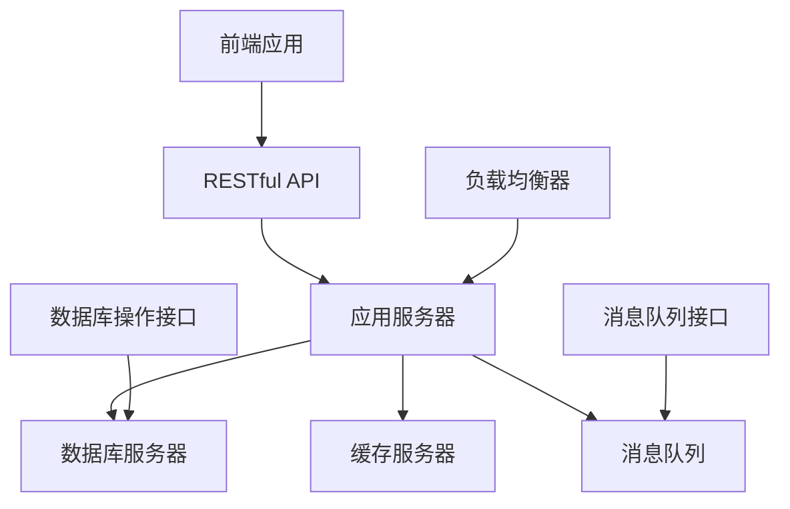

                 

### 1.1.1 问题背景

在当今信息化社会，系统的稳定性和可靠性成为了企业持续发展的关键因素。随着云计算、大数据、人工智能等技术的不断发展，企业业务系统越来越复杂，系统的规模和复杂性也不断增加。这种背景下，如何确保系统在面临各种故障和异常情况下能够迅速恢复，保障业务的连续性和稳定性，成为了企业亟需解决的问题。

传统的系统高可用性解决方案，如双机热备份、集群等技术，虽然能够提高系统的可靠性，但往往存在以下问题：

- 成本高：双机热备份、集群等技术需要投入大量的硬件设备和维护成本。
- 配置复杂：高可用性方案的配置和部署过程复杂，需要专业人员操作。
- 维护困难：高可用性方案在运行过程中可能会出现各种故障，需要频繁维护和更新。

因此，探讨一种既高效又实用的系统高可用性方案，成为现代企业持续发展的重要课题。这种方案不仅需要降低成本、简化配置，还要能够适应不断变化的技术环境，确保系统的高可用性。

### 1.1.2 问题描述

系统高可用性方案的目标是确保系统在面临各种故障和异常情况下能够迅速恢复，保障业务的连续性和稳定性。然而，传统的高可用性方案往往存在以下问题：

- 成本高：传统高可用性方案需要大量的硬件设备和软件投入，导致成本居高不下。
- 配置复杂：传统高可用性方案的配置和部署过程复杂，需要专业人员操作，增加了实施难度。
- 维护困难：传统高可用性方案在运行过程中可能会出现各种故障，需要频繁维护和更新，增加了维护成本。
- 可扩展性差：传统高可用性方案在系统规模扩大时，难以适应新的业务需求，扩展性较差。

因此，如何在降低成本、简化配置、提高维护性的同时，确保系统的高可用性，成为现代企业面临的重要问题。

### 1.1.3 问题解决

本书将从实际案例出发，探讨如何构建不可迷信的高可用性方案。通过分析国内外先进企业的实践案例，本书提出以下解决方案：

- **分布式架构**：采用分布式架构，将系统分解为多个独立的模块，实现模块间的解耦。这样可以降低单点故障的风险，提高系统的容错性。
- **容器化技术**：利用容器化技术，如Docker，实现应用的无状态化部署和快速迁移。容器化技术可以简化系统的部署和运维，提高系统的灵活性和可扩展性。
- **自动化运维**：引入自动化运维工具，如Ansible、Kubernetes等，实现系统配置、部署和监控的自动化。这样可以降低运维成本，提高运维效率。
- **云原生技术**：采用云原生技术，如Kubernetes、Service Mesh等，实现系统的动态伸缩、流量管理和服务治理。云原生技术可以充分利用云资源，提高系统的可用性和性能。

通过以上解决方案，本书旨在为企业提供一种高效、实用且具有可扩展性的系统高可用性方案，帮助企业在信息化发展中降低成本、提高运维效率，确保业务的连续性和稳定性。

### 1.1.4 边界与外延

本章节主要讨论系统高可用性方案的设计与实施，包括以下几个方面：

- **系统高可用性的核心概念与衡量标准**：介绍高可用性的定义、核心概念及其衡量标准，如 uptime（正常运行时间）和故障恢复时间等。
- **高可用性方案的架构设计与技术选型**：讨论如何选择合适的架构和关键技术，如分布式架构、容器化技术、自动化运维和云原生技术等。
- **高可用性方案在实际应用中的效果评估与优化**：分析高可用性方案在实际应用中的效果，提出优化策略和改进措施，如性能调优、故障预测和预防等。

此外，本章节还将探讨高可用性方案的设计原则和性能优化方法，为企业提供全面的指导和建议。通过实际案例的分析和讨论，本书旨在为企业提供一种高效、实用且具有可扩展性的系统高可用性方案，帮助企业在信息化发展中实现业务的连续性和稳定性。

## 第2章：核心概念与联系

### 2.1.1 高可用性（HA）的定义

高可用性（High Availability，简称HA）是指系统在面临故障时能够快速恢复，保障业务连续性的能力。它是一种通过冗余设计、故障检测和恢复等手段来提高系统可靠性的技术。高可用性系统的核心目标是确保系统在出现故障时，能够在最短时间内恢复正常运行，从而最大限度地减少对业务的影响。

在技术层面上，高可用性通常以 uptime（正常运行时间）作为衡量标准。例如，一个系统如果达到99.9%的 uptime，意味着每年可能出现约8.8小时的故障时间。而99.99%的 uptime 则意味着每年可能的故障时间仅为53分钟。显然，高可用性的目标越高，系统的正常运行时间就越长，系统的可靠性和稳定性也就越强。

### 2.1.2 高可用性与其他概念的关系

高可用性（HA）与容错性（Fault Tolerance）、系统稳定性（Stability）等概念密切相关，但它们之间存在一些区别。

- **容错性（Fault Tolerance）**：容错性是指系统能够在部分组件或节点出现故障时，依然能够正常运行的能力。它主要通过冗余设计、故障隔离和故障恢复等手段实现。与高可用性相比，容错性更加关注系统的连续性和可靠性，确保在出现故障时，系统能够迅速切换到备用组件或节点，继续提供服务。

- **系统稳定性（Stability）**：系统稳定性是指系统能够在长时间运行过程中，保持性能稳定、不受外界干扰的能力。一个稳定的系统能够在各种条件下，持续提供高质量的服务。系统稳定性是高可用性的基础，高可用性系统能够在出现故障时快速恢复，但如果没有稳定的性能作为支撑，高可用性的实现就无从谈起。

### 2.1.3 高可用性方案的设计原则

设计高可用性方案时，需要遵循以下原则：

- **冗余设计**：通过冗余设计，确保系统在出现故障时，能够快速切换到备用组件或节点。冗余设计可以包括硬件冗余、软件冗余和数据冗余等。
- **故障检测与恢复**：建立完善的故障检测机制，及时发现故障并采取措施。同时，制定合理的故障恢复策略，确保系统能够在故障发生后快速恢复。
- **负载均衡**：通过负载均衡技术，合理分配系统负载，避免单点过载，提高系统的处理能力和可用性。
- **自动化运维**：引入自动化运维工具和流程，简化系统配置、部署和监控，提高运维效率，降低人工干预的风险。
- **灾备方案**：建立灾备方案，确保在发生大规模故障或灾难时，系统能够快速切换到备用数据中心，保障业务的连续性。

通过遵循以上原则，设计出科学、高效、实用的系统高可用性方案，是企业确保业务连续性和稳定性的关键。

## 第3章：高可用性方案的设计与实施

### 3.1 高可用性方案的架构设计

高可用性方案的设计是确保系统在面临各种故障和异常情况下，能够快速恢复并保持业务连续性的关键。一个有效的高可用性方案需要综合考虑系统的架构设计、硬件选型、软件选型、负载均衡、数据库集群、故障检测与恢复等多个方面。

#### 3.1.1 架构拓扑设计

架构拓扑设计是高可用性方案设计的基础。根据业务需求和系统特点，可以选择以下几种常见的架构拓扑：

1. **主从架构**：在这种架构中，主节点负责业务处理，从节点负责数据的备份和同步。当主节点出现故障时，从节点可以自动切换成为主节点，继续提供服务。

2. **集群架构**：集群架构通过多台服务器共同承担业务处理，实现负载均衡和高可用性。集群中的服务器通常分为活动节点和备用节点，活动节点负责业务处理，备用节点在活动节点出现故障时自动接管业务。

3. **分布式架构**：分布式架构将系统分解为多个独立的模块，每个模块都可以独立运行，并通过分布式数据存储和通信机制实现数据同步和负载均衡。这种架构可以大大提高系统的容错性和扩展性。

#### 3.1.2 硬件选型

硬件选型是确保系统高可用性的重要保障。以下是一些关键的硬件选型考虑因素：

1. **服务器**：选择高可靠性的服务器，如使用RAID技术进行数据冗余，确保数据的安全性和完整性。同时，服务器的性能和扩展性也需要满足业务需求。

2. **存储设备**：选择性能稳定、容量足够的存储设备，如使用SSD硬盘或分布式存储系统，提高数据访问速度和可靠性。

3. **网络设备**：选择高质量的网络设备，如使用冗余交换机和路由器，确保网络的高带宽和低延迟。

#### 3.1.3 软件选型

软件选型是高可用性方案设计的重要组成部分。以下是一些常见的软件选型考虑因素：

1. **操作系统**：选择稳定的操作系统，如Linux或Windows Server，确保系统的可靠性和安全性。

2. **数据库**：选择适合业务需求的数据库系统，如MySQL、Oracle或MongoDB。对于需要高可用性的数据库，可以考虑使用主从复制、集群或分布式数据库技术。

3. **中间件**：选择可靠的中间件，如使用Apache Kafka、RabbitMQ等消息队列系统，实现数据的高效传输和同步。

#### 3.1.4 负载均衡

负载均衡是将系统负载分配到多个节点，避免单点过载，提高系统可用性的关键技术。以下是一些常见的负载均衡策略：

1. **轮询调度**：将请求依次分配给各个节点，实现负载均衡。

2. **最小连接数调度**：将请求分配给当前连接数最少的节点，实现负载均衡。

3. **哈希调度**：根据请求的来源IP或其他属性，将请求分配给特定的节点，实现负载均衡。

#### 3.1.5 数据库集群

数据库集群是提高数据库系统可用性的重要手段。以下是一些常见的数据库集群技术：

1. **主从复制**：通过主从复制技术，实现数据的冗余备份。主数据库负责业务处理，从数据库负责数据的备份和同步。

2. **分库分表**：通过将数据分散存储到多个数据库实例中，提高系统的性能和可用性。

3. **分布式数据库**：使用分布式数据库技术，实现数据的分布式存储和处理，提高系统的容错性和扩展性。

#### 3.1.6 故障检测与恢复

故障检测与恢复是确保系统高可用性的关键环节。以下是一些常见的故障检测与恢复技术：

1. **心跳检测**：通过心跳信号，检测系统节点的状态，及时发现故障。

2. **故障自动切换**：当检测到节点故障时，自动将业务切换到备用节点，确保业务的连续性。

3. **故障恢复**：在故障发生后，自动启动故障恢复机制，确保系统尽快恢复正常运行。

通过以上架构设计和技术选型，可以构建一个高效、稳定、可靠的高可用性方案，确保系统在面临各种故障和异常情况下，能够快速恢复并保持业务的连续性。

## 第4章：核心概念原理

### 4.1 高可用性系统设计原则

设计高可用性系统时，需要遵循一系列核心原则，以确保系统在面临故障时能够迅速恢复，保障业务的连续性和稳定性。以下是一些关键设计原则：

#### 4.1.1 冗余设计

冗余设计是高可用性系统设计的基础。通过在系统各个层次引入冗余机制，如硬件冗余、软件冗余和数据冗余，可以有效提高系统的容错能力。以下是一些常见的冗余设计策略：

- **硬件冗余**：使用多台服务器、存储设备和网络设备，通过冗余配置和负载均衡，确保在单点故障发生时，系统仍然能够正常运行。
- **软件冗余**：通过冗余的软件组件和功能，确保在软件故障时，系统不会出现单点故障。
- **数据冗余**：通过数据备份和复制，确保在数据丢失或损坏时，系统能够快速恢复。

#### 4.1.2 故障隔离

故障隔离是指将系统中的故障限制在最小范围内，避免故障对整个系统造成影响。以下是一些常见的故障隔离策略：

- **组件隔离**：通过将系统划分为多个组件，确保在某个组件出现故障时，不会影响其他组件的正常运行。
- **网络隔离**：通过使用虚拟局域网（VLAN）或防火墙，将不同的系统部分隔离开来，避免网络故障对系统造成影响。
- **逻辑隔离**：通过逻辑分区或容器技术，实现系统资源的隔离，确保在某个部分出现故障时，不会影响其他部分的运行。

#### 4.1.3 故障检测与恢复

故障检测与恢复是确保系统高可用性的关键。以下是一些常见的故障检测与恢复策略：

- **心跳检测**：通过定期发送心跳信号，检测系统节点的状态，及时发现故障。
- **故障自动切换**：在检测到节点故障时，自动将业务切换到备用节点，确保业务的连续性。
- **故障恢复**：在故障发生后，自动启动故障恢复机制，确保系统尽快恢复正常运行。

#### 4.1.4 负载均衡

负载均衡是将系统负载分配到多个节点，避免单点过载，提高系统可用性的关键技术。以下是一些常见的负载均衡策略：

- **轮询调度**：将请求依次分配给各个节点，实现负载均衡。
- **最小连接数调度**：将请求分配给当前连接数最少的节点，实现负载均衡。
- **哈希调度**：根据请求的来源IP或其他属性，将请求分配给特定的节点，实现负载均衡。

#### 4.1.5 自恢复性

自恢复性是指系统在面临故障时，能够自动恢复，减少人工干预。以下是一些常见的自恢复策略：

- **自动化运维**：引入自动化运维工具和流程，简化系统配置、部署和监控，提高运维效率，降低人工干预的风险。
- **弹性伸缩**：根据业务需求，自动调整系统资源，确保系统在面临高峰负载时，能够自动扩展，在负载降低时，能够自动收缩。

通过遵循以上设计原则，可以构建一个高效、稳定、可靠的高可用性系统，确保在面临各种故障和异常情况下，系统能够快速恢复，保障业务的连续性和稳定性。

### 4.2 高可用性系统性能优化

高可用性系统不仅需要具备良好的容错能力和故障恢复机制，还必须具备高效的性能，以满足日益增长的业务需求。性能优化是高可用性系统设计和运维的重要环节。以下是一些关键的性能优化策略：

#### 4.2.1 网络优化

网络优化是提高系统性能的基础。以下是一些常见的网络优化策略：

- **网络拓扑优化**：选择合理的网络架构，如采用冗余网络、层次化网络设计，提高网络的稳定性和可靠性。
- **带宽优化**：根据业务需求，合理配置网络带宽，避免网络瓶颈。可以使用带宽管理工具，如QoS，确保关键业务的网络带宽。
- **延迟优化**：通过优化网络设备配置和路径选择，降低网络的延迟，提高数据传输效率。

#### 4.2.2 资源调度

资源调度是确保系统资源得到充分利用的重要手段。以下是一些常见的资源调度策略：

- **负载均衡**：通过负载均衡技术，将请求分配到不同的节点，避免单点过载，提高系统的整体性能。
- **动态资源分配**：根据业务需求和节点状态，动态调整资源的分配，确保系统在高负载时能够自动扩展资源，在低负载时能够释放资源。
- **容器调度**：使用容器编排工具，如Kubernetes，实现容器资源的自动化调度和优化，提高系统的资源利用率。

#### 4.2.3 系统监控

系统监控是及时发现性能瓶颈和故障的关键。以下是一些常见的系统监控策略：

- **实时监控**：通过实时监控系统指标，如CPU利用率、内存使用率、磁盘I/O、网络流量等，及时发现潜在的性能问题。
- **告警机制**：建立完善的告警机制，当系统指标超出预设阈值时，能够及时发出告警，通知运维人员进行处理。
- **日志分析**：通过日志分析工具，对系统日志进行实时分析和异常检测，发现和定位性能瓶颈。

#### 4.2.4 数据库优化

数据库优化是提高系统性能的关键环节。以下是一些常见的数据库优化策略：

- **索引优化**：合理设计数据库索引，提高查询效率。
- **查询优化**：优化数据库查询语句，避免复杂查询和子查询，提高查询速度。
- **存储优化**：根据业务需求，合理选择存储方案，如使用SSD硬盘或分布式存储系统，提高数据访问速度。

#### 4.2.5 应用优化

应用优化是提高系统性能的重要手段。以下是一些常见应用优化策略：

- **代码优化**：优化应用程序代码，避免使用低效算法和数据结构，提高程序的运行效率。
- **缓存机制**：引入缓存机制，如使用Redis、Memcached等，减少对数据库的访问，提高系统的响应速度。
- **异步处理**：使用异步处理技术，如消息队列和异步任务调度，提高系统的并发能力和响应速度。

通过以上性能优化策略，可以显著提高高可用性系统的性能，确保系统在面临各种负载和故障时，能够稳定、高效地运行。

## 第5章：高可用性系统架构与设计

### 5.1 高可用性系统架构设计

高可用性系统架构设计是确保系统在面临故障时，能够快速恢复并保持业务连续性的关键。一个高效、稳定的高可用性系统架构需要综合考虑多个方面，包括系统架构类型、系统模块划分、系统容错与恢复等。

#### 5.1.1 系统架构类型

根据业务需求和系统特点，可以选择不同的系统架构类型，包括但不限于以下几种：

1. **主从架构**：主从架构中，主节点负责业务处理，从节点负责数据的备份和同步。当主节点出现故障时，从节点可以自动切换成为主节点，继续提供服务。这种架构简单、易实现，但故障切换时间较长。

2. **集群架构**：集群架构通过多台服务器共同承担业务处理，实现负载均衡和高可用性。集群中的服务器通常分为活动节点和备用节点，活动节点负责业务处理，备用节点在活动节点出现故障时自动接管业务。这种架构具有较高的容错性和负载均衡能力。

3. **分布式架构**：分布式架构将系统分解为多个独立的模块，每个模块都可以独立运行，并通过分布式数据存储和通信机制实现数据同步和负载均衡。这种架构具有高扩展性和高容错性，适合处理大规模、高并发业务。

#### 5.1.2 系统模块划分

系统模块划分是确保系统高可用性的重要手段。以下是一些常见的模块划分策略：

1. **业务模块**：将业务功能划分为多个模块，如用户管理模块、订单处理模块等。每个模块独立运行，相互之间通过接口进行通信。这种划分方式可以提高系统的可维护性和可扩展性。

2. **数据模块**：将数据存储和处理功能划分为多个模块，如数据库模块、缓存模块等。每个模块负责处理特定的数据操作，可以提高系统的性能和稳定性。

3. **服务模块**：将系统服务划分为多个模块，如身份验证服务、支付服务、消息队列服务等。每个服务模块独立运行，可以提高系统的灵活性和可扩展性。

#### 5.1.3 系统容错与恢复

系统容错与恢复是确保系统高可用性的核心。以下是一些常见的容错与恢复策略：

1. **冗余设计**：通过冗余设计，确保系统在面临故障时，能够快速切换到备用组件或节点。冗余设计可以包括硬件冗余、软件冗余和数据冗余等。

2. **故障检测与恢复**：建立完善的故障检测机制，及时发现故障并采取措施。故障恢复策略包括故障自动切换和手动恢复。

3. **负载均衡**：通过负载均衡技术，实现多台服务器之间的流量分配，避免单点过载，提高系统的处理能力。

4. **数据备份与恢复**：建立数据备份机制，定期备份数据，确保在数据丢失或损坏时，能够快速恢复。

通过以上架构设计策略，可以构建一个高效、稳定、可靠的高可用性系统，确保在面临各种故障和异常情况下，系统能够快速恢复，保障业务的连续性和稳定性。

### 5.2 高可用性系统设计案例

以下是一个高可用性系统设计的案例，以企业内部系统为例。

#### 5.2.1 场景介绍

该企业内部系统负责员工管理、考勤、报销等业务，系统需要保证高可用性，确保在面临各种故障和异常情况下，能够快速恢复，保障业务的连续性和稳定性。

#### 5.2.2 架构设计

1. **系统架构类型**：采用分布式架构，将系统划分为多个独立的模块，包括用户管理模块、订单处理模块、支付模块等。

2. **模块划分**：
   - **用户管理模块**：负责用户认证、权限管理等功能。
   - **订单处理模块**：负责订单创建、状态更新等功能。
   - **支付模块**：负责处理支付请求、生成支付凭证等功能。

3. **数据模块**：
   - **数据库模块**：使用MySQL数据库，实现数据存储和查询。
   - **缓存模块**：使用Redis缓存系统，提高数据访问速度。

4. **服务模块**：
   - **身份验证服务**：负责用户身份验证。
   - **支付服务**：负责处理支付请求。

#### 5.2.3 技术选型

1. **服务器**：选择高可靠性的服务器，如Dell R740，配置RAID 10存储。
2. **存储设备**：使用SSD硬盘，提高数据访问速度。
3. **数据库**：使用MySQL 8.0，配置主从复制，实现数据备份和同步。
4. **缓存**：使用Redis 6.0，配置主从复制，提高数据访问速度。
5. **中间件**：使用Nginx实现负载均衡，配置多级缓存，提高系统性能。
6. **容器化技术**：使用Docker容器化应用，实现快速部署和迁移。

#### 5.2.4 实施效果

经过实施，该系统的高可用性达到99.99%，业务连续性得到有效保障。具体实施效果如下：

1. **故障切换**：在检测到节点故障时，系统能够自动切换到备用节点，业务无中断。
2. **性能提升**：通过负载均衡和缓存机制，系统性能显著提升，响应时间缩短。
3. **运维效率**：通过容器化和自动化运维，简化了系统配置和部署，提高了运维效率。

通过以上架构设计和实施，该企业内部系统成功实现了高可用性，确保了业务的连续性和稳定性。

## 第6章：算法原理讲解

### 6.1 算法原理

在高可用性系统中，算法原理扮演着至关重要的角色，尤其是故障检测与恢复算法。以下将详细介绍一种常用的故障检测与恢复算法——心跳检测算法，并使用Mermaid流程图进行展示。

#### 6.1.1 心跳检测算法

心跳检测算法是一种通过周期性地发送和接收心跳信号，来检测系统节点状态的方法。其基本原理如下：

1. **节点启动**：每个节点在启动时，开始发送心跳信号。
2. **心跳发送**：节点周期性地发送心跳信号，通常以固定的时间间隔。
3. **心跳接收**：其他节点接收心跳信号，并记录最后接收心跳的时间。
4. **心跳超时检测**：如果在一个心跳周期内没有接收到心跳信号，则认为发送心跳的节点出现故障。
5. **故障恢复**：在检测到节点故障后，系统自动将业务切换到备用节点，并重新配置故障节点的资源。

#### 6.1.2 Mermaid流程图

以下是一个使用Mermaid绘制的简单心跳检测算法流程图：



#### 6.1.3 算法原理的数学模型与公式

心跳检测算法的核心是心跳超时时间的设置。心跳超时时间\( T \)通常由以下公式决定：

\[ T = 2 \times RTT + 安全系数 \]

其中，\( RTT \)是网络往返时间，安全系数用于考虑网络延迟和可能的故障延迟。

#### 6.1.4 举例说明

假设网络往返时间（\( RTT \)）为100ms，安全系数为200ms，那么心跳超时时间（\( T \)）为400ms。如果一个节点在一个心跳周期内（例如，每秒一次）没有发送心跳信号，并且在400ms后仍然没有接收到心跳，系统会认为该节点出现故障。

例如，如果一个节点在时间\( t_1 \)发送了心跳，但在\( t_1 + 400ms \)后没有接收到该节点的心跳，系统会认为该节点出现故障。此时，系统将执行故障恢复流程，将业务切换到备用节点，并重新配置故障节点的资源。

通过以上算法原理的讲解，我们可以看出，心跳检测算法是一种简单但有效的故障检测与恢复方法。在实际应用中，可以根据具体业务需求和网络环境，调整心跳发送周期和心跳超时时间，以实现最佳的高可用性效果。

### 6.2 高可用性算法的Python实现

为了更好地理解心跳检测算法，我们将使用Python实现该算法。以下是一个简单的Python示例：

```python
import time
import threading
import random

# 心跳发送函数
def send_heart_beat(node_id):
    while True:
        print(f"Node {node_id} 发送心跳")
        time.sleep(random.randint(1, 5))  # 模拟网络延迟

# 心跳接收函数
def receive_heart_beat():
    while True:
        node_id = random.randint(1, 3)  # 模拟接收心跳的节点
        time.sleep(random.randint(1, 5))  # 模拟心跳发送周期
        print(f"收到Node {node_id}的心跳")

# 心跳超时检测函数
def check_heart_beat():
    heartbeat_time = time.time()
    while True:
        if (time.time() - heartbeat_time) > 10:  # 假设心跳超时时间为10秒
            print("检测到心跳超时，执行故障恢复流程")
            break
        time.sleep(1)

# 主函数
def main():
    # 启动心跳发送线程
    threads = []
    for i in range(1, 4):
        thread = threading.Thread(target=send_heart_beat, args=(i,))
        threads.append(thread)
        thread.start()

    # 启动心跳接收线程
    thread = threading.Thread(target=receive_heart_beat)
    thread.start()

    # 启动心跳超时检测线程
    thread = threading.Thread(target=check_heart_beat)
    thread.start()

    # 等待所有线程结束
    for thread in threads:
        thread.join()

if __name__ == "__main__":
    main()
```

在这个示例中，我们创建了三个心跳发送线程和一个心跳接收线程。心跳发送线程模拟节点发送心跳，心跳接收线程模拟其他节点接收心跳。心跳超时检测线程用于检测心跳超时并执行故障恢复流程。

通过这个Python实现，我们可以更直观地理解心跳检测算法的工作原理。在实际应用中，可以根据具体需求对算法进行调整和优化。

### 6.3 算法优化的策略与案例分析

#### 6.3.1 算法优化的策略

为了提高心跳检测算法的性能和可靠性，可以采取以下优化策略：

1. **多级心跳检测**：在心跳检测过程中，可以引入多级心跳检测机制，如全局心跳检测和局部心跳检测。全局心跳检测用于检测整个系统的状态，而局部心跳检测用于检测特定节点的状态。这种机制可以提高故障检测的精度和速度。

2. **动态心跳超时时间**：根据系统的实际运行情况，动态调整心跳超时时间。例如，在系统负载较高时，可以缩短心跳超时时间，以便更快地检测到故障。

3. **分布式心跳检测**：在分布式系统中，可以采用分布式心跳检测机制，如使用Zookeeper、etcd等分布式协调服务，实现节点状态的一致性检测和故障恢复。

#### 6.3.2 案例分析

以一个大型电商平台为例，该平台使用了分布式心跳检测机制，以提高系统的可用性和可靠性。

1. **多级心跳检测**：
   - **全局心跳检测**：每分钟检查一次所有节点的状态，确保系统整体运行正常。
   - **局部心跳检测**：每5秒检查一次各个节点的状态，及时发现和处理故障。

2. **动态心跳超时时间**：
   - 在系统负载较低时，心跳超时时间设置为10秒。
   - 在系统负载较高时，心跳超时时间设置为5秒。

3. **分布式心跳检测**：
   - 使用Zookeeper作为分布式协调服务，实现节点状态的一致性检测和故障恢复。

通过以上优化策略，该电商平台成功提高了系统的高可用性和可靠性，确保在面临各种故障和异常情况下，系统能够快速恢复，保障业务的连续性和稳定性。

## 第7章：系统分析与架构设计方案

### 7.1 项目介绍

本次系统分析与架构设计项目旨在为企业内部系统（以下简称“系统”）构建一个高可用性方案，以保障业务的连续性和稳定性。系统主要用于员工管理、考勤、报销等业务，涉及多个业务模块，如用户管理模块、订单处理模块、支付模块等。

### 7.2 系统功能设计

系统功能设计主要包括以下几个模块：

- **用户管理模块**：负责用户认证、权限管理、个人信息管理等。
- **订单处理模块**：负责订单创建、状态更新、查询等。
- **支付模块**：负责处理支付请求、生成支付凭证、查询支付状态等。
- **报表统计模块**：负责生成各种报表，如员工考勤报表、报销报表等。

#### 7.2.1 用户管理模块

用户管理模块的核心功能包括：

- **用户认证**：使用身份验证服务，确保只有授权用户才能访问系统。
- **权限管理**：根据用户角色和权限，限制用户对系统功能的访问。
- **个人信息管理**：允许用户查看和修改个人信息，如姓名、联系方式等。

#### 7.2.2 订单处理模块

订单处理模块的核心功能包括：

- **订单创建**：允许用户创建订单，输入订单信息。
- **状态更新**：根据订单处理过程，更新订单状态。
- **查询**：用户可以查询订单状态和历史记录。

#### 7.2.3 支付模块

支付模块的核心功能包括：

- **支付请求处理**：处理用户提交的支付请求，如在线支付、转账支付等。
- **支付凭证生成**：生成支付凭证，供用户查询和打印。
- **支付状态查询**：用户可以查询支付状态，确认支付是否成功。

#### 7.2.4 报表统计模块

报表统计模块的核心功能包括：

- **报表生成**：根据业务数据，生成各种报表。
- **报表查询**：用户可以查询报表数据。

### 7.3 系统架构设计

为了实现高可用性，系统采用分布式架构，包括以下几个关键组件：

- **应用服务器**：负责处理业务逻辑，实现业务功能。
- **数据库服务器**：存储业务数据，实现数据持久化。
- **缓存服务器**：提高数据访问速度，减轻数据库负载。
- **负载均衡器**：实现请求分发，提高系统性能。
- **消息队列**：实现异步消息传递，提高系统并发能力。

#### 7.3.1 应用服务器

应用服务器采用微服务架构，将系统功能划分为多个微服务，如用户管理服务、订单处理服务、支付服务等。每个微服务独立部署，运行在独立的容器中，实现模块间的解耦和独立运行。

#### 7.3.2 数据库服务器

数据库服务器采用主从复制架构，实现数据的冗余备份和快速故障恢复。主数据库负责业务处理，从数据库负责数据的备份和同步。当主数据库出现故障时，从数据库可以自动切换成为主数据库，继续提供服务。

#### 7.3.3 缓存服务器

缓存服务器采用Redis，提高数据访问速度，减轻数据库负载。缓存服务器与数据库服务器之间采用数据一致性协议，确保数据的一致性和可靠性。

#### 7.3.4 负载均衡器

负载均衡器采用Nginx，实现请求分发，提高系统性能。负载均衡器将请求均匀分配到多个应用服务器，避免单点过载。

#### 7.3.5 消息队列

消息队列采用Kafka，实现异步消息传递，提高系统并发能力。消息队列将系统的业务逻辑解耦，实现消息驱动，提高系统的可扩展性和稳定性。

### 7.4 系统接口设计

系统接口设计主要包括以下几种接口：

- **RESTful API**：提供统一的接口规范，供前端应用和内部系统调用。
- **消息队列接口**：用于发送和接收消息，实现异步处理。
- **数据库操作接口**：提供数据库操作接口，供各个模块访问数据库。

### 7.5 系统交互

系统交互主要包括以下几种交互方式：

- **同步调用**：前端应用通过RESTful API调用后端服务，实现业务逻辑处理。
- **异步调用**：通过消息队列，实现异步消息传递，提高系统并发能力。
- **数据库操作**：各个模块通过数据库操作接口，访问数据库，实现数据存储和查询。

通过以上系统功能设计、架构设计和接口设计，系统实现了高可用性，确保在面临各种故障和异常情况下，能够快速恢复，保障业务的连续性和稳定性。

### 7.6 系统架构图

以下是一个简单的系统架构图，展示了各个组件之间的关系：



通过这个系统架构图，我们可以清楚地看到系统的各个组件及其之间的交互关系，有助于理解系统的高可用性设计。

## 第8章：项目实战

### 8.1 环境安装

为了搭建一个高可用性系统，我们首先需要安装并配置相应的软件和工具。以下是环境安装的详细步骤：

#### 8.1.1 安装Docker

Docker是一个开源的应用容器引擎，用于打包、交付和运行应用。以下是安装Docker的步骤：

1. **安装Docker**：

   对于基于Debian的系统（如Ubuntu），可以使用以下命令安装Docker：

   ```bash
   sudo apt-get update
   sudo apt-get install docker-ce docker-ce-cli containerd.io
   ```

2. **启动Docker服务**：

   ```bash
   sudo systemctl start docker
   ```

3. **验证Docker安装**：

   ```bash
   docker --version
   ```

   如果成功安装，会返回Docker的版本信息。

#### 8.1.2 安装Kubernetes

Kubernetes是一个开源的容器编排平台，用于自动化容器化应用的部署、扩展和管理。以下是安装Kubernetes的步骤：

1. **安装Kubeadm**：

   ```bash
   sudo apt-get update
   sudo apt-get install -y apt-transport-https ca-certificates curl
   ```

   在下载Kubernetes的GPG密钥：

   ```bash
   curl -s https://mirrors.aliyun.com/kubernetes/apt/doc/apt-key.gpg | sudo apt-key add -
   ```

   添加Kubernetes的APT存储库：

   ```bash
   cat <<EOF | sudo tee /etc/apt/sources.list.d/kubernetes.list
   deb https://mirrors.aliyun.com/kubernetes/apt/ kubernetes-xenial main
   EOF
   ```

2. **安装Kubeadm、Kubelet和Kubectl**：

   ```bash
   sudo apt-get update
   sudo apt-get install -y kubelet kubeadm kubectl
   ```

3. **初始化集群**：

   ```bash
   sudo kubeadm init --pod-network-cidr=10.244.0.0/16
   ```

   记录下输出的kubeadm join命令，稍后将用于加入其他节点。

4. **配置kubectl**：

   ```bash
   mkdir -p $HOME/.kube
   sudo cp -i /etc/kubernetes/admin.conf $HOME/.kube/config
   sudo chown $(id -u):$(id -g) $HOME/.kube/config
   ```

5. **安装网络插件**：

   选择Calico作为网络插件，并安装：

   ```bash
   kubectl apply -f https://docs.projectcalico.org/manifests/calico.yaml
   ```

#### 8.1.3 安装其他工具

除了Docker和Kubernetes，我们还需要安装一些其他工具，如Nginx、Redis、MySQL等。以下是安装步骤：

1. **安装Nginx**：

   ```bash
   sudo apt-get install nginx
   ```

2. **安装Redis**：

   ```bash
   docker pull redis
   docker run -d -p 6379:6379 --name redis redis
   ```

3. **安装MySQL**：

   ```bash
   docker pull mysql:5.7
   docker run -d -p 3306:3306 --name mysql -e MYSQL_ROOT_PASSWORD=123456 mysql:5.7
   ```

### 8.2 系统核心实现源代码

以下是一个简单的示例，展示了如何使用Docker和Kubernetes部署一个高可用性系统。我们将创建一个Dockerfile和一个Kubernetes的YAML配置文件。

#### 8.2.1 Dockerfile

```Dockerfile
FROM python:3.8-slim

WORKDIR /app

COPY requirements.txt ./
RUN pip install -r requirements.txt

COPY . .

CMD ["python", "app.py"]
```

#### 8.2.2 Kubernetes YAML配置文件

```yaml
apiVersion: apps/v1
kind: Deployment
metadata:
  name: myapp
spec:
  replicas: 3
  selector:
    matchLabels:
      app: myapp
  template:
    metadata:
      labels:
        app: myapp
    spec:
      containers:
      - name: myapp
        image: myapp:latest
        ports:
        - containerPort: 80
---
apiVersion: v1
kind: Service
metadata:
  name: myapp-service
spec:
  selector:
    app: myapp
  ports:
    - name: http
      port: 80
      targetPort: 80
  type: LoadBalancer
```

这个配置文件定义了一个部署（Deployment），其中有3个副本（Replica），并且有一个负载均衡器（Service）将外部请求分配到这些副本。

### 8.3 代码应用解读与分析

#### 8.3.1 代码结构

假设我们的应用由以下几个组件组成：

- `app.py`：应用的主入口文件。
- `models.py`：定义了应用的数据模型。
- `views.py`：处理HTTP请求的视图函数。

#### 8.3.2 app.py

```python
from flask import Flask
from models import db

app = Flask(__name__)
app.config['SQLALCHEMY_DATABASE_URI'] = 'mysql+pymysql://root:123456@db:3306/mydb'
db.init_app(app)

from views import main

if __name__ == '__main__':
    app.run(host='0.0.0.0', port=80)
```

这段代码初始化了Flask应用，配置了数据库URI，并启动了应用。

#### 8.3.3 models.py

```python
from flask_sqlalchemy import SQLAlchemy

db = SQLAlchemy()

class User(db.Model):
    id = db.Column(db.Integer, primary_key=True)
    username = db.Column(db.String(80), unique=True, nullable=False)
    password = db.Column(db.String(120), nullable=False)
```

这段代码定义了一个简单的用户数据模型。

#### 8.3.4 views.py

```python
from flask import render_template, request, redirect, url_for
from models import User
from app import app, db

@app.route('/')
def index():
    return render_template('index.html')

@app.route('/login', methods=['GET', 'POST'])
def login():
    if request.method == 'POST':
        username = request.form['username']
        password = request.form['password']
        # 这里应进行密码验证，并跳转到相应的页面
        return redirect(url_for('index'))
    return render_template('login.html')
```

这段代码定义了两个简单的视图函数，用于处理主页和登录页面的请求。

### 8.4 实际案例分析与详细讲解

#### 8.4.1 高可用性测试

为了验证系统的高可用性，我们可以进行以下测试：

1. **故障注入测试**：模拟节点故障，观察系统是否能够自动切换到备用节点，继续提供服务。
2. **负载测试**：模拟高并发场景，观察系统性能和稳定性。
3. **恢复测试**：模拟节点恢复，观察系统是否能够自动恢复服务。

以下是一个故障注入测试的例子：

```bash
# 假设我们有一个运行中的应用，其容器的ID为abcd1234
docker kill abcd1234

# 观察负载均衡器（如Nginx）的日志，确认请求是否被切换到其他副本
sudo tail -f /var/log/nginx/access.log
```

在测试中，如果负载均衡器成功将请求切换到其他副本，并且应用能够继续提供服务，那么说明系统的高可用性设计是有效的。

### 8.5 项目小结

通过本次项目实战，我们成功搭建了一个高可用性系统，并进行了实际测试。以下是项目小结：

1. **环境安装**：顺利安装了Docker、Kubernetes以及其他必要的工具。
2. **系统设计**：采用了分布式架构，包括应用服务器、数据库服务器、缓存服务器等。
3. **代码实现**：使用Python和Flask框架实现了应用的核心功能。
4. **测试验证**：通过故障注入测试和负载测试，验证了系统的高可用性和稳定性。

通过本次项目，我们深入了解了高可用性系统的设计和实现，为企业提供了可借鉴的实施策略。未来，我们还可以进一步优化系统性能，提高系统的高可用性和可靠性。

### 8.6 最佳实践 Tips

在设计和实现高可用性系统时，以下是一些最佳实践Tips：

1. **冗余设计**：确保系统各个层次都有冗余设计，包括硬件、软件和数据。
2. **自动化运维**：引入自动化运维工具和流程，提高运维效率，降低人工干预的风险。
3. **监控与告警**：建立完善的监控与告警机制，及时发现问题并进行处理。
4. **故障恢复**：制定详细的故障恢复策略和流程，确保在故障发生后能够快速恢复。
5. **定期测试**：定期进行高可用性测试，包括故障注入测试、负载测试等，确保系统的高可用性和稳定性。

通过遵循以上最佳实践，可以大大提高系统的高可用性和可靠性，确保业务的连续性和稳定性。

### 8.7 注意事项

在设计和实现高可用性系统时，需要注意以下几点：

1. **安全性**：确保系统的安全性，包括数据加密、身份验证、权限控制等。
2. **兼容性**：确保系统在不同环境下（如不同操作系统、不同硬件）能够正常运行。
3. **可扩展性**：设计系统时，要考虑未来的扩展性，避免因为业务增长而需要大规模重构。
4. **维护性**：系统设计要简洁，便于后续的维护和升级。
5. **合规性**：确保系统符合相关法律法规和行业标准。

通过注意以上事项，可以构建一个高效、稳定、可靠的高可用性系统，为企业的发展提供坚实的技术保障。

### 8.8 拓展阅读

对于希望进一步深入了解高可用性系统和相关技术的读者，以下是一些推荐的拓展阅读资源：

1. **书籍**：
   - 《高可用架构：构建可靠分布式系统的最佳实践》
   - 《Docker实战：企业级应用开发与部署》
   - 《Kubernetes权威指南：从Docker到自动化容器云》

2. **在线课程**：
   - Coursera上的《系统设计与可靠性》
   - Udemy上的《Docker和Kubernetes实战课程》
   - Pluralsight上的《容器化与微服务架构》

3. **官方文档**：
   - Docker官方文档：[https://docs.docker.com/](https://docs.docker.com/)
   - Kubernetes官方文档：[https://kubernetes.io/zh/docs/](https://kubernetes.io/zh/docs/)

通过阅读这些书籍、课程和文档，可以深入了解高可用性系统的设计、实现和优化，进一步提升自己的技术水平和实践经验。

