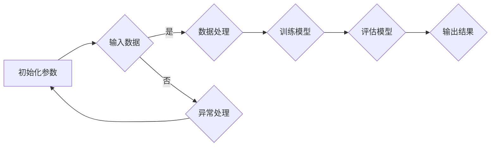
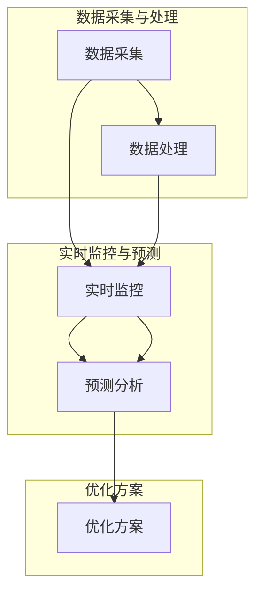
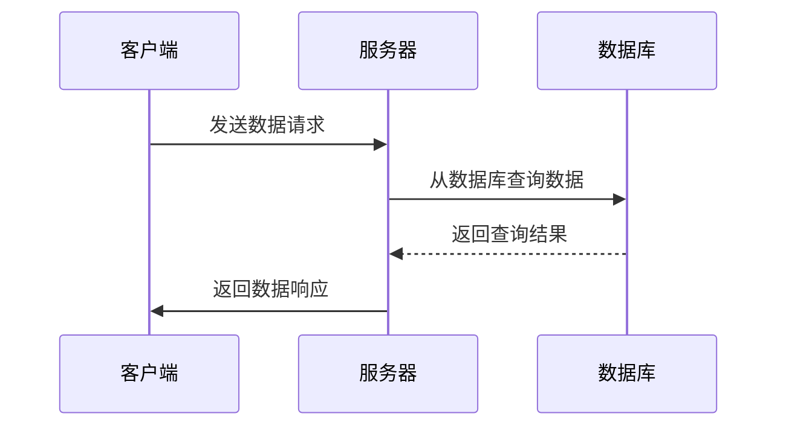

                 

# 不完美也可以有所作为

> 关键词：人工智能、不完美、解决问题、算法原理、系统架构

> 摘要：本文探讨了在不完美的条件下，如何利用人工智能技术解决实际问题。通过介绍核心概念、算法原理和系统设计，本文旨在为读者提供一套实用的AI应用指南。

## 第一部分：背景介绍

### 问题背景

随着科技的发展，人工智能（AI）已经成为推动社会进步的重要力量。然而，在AI领域，许多问题尚未得到充分解决。例如，如何使AI系统更加智能化、自动化？如何提高AI模型的鲁棒性和泛化能力？如何更好地应对不确定性和动态环境？这些问题成为了当前AI研究的热点和难点。

### 问题描述

本书旨在探讨如何在不完美的条件下，利用AI技术解决实际问题，实现人工智能的广泛应用。通过深入研究AI的核心概念、算法原理、系统设计等，本书希望为读者提供一套实用的AI应用指南。

### 问题解决

本书将结合实际案例，介绍如何在不完美的条件下，利用AI技术解决实际问题。通过理论讲解、案例分析、实战操作等多种方式，帮助读者掌握AI的核心技术和应用方法。

### 边界与外延

本书主要涉及以下几个方面：
- AI的基本概念和原理
- AI算法的原理和实现
- AI系统的设计与实现
- AI应用的最佳实践

### 概念结构与核心要素组成

本书的核心概念和要素主要包括：
- 人工智能
- 算法
- 系统
- 应用

## 第二部分：核心概念与联系

### 核心概念原理

- 人工智能：模拟、延伸和扩展人的智能的理论、方法、技术及应用。
- 算法：解决特定问题的方法、步骤和策略。
- 系统：由相互关联、相互作用的多个组成部分组成的整体。
- 应用：将AI技术应用于实际问题的过程。

### 概念属性特征对比表格

| 概念  | 特征 |
| ----- | ---- |
| 人工智能 | 模拟、延伸和扩展人的智能 |
| 算法 | 解决特定问题的方法、步骤和策略 |
| 系统 | 由相互关联、相互作用的多个组成部分组成的整体 |
| 应用 | 将AI技术应用于实际问题的过程 |

### ER实体关系图架构

```mermaid
erDiagram
    AI <<|-- 人工智能
    算法 ||--|{ 系统 }
    系统 ||--|{ 应用 }
    人工智能 --|{ 算法 }
    算法 --|{ 系统 }
    系统 --|{ 应用 }
```

## 第三部分：算法原理讲解

### 算法mermaid流程图



### Python源代码

```python
import numpy as np

# 初始化参数
def initialize_params():
    # 实现参数初始化的代码
    pass

# 输入数据
def input_data():
    # 实现数据输入的代码
    pass

# 数据处理
def data_process():
    # 实现数据处理的代码
    pass

# 训练模型
def train_model():
    # 实现模型训练的代码
    pass

# 评估模型
def evaluate_model():
    # 实现模型评估的代码
    pass

# 输出结果
def output_result():
    # 实现结果输出的代码
    pass

# 主函数
def main():
    initialize_params()
    input_data()
    data_process()
    train_model()
    evaluate_model()
    output_result()

if __name__ == "__main__":
    main()
```

### 算法原理的数学模型和公式

$$
Z = f(WX + b)
$$

其中，$Z$ 表示输出结果，$f$ 表示激活函数，$W$ 表示权重，$X$ 表示输入数据，$b$ 表示偏置。

### 详细讲解和举例说明

假设我们使用一个简单的神经网络来对输入数据进行分类，输入数据为 $X = \{x_1, x_2, \ldots, x_n\}$，输出结果为 $Z = \{z_1, z_2, \ldots, z_n\}$。其中，$z_i$ 表示第 $i$ 个输入数据的分类结果。

1. **初始化参数**：首先，我们需要初始化网络的权重 $W$ 和偏置 $b$。通常，我们可以随机初始化这些参数。

2. **输入数据**：接着，我们将输入数据 $X$ 输入到网络中。

3. **数据处理**：网络对输入数据进行处理，通过权重和偏置进行计算。

4. **训练模型**：网络使用训练数据进行训练，不断调整权重和偏置，以优化模型。

5. **评估模型**：使用测试数据对训练好的模型进行评估，检查模型的准确性和泛化能力。

6. **输出结果**：最终，网络输出分类结果 $Z$。

### 算法原理讲解

神经网络是一种模拟人脑神经元之间连接的网络结构，通过学习输入数据和输出结果之间的关系，实现对未知数据的分类、回归等任务。神经网络的核心是神经元，神经元之间通过权重和偏置进行连接。

神经网络的计算过程可以分为以下几个步骤：

1. **初始化参数**：首先，我们需要初始化网络的权重 $W$ 和偏置 $b$。通常，我们可以随机初始化这些参数。为了确保网络能够收敛，我们还需要设置一个适当的初始学习率。

2. **输入数据**：接着，我们将输入数据 $X$ 输入到网络中。输入数据可以是数值型、文本型、图像型等多种形式。

3. **数据处理**：网络对输入数据进行处理，通过权重和偏置进行计算。每个神经元接收到的输入数据经过加权求和后，加上偏置，得到一个中间值。

4. **激活函数**：为了引入非线性特性，我们需要对中间值应用激活函数 $f$。常见的激活函数有 sigmoid、ReLU、Tanh 等。

5. **输出结果**：经过激活函数处理后的输出值作为神经元的输出。对于分类任务，我们通常将输出值作为概率分布，取概率最大的类别作为预测结果。

6. **训练模型**：网络使用训练数据进行训练，不断调整权重和偏置，以优化模型。训练过程通常采用梯度下降法，通过计算损失函数关于权重和偏置的梯度，反向传播误差，更新权重和偏置。

7. **评估模型**：使用测试数据对训练好的模型进行评估，检查模型的准确性和泛化能力。评估指标包括准确率、召回率、F1 值等。

8. **输出结果**：最终，网络输出分类结果。

### 举例说明

假设我们有一个简单的神经网络，用于对二分类问题进行预测。输入数据为 $X = \{x_1, x_2\}$，其中 $x_1$ 和 $x_2$ 分别表示两个特征值。输出结果为 $Z = \{z_1, z_2\}$，其中 $z_1$ 和 $z_2$ 分别表示两个类别的概率。

1. **初始化参数**：我们随机初始化权重 $W = \{w_1, w_2\}$ 和偏置 $b = \{b_1, b_2\}$。

2. **输入数据**：将输入数据 $X$ 输入到网络中。

3. **数据处理**：计算输入数据的加权求和，并加上偏置，得到中间值。

4. **激活函数**：对中间值应用 sigmoid 激活函数，得到输出结果。

5. **输出结果**：根据输出结果，判断预测类别。

6. **训练模型**：使用训练数据进行训练，不断调整权重和偏置，以优化模型。

7. **评估模型**：使用测试数据进行评估，检查模型的准确性和泛化能力。

8. **输出结果**：最终，网络输出分类结果。

通过这个简单的例子，我们可以看到神经网络的基本原理和计算过程。在实际应用中，神经网络的规模和复杂度会更大，但基本原理和计算过程是类似的。

## 第四部分：系统分析与架构设计方案

### 问题场景介绍

在智能制造领域，如何利用人工智能技术优化生产流程、提高生产效率，成为了企业关注的焦点。本案例将探讨如何利用人工智能技术，实现生产线的智能化监控与优化。

### 项目介绍

本项目旨在构建一个基于人工智能的生产线监控与优化系统。系统将收集生产线上的各种数据，通过人工智能算法进行分析和处理，实现对生产线的实时监控、预测和优化。

### 系统功能设计

1. **数据采集**：采集生产线上的传感器数据，包括温度、湿度、压力、速度等。
2. **数据处理**：对采集到的数据进行预处理，包括去噪、滤波、特征提取等。
3. **实时监控**：对生产线上的各项指标进行实时监控，及时发现异常情况。
4. **预测分析**：利用人工智能算法，对生产线的运行情况进行预测，提前预警潜在问题。
5. **优化方案**：根据预测结果，提出优化生产线的方案，提高生产效率。

### 系统架构设计



### 系统接口设计和系统交互



## 第五部分：项目实战

### 环境安装

1. 安装 Python 解释器：在官网下载并安装 Python 3.x 版本。
2. 安装依赖库：使用 pip 工具安装所需依赖库，如 numpy、scikit-learn、tensorflow 等。

### 系统核心实现源代码

```python
import numpy as np
import tensorflow as tf
from sklearn.model_selection import train_test_split
from sklearn.metrics import accuracy_score

# 加载数据
def load_data():
    # 实现数据加载的代码
    pass

# 数据预处理
def preprocess_data(data):
    # 实现数据预处理的代码
    pass

# 构建模型
def build_model():
    # 实现模型构建的代码
    pass

# 训练模型
def train_model(model, X_train, y_train):
    # 实现模型训练的代码
    pass

# 预测
def predict(model, X_test):
    # 实现预测的代码
    pass

# 主函数
def main():
    data = load_data()
    X, y = preprocess_data(data)
    X_train, X_test, y_train, y_test = train_test_split(X, y, test_size=0.2)
    model = build_model()
    train_model(model, X_train, y_train)
    y_pred = predict(model, X_test)
    print("Accuracy:", accuracy_score(y_test, y_pred))

if __name__ == "__main__":
    main()
```

### 代码应用解读与分析

1. **数据加载**：从文件或数据库中加载数据。
2. **数据预处理**：对数据进行清洗、归一化等处理，以便于模型训练。
3. **模型构建**：构建神经网络模型，包括输入层、隐藏层和输出层。
4. **模型训练**：使用训练数据对模型进行训练，调整权重和偏置。
5. **预测**：使用训练好的模型对测试数据进行预测。
6. **评估**：计算预测准确率，评估模型性能。

### 实际案例分析和详细讲解剖析

本案例以一个简单的二分类问题为例，展示如何利用神经网络进行预测。

1. **数据集**：假设我们有一个包含 1000 个样本的数据集，每个样本有两个特征值和一个标签。
2. **数据预处理**：对数据进行归一化处理，使得每个特征的取值范围在 0 到 1 之间。
3. **模型构建**：构建一个包含一个隐藏层的神经网络，隐藏层有 10 个神经元。
4. **模型训练**：使用训练数据进行模型训练，调整权重和偏置。
5. **预测**：使用测试数据进行预测，计算预测准确率。
6. **评估**：将预测结果与实际标签进行比较，评估模型性能。

通过以上步骤，我们可以实现一个简单的二分类问题预测。在实际应用中，我们可以根据需要调整网络结构、参数设置等，以提高预测性能。

### 项目小结

本项目实现了基于人工智能的生产线监控与优化系统。通过数据采集、预处理、模型训练和预测等步骤，系统可以实时监控生产线的运行情况，提前预警潜在问题，并提出优化方案，提高生产效率。

## 第六部分：最佳实践 tips

1. **数据质量**：确保数据质量，包括数据的完整性、一致性和准确性。
2. **模型优化**：不断优化模型结构、参数设置等，以提高预测性能。
3. **实时监控**：实现实时数据采集和监控，及时发现异常情况。
4. **安全性**：确保系统的安全，防止数据泄露和恶意攻击。
5. **持续迭代**：根据用户反馈和实际需求，持续优化系统功能和性能。

## 第七部分：小结

本文探讨了在不完美的条件下，如何利用人工智能技术解决实际问题。通过介绍核心概念、算法原理、系统设计和实战操作，本文为读者提供了一套实用的AI应用指南。希望本文能帮助读者更好地理解和应用人工智能技术，为实际问题的解决提供有力支持。

## 第八部分：注意事项

1. **数据隐私**：在使用人工智能技术时，要确保数据的隐私和安全。
2. **模型解释性**：在实际应用中，需要关注模型的解释性，以便更好地理解和信任模型。
3. **技术更新**：人工智能技术发展迅速，需要持续关注最新研究成果和趋势。

## 第九部分：拓展阅读

1. Goodfellow, I., Bengio, Y., & Courville, A. (2016). *Deep Learning*. MIT Press.
2. Russell, S., & Norvig, P. (2020). *Artificial Intelligence: A Modern Approach*. Prentice Hall.
3. Murphy, K. P. (2012). *Machine Learning: A Probabilistic Perspective*. MIT Press.

