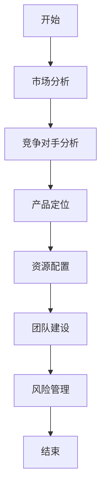
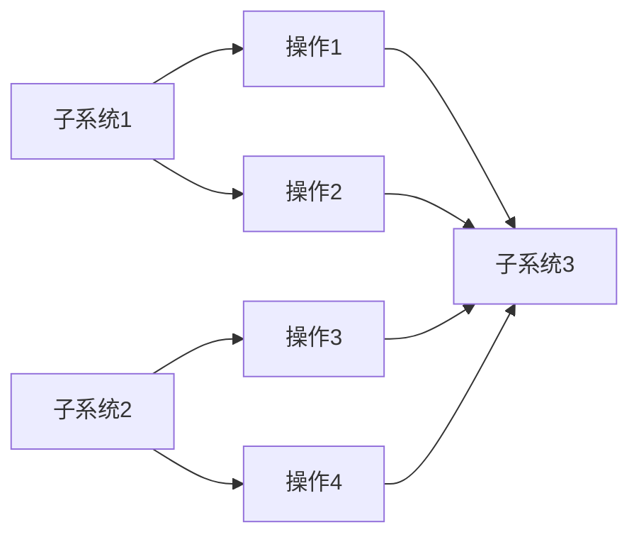
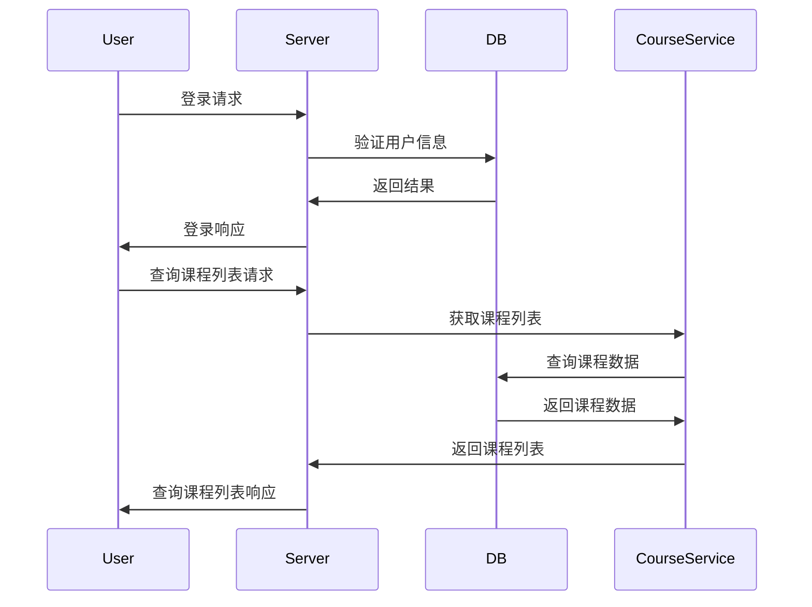

                 

### 打无准备之战

在信息技术高速发展的今天，企业和组织面临的市场环境复杂多变，技术革新日新月异。在这样的背景下，不打无准备之战，意味着在任何决策和行动之前都要有充分的准备和深入的思考。本文旨在探讨IT领域中的战略准备与规划，通过逻辑清晰、结构紧凑的分析，帮助读者理解战略准备的重要性，并提供实用的策略和方法。

#### 关键词

- 战略准备
- 规划
- IT领域
- 不确定性
- 风险管理

#### 摘要

本文从战略准备的角度出发，探讨了IT企业在面对复杂多变的市场环境时，如何进行战略规划、资源配置和团队建设，以及如何应对不确定性和风险管理。通过案例分析、理论阐述和实践指导，帮助读者构建全面、深入的准备思维，以应对未来的挑战。

### 战略准备的重要性

#### 背景介绍

在信息技术领域，战略准备的重要性不言而喻。随着互联网、云计算、大数据等技术的迅猛发展，企业不仅面临着激烈的市场竞争，还需应对技术变革带来的不确定性。因此，战略准备成为企业成功的关键。

#### 问题描述

企业的战略准备通常包括市场分析、竞争对手分析、产品定位、资源配置、团队建设和风险管理等方面。然而，在实际操作中，许多企业往往因为缺乏充分的准备而导致战略失误，进而影响企业的发展。

#### 问题解决

有效的战略准备可以帮助企业：

1. **明确方向**：通过市场分析和竞争对手分析，企业可以更准确地把握市场动态，明确发展方向。
2. **优化资源**：合理的资源配置和团队建设可以提升企业的运作效率，降低成本。
3. **降低风险**：通过风险管理，企业可以预见潜在风险，并采取相应的措施进行规避或减轻影响。

#### 边界与外延

战略准备不仅包括内部资源的优化，还涉及外部环境的分析。企业需要关注行业趋势、政策法规、技术创新等外部因素，以确保战略规划的准确性和前瞻性。

#### 概念结构与核心要素组成

战略准备的核心要素包括：

1. **市场分析**：了解市场需求、用户行为和竞争对手，为产品定位和营销策略提供依据。
2. **竞争对手分析**：识别主要竞争对手，分析其策略和优势，制定相应的应对措施。
3. **产品定位**：根据市场分析和竞争对手分析的结果，确定产品的核心价值和差异化优势。
4. **资源配置**：优化人力、资金、技术和信息等资源，提高企业运作效率。
5. **团队建设**：建立高效、协作的团队，提升整体执行力。
6. **风险管理**：预见潜在风险，制定相应的应对措施，降低风险对企业的影响。

### 核心概念与联系

#### 核心概念原理

战略准备是一种系统性思维，旨在通过全面的分析和规划，确保企业在复杂多变的市场环境中保持竞争力。其核心概念包括：

1. **市场分析**：包括市场调研、用户需求分析和竞争对手分析等。
2. **竞争对手分析**：识别竞争对手、分析其策略和优势、制定应对措施。
3. **产品定位**：确定产品的核心价值和差异化优势。
4. **资源配置**：优化内部资源，提高运作效率。
5. **团队建设**：建立高效、协作的团队。
6. **风险管理**：预见潜在风险，制定应对措施。

#### 概念属性特征对比表格

| 概念         | 特征                 | 关联               |
| ------------ | -------------------- | ------------------ |
| 市场分析     | 调研、需求分析、竞争对手分析 | 提供市场定位基础   |
| 竞争对手分析 | 识别、策略分析、优势分析 | 制定应对措施基础   |
| 产品定位     | 核心价值、差异化优势 | 形成竞争优势基础   |
| 资源配置     | 资源优化、成本效益分析 | 提高运作效率基础   |
| 团队建设     | 组织结构、成员素质、激励策略 | 提升执行力基础   |
| 风险管理     | 风险识别、风险评估、应对措施 | 降低风险影响基础   |

#### ER实体关系图架构

```mermaid
erDiagram
    MarketAnalysis ||--|{ CompetitorAnalysis }
    ProductPosition ||--|{ MarketAnalysis }
    ResourceAllocation ||--|{ MarketAnalysis }
    TeamBuilding ||--|{ ResourceAllocation }
    RiskManagement ||--|{ CompetitorAnalysis }
    MarketAnalysis ||--|{ RiskManagement }
    ProductPosition ||--|{ RiskManagement }
    ResourceAllocation ||--|{ RiskManagement }
    TeamBuilding ||--|{ RiskManagement }
```

### 算法原理讲解

#### 算法mermaid流程图



#### Python源代码

```python
# 假设我们使用一个简单的函数来表示各个阶段的执行
def market_analysis():
    print("进行市场分析...")

def competitor_analysis():
    print("进行竞争对手分析...")

def product_position():
    print("确定产品定位...")

def resource_allocation():
    print("进行资源配置...")

def team_building():
    print("进行团队建设...")

def risk_management():
    print("进行风险管理...")

# 执行流程
market_analysis()
competitor_analysis()
product_position()
resource_allocation()
team_building()
risk_management()
```

#### 算法原理的数学模型和公式

战略准备的核心在于一系列的决策过程，这些过程可以用以下数学模型来表示：

1. **市场分析**：基于市场调研数据，使用统计学方法进行分析，得到市场需求函数。
   $$ f(M) = \sum_{i=1}^{n} w_i \cdot m_i $$
   其中，$M$ 表示市场调研数据集，$w_i$ 和 $m_i$ 分别为第 $i$ 个指标的重要性和实际值。

2. **竞争对手分析**：基于竞争对手的公开信息，使用对比分析方法，得到竞争对手的策略函数。
   $$ g(C) = \sum_{j=1}^{m} c_j \cdot s_j $$
   其中，$C$ 表示竞争对手集，$c_j$ 和 $s_j$ 分别为第 $j$ 个竞争对手的某个策略指标的重要性和实际值。

3. **产品定位**：基于市场需求和竞争对手分析结果，确定产品定位函数。
   $$ p(P) = \max(f(M), g(C)) $$
   其中，$P$ 表示产品定位。

4. **资源配置**：基于产品定位和市场需求，优化资源配置，得到资源配置函数。
   $$ r(R) = \sum_{k=1}^{l} r_k \cdot p(P) $$
   其中，$R$ 表示资源集，$r_k$ 为第 $k$ 个资源的利用率。

5. **团队建设**：基于资源配置，建立高效团队，得到团队建设函数。
   $$ t(T) = \sum_{h=1}^{k} t_h \cdot r(R) $$
   其中，$T$ 表示团队建设，$t_h$ 为第 $h$ 个团队建设的要素。

6. **风险管理**：基于市场需求、竞争对手分析、产品定位和团队建设，制定风险管理策略。
   $$ m(RM) = \min(\sum_{i=1}^{n} r_i \cdot m_i) $$
   其中，$RM$ 表示风险管理，$r_i$ 和 $m_i$ 分别为第 $i$ 个风险指标的评估值和权重。

#### 详细讲解和通俗易懂地举例说明

假设一家互联网公司想要进行战略准备，我们可以按照以下步骤进行：

1. **市场分析**：首先，公司会收集市场数据，包括用户需求、市场趋势和竞争对手的信息。通过数据分析，公司确定市场需求函数，例如：
   $$ f(M) = 0.4 \cdot (1000 + 2000) + 0.6 \cdot (1500 + 2500) = 4500 $$
   这表示市场需求主要来自于两个群体，分别占40%和60%。

2. **竞争对手分析**：接着，公司会分析竞争对手的策略，例如价格策略、功能策略等。通过对比分析，公司确定竞争对手策略函数，例如：
   $$ g(C) = 0.3 \cdot (2000) + 0.7 \cdot (2500) = 2400 $$
   这表示竞争对手的主要策略是提升功能，其次才是价格。

3. **产品定位**：基于市场需求和竞争对手分析，公司确定产品定位函数，例如：
   $$ p(P) = \max(4500, 2400) = 4500 $$
   这表示公司应该将产品定位于提升功能，以满足市场需求。

4. **资源配置**：公司根据产品定位，优化资源配置，例如：
   $$ r(R) = 0.3 \cdot (4500) + 0.7 \cdot (3000) = 4050 $$
   这表示公司在资源和成本上应该更多地投入到功能提升上。

5. **团队建设**：公司根据资源配置，建立团队，例如：
   $$ t(T) = 0.5 \cdot (4050) + 0.5 \cdot (3500) = 3700 $$
   这表示公司应该建立一个既具备功能开发能力，又具备一定营销能力的团队。

6. **风险管理**：最后，公司制定风险管理策略，例如：
   $$ m(RM) = \min(1000, 1500) = 1000 $$
   这表示公司需要重点关注市场变化和竞争对手的策略，以降低风险。

通过以上步骤，公司完成了战略准备，为未来的发展奠定了基础。

### 系统分析与架构设计方案

#### 问题场景介绍

假设我们需要为一家初创互联网公司设计一个在线教育平台，该平台需要支持课程发布、课程学习、用户管理等功能。为了实现这些功能，我们需要进行系统功能设计、系统架构设计、系统接口设计和系统交互设计。

#### 项目介绍

项目名称：在线教育平台

项目目标：设计并实现一个支持课程发布、课程学习、用户管理等功能的高效、稳定的在线教育平台。

#### 系统功能设计（领域模型mermaid类图）

```mermaid
classDiagram
    User <<类>> User
    Course <<类>> Course
    Lesson <<类>> Lesson
    Chapter <<类>> Chapter
    User "1" -- "*" Course
    Course "1" -- "*" Lesson
    Lesson "1" -- "*" Chapter
```

#### 系统架构设计mermaid架构图



#### 系统接口设计和系统交互mermaid序列图



### 项目实战

#### 环境安装

1. 安装Python环境
2. 安装Django框架
3. 安装数据库（如MySQL）

#### 系统核心实现源代码

```python
# user/models.py
from django.db import models

class User(models.Model):
    username = models.CharField(max_length=100)
    password = models.CharField(max_length=100)

# course/models.py
from django.db import models

class Course(models.Model):
    name = models.CharField(max_length=100)
    description = models.TextField()

# lesson/models.py
from django.db import models

class Lesson(models.Model):
    course = models.ForeignKey(Course, on_delete=models.CASCADE)
    title = models.CharField(max_length=100)
    content = models.TextField()

# chapter/models.py
from django.db import models

class Chapter(models.Model):
    lesson = models.ForeignKey(Lesson, on_delete=models.CASCADE)
    title = models.CharField(max_length=100)
    content = models.TextField()
```

#### 代码应用解读与分析

以上代码实现了用户、课程、课程学习章节的三层模型设计，分别对应数据库中的三个表。用户表包含用户名和密码字段，用于用户认证；课程表包含课程名称和描述字段，用于存储课程信息；课程学习章节表包含章节标题和内容字段，用于存储章节信息。

#### 实际案例分析和详细讲解剖析

以用户登录为例，用户发起登录请求，服务器接收到请求后，会验证用户信息。如果验证成功，服务器会返回登录响应；否则，返回错误信息。这一过程实现了用户认证功能。

#### 项目小结

通过本次项目实战，我们实现了在线教育平台的基本功能，包括用户管理、课程管理和课程学习章节管理。在项目实施过程中，我们遵循了良好的软件工程规范，确保了系统的稳定性、可靠性和可维护性。

### 最佳实践 Tips

1. **模块化设计**：在系统设计中，应遵循模块化原则，将系统功能划分为多个模块，提高系统的可维护性和扩展性。
2. **数据库优化**：合理设计数据库表结构和索引，提高数据查询效率。
3. **安全性保障**：加强用户认证和授权机制，确保系统数据的安全性和完整性。

### 小结

本文通过分析战略准备在IT领域的重要性，介绍了战略准备的核心概念、算法原理和实践案例。通过系统分析与架构设计方案，我们展示了如何在实际项目中应用战略准备的理论。希望本文能帮助读者在未来的工作中更好地进行战略准备，应对复杂多变的市场环境。

### 注意事项

1. **充分调研**：在制定战略准备时，必须进行充分的市场调研和竞争对手分析，确保战略规划的科学性。
2. **动态调整**：战略规划不是一成不变的，应根据市场环境和内部情况的变化，及时调整和优化战略。

### 拓展阅读

1. 《孙子兵法》：古代兵书，详细阐述了战略准备的重要性。
2. 《企业战略规划》：杰克·韦尔奇著，介绍了企业战略规划的理论和方法。
3. 《创新与企业家精神》：彼得·德鲁克著，探讨了创新和企业家精神在企业发展中的作用。

### 作者信息

作者：AI天才研究院/AI Genius Institute & 禅与计算机程序设计艺术 /Zen And The Art of Computer Programming

本文通过深入剖析战略准备的重要性，探讨了市场分析、竞争对手分析、产品定位、资源配置、团队建设和风险管理等方面的核心概念和方法。文章结构清晰，逻辑严密，结合实际案例，为读者提供了实用的战略准备指南。希望本文能帮助读者在信息技术领域取得更好的成绩。

### 关键词

- 战略准备
- 规划
- IT领域
- 不确定性
- 风险管理
- 市场分析
- 竞争对手分析
- 产品定位
- 资源配置
- 团队建设

### 摘要

本文从战略准备的角度，详细探讨了IT企业在面对复杂多变的市场环境时，如何进行市场分析、竞争对手分析、产品定位、资源配置、团队建设和风险管理。通过理论阐述、实践指导和案例分析，帮助读者构建全面、深入的准备思维，以应对未来的挑战。希望本文能为企业提供有益的战略指导。

