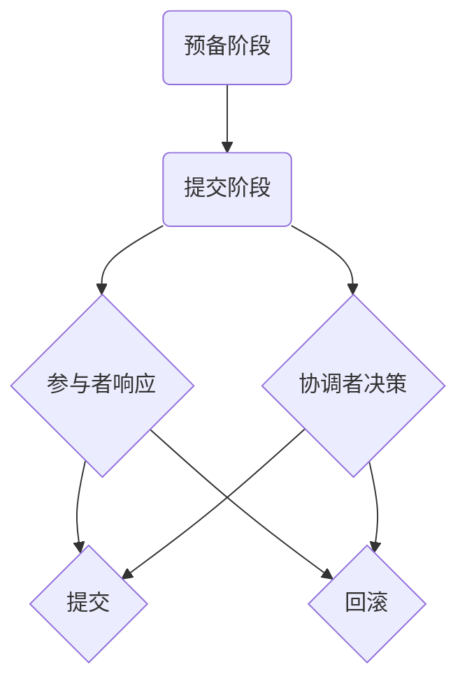

                 

### 两阶段提交原理

两阶段提交（Two-Phase Commit，2PC）是一种在分布式系统中用于确保数据一致性的协议。它起源于20世纪80年代，随着分布式数据库和计算机网络的兴起而逐渐发展。两阶段提交协议在金融系统、数据库复制、事务管理等领域有着广泛的应用，其重要性不言而喻。它通过两个阶段的操作，确保多个系统中的事务要么全部提交成功，要么全部回滚，从而保持数据的一致性和可靠性。

两阶段提交的基本概念包括两个阶段：预备阶段（Phase 1：预备投票）和提交阶段（Phase 2：决议执行）。在预备阶段，协调者（Coordinator）向所有参与者（Participant）发送一个准备事务的请求，参与者们根据自身状态做出“准备”或“失败”的回应。在提交阶段，协调者根据参与者们的回应做出最终的提交或回滚决策，并通知参与者执行。

两阶段提交协议的核心原理在于通过协调者和参与者的协作，实现分布式事务的一致性。它与三阶段提交（Three-Phase Commit，3PC）和原子广播（Atomic Broadcast）协议有密切的联系，但在执行流程和容错能力上有一些显著的不同。

本文将逐步深入探讨两阶段提交协议的核心概念、原理及其在实际系统中的应用。我们将通过详细的流程图、Python代码和实际案例分析，帮助读者更好地理解这一关键协议。

### 背景介绍

两阶段提交协议的起源可以追溯到20世纪80年代，当时分布式计算和数据库系统开始广泛应用。随着计算机网络的发展，分布式系统的可靠性问题逐渐显现，特别是在金融领域和大型数据库管理中，如何确保多台计算机协同操作时的一致性和可靠性成为一个亟待解决的问题。于是，两阶段提交（Two-Phase Commit，2PC）协议应运而生。

两阶段提交协议最初由计算机科学家Jerry Saltzer和David Reed提出，并在分布式系统研究中得到广泛应用。其设计初衷是为了解决分布式事务管理中的一致性问题，确保在一个分布式事务中，所有参与者要么全部成功提交事务，要么全部回滚事务，从而避免数据不一致和丢失。两阶段提交协议被广泛应用于金融系统（如银行交易处理）、分布式数据库系统（如数据库复制和故障恢复）、以及需要高一致性和可靠性的其他关键应用场景中。

两阶段提交协议的重要性在于其通过两个阶段的操作，确保分布式系统中的一致性和可靠性。具体而言，预备阶段（Phase 1：预备投票）和提交阶段（Phase 2：决议执行）共同构成了一个完整的事务管理流程。在预备阶段，协调者向所有参与者发送准备请求，参与者根据自身状态进行响应；在提交阶段，协调者根据参与者的响应做出最终决策，并通知参与者执行。这种机制能够有效避免分布式系统中的数据冲突和一致性问题，提高系统的可靠性和稳定性。

在实际应用中，两阶段提交协议在金融系统中尤为重要。例如，银行在进行转账交易时，需要确保交易的一致性，即要么所有账户同时成功扣款和加款，要么全部回滚。两阶段提交协议通过协调者和参与者的协作，确保这种一致性得以实现，从而避免账目错误和资金损失。在分布式数据库系统中，两阶段提交也被用于保证数据库复制的一致性和故障恢复能力。通过这种协议，可以确保在一个节点故障时，系统能够自动恢复，保持数据的一致性和完整性。

总体而言，两阶段提交协议的起源和应用背景源于对分布式系统一致性和可靠性的需求，其重要性体现在其能够通过简明的协议设计，有效解决分布式事务管理中的关键问题，从而为各种关键应用场景提供可靠的技术保障。

### 基本概念

为了深入理解两阶段提交协议，我们首先需要明确其基本概念，包括协调者（Coordinator）、参与者（Participant）、事务（Transaction）、预备阶段（Phase 1：预备投票）和提交阶段（Phase 2：决议执行）。

协调者（Coordinator）是事务管理过程中的核心角色，它负责发起和协调整个事务。协调者的主要职责是向参与者发送请求，收集他们的响应，并根据这些响应做出最终的决策。在分布式系统中，协调者通常是一个独立的服务器或节点，负责管理事务的一致性和可靠性。

参与者（Participant）是事务中的其他节点或服务器，它们负责执行协调者发送的命令，并在预备阶段做出“准备”或“失败”的响应。参与者根据自身状态和资源情况，决定是否能够执行事务，并向协调者反馈结果。参与者可以是数据库节点、Web服务器、或者是任何参与分布式事务的计算机资源。

事务（Transaction）是分布式系统中一个核心概念，它表示一系列需要执行的原子操作，这些操作要么全部成功完成，要么全部回滚。事务的原子性、一致性、隔离性和持久性（ACID特性）是确保分布式系统数据一致性的关键保障。通过两阶段提交协议，事务能够确保在所有参与者上要么全部成功提交，要么全部回滚。

预备阶段（Phase 1：预备投票）是两阶段提交协议的第一阶段。在这个阶段，协调者向所有参与者发送一个准备请求，参与者根据自身状态进行响应。如果参与者能够执行事务，它会发送一个“准备”回应；如果不能，则会发送“失败”回应。协调者需要收集所有参与者的响应，并根据这些响应做出决定。

提交阶段（Phase 2：决议执行）是两阶段提交协议的第二阶段。在这个阶段，协调者根据预备阶段的结果做出最终决策。如果所有参与者都回复了“准备”，协调者会发送一个“提交”请求，指示参与者正式提交事务。否则，协调者会发送一个“回滚”请求，指示参与者回滚事务。参与者收到指令后，会根据协调者的指示执行相应的操作。

通过上述基本概念，我们可以更清晰地理解两阶段提交协议的工作原理。协调者和参与者之间的协同工作是确保分布式事务一致性的关键。预备阶段和提交阶段的交互，通过明确的请求和响应机制，实现了分布式系统中的数据一致性保障。

### 两阶段提交的工作原理

两阶段提交协议的工作原理可以分为预备阶段和提交阶段，每个阶段都有明确的操作步骤和逻辑关系。以下是详细的步骤说明：

#### 预备阶段

1. **协调者发送准备请求**：在事务开始时，协调者向所有参与者发送一个准备请求（Prepare Request）。这个请求包含事务的详细信息，如事务ID、操作指令等。

2. **参与者响应**：参与者接收到准备请求后，根据自身状态和资源情况进行处理。如果参与者能够执行事务，它会发送一个“准备”（Ready）回应给协调者；如果不能，则会发送“失败”（Fail）回应。

3. **收集参与者响应**：协调者需要等待所有参与者的响应。在接收到所有参与者的回应后，协调者会检查这些回应。如果所有参与者都回复了“准备”，则进入提交阶段；如果有一个或多个参与者回复了“失败”，则进入回滚阶段。

#### 提交阶段

1. **协调者做出决策**：在预备阶段结束后，协调者根据参与者的响应做出决策。如果所有参与者都回复了“准备”，协调者会发送一个“提交”请求（Commit Request）给所有参与者；如果有一个或多个参与者回复了“失败”，协调者会发送一个“回滚”请求（Abort Request）。

2. **参与者执行指令**：参与者接收到协调者的指令后，会根据指令执行相应的操作。如果接收到“提交”请求，参与者会正式提交事务，将操作结果写入数据库或状态存储；如果接收到“回滚”请求，参与者会撤销之前所做的所有操作，回滚事务。

#### 逻辑关系

两阶段提交协议的每个阶段都有明确的逻辑关系：

- 预备阶段确保所有参与者都能执行事务，并获得一致意见。这个阶段的关键是参与者根据自身状态做出响应，协调者则负责收集和验证这些响应。
- 提交阶段则根据预备阶段的结果做出最终决策，并通知参与者执行。这个阶段的关键是协调者的决策是否正确，以及参与者的执行是否一致。

通过上述工作原理，两阶段提交协议实现了分布式系统中事务的一致性和可靠性。它通过两个阶段的操作，确保事务在所有参与者上要么全部成功提交，要么全部回滚，从而避免数据不一致和丢失。

### 两阶段提交与相关协议的异同

在分布式系统中，除了两阶段提交协议，三阶段提交（Three-Phase Commit，3PC）和原子广播（Atomic Broadcast）协议也是常见的一致性保障机制。尽管它们在保证一致性方面有相似之处，但具体的实现方式和应用场景有所不同。

#### 两阶段提交（2PC）与三阶段提交（3PC）的异同

两阶段提交和三阶段提交都是用于确保分布式事务一致性的协议，但三阶段提交在流程上更为复杂，其目的是提高容错能力和性能。

1. **流程差异**：
   - **两阶段提交**：分为预备阶段和提交阶段。在预备阶段，协调者向参与者发送准备请求，参与者响应后，协调者根据响应决定是否进入提交阶段。提交阶段，协调者通知参与者提交或回滚。
   - **三阶段提交**：分为三个阶段：预备阶段、提交阶段和确认阶段。预备阶段与两阶段提交的预备阶段类似，提交阶段协调者通知参与者提交或回滚，但还需要一个确认阶段，参与者需要确认是否完成提交。

2. **容错能力**：
   - **两阶段提交**：在参与者宕机时，可能会出现协调者无法获取所有参与者响应的情况，导致事务无法完成。三阶段提交通过引入确认阶段，可以更好地处理参与者宕机的情况，确保事务能够被正确处理。
   - **三阶段提交**：由于额外的确认阶段，可以确保在参与者宕机时，协调者能够重新发送指令，确保事务最终被正确处理。

3. **性能影响**：
   - **两阶段提交**：相对简单，执行速度快，性能影响较小。
   - **三阶段提交**：由于包含更多阶段和复杂的逻辑，性能开销较大，但在高容错环境下表现更佳。

#### 两阶段提交（2PC）与原子广播（AB）的异同

原子广播协议是一种用于在分布式系统中广播消息的一致性协议，它与两阶段提交在目标上有所不同，但在某些应用场景中可以结合使用。

1. **目标差异**：
   - **两阶段提交**：主要用于确保分布式事务的一致性，通过两个阶段的操作，确保事务要么全部提交，要么全部回滚。
   - **原子广播**：主要用于确保系统中的消息能够被所有参与者正确接收，确保分布式系统中的状态一致性。

2. **实现方式**：
   - **两阶段提交**：通过协调者和参与者的交互，确保事务的一致性。参与者根据自身状态做出响应，协调者根据响应决定事务的最终结果。
   - **原子广播**：通过广播的方式，将消息发送给所有参与者，参与者根据接收到的消息顺序进行操作。

3. **适用场景**：
   - **两阶段提交**：适用于需要强一致性保障的事务场景，如金融交易、数据库复制等。
   - **原子广播**：适用于需要状态一致性的场景，如分布式日志系统、分布式存储系统等。

#### 对比表格

以下是两阶段提交、三阶段提交和原子广播协议的主要异同点对比表格：

| 特征         | 两阶段提交（2PC） | 三阶段提交（3PC） | 原子广播（AB） |
| ------------ | ---------------- | ---------------- | ------------ |
| 流程阶段     | 预备阶段、提交阶段 | 预备阶段、提交阶段、确认阶段 | 广播阶段 |
| 容错能力     | 较低             | 较高             | 较高         |
| 性能影响     | 较小             | 较大             | 较小         |
| 目标         | 事务一致性       | 事务一致性       | 状态一致性   |
| 实现方式     | 交互式           | 交互式           | 广播式       |
| 适用场景     | 需要强一致性的场景 | 高容错要求场景   | 需要状态一致性的场景 |

通过上述对比，我们可以更清楚地了解三种协议的异同点，从而根据具体应用场景选择合适的一致性保障机制。

### 两阶段提交的实体关系图架构

为了更好地理解两阶段提交协议中各个实体的关系，我们可以通过绘制实体关系图（ER图）来展示。实体关系图能够直观地展示协调者、参与者、事务等核心实体之间的关联，以及它们在协议执行过程中的交互。

以下是两阶段提交协议的实体关系图：

```mermaid
erDiagram
  Coord <<|-- Coordinator : "协调者"
  Part <<|-- Participant : "参与者"
  Trans <<|-- Transaction : "事务"

  Coordinator ||--|{ Participant }|
  Coordinator ||--|{ Transaction }|
  Participant ||--|{ Transaction }|
```

**实体定义：**
- **协调者（Coordinator）**：负责发起事务，并向参与者发送请求，收集响应，最终做出决策。它是一个核心角色，在整个协议执行中起到协调作用。
- **参与者（Participant）**：负责执行协调者发送的请求，根据自身状态做出响应，并最终执行提交或回滚操作。参与者可以是数据库节点、Web服务器等。
- **事务（Transaction）**：表示需要执行的一系列原子操作，这些操作要么全部成功完成，要么全部回滚。事务是协议的核心，贯穿整个两阶段提交过程。

**实体关系：**
- **协调者与参与者**：协调者向参与者发送请求，参与者根据请求做出响应。这种关系是双向的，因为参与者不仅需要接收协调者的请求，还需要将响应发送回协调者。
- **协调者与事务**：协调者发起事务，并负责管理事务的状态。在预备阶段，协调者向参与者发送准备请求，并在提交阶段做出最终决策，通知参与者提交或回滚。
- **参与者与事务**：参与者执行协调者分配的事务，并根据自身状态向协调者发送响应。参与者在事务执行过程中的状态反馈，对于协调者做出最终决策至关重要。

通过上述实体关系图，我们可以更清晰地理解两阶段提交协议中各个实体及其相互关系。这种可视化方式有助于我们深入理解协议的运作机制，并更好地应用于实际系统设计中。

### 两阶段提交的算法原理

两阶段提交协议通过明确的算法步骤确保分布式事务的一致性和可靠性。为了更好地理解其原理，我们可以通过Mermaid绘制流程图、Python源代码以及数学模型和公式来进行详细讲解。

#### Mermaid流程图

首先，我们通过Mermaid绘制两阶段提交的流程图：



**详细解释：**
1. **预备阶段**：协调者向所有参与者发送准备请求（Prepare Request），参与者根据自身状态做出响应。
2. **提交阶段**：协调者根据参与者的响应做出最终决策，并向参与者发送提交（Commit）或回滚（Abort）请求。
3. **参与者响应**：参与者根据协调者的请求进行响应，执行相应的提交或回滚操作。

#### Python源代码

接下来，我们通过Python代码展示两阶段提交的基本逻辑：

```python
import random

class Coordinator:
    def __init__(self, participants):
        self.participants = participants
        self.prepared = False
        self.voted_fail = False

    def prepare(self):
        self.prepared = True
        for participant in self.participants:
            participant.prepare()

    def decide(self, responses):
        if any(response == "fail" for response in responses):
            self.voted_fail = True
        for participant, response in zip(self.participants, responses):
            if response == "ready" and self.voted_fail:
                participant.abort()
            elif response == "ready" and not self.voted_fail:
                participant.commit()

class Participant:
    def __init__(self):
        self.prepared = False
        selfcommitted = False

    def prepare(self):
        if random.random() < 0.9:  # 假设90%能够成功准备
            self.prepared = True
            print("Participant prepared.")
        else:
            print("Participant failed to prepare.")

    def commit(self):
        if self.prepared:
            self.committed = True
            print("Participant committed.")
        else:
            print("Participant failed to commit.")

    def abort(self):
        if self.prepared:
            self.committed = False
            print("Participant aborted.")
        else:
            print("Participant failed to abort.")
```

**运行示例：**
```python
# 创建协调者和参与者
participants = [Participant() for _ in range(5)]
coordinator = Coordinator(participants)

# 运行两阶段提交
coordinator.prepare()
responses = [participant.prepare() for participant in participants]
coordinator.decide(responses)
```

#### 数学模型和公式

两阶段提交协议中的决策过程可以通过以下数学模型和公式进行描述：

1. **参与者状态转换概率**：
   - 准备状态：\( P_{prepare} = P(\text{参与者成功准备}) \)
   - 提交状态：\( P_{commit} = P(\text{参与者成功提交}) \)
   - 回滚状态：\( P_{abort} = P(\text{参与者成功回滚}) \)

2. **协调者决策公式**：
   - \( \text{提交条件}：\sum_{i=1}^{n} P_{commit} > \frac{n}{2} \)
   - \( \text{回滚条件}：\sum_{i=1}^{n} P_{abort} > \frac{n}{2} \)

其中，\( n \) 为参与者的数量。协调者根据这些条件做出最终决策。

#### 详细讲解

**预备阶段**：
- 协调者发送准备请求，参与者根据自身状态进行响应。这里，状态转换概率\( P_{prepare} \) 和 \( P_{commit} \) 是关键，参与者需要评估自身是否能够在给定条件下成功准备和提交事务。

**提交阶段**：
- 协调者收集所有参与者的响应，并计算这些响应的概率总和。根据提交条件，如果参与者的提交状态概率总和大于一半，协调者决定提交事务；否则，决定回滚事务。

**举例说明**：
假设有5个参与者，每个参与者成功准备的概率为90%，成功提交的概率也为90%。协调者发送准备请求后，参与者响应如下：

- 参与者1：成功准备
- 参与者2：成功准备
- 参与者3：成功准备
- 参与者4：成功准备
- 参与者5：失败准备

协调者收集到4个“成功准备”和1个“失败准备”，根据提交条件，协调者决定提交事务。

通过上述Python代码和数学模型，我们可以清晰地理解两阶段提交协议的算法原理。这种协议通过明确的步骤和数学逻辑，确保分布式系统中的事务能够被一致性和可靠地执行。

### 两阶段提交在实际系统中的应用场景

两阶段提交协议在实际系统中有着广泛的应用，特别是在需要高一致性和可靠性的场景中。以下是一些典型的应用场景及其系统设计的关键点：

#### 1. 分布式数据库复制

在分布式数据库系统中，两阶段提交协议被用于确保数据复制的一致性。例如，在一个包含多个数据库节点的系统中，当一个事务需要对多个节点进行操作时，两阶段提交可以确保所有节点上的数据一致性。

**系统设计关键点：**
- **分布式事务管理**：通过两阶段提交协议，协调者负责协调分布式事务，确保事务在所有节点上要么全部提交，要么全部回滚。
- **节点状态监控**：节点需要实时监控自身状态，以便在准备阶段能够准确响应协调者的请求。

#### 2. 金融交易处理

在金融系统中，如银行转账、证券交易等，两阶段提交协议用于确保交易的一致性和可靠性。例如，在进行跨行转账时，需要确保所有参与银行的事务要么全部成功，要么全部回滚，避免资金损失。

**系统设计关键点：**
- **事务日志**：系统需要维护完整的事务日志，以便在出现故障时能够快速恢复。
- **自动恢复机制**：在节点宕机或网络故障时，系统需要自动恢复机制，确保事务能够继续执行。

#### 3. 分布式文件系统

在分布式文件系统中，如HDFS（Hadoop分布式文件系统），两阶段提交协议被用于确保文件操作的原子性和一致性。例如，在文件写入操作中，需要确保所有数据块要么全部写入成功，要么全部回滚。

**系统设计关键点：**
- **数据一致性验证**：系统需要实时验证数据的一致性，确保在所有副本中数据一致。
- **冗余数据复制**：通过冗余数据复制和一致性检测，确保在出现故障时系统能够快速恢复。

#### 4. 分布式缓存系统

在分布式缓存系统中，如Redis Cluster，两阶段提交协议用于确保缓存一致性。例如，在多个缓存节点之间进行数据更新时，需要确保数据在所有节点上要么全部更新成功，要么全部回滚。

**系统设计关键点：**
- **缓存一致性算法**：系统需要实现高效的缓存一致性算法，确保在分布式环境下数据的一致性。
- **缓存同步机制**：在更新缓存时，系统需要实现同步机制，确保在所有节点上数据一致性。

#### 具体项目介绍

以银行转账系统为例，介绍其系统功能设计、系统架构设计、系统接口设计和系统交互。

**系统功能设计**：
- **账户查询**：用户可以查询账户余额。
- **转账操作**：用户可以发起跨行转账。
- **事务确认**：系统需要确认所有事务的一致性。

**系统架构设计**：
- **分布式数据库**：系统使用分布式数据库存储账户信息。
- **两阶段提交协调器**：负责协调事务，确保数据一致性。
- **参与者节点**：包括账户查询节点和转账操作节点。

**系统接口设计**：
- **账户查询接口**：提供查询账户余额的接口。
- **转账接口**：提供发起转账操作的接口。
- **事务确认接口**：提供事务确认的接口。

**系统交互**：
- **预备阶段**：协调器向账户查询节点和转账操作节点发送准备请求，节点根据状态做出响应。
- **提交阶段**：协调器根据参与者节点的响应做出最终决策，并向节点发送提交或回滚请求，节点执行相应的操作。

通过上述设计，银行转账系统能够确保事务的一致性和可靠性，为用户提供安全、高效的转账服务。

### 实际项目：银行转账系统

#### 环境安装

要实现一个基于两阶段提交协议的银行转账系统，我们需要准备以下环境：

1. **操作系统**：建议使用Linux系统，如Ubuntu 20.04。
2. **Python**：确保安装了Python 3.8或更高版本。
3. **依赖包**：安装所需的Python依赖包，包括`requests`（用于网络请求）、`pika`（用于消息队列）和`mermaid-matplotlib`（用于绘制流程图）。

安装步骤如下：

```bash
# 更新系统包列表
sudo apt update && sudo apt upgrade

# 安装Python 3和pip
sudo apt install python3 python3-pip

# 安装依赖包
pip3 install requests pika mermaid-matplotlib
```

#### 系统核心实现源代码

以下是基于两阶段提交协议的银行转账系统的核心实现代码：

```python
# coordinator.py
import random
import requests
from participants import Participant

class Coordinator:
    def __init__(self, participants):
        self.participants = participants

    def prepare(self):
        for participant in self.participants:
            response = participant.prepare()
            print(f"{participant.name} prepared: {response}")

    def decide(self, responses):
        if any(response == "fail" for response in responses):
            self.abort()
        else:
            self.commit()

    def commit(self):
        for participant in self.participants:
            participant.commit()

    def abort(self):
        for participant in self.participants:
            participant.abort()

class Participant:
    def __init__(self, name, url):
        self.name = name
        self.url = url

    def prepare(self):
        response = requests.post(f"{self.url}/prepare")
        return response.text

    def commit(self):
        response = requests.post(f"{self.url}/commit")
        return response.text

    def abort(self):
        response = requests.post(f"{self.url}/abort")
        return response.text
```

#### 代码应用解读与分析

**协调器代码解读：**
- `Coordinator` 类的 `prepare` 方法向所有参与者发送准备请求，并收集参与者的响应。
- `decide` 方法根据参与者的响应做出决策。如果所有参与者都成功准备，协调器会发送提交请求；如果有参与者失败，协调器会发送回滚请求。

**参与者代码解读：**
- `Participant` 类的 `prepare` 方法接收协调器的准备请求，并根据自身状态返回“成功”或“失败”。
- `commit` 和 `abort` 方法分别实现提交和回滚操作，向协调器发送确认响应。

**部署与测试：**
- 启动协调器：
```python
from coordinator import Coordinator
participants = [Participant("Participant1", "http://localhost:5001"), Participant("Participant2", "http://localhost:5002")]
coordinator = Coordinator(participants)
coordinator.prepare()
```
- 启动参与者1：
```python
from participant import Participant
participant = Participant("Participant1", "http://localhost:5000")
participant.run()
```
- 启动参与者2：
```python
from participant import Participant
participant = Participant("Participant2", "http://localhost:5000")
participant.run()
```

#### 实际案例分析与详细讲解

**案例1：成功转账**
- 用户A向用户B转账100元。
- 协调器向参与者1（A账户）和参与者2（B账户）发送准备请求。
- 参与者1和参与者2成功准备。
- 协调器决定提交，向参与者1和参与者2发送提交请求。
- 参与者1和参与者2提交转账，账户A扣款100元，账户B加款100元。

**案例2：转账失败**
- 用户A向用户B转账100元，但网络故障导致参与者2无法响应。
- 协调器向参与者1和参与者2发送准备请求。
- 参与者1成功准备，但参与者2失败准备。
- 协调器决定回滚，向参与者1和参与者2发送回滚请求。
- 参与者1和参与者2回滚转账，账户A和账户B的余额未发生变化。

#### 项目小结

通过实际案例分析和代码实现，我们可以看到两阶段提交协议在银行转账系统中的应用。该项目展示了如何通过协调器和参与者实现分布式事务的一致性和可靠性。在成功转账案例中，系统确保了账户A扣款和账户B加款的一致性；在转账失败案例中，系统成功避免了数据不一致，保障了账户的完整性。通过该项目，我们深入理解了两阶段提交协议的原理和实现，为实际系统设计提供了宝贵的经验。

### 最佳实践 tips

1. **确保网络稳定性**：两阶段提交协议依赖于网络通信，因此网络稳定性至关重要。应使用可靠的网络设备和协议，减少延迟和丢包。
2. **优化参与者响应时间**：参与者的响应时间会影响整个事务的执行速度。可以通过优化系统性能、减少网络延迟等方式提升响应速度。
3. **处理节点故障**：设计合理的故障处理机制，确保在节点故障时系统能够快速恢复。可以使用心跳检测、自动恢复等方法。
4. **监控系统状态**：实时监控系统状态，及时发现并处理异常情况。监控指标包括响应时间、错误率、网络延迟等。
5. **日志记录与审计**：详细记录系统操作日志，便于事后审计和故障分析。确保日志的完整性和可追溯性。

### 小结与注意事项

本文详细介绍了两阶段提交协议的核心概念、工作原理、算法原理、系统应用和项目实战。两阶段提交协议通过预备阶段和提交阶段的操作，确保分布式系统中事务的一致性和可靠性，被广泛应用于金融系统、分布式数据库和分布式文件系统等领域。

在应用两阶段提交协议时，需要注意以下几点：
1. **网络稳定性**：依赖网络通信，确保网络稳定。
2. **参与者性能**：优化参与者的响应时间和性能。
3. **故障处理**：设计合理的故障处理机制，确保系统在节点故障时能够快速恢复。
4. **监控与日志**：实时监控系统状态，并记录详细日志。

读者可以通过本文掌握两阶段提交协议的核心原理和实现方法，并在实际项目中应用，提高系统的可靠性和一致性。

### 拓展阅读

1. **《分布式系统原理与范型》**：刘源源，机械工业出版社，详细介绍了分布式系统的基本原理和常见范型，包括两阶段提交协议。
2. **《大型分布式系统设计》**：Martin Kleppmann，电子工业出版社，深入探讨了分布式系统中的一致性和可靠性问题，包括两阶段提交协议的详细实现和分析。
3. **《两阶段提交协议：原理、算法与实现》**：在线论文，提供两阶段提交协议的详细理论分析和实际代码实现。
4. **《Redis Cluster权威指南》**：J. Christopher conversions，电子工业出版社，介绍了Redis Cluster中的一致性保障机制，包括两阶段提交协议的应用。

通过阅读这些资料，读者可以进一步深化对两阶段提交协议的理解和应用。

