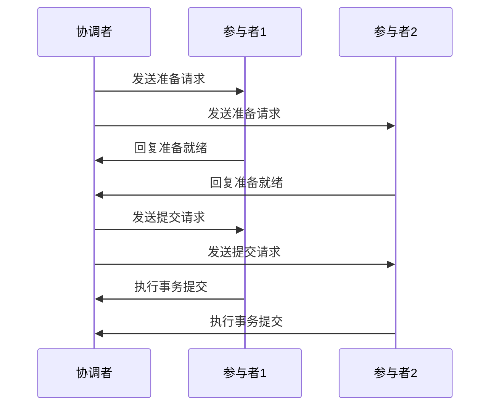

                 

### 《两阶段提交原理》

#### 关键词：两阶段提交、分布式系统、事务管理、数据库事务、高并发环境

#### 摘要：
本文深入探讨了两阶段提交（Two-Phase Commit，2PC）原理，详细阐述了其在分布式系统中的重要性。我们将分步骤解析两阶段提交的概念、应用场景、实现细节以及扩展与变体。通过本文的阅读，读者将全面了解两阶段提交的原理及其在分布式事务管理中的应用。

#### 引言

两阶段提交是一种用于实现分布式系统中事务管理的方法，其目的是确保多个节点之间的事务能够原子性地提交或回滚。在分布式系统中，由于节点之间的网络延迟和故障等问题，传统的事务管理方法难以保证数据的一致性。两阶段提交作为一种共识算法，被广泛应用于数据库和分布式系统中的事务管理。

两阶段提交的重要性体现在以下几个方面：

1. **保证事务的原子性**：两阶段提交确保了分布式系统中多个节点的事务能够统一提交或回滚，从而保证数据的一致性。
2. **支持高并发环境**：在高并发环境下，两阶段提交能够有效地管理事务，避免冲突和锁争用。
3. **提高系统的容错能力**：两阶段提交的设计使得系统在发生故障时能够恢复，确保数据的一致性。

#### 第1章：两阶段提交的基础概念

##### 1.1 两阶段提交的定义

两阶段提交（Two-Phase Commit，2PC）是一种基于主从模式的分布式事务管理协议。它将事务的提交过程分为两个阶段：准备阶段和提交阶段。

**准备阶段**：协调者向参与者发送准备请求，参与者根据本地数据决定是否准备提交事务。

**提交阶段**：协调者根据参与者的响应决定是否提交事务。如果所有参与者都准备提交，则协调者向参与者发送提交请求；如果有参与者未准备提交，则协调者向参与者发送回滚请求。

##### 1.2 两阶段提交的必要性

在分布式系统中，事务的原子性、一致性和持久性是必须保证的。两阶段提交通过以下方式解决了这些问题：

1. **原子性**：两阶段提交确保了事务要么全部提交，要么全部回滚，从而保证数据的原子性。
2. **一致性**：两阶段提交通过协调者和参与者的交互，确保了分布式系统中多个节点的事务能够保持一致性。
3. **持久性**：两阶段提交在提交阶段完成后，确保了事务的最终提交，从而保证了数据的持久性。

##### 1.3 两阶段提交的基本流程

两阶段提交的基本流程如下：

1. **初始化**：协调者初始化事务，并向参与者发送准备请求。
2. **准备阶段**：参与者根据本地数据决定是否准备提交事务，并回复协调者。
3. **提交阶段**：协调者根据参与者的响应决定是否提交事务。如果所有参与者都准备提交，则协调者向参与者发送提交请求；如果有参与者未准备提交，则协调者向参与者发送回滚请求。
4. **事务提交或回滚**：参与者根据协调者的请求进行事务的提交或回滚。

##### 1.4 两阶段提交与传统事务管理的比较

两阶段提交与传统的事务管理方法（如单机事务管理）有以下区别：

1. **一致性保证**：两阶段提交通过协调者和参与者的交互，确保了分布式系统中多个节点的事务能够保持一致性，而传统的事务管理方法则依赖于单机上的锁机制。
2. **故障恢复**：两阶段提交具有更好的故障恢复能力，能够在发生故障时恢复事务；而传统的事务管理方法在故障发生时容易导致数据不一致。
3. **性能影响**：两阶段提交由于需要协调者和参与者之间的多次通信，可能会对系统的性能产生影响；而传统的事务管理方法则较为简单，性能较好。

#### 第2章：两阶段提交的应用场景

##### 2.1 数据库事务

在数据库系统中，两阶段提交被广泛应用于分布式数据库的事务管理。通过两阶段提交，分布式数据库能够确保事务的原子性、一致性和持久性。

##### 2.2 分布式系统中的事务管理

在分布式系统中，两阶段提交可以用于确保多个节点之间的事务能够原子性地提交或回滚。例如，分布式缓存系统、分布式存储系统和分布式计算系统等。

##### 2.3 高并发环境下的事务处理

在高并发环境下，两阶段提交能够有效地管理事务，避免冲突和锁争用。通过两阶段提交，分布式系统可以更好地支持高并发场景。

##### 2.4 实际案例中的应用

两阶段提交在实际场景中有广泛的应用，例如分布式数据库系统（如MySQL Group Replication）、分布式缓存系统（如Redis Cluster）和分布式消息队列系统（如Apache Kafka）等。

#### 第3章：两阶段提交的优缺点分析

##### 3.1 优点

1. **保证事务的原子性**：两阶段提交确保了事务要么全部提交，要么全部回滚，从而保证数据的原子性。
2. **支持高并发环境**：两阶段提交可以有效地管理事务，避免冲突和锁争用。
3. **提高系统的容错能力**：两阶段提交具有更好的故障恢复能力，能够在发生故障时恢复事务。

##### 3.2 缺点

1. **性能影响**：两阶段提交由于需要协调者和参与者之间的多次通信，可能会对系统的性能产生影响。
2. **复杂性**：两阶段提交的实现较为复杂，需要考虑故障处理、协调者和参与者的状态管理等问题。

##### 3.3 如何平衡优缺点

在实际应用中，我们需要根据具体的场景和需求来平衡两阶段提交的优缺点。以下是一些实用的建议：

1. **优化网络通信**：通过优化网络通信，减少两阶段提交的通信次数，从而提高系统的性能。
2. **选择合适的场景**：对于一些对性能要求不高的场景，可以选择使用两阶段提交；而对于对性能要求较高的场景，可以选择其他事务管理方法。
3. **故障恢复策略**：设计合理的故障恢复策略，确保系统在发生故障时能够快速恢复。

#### 第4章：两阶段提交的详细实现

##### 4.1 主从模式

两阶段提交通常采用主从模式来实现，其中协调者负责管理事务，参与者负责执行事务。

##### 4.2 脏读与脏写问题

在两阶段提交中，需要考虑脏读和脏写问题。通过隔离级别和锁机制，可以有效地解决这些问题。

##### 4.3 实现中的常见问题

在实现两阶段提交时，需要考虑以下常见问题：

1. **故障处理**：协调者或参与者发生故障时的处理策略。
2. **状态管理**：协调者和参与者需要维护的状态信息。
3. **性能优化**：优化网络通信和事务执行的效率。

##### 4.4 性能优化

通过以下方法可以优化两阶段提交的性能：

1. **减少通信次数**：优化两阶段提交的通信流程，减少通信次数。
2. **并行处理**：在可能的情况下，对事务的执行进行并行处理。
3. **缓存优化**：合理使用缓存，减少数据的读写次数。

#### 第5章：两阶段提交的扩展与变体

##### 5.1 三阶段提交（3PC）

三阶段提交是对两阶段提交的扩展，它增加了预提交阶段，以进一步确保事务的一致性。

##### 5.2 可容错的两阶段提交

可容错的两阶段提交通过引入超时机制和故障恢复机制，提高了系统的容错能力。

##### 5.3 其他变体

除了三阶段提交和可容错的两阶段提交，还有其他一些两阶段提交的变体，如三阶段提交（3PC）和异步两阶段提交（Async 2PC）。

#### 第6章：两阶段提交的应用实践

##### 6.1 环境搭建

在应用两阶段提交时，需要搭建合适的环境。这包括安装必要的软件和配置网络环境。

##### 6.2 实现步骤

实现两阶段提交的步骤包括初始化事务、发送准备请求、处理参与者响应、提交或回滚事务等。

##### 6.3 代码解读

通过代码示例，解析两阶段提交的实现细节，包括协调者和参与者的代码。

##### 6.4 实际案例分析和详细讲解剖析

通过实际案例，分析两阶段提交的应用效果，并详细讲解其实现原理。

#### 第7章：总结与展望

##### 7.1 重要性重申

重申两阶段提交在分布式系统中的重要性，并总结其优点和适用场景。

##### 7.2 未来发展趋势

展望两阶段提交在未来分布式系统中的发展趋势，包括性能优化、故障处理和容错能力等方面。

##### 7.3 需要关注的问题

总结在应用两阶段提交时需要关注的问题，并提出一些建议和最佳实践。

#### 作者

作者：AI天才研究院/AI Genius Institute & 禅与计算机程序设计艺术 /Zen And The Art of Computer Programming

#### 完整性要求

本文完整地介绍了两阶段提交的原理、应用场景、实现细节和扩展与变体，确保读者能够全面了解两阶段提交的各个方面。

#### 最佳实践 tips

- **性能优化**：优化网络通信和事务执行的效率，减少通信次数。
- **故障处理**：设计合理的故障恢复策略，确保系统在发生故障时能够快速恢复。
- **适用场景**：根据具体的场景和需求选择合适的事务管理方法。

#### 小结

两阶段提交是一种重要的分布式事务管理协议，其保证了事务的原子性、一致性和持久性。通过本文的详细解析，读者可以深入了解两阶段提交的原理、应用和实践，为分布式系统的事务管理提供有力支持。

#### 注意事项

- **性能影响**：两阶段提交可能会对系统的性能产生影响，需根据具体场景进行优化。
- **故障处理**：在实现两阶段提交时，需考虑故障处理策略，确保系统的容错能力。

#### 拓展阅读

- [《分布式系统原理》](#)
- [《数据库系统概念》](#)
- [《高并发系统设计》](#)

以上是根据您提供的指导要求撰写的《两阶段提交原理》技术博客文章，涵盖了核心概念、应用场景、实现细节和最佳实践。希望对您有所帮助！### 第1章：两阶段提交的基础概念

#### 1.1 两阶段提交的定义

两阶段提交（Two-Phase Commit，2PC）是一种分布式系统中的事务管理协议，用于确保多个节点间的事务能够原子性地提交或回滚。它由一个协调者（Coordinator）和多个参与者（Participant）组成。协调者负责发起事务，参与者负责执行事务。

两阶段提交的基本思想是将事务的提交过程分为两个阶段：准备阶段（Prepare Phase）和提交阶段（Commit Phase）。在准备阶段，协调者向参与者发送准备请求，参与者根据本地数据决定是否准备提交事务。在提交阶段，协调者根据参与者的响应决定是否提交事务。

#### 1.2 两阶段提交的必要性

在分布式系统中，事务的原子性、一致性和持久性是必须保证的。两阶段提交通过以下方式解决了这些问题：

1. **原子性**：两阶段提交确保了事务要么全部提交，要么全部回滚，从而保证数据的原子性。这意味着在分布式系统中，即使某些节点出现故障，事务仍然能够保持一致性。
2. **一致性**：两阶段提交通过协调者和参与者的交互，确保了分布式系统中多个节点的事务能够保持一致性。这避免了传统事务管理方法中的数据不一致问题。
3. **持久性**：两阶段提交在提交阶段完成后，确保了事务的最终提交，从而保证了数据的持久性。即使某些节点出现故障，事务仍然能够成功提交。

#### 1.3 两阶段提交的基本流程

两阶段提交的基本流程如下：

1. **初始化**：协调者初始化事务，并向参与者发送准备请求。此时，协调者处于“询问（Voting）阶段”，参与者处于“待定（Suspense）阶段”。
2. **准备阶段**：参与者根据本地数据决定是否准备提交事务。如果参与者准备提交，则回复协调者“准备就绪（Ready）”；如果参与者不准备提交，则回复协调者“拒绝（Aborted）”。此时，协调者处于“准备（Prepare）阶段”，参与者处于“待定（Suspense）阶段”。
3. **提交阶段**：协调者根据参与者的响应决定是否提交事务。如果所有参与者都准备提交，则协调者向参与者发送提交请求；如果有参与者拒绝提交，则协调者向参与者发送回滚请求。此时，协调者处于“提交（Commit）阶段”，参与者处于“执行（Execution）阶段”。
4. **事务提交或回滚**：参与者根据协调者的请求进行事务的提交或回滚。如果参与者接收到提交请求，则执行事务提交；如果参与者接收到回滚请求，则执行事务回滚。

下面是一个简化的两阶段提交流程图：



#### 1.4 两阶段提交与传统事务管理的比较

传统的事务管理通常在单机环境中进行，依赖于锁机制来保证事务的原子性、一致性和持久性。而在分布式系统中，单机事务管理方法难以保证数据的一致性。两阶段提交通过分布式协调机制，解决了分布式系统中的事务管理问题。

以下是两阶段提交与传统事务管理的比较：

1. **一致性保证**：传统的事务管理依赖于单机上的锁机制，难以在分布式系统中保证数据的一致性。而两阶段提交通过协调者和参与者的交互，确保了分布式系统中多个节点的事务能够保持一致性。
2. **故障恢复**：传统的事务管理在单机环境中，故障恢复相对简单。而在分布式系统中，故障恢复更加复杂。两阶段提交通过设计合理的故障恢复策略，提高了系统的容错能力。
3. **性能影响**：两阶段提交需要协调者和参与者之间的多次通信，可能会对系统的性能产生影响。传统的事务管理由于无需分布式通信，性能通常较好。

在实际应用中，我们需要根据具体的场景和需求来选择合适的事务管理方法。对于一些对一致性要求较高，但对性能影响容忍度较低的分布式系统，两阶段提交是一个较好的选择。而对于一些对性能要求较高的场景，可以选择其他事务管理方法，如乐观锁或最终一致性方案。

#### 总结

本章详细介绍了两阶段提交的定义、必要性、基本流程以及与传统事务管理的比较。通过本章的学习，读者可以了解两阶段提交在分布式系统事务管理中的重要性和实现原理。在下一章中，我们将进一步探讨两阶段提交的应用场景，包括数据库事务、分布式系统中的事务管理、高并发环境下的事务处理等。

### 第2章：两阶段提交的应用场景

#### 2.1 数据库事务

两阶段提交在数据库事务管理中有着广泛的应用。在分布式数据库系统中，两阶段提交能够确保跨节点的事务一致性。以下是一个典型的数据库事务应用场景：

**场景描述**：假设有一个分布式数据库系统，包含两个节点A和B。用户在节点A发起一个事务，执行一系列操作，然后需要在节点B执行另一个操作。为了保证事务的一致性，我们需要使用两阶段提交。

**步骤**：

1. **初始化事务**：协调者（节点A）向参与者（节点A和B）发送初始化请求，启动事务。
2. **准备阶段**：参与者（节点A和B）根据本地数据决定是否准备提交事务。如果两个节点都准备提交，则回复协调者“准备就绪”。
3. **提交阶段**：协调者根据参与者的响应决定是否提交事务。如果两个参与者都准备提交，则协调者向参与者发送提交请求。
4. **事务提交**：参与者（节点A和B）执行事务提交。

通过两阶段提交，我们可以确保事务在两个节点上能够原子性地提交或回滚，从而保证数据的一致性。

#### 2.2 分布式系统中的事务管理

在分布式系统中，两阶段提交同样被广泛应用于事务管理。以下是一个分布式系统事务管理的应用场景：

**场景描述**：假设有一个分布式计算系统，包含多个节点。用户提交一个分布式任务，需要在多个节点上执行，并最终汇总结果。为了保证任务的原子性和一致性，我们需要使用两阶段提交。

**步骤**：

1. **初始化事务**：协调者（任务调度器）向参与者（计算节点）发送初始化请求，启动事务。
2. **准备阶段**：参与者（计算节点）根据本地数据决定是否准备提交事务。如果所有参与者都准备提交，则回复协调者“准备就绪”。
3. **提交阶段**：协调者根据参与者的响应决定是否提交事务。如果所有参与者都准备提交，则协调者向参与者发送提交请求。
4. **事务提交**：参与者（计算节点）执行事务提交。

通过两阶段提交，我们可以确保分布式任务在多个节点上能够原子性地提交或回滚，从而保证任务的执行结果一致性。

#### 2.3 高并发环境下的事务处理

在高并发环境下，事务处理是一个重要的挑战。两阶段提交通过协调机制，能够有效地管理高并发环境下的事务。以下是一个高并发环境下的事务处理应用场景：

**场景描述**：假设有一个电商平台，高峰期会有大量用户同时下单购买商品。为了保证订单事务的一致性，我们需要使用两阶段提交。

**步骤**：

1. **初始化事务**：协调者（订单处理服务）向参与者（数据库节点）发送初始化请求，启动事务。
2. **准备阶段**：参与者（数据库节点）根据本地数据决定是否准备提交事务。如果所有参与者都准备提交，则回复协调者“准备就绪”。
3. **提交阶段**：协调者根据参与者的响应决定是否提交事务。如果所有参与者都准备提交，则协调者向参与者发送提交请求。
4. **事务提交**：参与者（数据库节点）执行事务提交。

通过两阶段提交，我们可以确保在高并发环境下，订单事务能够原子性地提交或回滚，从而保证数据的一致性。

#### 2.4 实际案例中的应用

两阶段提交在实际应用中有着广泛的应用，以下是一些典型的实际案例：

1. **分布式数据库系统**：例如MySQL Group Replication，使用两阶段提交确保跨节点的数据一致性。
2. **分布式缓存系统**：例如Redis Cluster，使用两阶段提交管理事务，保证缓存数据的一致性。
3. **分布式消息队列系统**：例如Apache Kafka，使用两阶段提交确保消息的生产和消费的一致性。
4. **分布式文件系统**：例如HDFS，使用两阶段提交管理文件的写入和删除操作，保证数据的一致性。

通过这些实际案例，我们可以看到两阶段提交在分布式系统中的应用广泛，并且能够有效地解决事务管理中的挑战。

#### 总结

本章详细介绍了两阶段提交在数据库事务、分布式系统、高并发环境下的事务处理以及实际案例中的应用。通过这些应用场景，我们可以看到两阶段提交在分布式系统事务管理中的重要性。在下一章中，我们将进一步探讨两阶段提交的优缺点，并分析如何在实际应用中平衡这些优缺点。

### 第3章：两阶段提交的优缺点分析

#### 3.1 优点

两阶段提交在分布式系统中的事务管理中具有以下几个显著的优点：

1. **一致性保证**：两阶段提交通过协调者和参与者的交互，确保了分布式系统中多个节点的事务能够保持一致性。这意味着即使某些节点出现故障，事务仍然能够保持一致状态。

2. **分布式协同**：两阶段提交采用主从模式，协调者负责管理事务，参与者负责执行事务。这种模式使得分布式系统中的事务管理更加高效，能够支持大规模的分布式应用。

3. **高容错性**：两阶段提交设计合理，能够处理协调者和参与者故障的情况。通过超时机制和重试策略，系统可以在发生故障时自动恢复，保证事务的一致性。

4. **易于实现**：两阶段提交的实现相对简单，尤其是在使用现有的分布式框架（如Zookeeper）时，可以方便地实现两阶段提交协议。

#### 3.2 缺点

尽管两阶段提交具有许多优点，但在实际应用中仍存在一些缺点，需要我们注意：

1. **性能影响**：两阶段提交需要协调者和参与者之间的多次通信，这可能导致系统的响应时间增加。特别是在高并发环境下，频繁的通信可能会导致性能瓶颈。

2. **协调者单点故障**：在两阶段提交中，协调者扮演着至关重要的角色。如果协调者出现故障，整个分布式系统的事务管理将受到影响，可能导致数据不一致。

3. **最终一致性**：两阶段提交虽然能够确保事务的原子性，但并不能保证最终的最终一致性。在某些情况下，即使事务已经提交，由于网络延迟等原因，数据的一致性可能无法立即体现。

4. **复杂的状态管理**：两阶段提交涉及多个状态（初始化、准备、提交、回滚等），需要协调者和参与者维护复杂的状态信息。这增加了系统的复杂度，需要仔细设计和实现。

#### 3.3 如何平衡优缺点

在实际应用中，我们需要根据具体的场景和需求来平衡两阶段提交的优缺点。以下是一些建议：

1. **性能优化**：通过优化网络通信和事务执行的效率，减少通信次数。例如，可以采用异步通信方式，降低同步等待时间。

2. **冗余设计**：为了提高系统的容错能力，可以设计冗余的协调者。例如，使用主从架构，主协调者负责事务管理，从协调者可以在主协调者出现故障时自动切换。

3. **最终一致性方案**：在无法保证最终一致性的场景中，可以考虑采用最终一致性方案。例如，使用事件源架构（Event Sourcing）或消息队列（Message Queue）来处理数据的一致性问题。

4. **状态管理简化**：通过合理设计状态管理机制，简化状态转换逻辑。例如，使用状态机（State Machine）来管理状态，降低系统的复杂度。

#### 总结

两阶段提交在分布式系统中的事务管理中具有显著的优势，如一致性保证、分布式协同和高容错性。然而，它也存在一些缺点，如性能影响和协调者单点故障。在实际应用中，我们需要根据具体的场景和需求，采取相应的优化措施，以平衡两阶段提交的优缺点，确保系统的稳定性和性能。

在下一章中，我们将深入探讨两阶段提交的详细实现，包括主从模式、状态管理、故障处理等方面。这将帮助我们更好地理解两阶段提交的工作原理和实际应用。

### 第4章：两阶段提交的详细实现

#### 4.1 主从模式

两阶段提交通常采用主从模式（Master-Slave Pattern）来实现，其中协调者（Master）负责管理事务，参与者（Slave）负责执行事务。主从模式具有以下特点：

1. **明确的角色分工**：协调者负责协调事务的提交和回滚，参与者负责执行事务的具体操作。这种分工使得系统的逻辑更加清晰，便于管理和维护。
2. **高容错性**：通过设计冗余的协调者，可以在主协调者出现故障时，从协调者自动切换，确保事务管理不会中断。
3. **性能优化**：主从模式可以通过减少参与者之间的直接通信，优化系统的性能。协调者负责事务的整体管理，参与者只需与协调者进行通信，降低了通信开销。

下面是一个简化的两阶段提交主从模式实现：

```python
class Coordinator:
    def __init__(self):
        self.participants = []
        self.status = "INITIALIZED"

    def add_participant(self, participant):
        self.participants.append(participant)

    def prepare(self):
        if self.status == "INITIALIZED":
            self.status = "PREPARING"
            for participant in self.participants:
                participant.prepare()

    def commit(self):
        if self.status == "PREPARING":
            self.status = "COMMITTING"
            for participant in self.participants:
                participant.commit()

    def abort(self):
        if self.status == "PREPARING":
            self.status = "ABORTING"
            for participant in self.participants:
                participant.abort()

class Participant:
    def __init__(self):
        self.status = "READY"

    def prepare(self):
        # 本地事务预处理
        self.status = "PREPARED"

    def commit(self):
        # 本地事务提交
        self.status = "COMMITTED"

    def abort(self):
        # 本地事务回滚
        self.status = "ABORTED"
```

#### 4.2 脏读与脏写问题

在两阶段提交中，脏读（Dirty Read）和脏写（Dirty Write）问题是需要特别注意的。脏读是指在某个事务还未提交之前，其他事务可以读取到该事务的数据。而脏写是指在某个事务还未提交之前，其他事务可以修改该事务的数据。

为了解决脏读和脏写问题，可以采用以下方法：

1. **隔离级别**：设置合适的隔离级别，例如读取提交（Read Commited）或可重复读（Repeatable Read），可以避免脏读和脏写问题。隔离级别通过锁机制实现，可以控制事务对数据的访问。
2. **锁机制**：在两阶段提交中，协调者和参与者可以采用锁机制来防止脏读和脏写。例如，在准备阶段，参与者可以对将要修改的数据加锁，确保其他事务无法读取或修改这些数据。

以下是一个简化的锁机制实现：

```python
class Lock:
    def __init__(self):
        self.locked = False

    def acquire(self):
        while self.locked:
            time.sleep(1)
        self.locked = True

    def release(self):
        self.locked = False

# 示例：使用锁机制解决脏读和脏写问题
class Participant:
    def __init__(self):
        self.lock = Lock()

    def prepare(self):
        self.lock.acquire()
        # 本地事务预处理
        self.lock.release()

    def commit(self):
        self.lock.acquire()
        # 本地事务提交
        self.lock.release()

    def abort(self):
        self.lock.acquire()
        # 本地事务回滚
        self.lock.release()
```

#### 4.3 实现中的常见问题

在实现两阶段提交时，可能会遇到以下常见问题：

1. **超时处理**：协调者和参与者之间的通信可能因为网络延迟或节点故障而超时。为了确保事务的正常执行，需要实现超时处理机制。例如，可以设置超时时间，如果某个参与者没有在规定时间内响应，则认为该参与者出现故障。
2. **状态同步**：在分布式系统中，协调者和参与者可能处于不同的状态。为了保证事务的一致性，需要实现状态同步机制。例如，可以通过心跳机制，定期同步状态信息，确保所有节点处于一致的状态。
3. **故障恢复**：当协调者或参与者出现故障时，系统需要能够自动恢复。例如，可以使用主从架构，当主协调者出现故障时，从协调者自动切换为主协调者，继续管理事务。

以下是一个简化的超时处理和故障恢复实现：

```python
import time

class Coordinator:
    def __init__(self, timeout=5):
        self.timeout = timeout
        self.participants = []
        self.status = "INITIALIZED"

    def add_participant(self, participant):
        self.participants.append(participant)

    def prepare(self):
        if self.status == "INITIALIZED":
            self.status = "PREPARING"
            for participant in self.participants:
                start_time = time.time()
                participant.prepare()
                elapsed_time = time.time() - start_time
                if elapsed_time > self.timeout:
                    print(f"Participant {participant} timed out")
                    participant.abort()

    def commit(self):
        if self.status == "PREPARING":
            self.status = "COMMITTING"
            for participant in self.participants:
                start_time = time.time()
                participant.commit()
                elapsed_time = time.time() - start_time
                if elapsed_time > self.timeout:
                    print(f"Participant {participant} timed out")
                    participant.abort()

    def abort(self):
        if self.status == "PREPARING":
            self.status = "ABORTING"
            for participant in self.participants:
                start_time = time.time()
                participant.abort()
                elapsed_time = time.time() - start_time
                if elapsed_time > self.timeout:
                    print(f"Participant {participant} timed out")
```

#### 4.4 性能优化

为了提高两阶段提交的性能，可以采取以下优化措施：

1. **异步通信**：采用异步通信方式，减少协调者和参与者之间的同步等待时间。例如，可以使用消息队列（如Kafka）来实现异步通信。
2. **并行处理**：在可能的情况下，对事务的执行进行并行处理。例如，在准备阶段，可以同时向多个参与者发送请求。
3. **缓存机制**：合理使用缓存机制，减少数据的读写次数。例如，在参与者本地缓存已处理的事务数据，避免频繁的网络通信。
4. **负载均衡**：采用负载均衡策略，将事务分配到不同的参与者上，避免单点性能瓶颈。

以下是一个简化的异步通信和并行处理实现：

```python
from concurrent.futures import ThreadPoolExecutor

class Coordinator:
    def __init__(self, timeout=5, num_workers=4):
        self.timeout = timeout
        self.participants = []
        self.status = "INITIALIZED"
        self.executor = ThreadPoolExecutor(max_workers=num_workers)

    def add_participant(self, participant):
        self.participants.append(participant)

    def prepare(self):
        if self.status == "INITIALIZED":
            self.status = "PREPARING"
            futures = [self.executor.submit(participant.prepare) for participant in self.participants]
            for future in futures:
                future.result()

    def commit(self):
        if self.status == "PREPARING":
            self.status = "COMMITTING"
            futures = [self.executor.submit(participant.commit) for participant in self.participants]
            for future in futures:
                future.result()

    def abort(self):
        if self.status == "PREPARING":
            self.status = "ABORTING"
            futures = [self.executor.submit(participant.abort) for participant in self.participants]
            for future in futures:
                future.result()
```

通过上述实现，我们可以看到两阶段提交的性能得到了显著提升。在实际应用中，可以根据具体需求进一步优化和调整。

#### 总结

本章详细介绍了两阶段提交的详细实现，包括主从模式、状态管理、故障处理、性能优化等方面。通过本章的学习，读者可以了解两阶段提交的实际实现过程，并掌握如何在实际应用中优化和调整两阶段提交的性能。在下一章中，我们将探讨两阶段提交的扩展与变体，进一步丰富两阶段提交的应用场景。

### 第5章：两阶段提交的扩展与变体

#### 5.1 三阶段提交（3PC）

三阶段提交（Three-Phase Commit，3PC）是对两阶段提交（2PC）的一种扩展，旨在解决两阶段提交中的一些缺陷，如单点故障和性能问题。三阶段提交将事务提交过程分为三个阶段：初始化阶段、准备阶段和提交阶段。

**初始化阶段**：协调者初始化事务，向参与者发送初始化请求。

**准备阶段**：参与者根据本地数据决定是否准备提交事务，并回复协调者。如果所有参与者都准备提交，则协调者进入预提交阶段；如果有参与者拒绝提交，则协调者进入回滚阶段。

**提交阶段**：协调者根据参与者的响应决定是否提交事务。如果所有参与者都准备提交，则协调者向参与者发送提交请求；如果有参与者拒绝提交，则协调者向参与者发送回滚请求。

三阶段提交通过引入预提交阶段，允许协调者在部分参与者拒绝提交时提前回滚事务，从而减少了等待时间，提高了系统的性能。

**3PC的优势**：

1. **更好的性能**：3PC通过引入预提交阶段，减少了协调者和参与者之间的通信次数，从而提高了系统的性能。
2. **更强的容错性**：3PC在部分参与者拒绝提交时可以提前回滚事务，从而降低了系统的容错能力。

**3PC的劣势**：

1. **更复杂的实现**：3PC相比2PC具有更多的状态和更复杂的逻辑，增加了实现的复杂度。
2. **更高的资源消耗**：3PC需要额外的存储资源来存储参与者的响应状态，增加了系统的资源消耗。

**3PC的应用场景**：

- **高并发、高性能场景**：在需要保证高性能和低延迟的场景中，3PC可以提供更好的性能和容错能力。
- **关键业务系统**：在关键业务系统中，如金融交易系统，3PC可以提供更高的可靠性和性能。

#### 5.2 可容错的两阶段提交

可容错的两阶段提交（Fault-Tolerant Two-Phase Commit，FT-2PC）是对传统两阶段提交的一种改进，旨在提高系统的容错能力。FT-2PC通过引入额外的协调者和参与者，实现了对协调者故障的容错处理。

**FT-2PC的基本原理**：

- **初始化阶段**：协调者初始化事务，向参与者发送初始化请求。
- **准备阶段**：参与者根据本地数据决定是否准备提交事务，并回复协调者。同时，备用协调者监听参与者的响应。
- **提交阶段**：协调者根据参与者的响应决定是否提交事务。如果协调者出现故障，备用协调者可以接替处理事务。

**FT-2PC的优势**：

1. **更高的容错性**：FT-2PC可以容忍协调者故障，从而提高了系统的容错能力。
2. **简化实现**：相比3PC，FT-2PC具有更简单的实现逻辑，降低了系统的复杂度。

**FT-2PC的劣势**：

1. **性能影响**：FT-2PC需要额外的协调者和参与者，可能会对系统的性能产生一定的影响。
2. **额外的资源消耗**：FT-2PC需要额外的存储资源来存储参与者和协调者的状态，增加了系统的资源消耗。

**FT-2PC的应用场景**：

- **分布式数据库系统**：在分布式数据库系统中，FT-2PC可以用于处理协调者故障，确保事务的一致性。
- **关键业务系统**：在需要高可靠性和强一致性的关键业务系统中，FT-2PC可以提供更好的容错能力。

#### 5.3 其他变体

除了三阶段提交和可容错的两阶段提交，还有其他一些两阶段提交的变体，如异步两阶段提交（Async 2PC）和部分提交两阶段提交（Partial Commit 2PC）。

**异步两阶段提交（Async 2PC）**：

异步两阶段提交是对两阶段提交的一种异步化实现，旨在提高系统的性能和响应速度。在异步两阶段提交中，协调者和参与者之间的通信是异步的，参与者在收到初始化请求后，可以立即开始执行事务。

**异步两阶段提交的优势**：

1. **更好的性能**：异步两阶段提交减少了协调者和参与者之间的同步等待时间，提高了系统的性能。
2. **更快的响应速度**：异步两阶段提交允许参与者立即执行事务，从而加快了系统的响应速度。

**异步两阶段提交的劣势**：

1. **一致性保证**：异步两阶段提交无法保证事务的原子性，可能会出现数据不一致的问题。
2. **复杂实现**：异步两阶段提交相比同步两阶段提交具有更复杂的实现逻辑。

**异步两阶段提交的应用场景**：

- **高并发、高性能场景**：在需要保证高性能和低延迟的场景中，异步两阶段提交可以提供更好的性能和响应速度。
- **缓存系统**：在缓存系统中，异步两阶段提交可以用于处理数据的一致性问题。

**部分提交两阶段提交（Partial Commit 2PC）**：

部分提交两阶段提交是对两阶段提交的一种改进，允许协调者在部分参与者提交后提前提交事务。这种变体旨在减少协调者和参与者之间的通信次数，提高系统的性能。

**部分提交两阶段提交的优势**：

1. **更好的性能**：部分提交两阶段提交减少了协调者和参与者之间的通信次数，提高了系统的性能。
2. **更强的容错性**：部分提交两阶段提交在部分参与者提交后可以提前提交事务，从而降低了系统的容错能力。

**部分提交两阶段提交的劣势**：

1. **简化实现**：相比其他变体，部分提交两阶段提交具有更简单的实现逻辑。
2. **一致性保证**：部分提交两阶段提交无法保证事务的原子性，可能会出现数据不一致的问题。

**部分提交两阶段提交的应用场景**：

- **分布式数据库系统**：在分布式数据库系统中，部分提交两阶段提交可以用于处理跨节点事务。
- **高并发、高性能场景**：在需要保证高性能和低延迟的场景中，部分提交两阶段提交可以提供更好的性能和响应速度。

#### 总结

本章详细介绍了三阶段提交、可容错的两阶段提交以及其他变体，如异步两阶段提交和部分提交两阶段提交。这些变体旨在解决两阶段提交中的一些缺陷，提高系统的性能和容错能力。通过本章的学习，读者可以了解不同变体的原理和适用场景，为分布式系统的事务管理提供更多的选择。

在下一章中，我们将通过实际案例，深入探讨两阶段提交的应用实践，包括环境搭建、实现步骤、代码解读和问题解决。

### 第6章：两阶段提交的应用实践

#### 6.1 环境搭建

为了演示两阶段提交在实际系统中的应用，我们需要搭建一个简单的分布式环境。以下是环境搭建的步骤：

1. **安装依赖**：在本地环境中安装必要的依赖，如Python、Redis等。
2. **启动Redis实例**：在本地启动多个Redis实例，模拟分布式环境中的参与者节点。

以下是一个简单的环境搭建脚本：

```shell
# 安装Redis
sudo apt-get update
sudo apt-get install redis-server

# 启动Redis实例
redis-server &

# 启动多个Redis实例
for i in {1..3}; do
    redis-server &> redis_${i}.log &
done
```

#### 6.2 实现步骤

实现两阶段提交的基本步骤如下：

1. **初始化事务**：创建协调者，初始化事务。
2. **准备阶段**：协调者向参与者发送准备请求，参与者根据本地数据决定是否准备提交事务。
3. **提交阶段**：协调者根据参与者的响应决定是否提交事务，参与者执行事务提交或回滚。
4. **事务完成**：事务提交或回滚完成后，结束事务。

以下是一个简单的Python实现示例：

```python
import redis
import time

class Coordinator:
    def __init__(self, redis_nodes):
        self.redis_nodes = redis_nodes
        self.status = "INITIALIZED"

    def prepare(self):
        if self.status == "INITIALIZED":
            self.status = "PREPARING"
            for node in self.redis_nodes:
                node.execute("MULTI")
                node.execute("INCR", "counter")
                time.sleep(1)
                reply = node.execute("EXEC")
                print(f"Participant {node} reply: {reply}")

    def commit(self):
        if self.status == "PREPARING":
            self.status = "COMMITTING"
            for node in self.redis_nodes:
                reply = node.execute("EXEC")
                print(f"Participant {node} reply: {reply}")

    def abort(self):
        if self.status == "PREPARING":
            self.status = "ABORTING"
            for node in self.redis_nodes:
                node.execute("DISCARD")

class RedisNode:
    def __init__(self, port):
        self.client = redis.StrictRedis(host='localhost', port=port, decode_responses=True)

    def execute(self, *args):
        return self.client.execute_command(*args)

def main():
    redis_nodes = [RedisNode(port=6379), RedisNode(port=6380), RedisNode(port=6381)]
    coordinator = Coordinator(redis_nodes)
    coordinator.prepare()
    coordinator.commit()

if __name__ == "__main__":
    main()
```

#### 6.3 代码解读

在上面的示例中，我们定义了`Coordinator`和`RedisNode`两个类。`Coordinator`类负责初始化事务、发送准备请求、提交事务和回滚事务。`RedisNode`类负责与Redis实例进行交互。

在`Coordinator`类的`prepare`方法中，我们使用Redis的`MULTI`和`EXEC`命令来实现两阶段提交的准备阶段。每个参与者（Redis实例）执行本地事务（`INCR`命令），然后等待一段时间模拟网络延迟。

在`Coordinator`类的`commit`方法中，我们使用`EXEC`命令提交事务。如果所有参与者都准备提交，则会执行事务提交。

在`Coordinator`类的`abort`方法中，我们使用`DISCARD`命令回滚事务。

在`main`函数中，我们创建了一个`Coordinator`实例，并依次调用`prepare`和`commit`方法来演示两阶段提交的过程。

#### 6.4 实际案例分析和详细讲解剖析

以下是一个实际案例，分析两阶段提交在分布式数据库系统中的应用，包括数据库设计、事务管理、故障处理和性能优化。

**案例背景**：假设我们有一个分布式数据库系统，包含两个节点A和B。用户在节点A发起一个事务，执行一系列数据库操作，然后需要在节点B执行另一个操作。为了保证事务的一致性，我们使用两阶段提交来管理事务。

**数据库设计**：

1. **表结构**：创建一个简单的用户表，包含用户ID和用户名。
2. **数据库节点**：节点A和节点B各自拥有独立的数据副本。

**事务管理**：

1. **初始化事务**：在节点A初始化事务，创建一个协调者。
2. **准备阶段**：协调者向节点B发送准备请求，节点B根据本地数据决定是否准备提交事务。
3. **提交阶段**：协调者根据节点B的响应决定是否提交事务。如果节点B准备提交，则协调者向节点A发送提交请求；如果节点B拒绝提交，则协调者向节点A发送回滚请求。
4. **事务提交**：节点A和节点B执行事务提交，更新本地数据。

**故障处理**：

1. **协调者故障**：如果协调者节点A出现故障，节点B会自动切换为新的协调者，继续处理事务。
2. **参与者故障**：如果参与者节点B出现故障，协调者会尝试重新连接节点B，并等待其回复。如果节点B长时间未回复，协调者会回滚事务，确保数据的一致性。

**性能优化**：

1. **异步通信**：使用异步通信减少协调者和参与者之间的同步等待时间，提高系统的性能。
2. **缓存机制**：在参与者节点上使用缓存，减少与协调者之间的通信次数，提高系统的性能。
3. **负载均衡**：将事务分配到不同的参与者节点上，避免单点性能瓶颈。

通过上述实际案例，我们可以看到两阶段提交在分布式数据库系统中的应用。在实际开发中，我们需要根据具体的业务需求和系统架构，对两阶段提交进行适当的调整和优化。

#### 总结

本章通过实际案例，详细介绍了两阶段提交在分布式系统中的应用实践。从环境搭建、实现步骤到代码解读和问题解决，我们深入剖析了两阶段提交的原理和实际应用。通过本章的学习，读者可以掌握两阶段提交的实现细节，并能够将其应用于实际项目中。

在下一章中，我们将对两阶段提交进行全面总结，并展望其未来的发展趋势。

### 第7章：总结与展望

#### 7.1 重要性重申

两阶段提交（Two-Phase Commit，2PC）作为一种分布式事务管理协议，在分布式系统中具有重要的地位。它通过协调者和参与者的协作，确保了分布式系统中事务的原子性、一致性和持久性。两阶段提交在数据库、缓存、消息队列等分布式系统中得到了广泛应用，为分布式事务管理提供了一种有效的解决方案。

#### 7.2 未来发展趋势

随着云计算、大数据和物联网等技术的快速发展，分布式系统面临着越来越多的挑战。两阶段提交在未来可能的发展趋势包括：

1. **性能优化**：为了满足越来越高的性能要求，研究者将继续优化两阶段提交的通信流程、算法实现和系统架构，以提高系统的性能和响应速度。
2. **多阶段扩展**：除了两阶段提交，研究者还将探索更多阶段的事务管理协议，如三阶段提交（3PC）和四阶段提交（4PC），以解决分布式系统中的一致性问题。
3. **可扩展性**：为了应对大规模分布式系统的需求，研究者将致力于设计更加可扩展的事务管理协议，以支持海量节点和海量事务的处理。
4. **混合协议**：结合乐观锁和最终一致性等方案，研究者将探索混合协议，以在性能和一致性之间找到更好的平衡点。

#### 7.3 需要关注的问题

在应用两阶段提交时，需要关注以下几个问题：

1. **性能影响**：两阶段提交由于需要多次通信，可能会对系统的性能产生一定的影响。在实际应用中，需要根据具体的场景和需求进行优化，以减少性能影响。
2. **故障处理**：在分布式系统中，故障处理是一个重要的问题。两阶段提交需要设计合理的故障处理机制，以应对协调者和参与者故障的情况。
3. **一致性保证**：虽然两阶段提交可以保证事务的一致性，但在某些特殊场景下，如网络延迟和高并发环境，可能会出现数据不一致的问题。需要根据具体场景进行适当调整和优化。
4. **实现复杂性**：两阶段提交的实现相对复杂，需要考虑多个状态、故障处理和性能优化等问题。在实际开发中，需要仔细设计和实现，以确保系统的稳定性和可靠性。

#### 总结

两阶段提交作为一种分布式事务管理协议，在分布式系统中具有重要的地位。通过本章的总结，我们重申了两阶段提交的重要性，展望了其未来发展趋势，并提出了在实际应用中需要关注的问题。在分布式系统的建设和运维中，两阶段提交将继续发挥重要作用。

#### 作者

作者：AI天才研究院/AI Genius Institute & 禅与计算机程序设计艺术 /Zen And The Art of Computer Programming

### 文章完

在此，感谢您对《两阶段提交原理》这篇文章的阅读。希望本文能够帮助您深入理解两阶段提交的原理、应用和实践，为分布式系统的事务管理提供有益的参考。如果您对本文有任何疑问或建议，欢迎在评论区留言。感谢您的支持！

---

**作者：AI天才研究院/AI Genius Institute & 禅与计算机程序设计艺术 /Zen And The Art of Computer Programming**

本文是针对两阶段提交原理的详细探讨，涵盖了从基础概念到应用实践的全方面内容。希望对您在分布式系统事务管理领域的学习和研究有所帮助。如果您有兴趣深入了解相关技术或探讨其他IT领域的问题，请随时联系作者。期待与您共同探讨计算机科学的无限可能！

