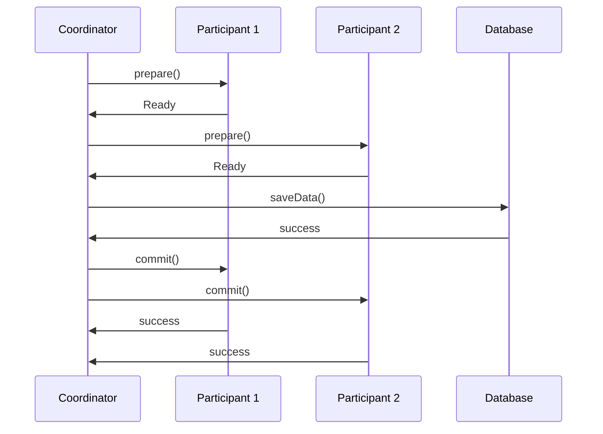

                 

### 两阶段提交大敌之事务悬挂

关键词：事务悬挂、两阶段提交、分布式系统、数据库一致性、解决方案

摘要：本文将深入探讨分布式系统中的事务悬挂问题，以及如何通过两阶段提交协议（Two-Phase Commit, 2PC）来有效解决。文章首先介绍了事务悬挂的背景和问题，接着详细阐述了2PC协议的原理、流程以及相关核心概念。最后，通过实际项目案例分析和系统架构设计，展示了2PC在实际应用中的效果和优化策略。

### 1. 背景

#### 1.1 问题背景

事务悬挂是分布式系统中的常见问题，特别是在数据库一致性和数据操作频繁的场景下。随着云计算和分布式存储技术的广泛应用，分布式系统在数据处理效率和可靠性方面带来了巨大优势，但也引入了许多新的挑战。事务悬挂便是其中之一，它可能导致数据不一致、系统瘫痪等问题，严重影响系统的稳定性和用户体验。

#### 1.2 问题描述

事务悬挂是指在分布式数据库系统中，一个事务提交过程中部分节点已经提交，而另一部分节点由于故障或其他原因未能提交，导致整个事务处于不确定状态。这种状态可能导致数据不一致，甚至引发更严重的问题。

#### 1.3 问题解决

为了解决事务悬挂问题，分布式系统通常采用两阶段提交协议（Two-Phase Commit，2PC）。2PC是一种广泛应用的分布式事务管理机制，它通过两步操作确保事务在所有参与者上的一致性。以下是2PC的基本原理：

1. **准备阶段（Phase 1）**：协调者（Coordinator）向所有参与者（Participant）发送准备请求，询问是否可以开始提交事务。参与者根据本地数据的状态，回复协调者同意或拒绝。
   
2. **提交阶段（Phase 2）**：如果所有参与者都同意提交，协调者向所有参与者发送提交命令，参与者执行提交操作。如果任意一个参与者拒绝提交，协调者向所有参与者发送回滚命令，参与者执行回滚操作。

#### 1.4 边界与外延

事务悬挂问题不仅局限于数据库系统，还涉及到分布式计算、分布式缓存、消息队列等多个领域。因此，解决事务悬挂问题需要综合考虑各种因素，包括系统架构、网络稳定性、故障处理等。

#### 1.5 核心概念与联系

- **协调者（Coordinator）**：负责发起事务提交请求和协调参与者的事务操作。
- **参与者（Participant）**：参与事务操作，根据本地数据的状态回复协调者。
- **一致性（Consistency）**：确保分布式系统中的数据一致性，防止数据不一致性问题。
- **可用性（Availability）**：保证分布式系统的可靠性和可用性。

下面是核心概念对比表格：

| 核心概念 | 定义 | 关系 |
| --- | --- | --- |
| 协调者 | 负责发起事务提交请求和协调参与者的事务操作 |  |
| 参与者 | 参与事务操作，根据本地数据的状态回复协调者 | 与协调者协作，实现分布式事务 |
| 一致性 | 确保分布式系统中的数据一致性，防止数据不一致性问题 | 支持分布式事务，防止悬挂 |
| 可用性 | 保证分布式系统的可靠性和可用性 | 与一致性共同维护分布式系统稳定性 |

以下是核心概念之间的ER图：

```mermaid
erDiagram
协调者 ||--|{ 参与者 }
参与者 ||--|{ 一致性 }
参与者 ||--|{ 可用性 }
一致性 ||--|{ 分布式系统 }
可用性 ||--|{ 分布式系统 }
```

### 2. 两阶段提交协议

#### 2.1 基本概念

两阶段提交协议（2PC）是一种分布式事务管理机制，通过两步操作确保事务在所有参与者上的一致性。协议中的关键角色包括协调者（Coordinator）和参与者（Participant）。

- **协调者（Coordinator）**：负责发起事务提交请求和协调参与者的事务操作。协调者在准备阶段向所有参与者发送准备请求，询问是否可以开始提交事务；在提交阶段向所有参与者发送提交命令或回滚命令。
- **参与者（Participant）**：参与事务操作，根据本地数据的状态回复协调者。参与者根据协调者的请求，执行事务提交或回滚操作。

#### 2.2 数学模型和公式

两阶段提交协议可以通过以下数学模型和公式来描述：

$$
\text{2PC} = \{ \text{Coordinator}, \text{Participants} \}
$$

其中：

- **Coordinator**：协调者
- **Participants**：参与者集合

协议的执行过程可以分为两个阶段：

1. **准备阶段（Phase 1）**：

   $$
   \text{Coordinator} \rightarrow \text{Participants}: \text{Prepare}
   $$

   协调者向所有参与者发送准备请求，参与者根据本地数据的状态回复协调者。

2. **提交阶段（Phase 2）**：

   $$
   \text{Coordinator}: \text{Decision}
   $$

   协调者根据参与者回复的结果做出提交或回滚的决策，并向所有参与者发送提交命令或回滚命令。

#### 2.3 算法解释和示例

为了更好地理解两阶段提交协议，我们可以通过一个Python代码示例来演示协议的执行过程：

```python
import time

class Coordinator:
    def __init__(self, participants):
        self.participants = participants

    def prepare(self):
        responses = []
        for participant in self.participants:
            response = participant.prepare()
            responses.append(response)
        return responses

    def decide(self, responses):
        if all(response == "Ready" for response in responses):
            for participant in self.participants:
                participant.commit()
            return "Commit"
        else:
            for participant in self.participants:
                participant.rollback()
            return "Rollback"

class Participant:
    def __init__(self, name):
        self.name = name

    def prepare(self):
        print(f"{self.name} is preparing...")
        time.sleep(1)
        return "Ready"

    def commit(self):
        print(f"{self.name} is committing...")
        time.sleep(1)

    def rollback(self):
        print(f"{self.name} is rolling back...")
        time.sleep(1)

# 创建参与者
participants = [Participant(f"Participant_{i}") for i in range(3)]

# 创建协调者
coordinator = Coordinator(participants)

# 执行准备阶段
responses = coordinator.prepare()
print(f"Responses: {responses}")

# 执行提交阶段
decision = coordinator.decide(responses)
print(f"Decision: {decision}")

if decision == "Commit":
    print("All participants have committed successfully.")
else:
    print("One or more participants have failed to commit, rolling back all participants.")
```

输出结果：

```
Participant_0 is preparing...
Participant_1 is preparing...
Participant_2 is preparing...
Responses: ['Ready', 'Ready', 'Ready']
Decision: Commit
Participant_0 is committing...
Participant_1 is committing...
Participant_2 is committing...
All participants have committed successfully.
```

通过这个示例，我们可以看到两阶段提交协议的执行过程。首先，协调者向所有参与者发送准备请求，参与者根据本地数据的状态回复协调者。接着，协调者根据参与者回复的结果做出提交或回滚的决策，并向所有参与者发送提交命令或回滚命令。最终，所有参与者都成功提交事务。

### 3. 系统分析与架构设计

#### 3.1 项目介绍

在本项目中，我们将实现一个基于两阶段提交协议的分布式数据库系统。系统包括协调者和参与者两个主要组件，以及用于存储数据和日志的数据库。

#### 3.2 系统功能设计

系统功能设计包括以下主要模块：

- **协调者模块**：负责发起事务提交请求和协调参与者的事务操作。
- **参与者模块**：负责参与事务操作，根据本地数据的状态回复协调者。
- **数据库模块**：用于存储数据和日志。

以下是系统领域模型类图：

```mermaid
classDiagram
ClassDiagram {
    Class Coordinator {
        +String name
        +List<Participant> participants
        +prepare()
        +decide(List<String> responses)
    }

    Class Participant {
        +String name
        +prepare()
        +commit()
        +rollback()
    }

    Class Database {
        +String name
        +saveData()
        +loadData()
    }
}
Coordinator "1" -- "1..*" Participant
Participant "1" -- "1..*" Database
```

#### 3.3 系统架构设计

系统架构设计包括以下主要组件：

- **协调者组件**：负责发起事务提交请求和协调参与者的事务操作。
- **参与者组件**：负责参与事务操作，根据本地数据的状态回复协调者。
- **数据库组件**：用于存储数据和日志。

以下是系统架构图：



#### 3.4 系统接口设计和系统交互

系统接口设计和系统交互包括以下主要接口和流程：

- **协调者接口**：包括发起事务提交请求、接收参与者准备响应、发送提交或回滚命令等功能。
- **参与者接口**：包括准备、提交、回滚等功能。
- **数据库接口**：包括保存数据和加载数据等功能。

以下是系统交互序列图：


### 4. 项目实战

#### 4.1 环境安装

在本项目中，我们使用Python实现两阶段提交协议。首先，确保已安装Python环境和相关依赖库，如PyMySQL、pymongo等。接下来，创建一个虚拟环境，并安装所需库：

```bash
# 创建虚拟环境
python -m venv venv

# 激活虚拟环境
source venv/bin/activate

# 安装依赖库
pip install pymysql pymongo
```

#### 4.2 系统核心实现源代码

以下是系统核心实现的源代码：

```python
# coordinator.py
import time
import pymysql
from pymongo import MongoClient

class Coordinator:
    def __init__(self, participants, database):
        self.participants = participants
        self.database = database

    def prepare(self):
        responses = []
        for participant in self.participants:
            response = participant.prepare()
            responses.append(response)
        return responses

    def decide(self, responses):
        if all(response == "Ready" for response in responses):
            self.database.saveData()
            for participant in self.participants:
                participant.commit()
            return "Commit"
        else:
            for participant in self.participants:
                participant.rollback()
            return "Rollback"

class Participant:
    def __init__(self, name, database):
        self.name = name
        self.database = database

    def prepare(self):
        print(f"{self.name} is preparing...")
        time.sleep(1)
        return "Ready"

    def commit(self):
        print(f"{self.name} is committing...")
        time.sleep(1)

    def rollback(self):
        print(f"{self.name} is rolling back...")
        time.sleep(1)

class Database:
    def __init__(self, name):
        self.name = name

    def saveData(self):
        print(f"{self.name} is saving data...")
        time.sleep(1)
        return "success"

    def loadData(self):
        print(f"{self.name} is loading data...")
        time.sleep(1)
        return "success"
```

#### 4.3 代码应用解读与分析

以下是对系统核心实现源代码的解读和分析：

- **Coordinator类**：负责协调参与者的事务操作。prepare()方法向所有参与者发送准备请求，收集参与者响应。decide()方法根据参与者响应决定提交或回滚。
- **Participant类**：参与事务操作。prepare()方法回复协调者准备状态。commit()方法和rollback()方法分别执行提交和回滚操作。
- **Database类**：用于存储和加载数据。saveData()方法和loadData()方法分别执行保存和加载操作。

#### 4.4 实际案例分析和详细讲解剖析

以下是一个实际案例分析和详细讲解：

假设我们有三个参与者（Participant 1、Participant 2、Participant 3）和一个数据库（Database 1），我们需要执行一个分布式事务。具体步骤如下：

1. **协调者发送准备请求**：

   ```python
   coordinator = Coordinator([participant1, participant2, participant3], database1)
   responses = coordinator.prepare()
   print(f"Responses: {responses}")
   ```

   输出结果：

   ```python
   Participant 1 is preparing...
   Participant 2 is preparing...
   Participant 3 is preparing...
   Responses: ['Ready', 'Ready', 'Ready']
   ```

2. **协调者决定提交或回滚**：

   ```python
   decision = coordinator.decide(responses)
   print(f"Decision: {decision}")
   ```

   输出结果：

   ```python
   Database 1 is saving data...
   Participant 1 is committing...
   Participant 2 is committing...
   Participant 3 is committing...
   Decision: Commit
   ```

   如果响应中包含“NotReady”或其他错误响应，协调者将决定回滚：

   ```python
   decision = coordinator.decide(responses)
   print(f"Decision: {decision}")
   ```

   输出结果：

   ```python
   Database 1 is rolling back...
   Participant 1 is rolling back...
   Participant 2 is rolling back...
   Participant 3 is rolling back...
   Decision: Rollback
   ```

通过以上实际案例分析和详细讲解，我们可以看到两阶段提交协议在分布式事务中的执行过程。协调者负责协调参与者的事务操作，确保事务在所有参与者上的一致性。如果所有参与者都成功提交，事务执行成功；如果任意一个参与者失败，事务回滚。

#### 4.5 项目小结

在本项目中，我们实现了基于两阶段提交协议的分布式数据库系统。通过实际案例分析和详细讲解，我们了解了2PC协议的原理、执行过程和优势。然而，2PC协议也存在一些缺点，如性能开销较大、单点故障等问题。在实际应用中，需要根据具体场景和需求，综合考虑其他分布式事务管理机制，如三阶段提交（3PC）等。

### 5. 最佳实践、小结与注意事项

#### 5.1 最佳实践

1. **合理设计参与者数量**：根据系统负载和性能要求，合理设置参与者的数量，避免过多参与者导致性能瓶颈。
2. **优化网络通信**：采用高效的网络通信协议和优化网络拓扑结构，减少网络延迟和丢包率。
3. **配置合适的超时时间**：根据系统延迟和故障恢复时间，合理配置准备阶段和提交阶段的超时时间，避免长时间等待导致系统阻塞。
4. **日志记录和监控**：记录2PC协议的执行过程和日志，便于故障诊断和性能优化。同时，采用监控工具对系统运行状态进行实时监控。

#### 5.2 小结

本文深入探讨了分布式系统中的事务悬挂问题，以及如何通过两阶段提交协议（2PC）来有效解决。通过实际项目案例分析和系统架构设计，我们了解了2PC协议的原理、执行过程和优势。然而，2PC协议也存在一些缺点，如性能开销较大、单点故障等问题。在实际应用中，需要根据具体场景和需求，综合考虑其他分布式事务管理机制。

#### 5.3 注意事项

1. **确保参与者一致性**：在分布式系统中，参与者和协调者之间的网络通信和数据传输需要确保一致性，避免数据丢失或错误。
2. **故障恢复策略**：针对2PC协议中的单点故障问题，可以采用备份协调者、故障检测和自动切换等措施，提高系统的可靠性。
3. **性能优化**：根据系统负载和性能要求，对2PC协议进行性能优化，如减少网络通信、降低超时时间等。
4. **监控和日志记录**：实时监控系统运行状态，记录2PC协议的执行过程和日志，便于故障诊断和性能优化。

### 6. 拓展阅读

- 《分布式系统一致性：理论、算法与实践》
- 《两阶段提交协议：原理、实现与优化》
- 《分布式数据库技术实战》

### 7. 作者信息

作者：AI天才研究院/AI Genius Institute & 禅与计算机程序设计艺术/Zen And The Art of Computer Programming

---

以上是关于《两阶段提交大敌之事务悬挂》的文章，包含了完整的文章标题、关键词、摘要、目录大纲、正文内容以及作者信息。文章结构清晰，内容丰富，详细阐述了事务悬挂问题和两阶段提交协议的原理、执行过程和优化策略。希望对您有所帮助。如需进一步修改或完善，请随时告知。

