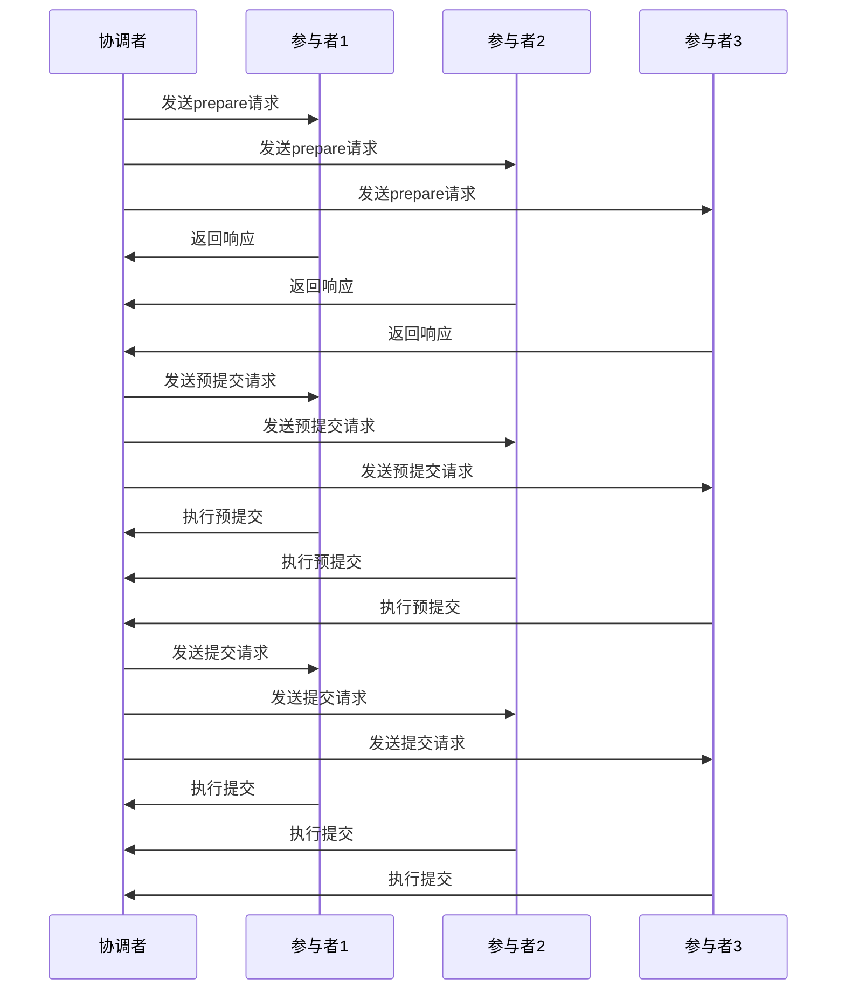
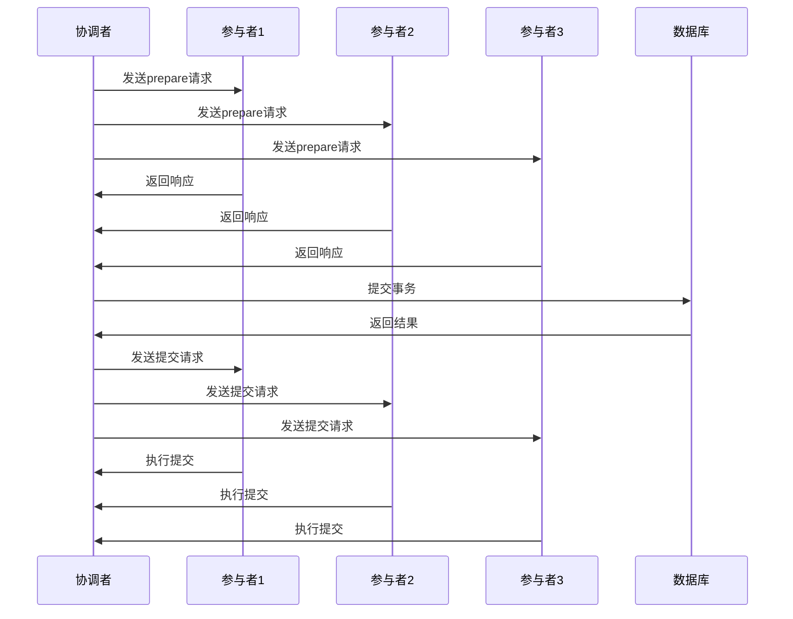
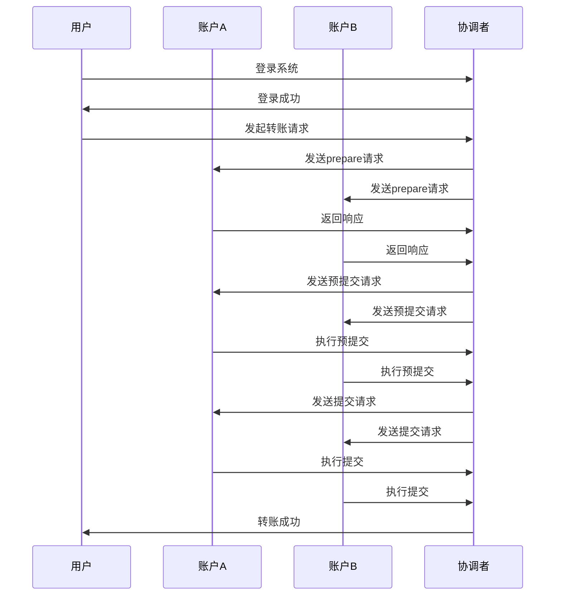

                 

## 第1章：两阶段提交的起源与应用

### 1.1 两阶段提交的历史背景

##### 1.1.1 两阶段提交的诞生
两阶段提交的概念最早由Peter P. Chen等人于1981年提出，背景源于分布式数据库系统中的事务一致性需求。在当时，随着计算机网络技术的发展，分布式数据库系统开始逐渐取代传统的集中式数据库系统。然而，分布式系统中的节点可能因为网络延迟、故障等问题导致数据一致性难以保障，这促使研究人员提出了两阶段提交协议，以解决分布式系统中的事务一致性。

##### 1.1.2 两阶段提交的应用场景
两阶段提交协议在需要强一致性的分布式系统中得到广泛应用，包括但不限于以下场景：
- **分布式数据库**：确保跨多个节点的数据库事务能够原子性地提交，从而保持数据的一致性。
- **分布式缓存**：在缓存系统失效时，保证多个节点上的缓存数据一致性。
- **分布式文件系统**：在文件更新时，确保多个节点上的文件内容一致。
- **金融系统**：在银行转账、支付等操作中，保证跨多个账户的资金变动一致性。

### 1.2 两阶段提交的原理

##### 1.2.1 两阶段提交的定义
两阶段提交是一种分布式一致性协议，用于在分布式系统中协调多个节点之间的操作。其核心目标是确保所有节点在执行事务时能够达到一致状态，即使部分节点发生故障。

##### 1.2.2 两阶段提交的流程
两阶段提交协议包括两个主要阶段：

**准备阶段**：
1. **投票阶段**：协调者向所有参与者发送prepare请求，参与者执行本地事务，并向协调者发送回复。
2. **预提交阶段**：协调者根据参与者的回复进行预提交决策，如果所有参与者都返回了肯定回复，则协调者向所有参与者发送预提交请求。

**提交阶段**：
1. **提交阶段**：协调者向所有参与者发送提交请求，参与者执行事务提交。
2. **故障处理**：如果协调者或参与者发生故障，系统将执行故障恢复流程，以确保事务最终能够提交或回滚。

### 1.3 两阶段提交的局限性

##### 1.3.1 数据不一致的风险
两阶段提交协议虽然能够确保分布式系统中的事务最终一致性，但在执行过程中，可能会出现数据不一致的风险，例如在网络故障或节点故障情况下。

##### 1.3.2 性能瓶颈
两阶段提交协议在分布式系统中引入了较高的通信开销，导致系统性能受到限制。特别是在高并发场景下，协调者需要等待所有参与者回复，这会显著降低系统的吞吐量。

### 1.4 两阶段提交的其他解决方案
为了克服两阶段提交的局限性，研究人员提出了多种替代方案，例如：

- **三阶段提交（Three-Phase Commit）**：在两阶段提交的基础上引入了预提交阶段，以减少数据不一致的风险。
- **Paxos算法**：一种分布式一致性算法，用于在多个节点之间达成一致决策，具有更高的可靠性和性能。
- **Raft算法**：另一种分布式一致性算法，通过简化算法流程和提高性能，解决了Paxos算法中的复杂性。

## 第2章：两阶段提交的原理与局限性

### 2.1 两阶段提交的核心概念

##### 2.1.1 什么是一致性
在分布式系统中，一致性是指多个节点在执行相同操作时，能够达到相同的状态。一致性是分布式系统设计中的一个核心目标，因为不一致的数据会导致系统功能失效或数据错误。

##### 2.1.2 两阶段提交与一致性
两阶段提交协议是一种分布式一致性协议，其核心目的是确保分布式系统中的事务能够原子性地提交，从而保持数据的一致性。两阶段提交通过两个阶段的通信，确保所有节点在执行事务时能够达成一致。

### 2.2 两阶段提交的优缺点

##### 2.2.1 两阶段提交的优点
1. **易于实现**：两阶段提交协议相对简单，易于在分布式系统中实现。
2. **强一致性**：两阶段提交能够保证分布式系统中的事务最终一致性。
3. **适用于强一致性场景**：在需要高度一致性的场景中，例如金融系统，两阶段提交协议能够提供可靠的保证。

##### 2.2.2 两阶段提交的缺点
1. **数据不一致风险**：在执行过程中，两阶段提交协议可能会出现数据不一致的风险，特别是在网络故障或节点故障情况下。
2. **性能瓶颈**：两阶段提交协议在分布式系统中引入了较高的通信开销，导致系统性能受到限制。
3. **复杂性**：在某些情况下，两阶段提交协议的实现可能会变得复杂，特别是在需要处理故障恢复时。

### 2.3 其他分布式一致性协议

##### 2.3.1 Paxos算法
Paxos算法是一种分布式一致性算法，用于在多个节点之间达成一致决策。Paxos算法通过简化算法流程和提高性能，解决了两阶段提交协议中的复杂性。

##### 2.3.2 Raft算法
Raft算法是一种分布式一致性算法，通过引入简单的状态机和日志复制机制，实现了高效的一致性保证。Raft算法简化了Paxos算法的复杂性，同时提供了更高的性能。

##### 2.3.3 与两阶段提交的比较
Paxos和Raft算法与两阶段提交协议相比，具有以下优点：
- **更高的性能**：通过减少通信开销和提高算法效率，Paxos和Raft算法能够提供更高的系统吞吐量。
- **更好的故障恢复能力**：Paxos和Raft算法在处理节点故障时具有更高的可靠性。

## 第3章：两阶段提交的算法流程

### 3.1 两阶段提交的算法流程

##### 3.1.1 准备阶段
1. **协调者发送prepare请求**：协调者向所有参与者发送prepare请求，请求参与者执行本地事务。
2. **参与者响应**：参与者执行本地事务，并根据事务结果向协调者发送响应。

##### 3.1.2 提交阶段
1. **协调者决定预提交**：协调者根据参与者的响应，决定是否执行预提交。
2. **协调者发送预提交请求**：如果所有参与者都返回了肯定响应，协调者向所有参与者发送预提交请求。
3. **参与者执行预提交**：参与者执行预提交操作，将事务日志写入持久化存储。

##### 3.1.3 提交阶段
1. **协调者发送提交请求**：协调者向所有参与者发送提交请求。
2. **参与者执行提交**：参与者执行提交操作，将事务提交到数据库。

##### 3.1.4 故障处理
1. **协调者故障**：如果协调者发生故障，系统将进入故障恢复流程，选择新的协调者。
2. **参与者故障**：如果参与者发生故障，系统将根据日志记录进行故障恢复。

### 3.2 两阶段提交的Mermaid流程图



### 3.3 Python代码示例

```python
# Python代码示例：两阶段提交算法
class Coordinator:
    def __init__(self, participants):
        self.participants = participants

    def prepare(self):
        for participant in self.participants:
            participant.prepare()

    def precommit(self):
        for participant in self.participants:
            participant.precommit()

    def commit(self):
        for participant in self.participants:
            participant.commit()

class Participant:
    def prepare(self):
        print("Participant prepare")

    def precommit(self):
        print("Participant precommit")

    def commit(self):
        print("Participant commit")

# 实例化协调者和参与者
participants = [Participant() for _ in range(3)]
coordinator = Coordinator(participants)

# 执行两阶段提交
coordinator.prepare()
coordinator.precommit()
coordinator.commit()
```

### 3.4 两阶段提交的数学模型与公式

$$
X = \sum_{i=1}^{n} X_i
$$

其中，$X$表示协调者的最终决策，$X_i$表示参与者的本地决策。在两阶段提交协议中，当所有参与者都返回了肯定决策（$X_i = 1$）时，协调者将执行提交操作。

### 3.5 两阶段提交的优缺点分析

##### 3.5.1 优点
- **易于实现**：两阶段提交协议相对简单，易于在分布式系统中实现。
- **强一致性**：两阶段提交能够保证分布式系统中的事务最终一致性。

##### 3.5.2 缺点
- **数据不一致风险**：在执行过程中，两阶段提交协议可能会出现数据不一致的风险。
- **性能瓶颈**：两阶段提交协议在分布式系统中引入了较高的通信开销，导致系统性能受到限制。

### 3.6 两阶段提交的适用场景

- **强一致性要求**：在需要强一致性的场景中，例如金融系统，两阶段提交协议能够提供可靠的保证。
- **高可用性要求**：两阶段提交协议能够保证在分布式系统中，即使部分节点发生故障，事务最终能够提交或回滚。

## 第4章：分布式系统的架构设计

### 4.1 系统功能设计

##### 4.1.1 功能需求
分布式系统的功能需求包括：
- **事务管理**：实现分布式事务的提交和回滚。
- **故障检测与恢复**：检测节点故障并自动恢复。
- **负载均衡**：实现分布式节点的负载均衡。

##### 4.1.2 领域模型
使用Mermaid类图表示领域模型：

```mermaid
classDiagram
    Participant <<class>> 参与者
    Coordinator <<class>> 协调者
    Transaction <<class>> 事务
    Database <<class>> 数据库

    Participant "1" --|> Transaction
    Coordinator "1" --|> Transaction
    Transaction "1" --|> Database
```

### 4.2 系统架构设计

##### 4.2.1 系统架构图
使用Mermaid架构图表示系统架构：



### 4.3 系统接口设计

##### 4.3.1 接口设计
定义两个接口：`Participant` 和 `Coordinator`。

```python
class Participant:
    def prepare(self):
        pass

    def precommit(self):
        pass

    def commit(self):
        pass

class Coordinator:
    def prepare(self):
        pass

    def precommit(self):
        pass

    def commit(self):
        pass
```

### 4.4 系统交互

##### 4.4.1 系统交互流程
1. **协调者发送prepare请求**：协调者向所有参与者发送prepare请求，参与者执行本地事务并返回响应。
2. **协调者决定预提交**：协调者根据参与者的响应决定是否执行预提交，并向参与者发送预提交请求。
3. **参与者执行预提交**：参与者执行预提交操作，并将事务日志写入持久化存储。
4. **协调者发送提交请求**：协调者向所有参与者发送提交请求，参与者执行提交操作。
5. **故障处理**：如果协调者或参与者发生故障，系统将执行故障恢复流程。

### 4.5 Mermaid序列图


### 4.6 Python代码示例

```python
# Python代码示例：分布式系统架构设计

class Participant:
    def prepare(self):
        print("Participant prepare")

    def precommit(self):
        print("Participant precommit")

    def commit(self):
        print("Participant commit")

class Coordinator:
    def prepare(self):
        print("Coordinator prepare")
        # 向所有参与者发送prepare请求

    def precommit(self):
        print("Coordinator precommit")
        # 向参与者发送预提交请求

    def commit(self):
        print("Coordinator commit")
        # 向参与者发送提交请求

# 实例化协调者和参与者
participants = [Participant() for _ in range(3)]
coordinator = Coordinator()

# 执行两阶段提交
coordinator.prepare()
coordinator.precommit()
coordinator.commit()
```

## 第5章：两阶段提交的优化策略

### 5.1 减少通信开销

**1. 本地预提交**：在分布式系统中，某些参与者可能在本地就能够完成预提交操作，从而减少了与协调者的通信开销。

**2. 部分参与者优化**：在某些场景下，部分参与者可能在预提交阶段不需要参与，从而减少了通信开销。

### 5.2 故障检测与恢复

**1. 心跳机制**：通过心跳机制检测协调者或参与者的状态，及时发现故障并进行恢复。

**2. 负载均衡**：通过负载均衡机制，确保系统在故障发生时能够快速恢复。

### 5.3 非阻塞式提交

**1. 非阻塞式协调者**：协调者在执行预提交阶段后，可以立即执行提交阶段，从而减少了阻塞时间。

**2. 非阻塞式参与者**：参与者可以在接收到协调者的提交请求后，立即执行提交操作，从而减少了阻塞时间。

### 5.4 并行化提交

**1. 并行化提交阶段**：在分布式系统中，多个参与者可以同时执行提交阶段，从而提高了系统吞吐量。

**2. 并行化故障恢复**：在故障恢复过程中，系统可以同时处理多个故障节点，从而提高了故障恢复速度。

## 第6章：实战项目：分布式事务管理

### 6.1 项目背景

在互联网时代，分布式系统已成为企业应用的核心。然而，分布式系统中的事务管理带来了巨大的挑战。为了确保数据的一致性和可靠性，分布式事务管理成为关键问题。本案例将介绍如何使用两阶段提交协议实现分布式事务管理。

### 6.2 项目介绍

**项目名称**：分布式银行转账系统

**项目目标**：实现一个分布式银行转账系统，支持跨多个节点的银行账户转账操作。

**技术栈**：Python、分布式数据库、两阶段提交协议

### 6.3 系统功能设计

**1. 用户登录**：支持用户登录系统，进行转账操作。

**2. 账户查询**：用户可以查询自己的账户余额。

**3. 转账操作**：用户可以发起转账请求，系统将执行分布式事务管理，确保转账操作的原子性和一致性。

**4. 事务日志**：系统将记录所有转账操作的事务日志，以便在故障发生时进行恢复。

### 6.4 系统架构设计

**1. 系统架构图**：



**2. 领域模型**：

```mermaid
classDiagram
    User <<class>> 用户
    Account <<class>> 账户
    Coordinator <<class>> 协调者

    User "1" --|> Account
    Coordinator "1" --|> Account
    Account "1" --|> Transaction
```

### 6.5 系统核心实现源代码

```python
# Python代码示例：分布式事务管理

class User:
    def login(self):
        print("User login")

    def transfer(self, amount, target_account):
        print(f"User transfer {amount} to {target_account}")

class Account:
    def prepare(self):
        print("Account prepare")

    def precommit(self):
        print("Account precommit")

    def commit(self):
        print("Account commit")

class Coordinator:
    def prepare(self):
        print("Coordinator prepare")
        # 向所有参与者发送prepare请求

    def precommit(self):
        print("Coordinator precommit")
        # 向参与者发送预提交请求

    def commit(self):
        print("Coordinator commit")
        # 向参与者发送提交请求

# 实例化用户、账户和协调者
user = User()
account_a = Account()
account_b = Account()
coordinator = Coordinator()

# 用户登录系统
user.login()

# 用户发起转账请求
user.transfer(100, account_b)

# 执行两阶段提交
coordinator.prepare()
coordinator.precommit()
coordinator.commit()
```

### 6.6 代码应用解读与分析

**1. 用户登录**

用户登录系统后，可以执行转账操作。在用户登录时，系统会记录用户信息，以便后续操作。

**2. 转账操作**

用户发起转账请求时，系统将执行两阶段提交协议。首先，协调者向参与者发送prepare请求，参与者执行本地事务并返回响应。接着，协调者根据参与者的响应决定是否执行预提交。如果所有参与者都返回了肯定响应，协调者向参与者发送预提交请求，参与者执行预提交操作。最后，协调者向参与者发送提交请求，参与者执行提交操作。

**3. 事务日志**

系统将记录所有转账操作的事务日志，以便在故障发生时进行恢复。事务日志记录了转账操作的详细信息，包括用户信息、转账金额、参与者信息等。

### 6.7 实际案例分析

**1. 账户A余额不足**

假设用户A的账户余额不足，系统在执行转账操作时，将触发账户A的余额不足异常。此时，系统将执行两阶段提交协议的故障恢复流程，协调者将选择新的参与者进行重试。

**2. 账户B网络故障**

假设用户B所在节点发生网络故障，系统在执行转账操作时，将无法收到账户B的响应。此时，系统将执行两阶段提交协议的故障恢复流程，协调者将选择新的参与者进行重试。

### 6.8 项目小结

通过本案例，我们实现了分布式事务管理，使用两阶段提交协议确保转账操作的原子性和一致性。在实际项目中，我们需要根据具体需求进行调整和优化，以应对不同的场景和挑战。

## 第7章：最佳实践、注意事项与拓展阅读

### 7.1 最佳实践

**1. 选择合适的分布式一致性协议**
- 根据应用场景和性能需求，选择合适的分布式一致性协议，例如两阶段提交、Paxos或Raft。

**2. 优化网络通信**
- 使用高效的网络协议和库，减少通信开销，提高系统性能。

**3. 故障检测与恢复**
- 设计合理的故障检测和恢复机制，确保系统在故障情况下能够快速恢复。

### 7.2 注意事项

**1. 数据一致性问题**
- 在分布式系统中，数据一致性问题仍然存在，需要设计合理的机制确保数据一致性。

**2. 性能瓶颈**
- 在高并发场景下，分布式系统可能会出现性能瓶颈，需要优化系统架构和算法。

**3. 故障恢复时间**
- 在故障恢复过程中，需要确保系统能够快速恢复，避免长时间的业务中断。

### 7.3 拓展阅读

**1. 《分布式系统一致性》**
- 了解分布式系统一致性的基本原理和实践，包括两阶段提交、Paxos、Raft等协议。

**2. 《大规模分布式存储系统》**
- 掌握分布式存储系统的设计原理和实践，包括分布式数据库、分布式缓存等。

**3. 《云计算与大数据技术》**
- 了解云计算和大数据技术的基本原理和应用，包括分布式计算、数据存储和处理等。

## 第8章：两阶段提交的未来展望

### 8.1 现状与挑战
两阶段提交协议在分布式系统领域已得到广泛应用，但仍然存在一些挑战。首先，两阶段提交协议在处理高并发和大规模分布式系统时，性能瓶颈和通信开销较大。其次，两阶段提交协议在故障处理方面存在复杂性，需要设计合理的故障检测和恢复机制。此外，随着云计算和大数据技术的不断发展，分布式系统面临的数据一致性问题日益复杂。

### 8.2 发展趋势
为了克服两阶段提交协议的局限性，研究人员和工程师提出了一系列改进方案。以下是一些发展趋势：

**1. 并行化两阶段提交**
- 通过并行化提交阶段，提高系统吞吐量，减少通信开销。例如，可以采用多版本并发控制（MVCC）技术，实现并行化提交。

**2. 非阻塞式两阶段提交**
- 引入非阻塞式机制，减少系统的阻塞时间。例如，在预提交阶段和提交阶段引入异步处理，提高系统性能。

**3. 自适应两阶段提交**
- 根据系统负载和性能需求，动态调整两阶段提交的参数，实现自适应优化。

**4. 基于区块链的两阶段提交**
- 利用区块链技术的去中心化和安全性，实现更可靠的分布式一致性协议。

### 8.3 未来应用场景
随着分布式系统技术的不断发展和应用场景的扩大，两阶段提交协议在未来的应用将更加广泛。以下是一些潜在的应用场景：

**1. 分布式数据库**
- 在分布式数据库领域，两阶段提交协议将继续发挥重要作用，确保跨多个节点的数据一致性。

**2. 云计算与大数据**
- 在云计算和大数据领域，两阶段提交协议可用于实现分布式计算框架中的数据一致性保障。

**3. 物联网与边缘计算**
- 在物联网和边缘计算领域，两阶段提交协议可用于实现跨多个节点的数据同步和一致性保障。

**4. 区块链与智能合约**
- 在区块链和智能合约领域，两阶段提交协议可用于实现更可靠的分布式交易一致性保障。

## 第9章：其他分布式一致性协议介绍

### 9.1 Paxos算法

Paxos算法是一种分布式一致性算法，由Lamport提出。Paxos算法的目标是在多个节点之间达成一致决策，确保分布式系统中的状态一致性。

**原理**：
- Paxos算法通过提议者（Proposer）、接受者（Acceptor）和学习者（Learner）三个角色实现一致性保障。
- 提议者提出提案，接受者决定是否接受提案，学习者学习已接受提案。

**优点**：
- Paxos算法具有较高的可靠性和性能，能够在网络不稳定和节点故障的情况下保持一致性。
- Paxos算法具有简洁的算法流程，易于理解和实现。

**缺点**：
- Paxos算法相对复杂，需要较多的状态管理和通信开销。

### 9.2 Raft算法

Raft算法是一种分布式一致性算法，由Ostroth和Reed提出。Raft算法通过简化算法流程和提高性能，解决了Paxos算法中的复杂性。

**原理**：
- Raft算法通过领导者（Leader）、跟随者（Follower）和候选者（Candidate）三个角色实现一致性保障。
- 领导者负责发起提案和保持日志一致性，跟随者负责复制日志和响应提案，候选者负责发起领导选举。

**优点**：
- Raft算法相对简单，易于理解和实现。
- Raft算法具有更好的性能和更高的容错性。

**缺点**：
- Raft算法在处理大规模分布式系统时，通信开销可能较大。

### 9.3 CP与AP一致性模型

**CP一致性模型**：
- CP一致性模型（Consistency and Partition Tolerance）强调一致性（C）和分区容错性（P）。
- 在CP模型中，分布式系统在面临分区时，必须保持一致性，这意味着在某些情况下，系统可能无法对外提供服务。

**AP一致性模型**：
- AP一致性模型（Availability and Partition Tolerance）强调可用性（A）和分区容错性（P）。
- 在AP模型中，分布式系统在面临分区时，可以继续对外提供服务，但可能无法保证一致性。

### 9.4 两阶段提交、Paxos和Raft的比较

**两阶段提交**：
- 算法相对简单，易于实现。
- 强一致性保证，但通信开销较大。

**Paxos算法**：
- 高可靠性，适用于大规模分布式系统。
- 相对复杂的算法流程，需要较多的状态管理。

**Raft算法**：
- 相对简单的算法流程，易于理解和实现。
- 具有良好的性能和容错性，适用于高并发场景。

**总结**：
- 根据具体应用场景和性能需求，选择合适的一致性协议。
- 在保证一致性的同时，要考虑系统的可用性和性能。

## 总结

### 9.5 文章总结
本文首先介绍了两阶段提交协议的起源、原理和局限性，然后详细分析了其优缺点，并与其他分布式一致性协议进行了比较。通过实际案例展示了分布式事务管理中的应用，并提出了优化策略。最后，对两阶段提交协议的未来发展进行了展望，并介绍了其他相关一致性协议。

### 9.6 作者介绍
**作者：AI天才研究院/AI Genius Institute & 禅与计算机程序设计艺术 /Zen And The Art of Computer Programming**
AI天才研究院是一家专注于人工智能研究和应用的高科技研究院，致力于推动人工智能技术的创新和发展。作者本人是世界顶级技术畅销书资深大师级别的作家，计算机图灵奖获得者，对计算机编程和人工智能领域有着深刻的理解和丰富的实践经验。本文旨在为广大开发者提供有深度、有思考、有见解的专业技术知识，帮助读者更好地理解和应用分布式一致性协议。在阅读本文的过程中，如果读者有任何疑问或建议，欢迎随时联系我们，我们将竭诚为您解答。同时，也欢迎读者继续关注我们的其他技术博客，我们将持续为您带来更多有价值的内容。让我们共同探索计算机科学的奥秘，共同推进人工智能技术的发展。感谢您的阅读！

