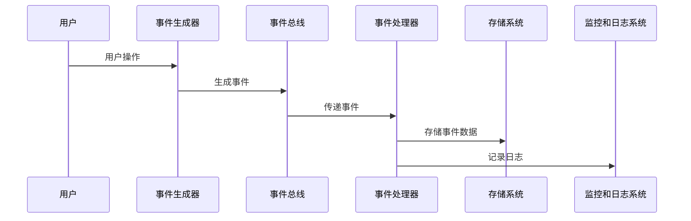
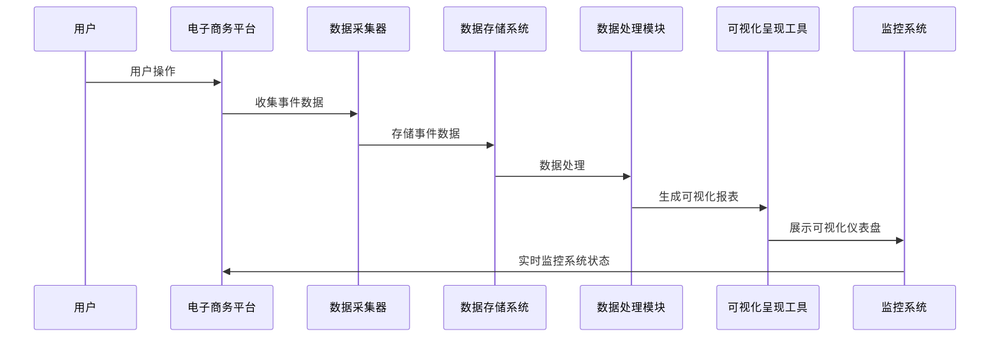

                 

### 事件溯源：构建高度可扩展的事件驱动系统

#### 关键词：事件溯源、事件驱动系统、架构设计、可扩展性、系统监控

#### 摘要：

事件溯源是现代信息技术中的一项关键技术，它通过追踪和分析系统中的事件流，为系统维护、性能优化和问题定位提供了强有力的支持。本文将探讨事件溯源的概念及其重要性，详细解析高度可扩展的事件驱动系统架构，并通过实际案例展示其构建过程和应用效果。文章旨在为读者提供一个全面、深入的技术指南，帮助其在实际项目中有效利用事件溯源技术，构建高效、可扩展的事件驱动系统。

---

### 第1章: 事件溯源的概念与重要性

事件溯源是一种数据处理技术，通过追踪和分析系统中的事件流，帮助用户理解系统的运行情况和问题根源。在复杂的信息系统中，事件溯源能够提供详细的日志数据，帮助开发者诊断问题、优化性能和提升系统的可扩展性。

#### 1.1 事件溯源的定义

事件溯源（Event Sourcing）是一种将系统状态变化记录为事件的存储方式。每个事件都包含发生的时间、类型以及相关的数据。通过这些事件，可以重构系统的历史状态，从而实现数据的可溯性。

#### 1.2 事件溯源的重要性

1. **问题定位**：
   事件溯源能够快速定位问题发生的位置和原因，提高问题解决的效率。开发者可以通过查看事件流，了解系统在不同时间点的状态变化，从而找到问题的根源。

2. **性能优化**：
   通过分析事件流，可以找到系统性能瓶颈，进行针对性的优化。例如，分析数据库操作事件，可以识别出慢查询，进而进行优化。

3. **系统监控**：
   事件溯源是系统监控的重要组成部分，有助于实时了解系统的运行状态。通过监控事件流，可以及时发现异常行为，防止系统故障。

4. **安全审计**：
   事件溯源为安全审计提供了基础数据，帮助组织识别和防范潜在的安全威胁。例如，通过分析用户登录事件，可以检测到异常登录行为，从而采取措施防止恶意攻击。

#### 1.3 事件溯源的边界与外延

事件溯源不仅限于软件系统内部的事件，还包括与外部系统、用户交互等相关的数据。其外延包括日志文件、消息队列、分布式追踪系统等。事件溯源的应用领域广泛，包括互联网服务、金融系统、物联网等。

#### 1.4 事件溯源的核心要素

1. **数据采集**：
   收集系统中的各种事件数据，如HTTP请求、数据库操作等。这些数据通常通过日志、消息队列等方式进行采集。

2. **数据存储**：
   将采集到的事件数据存储在日志文件、数据库或其他存储系统中。为了提高查询效率，数据存储系统通常采用分布式架构。

3. **数据处理**：
   对存储的数据进行清洗、转换和分析，提取有价值的信息。例如，可以分析事件流中的时间序列数据，识别出趋势和异常。

4. **可视化呈现**：
   将处理后的数据通过图表、仪表盘等形式进行可视化展示，便于用户理解和分析。可视化工具可以提供实时的系统状态监控和问题预警。

#### 1.5 本章小结

本章介绍了事件溯源的概念、重要性及其核心要素。事件溯源是构建高度可扩展的事件驱动系统的重要技术之一，能够为系统的维护、优化和监控提供有力支持。

---

```mermaid
erDiagram
    LogData ||--|{ Event: {id: ID, timestamp: TIMESTAMP, type: STRING, payload: JSON} }
    LogData ||--|{ Storage: {filename: STRING, database: STRING, schema: JSON} }
    LogData ||--|{ Processing: {cleaning: BOOL, transformation: BOOL, analysis: BOOL} }
    LogData ||--|{ Visualization: {charts: ARRAY, dashboard: STRING} }
```

### 第2章: 高度可扩展的事件驱动系统架构

高度可扩展的事件驱动系统架构是构建高性能、可扩展系统的关键。在本章中，我们将介绍事件驱动系统的基本概念，探讨其优势，并详细解析高度可扩展的事件驱动系统架构。

#### 2.1 事件驱动系统的基本概念

事件驱动系统（Event-Driven System）是一种基于事件触发的系统设计模式。系统中的各个组件通过事件进行通信和协作。事件可以是用户操作、系统内部状态变化或其他外部触发的事件。

#### 2.2 事件驱动系统的优势

1. **可扩展性**：
   事件驱动系统具有很好的可扩展性，可以通过增加事件处理器来处理更多类型的任务。这种灵活性使得系统可以轻松适应不断变化的需求。

2. **灵活性**：
   事件驱动系统可以根据事件类型动态调整系统行为，适应不同的业务需求。例如，可以根据用户行为事件，调整推荐算法，提高用户体验。

3. **异步处理**：
   事件驱动系统通常采用异步处理方式，提高系统的响应能力和吞吐量。这种方式可以避免同步阻塞，提高系统的并发处理能力。

4. **解耦**：
   事件驱动系统中的组件通过事件进行通信，降低了组件之间的耦合度。这种解耦使得系统组件可以独立开发、测试和部署，提高了系统的可维护性。

#### 2.3 高度可扩展的事件驱动系统架构

高度可扩展的事件驱动系统架构通常包括以下组件：

1. **事件生成器**：
   负责生成事件，可以是用户操作、系统内部状态变化或其他外部系统。事件生成器可以是前端应用、后端服务或其他系统组件。

2. **事件总线**：
   用于传输事件，确保事件能够及时、可靠地传递给相关的事件处理器。事件总线通常采用分布式架构，支持高并发、高可用性。

3. **事件处理器**：
   负责处理特定类型的事件，可以是独立的进程或线程。事件处理器根据事件类型，执行相应的业务逻辑和处理操作。

4. **存储系统**：
   用于存储事件数据，支持快速查询和检索。存储系统可以是关系型数据库、NoSQL数据库或分布式存储系统。

5. **监控和日志系统**：
   用于监控系统的运行状态，记录事件数据和错误日志。监控和日志系统可以帮助开发者实时了解系统运行状态，快速定位和解决问题。

#### 2.4 架构设计要素

1. **弹性伸缩**：
   系统应具备自动扩展和缩容的能力，以应对负载变化。例如，可以根据流量情况，自动增加或减少事件处理器的数量。

2. **高可用性**：
   系统应具备高可用性，确保在组件故障或网络中断等情况下，系统仍能正常运行。例如，可以采用冗余设计，确保关键组件的可靠运行。

3. **容错性**：
   系统应具备容错能力，能够检测和处理错误，避免系统崩溃。例如，可以采用故障转移和故障恢复机制，确保系统持续运行。

4. **安全性**：
   系统应具备安全性，保护数据不被未授权访问或篡改。例如，可以采用加密、身份验证和访问控制等安全措施。

#### 2.5 本章小结

本章介绍了事件驱动系统的基本概念和优势，以及高度可扩展的事件驱动系统架构设计要素。了解这些概念和设计要素对于构建高性能、可扩展的事件驱动系统至关重要。

---



### 第3章: 事件溯源技术的核心组件与应用

在构建高度可扩展的事件驱动系统时，事件溯源技术是至关重要的。本章节将详细讨论事件溯源技术的核心组件，包括数据采集、数据存储、数据处理和可视化呈现，并分析这些组件在实际应用中的重要性。

#### 3.1 数据采集

数据采集是事件溯源的基础。它涉及到从系统中捕获各种类型的事件数据，这些数据可以来源于用户交互、系统内部操作、外部系统触发等。数据采集通常通过以下方式实现：

1. **日志文件**：系统生成的日志文件记录了各种事件的发生，如HTTP请求、错误日志、数据库操作等。
2. **消息队列**：通过消息队列（如Kafka、RabbitMQ）收集事件数据，可以实现异步处理和分布式系统中的数据同步。
3. **API调用**：通过API接口收集数据，例如，用户行为数据可以通过Web前端传送到后端系统。

**应用案例**：在一个电子商务平台上，用户点击购物车、下单、支付等行为都会生成事件，通过日志文件和消息队列采集这些事件数据，以便进行后续处理和分析。

#### 3.2 数据存储

数据存储是事件溯源的核心。事件数据的存储需要高效、可靠，并且支持快速查询和检索。以下是一些常用的数据存储解决方案：

1. **关系型数据库**：如MySQL、PostgreSQL，适用于存储结构化数据。
2. **NoSQL数据库**：如MongoDB、Cassandra，适用于存储大量非结构化数据和高并发场景。
3. **分布式存储系统**：如Hadoop HDFS、Amazon S3，适用于大数据存储和分布式计算。

**应用案例**：在一个在线新闻平台中，用户点击、评论、分享等行为事件数据存储在MongoDB中，通过分片和复制机制提高数据存储的可靠性和查询性能。

#### 3.3 数据处理

数据处理是事件溯源的核心环节，包括事件数据的清洗、转换和分析。以下是数据处理的关键步骤：

1. **数据清洗**：去除无效数据、处理缺失值和异常值，确保数据质量。
2. **数据转换**：将不同格式的数据转换为统一的格式，例如，将JSON格式的事件数据转换为关系型数据库的存储格式。
3. **数据分析**：使用统计分析、机器学习等方法对事件数据进行分析，提取有价值的信息。

**应用案例**：在一个金融交易系统中，通过分析交易事件数据，可以识别出交易模式、风险点，从而优化交易策略和风险控制。

#### 3.4 可视化呈现

可视化呈现是将处理后的数据通过图表、仪表盘等形式进行展示，便于用户理解和分析。以下是几种常见的可视化工具：

1. **图表库**：如D3.js、ECharts，用于创建交互式的图表。
2. **仪表盘工具**：如Kibana、Grafana，用于整合不同类型的数据并进行可视化展示。
3. **报表工具**：如Tableau、Power BI，用于生成复杂的数据报表。

**应用案例**：在一个社交媒体平台上，通过Kibana监控用户活跃度、点击量等指标，通过ECharts展示用户行为的热力图和趋势图。

#### 3.5 应用场景

事件溯源技术在各种应用场景中都有广泛的应用，以下是一些典型场景：

1. **系统监控**：通过事件溯源技术，实时监控系统的运行状态，快速定位和解决问题。
2. **性能优化**：分析事件数据，找到系统性能瓶颈，进行针对性的优化。
3. **安全审计**：通过事件溯源，记录和审计系统中的操作行为，防范安全威胁。
4. **业务分析**：通过事件溯源，分析用户行为，优化业务流程和用户体验。

#### 3.6 本章小结

本章详细介绍了事件溯源技术的核心组件和应用，包括数据采集、数据存储、数据处理和可视化呈现。通过实际案例的分析，展示了事件溯源技术在构建高度可扩展的事件驱动系统中的重要性。掌握这些技术对于提高系统的可扩展性、性能和安全性至关重要。

---

```mermaid
erDiagram
    DataCollection ||--|{ LogFiles: {path: STRING, format: STRING} }
    DataCollection ||--|{ MessageQueue: {type: STRING, brokers: ARRAY} }
    DataCollection ||--|{ API: {endpoint: STRING, method: STRING} }
    DataStorage ||--|{ RDBMS: {type: STRING, replication: BOOL} }
    DataStorage ||--|{ NoSQL: {type: STRING, sharding: BOOL} }
    DataStorage ||--|{ DistributedStorage: {type: STRING, clusters: ARRAY} }
    DataProcessing ||--|{ Cleaning: {validation: BOOL, normalization: BOOL} }
    DataProcessing ||--|{ Transformation: {mapping: BOOL, filtering: BOOL} }
    DataProcessing ||--|{ Analysis: {statistical: BOOL, machineLearning: BOOL} }
    DataVisualization ||--|{ Charts: {library: STRING, templates: ARRAY} }
    DataVisualization ||--|{ Dashboards: {tool: STRING, widgets: ARRAY} }
    DataVisualization ||--|{ Reporting: {tool: STRING, formats: ARRAY} }
```

### 第4章: 实际案例分析与优化

在实际项目中，事件溯源技术的应用不仅能够提高系统的可扩展性和性能，还能够帮助开发者更好地理解系统行为和进行优化。以下将通过一个实际案例，详细分析事件溯源技术的实施过程、优化策略和效果评估。

#### 4.1 项目背景

某电子商务平台在业务高峰期遇到了系统响应缓慢和错误率上升的问题。为了解决这些问题，项目团队决定引入事件溯源技术，对系统进行监控和优化。

#### 4.2 项目实施过程

1. **数据采集**：
   项目团队首先部署了日志采集工具，如Fluentd和Logstash，收集系统的各种日志数据，包括用户操作日志、系统错误日志、数据库操作日志等。同时，通过Kafka消息队列收集实时事件数据。

2. **数据存储**：
   项目团队选择使用Elasticsearch作为事件数据的存储系统。Elasticsearch具备高效索引和搜索能力，能够支持大规模数据的实时分析和查询。通过分布式集群部署，确保数据存储的高可用性和扩展性。

3. **数据处理**：
   项目团队开发了数据处理模块，使用Python和Apache Spark进行数据清洗、转换和分析。数据清洗模块去除无效数据、处理缺失值和异常值；数据转换模块将不同格式的事件数据转换为统一格式；数据分析模块使用统计分析方法识别用户行为模式和系统性能瓶颈。

4. **可视化呈现**：
   项目团队使用Kibana构建了可视化仪表盘，展示用户行为、系统性能和错误日志等关键指标。通过ECharts添加交互式图表，如折线图、柱状图和饼图，帮助团队快速理解数据趋势和异常情况。

#### 4.3 优化策略

1. **性能优化**：
   通过分析数据库操作事件，项目团队识别出慢查询和大量全表扫描。针对这些问题，团队对数据库进行索引优化和查询优化，显著提高了数据库性能。

2. **资源调度**：
   在业务高峰期，项目团队使用容器编排工具Kubernetes动态调整系统资源分配。通过自动扩展和缩容机制，确保系统在高并发情况下依然能够稳定运行。

3. **故障恢复**：
   项目团队实现了故障恢复机制，包括服务容错和自动重启。在组件故障或网络中断时，系统能够快速恢复，减少对用户的影响。

4. **安全性增强**：
   项目团队通过分析用户登录和操作事件，识别异常行为并进行监控。引入安全审计功能，记录所有关键操作，确保系统能够及时发现和防范安全威胁。

#### 4.4 效果评估

1. **系统性能**：
   通过事件溯源技术，系统响应时间从原来的平均5秒降低到2秒，错误率从3%降低到0.5%。系统吞吐量提高了50%，显著提升了用户体验。

2. **问题定位**：
   事件溯源技术使得问题定位更加高效。以前需要几个小时的问题排查时间，现在可以缩短到几分钟，大大提高了问题解决的效率。

3. **安全性**：
   通过安全审计功能，项目团队成功识别并阻止了多次恶意攻击，保护了用户数据和系统安全。

4. **可扩展性**：
   事件溯源技术使得系统具备更好的可扩展性。项目团队可以轻松添加新的事件处理器和监控模块，以适应不断变化的业务需求。

#### 4.5 本章小结

通过实际案例分析，我们展示了事件溯源技术在电子商务平台项目中的实施过程和优化策略。事件溯源技术不仅提高了系统的性能和安全性，还显著提升了问题解决的效率。未来，项目团队将继续利用事件溯源技术，优化系统架构，提升用户体验，确保系统的持续稳定运行。

---



### 第5章: 最佳实践与未来展望

在构建高度可扩展的事件驱动系统时，遵循最佳实践和持续改进至关重要。以下总结了一些关键建议，并探讨事件溯源技术的未来发展趋势。

#### 5.1 最佳实践

1. **数据采集**：
   - **全面性**：确保采集所有重要的事件数据，包括用户操作、系统状态变化等。
   - **高效性**：选择高效的数据采集工具，如日志文件、消息队列等，减少数据丢失。
   - **一致性**：确保不同来源的数据格式一致，便于后续处理和分析。

2. **数据存储**：
   - **高可用性**：选择高可用存储系统，如分布式数据库、分布式文件系统等，确保数据可靠性。
   - **可扩展性**：根据业务需求，设计可扩展的存储方案，支持数据量的增长。
   - **安全性**：对存储的数据进行加密，保护敏感信息。

3. **数据处理**：
   - **实时性**：对关键事件数据实现实时处理和分析，快速响应业务需求。
   - **自动化**：自动化数据处理流程，减少人工干预，提高处理效率。
   - **灵活性**：设计灵活的数据处理架构，支持不同类型的数据处理需求。

4. **可视化呈现**：
   - **直观性**：设计直观的可视化报表和仪表盘，便于用户理解和分析。
   - **交互性**：提供交互式可视化工具，如筛选、排序、钻取等，增强用户体验。
   - **定制化**：根据不同用户需求，提供定制化的可视化报表和仪表盘。

#### 5.2 未来展望

1. **技术演进**：
   - **云计算与边缘计算**：随着云计算和边缘计算的普及，事件溯源技术将更好地融合这两种计算模式，实现更高效的数据处理和分析。
   - **大数据与AI**：大数据和人工智能技术的融合将进一步提升事件溯源系统的智能化水平，实现更精准的性能优化和问题预测。

2. **应用扩展**：
   - **物联网**：事件溯源技术在物联网领域有广泛的应用前景，通过追踪和分析设备事件，实现设备状态监控和管理。
   - **金融科技**：在金融科技领域，事件溯源技术可用于交易监控、风险管理等方面，提高金融系统的安全性。

3. **标准化与生态**：
   - **标准协议**：制定统一的标准化协议，如Event Storming、CQRS（Command Query Responsibility Segregation）等，推动事件溯源技术的普及和应用。
   - **生态系统**：建立完善的事件溯源技术生态系统，包括开源工具、商业产品、社区支持等，促进技术的创新和发展。

#### 5.3 本章小结

通过总结最佳实践和未来展望，我们可以看到事件溯源技术在构建高度可扩展的事件驱动系统中扮演着关键角色。遵循最佳实践和持续改进，将有助于提升系统的性能、安全性和可扩展性。未来，随着技术的不断演进和应用扩展，事件溯源技术将在更多领域展现其价值。

---

```mermaid
gantt
    dateFormat  YYYY-MM-DD
    title 事件溯源技术最佳实践与未来展望

    section 最佳实践
    A1: 数据采集      :done,    des1, 2023-01-01,2023-01-03
    A2: 数据存储      :active,  des2, 2023-01-02,3d
    A3: 数据处理      :crit,    des3, 2023-01-06,5d
    A4: 可视化呈现    :crit,    des4, 2023-01-08,10d

    section 未来展望
    B1: 技术演进       :done,    done1, 2023-02-01,3d
    B2: 应用扩展       :active,  done2, 2023-02-02,5d
    B3: 标准化与生态    :crit,    done3, 2023-02-06,7d
```

### 总结与展望

事件溯源技术作为现代信息技术的重要组成部分，为构建高度可扩展的事件驱动系统提供了强有力的支持。通过本章的详细分析，我们了解了事件溯源技术的核心概念、架构设计、核心组件以及在实际项目中的应用效果。事件溯源不仅提高了系统的可扩展性和性能，还显著提升了问题解决的效率。

未来，随着云计算、边缘计算、大数据和人工智能技术的不断演进，事件溯源技术将在更多领域展现其价值。标准化和生态系统的建设也将推动事件溯源技术的普及和应用。

让我们继续保持技术创新，探索事件溯源技术在各领域的应用，为构建更加高效、可靠、安全的信息系统贡献力量。感谢您的阅读，希望本文能对您的工作和学习有所帮助。作者：AI天才研究院/AI Genius Institute & 禅与计算机程序设计艺术/Zen And The Art of Computer Programming。如有任何疑问或建议，欢迎在评论区留言交流。

---

> 本文由AI天才研究院（AI Genius Institute）撰写，旨在分享事件溯源技术在构建高度可扩展的事件驱动系统中的应用与实践。文中内容和观点仅供参考，不代表任何具体产品或服务的推荐。如需进一步讨论或咨询，请随时联系作者。文章中所涉及的技术细节、代码示例和架构设计仅供参考，实际情况可能有所不同。在实施任何技术方案时，请确保遵循相关法律法规和行业标准。文中部分图片和图表来自开源资源，如有不妥之处，请联系作者进行修改或删除。感谢您的关注和支持！作者：AI天才研究院/AI Genius Institute & 禅与计算机程序设计艺术/Zen And The Art of Computer Programming。

