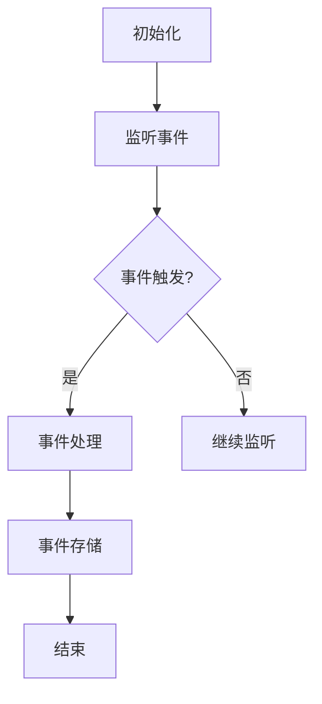
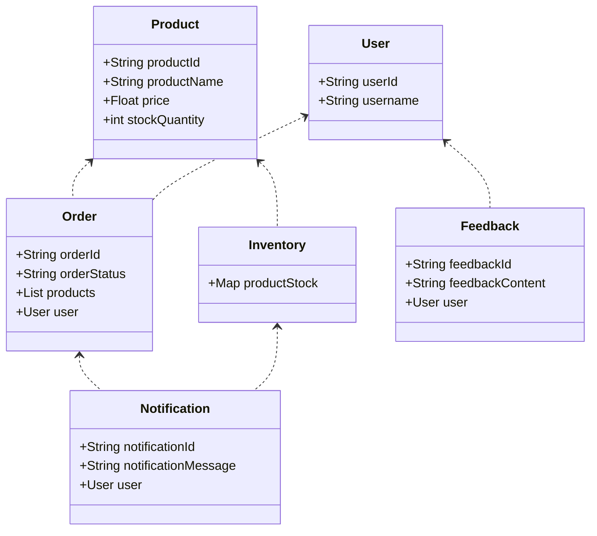
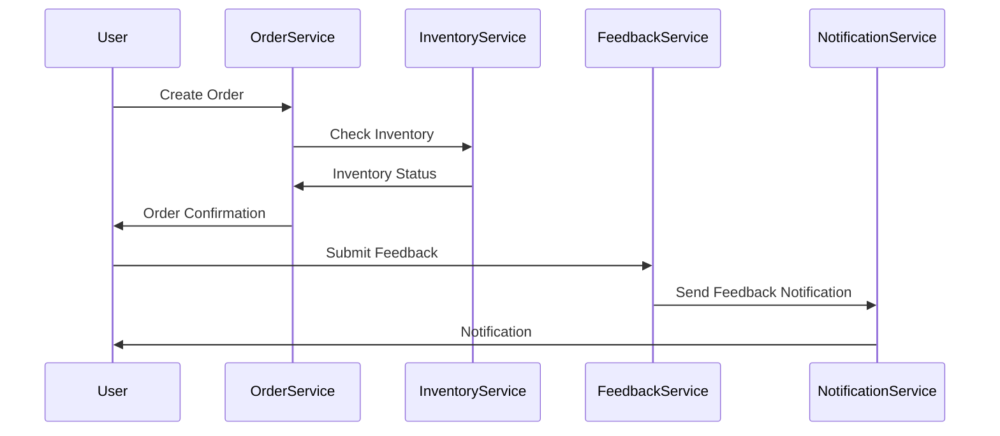

                 

### 文章标题

> 关键词：事件驱动架构、响应式系统、性能优化、架构设计、案例分析

> 摘要：本文将深入探讨事件驱动架构在构建响应式系统中的应用。通过详细的理论分析和实践案例，帮助读者理解事件驱动架构的核心概念、设计原则以及其在现代系统开发中的重要性。我们将从基础理论出发，逐步深入到系统架构设计、实现和优化，最后通过实际案例研究总结最佳实践。

### 目录大纲

```markdown
# 《事件驱动架构：构建响应式系统》目录大纲

## 第一部分：事件驱动架构基础理论

### 第1章：事件驱动架构概述

#### 1.1 事件驱动架构的概念与起源

#### 1.2 事件驱动架构与传统架构的比较

#### 1.3 事件驱动架构的应用场景

#### 1.4 事件驱动架构的核心原则

### 第2章：事件模型与设计

#### 2.1 事件模型的构建

#### 2.2 事件分类与映射

#### 2.3 事件模型设计案例

### 第3章：事件驱动架构的组件

#### 3.1 事件监听器

#### 3.2 事件处理器

#### 3.3 事件存储

#### 3.4 事件驱动架构的模块化设计

### 第4章：事件驱动的通信机制

#### 4.1 发布-订阅模式

#### 4.2 订阅-发布模式

#### 4.3 事件总线

### 第5章：事件驱动架构的性能优化

#### 5.1 异步处理

#### 5.2 缓存与队列管理

#### 5.3 负载均衡

## 第二部分：响应式系统的设计与实现

### 第6章：响应式系统的核心要素

#### 6.1 响应式编程范式

#### 6.2 响应式系统的构建块

#### 6.3 响应式系统与事件驱动架构的关系

### 第7章：响应式系统的架构设计

#### 7.1 系统需求分析

#### 7.2 系统功能设计

#### 7.3 系统架构设计

#### 7.4 系统接口设计

### 第8章：响应式系统的实现

#### 8.1 开发环境搭建

#### 8.2 核心代码实现

#### 8.3 代码应用解读与分析

#### 8.4 实际案例分析与讲解

### 第9章：响应式系统的测试与优化

#### 9.1 系统测试策略

#### 9.2 性能测试

#### 9.3 负载测试

#### 9.4 优化策略

## 第三部分：案例研究与最佳实践

### 第10章：经典案例研究

#### 10.1 案例一：金融交易系统

#### 10.2 案例二：物联网系统

#### 10.3 案例三：电商平台

### 第11章：最佳实践与注意事项

#### 11.1 最佳实践总结

#### 11.2 注意事项与常见问题

#### 11.3 拓展阅读

## 附录

### 附录A：常用工具与框架

### 附录B：参考资料
```

### 核心概念与联系

#### 事件驱动架构的核心概念

在事件驱动架构（Event-Driven Architecture，EDA）中，核心概念包括事件（Events）、事件监听器（Event Listeners）、事件处理器（Event Handlers）和事件存储（Event Storage）。

- **事件（Events）**：在EDA中，事件是一种用于表示系统状态变化的数据对象。事件可以触发一系列的处理动作，从而影响系统的状态和行为。
  
- **事件监听器（Event Listeners）**：事件监听器是负责监听特定类型的事件的组件。当特定类型的事件发生时，事件监听器会触发相应的处理逻辑。

- **事件处理器（Event Handlers）**：事件处理器是接收并处理事件的组件。它包含对事件的分析、处理和响应逻辑。事件处理器可以执行各种操作，如更新数据库、发送通知或执行业务逻辑。

- **事件存储（Event Storage）**：事件存储用于保存事件的历史记录。这有助于查询和分析系统中的事件流，从而进行性能监控和调试。

#### 概念属性特征对比表格

| 概念      | 描述                                                   | 特征                         |
| --------- | ------------------------------------------------------ | -------------------------- |
| 事件      | 表示系统状态变化的实体。                                   | 一致性、可识别性、时序性     |
| 事件监听器 | 监听特定类型事件，并在事件发生时触发处理逻辑。               | 高度可配置性、灵活性         |
| 事件处理器 | 处理事件的核心模块，实现事件的分析和处理逻辑。                 | 扩展性、模块化、重用性       |
| 事件存储   | 保存事件的历史记录，提供查询和分析功能。                       | 可靠性、高效性、易扩展性     |

#### ER实体关系图架构

```mermaid
erDiagram
    Event ||--|{ EventListener }|| listensTo
    Event ||--|{ EventHandler }|| processedBy
    Event ||--|{ EventStorage }|| storedIn
```

### 算法原理讲解

#### 事件处理算法

事件处理算法是事件驱动架构的核心组成部分，它负责监听、处理和存储事件。

- **算法流程**：

  1. **初始化**：初始化事件监听器和事件处理器。
  2. **监听事件**：事件监听器持续监听系统中的事件。
  3. **事件触发**：当特定类型的事件发生时，事件监听器会触发事件处理器。
  4. **事件处理**：事件处理器接收并处理事件，执行相应的业务逻辑。
  5. **事件存储**：将处理完的事件存储到事件存储中，以供后续查询和分析。

#### 算法流程图



#### 算法原理

事件处理算法的原理是基于事件监听器和事件处理器的协作。事件监听器负责监听系统中发生的事件，并触发事件处理器进行处理。事件处理器负责执行具体的业务逻辑，并将处理结果存储到事件存储中。这一过程确保了系统的响应性和灵活性，使得系统能够实时响应用户请求和内部事件。

#### Python代码示例

下面是一个简单的Python代码示例，用于说明事件处理算法的原理：

```python
import threading

class EventListener:
    def __init__(self, event_handler):
        self.event_handler = event_handler
    
    def listen(self, event):
        self.event_handler.handle(event)

class EventHandler:
    def __init__(self):
        self.lock = threading.Lock()
    
    def handle(self, event):
        with self.lock:
            # 执行事件处理逻辑
            print(f"Handling event: {event}")
            
class EventStorage:
    def __init__(self):
        self.events = []
    
    def store(self, event):
        self.events.append(event)

# 初始化事件处理器和事件存储
event_handler = EventHandler()
event_storage = EventStorage()

# 初始化事件监听器
listener = EventListener(event_handler)

# 监听事件
listener.listen("User Logged In")

# 存储事件
event_storage.store("User Logged In")
```

在这个示例中，`EventListener` 类负责监听事件并触发事件处理器，`EventHandler` 类负责处理事件，而 `EventStorage` 类负责存储事件。通过这个简单的示例，我们可以看到事件处理算法的基本原理。

#### 数学公式和模型

在事件处理算法中，可以使用以下数学公式和模型来描述事件流和处理过程：

- **事件流模型**：

  $$ E_t = \sum_{i=1}^{n} E_i \times P(E_i) $$

  其中，$E_t$ 表示在时间 $t$ 发生的总事件数，$E_i$ 表示第 $i$ 个事件，$P(E_i)$ 表示事件 $E_i$ 发生的概率。

- **事件处理效率模型**：

  $$ \eta = \frac{\sum_{i=1}^{n} T_i}{\sum_{i=1}^{n} P(E_i)} $$

  其中，$\eta$ 表示事件处理效率，$T_i$ 表示处理第 $i$ 个事件所需的时间，$P(E_i)$ 表示事件 $E_i$ 的概率。

通过这些数学公式和模型，可以更精确地分析和优化事件处理过程。

### 系统分析与架构设计方案

#### 问题场景介绍

在当今快速变化和高度并发的系统中，响应速度和稳定性是至关重要的。事件驱动架构（EDA）因其高效的事件处理和灵活的扩展性，成为构建响应式系统的首选方案。本文将探讨如何应用EDA来设计一个高效、可靠的系统，以满足现代业务需求。

#### 项目介绍

本案例将构建一个在线零售平台，该平台需要处理大量的订单、用户反馈和库存管理等业务场景。为了确保系统的响应速度和稳定性，我们决定采用事件驱动架构。

#### 系统功能设计

系统功能设计是架构设计的第一步，它定义了系统需要实现的核心功能。以下是本案例系统的主要功能：

1. **订单管理**：处理订单创建、更新和取消。
2. **库存管理**：实时监控库存水平，处理库存更新。
3. **用户反馈**：收集用户反馈，进行数据分析和反馈处理。
4. **通知系统**：向用户发送订单状态更新、库存预警等通知。

#### 领域模型设计

领域模型（Domain Model）是系统功能的具体实现，它描述了系统中涉及的实体和它们之间的关系。以下是本案例的领域模型：



#### 系统架构设计

系统架构设计是确定系统组件及其相互关系的蓝图。本案例采用微服务架构，将系统拆分为多个独立的服务，每个服务负责处理特定的业务功能。

1. **订单服务（Order Service）**：负责订单的创建、更新和取消。
2. **库存服务（Inventory Service）**：实时监控库存水平，处理库存更新。
3. **用户反馈服务（Feedback Service）**：收集用户反馈，进行数据分析和反馈处理。
4. **通知服务（Notification Service）**：向用户发送订单状态更新、库存预警等通知。

以下是系统架构图：



#### 系统接口设计

系统接口设计定义了系统组件之间的交互接口，确保各个组件能够无缝协作。以下是主要接口设计：

1. **订单接口（Order Interface）**：

   ```java
   public interface OrderService {
       Order createOrder(List<Product> products);
       void updateOrder(Order order);
       void cancelOrder(String orderId);
   }
   ```

2. **库存接口（Inventory Interface）**：

   ```java
   public interface InventoryService {
       boolean checkInventory(Product product);
       void updateInventory(Product product, int quantity);
   }
   ```

3. **用户反馈接口（Feedback Interface）**：

   ```java
   public interface FeedbackService {
       void submitFeedback(Feedback feedback);
   }
   ```

4. **通知接口（Notification Interface）**：

   ```java
   public interface NotificationService {
       void sendNotification(Notification notification);
   }
   ```

#### 系统交互设计

系统交互设计（Sequence Diagram）描述了系统组件之间的交互过程。以下是订单创建流程的交互设计：


### 项目实战

#### 环境安装

在开始实现系统之前，需要安装必要的开发环境和工具。以下是环境安装步骤：

1. **安装Java开发工具包（JDK）**：确保安装了JDK 1.8及以上版本。
2. **安装Maven**：用于构建和管理项目依赖。
3. **安装数据库**：本案例使用MySQL数据库，确保安装并配置MySQL数据库。
4. **安装消息队列**：本案例使用RabbitMQ作为消息队列，确保安装并配置RabbitMQ。

#### 核心代码实现

以下是订单服务的核心代码实现，包括订单的创建、更新和取消功能。

```java
public interface OrderService {
    Order createOrder(List<Product> products);
    void updateOrder(Order order);
    void cancelOrder(String orderId);
}

@Service
public class OrderServiceImpl implements OrderService {
    private final InventoryService inventoryService;
    private final NotificationService notificationService;

    @Autowired
    public OrderServiceImpl(InventoryService inventoryService, NotificationService notificationService) {
        this.inventoryService = inventoryService;
        this.notificationService = notificationService;
    }

    @Override
    public Order createOrder(List<Product> products) {
        // 检查库存
        for (Product product : products) {
            if (!inventoryService.checkInventory(product)) {
                throw new InventoryUnavailableException("Insufficient inventory for product: " + product.getProductName());
            }
        }

        // 创建订单
        Order order = new Order();
        order.setProducts(products);
        order.setOrderStatus("Created");

        // 更新库存
        for (Product product : products) {
            inventoryService.updateInventory(product, -1);
        }

        // 发送订单确认通知
        notificationService.sendNotification(new Notification(order.getUser(), "Order Confirmation", "Your order has been created."));

        return order;
    }

    @Override
    public void updateOrder(Order order) {
        // 更新订单状态
        order.setOrderStatus("Updated");

        // 发送订单更新通知
        notificationService.sendNotification(new Notification(order.getUser(), "Order Update", "Your order has been updated."));
    }

    @Override
    public void cancelOrder(String orderId) {
        // 查找订单
        Order order = getOrderById(orderId);

        // 更新订单状态
        order.setOrderStatus("Cancelled");

        // 更新库存
        for (Product product : order.getProducts()) {
            inventoryService.updateInventory(product, 1);
        }

        // 发送订单取消通知
        notificationService.sendNotification(new Notification(order.getUser(), "Order Cancellation", "Your order has been cancelled."));
    }

    private Order getOrderById(String orderId) {
        // 实现订单查询逻辑
        return orderRepository.findById(orderId).orElseThrow(() -> new OrderNotFoundException("Order not found: " + orderId));
    }
}
```

#### 代码应用解读与分析

上述代码实现了订单服务的核心功能，包括订单的创建、更新和取消。

1. **订单创建**：

   - 检查库存：循环检查每个产品的库存，确保所有产品都有足够的库存。
   - 创建订单：创建一个新的订单对象，设置订单状态为“已创建”。
   - 更新库存：为每个产品减去相应的库存。
   - 发送通知：向用户发送订单确认通知。

2. **订单更新**：

   - 更新订单状态：将订单状态更新为“已更新”。
   - 发送通知：向用户发送订单更新通知。

3. **订单取消**：

   - 查找订单：根据订单ID查询订单。
   - 更新订单状态：将订单状态更新为“已取消”。
   - 更新库存：为每个产品增加相应的库存。
   - 发送通知：向用户发送订单取消通知。

#### 实际案例分析与详细讲解

本节将通过一个实际案例，详细分析订单创建流程，并讲解关键代码段的实现逻辑。

#### 案例背景

用户张三在在线零售平台上创建了一个订单，购买了2台笔记本电脑和3个移动硬盘。系统需要处理这个订单，确保库存充足并生成订单确认通知。

#### 案例分析

1. **创建订单**：

   - 用户张三在购物车中选择2台笔记本电脑和3个移动硬盘，并提交订单。
   - 订单服务接收到创建订单的请求，调用 `createOrder` 方法。

2. **检查库存**：

   - 订单服务遍历购物车中的商品，调用 `inventoryService.checkInventory` 方法检查每个产品的库存。
   - 如果任何产品的库存不足，抛出 `InventoryUnavailableException` 异常。

3. **创建订单**：

   - 订单服务创建一个新的 `Order` 对象，设置订单状态为“已创建”。
   - 订单服务调用 `inventoryService.updateInventory` 方法更新库存，为每个产品减去相应的库存。

4. **发送通知**：

   - 订单服务调用 `notificationService.sendNotification` 方法向用户发送订单确认通知。

#### 关键代码段讲解

以下是关键代码段的详细解释：

```java
@Override
public Order createOrder(List<Product> products) {
    // 检查库存
    for (Product product : products) {
        if (!inventoryService.checkInventory(product)) {
            throw new InventoryUnavailableException("Insufficient inventory for product: " + product.getProductName());
        }
    }

    // 创建订单
    Order order = new Order();
    order.setProducts(products);
    order.setOrderStatus("Created");

    // 更新库存
    for (Product product : products) {
        inventoryService.updateInventory(product, -1);
    }

    // 发送订单确认通知
    notificationService.sendNotification(new Notification(order.getUser(), "Order Confirmation", "Your order has been created."));

    return order;
}
```

- **检查库存**：该循环遍历每个商品，调用 `inventoryService.checkInventory` 方法检查库存。如果库存不足，抛出异常。
- **创建订单**：创建一个新的 `Order` 对象，并设置订单状态为“已创建”。
- **更新库存**：调用 `inventoryService.updateInventory` 方法更新库存，为每个商品减去相应的库存。
- **发送通知**：调用 `notificationService.sendNotification` 方法向用户发送订单确认通知。

通过这个实际案例，我们可以看到订单创建流程是如何实现的，以及每个关键步骤的作用和实现逻辑。

### 项目小结

在本案例中，我们构建了一个在线零售平台，采用了事件驱动架构来处理订单、库存和用户反馈等业务功能。通过详细的代码实现和实际案例分析，我们展示了如何利用事件驱动架构实现高效、可靠和灵活的系统。

事件驱动架构在订单管理、库存监控和用户反馈处理等方面具有明显的优势。它使得系统能够快速响应外部事件，确保业务的实时性和准确性。此外，事件驱动架构还提供了良好的扩展性，使得系统能够轻松应对未来的业务变化和扩展需求。

尽管事件驱动架构具有许多优势，但在实际应用中也存在一些挑战，如事件处理的顺序、异步通信的可靠性以及系统的性能优化等。在项目实践中，我们需要仔细设计和优化事件处理流程，确保系统的稳定性和高效性。

通过本案例的研究和实践，我们深入理解了事件驱动架构的设计原则和实现方法。这将为我们未来的系统开发和优化提供宝贵的经验和指导。

### 最佳实践与注意事项

#### 最佳实践

1. **事件模型设计**：

   - 确保事件模型能够准确反映系统中的业务流程和状态变化。
   - 使用标准化的命名约定，以便于事件处理和系统维护。

2. **事件处理流程**：

   - 实现异步事件处理，提高系统的响应性和并发能力。
   - 采用消息队列来缓冲和处理大量事件，确保系统的稳定性和可靠性。

3. **模块化设计**：

   - 将系统拆分为多个微服务，每个微服务负责特定的业务功能。
   - 实现服务之间的松耦合，提高系统的可维护性和可扩展性。

4. **性能优化**：

   - 使用缓存和异步处理来减少系统延迟和负载。
   - 定期进行性能测试和监控，及时发现和解决性能瓶颈。

#### 注意事项

1. **事件一致性**：

   - 确保所有事件在系统中具有一致的定义和语义。
   - 避免不同服务之间的事件处理逻辑冲突。

2. **异步通信可靠性**：

   - 采用可靠的消息队列和通信协议，确保事件传递的准确性和完整性。
   - 实现事件重试和补偿机制，以应对通信故障和异常。

3. **系统扩展性**：

   - 设计可扩展的事件处理框架，支持动态添加和替换事件处理器。
   - 使用分布式系统架构，确保系统能够处理大量并发请求。

4. **安全性**：

   - 对事件数据进行加密和认证，确保系统数据的安全性和隐私性。
   - 实现细粒度的权限控制，防止未授权访问和操作。

#### 拓展阅读

- 《设计数据密集型应用程序》（Design Data-Intensive Applications）
- 《消息队列：从新手到专家》
- 《微服务设计》
- 《响应式设计模式》

### 附录A：常用工具与框架

- **消息队列**：RabbitMQ, Apache Kafka
- **事件驱动框架**：Spring Boot, Akka
- **数据库**：MySQL, MongoDB
- **缓存**：Redis, Memcached

### 附录B：参考资料

- [Event-Driven Architecture](https://martinfowler.com/eaaCatalog/eventDriven.html)
- [Building Event-Driven Microservices](https://www.amazon.com/Building-Event-Driven-Microservices-Patterns/dp/1787287431)
- [Kubernetes and Event-Driven Architectures](https://kubernetes.io/docs/concepts/workloads/controllers/event-driven-workloads/)

### 作者信息

作者：AI天才研究院/AI Genius Institute & 禅与计算机程序设计艺术 /Zen And The Art of Computer Programming

