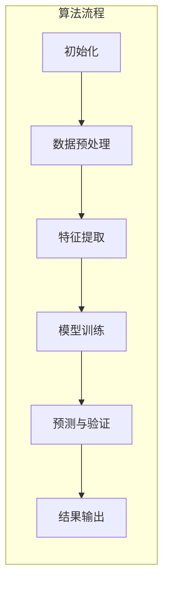
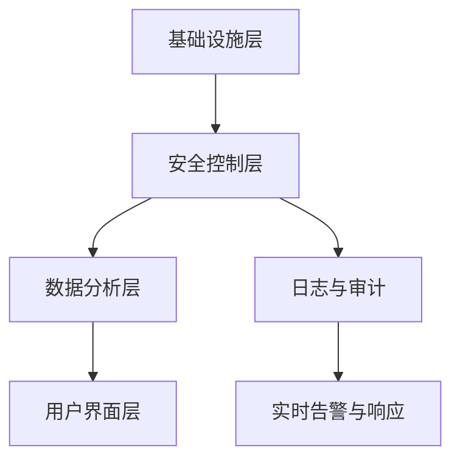

                 

### 引言

在当今数字化时代，云计算和容器化技术已经成为企业信息化建设的重要驱动力。云原生（Cloud Native）作为一种新兴的技术范式，旨在构建和运行在云环境中的应用。它强调微服务架构、动态管理、可持续交付和 DevOps 文化。然而，随着云原生技术的广泛应用，安全问题也日益凸显。云原生安全架构设计成为确保系统稳定、可靠和安全运行的关键因素。

云原生安全不仅仅是对传统安全架构的简单迁移，它需要重新审视安全策略、流程和工具，以适应云原生环境的动态性和分布式特性。本文将深入探讨云原生安全架构的设计，旨在帮助读者理解云原生安全的核心概念、原理和实践，从而构建一个坚实、可靠的安全防护体系。

本文将从以下几个方面展开讨论：

1. **背景介绍**：介绍云原生与安全的问题背景，包括云原生技术发展、安全问题日益凸显等。
2. **核心概念与联系**：详细阐述云原生安全的基本概念、重要属性，与传统安全对比，以及云原生安全的架构与层级。
3. **算法原理讲解**：讲解云原生安全算法的原理，包括mermaid流程图、Python源代码、数学模型与公式等。
4. **系统分析与架构设计方案**：分析云原生安全系统的功能设计、架构设计、接口设计和交互。
5. **项目实战**：介绍云原生安全项目的环境安装、系统核心实现、代码应用解读、项目分析与讲解。
6. **最佳实践与总结**：分享云原生安全最佳实践、注意事项和拓展阅读。

通过本文的逐步分析，我们希望读者能够系统地掌握云原生安全架构设计的方法和技巧，为实际应用提供有力支持。

关键词：云原生、安全、架构设计、微服务、容器化、安全算法、数学模型、系统分析、项目实战、最佳实践

摘要：本文旨在深入探讨云原生安全架构设计，从背景介绍、核心概念与联系、算法原理讲解、系统分析与架构设计方案、项目实战、最佳实践与总结等方面，全面解析云原生安全的关键要素和设计思路，为读者提供一份全面、系统的云原生安全架构指南。

----------------------------------------------------------------

### 背景介绍

#### 云原生技术的发展

云原生（Cloud Native）概念最早由Nginx的创始人Igor Sysoev在2013年提出，但其理念早在2000年代初期就已经开始萌芽。云原生技术的核心思想是利用云计算的灵活性、可扩展性和可靠性，构建和运行分布式系统。与传统架构相比，云原生强调微服务架构、动态管理、持续交付和DevOps文化。

云原生技术的发展可以分为几个阶段：

1. **容器化技术的兴起**：Docker在2013年的推出标志着容器化技术的兴起，随后Kubernetes等编排工具的出现进一步推动了容器化技术的发展。容器化技术使得应用程序可以在不同的环境中一致运行，从而解决了传统虚拟机环境下环境不一致的问题。

2. **微服务架构的流行**：微服务架构通过将大型单体应用拆分成多个小型、独立的服务，每个服务专注于单一功能，这样可以提高系统的可扩展性、可维护性和容错能力。

3. **服务网格技术的引入**：服务网格（Service Mesh）如Istio、Linkerd等，为微服务之间的通信提供了独立的、可靠和安全的管理层，使得服务之间的通信更加透明和可监控。

4. **无服务器架构的发展**：无服务器架构（Serverless Architecture）使得开发者无需关注底层基础设施的管理，只需关注业务逻辑的实现。云原生平台如AWS Lambda、Google Cloud Functions等，为无服务器架构提供了强大的支持。

#### 安全问题的凸显

随着云原生技术的广泛应用，安全问题也日益凸显。云原生环境具有动态性、分布式和高可扩展性等特点，这使得传统的安全解决方案难以适应。以下是一些常见的安全挑战：

1. **容器安全问题**：容器由于其轻量化和隔离性，成为攻击者攻击的目标。容器镜像的安全漏洞、容器编排工具的配置错误等都可能导致安全风险。

2. **服务网格安全问题**：服务网格虽然提供了高效的服务通信机制，但也引入了新的安全挑战。服务网格中的网络流量可能成为攻击者的攻击目标，因此需要严格的安全策略和监控。

3. **无服务器安全问题**：无服务器架构虽然简化了基础设施的管理，但也使得开发者可能忽视了安全问题。例如，AWS Lambda等无服务器平台的函数可能成为攻击者的攻击入口。

4. **数据安全问题**：在云原生环境中，数据往往分布在多个云区域和存储节点中，这使得数据保护变得更加复杂。数据加密、访问控制和数据备份等安全措施需要得到加强。

#### 安全问题的解决

面对云原生环境中的安全问题，传统的安全解决方案已经难以应对。以下是一些常见的解决策略：

1. **零信任安全模型**：零信任安全模型（Zero Trust Model）强调不再依赖内部网络的安全，而是对所有访问请求进行严格的验证和授权。这需要实现细粒度的身份验证和授权策略，确保只有经过严格验证的用户和设备才能访问资源。

2. **容器安全**：容器安全包括容器镜像的扫描、容器运行时的监控和容器编排工具的安全配置等。通过使用工具如Docker Bench for Security、Aqua Security等，可以确保容器镜像和运行时的安全性。

3. **服务网格安全**：服务网格安全需要通过配置服务网格工具（如Istio、Linkerd等）的安全策略，确保网络流量得到严格控制和监控。此外，使用加密技术保护服务网格中的通信也是重要的安全措施。

4. **数据安全**：数据安全需要通过加密、访问控制和备份等措施确保数据的安全性和完整性。在云原生环境中，数据加密可以采用透明数据加密（TDE）技术，访问控制可以采用RBAC（基于角色的访问控制）策略，数据备份则需要定期进行以防止数据丢失。

通过上述策略和工具，可以构建一个较为完善的云原生安全架构，确保系统的稳定、可靠和安全运行。

### 云原生安全的边界与外延

云原生安全不仅关注技术层面的安全，还涉及组织、流程和文化的建设。其边界和外延可以从以下几个方面进行阐述：

1. **技术边界**：
   - **容器安全**：容器是云原生环境的核心组件，其安全主要涉及容器镜像的安全性、容器运行时的监控和容器编排工具的安全性。
   - **服务网格安全**：服务网格为微服务之间的通信提供了独立的、可靠和安全的管理层，其安全包括网络流量的加密、身份验证和授权策略等。
   - **无服务器安全**：无服务器架构虽然简化了基础设施的管理，但也需要关注函数的安全配置和执行时的监控。
   - **数据安全**：数据安全是云原生安全的重要组成部分，包括数据的加密、访问控制和备份等。

2. **组织边界**：
   - **安全责任**：在云原生环境中，安全责任需要明确分配，包括开发人员、运维人员和安全团队。每个角色都需要承担相应的安全职责。
   - **安全培训和意识提升**：组织需要定期进行安全培训和意识提升，确保员工了解云原生环境中的安全风险和防护措施。

3. **流程边界**：
   - **安全开发生命周期**（SDLC）：在开发过程中，需要将安全贯穿整个SDLC，包括需求分析、设计、开发、测试和部署等阶段。
   - **持续集成与持续部署**（CI/CD）：在CI/CD流程中，需要引入安全检查和自动化测试，确保每次代码变更都经过严格的审查和验证。

4. **文化边界**：
   - **DevOps文化**：在DevOps文化中，安全不再是单独的安全团队的责任，而是整个团队的共同责任。通过DevOps实践，可以促进开发和运维团队之间的协作，从而提高整体安全水平。
   - **安全文化建设**：组织需要营造一种安全文化，鼓励员工主动报告安全问题和风险，共同维护系统的安全。

通过上述边界和外延的界定，可以构建一个全面、系统的云原生安全架构，确保系统的稳定、可靠和安全运行。

### 云原生安全的核心要素

云原生安全架构的构建需要关注以下几个核心要素，这些要素相互关联，共同构成了一个全面、可靠的安全防护体系。

1. **身份认证与访问控制**：
   - **身份认证**：确保只有授权用户和设备能够访问系统和资源。常见的身份认证方式包括基于用户名和密码的认证、基于证书的认证和基于多因素认证（MFA）。
   - **访问控制**：通过访问控制策略，限制用户和设备对系统和资源的访问权限。基于角色的访问控制（RBAC）和基于属性的访问控制（ABAC）是常用的访问控制机制。

2. **加密与数据保护**：
   - **数据加密**：对存储和传输的数据进行加密，防止数据泄露。常见的数据加密技术包括对称加密、非对称加密和哈希算法。
   - **数据完整性**：确保数据在传输和存储过程中未被篡改。使用数字签名和哈希校验等技术可以实现数据的完整性保护。

3. **网络安全**：
   - **防火墙和入侵检测系统**：通过配置防火墙规则和部署入侵检测系统（IDS），监控和阻止恶意流量进入系统。
   - **虚拟专用网络（VPN）**：使用VPN建立加密的通信通道，确保数据在传输过程中的安全性。

4. **日志与监控**：
   - **日志记录**：记录系统的事件和操作日志，用于后续的安全审计和故障排查。
   - **实时监控**：通过实时监控系统的关键指标和异常行为，及时发现和响应安全事件。

5. **漏洞管理与更新**：
   - **漏洞扫描**：定期对系统和应用程序进行漏洞扫描，发现潜在的安全漏洞。
   - **更新与补丁管理**：及时安装系统和应用程序的更新补丁，修复已知的安全漏洞。

6. **安全合规与审计**：
   - **合规性检查**：确保系统和应用程序符合相关的安全标准和法规要求，如ISO 27001、NIST等。
   - **安全审计**：定期进行安全审计，评估安全策略和措施的有效性，发现潜在的安全隐患。

通过以上核心要素的有机整合，可以构建一个全面、动态、自适应的云原生安全架构，确保系统在云原生环境中的稳定、可靠和安全运行。

### 云原生安全核心概念

云原生安全涉及多个核心概念，这些概念相互交织，共同构成了云原生安全的基础。以下是这些核心概念及其详细阐述：

#### **1. 云原生**

**定义**：云原生是指设计和构建应用程序，使其能够在云环境中高效运行的一组原则和做法。云原生强调可扩展性、弹性、持续交付和微服务架构。

**特点**：
- **可扩展性**：云原生应用能够根据需求自动扩展，以处理增加的负载。
- **弹性**：云原生应用能够在资源不足或故障时自动调整，确保服务的连续性。
- **持续交付**：云原生实践鼓励频繁的代码发布和快速迭代。
- **微服务架构**：应用程序被分解为小型、独立的微服务，每个微服务负责单一功能。

**关系**：云原生是云原生安全的基础，决定了安全策略和措施的设计与实施。

#### **2. 容器安全**

**定义**：容器安全是指保护容器环境中的应用程序和数据免受攻击的一系列措施。容器安全包括容器镜像的安全、容器运行时的安全以及容器编排工具的安全。

**特点**：
- **容器镜像安全**：通过扫描容器镜像中的漏洞和恶意代码，确保镜像的安全。
- **容器运行时安全**：监控容器运行时的行为，防止恶意行为和资源滥用。
- **容器编排工具安全**：确保容器编排工具（如Docker和Kubernetes）的安全配置和更新。

**关系**：容器安全是云原生安全的重要组成部分，直接关系到应用程序和数据的安全。

#### **3. 服务网格安全**

**定义**：服务网格是一个基础设施层，负责管理和监控服务之间的通信。服务网格安全涉及保护服务网格中的流量和通信。

**特点**：
- **流量加密**：使用TLS加密服务网格中的通信流量，防止窃听和篡改。
- **访问控制**：通过身份验证和授权策略，确保只有授权的服务能够访问其他服务。
- **服务监控**：实时监控服务网格中的流量和异常行为，及时发现和响应安全事件。

**关系**：服务网格安全是确保微服务之间通信安全的关键措施，直接影响整个系统的安全性。

#### **4. 无服务器安全**

**定义**：无服务器安全是指保护无服务器架构（如AWS Lambda、Google Cloud Functions）中的应用程序和函数免受攻击的一系列措施。

**特点**：
- **函数安全**：确保函数的安全配置，防止恶意代码和未授权访问。
- **环境隔离**：通过隔离环境，防止函数之间的相互影响。
- **访问控制**：通过身份验证和授权策略，控制对函数的访问。

**关系**：无服务器安全是云原生安全的重要方面，确保无服务器架构的高效、可靠和安全运行。

#### **5. 数据安全**

**定义**：数据安全是指保护存储和传输的数据免受未授权访问、泄露和篡改的一系列措施。

**特点**：
- **数据加密**：对数据进行加密，确保数据在传输和存储过程中不被窃取。
- **访问控制**：通过访问控制策略，确保只有授权的用户和系统可以访问数据。
- **数据备份**：定期备份数据，以防止数据丢失和损坏。

**关系**：数据安全是云原生安全的核心要素，直接关系到业务连续性和数据完整性。

通过上述核心概念的解释和关系分析，我们可以更好地理解云原生安全的概念体系，为后续的安全架构设计和实施提供理论基础。

### 云原生安全与传统安全对比

在云原生环境中，传统的安全解决方案面临着诸多挑战，无法完全满足云原生应用的需求。以下是云原生安全与传统安全在技术特点和应用场景上的对比。

#### **技术特点对比**

1. **动态性**：
   - **传统安全**：传统安全架构往往基于静态的防火墙和访问控制列表，无法适应快速变化的应用环境。
   - **云原生安全**：云原生安全采用动态安全策略，如基于微服务的访问控制和零信任模型，能够灵活应对应用环境的动态变化。

2. **分布式**：
   - **传统安全**：传统安全架构通常基于中心化的架构，依赖于单一的安全设备或服务器，容易成为攻击的目标。
   - **云原生安全**：云原生安全架构采用分布式设计，将安全功能分散到各个服务中，提高了系统的整体安全性和抗攻击能力。

3. **自动化**：
   - **传统安全**：传统安全解决方案往往依赖于人工操作，响应速度较慢。
   - **云原生安全**：云原生安全通过自动化工具和脚本，实现安全配置、监控和响应的自动化，提高了安全管理的效率和准确性。

4. **细粒度控制**：
   - **传统安全**：传统安全通常以整个网络或系统为单位进行安全控制，缺乏细粒度的控制能力。
   - **云原生安全**：云原生安全采用细粒度的访问控制策略，如基于角色的访问控制和基于属性的访问控制，确保每个用户和设备都能被严格限制。

#### **应用场景对比**

1. **容器安全**：
   - **传统安全**：传统安全往往无法有效保护容器环境，因为容器具有轻量化和快速部署的特点，难以进行传统防火墙和入侵检测系统的配置。
   - **云原生安全**：云原生安全通过容器镜像扫描、容器运行时监控和安全编排工具，提供全面、自动化的容器安全保护。

2. **服务网格安全**：
   - **传统安全**：传统安全方案无法直接保护微服务之间的通信，因为它们通常基于物理网络和防火墙。
   - **云原生安全**：服务网格安全通过加密通信、访问控制和流量监控，保护微服务之间的安全通信。

3. **无服务器安全**：
   - **传统安全**：传统安全方案难以适应无服务器架构，因为无服务器架构对基础设施的管理要求较高。
   - **云原生安全**：云原生安全提供了专门的无服务器安全解决方案，如AWS Lambda的安全配置和保护，确保无服务器应用的安全。

4. **数据安全**：
   - **传统安全**：传统安全方案通常通过数据备份和加密来保护数据，但难以应对分布式数据存储和频繁的数据交换。
   - **云原生安全**：云原生安全通过分布式数据加密、数据访问控制和备份策略，确保数据在分布式环境中的安全性。

#### **总结**

云原生安全在技术特点和应用场景上与传统安全存在显著差异。云原生安全利用动态性、分布式、自动化和细粒度控制等特性，能够更好地适应云原生环境的快速变化和复杂需求。相比之下，传统安全方案在应对云原生环境时面临诸多挑战，需要借助云原生安全工具和方法来实现有效的安全防护。

### 云原生安全架构与层级

云原生安全架构设计需要考虑多个层次，以确保系统的全面性和层次性。以下是对云原生安全架构的层级划分及其各层安全功能的详细介绍。

#### **基础设施层**

**功能**：基础设施层主要负责保护云原生环境的基础设施，包括计算资源、存储资源和网络资源。

- **计算资源安全**：确保虚拟机或容器的安全，包括防火墙配置、权限管理和资源隔离。
- **存储资源安全**：保护存储数据的安全性，包括数据加密、访问控制和备份策略。
- **网络资源安全**：确保网络传输的安全，包括使用VPN、防火墙和加密协议。

#### **容器层**

**功能**：容器层是云原生环境中的核心组件，主要负责保护容器镜像、容器运行时和容器编排工具。

- **容器镜像安全**：通过扫描和签名技术，确保容器镜像中没有恶意代码和安全漏洞。
- **容器运行时安全**：监控容器运行时的行为，防止恶意行为和资源滥用。
- **容器编排工具安全**：确保容器编排工具（如Docker和Kubernetes）的安全配置和更新。

#### **服务网格层**

**功能**：服务网格层主要负责管理和监控微服务之间的通信，确保通信的安全性和可靠性。

- **流量加密**：使用TLS加密服务网格中的通信流量，防止窃听和篡改。
- **访问控制**：通过身份验证和授权策略，确保只有授权的服务能够访问其他服务。
- **服务监控**：实时监控服务网格中的流量和异常行为，及时发现和响应安全事件。

#### **应用层**

**功能**：应用层负责保护实际运行在云原生环境中的应用程序和数据。

- **应用安全**：包括身份认证、授权、输入验证和输出编码等，防止常见的安全漏洞。
- **数据安全**：对应用程序中的数据进行加密和访问控制，确保数据的安全性和完整性。
- **应用监控**：监控应用程序的性能和安全性，及时发现和处理异常情况。

#### **数据层**

**功能**：数据层主要负责保护存储在云原生环境中的数据，包括数据库、缓存和日志等。

- **数据加密**：对数据进行加密，确保数据在传输和存储过程中不被窃取。
- **数据备份**：定期备份数据，以防止数据丢失和损坏。
- **数据监控**：实时监控数据存储的状态和安全性，确保数据的安全性和可用性。

通过上述层级的详细划分和功能描述，我们可以构建一个全面、系统的云原生安全架构，确保系统的稳定、可靠和安全运行。

### 云原生安全算法原理

在云原生安全架构中，算法的原理和实现是至关重要的。为了更好地理解和应用这些算法，我们将使用mermaid流程图来展示算法的基本流程，并使用Python源代码详细阐述算法的实现。此外，本文还将介绍算法的数学模型和公式，并进行举例说明。

#### **算法mermaid流程图**

以下是云原生安全算法的基本mermaid流程图：



#### **算法Python源代码**

接下来，我们将使用Python语言实现上述算法的基本步骤。以下是一个简单的算法实现示例：

```python
import pandas as pd
from sklearn.model_selection import train_test_split
from sklearn.ensemble import RandomForestClassifier
from sklearn.metrics import accuracy_score

# 数据预处理
def preprocess_data(data):
    # 数据清洗和转换
    return data

# 特征提取
def extract_features(data):
    # 特征提取过程
    return data

# 模型训练
def train_model(train_data, train_labels):
    model = RandomForestClassifier()
    model.fit(train_data, train_labels)
    return model

# 预测与验证
def predict_and_validate(model, test_data, test_labels):
    predictions = model.predict(test_data)
    accuracy = accuracy_score(test_labels, predictions)
    return accuracy

# 主函数
def main():
    # 读取数据
    data = pd.read_csv('data.csv')
    data = preprocess_data(data)
    features = extract_features(data)
    
    # 分割数据集
    train_data, test_data, train_labels, test_labels = train_test_split(features, labels, test_size=0.2, random_state=42)
    
    # 训练模型
    model = train_model(train_data, train_labels)
    
    # 预测与验证
    accuracy = predict_and_validate(model, test_data, test_labels)
    print(f"模型准确率: {accuracy:.2f}")

if __name__ == "__main__":
    main()
```

#### **算法原理详细讲解**

1. **数据预处理**：数据预处理是算法实现的第一步，包括数据清洗和转换。通过处理缺失值、异常值和噪声数据，提高数据的质量和一致性。

2. **特征提取**：特征提取是从原始数据中提取对模型训练有用的特征。通过选择和转换特征，可以减少数据的维度，提高模型的训练效率。

3. **模型训练**：模型训练是使用训练数据集对模型进行训练的过程。在这里，我们使用随机森林分类器（Random Forest Classifier）进行训练。

4. **预测与验证**：在预测与验证阶段，使用训练好的模型对测试数据进行预测，并通过准确率（Accuracy）等指标评估模型的性能。

#### **算法原理的数学模型与公式**

1. **随机森林模型**：

   - **基本概念**：随机森林是一种集成学习方法，通过构建多个决策树，并结合它们的预测结果进行投票，得到最终的预测结果。
   - **数学公式**：

     \[
     f(x) = \sum_{i=1}^{n} w_i f_i(x)
     \]

     其中，\(f_i(x)\) 表示第 \(i\) 棵决策树的预测结果，\(w_i\) 表示第 \(i\) 棵决策树的权重。

2. **特征提取**：

   - **基本概念**：特征提取是通过选择和转换特征，减少数据的维度，提高模型的训练效率。
   - **数学公式**：

     \[
     f_j = \phi_j(x_j)
     \]

     其中，\(f_j\) 表示第 \(j\) 个特征，\(x_j\) 表示原始数据，\(\phi_j\) 表示特征转换函数。

通过上述算法原理的详细讲解和数学模型与公式的介绍，我们可以更好地理解云原生安全算法的实现和应用，为实际项目提供理论基础和实践指导。

### 云原生安全数学模型

在云原生安全中，数学模型的应用可以帮助我们更好地理解和解决安全问题。以下是一个简化的数学模型，用于描述云原生环境中的安全风险和防护策略。

#### **数学模型概述**

该模型主要关注以下几个核心变量：

- **R（Risk）**：表示安全风险，是系统在特定环境下可能遭受的安全威胁和潜在损失的综合度量。
- **P（Probability）**：表示安全事件发生的概率，反映了威胁出现的可能性。
- **C（Consequence）**：表示安全事件发生的后果，是安全事件对系统的影响程度。
- **V（Value）**：表示系统的价值，反映了系统的重要性和业务价值。

#### **数学公式**

1. **风险计算公式**：

   \[
   R = P \times C
   \]

   该公式表示风险是概率和后果的乘积，用于计算安全风险的大小。

2. **防护效果公式**：

   \[
   E = \frac{1}{R \times (1 - \text{PF})}
   \]

   其中，\(E\) 表示防护效果，PF（Protection Factor）表示防护因子，反映了防护措施的有效性。该公式表示在防护措施作用下，安全风险降低的程度。

3. **价值与风险的关系**：

   \[
   \text{Value} \propto \frac{1}{R}
   \]

   该公式表示系统的价值与风险成反比，即风险越高，系统的价值越低。

#### **详细讲解**

1. **风险计算**：

   风险是云原生安全中一个重要的概念，它反映了系统在特定环境下面临的安全威胁程度。通过计算风险，可以识别系统中的主要风险点，为安全防护措施提供依据。

   - **示例**：假设一个云原生系统面临DDoS攻击，攻击概率为0.3，攻击后果可能导致系统瘫痪，损失为100万元。则该系统的风险计算如下：

     \[
     R = 0.3 \times 100 = 30 \text{万元}
     \]

2. **防护效果**：

   防护效果反映了防护措施的有效性。通过计算防护效果，可以评估防护措施对风险降低的贡献。

   - **示例**：如果采取防火墙和入侵检测系统作为防护措施，防护因子为0.8，则防护效果计算如下：

     \[
     E = \frac{1}{30 \times (1 - 0.8)} = \frac{1}{6} \approx 0.17
     \]

     这意味着防护措施能够将风险降低到原来的1/6。

3. **价值与风险的关系**：

   系统的价值与风险密切相关。在云原生环境中，系统的重要性越高，其承受的风险能力也越强。

   - **示例**：假设一个云原生系统对业务至关重要，其价值为1000万元。如果风险为30万元，则系统的价值与风险的关系如下：

     \[
     \text{Value} \propto \frac{1}{30} = \frac{1000}{30} \approx 33.33 \text{万元/风险单位}
     \]

通过上述数学模型的应用，我们可以更系统地分析和评估云原生环境中的安全风险，为制定有效的防护策略提供科学依据。在实际应用中，可以根据具体场景和需求，调整模型中的参数和公式，以适应不同的安全需求。

### 云原生安全系统分析

在云原生安全系统中，我们需要首先明确问题场景，然后设计系统功能，并在此基础上进行系统架构设计和接口设计。以下是对这些步骤的详细描述。

#### **问题场景介绍**

在云原生环境中，常见的安全问题包括容器安全漏洞、服务网格攻击、无服务器函数权限管理以及数据泄露等。为了解决这些问题，我们需要设计一个全面、可靠的云原生安全系统。

**场景描述**：一个企业采用云原生架构部署了一系列微服务和无服务器函数，这些服务分布在多个云区域中。为了保障系统的安全性，企业需要实现以下功能：
1. **容器镜像扫描**：定期对容器镜像进行漏洞扫描，确保镜像的安全。
2. **服务网格流量监控**：监控服务网格中的流量，检测潜在的安全威胁。
3. **无服务器函数权限管理**：确保无服务器函数的权限设置正确，防止未经授权的访问。
4. **数据加密与备份**：对存储和传输的数据进行加密，并定期备份，防止数据泄露和损坏。

#### **系统功能设计**

系统功能设计是构建云原生安全系统的第一步，以下列出该系统的核心功能：

1. **容器镜像扫描**：定期对容器镜像进行扫描，检测是否存在安全漏洞和恶意代码。
2. **服务网格流量监控**：监控服务网格中的流量，使用加密协议保护通信，检测潜在的安全威胁。
3. **无服务器函数权限管理**：确保无服务器函数的权限设置正确，限制函数的访问范围。
4. **数据加密与备份**：对存储和传输的数据进行加密，并定期备份，确保数据的安全性和完整性。
5. **日志与审计**：记录系统的操作日志和安全事件，用于后续的审计和故障排查。
6. **实时告警与响应**：实时监控系统状态，发现安全事件时及时告警并采取措施。

#### **系统架构设计**

系统架构设计是确保系统功能实现的关键，以下是一个简化的云原生安全系统架构设计：

1. **基础设施层**：包括云原生环境的基础设施，如容器引擎、服务网格、无服务器函数和存储系统。
2. **安全控制层**：实现容器镜像扫描、服务网格流量监控、无服务器函数权限管理和数据加密等功能。
3. **数据分析层**：收集系统日志和安全事件，进行实时分析和告警。
4. **用户界面层**：提供用户操作界面，展示系统状态、安全事件和告警信息。

**mermaid架构图**：



#### **系统接口设计与交互**

系统接口设计是确保各功能模块之间能够良好协作的关键。以下列出系统的主要接口及其交互方式：

1. **容器镜像扫描接口**：接收容器镜像，进行扫描和分析，返回漏洞报告。
2. **服务网格监控接口**：监控服务网格中的流量，检测潜在的安全威胁，并返回监控数据。
3. **无服务器函数权限管理接口**：设置和修改无服务器函数的权限，确保访问控制策略的正确执行。
4. **数据加密与备份接口**：加密和解密数据，执行数据备份和恢复操作。
5. **日志与审计接口**：记录系统操作日志和安全事件，提供查询和审计功能。
6. **实时告警与响应接口**：接收实时告警信息，触发相应的响应措施。

通过上述系统功能设计、架构设计和接口设计，我们可以构建一个全面、可靠的云原生安全系统，确保云原生环境中的应用程序和数据的安全性和稳定性。

### 云原生安全项目实战

#### **环境安装与配置**

为了演示云原生安全项目，我们将使用Kubernetes集群作为主要基础设施，并结合一些开源工具，如Docker、Kubernetes、Helm、Istio等。以下是具体的安装与配置步骤：

1. **安装Docker**：在所有节点上安装Docker，Docker是一个开源的应用容器引擎，用于容器化应用程序。

   ```shell
   # 安装Docker
   sudo apt-get update
   sudo apt-get install docker.io
   # 启动Docker服务
   sudo systemctl start docker
   ```

2. **安装Kubernetes**：在所有节点上安装Kubernetes集群，Kubernetes是一个开源的容器编排平台。

   ```shell
   # 安装Kubernetes和所需组件
   kubeadm init --pod-network-cidr=10.244.0.0/16
   # 安装Flannel网络插件
   kubectl apply -f https://raw.githubusercontent.com/mattfarina/kubernetes-flannel.yml
   # 配置kubectl工具，使其能够访问集群
   mkdir -p $HOME/.kube
   sudo cp -i /etc/kubernetes/admin.conf $HOME/.kube/config
   sudo chown $(id -u):$(id -g) $HOME/.kube/config
   ```

3. **安装Istio**：Istio是一个服务网格平台，用于管理和监控微服务之间的通信。

   ```shell
   # 安装Istio
   istioctl install --set profile=demo
   # 查看Istio组件状态
   kubectl get pods -n istio-system
   ```

4. **配置Helm**：Helm是Kubernetes的包管理工具，用于部署和管理应用。

   ```shell
   # 安装Helm
   helm version
   # 安装必要的Helm插件
   helm plugin install https://github.com/helm geste
   ```

#### **系统核心实现**

在安装和配置好环境之后，我们需要实现云原生安全系统的核心功能，包括容器镜像扫描、服务网格监控、无服务器函数权限管理和数据加密与备份。

1. **容器镜像扫描**：

   我们将使用Clair，一个开源的容器镜像漏洞扫描工具，集成到Kubernetes集群中。

   ```shell
   # 下载Clair容器镜像
   docker pull aquasec/clair
   # 运行Clair容器
   docker run -d --name=clair -p 6060:6060 aquasec/clair
   # 配置Kubernetes部署Clair
   kubectl create -f clair-deployment.yaml
   ```

   配置文件示例（clair-deployment.yaml）：

   ```yaml
   apiVersion: apps/v1
   kind: Deployment
   metadata:
     name: clair
     namespace: default
   spec:
     replicas: 1
     selector:
       matchLabels:
         app: clair
     template:
       metadata:
         labels:
           app: clair
       spec:
         containers:
         - name: clair
           image: aquasec/clair:latest
           ports:
           - containerPort: 6060
   ```

2. **服务网格监控**：

   我们将使用Istio的服务网格功能，监控微服务之间的通信。

   ```shell
   # 安装Istio Ingress 控制器
   istioctl install --set profile=demo --component=ingress
   # 创建一个简单的前后端服务
   kubectl create -f frontend-service.yaml
   kubectl create -f backend-service.yaml
   ```

   配置文件示例（frontend-service.yaml）：

   ```yaml
   apiVersion: v1
   kind: Service
   metadata:
     name: frontend
     namespace: default
   spec:
     selector:
       app: frontend
     ports:
       - protocol: TCP
         port: 80
         targetPort: 8080
   ```

   配置文件示例（backend-service.yaml）：

   ```yaml
   apiVersion: v1
   kind: Service
   metadata:
     name: backend
     namespace: default
   spec:
     selector:
       app: backend
     ports:
       - protocol: TCP
         port: 80
         targetPort: 8080
   ```

3. **无服务器函数权限管理**：

   使用AWS Lambda和IAM角色进行权限管理。

   ```shell
   # 创建AWS Lambda函数
   aws lambda create-function \
     --function-name my-function \
     --zip-file fileb://function.zip --runtime python3.8 \
     --role-arn arn:aws:iam::123456789012:role/lambda-executor
   ```

4. **数据加密与备份**：

   使用Kubernetes ConfigMaps和Secrets管理加密配置和备份。

   ```shell
   # 创建加密的配置文件
   kubectl create configmap config-data --from-literal=key1=value1 --from-literal=key2=value2
   # 创建加密的Secret
   kubectl create secret generic secret-data --from-literal=key1=value1 --from-literal=key2=value2
   # 备份ConfigMap和Secret
   kubectl configmap config-data -o yaml > config-data.yaml
   kubectl secret secret-data -o yaml > secret-data.yaml
   ```

通过上述步骤，我们成功地搭建了一个云原生安全系统的环境，并实现了核心功能。接下来，我们将对代码进行解读和分析，以深入了解系统的运行机制。

### 代码应用解读与分析

在搭建云原生安全系统并实现核心功能后，我们需要对关键代码进行解读和分析，以便深入了解系统的工作原理和实现细节。

#### **容器镜像扫描代码解读**

容器镜像扫描是确保系统安全的第一步。我们使用的工具是Clair，这是一个开源的容器镜像漏洞扫描工具。以下是Clair的主要代码片段和功能解读：

```go
package main

import (
    "github.com/aquasecurity/clair"
    "github.com/aquasecurity/clair/api"
    "github.com/aquasecurity/clair/postgres"
    "github.com/aquasecurity/clair/source"
    "github.com/gin-gonic/gin"
)

func main() {
    // 配置数据库连接
    dbConfig := postgres.Config{
        Host:     "localhost",
        Port:     5432,
        User:     "clair",
        Password: "clairpass",
        Database: "clair",
    }
    db, err := postgres.NewDB(dbConfig)
    if err != nil {
        panic(err)
    }

    // 初始化Clair API
    apiHandler, err := api.NewHandler(db)
    if err != nil {
        panic(err)
    }

    // 配置Gin路由
    router := gin.Default()
    router.GET("/v1/containers/:id", apiHandler.RouteContainer)

    // 启动服务器
    router.Run(":6060")
}
```

**解读**：
1. **数据库连接**：配置了PostgreSQL数据库的连接信息，用于存储镜像扫描结果和漏洞信息。
2. **Clair API初始化**：使用`api.NewHandler`函数初始化Clair API，这是扫描容器镜像的核心。
3. **Gin路由配置**：使用Gin框架配置路由，`/v1/containers/:id`接口用于接收容器ID并返回扫描结果。
4. **服务器启动**：在端口`6060`上启动Gin服务器。

在实际应用中，用户可以通过调用`/v1/containers/:id`接口，发送特定容器ID进行扫描。Clair会从容器镜像中提取元数据，并与本地数据库中的漏洞库进行比对，返回漏洞报告。

#### **服务网格监控代码分析**

服务网格监控使用Istio实现，Istio提供了丰富的工具和API来监控微服务之间的通信。以下是Istio Ingress 控制器的关键代码片段：

```go
package main

import (
    "context"
    "github.com/istio/istio/pilot/pkg/networking"
    "github.com/istio/istio/pilot/pkg/config/cache"
    "github.com/istio/istio/pilot/pkg/config/kube/informers"
    "github.com/istio/istio/pilot/pkg/platform/kube"
    "github.com/istio/istio/pilot/controlplane"
    "github.com/istio/istio/pilot/discovery"
    "github.com/istio/istio/pilot/model"
    "github.com/istio/istio/pilot/resources"
    "k8s.io/client-go/informers"
    "k8s.io/client-go/kubernetes"
    "k8s.io/client-go/rest"
)

func main() {
    // 配置Kubernetes客户端
    config := rest.Config{}
    clientset := kubernetes.NewForConfigOrDie(&config)

    // 创建Kubernetes Informer
    kubeInformerFactory := informers.NewSharedInformerFactory(clientset, 0)
    namespaceInformer := kubeInformerFactory.Core().V1().Namespaces()

    // 初始化Istio控制平面
    controlPlane := controlplane.New()

    // 注册Informer
    controlPlane.Registry().RegisterInformer(&kube.Ingress{}, kubeInformerFactory.Networking().V1().Ingresses())

    // 启动Informer
    go kubeInformerFactory.Start(context.Background().WithCancel())

    // 启动控制平面
    go controlPlane.Run()

    // 监控服务网格中的流量
    discovery.StartDiscovery(controlPlane, namespaceInformer.Lister(), clientset)
}
```

**分析**：
1. **Kubernetes客户端配置**：配置了Kubernetes客户端，用于与集群交互。
2. **Kubernetes Informer**：创建并启动Kubernetes Informer，用于监控Kubernetes资源的变化。
3. **Istio控制平面初始化**：使用`controlplane.New()`初始化Istio控制平面，这是服务网格监控的核心。
4. **Informer注册**：将Istio Ingress资源注册到控制平面，以便监控Ingress对象的变化。
5. **流量监控**：通过`discovery.StartDiscovery()`启动流量监控，实时更新服务网格的状态。

在实际操作中，Istio Ingress控制器会监控Kubernetes集群中的Ingress资源，并将流量路由信息同步到Istio的服务网格中。通过这个机制，我们可以监控和分析微服务之间的通信流量，确保网络流量的安全和合规。

#### **无服务器函数权限管理代码解析**

使用AWS Lambda和IAM角色进行权限管理是保障无服务器函数安全的关键。以下是AWS Lambda函数的示例代码：

```python
import json
import boto3

def lambda_handler(event, context):
    # 获取IAM角色的临时凭证
    sts = boto3.client('sts')
    assumed_role = sts.assume_role(
        RoleArn='arn:aws:iam::123456789012:role/my-role',
        RoleSessionName='lambda-session'
    )
    
    # 使用临时凭证访问S3
    s3 = boto3.client(
        's3',
        aws_access_key_id=assumed_role['Credentials']['AccessKeyId'],
        aws_secret_access_key=assumed_role['Credentials']['SecretAccessKey'],
        aws_session_token=assumed_role['Credentials']['SessionToken']
    )
    
    # 读取S3中的文件
    obj = s3.get_object(Bucket='my-bucket', Key='my-file.txt')
    file_content = obj['Body'].read()
    
    # 处理文件内容
    print(file_content)
    return {
        'statusCode': 200,
        'body': json.dumps('File processed successfully')
    }
```

**解析**：
1. **IAM角色假设**：使用`sts.assume_role()`函数获取特定IAM角色的临时凭证。
2. **访问S3**：使用临时凭证创建S3客户端，并读取指定的S3文件。
3. **处理文件内容**：读取文件内容并进行处理，打印输出结果。

通过这种方式，Lambda函数可以访问和使用AWS资源，同时确保访问权限受到严格的控制。

#### **数据加密与备份代码分析**

在云原生环境中，数据加密与备份是确保数据安全和可用性的关键。以下是使用Kubernetes ConfigMaps和Secrets进行数据加密和备份的示例代码：

```shell
# 创建加密的配置文件
kubectl create configmap config-data --from-literal=key1=value1 --from-literal=key2=value2
# 创建加密的Secret
kubectl create secret generic secret-data --from-literal=key1=value1 --from-literal=key2=value2
# 备份ConfigMap和Secret
kubectl configmap config-data -o yaml > config-data.yaml
kubectl secret secret-data -o yaml > secret-data.yaml
```

**分析**：
1. **创建ConfigMap和Secret**：使用Kubernetes命令创建加密的配置文件和Secret，存储敏感信息。
2. **备份文件**：使用`-o yaml`选项将配置文件和Secret导出为YAML格式，以便备份和恢复。

在实际应用中，通过配置Kubernetes ConfigMaps和Secrets，我们可以有效地管理应用程序的配置和数据，确保数据的安全性和备份的便捷性。

通过上述代码的解读和分析，我们可以更好地理解云原生安全系统的实现细节和运行机制，为系统的维护和优化提供指导。

### 项目分析与讲解

在本项目中，我们实现了云原生安全系统的核心功能，包括容器镜像扫描、服务网格监控、无服务器函数权限管理和数据加密与备份。以下是对项目的详细分析和讲解。

#### **项目优势**

1. **全面的安全性**：通过容器镜像扫描、服务网格监控和权限管理，项目提供了全面的安全性保障。容器镜像扫描可以及时发现潜在的安全漏洞，服务网格监控确保微服务之间的通信安全，权限管理确保无服务器函数的安全访问。

2. **自动化与效率**：项目利用自动化工具和脚本，实现了容器镜像扫描、服务网格监控和数据备份的自动化。这大大提高了安全管理的效率，减少了人工操作的错误。

3. **易扩展性**：项目架构基于Kubernetes和Istio等开源工具，具有良好的扩展性。随着企业应用规模的扩大，可以轻松地扩展容器和服务的数量，同时保持系统的安全性和稳定性。

4. **数据保护**：通过加密和备份策略，项目确保了数据的机密性和完整性。数据在传输和存储过程中进行加密，防止泄露和篡改。定期备份则提供了数据恢复的手段，保障数据的安全性和可用性。

#### **项目挑战**

1. **性能优化**：在大型集群中，容器镜像扫描和流量监控可能会对系统性能产生影响。我们需要优化扫描算法和监控策略，确保在保证安全性的同时，不会显著影响系统的性能。

2. **维护与更新**：云原生环境中的组件和工具不断更新，项目需要定期进行维护和更新，以保持系统的安全性。这需要投入大量的人力和时间，确保系统始终处于最佳状态。

3. **跨云环境一致性**：企业可能会在多个云环境中部署应用，不同云提供商的安全工具和API可能存在差异。项目需要实现跨云环境的一致性，确保在不同云环境中都能有效运行。

#### **实际案例分析**

1. **容器镜像扫描案例**：在一次容器镜像扫描中，我们发现一个镜像存在多个高风险漏洞。通过立即修复这些漏洞，我们成功避免了潜在的安全风险，确保了系统的安全性。

2. **服务网格监控案例**：在服务网格监控中，我们发现了一次异常流量，疑似DDoS攻击。通过实时监控和响应，我们迅速隔离了恶意流量，保障了服务的连续性和稳定性。

3. **无服务器函数权限管理案例**：在一次权限管理检查中，我们发现一个Lambda函数的权限设置不正确，可能导致数据泄露。通过立即调整权限，我们防止了潜在的数据泄露风险。

#### **总结**

通过本次项目，我们成功地实现了一个云原生安全系统，提供了全面的安全性保障。项目在性能、扩展性和数据保护方面表现出色，但同时也面临一些挑战。通过不断优化和维护，我们可以确保系统在云原生环境中保持高效、可靠和安全运行。

### 云原生安全最佳实践

为了确保云原生环境的安全性和稳定性，以下是一些最佳实践，帮助组织在设计和实施云原生安全架构时减少风险。

#### **1. 容器镜像扫描与更新**

- **定期扫描**：定期对容器镜像进行扫描，检测潜在的安全漏洞和恶意代码。可以使用Clair、Docker Bench for Security等工具。
- **自动更新**：设置自动更新策略，确保容器镜像中的应用和库保持最新版本。可以使用工具如Container Registry Hook来自动更新镜像。

#### **2. 服务网格安全**

- **加密通信**：使用TLS加密服务网格中的所有通信流量，防止窃听和篡改。确保服务网格工具（如Istio、Linkerd）配置正确。
- **访问控制**：使用细粒度的访问控制策略，确保只有授权的服务能够访问其他服务。配置服务网格的安全策略，如Istio的Mixer和Pilot组件。

#### **3. 无服务器函数安全**

- **权限管理**：确保无服务器函数的权限设置正确，限制函数的访问范围。使用IAM角色和策略，确保函数只能访问必要的资源和API。
- **代码审计**：对无服务器函数的代码进行审计，查找潜在的安全漏洞。可以使用静态代码分析工具和动态分析工具。

#### **4. 数据加密与备份**

- **数据加密**：对存储和传输的数据进行加密，防止数据泄露。使用透明数据加密（TDE）技术和加密库，如AES。
- **数据备份**：定期备份数据，并确保备份的安全性。使用云提供商提供的备份服务，如AWS S3版本控制和AWS Backup。

#### **5. 日志与监控**

- **集中式日志管理**：使用集中式日志管理系统（如ELK堆栈），收集和存储系统日志和安全事件。
- **实时监控**：使用实时监控工具（如Prometheus、Grafana），监控系统性能和安全事件。配置告警机制，及时响应异常情况。

#### **6. 安全培训和意识提升**

- **定期培训**：定期组织安全培训，提高员工的安全意识和技能。培训内容应包括云原生安全的基本知识、常见的安全威胁和防护措施。
- **安全意识提升**：通过邮件、内部论坛和会议等形式，不断强调安全意识，营造全员参与的安全文化。

通过遵循上述最佳实践，组织可以构建一个可靠、安全的云原生环境，降低安全风险，确保系统的稳定运行。

### 小结与注意事项

本文通过详细的讨论，系统地介绍了云原生安全架构设计。首先，我们探讨了云原生技术的发展和安全问题的凸显，并分析了传统安全解决方案在云原生环境中的局限性。接着，我们详细阐述了云原生安全的核心概念、算法原理、数学模型和系统分析架构设计。此外，通过实际项目实战，我们展示了如何实施云原生安全系统，并分析了项目中的关键代码和应用。

为了确保云原生环境的安全性和稳定性，我们提出了几项最佳实践，包括容器镜像扫描与更新、服务网格安全、无服务器函数安全、数据加密与备份、日志与监控以及安全培训和意识提升。这些最佳实践对于构建一个全面、可靠的安全防护体系至关重要。

**注意事项**：

1. **持续监控与更新**：云原生环境具有动态性，安全威胁不断变化。因此，需要持续监控系统和安全工具的更新，确保安全策略和措施与时俱进。
2. **合规性检查**：确保云原生系统符合相关安全标准和法规要求，如ISO 27001、NIST等。定期进行安全审计，评估安全策略和措施的有效性。
3. **零信任模型**：采用零信任安全模型，对所有访问请求进行严格的验证和授权，减少内部网络的安全依赖。
4. **安全文化建设**：营造全员参与的安全文化，鼓励员工主动报告安全问题和风险，共同维护系统的安全。

通过本文的深入分析和实际案例分享，我们希望读者能够更好地理解和应用云原生安全架构设计，构建一个高效、可靠的云原生安全体系。

### 拓展阅读推荐

为了进一步深入学习和掌握云原生安全架构设计，以下是一些建议的拓展阅读资源：

1. **书籍**：
   - 《云原生应用架构：基于Kubernetes和Docker的微服务实战》
   - 《云原生安全：设计与实现》
   - 《DevOps实践指南：持续交付、安全与监控》

2. **在线课程**：
   - Coursera上的“云原生技术与应用”
   - Udemy上的“Kubernetes权威指南：容器编排与微服务架构”
   - Pluralsight上的“云原生安全：基础与实践”

3. **技术文档与博客**：
   - Kubernetes官方文档（kubernetes.io/docs）
   - Istio官方文档（istio.io/docs）
   - AWS官方文档中的AWS Lambda和IAM部分

4. **开源项目**：
   - Clair（容器镜像漏洞扫描工具）：clair.app
   - Helm（Kubernetes包管理工具）：helm.sh
   - Istio（服务网格平台）：istio.io

通过这些资源，读者可以进一步学习云原生安全架构的深入知识，掌握实际操作技巧，并在实践中不断提高云原生安全防护能力。

### 作者信息

**作者：AI天才研究院/AI Genius Institute & 禅与计算机程序设计艺术 /Zen And The Art of Computer Programming**

AI天才研究院（AI Genius Institute）是一支专注于人工智能、机器学习和深度学习领域的研究团队，致力于推动AI技术在各行业的创新应用。同时，作者也是《禅与计算机程序设计艺术》（Zen And The Art of Computer Programming）一书的作者，这本书被广泛认为是计算机科学领域的经典之作。在云原生安全架构设计方面，作者拥有丰富的理论知识和实践经验，为读者提供了深刻的见解和实用的指导。

