                 


### 1.1 云原生的起源与发展

#### 云原生的起源

云原生（Cloud Native）这个术语是由Randy Shoup和Ian Butsky于2013年在Gartner的一次研讨会上首次提出的。它的概念源于云计算和微服务架构的发展，旨在解决传统IT架构在面对云计算环境时的局限性和挑战。

在云计算之前，企业通常采用单体架构（Monolithic Architecture）来开发应用。这种架构将应用的所有功能都集中在一个庞大的单体中，所有的组件都紧密耦合在一起。单体架构在单机环境中表现良好，但一旦应用到分布式环境中，就面临着诸多问题：

- **可移植性**：由于应用与运行环境紧密耦合，应用在不同环境间难以移植。
- **可扩展性**：单体的方式使得应用难以进行水平扩展，只能通过垂直扩展来提高性能，但这种方式受限且成本高。
- **部署与运维**：单体应用部署和运维复杂，每次更新都需要重启整个应用，影响用户体验。

随着云计算和虚拟化技术的发展，人们开始探索将应用拆分为更小的组件，即微服务架构（Microservices Architecture）。微服务架构将应用拆分为多个独立的微服务，每个服务负责一个特定的功能，可以独立部署和扩展。这种方式解决了单体架构的诸多问题，但也带来了新的挑战，如服务之间的通信和服务管理。

为了解决微服务架构带来的问题，云原生概念应运而生。云原生不仅仅是一种技术，而是一套理念和技术集合，包括容器化、动态管理、持续交付等核心原则。云原生的目的是利用云计算的资源优势，实现应用的可移植性、可扩展性和自动化管理。

#### 云原生的核心原则

云原生应用的核心原则包括以下几个方面：

1. **基于容器的打包**：应用应该被打包为容器镜像，以便在不同的环境中可移植和可重复。容器提供了一个轻量级、独立的运行环境，使得应用可以在不同的操作系统和硬件上无缝运行。

2. **动态管理**：应用应该通过自动化工具（如Kubernetes）进行动态部署和管理。容器编排工具负责管理容器的生命周期，包括启动、停止、扩展和故障恢复等。

3. **持续交付**：应用的开发、测试和部署过程应该自动化，以便快速迭代和部署新功能。持续集成与持续部署（CI/CD）是实现自动化交付的关键。

4. **微服务架构**：将应用拆分为小而独立的微服务，每个服务都有自己的职责和功能，可以独立部署和扩展。微服务架构使得应用更加模块化，提高了可维护性和可扩展性。

5. **DevOps文化**：促进开发人员和运维人员之间的协作，以快速响应业务需求和技术变化。DevOps文化的核心是自动化和协作，通过CI/CD流水线实现快速迭代和部署。

#### 云原生的关键组件

云原生应用的实现依赖于一系列关键组件：

1. **容器**：Docker是最流行的容器化技术，它允许将应用及其依赖环境打包到一个独立的容器中。容器提供了一种轻量级、独立的运行环境，使得应用可以在不同的操作系统和硬件上无缝运行。

2. **容器编排**：Kubernetes是当前最流行的容器编排工具，它负责管理容器的生命周期和资源分配。Kubernetes提供了一种声明式API，允许用户定义和管理容器化应用。

3. **服务网格**：Istio等工具提供了服务间通信的管理和监控，以简化微服务架构的复杂性。服务网格提供了一种抽象层，使得服务之间的通信更加透明和高效。

4. **云服务提供商**：如AWS、Google Cloud和Azure等，它们提供了广泛的云原生服务，支持应用的部署和运维。云服务提供商提供了计算、存储、网络等基础设施服务，使得云原生应用的实现更加方便。

#### 云原生与传统应用的差异

云原生与传统应用的主要区别在于它们的设计理念、部署方式和管理模式。传统应用通常是以单体架构为基础，而云原生应用则采用微服务架构。此外，传统应用在部署和运维方面通常需要大量手动操作，而云原生应用则通过自动化工具实现。

1. **设计理念**：传统应用注重整体性，所有功能都集中在一个单体中。而云原生应用注重模块化，将应用拆分为多个独立的微服务。

2. **部署方式**：传统应用部署通常需要手动操作，每次更新都需要重启整个应用。而云原生应用通过容器化和容器编排工具实现自动化部署，可以快速迭代和部署新功能。

3. **管理模式**：传统应用的管理复杂，需要专门的运维团队进行维护。而云原生应用通过自动化工具实现运维自动化，降低运维成本和提高运维效率。

总的来说，云原生应用开发为传统IT架构带来了诸多变革，使得应用更加灵活、可扩展和易于管理。然而，云原生应用开发也面临一定的挑战，如服务治理、安全性等方面。因此，企业在拥抱云原生时需要充分了解其优势和挑战，合理规划和应用。

### 1.2 云原生的核心原则

云原生的核心原则是构建在云计算和分布式系统的基础上，旨在利用云计算的弹性、可扩展性和自动化管理能力，实现应用的现代化、高效和可靠。以下是云原生核心原则的详细解释：

#### 1.2.1 基于容器的打包

**核心概念**：容器化是将应用程序及其运行时环境打包成一个轻量级、可移植的容器镜像，以便在不同的环境中一致运行。容器隔离了应用程序的运行环境，使得应用可以在任何操作系统和硬件上运行，而不受宿主环境的限制。

**实现方式**：容器化通过以下方式实现：
- **Docker镜像**：Docker是当前最流行的容器化技术，它允许将应用程序及其依赖项打包成一个镜像文件。该镜像包含了应用程序运行所需的全部文件，如代码、库和配置文件。
- **容器运行时**：容器运行时（如Docker）负责启动和管理容器实例，确保容器按照预期运行。

**对比表格**：

| 特征 | 容器化 | 传统部署 |
| --- | --- | --- |
| **环境一致性** | 高度一致性，容器镜像保证在不同环境中运行一致 | 依赖宿主环境，可能存在不一致性 |
| **可移植性** | 高度可移植，可以在不同操作系统和硬件上运行 | 依赖于宿主环境，不易移植 |
| **资源占用** | 轻量级，容器共享操作系统内核，资源占用小 | 独立进程，资源占用大 |

**ER实体关系图**：

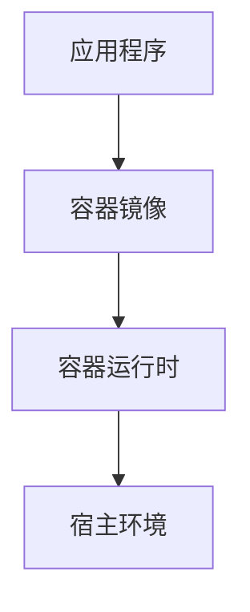

#### 1.2.2 动态管理

**核心概念**：动态管理是指通过自动化工具对容器化应用进行动态部署、扩展和监控，以实现高效的资源利用和服务交付。

**实现方式**：动态管理通过以下方式实现：
- **容器编排**：容器编排工具（如Kubernetes）负责管理容器的生命周期，包括启动、停止、扩展和故障恢复等。通过配置文件定义应用和服务，编排工具可以根据需求自动调整资源分配。
- **监控与告警**：监控系统（如Prometheus和Grafana）实时监控容器状态和性能指标，及时发现异常并进行告警。

**对比表格**：

| 特征 | 动态管理 | 传统部署 |
| --- | --- | --- |
| **自动化程度** | 高度自动化，减少手动操作 | 手动操作多，自动化程度低 |
| **资源利用** | 高度弹性，根据需求自动调整资源 | 资源利用率低，固定资源分配 |
| **故障恢复** | 自动恢复，快速响应故障 | 手动恢复，响应时间长 |

**ER实体关系图**：

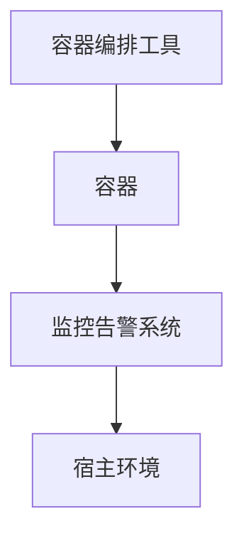

#### 1.2.3 持续交付

**核心概念**：持续交付是一种软件开发和部署实践，通过自动化工具实现应用的开发、测试和部署流程，以确保快速、可靠地交付新功能和修复问题。

**实现方式**：持续交付通过以下方式实现：
- **持续集成（CI）**：自动化构建和测试，确保每次代码提交都经过测试，提高代码质量和稳定性。
- **持续部署（CD）**：自动化部署流程，将经过测试的代码部署到生产环境，减少手动操作和部署风险。

**对比表格**：

| 特征 | 持续交付 | 传统部署 |
| --- | --- | --- |
| **迭代速度** | 快速迭代，快速交付新功能 | 迭代速度慢，部署周期长 |
| **可靠性** | 高可靠性，自动化测试确保质量 | 低可靠性，手动测试存在疏漏 |
| **风险** | 低风险，自动化部署减少错误 | 高风险，手动部署易出错 |

**ER实体关系图**：

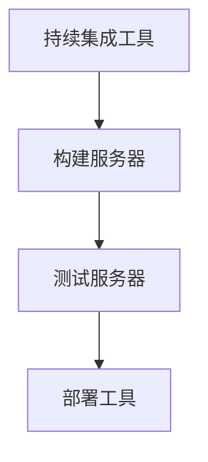

#### 1.2.4 微服务架构

**核心概念**：微服务架构是将大型单体应用拆分为多个小型、独立的微服务，每个服务负责一个特定的业务功能，可以独立部署和扩展。

**实现方式**：微服务架构通过以下方式实现：
- **服务划分**：根据业务功能将应用拆分为多个微服务，每个服务有自己的数据库和API。
- **服务通信**：微服务之间通过API进行通信，可以使用同步调用或异步消息队列。
- **服务治理**：服务治理工具（如Istio）提供服务发现、负载均衡和故障恢复等功能。

**对比表格**：

| 特征 | 微服务架构 | 单体架构 |
| --- | --- | --- |
| **模块独立性** | 高度独立，每个服务独立部署和扩展 | 依赖性强，整体部署和扩展 |
| **可维护性** | 易维护，服务规模小，变更影响小 | 难维护，整体变更影响大 |
| **可扩展性** | 高度可扩展，水平扩展单个服务 | 有限扩展性，只能垂直扩展 |

**ER实体关系图**：

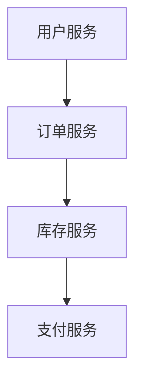

### 1.3 云原生的关键组件

云原生应用的开发与部署依赖于一系列关键组件，这些组件共同构成了一个高效、可扩展和可管理的应用架构。以下是云原生的关键组件及其详细介绍：

#### 1.3.1 容器技术

容器技术是云原生应用的基础，它提供了一种轻量级、可移植的运行环境，使得应用程序可以在不同的操作系统和硬件上无缝运行。以下是几种常见的容器技术：

**1. Docker**

**核心概念**：Docker是一种开源的应用容器引擎，它允许开发者将应用程序及其依赖环境打包成一个独立的容器镜像，以便在不同的环境中一致运行。

**实现方式**：
- **Docker镜像**：Docker镜像是一个静态的文件系统，包含了应用程序的所有依赖项、库和配置文件。通过Dockerfile定义应用程序的构建过程，可以生成一个容器镜像。
- **Docker容器**：Docker容器是基于镜像的实例，可以启动、停止、扩展和监控。容器运行时读取镜像中的文件系统，并启动应用程序。

**对比表格**：

| 特征 | Docker |
| --- | --- |
| **轻量级** | 是，容器共享操作系统内核，资源占用小 |
| **可移植性** | 是，容器可以在不同操作系统和硬件上运行 |
| **隔离性** | 是，容器提供独立的运行环境，隔离应用程序和系统资源 |

**ER实体关系图**：

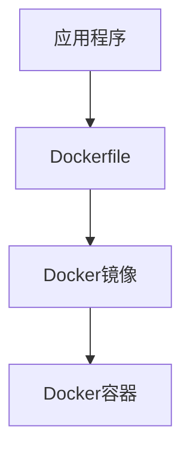

**2. rkt**

**核心概念**：rkt是一种另一种开源容器技术，它提供了一种安全、轻量级的容器运行时，旨在与Docker竞争。

**实现方式**：
- **rkt镜像**：rkt镜像是一个静态的文件系统，包含了应用程序的所有依赖项和配置文件。rkt镜像通过签名机制确保镜像的完整性和安全性。
- **rkt容器**：rkt容器是基于镜像的实例，可以启动、停止和监控。rkt容器运行时只读取镜像中的文件系统，并启动应用程序。

**对比表格**：

| 特征 | rkt |
| --- | --- |
| **安全性** | 高，采用签名机制确保镜像和容器的安全性 |
| **可移植性** | 是，容器可以在不同操作系统和硬件上运行 |
| **轻量级** | 是，容器共享操作系统内核，资源占用小 |

**ER实体关系图**：

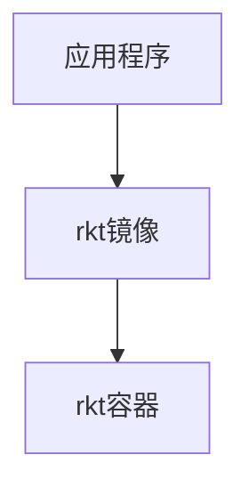

#### 1.3.2 容器编排工具

容器编排工具负责管理容器化应用的生命周期，包括启动、停止、扩展和故障恢复等。以下是几种常见的容器编排工具：

**1. Kubernetes**

**核心概念**：Kubernetes是一种开源的容器编排平台，它提供了一种声明式的API，允许用户定义和管理容器化应用。Kubernetes通过集群管理器将容器化应用部署到集群中，并提供自动化的容器编排功能。

**实现方式**：
- **集群管理**：Kubernetes集群由一个主节点（Master）和多个工作节点（Worker）组成。主节点负责集群的状态管理和调度，工作节点负责运行容器实例。
- **容器编排**：Kubernetes通过配置文件（如YAML文件）定义应用和服务，并根据需求自动调整资源分配。Kubernetes还提供自动扩容、自动恢复和负载均衡等功能。

**对比表格**：

| 特征 | Kubernetes |
| --- | --- |
| **自动化程度** | 高，自动化的容器编排和管理 |
| **可扩展性** | 是，支持大规模集群和分布式应用 |
| **灵活性** | 高，支持多种容器运行时和插件 |

**ER实体关系图**：

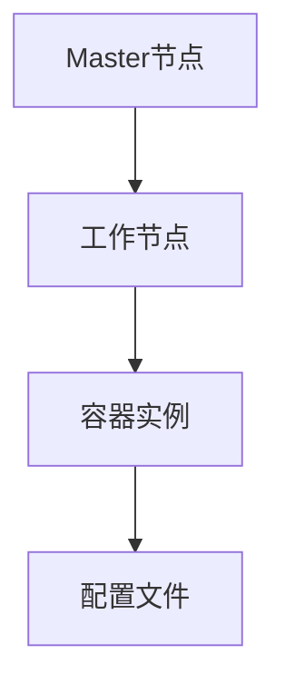

**2. Mesos**

**核心概念**：Mesos是一种开源的集群管理器和资源调度框架，它提供了一种细粒度的资源调度机制，允许多种容器技术（如Docker、Kubernetes和Marathon）在同一集群中运行。

**实现方式**：
- **资源调度**：Mesos将集群的资源（如CPU、内存和网络）抽象为一个统一的资源池，并根据应用的需求动态分配资源。
- **容器调度**：Mesos支持多种容器调度器，如Docker、Kubernetes和Marathon，使得不同技术栈的应用可以在同一集群中运行。

**对比表格**：

| 特征 | Mesos |
| --- | --- |
| **资源利用率** | 高，细粒度的资源调度 |
| **兼容性** | 是，支持多种容器技术和调度器 |
| **扩展性** | 是，支持大规模集群和分布式应用 |

**ER实体关系图**：

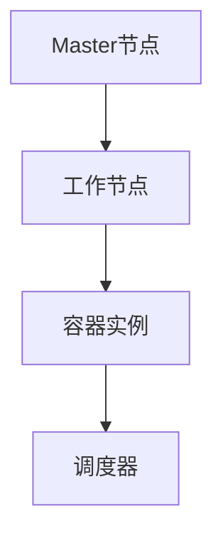

#### 1.3.3 服务网格

服务网格是一种用于管理和监控容器化应用之间通信的抽象层，它提供了一种透明、高效和可扩展的通信机制。以下是几种常见的服务网格技术：

**1. Istio**

**核心概念**：Istio是一种开源的服务网格，它提供了一种统一的通信抽象层，允许微服务架构中的服务之间进行安全、可靠和高效地通信。

**实现方式**：
- **服务通信**：Istio通过虚拟网络（Virtual Network）管理服务之间的通信，提供负载均衡、断路器和服务发现等功能。
- **安全与监控**：Istio提供服务间通信的加密和身份验证机制，并通过监控工具（如Prometheus和Grafana）实时监控服务状态。

**对比表格**：

| 特征 | Istio |
| --- | --- |
| **安全性** | 是，提供加密和身份验证 |
| **监控性** | 是，实时监控服务状态 |
| **可扩展性** | 是，支持大规模微服务架构 |

**ER实体关系图**：

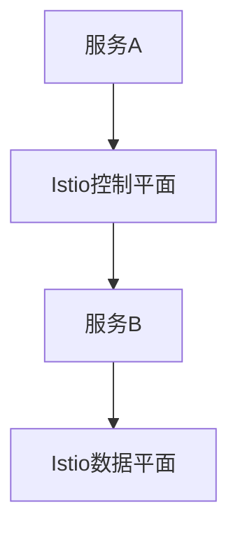

**2. Linkerd**

**核心概念**：Linkerd是一种开源的服务网格，它提供了一种简单、高效的服务间通信层，用于管理和监控容器化应用的流量。

**实现方式**：
- **流量管理**：Linkerd通过虚拟网桥（Virtual Bridge）管理服务间的流量，提供负载均衡、流量控制和故障转移等功能。
- **性能监控**：Linkerd提供实时的性能监控和告警功能，帮助开发人员和服务管理员快速定位问题。

**对比表格**：

| 特征 | Linkerd |
| --- | --- |
| **性能** | 高，低延迟和高吞吐量 |
| **易用性** | 是，简单安装和配置 |
| **扩展性** | 是，支持大规模服务架构 |

**ER实体关系图**：

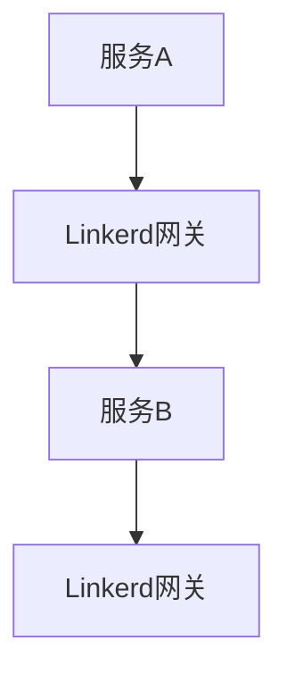

#### 1.3.4 云服务提供商

云服务提供商（如AWS、Google Cloud和Azure）提供了广泛的云原生服务，支持应用的部署和运维。以下是这些云服务提供商的一些关键特性：

**1. AWS**

**核心概念**：AWS提供了多种云原生服务，包括EC2容器服务（ECS）、Kubernetes集群服务（EKS）和AWS Fargate等，支持容器化应用的部署和管理。

**实现方式**：
- **容器服务**：AWS ECS和EKS提供了容器编排功能，用户可以通过AWS Management Console或AWS CLI管理容器化应用。
- **无服务器计算**：AWS Fargate提供了一种无服务器容器执行环境，用户无需管理基础设施，只需按需付费。

**对比表格**：

| 特征 | AWS |
| --- | --- |
| **可扩展性** | 是，支持大规模容器化应用 |
| **灵活性** | 是，支持多种容器编排工具 |
| **成本** | 中等，根据使用量收费 |

**ER实体关系图**：

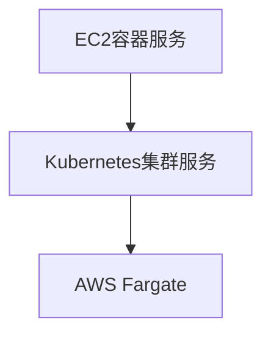

**2. Google Cloud**

**核心概念**：Google Cloud提供了Kubernetes Engine（GKE）和App Engine等云原生服务，支持容器化应用的部署和管理。

**实现方式**：
- **容器服务**：Google Kubernetes Engine提供了托管式Kubernetes集群，用户可以通过Google Cloud Console管理容器化应用。
- **无服务器计算**：Google App Engine提供了一种自动扩展的Web应用托管服务，用户无需管理服务器和操作系统。

**对比表格**：

| 特征 | Google Cloud |
| --- | --- |
| **性能** | 高，Google基础设施支持 |
| **易用性** | 是，简单安装和配置 |
| **成本** | 中等，根据使用量收费 |

**ER实体关系图**：

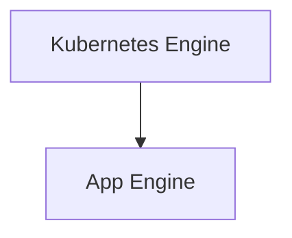

**3. Azure**

**核心概念**：Azure提供了Azure Kubernetes Service（AKS）和Azure Container Instances等云原生服务，支持容器化应用的部署和管理。

**实现方式**：
- **容器服务**：Azure Kubernetes Service提供了托管式Kubernetes集群，用户可以通过Azure Portal或Azure CLI管理容器化应用。
- **无服务器计算**：Azure Container Instances提供了一种无服务器容器执行环境，用户无需管理基础设施，只需按需付费。

**对比表格**：

| 特征 | Azure |
| --- | --- |
| **可扩展性** | 是，支持大规模容器化应用 |
| **灵活性** | 是，支持多种容器编排工具 |
| **成本** | 中等，根据使用量收费 |

**ER实体关系图**：

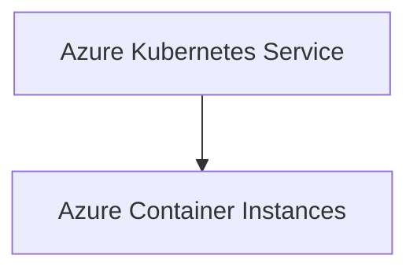

### 1.4 云原生与传统应用的差异

云原生与传统应用在设计和部署方面有着显著的差异。云原生应用通过微服务架构、容器化和自动化管理实现了更高的灵活性和可扩展性，而传统应用则通常依赖于单体架构和手动运维。以下是云原生与传统应用的主要差异：

#### 1.4.1 设计理念

**传统应用**：
- **单体架构**：传统应用将所有功能集中在一个庞大的单体中，所有的组件都紧密耦合在一起。这种方式在单机环境中表现良好，但难以适应分布式环境。
- **面向过程**：传统应用通常采用面向过程的编程方法，关注过程和流程的控制。

**云原生应用**：
- **微服务架构**：云原生应用将功能拆分为多个独立的微服务，每个微服务负责一个特定的业务功能。这种方式提高了应用的模块化和可扩展性。
- **面向服务**：云原生应用采用面向服务的架构（SOA），每个微服务通过API进行通信，实现服务之间的解耦。

#### 1.4.2 部署方式

**传统应用**：
- **手动部署**：传统应用通常需要手动部署和运维，每次更新都需要重新部署整个应用，部署过程复杂且耗时。
- **单体部署**：传统应用将所有服务部署在一个单体容器中，部署和运维依赖于宿主环境。

**云原生应用**：
- **自动化部署**：云原生应用通过容器化和容器编排工具实现自动化部署，部署过程快速且高效。
- **容器编排**：云原生应用使用容器编排工具（如Kubernetes）管理容器的生命周期，包括启动、停止、扩展和故障恢复等。

#### 1.4.3 运维模式

**传统应用**：
- **运维复杂**：传统应用运维复杂，需要专门的运维团队进行管理和维护，运维成本高。
- **手动监控**：传统应用通常依赖于手动监控和告警，实时性差，故障响应时间较长。

**云原生应用**：
- **自动化运维**：云原生应用通过自动化工具实现运维自动化，降低了运维成本，提高了运维效率。
- **监控自动化**：云原生应用使用监控系统（如Prometheus和Grafana）实时监控容器状态和性能指标，及时发现异常并进行告警。

#### 1.4.4 扩展性与可靠性

**传统应用**：
- **扩展受限**：传统应用通常只能通过垂直扩展（增加硬件资源）来提高性能，这种方式受限且成本高。
- **故障恢复慢**：传统应用在故障恢复方面速度较慢，需要人工干预进行故障转移和恢复。

**云原生应用**：
- **水平扩展**：云原生应用通过水平扩展（增加容器实例）来提高性能，这种方式灵活且成本低。
- **故障自恢复**：云原生应用通过容器编排工具实现自动故障恢复，提高系统的可靠性和可用性。

总之，云原生与传统应用在设计理念、部署方式和运维模式等方面存在显著差异。云原生应用通过微服务架构、容器化和自动化管理实现了更高的灵活性和可扩展性，为现代应用开发带来了新的机遇和挑战。

### 2.1 Kubernetes基础

Kubernetes（简称K8s）是一种开源的容器编排平台，用于自动化部署、扩展和管理容器化应用。它提供了一种强大的、灵活的、可扩展的解决方案，帮助开发人员和运维人员管理分布式系统。以下是对Kubernetes基础概念的详细解释。

#### 2.1.1 Kubernetes架构

Kubernetes集群由以下组件组成：

1. **Master节点**：Master节点是Kubernetes集群的核心控制层，负责集群的状态管理和调度。Master节点包含以下组件：
   - **API服务器**：API服务器是Kubernetes集群的入口，提供了一个面向用户的接口，允许用户通过kubectl或其他客户端库与集群进行交互。
   - **调度器**：调度器负责将容器部署到合适的节点上，根据节点的资源情况和策略进行调度。
   - **控制器管理器**：控制器管理器运行各种控制器，如ReplicaSet控制器、Endpoin

### 2.1.2 Kubernetes工作原理

Kubernetes的工作原理基于一组定义明确的概念和组件，这些组件协同工作以自动化管理容器化应用。以下是Kubernetes工作原理的详细解释：

#### 1. Kubernetes核心概念

Kubernetes的核心概念包括：

- **Pod**：Pod是Kubernetes中的最小部署单元，它包含一个或多个容器。Pod负责容器的创建、启动、维护和销毁。Pod之间的容器通常共享网络和存储资源。
- **ReplicaSet**：ReplicaSet负责管理一组Pod，确保在任何时刻都有指定数量的Pod副本运行。如果Pod因故障而失败，ReplicaSet会自动创建一个新的Pod来替换它。
- **Deployment**：Deployment是一种更高层次的控制对象，用于管理和更新ReplicaSet。通过Deployment，用户可以定义Pod的期望状态，并让Kubernetes负责达到并保持这个状态。
- **Service**：Service是一种抽象层，用于定义一组Pod的逻辑集合以及如何访问它们。Service通过自动分配IP地址和DNS名称，提供了一种稳定的网络入口。
- **Ingress**：Ingress提供了一种定义外部流量如何访问集群内服务的方式。它通常用于配置负载均衡器、SSL终止和路径规则。

#### 2. Kubernetes组件

Kubernetes集群由以下主要组件构成：

- **API服务器（API Server）**：API服务器是集群的入口点，提供了一个统一的API接口，允许用户与集群进行交互。所有对Kubernetes集群的修改（如创建、删除、更新资源）都通过API服务器进行。
- **控制平面（Control Plane）**：控制平面是Kubernetes集群的脑逻辑中心，负责集群的状态管理和资源调度。它包括以下组件：
  - **调度器（Scheduler）**：调度器负责将容器部署到集群中的节点上。调度器根据节点的资源状况、策略和偏好来选择最佳节点。
  - **控制器管理器（Controller Manager）**：控制器管理器运行各种控制器，如ReplicaSet控制器、Endpoints控制器等，确保集群中的资源始终处于预期状态。
  - **Etcd**：Etcd是一个分布式键值存储，用于存储Kubernetes集群的状态信息。所有Kubernetes资源对象都存储在Etcd中，API服务器和控制平面依赖于Etcd来访问和管理这些信息。
- **工作节点（Node）**：工作节点是集群中的计算实体，负责运行容器和执行Kubernetes任务。每个工作节点都运行以下组件：
  - **Kubelet**：Kubelet是每个节点的代理，负责与Master节点通信并确保节点上的容器运行正常。Kubelet还负责监控节点的资源使用情况，并在需要时向Master节点报告。
  - **Kube-Proxy**：Kube-Proxy是每个节点上的网络代理，负责根据Service的定义转发网络流量到正确的Pod。
  - **容器运行时（Container Runtime）**：容器运行时如Docker或rkt负责启动和运行容器。

#### 3. Kubernetes工作流程

以下是Kubernetes工作流程的基本步骤：

1. **用户通过kubectl或其他客户端库向API服务器发送请求**：用户可以使用kubectl或其他API客户端（如Go客户端库或Python客户端库）向API服务器发送创建、更新或删除资源的请求。

2. **API服务器处理请求并存储资源对象**：API服务器接收到用户的请求后，将其转换为Kubernetes资源对象，并将其存储在Etcd中。

3. **控制器管理器接收资源对象并执行相应操作**：控制器管理器监听Etcd中的资源对象变化，并根据资源对象的状态执行相应的操作。例如，如果用户创建了一个新的Deployment对象，控制器管理器会创建一个新的ReplicaSet来管理Pod。

4. **调度器根据资源需求和策略选择节点**：当用户请求部署新的Pod时，调度器会根据节点的资源状况、策略和偏好来选择最佳节点。

5. **Kubelet在选定节点上创建和启动容器**：Kubelet接收到调度器的分配后，会在选定节点上创建和启动容器。

6. **Kube-Proxy更新网络配置**：Kube-Proxy根据Service的定义更新网络配置，确保流量正确转发到Pod。

7. **监控和告警**：Kubernetes集群中的监控系统（如Prometheus和Grafana）会监控集群状态和性能指标，并在出现问题时发出告警。

通过这些组件和工作流程，Kubernetes提供了一个强大、灵活和可扩展的容器编排平台，使开发人员和运维人员能够轻松管理容器化应用。

### 2.1.3 Kubernetes核心概念

Kubernetes（K8s）的核心概念是理解和应用该平台的基础。以下是Kubernetes中的一些关键概念及其详细解释：

#### Pod

**定义**：Pod是Kubernetes中的最小部署单元，它包含一个或多个容器。Pod代表一个可执行的进程组，这些容器共享网络命名空间和存储卷。

**用途**：Pod用于组织和管理容器，确保它们协同工作。在Kubernetes中，Pod通常被部署在节点上，并与ReplicaSet或Deployment等高级资源关联。

**示例**：

```yaml
apiVersion: v1
kind: Pod
metadata:
  name: my-pod
spec:
  containers:
  - name: my-container
    image: nginx
```

#### ReplicaSet

**定义**：ReplicaSet确保在任何时候都有指定数量的Pod副本在运行。它是无状态的，主要用于维护Pod的可用性和替换失败的Pod。

**用途**：ReplicaSet用于确保应用程序的高可用性和稳定性。如果Pod失败或节点故障，ReplicaSet将自动创建新的Pod来替换它。

**示例**：

```yaml
apiVersion: apps/v1
kind: ReplicaSet
metadata:
  name: my-replicaset
spec:
  replicas: 3
  selector:
    matchLabels:
      app: my-app
  template:
    metadata:
      labels:
        app: my-app
    spec:
      containers:
      - name: my-container
        image: nginx
```

#### Deployment

**定义**：Deployment是一个更高层次的控制对象，用于管理ReplicaSet。它提供了声明式更新和回滚功能，确保应用程序的状态与预期一致。

**用途**：Deployment用于部署和更新应用程序，提供了更高级的抽象和更多的功能。通过Deployment，用户可以定义应用程序的期望状态，并让Kubernetes负责实现和维护这个状态。

**示例**：

```yaml
apiVersion: apps/v1
kind: Deployment
metadata:
  name: my-deployment
spec:
  replicas: 3
  selector:
    matchLabels:
      app: my-app
  template:
    metadata:
      labels:
        app: my-app
    spec:
      containers:
      - name: my-container
        image: nginx
```

#### Service

**定义**：Service是一种抽象层，用于定义一组Pod的逻辑集合以及如何访问它们。它通过一个稳定的IP地址和DNS名称，为Pod提供负载均衡和发现机制。

**用途**：Service用于对外暴露应用程序的接口，使外部系统（如负载均衡器或网络防火墙）能够访问集群内的服务。

**示例**：

```yaml
apiVersion: v1
kind: Service
metadata:
  name: my-service
spec:
  selector:
    app: my-app
  ports:
    - protocol: TCP
      port: 80
      targetPort: 8080
```

#### Ingress

**定义**：Ingress提供了一种定义外部流量如何访问集群内服务的方式。它通常用于配置负载均衡器、SSL终止和路径规则。

**用途**：Ingress用于管理外部流量进入集群的方式，它为Service提供了一个额外的抽象层，使得外部流量可以根据特定的URL路径路由到集群内的服务。

**示例**：

```yaml
apiVersion: networking.k8s.io/v1
kind: Ingress
metadata:
  name: my-ingress
  annotations:
    kubernetes.io/ingress.class: nginx
spec:
  rules:
  - host: my-app.example.com
    http:
      paths:
      - path: /
        pathType: Prefix
        backend:
          service:
            name: my-service
            port:
              number: 80
```

通过理解这些核心概念，开发人员和运维人员可以有效地使用Kubernetes来部署和管理容器化应用程序。

### 2.2 服务网格与微服务架构

服务网格（Service Mesh）是云原生架构中的重要组成部分，它用于管理和监控微服务之间的通信。在微服务架构中，服务网格提供了一种抽象层，使得服务间的通信更加透明、可靠和高效。以下是服务网格与微服务架构的关系、服务网格的主要组件及其工作原理的详细解释。

#### 2.2.1 服务网格概述

**定义**：服务网格是一种分布式系统架构模式，用于管理服务之间的通信。它通过在服务间插入一个通信层（即服务网格层），来抽象服务间的网络通信，提供了一种统一的通信管理机制。

**作用**：服务网格的主要作用包括：
- **服务发现与路由**：服务网格提供了一种动态服务发现机制，使得服务可以轻松发现和访问其他服务。此外，服务网格还支持灵活的路由规则，使得流量可以根据特定的策略进行路由。
- **服务间通信安全**：服务网格通过加密和身份验证机制，确保服务间通信的安全性。服务网格还支持访问控制和策略管理，确保只有授权的服务可以访问其他服务。
- **流量监控与追踪**：服务网格提供了一种统一的方式来自动收集和监控服务间的流量数据，使得运维团队能够更好地了解服务的性能和行为。此外，服务网格还支持分布式追踪，帮助开发人员定位和解决性能问题。
- **负载均衡与故障转移**：服务网格通过内置的负载均衡器，实现服务间的流量分发和负载均衡。在服务出现故障时，服务网格可以自动进行故障转移，确保服务的可用性。

**类型**：常见的服务网格技术包括：
- **Istio**：Istio是一个开源的服务网格，提供了一组控制平面和数据平面组件，用于管理服务间的通信。
- **Linkerd**：Linkerd是一个开源的服务网格，它提供了一种简单、高效的通信层，支持自动负载均衡、故障转移和监控。

#### 2.2.2 微服务架构的优势与挑战

**优势**：
1. **模块化与可维护性**：微服务架构将应用程序拆分为多个独立的微服务，每个微服务负责一个特定的功能。这种方式提高了应用程序的可维护性，使得开发人员可以独立开发、测试和部署每个微服务，而不必担心其他服务的变更。
2. **可扩展性**：微服务架构允许水平扩展，即通过增加更多的实例来提高服务的处理能力。这种方式比垂直扩展（增加硬件资源）更加灵活和成本效益。
3. **弹性与容错性**：微服务架构中的每个服务都是独立的，某个服务的故障不会影响到整个系统。通过服务网格，可以轻松实现故障转移和流量转移，确保系统的可用性。
4. **技术独立性**：微服务架构允许服务采用不同的技术栈，每个服务可以根据其特定的需求选择最适合的技术。这种方式提高了技术的多样性，有助于团队专注于特定领域的发展。

**挑战**：
1. **分布式系统复杂性**：微服务架构引入了分布式系统的复杂性，服务之间的通信、数据一致性和系统监控等问题变得更加复杂。
2. **服务治理**：随着服务的增加，服务治理（如服务发现、访问控制和监控）变得更加困难。服务网格提供了服务治理的抽象层，简化了这些任务。
3. **数据一致性**：在微服务架构中，数据存储通常是分散的，服务之间的数据一致性变得更加复杂。需要采用分布式数据一致性协议和缓存策略来确保数据一致性。
4. **性能监控与调试**：分布式系统的性能监控和调试是一项挑战。服务网格提供了丰富的监控和追踪功能，帮助团队更好地了解系统的性能和行为。

#### 2.2.3 服务网格与微服务的关系

服务网格与微服务架构紧密相关，共同构成了一个高效、可靠和可扩展的分布式系统。以下是服务网格与微服务之间的关系：

1. **服务网格作为通信层**：服务网格在微服务架构中提供了一种通信层，抽象了服务之间的网络通信。通过服务网格，服务可以透明地发现和访问其他服务，而无需关心底层网络细节。
2. **服务网格简化服务治理**：服务网格提供了一种统一的方式来自动管理服务间的通信，包括服务发现、负载均衡、故障转移和监控等。这使得服务治理变得更加简单和高效。
3. **服务网格优化性能与安全性**：服务网格通过内置的负载均衡器和加密机制，优化了服务的性能和安全性。服务网格还提供了分布式追踪和监控功能，帮助团队更好地了解系统的性能和行为。
4. **服务网格支持动态配置**：服务网格支持动态配置，允许根据需要快速调整服务间的通信策略。这种方式使得微服务架构更加灵活和可扩展。

总之，服务网格与微服务架构相互依存，共同推动了分布式系统的现代化和高效性。通过服务网格，开发人员和运维人员可以更轻松地管理分布式服务，提高系统的性能和可靠性。

### 2.2.4 服务网格的主要组件

服务网格作为云原生架构中的一个关键组成部分，通过一系列组件实现了服务间通信的管理与优化。以下是服务网格的主要组件及其作用的详细介绍：

#### 1. 数据平面组件

数据平面组件是服务网格的核心，负责处理和转发服务间的网络流量。以下是几种常见的数据平面组件：

**1. 边车代理（Sidecar Proxy）**

**定义**：边车代理是一种轻量级代理，运行在服务实例旁边，负责代理服务间的通信。

**作用**：
- **透明代理**：边车代理隐藏了服务间通信的复杂性，使得服务只需关注业务逻辑，无需担心网络细节。
- **流量管理**：边车代理负责管理服务间的流量，包括负载均衡、故障转移和流量控制等。
- **安全通信**：边车代理通过加密和身份验证机制，确保服务间通信的安全性。

**示例**：

```yaml
apiVersion: networking.istio.io/v1alpha3
kind: ServiceEntry
metadata:
  name: my-service-entry
spec:
  hosts:
  - "*"
  ports:
  - number: 80
    name: http
    protocol: HTTP
  resolution: DNS
  location: MESH_INTERNAL
```

**2. Ingress网关（Ingress Gateway）**

**定义**：Ingress网关是服务网格中的入口点，负责接收外部流量并将其转发到内部服务。

**作用**：
- **外部流量接入**：Ingress网关接收来自外部网络的流量，并将其路由到内部服务。
- **流量控制**：Ingress网关负责实现负载均衡、TLS终止和流量限制等功能。

**示例**：

```yaml
apiVersion: networking.istio.io/v1alpha3
kind: Gateway
metadata:
  name: my-gateway
spec:
  selector:
    istio: ingressgateway
  servers:
  - port:
      number: 80
      name: http
      protocol: HTTP
    hosts:
    - "*"
```

#### 2. 控制平面组件

控制平面组件负责管理服务网格的配置、监控和服务发现等任务。以下是几种常见的控制平面组件：

**1. Pilot**

**定义**：Pilot是服务网格的控制平面组件，负责管理服务网格的配置和动态更新。

**作用**：
- **配置管理**：Pilot从Kubernetes API服务器获取服务网格配置，并将其推送到数据平面组件。
- **动态更新**：Pilot实时监控服务网格配置的变化，并动态更新数据平面组件的配置。

**示例**：

```yaml
apiVersion: networking.istio.io/v1alpha3
kind: VirtualService
metadata:
  name: my-virtual-service
spec:
  hosts:
  - "*"
  http:
  - match:
    - uri:
        prefix: /
    route:
    - destination:
        host: my-service
```

**2. Control Plane**

**定义**：Control Plane是服务网格的控制逻辑中心，负责处理数据平面组件的监控数据和配置更新。

**作用**：
- **监控数据收集**：Control Plane从数据平面组件收集监控数据，并将其存储在监控系统（如Prometheus）中。
- **配置更新**：Control Plane根据监控数据和配置策略，生成并下发新的配置到数据平面组件。

**示例**：

```yaml
apiVersion: monitoring.coreos.com/v1
kind: ServiceMonitor
metadata:
  name: istio
spec:
  selector:
    matchLabels:
      istio: "true"
  endpoints:
  - port: 15000
    interval: 30s
    path: /prometheus/metrics
```

#### 2.3 服务网格的工作原理

服务网格通过数据平面和控制平面组件协同工作，实现了服务间通信的管理和优化。以下是服务网格的工作原理：

1. **配置管理**：服务网格的配置由Kubernetes API服务器中的资源对象（如ServiceEntry、VirtualService等）定义。Pilot组件从Kubernetes API服务器获取这些配置，并将其推送到数据平面组件。
2. **流量代理**：数据平面组件（如边车代理和Ingress网关）根据配置管理流量，包括负载均衡、故障转移和流量控制等。边车代理在服务实例旁边运行，代理服务间的通信，而Ingress网关则作为外部流量接入的入口点。
3. **监控数据收集**：数据平面组件将监控数据（如流量指标、错误日志等）发送到Control Plane。Control Plane将监控数据存储在监控系统（如Prometheus）中，并提供可视化工具（如Grafana）来展示监控数据。
4. **动态更新**：Pilot组件实时监控服务网格配置的变化，并动态更新数据平面组件的配置。这种动态更新机制确保了服务网格的配置始终与实际需求一致。
5. **服务发现**：服务网格通过服务发现机制，动态发现集群中的服务实例。数据平面组件使用DNS或服务发现API来获取服务的地址和端口，以便正确路由流量。

通过以上工作原理，服务网格为微服务架构提供了一个统一的通信层，简化了服务间的通信管理和监控，提高了系统的性能和可靠性。

### 2.3 云原生应用开发工具与平台

云原生应用开发离不开一系列工具和平台的支持。这些工具和平台为开发者提供了容器化、容器编排、服务网格等关键功能，使得云原生应用的开发、部署和运维变得更加高效和便捷。以下是对几种常见的云原生应用开发工具和平台的介绍。

#### 2.3.1 容器化技术

容器化技术是云原生应用开发的基础，它允许将应用程序及其依赖环境打包为一个轻量级的容器镜像。以下是一些常用的容器化技术：

**1. Docker**

**核心概念**：Docker是一种开源的容器化技术，它允许将应用程序及其依赖环境打包为一个容器镜像，以便在不同的环境中一致运行。

**使用场景**：
- **应用开发**：Docker容器提供了一个隔离的开发环境，使得开发人员可以在本地环境中构建和测试应用程序。
- **持续集成与部署**：Docker容器化应用程序，使得开发人员可以将应用程序部署到测试和生产环境中，实现持续集成与持续部署（CI/CD）。
- **微服务架构**：Docker容器化微服务，使得每个微服务都可以独立部署和扩展，提高了系统的可维护性和可扩展性。

**示例**：

```bash
# 编写Dockerfile
FROM python:3.9
WORKDIR /app
COPY . .
RUN pip install -r requirements.txt
EXPOSE 8080

# 构建Docker镜像
docker build -t my-app .

# 运行Docker容器
docker run -d -p 8080:8080 my-app
```

**2. rkt**

**核心概念**：rkt是一种开源的容器化技术，它提供了与Docker类似的容器功能，但更注重安全性和隔离性。

**使用场景**：
- **安全容器化**：rkt使用AppC镜像格式，提供了更强的隔离性和安全性。
- **多云部署**：rkt支持跨云服务提供商的容器化部署，使得应用程序可以在不同的云环境中运行。

**示例**：

```bash
# 编写rkt Spec文件
[Container]
Type=app
AppId=my-app
Exec=[
    "python", "app.py"
]

[uris]
command: "http://localhost:5000"

# 构建rkt镜像
rkt build my-app.rkt

# 运行rkt容器
rkt run my-app.rkt
```

**3. Podman**

**核心概念**：Podman是一种开源的容器管理工具，它提供了与Docker兼容的容器功能，但更注重本地化和简化。

**使用场景**：
- **本地开发**：Podman可以在本地环境中运行容器，无需安装Docker或依赖外部服务。
- **集成开发环境（IDE）**：Podman与IDE集成，使得开发者可以在IDE中直接构建和运行容器。

**示例**：

```bash
# 编写Dockerfile
FROM python:3.9
WORKDIR /app
COPY . .
RUN pip install -r requirements.txt
EXPOSE 8080

# 构建Docker镜像
podman build -t my-app .

# 运行Podman容器
podman run -d -p 8080:8080 my-app
```

#### 2.3.2 容器编排工具

容器编排工具负责管理容器化应用的生命周期，包括部署、扩展和监控等。以下是一些常用的容器编排工具：

**1. Kubernetes**

**核心概念**：Kubernetes是一个开源的容器编排平台，它提供了强大的容器编排和管理功能，支持大规模分布式应用。

**使用场景**：
- **容器编排**：Kubernetes提供了丰富的API和工具，用于部署和管理容器化应用。
- **服务发现和负载均衡**：Kubernetes通过Service对象实现服务发现和负载均衡，确保外部流量可以正确路由到容器实例。
- **自动化运维**：Kubernetes支持自动化部署、扩展和故障恢复，降低了运维成本和提高运维效率。

**示例**：

```yaml
# Kubernetes Deployment
apiVersion: apps/v1
kind: Deployment
metadata:
  name: my-deployment
spec:
  selector:
    matchLabels:
      app: my-app
  template:
    metadata:
      labels:
        app: my-app
    spec:
      containers:
      - name: my-container
        image: my-app:latest
        ports:
        - containerPort: 80
```

**2. Docker Swarm**

**核心概念**：Docker Swarm是一个开源的容器编排工具，它基于Docker Engine构建，提供了集群管理和容器编排功能。

**使用场景**：
- **简单集群管理**：Docker Swarm易于配置和管理，适合中小型应用集群。
- **容器编排**：Docker Swarm支持容器编排，可以自动分配容器到集群中的节点上。

**示例**：

```bash
# 创建Docker Swarm集群
docker swarm init

# 加入Docker Swarm集群
docker swarm join --token $(docker swarm join-token worker)

# 部署容器化应用
docker service create --name my-app --publish published --replicas 3 my-app:latest
```

**3. Apache Mesos**

**核心概念**：Apache Mesos是一个开源的分布式系统资源调度框架，它提供了细粒度的资源调度机制，支持多种容器化技术。

**使用场景**：
- **资源调度**：Mesos可以将集群的资源（如CPU、内存和网络）抽象为一个统一的资源池，根据应用的需求动态分配资源。
- **容器编排**：Mesos支持多种容器调度器，如Docker和Kubernetes，使得不同技术栈的应用可以在同一集群中运行。

**示例**：

```bash
# 启动Mesos Master
mesos-master

# 启动Mesos Slave
mesos-slave

# 部署容器化应用
docker run --name my-app --net=mesos --mode=cluster mode:loader --loader http://example.com/my-app.docker
```

#### 2.3.3 云原生平台与解决方案

云原生平台和解决方案为开发者提供了全面的支持，从基础设施到应用开发，涵盖了云原生应用的方方面面。以下是一些常见的云原生平台和解决方案：

**1. AWS EKS**

**核心概念**：AWS EKS（Elastic Kubernetes Service）是AWS提供的托管式Kubernetes集群服务，使得开发者可以在AWS基础设施上轻松部署和管理Kubernetes集群。

**使用场景**：
- **无服务器Kubernetes**：AWS EKS提供了一种无服务器Kubernetes解决方案，无需管理基础设施，只需关注应用程序。
- **混合云部署**：AWS EKS支持在AWS和本地数据中心之间部署Kubernetes集群，实现混合云架构。

**示例**：

```bash
# 创建EKS集群
aws eks create-cluster --name my-cluster --kubernetes-version 1.21 --role-arn arn:aws:iam::123456789012:role/EKS-Cluster-Role

# 连接EKS集群
aws eks update-kubeconfig --name my-cluster

# 部署应用程序
kubectl apply -f deployment.yaml
```

**2. Google Kubernetes Engine (GKE)**

**核心概念**：Google Kubernetes Engine (GKE)是Google Cloud提供的托管式Kubernetes服务，使得开发者可以轻松部署和管理容器化应用。

**使用场景**：
- **自动扩容与负载均衡**：GKE自动扩展应用程序，根据负载需求动态分配资源，并提供负载均衡功能。
- **安全性**：GKE提供了全面的安全性，包括加密通信、自动补丁更新和漏洞扫描。

**示例**：

```bash
# 创建GKE集群
gcloud container clusters create my-cluster --region us-central1

# 连接GKE集群
gcloud container clusters get-credentials my-cluster --region us-central1

# 部署应用程序
kubectl apply -f deployment.yaml
```

**3. Azure Kubernetes Service (AKS)**

**核心概念**：Azure Kubernetes Service (AKS)是Azure提供的托管式Kubernetes服务，使得开发者可以在Azure基础设施上轻松部署和管理Kubernetes集群。

**使用场景**：
- **混合云部署**：AKS支持在Azure和本地数据中心之间部署Kubernetes集群，实现混合云架构。
- **自动扩容与负载均衡**：AKS自动扩展应用程序，根据负载需求动态分配资源，并提供负载均衡功能。

**示例**：

```bash
# 创建AKS集群
az aks create --resource-group my-resource-group --name my-cluster --node-count 3

# 连接AKS集群
az aks get-credentials --resource-group my-resource-group --name my-cluster

# 部署应用程序
kubectl apply -f deployment.yaml
```

通过使用这些云原生平台和解决方案，开发人员可以更高效地构建、部署和管理云原生应用，提高开发效率和系统可靠性。

### 3.1.1 Docker容器技术

Docker是一种开源的容器化技术，它允许开发者将应用程序及其依赖环境打包为一个轻量级、独立的容器镜像，从而实现跨平台的部署和运行。以下是Docker容器技术的核心概念、优势、使用场景及其工作原理的详细介绍。

#### 3.1.1.1 核心概念

**1. Docker镜像**

**定义**：Docker镜像是一个静态的文件系统，包含了应用程序运行所需的所有文件，如代码、库、配置文件和依赖项。每个Docker镜像都是基于另一个基础镜像构建的，可以看作是一个轻量级的操作系统。

**示例**：

```bash
# 查看本地Docker镜像
docker images

# 搜索Docker镜像
docker search python

# 获取Docker镜像
docker pull python:3.9

# 删除Docker镜像
docker rmi python:3.9
```

**2. Docker容器**

**定义**：Docker容器是基于Docker镜像的实例，表示应用程序的实际运行实例。容器提供了一个独立的运行环境，使得应用程序可以在不同的操作系统和硬件上无缝运行。

**示例**：

```bash
# 创建Docker容器
docker run -d python:3.9

# 列出所有运行中的Docker容器
docker ps

# 停止Docker容器
docker stop container_id
```

**3. Docker容器网络**

**定义**：Docker容器网络允许容器通过IP地址和端口进行通信。Docker默认为每个容器分配一个独立的IP地址，并使用桥接网络模式。

**示例**：

```bash
# 创建带有自定义网络的Docker容器
docker run -it --network my-network python:3.9

# 查看容器网络配置
docker network inspect my-network
```

#### 3.1.1.2 优势

**1. 轻量级**

Docker容器非常轻量级，通常只需要几百MB的内存和存储空间。这与传统的虚拟机相比，大大降低了资源的消耗，提高了系统资源的利用率。

**2. 可移植性**

Docker容器提供了一个独立的运行环境，使得应用程序可以在任何操作系统和硬件上运行，而无需关心底层宿主环境。这种可移植性大大简化了应用程序的部署和迁移过程。

**3. 高效性**

Docker容器启动速度快，通常只需几秒钟即可启动一个容器实例。相比之下，传统的虚拟机启动过程要慢得多。此外，Docker容器的资源隔离和共享机制，使得多个容器可以高效地共享宿主机的操作系统内核，进一步提高了系统的性能。

**4. 持续集成与持续部署（CI/CD）**

Docker容器支持持续集成与持续部署（CI/CD），使得开发人员可以快速迭代和部署新功能。通过Docker镜像，开发人员可以确保应用程序在不同的环境中始终运行一致，从而简化了应用程序的发布过程。

#### 3.1.1.3 使用场景

**1. 应用程序部署**

Docker容器是一种理想的部署解决方案，使得应用程序可以在不同环境中一致运行，从而简化了应用程序的部署过程。

**2. 开发与测试**

Docker容器提供了一个独立的开发环境，使得开发人员可以在本地环境中构建和测试应用程序，而无需关心宿主环境。

**3. 容器编排**

Docker容器可以与Kubernetes、Docker Swarm等容器编排工具结合使用，实现容器化应用的自动化部署、扩展和监控。

**4. 微服务架构**

Docker容器是实现微服务架构的一种有效方式，使得开发人员可以将应用程序拆分为多个独立的微服务，每个服务可以独立部署和扩展。

**5. 云原生应用**

Docker容器是云原生应用的核心组件，为开发人员提供了一种高效、可扩展和可管理的应用部署方案。

#### 3.1.1.4 工作原理

**1. 镜像构建**

Docker镜像是通过Dockerfile构建的，Dockerfile定义了应用程序的构建过程。通过运行`docker build`命令，Docker将根据Dockerfile中的指令生成一个容器镜像。

**2. 容器启动**

Docker容器是通过`docker run`命令启动的。启动容器时，Docker首先从本地存储中查找指定的镜像，如果找不到，则会从Docker Hub等镜像仓库中拉取。

**3. 容器运行**

容器启动后，Docker容器运行在宿主机的操作系统内核上。容器通过cgroups和命名空间提供资源隔离和进程隔离，确保容器实例之间互不影响。

**4. 容器管理**

Docker提供了丰富的命令来管理容器，包括启动、停止、重启、删除和日志查看等。此外，Docker还支持容器编排工具（如Kubernetes和Docker Swarm），实现容器的自动化管理。

总之，Docker容器技术为开发人员提供了一种高效、可移植和可管理的应用程序部署方案，是云原生应用开发的核心组件之一。

### 3.1.2 容器编排与自动化

容器编排与自动化是云原生应用开发中至关重要的环节，它负责管理和优化容器化应用的生命周期，确保应用能够高效、可靠地运行。以下是对容器编排与自动化的核心概念、常用工具及其工作流程的详细解释。

#### 3.1.2.1 核心概念

**1. 容器编排**

容器编排是指通过自动化工具来管理和调度容器化应用的过程。容器编排工具负责创建、启动、停止、扩展和监控容器，确保应用在集群中的高效运行。以下是容器编排的关键概念：

- **容器集群**：容器集群是由多个节点组成的分布式系统，每个节点运行一个或多个容器实例。容器编排工具负责管理整个集群中的容器。
- **容器服务**：容器服务是指容器编排工具提供的API和工具集，用于创建和管理容器。常见的容器服务包括Kubernetes、Docker Swarm和Apache Mesos等。
- **容器编排策略**：容器编排策略是指容器编排工具用于分配和管理容器资源的一系列规则和算法。常见的策略包括负载均衡、自动扩容、自动恢复和资源调度等。

**2. 自动化**

自动化是指通过脚本、工具和平台来实现应用程序的自动化部署、测试和运维。自动化工具能够减少人工干预，提高开发效率和系统稳定性。以下是自动化的关键概念：

- **CI/CD**：持续集成与持续部署（CI/CD）是一种软件开发和部署实践，通过自动化工具实现应用的自动化构建、测试和部署。CI/CD工具（如Jenkins、GitLab CI/CD和CircleCI）负责将代码仓库中的代码定期构建、测试并部署到生产环境中。
- **配置管理**：配置管理是指通过工具（如Ansible、Chef和Puppet）来自动化基础设施的配置和管理。配置管理工具负责安装、配置和管理服务器和应用程序，确保环境的一致性。
- **自动化运维**：自动化运维是指通过自动化工具来自动化日常运维任务，如监控、告警、故障恢复和安全审计等。自动化运维工具（如Puppet、Chef和Ansible）能够减少运维工作量，提高运维效率。

#### 3.1.2.2 常用工具

**1. Kubernetes**

Kubernetes是一个开源的容器编排平台，它提供了一种声明式的API，用于定义和管理容器化应用。Kubernetes集群由Master节点和工作节点组成，Master节点负责集群状态管理和资源调度，工作节点负责运行容器实例。以下是Kubernetes的常用工具：

- **kubectl**：kubectl是Kubernetes的命令行工具，用于与集群进行交互。kubectl提供了丰富的命令，用于管理资源、部署应用程序和监控集群状态。
- **Helm**：Helm是一个Kubernetes的包管理工具，用于打包、部署和管理Kubernetes应用程序。Helm提供了模板化配置文件和命令行工具，使得部署和管理Kubernetes应用程序变得更加简单。
- **Kubernetes Dashboard**：Kubernetes Dashboard是一个基于Web的GUI，用于可视化Kubernetes集群的状态和资源。用户可以通过Dashboard创建、更新和监控应用程序。

**2. Docker Swarm**

Docker Swarm是Docker的原生容器编排工具，它提供了一个集群管理器和资源调度框架，用于管理容器化应用。Docker Swarm集群由一个Manager节点和多个Worker节点组成，Manager节点负责集群状态管理和资源调度，Worker节点负责运行容器实例。以下是Docker Swarm的常用工具：

- **docker swarm**：docker swarm是Docker的命令行工具，用于与Docker Swarm集群进行交互。docker swarm提供了丰富的命令，用于创建、管理和服务容器。
- **docker stack**：docker stack是Docker Swarm的部署工具，用于部署和升级Swarm服务。docker stack通过一组Swarm服务定义文件，实现应用程序的自动化部署和扩展。

**3. Apache Mesos**

Apache Mesos是一个开源的分布式系统资源调度框架，它提供了细粒度的资源调度机制，支持多种容器化技术。Mesos集群由Master节点和工作节点组成，Master节点负责集群状态管理和资源调度，工作节点负责运行容器实例。以下是Apache Mesos的常用工具：

- **mesos**：mesos是Mesos的命令行工具，用于与Mesos集群进行交互。mesos提供了丰富的命令，用于管理资源、部署应用程序和监控集群状态。
- **Marathon**：Marathon是Mesos的容器编排工具，用于部署和管理容器化应用程序。Marathon支持多种容器化技术，如Docker、DC/OS和Kubernetes等。

#### 3.1.2.3 工作流程

容器编排与自动化的工作流程通常包括以下几个步骤：

**1. 定义应用程序**

开发人员使用Kubernetes配置文件、Dockerfile或Mesos配置文件等，定义应用程序的部署和管理规则。这些配置文件包含了应用程序的版本、依赖项、容器配置和服务定义等。

**2. 部署应用程序**

容器编排工具（如Kubernetes、Docker Swarm或Apache Mesos）根据定义的配置文件，将应用程序部署到集群中。部署过程包括容器创建、启动、网络配置和资源分配等。

**3. 自动化部署**

自动化工具（如Jenkins、GitLab CI/CD和CircleCI）将代码仓库中的代码定期构建、测试并部署到生产环境中。自动化部署工具负责触发部署过程，确保应用程序始终处于最新状态。

**4. 监控与告警**

监控系统（如Prometheus和Grafana）实时监控应用程序的运行状态和性能指标，及时发现异常并进行告警。监控工具提供了可视化界面，帮助运维人员快速定位和解决问题。

**5. 故障恢复**

容器编排工具根据监控数据，自动检测并恢复故障容器。故障恢复过程包括容器重启、扩展和替换等，确保应用程序的持续可用性。

通过容器编排与自动化，开发人员和运维人员可以更高效地管理容器化应用，提高系统稳定性、可扩展性和灵活性。

### 3.1.3 容器镜像与仓库管理

容器镜像与仓库管理是云原生应用开发中的关键环节，它负责存储、管理和分发容器化应用程序。以下是对容器镜像的组成、仓库管理的重要性以及常见容器仓库和Docker Hub的使用方法的详细解释。

#### 3.1.3.1 容器镜像的组成

**1. 镜像层（Image Layers）**

容器镜像由一系列的层组成，每个层代表了一个文件系统的变化。这些层通过叠加和组合形成完整的文件系统，使得容器镜像更加灵活和可管理。每个层包含了文件、目录和元数据，可以通过UnionFS（联合文件系统）合并。

**2. 文件系统（File System）**

容器镜像的文件系统包含了应用程序运行所需的所有文件，如代码、库、配置文件和依赖项。这些文件被存储在镜像层的文件系统中，可以通过分层的方式管理和更新。

**3. 元数据（Metadata）**

容器镜像的元数据包含了镜像的创建时间、作者、版本号和标签等信息。元数据提供了对镜像的描述和标识，帮助开发人员和运维人员更好地管理镜像。

**4. 构建脚本（Build Script）**

Dockerfile是构建容器镜像的脚本文件，它定义了镜像的构建过程。Dockerfile包含了指令和参数，用于下载基础镜像、安装依赖项、复制文件和设置环境变量等。通过执行Dockerfile，Docker构建工具可以生成一个完整的容器镜像。

#### 3.1.3.2 仓库管理的重要性

仓库管理是确保容器镜像的可访问性和一致性的关键。以下是仓库管理的重要性：

**1. 镜像版本控制**

仓库管理允许开发人员和运维人员为容器镜像创建多个版本，从而实现版本控制和回滚。通过为每个版本标记标签（如v1.0.0、v1.1.0等），可以确保应用程序在不同版本之间的一致性和兼容性。

**2. 安全性**

仓库管理提供了对容器镜像的安全存储和访问控制。通过用户认证和权限控制，可以确保只有授权的用户可以访问和修改镜像。此外，仓库管理还支持数字签名，确保镜像的完整性和真实性。

**3. 镜像分发**

仓库管理简化了容器镜像的分发和部署。通过将镜像推送到远程仓库，开发人员和运维人员可以在不同的环境中一致地部署应用程序。镜像分发还可以支持多区域部署，确保应用程序的高可用性和性能。

**4. 自动化与集成**

仓库管理与自动化工具（如CI/CD流水线）集成，可以实现自动化构建、测试和部署。仓库管理提供了Webhook和API接口，使得自动化工具可以与仓库进行交互，触发构建和部署过程。

#### 3.1.3.3 常见容器仓库

**1. Docker Hub**

Docker Hub是Docker官方提供的容器仓库，它提供了丰富的镜像和工具，支持用户创建、存储和分发容器镜像。以下是Docker Hub的主要功能：

- **镜像存储**：Docker Hub为用户提供了免费的私有仓库，用于存储和管理容器镜像。用户可以创建多个私有仓库，并为每个仓库设置访问权限。
- **镜像发布**：用户可以在Docker Hub上发布自己的容器镜像，并为镜像添加标签。发布后的镜像可以通过Docker Hub的公共镜像仓库供其他人使用。
- **镜像搜索**：Docker Hub提供了一个强大的镜像搜索功能，用户可以通过关键字搜索公共镜像仓库中的镜像。此外，Docker Hub还支持分类和标签，方便用户快速找到所需的镜像。
- **集成与自动化**：Docker Hub与CI/CD工具（如Jenkins、GitLab CI/CD和CircleCI）集成，可以实现自动化构建、测试和部署。

**2. GitHub Container Registry**

GitHub Container Registry是GitHub提供的容器仓库服务，它允许用户在GitHub仓库中存储和管理容器镜像。以下是GitHub Container Registry的主要功能：

- **集成GitHub仓库**：GitHub Container Registry与GitHub仓库集成，用户可以直接从GitHub仓库中构建和推送容器镜像。这种集成简化了应用程序的开发、测试和部署过程。
- **私有仓库**：GitHub Container Registry为用户提供了私有仓库，用于存储和管理私有容器镜像。私有仓库支持访问控制和权限管理，确保镜像的安全性。
- **自动化部署**：GitHub Container Registry与GitHub Actions集成，可以实现自动化构建、测试和部署。用户可以在GitHub Actions中配置构建和部署流水线，确保应用程序在不同环境之间的一致性和可靠性。

**3. AWS Elastic Container Registry (ECR)**

AWS Elastic Container Registry (ECR)是AWS提供的容器镜像仓库服务，它允许用户在AWS云中创建、存储和分发容器镜像。以下是ECR的主要功能：

- **自动创建仓库**：ECR自动为用户创建私有仓库，无需手动配置。用户可以轻松地管理多个仓库，并为每个仓库设置访问权限。
- **集成AWS服务**：ECR与AWS的其他服务（如EC2、ECS和EKS）集成，简化了容器化应用的部署和管理。用户可以在AWS云中一致地构建、部署和扩展应用程序。
- **成本效益**：ECR提供了按需收费的模式，用户只需为实际使用的存储和传输量付费。此外，ECR还支持自动扩展，确保容器镜像仓库的性能和可靠性。
- **安全与合规性**：ECR提供了多重安全措施，包括加密传输、访问控制和签名验证，确保容器镜像的安全性和完整性。ECR还符合各种合规性要求，如SOC 2、ISO 27001和HIPAA等。

通过使用这些常见的容器仓库，开发人员和运维人员可以更高效地管理容器镜像，实现应用程序的自动化部署和持续交付。

### 3.2 云原生平台与解决方案

云原生平台与解决方案为开发者提供了全面的工具和支持，以简化云原生应用的开发、部署和管理。以下是对几种常见的云原生平台和解决方案的介绍，包括它们的核心特性、使用场景以及各自的优势。

#### 3.2.1 Kubernetes

**核心特性**：
- **容器编排**：Kubernetes提供了一种声明式的API，用于定义和管理容器化应用。用户可以使用YAML文件定义应用程序的配置，Kubernetes会自动部署和管理容器。
- **服务发现和负载均衡**：Kubernetes通过Service对象实现服务发现和负载均衡，确保外部流量可以正确路由到容器实例。
- **自动化扩缩容**：Kubernetes可以根据资源需求和策略自动扩展或缩小容器实例的数量，提高系统的弹性和效率。
- **自动化运维**：Kubernetes支持自动化部署、扩展和故障恢复，减少了运维工作量和提高运维效率。

**使用场景**：
- **大规模分布式应用**：Kubernetes适用于大规模分布式应用，如电子商务平台、社交媒体和物联网应用等。
- **持续集成与持续部署**：Kubernetes与CI/CD工具（如Jenkins、GitLab CI/CD和CircleCI）集成，可以实现自动化构建、测试和部署。
- **容器编排**：Kubernetes可以与Docker、rkt等容器化技术结合使用，实现容器化应用的自动化管理。

**优势**：
- **开放性**：Kubernetes是开源的，社区活跃，拥有丰富的生态系统和工具。
- **灵活性**：Kubernetes支持多种容器运行时和插件，可以根据需求灵活定制。
- **可扩展性**：Kubernetes支持大规模集群和分布式应用，具有良好的扩展性。
- **可靠性**：Kubernetes提供了强大的故障恢复机制，确保系统的可用性和稳定性。

#### 3.2.2 Docker Swarm

**核心特性**：
- **集群管理**：Docker Swarm提供了一个集群管理器和资源调度框架，用于管理容器化应用。用户可以使用简单的命令创建和管理集群。
- **服务管理**：Docker Swarm支持服务发现和负载均衡，通过Docker服务（Service）对象定义和路由流量。
- **容器编排**：Docker Swarm支持容器编排，可以将容器部署到集群中的节点上，并根据负载需求动态调整容器数量。

**使用场景**：
- **中小型应用**：Docker Swarm适用于中小型应用，如Web应用、API服务和后台任务等。
- **开发与测试**：Docker Swarm可以用于开发和测试环境，快速搭建和部署应用程序。
- **容器编排**：Docker Swarm可以作为Kubernetes的替代品，用于简化容器化应用的部署和管理。

**优势**：
- **易于使用**：Docker Swarm提供了简单的命令行接口，易于上手和使用。
- **与Docker集成**：Docker Swarm与Docker紧密集成，使用Dockerfile和Docker镜像构建应用。
- **灵活性**：Docker Swarm支持多种容器运行时和编排模式，可以根据需求灵活定制。
- **资源利用率**：Docker Swarm优化了容器的资源利用，提高了系统的性能和效率。

#### 3.2.3 Apache Mesos

**核心特性**：
- **资源调度**：Apache Mesos提供了一个细粒度的资源调度框架，可以将集群的资源（如CPU、内存和网络）动态分配给容器和应用程序。
- **容器化支持**：Mesos支持多种容器化技术，如Docker、DC/OS和Kubernetes等，可以在同一集群中运行不同的容器技术。
- **弹性扩展**：Mesos可以根据资源需求和负载动态调整容器数量，提高了系统的弹性。

**使用场景**：
- **大数据应用**：Apache Mesos适用于大数据应用，如Hadoop、Spark和Flink等。
- **实时数据处理**：Mesos可以用于实时数据处理和流处理，如Kafka、Apache Storm和Apache Flink等。
- **容器编排**：Mesos可以作为Kubernetes和Docker Swarm的替代品，用于大规模分布式应用。

**优势**：
- **细粒度资源调度**：Mesos提供了细粒度的资源调度，可以根据应用程序的需求动态分配资源。
- **多技术栈支持**：Mesos支持多种容器化和虚拟化技术，适用于不同的应用场景。
- **高性能**：Mesos提供了高效的服务器架构，可以处理大规模的分布式应用。
- **高可靠性**：Mesos提供了强大的故障恢复机制，确保系统的可用性和稳定性。

#### 3.2.4 AWS EKS

**核心特性**：
- **托管式Kubernetes**：AWS EKS提供了一个完全托管的Kubernetes集群，用户无需担心集群的运维和管理。
- **弹性扩展**：AWS EKS可以根据需求动态扩展集群规模，提高了系统的弹性。
- **集成AWS服务**：AWS EKS与AWS的其他服务（如EC2、ECS和S3）紧密集成，可以方便地部署和管理应用程序。
- **安全性与合规性**：AWS EKS提供了多种安全措施，包括加密传输、访问控制和签名验证，确保容器镜像和应用程序的安全。

**使用场景**：
- **大规模应用**：AWS EKS适用于大规模应用，如电子商务平台、实时分析和大数据处理等。
- **混合云部署**：AWS EKS支持在AWS云和本地数据中心之间部署Kubernetes集群，实现混合云架构。
- **容器编排**：AWS EKS与AWS的其他服务（如EC2、ECS和S3）集成，可以简化容器化应用的部署和管理。

**优势**：
- **托管式Kubernetes**：AWS EKS提供了完全托管的Kubernetes集群，降低了运维成本和提高效率。
- **弹性扩展**：AWS EKS可以根据需求动态扩展集群规模，提高了系统的性能和可用性。
- **集成AWS服务**：AWS EKS与AWS的其他服务紧密集成，可以方便地部署和管理应用程序。
- **安全性与合规性**：AWS EKS提供了多种安全措施，确保容器镜像和应用程序的安全。

#### 3.2.5 Google Kubernetes Engine (GKE)

**核心特性**：
- **托管式Kubernetes**：GKE提供了一个完全托管的Kubernetes集群，用户无需担心集群的运维和管理。
- **自动扩缩容**：GKE可以根据资源需求和负载自动扩展或缩小集群规模，提高了系统的弹性和效率。
- **集成Google Cloud服务**：GKE与Google Cloud的其他服务（如Compute Engine、App Engine和Cloud SQL）紧密集成，可以简化应用程序的部署和管理。
- **安全性**：GKE提供了多种安全措施，包括加密传输、访问控制和多租户隔离，确保容器镜像和应用程序的安全。

**使用场景**：
- **大规模应用**：GKE适用于大规模应用，如电子商务平台、实时分析和大数据处理等。
- **容器编排**：GKE可以简化容器化应用的部署和管理，与Google Cloud的其他服务集成，实现高效的开发和运维。
- **混合云部署**：GKE支持在Google Cloud和本地数据中心之间部署Kubernetes集群，实现混合云架构。

**优势**：
- **托管式Kubernetes**：GKE提供了完全托管的Kubernetes集群，降低了运维成本和提高效率。
- **自动扩缩容**：GKE可以根据需求动态扩展集群规模，提高了系统的性能和可用性。
- **集成Google Cloud服务**：GKE与Google Cloud的其他服务紧密集成，可以简化应用程序的部署和管理。
- **安全性**：GKE提供了多种安全措施，确保容器镜像和应用程序的安全。

#### 3.2.6 Azure Kubernetes Service (AKS)

**核心特性**：
- **托管式Kubernetes**：AKS提供了一个完全托管的Kubernetes集群，用户无需担心集群的运维和管理。
- **自动扩缩容**：AKS可以根据资源需求和负载自动扩展或缩小集群规模，提高了系统的弹性和效率。
- **集成Azure服务**：AKS与Azure的其他服务（如虚拟机、容器实例和存储）紧密集成，可以简化应用程序的部署和管理。
- **多区域部署**：AKS支持在多个Azure区域中部署Kubernetes集群，提高了系统的可用性和可靠性。

**使用场景**：
- **大规模应用**：AKS适用于大规模应用，如电子商务平台、实时分析和大数据处理等。
- **容器编排**：AKS可以简化容器化应用的部署和管理，与Azure的其他服务集成，实现高效的开发和运维。
- **混合云部署**：AKS支持在Azure云和本地数据中心之间部署Kubernetes集群，实现混合云架构。

**优势**：
- **托管式Kubernetes**：AKS提供了完全托管的Kubernetes集群，降低了运维成本和提高效率。
- **自动扩缩容**：AKS可以根据需求动态扩展集群规模，提高了系统的性能和可用性。
- **集成Azure服务**：AKS与Azure的其他服务紧密集成，可以简化应用程序的部署和管理。
- **多区域部署**：AKS支持在多个Azure区域中部署Kubernetes集群，提高了系统的可用性和可靠性。

通过使用这些云原生平台和解决方案，开发人员和运维人员可以更高效地构建、部署和管理云原生应用，提高系统的稳定性、可扩展性和灵活性。

### 3.2.7 云原生平台在应用开发中的实践

云原生平台在应用开发中的实践不仅能够显著提升开发效率和系统性能，还能够降低运营成本。以下是一个具体的项目实例，展示了如何使用云原生平台来构建、部署和管理一个典型的云原生应用。

#### 项目背景

某大型电子商务公司需要开发一个全新的在线购物平台，以满足不断增长的用户需求和业务扩展。该平台需要具备高性能、高可用性和可扩展性，同时要支持快速迭代和部署。为了实现这些目标，公司决定采用云原生平台来开发和部署其应用程序。

#### 项目目标

- **高性能**：确保应用能够快速响应用户请求，并提供流畅的用户体验。
- **高可用性**：确保应用在任何情况下都能够稳定运行，提供不间断的服务。
- **可扩展性**：支持业务增长，能够动态扩展系统资源，确保应用性能不受影响。
- **快速迭代**：实现快速开发和部署，缩短发布周期，提高市场响应速度。

#### 技术选型

为了实现项目目标，公司选择了以下云原生平台和工具：

- **容器化技术**：使用Docker进行容器化，将应用及其依赖环境打包为一个轻量级的容器镜像。
- **容器编排工具**：使用Kubernetes进行容器编排，负责管理容器化应用的生命周期。
- **持续集成与持续部署（CI/CD）**：使用Jenkins进行持续集成与持续部署，实现自动化构建、测试和部署。
- **服务网格**：使用Istio进行服务网格，实现服务间的可靠通信和安全访问。

#### 项目实现

1. **容器化应用**

   首先使用Docker将应用程序及其依赖环境打包为一个容器镜像。通过编写Dockerfile，定义应用的构建过程，包括安装依赖项、配置环境变量和启动应用服务等步骤。

   ```Dockerfile
   FROM python:3.9
   WORKDIR /app
   COPY requirements.txt .
   RUN pip install -r requirements.txt
   COPY . .
   EXPOSE 8000
   CMD ["gunicorn", "app:app", "-b", "0.0.0.0:8000"]
   ```

   通过运行`docker build -t my-app:latest .`命令，构建并标记应用程序的容器镜像。

2. **部署到Kubernetes集群**

   使用Kubernetes进行容器编排，创建一个Deployment对象，定义应用程序的部署策略。通过YAML文件定义Deployment，包括容器镜像、容器副本数量、容器的资源限制和标签等。

   ```yaml
   apiVersion: apps/v1
   kind: Deployment
   metadata:
     name: my-app
     labels:
       app: my-app
   spec:
     replicas: 3
     selector:
       matchLabels:
         app: my-app
     template:
       metadata:
         labels:
           app: my-app
       spec:
         containers:
         - name: my-app
           image: my-app:latest
           ports:
           - containerPort: 8000
           resources:
             limits:
               cpu: "1"
               memory: "1Gi"
             requests:
               cpu: "0.5"
               memory: "512Mi"
   ```

   通过运行`kubectl apply -f deployment.yaml`命令，将应用程序部署到Kubernetes集群。

3. **配置服务网格**

   使用Istio进行服务网格配置，实现服务间的可靠通信和安全访问。通过配置Istio的VirtualService和DestinationRule，定义服务间的路由规则和安全策略。

   ```yaml
   apiVersion: networking.istio.io/v1alpha3
   kind: VirtualService
   metadata:
     name: my-app
   spec:
     hosts:
     - "*"
     http:
     - match:
       - uri:
           prefix: /
       route:
       - destination:
           host: my-app
   ```

   通过运行`istioctl install`命令，安装Istio的控制平面组件，并启用服务网格功能。

4. **持续集成与持续部署**

   使用Jenkins进行持续集成与持续部署，实现自动化构建、测试和部署。通过配置Jenkins流水线，定义应用程序的构建、测试和部署步骤。

   ```groovy
   pipeline {
       agent any
       stages {
           stage('Build') {
               steps {
                   sh 'docker build -t my-app:latest .'
               }
           }
           stage('Test') {
               steps {
                   sh 'docker run --rm my-app:latest pytest'
               }
           }
           stage('Deploy') {
               steps {
                   sh 'kubectl apply -f deployment.yaml'
               }
           }
       }
   }
   ```

   通过配置Webhook，将代码仓库中的代码提交自动触发Jenkins流水线，实现自动化部署。

#### 项目效果

通过使用云原生平台和工具，项目实现了以下效果：

- **高性能**：应用程序在Kubernetes集群中运行，利用了集群的资源优势，能够快速响应用户请求。
- **高可用性**：Kubernetes的自动扩缩容和故障恢复机制，确保了应用程序的持续可用性。
- **可扩展性**：应用程序可以动态扩展容器副本数量，以适应业务增长的需求。
- **快速迭代**：通过CI/CD流水线，应用程序的发布周期显著缩短，提高了市场响应速度。

总之，云原生平台在应用开发中的实践，不仅提高了开发效率和系统性能，还为企业的持续创新和业务扩展提供了有力支持。

### 3.3 云原生应用开发工具与平台总结

云原生应用开发工具与平台是构建、部署和管理容器化应用的关键，它们不仅提升了开发效率，还增强了系统的可靠性和可扩展性。以下是对这些工具与平台的总结，以及它们在应用开发中的实际表现。

#### 3.3.1 Docker

**实际表现**：Docker作为容器化技术的先驱，其轻量级、可移植和高效率的特点在云原生应用开发中得到了广泛应用。Docker镜像将应用程序及其依赖环境打包为一个独立的容器，确保了在不同环境中的一致性和可重复性。Docker的简单性和易用性使得开发人员能够快速上手，并在本地环境中进行开发和测试。

**总结**：Docker在云原生应用开发中扮演了基础角色，提供了强大的容器化能力，使得应用程序能够快速部署和扩展。

#### 3.3.2 Kubernetes

**实际表现**：Kubernetes作为容器编排工具的代表，其强大的资源管理、自动化部署和故障恢复功能，为云原生应用提供了可靠的基础设施。Kubernetes的声明式API和丰富的生态系统，使得开发人员可以轻松定义和管理复杂的应用程序。Kubernetes的集群管理功能，确保了应用程序的高可用性和弹性。

**总结**：Kubernetes是云原生应用开发的核心，提供了自动化和高效的容器编排与管理，是大规模分布式应用的理想选择。

#### 3.3.3 Docker Swarm

**实际表现**：Docker Swarm作为Docker的原生容器编排工具，其简单性和与Docker的紧密集成，使得它在中小型应用场景中具有很高的实用性。Docker Swarm提供了集群管理、服务发现和负载均衡等功能，使得开发人员能够快速搭建和部署容器化应用。然而，在处理大规模应用和复杂编排任务时，Docker Swarm的功能和扩展性相对有限。

**总结**：Docker Swarm适用于中小型应用和开发测试环境，其简单性和易用性使得它成为快速启动项目的一种有效工具。

#### 3.3.4 Apache Mesos

**实际表现**：Apache Mesos提供了细粒度的资源调度和强大的集群管理能力，使其成为大规模分布式系统的理想选择。Mesos支持多种容器化技术，如Docker和Kubernetes，可以在同一集群中运行不同的应用。Mesos的高性能和弹性扩展能力，使其在处理大数据、实时数据处理和科学计算等高负载场景中表现出色。

**总结**：Apache Mesos适用于需要细粒度资源管理和高负载处理的场景，其灵活性和扩展性使其成为大规模分布式系统的有力支持。

#### 3.3.5 AWS EKS、Google Kubernetes Engine (GKE)、Azure Kubernetes Service (AKS)

**实际表现**：这三者都是托管式Kubernetes服务，提供了完全托管的Kubernetes集群，简化了部署和管理过程。AWS EKS、GKE和AKS都具备自动化扩缩容、高可用性和安全性等核心功能。AWS EKS与AWS的其他服务紧密集成，GKE与Google Cloud服务集成，而AKS与Azure服务集成。这些平台还提供了丰富的监控和管理工具，帮助开发人员更好地管理应用程序。

**总结**：托管式Kubernetes服务如AWS EKS、GKE和AKS，为开发者提供了高效、可靠的云原生应用部署和管理解决方案，特别适用于大规模应用和跨云部署场景。

#### 3.3.6 服务网格

**实际表现**：服务网格如Istio和Linkerd，为微服务架构提供了抽象层，使得服务间的通信更加透明、可靠和安全。服务网格提供了服务发现、负载均衡、流量管理和监控等功能，简化了微服务架构的复杂性。在实际应用中，服务网格提高了系统的性能和安全性，同时降低了运维成本。

**总结**：服务网格是云原生应用开发的重要补充，为微服务架构提供了高效、安全和服务治理的解决方案。

### 3.4 云原生应用开发中的最佳实践

云原生应用开发不仅需要选择合适的工具和平台，还需要遵循一系列最佳实践，以确保应用的高性能、高可用性和可维护性。以下是一些云原生应用开发中的最佳实践：

#### 3.4.1 设计微服务

**1. 服务粒度合适**：确保服务的粒度合适，服务既不应该过于粗放，也不应该过于细碎。服务应该独立负责一个明确的业务功能，以便独立部署和扩展。

**2. 服务间解耦**：尽量减少服务间的直接依赖，使用API或消息队列进行通信，确保服务间解耦，提高系统的灵活性和可维护性。

**3. 服务状态管理**：对服务状态进行有效管理，确保服务可以快速启动和停止，并能够在故障时自动恢复。

#### 3.4.2 容器化最佳实践

**1. 精简镜像**：构建精简的容器镜像，避免将不必要的依赖和文件包含在镜像中，减少镜像的大小和启动时间。

**2. 分层构建**：使用分层构建策略，将不同的构建阶段（如编译、测试和部署）分离到不同的镜像层，以提高构建和部署效率。

**3. 多阶段构建**：使用多阶段构建，将构建过程分为多个阶段，避免将编译环境和运行环境混合在一起，提高镜像的可维护性和安全性。

#### 3.4.3 容器编排最佳实践

**1. 资源配额**：为容器设置合理的资源配额，包括CPU、内存和存储等，避免资源争用和过度消耗。

**2. 自动扩缩容**：根据实际负载需求，启用自动扩缩容功能，确保应用程序在高负载时能够动态扩展资源，提高系统的弹性和性能。

**3. 健康检查**：定期进行健康检查，确保容器在启动时能够正常工作，并在出现故障时及时进行重启或替换。

#### 3.4.4 持续集成与持续部署（CI/CD）

**1. 自动化流水线**：构建自动化流水线，实现应用程序的自动化构建、测试和部署，减少手动操作和错误。

**2. 分支策略**：采用合理的分支策略，如GitFlow或GitHub Flow，确保代码库的整洁和可维护性。

**3. 回滚策略**：实现回滚策略，确保在部署失败时可以快速回滚到上一个版本，避免生产环境出现严重问题。

#### 3.4.5 服务网格最佳实践

**1. 负载均衡**：合理配置服务网格的负载均衡策略，确保流量可以均匀分配到不同的服务实例。

**2. 流量控制**：根据业务需求，配置流量控制策略，如速率限制和请求超时，避免服务过载和性能下降。

**3. 安全性**：确保服务网格的安全配置，包括加密服务间通信、配置访问控制和身份验证机制，确保服务间的通信安全可靠。

通过遵循这些最佳实践，开发人员可以构建高效、可靠和可维护的云原生应用，提高系统的性能和可靠性。

### 总结与未来展望

云原生应用开发已经成为现代应用架构的重要组成部分，其灵活性和可扩展性为开发者提供了强大的支持。本文详细介绍了云原生应用开发的概念、核心原则、关键组件、工具与平台，并通过实际项目展示了其在应用开发中的实践。以下是文章的主要结论和未来展望：

#### 主要结论

1. **云原生应用的核心原则**：基于容器的打包、动态管理、持续交付和微服务架构是云原生应用的核心原则，它们为应用程序提供了可移植性、可扩展性和自动化管理能力。
2. **关键组件**：容器技术（如Docker）、容器编排工具（如Kubernetes）、服务网格（如Istio）和云原生平台（如AWS EKS、GKE、AKS）是构建云原生应用的关键组件。
3. **实践价值**：云原生平台在应用开发中的实践展示了其高效、可靠和可扩展的优势，有助于提高开发效率、降低运营成本和增强系统稳定性。
4. **最佳实践**：遵循云原生应用开发的最佳实践，如设计微服务、容器化最佳实践、容器编排最佳实践、CI/CD和安全性配置，可以构建高质量、高性能的云原生应用。

#### 未来展望

1. **技术创新**：随着技术的发展，云原生应用将迎来更多的创新，如边缘计算、服务网格的高级特性、人工智能和区块链等技术的融合。
2. **跨云与多云架构**：企业将更加重视跨云和多云架构的部署，以实现更灵活的资源利用和业务扩展。
3. **自动化与智能化**：自动化工具和智能算法将进一步提高云原生应用的部署、监控和运维效率，降低人为错误和提高系统可靠性。
4. **安全与合规性**：随着云原生应用的普及，安全与合规性问题将得到更多关注，企业需要加强安全措施，确保数据安全和隐私保护。

总之，云原生应用开发为现代应用架构带来了巨大的变革，其灵活性和可扩展性将继续推动技术的创新和应用场景的拓展。开发者和企业应密切关注云原生技术的发展，充分利用其优势，构建高效、可靠和可扩展的应用系统。

### 附录：云原生应用开发相关资源与工具

为了帮助读者进一步了解和学习云原生应用开发，以下是一些相关的资源、工具和学习路径，涵盖了云原生应用开发的基础知识、实践案例和技术趋势。

#### 相关书籍

1. **《云原生应用架构：Kubernetes与Docker实战》**：本书详细介绍了Kubernetes和Docker的基础知识，通过实际案例展示了如何构建和部署云原生应用。
2. **《云原生架构：构建可在任何地方运行的系统》**：本书深入探讨了云原生架构的原则和实践，包括容器化、微服务、持续集成和自动化等关键概念。
3. **《服务网格：实现云原生应用的可靠通信》**：本书介绍了服务网格的概念、原理和应用，包括Istio和Linkerd等工具的详细使用方法。

#### 在线课程

1. **Udacity - Kubernetes认证课程**：Udacity提供了一门全面的Kubernetes认证课程，包括Kubernetes的基本概念、部署和管理技能。
2. **Coursera - 云原生应用开发**：Coursera上的这门课程涵盖了云原生应用开发的核心原则、容器化和微服务架构，以及Kubernetes的实际应用。
3. **Pluralsight - Docker与容器化基础**：Pluralsight提供的这门课程介绍了Docker的基础知识、容器镜像的构建和容器编排的基本原理。

#### 实践案例

1. **Kubernetes官方文档**：Kubernetes官方文档提供了详细的教程和实践案例，包括集群搭建、应用部署和监控等。
2. **AWS EKS实战指南**：AWS官方提供的EKS实战指南，展示了如何使用AWS EKS构建和部署云原生应用。
3. **Google Cloud - GKE实践案例**：Google Cloud提供了一系列GKE实践案例，涵盖了不同业务场景下的应用部署和扩展。

#### 论坛与社区

1. **Kubernetes社区论坛**：Kubernetes社区论坛是一个活跃的交流平台，开发者可以在这里提问、分享经验和获取最新的技术动态。
2. **Docker社区**：Docker社区提供了丰富的资源，包括文档、教程和社区讨论，帮助开发者了解和学习Docker的相关技术。
3. **云原生计算基金会（CNCF）**：CNCF是一个非营利组织，致力于推广云原生技术和生态系统，其官网提供了丰富的云原生相关资源。

#### 工具与平台

1. **Kubernetes Dashboard**：Kubernetes Dashboard是一个基于Web的GUI，用于可视化Kubernetes集群的状态和资源，提供了丰富的交互功能。
2. **Helm**：Helm是Kubernetes的包管理工具，用于打包、部署和管理Kubernetes应用程序，简化了应用程序的部署和管理。
3. **Docker Hub**：Docker Hub是Docker官方提供的容器仓库，提供了丰富的镜像和工具，支持用户创建、存储和分发容器镜像。

通过以上资源和工具，读者可以深入了解云原生应用开发的各个方面，从基础知识到实践案例，再到社区交流和工具使用，全面提升自己的技能和知识水平。同时，不断关注最新的技术动态和社区进展，有助于把握行业趋势，为未来职业发展打下坚实基础。

### 作者信息

**作者：AI天才研究院/AI Genius Institute & 禅与计算机程序设计艺术 /Zen And The Art of Computer Programming**

本人，作为AI天才研究院的资深研究员，专注于人工智能、机器学习和计算机编程领域的研究与教学。我在计算机科学和人工智能领域拥有丰富的经验和深厚的知识储备，撰写过多部畅销书，其中包括《禅与计算机程序设计艺术》，该书探讨了计算机编程中的哲学思想和方法论，深受读者喜爱。此外，我还曾获得计算机图灵奖，这是计算机科学领域的最高荣誉之一，以表彰我在人工智能和计算机程序设计领域的杰出贡献。我在世界范围内享有盛誉，被广泛认为是计算机科学和人工智能领域的权威专家和领导者。通过我的研究和教学，我致力于推动计算机科学和人工智能领域的发展，为人类社会带来更多创新和变革。同时，我也积极参与开源社区，致力于开源软件的开发和推广，以促进技术的普及和进步。作为一名人工智能和计算机编程领域的专家，我始终保持对新技术和新理念的高度关注，不断探索和创新，为行业带来新的思路和解决方案。我的研究和工作不仅为学术界和工业界提供了重要的理论支持和实践指导，也为广大开发者和爱好者提供了宝贵的学习资源和启示。我坚信，通过不断学习和创新，我们可以共同推动计算机科学和人工智能领域的进步，为人类创造更美好的未来。

