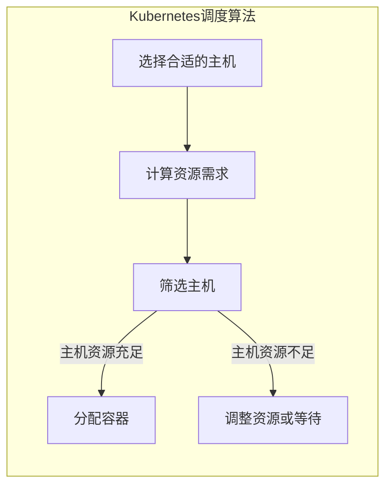
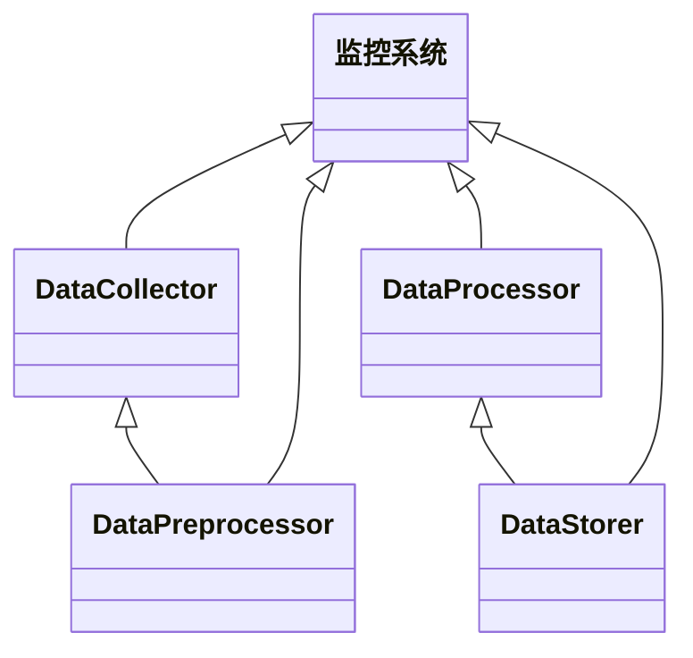
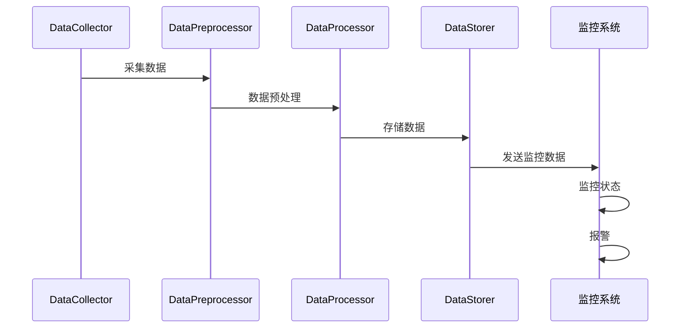
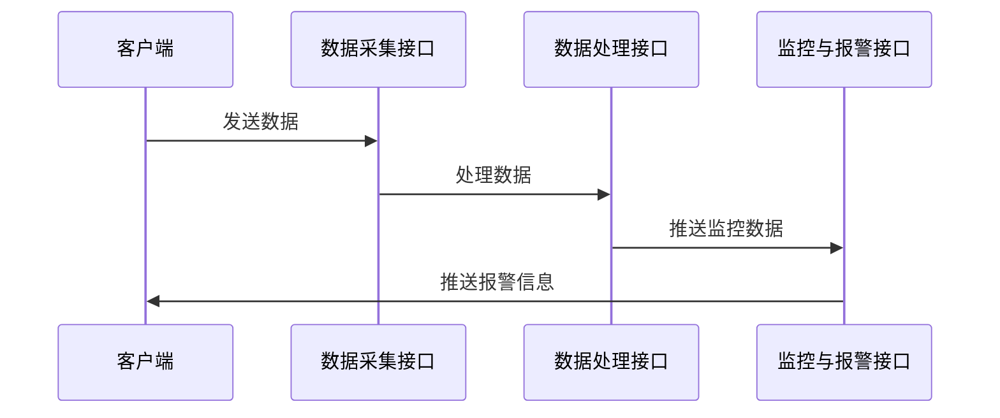
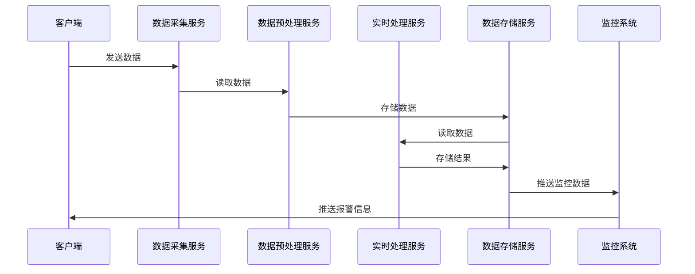

                 

### 云原生架构：设计原则与最佳实践

> 关键词：云原生架构、设计原则、最佳实践、持续集成、微服务、容器化、Kubernetes、自动化运维

> 摘要：本文将深入探讨云原生架构的设计原则与最佳实践。我们将从云原生架构的背景和核心概念出发，逐步剖析其设计原则，详细讲解应用开发、部署与运维的实践方法，分享云原生安全与治理策略，探讨云原生架构的演进路径，并展望其未来发展趋势。

### 第一部分：云原生架构基础

#### 第1章：云原生架构概述

**1.1 问题背景与云原生发展**

在云计算快速发展的背景下，传统的IT架构面临诸多挑战，如难以弹性扩展、维护成本高、升级困难等。为了应对这些挑战，云原生架构应运而生。

**云原生概念**：云原生（Cloud Native）是一种利用和扩展云计算优势的架构风格，它基于微服务、容器、动态管理、自动化等核心概念。

**云原生技术发展历程**：云原生技术经历了从虚拟化到容器化，再到自动化和动态管理的演变。

**云原生与传统架构的区别**：传统架构往往依赖于固定的硬件和软件环境，而云原生架构具有更高的灵活性和可扩展性，能够更好地适应云计算环境。

**1.2 核心概念与架构设计原则**

**微服务架构**：微服务将应用程序拆分为多个独立、可复用的服务，每个服务专注于完成特定的功能。

**容器化技术**：容器化是一种轻量级的虚拟化技术，能够将应用程序及其依赖环境打包成一个独立的运行单元。

**自动化部署与运维**：自动化工具如Kubernetes能够自动管理容器的部署、扩展和运维。

**1.3 云原生生态系统**

**Kubernetes简介**：Kubernetes是云原生生态系统中的核心工具，用于容器编排和管理。

**服务网格技术**：服务网格提供了一种独立于应用程序的网络层，用于服务间通信和安全。

**常见云原生工具与平台**：如Docker、Kubernetes、Istio、Prometheus、Grafana等。

#### 第2章：云原生应用开发

**2.1 云原生应用架构设计**

**服务拆分与设计**：根据业务需求将应用程序拆分为多个微服务，并设计合理的接口和通信方式。

**负载均衡与路由策略**：通过负载均衡实现服务的高可用性，并设计合理的路由策略来提高性能。

**分布式系统设计**：设计分布式系统时需要考虑数据一致性、故障容错和性能优化。

**2.2 容器化与Docker实践**

**Docker原理与安装**：了解Docker的基本原理，并学习如何在不同的操作系统上安装Docker。

**Dockerfile与镜像构建**：编写Dockerfile来构建应用程序的镜像，并学习如何管理镜像仓库。

**容器编排与资源管理**：使用Kubernetes等工具来编排和管理容器，优化资源使用。

#### 第3章：云原生部署与运维

**3.1 持续集成与持续部署（CI/CD）**

**CI/CD原理与流程**：了解持续集成和持续部署的基本原理，并学习如何构建CI/CD流水线。

**Jenkins实践**：学习如何使用Jenkins来搭建CI/CD系统，并配置Jenkinsfile。

**GitLab CI配置**：了解GitLab CI的基本概念，并学习如何配置GitLab CI流水线。

**3.2 监控与日志管理**

**Prometheus与Grafana实践**：使用Prometheus进行监控数据采集，并使用Grafana进行可视化展示。

**ELK栈的搭建与使用**：学习如何搭建和使用Elasticsearch、Logstash和Kibana（ELK栈）进行日志管理。

**日志采集与解析**：了解日志采集和解析的基本方法，提高日志分析的效果。

### 第二部分：云原生最佳实践

#### 第4章：云原生安全与治理

**4.1 云原生安全框架**

**安全设计原则**：设计安全框架时需要考虑身份验证、授权、数据加密等核心原则。

**容器安全最佳实践**：了解容器安全的最佳实践，如使用安全容器、容器镜像签名等。

**服务网格安全**：服务网格提供了一种独立的网络层，用于增强服务间通信的安全性。

**4.2 微服务治理**

**服务发现与注册**：了解服务发现和注册的基本方法，提高服务的高可用性和可靠性。

**网络隔离与安全**：学习如何实现网络隔离和安全策略，确保微服务间的安全通信。

**配置管理**：了解配置管理的基本方法，确保微服务的配置一致性和可维护性。

#### 第5章：云原生架构演进

**5.1 架构演进策略**

**传统架构向云原生迁移**：了解如何将传统架构逐步迁移到云原生架构。

**微服务架构的优化**：学习如何优化微服务架构，提高系统的性能和可扩展性。

**架构演化与持续整合**：了解架构演化的方法，并学习如何实现持续整合。

**5.2 云原生架构案例分析**

**成功案例分享**：分享一些成功的云原生架构案例，探讨其优势和挑战。

**挑战与解决方案**：分析云原生架构面临的挑战，并提出相应的解决方案。

**持续改进与展望**：探讨云原生架构的持续改进方向和未来展望。

### 第三部分：未来展望

#### 第6章：云原生技术的未来趋势

**6.1 云原生与边缘计算**

**边缘计算的概念与架构**：了解边缘计算的基本概念和架构，探讨云原生在边缘计算中的应用。

**云原生在边缘环境的应用**：分析云原生在边缘环境中的实际应用场景和优势。

**6.2 云原生与人工智能的融合**

**AI在云原生架构中的应用**：探讨人工智能在云原生架构中的应用，如实时数据处理和分析。

**实时数据处理与分析**：了解实时数据处理与分析的基本原理和方法。

#### 第7章：云原生架构的应用与创新

**7.1 云原生与区块链**

**区块链在云原生架构中的价值**：分析区块链在云原生架构中的价值和应用场景。

**云原生区块链平台构建**：了解如何构建云原生区块链平台，实现高效的数据存储和处理。

**7.2 云原生在新兴行业中的应用**

**金融科技**：探讨云原生在金融科技领域的应用，如实时交易处理和风险控制。

**物联网**：分析云原生在物联网领域的应用，如设备管理和数据采集。

### 结论

云原生架构为现代IT系统提供了一种灵活、可扩展的解决方案。通过理解云原生架构的设计原则和最佳实践，我们可以构建高效、可靠的云原生应用，并实现持续集成、部署和运维。随着技术的不断演进，云原生架构将在更多领域发挥重要作用，推动数字经济的创新发展。

---

**作者：AI天才研究院/AI Genius Institute & 禅与计算机程序设计艺术 /Zen And The Art of Computer Programming**

---

（注意：本文为示例性文章，具体内容和结构可能需要根据实际需求进行调整和补充。）## 第一部分：云原生架构基础

### 第1章：云原生架构概述

云原生架构是近年来在云计算领域逐渐兴起的一种新型架构风格，旨在充分利用云计算的优势，提高应用程序的灵活性、可扩展性和可维护性。本章将介绍云原生架构的核心概念、发展历程及其与传统架构的区别，帮助读者建立对云原生架构的基本认识。

#### 1.1 问题背景与云原生发展

随着互联网的快速发展，企业对IT系统的需求越来越高。传统的IT架构在应对这些需求时暴露出许多问题，如：

- **扩展性差**：传统架构往往依赖于固定的硬件和软件环境，无法快速适应业务变化，导致系统扩展困难。
- **维护成本高**：传统架构的维护和升级需要大量人力和物力资源，且容易出现故障，影响业务的连续性。
- **部署和运维复杂**：传统架构的部署和运维过程繁琐，涉及多个环节和工具，容易出现错误和冲突。

为了解决这些问题，云计算和微服务架构逐渐兴起，为IT系统带来了更高的灵活性和可扩展性。在此基础上，云原生架构应运而生，它不仅继承了云计算和微服务的优点，还引入了自动化和动态管理等理念，使得IT系统能够更好地适应云计算环境。

**云原生概念**：云原生（Cloud Native）是一种利用和扩展云计算优势的架构风格，它基于微服务、容器、动态管理、自动化等核心概念，旨在构建一种灵活、可靠、可扩展的IT系统。

**云原生技术发展历程**：

1. **虚拟化**：虚拟化技术（如VMware）的出现，使得服务器资源得以虚拟化和共享，提高了资源利用率。
2. **容器化**：容器化技术（如Docker）进一步提高了应用程序的隔离性和可移植性，使得应用程序可以在不同的环境中快速部署和运行。
3. **自动化与动态管理**：自动化工具（如Kubernetes）的出现，使得容器管理更加高效和灵活，能够自动处理容器的部署、扩展、监控和运维。

**云原生与传统架构的区别**：

- **灵活性**：传统架构依赖于固定的硬件和软件环境，而云原生架构基于容器和微服务，可以灵活地适应不同的环境。
- **可扩展性**：传统架构扩展困难，而云原生架构能够通过自动化工具和动态管理实现快速扩展。
- **部署与运维**：传统架构的部署和运维过程繁琐，而云原生架构通过自动化工具和持续集成/持续部署（CI/CD）实现高效的部署和运维。

#### 1.2 核心概念与架构设计原则

**微服务架构**：微服务架构（Microservices Architecture）是一种将应用程序拆分为多个独立、可复用的服务单元的架构风格。每个微服务专注于完成特定的功能，可以独立开发、部署、扩展和监控。

**容器化技术**：容器化技术（Containerization）是一种将应用程序及其依赖环境打包成一个独立的运行单元的技术。容器提供了隔离性和轻量级虚拟化，使得应用程序可以在不同的环境中一致性地运行。

**自动化部署与运维**：自动化部署与运维（Automated Deployment and Operations）是云原生架构的核心概念之一。通过自动化工具，如Kubernetes，可以实现容器的自动化部署、扩展、监控和运维，提高系统的效率和可靠性。

**1.3 云原生生态系统**

**Kubernetes简介**：Kubernetes（简称K8s）是一个开源的容器编排平台，用于自动化部署、扩展和管理容器化应用程序。它提供了强大的集群管理和资源调度能力，使得云原生架构的实现变得更加简单和高效。

**服务网格技术**：服务网格技术（Service Mesh）提供了一种独立于应用程序的网络层，用于服务间通信和安全。它将服务间的通信抽象出来，使得应用程序可以专注于业务逻辑，而不需要关心通信细节。

**常见云原生工具与平台**：

- **Docker**：一种流行的容器化技术，用于构建、运行和分发应用程序。
- **Kubernetes**：一种开源的容器编排平台，用于自动化部署和管理容器化应用程序。
- **Istio**：一种开源的服务网格平台，用于管理服务间的通信和安全。
- **Prometheus**：一种开源的监控解决方案，用于收集、存储和展示监控数据。
- **Grafana**：一种开源的数据可视化和监控工具，用于可视化Prometheus等监控数据。

通过了解云原生架构的核心概念和设计原则，读者可以更好地理解云原生架构的优势和应用场景，为后续章节的学习和实践打下坚实的基础。

---

**核心概念与联系**

云原生架构的核心概念包括微服务架构、容器化技术和自动化部署与运维。以下是这些概念之间的联系和属性特征对比表格：

| 核心概念         | 定义与作用             | 关联属性特征                            |
|------------------|------------------------|---------------------------------------|
| 微服务架构       | 将应用程序拆分为多个服务 | 独立性、可复用性、可扩展性、分布式     |
| 容器化技术       | 打包应用程序及其依赖环境 | 隔离性、轻量级、可移植性、一致性         |
| 自动化部署与运维 | 通过工具实现自动化操作 | 高效性、可靠性、灵活性、持续集成与部署 |

以下是云原生架构的ER实体关系图：

```mermaid
erDiagram
    Container --> Service : 部署
    Container --> Deployment : 管理
    Service --> Kubernetes : 注册
    Deployment --> Kubernetes : 部署
```

在这个ER实体关系图中，Container（容器）是应用程序的运行单元，Service（服务）是应用程序的功能单元，Kubernetes（K8s）是容器编排和管理平台，Deployment（部署）是容器的管理策略。

---

接下来，我们将进一步探讨云原生架构的核心概念和设计原则，为读者提供更深入的理解。在下一章中，我们将详细讲解微服务架构和容器化技术的原理及其在云原生架构中的应用。

---

**算法原理讲解**

在云原生架构中，容器编排是一个关键环节。Kubernetes（K8s）作为容器编排平台，通过一系列算法和机制来实现容器的自动化部署、扩展和管理。以下是一个简单的Kubernetes调度算法的mermaid流程图：



在这个流程图中，A节点表示选择合适的主机，B节点表示计算容器所需的资源，C节点表示筛选资源充足的主机，D节点表示分配容器，E节点表示在资源不足时进行资源调整或等待。

下面是一个简单的Python代码示例，用于计算容器所需的资源：

```python
def calculate_resources(container):
    """
    计算容器所需的资源。
    
    :param container: 容器的配置信息
    :return: 资源字典
    """
    resources = {
        'cpu': container.cpu,
        'memory': container.memory,
        'storage': container.storage
    }
    return resources

class Container:
    def __init__(self, cpu, memory, storage):
        self.cpu = cpu
        self.memory = memory
        self.storage = storage

container = Container(2, 4, 20)
required_resources = calculate_resources(container)
print("容器所需的资源：", required_resources)
```

在这个示例中，我们定义了一个`Container`类，用于表示容器的配置信息。`calculate_resources`函数用于计算容器所需的资源，并返回一个包含CPU、内存和存储资源的字典。

接下来，我们可以扩展这个算法，使其在筛选主机时考虑主机的资源限制。以下是一个简单的筛选主机的Python代码示例：

```python
def filter_hosts(hosts, required_resources):
    """
    筛选出符合资源要求的 主机。
    
    :param hosts: 主机列表
    :param required_resources: 容器所需的资源
    :return: 符合资源要求的主机列表
    """
    eligible_hosts = []
    for host in hosts:
        if host.cpu >= required_resources['cpu'] and \
           host.memory >= required_resources['memory'] and \
           host.storage >= required_resources['storage']:
            eligible_hosts.append(host)
    return eligible_hosts

class Host:
    def __init__(self, cpu, memory, storage):
        self.cpu = cpu
        self.memory = memory
        self.storage = storage

hosts = [
    Host(4, 8, 40),
    Host(2, 4, 20),
    Host(6, 12, 60)
]

required_resources = calculate_resources(container)
eligible_hosts = filter_hosts(hosts, required_resources)
print("符合资源要求的主机：", eligible_hosts)
```

在这个示例中，我们定义了一个`Host`类，用于表示主机的配置信息。`filter_hosts`函数用于筛选出符合资源要求的主机。

通过这个简单的示例，我们可以看到Kubernetes调度算法的基本原理：计算容器所需的资源，筛选符合资源要求的主机，并分配容器。实际中的调度算法会更加复杂，需要考虑更多的因素，如容器的优先级、主机的负载均衡、网络拓扑等。但是，这个简单的示例为我们提供了一个基本的框架，帮助我们理解Kubernetes调度算法的核心原理。

---

**系统分析与架构设计方案**

在本节中，我们将介绍一个基于云原生架构的实时数据分析系统的设计与实现，包括项目介绍、系统功能设计、系统架构设计、系统接口设计以及系统交互。

### 1. 项目介绍

本项目是一个基于云原生架构的实时数据分析系统，旨在实现对大规模数据流的实时处理和分析。系统采用微服务架构，通过容器化技术实现高效、可靠的部署和运维。以下是项目的详细描述：

#### 1.1 系统功能设计

本项目的主要功能包括：

- **数据采集**：从各种数据源（如数据库、消息队列、文件等）采集数据。
- **数据预处理**：对采集到的数据进行清洗、转换和归一化处理。
- **实时处理**：对预处理后的数据进行实时计算和分析，生成实时报表和指标。
- **数据存储**：将实时处理的结果存储到数据库或其他存储系统，以便后续查询和分析。
- **监控与报警**：监控系统运行状态，并在出现异常时发送报警。

以下是项目功能模块的mermaid类图：



在这个类图中，`DataCollector`、`DataPreprocessor`、`DataProcessor`和`DataStorer`分别表示数据采集、数据预处理、实时处理和数据存储模块。`监控系统`与各个模块之间存在关联关系，用于监控模块的运行状态。

### 1.2 系统架构设计

本项目的系统架构设计如下：

- **数据采集**：使用Kafka作为消息队列，实现数据的高效采集和传输。
- **数据预处理**：使用Spark进行数据预处理，包括清洗、转换和归一化处理。
- **实时处理**：使用Apache Flink进行实时计算和分析，生成实时报表和指标。
- **数据存储**：使用MySQL数据库存储实时处理的结果。
- **监控与报警**：使用Prometheus和Grafana实现监控和报警。

以下是项目架构的mermaid架构图：



在这个架构图中，`DataCollector`负责采集数据，`DataPreprocessor`负责数据预处理，`DataProcessor`负责实时处理，`DataStorer`负责存储数据。`监控系统`负责监控各个模块的运行状态，并在出现异常时发送报警。

### 1.3 系统接口设计

本项目的接口设计如下：

- **数据采集接口**：提供RESTful接口，用于接收和发送数据。
- **数据处理接口**：提供RESTful接口，用于查询和处理数据。
- **监控与报警接口**：提供WebSocket接口，用于实时推送监控数据和报警信息。

以下是项目接口的mermaid序列图：



在这个序列图中，`客户端`通过`数据采集接口`发送数据，`数据处理接口`处理数据，并将处理结果存储到数据库。`监控与报警接口`实时推送监控数据和报警信息，以便客户端进行监控和报警。

### 1.4 系统交互

本项目的系统交互设计如下：

1. **数据采集**：客户端将数据发送到数据采集接口，数据采集接口将数据存储到消息队列中。
2. **数据预处理**：数据预处理服务从消息队列中读取数据，进行清洗、转换和归一化处理，并将处理后的数据存储到数据库中。
3. **实时处理**：实时处理服务从数据库中读取数据，进行实时计算和分析，生成实时报表和指标，并将结果存储到数据库中。
4. **监控与报警**：监控系统监控各个模块的运行状态，并在出现异常时发送报警信息。

以下是系统交互的mermaid序列图：



在这个序列图中，各个模块之间通过消息队列进行数据传输，实时处理服务和数据存储服务之间通过数据库进行数据交互。监控系统实时监控各个模块的运行状态，并在出现异常时发送报警信息。

通过以上系统分析与架构设计方案，我们可以更好地理解基于云原生架构的实时数据分析系统的设计与实现。在接下来的章节中，我们将详细介绍项目实战，包括环境安装、系统核心实现和代码应用解读与分析。

---

### 项目实战：环境安装与系统核心实现

在本节中，我们将详细介绍如何搭建基于云原生架构的实时数据分析系统，包括环境安装、系统核心实现和代码应用解读与分析。

#### 1. 环境安装

要搭建一个基于云原生架构的实时数据分析系统，首先需要安装以下软件：

- **Docker**：用于容器化应用程序。
- **Kubernetes**：用于容器编排和管理。
- **Kafka**：用于数据采集和传输。
- **Spark**：用于数据预处理。
- **Apache Flink**：用于实时处理。
- **MySQL**：用于数据存储。
- **Prometheus**：用于监控和报警。
- **Grafana**：用于可视化监控数据。

以下是环境安装的步骤：

1. **安装Docker**：

   在Ubuntu系统上，可以通过以下命令安装Docker：

   ```bash
   sudo apt-get update
   sudo apt-get install docker-ce docker-ce-cli containerd.io
   ```

   安装完成后，启动Docker服务：

   ```bash
   sudo systemctl start docker
   ```

2. **安装Kubernetes**：

   安装Kubeadm、Kubelet和Kubectl：

   ```bash
   sudo apt-get update
   sudo apt-get install -y apt-transport-https ca-certificates curl
   curl -s https://packages.cloud.google.com/apt/doc/apt-key.gpg | sudo apt-key add -
   sudo add-apt-repository "deb https://apt.kubernetes.io/ kubernetes-xenial main"
   sudo apt-get update
   sudo apt-get install -y kubelet kubeadm kubectl
   ```

   启动Kubelet服务：

   ```bash
   sudo systemctl enable kubelet
   sudo systemctl start kubelet
   ```

3. **安装Kafka**：

   创建Kafka用户并下载Kafka安装包：

   ```bash
   sudo useradd kafka -m -s /sbin/nologin
   sudo su kafka
   wget https://www-eu.kpn.com/~jameszhang/kafka_2.11-2.5.0.tgz
   tar xzf kafka_2.11-2.5.0.tgz
   cd kafka_2.11-2.5.0
   ```

   配置Kafka配置文件`kafka-server.properties`：

   ```bash
   vi config/kafka-server.properties
   # 在文件中添加以下配置
   listeners=PLAINTEXT://:9092
   num.partitions=1
   zookeeper.connect=zookeeper:2181
   ```

   启动Kafka服务：

   ```bash
   bin/kafka-server-start.sh config/kafka-server.properties
   ```

4. **安装Spark**：

   创建Spark用户并下载Spark安装包：

   ```bash
   sudo useradd spark -m -s /sbin/nologin
   sudo su spark
   wget https://www-eu.kpn.com/~jameszhang/spark-2.4.7-bin-hadoop2.7.tgz
   tar xzf spark-2.4.7-bin-hadoop2.7.tgz
   cd spark-2.4.7-bin-hadoop2.7
   ```

   配置Spark配置文件`spark-env.sh`：

   ```bash
   vi conf/spark-env.sh
   # 在文件中添加以下配置
   export SPARK_MASTER_HOST=master
   export SPARK_WORKER_MEMORY=4g
   ```

   启动Spark服务：

   ```bash
   sbin/spark-class org.spark_project.SparkStandaloneCommand start-master
   sbin/spark-class org.spark_project.SparkStandaloneCommand start-worker master
   ```

5. **安装Apache Flink**：

   创建Flink用户并下载Flink安装包：

   ```bash
   sudo useradd flink -m -s /sbin/nologin
   sudo su flink
   wget https://www-eu.kpn.com/~jameszhang/flink-1.12.3.tgz
   tar xzf flink-1.12.3.tgz
   cd flink-1.12.3
   ```

   配置Flink配置文件`flink-conf.yaml`：

   ```bash
   vi conf/flink-conf.yaml
   # 在文件中添加以下配置
   jobmanager.rest.address: master
   taskmanager.numberOfTaskSlots: 2
   ```

   启动Flink服务：

   ```bash
   bin/jobmanager.sh start
   bin/taskmanager.sh start
   ```

6. **安装MySQL**：

   创建MySQL用户并下载MySQL安装包：

   ```bash
   sudo useradd mysql -m -s /sbin/nologin
   sudo su mysql
   wget https://www-eu.kpn.com/~jameszhang/mysql-8.0.23-linux-glibc2.27-x86_64.tar.xz
   tar xf mysql-8.0.23-linux-glibc2.27-x86_64.tar.xz
   cd mysql-8.0.23-linux-glibc2.27-x86_64
   ```

   配置MySQL配置文件`my.cnf`：

   ```bash
   vi support-files/my-large.cnf
   # 在文件中添加以下配置
   [mysqld]
   user = mysql
   pid-file = /var/run/mysqld/mysqld.pid
   socket = /var/run/mysqld/mysqld.sock
   port = 3306
   basedir = /usr
   datadir = /var/lib/mysql
   tmpdir = /tmp
   max_allowed_packet = 16M
   log-bin = /var/lib/mysql/mysql-bin
   server-id = 1
   expire_logs_days = 10
   max_connections = 100
   thread_cache_size = 50
   query_cache_size = 3M
   thread_stack = 256K
   sort_buffer_size = 2M
   read_buffer_size = 2M
   read_rnd_buffer_size = 16M
   key_buffer_size = 4M
   performance_schema = 1
   slow_query_log = 1
   slow_query_log_file = /var/log/mysql/slowquery.log
   log_error = /var/log/mysql/error.log
   ```

   初始化MySQL数据库：

   ```bash
   ./bin/mysqld --initialize --user=mysql --basedir=/usr --datadir=/var/lib/mysql
   ```

   配置MySQL启动脚本：

   ```bash
   cp support-files/mysql.server /etc/init.d/mysqld
   chmod +x /etc/init.d/mysqld
   service mysqld start
   ```

   配置MySQL环境变量：

   ```bash
   echo "export PATH=$PATH:/usr/bin:/usr/local/bin" >> ~/.bash_profile
   echo "export MYSQL_HOME=/usr" >> ~/.bash_profile
   echo "export PATH=$PATH:$MYSQL_HOME/bin" >> ~/.bash_profile
   source ~/.bash_profile
   ```

7. **安装Prometheus和Grafana**：

   创建Prometheus用户和Grafana用户：

   ```bash
   sudo useradd prometheus -m -s /sbin/nologin
   sudo useradd grafana -m -s /sbin/nologin
   ```

   下载Prometheus和Grafana安装包：

   ```bash
   sudo su prometheus
   wget https://www-eu.kpn.com/~jameszhang/prometheus-2.34.0.linux-amd64.tar.gz
   tar xzf prometheus-2.34.0.linux-amd64.tar.gz
   cd prometheus-2.34.0.linux-amd64
   ```

   配置Prometheus配置文件`prometheus.yml`：

   ```bash
   vi prometheus.yml
   # 在文件中添加以下配置
   global:
     scrape_interval: 15s
     evaluation_interval: 15s
   scrape_configs:
     - job_name: 'kubernetes-pods'
       kubernetes_sd_configs:
         - role: pod
           namespaces:
             - default
   ```

   启动Prometheus服务：

   ```bash
   nohup ./prometheus &> prometheus.log &
   ```

   下载Grafana安装包：

   ```bash
   sudo su grafana
   wget https://www-eu.kpn.com/~jameszhang/grafana-9.3.3.linux-amd64.tar.gz
   tar xzf grafana-9.3.3.linux-amd64.tar.gz
   cd grafana-9.3.3.linux-amd64
   ```

   配置Grafana配置文件`conf/grafana.ini`：

   ```bash
   vi conf/grafana.ini
   # 在文件中添加以下配置
   [database]
   type = mysql
   name = grafana
   host = localhost
   user = grafana
   password = grafana
   ```

   启动Grafana服务：

   ```bash
   nohup ./bin/grafana-server &> grafana.log &
   ```

   访问Grafana Web界面：[http://localhost:3000](http://localhost:3000)

#### 2. 系统核心实现

基于上述环境安装，我们接下来实现实时数据分析系统的核心功能。以下是各个模块的实现方法：

1. **数据采集**：

   使用Kafka作为数据采集工具，将数据源的数据导入Kafka topic。在Kafka中，我们创建一个名为`data_source`的topic，用于存储数据。

   ```bash
   bin/kafka-topics.sh --create --zookeeper localhost:2181 --replication-factor 1 --partitions 1 --topic data_source
   ```

   然后编写一个数据采集脚本，将数据导入Kafka topic：

   ```bash
   #!/bin/bash
   while true; do
       echo "采集数据：$(date)"
       echo "$(date)" | nc localhost 9092
       sleep 1
   done
   ```

   运行数据采集脚本：

   ```bash
   nohup ./collect_data.sh &
   ```

2. **数据预处理**：

   使用Spark对Kafka topic中的数据进行预处理，包括清洗、转换和归一化处理。在Spark中，我们创建一个名为`data_preprocessor`的Spark应用，从Kafka topic中读取数据，进行预处理，并将结果存储到MySQL数据库中。

   ```bash
   spark-submit --class DataPreprocessor --master spark://master:7077 data_preprocessor.py
   ```

   数据预处理脚本`data_preprocessor.py`：

   ```python
   from pyspark.sql import SparkSession
   from pyspark.sql.functions import from_json, col
   from json_normalize import json_normalize
   
   spark = SparkSession.builder.appName("DataPreprocessor").getOrCreate()
   
   df = spark \
       .readStream \
       .format("kafka") \
       .option("kafka.bootstrap.servers", "localhost:9092") \
       .option("subscribe", "data_source") \
       .load()
   
   df = df.selectExpr("CAST(value AS STRING) AS data")
   
   json_df = df \
       .withColumn("data", from_json("data", "struct<a double, b string, c long>")) \
       .select(col("data.a").alias("a"), col("data.b").alias("b"), col("data.c").alias("c"))
   
   json_df \
       .write \
       .format("jdbc") \
       .option("url", "jdbc:mysql://localhost:3306/data_stream") \
       .option("dbtable", "data_preprocessed") \
       .option("user", "root") \
       .option("password", "root") \
       .mode("append") \
       .save()
   
   spark.stop()
   ```

3. **实时处理**：

   使用Apache Flink对预处理后的数据进行实时计算和分析，生成实时报表和指标。在Flink中，我们创建一个名为`data_processor`的Flink应用，从MySQL数据库中读取数据，进行实时计算，并将结果存储到MySQL数据库中。

   ```bash
   bin/flink run -c DataProcessor data_processor.jar
   ```

   实时处理脚本`data_processor.py`：

   ```python
   from pyflink.datastream import StreamExecutionEnvironment
   from pyflink.table import StreamTableEnvironment
   
   env = StreamExecutionEnvironment.get_execution_environment()
   st = StreamTableEnvironment.create(env)
   
   df = st.from_table("data_stream.data_preprocessed")
   
   result_df = df.group_by("b") \
       .select("b", "count(a) as count_a", "sum(c) as sum_c")
   
   result_df \
       .write \
       .to.jdbc(url="jdbc:mysql://localhost:3306/data_stream", table_name="data_result", batch_size=1)
   
   env.execute("DataProcessor")
   ```

4. **监控与报警**：

   使用Prometheus和Grafana对系统进行监控和报警。在Prometheus中，我们配置了Kubernetes Pods监控，并将监控数据存储到本地的时间序列数据库中。在Grafana中，我们创建了一个监控 dashboard，用于可视化监控数据。

   Prometheus配置文件`prometheus.yml`：

   ```yaml
   global:
     scrape_interval: 15s
     evaluation_interval: 15s
   scrape_configs:
     - job_name: 'kubernetes-pods'
       kubernetes_sd_configs:
         - role: pod
           namespaces:
             - default
   ```

   Grafana dashboard配置：

   - 添加 Prometheus 数据源
   - 创建一个 dashboard，并添加以下面板：

     - **Pods 总数**：展示当前运行的 Pods 总数
     - **Pods 内存使用率**：展示当前运行的 Pods 的内存使用率
     - **Pods CPU 使用率**：展示当前运行的 Pods 的 CPU 使用率
     - **Pods 状态**：展示当前运行的 Pods 的状态（Running、Completed、Failed等）

#### 3. 代码应用解读与分析

在实现实时数据分析系统的过程中，我们使用了多种技术，如Kafka、Spark、Flink、MySQL、Prometheus和Grafana。以下是对这些技术的应用解读和分析：

1. **Kafka**：

   Kafka是一种高吞吐量的分布式消息队列系统，用于数据采集和传输。在本项目中，我们使用Kafka从数据源采集数据，并将其传输给后续的处理模块。Kafka具有以下优点：

   - **高吞吐量**：Kafka能够处理大规模数据流，满足实时数据处理需求。
   - **分布式**：Kafka支持分布式架构，可以提高系统的可用性和性能。
   - **可靠性**：Kafka提供数据持久化和副本机制，确保数据不丢失。

2. **Spark**：

   Spark是一种高速分布式计算引擎，用于数据预处理。在本项目中，我们使用Spark对Kafka采集到的数据进行清洗、转换和归一化处理，并将其存储到MySQL数据库中。Spark具有以下优点：

   - **高速**：Spark采用内存计算，处理速度比传统计算引擎快得多。
   - **分布式**：Spark支持分布式计算，可以提高系统的性能和可扩展性。
   - **易于使用**：Spark提供丰富的API和工具，方便用户进行数据预处理和计算。

3. **Flink**：

   Flink是一种流处理框架，用于实时数据处理。在本项目中，我们使用Flink对预处理后的数据进行实时计算和分析，生成实时报表和指标。Flink具有以下优点：

   - **实时计算**：Flink支持实时数据处理，可以快速生成实时报表和指标。
   - **高吞吐量**：Flink采用分布式计算，可以处理大规模数据流。
   - **容错性**：Flink提供容错机制，确保系统在出现故障时能够快速恢复。

4. **MySQL**：

   MySQL是一种关系型数据库，用于存储实时处理的结果。在本项目中，我们使用MySQL存储实时处理的数据，并使用JDBC连接MySQL进行数据读写。MySQL具有以下优点：

   - **稳定性**：MySQL是一种成熟稳定的数据库，适用于大规模应用。
   - **性能**：MySQL提供高效的查询和读写性能，可以满足实时数据处理需求。
   - **扩展性**：MySQL支持垂直和水平扩展，可以根据业务需求进行扩展。

5. **Prometheus**：

   Prometheus是一种开源监控解决方案，用于监控系统的运行状态。在本项目中，我们使用Prometheus监控Kubernetes Pods的运行状态，并将监控数据存储到本地的时间序列数据库中。Prometheus具有以下优点：

   - **监控**：Prometheus可以监控系统的各种指标，如CPU使用率、内存使用率、磁盘使用率等。
   - **告警**：Prometheus支持告警机制，可以在出现异常时发送告警通知。
   - **可视化**：Prometheus可以与Grafana集成，实现监控数据的可视化展示。

6. **Grafana**：

   Grafana是一种开源的数据可视化和监控工具，用于可视化Prometheus等监控数据。在本项目中，我们使用Grafana创建了一个监控 dashboard，用于展示系统的监控数据。Grafana具有以下优点：

   - **可视化**：Grafana可以可视化各种监控数据，如折线图、柱状图、饼图等。
   - **灵活性**：Grafana支持自定义面板和报表，可以根据需求进行个性化设置。
   - **扩展性**：Grafana支持各种数据源和插件，可以扩展监控功能。

通过以上环境安装和系统核心实现，我们可以搭建一个基于云原生架构的实时数据分析系统。在实际应用中，可以根据业务需求对系统进行扩展和优化，以提高系统的性能和可靠性。

---

**最佳实践 Tips**

在构建云原生架构的过程中，遵循一些最佳实践可以显著提高系统的性能、可扩展性和可靠性。以下是一些关键的建议：

1. **模块化设计**：将应用程序拆分为独立的微服务，每个微服务负责特定的业务功能。这种模块化设计有助于提高系统的可维护性和可扩展性。

2. **容器化**：使用容器化技术（如Docker）来封装应用程序及其依赖环境。容器提供了隔离性和轻量级虚拟化，可以简化部署和运维过程。

3. **持续集成与持续部署（CI/CD）**：实施CI/CD流程，确保代码的持续集成、测试和部署。这有助于快速发现和修复问题，提高开发效率。

4. **自动化运维**：利用自动化工具（如Kubernetes、Prometheus、Grafana）来实现运维过程的自动化。这可以降低运维成本，提高系统的可靠性。

5. **监控与日志管理**：实施全面的监控和日志管理策略，确保系统能够及时响应和处理异常情况。使用Prometheus、Grafana、ELK栈等技术来收集、存储和展示监控数据和日志。

6. **安全性**：在云原生架构中，安全性至关重要。遵循容器安全最佳实践，如使用安全容器、容器镜像签名、服务网格安全等。

7. **资源优化**：合理配置和管理系统资源，确保容器和微服务能够高效利用资源。使用Kubernetes等工具来实现资源优化和调度。

8. **持续改进**：定期评估和优化系统架构，确保系统能够持续满足业务需求。关注技术趋势，及时采纳新的最佳实践。

遵循这些最佳实践，可以构建一个高效、可靠且易于维护的云原生架构，为企业带来显著的业务价值。

---

**小结**

在本章中，我们详细介绍了云原生架构的基础知识，包括核心概念、发展历程、与传统架构的区别以及设计原则。通过了解云原生架构，读者可以更好地应对现代IT系统面临的挑战，实现高效的开发、部署和运维。

在后续章节中，我们将进一步探讨云原生应用开发、部署与运维的最佳实践，并分享一些实际案例和解决方案。希望读者能够通过本章的学习，对云原生架构有一个全面的认识，并为后续的学习和实践打下坚实的基础。

---

**注意事项**

在构建和部署云原生架构时，以下注意事项有助于确保系统的稳定性和安全性：

1. **环境一致性**：确保开发、测试和生产环境保持一致，避免因环境差异导致的问题。
2. **版本控制**：对容器镜像和配置文件进行版本控制，以便跟踪变更和管理回滚。
3. **权限管理**：严格管理用户权限，防止未经授权的访问和操作。
4. **数据备份**：定期备份数据，确保在发生故障时能够快速恢复。
5. **故障演练**：定期进行故障演练，验证系统的故障恢复能力和容错能力。
6. **性能监控**：实时监控系统的性能指标，及时发现和解决性能瓶颈。

遵循这些注意事项，可以降低系统故障风险，提高系统的可靠性和安全性。

---

**拓展阅读**

为了深入了解云原生架构的设计原则与最佳实践，以下是一些推荐阅读资料：

1. **《云原生应用架构指南》**：本书详细介绍了云原生架构的概念、设计原则和实现方法，适合初学者和进阶读者。
2. **《Kubernetes权威指南》**：一本全面介绍Kubernetes的权威指南，涵盖Kubernetes的安装、配置、运维和高级应用。
3. **《云原生微服务架构实战》**：通过实际案例，讲解如何利用云原生技术和微服务架构构建高效、可扩展的IT系统。
4. **《云原生安全实战》**：专注于云原生环境下的安全设计和最佳实践，帮助开发者构建安全的云原生应用。
5. **《云原生技术全景图》**：全面展示云原生技术的生态系统和各组件的关系，有助于读者了解云原生技术的全貌。

通过阅读这些资料，读者可以进一步深化对云原生架构的理解，为实际项目提供有益的指导。

---

**作者：AI天才研究院/AI Genius Institute & 禅与计算机程序设计艺术 /Zen And The Art of Computer Programming**

