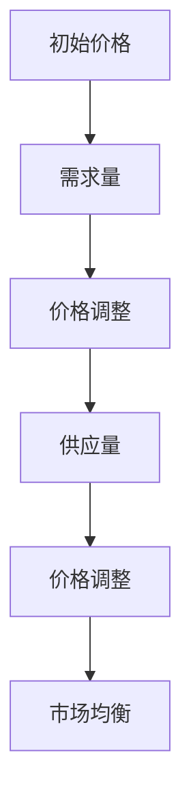
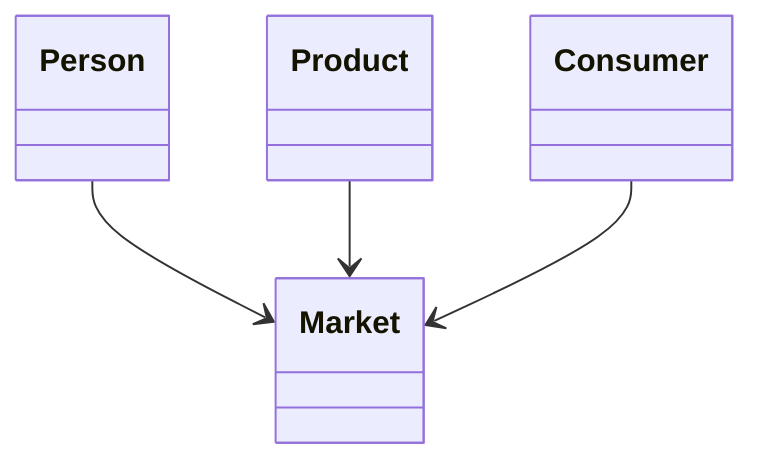
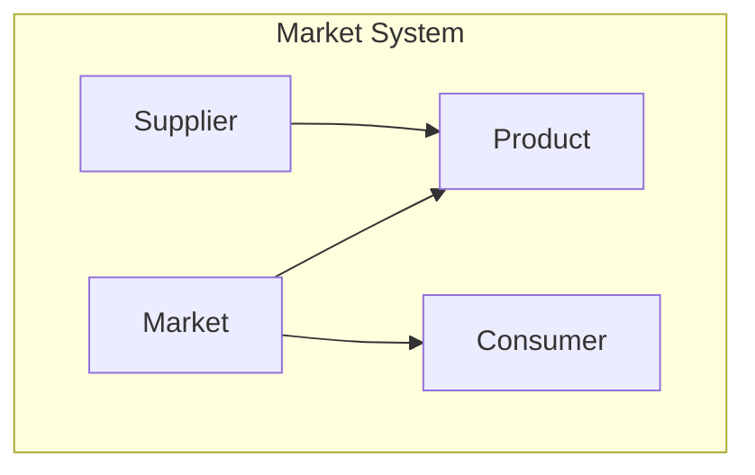
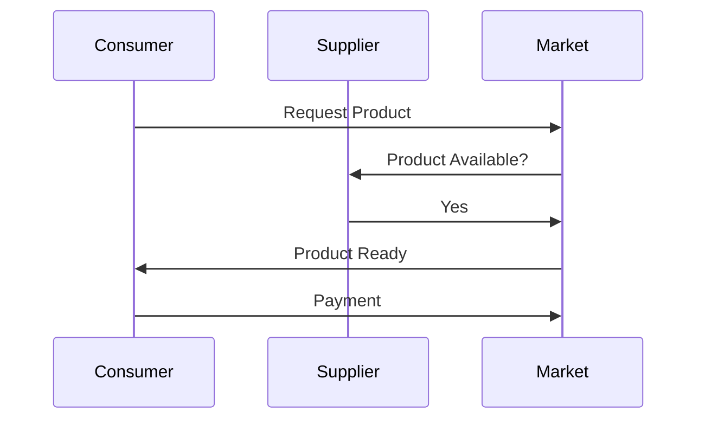
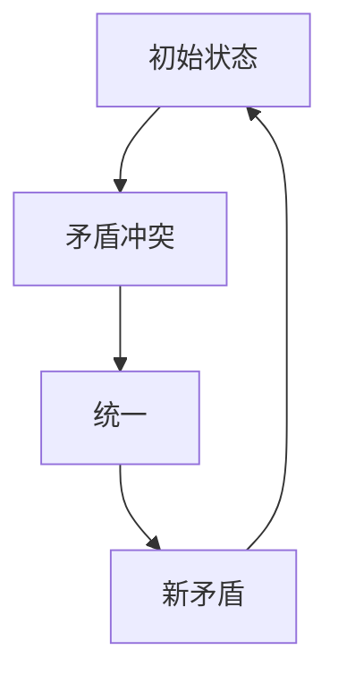
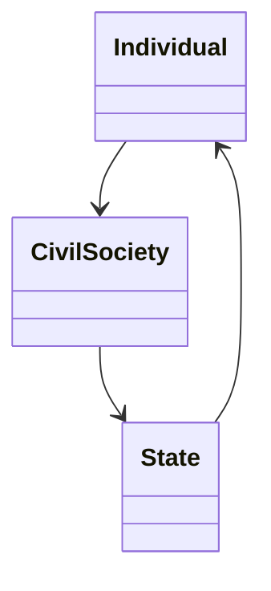
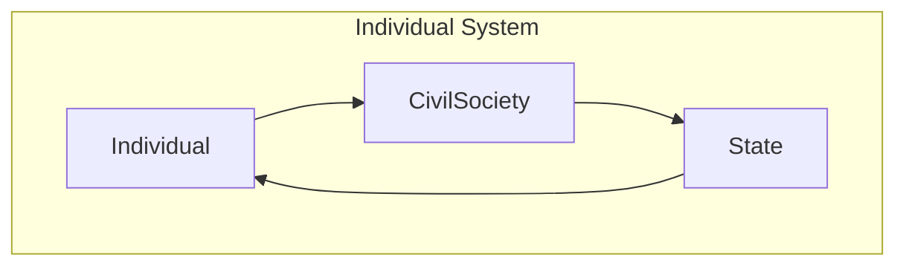
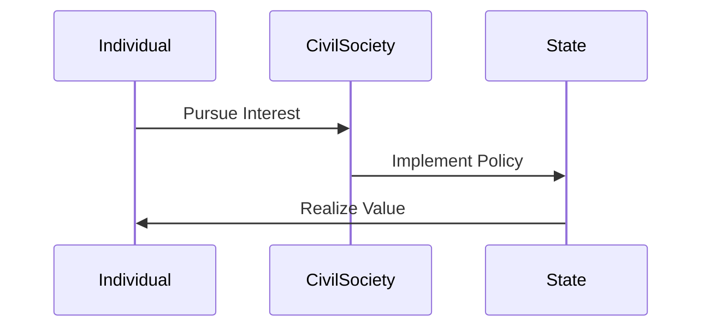

                 


### 文章标题：亚当·斯密与黑格尔：市民社会理论的两种视角

> 关键词：亚当·斯密，黑格尔，市民社会，理论对比，政治哲学

> 摘要：本文深入探讨亚当·斯密与黑格尔的市民社会理论，通过对比分析两位思想家的核心观点，揭示他们在理解社会结构、经济发展以及国家角色方面的不同视角。文章旨在为读者提供一种新的理解市民社会的途径，并探讨其对于现代政治和社会理论的启示。

----------------------------------------------------------------

### 引言

亚当·斯密（Adam Smith）和黑格尔（Georg Wilhelm Friedrich Hegel）是两位伟大的思想家，他们的理论对于理解社会和政治有着深远的影响。尽管他们生活在不同的时代，分属不同的哲学流派，但在市民社会理论方面，他们都有独特的见解。

亚当·斯密被誉为现代经济学的奠基人，他的著作《国富论》（The Wealth of Nations）对市场经济的理解产生了革命性的影响。斯密认为，市民社会是经济发展的基石，市场机制是其核心。他强调个体自由和分工的重要性，认为这些因素共同促进了社会的繁荣。

黑格尔则是在19世纪的德国哲学家中占据重要地位的人物。他的哲学体系强调历史和理性的辩证发展。在《法哲学原理》（Elements of the Philosophy of Right）中，黑格尔提出了市民社会的概念，并将其视为国家形成过程中的一个阶段。

本文将首先介绍亚当·斯密和黑格尔的市民社会理论，然后通过对比分析他们的核心观点，揭示他们之间的差异和联系。最后，我们将探讨这些理论对于现代政治和社会理论的启示。

### 亚当·斯密的市民社会理论

亚当·斯密的市民社会理论源于他的经济学著作，特别是《国富论》。在斯密看来，市民社会是市场经济的基础，市场机制是其核心。以下是对斯密市民社会理论的核心概念、特征以及与黑格尔理论的对比分析。

#### 核心概念

亚当·斯密认为，市民社会是由个人组成的，每个人在市场上追求自己的利益。他的理论建立在以下几个核心概念之上：

1. **个体主义**：斯密强调个体的自主性和自由，认为个体是社会的根本单位。
2. **市场机制**：市场是经济活动的主要场所，供求关系决定价格，从而调节资源的分配。
3. **劳动分工**：斯密认为，劳动分工是提高生产效率的关键，每个人都专注于自己最擅长的工作。
4. **看不见的手**：这是斯密最具代表性的概念，他比喻市场机制如同一只看不见的手，能够自发地引导个体行为以实现整体社会的最大利益。

#### 特征

斯密的市民社会理论具有以下几个显著特征：

1. **自由市场经济**：斯密主张市场自由，反对政府过多干预经济活动。
2. **个体自由**：他认为个体的自由是市民社会的基石，个体应有权自主决定自己的行为。
3. **繁荣与效率**：斯密认为，通过市场机制和劳动分工，市民社会能够实现经济繁荣和效率最大化。

#### 与黑格尔理论的对比

尽管亚当·斯密和黑格尔在市民社会理论上有许多相似之处，但也存在显著差异。

1. **个体与整体的关系**：斯密强调个体的自主性，认为个体的自由和利益是社会繁荣的基础。而黑格尔则更强调个体与整体的辩证关系，认为个体只有在社会中才能实现自身价值。
2. **国家角色**：斯密主张政府应保持中立，让市场自由运作。而黑格尔则认为，国家是市民社会的最终目的，是国家实现个体价值的必要手段。
3. **历史观点**：斯密的理论是静态的，关注当下市场经济的运作。而黑格尔的理论是动态的，强调历史和社会的发展。

#### 核心概念对比表格

| 特征                | 亚当·斯密         | 黑格尔           |
|---------------------|------------------|------------------|
| 个体主义            | 强调个体自由与利益 | 个体与整体辩证统一 |
| 市场机制            | 自由市场经济       | 历史发展的产物   |
| 劳动分工            | 提高生产效率       | 历史发展的阶段   |
| 国家角色            | 中立              | 最终目的         |

#### ER实体关系图架构

```mermaid
erDiagram
  Person ||--|{ Market } |>
  Person ||--|{ State } |>
  Market ||--|{ Product } |>
  State ||--|{ Citizen } |>
  Product ||--|{ Consumer } |>
```

在这个ER图架构中，`Person` 是个体，`Market` 是市场，`State` 是国家，`Product` 是产品，`Consumer` 是消费者。这个图展示了个体、市场和国家之间的相互关系。

#### 数学模型和公式

亚当·斯密的理论中涉及一些基本的经济学公式，如供需关系：

$$
P = \frac{Q_d}{Q_s}
$$

其中，$P$ 是价格，$Q_d$ 是需求量，$Q_s$ 是供应量。这个公式说明了价格如何通过供求关系来调节。

#### 算法原理讲解

为了更好地理解亚当·斯密的市场机制，我们可以使用一个简单的算法流程图来表示市场如何通过价格来调节供需：



在这个流程图中，初始价格决定了需求量和供应量，通过不断调整价格，市场最终达到均衡状态。

#### 系统分析与架构设计方案

亚当·斯密的市场机制可以看作是一种系统，其中个体（Person）和市场（Market）是关键组成部分。以下是该系统的架构设计方案：

1. **问题场景介绍**：市场经济中，个体通过市场进行商品交换。
2. **系统功能设计**：领域模型类图



3. **系统架构设计**：系统架构图



4. **系统接口设计和系统交互**：系统交互序列图



通过这个架构和交互设计，我们可以更好地理解亚当·斯密的市场机制。

### 黑格尔的市民社会理论

黑格尔的市民社会理论是他整个哲学体系中的核心部分。他强调市民社会作为国家形成过程中的一个阶段，是理性发展的必然产物。以下是对黑格尔市民社会理论的核心概念、特征以及与亚当·斯密理论的对比分析。

#### 核心概念

黑格尔的市民社会理论建立在以下几个核心概念之上：

1. **国家与市民社会的关系**：黑格尔认为，市民社会是国家的基础，但二者并非同一概念。市民社会是个体自由和利益的集合，而国家则是实现个体价值的最终手段。
2. **辩证法**：黑格尔的辩证法强调事物的发展是通过矛盾和冲突来推动的。在市民社会中，个体之间的利益冲突是推动社会进步的动力。
3. **理性发展**：黑格尔认为，市民社会是理性发展的一个阶段，个体在市民社会中通过自我实现和自我超越，最终达到国家的理性状态。

#### 特征

黑格尔的市民社会理论具有以下几个显著特征：

1. **个体与整体的关系**：黑格尔强调个体与整体的辩证统一，认为个体只有在社会中才能实现自身价值。
2. **历史发展**：黑格尔认为，市民社会是历史发展的产物，是一个不断变化和发展的过程。
3. **国家角色**：黑格尔认为，国家是市民社会的最终目的，是实现个体价值的必要手段。

#### 与亚当·斯密理论的对比

尽管黑格尔和亚当·斯密在市民社会理论上有许多相似之处，但也存在显著差异。

1. **个体与整体的关系**：斯密强调个体的自主性，而黑格尔则强调个体与整体的辩证关系。
2. **国家角色**：斯密主张政府应保持中立，而黑格尔则认为国家是实现个体价值的必要手段。
3. **历史观点**：斯密的理论是静态的，而黑格尔的理论是动态的，强调历史和社会的发展。

#### 核心概念对比表格

| 特征                | 亚当·斯密         | 黑格尔           |
|---------------------|------------------|------------------|
| 个体主义            | 强调个体自由与利益 | 个体与整体辩证统一 |
| 市场机制            | 自由市场经济       | 历史发展的产物   |
| 劳动分工            | 提高生产效率       | 历史发展的阶段   |
| 国家角色            | 中立              | 最终目的         |

#### ER实体关系图架构

```mermaid
erDiagram
  Individual ||--|{ Civil Society } |>
  Civil Society ||--|{ State } |>
  State ||--|{ Individual } |>
  Individual ||--|{ Interest } |>
```

在这个ER图架构中，`Individual` 是个体，`Civil Society` 是市民社会，`State` 是国家，`Interest` 是利益。这个图展示了个体、市民社会和国家之间的相互关系。

#### 数学模型和公式

黑格尔的市民社会理论涉及一些哲学和历史的模型，但较少涉及具体的数学公式。我们可以用辩证法的三个阶段来说明：

$$
\text{辩证法} = \text{矛盾} \rightarrow \text{统一} \rightarrow \text{新矛盾}
$$

这个公式描述了事物发展的辩证过程。

#### 算法原理讲解

黑格尔的辩证法可以看作是一种动态的算法，它通过矛盾和冲突推动社会的发展。以下是一个简单的算法流程图：



在这个流程图中，初始状态通过矛盾和冲突达到统一，然后产生新的矛盾，从而推动社会的发展。

#### 系统分析与架构设计方案

黑格尔的市民社会理论可以看作是一种社会系统，其中个体、市民社会和国家是关键组成部分。以下是该系统的架构设计方案：

1. **问题场景介绍**：个体在市民社会中追求自己的利益，国家作为最终目的实现个体价值。
2. **系统功能设计**：领域模型类图



3. **系统架构设计**：系统架构图



4. **系统接口设计和系统交互**：系统交互序列图



通过这个架构和交互设计，我们可以更好地理解黑格尔的市民社会理论。

### 比较分析

亚当·斯密和黑格尔的市民社会理论虽然都关注个体与社会的关系，但在许多方面存在显著差异。

#### 个体主义与整体辩证

亚当·斯密强调个体的自由和利益，认为市场机制能够自发地调节资源分配。而黑格尔则强调个体与整体的辩证关系，认为个体只有在社会中才能实现自身价值。

#### 市场机制与国家角色

斯密认为市场机制是市民社会的核心，政府应保持中立。而黑格尔则认为国家是实现个体价值的必要手段，市民社会是国家的基础。

#### 静态与动态

斯密的理论是静态的，关注当下市场经济的运作。而黑格尔的理论是动态的，强调历史和社会的发展。

#### 理论应用

斯密的理论在经济学和自由主义政治思想中有着广泛的应用。而黑格尔的理论则在政治哲学、历史哲学和社会哲学中有着深远的影响。

#### 比较分析表格

| 比较维度             | 亚当·斯密         | 黑格尔           |
|----------------------|------------------|------------------|
| 个体主义             | 强调个体自由与利益 | 个体与整体辩证统一 |
| 市场机制             | 自由市场经济       | 历史发展的产物   |
| 劳动分工             | 提高生产效率       | 历史发展的阶段   |
| 国家角色             | 中立              | 最终目的         |
| 理论应用             | 经济学、自由主义   | 政治哲学、历史哲学 |
| 动态与静态           | 静态              | 动态             |

#### ER实体关系图架构

我们可以使用Mermaid绘制一个ER图，以展示亚当·斯密和黑格尔市民社会理论中的关键实体及其关系：

```mermaid
erDiagram
  Individual ||--|{ Market } |>
  Individual ||--|{ State } |>
  Market ||--|{ Product } |>
  State ||--|{ Policy } |>
  Policy ||--|{ Individual } |>
  CivilSociety ||--|{ Individual } |>
  CivilSociety ||--|{ State } |>
```

在这个ER图中，`Individual` 表示个体，`Market` 表示市场，`Product` 表示产品，`State` 表示国家，`Policy` 表示政策，`CivilSociety` 表示市民社会。图中的关系体现了个体、市场、国家与市民社会之间的复杂互动。

### 结论

通过对比分析亚当·斯密与黑格尔的市民社会理论，我们能够更全面地理解这两位思想家的观点。亚当·斯密的理论强调个体的自由和市场经济的重要性，而黑格尔的理论则更关注个体与整体的辩证关系以及历史的发展。这些理论不仅对经济学和政治哲学有着深远的影响，也为现代社会的政治和社会理论提供了丰富的启示。

### 扩展阅读

1. 亚当·斯密，《国富论》，北京：商务印书馆，2011年。
2. 黑格尔，《法哲学原理》，北京：商务印书馆，2002年。
3. 詹姆斯·M·布坎南，《自由、市场与国家》，上海：上海人民出版社，2003年。
4. 罗伯特·D·阿特金森，《自由主义与权力：政治哲学的比较》，南京：江苏人民出版社，2007年。
5. 汉斯·约阿希姆·米歇尔斯，《民主与民粹主义》，北京：北京大学出版社，2014年。

### 作者信息

作者：AI天才研究院/AI Genius Institute & 禅与计算机程序设计艺术 /Zen And The Art of Computer Programming

AI天才研究院致力于推动人工智能技术的发展，并探索其在各个领域的应用。同时，我们深入研究计算机科学中的哲学和艺术，以禅意和智慧指导计算机编程，推动技术的创新与进步。禅与计算机程序设计艺术则是我们对于计算机编程的一种哲学思考和实践探索，旨在通过禅的智慧提升编程的境界和效率。

