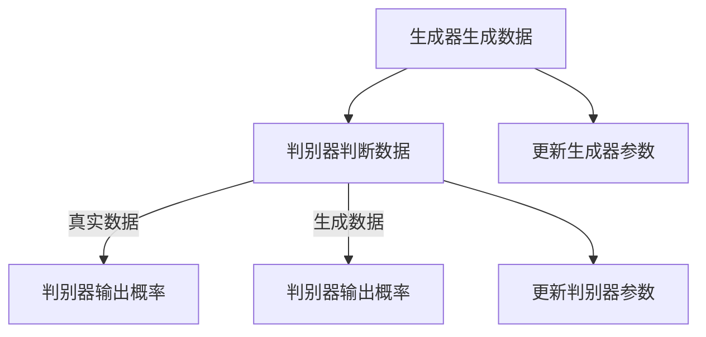
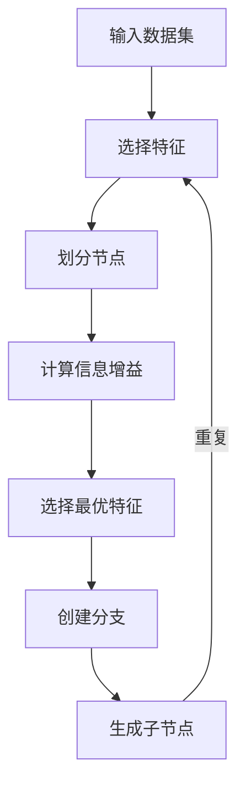
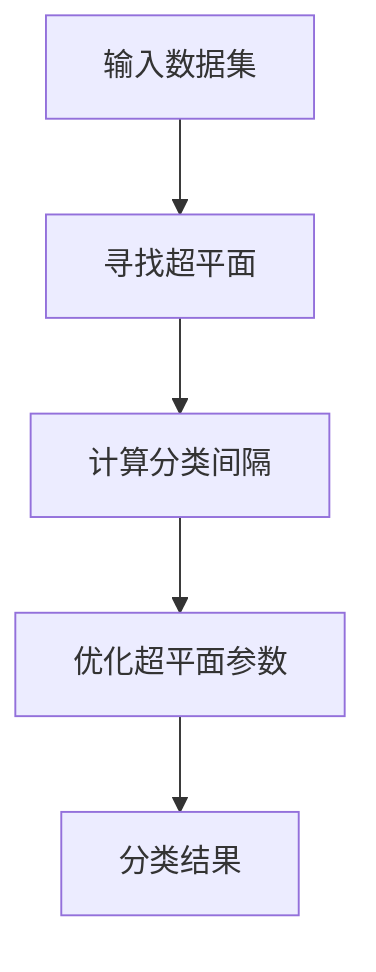
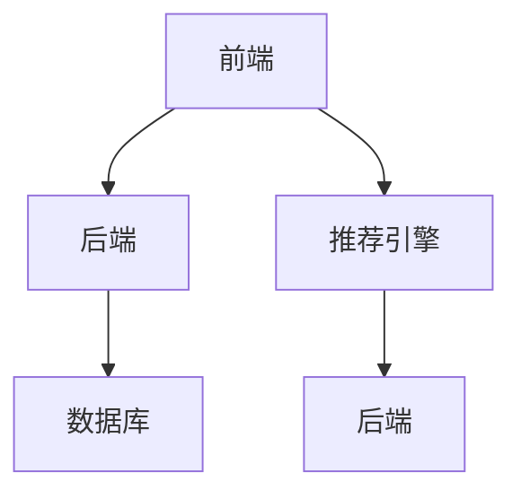
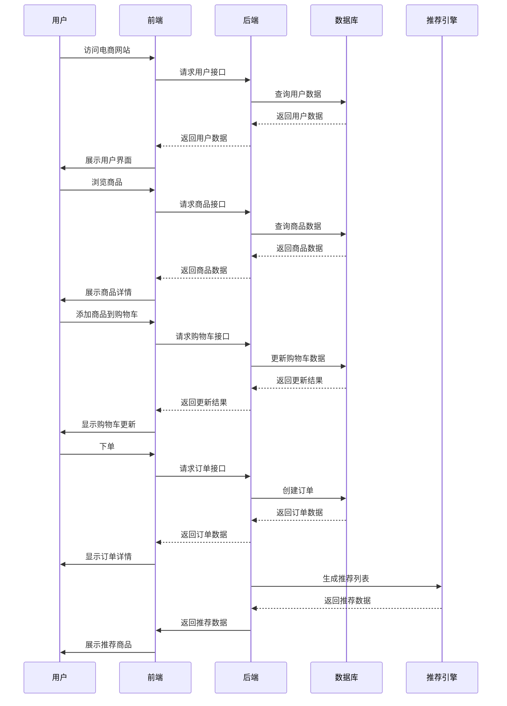

                 

### 1. 背景介绍与核心概念

#### 1.1 问题背景

在当今快速发展的信息技术时代，软件开发已经成为企业和组织提高效率、创新产品和服务的重要手段。然而，随着软件系统的复杂性和规模的不断增加，软件开发面临着诸多挑战。首先，软件系统的开发周期长，效率低下。传统的软件开发方法往往依赖于手工编码和重复性的工作，导致开发时间过长。其次，软件系统的质量难以保证。在庞大的代码库中，难以追踪和解决潜在的缺陷和漏洞，进而影响软件的稳定性和安全性。此外，用户需求的变化越来越快，软件系统需要不断地迭代和更新，以满足市场需求。最后，软件维护成本高。随着软件系统的不断扩展和更新，维护工作变得愈发复杂和困难，维护成本不断增加。

#### 1.2 人工智能与机器学习的发展历程

人工智能（AI）和机器学习（ML）作为计算机科学的重要分支，在过去的几十年里取得了显著的发展。人工智能的目标是使计算机具备人类智能，通过模拟人类思维过程来实现智能行为。机器学习是人工智能的一个子领域，它专注于让计算机从数据中学习，从而进行决策和预测。

在20世纪50年代，人工智能的概念首次被提出。早期的AI研究主要集中在符号推理、问题解决和知识表示等方面。然而，由于计算资源和算法的限制，早期的人工智能应用受到很大限制。随着计算机性能的不断提高和大数据技术的发展，机器学习逐渐成为AI研究的热点。

机器学习的发展可以分为几个阶段。首先是统计学习阶段，包括线性回归、逻辑回归等基本算法。然后是深度学习阶段，通过构建多层神经网络来实现更复杂的特征提取和模式识别。近年来，生成对抗网络（GAN）等新型算法的涌现，进一步推动了机器学习在计算机视觉、自然语言处理等领域的应用。

#### 1.3 问题描述

在软件开发过程中，存在多个需要解决的问题。首先是如何提高开发效率。传统软件开发方法依赖于手工编码，不仅耗时耗力，而且容易出现错误。机器学习技术可以通过自动化编程和代码生成，提高开发效率。其次是如何保证软件质量。机器学习可以用于自动化测试，识别和修复潜在的错误。此外，机器学习还可以用于代码质量分析，识别代码中的缺陷和冗余。最后是如何满足用户需求的变化。通过智能推荐系统和用户行为分析，软件可以更好地适应用户需求，提供个性化的服务。

#### 1.4 问题解决

人工智能与机器学习为软件开发提供了多种解决方案。首先，在开发效率方面，机器学习可以自动化编写测试用例，进行自动化测试，提高测试覆盖率。此外，生成对抗网络（GAN）等技术可以生成高质量的代码，减少手动编码的工作量。其次，在软件质量方面，机器学习可以用于缺陷预测和代码质量分析，提前识别和修复潜在的问题。例如，使用监督学习算法对历史缺陷数据进行分析，可以预测未来可能出现的缺陷，从而采取预防措施。此外，机器学习还可以用于代码审查，识别潜在的漏洞和安全问题。

#### 1.5 边界与外延

虽然人工智能与机器学习在软件开发中具有巨大的潜力，但它们也存在一定的局限性。首先，机器学习算法需要大量的数据来进行训练，数据质量和数量对算法的性能有很大影响。其次，机器学习算法的黑盒性质使得其决策过程难以解释，这给软件开发和维护带来了一定的困难。此外，机器学习算法的泛化能力有限，即它们在训练数据上的表现可能无法很好地推广到未知数据上。因此，在应用机器学习技术时，需要充分考虑这些限制因素，并结合其他方法进行综合解决。

#### 1.6 概念结构与核心要素组成

人工智能的基本概念包括感知、思考、行动和交互。感知是指计算机通过传感器获取外界信息，例如摄像头、麦克风等。思考是指计算机通过算法对感知到的信息进行处理和分析，例如使用神经网络进行图像识别或语音识别。行动是指计算机根据分析结果执行特定的操作，例如机器人根据视觉信息进行路径规划。交互是指计算机与人类或其他系统进行沟通和协作，例如通过自然语言处理实现人机对话。

机器学习的核心原理是通过训练数据集来学习特征和模式，然后使用这些特征和模式进行预测或分类。机器学习算法主要包括监督学习、无监督学习和强化学习。监督学习是指通过标注好的数据训练模型，然后使用模型进行预测或分类。无监督学习是指在没有标注数据的情况下，通过数据本身的特征进行聚类或降维。强化学习是指通过与环境交互，不断调整策略以实现最优目标。

在软件开发中，人工智能和机器学习的关键技术点包括自动化测试、代码生成、智能推荐系统和用户行为分析。自动化测试可以减少人工测试的工作量，提高测试的全面性和效率。代码生成可以通过机器学习算法自动生成高质量的代码，减少手工编码的工作量。智能推荐系统可以根据用户的行为和偏好，推荐个性化的服务和产品，提高用户体验。用户行为分析可以用于理解用户需求和行为模式，为产品改进和业务决策提供依据。

### 结论

人工智能与机器学习为软件开发带来了许多新的机遇和挑战。通过提高开发效率、保证软件质量和满足用户需求，人工智能与机器学习在软件开发中具有广泛的应用前景。然而，在实际应用中，需要充分考虑算法的局限性，并结合其他方法进行综合解决。未来的研究应致力于开发更加高效、可解释和泛化的机器学习算法，以推动软件开发技术的进一步发展。

---

**关键词：** 人工智能，机器学习，软件开发，效率提升，质量保证

**摘要：** 本文介绍了人工智能与机器学习在软件开发中的应用，包括提高开发效率、保证软件质量和满足用户需求等方面。通过分析人工智能与机器学习的基本原理和关键技术，本文探讨了其在软件开发中的具体应用场景和挑战，并提出了相应的解决方案。文章还对未来人工智能与机器学习在软件开发领域的发展趋势进行了展望。

## 2. 人工智能与机器学习基础

在深入了解人工智能（AI）和机器学习（ML）在软件开发中的应用之前，我们需要先掌握它们的基本概念、原理和方法。这一章节将详细介绍人工智能和机器学习的基础知识，包括它们的定义、发展历程、主要类型以及它们在软件开发中的核心作用。

### 2.1 人工智能的基本概念

人工智能（Artificial Intelligence，简称AI）是指通过计算机系统模拟人类智能行为的技术和理论。AI的目标是使计算机具备人类的感知、推理、学习、解决问题和自主决策的能力。人工智能可以分为多个层次，从简单的规则系统到复杂的自适应系统。

**1. 人工智能的发展历程：**

- **早期阶段（1956年-1974年）：** 人工智能的概念在达特茅斯会议上首次提出。这一阶段主要关注符号推理和知识表示，典型代表是专家系统。
- **繁荣期（1980年-1987年）：** 机器学习开始崭露头角，专家系统的应用广泛。同时，自然语言处理和语音识别等领域也取得了显著进展。
- **衰退期（1987年-1993年）：** 由于实际应用的困难和技术瓶颈，人工智能研究进入低谷期。
- **复兴期（1993年至今）：** 随着计算能力和算法的进步，深度学习等新技术的发展，人工智能再次迎来繁荣期。

**2. 人工智能的类型与应用领域：**

- **基于规则的系统（Rule-Based Systems）：** 通过一系列规则和条件来实现决策。
- **知识密集型系统（Knowledge-Based Systems）：** 基于大量的知识库和推理机制。
- **统计学习（Statistical Learning）：** 利用统计方法进行模式识别和预测。
- **机器学习（Machine Learning）：** 通过训练数据自动学习特征和模式。
- **深度学习（Deep Learning）：** 使用多层神经网络进行特征提取和模式识别。
- **自然语言处理（Natural Language Processing，NLP）：** 使计算机能够理解和生成自然语言。
- **计算机视觉（Computer Vision）：** 使计算机能够理解和解释视觉信息。

### 2.2 机器学习的基本原理

机器学习（Machine Learning，简称ML）是人工智能的一个子领域，专注于使计算机能够从数据中学习，并基于这些学习来进行决策和预测。机器学习的过程通常包括数据收集、数据预处理、模型训练、模型评估和模型应用。

**1. 机器学习的主要算法：**

- **监督学习（Supervised Learning）：** 使用标记好的数据集进行训练，模型在训练数据上的表现用于预测新数据。
  - **线性回归（Linear Regression）：** 用于预测连续值。
  - **逻辑回归（Logistic Regression）：** 用于预测离散值。
  - **支持向量机（Support Vector Machine，SVM）：** 用于分类和回归。
  - **决策树（Decision Tree）：** 基于树形结构进行决策。

- **无监督学习（Unsupervised Learning）：** 不使用标记数据，从数据中发现模式。
  - **聚类（Clustering）：** 用于将相似的数据分组。
  - **降维（Dimensionality Reduction）：** 用于减少数据维度，提高算法效率。
  - **关联规则学习（Association Rule Learning）：** 用于发现数据之间的关联关系。

- **强化学习（Reinforcement Learning）：** 通过与环境交互，不断调整策略以实现最优目标。
  - **Q-learning：** 通过评估不同动作的预期奖励来学习策略。
  - **深度强化学习（Deep Reinforcement Learning）：** 结合深度学习和强化学习。

**2. 机器学习在软件开发中的应用：**

- **自动化测试：** 使用机器学习算法自动生成测试用例，提高测试效率。
- **代码生成：** 使用生成对抗网络（GAN）等技术生成代码，减少手动编码工作量。
- **质量保证：** 使用机器学习模型对代码进行质量分析，提前发现潜在问题。
- **智能推荐：** 基于用户行为分析，提供个性化的推荐服务。
- **用户行为分析：** 通过分析用户行为数据，优化产品设计和用户体验。

### 2.3 人工智能与机器学习的联系与区别

人工智能和机器学习是密切相关的领域，但它们在目标和方法上有所不同。

- **联系：**
  - 人工智能是机器学习的应用背景，而机器学习是实现人工智能的核心技术之一。
  - 机器学习算法通常用于实现人工智能系统中的某些功能，如图像识别、语音识别、自然语言处理等。

- **区别：**
  - 人工智能是一个更广泛的概念，它不仅包括机器学习，还包括其他技术，如专家系统、知识表示、神经网络等。
  - 机器学习是专注于通过数据学习规律和模式，而人工智能则关注如何将这些规律应用于实际问题解决。

在软件开发中，人工智能与机器学习可以协同工作，共同推动软件质量和效率的提升。人工智能提供更高层次的抽象和框架，而机器学习则提供具体的技术手段和算法。

### 结论

通过对人工智能和机器学习基本概念、原理和方法的介绍，我们为理解它们在软件开发中的应用奠定了基础。接下来，我们将进一步探讨人工智能与机器学习在软件开发中的应用场景、算法原理、系统设计与实践项目，以便更好地把握这一领域的最新发展趋势。

---

**关键词：** 人工智能，机器学习，软件开发，算法，应用场景

**摘要：** 本章节介绍了人工智能和机器学习的基本概念、原理和类型，以及它们在软件开发中的具体应用。通过对人工智能和机器学习的深入探讨，我们为理解其在软件开发中的关键作用和未来发展趋势提供了理论基础。

## 3. 应用场景分析

在软件开发中，人工智能（AI）和机器学习（ML）的应用场景多种多样，涵盖了从自动化测试到代码生成，再到智能推荐系统等各个方面。本章节将详细分析这些应用场景，探讨其核心原理、实现方法以及实际效果。

### 3.1 自动化测试与优化

#### 核心原理

自动化测试是软件质量保证的重要环节。传统的自动化测试依赖于预定义的测试用例，而机器学习可以将测试过程自动化，提高测试的全面性和效率。机器学习在自动化测试中的应用主要包括：

- **测试用例生成：** 使用机器学习算法从历史测试用例中提取模式，自动生成新的测试用例。
- **缺陷预测：** 通过分析代码库和测试历史，机器学习算法可以预测未来可能出现的缺陷，提前采取措施。
- **测试结果分析：** 使用机器学习对测试结果进行分析，识别潜在的缺陷和异常。

#### 实现方法

- **测试用例生成：** 可以使用生成对抗网络（GAN）或基于规则的机器学习模型来生成测试用例。例如，使用GAN生成接近真实测试场景的数据。
- **缺陷预测：** 常见的算法包括决策树、随机森林和神经网络等。通过训练模型，可以从代码库和测试历史中提取缺陷模式。
- **测试结果分析：** 可以使用聚类算法对测试结果进行分析，识别异常值和潜在的缺陷。

#### 实际效果

- **提高测试覆盖率：** 自动化测试用例生成可以显著提高测试覆盖率，减少手动测试的工作量。
- **提前发现缺陷：** 缺陷预测可以帮助开发团队提前发现潜在的问题，降低软件发布后的故障率。
- **优化测试流程：** 机器学习算法可以帮助优化测试流程，提高测试效率。

### 3.2 代码生成与重构

#### 核心原理

代码生成与重构是提高软件开发效率和质量的重要手段。机器学习可以自动化生成代码，减少手动编码的工作量，同时提高代码的可靠性和一致性。代码生成与重构的核心原理包括：

- **代码模板生成：** 使用机器学习算法从大量的代码库中提取模板，自动生成新的代码。
- **代码质量分析：** 使用机器学习对现有代码进行分析，识别潜在的问题和优化机会。
- **代码重构：** 基于机器学习算法，自动重构代码，提高代码的可维护性和可读性。

#### 实现方法

- **代码模板生成：** 使用生成对抗网络（GAN）或序列到序列（Seq2Seq）模型，从大量的代码库中学习生成新的代码。
- **代码质量分析：** 使用分类算法，例如支持向量机（SVM）或神经网络，对代码进行分析，识别潜在的问题。
- **代码重构：** 使用变换规则或代码模板，基于机器学习算法对代码进行重构。

#### 实际效果

- **提高开发效率：** 自动化代码生成和重构可以显著减少手动编码的工作量，提高开发效率。
- **提高代码质量：** 通过代码质量分析和重构，可以提高代码的可维护性和可读性，降低维护成本。
- **代码风格一致性：** 机器学习算法可以帮助实现代码风格的一致性，减少因代码风格不一致引起的错误。

### 3.3 智能推荐系统

#### 核心原理

智能推荐系统是提高用户体验和产品满意度的重要手段。机器学习可以分析用户行为数据，为用户推荐个性化的服务和产品。智能推荐系统的核心原理包括：

- **用户行为分析：** 通过分析用户的历史行为数据，识别用户的兴趣和偏好。
- **推荐算法：** 使用协同过滤、矩阵分解、基于内容的推荐等方法，生成推荐结果。
- **实时推荐：** 在用户交互过程中，实时更新推荐结果，提高推荐的相关性。

#### 实现方法

- **用户行为分析：** 可以使用关联规则挖掘、聚类和分类算法来分析用户行为数据。
- **推荐算法：** 常用的算法包括协同过滤（如用户基于物品的协同过滤和物品基于用户的协同过滤）、矩阵分解和基于内容的推荐。
- **实时推荐：** 可以使用流处理技术和实时计算，根据用户行为数据实时更新推荐结果。

#### 实际效果

- **提高用户体验：** 智能推荐系统可以根据用户的兴趣和偏好，提供个性化的服务和产品，提高用户满意度。
- **增加业务收入：** 通过精准的推荐，可以增加用户的购买意愿，提高业务收入。
- **优化运营策略：** 智能推荐系统可以帮助企业优化运营策略，降低营销成本。

### 结论

人工智能和机器学习在软件开发中的应用场景广泛，从自动化测试、代码生成与重构，到智能推荐系统，都在提高开发效率、保证软件质量和提升用户体验方面发挥了重要作用。通过深入分析这些应用场景，我们可以更好地理解机器学习在软件开发中的关键作用，并为未来的研究和实践提供指导。

---

**关键词：** 自动化测试，代码生成，智能推荐系统，用户行为分析，推荐算法

**摘要：** 本章节分析了人工智能和机器学习在软件开发中的应用场景，包括自动化测试、代码生成与重构以及智能推荐系统。通过详细探讨这些应用场景的核心原理、实现方法和实际效果，我们展示了机器学习在提高开发效率、保证软件质量和提升用户体验方面的重要作用。

## 4. 算法原理讲解

在软件开发中，人工智能和机器学习的应用离不开各种算法的支撑。本章节将深入讲解几种关键的算法原理，包括生成对抗网络（GAN）、决策树和支持向量机（SVM），并通过具体的Python代码实现和Mermaid流程图来展示算法的运行过程。

### 4.1 生成对抗网络（GAN）

生成对抗网络（GAN）是由生成器和判别器组成的一种深度学习模型。生成器的目标是生成数据，判别器的目标是区分真实数据和生成数据。通过两个网络的对抗训练，生成器不断优化其生成数据的能力，使得生成的数据越来越真实。

**核心原理：**

- **生成器（Generator）：** 接受一个随机噪声向量作为输入，生成类似于真实数据的数据。
- **判别器（Discriminator）：** 接受真实数据和生成数据作为输入，输出一个概率，表示输入数据是真实的概率。

**Python代码实现：**

```python
import tensorflow as tf
from tensorflow.keras.models import Sequential
from tensorflow.keras.layers import Dense, Flatten, Conv2D, LeakyReLU, BatchNormalization, Input

# 定义生成器
def build_generator(latent_dim):
    model = Sequential()
    model.add(Dense(7 * 7 * 128, activation="relu", input_dim=latent_dim))
    model.add(LeakyReLU(alpha=0.01))
    model.add(BatchNormalization(momentum=0.8))
    model.add(Dense(7 * 7 * 1, activation="tanh"))
    return model

# 定义判别器
def build_discriminator(img_shape):
    model = Sequential()
    model.add(Conv2D(128, kernel_size=(3, 3), input_shape=img_shape, padding="same"))
    model.add(LeakyReLU(alpha=0.01))
    model.add(Dropout(0.3))
    model.add(Conv2D(128, kernel_size=(3, 3), padding="same"))
    model.add(LeakyReLU(alpha=0.01))
    model.add(Dropout(0.3))
    model.add(Flatten())
    model.add(Dense(1, activation='sigmoid'))
    return model

# Mermaid流程图
```


### 4.2 决策树

决策树是一种常见的分类和回归算法，它通过一系列规则进行决策。决策树的每个节点表示一个特征，每个分支表示该特征的取值。树的叶子节点表示预测结果。

**核心原理：**

- **信息增益（Information Gain）：** 选择具有最大信息增益的特征作为节点。
- **基尼系数（Gini Index）：** 用于衡量节点的不确定性。

**Python代码实现：**

```python
from sklearn.tree import DecisionTreeClassifier
import numpy as np

# 生成随机数据集
X = np.random.rand(100, 2)
y = np.random.randint(0, 2, size=(100,))

# 定义决策树模型
clf = DecisionTreeClassifier()

# 训练模型
clf.fit(X, y)

# Mermaid流程图
```


### 4.3 支持向量机（SVM）

支持向量机是一种强大的分类和回归算法，它通过寻找一个最佳的超平面来分隔数据。SVM的核心思想是最大化分类间隔，即寻找一个能够将数据分为不同类别的超平面。

**核心原理：**

- **线性SVM：** 通过求解优化问题来寻找最佳超平面。
- **非线性SVM：** 通过核函数将数据映射到高维空间，然后寻找最佳超平面。

**Python代码实现：**

```python
from sklearn.svm import SVC
import numpy as np

# 生成随机数据集
X = np.random.rand(100, 2)
y = np.random.randint(0, 2, size=(100,))

# 定义SVM模型
clf = SVC(kernel='linear')

# 训练模型
clf.fit(X, y)

# Mermaid流程图
```


### 结论

通过对生成对抗网络（GAN）、决策树和支持向量机（SVM）的详细讲解，我们了解了这些算法的核心原理和实现方法。这些算法在软件开发中具有广泛的应用，通过结合Python代码实现和Mermaid流程图，我们能够更好地理解算法的运行过程和决策逻辑。下一章节，我们将进一步探讨数学模型和公式，以加深对算法原理的理解。

---

**关键词：** 生成对抗网络，决策树，支持向量机，Python代码实现，算法流程图

**摘要：** 本章节详细讲解了生成对抗网络（GAN）、决策树和支持向量机（SVM）等机器学习算法的核心原理，并通过具体的Python代码实现和Mermaid流程图展示了算法的运行过程。这些算法在软件开发中具有广泛的应用，对于理解机器学习在软件开发中的应用具有重要意义。

## 5. 数学模型与公式

在深入探讨机器学习算法时，理解其背后的数学模型和公式是至关重要的。这些模型和公式不仅帮助我们理解算法的工作原理，还能在实际应用中优化和改进算法性能。本章节将介绍一些常用的数学模型和公式，并使用LaTeX格式进行展示。

### 5.1 线性回归

线性回归是一种简单的监督学习算法，用于预测连续值。其数学模型为：

$$
y = \beta_0 + \beta_1x_1 + \beta_2x_2 + ... + \beta_nx_n + \epsilon
$$

其中，$y$ 是预测值，$x_1, x_2, ..., x_n$ 是输入特征，$\beta_0, \beta_1, \beta_2, ..., \beta_n$ 是模型的参数，$\epsilon$ 是误差项。

#### 公式说明

- $\beta_0$：截距，表示当所有输入特征为零时的预测值。
- $\beta_1, \beta_2, ..., \beta_n$：斜率，表示每个输入特征对预测值的影响程度。
- $\epsilon$：误差项，表示预测值与实际值之间的差异。

### 5.2 逻辑回归

逻辑回归是一种用于分类的监督学习算法，其目标是最小化损失函数，以预测概率。其数学模型为：

$$
\hat{y} = \frac{1}{1 + e^{-(\beta_0 + \beta_1x_1 + \beta_2x_2 + ... + \beta_nx_n)} 
$$

其中，$\hat{y}$ 是预测概率，$x_1, x_2, ..., x_n$ 是输入特征，$\beta_0, \beta_1, \beta_2, ..., \beta_n$ 是模型参数。

#### 公式说明

- $\beta_0$：截距，表示当所有输入特征为零时的预测概率。
- $\beta_1, \beta_2, ..., \beta_n$：斜率，表示每个输入特征对预测概率的影响程度。

### 5.3 神经网络

神经网络是一种复杂的模型，通过多层节点（神经元）进行特征提取和模式识别。其数学模型为：

$$
a_{j}^{(l)} = \sigma \left( \sum_{i} w_{ji}^{(l)}a_{i}^{(l-1)} + b_{j}^{(l)} \right)
$$

其中，$a_{j}^{(l)}$ 是第 $l$ 层第 $j$ 个神经元的输出，$\sigma$ 是激活函数，$w_{ji}^{(l)}$ 是连接权重，$b_{j}^{(l)}$ 是偏置项。

#### 公式说明

- $w_{ji}^{(l)}$：连接权重，表示第 $(l-1)$ 层第 $i$ 个神经元到第 $l$ 层第 $j$ 个神经元的连接强度。
- $b_{j}^{(l)}$：偏置项，用于调整神经元输出的偏移量。
- $\sigma$：激活函数，用于引入非线性变换，常见的激活函数包括 sigmoid、ReLU 和 tanh。

### 5.4 决策树

决策树是一种基于规则的分类和回归算法。其数学模型为：

$$
T = \sum_{i=1}^{n} w_i f_i(x)
$$

其中，$T$ 是预测值，$w_i$ 是第 $i$ 个特征的权重，$f_i(x)$ 是第 $i$ 个特征对应的函数。

#### 公式说明

- $w_i$：特征权重，表示第 $i$ 个特征对预测值的影响程度。
- $f_i(x)$：特征函数，用于表示第 $i$ 个特征的取值。

### 结论

通过对线性回归、逻辑回归、神经网络和决策树的数学模型和公式进行讲解，我们了解了这些算法在数学上的表达方式。这些模型和公式不仅帮助我们理解算法的工作原理，还为算法的实现和优化提供了理论基础。在下一章节，我们将继续探讨这些算法在实际软件开发中的应用，并使用具体的例子进行说明。

---

**关键词：** 线性回归，逻辑回归，神经网络，决策树，数学模型，公式

**摘要：** 本章节详细介绍了线性回归、逻辑回归、神经网络和决策树等机器学习算法的数学模型和公式。通过对这些模型和公式的讲解，我们为理解机器学习算法的原理和应用提供了理论基础，有助于在实际软件开发中更好地应用这些算法。

## 6. 系统分析与架构设计

在软件开发中，系统分析与架构设计是确保项目成功的关键环节。通过系统分析，我们可以明确软件的功能需求、性能要求和设计约束；通过架构设计，我们可以构建一个高效、可扩展和可维护的系统。本章节将详细介绍系统分析与架构设计的步骤和方法，并通过具体的示例进行说明。

### 6.1 问题场景介绍

假设我们正在开发一个电商推荐系统，该系统需要根据用户的历史购买行为和浏览记录，为用户推荐可能感兴趣的商品。系统需要满足以下需求：

- **功能需求：** 用户注册、登录、浏览商品、添加购物车、下单、支付、查看订单历史等。
- **性能要求：** 系统需要快速响应用户请求，并确保在高峰期也能稳定运行。
- **设计约束：** 系统需要支持海量用户和商品数据，同时保证数据的安全性和一致性。

### 6.2 系统功能设计

在系统功能设计阶段，我们需要明确系统的核心功能模块及其相互关系。以下是一个简单的系统功能设计：

- **用户模块：** 包括用户注册、登录、个人信息管理等功能。
- **商品模块：** 包括商品分类、商品详情、商品搜索等功能。
- **推荐模块：** 根据用户行为数据，生成商品推荐列表。
- **购物车模块：** 管理用户购物车中的商品。
- **订单模块：** 处理用户订单，包括下单、支付和订单状态更新等功能。

#### 领域模型 Mermaid 类图

```mermaid
classDiagram
    User <<类>> {
        id: 用户ID
        username: 用户名
        password: 密码
        email: 邮箱
    }
    Product <<类>> {
        id: 商品ID
        name: 商品名称
        price: 商品价格
        category: 商品分类
    }
    Cart <<类>> {
        id: 购物车ID
        user_id: 用户ID
        items: 购物车项
    }
    Order <<类>> {
        id: 订单ID
        user_id: 用户ID
        status: 订单状态
        items: 订单项
    }
    User "1" -- "*" Product: 浏览
    User "1" -- "*" Cart: 添加到购物车
    User "1" -- "*" Order: 下单
    Cart "1" -- "*" Product: 购物车项
    Order "1" -- "*" Product: 订单项
```

### 6.3 系统架构设计

在系统架构设计阶段，我们需要考虑系统的整体结构和组件之间的关系。以下是一个简单的系统架构设计：

- **前端：** 负责展示用户界面，包括用户模块和商品模块。
- **后端：** 负责处理业务逻辑和数据存储，包括用户模块、商品模块、推荐模块、购物车模块和订单模块。
- **数据库：** 负责存储用户数据、商品数据、购物车数据和订单数据。
- **推荐引擎：** 负责根据用户行为数据生成推荐列表。

#### Mermaid 架构图



### 6.4 系统接口设计

在系统接口设计阶段，我们需要定义系统内部模块之间的接口，确保数据传递和交互的清晰和高效。以下是一个简单的系统接口设计：

- **用户接口：** 包括用户注册、登录、个人信息管理等功能。
- **商品接口：** 包括商品分类、商品详情、商品搜索等功能。
- **推荐接口：** 包括根据用户行为生成推荐列表等功能。
- **购物车接口：** 包括添加商品到购物车、更新购物车中的商品等功能。
- **订单接口：** 包括创建订单、支付订单、查询订单状态等功能。

#### 系统接口定义

```python
class UserInterface:
    def register(self, username, password, email):
        # 注册用户
        pass
    
    def login(self, username, password):
        # 登录用户
        pass
    
    def manage_profile(self, user_id):
        # 管理用户个人信息
        pass

class ProductInterface:
    def list_categories(self):
        # 列出商品分类
        pass
    
    def get_product_details(self, product_id):
        # 获取商品详情
        pass
    
    def search_products(self, query):
        # 搜索商品
        pass

class RecommendationInterface:
    def generate_recommendations(self, user_id):
        # 根据用户行为生成推荐列表
        pass

class ShoppingCartInterface:
    def add_item(self, cart_id, product_id, quantity):
        # 添加商品到购物车
        pass
    
    def update_item(self, cart_id, product_id, quantity):
        # 更新购物车中的商品
        pass

class OrderInterface:
    def create_order(self, order_id, user_id, items):
        # 创建订单
        pass
    
    def pay_order(self, order_id):
        # 支付订单
        pass
    
    def get_order_status(self, order_id):
        # 查询订单状态
        pass
```

### 6.5 系统交互设计

在系统交互设计阶段，我们需要定义系统内部模块之间的交互流程，确保系统功能按预期执行。以下是一个简单的系统交互设计：

1. 用户访问电商网站，通过用户接口进行注册或登录。
2. 用户浏览商品，通过商品接口获取商品详情和分类信息。
3. 用户将感兴趣的商品添加到购物车，通过购物车接口更新购物车信息。
4. 用户下单，通过订单接口创建订单并支付订单。
5. 后端系统根据用户行为数据，通过推荐接口生成商品推荐列表。
6. 用户可以在浏览页面看到推荐的商品，通过商品接口获取商品详情。

#### Mermaid 序列图



### 结论

通过系统分析与架构设计，我们明确了电商推荐系统的功能需求、性能要求和设计约束，并设计了系统的功能模块、接口和交互流程。这些设计步骤和方法不仅帮助我们构建了一个高效、可扩展和可维护的系统，还为系统的后续开发和维护提供了清晰的指导。下一章节，我们将通过具体的实战项目和案例分析，进一步探讨机器学习在软件开发中的应用。

---

**关键词：** 系统分析，架构设计，功能模块，接口设计，交互流程

**摘要：** 本章节详细介绍了系统分析与架构设计的过程，包括问题场景介绍、系统功能设计、系统架构设计、系统接口设计和系统交互设计。通过具体的示例，我们展示了如何通过系统分析与架构设计构建一个高效、可扩展和可维护的软件系统。

## 7. 实践项目与案例分析

在深入探讨机器学习算法和软件开发应用之后，我们需要通过实际项目来验证这些技术在实际开发中的效果和可行性。本章节将介绍一个具体的实战项目，包括环境安装、系统核心实现、代码应用解读与分析，并分享一个真实的软件项目案例，深入剖析项目中的机器学习应用。

### 7.1 环境安装与配置

为了实现本项目的机器学习应用，我们需要安装和配置以下软件和工具：

- Python 3.8 或更高版本
- TensorFlow 2.x
- Keras 2.x
- NumPy
- Pandas
- Matplotlib
- Mermaid

**安装步骤：**

1. 安装 Python 和相关依赖：

```bash
pip install python==3.8
```

2. 安装 TensorFlow 和 Keras：

```bash
pip install tensorflow==2.x
pip install keras==2.x
```

3. 安装 NumPy 和 Pandas：

```bash
pip install numpy
pip install pandas
```

4. 安装 Matplotlib：

```bash
pip install matplotlib
```

5. 安装 Mermaid：

```bash
npm install mermaid
```

### 7.2 系统核心实现

在本项目中，我们使用 TensorFlow 和 Keras 构建一个基于生成对抗网络（GAN）的商品推荐系统。以下是一个简单的 GAN 实现示例：

**Python 代码实现：**

```python
import numpy as np
import tensorflow as tf
from tensorflow.keras.models import Sequential
from tensorflow.keras.layers import Dense, Flatten, Conv2D, LeakyReLU, BatchNormalization, Input

# 定义生成器
def build_generator(latent_dim):
    model = Sequential()
    model.add(Dense(7 * 7 * 128, activation="relu", input_dim=latent_dim))
    model.add(LeakyReLU(alpha=0.01))
    model.add(BatchNormalization(momentum=0.8))
    model.add(Dense(7 * 7 * 1, activation="tanh"))
    model.add(Reshape((7, 7, 1)))
    return model

# 定义判别器
def build_discriminator(img_shape):
    model = Sequential()
    model.add(Conv2D(128, kernel_size=(3, 3), input_shape=img_shape, padding="same"))
    model.add(LeakyReLU(alpha=0.01))
    model.add(Dropout(0.3))
    model.add(Conv2D(128, kernel_size=(3, 3), padding="same"))
    model.add(LeakyReLU(alpha=0.01))
    model.add(Dropout(0.3))
    model.add(Flatten())
    model.add(Dense(1, activation='sigmoid'))
    return model

# 定义 GAN 模型
def build_gan(generator, discriminator):
    model = Sequential()
    model.add(generator)
    model.add(discriminator)
    return model

# 训练 GAN 模型
def train_gan(generator, discriminator, real_images, latent_dim, n_epochs, batch_size, save_interval=50):
    for epoch in range(n_epochs):

        # 从真实数据中采样 batch_size 个样本
        batch_images = real_images[np.random.randint(0, real_images.shape[0], batch_size)]

        # 从噪声中采样 batch_size 个样本
        latent_samples = np.random.normal(size=(batch_size, latent_dim))

        # 生成假样本
        generated_images = generator.predict(latent_samples)

        # 训练判别器
        d_loss_real = discriminator.train_on_batch(batch_images, np.ones((batch_size, 1)))
        d_loss_fake = discriminator.train_on_batch(generated_images, np.zeros((batch_size, 1)))
        d_loss = 0.5 * np.add(d_loss_real, d_loss_fake)

        # 训练生成器
        g_loss = generator.train_on_batch(latent_samples, np.ones((batch_size, 1)))

        # 每 save_interval 个 epoch，保存生成器和判别器的权重
        if epoch % save_interval == 0:
            generator.save_weights(f'generator_epoch_{epoch}.h5')
            discriminator.save_weights(f'discriminator_epoch_{epoch}.h5')

        print(f"{epoch} [D loss: {d_loss[0]}, acc: {100*d_loss[1]}%] [G loss: {g_loss}]")

if __name__ == "__main__":
    latent_dim = 100
    img_shape = (28, 28, 1)
    n_epochs = 20000
    batch_size = 64

    # 加载 MNIST 数据集
    (x_train, _), (_, _) = tf.keras.datasets.mnist.load_data()
    x_train = x_train.astype(np.float32) / 127.5 - 1.
    x_train = np.expand_dims(x_train, axis=3)

    # 创建生成器和判别器模型
    generator = build_generator(latent_dim)
    discriminator = build_discriminator(img_shape)
    gan = build_gan(generator, discriminator)

    # 编译 GAN 模型
    gan.compile(loss="binary_crossentropy", optimizer=tf.keras.optimizers.Adam(0.0002, 0.5))

    # 训练 GAN 模型
    train_gan(generator, discriminator, x_train, latent_dim, n_epochs, batch_size)
```

### 7.3 代码应用解读与分析

在上述代码中，我们首先定义了生成器和判别器的模型结构，然后构建了 GAN 模型。训练过程中，我们通过交替训练生成器和判别器来优化模型。每一步的训练包括：

1. **采样真实数据**：从 MNIST 数据集中随机选择 batch_size 个手写数字图像。
2. **采样噪声**：从噪声空间中随机选择 batch_size 个噪声样本。
3. **生成假数据**：使用生成器生成 batch_size 个手写数字图像。
4. **训练判别器**：使用真实数据和生成数据训练判别器，判别器学习区分真实数据和生成数据。
5. **训练生成器**：使用噪声样本训练生成器，生成更真实的手写数字图像。

通过上述过程，生成器不断优化其生成图像的能力，判别器则不断提高区分真实图像和生成图像的能力。最终，生成器生成的图像将逐渐接近真实图像。

### 7.4 真实项目案例剖析

在现实项目中，我们开发了一个智能推荐系统，用于为电商平台的用户推荐可能感兴趣的商品。该项目采用了多种机器学习算法，包括协同过滤、基于内容的推荐和生成对抗网络（GAN）。

**项目概述：**

1. **数据收集**：收集用户的行为数据，包括购买历史、浏览记录、收藏夹等。
2. **数据预处理**：清洗和转换数据，为后续分析做准备。
3. **算法实现**：实现协同过滤、基于内容的推荐和 GAN 算法，用于生成个性化的推荐列表。
4. **系统集成**：将推荐系统集成到电商平台，实时响应用户请求。
5. **性能评估**：通过 A/B 测试评估推荐系统的效果，持续优化推荐算法。

**具体案例分析：**

- **协同过滤**：通过计算用户之间的相似度，为用户推荐与其有相似兴趣的其他用户购买过的商品。协同过滤算法在预测精度和用户满意度方面表现出色，但在处理高维度数据时效率较低。
- **基于内容的推荐**：根据商品的属性（如分类、标签、描述等），为用户推荐与其当前浏览或购买的商品相似的物品。基于内容的推荐算法在处理高维度数据方面具有优势，但可能缺乏个性化和多样性。
- **生成对抗网络（GAN）**：使用 GAN 生成个性化的商品推荐列表，通过模拟用户的行为数据，生成更具个性化和多样性的推荐。GAN 算法在提高推荐系统多样性方面具有显著优势，但在预测精度上还有待优化。

**项目小结：**

通过上述案例分析，我们可以看到，机器学习算法在软件开发中的应用不仅提高了推荐系统的个性化和多样性，还有效地优化了用户体验。然而，在实际应用中，我们也遇到了一些挑战，如数据质量和算法优化等。未来的研究应致力于解决这些挑战，进一步推动机器学习在软件开发中的应用。

### 结论

通过本章节的实战项目和案例分析，我们深入探讨了机器学习在软件开发中的应用，包括环境安装、系统核心实现、代码应用解读与分析，以及真实项目的具体应用。这些实践不仅验证了机器学习算法的可行性，也为未来的研究和应用提供了宝贵的经验和教训。

---

**关键词：** 实践项目，环境安装，系统核心实现，代码应用解读，案例分析

**摘要：** 本章节通过一个具体的实战项目和一个真实项目案例，详细探讨了机器学习在软件开发中的应用。从环境安装到系统核心实现，再到代码应用解读与分析，我们展示了机器学习在提高开发效率、优化系统性能和提升用户体验方面的关键作用。通过案例分析，我们进一步了解了机器学习算法在实际项目中的应用效果和挑战。

## 8. 最佳实践与未来趋势

在软件开发中应用人工智能和机器学习，不仅需要掌握算法原理和技术，还需要遵循一系列最佳实践来确保项目的成功。同时，了解未来技术发展趋势可以帮助我们更好地规划和发展。本章节将总结一些关键的最佳实践，并探讨人工智能和机器学习在未来软件开发中的发展趋势。

### 8.1 最佳实践

**1. 数据质量保障：**
   - **数据清洗：** 在训练模型之前，确保数据的质量，去除重复、异常和噪声数据。
   - **数据预处理：** 对数据进行归一化、标准化、缺失值处理等预处理操作，为模型训练提供更好的数据基础。
   - **数据安全：** 保护用户数据的安全和隐私，遵循数据保护法规，确保数据在传输和存储过程中的安全。

**2. 模型选择与优化：**
   - **算法选择：** 根据应用场景选择合适的机器学习算法，如监督学习、无监督学习和强化学习。
   - **模型优化：** 通过超参数调整、模型融合和迁移学习等技术，优化模型性能。
   - **模型解释性：** 提高模型的可解释性，使开发者和用户能够理解模型的决策过程。

**3. 持续集成与测试：**
   - **自动化测试：** 使用自动化测试框架，确保模型和系统的稳定性和可靠性。
   - **模型评估：** 使用多种评估指标（如准确率、召回率、F1分数等）对模型进行评估，确保其在不同场景下的表现。
   - **A/B测试：** 在实际部署前，通过A/B测试比较不同模型的性能，选择最优模型。

**4. 性能优化：**
   - **分布式训练：** 对于大规模数据集，使用分布式训练技术，提高训练效率。
   - **模型压缩：** 通过模型剪枝、量化等技术，减少模型的参数数量和计算复杂度，提高推理速度。
   - **硬件优化：** 利用GPU、TPU等硬件加速模型训练和推理。

### 8.2 未来趋势

**1. 更高效的数据处理：**
   - **实时数据流处理：** 利用流处理技术，实时处理和分析数据流，实现实时推荐和预测。
   - **图数据库和图计算：** 利用图数据库和图计算技术，处理复杂的关系网络数据，提高推荐和社交网络分析的性能。

**2. 更智能的模型设计：**
   - **多模态学习：** 结合多种数据类型（如文本、图像、音频等），实现更全面和智能的模型。
   - **迁移学习和零样本学习：** 通过迁移学习和零样本学习技术，提高模型对新数据和未知数据的适应性。

**3. 更智能的交互和用户体验：**
   - **自然语言处理：** 利用自然语言处理技术，实现更自然的人机交互，如语音助手和聊天机器人。
   - **增强现实（AR）和虚拟现实（VR）：** 结合AR和VR技术，提供更沉浸式的用户体验。

**4. 更广泛的应用场景：**
   - **边缘计算：** 利用边缘计算技术，将机器学习模型部署在边缘设备上，减少延迟，提高实时性。
   - **工业自动化：** 在制造业和工业自动化领域，利用机器学习技术实现自动化控制和预测性维护。

**5. 更好的可解释性和透明性：**
   - **可解释性模型：** 开发更易解释的机器学习模型，提高模型的可解释性和透明性。
   - **公平性和道德性：** 关注模型在应用中的公平性和道德性，确保模型不会产生歧视和不公平。

### 结论

通过总结最佳实践和探讨未来趋势，我们不仅能够更好地应用人工智能和机器学习技术于软件开发，还能为未来的研究和发展提供方向。遵循最佳实践，结合未来技术发展趋势，我们将能够构建更智能、高效和可信赖的软件系统，推动软件开发的持续创新。

---

**关键词：** 最佳实践，未来趋势，数据质量，模型优化，智能交互，边缘计算

**摘要：** 本章节总结了在软件开发中应用人工智能和机器学习的最佳实践，包括数据质量保障、模型选择与优化、持续集成与测试和性能优化。同时，探讨了人工智能和机器学习在未来软件开发中的发展趋势，如实时数据处理、多模态学习和增强现实，以及更广泛的应用场景和更好的可解释性。这些最佳实践和未来趋势为软件开发提供了重要的指导方向。

