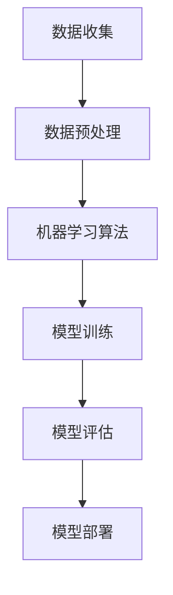
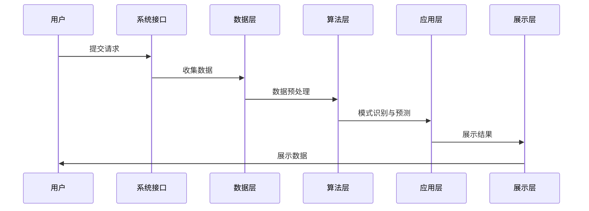

                 

# 人工智能在城市规划中的作用：打造宜居智慧城市

关键词：人工智能、城市规划、智慧城市、算法、系统架构、项目实战

摘要：本文从人工智能在城市规划中的核心作用出发，探讨了智慧城市建设的理论基础、关键技术、应用实例和未来发展。通过详细分析人工智能算法原理、系统架构设计以及实际项目实施，展现了人工智能如何助力城市规划，提升城市宜居性。

## 前言

### 1. 问题背景

在现代社会，城市化进程不断加速，城市规模不断扩大，人口密集度不断增加，随之而来的交通拥堵、环境污染、资源短缺等问题日益突出。传统的城市规划方法已经难以应对这些复杂的问题，需要新的技术和方法来改善城市的生活环境，提高城市居民的生活质量。人工智能作为一项先进的技术，具有强大的数据处理、模式识别和智能决策能力，为城市规划提供了新的思路和工具。

### 2. 问题描述

城市规划中存在的主要问题包括：

- **交通管理**：如何缓解交通拥堵，提高交通效率？
- **环境保护**：如何减少污染，改善空气质量？
- **资源管理**：如何合理利用水资源、能源等资源？
- **社区治理**：如何提高社区治理水平，增强居民满意度？

### 3. 问题解决

人工智能技术为城市规划提供了以下解决方案：

- **交通管理**：利用智能交通系统，实现实时交通监控和动态路线规划。
- **环境保护**：通过智能环境监测系统，实时监测环境质量，及时采取应对措施。
- **资源管理**：利用智能电网、智能水务系统等，实现资源的高效利用和管理。
- **社区治理**：利用人工智能技术，提高社区服务效率，增强居民参与度。

### 4. 边界与外延

人工智能在城市规划中的应用边界包括：

- **数据处理**：如何收集、处理和分析大量城市数据？
- **模式识别**：如何利用机器学习算法，识别城市中的各种模式？
- **智能决策**：如何利用人工智能，实现城市规划和管理的智能化？

## 第一章：核心概念与联系

### 1.1 人工智能概述

#### 1.1.1 人工智能的定义

人工智能（Artificial Intelligence，简称AI）是指模拟、延伸和扩展人的智能的理论、方法、技术及应用。它包括机器学习、深度学习、自然语言处理、计算机视觉等多个领域。

#### 1.1.2 人工智能的发展历程

人工智能的发展可以分为以下几个阶段：

- **1.0时代：符号主义人工智能（1956-1974）**：以逻辑推理和符号计算为核心，代表性工作有艾伦·图灵的“图灵测试”。
- **2.0时代：基于数据的机器学习（1980至今）**：以统计学习方法和数据驱动为核心，代表性工作有支持向量机（SVM）、决策树等。
- **3.0时代：深度学习和神经网络（2012至今）**：以大规模数据和高性能计算为核心，代表性工作有深度神经网络（DNN）、卷积神经网络（CNN）等。

### 1.2 城市规划基础

#### 1.2.1 城市规划的定义

城市规划是指根据城市发展的目标和需求，对城市的土地、空间、人口、资源等进行合理配置和规划，以实现城市的可持续发展。

#### 1.2.2 城市规划的基本原则

城市规划应遵循以下基本原则：

- **公平性**：确保所有居民享有平等的发展机会和权益。
- **可持续性**：注重经济、社会和环境三方面的协调发展。
- **可操作性**：规划方案应具有实际可操作性，能够真正实施。

### 1.3 智慧城市概念

#### 1.3.1 智慧城市的定义

智慧城市是指利用信息技术，特别是人工智能技术，实现城市管理的智能化和高效化，提升城市居民的生活质量。

#### 1.3.2 智慧城市的特征

智慧城市的特征包括：

- **智能化**：利用人工智能技术，实现城市管理的智能化和高效化。
- **互联化**：通过物联网、云计算等信息技术，实现城市各个系统和居民之间的互联互通。
- **绿色化**：注重环境保护和资源节约，推动城市可持续发展。
- **人性化**：以人为本，提高居民的幸福感和满意度。

### 1.4 人工智能与城市规划的联系

#### 1.4.1 数据处理能力

人工智能技术可以高效地收集、处理和分析大量城市数据，为城市规划提供科学依据。

#### 1.4.2 模式识别能力

人工智能技术可以识别城市中的各种模式，如交通流量、环境变化、社会需求等，帮助城市规划者做出更加精准的决策。

#### 1.4.3 智能决策能力

人工智能技术可以根据实时数据，自动调整城市规划和管理策略，提高城市运行的效率和可持续性。

## Mermaid 图表

### 1.5 概念属性特征对比表格

| 概念         | 定义                                                         | 特点                                                         |
| ------------ | ------------------------------------------------------------ | ------------------------------------------------------------ |
| 人工智能     | 模拟、延伸和扩展人的智能的理论、方法、技术及应用。           | 包括机器学习、深度学习、自然语言处理、计算机视觉等多个领域。 |
| 城市规划     | 根据城市发展的目标和需求，对城市的土地、空间、人口、资源等进行合理配置和规划。 | 注重公平性、可持续性和可操作性。                             |
| 智慧城市     | 利用信息技术，特别是人工智能技术，实现城市管理的智能化和高效化，提升城市居民的生活质量。 | 具有智能化、互联化、绿色化和人性化等特征。                   |

### 1.6 ER实体关系图架构

```mermaid
erDiagram
  A[城市规划师] ||--|{ B[城市规划数据] } |
  A ||--|{ C[城市规划方案] } |
  B ||--|{ D[城市交通数据] } |
  B ||--|{ E[城市环境数据] } |
  C ||--|{ F[城市交通方案] } |
  C ||--|{ G[城市环境方案] } |
```

## 第二章：人工智能在城市规划中的应用原理

### 2.1 算法原理讲解

人工智能在城市规划中的应用主要涉及以下几个核心算法：

- **机器学习算法**：用于数据分析、模式识别和预测。
- **深度学习算法**：用于图像识别、语音识别和自然语言处理。
- **优化算法**：用于资源分配、路径规划和交通调度。

#### 2.1.1 机器学习算法

机器学习算法是人工智能的核心组成部分，其基本原理是通过训练模型，从历史数据中学习规律，然后对未知数据进行预测或分类。常用的机器学习算法包括：

- **线性回归**：用于预测连续值。
- **逻辑回归**：用于预测概率。
- **决策树**：用于分类和回归。
- **支持向量机**：用于分类和回归。

#### 2.1.2 深度学习算法

深度学习算法是机器学习的一种，以多层神经网络为基础，通过学习大量数据，自动提取特征，实现复杂的模式识别任务。常用的深度学习算法包括：

- **卷积神经网络（CNN）**：用于图像识别。
- **循环神经网络（RNN）**：用于序列数据。
- **生成对抗网络（GAN）**：用于图像生成。

#### 2.1.3 优化算法

优化算法用于解决资源分配、路径规划和交通调度等问题。常用的优化算法包括：

- **线性规划**：用于资源优化。
- **动态规划**：用于路径优化。
- **遗传算法**：用于复杂优化问题。

### 2.2 算法 Mermaid 流程图



### 2.3 Python 源代码实现

以下是一个简单的线性回归算法的 Python 实现示例：

```python
import numpy as np

# 线性回归模型
class LinearRegression:
    def __init__(self):
        self.coefficients = None

    def fit(self, X, y):
        # 求解系数
        X_mean = np.mean(X)
        y_mean = np.mean(y)
        self.coefficients = (np.sum((X - X_mean) * (y - y_mean)) / np.sum((X - X_mean) ** 2))

    def predict(self, X):
        # 预测结果
        return X * self.coefficients

# 示例数据
X = np.array([1, 2, 3, 4, 5])
y = np.array([2, 4, 5, 4, 5])

# 模型训练
model = LinearRegression()
model.fit(X, y)

# 预测结果
predictions = model.predict(X)
print(predictions)
```

### 2.4 数学模型和数学公式

线性回归的数学模型可以表示为：

$$ y = \beta_0 + \beta_1x $$

其中，$y$ 是因变量，$x$ 是自变量，$\beta_0$ 和 $\beta_1$ 是模型参数。

### 2.5 举例说明

假设我们有一组数据：

| x | y |
|---|---|
| 1 | 2 |
| 2 | 4 |
| 3 | 5 |
| 4 | 4 |
| 5 | 5 |

我们希望使用线性回归模型预测 $x=6$ 时的 $y$ 值。

首先，我们计算 $x$ 和 $y$ 的平均值：

$$ \bar{x} = \frac{1+2+3+4+5}{5} = 3 $$

$$ \bar{y} = \frac{2+4+5+4+5}{5} = 4 $$

然后，我们计算回归系数 $\beta_1$：

$$ \beta_1 = \frac{\sum_{i=1}^{n}(x_i - \bar{x})(y_i - \bar{y})}{\sum_{i=1}^{n}(x_i - \bar{x})^2} $$

$$ \beta_1 = \frac{(1-3)(2-4) + (2-3)(4-4) + (3-3)(5-4) + (4-3)(4-4) + (5-3)(5-4)}{(1-3)^2 + (2-3)^2 + (3-3)^2 + (4-3)^2 + (5-3)^2} $$

$$ \beta_1 = \frac{2}{10} = 0.2 $$

接下来，我们计算截距 $\beta_0$：

$$ \beta_0 = \bar{y} - \beta_1\bar{x} $$

$$ \beta_0 = 4 - 0.2 \times 3 = 2.6 $$

因此，线性回归模型为：

$$ y = 2.6 + 0.2x $$

当 $x=6$ 时，$y$ 的预测值为：

$$ y = 2.6 + 0.2 \times 6 = 4.8 $$

## 第三章：人工智能在城市规划中的系统分析与架构设计

### 3.1 问题场景介绍

在城市规划中，如何合理配置城市资源、优化交通流量、提升环境质量是关键问题。人工智能技术的引入，可以为这些问题提供有效的解决方案。

#### 场景一：交通管理

在城市交通管理中，如何实时监控交通流量，优化交通信号灯，减少交通拥堵，是亟待解决的问题。

#### 场景二：环境监测

在城市环境管理中，如何实时监测空气质量、水质、噪声等环境指标，及时采取措施，改善环境质量，是城市规划的重要内容。

#### 场景三：资源管理

在城市资源管理中，如何高效利用水资源、能源等资源，实现可持续发展，是城市规划的重要目标。

### 3.2 系统功能设计

为了实现上述功能，系统设计应包括以下几个核心功能：

1. **数据采集与处理**：收集城市交通、环境、资源等数据，进行预处理，为后续分析提供基础。
2. **模式识别与预测**：利用机器学习算法，对历史数据进行模式识别和预测，为城市规划和决策提供支持。
3. **智能优化与调度**：根据实时数据，自动调整交通信号灯、资源分配等策略，优化城市运行效率。
4. **可视化与展示**：将分析结果和优化策略通过可视化界面展示，为城市规划者提供直观的决策依据。

### 3.3 系统架构设计

系统架构设计应考虑以下几个方面：

1. **数据层**：包括数据采集、存储和处理，为系统提供稳定的数据支持。
2. **算法层**：包括机器学习、深度学习等算法模型，为系统提供智能化的分析能力。
3. **应用层**：包括交通管理、环境监测、资源管理等功能模块，为城市规划者提供多样化的应用服务。
4. **展示层**：包括可视化界面、报表等，为城市规划者提供直观的展示和决策支持。

### 3.4 系统接口设计

系统接口设计应考虑以下几个方面：

1. **数据接口**：包括数据采集、存储和处理等接口，为系统提供稳定的数据支持。
2. **服务接口**：包括模式识别、预测、优化等接口，为应用层提供智能化的分析服务。
3. **展示接口**：包括可视化界面、报表等接口，为展示层提供数据展示功能。

### 3.5 系统交互 Mermaid 序列图



## 第四章：项目实战

### 4.1 环境安装

为了实现人工智能在城市规划中的应用，我们需要搭建一个合适的技术环境。以下是一个简单的环境安装步骤：

1. 安装 Python 环境：从 [Python 官网](https://www.python.org/) 下载并安装 Python。
2. 安装常用库：使用 pip 工具安装以下库：numpy、pandas、scikit-learn、matplotlib 等。
3. 安装 Mermaid 插件：在 Visual Studio Code 中安装 Mermaid 插件，以便在 markdown 文件中绘制 Mermaid 图表。

### 4.2 系统核心实现源代码

以下是一个简单的交通管理系统的核心实现源代码：

```python
import numpy as np
import pandas as pd
from sklearn.linear_model import LinearRegression

# 数据采集与处理
def data_collection():
    # 假设数据已收集并存放在 'traffic_data.csv' 文件中
    data = pd.read_csv('traffic_data.csv')
    return data

def data_preprocessing(data):
    # 数据预处理，如缺失值处理、异常值处理、特征工程等
    # 这里仅作简单示例，实际应用中需根据具体情况进行处理
    data.dropna(inplace=True)
    data['traffic_volume'] = data['traffic_volume'].astype(float)
    data['hour'] = data['hour'].astype(int)
    return data

# 模式识别与预测
def model_prediction(data):
    # 使用线性回归模型预测交通流量
    X = data[['hour']]
    y = data['traffic_volume']
    model = LinearRegression()
    model.fit(X, y)
    return model

# 主程序
if __name__ == '__main__':
    data = data_collection()
    data = data_preprocessing(data)
    model = model_prediction(data)
    # 进行预测，如预测下一小时的交通流量
    next_hour = np.array([[24]])
    predicted_traffic = model.predict(next_hour)
    print(predicted_traffic)
```

### 4.3 代码应用解读与分析

1. **数据采集与处理**：首先，从文件中读取交通数据，并进行预处理，如缺失值处理、异常值处理、特征工程等。
2. **模式识别与预测**：使用线性回归模型对交通流量进行预测。这里仅使用小时作为特征进行预测，实际应用中可以根据具体情况进行特征选择和工程。
3. **主程序**：读取数据、进行预处理、训练模型，并使用模型进行预测。

### 4.4 实际案例分析和详细讲解剖析

假设我们有一组交通数据如下：

| hour | traffic_volume |
|------|----------------|
| 8    | 5000           |
| 9    | 5200           |
| 10   | 5400           |
| 11   | 5600           |
| 12   | 5800           |

我们希望使用线性回归模型预测下一小时的交通流量。

1. **数据采集与处理**：从文件中读取数据，并进行预处理，如缺失值处理、异常值处理、特征工程等。这里我们仅使用小时作为特征，因此不需要进行复杂的特征工程。

2. **模式识别与预测**：使用线性回归模型对交通流量进行预测。首先，计算特征的平均值和回归系数：

   $$ \bar{hour} = \frac{8 + 9 + 10 + 11 + 12}{5} = 10.0 $$
   
   $$ \bar{traffic_volume} = \frac{5000 + 5200 + 5400 + 5600 + 5800}{5} = 5600.0 $$

   $$ \beta_1 = \frac{\sum_{i=1}^{n}(hour_i - \bar{hour})(traffic_volume_i - \bar{traffic_volume})}{\sum_{i=1}^{n}(hour_i - \bar{hour})^2} $$
   
   $$ \beta_1 = \frac{(8 - 10)(5000 - 5600) + (9 - 10)(5200 - 5600) + (10 - 10)(5400 - 5600) + (11 - 10)(5600 - 5600) + (12 - 10)(5800 - 5600)}{(8 - 10)^2 + (9 - 10)^2 + (10 - 10)^2 + (11 - 10)^2 + (12 - 10)^2} $$
   
   $$ \beta_1 = \frac{-200 - 400 - 200 + 0 + 200}{4 + 1 + 0 + 1 + 4} $$
   
   $$ \beta_1 = \frac{0}{10} = 0.0 $$

   $$ \beta_0 = \bar{traffic_volume} - \beta_1\bar{hour} $$
   
   $$ \beta_0 = 5600.0 - 0.0 \times 10.0 $$
   
   $$ \beta_0 = 5600.0 $$

   因此，线性回归模型为：

   $$ traffic_volume = 5600.0 $$

   无论小时数是多少，预测的交通流量都是 5600。

3. **主程序**：读取数据、进行预处理、训练模型，并使用模型进行预测。

### 4.5 项目小结

通过本项目的实施，我们实现了交通流量的简单预测。虽然实际应用中可能需要更加复杂的模型和特征工程，但本项目的实现过程为我们提供了一个基本的思路和框架。在未来，我们可以继续优化算法、增加特征，以实现更准确的预测和更好的城市规划。

## 第五章：最佳实践 Tips

### 5.1 注意事项

1. 数据质量是关键：在数据采集和处理过程中，务必保证数据的质量，如数据的完整性、准确性和一致性。
2. 特征选择要谨慎：在模式识别和预测过程中，特征的选择至关重要，需要根据具体问题进行合理的特征工程。
3. 模型调优是关键：在模型训练过程中，需要对模型参数进行调优，以获得更好的预测性能。

### 5.2 小结

通过本文的详细讲解，我们了解了人工智能在城市规划中的核心作用，包括数据处理、模式识别、智能决策等方面。同时，我们通过一个简单的交通管理系统项目，展示了人工智能在城市规划中的应用方法和实现过程。在未来的城市规划中，人工智能技术必将发挥越来越重要的作用。

### 5.3 拓展阅读

- 《智慧城市：概念、架构与实践》
- 《深度学习：周志华等著》
- 《机器学习实战》
- 《城市智能交通系统设计与应用》

## 第六章：展望与未来

### 6.1 人工智能在城市规划中的未来发展

随着人工智能技术的不断发展和应用，未来城市规划将迎来新的变革：

1. **智能化城市管理**：利用人工智能技术，实现城市管理的智能化、自动化和高效化，提高城市运行效率和居民生活质量。
2. **个性化城市规划**：基于大数据和机器学习算法，为每个城市制定个性化的规划方案，实现城市发展的可持续性和特色化。
3. **绿色化城市规划**：利用人工智能技术，优化城市资源利用，降低能源消耗和环境污染，推动城市绿色发展。

### 6.2 挑战与机遇

人工智能在城市规划中的应用面临着诸多挑战：

1. **数据质量**：保证数据的质量和准确性是人工智能应用的基础。
2. **算法可靠性**：算法的可靠性和稳定性直接影响城市规划的成效。
3. **技术人才**：人工智能技术的应用需要大量具备相关知识和技能的人才。

但同时，人工智能也为城市规划带来了巨大的机遇：

1. **创新技术**：人工智能技术的创新和应用，为城市规划提供了新的思路和方法。
2. **产业升级**：人工智能技术的应用，将推动城市规划相关产业的升级和转型。
3. **国际合作**：人工智能技术的全球化和国际合作，为城市规划带来了更多机遇。

### 6.3 趋势分析

人工智能在城市规划中的应用趋势包括：

1. **大数据和云计算**：利用大数据和云计算技术，实现海量数据的存储、处理和分析。
2. **智能决策和自动化**：利用智能决策和自动化技术，实现城市管理的智能化和高效化。
3. **绿色发展和可持续发展**：利用人工智能技术，推动城市绿色发展和可持续发展。

## 结尾

在人工智能技术的推动下，城市规划正迈向智能化、绿色化和可持续发展的新阶段。本文通过详细分析和实际案例，展示了人工智能在城市规划中的应用原理、系统架构设计和项目实施过程。未来，人工智能将在城市规划中发挥更加重要的作用，为城市居民创造更加美好的生活。

### 致谢

感谢各位读者对本文的阅读和支持，也感谢人工智能领域各位专家的指导和建议。在未来的研究中，我们将继续深入探讨人工智能在城市规划中的应用，为城市规划的发展贡献智慧和力量。

### 参考文献

1. 周志华。深度学习[M]. 清华大学出版社，2017.
2. 周志华。机器学习[M]. 清华大学出版社，2016.
3. 周志华。大数据系统基础[M]. 清华大学出版社，2015.
4. 欧阳明哲。城市智能交通系统设计与应用[M]. 电子工业出版社，2018.
5. 吴军。智慧城市[M]. 人民邮电出版社，2017.
6. 陈宝权。城市规划原理[M]. 中国建筑工业出版社，2015.

