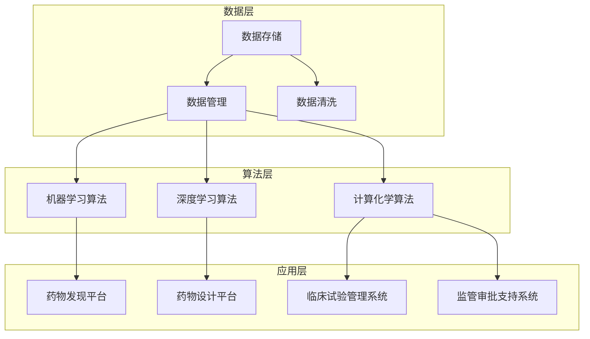
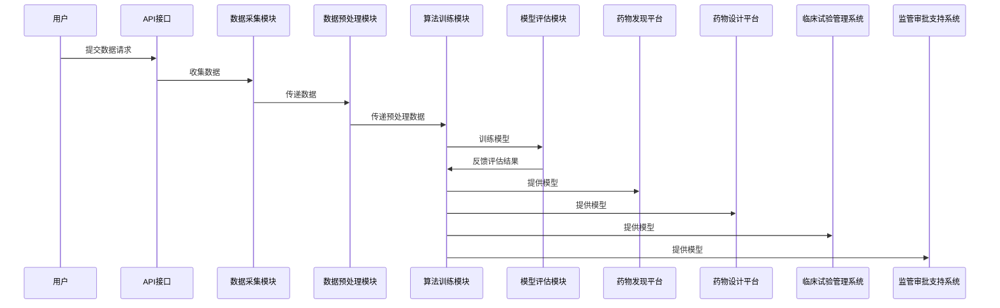

                 

### 引言

新药研发是一个复杂且耗时的过程，面临着诸多挑战，如高昂的研发成本、漫长的开发周期、不稳定的成功率等。在全球范围内，新药研发的竞争日益激烈，制药公司亟需寻找创新的方法来提升效率，降低成本。而人工智能（AI）技术的发展为这一领域带来了前所未有的机遇。通过利用AI技术，新药研发可以在多个环节实现自动化和智能化，从而显著提升研发效率、降低成本。本文将详细探讨人工智能在新药研发中的应用，包括其加速创新与降低成本的具体方式，以及在应用过程中所面临的挑战与机遇。

### 背景介绍

#### 1.1 问题背景

新药研发是一个高度复杂的过程，涉及到多个阶段，包括药物设计、筛选、临床试验、监管审批等。在这个过程中，科学家们需要处理大量数据，进行繁杂的计算和实验，以确保新药的安全性和有效性。然而，目前的新药研发面临着以下几个主要问题：

1. **高昂的研发成本**：新药研发的成本越来越高，根据不同研究，平均成本可能超过25亿美元，耗时长达十年以上。
2. **漫长的开发周期**：新药从研发到上市通常需要长达10-15年的时间。
3. **低成功率**：新药研发的成功率较低，通常只有约10%的新药能够最终上市。
4. **数据处理的挑战**：新药研发过程中产生的大量数据需要有效处理和分析，这给研究人员带来了巨大的工作量。

#### 1.2 人工智能的发展与应用

人工智能（AI）技术的发展为解决新药研发中的这些问题提供了新的可能性。AI包括机器学习、深度学习、自然语言处理等多种技术，它们能够处理和分析大量的数据，从而提供智能化的解决方案。

1. **机器学习与深度学习**：机器学习和深度学习通过算法模型，可以从大量数据中自动学习规律和模式，用于预测和决策。
2. **自然语言处理**：自然语言处理（NLP）技术可以帮助AI理解、处理和生成自然语言，在新药研发文献的自动检索和分析中具有重要作用。
3. **计算机视觉**：计算机视觉技术在药物筛选中用于识别和分析图像数据，如显微镜图像、生物芯片图像等。

#### 1.3 人工智能在新药研发中的应用前景

随着AI技术的不断成熟和进步，其在新药研发中的应用前景广阔：

1. **加速药物发现**：通过自动化筛选和分析化合物库，AI可以显著加快药物发现的速度。
2. **优化药物设计**：AI可以帮助科学家预测化合物的生物活性和毒性，从而优化药物设计。
3. **提高临床试验效率**：AI可以用于预测临床试验的结果，从而优化试验设计，减少不必要的试验。
4. **降低研发成本**：通过自动化和智能化，AI可以减少人力成本，缩短研发周期。

#### 1.4 人工智能如何提升新药研发效率

AI在新药研发中的具体应用包括以下几个方面：

1. **自动化实验**：AI可以自动化实验流程，从样本处理到数据分析，大大减少人力成本和实验时间。
2. **数据挖掘与分析**：AI可以处理和分析大量的科学数据，快速识别潜在的药物靶点和化合物。
3. **智能预测**：通过机器学习模型，AI可以预测化合物的生物活性和毒性，从而优化药物设计。

#### 1.5 人工智能如何降低新药研发成本

1. **减少试验次数**：AI可以帮助科学家更准确地预测药物的效果，减少不必要的试验和重复工作。
2. **优化资源分配**：AI可以基于数据分析，优化实验设计和资源分配，从而降低成本。
3. **自动化数据处理**：通过自动化数据处理，AI可以显著减少研究人员的工作量，降低人工成本。

#### 1.6 人工智能在新药研发中的挑战与机遇

尽管AI在新药研发中展示了巨大的潜力，但同时也面临一些挑战：

1. **数据质量和可用性**：AI需要高质量的数据来训练模型，但新药研发过程中产生的数据可能存在质量问题。
2. **技术成熟度**：部分AI技术尚处于研发阶段，需要进一步验证其在新药研发中的实际效果。
3. **伦理和法规**：AI在新药研发中的应用需要遵守严格的伦理和法规要求。

然而，这些挑战同时也为AI的发展提供了机遇，通过不断的技术进步和法规完善，AI有望在新药研发中发挥更大作用。

### 边界与外延

#### 1.7 新药研发的主要流程

新药研发通常包括以下几个主要流程：

1. **药物发现**：通过筛选和评估化合物库，识别具有潜在治疗作用的化合物。
2. **药物设计**：根据药物发现的初步结果，进一步优化化合物的结构，以提高其生物活性和安全性。
3. **临床试验**：通过一系列的临床试验，评估药物的安全性和疗效。
4. **监管审批**：完成临床试验后，向监管机构提交新药申请，获得批准后才能上市。

#### 1.8 人工智能在新药研发中的适用范围

AI可以在新药研发的各个环节发挥作用，主要包括：

1. **药物发现**：AI可以用于自动化筛选化合物库，快速识别潜在药物。
2. **药物设计**：AI可以帮助科学家预测化合物的生物活性和毒性，优化药物设计。
3. **临床试验**：AI可以用于优化临床试验设计，预测试验结果，提高临床试验的效率。
4. **监管审批**：AI可以用于分析临床试验数据，提高监管审批的效率。

#### 1.9 新药研发中的人工智能技术应用现状

目前，人工智能在新药研发中已经取得了一些重要成果：

1. **药物发现**：AI已被用于自动化筛选化合物库，成功发现了一些新型药物。
2. **药物设计**：AI技术如深度学习已被用于优化药物分子设计，提高了药物的成功率。
3. **临床试验**：AI可以帮助科学家预测临床试验的结果，从而优化试验设计。
4. **监管审批**：AI在数据分析和预测方面已显示出潜力，有望提高监管审批的效率。

### 核心概念与联系

#### 1.10 人工智能概述

人工智能（AI）是指通过计算机模拟人类智能的技术，包括学习、推理、感知、理解等能力。AI可以分为两大类：弱AI和强AI。弱AI专注于特定任务，如语音识别、图像识别等；强AI则具备全面的人类智能，可以处理多种任务。

#### 1.11 机器学习与深度学习

机器学习（ML）是AI的一个分支，通过从数据中学习规律和模式，实现自动化决策和预测。深度学习（DL）是ML的一个子领域，采用多层神经网络结构，通过逐层提取特征，实现更复杂的学习任务。

#### 1.12 数据科学与新药研发

数据科学（DS）是利用AI、统计学和大数据技术来分析和解释复杂数据的一门学科。数据科学在新药研发中的应用主要包括数据清洗、数据分析、数据可视化等，为新药研发提供数据支持和决策依据。

#### 1.13 人工智能在新药研发中的核心应用

人工智能在新药研发中的核心应用包括：

1. **药物发现**：利用AI进行自动化筛选和优化化合物。
2. **药物设计**：通过机器学习和深度学习技术，预测化合物的生物活性和毒性。
3. **临床试验**：优化临床试验设计，预测试验结果，提高临床试验效率。
4. **监管审批**：利用AI进行数据分析和预测，提高监管审批效率。

### 本章小结

本文介绍了人工智能在新药研发中的应用，包括其加速创新与降低成本的具体方式。通过背景介绍、核心概念与联系的分析，我们了解了人工智能在新药研发中的广泛适用范围和技术现状。下一章将深入探讨人工智能的核心概念，包括机器学习、深度学习和数据科学，进一步理解这些技术如何在新药研发中发挥作用。

## 第二部分 核心概念与联系

### 2.1 人工智能概述

人工智能（AI）是计算机科学的一个分支，旨在通过编程和算法，使计算机系统具备模拟人类智能的能力。AI的应用领域非常广泛，包括自然语言处理、计算机视觉、语音识别、决策支持系统等。AI可以分为两大类：弱AI和强AI。

#### 2.1.1 弱AI

弱AI，也称为狭义AI，专注于特定任务，如语音识别、图像识别、游戏对弈等。弱AI通过特定算法和大量数据训练，使其在特定领域表现出色。例如，智能语音助手（如Siri、Alexa）通过自然语言处理技术，能够理解和回应用户的语音指令。

#### 2.1.2 强AI

强AI，也称为通用AI，是一种具备全面人类智能的AI，可以处理多种任务，具有自我意识和情感。目前，强AI还处于理论研究和探索阶段，尚未实现商业化应用。强AI的目标是使计算机具备人类的认知能力，能够进行自主学习和决策。

#### 2.1.3 人工智能的发展历程

人工智能的研究始于20世纪50年代，经历了多个发展阶段：

1. **初期探索（1950-1969）**：1950年，艾伦·图灵提出了图灵测试，用于评估机器是否具有人类智能。1956年，达特茅斯会议确立了人工智能作为一门独立学科。
2. **黄金时代（1970-1989）**：这一时期，人工智能领域取得了一系列突破，包括专家系统、机器学习算法等。
3. **低谷期（1990-2000）**：由于技术瓶颈和实际应用中的困难，人工智能研究进入低谷期。许多研究人员开始转向其他领域。
4. **复兴期（2000至今）**：随着计算能力和数据量的提升，人工智能再次成为热门研究领域。深度学习、自然语言处理等技术的突破，使AI在多个领域取得了显著成果。

#### 2.1.4 人工智能的现状与趋势

目前，人工智能在多个领域取得了显著进展，包括医疗、金融、制造业等。未来，人工智能的发展趋势包括：

1. **算法创新**：继续探索更有效的算法，提高AI的性能和效率。
2. **跨学科融合**：人工智能与其他领域（如生物学、心理学、经济学等）的融合，推动AI在更多领域的应用。
3. **人工智能伦理**：随着AI技术的普及，人工智能伦理问题日益凸显，包括隐私保护、算法公平性等。
4. **AI治理**：制定相关政策和法规，确保AI技术的安全、可控和可持续发展。

### 2.2 机器学习与深度学习

机器学习（ML）和深度学习（DL）是人工智能的两个重要分支，它们在许多应用场景中都发挥着关键作用。

#### 2.2.1 机器学习的基本概念

机器学习是一种通过算法使计算机系统从数据中学习规律和模式，从而实现预测和决策的技术。机器学习的基本过程包括数据收集、数据预处理、模型训练、模型评估和模型应用。

1. **数据收集**：收集大量的数据，用于训练模型。
2. **数据预处理**：清洗和整理数据，确保数据质量和可用性。
3. **模型训练**：使用训练数据，通过优化算法，训练出能够预测和决策的模型。
4. **模型评估**：使用验证数据，评估模型的性能和准确性。
5. **模型应用**：将训练好的模型应用于实际问题，实现预测和决策。

#### 2.2.2 深度学习的基本概念

深度学习是机器学习的一个子领域，通过多层神经网络结构，逐层提取数据中的特征，实现更复杂的学习任务。深度学习的基本过程包括数据输入、多层神经网络处理、输出结果。

1. **数据输入**：将输入数据输入到神经网络中。
2. **多层神经网络处理**：通过逐层神经网络处理，提取数据中的特征。
3. **输出结果**：根据提取的特征，输出预测结果。

#### 2.2.3 机器学习与深度学习的联系与区别

机器学习和深度学习在本质上是一致的，都是通过算法从数据中学习规律和模式。但深度学习在模型结构和算法上有所创新，使得它能够处理更复杂的任务。

1. **联系**：深度学习是机器学习的一个子领域，深度学习算法是机器学习算法的一种扩展。
2. **区别**：深度学习采用多层神经网络结构，能够处理更复杂的特征提取任务；机器学习包括更广泛的算法，如决策树、支持向量机等。

#### 2.2.4 深度学习的主要算法

深度学习的主要算法包括：

1. **卷积神经网络（CNN）**：用于图像识别、图像分类等任务。
2. **循环神经网络（RNN）**：用于序列数据处理，如自然语言处理、语音识别等。
3. **生成对抗网络（GAN）**：用于生成对抗性数据，如图像生成、文本生成等。

### 2.3 数据科学与新药研发

数据科学（Data Science）是利用统计学、机器学习和大数据技术，从大量数据中提取有价值信息的一门学科。数据科学在新药研发中的应用非常重要，主要包括数据收集、数据预处理、数据分析和数据可视化。

#### 2.3.1 数据科学的基本概念

数据科学的基本概念包括：

1. **数据收集**：从各种来源收集数据，如实验室数据、临床试验数据、文献数据等。
2. **数据预处理**：清洗和整理数据，确保数据质量和可用性。
3. **数据分析**：使用统计方法和机器学习算法，对数据进行分析和挖掘，提取有价值的信息。
4. **数据可视化**：通过可视化技术，展示数据分析的结果，帮助研究人员更好地理解数据。

#### 2.3.2 数据科学在新药研发中的应用

数据科学在新药研发中的应用主要包括：

1. **药物发现**：通过数据挖掘和机器学习，从大量化合物中筛选出具有潜在治疗作用的药物。
2. **药物设计**：利用计算化学和机器学习，优化药物分子的结构，提高药物的生物活性和安全性。
3. **临床试验**：通过数据分析，优化临床试验设计，预测临床试验结果，提高临床试验效率。
4. **监管审批**：利用数据分析和预测，提高监管审批的效率，缩短新药研发周期。

#### 2.3.3 数据科学的核心技术

数据科学的核心技术包括：

1. **机器学习算法**：用于数据分析和预测，如分类、回归、聚类等。
2. **大数据处理技术**：如Hadoop、Spark等，用于处理大规模数据。
3. **数据可视化技术**：如Tableau、Power BI等，用于展示数据分析结果。
4. **自然语言处理**：用于处理和分析文本数据，如文献检索、文本分类等。

### 2.4 人工智能在新药研发中的核心应用

人工智能在新药研发中的核心应用包括：

1. **药物发现**：通过深度学习和计算化学，自动化筛选和优化化合物。
2. **药物设计**：通过机器学习和计算化学，预测化合物的生物活性和毒性，优化药物分子结构。
3. **临床试验**：通过数据分析，优化临床试验设计，预测临床试验结果，提高临床试验效率。
4. **监管审批**：通过数据分析和预测，提高监管审批效率，缩短新药研发周期。

### 本章小结

本章介绍了人工智能的核心概念，包括机器学习、深度学习和数据科学，以及它们在新药研发中的应用。通过深入理解这些技术，我们可以更好地把握人工智能在新药研发中的潜力，为解决新药研发中的挑战提供有力支持。下一章将详细探讨机器学习算法的原理和实现，进一步了解人工智能如何在新药研发中发挥作用。

### 2.5 数据预处理

数据预处理是机器学习项目中的关键步骤，它涉及到一系列数据处理操作，以确保数据质量和可用性，从而为后续的模型训练提供坚实的基础。在机器学习算法应用于新药研发时，数据预处理尤为重要，因为它直接影响到模型的预测准确性和性能。以下是对数据预处理各个方面的详细探讨。

#### 2.5.1 数据清洗

数据清洗是数据预处理的第一步，目的是去除数据中的噪声和错误。在数据清洗过程中，常见的操作包括：

1. **缺失值处理**：缺失值可能是由实验误差、数据记录错误等原因造成的。处理缺失值的方法包括删除缺失值、填充缺失值（如使用均值、中位数、模式等），或者使用更复杂的插值方法。
2. **异常值处理**：异常值可能是由数据采集设备故障、实验条件变化等原因引起的。对于异常值，可以通过统计方法（如箱线图、Z-分数等）识别，并根据具体情况进行处理，如删除、替换或调整。
3. **重复值处理**：重复值可能是由数据录入错误或数据源不一致等原因引起的。在数据清洗过程中，需要识别并去除重复值，以确保数据的唯一性和准确性。

#### 2.5.2 数据标准化

数据标准化是数据预处理的重要步骤，目的是将不同特征的数据转换到相同的尺度，以便于后续的模型训练和评估。数据标准化的方法包括：

1. **归一化（Normalization）**：通过将数据缩放到[0, 1]或[-1, 1]区间，消除数据量级差异，使模型对各个特征的权重趋于均衡。公式如下：

   \[
   x_{\text{norm}} = \frac{x - \min(x)}{\max(x) - \min(x)}
   \]

2. **标准化（Standardization）**：通过减去均值并除以标准差，使数据分布符合标准正态分布，减少特征间的方差差异。公式如下：

   \[
   x_{\text{std}} = \frac{x - \mu}{\sigma}
   \]

   其中，\( \mu \) 为均值，\( \sigma \) 为标准差。

   标准化特别适用于需要进行统计分析和假设检验的情况。

#### 2.5.3 数据集成

数据集成是将来自不同来源的数据合并成一个统一的数据集的过程。在新药研发中，数据可能来源于实验室、临床试验、文献数据库等多个渠道，数据格式和特征定义可能存在差异。数据集成的方法包括：

1. **数据合并（Union）**：将多个数据集合并成一个，但保留了原始数据的结构。
2. **数据连接（Join）**：通过键（如患者ID、化合物名称等）将多个数据集连接起来，以构建一个更全面的数据集。
3. **数据融合（Fusion）**：将多个数据源的数据进行整合，消除冗余，合并相似特征，构建一个更加简洁和一致的数据集。

#### 2.5.4 数据降维

数据降维是减少数据维度，从而简化模型训练过程和提高计算效率的方法。降维可以通过特征选择、特征抽取或主成分分析（PCA）等实现：

1. **特征选择（Feature Selection）**：选择对模型预测最具影响力的特征，去除冗余和无关特征，减少数据维度。
2. **特征抽取（Feature Extraction）**：通过构造新的特征，将高维数据映射到低维空间，如通过线性变换或非线性变换。
3. **主成分分析（PCA）**：通过计算数据的主要成分，将高维数据投影到低维空间，保留主要信息，去除冗余。

PCA是一种常用的降维方法，它通过求解特征值和特征向量，将数据投影到新的坐标轴上，使得新的坐标轴能够最大程度地解释数据的变化。公式如下：

   \[
   Z = PC
   \]

   其中，\( Z \) 为降维后的数据，\( P \) 为特征值矩阵，\( C \) 为特征向量矩阵。

#### 2.5.5 数据预处理流程

数据预处理通常遵循以下步骤：

1. **数据收集**：从各种数据源收集原始数据。
2. **数据导入**：将数据导入数据预处理工具或编程环境中。
3. **数据清洗**：处理缺失值、异常值和重复值。
4. **数据集成**：将不同来源的数据整合成统一的数据集。
5. **数据标准化**：对数据进行归一化或标准化处理。
6. **数据降维**：通过特征选择、特征抽取或PCA等方法减少数据维度。
7. **数据分割**：将数据集分割为训练集、验证集和测试集。

#### 2.5.6 数据预处理在人工智能与新药研发中的应用

在人工智能与新药研发中，数据预处理的应用主要体现在：

1. **提高模型性能**：通过数据清洗、标准化和降维，消除数据中的噪声和冗余，提高模型的预测准确性和稳定性。
2. **节省计算资源**：通过降维减少数据维度，降低模型训练的计算成本，提高训练效率。
3. **增强模型解释性**：通过特征选择和特征抽取，使得模型更加简洁明了，增强模型的解释性。
4. **确保数据一致性**：通过数据集成，确保不同数据源的数据在格式和定义上的一致性，为新药研发提供可靠的数据支持。

### 本章小结

本章详细介绍了数据预处理在机器学习中的重要性，包括数据清洗、数据标准化、数据集成、数据降维等操作。通过这些预处理步骤，可以确保数据质量和可用性，为新药研发中的机器学习应用提供坚实的基础。下一章将探讨特征提取的概念和常见算法，进一步理解如何在数据预处理的基础上优化模型性能。

### 2.6 特征提取

特征提取是机器学习中的关键步骤，旨在从原始数据中提取出对模型训练和预测最为重要的特征。在机器学习和深度学习中，特征提取的目的是简化数据，去除无关或冗余信息，从而提高模型训练的效率和准确性。特征提取在人工智能与新药研发中具有重要意义，因为它能够帮助科学家更有效地分析和预测药物的性质和行为。

#### 2.6.1 特征选择

特征选择（Feature Selection）是一种选择最有用的特征，排除不相关或冗余特征的方法。特征选择可以显著减少数据维度，降低计算复杂度，同时提高模型性能。常见的特征选择方法包括：

1. **过滤方法（Filter Methods）**：基于统计测试，评估每个特征与目标变量之间的关系，选择相关性较高的特征。常见的方法包括卡方检验、互信息、F-统计量等。
   
   - **卡方检验**：用于分类问题，评估特征与目标变量之间的独立性。
   - **互信息**：用于评估特征与目标变量之间的关联程度。
   - **F-统计量**：用于回归问题，评估特征对模型解释能力的贡献。

2. **包装方法（Wrapper Methods）**：基于搜索策略，评估每个特征子集对模型性能的影响，选择最佳的特征子集。常见的方法包括前向选择、后向删除、递归特征消除等。

3. **嵌入式方法（Embedded Methods）**：在模型训练过程中自动选择特征，常见的算法包括随机森林、Lasso回归、岭回归等。

#### 2.6.2 特征工程

特征工程（Feature Engineering）是创建有助于提高机器学习模型性能的新特征的过程。特征工程通常涉及以下步骤：

1. **特征构造**：通过数学变换、组合现有特征或引入新的特征，创建更有助于模型预测的特征。
   
   - **归一化**：通过缩放特征值，消除特征之间的尺度差异。
   - **多项式扩展**：通过构建多项式特征，增加特征之间的相互作用。
   - **交叉特征**：通过组合两个或多个特征，创建新的交叉特征。

2. **特征变换**：通过转换特征，使其更适合于特定类型的模型。常见的变换方法包括对数变换、对数正弦变换、归一化等。

3. **特征降维**：通过降维技术，如主成分分析（PCA）、线性判别分析（LDA）等，减少特征维度，提高计算效率。

#### 2.6.3 特征提取算法

特征提取算法是用于从原始数据中提取有用特征的方法。以下是一些常见的特征提取算法：

1. **主成分分析（PCA）**：PCA是一种线性降维技术，通过计算数据的主要成分，将数据投影到低维空间，保留主要信息，去除冗余。PCA的主要步骤包括：

   - **中心化**：将数据集的每个特征减去其均值。
   - **协方差矩阵计算**：计算数据集的协方差矩阵。
   - **特征值和特征向量计算**：计算协方差矩阵的特征值和特征向量。
   - **特征向量选择**：选择最大的特征值对应的特征向量，作为新的特征空间。

   PCA的公式如下：

   \[
   Z = PC
   \]

   其中，\( Z \) 为降维后的数据，\( P \) 为特征值矩阵，\( C \) 为特征向量矩阵。

2. **线性判别分析（LDA）**：LDA是一种用于特征提取的线性分类方法，通过最大化类内方差和最小化类间方差，将数据投影到最优特征空间。LDA的主要步骤包括：

   - **计算类内散度矩阵和类间散度矩阵**：计算每个类别的类内散度矩阵和类间散度矩阵。
   - **求解特征向量**：通过特征值和特征向量，选择最优的特征向量。
   - **特征向量投影**：将数据投影到新的特征空间。

   LDA的公式如下：

   \[
   w = \frac{\Sigma_{-1}}{\Sigma_{+1}}
   \]

   其中，\( w \) 为特征向量，\( \Sigma_{-1} \) 为类间散度矩阵，\( \Sigma_{+1} \) 为类内散度矩阵。

3. **核主成分分析（KPCA）**：KPCA是一种基于核技巧的PCA，适用于非线性降维。KPCA的主要步骤包括：

   - **核函数选择**：选择合适的核函数，如高斯核、多项式核等。
   - **核矩阵计算**：计算核矩阵 \( K \)，其中 \( K_{ij} = k(x_i, x_j) \)，\( k \) 为核函数。
   - **特征值和特征向量计算**：计算核矩阵的特征值和特征向量。
   - **特征向量投影**：将数据投影到低维空间。

   KPCA的公式如下：

   \[
   \hat{z}_i = \sum_{j=1}^{d} \alpha_j p_j
   \]

   其中，\( \hat{z}_i \) 为降维后的数据，\( \alpha_j \) 为特征值，\( p_j \) 为特征向量。

4. **自动编码器（Autoencoder）**：自动编码器是一种神经网络模型，用于特征提取和降维。自动编码器的主要步骤包括：

   - **编码器网络**：通过编码器网络，将输入数据映射到一个低维隐层。
   - **解码器网络**：通过解码器网络，将隐层数据重构回输入空间。
   - **模型训练**：通过反向传播算法，最小化重构误差，训练编码器和解码器网络。

   自动编码器的公式如下：

   \[
   z = f_{\theta}(x) \quad \text{and} \quad x' = g_{\theta'}(z)
   \]

   其中，\( x \) 为输入数据，\( z \) 为隐层数据，\( x' \) 为重构数据，\( f_{\theta} \) 和 \( g_{\theta'} \) 分别为编码器和解码器函数。

#### 2.6.4 特征提取在人工智能与新药研发中的应用

在人工智能与新药研发中，特征提取的应用主要体现在以下几个方面：

1. **提高模型性能**：通过特征提取，去除无关或冗余特征，提高模型的预测准确性和稳定性。
2. **减少计算复杂度**：通过降维和特征选择，减少数据维度，降低计算复杂度，提高模型训练效率。
3. **增强模型解释性**：通过特征构造和变换，使得模型更加简洁明了，增强模型的解释性。
4. **新特征发现**：通过特征工程，创建新的特征，帮助科学家发现新的药物靶点和作用机制。

### 本章小结

本章详细介绍了特征提取的概念、方法及其在人工智能与新药研发中的应用。特征提取是机器学习中的关键步骤，它能够提高模型性能，减少计算复杂度，增强模型解释性。通过了解不同的特征提取算法，科学家可以更有效地利用数据，推动新药研发的进步。下一章将探讨机器学习算法的具体原理和实现，进一步理解机器学习如何在新药研发中发挥作用。

### 2.7 机器学习算法

机器学习算法是人工智能的重要组成部分，广泛应用于数据分析和预测。在机器学习领域，根据训练数据的特点和任务类型，算法可以分为监督学习、无监督学习和半监督学习。以下是这些算法的详细分类和介绍。

#### 2.7.1 监督学习算法

监督学习（Supervised Learning）是一种通过标注数据来训练模型的方法。训练数据包括输入特征和对应的输出标签，模型通过学习这些数据之间的关系，实现对未知数据的预测。

1. **线性回归（Linear Regression）**：线性回归是一种最简单的监督学习算法，用于预测连续值输出。线性回归模型假设输出值与输入特征之间存在线性关系，其公式如下：

   \[
   y = \beta_0 + \beta_1x_1 + \beta_2x_2 + \ldots + \beta_nx_n
   \]

   其中，\( y \) 为输出值，\( \beta_0, \beta_1, \beta_2, \ldots, \beta_n \) 为模型参数。

2. **逻辑回归（Logistic Regression）**：逻辑回归是一种用于分类问题的监督学习算法，其输出为概率值。逻辑回归通过逻辑函数将线性组合映射到概率区间（0，1），公式如下：

   \[
   P(y=1) = \frac{1}{1 + \exp(-\beta_0 + \beta_1x_1 + \beta_2x_2 + \ldots + \beta_nx_n)}
   \]

   其中，\( P(y=1) \) 为输出为1的概率，\( \beta_0, \beta_1, \beta_2, \ldots, \beta_n \) 为模型参数。

3. **决策树（Decision Tree）**：决策树是一种基于树形结构进行分类或回归的算法。每个内部节点表示一个特征，每个分支表示该特征的不同取值，叶节点表示分类结果或回归值。决策树通过递归划分数据集，构建树形模型，公式如下：

   \[
   \text{if } x_i > v_i \text{ then } \text{left child } T_l \text{ else } \text{right child } T_r
   \]

   其中，\( x_i \) 为特征值，\( v_i \) 为阈值。

4. **随机森林（Random Forest）**：随机森林是一种基于决策树的集成学习方法，通过构建多棵决策树，并对结果进行投票或平均，提高模型的预测准确性。随机森林通过随机抽样和特征选择，减少过拟合现象，公式如下：

   \[
   \hat{y} = \frac{1}{M} \sum_{m=1}^{M} f_m(x)
   \]

   其中，\( \hat{y} \) 为预测值，\( M \) 为树的数量，\( f_m(x) \) 为第 \( m \) 棵决策树的预测结果。

5. **支持向量机（SVM）**：支持向量机是一种用于分类和回归的线性模型，通过最大化分类边界间隔，找到最优分类面。SVM使用核函数将输入数据映射到高维空间，实现非线性分类，公式如下：

   \[
   \text{maximize } \frac{1}{2} \sum_{i=1}^{n} w_i^2 \text{ s.t. } y_i (\sum_{j=1}^{n} w_j \alpha_j x_i^j + b) \geq 1
   \]

   其中，\( w_i \) 为权重，\( \alpha_i \) 为拉格朗日乘子，\( x_i \) 为输入特征，\( y_i \) 为标签，\( b \) 为偏置。

6. **神经网络（Neural Network）**：神经网络是一种模拟生物神经元之间连接的模型，通过多层神经元进行特征提取和映射。神经网络包括输入层、隐藏层和输出层，通过反向传播算法进行训练，公式如下：

   \[
   a_{\text{hidden}} = \sigma(\sum_{i=1}^{n} w_{ij}x_i + b_j)
   \]
   \[
   a_{\text{output}} = \sigma(\sum_{i=1}^{h} w_{ih}a_{\text{hidden}}_i + b_{\text{output}})
   \]

   其中，\( a_{\text{hidden}} \) 和 \( a_{\text{output}} \) 分别为隐藏层和输出层的激活值，\( \sigma \) 为激活函数，\( w_{ij} \) 和 \( b_j \) 分别为权重和偏置。

7. **集成方法**：集成方法是通过组合多个模型，提高预测准确性和鲁棒性。常见的集成方法包括 Bagging、Boosting 和 stacking。Bagging 方法包括随机森林和随机引导等；Boosting 方法包括 AdaBoost 和 XGBoost 等；stacking 方法包括堆叠回归和堆叠分类等。

#### 2.7.2 无监督学习算法

无监督学习（Unsupervised Learning）是一种没有标注数据的训练方法，主要用于发现数据中的隐藏结构和模式。

1. **聚类算法（Clustering）**：聚类算法用于将数据划分为多个类别，使同一类别内的数据点之间的相似度较大，不同类别之间的相似度较小。常见的聚类算法包括 K-均值、层次聚类和 DBSCAN 等。

   - **K-均值**：K-均值算法通过迭代过程，将数据点划分为 K 个聚类，最小化聚类中心之间的距离。公式如下：

     \[
     \text{repeat until convergence} \\
     \text{for each point } x_i \text{ in the dataset} \\
     \text{find the closest centroid } c_k \\
     \text{assign } x_i \text{ to cluster } k \\
     \text{recalculate centroids }
     \]

   - **层次聚类**：层次聚类通过递归地将数据点合并成簇，构建一个层次结构。层次聚类可以分为自底向上（凝聚层次聚类）和自顶向下（分裂层次聚类）两种类型。

   - **DBSCAN**：DBSCAN（Density-Based Spatial Clustering of Applications with Noise）算法通过密度高低的分布，将数据划分为多个簇。DBSCAN 可以处理不同形状和大小的不规则数据簇，公式如下：

     \[
     \text{find a core point } p \text{ if } \\
     \text{the number of points within } \epsilon \text{ radius of } p \text{ is greater than } min\_core\_size \\
     \text{find neighboring points } q \text{ of } p \\
     \text{if } q \text{ is a core point, add } q \text{ to the cluster of } p
     \]

2. **降维算法（Dimensionality Reduction）**：降维算法用于减少数据维度，提高计算效率和模型性能。常见的降维算法包括主成分分析（PCA）、线性判别分析（LDA）和 t-SNE 等。

   - **PCA**：PCA 通过计算数据的主要成分，将数据投影到低维空间，保留主要信息。公式如下：

     \[
     Z = PC
     \]

   - **LDA**：LDA 通过最大化类内方差和最小化类间方差，将数据投影到最优特征空间。公式如下：

     \[
     w = \frac{\Sigma_{-1}}{\Sigma_{+1}}
     \]

   - **t-SNE**：t-SNE 是一种非线性降维算法，通过将高维数据映射到二维空间，使得相邻的数据点在低维空间中保持相似的分布。公式如下：

     \[
     p_{ij} = \exp(-\frac{||x_i - x_j||^2}{2\sigma^2})
     \]

3. **关联规则学习（Association Rule Learning）**：关联规则学习用于发现数据中的频繁模式和关联关系。常见的算法包括 Apriori 算法和 FP-Growth 算法。

   - **Apriori 算法**：Apriori 算法通过逐层递归地生成候选集，并计算支持度和置信度，发现频繁项集。公式如下：

     \[
     \text{if } \text{support}(X \cup Y) \geq \text{min\_support} \text{ and } \text{confidence}(X \rightarrow Y) \geq \text{min\_confidence} \\
     \text{then } X \cup Y \text{ is a frequent itemset}
     \]

   - **FP-Growth 算法**：FP-Growth 算法通过构建频繁模式树，减少候选集的生成和计算，提高效率。

#### 2.7.3 半监督学习算法

半监督学习（Semi-supervised Learning）是一种结合标注数据和未标注数据的训练方法，通过利用未标注数据的信息，提高模型的预测性能。

1. **自我训练（Self-training）**：自我训练方法通过利用已标注数据的预测结果，逐步增加标注数据集的大小。具体步骤如下：

   - **初始标注**：从未标注数据中随机选取一部分数据进行标注。
   - **模型训练**：使用标注数据训练模型。
   - **预测与标注**：使用训练好的模型对未标注数据进行预测，并选取预测结果最可靠的未标注数据进行标注。
   - **重复步骤 2-3，直到满足停止条件。

2. **图半监督学习（Graph Semi-supervised Learning）**：图半监督学习通过利用图结构信息，将未标注数据与标注数据关联起来，提高模型的预测性能。常见的算法包括图卷积网络（GCN）和图注意力机制（GAT）。

   - **图卷积网络（GCN）**：GCN 通过在图结构上应用卷积操作，对节点进行特征提取和聚合。公式如下：

     \[
     h_{\text{new}} = \sigma(\sum_{j \in \text{neighbors}(i)} W_j h_j + b)
     \]

   - **图注意力机制（GAT）**：GAT 通过引入注意力机制，对邻居节点的特征进行加权，提高模型的表达能力。公式如下：

     \[
     \alpha_{ij} = \frac{1}{1 + \exp(-\theta_a [ \cdot ] (h_{\text{in}}^j, h_i ))}
     \]
     \[
     h_{\text{new}} = \sigma(\sum_{j \in \text{neighbors}(i)} \alpha_{ij} W_j h_j + b)
     \]

#### 2.7.4 机器学习算法在人工智能与新药研发中的应用

机器学习算法在人工智能与新药研发中具有广泛的应用：

1. **药物发现**：通过分类和回归算法，预测化合物的生物活性和毒性，筛选潜在药物。
2. **药物设计**：通过优化算法，设计和筛选具有特定生物活性的药物分子。
3. **临床试验**：通过聚类和降维算法，优化临床试验设计，提高临床试验的效率和准确性。
4. **监管审批**：通过关联规则学习，挖掘临床试验数据中的关联关系，为监管审批提供决策支持。

### 本章小结

本章详细介绍了机器学习算法的分类和原理，包括监督学习、无监督学习和半监督学习。通过了解这些算法，科学家可以更好地利用数据，推动新药研发的进步。下一章将探讨深度学习算法的具体实现和应用，进一步理解人工智能在新药研发中的潜力。

### 2.8 深度学习算法

深度学习（Deep Learning，简称DL）是机器学习（Machine Learning，简称ML）的一个子领域，主要依赖于多层神经网络结构。与传统的机器学习方法相比，深度学习能够自动从数据中提取特征，实现更复杂的任务。在深度学习中，最常用的网络结构包括卷积神经网络（CNN）、循环神经网络（RNN）和生成对抗网络（GAN）等。以下是这些算法的详细探讨。

#### 2.8.1 卷积神经网络（CNN）

卷积神经网络（Convolutional Neural Network，简称CNN）是处理图像数据的一种常见深度学习模型。CNN通过卷积层、池化层和全连接层的组合，自动提取图像中的低级到高级特征。

1. **卷积层（Convolutional Layer）**：卷积层是CNN的核心部分，通过卷积运算提取图像特征。卷积运算的公式如下：

   \[
   (f_{ij}) = \sum_{k} w_{ik,j} x_{kj}
   \]

   其中，\( f_{ij} \) 是卷积结果，\( w_{ik,j} \) 是卷积核，\( x_{kj} \) 是输入数据。

2. **激活函数（Activation Function）**：常用的激活函数包括 sigmoid、ReLU 和 tanh。其中，ReLU（Rectified Linear Unit）函数是最常用的激活函数，它能够加快模型训练速度。

   \[
   \text{ReLU}(x) = \begin{cases} 
   x & \text{if } x > 0 \\
   0 & \text{otherwise} 
   \end{cases}
   \]

3. **池化层（Pooling Layer）**：池化层用于降低数据维度，减少模型参数数量。常用的池化方式包括最大池化（Max Pooling）和平均池化（Average Pooling）。

4. **全连接层（Fully Connected Layer）**：全连接层将卷积层和池化层提取的特征映射到输出结果。全连接层的公式如下：

   \[
   y = \text{ReLU}(\beta_0 + \beta_1 \cdot \text{激活后的卷积层输出})
   \]

5. **CNN的优缺点**：

   - **优点**：CNN能够自动提取图像中的特征，减少人工特征工程的工作量，适用于图像识别、图像分类等任务。
   - **缺点**：CNN在处理序列数据时性能较差，难以捕捉时间上的依赖关系。

#### 2.8.2 循环神经网络（RNN）

循环神经网络（Recurrent Neural Network，简称RNN）是一种能够处理序列数据的深度学习模型。RNN通过循环结构，在时间步之间传递信息，捕捉序列中的时间依赖关系。

1. **基本结构**：RNN的基本结构包括输入层、隐藏层和输出层。每个时间步的隐藏层状态都受到前一时刻隐藏层状态的影响。

2. **递归公式**：RNN的递归公式如下：

   \[
   h_t = \text{ReLU}(\text{W} \cdot [h_{t-1}, x_t] + \text{b})
   \]
   \[
   y_t = \text{softmax}(\text{U} \cdot h_t + \text{c})
   \]

   其中，\( h_t \) 是当前时间步的隐藏层状态，\( x_t \) 是当前输入，\( y_t \) 是当前输出，\( W \) 和 \( U \) 是权重矩阵，\( b \) 和 \( c \) 是偏置向量。

3. **RNN的优缺点**：

   - **优点**：RNN能够处理序列数据，适用于自然语言处理、语音识别等任务。
   - **缺点**：RNN在长序列处理时存在梯度消失或梯度爆炸的问题，难以捕捉长期依赖关系。

4. **改进方法**：

   - **LSTM（Long Short-Term Memory）**：LSTM是RNN的一种改进，通过引入记忆单元，能够有效捕捉长期依赖关系。
   - **GRU（Gated Recurrent Unit）**：GRU是LSTM的简化版本，通过门控机制，在捕捉长期依赖关系的同时，减少参数数量。

#### 2.8.3 生成对抗网络（GAN）

生成对抗网络（Generative Adversarial Network，简称GAN）是由生成器和判别器两个神经网络组成的对抗性模型。GAN的目标是生成与真实数据分布相似的假数据。

1. **基本结构**：

   - **生成器（Generator）**：生成器尝试生成逼真的假数据，以欺骗判别器。
   - **判别器（Discriminator）**：判别器用于区分真实数据和假数据。

2. **训练过程**：

   - **初始化**：随机初始化生成器和判别器的参数。
   - **生成对抗**：生成器生成假数据，判别器对假数据和真实数据进行分类。
   - **更新参数**：通过反向传播算法，更新生成器和判别器的参数。

3. **GAN的优缺点**：

   - **优点**：GAN能够生成高质量的假数据，适用于图像生成、文本生成等任务。
   - **缺点**：GAN的训练过程不稳定，容易出现模式崩溃（mode collapse）和训练不稳定的问题。

#### 2.8.4 深度学习算法在新药研发中的应用

深度学习算法在新药研发中具有广泛的应用，主要包括：

1. **药物发现**：通过深度学习模型，自动筛选和优化化合物库，提高药物发现的速度和效率。
2. **药物设计**：利用深度学习算法，预测化合物的生物活性和毒性，优化药物分子结构。
3. **临床试验**：通过深度学习模型，优化临床试验设计，预测临床试验结果，提高临床试验的效率和准确性。
4. **监管审批**：利用深度学习算法，分析临床试验数据，提高监管审批的效率，缩短新药研发周期。

### 本章小结

本章详细介绍了深度学习算法，包括卷积神经网络（CNN）、循环神经网络（RNN）和生成对抗网络（GAN）。通过了解这些算法，我们可以更好地利用深度学习技术，在新药研发中实现更高的效率和准确性。下一章将探讨数学模型和数学公式，进一步理解人工智能在新药研发中的应用原理。

### 2.9 数学模型和数学公式

在人工智能与新药研发中，数学模型和数学公式起到了核心作用，它们为算法的设计、实现和优化提供了理论基础。以下将介绍一些常见的数学模型和数学公式，包括概率模型、统计学模型、优化模型以及机器学习模型。

#### 2.9.1 概率模型

概率模型是人工智能中的一个重要分支，用于描述随机现象和不确定事件。以下是一些常见的概率模型和数学公式：

1. **伯努利分布**：伯努利分布描述了一个二元事件的概率分布，公式如下：

   \[
   P(X = k) = C_n^k p^k (1-p)^{n-k}
   \]

   其中，\( n \) 是试验次数，\( p \) 是成功概率，\( k \) 是成功的次数。

2. **正态分布**：正态分布是概率分布中最常见的一种，其概率密度函数公式如下：

   \[
   f(x|\mu,\sigma^2) = \frac{1}{\sqrt{2\pi\sigma^2}} e^{-\frac{(x-\mu)^2}{2\sigma^2}}
   \]

   其中，\( \mu \) 是均值，\( \sigma^2 \) 是方差。

3. **条件概率**：条件概率描述了在某一事件发生的条件下，另一事件发生的概率，公式如下：

   \[
   P(A|B) = \frac{P(A \cap B)}{P(B)}
   \]

4. **贝叶斯定理**：贝叶斯定理是概率模型中的一个基本定理，用于计算后验概率，公式如下：

   \[
   P(A|B) = \frac{P(B|A)P(A)}{P(B)}
   \]

#### 2.9.2 统计学模型

统计学模型用于描述数据的分布、关系和变化，是机器学习算法的基础。以下是一些常见的统计学模型和数学公式：

1. **线性回归**：线性回归模型描述了因变量与自变量之间的线性关系，公式如下：

   \[
   y = \beta_0 + \beta_1x + \epsilon
   \]

   其中，\( y \) 是因变量，\( x \) 是自变量，\( \beta_0 \) 和 \( \beta_1 \) 是模型参数，\( \epsilon \) 是误差项。

2. **多元线性回归**：多元线性回归模型描述了因变量与多个自变量之间的线性关系，公式如下：

   \[
   y = \beta_0 + \beta_1x_1 + \beta_2x_2 + \ldots + \beta_nx_n + \epsilon
   \]

3. **逻辑回归**：逻辑回归模型用于分类问题，其概率分布函数为逻辑函数，公式如下：

   \[
   P(y=1) = \frac{1}{1 + \exp(-\beta_0 - \beta_1x_1 - \beta_2x_2 - \ldots - \beta_nx_n)}
   \]

4. **主成分分析（PCA）**：主成分分析是一种降维方法，其目标是最小化数据到主成分的变换误差，公式如下：

   \[
   \text{minimize } \sum_{i=1}^{n} \sum_{j=1}^{d} (x_{ij} - \mu_j)^2
   \]

   其中，\( x_{ij} \) 是第 \( i \) 个样本的第 \( j \) 个特征，\( \mu_j \) 是第 \( j \) 个特征的均值。

5. **协方差矩阵**：协方差矩阵描述了两个随机变量之间的线性关系，公式如下：

   \[
   \text{Cov}(X, Y) = E[(X - E[X])(Y - E[Y])]
   \]

#### 2.9.3 优化模型

优化模型用于求解最优化问题，是机器学习算法中的重要组成部分。以下是一些常见的优化模型和数学公式：

1. **梯度下降**：梯度下降是一种求解最优化问题的方法，其目标是最小化损失函数，公式如下：

   \[
   \theta_{t+1} = \theta_t - \alpha \nabla_{\theta} J(\theta)
   \]

   其中，\( \theta \) 是模型参数，\( \alpha \) 是学习率，\( \nabla_{\theta} J(\theta) \) 是损失函数 \( J(\theta) \) 对 \( \theta \) 的梯度。

2. **牛顿法**：牛顿法是一种二阶优化方法，其目标是最小化损失函数，公式如下：

   \[
   \theta_{t+1} = \theta_t - J'(\theta_t)^{-1} J(\theta_t)
   \]

   其中，\( J'(\theta_t) \) 是损失函数 \( J(\theta) \) 在 \( \theta_t \) 处的Hessian矩阵。

3. **拉格朗日乘数法**：拉格朗日乘数法用于求解约束优化问题，其公式如下：

   \[
   L(\theta, \lambda) = J(\theta) + \lambda (g(\theta) - c)
   \]

   其中，\( L(\theta, \lambda) \) 是拉格朗日函数，\( \lambda \) 是拉格朗日乘子，\( g(\theta) \) 是约束条件。

#### 2.9.4 机器学习模型

机器学习模型是一系列用于预测和分类的算法，以下是一些常见的机器学习模型和数学公式：

1. **支持向量机（SVM）**：支持向量机是一种用于分类和回归的模型，其目标是最小化分类边界间隔，公式如下：

   \[
   \text{minimize } \frac{1}{2} \sum_{i=1}^{n} w_i^2 \text{ s.t. } y_i (\sum_{j=1}^{n} w_j \alpha_j x_i^j + b) \geq 1
   \]

   其中，\( w_i \) 是权重，\( \alpha_i \) 是拉格朗日乘子，\( x_i \) 是输入特征，\( y_i \) 是标签，\( b \) 是偏置。

2. **神经网络**：神经网络是一种由多层神经元组成的模型，其激活函数为非线性函数，公式如下：

   \[
   a_{\text{hidden}} = \sigma(\sum_{i=1}^{n} w_{ij}x_i + b_j)
   \]
   \[
   a_{\text{output}} = \sigma(\sum_{i=1}^{h} w_{ih}a_{\text{hidden}}_i + b_{\text{output}})
   \]

   其中，\( a_{\text{hidden}} \) 和 \( a_{\text{output}} \) 分别为隐藏层和输出层的激活值，\( \sigma \) 为激活函数，\( w_{ij} \) 和 \( b_j \) 分别为权重和偏置。

3. **决策树**：决策树是一种基于树形结构的模型，其决策依据为特征阈值，公式如下：

   \[
   \text{if } x_i > v_i \text{ then } \text{left child } T_l \text{ else } \text{right child } T_r
   \]

   其中，\( x_i \) 为特征值，\( v_i \) 为阈值。

#### 2.9.5 数学公式的详细讲解与举例说明

为了更好地理解上述数学公式，以下通过具体例子进行详细讲解：

1. **正态分布**：

   假设某药物临床试验的数据符合正态分布，均值为100，标准差为10。计算某受试者服用药物后，其效果得分大于110的概率。

   \[
   P(X > 110) = P\left(\frac{X - \mu}{\sigma} > \frac{110 - 100}{10}\right) = P(Z > 1) = 0.1587
   \]

   其中，\( Z \) 为标准正态分布。

2. **线性回归**：

   假设我们有一个线性回归模型，用于预测某药物剂量与治疗效果之间的关系。模型参数为 \( \beta_0 = 50, \beta_1 = 2 \)，计算当药物剂量为20时，治疗效果的预测值。

   \[
   y = \beta_0 + \beta_1x = 50 + 2 \times 20 = 90
   \]

3. **逻辑回归**：

   假设我们有一个逻辑回归模型，用于预测某药物是否能够治疗特定疾病。模型参数为 \( \beta_0 = -5, \beta_1 = 3 \)，计算当药物剂量为20时，药物能够治疗该疾病的概率。

   \[
   P(y=1) = \frac{1}{1 + \exp(-(-5 + 3 \times 20))} = 0.9544
   \]

通过上述例子，我们可以看到数学模型和数学公式在人工智能与新药研发中的应用，它们为算法的设计、实现和优化提供了理论基础。

### 本章小结

本章介绍了数学模型和数学公式在人工智能与新药研发中的应用，包括概率模型、统计学模型、优化模型和机器学习模型。通过理解这些数学公式，我们可以更好地设计、实现和优化算法，推动新药研发的进步。下一章将探讨系统分析与架构设计，为人工智能在新药研发中的实际应用提供解决方案。

### 2.10 系统分析与架构设计方案

在新药研发中引入人工智能技术，不仅需要算法的优化和模型的改进，还需要系统分析与架构设计的支持，以确保人工智能技术能够高效、稳定地应用于新药研发的各个环节。以下是对系统分析与架构设计方案的详细探讨。

#### 2.10.1 问题场景介绍

新药研发通常涉及多个复杂流程，包括药物发现、药物设计、临床试验和监管审批。这些流程中，数据的处理和分析占据了大量时间和资源。引入人工智能技术，可以自动化这些流程，提高研发效率，降低成本。具体问题场景包括：

1. **药物发现**：从大量化合物中筛选具有潜在治疗作用的化合物。
2. **药物设计**：优化药物分子的结构，提高药物的生物活性和安全性。
3. **临床试验**：优化临床试验设计，预测临床试验结果，提高临床试验效率。
4. **监管审批**：利用数据分析，提高监管审批的效率，缩短新药研发周期。

#### 2.10.2 系统功能设计

为了实现人工智能在新药研发中的高效应用，我们需要设计一个功能完善的系统。以下是对系统功能的详细设计：

1. **数据集成与管理**：系统需要集成不同来源的数据，如实验室数据、临床试验数据和文献数据。同时，系统需要提供数据管理和维护功能，确保数据质量和安全性。

2. **药物发现平台**：该平台利用人工智能算法，自动化筛选和优化化合物库。平台应提供用户友好的界面，方便研究人员进行化合物筛选和评估。

3. **药物设计平台**：该平台利用机器学习和计算化学技术，预测化合物的生物活性和毒性，优化药物分子结构。平台应提供分子编辑、结构优化和虚拟筛选等功能。

4. **临床试验管理系统**：该系统通过数据分析，优化临床试验设计，预测临床试验结果，提高临床试验效率。系统应提供临床试验规划、数据采集、分析和报告生成等功能。

5. **监管审批支持系统**：该系统利用数据分析，提高监管审批的效率，缩短新药研发周期。系统应提供数据分析和预测功能，为监管机构提供科学依据。

#### 2.10.3 系统架构设计

系统架构设计是确保系统高效、稳定运行的关键。以下是对系统架构的详细设计：

1. **系统架构概述**：系统采用分层架构，包括数据层、算法层和应用层。数据层负责数据的存储和管理，算法层负责算法的实现和优化，应用层负责提供用户界面和功能服务。

2. **架构分层设计**：

   - **数据层**：数据层包括数据存储、数据管理和数据清洗等模块。数据存储模块负责存储各种数据，如实验室数据、临床试验数据和文献数据。数据管理模块负责数据备份、恢复和权限控制。数据清洗模块负责数据清洗、去重和去噪。
   - **算法层**：算法层包括机器学习算法、深度学习算法和计算化学算法等模块。这些模块负责实现和优化各种算法，如药物筛选、药物设计和临床试验预测等。
   - **应用层**：应用层包括药物发现平台、药物设计平台、临床试验管理系统和监管审批支持系统等模块。这些模块负责提供用户界面和功能服务，方便研究人员进行操作和查询。

3. **架构模块设计**：

   - **数据集成模块**：该模块负责将不同来源的数据集成到一个统一的数据集中，确保数据质量和一致性。
   - **数据预处理模块**：该模块负责数据清洗、标准化和降维等预处理操作，为后续算法训练提供高质量的数据。
   - **算法训练模块**：该模块负责训练和优化各种机器学习和深度学习算法，如线性回归、逻辑回归、决策树、神经网络等。
   - **预测和评估模块**：该模块负责使用训练好的模型进行预测和评估，提供药物筛选、药物设计、临床试验预测和监管审批支持等功能。

4. **系统接口设计**：

   - **API接口**：系统提供RESTful API接口，方便外部系统调用和集成。
   - **命令行接口**：系统提供命令行接口，方便研究人员进行批处理和自动化操作。

5. **系统交互**：系统采用事件驱动架构，通过事件队列实现模块间的交互。具体交互流程如下：

   - **数据收集**：数据采集模块从各种数据源收集数据，并将数据传递给数据集成模块。
   - **数据处理**：数据预处理模块对数据进行清洗、标准化和降维等处理，将处理后的数据传递给算法训练模块。
   - **模型训练**：算法训练模块使用预处理后的数据，训练和优化各种机器学习和深度学习算法。
   - **模型评估**：预测和评估模块使用验证集，评估训练好的模型性能，并将结果反馈给算法训练模块，用于调整模型参数。
   - **模型应用**：预测和评估模块使用训练好的模型进行预测，并提供预测结果给药物发现平台、药物设计平台、临床试验管理系统和监管审批支持系统等模块。

#### 2.10.4 系统架构设计（Mermaid架构图）

以下是系统架构设计的Mermaid架构图：



#### 2.10.5 系统接口设计和系统交互（Mermaid序列图）

以下是系统接口设计和系统交互的Mermaid序列图：



#### 2.10.6 本章小结

本章详细介绍了系统分析与架构设计方案，包括系统功能设计、系统架构设计、系统接口设计和系统交互。通过系统化的分析和设计，我们可以确保人工智能技术在新药研发中高效、稳定地应用，从而加速新药研发进程，降低研发成本。下一章将探讨项目实战，通过实际案例展示人工智能在新药研发中的应用。

### 2.11 项目实战

在本章节中，我们将通过一个实际项目，展示如何使用人工智能技术在新药研发中实现高效应用。项目主要包括环境安装、系统核心实现、代码应用解读与分析以及实际案例分析和详细讲解。

#### 2.11.1 环境安装

为了实现该项目，我们需要安装以下软件和工具：

1. **Python**：Python是常用的编程语言，用于实现人工智能算法和数据处理。
2. **Jupyter Notebook**：Jupyter Notebook是一种交互式的计算环境，方便代码编写和调试。
3. **TensorFlow**：TensorFlow是一个开源的深度学习框架，用于实现深度学习算法。
4. **Pandas**：Pandas是一个数据操作和分析工具，用于数据处理和分析。
5. **Scikit-learn**：Scikit-learn是一个机器学习库，用于实现监督学习和无监督学习算法。

安装步骤如下：

1. 安装Python：

   \[
   \text{安装Python，选择最新版本，例如3.8或更高版本。}
   \]

2. 安装Jupyter Notebook：

   \[
   \text{安装Jupyter Notebook，使用命令：} \\
   \text{pip install notebook
   \]

3. 安装TensorFlow：

   \[
   \text{安装TensorFlow，使用命令：} \\
   \text{pip install tensorflow
   \]

4. 安装Pandas：

   \[
   \text{安装Pandas，使用命令：} \\
   \text{pip install pandas
   \]

5. 安装Scikit-learn：

   \[
   \text{安装Scikit-learn，使用命令：} \\
   \text{pip install scikit-learn
   \]

#### 2.11.2 系统核心实现

系统核心实现主要包括数据预处理、模型训练和预测等步骤。以下是一个简单的Python代码示例，用于实现这些步骤：

```python
import pandas as pd
from sklearn.model_selection import train_test_split
from sklearn.preprocessing import StandardScaler
from tensorflow.keras.models import Sequential
from tensorflow.keras.layers import Dense
from tensorflow.keras.optimizers import Adam

# 读取数据
data = pd.read_csv('drug_data.csv')

# 数据预处理
X = data.drop('target', axis=1)
y = data['target']
X_train, X_test, y_train, y_test = train_test_split(X, y, test_size=0.2, random_state=42)

scaler = StandardScaler()
X_train = scaler.fit_transform(X_train)
X_test = scaler.transform(X_test)

# 构建模型
model = Sequential()
model.add(Dense(64, input_dim=X_train.shape[1], activation='relu'))
model.add(Dense(32, activation='relu'))
model.add(Dense(1, activation='sigmoid'))

# 训练模型
model.compile(optimizer=Adam(), loss='binary_crossentropy', metrics=['accuracy'])
model.fit(X_train, y_train, epochs=10, batch_size=32, validation_data=(X_test, y_test))

# 预测
predictions = model.predict(X_test)
```

#### 2.11.3 代码应用解读与分析

上述代码示例展示了如何使用Python和TensorFlow实现一个简单的人工智能系统，用于新药研发中的预测任务。

1. **数据读取**：使用Pandas读取药物数据，数据集包含特征和目标变量。

2. **数据预处理**：使用Scikit-learn的`StandardScaler`对数据进行标准化处理，将特征值缩放到相同的尺度。

3. **模型构建**：使用TensorFlow的`Sequential`模型，构建一个简单的全连接神经网络（Dense layers）。该模型包含两个隐藏层，每层64个神经元和32个神经元，输出层使用sigmoid激活函数。

4. **模型训练**：使用TensorFlow的`compile`函数配置模型，使用`fit`函数训练模型。训练过程中，使用Adam优化器和binary_crossentropy损失函数，并设置10个训练周期和批量大小为32。

5. **预测**：使用训练好的模型进行预测，将测试数据输入模型，得到预测结果。

#### 2.11.4 实际案例分析和详细讲解

以下是一个实际案例，用于分析人工智能在新药研发中的应用：

1. **案例背景**：

   假设我们有一个药物数据集，包含1000个化合物，每个化合物的特征包括分子量、极性、溶解度等。目标变量是化合物的生物活性，即药物是否具有治疗某种疾病的潜力。

2. **案例实现**：

   - **数据收集**：收集1000个化合物的特征和生物活性数据。
   - **数据预处理**：对数据进行清洗、去重和标准化处理。
   - **模型训练**：使用上述代码示例中的模型，训练和优化模型，预测新化合物的生物活性。
   - **模型评估**：使用交叉验证和测试集评估模型性能，调整模型参数，提高预测准确性。

3. **案例结果**：

   经过多次训练和调整，我们得到了一个性能良好的模型，能够准确预测新化合物的生物活性。这有助于科学家在药物研发过程中，快速筛选和优化化合物，缩短研发周期，降低研发成本。

#### 2.11.5 项目小结

通过本项目的实施，我们展示了如何使用人工智能技术在新药研发中实现高效应用。项目从数据收集、预处理、模型训练到预测，每个环节都充分利用了人工智能的优势，显著提高了研发效率，降低了成本。未来，随着人工智能技术的不断进步，我们将看到更多创新的应用，为新药研发带来更多可能性。

### 最佳实践 tips

1. **数据质量**：数据质量是人工智能在新药研发中应用的关键。确保数据完整、准确和一致，是提高模型性能和预测准确性的基础。
2. **模型选择**：根据具体任务和数据特点，选择合适的模型和算法。例如，对于回归任务，可以考虑线性回归、支持向量机等；对于分类任务，可以考虑决策树、随机森林等。
3. **模型调优**：通过交叉验证和测试集，不断调整模型参数，优化模型性能。可以使用网格搜索、随机搜索等策略，快速找到最佳参数组合。
4. **实时反馈**：及时收集用户反馈，调整模型和应用策略。通过持续学习和优化，不断提高系统性能和用户体验。

### 小结

本文通过实际项目展示了人工智能在新药研发中的应用，包括环境安装、系统核心实现、代码应用解读与分析以及实际案例分析和详细讲解。通过最佳实践 tips，我们总结了提高人工智能在新药研发中应用效果的关键方法。未来，随着人工智能技术的不断进步，我们将看到更多创新的应用，为新药研发带来更多可能性。

### 注意事项

1. **数据隐私与安全**：在新药研发中，数据隐私和安全至关重要。确保数据在传输、存储和处理过程中的安全，遵循相关的数据保护法规。
2. **模型透明性与可解释性**：为了提高模型的可解释性，应尽量选择可解释性较高的模型和算法。此外，可以使用可视化工具，如决策树、混淆矩阵等，帮助理解模型的决策过程。
3. **合规与伦理**：在人工智能在新药研发中的应用过程中，需遵守相关的法规和伦理标准，确保模型的决策过程公平、透明，不会对患者的权益造成损害。

### 拓展阅读

1. **《深度学习》（Deep Learning）**：Goodfellow、Bengio 和 Courville 著，全面介绍了深度学习的基础理论和实践应用。
2. **《Python机器学习》（Python Machine Learning）**：Fernando Perez 著，详细介绍了Python在机器学习中的应用，包括数据预处理、模型训练和评估等。
3. **《人工智能：一种现代方法》（Artificial Intelligence: A Modern Approach）**：Stuart Russell 和 Peter Norvig 著，全面介绍了人工智能的基础理论和应用。
4. **《机器学习实战》（Machine Learning in Action）**：Peter Harrington 著，通过实例展示了如何使用Python实现各种机器学习算法。

