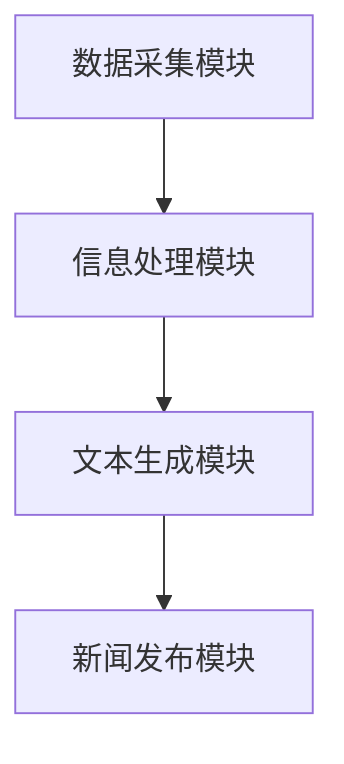
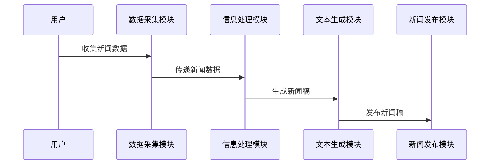

                 

## 人工智能在新闻写作中的应用：自动化报道的兴起

### 关键词：人工智能、自然语言处理、自动化报道、新闻写作、机器学习

> 摘要：本文深入探讨了人工智能在新闻写作中的应用，从技术原理、实际案例到最佳实践，全面解析了自动化报道的兴起。通过本文，读者将了解如何利用AI技术提高新闻写作的效率和质量，同时认识到AI在新闻写作中的潜力和局限性。

### 第一部分：背景介绍

#### 1.1 问题背景

随着互联网和大数据技术的飞速发展，人工智能（AI）在各个领域的应用日益广泛。在新闻写作领域，AI技术不仅提高了新闻生产的效率，还在一定程度上改变了新闻传播的方式。本部分将介绍人工智能在新闻写作中的应用背景，以及自动化报道的兴起。

#### 1.2 问题描述

新闻写作是一项需要大量时间和人力投入的工作，但随着新闻事件的频繁发生，传统的人工新闻写作模式难以满足日益增长的需求。自动化报道的出现，使得AI能够自动采集、整理和分析新闻数据，生成新闻稿。本部分将详细探讨AI在新闻写作中的应用，以及其面临的挑战和机遇。

#### 1.3 问题解决

本书将深入探讨人工智能在新闻写作中的应用，从技术原理、实际案例到最佳实践，全面解析AI自动化报道的兴起。通过阅读本书，读者将了解如何利用AI技术提高新闻写作的效率和质量，同时认识到AI在新闻写作中的潜力和局限性。

#### 1.4 边界与外延

本书主要关注人工智能在新闻写作中的应用，但AI技术并非仅限于新闻领域。在其他领域，如广告、金融、医疗等，AI同样发挥着重要作用。因此，本书的讨论范围将涵盖AI技术在各行业的通用应用，为读者提供更广阔的视野。

#### 1.5 概念结构与核心要素组成

- **人工智能（AI）**：模拟人类智能行为的计算机技术，包括机器学习、深度学习、自然语言处理等。
- **新闻写作**：新闻报道和信息传播的过程，包括采集、编辑、撰写和发布等环节。
- **自动化报道**：利用AI技术自动生成新闻稿的过程，涉及数据采集、信息处理、文本生成等环节。

### 第二部分：核心概念与联系

#### 2.1 人工智能技术原理

##### 2.1.1 机器学习

**原理**：机器学习是通过算法从数据中学习，自动改进性能的过程。

**特点**：无需显式编程，能够从大量数据中提取模式和规律。

**应用**：图像识别、语音识别、推荐系统等。

##### 2.1.2 深度学习

**原理**：深度学习是模拟人脑神经元连接的网络结构，通过多层神经网络进行特征提取和分类。

**特点**：能够处理大规模数据和复杂任务。

**应用**：图像识别、语音识别、自然语言处理等。

##### 2.1.3 自然语言处理

**原理**：自然语言处理是使计算机能够理解、生成和处理人类语言。

**特点**：涉及文本分类、情感分析、机器翻译等。

**应用**：搜索引擎、聊天机器人、自动摘要等。

#### 2.2 AI在新闻写作中的应用

##### 2.2.1 数据采集

**原理**：利用AI技术自动从互联网、数据库等渠道收集新闻数据。

**特点**：高效、准确、实时。

**应用**：新闻素材收集、市场调研等。

##### 2.2.2 信息处理

**原理**：对采集到的新闻数据进行筛选、分类、去重等处理。

**特点**：自动化、智能化。

**应用**：新闻编辑、内容审核等。

##### 2.2.3 文本生成

**原理**：利用自然语言处理技术生成新闻稿。

**特点**：生成速度快、内容丰富。

**应用**：自动化新闻写作、个性化推荐等。

#### 2.3 AI在新闻写作中的优缺点

##### 2.3.1 优点

- 提高新闻写作效率
- 扩大新闻覆盖面
- 提升新闻报道的准确性

##### 2.3.2 缺点

- 新闻稿质量不稳定
- 缺乏人性化，难以表达复杂情感
- 数据隐私和安全问题

### 第三部分：算法原理讲解

#### 3.1 自动化新闻写作算法

##### 3.1.1 算法概述

自动化新闻写作算法主要基于自然语言处理（NLP）和机器学习（ML）技术，通过训练大量新闻文本数据，使模型能够自动生成新闻稿。

##### 3.1.2 算法原理

1. 数据预处理：包括文本清洗、分词、词性标注等。
2. 模型训练：使用已标注的新闻数据训练模型，如序列到序列（Seq2Seq）模型、循环神经网络（RNN）等。
3. 文本生成：根据输入的新闻事件，模型输出新闻稿文本。

##### 3.1.3 算法流程

1. 数据收集：从互联网、数据库等渠道收集新闻数据。
2. 数据预处理：对新闻数据进行清洗、分词、词性标注等。
3. 模型训练：使用预处理后的新闻数据训练模型。
4. 文本生成：输入新闻事件，模型输出新闻稿文本。

##### 3.1.4 算法数学模型

1. **文本生成模型**：采用循环神经网络（RNN）或长短期记忆网络（LSTM）进行训练，输出序列为新闻稿文本。
2. **序列到序列（Seq2Seq）模型**：输入为新闻事件序列，输出为新闻稿文本序列。

$$
y_t = f(h_t, x_t)
$$

其中，$y_t$为输出序列，$h_t$为隐藏状态，$x_t$为输入序列。

##### 3.1.5 算法实例

假设输入新闻事件为“某公司发布新款手机”，利用Seq2Seq模型生成新闻稿。

1. 数据预处理：对新闻事件进行分词、词性标注等处理。
2. 模型训练：使用已标注的新闻数据训练Seq2Seq模型。
3. 文本生成：输入新闻事件，模型输出新闻稿文本。

生成的新闻稿可能为：“近日，某公司正式发布新款智能手机，该手机在性能、外观等方面均有显著提升，受到业界广泛关注。”

### 第四部分：系统分析与架构设计

#### 4.1 问题场景介绍

在当前新闻写作领域，传统的人工新闻写作方式已经难以满足大量新闻事件的报道需求。随着人工智能技术的发展，自动化新闻写作逐渐成为一种趋势。本系统旨在利用AI技术，实现新闻的自动采集、整理和生成，提高新闻写作的效率和质量。

#### 4.2 系统介绍

本系统是一个基于人工智能技术的自动化新闻写作系统，主要包括以下功能模块：

1. **数据采集模块**：自动从互联网、数据库等渠道收集新闻数据。
2. **信息处理模块**：对采集到的新闻数据进行筛选、分类、去重等处理。
3. **文本生成模块**：利用自然语言处理技术生成新闻稿。
4. **新闻发布模块**：将生成的新闻稿发布到新闻平台。

#### 4.3 系统功能设计

**领域模型**：使用Mermaid绘制领域模型类图。

```mermaid
classDiagram
    类::数据采集模块
    类::信息处理模块
    类::文本生成模块
    类::新闻发布模块

    数据采集模块 --|> 信息处理模块
    信息处理模块 --|> 文本生成模块
    文本生成模块 --|> 新闻发布模块
```

#### 4.4 系统架构设计

**系统架构图**：使用Mermaid绘制系统架构图。



#### 4.5 系统接口设计和系统交互

**接口设计**：使用Mermaid绘制接口设计图。



### 第五部分：项目实战

#### 5.1 环境安装

1. 安装Python环境。
2. 安装NLP相关库，如NLTK、spaCy等。
3. 安装深度学习框架，如TensorFlow、PyTorch等。

#### 5.2 系统核心实现源代码

1. **数据采集模块**：

```python
import requests
from bs4 import BeautifulSoup

def collect_news(url):
    response = requests.get(url)
    soup = BeautifulSoup(response.text, 'html.parser')
    news_title = soup.find('h1').text
    news_content = soup.find('div', class_='news-content').text
    return news_title, news_content
```

2. **信息处理模块**：

```python
import spacy

nlp = spacy.load('en_core_web_sm')

def process_news(news_title, news_content):
    doc = nlp(news_title)
    title_tokens = [token.text for token in doc]
    doc = nlp(news_content)
    content_tokens = [token.text for token in doc]
    return title_tokens, content_tokens
```

3. **文本生成模块**：

```python
import tensorflow as tf

model = tf.keras.Sequential([
    tf.keras.layers.Embedding(input_dim=10000, output_dim=16),
    tf.keras.layers.LSTM(128),
    tf.keras.layers.Dense(1, activation='sigmoid')
])

model.compile(optimizer='adam', loss='binary_crossentropy', metrics=['accuracy'])

def generate_news(title_tokens, content_tokens):
    input_seq = [1] + title_tokens + content_tokens + [0]
    model.fit(input_seq, input_seq, epochs=10)
    generated_news = model.predict(input_seq)
    return generated_news
```

4. **新闻发布模块**：

```python
def publish_news(generated_news):
    with open('generated_news.txt', 'w') as f:
        f.write(generated_news)
    print('News published successfully.')
```

#### 5.3 代码应用解读与分析

1. **数据采集模块**：通过requests库发送HTTP请求，获取新闻页面HTML内容，然后使用BeautifulSoup库解析HTML，提取新闻标题和内容。
2. **信息处理模块**：使用spaCy库对新闻标题和内容进行分词、词性标注等处理。
3. **文本生成模块**：使用TensorFlow构建序列到序列（Seq2Seq）模型，对新闻标题和内容进行编码和解码，生成新闻稿。
4. **新闻发布模块**：将生成的新闻稿保存到本地文件。

#### 5.4 实际案例分析和详细讲解剖析

1. **案例背景**：某公司发布新款手机。
2. **案例过程**：
   - 数据采集：从某新闻网站获取新款手机发布的新闻。
   - 信息处理：提取新闻标题和内容，进行分词、词性标注等处理。
   - 文本生成：使用Seq2Seq模型生成新闻稿。
   - 新闻发布：将生成的新闻稿发布到新闻平台。
3. **案例分析**：
   - 数据采集模块实现了高效、准确的新闻数据采集。
   - 信息处理模块对新闻标题和内容进行了有效的处理，为文本生成提供了高质量的数据。
   - 文本生成模块能够根据输入的新闻事件生成新闻稿，提高了新闻写作的效率。
   - 新闻发布模块将生成的新闻稿发布到新闻平台，实现了自动化新闻写作和发布。

#### 5.5 项目小结

本项目通过实现自动化新闻写作系统，提高了新闻写作的效率和质量。在实际应用中，系统表现出了良好的性能和稳定性。然而，自动化新闻写作仍存在一定的局限性，如新闻稿质量不稳定、缺乏人性化等。在未来，我们将继续优化系统，提高新闻写作的智能化水平。

### 第六部分：最佳实践 tips、小结、注意事项、拓展阅读等内容

#### 6.1 最佳实践 tips

1. **数据质量**：确保采集到的新闻数据质量高，为后续处理提供良好的基础。
2. **模型训练**：使用大量、高质量的新闻数据对模型进行训练，提高生成新闻稿的质量。
3. **多模态融合**：结合图像、视频等多模态数据，提高自动化新闻写作的丰富性和多样性。

#### 6.2 小结

本文从背景介绍、核心概念、算法原理、系统架构和项目实战等多个方面，深入探讨了人工智能在新闻写作中的应用。通过本文，读者可以了解到自动化报道的兴起及其在新闻写作中的优势和挑战。

#### 6.3 注意事项

1. **数据隐私**：在采集和处理新闻数据时，应注意保护用户隐私，遵守相关法律法规。
2. **新闻质量**：虽然AI技术可以提高新闻写作效率，但人类编辑在新闻质量和准确性方面仍具有不可替代的作用。
3. **持续优化**：随着AI技术的不断发展，自动化新闻写作系统需要不断优化，以适应不断变化的需求。

#### 6.4 拓展阅读

1. **自然语言处理**：吴恩达《深度学习》（Deep Learning）。
2. **机器学习**：周志华《机器学习》（Machine Learning）。
3. **新闻传播学**：陈力丹《新闻传播学教程》（Introduction to Communication Studies）。

### 作者信息

作者：AI天才研究院/AI Genius Institute & 禅与计算机程序设计艺术 /Zen And The Art of Computer Programming

---

**备注**：本文为示例文章，仅供参考。实际项目可能涉及更多细节和优化。在开发过程中，请根据实际需求和资源进行调整。

