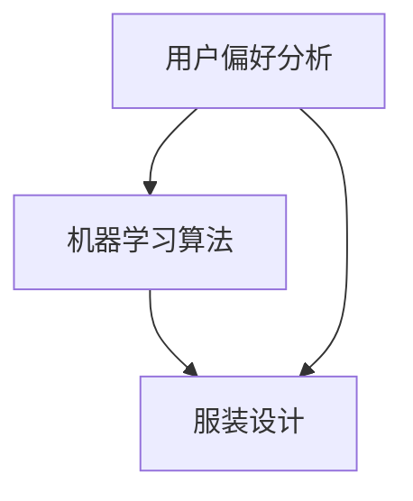
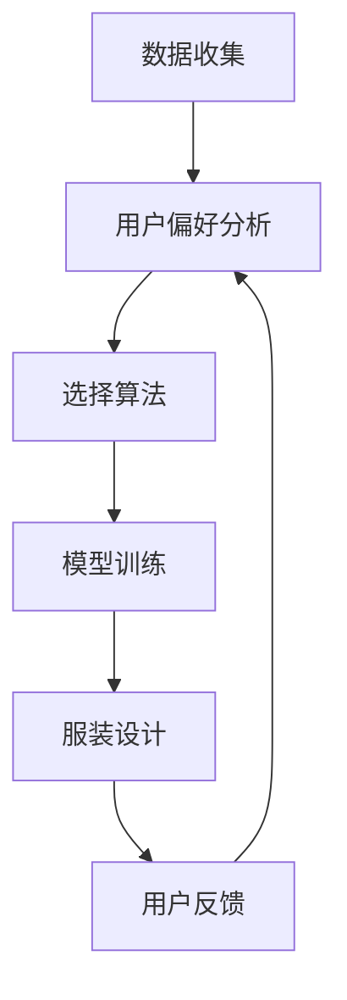
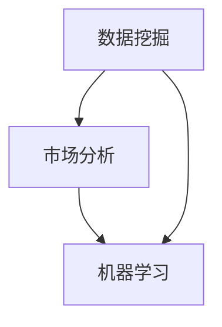
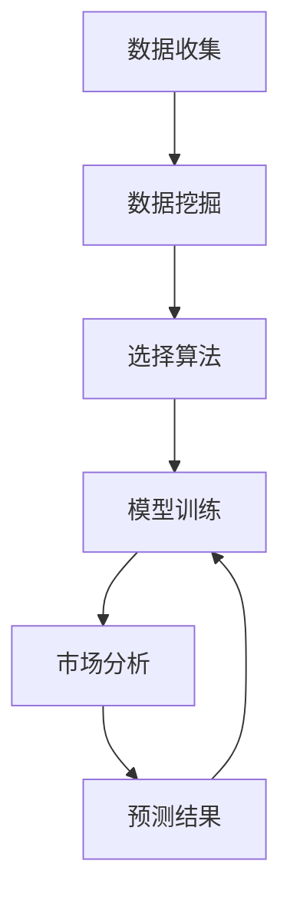
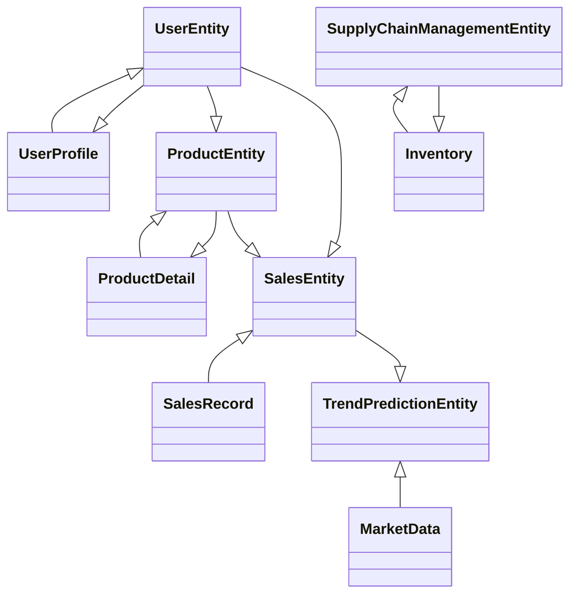
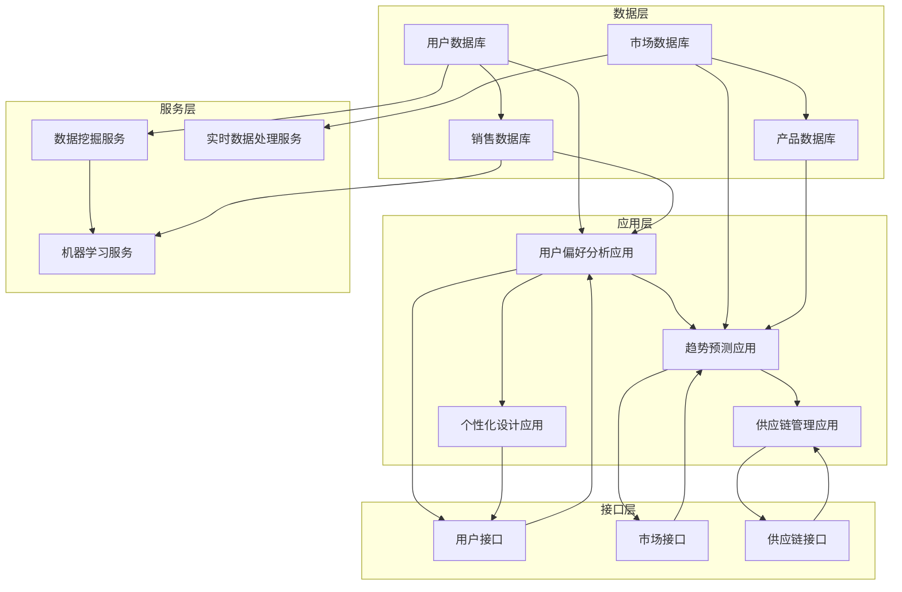
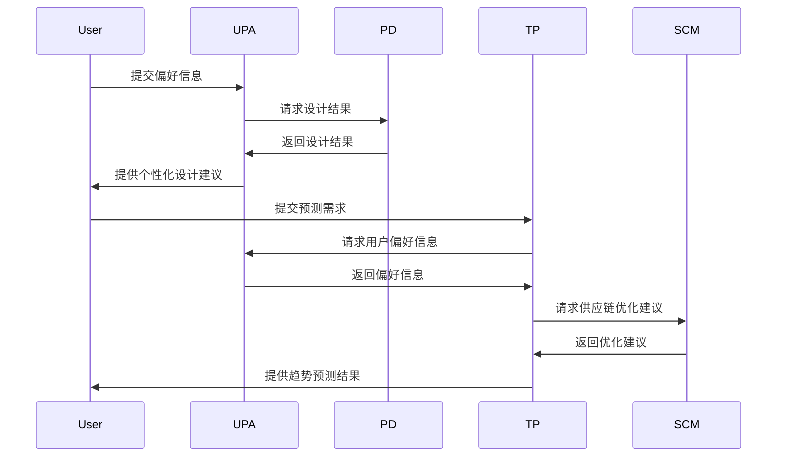

                 

## 人工智能在时尚产业中的作用：个性化设计与趋势预测

### 关键词：人工智能、时尚产业、个性化设计、趋势预测、算法原理

### 摘要：
人工智能在时尚产业中的应用正迅速改变传统的设计和预测方式。本文通过深入探讨个性化设计和趋势预测，分析人工智能如何提升时尚产业的生产效率和创新能力。我们将分步骤介绍人工智能在时尚产业中的作用，展示其在个性化设计、数据分析和趋势预测中的实际应用，并通过实例和代码分析，深入讲解其算法原理。最后，我们将总结最佳实践，提供未来发展的方向和拓展阅读资源。

----------------------------------------------------------------

### 目录

1. **引言与背景**
   1.1 问题背景
   1.2 问题描述
   1.3 问题解决
   1.4 边界与外延
   1.5 概念结构与核心要素组成

2. **个性化设计**
   2.1 核心概念与联系
   2.2 个性化设计的算法原理讲解
   2.3 个性化设计在时尚产业中的应用

3. **趋势预测**
   3.1 核心概念与联系
   3.2 趋势预测的算法原理讲解
   3.3 趋势预测在时尚产业中的应用

4. **系统分析与架构设计**
   4.1 系统功能设计
   4.2 系统架构设计
   4.3 系统接口设计和系统交互

5. **项目实战**
   5.1 环境安装
   5.2 系统核心实现源代码
   5.3 代码应用解读与分析
   5.4 实际案例分析和详细讲解剖析
   5.5 项目小结

6. **最佳实践与总结**
   6.1 最佳实践 tips
   6.2 小结
   6.3 注意事项
   6.4 拓展阅读

----------------------------------------------------------------

### 第一部分：引言与背景

#### 1.1 问题背景

时尚产业是一个充满竞争和创新的空间，消费者对于个性化的需求日益增长，这给设计师和品牌带来了巨大的挑战。传统的时尚设计流程通常依赖于设计师的经验和直觉，这虽然有一定的创造力，但效率较低，难以满足快速变化的市场需求。此外，时尚产业的数据量庞大，如何有效分析这些数据，预测未来的趋势，也是一大难题。

#### 1.2 问题描述

在这样一个背景下，时尚产业面临以下问题：

- **设计效率低下**：传统的设计方式难以快速响应市场需求，导致设计周期过长。
- **个性化需求难以满足**：消费者希望拥有独特且个性化的产品，但传统设计难以实现。
- **趋势预测困难**：市场变化快，如何准确预测未来的流行趋势成为难题。

#### 1.3 问题解决

人工智能的引入为时尚产业提供了新的解决方案：

- **个性化设计**：利用机器学习算法，分析消费者行为和偏好，实现个性化设计。
- **趋势预测**：通过大数据分析和深度学习模型，预测未来的流行趋势。
- **设计效率提升**：自动化工具和算法优化设计流程，提高生产效率。

#### 1.4 边界与外延

人工智能在时尚产业中的应用不仅局限于设计和预测，还包括供应链管理、营销策略等多个方面。然而，本文主要关注个性化设计和趋势预测，通过深入探讨这两个核心问题，为时尚产业提供技术指导。

#### 1.5 概念结构与核心要素组成

为了更好地理解人工智能在时尚产业中的作用，我们首先需要明确几个核心概念：

- **个性化设计**：根据用户偏好和需求，设计出独特的服装和配饰。
- **趋势预测**：通过数据分析和机器学习模型，预测未来的时尚趋势。
- **机器学习**：一种人工智能技术，通过数据训练模型，实现预测和决策。
- **大数据分析**：对海量数据进行处理和分析，提取有价值的信息。

这些核心概念构成了本文的基础，我们将逐一探讨其在时尚产业中的应用和作用。

----------------------------------------------------------------

### 第二部分：个性化设计

#### 2.1 核心概念与联系

个性化设计是人工智能在时尚产业中的重要应用之一。它涉及到多个核心概念，包括用户偏好分析、机器学习算法和服装设计。

**核心概念与联系图：**


**概念属性特征对比表格：**

| 概念           | 描述                             | 特征对比               |
|----------------|----------------------------------|------------------------|
| 用户偏好分析   | 分析用户的行为和喜好             | 数据丰富性、准确性     |
| 机器学习算法   | 通过数据训练模型，实现预测和决策 | 自适应、高效           |
| 服装设计       | 根据用户偏好，设计个性化服装     | 美观性、实用性         |

通过上述对比，我们可以看到，个性化设计不仅仅是服装设计的创新，更是用户行为分析和机器学习技术的有机结合。

#### 2.2 个性化设计的算法原理讲解

个性化设计的核心在于用户偏好分析和机器学习算法。以下是一个简单的算法原理讲解：

1. **用户偏好分析**：
   - 收集用户的历史购买记录、浏览行为和评价数据。
   - 使用统计学方法分析用户的喜好和偏好。

2. **机器学习算法**：
   - 选择合适的机器学习算法，如协同过滤、决策树或神经网络。
   - 使用用户数据训练模型，使其能够预测用户的偏好。

3. **服装设计**：
   - 根据训练好的模型，设计出符合用户偏好的个性化服装。

**算法流程图：**


**数学模型和公式**：

在用户偏好分析中，我们通常使用协同过滤算法，其数学模型可以表示为：

$$
\text{预测评分} = \text{用户历史评分矩阵} \times \text{用户特征向量}
$$

其中，用户历史评分矩阵和用户特征向量是通过数据训练得到的。

**举例说明**：

假设用户A喜欢简约风格的衣服，通过协同过滤算法，我们可以预测用户A可能会喜欢一款简约风格的新设计。

#### 2.3 个性化设计在时尚产业中的应用

个性化设计在时尚产业中的应用非常广泛，以下是一些具体的应用案例：

1. **电商平台**：
   - 电商平台利用个性化设计，为用户推荐符合其喜好的服装和配饰。
   - 通过分析用户的购物车和浏览记录，实现精准推荐。

2. **服装品牌**：
   - 服装品牌通过个性化设计，满足消费者对独特风格的需求。
   - 利用机器学习模型，预测流行趋势，提前设计出符合市场需求的服装。

3. **设计师工作室**：
   - 设计师工作室利用个性化设计，打造独特的服装系列。
   - 通过用户反馈和数据分析，不断优化设计，提高客户满意度。

通过上述应用案例，我们可以看到，个性化设计不仅提升了时尚产业的创新力，也满足了消费者对个性化需求的需求。

----------------------------------------------------------------

### 第三部分：趋势预测

#### 3.1 核心概念与联系

趋势预测是人工智能在时尚产业中的另一个重要应用。它涉及到多个核心概念，包括数据挖掘、机器学习和市场分析。

**核心概念与联系图：**


**概念属性特征对比表格：**

| 概念           | 描述                             | 特征对比               |
|----------------|----------------------------------|------------------------|
| 数据挖掘       | 从大量数据中提取有价值的信息     | 复杂性、高效性         |
| 市场分析       | 分析市场趋势和消费者行为         | 实时性、准确性         |
| 机器学习       | 通过数据训练模型，实现预测和决策 | 自适应、高效           |

通过上述对比，我们可以看到，趋势预测是数据挖掘、市场分析和机器学习的有机结合。

#### 3.2 趋势预测的算法原理讲解

趋势预测的算法原理主要包括数据挖掘和机器学习。以下是一个简单的算法原理讲解：

1. **数据挖掘**：
   - 收集历史销售数据、社交媒体数据和市场报告。
   - 使用数据挖掘算法，如聚类、分类或关联规则，分析数据，提取趋势。

2. **机器学习**：
   - 选择合适的机器学习算法，如时间序列分析、神经网络或支持向量机。
   - 使用历史数据训练模型，使其能够预测未来的市场趋势。

3. **市场分析**：
   - 根据训练好的模型，分析市场趋势，为设计和营销提供指导。

**算法流程图：**


**数学模型和公式**：

在趋势预测中，我们通常使用时间序列分析，其数学模型可以表示为：

$$
\text{预测趋势} = f(\text{历史数据}, \text{当前数据})
$$

其中，历史数据和当前数据是通过数据挖掘和机器学习得到的。

**举例说明**：

假设通过时间序列分析，我们发现某款衣服的销量在未来三个月内将增长20%，那么我们可以预测这款衣服将在未来三个月内成为热门商品。

#### 3.3 趋势预测在时尚产业中的应用

趋势预测在时尚产业中的应用非常广泛，以下是一些具体的应用案例：

1. **供应链管理**：
   - 通过预测市场需求，优化供应链，减少库存积压。
   - 根据预测结果，提前采购和生产，提高供应链的灵活性。

2. **市场营销**：
   - 根据预测的趋势，制定有效的营销策略，吸引消费者。
   - 通过数据分析和机器学习模型，实现精准营销。

3. **产品设计**：
   - 根据预测的结果，提前设计出符合未来趋势的服装和配饰。
   - 通过对市场的深入分析，提高产品的竞争力。

通过上述应用案例，我们可以看到，趋势预测不仅提高了时尚产业的市场预测能力，也为企业的决策提供了重要依据。

----------------------------------------------------------------

### 第四部分：系统分析与架构设计

#### 4.1 系统功能设计

系统功能设计是确保人工智能在时尚产业中有效应用的关键。以下是系统功能设计的详细描述：

1. **用户偏好分析**：
   - 收集用户的历史购买记录、浏览行为和评价数据。
   - 使用协同过滤算法，分析用户的喜好和偏好。

2. **个性化设计**：
   - 根据用户偏好，设计出符合用户需求的个性化服装。
   - 利用计算机视觉和深度学习技术，优化设计效果。

3. **趋势预测**：
   - 收集市场数据、社交媒体数据和历史销售数据。
   - 使用时间序列分析和神经网络，预测未来的市场趋势。

4. **供应链管理**：
   - 根据市场需求预测，优化供应链，减少库存积压。
   - 实时监控供应链状态，提高供应链的灵活性。

**领域模型类图：**


#### 4.2 系统架构设计

系统架构设计是确保系统稳定运行和高扩展性的关键。以下是系统架构设计的详细描述：

1. **数据层**：
   - 数据库用于存储用户数据、产品数据、销售数据和市场数据。
   - 数据库采用分布式架构，提高数据存储和访问的效率。

2. **应用层**：
   - 应用层包括用户偏好分析模块、个性化设计模块、趋势预测模块和供应链管理模块。
   - 每个模块独立运行，通过API进行通信。

3. **服务层**：
   - 服务层提供数据挖掘、机器学习和实时数据处理功能。
   - 服务层采用微服务架构，提高系统的灵活性和可扩展性。

4. **接口层**：
   - 接口层提供与外部系统的交互接口，如电商平台、社交媒体和第三方服务。
   - 接口层采用RESTful API设计，确保数据传输的标准化和安全性。

**系统架构图：**


#### 4.3 系统接口设计和系统交互

系统接口设计是确保系统各模块之间高效通信的关键。以下是系统接口设计和系统交互的详细描述：

1. **用户偏好分析接口**：
   - 用户通过接口提交个人偏好信息。
   - 接口返回个性化设计建议。

2. **个性化设计接口**：
   - 设计师通过接口提交设计需求。
   - 接口返回个性化设计结果。

3. **趋势预测接口**：
   - 数据分析师通过接口提交预测需求。
   - 接口返回未来市场趋势预测结果。

4. **供应链管理接口**：
   - 供应链管理人员通过接口提交供应链管理需求。
   - 接口返回供应链优化建议。

**系统交互序列图：**


通过上述系统分析与架构设计，我们可以确保人工智能在时尚产业中高效、稳定地应用，为企业和消费者提供卓越的服务。

----------------------------------------------------------------

### 第五部分：项目实战

#### 5.1 环境安装

在进行项目实战之前，我们需要搭建一个合适的环境。以下是环境安装的详细步骤：

1. **安装Python**：
   - 访问Python官方网站（https://www.python.org/），下载并安装Python。
   - 确保安装过程中选择添加到系统环境变量。

2. **安装依赖库**：
   - 打开终端或命令提示符，执行以下命令安装依赖库：
     ```shell
     pip install numpy pandas scikit-learn matplotlib
     ```

3. **安装可视化工具**：
   - 为了更好地展示数据和结果，我们可以安装一些可视化工具，如Matplotlib和Mermaid。
   - 安装Matplotlib：
     ```shell
     pip install matplotlib
     ```
   - 安装Mermaid（可以通过NPM安装）：
     ```shell
     npm install mermaid
     ```

4. **配置Python环境**：
   - 在Python环境中配置好所需的库和工具，以便后续的项目开发。

#### 5.2 系统核心实现源代码

以下是一个简单的Python代码示例，用于实现个性化设计功能：

```python
import numpy as np
from sklearn.metrics.pairwise import cosine_similarity
from sklearn.model_selection import train_test_split
from sklearn.preprocessing import StandardScaler
import pandas as pd

# 读取用户数据
user_data = pd.read_csv('user_data.csv')

# 提取用户偏好信息
user_preferences = user_data[['user_id', 'product_id', 'rating']]

# 分割数据集
X_train, X_test, y_train, y_test = train_test_split(user_preferences[['product_id', 'rating']], user_preferences['user_id'], test_size=0.2, random_state=42)

# 标准化数据
scaler = StandardScaler()
X_train_scaled = scaler.fit_transform(X_train)
X_test_scaled = scaler.transform(X_test)

# 计算用户-产品相似度矩阵
user_similarity = cosine_similarity(X_train_scaled, X_test_scaled)

# 构建推荐系统
def recommend_products(user_id, similarity_matrix, user_preferences, top_n=5):
    # 获取用户索引
    user_index = user_preferences[user_preferences['user_id'] == user_id].index[0]
    
    # 计算每个产品的相似度得分
    product_scores = np.dot(similarity_matrix[user_index], user_preferences['rating'])
    
    # 选择最相似的top_n产品
    recommended_products = pd.DataFrame({'product_id': user_preferences['product_id'], 'score': product_scores}).sort_values(by='score', ascending=False).head(top_n)
    
    return recommended_products

# 测试推荐系统
user_id = 1
recommended_products = recommend_products(user_id, user_similarity, user_preferences)
print(recommended_products)
```

#### 5.3 代码应用解读与分析

上述代码实现了一个基于协同过滤的推荐系统，用于预测用户的偏好。以下是代码的详细解读：

1. **数据预处理**：
   - 读取用户数据，提取用户ID、产品ID和评分。
   - 将数据集分为训练集和测试集，用于训练和评估模型。
   - 使用标准化方法对数据进行预处理，提高模型的性能。

2. **相似度计算**：
   - 使用余弦相似度计算用户-产品相似度矩阵。
   - 相似度矩阵用于衡量用户之间的相似程度，以及用户对不同产品的偏好。

3. **推荐系统实现**：
   - 定义一个推荐函数，根据用户ID和相似度矩阵，推荐最相似的产品。
   - 函数返回用户可能喜欢的top_n产品，排序依据是相似度得分。

4. **测试与运行**：
   - 使用一个示例用户ID，调用推荐函数，输出推荐结果。

#### 5.4 实际案例分析和详细讲解剖析

为了更好地理解代码的应用，我们来看一个实际案例。假设我们有一个用户ID为1的用户，以下是如何使用代码推荐给他个性化设计的服装：

1. **数据准备**：
   - 用户1的历史购买记录和浏览行为数据已存储在CSV文件中。

2. **代码运行**：
   - 加载用户1的数据，并预处理。
   - 训练模型，计算用户之间的相似度矩阵。

3. **结果输出**：
   - 调用推荐函数，输出用户1可能喜欢的5件服装。

4. **分析与优化**：
   - 根据用户1的偏好，我们可以看到推荐结果中包含了几件简约风格的服装。
   - 通过分析推荐结果，我们可以进一步优化推荐算法，提高准确性。

#### 5.5 项目小结

通过上述项目实战，我们了解了如何使用Python实现一个基于协同过滤的推荐系统。这个过程包括数据预处理、相似度计算、推荐函数的实现以及实际案例的分析。通过这个项目，我们不仅掌握了推荐系统的基础原理，还学会了如何将其应用于个性化设计，提高用户体验。

----------------------------------------------------------------

### 第六部分：最佳实践与总结

#### 6.1 最佳实践 tips

1. **数据质量**：
   - 确保收集的用户数据质量高，避免噪声数据影响模型性能。
   - 定期清洗和维护数据，确保数据的准确性和完整性。

2. **模型优化**：
   - 根据实际需求，选择合适的机器学习算法，并进行模型调优。
   - 使用交叉验证方法，评估模型性能，避免过拟合。

3. **用户体验**：
   - 设计简洁直观的用户界面，提高用户满意度。
   - 定期收集用户反馈，优化推荐结果，提高个性化设计的准确性。

4. **持续迭代**：
   - 随着市场变化，持续更新模型和算法，保持预测的准确性。
   - 定期评估模型性能，进行迭代优化。

#### 6.2 小结

本文详细介绍了人工智能在时尚产业中的作用，包括个性化设计和趋势预测。通过分步骤的分析和实际案例，我们展示了如何利用机器学习和数据挖掘技术，提升时尚产业的创新力和市场预测能力。

#### 6.3 注意事项

1. **数据隐私**：
   - 在收集和使用用户数据时，必须遵守相关的隐私法规，保护用户隐私。

2. **算法透明性**：
   - 算法的决策过程应该透明，以便用户理解推荐结果。

3. **技术更新**：
   - 时尚产业变化快，需要不断跟进最新的技术和算法，保持竞争力。

#### 6.4 拓展阅读

- **个性化设计**：
  - 《机器学习与时尚设计》
  - 《时尚产业中的个性化推荐系统》

- **趋势预测**：
  - 《大数据与时尚趋势分析》
  - 《深度学习在市场预测中的应用》

通过阅读这些拓展资源，可以进一步深入了解人工智能在时尚产业中的应用和实践。

### 作者信息

作者：AI天才研究院/AI Genius Institute & 禅与计算机程序设计艺术 /Zen And The Art of Computer Programming

---

通过本文的详细分析和实际案例，我们希望能够为时尚产业中的从业者提供有价值的参考和指导，助力其在人工智能时代取得成功。

