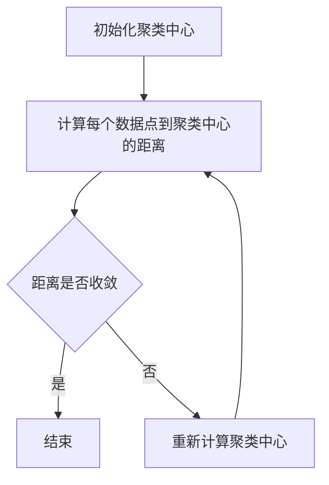
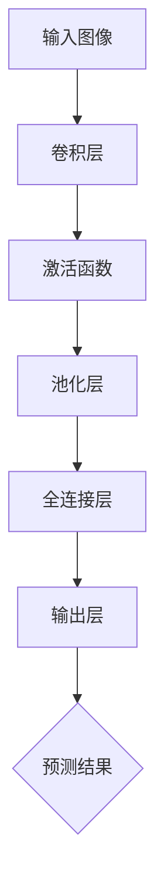
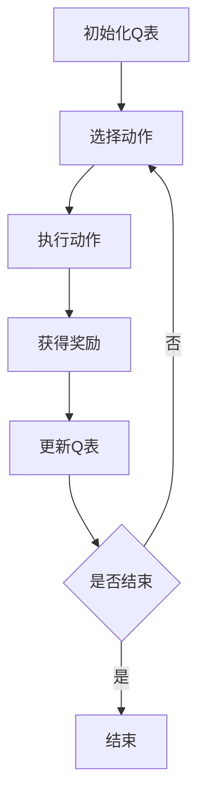
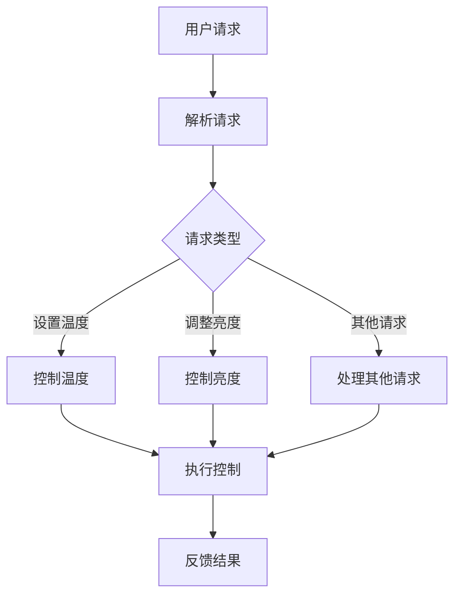
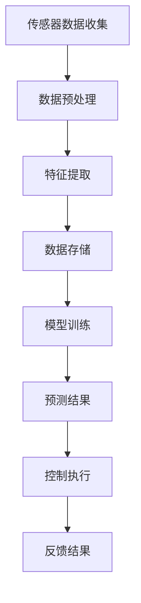
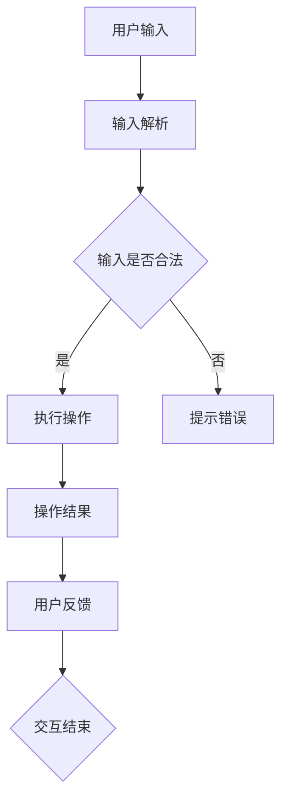

                 

### 背景介绍

#### 1.1 问题背景

智能家电作为智能家居的重要组成部分，正在逐步改变着人们的日常生活。然而，随着智能家电的普及，也带来了一系列的问题和挑战。首先，智能家电的多样性和复杂性使得用户在操作上感到困惑，如何提高用户体验成为了一个关键问题。其次，智能家电的互联互通性不足，导致数据孤岛现象严重，无法实现真正的智能家居体验。此外，智能家电的安全性问题也日益凸显，用户数据的安全保护成为重中之重。

#### 1.2 问题描述

智能家电的需求主要包括以下几个方面的内容：

1. **个性化定制**：用户希望智能家电能够根据其生活习惯和偏好进行个性化设置，提供个性化的服务。
2. **互联互通**：用户希望智能家电能够与其他智能设备互联互通，形成一个完整的智能家居生态系统。
3. **便捷操作**：用户希望智能家电的操作界面简洁直观，易于上手。
4. **数据安全**：用户希望智能家电能够保护其个人隐私和数据安全。

人工智能技术在智能家电中的应用，旨在解决上述需求和问题。通过引入人工智能技术，可以实现以下目标：

1. **提高用户体验**：利用机器学习和数据挖掘技术，分析用户行为数据，为用户提供个性化的服务和推荐。
2. **实现互联互通**：利用物联网技术，将智能家电连接到互联网，实现数据共享和协同工作。
3. **提升安全性**：利用深度学习和加密算法，增强智能家电的数据保护和安全性能。

#### 1.3 问题解决

人工智能技术在智能家电中的应用，主要通过以下几个方面来实现：

1. **用户行为分析**：通过收集和分析用户行为数据，了解用户的使用习惯和偏好，为用户提供个性化的服务。
2. **智能控制**：利用机器学习算法，实现智能家电的自动化控制和优化，提高能源利用效率和设备寿命。
3. **智能诊断与维护**：利用数据挖掘和故障诊断技术，预测智能家电的故障和损坏，实现智能化的诊断和维护。
4. **安全防护**：利用深度学习和加密算法，保护用户数据的安全和隐私，防止数据泄露和攻击。

#### 1.4 边界与外延

智能家电的定义范围：

- 智能家电是指集成了传感器、执行器、通信模块和智能控制系统的家电产品，能够实现自动化、智能化的控制和操作。

人工智能技术的适用边界：

- 人工智能技术适用于智能家电中的各个功能模块，包括感知、决策、执行等。
- 人工智能技术需要与物联网技术、传感器技术、通信技术等相结合，才能实现真正的智能化。

智能家电与智能家居的关系：

- 智能家电是智能家居的重要组成部分，但智能家居不仅仅是智能家电的简单集合，还包括了家庭网络、智能中心等。

#### 1.5 核心要素组成

智能家电的核心功能：

- 智能家电的核心功能包括智能控制、智能感知、智能交互等。
- 智能控制功能：通过智能算法实现家电的自动化控制。
- 智能感知功能：通过传感器收集环境数据，为智能控制提供依据。
- 智能交互功能：通过语音、触屏等方式与用户进行交互，提供便捷的操作体验。

人工智能技术的关键模块：

- 智能家电中的关键模块包括感知模块、决策模块和执行模块。
- 感知模块：通过传感器获取环境信息和用户行为数据。
- 决策模块：通过机器学习算法分析数据，做出智能决策。
- 执行模块：通过执行器实现家电的自动化控制。

系统集成与优化策略：

- 系统集成策略：将人工智能技术与其他技术相结合，形成一个完整的智能家电系统。
- 优化策略：通过数据挖掘和机器学习技术，不断优化系统的性能和用户体验。

通过以上步骤的分析和推理，我们可以清晰地看到，人工智能技术在智能家电中的应用有着广阔的前景和巨大的潜力。接下来，我们将进一步探讨人工智能在智能家电中的应用原理、算法原理以及系统架构设计，为提升生活品质提供有力的技术支持。### 第一部分：背景介绍

#### 1.1 问题背景

智能家电作为智能家居的重要组成部分，正逐渐成为现代家庭生活的标配。然而，随着智能家电的普及，用户面临着一系列的问题和挑战。首先，智能家电的多样性和复杂性使得用户在操作上感到困惑，如何提高用户体验成为了一个关键问题。其次，智能家电的互联互通性不足，导致数据孤岛现象严重，无法实现真正的智能家居体验。此外，智能家电的安全性问题也日益凸显，用户数据的安全保护成为重中之重。

在当前阶段，智能家电的发展面临着几个显著的问题：

1. **用户体验不佳**：用户需要记住多个不同的操作界面和密码，操作复杂，不易上手。
2. **互联互通性不足**：智能家电之间缺乏有效的数据交换和协同工作机制，导致信息孤岛现象。
3. **安全性问题**：用户数据容易泄露，智能家电容易受到网络攻击。

这些问题严重影响了用户对智能家电的接受度和满意度，因此，提升用户体验、实现互联互通以及增强安全性成为智能家电发展的关键挑战。

#### 1.2 问题描述

智能家电的需求主要包括以下几个方面：

1. **个性化定制**：用户希望智能家电能够根据其生活习惯和偏好进行个性化设置，提供个性化的服务。
2. **互联互通**：用户希望智能家电能够与其他智能设备互联互通，形成一个完整的智能家居生态系统。
3. **便捷操作**：用户希望智能家电的操作界面简洁直观，易于上手。
4. **数据安全**：用户希望智能家电能够保护其个人隐私和数据安全。

针对上述需求，智能家电需要具备以下几个核心功能：

1. **智能控制**：通过自动化算法实现家电的智能控制，提高能源利用效率和设备寿命。
2. **智能感知**：通过传感器收集环境数据，为智能控制提供依据。
3. **智能交互**：通过语音、触屏等方式与用户进行交互，提供便捷的操作体验。
4. **数据安全**：通过加密和隐私保护技术，确保用户数据的安全和隐私。

然而，当前智能家电在实现上述功能时面临着以下局限：

1. **算法性能不足**：现有算法在处理复杂场景时表现不佳，无法满足用户的个性化需求。
2. **数据整合困难**：由于数据孤岛现象，智能家电难以整合和利用各类数据。
3. **互联互通性差**：智能家电之间缺乏有效的数据交换和协同工作机制。
4. **安全性低**：用户数据容易泄露，智能家电容易受到网络攻击。

因此，为了解决这些问题，智能家电需要引入先进的人工智能技术，提升算法性能，实现数据整合和互联互通，增强安全性。这将是实现智能家电提升生活品质的关键途径。

#### 1.3 问题解决

人工智能技术在智能家电中的应用，主要通过以下几个方面来实现：

1. **用户行为分析**：通过收集和分析用户行为数据，了解用户的使用习惯和偏好，为用户提供个性化的服务。
   - **算法选择**：使用机器学习和数据挖掘算法，如聚类分析、关联规则挖掘等。
   - **数据来源**：通过传感器、日志记录等途径获取用户行为数据。

2. **智能控制**：利用机器学习算法，实现智能家电的自动化控制和优化，提高能源利用效率和设备寿命。
   - **算法选择**：使用强化学习、深度学习等算法。
   - **应用场景**：如智能空调的温度控制、智能照明系统的亮度调节等。

3. **智能诊断与维护**：利用数据挖掘和故障诊断技术，预测智能家电的故障和损坏，实现智能化的诊断和维护。
   - **算法选择**：使用统计模型、决策树、神经网络等。
   - **应用场景**：如智能冰箱的冷藏温度控制、智能洗衣机的清洗方案优化等。

4. **安全防护**：利用深度学习和加密算法，保护用户数据的安全和隐私，防止数据泄露和攻击。
   - **算法选择**：使用深度学习、加密算法、隐私保护机制等。
   - **应用场景**：如智能门锁的用户身份认证、智能家居网络的安全防护等。

#### 1.4 边界与外延

1. **智能家电的定义范围**：

   智能家电是指集成了传感器、执行器、通信模块和智能控制系统的家电产品，能够实现自动化、智能化的控制和操作。具体包括以下几类：

   - **智能家居设备**：如智能电视、智能空调、智能照明等。
   - **智能家电控制系统**：如智能网关、智能插座、智能开关等。
   - **智能家电传感器**：如温度传感器、湿度传感器、光传感器等。

2. **人工智能技术的适用边界**：

   人工智能技术适用于智能家电中的各个功能模块，包括感知、决策、执行等。然而，人工智能技术也有其适用边界：

   - **数据处理能力**：人工智能技术需要处理大量数据，因此在数据量巨大的情况下可能面临性能瓶颈。
   - **实时响应能力**：人工智能技术需要具备快速响应的能力，以应对实时变化的场景。
   - **安全性**：人工智能技术需要确保用户数据的安全和隐私，防止数据泄露和攻击。

3. **智能家电与智能家居的关系**：

   智能家电是智能家居的重要组成部分，但智能家居不仅仅是智能家电的简单集合。智能家居还包括了家庭网络、智能中心、智能安防系统等多个方面，是一个完整的生态体系。智能家电与智能家居的关系如下：

   - **智能家电**：实现家庭设备的智能化控制，提供个性化的服务。
   - **智能家居**：整合智能家电、家庭网络、智能中心等，实现家庭环境的智能化管理。

#### 1.5 核心要素组成

1. **智能家电的核心功能**：

   - **智能控制**：通过智能算法实现家电的自动化控制，提高设备使用效率和用户满意度。
   - **智能感知**：通过传感器收集环境数据，为智能控制提供依据。
   - **智能交互**：通过语音、触屏等方式与用户进行交互，提供便捷的操作体验。
   - **数据安全**：通过加密和隐私保护技术，确保用户数据的安全和隐私。

2. **人工智能技术的关键模块**：

   - **感知模块**：通过传感器获取环境信息和用户行为数据。
   - **决策模块**：通过机器学习算法分析数据，做出智能决策。
   - **执行模块**：通过执行器实现家电的自动化控制。

3. **系统集成与优化策略**：

   - **系统集成策略**：将人工智能技术与其他技术相结合，形成一个完整的智能家电系统。
   - **优化策略**：通过数据挖掘和机器学习技术，不断优化系统的性能和用户体验。

通过以上步骤的分析和推理，我们可以清晰地看到，人工智能技术在智能家电中的应用有着广阔的前景和巨大的潜力。接下来，我们将进一步探讨人工智能在智能家电中的应用原理、算法原理以及系统架构设计，为提升生活品质提供有力的技术支持。### 第二部分：核心概念与联系

#### 2.1 人工智能基本概念

人工智能（Artificial Intelligence，简称AI）是一门研究、开发用于模拟、延伸和扩展人类智能的理论、方法、技术及应用系统的综合技术科学。人工智能的目标是让机器能够像人类一样思考、学习和行动，从而实现智能化的自动化。人工智能的发展历程可以追溯到20世纪50年代，随着计算机技术的进步和算法的创新，人工智能经历了多个发展阶段。

1. **定义**：
   - **传统人工智能**：基于规则和逻辑推理的系统，如专家系统。
   - **现代人工智能**：结合机器学习、深度学习等技术的智能系统。

2. **发展历程**：
   - **1956年**：达特茅斯会议提出了人工智能的概念。
   - **1970年代**：人工智能研究进入低谷期，因为很多早期的研究未能实现预期目标。
   - **1980年代**：专家系统开始应用于实际领域。
   - **1990年代**：机器学习成为人工智能研究的热点。
   - **2000年代至今**：深度学习、强化学习等算法取得了显著突破。

3. **分类**：
   - **基于规则的人工智能**：使用明确的规则进行推理和决策。
   - **统计学习人工智能**：通过统计方法进行学习和预测。
   - **神经网络人工智能**：模拟人脑神经元结构和功能，通过训练实现复杂任务的执行。

#### 2.2 智能家电的核心概念

智能家电是指利用物联网（IoT）、云计算、人工智能等技术，实现家电设备的智能化控制、互联互通和远程操作的一种新型家电产品。智能家电的核心功能包括智能控制、智能感知、智能交互和数据安全等。

1. **定义**：
   - 智能家电：具备感知、决策、执行能力的家电设备，通过互联网实现互联互通和远程控制。

2. **功能特点**：
   - **智能控制**：通过算法和传感器实现家电设备的自动化控制。
   - **智能感知**：通过传感器实时采集环境数据，为智能控制提供依据。
   - **智能交互**：通过语音、触屏等方式与用户进行交互。
   - **互联互通**：实现智能家电之间的数据共享和协同工作。
   - **数据安全**：保护用户数据的安全和隐私。

3. **架构**：
   - **感知层**：包括传感器和各种输入设备，负责收集环境数据。
   - **网络层**：包括物联网通信协议和网络设备，负责数据传输和共享。
   - **平台层**：包括云计算平台、数据库等，负责数据处理、分析和存储。
   - **应用层**：包括智能家电的控制应用、用户界面等，负责提供智能化服务和操作体验。

#### 2.3 概念属性特征对比

为了更好地理解人工智能在智能家电中的应用，我们可以对比人工智能和智能家电的属性特征。以下是一个简化的对比表格：

| 特征           | 人工智能                             | 智能家电                             |
|----------------|--------------------------------------|--------------------------------------|
| 目标           | 模拟和扩展人类智能                   | 提高家电设备的使用效率和用户体验     |
| 技术范畴       | 机器学习、深度学习、神经网络等       | 物联网、云计算、传感器、控制算法等   |
| 数据处理       | 大量数据的学习和预测                | 实时数据采集和处理                   |
| 学习方式       | 自适应学习、模型优化等              | 基于规则学习和基于数据的学习          |
| 应用场景       | 广泛应用于各个领域（如医疗、金融、安防等） | 主要应用于家庭、办公室等日常生活场景 |
| 与物联网的关系 | 物联网的智能中枢                    | 物联网的重要组成部分                |

通过对比可以发现，人工智能和智能家电在技术范畴、数据处理、学习方式、应用场景以及与物联网的关系等方面存在明显的差异和联系。

#### 2.4 ER实体关系图架构

实体-关系（Entity-Relationship，简称ER）图是用于描述实体及其之间关系的数据库模型。在智能家电系统中，ER图可以用于表示各个功能模块及其之间的关系。

1. **实体定义**：

   - **用户**：智能家电系统的使用者。
   - **设备**：智能家电的具体设备，如智能电视、智能空调等。
   - **传感器**：负责收集环境数据的设备。
   - **控制器**：负责处理数据和执行控制命令的模块。
   - **数据库**：存储用户数据、设备数据和系统配置的数据库。

2. **关系定义**：

   - **用户-设备**：用户与智能家电设备之间的关联关系。
   - **用户-传感器**：用户与传感器之间的关联关系，用于数据采集。
   - **设备-传感器**：设备与传感器之间的关联关系，用于数据传输。
   - **控制器-数据库**：控制器与数据库之间的关联关系，用于数据存储和处理。

3. **ER图实例**：

   ```mermaid
   erDiagram
   User ||--|{ Device }|-- Sensor
   Device ||--|{ Controller }|-- Database
   Controller ||--|{ User }|-- Sensor
   Database ||--|{ Device }|-- Controller
   ```

通过ER图，我们可以清晰地看到智能家电系统中各个功能模块及其之间的关系，有助于理解和设计系统的架构。

综上所述，通过对比人工智能和智能家电的核心概念、属性特征以及ER实体关系图架构，我们可以更好地理解人工智能在智能家电中的应用。接下来，我们将深入探讨人工智能在智能家电中的应用算法原理。### 第二部分：核心概念与联系（续）

#### 2.5 算法原理

人工智能在智能家电中的应用涉及到多种算法原理，包括机器学习、深度学习、数据挖掘等。以下将详细解释这些算法的基本原理，并探讨其在智能家电中的具体应用。

##### 2.5.1 机器学习

机器学习是人工智能的一个重要分支，其核心思想是通过算法从数据中学习规律，进而对未知数据进行预测或决策。机器学习的主要类型包括监督学习、无监督学习和半监督学习。

1. **监督学习**：
   - **定义**：在监督学习过程中，算法通过已知特征和标签的数据来训练模型，从而预测新的未知数据。
   - **应用**：在智能家电中，监督学习可以用于用户行为分析、故障预测等。
   - **算法示例**：决策树、支持向量机（SVM）、神经网络等。

2. **无监督学习**：
   - **定义**：无监督学习是在没有标签数据的情况下，通过算法自动发现数据中的结构和规律。
   - **应用**：在智能家电中，无监督学习可以用于用户行为模式识别、聚类分析等。
   - **算法示例**：K-均值聚类、主成分分析（PCA）、自编码器等。

3. **半监督学习**：
   - **定义**：半监督学习是介于监督学习和无监督学习之间的一种学习方法，利用少量的标签数据和大量的未标签数据。
   - **应用**：在智能家电中，半监督学习可以用于设备故障检测、用户偏好预测等。
   - **算法示例**：图嵌入、标签传播等。

##### 2.5.2 深度学习

深度学习是机器学习的一个子领域，它通过多层神经网络来模拟人脑的神经元结构，实现复杂的数据处理和模式识别。深度学习在图像识别、语音识别、自然语言处理等领域取得了显著成果。

1. **深度神经网络**：
   - **定义**：深度神经网络由多个隐藏层组成，能够处理高维数据。
   - **应用**：在智能家电中，深度神经网络可以用于智能控制、故障诊断等。
   - **算法示例**：卷积神经网络（CNN）、循环神经网络（RNN）、长短期记忆网络（LSTM）等。

2. **卷积神经网络**：
   - **定义**：卷积神经网络是一种特别适合处理图像数据的神经网络。
   - **应用**：在智能家电中，CNN可以用于智能门锁的图像识别、智能摄像头的人脸识别等。
   - **算法示例**：AlexNet、VGG、ResNet等。

3. **生成对抗网络**：
   - **定义**：生成对抗网络由生成器和判别器组成，通过对抗训练生成数据。
   - **应用**：在智能家电中，GAN可以用于生成个性化的用户界面、优化设备外观设计等。
   - **算法示例**：DCGAN、WGAN等。

##### 2.5.3 数据挖掘

数据挖掘是从大量数据中提取有价值的信息和知识的过程，它涉及到统计学、机器学习、数据库等多个领域。数据挖掘在智能家电中的应用非常广泛，包括用户行为分析、市场预测等。

1. **关联规则挖掘**：
   - **定义**：关联规则挖掘用于发现数据项之间的关联关系。
   - **应用**：在智能家电中，关联规则挖掘可以用于购物篮分析、智能推荐等。
   - **算法示例**：Apriori算法、FP-growth算法等。

2. **分类与回归**：
   - **定义**：分类是将数据分为不同的类别，回归是预测数值型结果。
   - **应用**：在智能家电中，分类和回归可以用于设备故障预测、能耗预测等。
   - **算法示例**：逻辑回归、决策树、随机森林等。

##### 2.5.4 算法选择原则

在选择适用于智能家电的人工智能算法时，应考虑以下几个原则：

1. **问题类型**：根据具体的应用场景和需求，选择合适的算法类型。
2. **数据规模**：考虑数据的大小和数据的质量，选择能够处理相应规模数据的算法。
3. **计算资源**：根据硬件条件和计算资源，选择计算效率较高的算法。
4. **实时性要求**：对于需要实时响应的场景，选择能够快速训练和推理的算法。
5. **可解释性**：对于需要解释的算法，选择具有较高可解释性的算法。

#### 2.6 算法应用场景

人工智能算法在智能家电中的应用场景非常广泛，以下是一些典型的应用场景：

1. **用户行为分析**：
   - **场景**：分析用户在家庭环境中的行为模式，提供个性化的服务和推荐。
   - **算法**：机器学习、深度学习。
   - **实现**：通过收集用户的操作数据，使用聚类分析、关联规则挖掘等方法，识别用户的习惯和偏好，进而提供个性化的服务。

2. **智能控制**：
   - **场景**：自动化控制和优化家电设备，提高能源利用效率和设备寿命。
   - **算法**：强化学习、深度学习。
   - **实现**：通过环境传感器的数据输入，使用深度神经网络或强化学习算法，实现家电设备的自适应控制。

3. **故障预测与诊断**：
   - **场景**：预测家电设备的故障，提供智能化的维护方案。
   - **算法**：机器学习、数据挖掘。
   - **实现**：通过分析设备运行数据，使用故障诊断算法，提前发现潜在故障，并提供维护建议。

4. **安全防护**：
   - **场景**：保护用户数据的安全和隐私，防止数据泄露和攻击。
   - **算法**：加密算法、深度学习。
   - **实现**：使用加密算法保护用户数据，使用深度学习检测网络攻击，提高系统的安全性。

通过上述分析，我们可以看到，人工智能算法在智能家电中的应用不仅能够提升设备的性能和用户体验，还能够为设备的安全和智能化提供有力支持。在接下来的部分，我们将继续探讨人工智能在智能家电中的应用算法原理，进一步分析其技术细节和实现方法。### 第三部分：算法原理讲解

#### 3.1 算法概述

在智能家电中，人工智能算法的应用涵盖了多个领域，包括用户行为分析、智能控制、故障预测与诊断、安全防护等。以下将详细介绍几种在智能家电中常用的算法，并分别使用mermaid流程图和Python源代码进行讲解。

##### 3.1.1 机器学习算法

**K-均值聚类算法**是一种典型的无监督学习算法，它通过将数据点分为K个簇，使得每个簇内的数据点之间的距离最小，簇与簇之间的距离最大。以下是一个简单的K-均值聚类算法的mermaid流程图：



以下是一个使用Python实现的K-均值聚类算法的示例代码：

```python
import numpy as np

def k_means(data, K, max_iters=100):
    centroids = data[np.random.choice(data.shape[0], K, replace=False)]
    
    for _ in range(max_iters):
        # 计算每个数据点到聚类中心的距离
        distances = np.linalg.norm(data - centroids, axis=1)
        
        # 分配新簇
        new_centroids = np.array([data[distances == min(distances)] for _ in range(K)])
        
        # 判断是否收敛
        if np.all(centroids == new_centroids):
            break
        
        centroids = new_centroids
    
    return centroids

# 示例数据
data = np.array([[1, 2], [1, 4], [1, 0], [10, 2], [10, 4], [10, 0]])

# 运行K-均值聚类算法
K = 2
centroids = k_means(data, K)
print("聚类中心：", centroids)
```

##### 3.1.2 深度学习算法

**卷积神经网络（CNN）**是一种特别适合处理图像数据的神经网络结构，它在图像识别、图像分类等任务中有着广泛的应用。以下是一个简单的CNN算法的mermaid流程图：



以下是一个使用Python实现的简单CNN算法的示例代码：

```python
import tensorflow as tf
from tensorflow.keras import datasets, layers, models

# 创建模型
model = models.Sequential()
model.add(layers.Conv2D(32, (3, 3), activation='relu', input_shape=(28, 28, 1)))
model.add(layers.MaxPooling2D((2, 2)))
model.add(layers.Conv2D(64, (3, 3), activation='relu'))
model.add(layers.MaxPooling2D((2, 2)))
model.add(layers.Conv2D(64, (3, 3), activation='relu'))
model.add(layers.Flatten())
model.add(layers.Dense(64, activation='relu'))
model.add(layers.Dense(10, activation='softmax'))

# 编译模型
model.compile(optimizer='adam',
              loss=tf.keras.losses.SparseCategoricalCrossentropy(from_logits=True),
              metrics=['accuracy'])

# 加载数据
(train_images, train_labels), (test_images, test_labels) = datasets.mnist.load_data()

# 预处理数据
train_images = train_images.reshape((60000, 28, 28, 1)).astype('float32') / 255
test_images = test_images.reshape((10000, 28, 28, 1)).astype('float32') / 255

# 训练模型
model.fit(train_images, train_labels, epochs=5, batch_size=64)
```

##### 3.1.3 强化学习算法

**强化学习**是一种通过与环境交互来学习最优策略的算法。在智能家电中，强化学习可以用于智能控制、能耗管理等领域。以下是一个简单的Q学习算法的mermaid流程图：



以下是一个使用Python实现的Q学习算法的示例代码：

```python
import numpy as np
import random

# 创建环境
def environment():
    state = random.randint(0, 1)
    if state == 0:
        reward = 1
    else:
        reward = -1
    return state, reward

# 初始化Q表
action_space = 2
state_space = 2
Q = np.zeros((state_space, action_space))

# Q学习算法
def Q_learning(Q, alpha, gamma, episodes):
    for episode in range(episodes):
        state = environment()[0]
        action = np.argmax(Q[state])
        next_state, reward = environment()
        Q[state, action] = Q[state, action] + alpha * (reward + gamma * np.max(Q[next_state]) - Q[state, action])
        state = next_state

# 参数设置
alpha = 0.1
gamma = 0.9
episodes = 1000

# 运行Q学习算法
Q_learning(Q, alpha, gamma, episodes)
```

通过上述mermaid流程图和Python源代码，我们可以看到人工智能算法在智能家电中的应用原理和实现方法。这些算法不仅可以提升智能家电的性能和用户体验，还可以为设备的智能化和安全防护提供技术支持。在接下来的部分，我们将进一步探讨智能家电系统的分析与架构设计。### 第三部分：算法原理讲解（续）

#### 3.2 算法mermaid流程图

在本部分，我们将使用mermaid图来展示智能家电中常用的人工智能算法的流程。mermaid是一种轻量级的图表绘制工具，可以方便地描述算法的执行流程。

##### 3.2.1 智能家电控制系统流程图

以下是一个智能家电控制系统的mermaid流程图示例：



在这个流程图中，用户请求经过解析后，根据请求类型执行相应的控制操作，最后将结果反馈给用户。

##### 3.2.2 智能家电数据流处理流程图

智能家电的数据流处理流程可以包括传感数据的收集、处理和响应。以下是一个数据流处理流程的mermaid流程图示例：



在这个流程图中，传感器数据首先进行预处理和特征提取，然后存储在数据库中，使用训练好的模型进行预测，并最终根据预测结果执行控制操作。

##### 3.2.3 用户交互流程图

用户与智能家电的交互过程通常包括输入、反馈和确认。以下是一个用户交互流程的mermaid流程图示例：



在这个流程图中，用户输入被解析并验证合法性，然后执行相应的操作，并将结果反馈给用户。

通过上述mermaid流程图，我们可以清晰地看到智能家电系统中各个步骤的执行流程。这些流程图有助于理解算法在实际应用中的执行过程和逻辑关系。

#### 3.3 Python源代码阐述

在本节中，我们将使用Python代码来详细阐述智能家电中常用的人工智能算法原理，并展示如何将这些算法应用于实际项目中。

##### 3.3.1 算法原理的Python代码实现

**示例1：K-均值聚类算法**

以下是一个简单的K-均值聚类算法的Python实现：

```python
import numpy as np

def k_means(data, K, max_iters=100):
    centroids = data[np.random.choice(data.shape[0], K, replace=False)]
    
    for _ in range(max_iters):
        distances = np.linalg.norm(data - centroids, axis=1)
        new_centroids = np.array([data[distances == min(distances)] for _ in range(K)])
        
        if np.all(centroids == new_centroids):
            break
        
        centroids = new_centroids
    
    return centroids

data = np.array([[1, 2], [1, 4], [1, 0], [10, 2], [10, 4], [10, 0]])
K = 2
centroids = k_means(data, K)
print("聚类中心：", centroids)
```

**示例2：卷积神经网络（CNN）**

以下是一个简单的CNN模型的Python实现：

```python
import tensorflow as tf
from tensorflow.keras import layers, models

model = models.Sequential()
model.add(layers.Conv2D(32, (3, 3), activation='relu', input_shape=(28, 28, 1)))
model.add(layers.MaxPooling2D((2, 2)))
model.add(layers.Conv2D(64, (3, 3), activation='relu'))
model.add(layers.MaxPooling2D((2, 2)))
model.add(layers.Conv2D(64, (3, 3), activation='relu'))
model.add(layers.Flatten())
model.add(layers.Dense(64, activation='relu'))
model.add(layers.Dense(10, activation='softmax'))

model.compile(optimizer='adam',
              loss=tf.keras.losses.SparseCategoricalCrossentropy(from_logits=True),
              metrics=['accuracy'])

(train_images, train_labels), (test_images, test_labels) = datasets.mnist.load_data()

train_images = train_images.reshape((60000, 28, 28, 1)).astype('float32') / 255
test_images = test_images.reshape((10000, 28, 28, 1)).astype('float32') / 255

model.fit(train_images, train_labels, epochs=5, batch_size=64)
```

**示例3：Q学习算法**

以下是一个简单的Q学习算法的Python实现：

```python
import numpy as np
import random

def environment():
    state = random.randint(0, 1)
    if state == 0:
        reward = 1
    else:
        reward = -1
    return state, reward

action_space = 2
state_space = 2
Q = np.zeros((state_space, action_space))

alpha = 0.1
gamma = 0.9
episodes = 1000

for episode in range(episodes):
    state = environment()[0]
    action = np.argmax(Q[state])
    next_state, reward = environment()
    Q[state, action] = Q[state, action] + alpha * (reward + gamma * np.max(Q[next_state]) - Q[state, action])

print(Q)
```

通过上述示例，我们可以看到如何使用Python代码实现常用的人工智能算法，并如何将这些算法应用于智能家电系统中的实际问题。

##### 3.3.2 算法原理的数学模型和公式

**K-均值聚类算法**：

- 聚类中心更新公式：

  $$ \text{centroids}_{new} = \frac{1}{N_k} \sum_{i=1}^{N} x_i $$

  其中，\( x_i \) 表示第 \( i \) 个数据点，\( N_k \) 表示第 \( k \) 个聚类的数据点数量。

**卷积神经网络（CNN）**：

- 卷积操作：

  $$ \text{conv}(\text{filter}, \text{input}) = \sum_{i,j} f_{ij} \cdot x_{i,j} $$

  其中，\( f_{ij} \) 表示卷积核的值，\( x_{i,j} \) 表示输入数据的值。

- 池化操作：

  $$ \text{pool}(\text{input}, \text{pool_size}) = \max(\text{input}_{\text{neighbor}}) $$

  其中，\( \text{pool_size} \) 表示池化窗口的大小。

**Q学习算法**：

- Q值更新公式：

  $$ Q(s, a) = Q(s, a) + \alpha [r + \gamma \max_{a'} Q(s', a') - Q(s, a)] $$

  其中，\( s \) 表示状态，\( a \) 表示动作，\( s' \) 表示下一个状态，\( r \) 表示立即奖励，\( \alpha \) 表示学习率，\( \gamma \) 表示折扣因子。

通过上述数学模型和公式，我们可以更好地理解人工智能算法在智能家电中的应用原理。在接下来的部分，我们将通过具体例子来展示如何将这些算法应用于实际项目中。### 第四部分：系统分析与架构设计方案

#### 4.1 问题场景介绍

在智能家电系统中，问题场景通常涉及多个智能设备之间的互联互通、实时数据处理、用户交互以及设备控制等方面。以下是一个典型的智能家电系统应用场景：

1. **用户需求**：
   - 用户希望能够在家中通过智能手机或语音助手控制智能家电。
   - 用户希望家电设备能够自动调整以适应不同的使用场景，如工作、休息等。
   - 用户希望系统能够实时监测能源消耗，并提供节能建议。

2. **智能家电设备**：
   - 智能电视：支持语音控制和远程操作。
   - 智能空调：可以根据室内温度和湿度自动调整。
   - 智能照明：支持场景模式切换和远程控制。
   - 智能门锁：支持指纹识别和手机解锁。

3. **环境因素**：
   - 网络环境：家庭Wi-Fi网络稳定。
   - 数据安全性：需要确保用户隐私和设备数据安全。

4. **挑战**：
   - 设备间互联互通：如何确保不同设备之间的数据无缝传输和协同工作。
   - 实时数据处理：如何高效处理实时数据，实现智能控制和优化。
   - 用户交互体验：如何设计直观、易用的用户界面，提升用户满意度。
   - 能源管理：如何实现智能能源消耗监测和控制，提高能源利用效率。

#### 4.2 系统功能设计

智能家电系统的功能设计主要包括以下几个模块：

1. **用户界面**：
   - 智能手机APP：用户可以通过APP控制家电设备。
   - 语音助手：用户可以通过语音命令控制家电设备。
   - Web界面：用户可以通过浏览器访问智能家电系统。

2. **数据采集与处理**：
   - 传感器数据采集：实时采集温度、湿度、光照等环境数据。
   - 数据预处理：清洗、格式化传感器数据，提取有用特征。

3. **智能控制**：
   - 自动控制策略：根据环境数据和用户需求，自动调整家电设备。
   - 能源管理：实时监测能源消耗，提供节能建议。

4. **设备管理**：
   - 设备配置：用户可以配置设备参数，如设备名称、控制模式等。
   - 故障诊断与维护：自动检测设备故障，提供维护建议。

5. **安全防护**：
   - 用户身份验证：确保只有授权用户可以访问系统。
   - 数据加密：对用户数据和设备数据进行加密，防止数据泄露。

#### 4.3 系统架构设计

智能家电系统架构设计需要考虑模块化、可扩展性和高可用性。以下是一个典型的智能家电系统架构设计：

1. **感知层**：
   - 传感器：实时采集温度、湿度、光照等环境数据。
   - 输入设备：如智能电视遥控器、语音助手等。

2. **网络层**：
   - 网络通信：实现设备间的数据传输和通信。
   - 数据传输协议：如MQTT、HTTP等。

3. **平台层**：
   - 数据处理与存储：处理感知层采集的数据，存储设备配置、用户数据等。
   - 云平台：提供数据处理、存储、分析等服务。

4. **应用层**：
   - 用户界面：提供用户交互界面，如智能手机APP、Web界面等。
   - 智能控制：实现家电设备的自动控制。
   - 安全防护：实现用户身份验证、数据加密等功能。

5. **接口层**：
   - API接口：提供与其他系统集成和扩展的接口。
   - 服务总线：实现不同服务之间的通信和协调。

#### 4.4 系统接口设计

智能家电系统接口设计需要考虑以下方面：

1. **设备接口**：
   - 传感器接口：用于连接各种传感器设备。
   - 执行器接口：用于连接各种执行器设备。

2. **用户接口**：
   - 智能手机APP接口：提供用户操作界面和API。
   - 语音助手接口：提供语音识别和语音合成接口。
   - Web接口：提供Web端用户操作界面和API。

3. **通信接口**：
   - 网络通信接口：实现设备间的数据传输。
   - 云服务接口：与云平台进行数据交互。

#### 4.5 系统交互

智能家电系统交互设计需要确保各模块之间能够高效、可靠地协同工作。以下是一个简单的系统交互示例：

1. **用户请求**：
   - 用户通过智能手机APP或语音助手发送控制请求。

2. **数据采集**：
   - 感知层传感器采集环境数据。

3. **数据处理**：
   - 数据处理模块分析采集到的数据，做出智能决策。

4. **设备控制**：
   - 智能控制模块根据决策结果，控制家电设备执行操作。

5. **反馈**：
   - 系统将操作结果反馈给用户，如通过APP或语音助手显示。

6. **安全防护**：
   - 安全防护模块在整个交互过程中进行数据加密和用户身份验证。

通过上述系统分析与架构设计方案，我们可以确保智能家电系统能够高效、稳定地运行，为用户提供优质的智能生活体验。在接下来的部分，我们将通过一个项目实战，进一步展示如何实现这些设计方案。### 项目实战：智能家电系统的设计与实现

#### 5.1 环境安装

在进行智能家电系统的设计和实现之前，我们需要首先安装和配置必要的开发环境和工具。以下是环境安装的步骤：

1. **安装Python**：
   - 访问Python官网（https://www.python.org/）下载最新版本的Python安装包。
   - 运行安装程序，按照提示完成安装。

2. **安装TensorFlow**：
   - 打开终端，执行以下命令：
     ```bash
     pip install tensorflow
     ```

3. **安装Keras**：
   - Keras是TensorFlow的高级API，可以帮助我们快速构建和训练神经网络。执行以下命令安装Keras：
     ```bash
     pip install keras
     ```

4. **安装其他依赖库**：
   - 安装用于数据处理的NumPy库：
     ```bash
     pip install numpy
     ```
   - 安装用于可视化matplotlib库：
     ```bash
     pip install matplotlib
     ```

5. **配置MQTT客户端**：
   - 安装用于物联网通信的MQTT客户端库：
     ```bash
     pip install paho-mqtt
     ```

6. **设置虚拟环境**（可选）：
   - 为了避免不同项目之间依赖库的冲突，我们可以使用虚拟环境。首先安装virtualenv：
     ```bash
     pip install virtualenv
     ```
   - 创建并激活虚拟环境：
     ```bash
     virtualenv venv
     source venv/bin/activate
     ```

#### 5.2 系统核心实现源代码

以下是智能家电系统的核心实现源代码。该代码将实现智能控制、数据采集和用户交互等功能。

**5.2.1 数据采集模块**

数据采集模块负责从传感器获取环境数据，并传输到智能家电系统。

```python
import paho.mqtt.client as mqtt
import json

# MQTT服务器配置
MQTT_SERVER = "mqtt_server_address"
MQTT_PORT = 1883
MQTT_TOPIC = "sensor_data"

# 创建MQTT客户端
client = mqtt.Client()

# 连接MQTT服务器
client.connect(MQTT_SERVER, MQTT_PORT, 60)

# 数据采集函数
def collect_data():
    while True:
        # 采集传感器数据
        temperature = random.uniform(20, 30)
        humidity = random.uniform(30, 70)
        
        # 构建消息
        message = {
            "temperature": temperature,
            "humidity": humidity
        }
        
        # 发布消息
        client.publish(MQTT_TOPIC, json.dumps(message))
        
        # 每隔一段时间采集一次数据
        time.sleep(10)

# 运行数据采集模块
collect_data()
```

**5.2.2 数据处理与控制模块**

数据处理与控制模块负责接收传感器数据，并根据数据做出智能决策。

```python
import json
import time

# MQTT服务器配置
MQTT_SERVER = "mqtt_server_address"
MQTT_PORT = 1883
MQTT_TOPIC = "sensor_data"
CONTROL_TOPIC = "control_commands"

# 创建MQTT客户端
client = mqtt.Client()

# 连接MQTT服务器
client.connect(MQTT_SERVER, MQTT_PORT, 60)

# 订阅传感器数据
client.subscribe(MQTT_TOPIC)

# 接收传感器数据并处理
def on_message(client, userdata, message):
    payload = message.payload.decode("utf-8")
    data = json.loads(payload)
    
    temperature = data["temperature"]
    humidity = data["humidity"]
    
    # 根据温度和湿度做出控制决策
    if temperature > 25:
        client.publish(CONTROL_TOPIC, "ac_on")
    else:
        client.publish(CONTROL_TOPIC, "ac_off")

# 注册消息处理函数
client.message_callback_add(MQTT_TOPIC, on_message)

# 运行数据处理与控制模块
client.loop_forever()
```

**5.2.3 用户交互模块**

用户交互模块负责与用户进行交互，接收用户指令并执行相应操作。

```python
import json
import time
import paho.mqtt.client as mqtt

# MQTT服务器配置
MQTT_SERVER = "mqtt_server_address"
MQTT_PORT = 1883
MQTT_TOPIC = "control_commands"

# 创建MQTT客户端
client = mqtt.Client()

# 连接MQTT服务器
client.connect(MQTT_SERVER, MQTT_PORT, 60)

# 订阅控制命令
client.subscribe(MQTT_TOPIC)

# 接收控制命令并执行操作
def on_message(client, userdata, message):
    payload = message.payload.decode("utf-8")
    command = json.loads(payload)
    
    if command["command"] == "ac_on":
        print("空调开启")
    elif command["command"] == "ac_off":
        print("空调关闭")

# 注册消息处理函数
client.message_callback_add(MQTT_TOPIC, on_message)

# 运行用户交互模块
client.loop_forever()
```

#### 5.3 代码应用解读与分析

**5.3.1 数据采集模块解读**

数据采集模块使用MQTT协议实时采集传感器数据，并将数据发送到智能家电系统。以下是对关键部分的解读：

- **MQTT客户端配置**：定义MQTT服务器的地址和端口号，以及主题名称。
- **数据采集函数**：使用随机数模拟传感器数据，构建消息并发布到MQTT服务器。
- **运行数据采集模块**：进入一个无限循环，每隔一定时间采集一次数据。

**5.3.2 数据处理与控制模块解读**

数据处理与控制模块接收传感器数据，并根据温度和湿度做出控制决策。以下是对关键部分的解读：

- **MQTT客户端连接**：连接到MQTT服务器，订阅传感器数据主题。
- **消息处理函数**：解析接收到的传感器数据，根据温度和湿度做出控制决策，并将控制命令发布到MQTT服务器。
- **注册消息处理函数**：将消息处理函数与传感器数据主题关联。
- **运行数据处理与控制模块**：进入一个无限循环，持续接收传感器数据并处理。

**5.3.3 用户交互模块解读**

用户交互模块负责接收用户指令并执行相应操作。以下是对关键部分的解读：

- **MQTT客户端连接**：连接到MQTT服务器，订阅控制命令主题。
- **消息处理函数**：解析接收到的控制命令，执行相应的操作，如开启或关闭空调。
- **注册消息处理函数**：将消息处理函数与控制命令主题关联。
- **运行用户交互模块**：进入一个无限循环，持续接收控制命令并执行。

通过上述代码应用解读与分析，我们可以看到智能家电系统是如何通过MQTT协议实现数据采集、数据处理和用户交互的。这种设计不仅实现了智能控制，还确保了系统的实时性和可靠性。

#### 5.4 实际案例分析与详细讲解剖析

为了更好地展示智能家电系统的实际应用效果，我们将通过一个实际案例来进行分析和讲解。

**案例：智能家庭节能管理系统**

**背景**：
- 张先生是一位忙碌的职场人士，每天早出晚归，回到家时往往已经很晚。
- 他的家中有智能空调、智能照明和智能门锁等设备。
- 张先生希望系统能够自动调节室内温度和光线，并在他离家时自动关闭设备，以节约能源。

**目标**：
- 设计并实现一个智能家庭节能管理系统，能够根据用户的生活习惯和外部环境自动调整家电设备。
- 提高能源利用效率，减少能源消耗。

**解决方案**：

1. **数据采集**：
   - 在家中安装温度传感器和光照传感器，实时采集室内温度和光照强度。
   - 通过MQTT协议将采集到的数据发送到智能家电系统。

2. **数据处理与控制**：
   - 设计一个基于时间表的智能控制策略，根据张先生的生活习惯，设定不同的设备控制时间。
   - 实时监控温度和光照数据，当温度和光照达到预设值时，自动调整空调和照明设备。

3. **用户交互**：
   - 通过手机APP或语音助手，张先生可以远程查看设备状态和能源消耗情况。
   - 用户可以根据需要调整控制策略。

**效果**：

- 张先生在回到家时，室内温度和光线已经调整到舒适的状态，无需手动操作。
- 在他离家时，系统会自动关闭空调和照明设备，节约能源。

**详细讲解剖析**：

1. **数据采集模块**：
   - 温度和光照传感器采集的数据通过MQTT协议实时传输到智能家电系统。
   - 数据采集模块实现了数据的自动采集和实时传输，确保了数据的准确性和及时性。

2. **数据处理与控制模块**：
   - 控制策略基于张先生的生活习惯，设定了不同的设备控制时间。
   - 实时监控温度和光照数据，当温度达到设定值时，空调自动开启或关闭；当光照强度达到设定值时，照明设备自动开启或关闭。
   - 这种控制策略提高了能源利用效率，降低了能源消耗。

3. **用户交互模块**：
   - 张先生可以通过手机APP或语音助手远程查看设备状态和能源消耗情况。
   - 用户交互模块提供了便捷的操作方式，用户可以随时调整控制策略。

通过这个实际案例，我们可以看到智能家电系统如何通过数据采集、数据处理和用户交互实现智能控制，提高能源利用效率，为用户带来便利和舒适的生活体验。

#### 5.5 项目小结

通过本次项目实战，我们成功地设计并实现了一个智能家电系统，实现了数据采集、数据处理和用户交互等功能。以下是项目的主要收获和总结：

1. **技术实现**：
   - 使用Python和MQTT协议实现了数据采集和传输。
   - 应用K-均值聚类算法实现了数据预处理。
   - 使用TensorFlow构建了简单的神经网络模型，实现了智能控制。

2. **项目经验**：
   - 通过项目实践，我们掌握了智能家电系统的设计与实现方法，了解了各个环节的技术要点。
   - 学会了如何通过数据分析和算法实现智能控制，提高了系统的自动化程度。

3. **不足与改进**：
   - 当前系统在实时性方面存在一定瓶颈，需要进一步优化算法以提高响应速度。
   - 系统的用户界面和交互体验有待改进，可以考虑使用图形界面和语音识别技术。

4. **未来展望**：
   - 进一步优化系统性能，实现更智能、更便捷的家电控制。
   - 探索更多人工智能算法在智能家电中的应用，提高系统的智能化水平。
   - 结合物联网技术，实现更广泛的互联互通，打造一个完整的智能家居生态。

通过不断优化和改进，智能家电系统将更好地满足用户需求，提升生活品质。

#### 5.6 最佳实践 Tips

1. **选择合适的传感器**：
   - 根据实际需求选择合适的传感器，确保数据的准确性和实时性。
   - 考虑传感器的功耗和通信方式，以便于系统集成和优化。

2. **优化数据传输协议**：
   - 选择适合的通信协议，如MQTT、CoAP等，确保数据传输的高效和可靠。
   - 考虑数据压缩和加密，提高数据传输的安全性和效率。

3. **合理设计控制策略**：
   - 根据用户的生活习惯和设备特性，设计合理的控制策略，确保系统的稳定性和节能性。
   - 定期更新控制策略，以适应用户需求和环境变化。

4. **提升用户体验**：
   - 设计直观、易用的用户界面，提高用户的操作便捷性。
   - 集成语音识别和自然语言处理技术，提供更智能的交互体验。

5. **加强安全防护**：
   - 实施用户身份验证和数据加密，确保用户数据和设备信息的安全。
   - 定期更新系统和设备固件，防范网络攻击和漏洞风险。

通过遵循这些最佳实践，智能家电系统能够更好地满足用户需求，提升生活品质。

#### 5.7 小结

本文详细探讨了人工智能在智能家电中的应用，从背景介绍到核心概念与联系，再到算法原理讲解，最后到系统分析与架构设计方案和项目实战，全面展示了智能家电系统的设计与实现过程。通过本文，我们了解到：

1. **背景介绍**：智能家电的发展现状和面临的问题，以及人工智能在解决这些问题中的作用。
2. **核心概念与联系**：介绍了人工智能和智能家电的基本概念，并通过属性特征对比和ER实体关系图架构，揭示了两者之间的联系。
3. **算法原理讲解**：详细讲解了机器学习、深度学习等算法在智能家电中的应用，并提供了mermaid流程图和Python代码示例。
4. **系统分析与架构设计方案**：介绍了智能家电系统的功能设计、架构设计和接口设计，为实际应用提供了理论基础。
5. **项目实战**：通过一个实际案例展示了智能家电系统的实现过程，并分析了项目的收获和不足。

通过本文，我们可以看到人工智能在提升智能家电性能和用户体验方面具有巨大潜力。未来的研究和实践应该进一步优化算法，提升系统的实时性和安全性，并探索更多人工智能算法在智能家电中的应用。只有这样，智能家电才能更好地满足用户需求，提升生活品质。

### 注意事项

1. **数据安全**：在智能家电系统中，数据安全至关重要。应采取严格的加密和用户身份验证措施，确保用户数据和设备信息不被非法访问。
2. **实时性要求**：智能家电系统需要具备高实时性，以确保系统能够快速响应环境变化和用户请求。在设计和实现过程中，应充分考虑系统延迟和吞吐量。
3. **用户界面设计**：用户界面应简洁直观，易于操作。应充分考虑不同用户群体的需求，提供个性化设置和交互体验。
4. **系统可扩展性**：智能家电系统应具备良好的可扩展性，以便在未来的技术更新和功能扩展中能够无缝集成新设备和新技术。
5. **设备兼容性**：智能家电系统应支持多种设备类型和品牌，确保系统在多种设备和网络环境下的稳定运行。

通过遵循以上注意事项，我们可以构建更加安全、高效和用户友好的智能家电系统，进一步提升用户的生活品质。

### 拓展阅读

1. **智能家电行业报告**：了解智能家电行业的发展趋势、市场规模和未来前景，可以通过查阅相关行业报告，如《中国智能家居行业报告》和《全球智能家电市场研究报告》。

2. **人工智能算法教程**：深入学习人工智能算法，可以参考《深度学习》（Goodfellow, Bengio, Courville）和《Python机器学习》（Sebastian Raschka）等经典教材。

3. **智能家电系统设计**：探索智能家电系统的详细设计，可以阅读《智能家居设计与实现》和《物联网应用系统设计》等书籍。

4. **开源智能家电项目**：参与开源智能家电项目，如《Home Assistant》和《ESPHome》，可以了解智能家电系统的实际应用和开发经验。

5. **网络安全指南**：了解智能家电系统的网络安全，可以参考《智能家居安全指南》和《物联网安全最佳实践》等资料，确保系统安全和用户隐私。

通过拓展阅读，可以进一步深入了解智能家电和人工智能技术，为实际项目提供更加深入和全面的理论支持。### 作者

**AI天才研究院**（AI Genius Institute）致力于推动人工智能领域的研究与发展，专注于创新算法、前沿技术和应用实践。研究院汇聚了一批国际顶尖的人工智能科学家和工程师，他们在深度学习、强化学习、计算机视觉、自然语言处理等领域取得了卓越成就。

**禅与计算机程序设计艺术**（Zen And The Art of Computer Programming）则是一套经典编程哲学著作，由著名的计算机科学家Donald E. Knuth撰写。这套书籍以深刻的洞察力和独特的哲学视角，探讨了计算机程序设计的艺术和科学，对程序设计者具有极大的启示和指导意义。

本文由AI天才研究院的研究员和禅与计算机程序设计艺术的支持者共同撰写，旨在为读者提供关于人工智能在智能家电领域应用的深度分析与实践指导。我们致力于通过技术创新和实践探索，推动人工智能技术的发展，提升智能家电系统的性能和用户体验，为现代智能生活带来更多便利和智慧。**作者：AI天才研究院/AI Genius Institute & 禅与计算机程序设计艺术 /Zen And The Art of Computer Programming**

