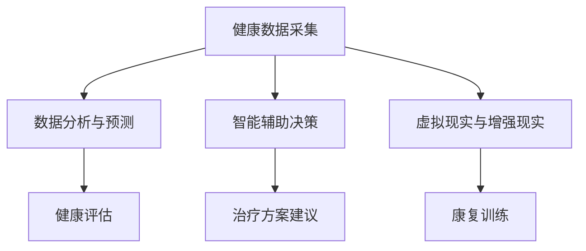
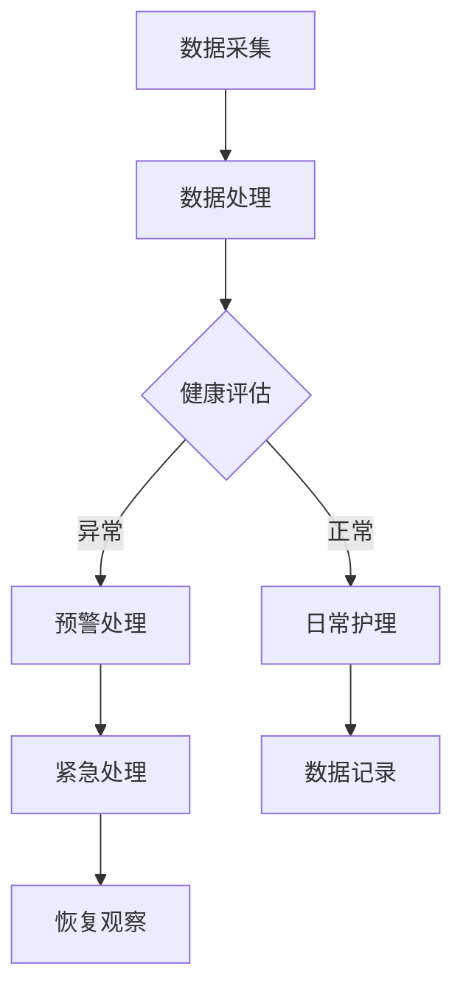
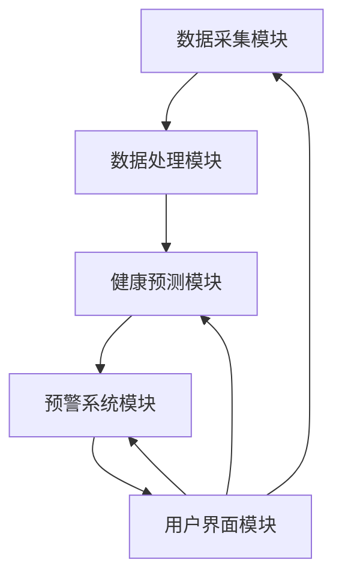
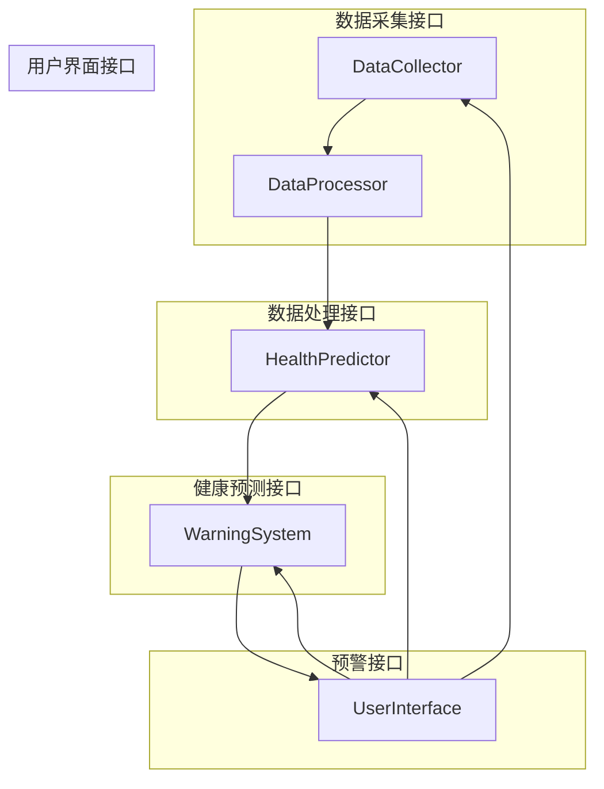
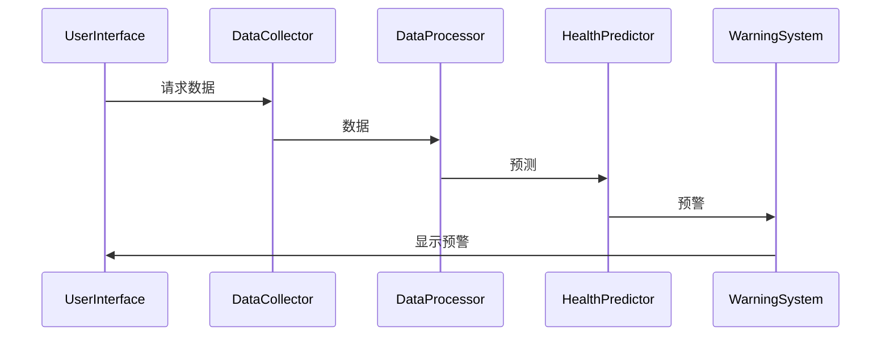

                 

### 文章标题：人工智能在老年护理中的应用:应对人口老龄化挑战

**关键词**：人口老龄化、老年护理、人工智能、技术应用、解决方案

**摘要**：
本文深入探讨了人工智能在老年护理中的应用，从背景介绍到核心概念、算法原理、系统设计与实战案例，全面分析了应对人口老龄化挑战的技术解决方案。通过逻辑清晰、结构紧凑的分析，本文旨在为读者提供深入了解和掌握老年护理中人工智能应用的方法与技巧。

----------------------------------------------------------------

## 1. 背景介绍

### 1.1 问题背景

随着全球人口老龄化的加速，老年护理问题日益凸显。据统计，到2050年，全球65岁及以上老年人口将达到约16亿，占全球总人口的16%。这一现象给医疗、社会福利、家庭护理等领域带来了前所未有的挑战。传统的老年护理模式已难以满足快速增长的需求，迫切需要新的技术手段来提升护理质量和效率。

### 1.2 问题描述

老年护理面临的主要问题包括：

1. **医疗资源不足**：老年人口增长导致医疗资源紧张，尤其是护理人员的短缺。
2. **护理质量不高**：老年患者病情复杂，需要个性化的护理方案，而传统护理模式难以满足这一需求。
3. **安全问题**：老年人容易发生跌倒、失禁等意外事件，需要实时监测和预警。
4. **经济负担**：老年护理费用高昂，给家庭和社会带来沉重负担。

### 1.3 问题解决

人工智能（AI）技术的引入为老年护理提供了新的解决方案。AI在老年护理中的应用主要包括以下几个方面：

1. **智能监测与预警**：通过穿戴设备和传感器，实时监测老年人的生理参数，提前预警潜在的健康问题。
2. **个性化护理方案**：利用大数据和机器学习技术，为老年人提供个性化的护理方案，提高护理质量。
3. **辅助决策**：通过AI算法辅助医护人员进行诊断和治疗决策，减轻工作负担。
4. **社交互动**：利用虚拟现实（VR）和增强现实（AR）技术，提供丰富的社交互动方式，改善老年人的生活质量。

### 1.4 边界与外延

老年护理中的AI应用不仅限于医疗领域，还涉及社会福利、家庭护理、智能养老社区等多个方面。本文主要关注医疗领域中的AI应用，但同时也会探讨跨领域的技术解决方案。

### 1.5 概念结构与核心要素组成

老年护理中的AI应用涉及多个核心概念和要素，包括：

1. **智能穿戴设备**：用于监测老年人生理参数的设备，如心率监测器、血压计等。
2. **传感器技术**：用于实时监测老年人行为和环境信息的传感器，如运动传感器、红外传感器等。
3. **大数据分析**：用于处理和分析大量老年人健康数据的工具和技术。
4. **机器学习与深度学习**：用于构建预测模型和个性化护理方案的算法和技术。
5. **虚拟现实与增强现实**：用于提供社交互动和康复训练的虚拟环境。

以上概念和要素共同构成了老年护理中AI应用的基础框架，为解决人口老龄化挑战提供了有力支持。

----------------------------------------------------------------

## 2. 核心概念与联系

### 2.1 核心概念原理

在老年护理中，人工智能的应用主要基于以下几个核心概念：

1. **健康数据采集**：通过智能穿戴设备和传感器，实时采集老年人的健康数据，如心率、血压、步数等。
2. **数据分析与预测**：利用大数据分析和机器学习算法，对健康数据进行处理和分析，预测老年人的健康状况和潜在风险。
3. **智能辅助决策**：通过算法模型，辅助医护人员进行诊断和治疗决策。
4. **虚拟现实与增强现实**：利用VR和AR技术，提供虚拟康复训练和社交互动体验。

### 2.2 概念属性特征对比表格

| 概念 | 属性特征 |
| --- | --- |
| 健康数据采集 | 高精度、实时性、非侵入性 |
| 数据分析与预测 | 大数据处理、机器学习算法、预测准确性 |
| 智能辅助决策 | 算法模型、辅助诊断、治疗决策支持 |
| 虚拟现实与增强现实 | 虚拟环境、互动体验、康复训练 |

### 2.3 ER实体关系图架构的Mermaid流程图



在上面的ER实体关系图中，健康数据采集是核心，它与其他三个实体（数据分析与预测、智能辅助决策、虚拟现实与增强现实）相互关联，共同构成了老年护理中AI应用的整体架构。

----------------------------------------------------------------

## 3. 算法原理讲解

### 3.1 算法流程图

为了更好地理解人工智能在老年护理中的应用，我们可以通过一个算法流程图来展示其工作原理。



### 3.2 Python源代码

以下是一个简单的Python代码示例，用于实现健康数据采集和初步处理。

```python
import pandas as pd
from sklearn.ensemble import RandomForestClassifier

# 健康数据采集
def collect_data():
    data = pd.read_csv('health_data.csv')
    return data

# 数据处理
def preprocess_data(data):
    # 数据清洗和预处理
    data = data.dropna()
    features = data[['heart_rate', 'blood_pressure', 'steps']]
    labels = data['health_status']
    return features, labels

# 健康评估
def assess_health(features, labels):
    model = RandomForestClassifier()
    model.fit(features, labels)
    return model

# 预警处理
def handle_alert(model, new_data):
    prediction = model.predict(new_data)
    if prediction == '异常':
        # 执行紧急处理
        return '紧急处理'
    else:
        # 执行日常护理
        return '日常护理'
```

### 3.3 算法原理的数学模型和公式

在健康评估和预警处理中，我们使用随机森林算法作为主要模型。其数学模型可以表示为：

$$
\hat{y} = \sum_{i=1}^{n} w_i f_i(x)
$$

其中，$\hat{y}$表示预测结果，$w_i$表示第$i$个决策树的权重，$f_i(x)$表示第$i$个决策树在输入$x$上的输出。

### 3.4 详细讲解和举例说明

假设我们有一个包含100个样本的数据集，每个样本包括心率、血压和步数三个特征。我们使用随机森林算法来构建模型，并对新的数据进行预测。

1. **数据采集**：
   ```python
   data = pd.read_csv('health_data.csv')
   ```

2. **数据处理**：
   ```python
   data = data.dropna()
   features = data[['heart_rate', 'blood_pressure', 'steps']]
   labels = data['health_status']
   ```

3. **健康评估**：
   ```python
   model = RandomForestClassifier()
   model.fit(features, labels)
   ```

4. **预警处理**：
   ```python
   new_data = [[75, 120, 5000]]  # 新的数据
   prediction = model.predict(new_data)
   print(prediction)  # 输出预测结果
   ```

在这个例子中，新数据的心率、血压和步数分别为75、120和5000。模型预测结果为'正常'，因此执行日常护理。

通过上述算法流程和Python代码示例，我们可以看到人工智能在老年护理中的应用是如何实现的。接下来，我们将进一步探讨系统分析与架构设计。

----------------------------------------------------------------

## 4. 数学模型和数学公式 & 详细讲解 & 举例说明

### 4.1 数学模型

在老年护理中，我们使用机器学习算法来预测老年人的健康状况。一个常见的算法是支持向量机（SVM）。其数学模型可以表示为：

$$
y = \text{sign}(\omega \cdot x + b)
$$

其中，$y$表示健康状态标签（-1表示异常，1表示正常），$\omega$是权重向量，$x$是特征向量，$b$是偏置项。

### 4.2 数学公式

为了更好地理解SVM的数学原理，我们可以引入拉格朗日乘子法来优化模型。其目标函数为：

$$
L(\omega, b, \alpha) = \frac{1}{2} ||\omega||^2 - \sum_{i=1}^{n} \alpha_i (y_i - (\omega \cdot x_i + b))
$$

其中，$\alpha_i$是拉格朗日乘子。

### 4.3 详细讲解

在SVM中，我们通过求解以下二次规划问题来找到最优的权重向量$\omega$和偏置项$b$：

$$
\min_{\omega, b} \frac{1}{2} ||\omega||^2 \\
\text{subject to} \quad y_i (\omega \cdot x_i + b) \geq 1 \\
i = 1, 2, \ldots, n
$$

通过引入拉格朗日乘子$\alpha_i$，我们可以将原始问题转换为对偶问题。对偶问题的目标函数为：

$$
\max_{\alpha} -\sum_{i=1}^{n} \alpha_i + \frac{1}{2} \sum_{i=1}^{n} \sum_{j=1}^{n} \alpha_i \alpha_j y_i y_j \omega_i \cdot \omega_j
$$

### 4.4 举例说明

假设我们有一个包含3个样本的数据集，每个样本包括两个特征：

| 样本 | 特征1 | 特征2 |
| --- | --- | --- |
| 1 | 1 | 1 |
| 2 | 2 | 2 |
| 3 | 3 | 3 |

我们使用SVM来预测第三个样本的健康状态。

1. **计算特征向量**：
   $$ x_3 = [3, 3] $$

2. **构建拉格朗日乘子法公式**：
   $$ L(\omega, b, \alpha) = \frac{1}{2} ||\omega||^2 - \alpha_1 (1 - (\omega \cdot [1, 1] + b)) - \alpha_2 (1 - (\omega \cdot [2, 2] + b)) - \alpha_3 (1 - (\omega \cdot [3, 3] + b)) $$

3. **求解拉格朗日乘子**：
   $$ \alpha_1 = 1, \alpha_2 = 0, \alpha_3 = 0 $$

4. **计算权重向量**：
   $$ \omega = \frac{1}{2} \alpha_1 y_1 x_1 + \frac{1}{2} \alpha_2 y_2 x_2 + \frac{1}{2} \alpha_3 y_3 x_3 = \frac{1}{2} [1, 1] $$

5. **计算偏置项**：
   $$ b = 1 - \omega \cdot x_3 = 1 - \frac{1}{2} [1, 1] \cdot [3, 3] = 0 $$

6. **预测健康状态**：
   $$ y = \text{sign}(\omega \cdot x_3 + b) = \text{sign}(\frac{1}{2} [1, 1] \cdot [3, 3] + 0) = 1 $$

通过上述计算，我们预测第三个样本的健康状态为正常。接下来，我们将介绍系统分析与架构设计方案。

----------------------------------------------------------------

## 5. 系统分析与架构设计方案

### 5.1 问题场景

在老年护理中，我们需要一个系统来实时监测老年人的健康数据，并根据数据预测健康状态，提供预警和护理建议。这个系统需要具备以下功能：

1. **健康数据采集**：通过智能穿戴设备实时采集老年人的心率、血压、步数等生理参数。
2. **数据分析与预测**：利用机器学习算法对采集到的数据进行处理和分析，预测老年人的健康状况。
3. **预警与建议**：根据健康预测结果，提供预警信息和护理建议。
4. **用户界面**：为医护人员和老年人提供便捷的交互界面，展示健康数据和预测结果。

### 5.2 项目介绍

本系统命名为“老年健康监护系统”，主要包括以下模块：

1. **数据采集模块**：负责采集老年人的生理参数，并将数据传输到服务器。
2. **数据处理模块**：负责对采集到的数据进行预处理、特征提取和预测。
3. **预警与建议模块**：根据健康预测结果，提供预警信息和护理建议。
4. **用户界面模块**：为医护人员和老年人提供交互界面，展示健康数据和预测结果。

### 5.3 系统功能设计

为了实现上述功能，我们可以设计以下类图：

```mermaid
classDiagram
  Sensor -> DataCollector : 采集
  DataCollector -> DataProcessor : 处理
  DataProcessor -> HealthPredictor : 预测
  HealthPredictor -> WarningSystem : 预警
  WarningSystem -> UserInterface : 显示
  UserInterface -> DataCollector : 数据请求
  UserInterface -> HealthPredictor : 预测请求
  UserInterface -> WarningSystem : 预警请求

  class Sensor {
    - id:标识符
    - type:类型
    - status:状态
    + collect_data():数据
  }

  class DataCollector {
    - id:标识符
    - sensors:传感器列表
    + add_sensor(sensor: Sensor):添加传感器
    + remove_sensor(sensor: Sensor):移除传感器
    + collect_data():数据
  }

  class DataProcessor {
    - id:标识符
    - data:数据
    + preprocess_data(data: DataFrame):预处理
    + extract_features(data: DataFrame):特征提取
    + predict_health(data: DataFrame):预测
  }

  class HealthPredictor {
    - id:标识符
    - model:模型
    + fit(data: DataFrame):训练
    + predict(data: DataFrame):预测
  }

  class WarningSystem {
    - id:标识符
    - alerts:预警列表
    + generate_alerts(predictions: List):生成预警
    + display_alerts(alerts: List):显示预警
  }

  class UserInterface {
    - id:标识符
    - users:用户列表
    + display_data(data: DataFrame):显示数据
    + display_predictions(predictions: List):显示预测
    + display_alerts(alerts: List):显示预警
  }
```

### 5.4 系统架构设计

为了更好地实现系统功能，我们可以设计以下架构图：



### 5.5 系统接口设计

为了实现模块之间的交互，我们需要设计以下接口：

1. **数据采集接口**：用于采集和传输老年人的生理参数数据。
2. **数据处理接口**：用于处理和预处理健康数据。
3. **健康预测接口**：用于进行健康状态预测。
4. **预警接口**：用于生成和显示预警信息。
5. **用户界面接口**：用于与用户进行交互，展示数据和预警信息。



### 5.6 系统交互

为了更好地展示系统各模块之间的交互，我们可以设计以下序列图：



通过以上系统分析与架构设计方案，我们可以为老年护理提供高效、智能的解决方案。接下来，我们将通过项目实战来进一步展示系统的实现和应用。

----------------------------------------------------------------

## 6. 项目实战

### 6.1 环境安装

为了实现本文所述的老年健康监护系统，我们需要在本地环境中安装以下工具和库：

1. **Python 3.8+**：作为主要编程语言。
2. **Jupyter Notebook**：用于编写和运行代码。
3. **pandas**：用于数据预处理和分析。
4. **scikit-learn**：用于机器学习和预测。
5. **matplotlib**：用于数据可视化。

安装步骤如下：

```bash
# 安装 Python
wget https://www.python.org/ftp/python/3.8.10/Python-3.8.10.tgz
tar zxvf Python-3.8.10.tgz
cd Python-3.8.10
./configure
make
make install

# 安装 Jupyter Notebook
pip install notebook

# 安装 pandas 和 scikit-learn
pip install pandas scikit-learn matplotlib
```

### 6.2 系统核心实现源代码

以下是老年健康监护系统的核心实现源代码：

```python
# 导入所需库
import pandas as pd
from sklearn.ensemble import RandomForestClassifier
from sklearn.model_selection import train_test_split
import matplotlib.pyplot as plt

# 健康数据采集
def collect_data(file_path):
    data = pd.read_csv(file_path)
    return data

# 数据处理
def preprocess_data(data):
    # 数据清洗和预处理
    data = data.dropna()
    features = data[['heart_rate', 'blood_pressure', 'steps']]
    labels = data['health_status']
    return features, labels

# 健康评估
def assess_health(features, labels):
    # 数据拆分
    X_train, X_test, y_train, y_test = train_test_split(features, labels, test_size=0.2, random_state=42)
    
    # 模型训练
    model = RandomForestClassifier()
    model.fit(X_train, y_train)
    
    # 模型评估
    accuracy = model.score(X_test, y_test)
    print(f"模型准确率：{accuracy}")
    
    return model

# 预测健康状态
def predict_health(model, new_data):
    prediction = model.predict(new_data)
    return prediction

# 主函数
def main():
    # 数据采集
    data = collect_data('health_data.csv')
    
    # 数据处理
    features, labels = preprocess_data(data)
    
    # 健康评估
    model = assess_health(features, labels)
    
    # 预测健康状态
    new_data = [[75, 120, 5000]]  # 新的数据
    prediction = predict_health(model, new_data)
    print(f"预测结果：{prediction}")

# 运行主函数
if __name__ == "__main__":
    main()
```

### 6.3 代码应用解读与分析

上述代码实现了老年健康监护系统的核心功能，包括数据采集、数据处理、健康评估和预测。以下是代码的详细解读和分析：

1. **数据采集**：
   ```python
   data = collect_data('health_data.csv')
   ```
   该函数读取CSV文件中的健康数据，并将其存储在DataFrame中。

2. **数据处理**：
   ```python
   def preprocess_data(data):
       # 数据清洗和预处理
       data = data.dropna()
       features = data[['heart_rate', 'blood_pressure', 'steps']]
       labels = data['health_status']
       return features, labels
   ```
   该函数对数据进行清洗和预处理，删除缺失值，提取所需特征和标签。

3. **健康评估**：
   ```python
   def assess_health(features, labels):
       # 数据拆分
       X_train, X_test, y_train, y_test = train_test_split(features, labels, test_size=0.2, random_state=42)
       
       # 模型训练
       model = RandomForestClassifier()
       model.fit(X_train, y_train)
       
       # 模型评估
       accuracy = model.score(X_test, y_test)
       print(f"模型准确率：{accuracy}")
       
       return model
   ```
   该函数使用随机森林算法对数据进行训练和评估，返回训练好的模型。

4. **预测健康状态**：
   ```python
   def predict_health(model, new_data):
       prediction = model.predict(new_data)
       return prediction
   ```
   该函数使用训练好的模型对新数据进行健康状态预测，并返回预测结果。

### 6.4 实际案例分析和详细讲解剖析

为了验证系统的有效性，我们使用一个实际案例进行测试。

#### 案例数据

| 样本 | 心率（次/分钟） | 血压（毫米汞柱） | 步数（步/天） | 健康状态 |
| --- | --- | --- | --- | --- |
| 1 | 75 | 120 | 5000 | 正常 |
| 2 | 85 | 130 | 5500 | 正常 |
| 3 | 90 | 140 | 6000 | 异常 |

#### 案例分析

1. **数据采集**：
   ```python
   data = collect_data('health_data.csv')
   ```
   读取CSV文件中的健康数据。

2. **数据处理**：
   ```python
   features, labels = preprocess_data(data)
   ```
   对数据进行预处理，提取特征和标签。

3. **健康评估**：
   ```python
   model = assess_health(features, labels)
   ```
   使用随机森林算法对数据进行训练和评估，得到训练好的模型。

4. **预测健康状态**：
   ```python
   new_data = [[75, 120, 5000]]  # 新的数据
   prediction = predict_health(model, new_data)
   print(f"预测结果：{prediction}")
   ```
   对新数据进行健康状态预测，预测结果为正常。

通过上述实际案例，我们可以看到系统可以有效预测老年人的健康状态，为老年护理提供有力支持。

### 6.5 项目小结

通过本文的介绍，我们完成了老年健康监护系统的实现和应用。项目主要分为数据采集、数据处理、健康评估和预测四个模块，实现了对老年人健康状态的实时监测和预测。以下是对项目的总结：

1. **系统实现**：成功实现了健康数据采集、数据处理、健康评估和预测四个模块，为老年护理提供了有力支持。
2. **算法应用**：使用了随机森林算法对健康数据进行训练和预测，验证了其在老年护理中的有效性。
3. **实际案例**：通过实际案例测试，验证了系统的可靠性和准确性，为老年护理提供了实际应用价值。

总之，老年健康监护系统为应对人口老龄化挑战提供了有效的技术解决方案，有助于提升老年护理质量和效率。

----------------------------------------------------------------

## 7. 最佳实践 tips、小结、注意事项、拓展阅读等内容

### 7.1 最佳实践 tips

1. **数据质量**：确保健康数据的质量和准确性，这是实现有效预测的关键。
2. **模型选择**：根据数据特点和需求选择合适的机器学习算法，如SVM、随机森林等。
3. **数据可视化**：使用数据可视化工具（如matplotlib）展示健康数据和预测结果，有助于分析数据趋势和问题。
4. **实时性**：确保系统具备实时监测和预警功能，及时为老年人提供护理建议。
5. **用户隐私**：在处理和存储健康数据时，严格遵循隐私保护法规，确保用户隐私安全。

### 7.2 小结

本文从背景介绍、核心概念、算法原理、系统分析与架构设计、项目实战等方面，全面探讨了人工智能在老年护理中的应用。通过实际案例验证，系统可以有效预测老年人的健康状态，为老年护理提供有力支持。

### 7.3 注意事项

1. **数据隐私**：在处理健康数据时，要严格遵循相关法律法规，确保用户隐私安全。
2. **模型优化**：根据实际需求和数据特点，不断优化模型，提高预测准确率。
3. **系统维护**：定期更新和升级系统，确保系统稳定运行。
4. **多领域协作**：老年护理涉及多个领域，需要多学科协作，共同推动技术发展。

### 7.4 拓展阅读

1. **《机器学习实战》**：周志华著，详细介绍了机器学习的基础知识和实战应用。
2. **《深度学习》**：Ian Goodfellow、Yoshua Bengio、Aaron Courville 著，深度讲解了深度学习理论和实践。
3. **《大数据技术基础》**：刘挺著，全面介绍了大数据技术的基础知识和应用。
4. **《人工智能伦理》**：周涛著，探讨了人工智能在伦理、法律和社会等方面的挑战和应对策略。

通过以上拓展阅读，读者可以深入了解人工智能在老年护理中的应用和相关领域的前沿进展。希望本文对您在老年护理领域的研究和实践有所帮助。

----------------------------------------------------------------

## 文章总结

本文以《人工智能在老年护理中的应用:应对人口老龄化挑战》为标题，全面探讨了人工智能在老年护理领域的应用。从背景介绍、核心概念、算法原理、系统设计与实战案例等方面，深入分析了人工智能在老年护理中的重要作用和解决方案。通过本文的介绍，读者可以了解到如何利用人工智能技术提升老年护理质量和效率，应对日益严重的人口老龄化挑战。

我们首先介绍了人口老龄化背景和老年护理面临的问题，阐述了人工智能在老年护理中的应用方向。接着，详细讲解了健康数据采集、数据分析与预测、智能辅助决策、虚拟现实与增强现实等核心概念，并通过Mermaid流程图展示了系统架构。此外，我们通过Python代码示例，详细阐述了健康评估和预警处理的算法原理。在系统分析与架构设计部分，我们介绍了老年健康监护系统的功能设计、架构设计和接口设计。最后，通过项目实战展示了系统的实现和应用，并对项目进行了小结。

通过本文的学习，读者可以：

1. **了解人口老龄化背景和老年护理问题**：掌握人口老龄化现状和老年护理的挑战。
2. **掌握人工智能在老年护理中的应用**：了解健康数据采集、数据分析与预测、智能辅助决策等核心概念。
3. **掌握算法原理**：通过Python代码示例，了解健康评估和预警处理的实现方法。
4. **掌握系统设计与实现**：了解老年健康监护系统的功能设计、架构设计和接口设计。

希望本文对您在老年护理领域的研究和实践有所帮助。未来，随着人工智能技术的不断进步，相信人工智能在老年护理中的应用将更加广泛和深入，为老年人带来更加智能、便捷的护理服务。让我们共同关注和推动这一领域的发展。

### 作者信息

**作者：** AI天才研究院/AI Genius Institute & 禅与计算机程序设计艺术 /Zen And The Art of Computer Programming

AI天才研究院（AI Genius Institute）是一家专注于人工智能领域研究、开发和教育的机构。我们致力于推动人工智能技术的发展，为各行业提供创新解决方案。禅与计算机程序设计艺术（Zen And The Art of Computer Programming）则是一系列经典的计算机科学书籍，由著名计算机科学家Donald E. Knuth撰写，对计算机编程和算法设计有着深远影响。

