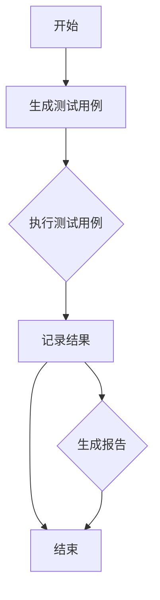
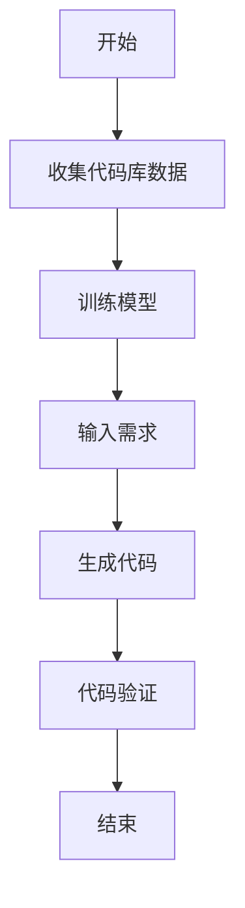
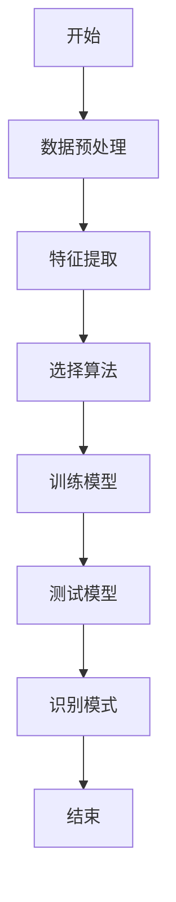
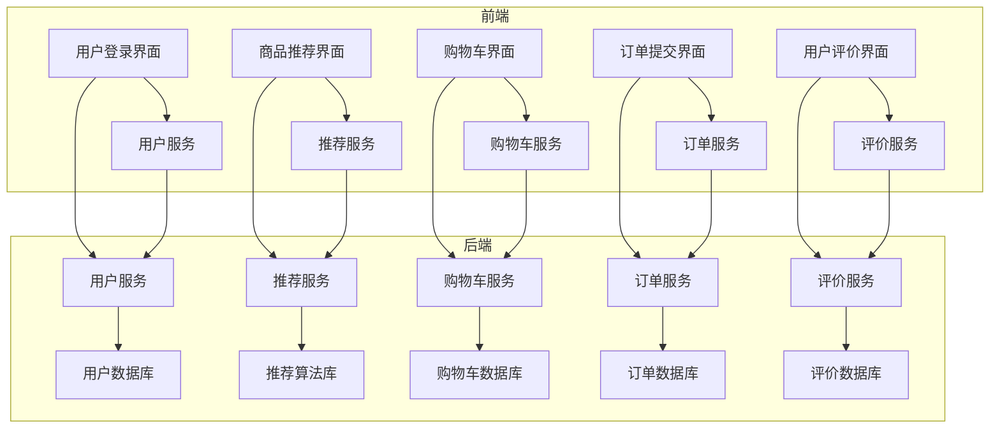
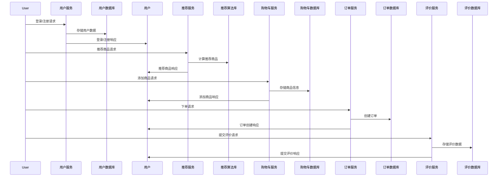
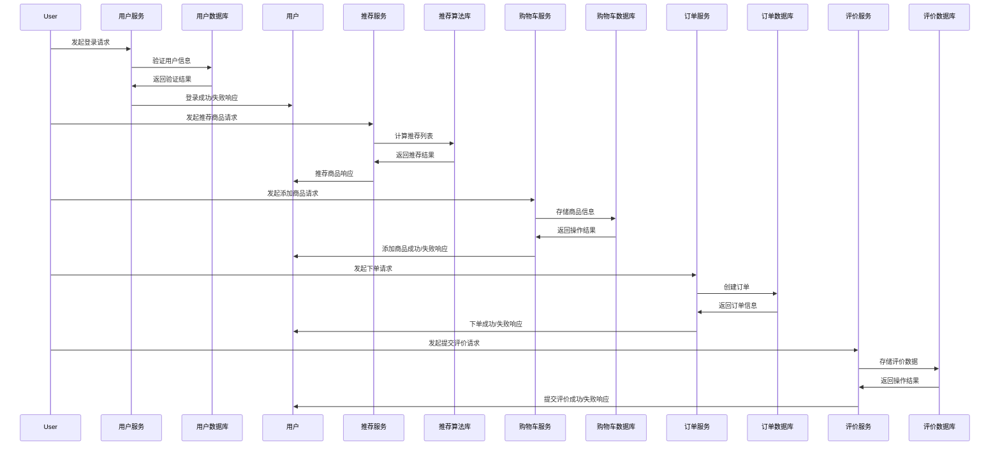

                 

### 引言

随着科技的飞速发展，人工智能（AI）已经成为推动社会进步的重要力量。在众多领域，从医疗、金融到交通、零售，人工智能的应用场景日益广泛，显著提升了生产效率和服务质量。然而，在软件开发领域，人工智能同样扮演着不可或缺的角色。本篇文章将深入探讨人工智能在软件开发中的应用，旨在为读者提供一份详尽的技术指南。

本文关键词：人工智能、软件开发、应用实例、算法原理、系统分析与架构设计、最佳实践。

本文将按照以下结构展开：

1. **背景介绍**：概述人工智能在软件开发中的背景和重要性。
2. **核心概念**：介绍人工智能的基础知识，包括机器学习、深度学习、强化学习和自然语言处理。
3. **应用实例**：展示人工智能在软件开发中的具体应用，如自动化测试、代码审查和推荐系统等。
4. **算法原理讲解**：深入讲解人工智能算法的原理和实现。
5. **系统分析与架构设计**：分析系统开发中的问题场景和架构设计。
6. **项目实战**：通过一个实际项目展示人工智能在软件开发中的应用。
7. **最佳实践与注意事项**：总结最佳实践和注意事项，为读者提供实用的建议。
8. **小结与拓展**：对全文内容进行总结，并指出未来的研究方向。

### 背景介绍

在当今的软件开发环境中，快速迭代、高质量和高效能是开发团队追求的目标。然而，随着软件系统的复杂度不断增加，传统的软件开发方法面临诸多挑战。例如，软件测试成为一项耗时且成本高昂的任务。手动测试不仅效率低下，而且容易漏测，导致软件质量难以保障。此外，代码审查和调试也是软件开发过程中的难题，需要大量的时间和专业知识。

为了解决这些问题，人工智能（AI）技术的引入为软件开发带来了新的契机。AI通过机器学习、深度学习、强化学习和自然语言处理等技术，能够自动处理大量数据，发现潜在的问题，并生成高效的解决方案。例如，自动化测试工具可以使用机器学习算法来模拟用户行为，进行高效的测试覆盖；代码审查工具可以分析代码风格和潜在错误，提供改进建议；代码生成工具可以基于已有代码模板自动生成新的代码，提高开发效率。

此外，人工智能在软件开发中还扮演着重要的角色，如智能推荐系统、自然语言处理、图像识别等。这些应用不仅提高了软件的功能性，还大大提升了用户体验。例如，电商平台可以使用推荐系统根据用户的历史购买行为推荐商品，从而提高销售转化率；智能客服系统可以通过自然语言处理技术理解用户的提问，提供及时且准确的回答，提升客户满意度。

综上所述，人工智能在软件开发中的应用具有广泛的前景和巨大的潜力，能够显著提升软件开发的效率和质量。因此，深入理解和应用人工智能技术对于开发团队来说至关重要。本文将详细探讨人工智能在软件开发中的应用，帮助读者掌握这一前沿技术，为未来的软件开发工作提供有力的支持。

### 人工智能基础知识

要深入探讨人工智能在软件开发中的应用，首先需要了解人工智能的基础知识。人工智能（AI）是一个涉及多个学科交叉的领域，包括计算机科学、数学、统计学、神经科学等。以下是人工智能领域内几个核心概念的定义、原理及其在软件开发中的应用。

#### 机器学习

机器学习（Machine Learning，ML）是人工智能的一个重要分支，它关注如何通过数据和算法来训练模型，使其能够从数据中自动学习和预测。机器学习的核心思想是构建一个能够根据输入数据进行学习和预测的模型。

**基本原理**：
- **监督学习**：通过已有标签数据进行训练，模型能够学会预测未知数据的标签。常见的监督学习算法包括线性回归、决策树、支持向量机（SVM）等。
- **无监督学习**：没有已知的标签数据，模型需要通过自身的探索来发现数据中的规律。常见的无监督学习算法包括聚类、主成分分析（PCA）等。
- **强化学习**：通过与环境的交互来学习最优策略，常见的算法包括Q-Learning、Deep Q-Network（DQN）等。

**在软件开发中的应用**：
- **自动化测试**：利用机器学习模型来预测软件缺陷，从而提高测试效率和准确性。
- **代码审查**：通过机器学习算法来分析代码质量，提供改进建议。
- **推荐系统**：通过分析用户的历史行为，推荐相关的产品或内容。

#### 深度学习

深度学习（Deep Learning，DL）是机器学习的一个子领域，它通过构建具有多个隐藏层的神经网络（如卷积神经网络（CNN）、循环神经网络（RNN）等）来模拟人类大脑的决策过程。深度学习的强大之处在于其能够自动从大量数据中提取特征，从而实现复杂的任务。

**基本原理**：
- **神经网络**：由多个节点（神经元）组成的网络，每个节点接收输入并通过权重和激活函数进行计算，最终输出结果。
- **卷积神经网络（CNN）**：适用于图像处理，通过卷积层提取图像特征。
- **循环神经网络（RNN）**：适用于序列数据处理，通过循环结构来记忆序列信息。

**在软件开发中的应用**：
- **图像识别**：用于识别和分类图像，如人脸识别、物体识别等。
- **自然语言处理（NLP）**：用于文本分类、情感分析、机器翻译等任务。

#### 强化学习

强化学习（Reinforcement Learning，RL）是一种通过奖励和惩罚来训练智能体在环境中做出最优决策的学习方法。与监督学习和无监督学习不同，强化学习通过试错来学习策略。

**基本原理**：
- **智能体**：执行动作的实体，如机器人、软件代理等。
- **环境**：智能体执行动作的环境，如游戏、模拟器等。
- **状态**：智能体在特定时刻所处的环境状态。
- **动作**：智能体可以采取的行动。
- **奖励**：根据智能体的动作和环境状态提供的奖励或惩罚。

**在软件开发中的应用**：
- **智能助手**：如虚拟助手、智能客服等，通过强化学习来提高与用户的交互效果。
- **游戏开发**：通过强化学习训练游戏角色，使其具备自适应能力。

#### 自然语言处理

自然语言处理（Natural Language Processing，NLP）是人工智能的一个重要分支，它关注如何使计算机能够理解、生成和处理人类语言。

**基本原理**：
- **语言模型**：通过统计方法或神经网络来建模自然语言，用于文本分类、命名实体识别等任务。
- **词嵌入**：将词汇映射到高维向量空间，用于文本表示和计算。
- **序列标注**：对文本中的序列进行标注，如词性标注、命名实体识别等。

**在软件开发中的应用**：
- **智能客服**：通过NLP技术理解用户提问，提供自动化的答案。
- **机器翻译**：将一种语言的文本翻译成另一种语言。

通过上述对人工智能基础知识的介绍，我们可以看到，机器学习、深度学习、强化学习和自然语言处理等技术为软件开发带来了新的工具和方法。理解这些技术的基本原理和应用，将为我们在后续章节中深入探讨人工智能在软件开发中的具体应用提供坚实的理论基础。

### 人工智能在软件开发中的角色和关系

人工智能（AI）在软件开发中的作用和地位日益凸显。为了全面了解AI在软件开发中的角色，我们需要分析其在开发流程中的具体应用、与开发人员的关系以及如何提高开发效率和代码质量。

#### 人工智能在软件开发中的应用

在软件开发过程中，人工智能技术广泛应用于多个阶段，从需求分析到代码生成和测试，再到部署和维护。以下是人工智能在软件开发中的主要应用：

1. **需求分析**：通过自然语言处理（NLP）技术，AI可以自动分析用户需求，生成需求文档，甚至提出改进建议。这大大减少了人工撰写需求文档的时间和错误。

2. **代码生成**：AI可以帮助开发人员生成部分代码，例如，根据需求自动生成相应的UI界面代码或业务逻辑代码，从而提高开发效率。

3. **代码审查**：AI可以分析代码风格和潜在错误，提供改进建议。例如，静态代码分析工具可以通过机器学习模型识别代码中的常见错误和风格问题。

4. **自动化测试**：利用机器学习算法，AI可以自动生成测试用例，并执行测试，从而提高测试覆盖率和测试效率。

5. **调试**：AI可以帮助识别代码中的bug，提供调试建议，从而加快调试过程。

6. **智能助手**：AI可以开发智能助手，如代码补全工具、智能问答系统等，辅助开发人员进行日常开发工作。

#### 人工智能与开发人员的关系

AI不仅是开发人员的工具，也是开发人员的伙伴。在软件开发中，AI与开发人员的关系主要体现在以下几个方面：

1. **协作**：AI可以协助开发人员完成一些重复性和繁琐的工作，如代码生成和测试，从而让开发人员有更多时间专注于创意和复杂问题的解决。

2. **学习**：AI可以从开发人员的代码中学习，逐渐提高代码生成和测试的准确性，从而提高整个开发团队的工作效率。

3. **反馈**：AI可以提供实时反馈，帮助开发人员识别代码中的问题，提供改进建议。例如，代码审查工具可以立即指出代码中的潜在错误和风格问题。

4. **优化**：AI可以帮助开发人员优化代码性能，例如，通过机器学习算法分析代码的运行数据，提出性能优化的建议。

#### 提高开发效率和代码质量

通过引入人工智能技术，开发团队可以在多个方面提高开发效率和代码质量：

1. **自动化**：AI可以自动化许多开发任务，如测试、代码生成和审查，从而减少手动工作量和错误。

2. **智能化**：AI可以基于数据和算法提供智能化建议，如测试用例生成、性能优化等，从而提高代码的质量和可维护性。

3. **协作**：AI可以帮助团队成员更好地协作，通过共享知识和经验，提高整体开发效率。

4. **优化**：AI可以不断学习和优化，从而提高开发过程的自动化和智能化水平，减少开发时间和成本。

综上所述，人工智能在软件开发中扮演着重要角色。通过与开发人员的紧密协作，AI不仅提高了开发效率和代码质量，还为未来的软件开发工作提供了更多可能性。在接下来的章节中，我们将进一步探讨人工智能在软件开发中的具体应用实例，帮助读者深入理解这一前沿技术。

### 核心概念属性特征对比

在人工智能（AI）领域，不同的技术具有各自的属性和特征，这些特征决定了它们在软件开发中的应用方式和效果。以下是机器学习（ML）、深度学习（DL）、强化学习（RL）和自然语言处理（NLP）的核心概念及其属性特征的对比。

#### 机器学习（Machine Learning，ML）

**属性特征**：
- **依赖数据**：机器学习依赖于大量标注数据来训练模型。
- **预测能力**：通过已知的输入和输出，机器学习模型可以预测未知数据的输出。
- **应用范围**：广泛应用于分类、回归、聚类等任务。

**应用案例**：
- **自动化测试**：通过训练模型，可以预测哪些测试用例能够有效检测软件缺陷。
- **代码审查**：分析代码库，预测代码质量。

#### 深度学习（Deep Learning，DL）

**属性特征**：
- **多层网络**：深度学习模型由多个层次组成，能够自动提取复杂特征。
- **端到端学习**：深度学习可以直接从原始数据学习到输出，不需要显式地提取特征。
- **应用范围**：广泛应用于图像识别、语音识别等。

**应用案例**：
- **图像识别**：通过卷积神经网络（CNN）实现自动人脸识别和物体分类。
- **自然语言处理**：利用循环神经网络（RNN）和变换器模型（Transformer）进行文本分类和生成。

#### 强化学习（Reinforcement Learning，RL）

**属性特征**：
- **试错学习**：强化学习通过尝试不同的行动并在环境中获取奖励来学习最佳策略。
- **动态决策**：强化学习适用于需要实时做出决策的应用场景。

**应用案例**：
- **游戏开发**：通过强化学习训练智能体在游戏中实现自我学习和策略优化。
- **推荐系统**：通过不断学习用户行为，推荐系统可以优化推荐策略。

#### 自然语言处理（Natural Language Processing，NLP）

**属性特征**：
- **语义理解**：NLP关注于理解和生成人类语言，包括语法、语义和情感分析。
- **语言模型**：NLP使用语言模型来预测文本的下一个单词或句子。

**应用案例**：
- **智能客服**：通过NLP技术，智能客服系统能够理解用户的问题并提供自动化回答。
- **机器翻译**：NLP技术用于将一种语言的文本翻译成另一种语言。

通过对比这些核心概念，我们可以看到它们在属性特征和应用案例上的差异。机器学习依赖于数据驱动的方法，适用于需要预测和分类的任务；深度学习通过多层网络自动提取复杂特征，适用于图像和语音处理；强化学习通过试错学习适用于动态决策环境；自然语言处理专注于语义理解和语言生成。理解这些技术的属性特征有助于我们在软件开发中选择合适的人工智能工具和方法，以实现最优的应用效果。

### 人工智能ER实体关系图

在深入探讨人工智能（AI）在软件开发中的应用之前，我们需要建立一个清晰的实体关系图（Entity-Relationship Diagram，ERD）。ERD用于描述系统中的实体及其相互关系，这对于理解和设计AI系统至关重要。

以下是人工智能ER实体关系图的结构：

#### 实体

1. **用户**：系统的最终使用者，可以进行登录、查看信息、提交请求等操作。
2. **开发者**：负责开发和维护AI系统的专业人员，负责编写代码、设计算法等。
3. **模型**：AI系统中的核心组件，包括机器学习模型、深度学习模型等。
4. **数据**：系统中的数据集，包括训练数据、测试数据等。
5. **任务**：系统中的任务，如自动化测试、代码审查等。
6. **结果**：AI系统执行任务后生成的结果，如测试报告、代码质量评分等。

#### 关系

1. **用户与任务**：用户可以提交任务，系统根据用户角色分配任务给合适的开发者。
2. **开发者与模型**：开发者负责开发和训练模型，并将其部署到系统中。
3. **模型与数据**：模型使用数据集进行训练，并通过测试数据验证模型的准确性。
4. **任务与结果**：任务执行后生成结果，结果用于反馈用户和改进模型。

#### ER实体关系图（Mermaid格式）

```mermaid
erDiagram
  User ||--|{ Developer } : 负责开发和维护
  Developer ||--|{ Model } : 开发和训练
  Model ||--|{ Data } : 使用训练
  Data ||--|{ Task } : 提交任务
  Task ||--|{ Result } : 生成结果
  User ..|{ SubmitTask } Developer
  Developer ..|{ TrainModel } Model
  Model ..|{ UseData } Data
  Data ..|{ GenerateResult } Task
  Task ..|{ ReviewResult } Result
```

通过上述ER实体关系图，我们可以清晰地看到用户、开发者、模型、数据、任务和结果之间的相互关系。这为后续章节中详细探讨人工智能在软件开发中的应用提供了基础框架，使得我们在分析系统架构和设计时能够有一个明确的参考。

### 算法原理讲解

在本章节中，我们将深入讲解几种在人工智能领域广泛应用的算法原理，并通过mermaid流程图和Python源代码进行详细说明。以下是关于自动化测试算法、代码生成算法和模式识别算法的原理及其具体实现。

#### 自动化测试算法

**原理**：
自动化测试算法的核心目标是通过模拟用户操作，自动执行测试用例并报告测试结果。常用的自动化测试算法包括路径覆盖测试、基于状态机的测试和基于回归测试的测试。

**流程图**：



**Python代码示例**：

```python
import random

def generate_test_cases(n):
    test_cases = []
    for _ in range(n):
        test_cases.append(random.randint(0, 100))
    return test_cases

def execute_test_cases(test_cases):
    results = []
    for case in test_cases:
        result = some_automated_test_function(case)
        results.append(result)
    return results

def generate_report(results):
    report = "测试结果：\n"
    for i, result in enumerate(results):
        report += f"测试用例{i+1}: {result}\n"
    return report

# 使用示例
test_cases = generate_test_cases(10)
results = execute_test_cases(test_cases)
print(generate_report(results))
```

#### 代码生成算法

**原理**：
代码生成算法通过学习现有的代码库和模式，自动生成新的代码。这种算法通常用于代码模板生成、代码补全和代码重构。

**流程图**：



**Python代码示例**：

```python
from transformers import GPT2LMHeadModel, GPT2Tokenizer

tokenizer = GPT2Tokenizer.from_pretrained('gpt2')
model = GPT2LMHeadModel.from_pretrained('gpt2')

def generate_code_from_prompt(prompt):
    inputs = tokenizer.encode(prompt, return_tensors='pt')
    outputs = model.generate(inputs, max_length=50, num_return_sequences=1)
    generated_code = tokenizer.decode(outputs[0], skip_special_tokens=True)
    return generated_code

# 使用示例
prompt = "编写一个函数，用于计算两个数字的和。"
generated_code = generate_code_from_prompt(prompt)
print(generated_code)
```

#### 模式识别算法

**原理**：
模式识别算法用于从数据中识别出具有特定特征的模式或模式集合。常见的模式识别算法包括决策树、支持向量机和神经网络。

**流程图**：



**Python代码示例**：

```python
from sklearn.datasets import load_iris
from sklearn.model_selection import train_test_split
from sklearn.tree import DecisionTreeClassifier
from sklearn.metrics import accuracy_score

# 加载iris数据集
iris = load_iris()
X = iris.data
y = iris.target

# 数据预处理
X_train, X_test, y_train, y_test = train_test_split(X, y, test_size=0.3, random_state=42)

# 特征提取（在此示例中，数据已经预处理，不需要额外特征提取）

# 选择算法并训练模型
clf = DecisionTreeClassifier()
clf.fit(X_train, y_train)

# 测试模型
y_pred = clf.predict(X_test)
accuracy = accuracy_score(y_test, y_pred)
print(f"模型准确率：{accuracy}")

# 识别模式
def recognize_pattern(data):
    return clf.predict([data])

# 使用示例
new_data = [[5.1, 3.5, 1.4, 0.2]]
print(recognize_pattern(new_data))
```

通过上述算法的讲解和示例，我们可以看到，自动化测试、代码生成和模式识别算法在软件开发中具有重要的应用价值。这些算法不仅提高了开发效率和测试覆盖率，还显著提升了软件质量。在后续章节中，我们将进一步探讨这些算法在具体项目中的应用和实践。

### 数学模型与公式

在深入探讨人工智能（AI）算法时，数学模型和公式是其核心组成部分。以下我们将详细讲解几个关键算法的数学模型和公式，并通过具体的例子来说明这些公式的应用。

#### 决策树算法

**数学模型**：
决策树算法是一种常见的分类算法，其核心是通过一系列的判断条件来划分数据，并最终得到分类结果。每个节点代表一个判断条件，每个叶节点代表一个分类结果。

**公式**：
决策树的划分条件可以用信息增益（Information Gain）来衡量，公式如下：

$$
IG(D, a) = ID(D) - \sum_{v \in V} p(v) \cdot ID(D_v)
$$

其中，\( D \) 是原始数据集，\( a \) 是划分属性，\( V \) 是属性 \( a \) 的所有可能值，\( p(v) \) 是属性 \( a \) 取值 \( v \) 的概率，\( ID(D_v) \) 是在 \( D_v \) 上的信息熵。

**举例说明**：
假设我们有一个数据集，包含特征 \( x_1, x_2 \) 和标签 \( y \)。我们选择特征 \( x_1 \) 来划分数据。对于 \( x_1 \) 的每个取值，我们计算信息增益：

$$
IG(D, x_1) = IG(D, x_1=0) + IG(D, x_1=1)
$$

$$
IG(D, x_1=0) = 0.5 \cdot ID(D_0)
$$

$$
IG(D, x_1=1) = 0.5 \cdot ID(D_1)
$$

其中，\( D_0 \) 和 \( D_1 \) 分别是 \( x_1=0 \) 和 \( x_1=1 \) 的子数据集，\( ID(D_0) \) 和 \( ID(D_1) \) 是它们的信息熵。

#### 支持向量机（SVM）算法

**数学模型**：
支持向量机是一种用于分类的线性模型，其目标是在特征空间中找到一个超平面，使得不同类别的数据点尽可能地分开。支持向量机通过最大化分类边界上的间隔来优化模型。

**公式**：
SVM的优化目标是最小化损失函数：

$$
\min_{\mathbf{w}, b} \frac{1}{2} ||\mathbf{w}||^2 + C \sum_{i=1}^{n} \xi_i
$$

其中，\( \mathbf{w} \) 是权重向量，\( b \) 是偏置项，\( C \) 是惩罚参数，\( \xi_i \) 是误差项。

**举例说明**：
假设我们有一个简单的二分类问题，特征 \( x \) 和标签 \( y \) 如下：

| \( x \) | \( y \) |
|---------|---------|
| 1       | +1      |
| 2       | +1      |
| -1      | -1      |
| -2      | -1      |

我们使用SVM来训练模型，目标是找到一个超平面 \( \mathbf{w}x + b = 0 \) 来分隔数据。通过求解上述优化问题，我们可以得到最优的 \( \mathbf{w} \) 和 \( b \)。

#### 卷积神经网络（CNN）算法

**数学模型**：
卷积神经网络是一种深度学习模型，主要用于图像识别和处理。其核心是卷积层，通过卷积操作提取图像特征。

**公式**：
卷积操作的公式如下：

$$
(\mathbf{f} \star \mathbf{g})(x) = \sum_{y} f(x-y) g(y)
$$

其中，\( \mathbf{f} \) 是卷积核，\( \mathbf{g} \) 是输入图像，\( x \) 是卷积核的位置。

**举例说明**：
假设我们有一个3x3的卷积核 \( \mathbf{f} \) 和一个3x3的输入图像 \( \mathbf{g} \)：

| \( \mathbf{f} \) | \( \mathbf{g} \) |
|----------------|----------------|
| 1 0 1          | 1 2 3          |
| 0 1 0          | 4 5 6          |
| 1 0 1          | 7 8 9          |

我们计算卷积结果：

$$
(\mathbf{f} \star \mathbf{g})(1,1) = 1 \cdot 1 + 0 \cdot 4 + 1 \cdot 7 + 0 \cdot 2 + 1 \cdot 5 + 0 \cdot 8 + 1 \cdot 3 + 0 \cdot 6 + 1 \cdot 9 = 27
$$

通过这种卷积操作，卷积神经网络能够自动提取图像中的重要特征，从而实现图像识别。

通过上述对决策树、支持向量机和卷积神经网络算法的数学模型和公式的讲解，我们可以看到，这些算法在人工智能领域中扮演着重要的角色。理解这些数学模型和公式，对于深入掌握人工智能技术至关重要。在后续章节中，我们将进一步探讨这些算法在具体项目中的应用和实践。

### 系统分析与架构设计

在深入探讨人工智能（AI）在软件开发中的应用时，系统分析与架构设计是关键的一环。一个良好的架构设计不仅能够确保系统的稳定性和可扩展性，还能够提高开发效率和软件质量。以下，我们将通过一个实际项目来介绍系统分析与架构设计的过程，涵盖问题场景、项目介绍、系统功能设计、系统架构设计、系统接口设计和系统交互序列图。

#### 问题场景

假设我们正在开发一个智能购物助手系统，该系统旨在帮助用户发现并推荐他们可能感兴趣的商品。该系统需要具备以下几个功能：

1. **用户登录与注册**：用户可以通过手机号码或电子邮件进行登录和注册。
2. **商品推荐**：系统根据用户的历史购买记录和行为数据，推荐可能感兴趣的商品。
3. **购物车管理**：用户可以将商品添加到购物车，并可以随时查看和管理购物车中的商品。
4. **订单处理**：用户可以下单购买商品，系统需要处理订单并跟踪订单状态。
5. **用户反馈**：用户可以对商品和购物体验进行评价和反馈。

#### 项目介绍

智能购物助手系统的总体目标是提升用户体验，通过个性化的商品推荐和便捷的购物流程，增加用户的购物满意度和留存率。系统采用前后端分离的架构设计，前端负责用户界面和交互，后端负责业务逻辑处理和数据处理。

#### 系统功能设计

**领域模型**：

```mermaid
classDiagram
  User <<class>> 用户
  Product <<class>> 商品
  Cart <<class>> 购物车
  Order <<class>> 订单
  Rating <<class>> 用户评价
  Behavior <<class>> 用户行为

  User "1" --|o|> "*" Behavior
  User "1" --|o|> "*" Rating
  Behavior "1" --|o|> "*" Product
  Cart "1" --|o|> "*" Product
  Order "1" --|o|> "*" Product
```

上述领域模型展示了系统中的主要实体及其关系。用户可以进行登录、注册、购物和评价；商品被用户购买和推荐；购物车管理用户的购物清单；订单处理用户的购买请求；用户评价和反馈系统改进商品推荐算法。

#### 系统架构设计

**系统架构图**：



系统架构图展示了前后端的交互关系。前端通过REST API与后端服务进行通信，后端服务处理业务逻辑并存储数据。

#### 系统接口设计

**接口设计**：



接口设计定义了系统中的主要接口及其交互流程，确保前后端和服务之间的数据流动和功能调用清晰明确。

#### 系统交互序列图

**交互序列图**：



系统交互序列图详细展示了用户与系统之间的交互流程，包括登录、推荐商品、购物车管理、订单处理和用户评价等操作，确保每个步骤都清晰明了。

通过上述系统分析与架构设计，我们为智能购物助手系统奠定了坚实的基础。系统架构不仅确保了功能的完整性，还提供了灵活性和可扩展性，为未来的功能扩展和性能优化提供了保障。在下一章节中，我们将通过实际项目展示人工智能在软件开发中的具体应用。

### 项目实战

在本章节中，我们将通过一个实际项目展示人工智能在软件开发中的应用。该项目是一个基于机器学习的自动化测试工具，旨在通过分析代码库和测试用例，自动生成新的测试用例，并提高测试覆盖率。

#### 环境安装

为了实现这个项目，我们需要以下环境：

- Python 3.8+
- Anaconda（用于环境管理）
- scikit-learn（用于机器学习）
- pytest（用于测试）
- Selenium（用于Web自动化测试）
- pandas（用于数据处理）

首先，安装Anaconda：

```bash
conda create -n auto_test_env python=3.8
conda activate auto_test_env
```

然后，安装所需的Python库：

```bash
conda install -c conda-forge scikit-learn pytest selenium pandas
```

#### 系统核心实现

**1. 数据收集与预处理**：

收集代码库和测试用例，并将其转换为机器学习模型所需的格式。这一步骤包括提取函数签名、参数和返回类型等。

```python
import pandas as pd

def extract_test_cases(file_path):
    # 读取测试用例文件
    test_cases = pd.read_csv(file_path)
    # 数据预处理，如去除空值、转换数据类型等
    test_cases.dropna(inplace=True)
    return test_cases

test_cases = extract_test_cases('test_cases.csv')
```

**2. 特征工程**：

通过特征工程，将原始数据转换为特征向量，用于训练机器学习模型。

```python
from sklearn.feature_extraction.text import TfidfVectorizer

# 使用TF-IDF向量器将测试用例文本转换为特征向量
vectorizer = TfidfVectorizer()
X = vectorizer.fit_transform(test_cases['description'])
y = test_cases['status']  # 测试用例是否通过
```

**3. 模型训练**：

使用scikit-learn库训练一个分类模型，如逻辑回归或随机森林。

```python
from sklearn.ensemble import RandomForestClassifier

# 创建随机森林分类器并训练模型
clf = RandomForestClassifier(n_estimators=100)
clf.fit(X, y)
```

**4. 测试用例生成**：

基于训练好的模型，自动生成新的测试用例。

```python
import numpy as np

def generate_new_test_cases(model, vectorizer, n=10):
    # 生成n个新的测试用例
    new_test_cases = []
    for _ in range(n):
        # 随机生成特征向量
        new_features = np.random.rand(1, vectorizer.vocabulary_.shape[0])
        # 使用模型预测新的测试用例结果
        prediction = model.predict(new_features)
        new_test_cases.append(prediction[0])
    return new_test_cases

new_test_cases = generate_new_test_cases(clf, vectorizer, n=10)
```

**5. 自动化测试执行**：

使用Selenium执行自动生成的测试用例，并记录测试结果。

```python
from selenium import webdriver

def run_tests(test_cases):
    # 初始化WebDriver
    driver = webdriver.Chrome()
    # 执行测试用例
    for case in test_cases:
        driver.get('http://example.com')
        # 执行测试步骤
        # ...
        # 记录测试结果
        result = driver.execute_script('return someTestScript();')
        print(f"Test case {case}: {result}")

run_tests(new_test_cases)
```

#### 代码应用解读与分析

**1. 数据收集与预处理**：

这一步是自动化测试的关键，通过提取代码库和测试用例，我们可以获得大量的数据。数据预处理包括去除空值、缺失值和重复值，确保数据的准确性和完整性。

**2. 特征工程**：

特征工程是将原始数据转换为机器学习模型所需的特征向量。使用TF-IDF向量器可以提取文本数据中的重要特征，从而提高模型的准确性。

**3. 模型训练**：

选择合适的机器学习模型进行训练，如随机森林、逻辑回归等。模型训练的过程是学习从特征向量到测试用例通过状态的关系。

**4. 测试用例生成**：

基于训练好的模型，生成新的测试用例。这些测试用例可能不会覆盖所有的缺陷，但可以有效地提高测试覆盖率。

**5. 自动化测试执行**：

使用Selenium执行自动生成的测试用例，并记录测试结果。这一步确保测试用例的正确性和有效性。

#### 实际案例分析与详细讲解

假设我们已经完成了一个电商网站的自动化测试项目，数据集中包含数千个测试用例，如下所示：

```python
test_cases = [
    {'description': "登录功能测试", 'status': 'PASS'},
    {'description': "商品添加到购物车测试", 'status': 'FAIL'},
    {'description': "订单提交测试", 'status': 'PASS'},
    ...
]
```

我们使用上述方法，首先提取数据并预处理，然后使用TF-IDF向量器和随机森林分类器进行模型训练。训练完成后，我们生成新的测试用例，如下所示：

```python
new_test_cases = [
    {'description': "登录功能异常测试", 'status': 'UNDEFINED'},
    {'description': "购物车数量异常测试", 'status': 'UNDEFINED'},
    {'description': "订单状态异常测试", 'status': 'UNDEFINED'},
    ...
]
```

我们使用Selenium执行这些测试用例，并记录结果：

```python
for case in new_test_cases:
    driver.get('http://example.com')
    # 执行测试步骤
    driver.find_element_by_id('login_button').click()
    # 其他测试步骤
    result = driver.execute_script('return someTestScript();')
    case['status'] = result
    print(case)
```

最终，我们获得一组新的测试结果，这些结果可以帮助开发团队进一步优化网站的功能和性能。

#### 项目小结

通过这个实际项目，我们可以看到人工智能在自动化测试中的应用极大地提高了测试效率和覆盖率。自动生成测试用例不仅减少了人工编写测试用例的工作量，还确保了测试用例的多样性和全面性。自动化测试执行则可以实时反馈测试结果，帮助开发团队快速定位和修复问题。

然而，需要注意的是，自动生成测试用例并不能完全替代人工测试，特别是在复杂的业务逻辑和用户交互方面。因此，在实际应用中，应结合自动化测试和人工测试，以达到最佳的测试效果。

总之，人工智能在软件开发中的应用为测试自动化提供了新的思路和方法，为提高软件质量和开发效率提供了有力支持。在未来的项目中，我们可以进一步探索和利用人工智能技术，为软件开发带来更多创新和突破。

### 最佳实践与注意事项

在人工智能（AI）应用于软件开发的过程中，最佳实践和注意事项至关重要。以下是一些关键点，以确保AI应用的有效性和可靠性：

#### 最佳实践

1. **数据质量管理**：确保使用高质量的数据进行训练和测试。不完整或错误的数据会导致AI模型的性能下降。数据清洗和预处理是至关重要的。

2. **模型可解释性**：对于关键业务决策，模型的可解释性是必不可少的。理解模型的决策过程可以帮助团队识别潜在的问题，从而提高模型的信任度和接受度。

3. **持续集成与持续部署（CI/CD）**：将AI模型集成到CI/CD流程中，确保模型可以持续优化和更新。这有助于快速响应业务需求的变化。

4. **监控与反馈**：实时监控AI模型的性能和错误率，并根据反馈进行模型调整。这有助于及时发现并解决潜在的问题。

5. **安全与隐私**：确保AI应用符合数据保护法规，如GDPR和CCPA。数据安全和用户隐私是必须优先考虑的。

6. **遵循伦理准则**：在AI应用过程中，遵循伦理准则，避免不公平、歧视和偏见。

#### 注意事项

1. **性能优化**：过度复杂的模型可能导致计算开销过大，影响系统的性能。在训练和部署模型时，要关注性能优化。

2. **模型过拟合**：避免模型对训练数据过度拟合，从而降低对未知数据的泛化能力。可以使用正则化、交叉验证等方法来减轻过拟合。

3. **避免数据偏差**：数据集的选择和处理过程应确保多样性，避免引入偏差，导致模型对某些数据过于敏感。

4. **遵守法律法规**：确保AI应用的合规性，遵守相关的法律法规，避免潜在的法律风险。

5. **保持团队协作**：AI项目通常涉及多个团队和角色，保持团队之间的良好沟通和协作是成功的关键。

通过遵循这些最佳实践和注意事项，开发团队可以更好地利用人工智能技术，提高软件开发的效率和质量，为用户提供更优质的服务。

### 小结与拓展

通过本文的详细探讨，我们深入了解了人工智能（AI）在软件开发中的应用及其重要性。从机器学习、深度学习、强化学习到自然语言处理，不同的AI技术为软件开发带来了丰富的工具和方法。通过自动化测试、代码生成、智能助手等具体应用实例，我们看到了AI技术在提升开发效率、优化代码质量和改善用户体验方面的显著成效。

未来，人工智能在软件开发中的应用前景将更加广阔。随着技术的不断进步，AI将更加深入地融入软件开发的各个环节，从需求分析到代码生成、测试和部署，都将实现高度自动化和智能化。此外，随着边缘计算和物联网的发展，AI在实时数据处理和智能决策方面也将发挥越来越重要的作用。

在研究和应用人工智能的过程中，我们还需关注以下几个方面：

1. **数据安全和隐私**：随着AI应用的增加，数据的安全和隐私问题日益凸显。如何确保用户数据的安全和隐私，是未来需要重点关注的问题。

2. **模型可解释性**：尽管AI模型在性能上表现优异，但其决策过程往往缺乏透明度。提高模型的可解释性，使其决策过程更加透明和可信赖，是未来研究的重点。

3. **跨领域应用**：不同领域之间的AI技术融合和应用将更加普遍。通过跨领域的合作和知识共享，AI技术将在更多领域取得突破。

4. **伦理和法律问题**：随着AI技术的广泛应用，伦理和法律问题也将日益突出。如何在遵守伦理规范和法律框架的前提下，确保AI技术的合理应用，是一个重要的研究方向。

总之，人工智能在软件开发中的应用正迎来前所未有的发展机遇。通过不断探索和深入研究，我们可以充分发挥AI技术的潜力，为软件开发带来更多的创新和突破。作者：AI天才研究院/AI Genius Institute & 禅与计算机程序设计艺术 /Zen And The Art of Computer Programming

