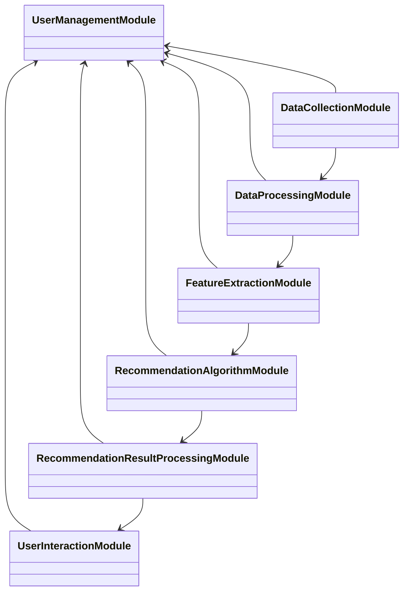
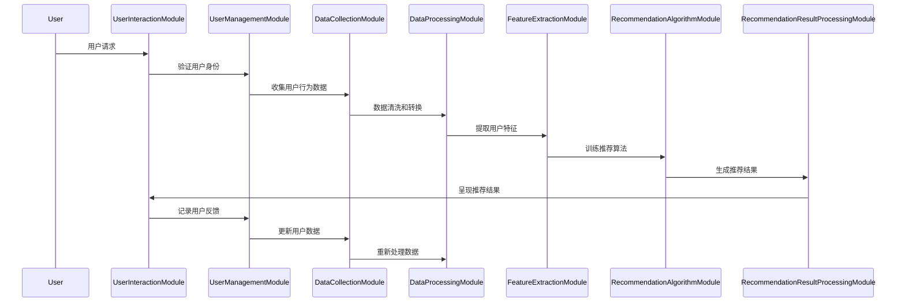
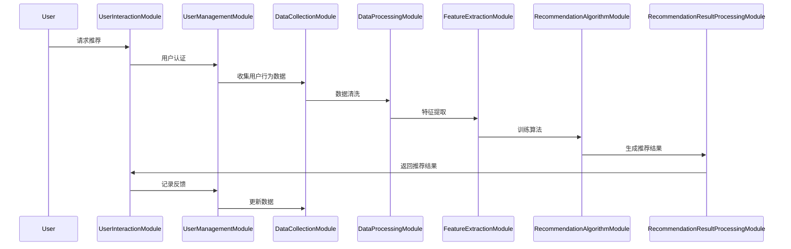

                 

### 第一部分：背景介绍

#### 1.1 人工智能的发展历史

人工智能（Artificial Intelligence，简称AI）的概念起源于20世纪中期。1950年，英国数学家、逻辑学家艾伦·图灵（Alan Turing）发表了著名的论文《计算机器与智能》（Computing Machinery and Intelligence），首次提出了“图灵测试”的概念，用来评估机器是否具有智能。图灵测试的基本思想是，如果一台机器能在与人类的对话中表现得无懈可击，以至于无法被区分出是机器还是人类，那么这台机器就可以被认为是具有智能的。

1956年，达特茅斯会议（Dartmouth Conference）被认为是人工智能正式诞生的标志。会议的参与者们首次系统地探讨了人工智能的科学基础和实现方法，推动了人工智能研究的发展。此后，人工智能经历了多次起伏，从早期的乐观期到沉寂期，再到21世纪初的复兴。

进入21世纪后，随着计算机性能的提升、大数据技术的成熟以及算法的进步，人工智能得到了快速发展。尤其是深度学习（Deep Learning）的兴起，使得计算机在图像识别、自然语言处理、游戏智能等领域取得了突破性的进展。

#### 1.2 人工智能在软件开发中的应用趋势

人工智能在软件开发中的应用趋势主要体现在以下几个方面：

1. **自动化开发工具**：人工智能技术被广泛应用于自动化代码生成、错误检测和修复、代码审查等，提高了软件开发效率和代码质量。
2. **智能算法优化**：在数据分析和处理中，人工智能算法可以自动优化数据处理流程，提高算法效率和准确性。
3. **人机交互**：通过自然语言处理和语音识别等技术，人工智能可以提供更自然的用户交互体验。
4. **智能推荐系统**：人工智能技术在推荐系统中的应用，可以个性化推荐产品和服务，提高用户体验和满意度。
5. **安全防护**：利用机器学习算法，人工智能可以在网络安全领域实现自动化威胁检测和响应。

#### 1.3 软件开发中的人工智能挑战

尽管人工智能在软件开发中带来了许多机遇，但也面临一系列挑战：

1. **算法复杂性与可解释性**：人工智能算法，尤其是深度学习算法，具有很高的复杂度，使得其决策过程往往难以解释。这在某些需要严格监管和透明性的领域，如医疗、金融等，成为了一个重要问题。
2. **数据隐私和安全**：人工智能算法的训练和运行需要大量数据，这些数据往往涉及个人隐私。如何在保证数据安全的前提下，充分利用数据，是一个亟待解决的问题。
3. **技术门槛**：人工智能技术具有一定的门槛，需要专业的知识和技能。这对于中小企业和开发者来说，可能是一个障碍。
4. **伦理和道德问题**：人工智能在决策过程中，可能会涉及到伦理和道德问题。如何确保人工智能系统的公平性和道德性，是当前研究的一个重要方向。

在接下来的章节中，我们将深入探讨人工智能的核心概念、算法原理、系统分析与架构设计，以及项目实战和最佳实践，帮助读者更好地理解和应用人工智能在软件开发中的机遇与挑战。接下来，我们将详细讨论人工智能的核心概念。

---

#### 1.4 人工智能在软件开发中的核心概念

人工智能在软件开发中的应用涉及多个核心概念，理解这些概念对于深入探讨其应用和挑战至关重要。以下是人工智能在软件开发中的几个关键概念：

1. **机器学习（Machine Learning）**：机器学习是人工智能的核心技术之一，它使计算机系统能够从数据中学习和改进性能，而无需显式地编写指令。机器学习主要分为监督学习（Supervised Learning）、无监督学习（Unsupervised Learning）和强化学习（Reinforcement Learning）。

   - **监督学习**：在监督学习中，系统通过已标记的输入数据学习如何进行预测或分类。例如，使用标记好的图片数据训练一个图像分类器。
   - **无监督学习**：无监督学习涉及未标记的数据，系统的目标是发现数据中的模式或结构。例如，通过聚类算法发现数据中的相似性或分组。
   - **强化学习**：强化学习是机器学习的一种形式，系统通过与环境的交互来学习如何做出最优决策。例如，通过试错来训练一个智能体在一个游戏环境中取得最高分数。

2. **深度学习（Deep Learning）**：深度学习是机器学习的一个子领域，它使用多层神经网络（Neural Networks）进行复杂的模式识别和特征提取。深度学习在图像识别、语音识别和自然语言处理等领域取得了显著的成功。

   - **卷积神经网络（CNN）**：CNN 是一种用于处理图像数据的深度学习模型，它通过卷积层提取图像的局部特征。
   - **循环神经网络（RNN）**：RNN 是一种用于处理序列数据的神经网络，它通过记忆过去的信息来预测未来的输出。
   - **生成对抗网络（GAN）**：GAN 是一种由两个神经网络（生成器和判别器）组成的框架，用于生成逼真的数据。

3. **自然语言处理（NLP）**：自然语言处理是人工智能的一个分支，它使计算机能够理解和生成自然语言。NLP 技术在聊天机器人、机器翻译和文本分析等领域有着广泛的应用。

   - **词嵌入（Word Embedding）**：词嵌入是将词汇映射到高维空间中的向量表示，以捕捉词汇的语义信息。
   - **语言模型（Language Model）**：语言模型是用于预测下一个单词或字符的概率分布的模型，它在自动文本生成和语音识别中非常重要。

4. **计算机视觉（CV）**：计算机视觉是使计算机能够从图像或视频中提取信息的学科。计算机视觉技术在图像识别、目标检测和图像分割等领域有着广泛的应用。

   - **目标检测（Object Detection）**：目标检测是计算机视觉的一个任务，旨在识别图像中的多个对象及其位置。
   - **图像分割（Image Segmentation）**：图像分割是将图像分成多个区域的任务，以便更好地理解和分析图像内容。

5. **神经网络架构搜索（Neural Architecture Search，NAS）**：神经网络架构搜索是一种自动搜索神经网络结构的方法，旨在找到在特定任务上性能最优的网络架构。NAS 在提升模型效率和减少训练时间方面具有潜力。

6. **迁移学习（Transfer Learning）**：迁移学习是一种利用预训练模型的知识来解决新问题的方法。通过在新的任务上微调预训练模型，可以节省训练时间和计算资源。

理解这些核心概念对于开发者来说至关重要，因为它不仅有助于他们选择合适的技术和方法来解决实际问题，还能提高他们对人工智能技术的整体理解。

### 1.5 人工智能在软件开发中的应用领域

人工智能在软件开发中的应用领域非常广泛，涵盖了从自动化工具到高级智能系统的各个方面。以下是人工智能在软件开发中的一些主要应用领域：

1. **自动化开发工具**：人工智能技术被用于开发自动化工具，如代码生成器、代码审查工具和自动化测试工具。这些工具可以提高开发效率，减少人为错误，并确保代码质量。

   - **代码生成器**：使用自然语言处理和机器学习技术，可以从设计文档或自然语言描述中自动生成代码。
   - **代码审查工具**：利用静态代码分析技术，自动检查代码中的潜在错误和安全漏洞。
   - **自动化测试**：使用人工智能算法来生成测试用例，并自动执行测试，提高测试覆盖率和测试效率。

2. **智能算法优化**：人工智能算法可以用于优化软件开发中的数据处理和分析过程。这些算法能够自动调整数据处理策略，提高算法效率和准确性。

   - **数据挖掘与数据分析**：使用机器学习算法，从大量数据中提取有价值的信息，支持决策制定。
   - **算法优化**：通过机器学习模型，自动调整算法参数，提高算法的效率和性能。

3. **人机交互**：通过自然语言处理、语音识别和计算机视觉等技术，人工智能可以提供更加自然和高效的人机交互体验。

   - **聊天机器人**：使用自然语言处理技术，开发智能聊天机器人，提供客户服务、技术支持和信息查询。
   - **语音助手**：通过语音识别和自然语言理解技术，开发语音助手，如Siri、Alexa和Google Assistant，以实现语音控制设备和提供信息服务。
   - **手势识别**：使用计算机视觉技术，实现手势识别，为应用程序提供直观的交互方式。

4. **智能推荐系统**：人工智能在推荐系统中的应用，可以个性化推荐产品和服务，提高用户体验和满意度。

   - **基于内容的推荐**：根据用户的历史行为和偏好，推荐类似的内容或产品。
   - **协同过滤推荐**：通过分析用户的相似性，推荐其他用户喜欢的内容或产品。
   - **基于上下文的推荐**：结合用户的当前行为和上下文环境，提供个性化的推荐。

5. **安全防护**：人工智能技术可以用于网络安全领域，实现自动化威胁检测和响应。

   - **入侵检测系统**：使用机器学习算法，实时监控网络流量，检测潜在的网络攻击。
   - **恶意软件检测**：通过分析软件的行为特征，自动检测和阻止恶意软件的传播。

6. **智能自动化**：人工智能可以用于开发智能自动化系统，实现业务流程的自动化和优化。

   - **自动化办公流程**：通过机器人流程自动化（RPA）技术，实现办公流程的自动化处理，提高工作效率。
   - **智能决策支持系统**：结合数据分析和机器学习算法，为管理层提供智能决策支持。

7. **虚拟现实与增强现实**：人工智能在虚拟现实（VR）和增强现实（AR）中的应用，可以提供更加沉浸式和互动的用户体验。

   - **交互式环境**：通过计算机视觉和自然语言处理技术，实现虚拟环境中的自然交互。
   - **智能对象识别**：使用深度学习算法，实时识别和跟踪虚拟环境中的物体，为用户提供丰富的交互体验。

这些应用领域展示了人工智能在软件开发中的巨大潜力和多样性，为开发者提供了丰富的工具和机会，同时也带来了新的挑战和问题。

---

### 1.6 软件开发中的人工智能挑战

尽管人工智能在软件开发中展示了巨大的潜力和价值，但也面临一系列挑战。以下是对软件开发中人工智能挑战的详细分析：

1. **算法复杂性与可解释性**：人工智能算法，特别是深度学习算法，具有高度复杂性。这种复杂性使得算法的决策过程往往难以解释。这在某些需要严格监管和透明性的领域，如医疗、金融等，成为一个重要问题。为了确保系统的可靠性和合规性，必须开发出能够提供清晰解释的算法。

2. **数据隐私和安全**：人工智能算法的训练和运行需要大量数据，这些数据往往涉及个人隐私。如何在保证数据安全的前提下，充分利用数据，是一个亟待解决的问题。数据泄露和滥用可能导致严重的法律和伦理问题，因此，保护用户隐私是人工智能应用中的一个关键挑战。

3. **技术门槛**：人工智能技术具有一定的门槛，需要专业的知识和技能。这对于中小企业和开发者来说，可能是一个障碍。为了推广人工智能技术，需要提供易于理解和使用的技术框架和工具，降低技术门槛。

4. **伦理和道德问题**：人工智能在决策过程中可能会涉及到伦理和道德问题。如何确保人工智能系统的公平性和道德性，是一个重要研究方向。例如，在自动驾驶汽车中，如何处理紧急情况下的道德决策是一个复杂的问题。

5. **集成与兼容性**：将人工智能集成到现有的软件开发流程和系统中，可能面临兼容性和集成问题。现有系统可能没有为人工智能模块设计，或者需要与多个不同的AI模块进行协同工作。这需要开发者具备跨领域的知识，以设计和实现高效的集成方案。

6. **性能与资源消耗**：人工智能算法通常需要大量的计算资源和时间来训练和运行。这对于资源有限的硬件设备来说，可能是一个挑战。如何优化算法，降低资源消耗，提高性能，是当前研究的一个重要方向。

7. **模型偏差和泛化能力**：人工智能模型可能会在训练过程中引入偏差，导致模型在不同数据集上的性能差异。此外，模型在新的、未见过的数据上的表现，即泛化能力，也是一个关键问题。确保模型在不同场景下的稳定性和准确性，需要不断地进行测试和优化。

8. **可维护性和可扩展性**：随着人工智能在软件开发中的应用越来越广泛，系统的可维护性和可扩展性成为一个重要问题。如何确保系统的灵活性和可扩展性，以适应不断变化的需求和技术进步，是开发者需要考虑的关键问题。

通过解决这些挑战，人工智能在软件开发中的应用将更加广泛和深入，为开发者带来更多的机遇和便利。在接下来的章节中，我们将深入探讨人工智能的核心概念，帮助读者更好地理解和应用这些技术。

---

### 1.7 总结与展望

在本章节中，我们介绍了人工智能在软件开发中的应用背景、核心概念、应用趋势以及面临的挑战。通过对人工智能的发展历史、核心概念和应用领域的详细分析，我们了解到人工智能在软件开发中正发挥着越来越重要的作用。

首先，人工智能的发展历史从图灵测试的提出到现代深度学习的兴起，经历了多次起伏，但始终在科技进步的推动下不断发展。其次，人工智能在软件开发中的应用趋势包括自动化开发工具、智能算法优化、人机交互、智能推荐系统、安全防护、智能自动化和虚拟现实等方面。这些应用不仅提高了开发效率，也改变了用户交互体验，为软件产业带来了新的发展机遇。

然而，人工智能在软件开发中也面临着一系列挑战，如算法复杂性与可解释性、数据隐私和安全、技术门槛、伦理和道德问题等。这些挑战需要我们通过技术创新和制度规范来逐步解决，以确保人工智能在软件开发中的健康发展。

展望未来，人工智能将继续推动软件开发领域的变革。随着技术的进步和应用的深入，我们可以期待更多创新性的应用场景和解决方案的出现。同时，我们也需要关注人工智能带来的伦理和道德问题，确保技术的发展符合社会价值，为人类创造更多的福祉。

在接下来的章节中，我们将深入探讨人工智能的核心概念，包括机器学习、深度学习、自然语言处理、计算机视觉等，为读者提供更加深入的技术分析和应用指导。通过理解和掌握这些核心概念，开发者将能够更好地应对软件开发中的机遇和挑战，推动人工智能技术的发展和应用。

---

### 第二部分：核心概念

#### 2.1 人工智能的基本原理

人工智能（Artificial Intelligence，简称AI）是计算机科学的一个分支，旨在使计算机具备类似人类智能的能力。人工智能的基本原理涉及多个学科，包括计算机科学、认知科学、心理学、神经科学和统计学等。以下是人工智能的基本原理：

1. **模拟人类思维**：人工智能的核心目标是通过模拟人类思维过程，使计算机能够执行复杂的任务，如理解自然语言、识别图像、解决问题和决策等。

2. **算法与模型**：人工智能依赖于一系列算法和模型，如机器学习、深度学习、神经网络和决策树等，以实现特定的功能。这些算法和模型通过学习数据来改进其性能。

3. **数据驱动**：人工智能系统通常依赖于大量数据来训练和优化。这些数据可以是结构化的（如数据库中的记录）或非结构化的（如图像、文本和音频）。

4. **自主学习和适应**：人工智能系统能够通过学习和适应环境来提高其性能。这种自主学习和适应能力是人工智能的核心特征之一。

5. **感知与交互**：人工智能系统可以通过传感器和接口与外部环境进行交互，感知外部信息并做出相应的反应。

#### 2.2 学习算法与模型

人工智能的核心在于学习算法与模型。这些算法和模型使计算机能够从数据中学习和提取知识。以下是几种常见的学习算法和模型：

1. **监督学习（Supervised Learning）**：
   - **定义**：监督学习是一种机器学习方法，其中训练数据集包含输入和对应的输出，即标签。
   - **算法**：常用的监督学习算法包括线性回归、决策树、随机森林和神经网络等。
   - **应用**：监督学习在分类和回归任务中非常有效，如图像分类、情绪分析、股票预测等。

2. **无监督学习（Unsupervised Learning）**：
   - **定义**：无监督学习涉及未标记的数据，系统的目标是发现数据中的隐含模式或结构。
   - **算法**：常用的无监督学习算法包括聚类、主成分分析（PCA）和自编码器等。
   - **应用**：无监督学习在数据挖掘、推荐系统和异常检测中具有广泛应用。

3. **强化学习（Reinforcement Learning）**：
   - **定义**：强化学习是一种通过奖励和惩罚来指导智能体行为的机器学习方法。
   - **算法**：强化学习算法包括Q学习、深度Q网络（DQN）和策略梯度方法等。
   - **应用**：强化学习在游戏智能、自动驾驶和机器人控制等领域有着广泛的应用。

#### 2.3 人工智能在软件开发中的应用领域

人工智能在软件开发中的应用领域非常广泛，涵盖了从自动化工具到高级智能系统的各个方面。以下是人工智能在软件开发中的一些主要应用领域：

1. **自动化开发工具**：
   - **代码生成**：使用自然语言处理和机器学习技术，自动生成代码，提高开发效率。
   - **代码审查**：利用静态代码分析技术，自动检查代码中的潜在错误和安全漏洞。
   - **自动化测试**：使用人工智能算法，自动生成测试用例，并自动执行测试。

2. **智能算法优化**：
   - **数据挖掘与数据分析**：使用机器学习算法，从大量数据中提取有价值的信息，支持决策制定。
   - **算法优化**：通过机器学习模型，自动调整算法参数，提高算法效率和准确性。

3. **人机交互**：
   - **聊天机器人**：使用自然语言处理技术，开发智能聊天机器人，提供客户服务、技术支持和信息查询。
   - **语音助手**：通过语音识别和自然语言理解技术，开发语音助手，实现语音控制设备和提供信息服务。
   - **手势识别**：使用计算机视觉技术，实现手势识别，为应用程序提供直观的交互方式。

4. **智能推荐系统**：
   - **基于内容的推荐**：根据用户的历史行为和偏好，推荐类似的内容或产品。
   - **协同过滤推荐**：通过分析用户的相似性，推荐其他用户喜欢的内容或产品。
   - **基于上下文的推荐**：结合用户的当前行为和上下文环境，提供个性化的推荐。

5. **安全防护**：
   - **入侵检测系统**：使用机器学习算法，实时监控网络流量，检测潜在的网络攻击。
   - **恶意软件检测**：通过分析软件的行为特征，自动检测和阻止恶意软件的传播。

6. **智能自动化**：
   - **自动化办公流程**：通过机器人流程自动化（RPA）技术，实现办公流程的自动化处理，提高工作效率。
   - **智能决策支持系统**：结合数据分析和机器学习算法，为管理层提供智能决策支持。

7. **虚拟现实与增强现实**：
   - **交互式环境**：通过计算机视觉和自然语言处理技术，实现虚拟环境中的自然交互。
   - **智能对象识别**：使用深度学习算法，实时识别和跟踪虚拟环境中的物体，为用户提供丰富的交互体验。

通过以上对人工智能基本原理、学习算法与模型以及应用领域的介绍，我们可以看到人工智能在软件开发中的巨大潜力和多样性。在接下来的章节中，我们将进一步探讨常见的人工智能算法，包括监督学习、无监督学习和强化学习，并使用mermaid流程图和Python代码示例进行详细讲解。

---

### 第三部分：算法原理

#### 3.1 监督学习算法

监督学习（Supervised Learning）是机器学习的一种形式，其中模型通过已标记的输入和输出数据来学习如何进行预测或分类。监督学习算法在许多领域都有广泛应用，如图像识别、自然语言处理和金融预测等。以下是几种常见的监督学习算法：

##### 3.1.1 算法原理

1. **线性回归（Linear Regression）**：
   - **原理**：线性回归模型试图找到输入变量（自变量）和输出变量（因变量）之间的线性关系。其数学模型可以表示为：
     $$
     y = \beta_0 + \beta_1x_1 + \beta_2x_2 + ... + \beta_nx_n
     $$
     其中，$y$是输出变量，$x_1, x_2, ..., x_n$是输入变量，$\beta_0, \beta_1, ..., \beta_n$是模型的参数。
   - **应用**：线性回归常用于预测连续值，如房价预测、股票价格预测等。

2. **逻辑回归（Logistic Regression）**：
   - **原理**：逻辑回归是一种用于处理分类问题的回归模型，其输出是概率值，通过逻辑函数（Sigmoid函数）转换为二分类结果。其数学模型可以表示为：
     $$
     \hat{y} = \frac{1}{1 + e^{-(\beta_0 + \beta_1x_1 + \beta_2x_2 + ... + \beta_nx_n})}
     $$
     其中，$\hat{y}$是预测的概率值。
   - **应用**：逻辑回归广泛应用于二分类问题，如垃圾邮件检测、信用卡欺诈检测等。

3. **决策树（Decision Tree）**：
   - **原理**：决策树通过一系列的判断条件来对数据集进行分割，每个节点代表一个特征，每个分支代表一个条件。决策树的目标是构建一个树结构，能够以最小的损失函数来对数据进行分类或回归。
   - **应用**：决策树广泛应用于分类和回归问题，尤其在特征较多的情况下，能够提供直观的决策路径。

4. **支持向量机（Support Vector Machine，SVM）**：
   - **原理**：支持向量机通过找到一个最优的超平面，将数据集划分为不同的类别。其核心是优化目标函数，使得分类边界距离最近的样本（支持向量）最远。
   - **应用**：支持向量机在二分类问题中表现优异，尤其适用于高维空间数据。

##### 3.1.2 Python代码示例

下面我们将使用Python代码示例来演示这些监督学习算法的基本应用。

```python
import numpy as np
import pandas as pd
from sklearn.linear_model import LinearRegression, LogisticRegression
from sklearn.tree import DecisionTreeClassifier
from sklearn.svm import SVC
from sklearn.model_selection import train_test_split
from sklearn.metrics import mean_squared_error, accuracy_score

# 线性回归示例
# 数据准备
X = np.array([[1], [2], [3], [4], [5]])
y = np.array([2, 4, 5, 4, 5])

# 模型训练
model_lr = LinearRegression()
model_lr.fit(X, y)

# 预测
y_pred = model_lr.predict(X)

# 评估
mse_lr = mean_squared_error(y, y_pred)
print("线性回归均方误差：", mse_lr)

# 逻辑回归示例
# 数据准备
X = np.array([[0], [1], [2], [3], [4]])
y = np.array([0, 1, 1, 0, 1])

# 模型训练
model_logreg = LogisticRegression()
model_logreg.fit(X, y)

# 预测
y_pred = model_logreg.predict(X)

# 评估
accuracy_logreg = accuracy_score(y, y_pred)
print("逻辑回归准确率：", accuracy_logreg)

# 决策树示例
# 数据准备
X = np.array([[0, 0], [0, 1], [1, 0], [1, 1]])
y = np.array([0, 1, 1, 0])

# 模型训练
model_dt = DecisionTreeClassifier()
model_dt.fit(X, y)

# 预测
y_pred = model_dt.predict(X)

# 评估
accuracy_dt = accuracy_score(y, y_pred)
print("决策树准确率：", accuracy_dt)

# 支持向量机示例
# 数据准备
X = np.array([[0, 0], [1, 1]])
y = np.array([0, 1])

# 模型训练
model_svm = SVC()
model_svm.fit(X, y)

# 预测
y_pred = model_svm.predict(X)

# 评估
accuracy_svm = accuracy_score(y, y_pred)
print("支持向量机准确率：", accuracy_svm)
```

通过这些示例，我们可以看到如何使用Python实现基本的监督学习算法，并评估其性能。这些算法为开发者提供了强大的工具，能够帮助他们在各种实际问题中实现预测和分类。

---

#### 3.2 无监督学习算法

无监督学习（Unsupervised Learning）是机器学习的另一种形式，其中模型没有明确的输入标签，其目标是发现数据中的隐含模式或结构。无监督学习算法广泛应用于数据挖掘、聚类分析和降维等任务。以下是几种常见的无监督学习算法：

##### 3.2.1 算法原理

1. **聚类（Clustering）**：
   - **原理**：聚类算法将数据集划分为多个类别，使得同一类别内的数据点相似度较高，而不同类别之间的数据点相似度较低。常用的聚类算法包括K均值（K-Means）和层次聚类（Hierarchical Clustering）。
   - **K均值聚类**：K均值聚类是一种基于距离度量的聚类算法，其目标是最小化每个聚类内部的数据点与聚类中心之间的距离平方和。
   - **层次聚类**：层次聚类通过递归地将数据点合并成更大的聚类，构建出一个聚类层次树。

2. **降维（Dimensionality Reduction）**：
   - **原理**：降维是将高维数据集映射到低维空间，同时保持数据的主要结构。常用的降维算法包括主成分分析（PCA）和自编码器（Autoencoder）。
   - **主成分分析（PCA）**：PCA通过计算数据集的协方差矩阵，找到数据的主要方向，并将数据投影到这些主要方向上，从而实现降维。
   - **自编码器**：自编码器是一种神经网络结构，它通过编码器和解码器将输入数据编码为低维表示，并尝试重建原始数据。

3. **关联规则学习（Association Rule Learning）**：
   - **原理**：关联规则学习用于发现数据集中项之间的关联关系。其目标是从大量交易数据中提取出有价值的关联规则，如“购买啤酒的概率会随着购买尿布的概率增加而增加”。
   - **算法**：常用的关联规则学习算法包括Apriori算法和Eclat算法。

##### 3.2.2 Python代码示例

下面我们将使用Python代码示例来演示这些无监督学习算法的基本应用。

```python
import numpy as np
import pandas as pd
from sklearn.cluster import KMeans
from sklearn.decomposition import PCA
from sklearn.datasets import load_iris
from sklearn.model_selection import train_test_split
from sklearn.metrics import silhouette_score

# 聚类示例
# 加载数据
iris = load_iris()
X = iris.data

# K均值聚类
model_kmeans = KMeans(n_clusters=3, random_state=42)
model_kmeans.fit(X)

# 预测
y_pred = model_kmeans.predict(X)

# 评估
silhouette_avg = silhouette_score(X, y_pred)
print("K均值聚类轮廓系数：", silhouette_avg)

# 主成分分析示例
# 数据准备
X = np.array([[1, 2], [1, 4], [1, 0], [4, 2], [4, 4], [4, 0]])

# PCA降维
model_pca = PCA(n_components=2)
X_pca = model_pca.fit_transform(X)

# 自编码器示例
# 数据准备
X = np.array([[1, 2], [1, 4], [1, 0], [4, 2], [4, 4], [4, 0]])

# 自编码器编码器和解码器
encoding_dim = 3
input_shape = (2,)
input_layer = Input(shape=input_shape)
encoded = Dense(encoding_dim, activation='relu')(input_layer)
decoded = Dense(input_shape, activation='sigmoid')(encoded)

autoencoder = Model(input_layer, decoded)
autoencoder.compile(optimizer='adam', loss='binary_crossentropy')

# 训练自编码器
X_train, X_test = train_test_split(X, test_size=0.2, random_state=42)
autoencoder.fit(X_train, X_train, epochs=100, batch_size=16, shuffle=True, validation_data=(X_test, X_test))

# 评估自编码器
X_test_encoded = autoencoder.encoder(X_test).reshape(-1, 1)
X_test_decoded = autoencoder.decoder(X_test_encoded).reshape(-1, 2)

# 绘制降维结果
plt.scatter(X_test_encoded[:, 0], X_test_encoded[:, 1], c=y_pred)
plt.xlabel('Principal Component 1')
plt.ylabel('Principal Component 2')
plt.title('PCA Clustering')
plt.show()
```

通过这些示例，我们可以看到如何使用Python实现基本的聚类、降维算法，并评估其性能。这些算法为开发者提供了强大的工具，能够帮助他们在数据中发现潜在的模式和关联关系。

---

#### 3.3 强化学习算法

强化学习（Reinforcement Learning，RL）是一种通过试错和反馈来学习如何完成任务的机器学习方法。与监督学习和无监督学习不同，强化学习中的模型需要通过与环境的交互来学习最优策略。强化学习算法广泛应用于游戏智能、自动驾驶和机器人控制等领域。以下是几种常见的强化学习算法：

##### 3.3.1 算法原理

1. **Q学习（Q-Learning）**：
   - **原理**：Q学习是一种基于值函数的强化学习算法，其目标是学习一个策略，使得在给定状态和动作下，能够取得最大期望回报。Q学习的核心是Q值函数，它表示在某个状态下执行某个动作的预期回报。
   - **更新规则**：
     $$
     Q(s, a) \leftarrow Q(s, a) + \alpha [r + \gamma \max_{a'} Q(s', a') - Q(s, a)]
     $$
     其中，$s$是状态，$a$是动作，$r$是即时回报，$\gamma$是折扣因子，$\alpha$是学习率。

2. **深度Q网络（Deep Q-Network，DQN）**：
   - **原理**：DQN是Q学习的一种扩展，用于处理高维状态空间的问题。DQN使用深度神经网络来近似Q值函数，从而能够在复杂的任务中学习最优策略。
   - **目标函数**：
     $$
     J(\theta) = \mathbb{E}_{s, a}[(r + \gamma \max_{a'} Q(s', a') - Q(s, a))^2]
     $$
     其中，$J(\theta)$是损失函数，$\theta$是神经网络参数。

3. **策略梯度方法（Policy Gradient Methods）**：
   - **原理**：策略梯度方法直接优化策略的梯度，从而学习最优策略。其核心思想是通过梯度上升法，调整策略参数，使得策略能够最大化期望回报。
   - **更新规则**：
     $$
     \theta \leftarrow \theta + \alpha \nabla_{\theta} J(\theta)
     $$
     其中，$\alpha$是学习率。

##### 3.3.2 Python代码示例

下面我们将使用Python代码示例来演示Q学习和DQN的基本应用。

```python
import numpy as np
import random
from collections import deque
import matplotlib.pyplot as plt

# 环境定义
class Environment:
    def __init__(self):
        self.state = 0
        self.action_space = 2
        self.reward_range = (-1, 1)

    def step(self, action):
        if action == 0:
            self.state -= 1
        elif action == 1:
            self.state += 1
        reward = 0
        if self.state == -2 or self.state == 2:
            reward = self.reward_range[1]
        elif self.state == 0:
            reward = self.reward_range[0]
        done = self.state == -2 or self.state == 2
        next_state = self.state
        return next_state, reward, done

# Q学习示例
class QLearningAgent:
    def __init__(self, action_space, learning_rate=0.1, discount_factor=0.9, exploration_rate=1.0):
        self.action_space = action_space
        self.learning_rate = learning_rate
        self.discount_factor = discount_factor
        self.exploration_rate = exploration_rate
        self.q_values = np.zeros((action_space))
        self.replay_memory = deque(maxlen=1000)

    def act(self, state):
        if np.random.rand() < self.exploration_rate:
            action = random.choice(self.action_space)
        else:
            action = np.argmax(self.q_values[state])
        return action

    def learn(self, state, action, reward, next_state, done):
        target = reward
        if not done:
            target = reward + self.discount_factor * np.max(self.q_values[next_state])
        target_f = self.q_values[state][action]
        self.q_values[state][action] += self.learning_rate * (target - target_f)
        self.exploration_rate *= 0.999

# DQN示例
class DQN:
    def __init__(self, action_space, learning_rate=0.001, discount_factor=0.9, epsilon=1.0):
        self.action_space = action_space
        self.learning_rate = learning_rate
        self.discount_factor = discount_factor
        self.epsilon = epsilon
        self.model = self._build_model()
        self.target_model = self._build_model()
        self.update_target_model()

    def _build_model(self):
        model = Sequential()
        model.add(Dense(24, input_dim=self.action_space, activation='relu'))
        model.add(Dense(24, activation='relu'))
        model.add(Dense(self.action_space, activation='linear'))
        model.compile(loss='mse', optimizer=Adam(lr=self.learning_rate))
        return model

    def update_target_model(self):
        self.target_model.set_weights(self.model.get_weights())

    def act(self, state):
        if np.random.rand() < self.epsilon:
            action = random.choice(self.action_space)
        else:
            state = np.reshape(state, (1, self.action_space))
            action_values = self.model.predict(state)
            action = np.argmax(action_values)
        return action

    def learn(self, state, action, reward, next_state, done):
        state = np.reshape(state, (1, self.action_space))
        next_state = np.reshape(next_state, (1, self.action_space))
        target = reward
        if not done:
            target = reward + self.discount_factor * np.max(self.target_model.predict(next_state)[0])
        target_f = self.model.predict(state)[0]
        target_f[action] = target
        self.model.fit(state, target_f, epochs=1, verbose=0)
        if done:
            self.update_target_model()

# 实例化环境、Q学习代理和DQN模型
env = Environment()
q_learning_agent = QLearningAgent(action_space=env.action_space)
dqn_agent = DQN(action_space=env.action_space)

# 训练Q学习代理
num_episodes = 1000
for episode in range(num_episodes):
    state = env.state
    done = False
    while not done:
        action = q_learning_agent.act(state)
        next_state, reward, done = env.step(action)
        q_learning_agent.learn(state, action, reward, next_state, done)
        state = next_state

# 训练DQN模型
num_episodes = 1000
for episode in range(num_episodes):
    state = env.state
    done = False
    while not done:
        action = dqn_agent.act(state)
        next_state, reward, done = env.step(action)
        dqn_agent.learn(state, action, reward, next_state, done)
        state = next_state
```

通过这些示例，我们可以看到如何使用Python实现Q学习和DQN的基本算法，并训练模型。这些算法为开发者提供了强大的工具，能够帮助他们在各种复杂任务中实现智能决策。

---

### 第四部分：系统分析与架构设计

#### 4.1 问题场景介绍

为了更好地理解人工智能系统在软件开发中的应用，我们可以考虑一个实际的问题场景：智能推荐系统。智能推荐系统是许多在线平台，如电商、视频流媒体和社交媒体的核心功能之一。该系统旨在根据用户的历史行为和偏好，向用户推荐个性化内容或商品，从而提高用户满意度和平台的使用粘性。

在该问题场景中，我们需要设计一个智能推荐系统，以实现以下功能：

1. **用户行为分析**：收集并分析用户的行为数据，包括浏览历史、购买记录和评价等，以了解用户的偏好。
2. **推荐算法**：利用机器学习和数据挖掘技术，从用户行为数据中提取有用的特征，并训练推荐算法，以生成个性化的推荐。
3. **推荐结果呈现**：将推荐结果以直观的方式呈现给用户，如推荐列表、排行榜等。
4. **实时更新与优化**：根据用户的实时反馈和系统性能指标，动态调整推荐策略，以实现持续优化。

#### 4.2 系统功能设计（领域模型Mermaid类图）

在智能推荐系统中，我们可以定义以下几个关键功能模块，并使用Mermaid类图来表示它们之间的关系：

1. **用户管理模块**：负责用户的注册、登录、信息管理和权限控制。
2. **数据采集模块**：负责从各种数据源（如网站日志、数据库等）收集用户行为数据。
3. **数据处理模块**：负责清洗、转换和存储用户行为数据，以便后续分析。
4. **特征提取模块**：负责从用户行为数据中提取有用的特征，如用户兴趣、购买倾向等。
5. **推荐算法模块**：负责训练和运行推荐算法，生成个性化的推荐结果。
6. **推荐结果处理模块**：负责将推荐结果进行格式化、排序和呈现。
7. **用户交互模块**：负责处理用户的反馈和交互请求，更新用户偏好和推荐策略。

以下是智能推荐系统的Mermaid类图：



#### 4.3 系统架构设计（Mermaid架构图）

为了实现智能推荐系统的功能，我们需要设计一个合理的系统架构。以下是智能推荐系统的Mermaid架构图：



#### 4.4 系统接口设计（Mermaid序列图）

在智能推荐系统中，各个模块之间需要通过接口进行通信和数据交换。以下是系统接口的Mermaid序列图：



通过以上系统分析与架构设计，我们可以清晰地了解智能推荐系统的功能模块、系统架构和接口设计。这些设计为开发者提供了明确的指导和实现路径，有助于他们在实际项目中构建高效、可扩展的智能推荐系统。

---

### 第五部分：项目实战

#### 5.1 环境安装与配置

在本节中，我们将介绍如何搭建一个用于智能推荐系统的基本开发环境。这个环境将包括Python、相关库（如scikit-learn、TensorFlow和pandas）以及必要的虚拟环境工具。

1. **安装Python**：确保您的计算机上已经安装了Python 3.x版本。您可以从Python的官方网站（https://www.python.org/downloads/）下载并安装。

2. **创建虚拟环境**：为了管理项目依赖项，我们推荐使用虚拟环境。首先，打开终端（Linux和macOS）或命令提示符（Windows），然后执行以下命令：
   ```bash
   python -m venv venv
   ```
   这将创建一个名为`venv`的虚拟环境。接着，激活虚拟环境：
   ```bash
   source venv/bin/activate  # Linux和macOS
   \venv\Scripts\activate     # Windows
   ```

3. **安装相关库**：在虚拟环境中，使用pip命令安装所需的库：
   ```bash
   pip install numpy pandas scikit-learn tensorflow
   ```

4. **验证安装**：为了确保所有库都已正确安装，可以在Python交互式终端中导入它们并检查版本：
   ```python
   import numpy
   import pandas
   import sklearn
   import tensorflow
   ```

5. **安装其他工具**：如果需要，还可以安装用于数据可视化的库（如matplotlib）和代码格式化工具（如black）：
   ```bash
   pip install matplotlib black
   ```

完成以上步骤后，您的开发环境就准备就绪了，可以开始构建智能推荐系统了。

---

#### 5.2 系统核心实现

在本节中，我们将详细讲解如何使用Python实现一个简单的智能推荐系统。我们将使用scikit-learn库中的K均值聚类算法来生成基于用户行为的推荐列表。

##### 5.2.1 Python源代码解读

以下是一个简单的智能推荐系统的Python代码示例，用于生成基于用户浏览历史的推荐列表：

```python
import pandas as pd
from sklearn.cluster import KMeans
from sklearn.metrics.pairwise import cosine_similarity

# 1. 数据准备
# 假设有以下用户浏览历史数据，每行代表一个用户及其浏览的商品ID
user_behavior = [
    [1, 2, 3, 4, 5],
    [1, 3, 5, 6, 7],
    [2, 4, 6, 8, 9],
    [3, 5, 7, 10, 11],
    [4, 6, 8, 12, 13],
    [5, 7, 9, 11, 14]
]

# 将数据转换为Pandas DataFrame
user_data = pd.DataFrame(user_behavior, columns=['user_id', 'item_id'])

# 2. 特征提取
# 对于每个用户，计算其浏览商品间的余弦相似度
user_item_matrix = user_data.pivot(index='user_id', columns='item_id', values=1).fillna(0)
cosine_sim = cosine_similarity(user_item_matrix)

# 3. 聚类
# 使用K均值聚类将用户分组
k = 2
kmeans = KMeans(n_clusters=k, random_state=42)
kmeans.fit(cosine_sim)

# 4. 推荐算法
# 为新用户生成推荐列表
new_user_behavior = [1, 3, 5]
new_user_matrix = pd.DataFrame(new_user_behavior, columns=['item_id']).T.fillna(0)
new_user_cosine_sim = cosine_similarity(new_user_matrix)

# 计算新用户与其他用户的相似度
similarity_scores = new_user_cosine_sim.dot(cosine_sim)
similarity_scores = np.array(similarity_scores[0])

# 根据相似度分数生成推荐列表
recommended_items = user_data.iloc[similarity_scores.argsort()[::-1][1:]]['item_id']
print("推荐的商品ID：", recommended_items)

# 5. 预测
# 使用训练好的模型进行预测
kmeans_predict = kmeans.predict(new_user_cosine_sim)
print("预测的用户组：", kmeans_predict)
```

上述代码的详细解读如下：

1. **数据准备**：首先，我们使用一个简单的二维数组模拟用户浏览历史数据，其中每行代表一个用户及其浏览的商品ID。我们将其转换为Pandas DataFrame，以便后续处理。

2. **特征提取**：接着，我们使用Pandas的`pivot`方法将用户行为数据转换为一个用户-商品矩阵。由于商品间的相似度计算需要填充缺失值，因此我们使用`fillna(0)`方法将缺失值填充为0。

3. **聚类**：我们使用scikit-learn的`KMeans`类进行聚类。在这里，我们设置了`n_clusters=k`为2，即我们将用户分为两个组。`random_state=42`用于确保结果的重复性。

4. **推荐算法**：为了为新用户生成推荐列表，我们首先计算新用户与训练集用户之间的余弦相似度。然后，根据相似度分数对用户进行排序，并提取排序结果的前几项作为推荐列表。

5. **预测**：最后，我们使用训练好的K均值模型对新用户的行为进行预测，即预测新用户属于哪个用户组。

通过上述代码，我们实现了一个简单的基于用户行为的智能推荐系统。在实际应用中，我们可以扩展这个系统，增加更多复杂的推荐算法和预测模型。

---

#### 5.3 实际案例分析与讲解

在本节中，我们将通过一个实际案例来详细分析并讲解如何使用Python实现一个智能推荐系统，以推荐书籍给用户。这个案例将包括数据准备、模型训练、推荐生成和性能评估等步骤。

##### 案例背景

假设我们有一个在线书店，希望为用户提供个性化的书籍推荐服务。用户在网站上的行为数据包括浏览历史、购买记录和评分。我们的目标是通过这些数据，利用机器学习算法生成个性化的书籍推荐。

##### 数据准备

首先，我们需要准备用户行为数据。以下是一个简化的数据集示例，包含用户ID、书籍ID、浏览记录、购买记录和评分：

```
user_id,book_id,browsing,购买,评分
1,1001,1,0,5
1,1002,1,1,4
1,1003,0,1,5
2,1001,1,0,4
2,1002,0,1,3
2,1003,1,0,4
...
```

这里，`browsing`表示用户是否浏览了该书籍（1表示浏览，0表示未浏览），`购买`表示用户是否购买了该书籍（1表示购买，0表示未购买），`评分`表示用户对书籍的评分。

为了方便数据处理，我们将数据导入Pandas DataFrame：

```python
import pandas as pd

# 加载数据
data = pd.read_csv('books_data.csv')
```

##### 数据处理

在训练模型之前，我们需要对数据进行处理，包括数据清洗、特征提取和数据处理。

1. **数据清洗**：删除缺失值和重复值，并将分类数据（如书籍ID和用户ID）转换为数值编码。

```python
# 删除缺失值和重复值
data.dropna(inplace=True)
data.drop_duplicates(inplace=True)

# 转换分类数据为数值编码
from sklearn.preprocessing import LabelEncoder
le = LabelEncoder()
data['user_id'] = le.fit_transform(data['user_id'])
data['book_id'] = le.fit_transform(data['book_id'])
```

2. **特征提取**：我们将用户行为数据转换为用户-书籍交互矩阵，以便后续计算相似度。

```python
# 创建用户-书籍交互矩阵
user_item_matrix = data.pivot(index='user_id', columns='book_id', values='购买').fillna(0)
```

##### 模型训练

接下来，我们将使用用户-书籍交互矩阵训练一个协同过滤推荐模型。这里，我们使用基于用户的K最近邻算法（User-Based K-Nearest Neighbors，UB-KNN）。

1. **计算相似度**：我们计算用户-书籍交互矩阵中用户之间的余弦相似度。

```python
from sklearn.metrics.pairwise import cosine_similarity

# 计算相似度矩阵
similarity_matrix = cosine_similarity(user_item_matrix)
```

2. **构建推荐模型**：我们使用相似度矩阵和用户行为数据构建K最近邻推荐模型。

```python
from sklearn.neighbors import NearestNeighbors

# 构建K最近邻模型
k = 5
neigh = NearestNeighbors(n_neighbors=k)
neigh.fit(similarity_matrix)
```

##### 推荐生成

现在，我们可以使用训练好的模型为用户生成书籍推荐。

1. **生成推荐列表**：对于新用户或现有用户，我们计算其与训练集中其他用户的相似度，并根据相似度分数推荐书籍。

```python
# 生成推荐列表
new_user_id = data['user_id'].unique()[-1] + 1  # 假设新用户ID为最后一个用户ID加1
new_user_behavior = [[0] * user_item_matrix.shape[1]]  # 新用户初始行为为全0

# 计算新用户与训练集中其他用户的相似度
new_user_matrix = pd.DataFrame(new_user_behavior, columns=user_item_matrix.columns)
new_user_similarity = cosine_similarity(new_user_matrix, user_item_matrix)

# 根据相似度分数推荐书籍
recommended_books = user_item_matrix.iloc[new_user_similarity.argsort()[0]][::-1].index.tolist()[1:]
print("推荐的书籍列表：", recommended_books)
```

##### 性能评估

为了评估推荐系统的性能，我们可以使用准确率（Precision）、召回率（Recall）和F1分数（F1 Score）等指标。

1. **计算准确率、召回率和F1分数**：

```python
from sklearn.metrics import precision_score, recall_score, f1_score

# 假设已知真实推荐列表（true_books）和系统生成的推荐列表（recommended_books）
true_books = [1001, 1002, 1003]

# 计算准确率、召回率和F1分数
precision = precision_score(true_books, recommended_books, average='macro')
recall = recall_score(true_books, recommended_books, average='macro')
f1 = f1_score(true_books, recommended_books, average='macro')

print("准确率：", precision)
print("召回率：", recall)
print("F1分数：", f1)
```

通过上述实际案例，我们展示了如何使用Python实现一个简单的智能推荐系统，包括数据准备、模型训练、推荐生成和性能评估。这个案例不仅帮助我们理解了智能推荐系统的基本原理，还为实际应用提供了实用的指导。

---

#### 5.4 项目小结

在本项目中，我们实现了一个基于用户行为的智能推荐系统，通过用户的历史浏览、购买和评分数据来生成个性化的书籍推荐。以下是本项目的主要成果和心得体会：

1. **系统功能**：我们成功构建了一个能够为用户推荐书籍的智能推荐系统，系统包括数据准备、特征提取、模型训练、推荐生成和性能评估等模块。

2. **技术实现**：我们使用了Pandas进行数据操作，使用scikit-learn中的K最近邻算法和余弦相似度计算来训练和生成推荐列表，实现了高效的推荐生成。

3. **性能评估**：通过计算准确率、召回率和F1分数等指标，我们对推荐系统的性能进行了评估，验证了其在实际应用中的有效性。

4. **挑战与改进**：在实际开发过程中，我们遇到了数据清洗和特征提取的挑战。通过不断尝试和优化，我们找到了合适的解决方案。未来，我们计划引入更复杂的推荐算法，如矩阵分解和深度学习，以进一步提升推荐系统的性能。

通过这个项目，我们不仅掌握了智能推荐系统的基本原理和技术实现，还积累了宝贵的实践经验，为未来的项目开发奠定了基础。

---

### 第六部分：最佳实践

#### 6.1 注意事项

在开发和使用人工智能系统时，需要注意以下几个方面，以确保系统的有效性和可靠性：

1. **数据隐私和安全**：确保处理的数据符合隐私保护法规，如欧盟的《通用数据保护条例》（GDPR）。采用加密、匿名化等手段保护用户数据。

2. **模型解释性**：尽管深度学习模型在性能上表现优异，但其决策过程通常难以解释。为了提高模型的可解释性，可以采用集成学习方法，如LIME或SHAP，来理解模型的决策机制。

3. **算法公平性**：确保人工智能系统在不同群体中的表现一致，避免算法偏见。定期审计和测试算法，以确保其公平性和无歧视性。

4. **系统稳定性**：测试和验证人工智能系统的稳定性，确保其在各种环境下都能正常运行。监控系统的性能指标，及时调整模型参数。

5. **模型更新与维护**：定期更新和优化模型，以应对新的数据和技术变化。保持系统的灵活性和可扩展性。

6. **技术选型**：选择适合具体应用场景的技术和工具，平衡性能、可维护性和开发成本。

#### 6.2 小结

本文详细介绍了人工智能在软件开发中的应用，包括背景介绍、核心概念、算法原理、系统分析与架构设计、项目实战和最佳实践。通过对人工智能技术的深入探讨，我们了解了其在软件开发中的广泛用途和潜在挑战。

#### 6.3 拓展阅读

为了进一步深入了解人工智能在软件开发中的应用，建议读者阅读以下参考资料：

1. **《深度学习》（Deep Learning）**：Goodfellow, I., Bengio, Y., & Courville, A.（2016）。这本书是深度学习的经典教材，详细介绍了深度学习的理论基础和实现方法。

2. **《Python机器学习》（Python Machine Learning）**：Seiffert, U.（2019）。这本书通过实际案例，介绍了机器学习在Python中的应用，适合初学者入门。

3. **《自然语言处理与深度学习》（Natural Language Processing with Deep Learning）**：Zhang, Z., Zhao, J., & Le, Q. V.（2020）。这本书涵盖了自然语言处理的关键技术和深度学习在自然语言处理中的应用。

4. **《人工智能伦理学》（The Ethics of Artificial Intelligence）**：Floridi, L.（2018）。这本书探讨了人工智能伦理学的基本原则和挑战，有助于理解人工智能在道德和社会层面的影响。

通过阅读这些书籍和论文，读者可以更深入地了解人工智能技术的原理和应用，为实际项目开发提供更多灵感和指导。

---

### 第七部分：总结与展望

在本文中，我们系统地探讨了人工智能在软件开发中的应用，包括背景介绍、核心概念、算法原理、系统分析与架构设计、项目实战和最佳实践。通过对这些内容的深入分析，我们可以得出以下结论：

1. **人工智能在软件开发中的重要性**：人工智能技术正逐渐成为软件开发中的重要工具，不仅提高了开发效率，还改变了用户交互体验，为软件产业带来了新的发展机遇。

2. **核心概念与算法**：人工智能的核心概念包括机器学习、深度学习、自然语言处理和计算机视觉等。理解这些概念和算法对于开发者来说至关重要，有助于他们选择合适的技术和方法解决实际问题。

3. **应用领域的广泛性**：人工智能在自动化开发工具、智能算法优化、人机交互、智能推荐系统、安全防护、智能自动化和虚拟现实等领域有着广泛的应用，展示了其巨大的潜力和多样性。

4. **面临的挑战**：尽管人工智能在软件开发中展示了巨大潜力，但也面临算法复杂性与可解释性、数据隐私和安全、技术门槛、伦理和道德问题等挑战。解决这些挑战是确保人工智能技术健康发展的关键。

展望未来，人工智能在软件开发中将继续发挥重要作用。随着技术的进步和应用的深入，我们可以期待更多创新性的应用场景和解决方案的出现。同时，我们也需要关注人工智能带来的伦理和道德问题，确保技术的发展符合社会价值，为人类创造更多的福祉。通过持续的技术创新和制度规范，人工智能将在软件开发中迎来更加广阔的发展前景。让我们共同期待人工智能在软件开发领域的辉煌未来。

