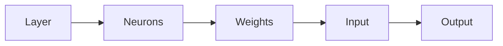
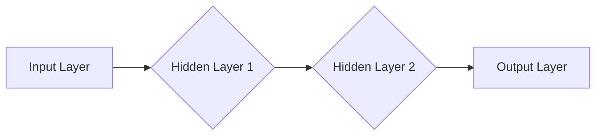

                 

### 文章标题

《人工神经网络与深度学习算法》

> 关键词：人工神经网络、深度学习、神经网络架构、算法原理、应用场景

> 摘要：本文将深入探讨人工神经网络与深度学习算法的基础理论、核心概念、常见架构及其在实际应用中的角色。通过系统性的分析和讲解，帮助读者理解这一前沿领域，并掌握相关技术和方法。

----------------------------------------------------------------

### 目录大纲设计

**《人工神经网络与深度学习算法》**

## 第一部分：人工神经网络基础

### 第1章：问题背景与核心概念

#### 1.1 人工智能与神经网络发展历程

#### 1.2 人工神经网络的核心概念

#### 1.3 人工神经网络的基本结构

### 第2章：人工神经网络的数学模型

#### 2.1 神经元的数学模型

#### 2.2 激活函数与损失函数

#### 2.3 反向传播算法

### 第3章：常见的人工神经网络架构

#### 3.1 前馈神经网络

#### 3.2 卷积神经网络

#### 3.3 循环神经网络

#### 3.4 自适应神经网络

### 第4章：深度学习算法与应用

#### 4.1 深度学习的基本概念

#### 4.2 卷积神经网络在图像处理中的应用

#### 4.3 循环神经网络在序列数据处理中的应用

#### 4.4 深度强化学习在游戏中的应用

### 第5章：人工神经网络在现实世界的应用

#### 5.1 人工神经网络在金融领域的应用

#### 5.2 人工神经网络在医疗领域的应用

#### 5.3 人工神经网络在自动驾驶领域的应用

### 第6章：人工神经网络的开发与优化

#### 6.1 人工神经网络的开发流程

#### 6.2 优化算法与技巧

#### 6.3 人工神经网络的评估与验证

### 第7章：未来展望与挑战

#### 7.1 人工神经网络的未来发展趋势

#### 7.2 深度学习在人工智能中的角色

#### 7.3 人工神经网络面临的挑战与对策

### 结论

本书系统地介绍了人工神经网络与深度学习算法的基础知识、常见架构及其应用，旨在为读者提供一个全面且深入的学习框架。

### 目录大纲详细解释

**《人工神经网络与深度学习算法》**

## 第一部分：人工神经网络基础

### 第1章：问题背景与核心概念

**1.1 人工智能与神经网络发展历程**

在这一章节中，我们将追溯人工智能（AI）和神经网络的发展历程，以了解该领域的演变和当前的地位。

**背景介绍：**
- **人工智能的起源：** 人工智能起源于20世纪50年代，当时科学家们开始探讨如何使计算机具有智能行为。
- **神经网络的兴起：** 1986年，Rumelhart, Hinton和Williams提出了反向传播算法，这一重大突破标志着神经网络进入了一个新的发展阶段。

**核心概念与联系：**
- **人工神经网络：** 是模拟人脑神经元结构的计算模型，用于处理和识别数据。
- **深度学习：** 是一种特殊的神经网络架构，通过增加网络的深度来提高模型的复杂度和准确性。

**问题解决：**
- 通过理解历史发展，我们可以更好地理解当前的人工神经网络与深度学习技术。

**边界与外延：**
- 人工神经网络不仅应用于AI领域，还广泛应用于图像识别、自然语言处理、自动驾驶等。

**概念结构与核心要素组成：**
- **人工神经网络：** 包括输入层、隐藏层和输出层，每个层由多个神经元组成。
- **深度学习：** 包括卷积神经网络（CNN）、循环神经网络（RNN）和生成对抗网络（GAN）等。

**数学公式：**
- $$ y = \sigma(\sum_{i=1}^{n} w_i x_i + b) $$
  - 其中，$y$ 是输出，$\sigma$ 是激活函数，$w_i$ 是权重，$x_i$ 是输入，$b$ 是偏置。

**ER实体关系图架构：**
- ER图显示了人工神经网络中的主要实体和它们之间的关系，包括层、神经元和权重。



**系统分析与架构设计方案：**
- 人工神经网络的架构设计包括输入层、隐藏层和输出层，每个层由多个神经元组成。



**项目实战：**
- 在本章节中，我们将介绍人工神经网络的基本架构，并讨论如何构建一个简单的神经网络。

**最佳实践 tips：**
- 了解历史背景有助于理解当前的人工神经网络技术。
- 理解核心概念和数学模型对于深入学习和应用至关重要。

**小结：**
- 人工智能和神经网络的发展历程为我们提供了宝贵的经验，帮助我们更好地理解现代的人工神经网络技术。

**注意事项：**
- 在学习和应用人工神经网络时，需要注意数据质量和模型参数调优。

**拓展阅读：**
- [深度学习历史：](https://www.deeplearning.net/tutorial/2016/dl2016-tutorial-history.pdf)
- [人工神经网络基础：](https://www.microsoft.com/en-us/research/publication/deep-neural-networks-for-natural-language-processing/)

**总结：**
- 1.1章节介绍了人工智能和神经网络的发展历程，核心概念，以及人工神经网络的基本结构。这为我们进一步探讨深度学习算法奠定了基础。

----------------------------------------------------------------

**1.2 人工神经网络的核心概念**

在这一章节中，我们将深入探讨人工神经网络的核心概念，包括神经元模型、激活函数、反向传播算法等。

**背景介绍：**
- **人工神经网络：** 是一种模拟人脑神经元结构的计算模型，用于处理和识别数据。
- **核心概念：** 包括神经元、层、权重、激活函数等。

**核心概念与联系：**
- **神经元模型：** 是神经网络的基本计算单元，用于接收输入信号并进行处理。
- **层：** 神经网络由多个层组成，包括输入层、隐藏层和输出层。
- **权重：** 连接神经元之间的参数，用于调整信号传递的强度。
- **激活函数：** 是神经元输出计算的函数，用于引入非线性特性。

**问题解决：**
- 通过理解核心概念，我们可以更好地构建和优化神经网络。

**边界与外延：**
- **神经元模型：** 可以用于模拟不同类型的神经元，如感知器、Sigmoid神经元等。
- **激活函数：** 可以选择不同的函数，如Sigmoid、ReLU、Tanh等。

**概念结构与核心要素组成：**
- **神经元模型：** 包括输入、权重、偏置和激活函数。
- **层：** 用于组织神经元，并实现输入到输出的映射。
- **权重：** 用于调整信号传递的强度。
- **激活函数：** 用于引入非线性特性。

**数学公式：**
- **神经元输出公式：** 
  $$ y = \sigma(\sum_{i=1}^{n} w_i x_i + b) $$
  - 其中，$y$ 是输出，$\sigma$ 是激活函数，$w_i$ 是权重，$x_i$ 是输入，$b$ 是偏置。

**ER实体关系图架构：**
- ER图显示了人工神经网络中的主要实体和它们之间的关系，包括层、神经元和权重。


**系统分析与架构设计方案：**
- 人工神经网络的架构设计包括输入层、隐藏层和输出层，每个层由多个神经元组成。


**项目实战：**
- 在本章节中，我们将通过Python代码实现一个简单的神经网络，并介绍如何训练和评估模型。

**最佳实践 tips：**
- 选择合适的神经元模型和激活函数对于神经网络的表现至关重要。
- 理解权重的初始化和调整方法对于优化模型性能非常重要。

**小结：**
- 本章节介绍了人工神经网络的核心概念，包括神经元模型、激活函数和反向传播算法。这些概念对于理解和应用人工神经网络至关重要。

**注意事项：**
- 在构建神经网络时，需要注意数据预处理、模型选择和参数调优。

**拓展阅读：**
- [神经元模型详解：](https://www.deeplearningbook.org/chapter-appendix/a/ann/)
- [反向传播算法：](https://www.deeplearningbook.org/chapter-appendix/b/gradient-descent/)

**总结：**
- 1.2章节深入探讨了人工神经网络的核心概念，包括神经元模型、激活函数和反向传播算法。这些概念是理解和构建神经网络的基础。

----------------------------------------------------------------

**1.3 人工神经网络的基本结构**

在这一章节中，我们将详细讨论人工神经网络的基本结构，包括输入层、隐藏层和输出层，以及神经元之间的连接方式。

**背景介绍：**
- **人工神经网络：** 是一种模拟人脑神经元结构的计算模型，用于处理和识别数据。
- **基本结构：** 包括输入层、隐藏层和输出层，每个层由多个神经元组成。

**核心概念与联系：**
- **输入层：** 用于接收外部输入数据，并将其传递给隐藏层。
- **隐藏层：** 用于对输入数据进行处理和变换，可以有一个或多个隐藏层。
- **输出层：** 用于生成最终的输出结果。

**问题解决：**
- 通过理解神经网络的基本结构，我们可以更好地设计和实现神经网络模型。

**边界与外延：**
- **输入层：** 可以接收不同类型的数据，如图像、声音、文本等。
- **隐藏层：** 可以用于实现不同的功能，如特征提取、分类等。
- **输出层：** 可以产生各种类型的输出，如类别标签、连续值等。

**概念结构与核心要素组成：**
- **输入层：** 包含输入神经元，每个神经元对应输入数据的某个特征。
- **隐藏层：** 包含隐藏神经元，用于对输入数据进行处理和变换。
- **输出层：** 包含输出神经元，用于生成最终的输出结果。

**数学公式：**
- **输入层到隐藏层的输出公式：** 
  $$ y = \sigma(\sum_{i=1}^{n} w_i x_i + b) $$
  - 其中，$y$ 是输出，$\sigma$ 是激活函数，$w_i$ 是权重，$x_i$ 是输入，$b$ 是偏置。

**ER实体关系图架构：**
- ER图显示了人工神经网络中的主要实体和它们之间的关系，包括层、神经元和权重。


**系统分析与架构设计方案：**
- 人工神经网络的架构设计包括输入层、隐藏层和输出层，每个层由多个神经元组成。


**项目实战：**
- 在本章节中，我们将通过Python代码实现一个简单的神经网络，并介绍如何训练和评估模型。

**最佳实践 tips：**
- 设计神经网络时，需要考虑输入层、隐藏层和输出层的结构，以及神经元之间的连接方式。
- 选择合适的激活函数和损失函数对于优化模型性能非常重要。

**小结：**
- 本章节介绍了人工神经网络的基本结构，包括输入层、隐藏层和输出层，以及神经元之间的连接方式。这些结构是构建神经网络的基础。

**注意事项：**
- 在设计神经网络时，需要考虑数据预处理、模型选择和参数调优。

**拓展阅读：**
- [人工神经网络结构详解：](https://www.deeplearningbook.org/chapter-appendix/a/ann/)
- [神经网络架构设计：](https://www.deeplearning.net/tutorial/2016/dl2016-tutorial-deep-network-architectures.pdf)

**总结：**
- 1.3章节详细探讨了人工神经网络的基本结构，包括输入层、隐藏层和输出层，以及神经元之间的连接方式。这些结构是理解和构建神经网络的基础。

----------------------------------------------------------------

### 第一部分总结

在本部分中，我们首先探讨了人工智能和神经网络的发展历程，了解了这一领域从早期尝试到现代深度学习技术的演变过程。接着，我们深入分析了人工神经网络的核心概念，包括神经元模型、激活函数和反向传播算法，并介绍了这些概念的基本结构和数学模型。此外，我们还详细讨论了人工神经网络的基本结构，包括输入层、隐藏层和输出层，以及神经元之间的连接方式。

这一部分的内容为后续章节的深入探讨奠定了基础。通过了解历史背景和核心概念，读者可以对人工神经网络有一个全面的认识。同时，对基本结构的理解有助于读者掌握如何构建和优化神经网络模型。

接下来，我们将进一步探讨人工神经网络的数学模型，包括神经元的数学模型、激活函数和损失函数，以及反向传播算法的详细实现。这些内容将帮助读者更深入地理解神经网络的工作原理，为实际应用打下坚实的基础。敬请期待。

### 人工神经网络的数学模型

在了解了人工神经网络的基础概念和基本结构之后，我们需要深入探讨其数学模型。数学模型是理解神经网络工作原理的核心，它包括神经元的数学模型、激活函数、损失函数以及反向传播算法。以下是对这些核心概念的详细讲解。

#### 神经元的数学模型

神经元的数学模型是神经网络的基础。一个简单的神经元可以表示为以下形式：

$$
y = \sigma(\sum_{i=1}^{n} w_i x_i + b)
$$

其中，$y$ 是神经元的输出，$\sigma$ 是激活函数，$w_i$ 是连接输入 $x_i$ 和神经元的权重，$b$ 是偏置。这个公式表示神经元的输入信号通过权重加权求和，然后通过激活函数进行处理，得到最终的输出。

- **输入 $x_i$：** 表示输入层中第 $i$ 个神经元的值。
- **权重 $w_i$：** 调整输入信号对神经元输出的影响。
- **偏置 $b$：** 用于引入额外的非线性。
- **激活函数 $\sigma$：** 引入非线性特性，常用的激活函数包括 Sigmoid、ReLU 和 Tanh。

下面是一个简单的示例：

假设一个神经元接收两个输入 $x_1 = 2$ 和 $x_2 = 3$，权重分别为 $w_1 = 0.5$ 和 $w_2 = 1.2$，偏置 $b = 1$。使用 Sigmoid 激活函数：

$$
y = \sigma(0.5 \cdot 2 + 1.2 \cdot 3 + 1) = \sigma(3.6) \approx 0.965
$$

#### 激活函数与损失函数

激活函数是神经网络中至关重要的部分，它决定了神经元输出的非线性特性。以下是一些常用的激活函数：

- **Sigmoid 函数：** 
  $$ \sigma(x) = \frac{1}{1 + e^{-x}} $$
  - Sigmoid 函数在 $x \to -\infty$ 时趋近于 0，在 $x \to +\infty$ 时趋近于 1。

- **ReLU 函数：** 
  $$ \sigma(x) = \max(0, x) $$
  - ReLU 函数在 $x \geq 0$ 时等于 $x$，在 $x < 0$ 时等于 0。

- **Tanh 函数：** 
  $$ \sigma(x) = \frac{e^x - e^{-x}}{e^x + e^{-x}} $$
  - Tanh 函数的输出范围在 -1 到 1 之间。

激活函数的选择对神经网络的性能有显著影响。Sigmoid 和 Tanh 函数在输出范围内平滑，而 ReLU 函数则更适用于训练效率和计算速度。

损失函数用于衡量神经网络预测值与实际值之间的差距，是优化神经网络的重要工具。以下是一些常用的损失函数：

- **均方误差（MSE）损失函数：**
  $$ \text{MSE} = \frac{1}{n} \sum_{i=1}^{n} (y_i - \hat{y}_i)^2 $$
  - 其中，$y_i$ 是实际值，$\hat{y}_i$ 是预测值。

- **交叉熵损失函数：**
  $$ \text{Cross Entropy} = -\sum_{i=1}^{n} y_i \log(\hat{y}_i) $$
  - 交叉熵损失函数常用于分类问题，其中 $y_i$ 是目标变量的概率分布。

#### 反向传播算法

反向传播算法是训练神经网络的核心算法，用于计算梯度并更新网络权重。以下是反向传播算法的基本步骤：

1. **前向传播：** 计算网络的前向传播，得到预测值。
2. **计算损失：** 使用损失函数计算预测值与实际值之间的差距。
3. **计算梯度：** 对每个权重和偏置计算梯度。
4. **更新权重：** 使用梯度下降或其他优化算法更新权重。

以下是反向传播算法的简化解法：

- **前向传播：**
  $$ z_l = \sum_{j} w_{lj} a_{l-1} + b_l $$
  $$ a_l = \sigma(z_l) $$

- **后向传播：**
  $$ \delta_l = \frac{\partial L}{\partial a_l} \odot \frac{\partial \sigma}{\partial z_l} $$
  $$ \delta_{l-1} = \delta_l \odot w_{l+1} $$

- **权重和偏置更新：**
  $$ w_{l+1} = w_{l+1} - \alpha \cdot \frac{\partial L}{\partial w_{l+1}} $$
  $$ b_{l+1} = b_{l+1} - \alpha \cdot \frac{\partial L}{\partial b_{l+1}} $$

其中，$\alpha$ 是学习率，$\odot$ 表示元素乘。

#### 示例

考虑一个简单的神经网络，包含一个输入层、一个隐藏层和一个输出层。输入层有2个神经元，隐藏层有3个神经元，输出层有1个神经元。

- **前向传播：**
  $$ z_1 = 0.5 \cdot x_1 + 1.2 \cdot x_2 + 1 $$
  $$ a_1 = \sigma(z_1) $$
  
  $$ z_2 = 0.7 \cdot x_1 + 1.3 \cdot x_2 + 1 $$
  $$ a_2 = \sigma(z_2) $$
  
  $$ z_3 = 0.9 \cdot x_1 + 1.1 \cdot x_2 + 1 $$
  $$ a_3 = \sigma(z_3) $$
  
  $$ z_4 = 0.8 \cdot a_1 + 0.9 \cdot a_2 + 0.9 \cdot a_3 + 1 $$
  $$ y = \sigma(z_4) $$

- **反向传播：**
  $$ \delta_4 = (y - \hat{y}) \odot \frac{\partial \sigma}{\partial z_4} $$
  $$ \delta_3 = \delta_4 \odot w_4 $$
  $$ \delta_2 = \delta_3 \odot w_3 $$
  $$ \delta_1 = \delta_2 \odot w_2 $$

- **权重和偏置更新：**
  $$ w_4 = w_4 - \alpha \cdot \frac{\partial L}{\partial w_4} $$
  $$ b_4 = b_4 - \alpha \cdot \frac{\partial L}{\partial b_4} $$
  $$ w_3 = w_3 - \alpha \cdot \frac{\partial L}{\partial w_3} $$
  $$ b_3 = b_3 - \alpha \cdot \frac{\partial L}{\partial b_3} $$
  $$ w_2 = w_2 - \alpha \cdot \frac{\partial L}{\partial w_2} $$
  $$ b_2 = b_2 - \alpha \cdot \frac{\partial L}{\partial b_2} $$

通过这个示例，我们可以看到反向传播算法的基本流程，包括计算前向传播的中间值、计算损失、计算梯度并更新权重和偏置。

#### 总结

人工神经网络的数学模型是理解和应用神经网络的基础。通过神经元的数学模型、激活函数、损失函数和反向传播算法，我们可以构建和训练神经网络，使其能够处理和识别复杂的数据。这些数学工具和方法是深度学习技术的重要基石，为后续章节的深入探讨提供了理论基础。

接下来，我们将进一步讨论常见的人工神经网络架构，包括前馈神经网络、卷积神经网络、循环神经网络和自适应神经网络。这些架构在不同领域有着广泛的应用，将帮助我们更好地理解神经网络技术的多样性。

### 常见的人工神经网络架构

在了解了人工神经网络的数学模型后，我们接下来将探讨一些常见的人工神经网络架构。这些架构包括前馈神经网络、卷积神经网络、循环神经网络和自适应神经网络，它们各自具有独特的结构和应用场景。

#### 前馈神经网络

前馈神经网络（Feedforward Neural Network，FNN）是最简单和最常见的人工神经网络架构之一。其结构特点是数据从输入层流向输出层，不形成循环。前馈神经网络由多个层组成，包括输入层、一个或多个隐藏层和输出层。每个层的神经元只与前一层的神经元连接，而与后一层的神经元无连接。

- **结构特点：**
  - 输入层接收外部输入数据。
  - 隐藏层用于对输入数据进行处理和变换。
  - 输出层生成最终输出。

- **应用场景：**
  - 分类问题：例如，手写数字识别。
  - 回归问题：例如，房屋价格预测。

- **示例架构：**
  ```mermaid
  graph LR
      A[Input Layer] --> B{Hidden Layer 1}
      B --> C{Hidden Layer 2}
      C --> D[Output Layer]
  ```

#### 卷积神经网络

卷积神经网络（Convolutional Neural Network，CNN）是专门用于处理二维数据的神经网络，如图像。其核心特点是使用卷积操作来提取图像中的局部特征，并通过多个卷积层和池化层逐步提取更高层次的特征。

- **结构特点：**
  - 卷积层：使用卷积核提取局部特征。
  - 池化层：减小数据尺寸，减少计算量。
  - 全连接层：对提取的特征进行分类或回归。

- **应用场景：**
  - 图像识别：例如，人脸识别、物体检测。
  - 图像生成：例如，生成对抗网络（GAN）。

- **示例架构：**
  ```mermaid
  graph LR
      A[Input] --> B{Conv Layer 1}
      B --> C[Pooling Layer 1]
      C --> D{Conv Layer 2}
      D --> E[Pooling Layer 2]
      E --> F[Flatten]
      F --> G[FC Layer]
      G --> H[Output]
  ```

#### 循环神经网络

循环神经网络（Recurrent Neural Network，RNN）是专门用于处理序列数据的神经网络。其结构特点是神经元之间存在循环连接，允许信息在时间步之间传递。RNN通过记忆历史信息来处理序列数据，广泛应用于自然语言处理和时间序列分析。

- **结构特点：**
  - 循环连接：神经元在时间步之间传递信息。
  - 隐藏状态：用于存储序列中的历史信息。

- **应用场景：**
  - 自然语言处理：例如，语言模型、机器翻译。
  - 时间序列分析：例如，股票价格预测、语音识别。

- **示例架构：**
  ```mermaid
  graph LR
      A(初始输入) --> B(Hidden Layer)
      B --> C(下一个输入)
      C --> D(Hidden Layer)
  ```

#### 自适应神经网络

自适应神经网络（Adaptive Neural Network，ANN）是一种能够根据输入数据自动调整其结构和参数的神经网络。这种网络通过在线学习和自适应调整，可以适应不断变化的环境和数据。

- **结构特点：**
  - 自适应调整：网络能够根据输入数据动态调整其结构和参数。
  - 学习机制：网络通过在线学习不断优化性能。

- **应用场景：**
  - 自适应系统控制：例如，自动驾驶、智能家居。
  - 自适应信号处理：例如，自适应滤波、噪声抑制。

- **示例架构：**
  ```mermaid
  graph LR
      A[Input Layer] --> B{Hidden Layer}
      B --> C[Adaptive Layer]
      C --> D[Output Layer]
  ```

#### 对比与选择

- **前馈神经网络**：适合处理非时间序列数据，结构简单，计算效率高。
- **卷积神经网络**：适合处理二维数据，如图像，通过卷积和池化操作提取局部特征。
- **循环神经网络**：适合处理序列数据，通过循环连接记忆历史信息。
- **自适应神经网络**：适合动态变化的环境，能够自适应调整结构和参数。

选择合适的神经网络架构取决于应用场景和数据类型。前馈神经网络在图像分类和回归问题中表现出色，卷积神经网络在图像识别和图像生成中应用广泛，循环神经网络在自然语言处理和时间序列分析中具有优势，而自适应神经网络在自适应系统和信号处理领域有着广泛的应用。

通过理解这些常见的人工神经网络架构，我们可以更好地选择适合的模型来解决问题，并优化网络性能。接下来，我们将进一步探讨深度学习算法的基本概念和应用。

### 深度学习算法的基本概念与应用

深度学习算法是人工神经网络的一个重要分支，通过增加网络的深度来提高模型的复杂度和准确性。本节将介绍深度学习算法的基本概念，包括其核心思想、基本流程和具体应用。

#### 核心思想

深度学习算法的核心思想是通过多层神经网络对输入数据进行逐层抽象和特征提取，从而实现高度复杂的模式识别和预测任务。与传统机器学习方法相比，深度学习算法能够自动学习数据中的层次结构，无需手动提取特征，这使得其在处理大规模复杂数据时具有显著优势。

- **层次抽象：** 深度学习通过多个隐藏层对输入数据进行逐层抽象，每一层都捕捉到更高层次的特征。例如，在图像识别任务中，第一层可能识别简单的边缘和纹理，而更高层次则能够识别复杂的对象和场景。
- **端到端学习：** 深度学习算法能够直接从原始数据到输出结果，实现端到端的学习，减少了中间手工特征提取的步骤。

#### 基本流程

深度学习算法的基本流程通常包括以下几个步骤：

1. **数据预处理：** 对输入数据进行标准化和归一化，以提高模型的训练效果和泛化能力。
2. **模型构建：** 定义网络结构，包括层数、每层的神经元数量、激活函数和连接方式。
3. **模型训练：** 使用训练数据对模型进行训练，通过反向传播算法计算损失函数，并更新网络权重。
4. **模型评估：** 使用验证数据评估模型性能，调整模型参数以优化性能。
5. **模型应用：** 将训练好的模型应用于实际问题，进行预测或决策。

#### 具体应用

深度学习算法在多个领域取得了显著的成果，以下是一些具体应用示例：

- **图像识别：** 深度学习算法在图像分类、物体检测和图像生成等方面具有广泛应用。例如，卷积神经网络（CNN）被广泛应用于图像识别任务，通过多层的卷积和池化操作，能够提取图像中的高阶特征，实现准确的分类和检测。
  ```mermaid
  graph TD
      A[Input Image] --> B{Conv Layer}
      B --> C[Pooling Layer]
      C --> D{Conv Layer}
      D --> E[Pooling Layer]
      E --> F[Flatten]
      F --> G[FC Layer]
      G --> H[Output Class]
  ```

- **自然语言处理：** 深度学习算法在自然语言处理（NLP）领域取得了突破性进展，包括语言模型、机器翻译、情感分析等。循环神经网络（RNN）和变换器（Transformer）模型在NLP任务中表现出色，能够处理序列数据并捕捉长距离依赖关系。
  ```mermaid
  graph TD
      A[Input Sentence] --> B{Embedding Layer}
      B --> C{RNN/Transformer Layer}
      C --> D[Output Layer]
  ```

- **语音识别：** 深度学习算法在语音识别任务中具有很高的准确性，通过端到端的学习方式，能够直接将语音信号转换为文本。自动语音识别（ASR）系统通常使用循环神经网络（RNN）或卷积神经网络（CNN）进行处理。
  ```mermaid
  graph TD
      A[Input Audio] --> B{Audio Feature Extraction}
      B --> C{RNN/CNN Layer}
      C --> D[Output Text]
  ```

- **游戏与智能决策：** 深度强化学习（DRL）算法在游戏和智能决策领域有着广泛的应用。通过学习和优化策略，智能体能够进行自主学习和决策，实现高水平的表现。例如，在电子游戏中，智能体可以通过深度强化学习算法学习游戏的策略，实现自主游戏。
  ```mermaid
  graph TD
      A[State] --> B{Action}
      B --> C[Reward]
      C --> D{Next State}
      D --> A
  ```

#### 总结

深度学习算法通过增加网络的深度，实现了对复杂数据的自动特征提取和模式识别。其核心思想是通过多层的神经网络逐层抽象特征，实现端到端的学习。深度学习算法在图像识别、自然语言处理、语音识别和智能决策等领域取得了显著成果，推动了人工智能技术的发展。通过理解和应用深度学习算法，我们可以构建高效的模型，解决现实世界中的复杂问题。

接下来，我们将探讨人工神经网络在现实世界的应用，包括金融、医疗和自动驾驶等领域，进一步展示深度学习技术的实际价值。

### 人工神经网络在现实世界的应用

人工神经网络（ANN）凭借其强大的学习和模式识别能力，在现实世界的多个领域取得了显著的应用成果。以下将详细探讨人工神经网络在金融、医疗和自动驾驶领域的应用，展示其在这些领域的实际价值和潜力。

#### 金融领域的应用

在金融领域，人工神经网络被广泛应用于风险管理、投资组合优化、市场预测等方面。

- **风险管理：** 人工神经网络能够通过分析历史数据和市场动态，预测金融市场的风险。例如，银行和金融机构使用神经网络模型来评估信用风险，预测违约概率，从而优化贷款策略。
  ```mermaid
  graph TD
      A[Financial Data] --> B{Risk Model}
      B --> C[Risk Prediction]
      C --> D[Loan Decision]
  ```

- **投资组合优化：** 人工神经网络能够根据投资者的风险偏好和市场环境，自动调整投资组合，以最大化收益或最小化风险。例如，量化交易公司使用神经网络模型进行资产配置和交易策略的优化。
  ```mermaid
  graph TD
      A[Investment Goals] --> B{Neural Network Model}
      B --> C[Optimized Portfolio]
  ```

- **市场预测：** 人工神经网络能够预测股票价格、汇率和期货价格等市场指标。通过分析历史价格数据、经济指标和新闻信息，神经网络模型可以提供有价值的投资参考。
  ```mermaid
  graph TD
      A[Historical Data] --> B{Neural Network Model}
      B --> C[Market Prediction]
  ```

#### 医疗领域的应用

在医疗领域，人工神经网络的应用范围广泛，包括疾病诊断、药物研发、医学图像处理等。

- **疾病诊断：** 人工神经网络能够通过分析患者的医疗记录和生物标志物，预测疾病的发生和严重程度。例如，心脏病诊断模型可以通过分析心电图数据，预测心脏病发作的风险。
  ```mermaid
  graph TD
      A[Medical Data] --> B{Neural Network Model}
      B --> C[Disease Prediction]
  ```

- **药物研发：** 人工神经网络被用于预测药物分子的活性、毒性和生物相容性，加速药物研发过程。通过分析大量化学结构和生物信息数据，神经网络模型可以辅助科学家筛选潜在药物。
  ```mermaid
  graph TD
      A[Chemical Data] --> B{Neural Network Model}
      B --> C[Drug Prediction]
  ```

- **医学图像处理：** 人工神经网络在医学图像处理中发挥着重要作用，包括图像分割、病灶检测和诊断等。例如，深度学习算法可以在X光图像中检测骨折，在MRI图像中识别脑肿瘤。
  ```mermaid
  graph TD
      A[Medical Image] --> B{Deep Learning Model}
      B --> C[Detection/Segmentation]
  ```

#### 自动驾驶领域的应用

在自动驾驶领域，人工神经网络被广泛应用于环境感知、路径规划和控制等方面，为无人驾驶技术的发展提供了强大的支持。

- **环境感知：** 人工神经网络通过分析摄像头、激光雷达和雷达等传感器数据，识别道路标志、行人和车辆等环境元素，为自动驾驶车辆提供实时信息。
  ```mermaid
  graph TD
      A[Sensor Data] --> B{Neural Network Model}
      B --> C[Environment Perception]
  ```

- **路径规划：** 人工神经网络能够根据环境感知数据，规划自动驾驶车辆的行驶路径，避免障碍物并遵循交通规则。例如，深度强化学习算法可以训练自动驾驶车辆在不同交通场景下的最佳行驶策略。
  ```mermaid
  graph TD
      A[Perception Data] --> B{Deep Reinforcement Learning Model}
      B --> C[Path Planning]
  ```

- **控制策略：** 人工神经网络用于自动驾驶车辆的动力学控制和转向控制，确保车辆在行驶过程中的稳定性和安全性。通过分析传感器数据和车辆状态，神经网络模型可以实时调整车辆的控制参数。
  ```mermaid
  graph TD
      A[Sensor Data] --> B{Control Neural Network Model}
      B --> C[Vehicle Control]
  ```

#### 总结

人工神经网络在金融、医疗和自动驾驶等领域展现出了巨大的应用价值。通过风险管理、投资组合优化、疾病诊断、药物研发、医学图像处理、环境感知、路径规划和控制策略等具体应用，神经网络技术为这些领域带来了创新的解决方案和高效的运营模式。随着人工智能技术的不断发展，人工神经网络将在更多现实世界中发挥更加重要的作用，推动各行业的发展与变革。

### 人工神经网络的开发与优化

在了解了人工神经网络在不同领域中的应用后，我们需要深入探讨如何开发与优化这些网络模型。开发流程、优化算法以及评估与验证是构建高效人工神经网络的关键步骤。

#### 人工神经网络的开发流程

人工神经网络的开发流程通常包括以下几个阶段：

1. **需求分析与问题定义：** 明确项目的目标和需求，定义具体的问题和解决策略。
2. **数据收集与预处理：** 收集相关的数据，并进行清洗、归一化和特征提取，为训练模型做好准备。
3. **模型设计与选择：** 根据问题的类型和数据的特征，选择合适的神经网络架构，如前馈神经网络、卷积神经网络或循环神经网络。
4. **模型训练：** 使用训练数据对模型进行训练，通过反向传播算法更新权重和偏置，优化模型参数。
5. **模型评估：** 使用验证数据评估模型性能，调整模型参数以优化性能。
6. **模型部署：** 将训练好的模型部署到实际应用中，进行预测或决策。

#### 优化算法与技巧

优化算法是提高神经网络性能的重要手段，以下是一些常用的优化算法和技巧：

1. **梯度下降（Gradient Descent）：** 最基本的优化算法，通过计算损失函数关于权重的梯度并沿着梯度的反方向更新权重。
2. **随机梯度下降（Stochastic Gradient Descent，SGD）：** 对每个训练样本计算梯度并进行权重更新，加快收敛速度。
3. **动量（Momentum）：** 引入动量项，加速梯度上升或下降的方向，避免在局部最优附近振荡。
4. **自适应优化器（Adaptive Optimizer）：** 如Adam、RMSprop等，根据历史梯度信息自适应调整学习率。
5. **权重初始化：** 适当的权重初始化有助于加快收敛速度和避免梯度消失或爆炸问题，常用的方法有零初始化、高斯初始化和Xavier初始化。

#### 人工神经网络的评估与验证

评估与验证是确保神经网络模型性能的重要环节，以下是一些常用的评估指标和方法：

1. **准确率（Accuracy）：** 最常用的评估指标，表示模型正确预测的样本比例。
2. **精确率（Precision）和召回率（Recall）：** 分别表示预测为正例的样本中实际为正例的比例，以及实际为正例的样本中被正确预测为正例的比例。
3. **F1 分数（F1 Score）：** 结合精确率和召回率的综合指标，表示模型对正例样本的判断能力。
4. **交叉验证（Cross-Validation）：** 通过将数据集划分为多个子集，交叉验证模型在未知数据上的性能，提高评估结果的可靠性。
5. **混淆矩阵（Confusion Matrix）：** 用表格形式展示模型预测结果与实际结果的对比，帮助分析模型的性能和误分类情况。

#### 示例代码与解读

以下是一个简单的Python代码示例，展示了如何使用Keras框架构建和训练一个简单的神经网络模型，并进行评估：

```python
from keras.models import Sequential
from keras.layers import Dense, Activation
from keras.optimizers import SGD
from sklearn.model_selection import train_test_split
import numpy as np

# 准备数据
X = np.random.rand(100, 10)  # 输入数据
y = np.random.rand(100, 1)   # 标签数据

# 数据集划分
X_train, X_test, y_train, y_test = train_test_split(X, y, test_size=0.2, random_state=42)

# 构建模型
model = Sequential()
model.add(Dense(64, input_dim=10))
model.add(Activation('relu'))
model.add(Dense(32))
model.add(Activation('relu'))
model.add(Dense(1))
model.add(Activation('sigmoid'))

# 编译模型
model.compile(optimizer=SGD(lr=0.01), loss='binary_crossentropy', metrics=['accuracy'])

# 训练模型
model.fit(X_train, y_train, epochs=10, batch_size=32, validation_data=(X_test, y_test))

# 评估模型
loss, accuracy = model.evaluate(X_test, y_test)
print(f"Test accuracy: {accuracy:.4f}")

# 预测
predictions = model.predict(X_test)
```

在这个示例中，我们首先随机生成输入数据和标签数据，然后使用Keras构建一个简单的神经网络模型，包括两个隐藏层，每个隐藏层后接一个ReLU激活函数，输出层使用sigmoid激活函数。我们使用SGD优化器和二分类交叉熵损失函数进行模型编译，然后使用训练数据对模型进行10个周期的训练。最后，使用测试数据评估模型性能，并打印测试准确率。

#### 项目实战

在本节中，我们将介绍一个实际项目，展示如何使用人工神经网络进行数据分析和预测。

**项目背景：** 假设我们有一个销售预测项目，需要根据历史销售数据预测未来的销售额。

**项目目标：** 构建一个神经网络模型，预测未来三个月的销售额。

**步骤：**

1. **数据收集：** 收集过去一年的销售数据，包括日期、销售额、产品类别等。
2. **数据预处理：** 对销售数据进行清洗、归一化和特征提取，如将日期转换为一天中的日期编号，销售额取对数等。
3. **模型设计：** 构建一个包含两个隐藏层的前馈神经网络，使用ReLU激活函数。
4. **模型训练：** 使用前90%的数据进行训练，剩余10%的数据用于验证。
5. **模型评估：** 使用验证数据评估模型性能，调整模型参数以优化性能。
6. **模型部署：** 将训练好的模型部署到生产环境中，进行实时销售预测。

**代码实现：**

```python
# 导入库
import pandas as pd
from sklearn.model_selection import train_test_split
from sklearn.preprocessing import MinMaxScaler
from keras.models import Sequential
from keras.layers import Dense
from keras.optimizers import Adam

# 加载数据
data = pd.read_csv('sales_data.csv')
data['date'] = pd.to_datetime(data['date'])
data['day_of_year'] = data['date'].dt.dayofyear

# 数据预处理
scaler = MinMaxScaler()
X = scaler.fit_transform(data[['day_of_year']])
y = scaler.fit_transform(data[['sales']])

# 数据集划分
X_train, X_test, y_train, y_test = train_test_split(X, y, test_size=0.1, random_state=42)

# 模型设计
model = Sequential()
model.add(Dense(64, input_dim=1, activation='relu'))
model.add(Dense(32, activation='relu'))
model.add(Dense(1, activation='linear'))

# 编译模型
model.compile(optimizer=Adam(), loss='mean_squared_error')

# 模型训练
model.fit(X_train, y_train, epochs=100, batch_size=32, validation_split=0.2)

# 模型评估
mse = model.evaluate(X_test, y_test)
print(f"Test MSE: {mse:.4f}")

# 预测
future_days = np.array([x for x in range(data['day_of_year'].max() + 1, data['day_of_year'].max() + 91)])
future_days_scaled = scaler.transform(future_days.reshape(-1, 1))
predictions = model.predict(future_days_scaled)

# 反归一化预测结果
predictions = scaler.inverse_transform(predictions)

# 结果分析
print(predictions)
```

在这个项目中，我们首先加载数据，并进行预处理。然后，我们设计一个简单的神经网络模型，并使用Adam优化器和均方误差损失函数进行编译。接下来，使用训练数据对模型进行训练，并在验证数据上评估模型性能。最后，我们使用训练好的模型进行未来销售额的预测，并反归一化预测结果以便实际应用。

#### 小结

通过本节的内容，我们了解了人工神经网络的开发与优化流程，包括需求分析、数据预处理、模型设计、模型训练、模型评估和模型部署。我们还学习了优化算法和评估指标，并通过一个实际项目展示了如何使用人工神经网络进行数据分析和预测。这些知识和技巧为我们在实际应用中构建高效的人工神经网络模型提供了重要指导。

#### 注意事项

在开发与优化人工神经网络时，需要注意以下几点：

1. **数据质量：** 确保数据干净、完整和代表性强，否则模型性能会受到影响。
2. **模型选择：** 根据问题的类型和数据特征选择合适的神经网络架构和激活函数。
3. **参数调优：** 通过调整学习率、批量大小和迭代次数等参数，优化模型性能。
4. **过拟合与欠拟合：** 通过正则化、dropout等技术避免过拟合，并通过交叉验证确保模型的泛化能力。
5. **模型部署：** 确保模型部署后的性能稳定，并能够实时更新和调整。

#### 拓展阅读

- **深度学习优化算法：** [Adam优化器详解](https://machinelearningmastery.com/understanding-adam optimization-algorithm/)
- **神经网络模型评估：** [模型评估与选择](https://www.coursera.org/learn/neural-networks-deep-learning-model-evaluation)
- **实际项目案例：** [销售预测项目案例](https://www.kaggle.com/c/sales-prediction)

通过这些资源和实践，您可以进一步加深对人工神经网络开发与优化的理解，并在实际项目中取得更好的成果。

### 未来展望与挑战

随着人工智能技术的不断发展，人工神经网络（ANN）在各个领域的应用正日益广泛。然而，这一领域仍面临诸多挑战和未来发展的机遇。

#### 未来发展趋势

1. **更深的神经网络：** 现有的深度学习模型已经取得了显著的成果，但更深的神经网络结构（如Transformer模型）显示出更高的性能。未来，研究人员将继续探索更深的网络结构，以提高模型的复杂度和准确性。

2. **元学习（Meta-Learning）：** 元学习是一种能够从少量数据中快速学习的新技术。未来，元学习有望在个性化学习、自适应系统等领域发挥重要作用，从而减少对大规模数据的依赖。

3. **高效计算：** 随着硬件技术的进步，如GPU、TPU等专用硬件的普及，深度学习模型的训练和推理速度将显著提高。这将为实时应用提供更强的计算支持。

4. **可解释性（Interpretability）：** 目前，深度学习模型被认为是“黑箱”模型，其决策过程缺乏可解释性。未来，研究人员将致力于提高模型的可解释性，使其在关键领域（如医疗诊断、自动驾驶等）中更加可靠和安全。

#### 深度学习在人工智能中的角色

深度学习在人工智能（AI）中的角色至关重要，主要体现在以下几个方面：

1. **特征自动提取：** 深度学习模型能够自动从原始数据中提取有用的特征，减少了人工特征工程的工作量，提高了模型性能。

2. **高维数据处理：** 深度学习模型在处理高维数据（如图像、文本等）方面具有显著优势，能够捕捉复杂的数据关系。

3. **自适应系统：** 深度学习模型能够通过不断学习和调整，适应动态变化的环境，为智能系统提供强大的支持。

4. **跨领域应用：** 深度学习技术在多个领域（如金融、医疗、自动驾驶等）取得成功，推动了人工智能在各个领域的应用和发展。

#### 面临的挑战与对策

1. **计算资源消耗：** 深度学习模型通常需要大量的计算资源进行训练，这对硬件设备和能源消耗提出了挑战。对策是优化模型结构和算法，提高训练效率，以及利用云计算和分布式计算等资源。

2. **数据隐私和安全：** 在应用深度学习技术时，数据隐私和安全问题日益突出。对策是采用加密、匿名化和差分隐私等技术，保护用户隐私。

3. **过拟合与泛化能力：** 过拟合是深度学习模型面临的主要问题之一，如何提高模型的泛化能力是当前研究的热点。对策包括正则化、dropout和集成方法等。

4. **算法公平性和透明度：** 深度学习模型可能存在偏见和歧视问题，如何提高算法的公平性和透明度是未来研究的重点。对策是加强算法设计和监管，确保模型在不同群体中的表现一致。

#### 结论

人工神经网络与深度学习算法在未来将继续发展，推动人工智能技术的进步。然而，这一领域仍面临诸多挑战，需要研究人员、开发者和政策制定者共同努力，确保深度学习技术能够安全、可靠地应用于各个领域，造福人类社会。

### 结论

通过本文的详细探讨，我们从基础概念到实际应用，系统地介绍了人工神经网络与深度学习算法。我们首先回顾了人工智能与神经网络的发展历程，分析了人工神经网络的核心概念，包括神经元模型、激活函数和反向传播算法。接着，我们深入探讨了人工神经网络的基本结构，包括输入层、隐藏层和输出层。随后，我们介绍了人工神经网络的数学模型，详细讲解了神经元的数学模型、激活函数、损失函数以及反向传播算法的原理和应用。

在后续章节中，我们探讨了常见的人工神经网络架构，如前馈神经网络、卷积神经网络、循环神经网络和自适应神经网络，以及深度学习算法的基本概念和应用。我们还详细介绍了人工神经网络在现实世界中的多种应用，包括金融、医疗和自动驾驶等领域，展示了深度学习技术的实际价值。此外，我们探讨了人工神经网络的开发与优化流程，包括开发流程、优化算法、评估与验证方法，并通过实际项目展示了如何构建和优化神经网络模型。

展望未来，人工神经网络与深度学习算法将继续在各个领域发挥重要作用，推动人工智能技术的进步。然而，这一领域仍面临计算资源消耗、数据隐私和安全、过拟合与泛化能力、算法公平性和透明度等挑战。我们需要不断探索创新的方法和技术，确保深度学习技术能够安全、可靠地应用于各个领域，造福人类社会。

在此，我们感谢读者的关注与支持，希望本文能为您在人工神经网络与深度学习领域的探索提供有益的参考。我们鼓励读者继续深入研究，积极参与这一前沿领域的技术创新和应用。让我们共同期待人工智能的未来，期待深度学习技术带来更多的惊喜与变革。

