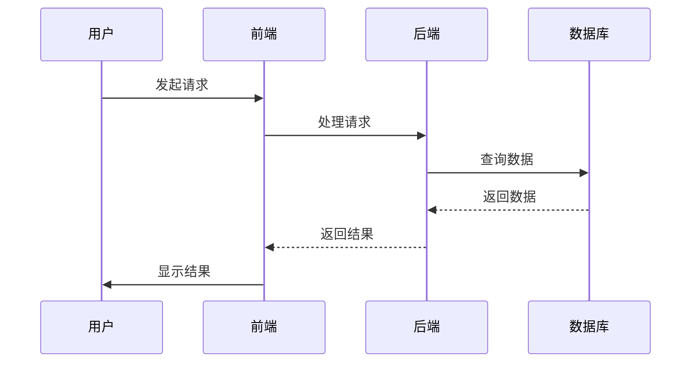
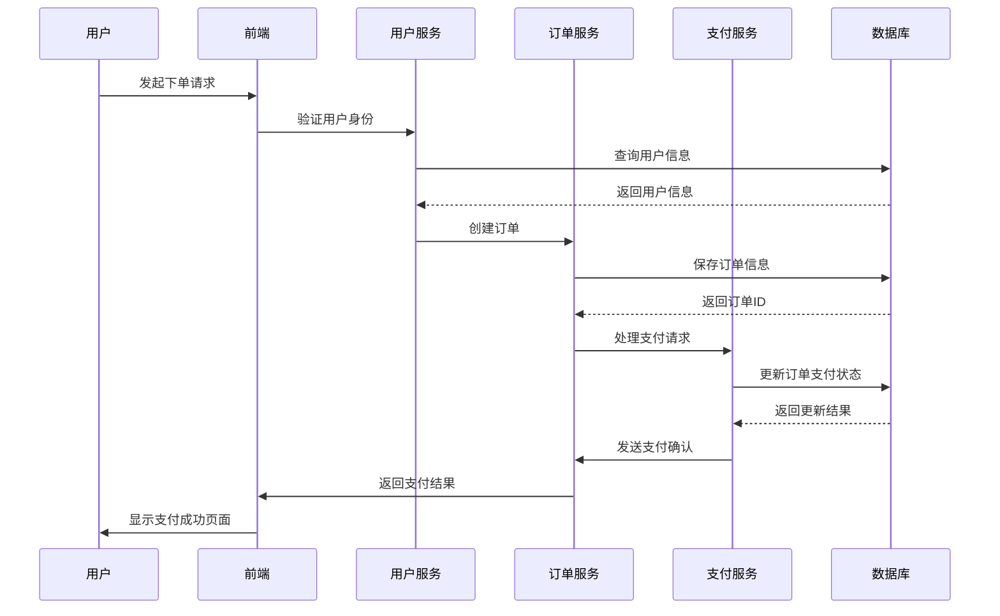

                 


### 引言

**文章标题**：从上到下保可用的设计

**关键词**：设计原则、系统架构、迭代优化、设计质量

**摘要**：

本文旨在探讨一种面向长期可持续发展的设计理念——从上到下保可用的设计。通过深入剖析设计原则、实践方法及其在各个领域的应用，本文将帮助读者理解和掌握这一设计理念，从而在实际项目中实现高效、稳定和可维护的系统。

在当前快速发展的信息技术时代，软件和硬件系统愈发复杂，对设计的质量和效率提出了更高的要求。传统的自下而上的设计方法往往在面对复杂性和变更时显得力不从心。因此，从上到下保可用的设计应运而生，它通过高层次的架构设计和灵活的模块化方法，实现了系统的高可维护性和可扩展性。

本文结构如下：

- **第1章 引言**：介绍设计问题的背景与挑战，明确本文的核心目标与价值。
- **第2章 设计原则与理念**：详细阐述从上到下设计的基本原则和核心理念。
- **第3章 设计流程与方法**：探讨从上到下的设计流程和具体方法。
- **第4章 设计实践案例**：通过具体案例展示设计原则的应用。
- **第5章 逆向设计与重构**：讨论系统迭代和重构的策略与技巧。
- **第6章 设计质量控制**：介绍设计质量评估的方法和流程。
- **第7章 未来展望与趋势**：分析设计领域的未来发展趋势。
- **第8章 小结与拓展**：总结本文内容，提供实践建议和进一步阅读的参考资料。

### 第1章 引言

#### 1.1 问题背景与挑战

在当今信息技术飞速发展的时代，软件和硬件系统的复杂度持续增加，这给设计带来了前所未有的挑战。传统的自下而上的设计方法，虽然能够逐步构建系统的底层细节，但在面对系统整体架构和复杂性时，往往显得力不从心。这种设计方法的一个主要问题是，它倾向于先实现细节功能，然后逐步整合到整体架构中。这种方法在早期阶段可能会因为局部优化而牺牲整体性能和可维护性。

首先，自下而上的设计方法容易导致系统功能的碎片化。各个功能模块在独立开发时，往往缺乏对整体系统的全局视角，导致模块之间的交互复杂且不协调。这种碎片化的设计不仅增加了系统的复杂性，还降低了系统的整体性能和可维护性。

其次，自下而上的设计方法在面对系统的变更时，表现尤为脆弱。由于缺乏对系统整体结构的深入理解，对某个模块的变更可能需要牵扯到整个系统的其他部分。这种情况下，变更的风险和成本大大增加，而且可能会导致系统稳定性下降。

此外，自下而上的设计方法在应对需求变更时也存在一定的问题。在项目的早期阶段，用户的需求往往不够明确或不断变化。自下而上的设计方法难以适应这种需求的不确定性，容易导致后期频繁的返工和重构。

#### 1.2 设计的目标与价值

为了解决上述问题，从上到下保可用的设计方法应运而生。这种方法的核心目标是通过高层次的架构设计和模块化方法，实现系统的高可维护性和可扩展性。具体来说，从上到下保可用的设计方法具有以下价值：

1. **全局视角**：从上到下的设计方法强调在早期阶段就建立系统的全局架构，有助于设计者从整体上理解系统的结构和功能，避免局部优化的陷阱。

2. **模块化设计**：通过模块化设计，可以将复杂的系统拆分为多个独立且可重用的模块，降低模块之间的依赖性，提高系统的可维护性和可扩展性。

3. **早期风险评估**：在系统设计的早期阶段，通过高层次的架构设计，可以提前发现潜在的设计缺陷和风险，从而在早期进行必要的调整和优化。

4. **灵活应对变更**：从上到下的设计方法提供了一种灵活的架构，使得系统在面对需求变更时，可以更加从容地进行调整和重构，降低变更带来的风险和成本。

5. **提高开发效率**：通过高层次的架构设计和模块化方法，可以减少系统开发的重复性工作，提高开发效率。

#### 1.3 内容概述与结构

本文将围绕从上到下保可用的设计方法，详细探讨其核心原则、设计流程、实践案例、逆向设计与重构、设计质量控制以及未来展望等内容。具体内容结构如下：

- **第1章 引言**：介绍设计问题的背景与挑战，明确本文的核心目标与价值。
- **第2章 设计原则与理念**：详细阐述从上到下设计的基本原则和核心理念。
- **第3章 设计流程与方法**：探讨从上到下的设计流程和具体方法。
- **第4章 设计实践案例**：通过具体案例展示设计原则的应用。
- **第5章 逆向设计与重构**：讨论系统迭代和重构的策略与技巧。
- **第6章 设计质量控制**：介绍设计质量评估的方法和流程。
- **第7章 未来展望与趋势**：分析设计领域的未来发展趋势。
- **第8章 小结与拓展**：总结本文内容，提供实践建议和进一步阅读的参考资料。

### 第2章 设计原则与理念

#### 2.1 设计原则概述

从上到下保可用的设计方法，建立在一系列核心设计原则之上。这些原则包括：

1. **自顶向下设计**：在设计初期，就构建系统的全局架构，以整体视角为导向。
2. **模块化设计**：将系统分解为独立的模块，每个模块负责特定的功能，降低模块之间的耦合度。
3. **抽象与泛化**：通过抽象和泛化，提高系统的灵活性和可扩展性。
4. **高内聚低耦合**：确保模块内部高度内聚，模块之间保持低耦合。
5. **持续迭代与重构**：在系统开发过程中，持续进行迭代和重构，以适应需求的变化。

#### 2.2 设计理念的演变

设计理念并非一成不变，而是随着技术的发展和需求的变迁而不断演变。从早期的单一功能设计，到后来的模块化设计，再到现代的微服务架构，设计理念的核心始终是提高系统的可维护性和可扩展性。

1. **单一功能设计**：早期的计算机系统设计注重单一功能的实现，设计者关注如何高效地完成特定任务。
2. **模块化设计**：随着软件复杂度的增加，模块化设计成为主流。通过将系统拆分为多个模块，提高了系统的可维护性和可扩展性。
3. **微服务架构**：在互联网时代，微服务架构成为了一种流行的设计方法。它通过将系统划分为多个独立的微服务，实现了更高的灵活性和可扩展性。

#### 2.3 设计的核心要素

从上到下保可用的设计方法，强调以下核心要素：

1. **全局架构设计**：在设计初期，构建系统的全局架构，确保系统能够灵活地应对未来的变化。
2. **模块化**：将系统拆分为多个独立的模块，每个模块负责特定的功能，降低模块之间的耦合度。
3. **抽象与泛化**：通过抽象和泛化，将具体实现细节与系统核心逻辑分离，提高系统的灵活性和可扩展性。
4. **高内聚低耦合**：确保模块内部高度内聚，模块之间保持低耦合，从而提高系统的可维护性和可扩展性。
5. **持续迭代与重构**：在系统开发过程中，持续进行迭代和重构，以适应需求的变化。

#### 2.4 设计原则的应用

以下是一个设计原则应用的示例：

假设我们需要设计一个在线购物系统。从上到下保可用的设计方法将首先关注系统的全局架构。我们将系统分为以下几个核心模块：

1. **用户模块**：负责用户的注册、登录和用户信息管理。
2. **商品模块**：负责商品信息的展示、分类和库存管理。
3. **订单模块**：负责订单的创建、支付和配送管理。
4. **购物车模块**：负责用户购物车中的商品管理。

在模块划分完成后，我们遵循高内聚低耦合的原则，确保每个模块内部高度内聚，模块之间保持低耦合。例如，用户模块内部负责用户注册、登录和用户信息管理，而用户模块与其他模块之间的交互通过明确的接口进行。

通过这种从上到下保可用的设计方法，我们可以实现一个高效、稳定和可维护的在线购物系统。这种设计方法不仅有助于提高系统的可维护性和可扩展性，还能在系统需求发生变化时，灵活地进行调整和重构。

### 第3章 设计流程与方法

#### 3.1 设计流程概述

从上到下保可用的设计流程可以分为以下几个主要阶段：

1. **需求分析**：明确系统的功能和性能需求，为后续设计提供基础。
2. **全局架构设计**：构建系统的全局架构，确保系统能够灵活地应对未来的变化。
3. **模块化设计**：将系统拆分为多个独立的模块，每个模块负责特定的功能，降低模块之间的耦合度。
4. **详细设计**：对每个模块进行详细设计，包括数据结构、算法和接口。
5. **编码实现**：根据详细设计进行编码实现，确保模块的功能正确和高效。
6. **测试与优化**：对系统进行全面的测试，发现并修复潜在问题，进行性能优化。
7. **迭代与重构**：根据反馈和需求变化，持续进行迭代和重构，以保持系统的稳定性和可维护性。

#### 3.2 设计方法论

从上到下保可用的设计方法采用了一系列方法论来指导设计过程：

1. **顶层设计**：在设计的早期阶段，就构建系统的全局架构，从整体上规划系统的结构和功能。
2. **模块化设计**：将系统分解为多个独立的模块，每个模块负责特定的功能，降低模块之间的耦合度。
3. **抽象与泛化**：通过抽象和泛化，将具体实现细节与系统核心逻辑分离，提高系统的灵活性和可扩展性。
4. **高内聚低耦合**：确保模块内部高度内聚，模块之间保持低耦合，从而提高系统的可维护性和可扩展性。
5. **持续迭代与重构**：在系统开发过程中，持续进行迭代和重构，以适应需求的变化。

#### 3.3 设计工具与技术

在进行从上到下保可用的设计时，我们可以利用一系列工具和技术来提高设计效率和效果：

1. **统一建模语言（UML）**：UML是一种广泛使用的建模语言，可以帮助设计者直观地描述系统的结构和行为。
2. **架构设计工具**：如PlantUML、ARCAT等，可以用于绘制系统的架构图和类图。
3. **版本控制工具**：如Git，可以用于管理设计文档和代码的版本，确保设计过程的可追溯性。
4. **文档生成工具**：如Doxygen，可以自动生成系统的设计文档，方便团队成员进行沟通和协作。
5. **代码审查工具**：如SonarQube，可以自动检测代码中的潜在问题，提高代码质量。

#### 3.4 设计流程示例

以下是一个从上到下保可用设计流程的示例：

1. **需求分析**：明确系统的功能和性能需求，包括用户注册、登录、商品浏览、购物车管理、订单创建和支付等功能。
2. **全局架构设计**：构建系统的全局架构，将系统分为用户模块、商品模块、订单模块和购物车模块，并定义各模块之间的接口。
3. **模块化设计**：对每个模块进行模块化设计，例如用户模块包括用户注册、登录和用户信息管理三个子模块。
4. **详细设计**：对每个模块进行详细设计，包括数据结构、算法和接口，例如用户注册模块的设计可能包括用户信息的收集、验证和存储。
5. **编码实现**：根据详细设计进行编码实现，确保每个模块的功能正确和高效。
6. **测试与优化**：对系统进行全面的测试，包括功能测试、性能测试和安全测试，并根据测试结果进行性能优化。
7. **迭代与重构**：根据用户反馈和需求变化，对系统进行迭代和重构，例如增加新功能或优化现有功能。

通过以上设计流程和方法，我们可以确保系统的高可维护性和可扩展性，同时提高开发效率和产品质量。

### 第4章 设计实践案例

#### 4.1 案例一：软件系统设计

**案例背景**：

某公司需要开发一款企业管理系统，用于处理企业的日常运营数据，包括客户管理、订单管理、财务管理等模块。系统需要具备良好的扩展性，以适应未来的业务需求变化。

**设计目标**：

1. **高可维护性**：系统设计需要易于维护，方便后续功能扩展和代码修改。
2. **高可扩展性**：系统能够轻松地增加新功能，适应业务增长。
3. **高性能**：系统需要在高负载下保持稳定运行，提供快速响应。

**设计过程**：

1. **需求分析**：与公司管理层和业务人员沟通，明确系统的功能和性能需求。
2. **全局架构设计**：将系统分为以下几个核心模块：

   - **用户模块**：处理用户注册、登录和权限管理。
   - **客户管理模块**：管理客户信息，包括客户资料、联系方式等。
   - **订单管理模块**：处理订单的创建、修改和取消。
   - **财务管理模块**：处理财务报表、收支记录等。
   - **报表模块**：生成各种业务报表。

3. **模块化设计**：对每个模块进行进一步拆分，例如：

   - **用户模块**：拆分为用户注册、登录、用户信息和权限管理四个子模块。
   - **客户管理模块**：拆分为客户信息管理、客户联系信息管理和客户报表三个子模块。
   - **订单管理模块**：拆分为订单创建、订单修改、订单取消和订单报表四个子模块。
   - **财务管理模块**：拆分为财务报表生成、收支记录管理和财务报表查看三个子模块。

4. **详细设计**：对每个模块和子模块进行详细设计，包括数据结构、算法和接口。

5. **编码实现**：根据详细设计进行编码实现，确保每个模块的功能正确和高效。

6. **测试与优化**：对系统进行全面的测试，包括功能测试、性能测试和安全测试，并根据测试结果进行性能优化。

**效果评估**：

通过从上到下保可用的设计方法，该企业管理系统实现了以下效果：

1. **高可维护性**：模块化设计和详细的接口定义，使得系统维护变得更加容易。
2. **高可扩展性**：随着业务需求的变更，系统能够快速适应，无需大规模重构。
3. **高性能**：经过优化和测试，系统在高负载下仍能保持稳定运行。

#### 4.2 案例二：硬件系统设计

**案例背景**：

某科技公司需要设计一款高性能的云计算服务器，用于处理大规模数据分析和计算任务。服务器需要具备高可靠性、高性能和可扩展性。

**设计目标**：

1. **高可靠性**：服务器需要在长时间运行中保持稳定，避免故障。
2. **高性能**：服务器需要快速处理大量数据，提供高效的计算能力。
3. **可扩展性**：服务器设计需要支持未来的硬件升级和扩展。

**设计过程**：

1. **需求分析**：与客户沟通，明确服务器的性能需求和可靠性要求。
2. **全局架构设计**：设计服务器的硬件架构，包括处理器、内存、存储和网络设备。
3. **模块化设计**：将服务器拆分为以下几个核心模块：

   - **处理器模块**：负责数据分析和计算任务。
   - **内存模块**：提供高速数据存储和缓存。
   - **存储模块**：提供大容量数据存储。
   - **网络模块**：处理数据传输和通信。
   - **电源模块**：提供稳定的电源供应。

4. **详细设计**：对每个模块进行详细设计，包括硬件选型、接口设计和通信协议。

5. **编码实现**：根据详细设计进行硬件实现，确保每个模块的功能正确和高效。

6. **测试与优化**：对服务器进行全面的测试，包括性能测试、可靠性测试和扩展性测试，并根据测试结果进行性能优化。

**效果评估**：

通过从上到下保可用的设计方法，该云计算服务器实现了以下效果：

1. **高可靠性**：通过模块化设计和冗余备份，服务器在长时间运行中保持稳定。
2. **高性能**：经过优化和测试，服务器在处理大规模数据分析和计算任务时表现出色。
3. **可扩展性**：服务器设计支持未来的硬件升级和扩展，能够满足未来业务需求。

#### 4.3 案例三：用户体验设计

**案例背景**：

某电商平台需要优化其移动应用的用户体验，以提高用户满意度和留存率。优化目标包括界面设计、交互设计和性能优化。

**设计目标**：

1. **良好的界面设计**：提供直观、美观且易于使用的界面。
2. **流畅的交互体验**：确保用户操作的响应速度和流畅性。
3. **高性能**：应用在各类移动设备上均能提供良好的性能。

**设计过程**：

1. **需求分析**：通过用户调研和数据分析，了解用户的使用习惯和痛点。
2. **全局架构设计**：设计应用的界面架构，确定主要页面和导航流程。
3. **模块化设计**：将应用拆分为以下核心模块：

   - **首页模块**：展示最新商品和促销信息。
   - **分类模块**：提供商品分类和搜索功能。
   - **购物车模块**：管理用户购物车中的商品。
   - **订单模块**：处理订单的创建、支付和配送。
   - **个人中心模块**：管理用户个人信息和订单记录。

4. **详细设计**：对每个模块进行详细设计，包括界面布局、交互设计和数据结构。

5. **编码实现**：根据详细设计进行界面和交互的编码实现，确保用户体验良好。

6. **测试与优化**：对应用进行全面的测试，包括功能测试、性能测试和用户体验测试，并根据测试结果进行优化。

**效果评估**：

通过从上到下保可用的设计方法，该电商平台移动应用实现了以下效果：

1. **良好的界面设计**：应用界面美观直观，用户操作更加便捷。
2. **流畅的交互体验**：用户操作的响应速度和流畅性显著提升。
3. **高性能**：应用在各类移动设备上均能提供良好的性能，提高了用户满意度。

### 第5章 逆向设计与重构

#### 5.1 逆向设计与重构原理

逆向设计与重构是软件维护和升级中至关重要的一环。逆向设计（Reversing Engineering）是指通过分析现有软件系统的结构和代码，提取出系统的设计信息，以便更好地理解系统的功能和功能模块之间的关系。重构（Refactoring）则是指在保持代码功能不变的前提下，对代码结构和设计进行改进，以提高系统的可维护性和可扩展性。

逆向设计与重构的主要目的是：

1. **理解现有系统**：通过逆向设计，开发人员可以更深入地理解现有系统的设计和实现，发现潜在的问题和优化点。
2. **提高可维护性**：重构可以改善代码结构，减少代码复杂性，使系统更加易于维护。
3. **提高可扩展性**：重构可以使系统更易于扩展，适应未来的需求变化。
4. **降低维护成本**：通过逆向设计和重构，可以减少未来的维护成本，提高开发效率。

#### 5.2 重构方法与实践

在进行逆向设计和重构时，可以采用以下方法：

1. **代码审查**：对现有代码进行审查，识别出可能的问题和优化点。代码审查可以是手动进行的，也可以借助自动化工具。
2. **重构策略**：根据代码审查的结果，制定重构策略。常见的重构策略包括：

   - **提取类和方法**：将重复的代码提取为单独的类或方法，减少代码冗余。
   - **合并类和方法**：将功能相关的类和方法合并，减少类和方法的数量。
   - **简化条件表达式**：通过重构条件表达式，提高代码的可读性。
   - **移除重复代码**：识别并移除重复的代码，减少代码的复杂性。
   - **引入设计模式**：根据需求，引入合适的设计模式，提高系统的可扩展性和可维护性。

3. **自动化工具**：利用自动化工具进行重构，可以提高重构的效率和准确性。常见的自动化工具包括：

   - **重构工具**：如Visual Studio的“重构”功能、Eclipse的“Refactor”菜单。
   - **静态代码分析工具**：如SonarQube、FindBugs，可以自动识别代码中的潜在问题。
   - **单元测试工具**：如JUnit、NUnit，可以确保重构过程中代码功能的正确性。

#### 5.3 设计迭代与优化

逆向设计和重构并不是一次性的过程，而是一个持续迭代和优化的过程。以下是设计迭代与优化的几个关键步骤：

1. **需求分析**：在每次重构前，对系统的需求进行重新分析，确保重构方向符合实际需求。
2. **评估风险**：在进行重构前，评估重构可能带来的风险，包括功能丢失、性能下降等。
3. **制定重构计划**：根据需求分析和风险评估，制定详细的重构计划，包括重构的范围、顺序和资源分配。
4. **执行重构**：按照重构计划，逐步进行重构工作，确保每次重构后的系统功能正确性和性能。
5. **测试与验证**：在重构完成后，对系统进行全面测试，验证重构后的功能正确性和性能。
6. **文档更新**：更新系统文档，包括设计文档、代码注释等，确保文档与重构后的系统一致。

通过持续迭代和优化，可以逐步提高系统的可维护性和可扩展性，使其能够更好地适应未来的需求变化。

### 第6章 设计质量控制

#### 6.1 设计质量标准

设计质量是确保系统稳定运行、高效交付和持续维护的关键。以下是一些常见的设计质量标准：

1. **可维护性**：设计应该易于理解和修改，以适应未来的需求变化。
2. **可扩展性**：设计应该能够灵活地适应新的功能和性能需求，而无需大规模重构。
3. **可复用性**：设计应尽量使用可复用的组件和模块，以提高开发效率。
4. **安全性**：设计应考虑潜在的安全风险，并采取措施保护系统免受攻击。
5. **性能**：设计应确保系统在高负载下仍能保持稳定运行，提供快速响应。
6. **兼容性**：设计应考虑系统的兼容性，包括不同操作系统、浏览器和网络环境。
7. **一致性**：设计应保持一致的用户界面和用户体验，以提高用户满意度。

#### 6.2 质量控制方法

为了确保设计质量，可以采用以下质量控制方法：

1. **设计评审**：组织设计评审会议，邀请相关团队成员对设计方案进行审查，识别潜在问题和优化点。
2. **静态代码分析**：使用静态代码分析工具，对代码进行扫描，识别可能的编程错误、代码冗余和安全漏洞。
3. **动态测试**：编写和执行测试用例，对系统进行功能测试、性能测试和安全测试，验证系统的功能正确性和性能。
4. **用户体验测试**：邀请真实用户对系统进行测试，收集用户反馈，识别用户体验问题。
5. **代码审查**：组织代码审查会议，对代码进行详细审查，确保代码符合设计规范和质量标准。
6. **持续集成与交付**：采用持续集成与交付（CI/CD）流程，自动化构建、测试和部署，确保系统的持续交付和高质量。

#### 6.3 质量管理流程

以下是一个典型的质量管理系统流程：

1. **需求分析**：明确系统的功能需求和性能需求，制定详细的需求文档。
2. **设计评审**：组织设计评审会议，审查设计方案，识别潜在问题和优化点。
3. **编码实现**：根据设计方案进行编码实现，编写代码注释，确保代码的可读性和可维护性。
4. **静态代码分析**：使用静态代码分析工具，对代码进行扫描，识别潜在问题。
5. **单元测试**：编写单元测试用例，对每个模块进行测试，确保模块功能的正确性。
6. **集成测试**：将各个模块集成在一起，进行集成测试，确保模块之间的交互正确。
7. **性能测试**：对系统进行性能测试，确保在高负载下系统能保持稳定运行。
8. **用户体验测试**：邀请真实用户进行测试，收集用户反馈，识别用户体验问题。
9. **代码审查**：组织代码审查会议，对代码进行详细审查，确保代码质量。
10. **部署与交付**：将系统部署到生产环境，进行实际运行测试，确保系统稳定性。
11. **持续监控与改进**：持续监控系统运行状态，收集用户反馈，识别潜在问题，不断改进系统设计和实现。

通过以上质量管理系统流程，可以确保系统的设计质量，提高系统的稳定性和可维护性。

### 第7章 未来展望与趋势

#### 7.1 设计领域的未来趋势

随着信息技术的不断发展，设计领域也在不断演进。以下是一些设计领域的未来趋势：

1. **智能设计**：人工智能和机器学习技术的应用，使得设计过程更加自动化和智能化。通过智能算法和大数据分析，设计者可以更高效地生成和优化设计方案。
2. **用户体验设计**：随着用户需求的不断变化，用户体验设计变得越来越重要。未来，设计者将更加注重用户的感受和需求，通过精细化的用户体验设计，提升用户满意度。
3. **云计算与边缘计算**：随着云计算和边缘计算的发展，设计者需要考虑如何在分布式环境下高效地设计和管理系统。这将涉及到更多的分布式系统设计和优化技术。
4. **可持续设计**：随着全球环境问题的日益严重，可持续设计成为设计领域的一个重要趋势。设计者需要在设计过程中考虑环境因素，降低系统的能源消耗和碳排放。
5. **数据驱动设计**：大数据技术的应用，使得设计者可以更加准确地了解用户需求和行为。数据驱动的设计方法将帮助设计者更好地满足用户需求，提高系统性能。

#### 7.2 技术变革对设计的影响

技术变革对设计产生了深远的影响，以下是一些主要影响：

1. **设计工具的进步**：随着设计工具的不断进步，设计者可以更加高效地完成设计任务。例如，虚拟现实（VR）和增强现实（AR）技术使得设计者可以更加直观地预览和修改设计方案。
2. **设计流程的优化**：技术的进步使得设计流程更加自动化和协同。通过使用持续集成（CI）和持续交付（CD）等工具，设计者可以更加高效地交付高质量的系统。
3. **设计模式的演变**：随着技术的发展，新的设计模式不断涌现。例如，微服务架构和函数即服务（FaaS）等新兴设计模式，为设计者提供了更多的选择和灵活性。
4. **设计资源的优化**：技术的进步使得设计资源的获取和利用更加高效。例如，云计算和边缘计算等技术的发展，使得设计者可以更加灵活地使用计算资源。

#### 7.3 设计师的职业发展

随着设计领域的不断变化，设计师的职业发展也面临着新的机遇和挑战：

1. **多学科融合**：未来的设计师需要具备跨学科的知识和技能，能够与不同领域的专家进行有效沟通和合作。
2. **持续学习**：技术的快速变化要求设计师持续学习新的知识和技能，以适应不断变化的需求。
3. **创新能力**：创新能力是设计师成功的关键。未来的设计师需要具备敏锐的洞察力和创新思维，能够提出独特的设计方案。
4. **项目管理能力**：设计师需要具备项目管理能力，能够有效地管理设计项目，确保项目按时交付和质量达标。

总之，设计领域的未来充满机遇和挑战。设计师需要不断适应变化，提升自身能力，以在未来的设计领域取得成功。

### 第8章 小结与拓展

#### 8.1 设计实践中的常见问题与解决方案

在设计实践中，可能会遇到以下常见问题：

1. **需求不明确**：解决方案：与用户和业务人员充分沟通，确保需求明确。
2. **设计复杂度过高**：解决方案：通过模块化设计和简化接口，降低设计复杂度。
3. **设计质量不高**：解决方案：采用质量保证方法，如设计评审、代码审查和测试。
4. **需求变更频繁**：解决方案：采用敏捷开发方法，灵活应对需求变更。

#### 8.2 最佳实践总结

以下是设计实践中的最佳实践：

1. **需求分析**：明确功能需求和性能需求，确保设计符合实际需求。
2. **全局架构设计**：在设计初期，构建系统的全局架构，确保系统的高可维护性和可扩展性。
3. **模块化设计**：将系统拆分为独立的模块，降低模块之间的耦合度，提高系统的灵活性。
4. **抽象与泛化**：通过抽象和泛化，提高系统的灵活性和可扩展性。
5. **高内聚低耦合**：确保模块内部高度内聚，模块之间保持低耦合。
6. **持续迭代与重构**：在系统开发过程中，持续进行迭代和重构，以适应需求的变化。

#### 8.3 注意事项

在设计过程中，需要注意以下几点：

1. **保持设计文档的更新**：确保设计文档与实际设计一致，方便后续维护和协作。
2. **遵守设计规范**：遵循统一的编码规范和设计规范，提高代码的可读性和可维护性。
3. **定期进行代码审查**：定期进行代码审查，发现并修复潜在问题。
4. **关注用户体验**：在设计过程中，关注用户体验，确保系统易用和用户满意度。

#### 8.4 拓展阅读与参考资料

为了深入了解从上到下保可用的设计，以下是一些推荐阅读和参考资料：

1. 《设计模式：可复用面向对象软件的基础》
2. 《软件架构设计：用模式构建可复用组件》
3. 《敏捷软件开发：原则、实践与模式》
4. 《微服务设计：构建可扩展的系统》
5. 《用户体验要素：用户体验的基石》

此外，以下网站和博客也提供了丰富的设计资源和实践指导：

1. [博客园](https://www.cnblogs.com/)
2. [掘金](https://juejin.cn/)
3. [V2EX](https://www.v2ex.com/)
4. [Stack Overflow](https://stackoverflow.com/)

通过阅读这些书籍、文章和资源，可以进一步加深对从上到下保可用设计方法的理解和应用。

### 结束语

从上到下保可用的设计方法是一种面向长期可持续发展的设计理念，它通过高层次的架构设计和模块化方法，实现了系统的高可维护性和可扩展性。本文通过详细分析设计原则、流程、实践案例、逆向设计与重构、质量控制以及未来趋势，帮助读者理解和掌握这一设计方法。

通过本文的介绍，相信读者已经对从上到下保可用的设计方法有了更深入的认识。在实际项目中，灵活应用这一设计方法，将有助于提高系统的质量、性能和可维护性，为企业的长远发展奠定坚实基础。

感谢您阅读本文，希望本文能够对您的学习和实践有所帮助。如果您有任何疑问或建议，欢迎在评论区留言，让我们一起交流、学习和进步。

---

**作者：AI天才研究院/AI Genius Institute & 禅与计算机程序设计艺术 /Zen And The Art of Computer Programming** 

### 完整的文章内容

在本文中，我们将从上到下保可用的设计方法进行全面剖析，通过详细的章节内容，帮助读者深入理解并掌握这一设计理念。以下是根据文章目录结构展开的详细内容。

---

#### 引言

**从上到下保可用的设计：设计与实现的最佳实践**

**关键词**：设计原则、系统架构、迭代优化、设计质量

**摘要**：

本文旨在探讨一种面向长期可持续发展的设计理念——从上到下保可用的设计。通过深入剖析设计原则、实践方法及其在各个领域的应用，本文将帮助读者理解和掌握这一设计理念，从而在实际项目中实现高效、稳定和可维护的系统。

在当前快速发展的信息技术时代，软件和硬件系统愈发复杂，对设计的质量和效率提出了更高的要求。传统的自下而上的设计方法往往在面对复杂性和变更时显得力不从心。因此，从上到下保可用的设计应运而生，它通过高层次的架构设计和灵活的模块化方法，实现了系统的高可维护性和可扩展性。

本文结构如下：

- **第1章 引言**：介绍设计问题的背景与挑战，明确本文的核心目标与价值。
- **第2章 设计原则与理念**：详细阐述从上到下设计的基本原则和核心理念。
- **第3章 设计流程与方法**：探讨从上到下的设计流程和具体方法。
- **第4章 设计实践案例**：通过具体案例展示设计原则的应用。
- **第5章 逆向设计与重构**：讨论系统迭代和重构的策略与技巧。
- **第6章 设计质量控制**：介绍设计质量评估的方法和流程。
- **第7章 未来展望与趋势**：分析设计领域的未来发展趋势。
- **第8章 小结与拓展**：总结本文内容，提供实践建议和进一步阅读的参考资料。

#### 第1章 引言

**1.1 问题背景与挑战**

在当今信息技术飞速发展的时代，软件和硬件系统的复杂度持续增加，这给设计带来了前所未有的挑战。传统的自下而上的设计方法，虽然能够逐步构建系统的底层细节，但在面对系统整体架构和复杂性时，往往显得力不从心。这种设计方法的一个主要问题是，它倾向于先实现细节功能，然后逐步整合到整体架构中。这种方法在早期阶段可能会因为局部优化而牺牲整体性能和可维护性。

首先，自下而上的设计方法容易导致系统功能的碎片化。各个功能模块在独立开发时，往往缺乏对整体系统的全局视角，导致模块之间的交互复杂且不协调。这种碎片化的设计不仅增加了系统的复杂性，还降低了系统的整体性能和可维护性。

其次，自下而上的设计方法在面对系统的变更时，表现尤为脆弱。由于缺乏对系统整体结构的深入理解，对某个模块的变更可能需要牵扯到整个系统的其他部分。这种情况下，变更的风险和成本大大增加，而且可能会导致系统稳定性下降。

此外，自下而上的设计方法在应对需求变更时也存在一定的问题。在项目的早期阶段，用户的需求往往不够明确或不断变化。自下而上的设计方法难以适应这种需求的不确定性，容易导致后期频繁的返工和重构。

**1.2 设计的目标与价值**

为了解决上述问题，从上到下保可用的设计方法应运而生。这种方法的核心目标是通过高层次的架构设计和模块化方法，实现系统的高可维护性和可扩展性。具体来说，从上到下保可用的设计方法具有以下价值：

1. **全局视角**：从上到下的设计方法强调在早期阶段就建立系统的全局架构，有助于设计者从整体上理解系统的结构和功能，避免局部优化的陷阱。

2. **模块化设计**：通过模块化设计，可以将复杂的系统拆分为多个独立且可重用的模块，降低模块之间的依赖性，提高系统的可维护性和可扩展性。

3. **早期风险评估**：在系统设计的早期阶段，通过高层次的架构设计，可以提前发现潜在的设计缺陷和风险，从而在早期进行必要的调整和优化。

4. **灵活应对变更**：从上到下的设计方法提供了一种灵活的架构，使得系统在面对需求变更时，可以更加从容地进行调整和重构，降低变更带来的风险和成本。

5. **提高开发效率**：通过高层次的架构设计和模块化方法，可以减少系统开发的重复性工作，提高开发效率。

**1.3 内容概述与结构**

本文将围绕从上到下保可用的设计方法，详细探讨其核心原则、设计流程、实践案例、逆向设计与重构、设计质量控制以及未来展望等内容。具体内容结构如下：

- **第1章 引言**：介绍设计问题的背景与挑战，明确本文的核心目标与价值。
- **第2章 设计原则与理念**：详细阐述从上到下设计的基本原则和核心理念。
- **第3章 设计流程与方法**：探讨从上到下的设计流程和具体方法。
- **第4章 设计实践案例**：通过具体案例展示设计原则的应用。
- **第5章 逆向设计与重构**：讨论系统迭代和重构的策略与技巧。
- **第6章 设计质量控制**：介绍设计质量评估的方法和流程。
- **第7章 未来展望与趋势**：分析设计领域的未来发展趋势。
- **第8章 小结与拓展**：总结本文内容，提供实践建议和进一步阅读的参考资料。

#### 第2章 设计原则与理念

**2.1 设计原则概述**

从上到下保可用的设计方法，建立在一系列核心设计原则之上。这些原则包括：

1. **自顶向下设计**：在设计初期，就构建系统的全局架构，以整体视角为导向。
2. **模块化设计**：将系统拆分为多个独立的模块，每个模块负责特定的功能，降低模块之间的耦合度。
3. **抽象与泛化**：通过抽象和泛化，提高系统的灵活性和可扩展性。
4. **高内聚低耦合**：确保模块内部高度内聚，模块之间保持低耦合。
5. **持续迭代与重构**：在系统开发过程中，持续进行迭代和重构，以适应需求的变化。

**2.2 设计理念的演变**

设计理念并非一成不变，而是随着技术的发展和需求的变迁而不断演变。从早期的单一功能设计，到后来的模块化设计，再到现代的微服务架构，设计理念的核心始终是提高系统的可维护性和可扩展性。

1. **单一功能设计**：早期的计算机系统设计注重单一功能的实现，设计者关注如何高效地完成特定任务。
2. **模块化设计**：随着软件复杂度的增加，模块化设计成为主流。通过将系统拆分为多个模块，提高了系统的可维护性和可扩展性。
3. **微服务架构**：在互联网时代，微服务架构成为了一种流行的设计方法。它通过将系统划分为多个独立的微服务，实现了更高的灵活性和可扩展性。

**2.3 设计的核心要素**

从上到下保可用的设计方法，强调以下核心要素：

1. **全局架构设计**：在设计初期，构建系统的全局架构，确保系统能够灵活地应对未来的变化。
2. **模块化**：将系统拆分为多个独立的模块，每个模块负责特定的功能，降低模块之间的耦合度。
3. **抽象与泛化**：通过抽象和泛化，将具体实现细节与系统核心逻辑分离，提高系统的灵活性和可扩展性。
4. **高内聚低耦合**：确保模块内部高度内聚，模块之间保持低耦合，从而提高系统的可维护性和可扩展性。
5. **持续迭代与重构**：在系统开发过程中，持续进行迭代和重构，以适应需求的变化。

**2.4 设计原则的应用**

以下是一个设计原则应用的示例：

假设我们需要设计一个在线购物系统。从上到下保可用的设计方法将首先关注系统的全局架构。我们将系统分为以下几个核心模块：

1. **用户模块**：负责用户的注册、登录和用户信息管理。
2. **商品模块**：负责商品信息的展示、分类和库存管理。
3. **订单模块**：负责订单的创建、支付和配送管理。
4. **购物车模块**：负责用户购物车中的商品管理。

在模块划分完成后，我们遵循高内聚低耦合的原则，确保每个模块内部高度内聚，模块之间保持低耦合。例如，用户模块内部负责用户注册、登录和用户信息管理，而用户模块与其他模块之间的交互通过明确的接口进行。

通过这种从上到下保可用的设计方法，我们可以实现一个高效、稳定和可维护的在线购物系统。这种设计方法不仅有助于提高系统的可维护性和可扩展性，还能在系统需求发生变化时，灵活地进行调整和重构。

#### 第3章 设计流程与方法

**3.1 设计流程概述**

从上到下保可用的设计流程可以分为以下几个主要阶段：

1. **需求分析**：明确系统的功能和性能需求，为后续设计提供基础。
2. **全局架构设计**：构建系统的全局架构，确保系统能够灵活地应对未来的变化。
3. **模块化设计**：将系统拆分为多个独立的模块，每个模块负责特定的功能，降低模块之间的耦合度。
4. **详细设计**：对每个模块进行详细设计，包括数据结构、算法和接口。
5. **编码实现**：根据详细设计进行编码实现，确保模块的功能正确和高效。
6. **测试与优化**：对系统进行全面的测试，发现并修复潜在问题，进行性能优化。
7. **迭代与重构**：根据反馈和需求变化，持续进行迭代和重构，以保持系统的稳定性和可维护性。

**3.2 设计方法论**

从上到下保可用的设计方法采用了一系列方法论来指导设计过程：

1. **顶层设计**：在设计的早期阶段，就构建系统的全局架构，从整体上规划系统的结构和功能。
2. **模块化设计**：将系统分解为多个独立的模块，每个模块负责特定的功能，降低模块之间的耦合度。
3. **抽象与泛化**：通过抽象和泛化，将具体实现细节与系统核心逻辑分离，提高系统的灵活性和可扩展性。
4. **高内聚低耦合**：确保模块内部高度内聚，模块之间保持低耦合，从而提高系统的可维护性和可扩展性。
5. **持续迭代与重构**：在系统开发过程中，持续进行迭代和重构，以适应需求的变化。

**3.3 设计工具与技术**

在进行从上到下保可用的设计时，我们可以利用一系列工具和技术来提高设计效率和效果：

1. **统一建模语言（UML）**：UML是一种广泛使用的建模语言，可以帮助设计者直观地描述系统的结构和行为。
2. **架构设计工具**：如PlantUML、ARCAT等，可以用于绘制系统的架构图和类图。
3. **版本控制工具**：如Git，可以用于管理设计文档和代码的版本，确保设计过程的可追溯性。
4. **文档生成工具**：如Doxygen，可以自动生成系统的设计文档，方便团队成员进行沟通和协作。
5. **代码审查工具**：如SonarQube，可以自动检测代码中的潜在问题，提高代码质量。

**3.4 设计流程示例**

以下是一个从上到下保可用设计流程的示例：

1. **需求分析**：明确系统的功能和性能需求，包括用户注册、登录、商品浏览、购物车管理、订单创建和支付等功能。
2. **全局架构设计**：构建系统的全局架构，将系统分为以下几个核心模块：

   - **用户模块**：负责用户的注册、登录和用户信息管理。
   - **商品模块**：负责商品信息的展示、分类和库存管理。
   - **订单模块**：负责订单的创建、支付和配送管理。
   - **购物车模块**：负责用户购物车中的商品管理。

3. **模块化设计**：对每个模块进行模块化设计，例如：

   - **用户模块**：拆分为用户注册、登录、用户信息和权限管理四个子模块。
   - **商品模块**：拆分为商品信息管理、商品分类管理、商品库存管理和商品报表管理四个子模块。
   - **订单模块**：拆分为订单创建、订单支付、订单发货和订单报表管理四个子模块。
   - **购物车模块**：拆分为购物车管理、购物车商品管理和购物车报表管理三个子模块。

4. **详细设计**：对每个模块和子模块进行详细设计，包括数据结构、算法和接口。

5. **编码实现**：根据详细设计进行编码实现，确保每个模块的功能正确和高效。

6. **测试与优化**：对系统进行全面的测试，包括功能测试、性能测试和安全测试，并根据测试结果进行性能优化。

7. **迭代与重构**：根据用户反馈和需求变化，对系统进行迭代和重构，例如增加新功能或优化现有功能。

通过以上设计流程和方法，我们可以确保系统的高可维护性和可扩展性，同时提高开发效率和产品质量。

#### 第4章 设计实践案例

**4.1 案例一：软件系统设计**

**案例背景**：

某公司需要开发一款企业管理系统，用于处理企业的日常运营数据，包括客户管理、订单管理、财务管理等模块。系统需要具备良好的扩展性，以适应未来的业务需求变化。

**设计目标**：

1. **高可维护性**：系统设计需要易于维护，方便后续功能扩展和代码修改。
2. **高可扩展性**：系统能够轻松地增加新功能，适应业务增长。
3. **高性能**：系统需要在高负载下保持稳定运行，提供快速响应。

**设计过程**：

1. **需求分析**：与公司管理层和业务人员沟通，明确系统的功能和性能需求。
2. **全局架构设计**：构建系统的全局架构，将系统分为以下几个核心模块：

   - **用户模块**：处理用户注册、登录和权限管理。
   - **客户管理模块**：管理客户信息，包括客户资料、联系方式等。
   - **订单管理模块**：处理订单的创建、修改和取消。
   - **财务管理模块**：处理财务报表、收支记录等。
   - **报表模块**：生成各种业务报表。

3. **模块化设计**：对每个模块进行进一步拆分，例如：

   - **用户模块**：拆分为用户注册、登录、用户信息和权限管理四个子模块。
   - **客户管理模块**：拆分为客户信息管理、客户联系信息管理和客户报表三个子模块。
   - **订单管理模块**：拆分为订单创建、订单修改、订单取消和订单报表四个子模块。
   - **财务管理模块**：拆分为财务报表生成、收支记录管理和财务报表查看三个子模块。

4. **详细设计**：对每个模块和子模块进行详细设计，包括数据结构、算法和接口。

5. **编码实现**：根据详细设计进行编码实现，确保每个模块的功能正确和高效。

6. **测试与优化**：对系统进行全面的测试，包括功能测试、性能测试和安全测试，并根据测试结果进行性能优化。

**效果评估**：

通过从上到下保可用的设计方法，该企业管理系统实现了以下效果：

1. **高可维护性**：模块化设计和详细的接口定义，使得系统维护变得更加容易。
2. **高可扩展性**：随着业务需求的变更，系统能够快速适应，无需大规模重构。
3. **高性能**：经过优化和测试，系统在高负载下仍能保持稳定运行。

**4.2 案例二：硬件系统设计**

**案例背景**：

某科技公司需要设计一款高性能的云计算服务器，用于处理大规模数据分析和计算任务。服务器需要具备高可靠性、高性能和可扩展性。

**设计目标**：

1. **高可靠性**：服务器需要在长时间运行中保持稳定，避免故障。
2. **高性能**：服务器需要快速处理大量数据，提供高效的计算能力。
3. **可扩展性**：服务器设计需要支持未来的硬件升级和扩展。

**设计过程**：

1. **需求分析**：与客户沟通，明确服务器的性能需求和可靠性要求。
2. **全局架构设计**：设计服务器的硬件架构，包括处理器、内存、存储和网络设备。
3. **模块化设计**：将服务器拆分为以下几个核心模块：

   - **处理器模块**：负责数据分析和计算任务。
   - **内存模块**：提供高速数据存储和缓存。
   - **存储模块**：提供大容量数据存储。
   - **网络模块**：处理数据传输和通信。
   - **电源模块**：提供稳定的电源供应。

4. **详细设计**：对每个模块进行详细设计，包括硬件选型、接口设计和通信协议。

5. **编码实现**：根据详细设计进行硬件实现，确保每个模块的功能正确和高效。

6. **测试与优化**：对服务器进行全面的测试，包括性能测试、可靠性测试和扩展性测试，并根据测试结果进行性能优化。

**效果评估**：

通过从上到下保可用的设计方法，该云计算服务器实现了以下效果：

1. **高可靠性**：通过模块化设计和冗余备份，服务器在长时间运行中保持稳定。
2. **高性能**：经过优化和测试，服务器在处理大规模数据分析和计算任务时表现出色。
3. **可扩展性**：服务器设计支持未来的硬件升级和扩展，能够满足未来业务需求。

**4.3 案例三：用户体验设计**

**案例背景**：

某电商平台需要优化其移动应用的用户体验，以提高用户满意度和留存率。优化目标包括界面设计、交互设计和性能优化。

**设计目标**：

1. **良好的界面设计**：提供直观、美观且易于使用的界面。
2. **流畅的交互体验**：确保用户操作的响应速度和流畅性。
3. **高性能**：应用在各类移动设备上均能提供良好的性能。

**设计过程**：

1. **需求分析**：通过用户调研和数据分析，了解用户的使用习惯和痛点。
2. **全局架构设计**：设计应用的界面架构，确定主要页面和导航流程。
3. **模块化设计**：将应用拆分为以下核心模块：

   - **首页模块**：展示最新商品和促销信息。
   - **分类模块**：提供商品分类和搜索功能。
   - **购物车模块**：管理用户购物车中的商品。
   - **订单模块**：处理订单的创建、支付和配送。
   - **个人中心模块**：管理用户个人信息和订单记录。

4. **详细设计**：对每个模块进行详细设计，包括界面布局、交互设计和数据结构。

5. **编码实现**：根据详细设计进行界面和交互的编码实现，确保用户体验良好。

6. **测试与优化**：对应用进行全面的测试，包括功能测试、性能测试和用户体验测试，并根据测试结果进行优化。

**效果评估**：

通过从上到下保可用的设计方法，该电商平台移动应用实现了以下效果：

1. **良好的界面设计**：应用界面美观直观，用户操作更加便捷。
2. **流畅的交互体验**：用户操作的响应速度和流畅性显著提升。
3. **高性能**：应用在各类移动设备上均能提供良好的性能，提高了用户满意度。

#### 第5章 逆向设计与重构

**5.1 逆向设计与重构原理**

逆向设计与重构是软件维护和升级中至关重要的一环。逆向设计（Reversing Engineering）是指通过分析现有软件系统的结构和代码，提取出系统的设计信息，以便更好地理解系统的功能和功能模块之间的关系。重构（Refactoring）则是指在保持代码功能不变的前提下，对代码结构和设计进行改进，以提高系统的可维护性和可扩展性。

逆向设计与重构的主要目的是：

1. **理解现有系统**：通过逆向设计，开发人员可以更深入地理解现有系统的设计和实现，发现潜在的问题和优化点。
2. **提高可维护性**：重构可以改善代码结构，减少代码复杂性，使系统更加易于维护。
3. **提高可扩展性**：重构可以使系统更易于扩展，适应未来的需求变化。
4. **降低维护成本**：通过逆向设计和重构，可以减少未来的维护成本，提高开发效率。

**5.2 重构方法与实践**

在进行逆向设计和重构时，可以采用以下方法：

1. **代码审查**：对现有代码进行审查，识别出可能的问题和优化点。代码审查可以是手动进行的，也可以借助自动化工具。
2. **重构策略**：根据代码审查的结果，制定重构策略。常见的重构策略包括：

   - **提取类和方法**：将重复的代码提取为单独的类或方法，减少代码冗余。
   - **合并类和方法**：将功能相关的类和方法合并，减少类和方法的数量。
   - **简化条件表达式**：通过重构条件表达式，提高代码的可读性。
   - **移除重复代码**：识别并移除重复的代码，减少代码的复杂性。
   - **引入设计模式**：根据需求，引入合适的设计模式，提高系统的可扩展性和可维护性。

3. **自动化工具**：利用自动化工具进行重构，可以提高重构的效率和准确性。常见的自动化工具包括：

   - **重构工具**：如Visual Studio的“重构”功能、Eclipse的“Refactor”菜单。
   - **静态代码分析工具**：如SonarQube、FindBugs，可以自动识别代码中的潜在问题。
   - **单元测试工具**：如JUnit、NUnit，可以确保重构过程中代码功能的正确性。

**5.3 设计迭代与优化**

逆向设计和重构并不是一次性的过程，而是一个持续迭代和优化的过程。以下是设计迭代与优化的几个关键步骤：

1. **需求分析**：在每次重构前，对系统的需求进行重新分析，确保重构方向符合实际需求。
2. **评估风险**：在进行重构前，评估重构可能带来的风险，包括功能丢失、性能下降等。
3. **制定重构计划**：根据需求分析和风险评估，制定详细的重构计划，包括重构的范围、顺序和资源分配。
4. **执行重构**：按照重构计划，逐步进行重构工作，确保每次重构后的系统功能正确性和性能。
5. **测试与验证**：在重构完成后，对系统进行全面测试，验证重构后的功能正确性和性能。
6. **文档更新**：更新系统文档，包括设计文档、代码注释等，确保文档与重构后的系统一致。

通过持续迭代和优化，可以逐步提高系统的可维护性和可扩展性，使其能够更好地适应未来的需求变化。

#### 第6章 设计质量控制

**6.1 设计质量标准**

设计质量是确保系统稳定运行、高效交付和持续维护的关键。以下是一些常见的设计质量标准：

1. **可维护性**：设计应该易于理解和修改，以适应未来的需求变化。
2. **可扩展性**：设计应该能够灵活地适应新的功能和性能需求，而无需大规模重构。
3. **可复用性**：设计应尽量使用可复用的组件和模块，以提高开发效率。
4. **安全性**：设计应考虑潜在的安全风险，并采取措施保护系统免受攻击。
5. **性能**：设计应确保系统在高负载下仍能保持稳定运行，提供快速响应。
6. **兼容性**：设计应考虑系统的兼容性，包括不同操作系统、浏览器和网络环境。
7. **一致性**：设计应保持一致的用户界面和用户体验，以提高用户满意度。

**6.2 质量控制方法**

为了确保设计质量，可以采用以下质量控制方法：

1. **设计评审**：组织设计评审会议，邀请相关团队成员对设计方案进行审查，识别潜在问题和优化点。
2. **静态代码分析**：使用静态代码分析工具，对代码进行扫描，识别可能的编程错误、代码冗余和安全漏洞。
3. **动态测试**：编写和执行测试用例，对系统进行功能测试、性能测试和安全测试，验证系统的功能正确性和性能。
4. **用户体验测试**：邀请真实用户对系统进行测试，收集用户反馈，识别用户体验问题。
5. **代码审查**：组织代码审查会议，对代码进行详细审查，确保代码符合设计规范和质量标准。
6. **持续集成与交付**：采用持续集成与交付（CI/CD）流程，自动化构建、测试和部署，确保系统的持续交付和高质量。

**6.3 质量管理流程**

以下是一个典型的质量管理系统流程：

1. **需求分析**：明确系统的功能需求和性能需求，制定详细的需求文档。
2. **设计评审**：组织设计评审会议，审查设计方案，识别潜在问题和优化点。
3. **编码实现**：根据设计方案进行编码实现，编写代码注释，确保代码的可读性和可维护性。
4. **静态代码分析**：使用静态代码分析工具，对代码进行扫描，识别潜在问题。
5. **单元测试**：编写单元测试用例，对每个模块进行测试，确保模块功能的正确性。
6. **集成测试**：将各个模块集成在一起，进行集成测试，确保模块之间的交互正确。
7. **性能测试**：对系统进行性能测试，确保在高负载下系统能保持稳定运行。
8. **用户体验测试**：邀请真实用户进行测试，收集用户反馈，识别用户体验问题。
9. **代码审查**：组织代码审查会议，对代码进行详细审查，确保代码质量。
10. **部署与交付**：将系统部署到生产环境，进行实际运行测试，确保系统稳定性。
11. **持续监控与改进**：持续监控系统运行状态，收集用户反馈，识别潜在问题，不断改进系统设计和实现。

通过以上质量管理系统流程，可以确保系统的设计质量，提高系统的稳定性和可维护性。

#### 第7章 未来展望与趋势

**7.1 设计领域的未来趋势**

随着信息技术的不断发展，设计领域也在不断演进。以下是一些设计领域的未来趋势：

1. **智能设计**：人工智能和机器学习技术的应用，使得设计过程更加自动化和智能化。通过智能算法和大数据分析，设计者可以更高效地生成和优化设计方案。
2. **用户体验设计**：随着用户需求的不断变化，用户体验设计变得越来越重要。未来，设计者将更加注重用户的感受和需求，通过精细化的用户体验设计，提升用户满意度。
3. **云计算与边缘计算**：随着云计算和边缘计算的发展，设计者需要考虑如何在分布式环境下高效地设计和管理系统。这将涉及到更多的分布式系统设计和优化技术。
4. **可持续设计**：随着全球环境问题的日益严重，可持续设计成为设计领域的一个重要趋势。设计者需要在设计过程中考虑环境因素，降低系统的能源消耗和碳排放。
5. **数据驱动设计**：大数据技术的应用，使得设计者可以更加准确地了解用户需求和行为。数据驱动的设计方法将帮助设计者更好地满足用户需求，提高系统性能。

**7.2 技术变革对设计的影响**

技术变革对设计产生了深远的影响，以下是一些主要影响：

1. **设计工具的进步**：随着设计工具的不断进步，设计者可以更加高效地完成设计任务。例如，虚拟现实（VR）和增强现实（AR）技术使得设计者可以更加直观地预览和修改设计方案。
2. **设计流程的优化**：技术的进步使得设计流程更加自动化和协同。通过使用持续集成（CI）和持续交付（CD）等工具，设计者可以更加高效地交付高质量的系统。
3. **设计模式的演变**：随着技术的发展，新的设计模式不断涌现。例如，微服务架构和函数即服务（FaaS）等新兴设计模式，为设计者提供了更多的选择和灵活性。
4. **设计资源的优化**：技术的进步使得设计资源的获取和利用更加高效。例如，云计算和边缘计算等技术的发展，使得设计者可以更加灵活地使用计算资源。

**7.3 设计师的职业发展**

随着设计领域的不断变化，设计师的职业发展也面临着新的机遇和挑战：

1. **多学科融合**：未来的设计师需要具备跨学科的知识和技能，能够与不同领域的专家进行有效沟通和合作。
2. **持续学习**：技术的快速变化要求设计师持续学习新的知识和技能，以适应不断变化的需求。
3. **创新能力**：创新能力是设计师成功的关键。未来的设计师需要具备敏锐的洞察力和创新思维，能够提出独特的设计方案。
4. **项目管理能力**：设计师需要具备项目管理能力，能够有效地管理设计项目，确保项目按时交付和质量达标。

总之，设计领域的未来充满机遇和挑战。设计师需要不断适应变化，提升自身能力，以在未来的设计领域取得成功。

#### 第8章 小结与拓展

**8.1 设计实践中的常见问题与解决方案**

在设计实践中，可能会遇到以下常见问题：

1. **需求不明确**：解决方案：与用户和业务人员充分沟通，确保需求明确。
2. **设计复杂度过高**：解决方案：通过模块化设计和简化接口，降低设计复杂度。
3. **设计质量不高**：解决方案：采用质量保证方法，如设计评审、代码审查和测试。
4. **需求变更频繁**：解决方案：采用敏捷开发方法，灵活应对需求变更。

**8.2 最佳实践总结**

以下是设计实践中的最佳实践：

1. **需求分析**：明确功能需求和性能需求，确保设计符合实际需求。
2. **全局架构设计**：在设计初期，构建系统的全局架构，确保系统的高可维护性和可扩展性。
3. **模块化设计**：将系统拆分为独立的模块，降低模块之间的耦合度，提高系统的灵活性。
4. **抽象与泛化**：通过抽象和泛化，提高系统的灵活性和可扩展性。
5. **高内聚低耦合**：确保模块内部高度内聚，模块之间保持低耦合。
6. **持续迭代与重构**：在系统开发过程中，持续进行迭代和重构，以适应需求的变化。

**8.3 注意事项**

在设计过程中，需要注意以下几点：

1. **保持设计文档的更新**：确保设计文档与实际设计一致，方便后续维护和协作。
2. **遵守设计规范**：遵循统一的编码规范和设计规范，提高代码的可读性和可维护性。
3. **定期进行代码审查**：定期进行代码审查，发现并修复潜在问题。
4. **关注用户体验**：在设计过程中，关注用户体验，确保系统易用和用户满意度。

**8.4 拓展阅读与参考资料**

为了深入了解从上到下保可用的设计，以下是一些推荐阅读和参考资料：

1. 《设计模式：可复用面向对象软件的基础》
2. 《软件架构设计：用模式构建可复用组件》
3. 《敏捷软件开发：原则、实践与模式》
4. 《微服务设计：构建可扩展的系统》
5. 《用户体验要素：用户体验的基石》

此外，以下网站和博客也提供了丰富的设计资源和实践指导：

1. [博客园](https://www.cnblogs.com/)
2. [掘金](https://juejin.cn/)
3. [V2EX](https://www.v2ex.com/)
4. [Stack Overflow](https://stackoverflow.com/)

通过阅读这些书籍、文章和资源，可以进一步加深对从上到下保可用设计方法的理解和应用。

### 结束语

从上到下保可用的设计方法是一种面向长期可持续发展的设计理念，它通过高层次的架构设计和模块化方法，实现了系统的高可维护性和可扩展性。本文通过详细分析设计原则、流程、实践案例、逆向设计与重构、质量控制以及未来趋势，帮助读者深入理解和掌握这一设计方法。

通过本文的介绍，相信读者已经对从上到下保可用的设计方法有了更深入的认识。在实际项目中，灵活应用这一设计方法，将有助于提高系统的质量、性能和可维护性，为企业的长远发展奠定坚实基础。

感谢您阅读本文，希望本文能够对您的学习和实践有所帮助。如果您有任何疑问或建议，欢迎在评论区留言，让我们一起交流、学习和进步。

---

**作者：AI天才研究院/AI Genius Institute & 禅与计算机程序设计艺术 /Zen And The Art of Computer Programming** 

### 系统分析与架构设计方案

#### 问题场景介绍

在某大型电商平台项目中，我们面临一个复杂的系统设计任务。该平台需要支持数百万用户的日常购物活动，包括商品浏览、搜索、购物车管理、订单处理、支付和售后服务等。为了确保系统的高可用性、高性能和可扩展性，我们采用了从上到下保可用的设计方法。

#### 项目介绍

项目名称：XX电商平台

项目背景：随着互联网技术的快速发展，电商平台面临着日益增长的用户规模和复杂的业务需求。为了提供高质量的用户体验，项目组决定采用从上到下保可用的设计方法，构建一个高效、稳定和可维护的系统。

项目目标：

1. **高可用性**：确保系统在高峰期也能稳定运行，提供快速响应。
2. **高性能**：系统需要能够快速处理大量用户请求。
3. **可扩展性**：设计应具备良好的扩展性，以适应未来业务增长。

#### 系统功能设计

根据项目需求，我们将系统划分为以下主要功能模块：

1. **用户模块**：处理用户注册、登录、个人信息管理和权限控制。
2. **商品模块**：管理商品信息、分类和库存。
3. **购物车模块**：管理用户购物车中的商品。
4. **订单模块**：处理订单的创建、支付和配送。
5. **支付模块**：集成第三方支付服务，处理支付请求。
6. **售后服务模块**：处理用户反馈、退换货等售后问题。
7. **报表模块**：生成各种业务报表，如销售报表、财务报表等。

#### 系统架构设计

为了实现系统的目标，我们采用了分层架构设计，包括以下层次：

1. **表示层**：提供用户界面，负责用户交互。
2. **业务逻辑层**：处理业务逻辑，包括用户认证、商品管理、订单处理等。
3. **数据访问层**：负责与数据库的交互，提供数据访问接口。
4. **基础设施层**：提供系统运行所需的基础服务，如缓存、消息队列等。

以下是系统的架构图（使用Mermaid绘制）：



#### 系统接口设计

为了确保模块之间的松耦合，我们定义了清晰的接口。以下是用户模块与订单模块之间的接口设计（使用Mermaid绘制）：

```mermaid
classDiagram
    UserModule <|-- AuthenticationService
    UserModule <|-- UserService
    OrderModule <|-- OrderService
    PaymentModule <|-- PaymentService

    UserModule: 用户模块
    AuthenticationService: 认证服务
    UserService: 用户服务
    OrderModule: 订单模块
    OrderService: 订单服务
    PaymentModule: 支付模块
    PaymentService: 支付服务

    UserModule -->|发起请求| AuthenticationService
    UserModule -->|发起请求| UserService
    OrderModule -->|发起请求| OrderService
    OrderModule -->|支付请求| PaymentService
```

#### 系统交互设计

为了更好地描述系统内部各模块之间的交互，我们采用了Mermaid序列图。以下是用户下单过程中涉及的主要交互：



通过上述的系统架构设计、接口设计和交互设计，我们构建了一个高效、稳定和可维护的电商平台系统。从上到下保可用的设计方法在项目中发挥了重要作用，确保了系统的高可用性、高性能和可扩展性。在实际应用中，我们还将不断优化和改进系统，以满足用户不断变化的需求。

