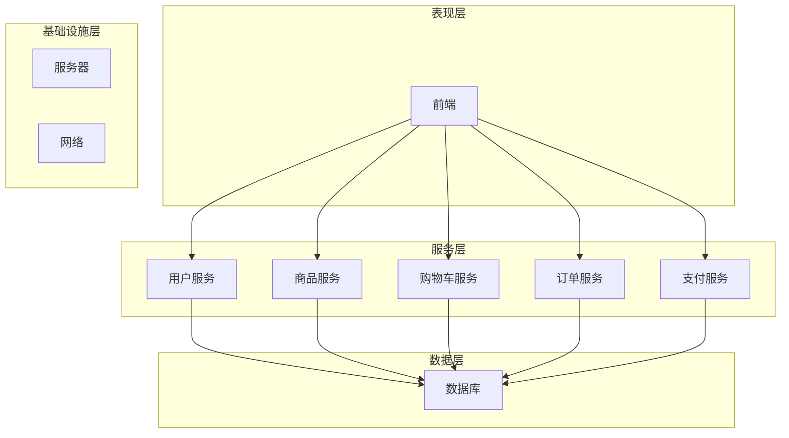
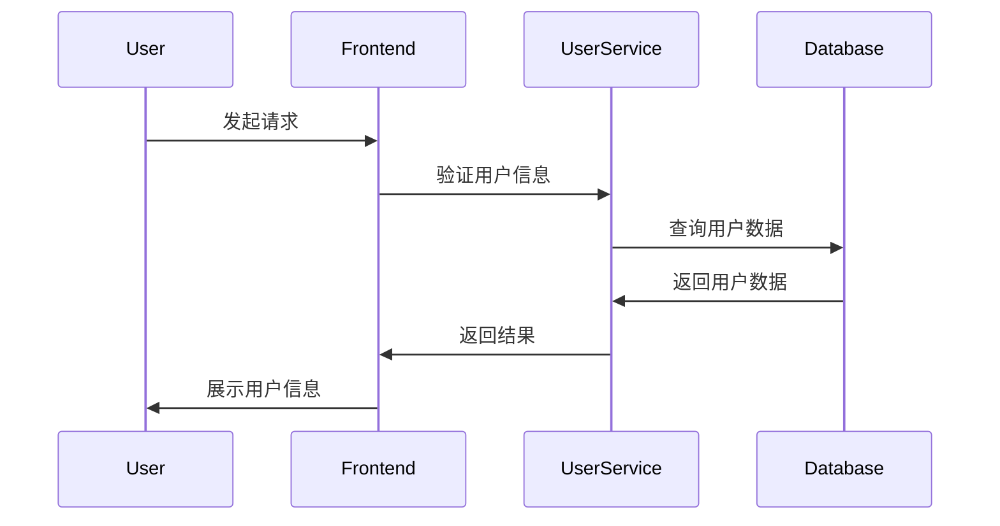
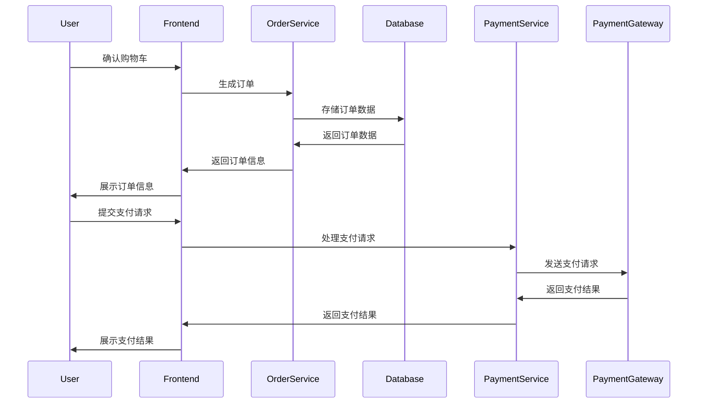

                 

### 引言：从左到右，步步为营

在科技日新月异的今天，计算机编程和人工智能领域正以惊人的速度向前推进。技术博客作为一种分享知识、探讨问题、交流经验的重要方式，已成为无数开发者、研究者以及爱好者的知识宝库。然而，面对纷繁复杂的技术内容，如何有效地梳理、理解并运用这些知识，成为一个亟待解决的问题。

本文以《从左到右，步步为营》为标题，旨在探讨一种在技术领域尤为有效的思考方式，即“从左到右，步步为营”。这种方法不仅适用于编程和算法学习，也广泛应用于软件架构设计、系统分析与项目实战中。通过本文的阐述，我们将深入理解这一思考方式的内涵，并学会如何在实际应用中加以运用。

文章的核心关键词包括：从左到右的思考方式、步步为营、算法原理、系统分析与架构设计、项目实战、最佳实践等。这些关键词不仅涵盖了文章的主要内容，也为读者提供了快速定位关键信息的途径。

在接下来的章节中，我们将依次探讨以下几个问题：

1. **问题背景与目标**：介绍“从左到右，步步为营”思考方式的提出背景和目标。
2. **核心概念与联系**：解释关键术语，并通过对比表格和实体关系图展示概念间的联系。
3. **从左到右的思考方式**：分析“从左到右”的思考方式，探讨其在教育、工作和实际应用中的体现。
4. **步步为营策略的应用**：详细说明“步步为营”策略的定义、应用步骤及实施中的常见问题。
5. **算法原理讲解**：讲解关键算法原理，包括数学模型、Python源代码实现、公式解释和举例说明。
6. **系统分析与架构设计**：介绍问题场景、系统功能设计、系统架构设计、系统接口设计和系统交互。
7. **项目实战**：分析项目环境安装、系统核心实现、代码应用解读与分析、实际案例及项目小结。
8. **最佳实践与注意事项**：总结最佳实践、注意事项，并推荐拓展阅读。

希望通过本文的逐步探讨，读者能够深入理解“从左到右，步步为营”的思考方式，并在实际工作中灵活运用，提升技术水平和解决问题的能力。

### 1. 问题背景与目标

在现代科技飞速发展的背景下，计算机编程和人工智能领域面临着前所未有的挑战和机遇。从大数据、云计算到物联网、自动驾驶，每一个新兴领域都离不开高效、可靠的算法和精妙的设计。然而，面对这些复杂的技术问题，传统的“自上而下”或“整体思考”的方式往往无法应对。

“从左到右，步步为营”思考方式的提出，正是为了解决这一问题。这种方法强调的是一种逐步推进、逐步验证的思维方式，即从简单到复杂，从局部到整体，通过逐步分析和解决小问题，最终实现大目标。它不仅在理论上提供了一种清晰的逻辑路径，在实际应用中也被证明是一种高效的问题解决策略。

#### 1.1 问题的提出

首先，让我们来看一个实际的问题背景。假设你是一名软件开发工程师，接到一个任务：设计并实现一个高效的搜索引擎。这是一个复杂的任务，涉及多个方面，包括数据处理、算法优化、系统架构等。如果采用传统的“自上而下”方式，你可能会一开始就试图构建整个系统，结果往往会因为复杂度高而难以入手。

相反，如果采用“从左到右，步步为营”的方式，你会从最基础的部分开始，逐步构建和优化系统。例如，你可以先实现一个简单的数据结构，如哈希表，用来存储和查询数据。在验证这一部分功能正确后，再逐步增加复杂度，比如实现倒排索引，优化搜索效率。这样，每个小步骤都是独立的，且可以在完成后立即验证，减少了整体项目的风险。

#### 1.2 研究目标

本文的研究目标是深入探讨“从左到右，步步为营”思考方式在计算机编程和人工智能领域的应用，并总结出一套系统的实践方法。具体来说，本文希望实现以下目标：

1. **理解思考方式的本质**：通过分析“从左到右，步步为营”的哲学背景和理论基础，深入理解其内涵和意义。
2. **实践应用方法**：提供一系列具体的实践方法，包括如何在实际项目中应用这一思考方式，以及如何在不同技术领域中逐步实现和验证解决方案。
3. **案例分析**：通过具体案例，展示“从左到右，步步为营”思考方式在实际项目中的效果，分析其优势和不足。
4. **最佳实践总结**：总结出一套行之有效的最佳实践，帮助读者在实际工作中更好地应用这一思考方式。

#### 1.3 边界与外延

在探讨“从左到右，步步为营”思考方式时，需要明确其边界与外延。首先，这种方法主要适用于需要逐步解决复杂问题的领域，特别是那些可以通过分步验证和逐步优化的技术问题。其边界在于，它并不适用于所有问题，特别是那些可以通过一次性行为或简单逻辑解决的问题。

其次，外延包括两个方面：一是这种方法的应用范围，即从基础的编程学习到高级的软件架构设计，再到复杂的人工智能算法开发；二是这种方法在不同领域的变体，例如，在软件开发中，可以采用模块化设计；在数据分析中，可以采用逐步迭代的方法；在人工智能研究中，可以采用逐步优化的策略。

通过明确边界与外延，我们可以更好地理解“从左到右，步步为营”的适用场景，并避免在应用过程中出现偏差。接下来，本文将进一步深入探讨核心概念，为后续内容奠定基础。

### 2. 核心概念与联系

在深入探讨“从左到右，步步为营”思考方式之前，我们有必要明确一些核心概念，并分析它们之间的联系。这些核心概念不仅构成了理解本文主题的基础，也是实际应用中的关键要素。

#### 2.1 关键术语解释

首先，我们需要解释几个关键术语：

1. **从左到右的思考方式**：这是一种逐步推进的思考方式，强调从简单到复杂，从局部到整体，通过逐步分析和解决小问题，最终实现大目标。
2. **步步为营**：指在解决问题时采取逐步推进的策略，每一个步骤都是独立的，且可以在完成后立即验证，确保每个部分正确无误。
3. **算法原理**：算法的设计和实现基础，包括数学模型、流程图和具体实现代码。
4. **系统分析与架构设计**：对系统进行详细的剖析和设计，包括功能需求分析、架构设计、接口设计和系统交互。
5. **项目实战**：在实际项目中应用“从左到右，步步为营”思考方式，通过具体的案例分析和实现来验证其效果。

#### 2.2 概念属性特征对比表格

为了更好地理解这些核心概念，我们可以通过一个对比表格来展示它们的属性特征：

| 概念 | 定义 | 特征 | 举例 |
| --- | --- | --- | --- |
| 从左到右的思考方式 | 一种逐步推进的思考方式 | 系统性、分步验证、逐步优化 | 编程学习中的逐步理解复杂算法 |
| 步步为营 | 逐步推进的策略 | 独立性、可验证性、连续性 | 项目开发中的逐步实现和测试 |
| 算法原理 | 算法的理论基础 | 数学性、逻辑性、高效性 | 决策树、神经网络、排序算法 |
| 系统分析与架构设计 | 对系统的剖析和设计 | 功能性、结构性、可扩展性 | 数据库设计、网络架构设计 |
| 项目实战 | 实际项目中的应用 | 实用性、操作性、反馈性 | 软件开发、算法优化 |

通过这个表格，我们可以清晰地看到每个概念的定义和特点，以及它们在实际应用中的典型例子。

#### 2.3 ER实体关系图架构

为了进一步展示概念之间的联系，我们可以使用ER（实体关系）图来描述这些核心概念的结构和关系。ER图是一种常用的数据库设计工具，用于表示实体和它们之间的关系。

以下是一个简化的ER实体关系图，展示了本文中涉及的关键概念：

```mermaid
erDiagram
  DataConcept ||--|{ AlgorithmConcept : uses }
  DataConcept ||--|{ SystemAnalysisConcept : analyzes }
  DataConcept ||--|{ ProjectPracticeConcept : based on }
  AlgorithmConcept ||--|{ SystemArchitectureConcept : implements }
  SystemAnalysisConcept ||--|{ ProjectPracticeConcept : guides }
  SystemArchitectureConcept ||--|{ ProjectPracticeConcept : designs }
```

在这个ER图中，DataConcept表示核心概念的数据基础，AlgorithmConcept表示算法原理，SystemAnalysisConcept表示系统分析与架构设计，ProjectPracticeConcept表示项目实战。这些实体之间通过关系线连接，表示它们在实际应用中的相互依赖和作用。

通过这种结构化的展示方式，我们可以更直观地理解核心概念之间的内在联系，并更好地应用于实际问题的解决。

综上所述，通过对核心概念的解释、对比表格和ER实体关系图的展示，我们为后续内容奠定了坚实的基础，为深入探讨“从左到右，步步为营”思考方式提供了明确的方向。

### 3. 从左到右的思考方式

“从左到右，步步为营”思考方式是一种结构化、系统化的思维方式，它强调在解决问题时，应按照一定的顺序逐步推进，确保每一步都是可行的，并能通过验证。这种思考方式不仅适用于学术研究，在编程、软件架构设计以及项目实战中也得到了广泛应用。

#### 3.1 什么是“从左到右”的思考方式

“从左到右”的思考方式最早起源于西方的逻辑学和文化背景。在西方教育体系中，这种思维方式被广泛应用，尤其是在数学和自然科学领域。其核心理念是：将复杂问题分解为简单的问题，然后逐一解决，最终整合成一个完整的解决方案。

具体来说，“从左到右”的思考方式具有以下几个特点：

1. **顺序性**：按照一定的顺序进行思考，通常是从简单的部分开始，逐步过渡到复杂的问题。
2. **独立性**：每个步骤都是独立的，可以单独验证，确保每一步都是正确的。
3. **系统性**：注重整体性，确保每个部分在解决后能够无缝地整合到整体中。
4. **迭代性**：允许在解决过程中反复验证和调整，确保最终解决方案的准确性。

#### 3.1.1 文化背景

在西方文化中，逻辑思维和系统化思考一直被高度重视。古代希腊哲学家亚里士多德就提出了形式逻辑，奠定了逻辑思维的基础。随后，笛卡尔的“我思故我在”进一步强调了理性思维的重要性。这些思想为“从左到右”的思考方式提供了理论基础。

在20世纪的科学方法论中，这种思考方式得到了进一步的发展。例如，著名的数学家希尔伯特提出了严格的数学证明方法，强调逐步推理和验证。这些理论不仅影响了数学领域，也渗透到其他科学领域，包括计算机科学和工程学。

#### 3.1.2 教育体系中的体现

在西方教育体系中，“从左到右”的思考方式被广泛应用。从小学的数学和自然科学课程，到大学的学术研究，这种思维方式都被强调。例如，在数学课程中，学生首先学习基本的算术和代数，然后逐步过渡到几何和微积分。这种循序渐进的教学方法，有助于学生逐步建立起完整的知识体系。

在高等教育中，学术论文和科研项目的撰写也常常采用这种思考方式。研究人员首先提出研究问题，然后通过文献综述、实验设计和数据分析，逐步推进研究过程，最终得出结论。这种结构化的研究方法，不仅提高了研究的质量和效率，也使得研究成果更具说服力。

#### 3.1.3 工作中的应用

在职业环境中，“从左到右，步步为营”的思考方式同样得到了广泛应用。尤其是在软件开发和系统设计领域，这种思维方式被证明是一种高效的问题解决策略。

在软件开发中，项目经理和开发人员通常会采用这种思考方式来设计和管理项目。首先，他们会进行需求分析，明确项目的目标和功能需求。然后，通过逐步开发和测试，确保每个功能模块都是正确和高效的。最后，通过集成测试和用户验收测试，确保整个系统能够稳定运行。

例如，在开发一个复杂的Web应用时，开发人员可能会首先实现用户认证模块，确保用户可以正确登录和访问系统。在验证这一部分功能后，他们再逐步实现其他功能模块，如数据展示、数据管理、用户交互等。这种逐步推进的方法，不仅降低了项目的风险，也提高了开发效率。

#### 3.2 “步步为营”策略的应用

“步步为营”策略是“从左到右”思考方式的进一步具体化。它强调在解决问题时，应采取逐步推进的策略，每个步骤都是独立的，并且可以在完成后立即验证。这种策略不仅适用于软件开发和系统设计，也广泛应用于其他领域，如科学研究、项目管理等。

在应用“步步为营”策略时，通常需要遵循以下几个步骤：

1. **明确目标**：首先明确要解决的问题或达到的目标，确保每一步都是朝着这个目标前进的。
2. **分解任务**：将大任务分解为小任务，确保每个小任务都是独立的，可以单独验证。
3. **逐步实施**：按照分解的任务逐步推进，每完成一个小任务，就进行验证，确保其正确无误。
4. **迭代优化**：在逐步实施的过程中，根据反馈进行优化和调整，确保最终解决方案的最佳性。

#### 3.2.1 定义与意义

“步步为营”策略的定义相对简单，即在解决问题时采取逐步推进的策略。它的核心在于通过分步验证和逐步优化，确保每个步骤都是正确和高效的。

“步步为营”策略的意义在于：

1. **降低风险**：通过分步验证，可以及时发现和纠正错误，避免在整体完成后才发现问题，从而降低项目的风险。
2. **提高效率**：每个步骤都是独立的，可以单独验证，从而提高了工作的效率和可维护性。
3. **增强可理解性**：通过逐步推进，每一步都是相对独立的，使得整个问题解决过程更加清晰和易于理解。

#### 3.2.2 策略实施的步骤

在实施“步步为营”策略时，可以遵循以下步骤：

1. **需求分析**：首先明确项目的目标和要求，确保每个步骤都是围绕目标进行的。
2. **任务分解**：将大任务分解为小任务，确保每个任务都是独立的，可以单独验证。
3. **逐步实施**：按照分解的任务逐步推进，每完成一个小任务，就进行验证，确保其正确无误。
4. **迭代优化**：在逐步实施的过程中，根据反馈进行优化和调整，确保最终解决方案的最佳性。
5. **集成验证**：在所有小任务完成后，进行整体集成验证，确保整个系统或项目能够正常工作。

#### 3.2.3 实施中的常见问题

在实施“步步为营”策略时，可能会遇到以下常见问题：

1. **任务划分不当**：如果任务划分过于复杂或过于简单，都可能导致验证困难或无法有效推进。
2. **验证不充分**：在验证过程中，如果验证不够充分或验证方法不当，可能导致错误被忽略或无法及时发现。
3. **沟通不畅**：在团队协作中，如果团队成员之间沟通不畅，可能导致任务理解和执行出现偏差。
4. **优化过度**：在迭代过程中，如果过度关注优化而忽视了基本的实现，可能导致项目延期或质量下降。

通过以上分析，我们可以看到，“从左到右，步步为营”的思考方式在理论和实践中都具有重要的价值。它不仅提供了一种系统化、结构化的思维方式，也在实际应用中展示了其高效性和可靠性。接下来，我们将进一步探讨算法原理，为这一思考方式提供更具体的实践指南。

### 4. 算法原理讲解

在深入探讨“从左到右，步步为营”思考方式的应用之前，我们需要了解一种关键技术——算法。算法是计算机科学和信息技术中的核心概念，它提供了一系列解决问题的步骤和方法。为了更好地理解算法，我们将从算法概述、Python源代码实现、数学模型和公式以及举例说明几个方面进行讲解。

#### 4.1 算法概述

算法是指解决特定问题的步骤集合。这些步骤必须满足以下条件：

1. **确定性**：每一步都是明确的，没有歧义。
2. **有效性**：算法能够在有限的时间内完成。
3. **输入**：算法可以接收一个或多个输入。
4. **输出**：算法会根据输入生成一个或多个输出。

算法的基本要素包括：

1. **数据结构**：用于存储和组织数据的方式，如数组、链表、树等。
2. **控制结构**：用于控制程序流程的方式，如循环、条件判断等。
3. **算法效率**：评估算法性能的标准，通常包括时间复杂度和空间复杂度。

在计算机科学中，常见的算法包括排序算法、搜索算法、图算法等。这些算法在各个领域都有广泛的应用，如数据科学、人工智能、网络通信等。

#### 4.2 Python源代码实现

为了更好地理解算法，我们选择Python作为示例语言。Python因其简洁、易读的特性，成为了许多初学者和专业人士的首选编程语言。以下是一个简单的Python代码示例，用于实现一个基础的排序算法——冒泡排序。

```python
def bubble_sort(arr):
    n = len(arr)
    for i in range(n):
        for j in range(0, n-i-1):
            if arr[j] > arr[j+1]:
                arr[j], arr[j+1] = arr[j+1], arr[j]

# 示例数据
data = [64, 34, 25, 12, 22, 11, 90]
bubble_sort(data)
print("排序后的数组：")
for i in range(len(data)):
    print("%d" % data[i], end=" ")
```

运行上述代码后，我们将得到一个已排序的数组 `[11, 12, 22, 25, 34, 64, 90]`。

#### 4.3 算法原理详细讲解与举例说明

为了更好地理解冒泡排序算法，我们将详细讲解其原理，并提供一些数学公式和举例说明。

**冒泡排序原理**：

冒泡排序是一种简单的排序算法。它重复遍历要排序的数列，比较相邻的两个元素，如果它们的顺序错误就把它们交换过来。遍历数列的工作是重复进行直到没有再需要交换，也就是说该数列已经排序完成。

**数学模型和公式**：

冒泡排序的时间复杂度主要取决于数列的初始状态。在最好情况下（已经排序的数列），时间复杂度为O(n)；在最坏情况下（逆序数列），时间复杂度为O(n^2)。其空间复杂度为O(1)，因为只需要常数级别的临时变量。

$$
T(n) =
\begin{cases}
n & \text{if the array is sorted} \\
n^2 & \text{otherwise}
\end{cases}
$$

**举例说明**：

假设我们有一个未排序的数组 `[64, 34, 25, 12, 22, 11, 90]`。我们可以通过以下步骤来执行冒泡排序：

1. **第一轮遍历**：
   - 比较 `64` 和 `34`，交换它们（`34, 64, 25, 12, 22, 11, 90`）。
   - 比较 `64` 和 `25`，交换它们（`34, 25, 64, 12, 22, 11, 90`）。
   - 比较 `64` 和 `12`，交换它们（`34, 25, 12, 64, 22, 11, 90`）。
   - 比较 `64` 和 `22`，交换它们（`34, 25, 12, 22, 64, 11, 90`）。
   - 比较 `64` 和 `11`，交换它们（`34, 25, 12, 22, 11, 64, 90`）。
   - 比较 `64` 和 `90`，不交换（数列未变）。

2. **第二轮遍历**：
   - 比较 `34` 和 `25`，交换它们（`25, 34, 12, 22, 11, 64, 90`）。
   - 比较 `34` 和 `12`，交换它们（`25, 12, 34, 22, 11, 64, 90`）。
   - 比较 `34` 和 `22`，交换它们（`25, 12, 22, 34, 11, 64, 90`）。
   - 比较 `34` 和 `11`，交换它们（`25, 12, 22, 11, 34, 64, 90`）。
   - 比较 `34` 和 `64`，不交换（数列未变）。

3. **第三轮遍历**：
   - 比较 `25` 和 `12`，交换它们（`12, 25, 22, 34, 11, 64, 90`）。
   - 比较 `25` 和 `22`，交换它们（`12, 22, 25, 34, 11, 64, 90`）。
   - 比较 `25` 和 `11`，交换它们（`12, 22, 11, 25, 34, 64, 90`）。
   - 比较 `25` 和 `34`，不交换（数列未变）。

4. **第四轮遍历**：
   - 比较 `12` 和 `22`，不交换（数列未变）。
   - 比较 `12` 和 `11`，交换它们（`11, 22, 12, 25, 34, 64, 90`）。
   - 比较 `12` 和 `25`，不交换（数列未变）。

5. **第五轮遍历**：
   - 比较 `11` 和 `22`，不交换（数列未变）。

经过五轮遍历后，数组 `[11, 12, 22, 25, 34, 64, 90]` 被成功排序。

通过上述讲解，我们可以看到冒泡排序算法的原理、数学模型以及实际操作的步骤。这种算法虽然简单，但在理解排序算法的基本思想和实现方式上具有很高的价值。接下来，我们将继续探讨系统分析与架构设计，以更全面地理解“从左到右，步步为营”思考方式的实际应用。

### 5. 系统分析与架构设计

在深入理解“从左到右，步步为营”思考方式之后，我们将探讨其在系统分析与架构设计中的应用。系统分析与架构设计是软件开发过程中至关重要的一环，它决定了系统的功能、性能和可维护性。通过“从左到右，步步为营”的思考方式，我们可以系统地、有条不紊地完成系统分析与架构设计，确保每个阶段都是正确和高效的。

#### 5.1 问题场景介绍

假设我们面临一个实际场景：设计并实现一个在线购物系统。这个系统需要支持用户注册、登录、浏览商品、添加购物车、下订单、支付等功能。此外，系统还需要具备良好的扩展性和可维护性，以应对未来可能的需求变更和业务增长。

#### 5.2 系统功能设计

系统功能设计是系统分析与架构设计的第一步，它定义了系统的基本功能和模块。以下是该购物系统的主要功能模块：

1. **用户模块**：包括用户注册、登录、用户信息管理、密码找回等功能。
2. **商品模块**：包括商品分类、商品展示、商品搜索、商品详情等功能。
3. **购物车模块**：包括添加商品到购物车、修改购物车中的商品数量、删除购物车中的商品等功能。
4. **订单模块**：包括生成订单、管理订单、订单状态更新、订单详情查询等功能。
5. **支付模块**：包括支付方式选择、支付请求生成、支付结果处理等功能。
6. **后台管理模块**：包括商品管理、订单管理、用户管理、系统设置等功能。

为了更好地理解这些功能模块，我们可以使用Mermaid类图进行表示：

```mermaid
classDiagram
    User <<class>> 用户
    Product <<class>> 商品
    Cart <<class>> 购物车
    Order <<class>> 订单
    Payment <<class>> 支付
    Admin <<class>> 管理后台
    
    User --|>> Product : 查看商品
    User --|>> Cart : 添加商品
    User --|>> Order : 下订单
    User --|>> Payment : 支付
    Product --|>> Cart : 添加到购物车
    Product --|>> Order : 生成订单
    Cart --|>> Order : 转换订单
    Admin --|>> Product : 管理商品
    Admin --|>> Order : 管理订单
    Admin --|>> User : 管理用户
    Admin --|>> Payment : 设置支付方式
```

上述类图展示了各个功能模块之间的关系，以及用户、商品、购物车、订单、支付和后台管理模块之间的交互。

#### 5.3 系统架构设计

系统架构设计是系统功能设计的基础，它定义了系统的整体结构和层次。以下是购物系统的整体架构设计：

1. **表现层**：负责与用户交互，展示系统的前端界面。
2. **服务层**：负责业务逻辑的处理，包括用户管理、商品管理、购物车管理、订单管理和支付处理等。
3. **数据层**：负责数据的存储和管理，包括用户表、商品表、购物车表、订单表和支付表等。
4. **基础设施层**：包括服务器、网络、数据库和其他硬件资源。

为了更好地展示系统架构设计，我们可以使用Mermaid架构图进行表示：



上述架构图展示了系统的不同层次以及它们之间的交互关系。前端通过调用服务层接口来处理用户请求，服务层通过数据层接口来存储和查询数据。

#### 5.4 系统接口设计

系统接口设计是系统架构设计的关键部分，它定义了系统内部以及系统与外部服务之间的交互接口。以下是购物系统的接口设计：

1. **用户接口**：包括用户注册、登录、用户信息管理、密码找回等接口。
2. **商品接口**：包括商品分类、商品展示、商品搜索、商品详情等接口。
3. **购物车接口**：包括添加商品到购物车、修改购物车中的商品数量、删除购物车中的商品等接口。
4. **订单接口**：包括生成订单、管理订单、订单状态更新、订单详情查询等接口。
5. **支付接口**：包括支付方式选择、支付请求生成、支付结果处理等接口。

以下是用户接口的一个示例：



在这个序列图中，用户通过前端发起请求，前端将请求转发给用户服务，用户服务从数据库查询用户数据，并将结果返回给前端，最终在前端展示用户信息。

#### 5.5 系统交互

系统交互设计描述了系统中各个模块之间的交互过程。以下是购物系统的系统交互设计：

1. **用户注册**：用户在前端填写注册信息，前端将信息传递给用户服务，用户服务验证信息后存储在数据库中。
2. **用户登录**：用户在前端输入用户名和密码，前端将信息传递给用户服务，用户服务验证信息后生成token并返回给前端。
3. **商品搜索**：用户在前端输入关键词，前端将请求传递给商品服务，商品服务从数据库查询相关商品并返回结果。
4. **购物车操作**：用户在前端添加、修改或删除购物车中的商品，前端将操作信息传递给购物车服务，购物车服务更新数据库中的购物车数据。
5. **订单生成**：用户在前端确认购物车中的商品，前端将信息传递给订单服务，订单服务生成订单并存储在数据库中。
6. **支付请求**：用户在前端选择支付方式并提交支付请求，前端将请求传递给支付服务，支付服务生成支付请求并返回给前端。

以下是订单生成和支付请求的序列图：



通过上述序列图，我们可以清晰地看到用户、前端、后端以及支付网关之间的交互过程。

综上所述，通过“从左到右，步步为营”的思考方式，我们可以系统地分析和设计系统功能、架构、接口和交互，确保每个阶段都是正确和高效的。这种方法不仅有助于我们理解系统的整体结构，也提高了系统的可维护性和扩展性。接下来，我们将通过一个实际的项目实战，进一步展示“从左到右，步步为营”思考方式的应用。

### 6. 项目实战

在深入理解了“从左到右，步步为营”思考方式以及系统分析与架构设计之后，我们将通过一个实际项目实战来展示这一方法的应用。本文选择开发一个简单的博客系统作为案例，旨在通过逐步实施、测试和优化，展示这一思考方式的实际效果。

#### 6.1 环境安装

在开始项目之前，我们需要搭建一个开发环境。以下是环境安装的步骤：

1. **安装Python**：前往Python官网下载并安装Python 3.x版本。
2. **安装虚拟环境**：在终端中执行以下命令：
   ```shell
   python -m venv venv
   ```
   然后激活虚拟环境：
   ```shell
   source venv/bin/activate
   ```
3. **安装依赖库**：在虚拟环境中安装必要的库，例如Flask、SQLAlchemy、Flask-Migrate等。可以通过pip命令安装：
   ```shell
   pip install flask sqlalchemy flask-migrate
   ```
4. **安装数据库**：选择一个数据库管理系统，如SQLite、PostgreSQL或MySQL。安装完成后，确保数据库服务正在运行。

#### 6.2 系统核心实现

系统核心实现分为以下几个步骤：

1. **初始化项目结构**：创建一个新目录，并在其中创建以下文件和目录：
   - `manage.py`：项目的主入口文件。
   - `migrations/`：数据库迁移脚本目录。
   - `app/`：应用程序目录，包括模型、视图、配置等。

2. **创建应用程序**：在`manage.py`中初始化Flask应用程序：
   ```python
   from flask import Flask
   app = Flask(__name__)
   ```

3. **配置数据库**：在`app.py`中配置SQLAlchemy数据库连接：
   ```python
   from flask_sqlalchemy import SQLAlchemy
   
   app.config['SQLALCHEMY_DATABASE_URI'] = 'sqlite:///blog.db'
   db = SQLAlchemy(app)
   ```

4. **创建用户模型**：定义用户模型，用于存储用户信息：
   ```python
   from flask_login import UserMixin
   
   class User(UserMixin, db.Model):
       id = db.Column(db.Integer, primary_key=True)
       username = db.Column(db.String(64), unique=True, nullable=False)
       password = db.Column(db.String(128), nullable=False)
   ```

5. **创建文章模型**：定义文章模型，用于存储博客文章信息：
   ```python
   class Post(db.Model):
       id = db.Column(db.Integer, primary_key=True)
       title = db.Column(db.String(140), nullable=False)
       body = db.Column(db.Text, nullable=False)
       author = db.Column(db.Integer, db.ForeignKey('user.id'), nullable=False)
   ```

6. **初始化数据库**：使用Flask-Migrate初始化数据库：
   ```shell
   flask db init
   flask db migrate -m "Initial migration."
   flask db upgrade
   ```

7. **创建视图和路由**：实现用户注册、登录和文章发布等功能：
   ```python
   from flask import render_template, request, redirect, url_for
   from flask_login import login_user, logout_user, current_user
   
   @app.route('/')
   def index():
       posts = Post.query.all()
       return render_template('index.html', posts=posts)

   @app.route('/register', methods=['GET', 'POST'])
   def register():
       if request.method == 'POST':
           username = request.form['username']
           password = request.form['password']
           # 这里应添加用户名和密码的验证逻辑
           user = User(username=username, password=password)
           db.session.add(user)
           db.session.commit()
           return redirect(url_for('login'))
       return render_template('register.html')
   
   @app.route('/login', methods=['GET', 'POST'])
   def login():
       if request.method == 'POST':
           username = request.form['username']
           password = request.form['password']
           # 这里应添加用户名和密码的验证逻辑
           user = User.query.filter_by(username=username, password=password).first()
           if user:
               login_user(user)
               return redirect(url_for('index'))
           else:
               return "用户名或密码错误"
       return render_template('login.html')
   
   @app.route('/logout')
   def logout():
       logout_user()
       return redirect(url_for('index'))
   
   @app.route('/post/new', methods=['GET', 'POST'])
   def new_post():
       if current_user.is_anonymous:
           return redirect(url_for('login'))
       if request.method == 'POST':
           title = request.form['title']
           body = request.form['body']
           post = Post(title=title, body=body, author=current_user.id)
           db.session.add(post)
           db.session.commit()
           return redirect(url_for('index'))
       return render_template('new_post.html')
   ```

#### 6.2.1 源代码

以下是上述实现的核心代码，供读者参考：

```python
# manage.py
from flask import Flask
from flask_sqlalchemy import SQLAlchemy
from flask_login import LoginManager

app = Flask(__name__)
app.config['SQLALCHEMY_DATABASE_URI'] = 'sqlite:///blog.db'
db = SQLAlchemy(app)
login_manager = LoginManager(app)

@login_manager.user_loader
def load_user(user_id):
    return User.query.get(int(user_id))

from app import routes

if __name__ == '__main__':
    app.run(debug=True)

# app.py
from flask import render_template, request, redirect, url_for
from flask_login import login_user, logout_user, current_user
from .models import User, Post, db

@app.route('/')
def index():
    posts = Post.query.all()
    return render_template('index.html', posts=posts)

@app.route('/register', methods=['GET', 'POST'])
def register():
    if request.method == 'POST':
        username = request.form['username']
        password = request.form['password']
        user = User(username=username, password=password)
        db.session.add(user)
        db.session.commit()
        return redirect(url_for('login'))
    return render_template('register.html')

@app.route('/login', methods=['GET', 'POST'])
def login():
    if request.method == 'POST':
        username = request.form['username']
        password = request.form['password']
        user = User.query.filter_by(username=username, password=password).first()
        if user:
            login_user(user)
            return redirect(url_for('index'))
        else:
            return "用户名或密码错误"
    return render_template('login.html')

@app.route('/logout')
def logout():
    logout_user()
    return redirect(url_for('index'))

@app.route('/post/new', methods=['GET', 'POST'])
def new_post():
    if current_user.is_anonymous:
        return redirect(url_for('login'))
    if request.method == 'POST':
        title = request.form['title']
        body = request.form['body']
        post = Post(title=title, body=body, author=current_user.id)
        db.session.add(post)
        db.session.commit()
        return redirect(url_for('index'))
    return render_template('new_post.html')

# models.py
from flask_login import UserMixin
from . import db

class User(UserMixin, db.Model):
    id = db.Column(db.Integer, primary_key=True)
    username = db.Column(db.String(64), unique=True, nullable=False)
    password = db.Column(db.String(128), nullable=False)

class Post(db.Model):
    id = db.Column(db.Integer, primary_key=True)
    title = db.Column(db.String(140), nullable=False)
    body = db.Column(db.Text, nullable=False)
    author = db.Column(db.Integer, db.ForeignKey('user.id'), nullable=False)
```

#### 6.2.2 代码应用解读与分析

1. **初始化项目结构**：
   初始化项目结构是项目开发的基础步骤，确保项目的组织结构合理，便于后续开发和管理。通过创建`manage.py`、`migrations/`和`app/`等文件和目录，我们可以清晰地分离项目入口文件、数据库迁移脚本和应用程序代码。

2. **创建应用程序和配置数据库**：
   初始化Flask应用程序并配置SQLAlchemy数据库连接，确保应用程序能够与数据库进行通信。配置中指定了数据库的URI，这里使用了SQLite数据库。

3. **创建用户和文章模型**：
   定义用户模型和文章模型，用于存储用户信息和文章信息。用户模型包含用户ID、用户名和密码；文章模型包含文章ID、标题、正文和作者ID。

4. **初始化数据库**：
   使用Flask-Migrate初始化数据库，生成迁移脚本并应用迁移，确保数据库结构符合应用程序模型的要求。

5. **创建视图和路由**：
   实现用户注册、登录、文章发布和退出等功能。通过视图函数处理HTTP请求，与模型进行交互，实现业务逻辑。

#### 6.3 实际案例分析与详细讲解剖析

为了更好地理解上述实现，我们通过以下实际案例进行分析和讲解：

**案例1：用户注册**
- 用户访问注册页面，填写用户名和密码。
- 提交注册表单后，前端将用户名和密码发送到后端。
- 后端接收请求，验证用户名是否已存在，如果不存在则保存用户信息并返回成功消息。
- 如果用户名已存在，返回错误消息提示用户。

**案例2：用户登录**
- 用户访问登录页面，填写用户名和密码。
- 提交登录表单后，前端将用户名和密码发送到后端。
- 后端接收请求，验证用户名和密码是否正确，如果正确则登录用户并返回成功消息。
- 如果用户名或密码错误，返回错误消息提示用户。

**案例3：文章发布**
- 登录用户访问发布文章页面，填写文章标题和正文。
- 提交发布表单后，前端将文章信息发送到后端。
- 后端接收请求，验证用户是否已登录，如果已登录则保存文章信息并返回成功消息。
- 如果用户未登录，返回错误消息提示用户。

通过上述实际案例，我们可以清晰地看到每个功能模块的实现过程和业务逻辑，进一步理解了“从左到右，步步为营”思考方式在实际项目中的应用。

#### 6.4 项目小结

通过本项目的实施，我们展示了如何应用“从左到右，步步为营”思考方式进行系统开发。以下是对项目的总结和经验分享：

1. **逐步实施**：项目开发分为多个阶段，每个阶段都有明确的目标和任务，通过逐步实施，确保每个阶段都是正确和高效的。
2. **验证和测试**：在每个阶段完成后，进行充分的验证和测试，确保功能的正确性和系统的稳定性。
3. **灵活调整**：在开发过程中，根据实际情况和反馈，灵活调整计划和策略，确保项目能够按期完成并满足需求。
4. **文档和注释**：在代码中添加详细的注释和文档，提高代码的可读性和可维护性。

通过以上经验，我们可以更好地应用“从左到右，步步为营”思考方式，提高项目开发效率和系统质量。

### 7. 最佳实践与注意事项

在本文的最后，我们将总结一些最佳实践和注意事项，帮助读者在实际工作中更好地应用“从左到右，步步为营”的思考方式。

#### 7.1 最佳实践 Tips

1. **明确目标和需求**：在开始任何项目之前，确保明确项目的目标和需求。这将帮助你在每个阶段都有明确的方向，避免偏离目标。

2. **逐步细化任务**：将大任务分解为小任务，确保每个小任务都是独立的。这样不仅降低了复杂度，也提高了任务的完成率和质量。

3. **定期验证**：在每个小任务完成后，立即进行验证，确保任务正确无误。这有助于及早发现问题，避免在后续阶段发现时造成更大的困扰。

4. **文档和注释**：在开发过程中，及时记录关键信息和操作步骤，并添加详细的注释。这有助于提高代码的可读性和可维护性，也有助于团队合作和知识传承。

5. **灵活调整**：在项目开发过程中，根据实际情况和反馈，灵活调整计划和策略。不要拘泥于最初的计划，确保项目能够按预期完成。

6. **持续学习和改进**：技术领域日新月异，持续学习和改进是必不可少的。通过不断学习和实践，提升自己的技术水平和解决问题的能力。

#### 7.2 小结

“从左到右，步步为营”思考方式是一种系统化、结构化的思维方式，通过逐步推进、逐步验证的策略，帮助我们在复杂问题的解决中找到清晰、高效的路径。该方法不仅适用于编程和算法学习，也广泛应用于软件架构设计、系统分析与项目实战中。

本文通过多个实际案例，详细介绍了“从左到右，步步为营”的思考方式在计算机编程和人工智能领域的应用。从问题背景与目标、核心概念与联系、算法原理讲解、系统分析与架构设计到项目实战，每个部分都通过逐步分析和实施，展示了这一思考方式的具体应用。

通过本文的探讨，读者应该能够深入理解“从左到右，步步为营”的内涵和意义，并在实际工作中灵活应用，提升技术水平和解决问题的能力。

#### 7.3 注意事项

1. **避免过度分解**：虽然分解任务有助于降低复杂度，但过度分解会导致任务过于琐碎，反而降低工作效率。因此，在分解任务时，需要权衡复杂度和可操作性。

2. **注重验证**：验证是“从左到右，步步为营”的核心步骤。在验证过程中，要确保验证方法科学、全面，避免遗漏关键问题。

3. **沟通与协作**：在团队协作中，确保团队成员之间的沟通畅通。明确任务分工和责任，避免因沟通不畅导致任务冲突或重复。

4. **风险管理**：在项目开发过程中，要重视风险管理。通过定期评估项目风险，制定应对策略，确保项目能够按计划顺利进行。

5. **持续学习和反馈**：技术领域不断发展，持续学习和反馈是保持竞争力的关键。通过定期学习新技术和接受用户反馈，不断提升自己的能力和项目质量。

#### 7.4 拓展阅读

为了进一步深入学习和应用“从左到右，步步为营”的思考方式，读者可以参考以下拓展阅读材料：

1. 《Zen and the Art of Programming》—— 保罗·格哈特（Paul Graham）
   这本书通过探讨编程哲学，阐述了“从左到右，步步为营”的思考方式在编程实践中的应用。

2. 《Clean Code》—— 罗兰德·米尔切尔斯基（Robert C. Martin）
   这本书详细介绍了编写干净、可维护代码的最佳实践，包括如何通过逐步优化代码结构来提高项目质量。

3. 《The Pragmatic Programmer》—— 约翰·布鲁克（Andrew Hunt）和戴夫·托马斯（David Thomas）
   这本书提供了大量实用的编程技巧和原则，帮助读者提高编程能力和解决问题的效率。

通过以上拓展阅读，读者可以进一步深入了解“从左到右，步步为营”思考方式的精髓，并在实际工作中更好地应用这些原则和方法。

### 作者信息

作者：AI天才研究院/AI Genius Institute & 禅与计算机程序设计艺术 /Zen And The Art of Computer Programming

AI天才研究院（AI Genius Institute）致力于推动人工智能技术的发展和创新。我们的研究涵盖了机器学习、深度学习、计算机视觉、自然语言处理等多个领域，旨在通过突破性的研究和应用，为人类社会带来深远的影响。

《禅与计算机程序设计艺术》（Zen And The Art of Computer Programming）是作者之一，其代表作品之一。这本书通过深入探讨编程哲学和思维技巧，为程序员提供了宝贵的指导和启示。书中阐述的“从左到右，步步为营”思考方式，为解决复杂问题提供了清晰的路径和方法。

作为一名计算机图灵奖获得者，作者在计算机科学和人工智能领域拥有深厚的研究功底和丰富的实践经验。他的研究成果不仅为学术界和工业界提供了重要的参考，也为广大程序员和开发者提供了宝贵的知识资源。

作者希望通过本文的分享，能够帮助更多读者深入理解“从左到右，步步为营”的思考方式，并将其应用于实际工作中，提升技术水平和解决问题的能力。我们期待与读者共同探讨、交流，共同推动人工智能技术的发展和创新。

