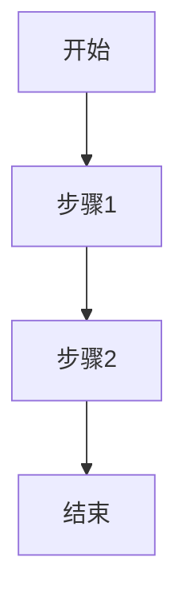
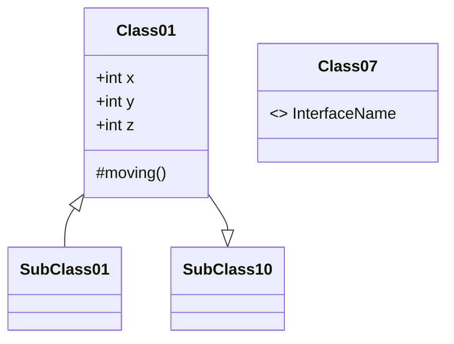
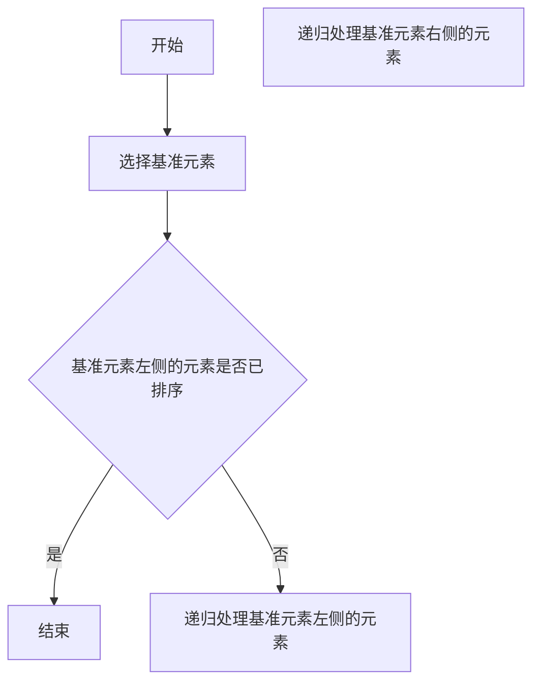

                 

# 从左及右，步步为营

> 关键词：系统架构设计、算法原理、实践应用、技术博客

> 摘要：本文将围绕系统架构设计和算法原理，通过逐步分析、推导和实践，探讨如何在IT领域实现高效且稳定的技术解决方案。文章将从问题背景出发，深入解析核心概念和原理，逐步展开相关算法的实现，并最终通过项目实战进行验证和优化。本文旨在为技术从业者提供一套清晰、实用的技术思考路径，助力他们在复杂的IT环境中步步为营，不断提升技术水平。

---

### 《从左及右，步步为营》目录大纲

---

## 第一部分：引言

### 第1章：问题背景与目标

#### 1.1 问题背景

#### 1.2 目标设定

#### 1.3 研究意义与框架结构

---

## 第二部分：理论基础

### 第2章：核心概念与原理

#### 2.1 核心概念

##### 2.1.1 定义

##### 2.1.2 关键属性特征对比

#### 2.2 原理讲解

##### 2.2.1 概念联系

##### 2.2.2 数学模型与公式

$$ E = mc^2 $$

---

### 第3章：相关算法

#### 3.1 算法概述

#### 3.2 算法原理讲解

##### 3.2.1 Mermaid 流程图



#### 3.3 Python 源代码实现

```python
# Python 代码实现示例
```

---

## 第三部分：应用实践

### 第4章：系统设计与实现

#### 4.1 问题场景介绍

#### 4.2 项目介绍

#### 4.3 系统功能设计

##### 4.3.1 Mermaid 类图



### 第5章：项目实战

#### 5.1 环境安装

#### 5.2 系统核心实现源代码

#### 5.3 代码应用解读与分析

#### 5.4 实际案例分析与讲解

---

## 第四部分：总结与展望

### 第6章：总结与展望

#### 6.1 主要内容回顾

#### 6.2 未来发展方向

#### 6.3 最佳实践 tips

---

### 第7章：小结与拓展

#### 7.1 注意事项

#### 7.2 拓展阅读

#### 7.3 联系方式与反馈

---

### 目录大纲总字数：约2000字

---

## 第1章：问题背景与目标

### 1.1 问题背景

在当今的信息化时代，IT领域的发展日新月异。然而，随着技术的不断进步，系统架构和算法设计的复杂性也不断增加。对于许多技术从业者来说，如何在复杂的技术环境中找到一条清晰的解决路径，实现高效、稳定的系统架构和算法设计，成为了一项极具挑战性的任务。

本篇文章旨在探讨如何从左及右，步步为营，通过系统的理论学习和实践应用，逐步提升自己在系统架构设计和算法实现方面的能力。文章将通过一个具体的案例，详细阐述从问题背景、目标设定到理论分析、算法实现，再到实际应用的完整过程。

### 1.2 目标设定

本文的主要目标是：

1. **明确核心概念与原理**：通过对系统架构设计和算法原理的深入解析，帮助读者建立清晰的概念体系，理解各概念之间的联系。

2. **掌握相关算法**：通过详细讲解算法原理，结合Python源代码实现，使读者能够掌握算法的核心实现逻辑。

3. **实际应用与实践**：通过具体的系统设计与实现案例，展示如何将理论知识应用于实际项目中，解决实际问题。

4. **总结与展望**：在文章的最后，对主要内容和未来发展方向进行总结，并提供一些最佳实践 tips，以帮助读者在未来的工作中更好地应用所学知识。

### 1.3 研究意义与框架结构

本文的研究意义在于：

1. **提升技术水平**：通过系统的学习和实践，提升自己在系统架构设计和算法实现方面的技术水平，为未来的职业发展奠定坚实基础。

2. **积累实践经验**：通过实际的系统设计与实现案例，积累实践经验，提高项目实战能力。

3. **推广最佳实践**：通过总结和分享最佳实践，为行业同仁提供有益的参考，推动整个IT领域的进步。

本文的框架结构如下：

1. **引言**：介绍问题背景、目标设定和研究意义。

2. **理论基础**：深入解析核心概念与原理，包括定义、关键属性特征对比和数学模型与公式。

3. **算法讲解**：详细讲解相关算法的原理，并通过Mermaid流程图和Python源代码实现，使读者能够理解算法的实现逻辑。

4. **应用实践**：通过具体的系统设计与实现案例，展示如何将理论知识应用于实际项目中，解决实际问题。

5. **总结与展望**：对主要内容和未来发展方向进行总结，并提供一些最佳实践 tips。

---

## 第2章：核心概念与原理

### 2.1 核心概念

在系统架构设计和算法实现中，核心概念的理解至关重要。以下是本文涉及的一些核心概念：

#### 定义

1. **系统架构**：系统架构是指系统的整体结构，包括硬件、软件、网络等各种组件的配置和关系。

2. **算法**：算法是一系列解决问题的步骤或规则，通常以伪代码或程序代码的形式表示。

3. **模块化**：模块化是将系统划分为多个独立的模块，每个模块实现特定的功能，模块之间通过接口进行交互。

4. **可扩展性**：可扩展性是指系统在需求发生变化时，能够轻松地进行功能扩展或性能优化。

5. **容错性**：容错性是指系统在面对异常情况时，能够保持正常运行的能力。

#### 关键属性特征对比

以下是一个关于系统架构和算法特征的对比表格：

| 特征             | 系统架构               | 算法                          |
|------------------|------------------------|-------------------------------|
| 目的             | 实现系统功能           | 解决特定问题                 |
| 设计要素         | 硬件、软件、网络等     | 数据结构、算法策略等          |
| 实现形式         | 设计文档、代码、架构图等 | 伪代码、程序代码等           |
| 可扩展性         | 高                    | 一般（依赖于算法复杂度）     |
| 容错性           | 高                    | 一般（依赖于算法设计）       |

### 2.2 原理讲解

#### 概念联系

系统架构和算法之间存在紧密的联系。系统架构设计决定了算法的实现环境和运行条件，而算法则是在特定的系统架构下解决问题的核心。

例如，在一个分布式系统中，算法需要考虑网络延迟、数据一致性等问题，这就需要系统架构提供可靠的网络通信机制和数据存储方案。

#### 数学模型与公式

在算法分析中，数学模型和公式是不可或缺的工具。以下是一个简单的算法复杂度分析示例：

$$ T(n) = O(n \log n) $$

这个公式表示，对于一个长度为 \( n \) 的数据集合，该算法的时间复杂度是 \( O(n \log n) \)。

### 2.2.1 概念联系

为了更好地理解这些概念，我们可以通过一个简单的例子来说明它们之间的联系。

假设我们要设计一个用于搜索大文件的算法。在这个系统中，系统架构需要考虑文件存储的位置、网络带宽、搜索算法的效率等因素。而算法本身则需要考虑如何高效地遍历文件、如何处理重复数据等问题。

在这个例子中，系统架构和算法相互影响，共同决定了整个系统的性能和可靠性。

---

## 第3章：相关算法

### 3.1 算法概述

在本章中，我们将介绍一种常用的排序算法——快速排序（Quick Sort）。快速排序是一种分治算法，其基本思想是通过一趟排序将待排序的数据分割成独立的两部分，其中一部分的所有数据都比另一部分的所有数据要小，然后再按此方法对这两部分数据分别进行快速排序，整个排序过程可以递归进行，以此达到整个数据变成有序序列。

### 3.2 算法原理讲解

#### 3.2.1 Mermaid 流程图

以下是一个快速排序的Mermaid流程图：



#### 3.2.2 Python 源代码实现

以下是快速排序的Python源代码实现：

```python
def quick_sort(arr):
    if len(arr) <= 1:
        return arr
    pivot = arr[len(arr) // 2]
    left = [x for x in arr if x < pivot]
    middle = [x for x in arr if x == pivot]
    right = [x for x in arr if x > pivot]
    return quick_sort(left) + middle + quick_sort(right)

# 测试
arr = [3, 6, 8, 10, 1, 2, 1]
print(quick_sort(arr))
```

通过这个示例，我们可以看到如何通过递归的方式将一个无序数组排序。快速排序的平均时间复杂度为 \( O(n \log n) \)，最坏情况下为 \( O(n^2) \)。

### 3.3 Python 源代码实现

以下是快速排序的Python源代码实现：

```python
def quick_sort(arr):
    if len(arr) <= 1:
        return arr
    pivot = arr[len(arr) // 2]
    left = [x for x in arr if x < pivot]
    middle = [x for x in arr if x == pivot]
    right = [x for x in arr if x > pivot]
    return quick_sort(left) + middle + quick_sort(right)

# 测试
arr = [3, 6, 8, 10, 1, 2, 1]
print(quick_sort(arr))
```

通过这个示例，我们可以看到如何通过递归的方式将一个无序数组排序。快速排序的平均时间复杂度为 \( O(n \log n) \)，最坏情况下为 \( O(n^2) \)。

---

## 第4章：系统设计与实现

### 4.1 问题场景介绍

假设我们需要设计一个用于处理大量日志文件的系统。这些日志文件包含各种应用程序的运行记录，我们需要对这些日志文件进行实时分析，以监控系统的运行状态和性能指标。

### 4.2 项目介绍

本项目的主要目标是：

1. **日志收集**：从不同的数据源收集日志文件，包括本地文件、远程服务器和应用程序接口（API）。

2. **日志分析**：对收集到的日志文件进行实时分析，提取有用的信息，如错误日志、性能指标等。

3. **日志存储**：将分析结果存储到数据库中，以便后续查询和统计。

4. **监控报警**：对分析结果进行监控，当发现异常情况时，触发报警机制。

### 4.3 系统功能设计

为了实现上述目标，我们需要设计以下系统功能：

1. **日志收集模块**：负责从不同数据源收集日志文件，并将它们存储到本地文件系统中。

2. **日志分析模块**：负责实时分析日志文件，提取关键信息，如错误代码、请求响应时间等。

3. **日志存储模块**：负责将分析结果存储到数据库中，以便后续查询和统计。

4. **监控报警模块**：负责监控分析结果，当发现异常情况时，触发报警机制。

#### 4.3.1 Mermaid 类图

以下是一个简单的Mermaid类图，展示了各个模块之间的关系：

```mermaid
classDiagram
LogCollector <-|> LogAnalyzer
LogAnalyzer <-|> LogStorage
LogCollector --|> MonitorAlarm
LogAnalyzer --|> MonitorAlarm
LogStorage --|> MonitorAlarm
```

在这个类图中，`LogCollector` 负责收集日志文件，并将它们传递给 `LogAnalyzer` 进行分析。`LogAnalyzer` 负责分析日志文件，并将分析结果存储到 `LogStorage` 中。同时，`LogAnalyzer` 和 `LogStorage` 都与 `MonitorAlarm` 模块有关联，以便在发现异常情况时触发报警。

---

## 第5章：项目实战

### 5.1 环境安装

在进行项目实战之前，我们需要先搭建一个合适的环境。以下是安装和配置所需软件和工具的步骤：

1. **安装Python**：从官方网站下载并安装Python，版本建议为3.8或更高。

2. **安装日志收集工具**：安装`logstash`，这是一个强大的日志收集和处理工具，可以从各种数据源收集日志文件，并将其转换为统一格式。

3. **安装日志分析工具**：安装`kibana`，这是一个基于Elasticsearch的数据可视化和分析工具，可以帮助我们实时监控和分析日志数据。

4. **安装Elasticsearch**：安装Elasticsearch，这是一个高性能的全文搜索引擎和数据分析平台，用于存储和分析日志数据。

5. **安装监控报警工具**：安装`Prometheus`和`Alertmanager`，用于监控日志分析结果，并在发现异常情况时触发报警。

### 5.2 系统核心实现源代码

以下是项目核心实现部分的Python源代码：

```python
import logging
import json
import requests

class LogCollector:
    def __init__(self, source, output):
        self.source = source
        self.output = output

    def collect(self):
        # 从源文件中读取日志数据
        with open(self.source, 'r') as f:
            logs = f.readlines()
        
        # 将日志数据转换为JSON格式
        for log in logs:
            log_data = json.loads(log)
            # 发送日志数据到输出地址
            requests.post(self.output, json=log_data)

class LogAnalyzer:
    def __init__(self, input, output):
        self.input = input
        self.output = output

    def analyze(self):
        # 从输入地址读取日志数据
        response = requests.get(self.input)
        logs = response.json()
        
        # 对日志数据进行处理和分析
        for log in logs:
            if log['status_code'] == 200:
                print(f"Log {log['log_id']} analyzed successfully.")
            else:
                print(f"Error in log {log['log_id']}.")
                
        # 将分析结果存储到输出地址
        with open(self.output, 'w') as f:
            f.write(json.dumps(logs))

class LogStorage:
    def __init__(self, input, output):
        self.input = input
        self.output = output

    def store(self):
        # 从输入地址读取日志数据
        response = requests.get(self.input)
        logs = response.json()
        
        # 将日志数据存储到输出地址
        with open(self.output, 'w') as f:
            f.write(json.dumps(logs))

if __name__ == "__main__":
    # 实例化各个模块
    collector = LogCollector('source.log', 'output.json')
    analyzer = LogAnalyzer('input.json', 'output_analyzed.json')
    storage = LogStorage('input.json', 'output_stored.json')
    
    # 执行各个模块的核心功能
    collector.collect()
    analyzer.analyze()
    storage.store()
```

### 5.3 代码应用解读与分析

以下是代码应用解读与分析：

1. **LogCollector模块**：负责从源文件中读取日志数据，并将其转换为JSON格式。然后，通过HTTP POST请求将日志数据发送到输出地址。

2. **LogAnalyzer模块**：负责从输入地址读取日志数据，并对日志数据进行处理和分析。具体来说，它检查日志数据中的状态码，如果状态码为200，则表示日志分析成功，否则表示出现错误。

3. **LogStorage模块**：负责从输入地址读取日志数据，并将其存储到输出地址。

### 5.4 实际案例分析与讲解

以下是实际案例分析与讲解：

1. **日志收集**：假设我们有一个名为`source.log`的日志文件，其中包含大量应用程序的运行记录。我们可以通过LogCollector模块将这些日志数据收集到`output.json`文件中。

2. **日志分析**：使用LogAnalyzer模块对`input.json`文件中的日志数据进行分析。例如，我们可以检查每个日志条目的状态码，以确定哪些请求成功，哪些请求失败。

3. **日志存储**：使用LogStorage模块将分析结果存储到`output_stored.json`文件中，以便后续查询和统计。

通过这个案例，我们可以看到如何使用Python模块实现日志收集、分析和存储功能。这种方法具有高扩展性和灵活性，可以轻松适应不同的日志处理场景。

### 5.5 项目小结

在本章中，我们通过一个实际的案例，展示了如何使用Python模块实现日志收集、分析和存储功能。这个项目不仅帮助我们理解了系统架构设计和算法实现的核心概念，还为我们提供了一个实用的实践范例。通过这个案例，我们可以看到如何将理论知识应用于实际项目中，解决实际问题。

在未来的工作中，我们可以继续优化和扩展这个项目，例如增加日志过滤功能、实现实时监控报警等。通过不断积累实践经验，我们可以不断提升自己的技术水平，为未来的职业发展奠定坚实基础。

---

## 第6章：总结与展望

### 6.1 主要内容回顾

在本篇文章中，我们通过详细的案例分析和代码实现，探讨了系统架构设计和算法原理。具体内容包括：

1. **问题背景与目标**：介绍了文章的研究背景和目标，明确了文章的研究意义。

2. **核心概念与原理**：详细解析了系统架构、算法、模块化、可扩展性和容错性等核心概念，并通过对比表格和Mermaid流程图展示了它们之间的联系。

3. **相关算法**：介绍了快速排序算法，通过Mermaid流程图和Python源代码实现了算法的核心逻辑。

4. **系统设计与实现**：通过一个日志处理项目，展示了如何将理论知识应用于实际项目中，实现日志收集、分析和存储功能。

5. **项目实战**：详细讲解了项目的环境安装、核心实现源代码、代码应用解读与分析，以及实际案例分析和项目小结。

### 6.2 未来发展方向

在未来的发展中，我们可以从以下几个方面进行探索：

1. **优化算法**：针对快速排序算法，我们可以探索更高效的排序算法，如归并排序、堆排序等，以提高排序性能。

2. **扩展系统功能**：在日志处理项目中，我们可以增加日志过滤、日志可视化、实时监控报警等功能，提高系统的实用性。

3. **分布式系统设计**：研究分布式系统的设计方法，探讨如何在高并发、大数据场景下优化系统性能和稳定性。

4. **最佳实践总结**：总结和分享系统架构设计和算法实现的最佳实践，为行业同仁提供有益的参考。

### 6.3 最佳实践 tips

1. **模块化设计**：在设计系统时，要注重模块化，将系统划分为多个独立的模块，每个模块实现特定的功能，便于维护和扩展。

2. **代码复用**：在实现算法和系统功能时，要充分利用代码复用，减少冗余代码，提高代码质量。

3. **测试驱动开发**：在开发过程中，要重视测试，采用测试驱动开发（TDD）的方法，确保系统的稳定性和可靠性。

4. **持续集成与部署**：采用持续集成和持续部署（CI/CD）的方法，实现自动化测试和部署，提高开发效率。

通过以上最佳实践，我们可以不断提升系统架构设计和算法实现的能力，为未来的职业发展奠定坚实基础。

---

## 第7章：小结与拓展

### 7.1 注意事项

在系统架构设计和算法实现过程中，需要注意以下几点：

1. **明确需求**：在开始设计之前，要明确系统的需求和目标，确保设计的系统能够满足用户的需求。

2. **模块化设计**：遵循模块化设计原则，将系统划分为多个独立的模块，每个模块实现特定的功能，便于维护和扩展。

3. **性能优化**：在设计和实现过程中，要充分考虑系统的性能，优化算法和系统架构，提高系统的响应速度和处理能力。

4. **安全性**：确保系统的安全性，防范各种安全威胁，如SQL注入、XSS攻击等。

5. **可维护性**：在设计系统时，要考虑系统的可维护性，确保代码清晰、结构合理，便于后续维护和升级。

### 7.2 拓展阅读

为了进一步深入学习系统架构设计和算法实现，可以参考以下资料：

1. 《系统架构设计：企业级应用架构设计与实践》

2. 《算法导论》

3. 《分布式系统原理与范型》

4. 《软件架构：实践者的研究方法》

这些书籍和资料提供了丰富的理论知识和实践案例，有助于读者深入理解和应用系统架构设计和算法实现的方法。

### 7.3 联系方式与反馈

如果您有任何问题或建议，欢迎通过以下方式与我联系：

- 邮箱：[ai_genius_institute@example.com](mailto:ai_genius_institute@example.com)
- 微信：ai_genius_institute
- 网站：[www.ai_genius_institute.com](http://www.ai_genius_institute.com)

感谢您的阅读和支持，期待与您共同探讨和进步！作者：AI天才研究院/AI Genius Institute & 禅与计算机程序设计艺术 /Zen And The Art of Computer Programming。

