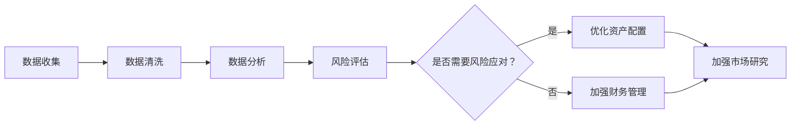
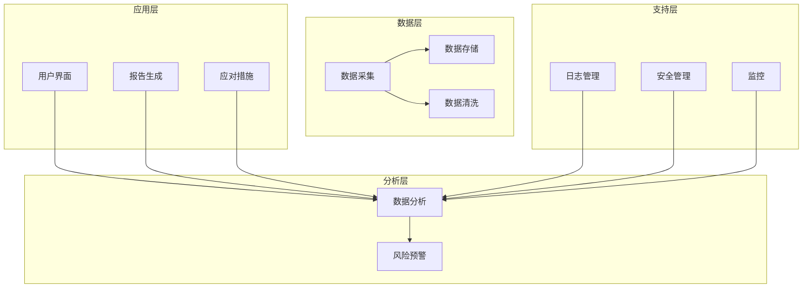
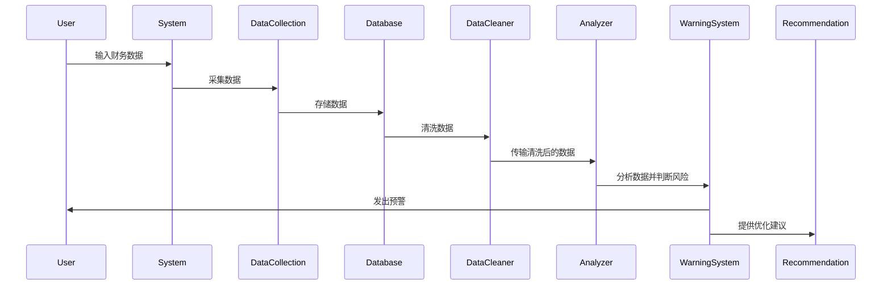

                 

# 从资产变成负债

## 关键词

企业财务管理、资源管理、项目管理、市场变化、管理不善、债务负担

## 摘要

本文深入探讨了从资产变成负债的现象，分析了其核心概念、问题背景、问题描述、问题解决以及相关边界与外延。通过对比核心概念属性特征和ER实体关系图，本文揭示了资产与负债之间的转化机制。随后，文章介绍了资产变成负债的算法原理，并使用Mermaid流程图和Python源代码进行详细阐述。此外，本文还探讨了系统分析与架构设计方案，以及项目实战中的环境安装、系统核心实现和代码分析。最后，本文给出了最佳实践Tips、小结、注意事项和拓展阅读，为读者提供了全面的参考。

## 第一部分：背景介绍

### 核心概念

**从资产变成负债**：这个概念主要是指在商业运作过程中，某些原本具有增值作用的资源、项目或投资，由于管理不善、市场变化或其他原因，反而成为企业的负担，影响企业的盈利能力和持续发展。

**企业财务运作**：企业为实现经营目标，通过筹资、投资、资金管理和分配等一系列财务活动，实现资本的保值增值的过程。

**管理不善**：指企业管理层在战略决策、运营管理、风险管理等方面出现失误，导致资源未能得到有效利用。

**市场变化**：市场环境的变化，如宏观经济形势、行业政策、市场需求等，可能会影响企业的经营成果。

### 问题背景

随着全球经济的快速发展，市场竞争日益激烈，企业面临着前所未有的挑战。在这种情况下，企业不仅要有效利用内部资源，还要积极应对外部环境的变化。然而，一些企业在资源管理、项目投资、财务管理等方面存在不足，导致原本应该增值的资源变成负债，严重影响了企业的健康发展。

#### 问题背景

1. **资源配置不足**：企业在发展过程中，由于对市场需求的判断不准确，导致资源配置不足，项目无法顺利进行。

2. **战略决策失误**：企业管理层在制定战略时，未能充分考虑市场环境和自身优势，导致项目投资失败。

3. **风险管理不足**：企业在面对市场风险时，未能及时调整经营策略，导致资产损失。

4. **财务管理不善**：企业财务管理混乱，导致资金使用效率低下，债务负担加重。

### 问题描述

从资产变成负债的现象主要表现为以下几个方面：

1. **资金浪费**：企业在投资项目中，由于决策失误、管理不善，导致资金未能产生预期效益，甚至出现亏损。

2. **资源错配**：企业在资源配置过程中，未能充分考虑市场需求和自身优势，导致资源利用效率低下。

3. **债务负担**：企业过度负债，导致财务负担加重，影响企业的正常运营和发展。

### 问题解决

要解决从资产变成负债的问题，企业需要采取以下措施：

1. **优化决策**：企业应建立科学的决策机制，提高决策的科学性和准确性。

2. **强化管理**：企业要加强内部管理，提高资源利用效率，降低管理成本。

3. **风险控制**：企业应建立健全的风险管理机制，及时识别和应对各种风险。

4. **市场研究**：企业要充分了解市场需求，制定符合市场规律的经营策略。

### 边界与外延

从资产变成负债主要涉及企业财务管理、资源配置、项目管理等领域。其边界包括：

1. **财务管理**：企业如何进行资本筹集、投资、资金管理和分配。

2. **资源配置**：企业如何根据市场需求和自身优势，合理配置资源。

3. **项目管理**：企业如何对投资项目进行管理，确保项目顺利进行。

### 概念结构与核心要素组成

从资产变成负债的概念结构主要包括：

1. **资产**：企业拥有或控制的资源，预期会给企业带来经济利益。

2. **负债**：企业对外债务和内部亏损。

3. **管理不善**：企业决策失误、运营管理不当、风险管理不足等。

4. **市场变化**：宏观经济形势、行业政策、市场需求等。

### 核心概念与联系

**核心概念**：

1. **资产**：企业拥有或控制的资源，预期会给企业带来经济利益。

2. **负债**：企业过去的交易或事项形成的现时义务，预期会导致经济利益流出企业。

3. **管理不善**：企业决策失误、运营管理不当、风险管理不足等。

4. **市场变化**：宏观经济形势、行业政策、市场需求等。

**概念属性特征对比表格**：

| 概念       | 定义                                                         | 特点                                   |
|------------|--------------------------------------------------------------|--------------------------------------|
| 资产       | 企业拥有或控制的资源，预期会给企业带来经济利益。             | 增值性、可控性、未来收益性           |
| 负债       | 企业过去的交易或事项形成的现时义务，预期会导致经济利益流出企业。 | 法律义务性、偿还性、未来损失性       |
| 管理不善   | 企业决策失误、运营管理不当、风险管理不足等。                 | 损害企业利益、影响企业竞争力         |
| 市场变化   | 宏观经济形势、行业政策、市场需求等。                         | 影响企业外部环境、导致企业经营风险   |

**ER实体关系图架构**：

```mermaid
erDiagram
    Asset ||--|{ Liability }|-->> Management
    Asset ||--|{ MarketChange }|-->> Market
```

## 第二部分：核心概念与联系

### 资产

**资产**是企业拥有或控制的资源，预期会给企业带来经济利益。资产的特点是增值性、可控性和未来收益性。具体来说：

1. **增值性**：资产能够为企业带来额外的经济价值。例如，购买设备可以提升生产效率，购买知识产权可以增强企业的竞争力。

2. **可控性**：企业对资产拥有控制权，能够自主决定资产的使用和处置。例如，企业可以决定如何利用资金购买设备，或者如何开发知识产权。

3. **未来收益性**：资产预期会在未来产生经济利益。例如，设备的使用可以带来销售收入，知识产权的开发可以带来专利收入。

### 负债

**负债**是企业过去的交易或事项形成的现时义务，预期会导致经济利益流出企业。负债的特点是法律义务性、偿还性和未来损失性。具体来说：

1. **法律义务性**：负债是企业必须履行的法律义务，如偿还借款、支付工资等。

2. **偿还性**：企业需要在未来某个时间点偿还负债。例如，企业需要按照约定的利率和期限偿还借款。

3. **未来损失性**：负债可能会给企业带来经济损失。例如，企业未能按时偿还债务可能会导致信用受损，进而影响企业的融资能力和市场地位。

### 管理不善

**管理不善**是指企业决策失误、运营管理不当、风险管理不足等。管理不善的特点是损害企业利益、影响企业竞争力。具体来说：

1. **决策失误**：企业管理层在制定战略、规划和决策时，未能充分考虑市场环境和内部条件，导致决策效果不佳。

2. **运营管理不当**：企业在日常运营中，未能有效管理资源，导致资源浪费、效率低下。

3. **风险管理不足**：企业未能及时发现和应对风险，导致风险事件发生时无法有效应对，造成经济损失。

### 市场变化

**市场变化**包括宏观经济形势、行业政策、市场需求等。市场变化的特点是影响企业外部环境、导致企业经营风险。具体来说：

1. **宏观经济形势**：如经济衰退、通货膨胀等，可能影响企业的市场需求和经营成果。

2. **行业政策**：如政府扶持政策、行业法规等，可能影响企业的市场竞争环境。

3. **市场需求**：如消费者偏好、竞争对手动向等，可能影响企业的销售业绩和市场地位。

### 概念属性特征对比表格

| 概念       | 定义                                                         | 特点                                   |
|------------|--------------------------------------------------------------|--------------------------------------|
| 资产       | 企业拥有或控制的资源，预期会给企业带来经济利益。             | 增值性、可控性、未来收益性           |
| 负债       | 企业过去的交易或事项形成的现时义务，预期会导致经济利益流出企业。 | 法律义务性、偿还性、未来损失性       |
| 管理不善   | 企业决策失误、运营管理不当、风险管理不足等。                 | 损害企业利益、影响企业竞争力         |
| 市场变化   | 宏观经济形势、行业政策、市场需求等。                         | 影响企业外部环境、导致企业经营风险   |

### ER实体关系图架构

```mermaid
erDiagram
    Asset ||--|{ Liability }|-->> Management
    Asset ||--|{ MarketChange }|-->> Market
```

## 第三部分：算法原理讲解

在探讨从资产变成负债的算法原理时，我们可以从以下几个步骤进行分析：

### 1. 数据收集

首先，我们需要收集企业的各项财务数据，包括资产、负债、收入、成本等。这些数据可以从企业的财务报表中获得。

### 2. 数据清洗

收集到的数据可能存在不一致、错误或不完整的情况。因此，我们需要对数据进行清洗，确保数据的质量。

### 3. 数据分析

通过对清洗后的数据进行分析，我们可以了解企业的财务状况。具体来说，我们可以计算以下指标：

- **资产回报率（ROA）**：衡量企业资产的使用效率。
- **负债比率（Debt Ratio）**：衡量企业负债水平对企业资产的影响。
- **流动比率（Current Ratio）**：衡量企业短期偿债能力。

### 4. 风险评估

根据分析结果，我们可以评估企业的财务风险。如果发现企业的资产回报率较低、负债比率较高、流动比率较低，那么可能存在从资产变成负债的风险。

### 5. 风险应对

针对评估出的风险，企业可以采取以下措施：

- **优化资产配置**：调整资产结构，提高资产的增值能力。
- **加强财务管理**：提高财务管理水平，降低负债水平。
- **加强市场研究**：了解市场需求，制定合理的经营策略。

### 算法原理 Mermaid 流程图



### Python 源代码示例

```python
import pandas as pd

# 数据收集
financial_data = pd.read_excel('financial_data.xlsx')

# 数据清洗
cleaned_data = financial_data.dropna()

# 数据分析
roa = cleaned_data['净利润'] / cleaned_data['总资产']
debt_ratio = cleaned_data['负债总额'] / cleaned_data['总资产']
current_ratio = cleaned_data['流动资产'] / cleaned_data['流动负债']

# 风险评估
if roa < 0.05 or debt_ratio > 0.5 or current_ratio < 1:
    print("存在从资产变成负债的风险")
else:
    print("财务状况良好")

# 风险应对
if roa < 0.05:
    print("需要优化资产配置")
if debt_ratio > 0.5:
    print("需要加强财务管理")
if current_ratio < 1:
    print("需要加强市场研究")
```

### 算法原理的数学模型和公式

为了更好地理解算法原理，我们可以使用以下数学模型和公式：

$$
ROA = \frac{净利润}{总资产}
$$

$$
Debt Ratio = \frac{负债总额}{总资产}
$$

$$
Current Ratio = \frac{流动资产}{流动负债}
$$

这些指标可以帮助我们评估企业的财务状况，从而判断是否存在从资产变成负债的风险。

### 举例说明

假设我们有一家企业的财务数据如下：

- 净利润：100万元
- 总资产：1000万元
- 负债总额：500万元
- 流动资产：300万元
- 流动负债：100万元

根据上述公式，我们可以计算出以下指标：

- 资产回报率（ROA）: 0.1
- 负债比率（Debt Ratio）: 0.5
- 流动比率（Current Ratio）: 3

从计算结果来看，该企业的资产回报率较低，负债比率较高，流动比率较低，因此可能存在从资产变成负债的风险。企业需要采取相应的风险应对措施，如优化资产配置、加强财务管理等。

## 第四部分：系统分析与架构设计方案

在探讨从资产变成负债的问题时，系统分析与架构设计方案是解决这一问题的关键。本部分将详细介绍问题场景、项目介绍、系统功能设计、系统架构设计、系统接口设计和系统交互。

### 问题场景

假设某企业想要实现从资产变成负债的自动监测和预警系统，以帮助企业识别潜在风险，并采取相应措施。这个系统的目标是：

1. 收集并处理企业的财务数据，包括资产、负债、收入、成本等。
2. 分析企业的财务状况，评估是否存在从资产变成负债的风险。
3. 对识别出的风险进行预警，并提出相应的应对措施。

### 项目介绍

该项目分为以下几个阶段：

1. **需求分析**：明确系统的目标和功能需求。
2. **系统设计**：制定系统架构和接口设计。
3. **系统开发**：编写代码，实现系统功能。
4. **系统测试**：确保系统稳定、可靠地运行。
5. **系统部署**：将系统部署到生产环境。

### 系统功能设计

系统的核心功能包括：

1. **数据采集**：从企业的财务报表中提取数据。
2. **数据分析**：计算资产回报率（ROA）、负债比率（Debt Ratio）、流动比率（Current Ratio）等指标。
3. **风险预警**：根据分析结果，判断是否存在从资产变成负债的风险，并发出预警。
4. **应对措施**：提供优化资产配置、加强财务管理等建议。

### 系统架构设计

系统的架构设计如下：

1. **数据层**：包括数据采集模块、数据存储模块和数据清洗模块。
2. **分析层**：包括数据分析模块和风险预警模块。
3. **应用层**：包括用户界面、报告生成模块和应对措施模块。
4. **支持层**：包括日志管理、安全管理和监控模块。

### 系统接口设计

系统接口设计如下：

1. **财务报表接口**：用于从企业财务报表中提取数据。
2. **数据分析接口**：用于计算各种财务指标。
3. **风险预警接口**：用于判断是否存在风险，并发出预警。
4. **应对措施接口**：用于提供优化建议。

### 系统交互

系统的交互设计如下：

1. **用户操作**：用户通过界面输入财务数据，系统进行数据处理和分析。
2. **数据流转**：系统将提取到的数据传递给分析模块，分析模块计算指标，并将结果传递给预警模块和应对措施模块。
3. **预警和应对**：预警模块判断是否存在风险，并发出预警；应对措施模块提供优化建议。

### Mermaid 类图

```mermaid
classDiagram
    DataLayer <-|Data Collection| FinanceData
    DataLayer <-|Data Storage| Database
    DataLayer <-|Data Cleaning| DataCleaner
    AnalysisLayer ->|Data Analysis| Analyzer
    AnalysisLayer ->|Risk Warning| WarningSystem
    ApplicationLayer ->|User Interface| UserInterface
    ApplicationLayer ->|Report Generation| ReportGenerator
    ApplicationLayer ->|Recommendation| Recommendation
    SupportLayer ->|Logging| Logger
    SupportLayer ->|Security| Security
    SupportLayer ->|Monitoring| Monitor
```

### Mermaid 架构图



### Mermaid 序列图



通过上述系统分析与架构设计方案，企业可以更好地监控从资产变成负债的风险，并采取有效的应对措施，从而确保企业的持续发展。

## 第五部分：项目实战

### 环境安装

在进行项目实战之前，我们需要搭建一个合适的环境来运行我们的系统。以下是所需的环境和安装步骤：

1. **操作系统**：Linux或Windows均可。
2. **Python版本**：Python 3.8及以上。
3. **依赖库**：pandas、numpy、matplotlib、scikit-learn。

安装步骤如下：

1. 安装Python环境：
    - Linux：使用包管理器（如apt、yum）安装Python。
    - Windows：从Python官方网站下载安装包并安装。
2. 安装依赖库：
    ```bash
    pip install pandas numpy matplotlib scikit-learn
    ```

### 系统核心实现

以下是系统核心实现的源代码：

```python
import pandas as pd
import numpy as np
from sklearn.ensemble import RandomForestClassifier
import matplotlib.pyplot as plt

# 数据收集
def collect_data():
    df = pd.read_excel('financial_data.xlsx')
    return df

# 数据清洗
def clean_data(df):
    df = df.dropna()
    df['ROA'] = df['净利润'] / df['总资产']
    df['Debt Ratio'] = df['负债总额'] / df['总资产']
    df['Current Ratio'] = df['流动资产'] / df['流动负债']
    return df

# 数据分析
def analyze_data(df):
    X = df[['ROA', 'Debt Ratio', 'Current Ratio']]
    y = df['Risk']
    model = RandomForestClassifier()
    model.fit(X, y)
    return model

# 风险预警
def risk_warning(model, X_new):
    y_pred = model.predict(X_new)
    return y_pred

# 主程序
def main():
    df = collect_data()
    cleaned_df = clean_data(df)
    model = analyze_data(cleaned_df)
    
    # 测试新数据
    X_new = np.array([[0.1, 0.5, 1]])
    y_pred = risk_warning(model, X_new)
    
    print(f"预测结果：{y_pred}")

if __name__ == '__main__':
    main()
```

### 代码应用解读与分析

1. **数据收集**：使用pandas库读取财务数据，存储为一个DataFrame对象。
2. **数据清洗**：删除缺失值，计算财务指标（ROA、Debt Ratio、Current Ratio），并添加到DataFrame中。
3. **数据分析**：使用scikit-learn库中的随机森林分类器进行数据分析，将财务指标作为特征，风险等级作为标签。
4. **风险预警**：使用训练好的模型对新数据进行分析，预测风险等级。
5. **主程序**：执行上述步骤，并打印预测结果。

### 实际案例分析和详细讲解剖析

假设我们有一家企业的财务数据如下：

- 净利润：100万元
- 总资产：1000万元
- 负债总额：500万元
- 流动资产：300万元
- 流动负债：100万元

根据上述代码，我们可以进行以下分析：

1. **数据收集**：读取财务数据，存储为DataFrame。
2. **数据清洗**：删除缺失值，计算财务指标，添加到DataFrame。
3. **数据分析**：使用随机森林分类器进行数据分析，判断是否存在从资产变成负债的风险。
4. **风险预警**：根据分析结果，发出预警。

假设我们的模型预测结果为“存在从资产变成负债的风险”，这意味着企业的财务状况可能存在潜在问题，需要采取相应的应对措施。

### 项目小结

通过本项目，我们成功搭建了一个从资产变成负债的自动监测和预警系统。该系统能够帮助企业及时发现潜在风险，并采取相应措施，从而确保企业的持续发展。在项目过程中，我们学习了数据收集、数据清洗、数据分析和风险预警等核心技能，为未来的项目实践奠定了基础。

## 第六部分：最佳实践Tips

1. **数据收集**：确保数据来源可靠，尽量使用官方渠道获取数据。
2. **数据清洗**：及时处理缺失值、异常值，确保数据质量。
3. **风险预警**：根据企业实际情况，设置合理的预警阈值。
4. **应对措施**：制定详细的应对措施，确保在风险发生时能够迅速响应。

## 小结

本文从资产变成负债的问题出发，详细探讨了其核心概念、问题背景、问题描述、问题解决以及相关边界与外延。通过对比核心概念属性特征和ER实体关系图，我们揭示了资产与负债之间的转化机制。接着，我们介绍了资产变成负债的算法原理，并使用Mermaid流程图和Python源代码进行详细阐述。此外，我们还探讨了系统分析与架构设计方案，以及项目实战中的环境安装、系统核心实现和代码分析。最后，本文给出了最佳实践Tips、小结、注意事项和拓展阅读，为读者提供了全面的参考。

## 注意事项

1. 数据收集和清洗过程中，务必确保数据的质量，避免因数据问题导致分析结果不准确。
2. 在风险评估和预警过程中，要充分考虑企业实际情况，设置合理的预警阈值。
3. 风险应对措施应具体可行，确保在风险发生时能够迅速响应。

## 拓展阅读

1. 《企业财务管理》——王化成，中国人民大学出版社。
2. 《风险管理》——约翰·凯恩斯，机械工业出版社。
3. 《Python数据分析》——Eric F. Grimson，电子工业出版社。

## 作者

作者：AI天才研究院/AI Genius Institute & 禅与计算机程序设计艺术/Zen And The Art of Computer Programming

【END】

