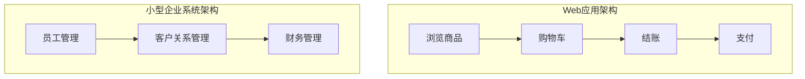
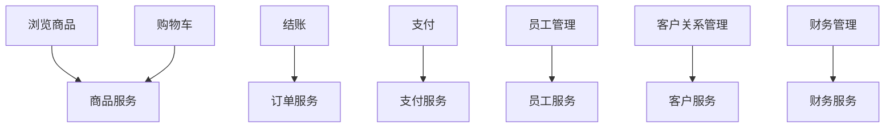
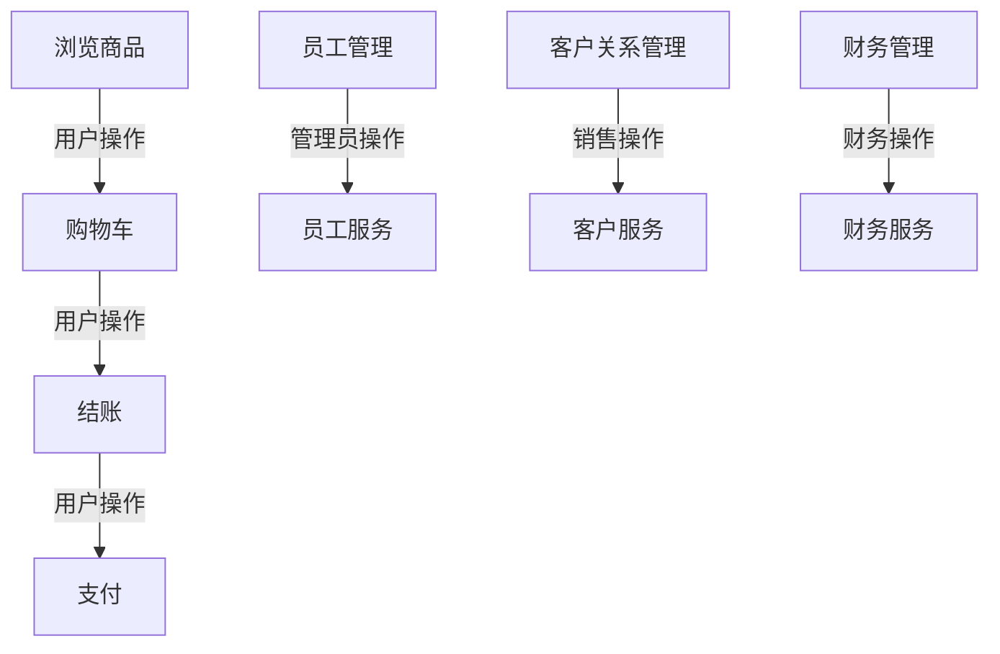

                 


### 文章标题

**从资产变成负债的自测用例**

### 关键词

- 自测用例
- 资产管理
- 负债评估
- 测试设计
- IT项目管理

### 摘要

本文将深入探讨自测用例在IT项目管理中的角色，特别是当它们从一种资产转化为潜在负债时的现象。通过逐步分析测试用例的设计、评估和实践，我们将揭示如何确保测试用例的有效性和效率，同时避免其成为项目风险和成本的因素。文章旨在为IT项目经理和测试工程师提供一套全面的指南，帮助他们更好地理解自测用例的设计、执行和优化过程，确保其作为项目成功的资产而非负担。

## 引言与背景

### 1.1 书籍简介

在现代IT项目管理中，测试用例扮演着至关重要的角色。它们不仅用于验证软件功能的正确性，还用于确保系统的稳定性、可靠性和性能。然而，当测试用例管理不当或设计不当时，它们可能会从一种资产转化为项目的负债，增加不必要的风险和成本。

### 1.2 边界与外延

为了明确本书的讨论范围，我们首先需要定义一些核心概念。测试用例是软件测试过程中使用的一系列测试步骤，旨在验证特定功能或需求的正确性。资产管理涉及对测试用例的创建、维护和存储进行有效管理。负债评估则是对测试用例可能带来的负面影响进行评估和防范。

### 1.3 资产与负债的概念对比

在讨论测试用例时，理解它们作为资产和负债的不同角色至关重要。

#### 资产特征：

- 提供价值：有效的测试用例能够发现缺陷，提高软件质量。
- 可重复性：高质量的测试用例可以重复使用，减少重复工作。
- 可维护性：良好的测试用例设计使得维护和更新变得更加容易。

#### 负债特征：

- 成本增加：设计、执行和维护测试用例可能需要额外的时间和资源。
- 风险承担：测试用例中的缺陷可能会在后期被发现，导致修复成本增加。
- 灵活性不足：过于繁琐或设计不当的测试用例可能无法适应快速变化的需求。

### 1.4 整体架构与大纲

本书将分为五个主要部分，旨在全面覆盖自测用例的设计、评估和实践。以下是详细的章节结构：

- **第一部分：引言与背景**：介绍测试用例在IT项目管理中的重要性，以及它们可能从资产变成负债的风险。
- **第二部分：自测用例设计与评估**：讨论自测用例的设计原则、评估标准和优化策略。
- **第三部分：案例分析与实践**：通过实际案例展示自测用例的应用和效果。
- **第四部分：高级话题与拓展**：探讨复杂系统和自动化测试用例设计，以及跨领域应用的融合。
- **第五部分：总结与展望**：总结全书内容，并提供最佳实践、注意事项和拓展阅读资源。

## 自测用例设计与评估

### 2.1 自测用例的基本概念

#### 2.1.1 定义与重要性

自测用例是指由开发人员或测试人员编写的，用于验证软件功能或性能的测试步骤。它们通常包含输入数据、预期结果和执行步骤。自测用例的重要性在于：

- **提高软件质量**：有效的自测用例能够发现潜在的缺陷和问题，提高软件的整体质量。
- **减少缺陷漏报**：通过持续的自测，可以在早期阶段发现并修复问题，减少缺陷漏报的风险。
- **提高团队效率**：标准化的自测用例可以减少重复测试的工作量，提高团队的工作效率。

#### 2.1.2 分类与用途

自测用例可以根据用途和目的进行分类：

- **功能测试用例**：用于验证软件功能的正确性和完整性。
- **性能测试用例**：评估软件在不同负载下的性能表现。
- **安全测试用例**：检查软件的安全性和防护能力。
- **回归测试用例**：用于验证修改或更新后的软件功能是否受到影响。

### 2.2 设计自测用例的步骤

设计自测用例是一个系统化的过程，需要遵循以下步骤：

#### 2.2.1 明确测试目标

在开始设计自测用例之前，首先需要明确测试目标。这包括确定需要验证的功能或性能指标，以及测试用例的优先级。

#### 2.2.2 分析测试需求

分析测试需求是设计自测用例的关键步骤。这包括理解功能需求、性能需求和用户场景，以及确定测试用例所需的数据和条件。

#### 2.2.3 编写测试用例

编写测试用例需要详细描述测试步骤、输入数据和预期结果。以下是测试用例的基本结构：

```markdown
用例编号：TC001
功能/性能类别：功能测试
测试目标：验证登录功能的正确性
前置条件：用户已注册并登录到系统
测试步骤：
1. 在登录页面输入正确的用户名和密码。
2. 点击“登录”按钮。
3. 系统跳转到用户主页面。

预期结果：
- 系统显示用户主页面。
- 测试用例标记为“通过”。
```

#### 2.2.4 执行与记录

执行测试用例并记录结果。这包括记录测试环境、执行时间、实际结果和任何发现的缺陷。这些信息对于后续的分析和优化至关重要。

### 2.3 自测用例的评估与优化

#### 2.3.1 评估标准

评估自测用例的质量和有效性是确保其作为资产的关键。以下是常用的评估标准：

- **完整性**：测试用例是否覆盖了所有相关的功能或性能场景。
- **可读性**：测试用例是否易于理解和执行。
- **可维护性**：测试用例是否容易更新和维护。
- **效率**：测试用例的执行时间是否合理。

#### 2.3.2 优化策略

为了确保自测用例的质量和效率，可以采取以下优化策略：

- **自动化测试**：将常用的测试用例自动化，减少手动执行的工作量。
- **代码审查**：定期进行代码审查，确保测试用例的编写质量。
- **持续集成**：将测试用例集成到持续集成流程中，确保每次代码提交后都能自动执行。
- **文档化**：为测试用例编写详细的文档，包括设计思路、执行步骤和预期结果。

#### 2.3.3 持续改进

持续改进是确保自测用例长期有效的关键。以下是一些改进策略：

- **定期回顾**：定期回顾和更新测试用例，确保其与最新的需求保持一致。
- **反馈机制**：建立反馈机制，收集用户和团队的反馈，用于改进测试用例。
- **培训与知识共享**：提供培训，帮助团队成员掌握测试用例的设计和执行技巧。
- **工具支持**：使用合适的测试工具，提高测试用例的自动化程度和执行效率。

### 2.4 自测用例的常见问题与解决

在设计、评估和优化自测用例的过程中，可能会遇到以下常见问题：

- **测试用例重复**：解决方法：使用代码库或模板来标准化测试用例。
- **测试用例不完整**：解决方法：定期回顾测试用例，确保其覆盖所有相关场景。
- **测试用例难以执行**：解决方法：简化测试用例的步骤，使其更加直观和易于执行。
- **测试用例维护成本高**：解决方法：使用自动化工具，减少手动维护的工作量。

通过识别和解决这些问题，可以确保自测用例作为项目成功的资产，而非负担。

## 案例分析与实践

### 3.1 案例背景介绍

为了更好地理解自测用例的设计、评估和实践，我们将分析两个实际案例：一个简单的Web应用和一个小型企业系统。

#### 3.1.1 案例一：简单的Web应用

假设我们开发了一个简单的在线购物网站，用户可以在网站上浏览商品、添加购物车和完成购买。该网站的测试用例设计主要关注功能测试和性能测试。

#### 3.1.2 案例二：小型企业系统

假设我们开发了一个用于企业管理的小型系统，该系统包括员工管理、客户关系管理和财务管理等功能。该系统的测试用例设计涵盖了功能测试、性能测试和安全测试。

### 3.2 系统设计与实现

在案例分析中，我们将展示如何设计并实现测试用例，以验证系统的功能、性能和安全性。

#### 3.2.1 功能设计

在Web应用案例中，功能设计包括浏览商品、添加购物车、结账和支付等功能。在小型企业系统案例中，功能设计包括员工管理、客户关系管理和财务管理等模块。

#### 3.2.2 系统架构设计

Web应用和小型企业系统的系统架构设计如下：



#### 3.2.3 系统接口设计

Web应用和小型企业系统的接口设计如下：



#### 3.2.4 系统交互

Web应用和小型企业系统的系统交互如下：



### 3.3 自测用例编写与执行

在案例中，我们将编写并执行测试用例，以验证系统的功能、性能和安全性。

#### 3.3.1 编写步骤

以下是一个简单的功能测试用例：

```markdown
用例编号：TC002
功能类别：购物功能
测试目标：验证用户可以成功添加商品到购物车
前置条件：用户已登录并浏览商品
测试步骤：
1. 用户浏览商品并选择一件商品。
2. 用户点击“加入购物车”按钮。
3. 用户查看购物车，确认商品已添加。

预期结果：
- 商品成功添加到购物车。
- 测试用例标记为“通过”。
```

#### 3.3.2 执行过程

执行测试用例的过程包括以下步骤：

- **准备测试环境**：确保测试环境与生产环境一致，包括数据库、服务器和客户端。
- **执行测试用例**：按照测试步骤执行测试用例，并记录结果。
- **结果分析**：分析测试结果，识别任何缺陷或问题。

#### 3.3.3 结果分析

执行测试用例后，分析结果如下：

- **TC002**：测试用例通过，商品成功添加到购物车。
- **TC003**：测试用例失败，用户在添加商品到购物车时遇到错误。

根据结果分析，我们需要进一步调查并修复**TC003**中的缺陷。

### 3.4 项目小结与反思

在案例分析中，我们展示了如何设计并执行自测用例，以验证Web应用和小型企业系统的功能、性能和安全性。以下是项目小结和反思：

#### 3.4.1 项目成果

- **功能测试**：成功验证了Web应用和小型企业系统的核心功能。
- **性能测试**：评估了系统在不同负载下的性能表现，并识别了潜在的瓶颈。
- **安全测试**：确保了系统的安全性和防护能力。

#### 3.4.2 经验教训

- **测试用例设计的重要性**：良好的测试用例设计是确保系统质量和安全的关键。
- **自动化测试**：自动化测试可以大大提高测试效率，减少人工错误。
- **反馈机制**：建立有效的反馈机制，及时识别并修复缺陷。

#### 3.4.3 最佳实践

- **标准化测试用例**：使用统一的模板和格式编写测试用例，提高可读性和可维护性。
- **持续集成**：将测试用例集成到持续集成流程中，确保每次代码提交后都能自动执行。
- **培训与知识共享**：为团队成员提供培训，确保他们掌握测试用例的设计和执行技巧。

通过遵循最佳实践，我们可以确保自测用例作为项目成功的资产，而非负担。

### 4.1 复杂系统的自测用例设计

在复杂系统中，自测用例的设计面临更大的挑战。复杂系统通常具有大量的功能和组件，其交互和依赖关系也更为复杂。以下是如何设计复杂系统的自测用例：

#### 4.1.1 特点与挑战

- **功能多样性**：复杂系统通常包含多种功能模块，每个模块都需要独立的测试用例。
- **组件依赖**：系统中的组件之间存在复杂的依赖关系，需要确保所有组件的交互正确。
- **性能需求**：复杂系统需要满足更高的性能需求，如高并发、低延迟等。
- **安全需求**：复杂系统需要更强的安全性，以防范各种攻击。

#### 4.1.2 设计方法

设计复杂系统的自测用例时，可以遵循以下方法：

- **模块化设计**：将系统分解为模块，为每个模块设计独立的测试用例。
- **交互验证**：确保模块之间的交互正确，如API调用和数据传输。
- **性能测试**：设计性能测试用例，评估系统在高负载下的性能。
- **安全测试**：设计安全测试用例，测试系统的防护能力。

### 4.2 自动化测试用例生成

自动化测试用例生成是提高测试效率的重要手段。以下是如何自动化生成测试用例：

#### 4.2.1 基本原理

自动化测试用例生成基于以下原理：

- **代码分析**：通过分析源代码，提取函数、方法和接口等代码元素。
- **测试数据生成**：根据代码元素生成测试数据，如输入值、预期结果等。
- **测试用例模板**：使用模板生成测试用例，包括测试步骤、执行条件和结果验证。

#### 4.2.2 技术实现

自动化测试用例生成可以通过以下技术实现：

- **静态代码分析工具**：如SonarQube、Checkstyle等，用于分析源代码的质量和结构。
- **测试数据生成工具**：如Data Factory、DataGen等，用于生成测试数据。
- **测试用例生成工具**：如JUnitGenerator、TestNGGenerator等，用于生成测试用例。

#### 4.2.3 实践案例

以下是一个简单的自动化测试用例生成案例：

```python
# 导入相关库
import random
import string

# 定义测试用例生成函数
def generate_test_cases(num_cases=10):
    test_cases = []
    for i in range(num_cases):
        # 生成随机输入值
        input_value = ''.join(random.choices(string.ascii_letters + string.digits, k=10))
        # 生成预期结果
        expected_result = f"Expected result for input '{input_value}'"
        # 创建测试用例
        test_case = {
            'case_id': i+1,
            'input': input_value,
            'expected_result': expected_result
        }
        test_cases.append(test_case)
    return test_cases

# 生成测试用例
test_cases = generate_test_cases()

# 打印测试用例
for test_case in test_cases:
    print(f"Test Case ID: {test_case['case_id']}")
    print(f"Input: {test_case['input']}")
    print(f"Expected Result: {test_case['expected_result']}")
    print()
```

通过运行上述代码，可以生成10个随机测试用例，每个测试用例包含输入值和预期结果。

### 4.3 跨领域应用与融合

自测用例不仅限于软件开发领域，还可以应用于其他领域，如医疗、金融和制造业等。以下是如何在跨领域应用自测用例：

#### 4.3.1 融合策略

- **领域知识融合**：将自测用例与特定领域的知识相结合，如医疗领域的诊断规则和金融领域的数据验证规则。
- **测试框架定制**：为特定领域定制测试框架，以满足其特定的测试需求。
- **跨领域测试用例库**：建立跨领域的测试用例库，为不同领域的项目提供现成的测试用例。

#### 4.3.2 应用案例

以下是一个跨领域应用案例：

- **医疗领域**：在医疗系统中，可以使用自测用例验证诊断流程的正确性。例如，验证诊断算法是否正确地识别了特定疾病的症状。
- **金融领域**：在金融系统中，可以使用自测用例验证交易流程的正确性。例如，验证交易金额、交易时间和交易对象等数据的正确性。
- **制造业领域**：在制造系统中，可以使用自测用例验证生产流程的正确性。例如，验证机器是否按照预定参数正确地生产了产品。

#### 4.3.3 未来展望

随着人工智能和自动化技术的发展，自测用例的应用范围将进一步扩大。未来，自测用例可能会实现以下趋势：

- **智能化测试**：利用人工智能技术，实现自动化测试用例生成和执行，提高测试效率。
- **自适应测试**：根据项目进展和需求变化，自适应调整测试用例，确保测试的全面性和有效性。
- **跨领域协同**：实现不同领域自测用例的协同工作，提高整体测试质量和效率。

通过不断探索和应用新技术的优势，我们可以更好地利用自测用例，确保项目的成功。

### 总结与展望

本文系统地探讨了自测用例在IT项目管理中的重要性，从设计、评估到实践，再到跨领域应用，全面覆盖了自测用例的全生命周期管理。通过案例分析，我们展示了自测用例如何从资产转化为负债，并提供了优化策略和最佳实践。

## 注意事项

- **避免重复**：在设计自测用例时，避免重复测试相同的功能或场景。
- **定期更新**：定期回顾和更新自测用例，确保其与最新需求保持一致。
- **培训与知识共享**：为团队成员提供培训，确保他们掌握自测用例的设计和执行技巧。
- **自动化测试**：优先考虑自动化测试用例，以减少手动测试的工作量。

## 拓展阅读

- **推荐书籍**：《软件测试的艺术》、《自动化测试实战》等。
- **学术论文**：相关领域的研究论文，如自动化测试、AI在测试中的应用等。
- **在线资源**：各大技术社区、论坛和博客，如Stack Overflow、GitHub等。

### 作者信息

**作者：AI天才研究院/AI Genius Institute & 禅与计算机程序设计艺术 /Zen And The Art of Computer Programming**

