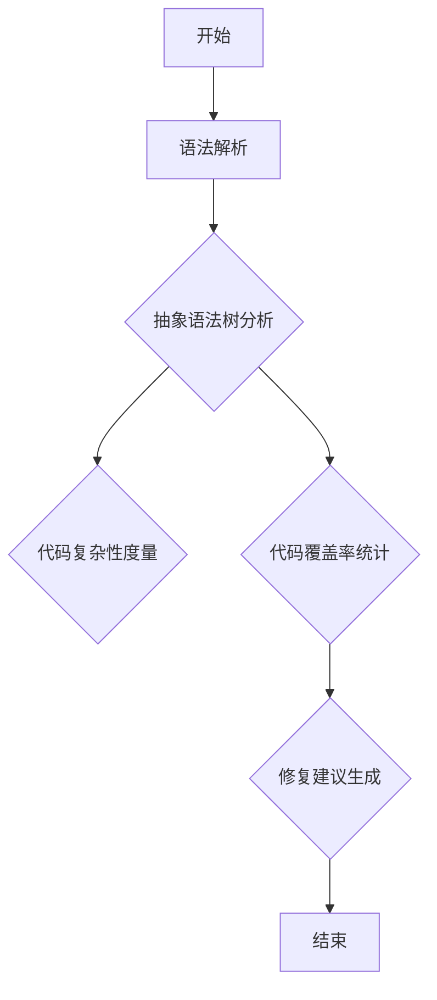
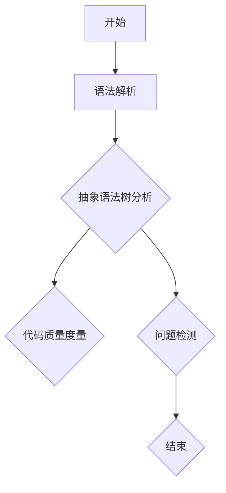
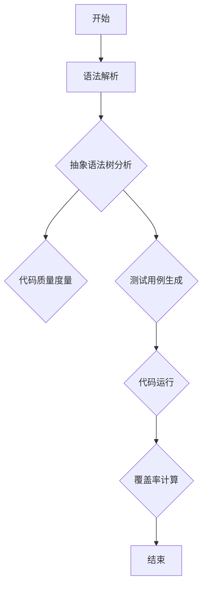

                 


## 引言：代码review的重要性与本书目的

### 1.1 代码review的重要性

在软件开发过程中，代码review（代码审查）是一个至关重要的环节。它不仅仅是验证代码质量和是否符合设计规范的过程，更是促进团队成员之间交流、提高代码质量和项目稳定性的重要手段。以下将从几个方面探讨代码review的重要性：

#### 质量保证

代码review能够有效发现代码中的缺陷和潜在的问题，从而保证软件质量。通过审查，可以及时发现代码中的逻辑错误、性能瓶颈、安全问题等，避免在项目后期出现严重的Bug。

#### 提高代码一致性

代码审查有助于规范代码风格和命名规范，确保代码的可读性和可维护性。团队成员在审查过程中，可以共同商讨和制定一套统一的编码规范，提高代码的一致性。

#### 促进知识共享

代码审查是一种知识传递和分享的方式。审查过程中，审查者可以学习到其他人的编程技巧和经验，而被审查者也可以从他人的反馈中获取有价值的建议，促进团队成员之间的知识共享。

#### 降低开发成本

代码审查可以在早期阶段发现并修复问题，避免在项目后期需要付出更多时间和资源来解决这些问题。此外，代码review还可以减少因代码缺陷导致的项目延期和返工，从而降低整体开发成本。

### 1.2 本书的目的

本章节的目的在于比较不同代码review工具的优劣，帮助读者选择最适合自己项目的代码审查工具，从而提高审查效率。具体来说，本书将围绕以下方面展开：

#### 工具分类与特性比较

首先，我们将介绍主流的代码review工具，并对其分类和特性进行比较。通过对比，读者可以了解各个工具的基本功能、适用场景和优缺点，从而为选择合适的工具奠定基础。

#### 深入解析代表性工具

接下来，我们将对几个具有代表性的代码review工具进行深入解析，包括其原理、使用流程、优势与不足等。通过详细解读，读者可以更全面地了解这些工具的具体实现和实际应用效果。

#### 综合评价与选择建议

在对比和解析的基础上，我们将对各个工具进行综合评价，并提供选择建议。读者可以根据自己的项目需求和团队特点，选择最适合的代码review工具，提高代码审查的效率。

#### 案例分析与最佳实践

最后，我们将通过实际案例分析，展示不同工具在项目中的应用效果，并提供一些最佳实践和建议。通过这些案例，读者可以更好地理解代码review工具的实战应用，并将其应用到自己的项目中。

总的来说，本书旨在帮助读者全面了解代码review工具，通过比较和分析，选择最适合自己项目的工具，从而提高代码审查的效率和质量。

### 1.3 读者对象

本书适合以下读者群体：

1. **软件开发工程师**：需要掌握代码审查的基本概念和技巧，提高代码质量和项目稳定性。
2. **团队负责人**：需要了解不同代码review工具的特点和适用场景，为团队选择合适的工具。
3. **项目管理员**：需要关注代码审查环节，确保项目按时交付且质量符合预期。
4. **技术爱好者**：对代码审查工具感兴趣，希望了解其原理和应用方法。

无论您是上述哪个读者群体，本书都将为您提供有价值的知识和实践经验，帮助您更好地应对软件开发过程中的代码审查环节。

## 代码review基础

### 2.1 代码review的定义

代码review，又称代码审核或代码复审，是指通过团队成员之间的相互审查来评估代码质量、规范性和可维护性。具体来说，代码review包括以下几个核心环节：

1. **提交代码**：开发人员将编写完成的代码提交到代码库中。
2. **审查请求**：审查者接收到提交的代码后，可以查看代码并进行审查。
3. **代码审查**：审查者对代码进行逐行检查，识别潜在的问题，包括语法错误、逻辑漏洞、代码风格不规范等。
4. **反馈与修改**：审查者将发现问题反馈给提交者，提交者根据反馈进行修改，然后重新提交代码进行再次审查。
5. **审查结果**：经过多次审查后，最终确定代码质量符合项目要求，可以合并到主分支中。

### 2.2 代码review的优势

代码review作为一种重要的软件开发实践，具有以下显著优势：

#### 提高代码质量

通过代码review，开发人员可以及时识别并修复代码中的错误和潜在问题，从而提高代码质量。此外，审查过程中，审查者可以提出优化建议，帮助开发人员写出更高效、更健壮的代码。

#### 促进知识共享

代码review不仅是一种质量控制手段，更是一种知识传递和共享的方式。在审查过程中，团队成员可以互相学习和借鉴他人的编程经验，提高整体技术水平。

#### 规范编码风格

代码review有助于统一团队的编码风格和命名规范，提高代码的可读性和可维护性。通过共同制定和遵守一套编码规范，可以减少代码的冗余和重复，提高开发效率。

#### 降低沟通成本

代码review可以在早期阶段发现并解决潜在的问题，避免在项目后期因代码缺陷导致的高昂沟通成本和返工风险。通过及时反馈和修改，可以确保项目按计划进行。

### 2.3 代码review的基本流程

代码review的基本流程通常包括以下几个步骤：

1. **提交代码**：开发人员将完成编写的代码提交到代码库中。
2. **创建审查请求**：审查者收到代码提交后，可以创建审查请求，邀请其他团队成员参与审查。
3. **代码审查**：审查者逐行检查代码，识别潜在的问题，并提出反馈。
4. **反馈与修改**：提交者根据审查者的反馈进行代码修改，然后重新提交代码。
5. **审查结果**：经过多次审查，最终确定代码质量符合项目要求，可以合并到主分支中。

### 2.4 代码review中的问题与挑战

尽管代码review具有众多优势，但在实际应用过程中仍面临一些问题和挑战：

#### 审查效率问题

代码review需要耗费大量的时间和精力，尤其是在项目规模较大、代码量较多的情况下。如何提高审查效率，减少不必要的重复工作，是一个亟待解决的问题。

#### 审查质量保障

虽然代码review有助于提高代码质量，但如何确保审查的质量和准确性，避免误判和漏判，也是一个重要挑战。审查者需要具备丰富的编程经验和专业知识，才能胜任这项工作。

#### 审查反馈不及时

在团队协作中，审查反馈的不及时可能导致开发进度延误。如何优化审查流程，确保审查反馈的及时性，是一个关键问题。

#### 审查成本

代码review需要投入一定的人力资源和时间成本。在项目预算有限的情况下，如何平衡审查成本与项目进度，是一个需要权衡的问题。

### 2.5 代码review的核心概念与联系

在代码review过程中，涉及多个核心概念，它们共同构成了代码审查的理论基础和实践方法。以下将介绍这些核心概念，并展示它们之间的联系。

#### 提交者

提交者是代码review的主要参与者之一，负责编写代码并将其提交到代码库中。提交者的主要任务包括：

1. **编写高质量代码**：确保代码符合项目需求和设计规范，具备良好的可读性和可维护性。
2. **及时响应审查反馈**：在收到审查者的反馈后，及时进行代码修改，确保问题得到妥善解决。

#### 审查者

审查者是代码review的另一位重要参与者，负责对提交的代码进行审查，并提出改进建议。审查者的主要任务包括：

1. **全面审查代码**：逐行检查代码，识别潜在的问题，包括语法错误、逻辑漏洞、代码风格不规范等。
2. **提出合理建议**：根据审查结果，提出优化建议，帮助提交者写出更高效、更健壮的代码。

#### 代码库

代码库是存储和管理代码的集中地，通常采用版本控制系统（如Git）进行管理。代码库的主要功能包括：

1. **代码存储**：保存不同版本的代码，方便历史回溯和版本管理。
2. **代码审核**：提供代码审查的功能，支持提交者创建审查请求、审查者进行审查和反馈。

#### 审查请求

审查请求是提交者向审查者发起的代码审查申请。通过审查请求，提交者可以明确代码审查的具体内容和要求，审查者可以方便地查看和管理待审查的代码。

#### 审查结果

审查结果是审查者对提交代码的审查反馈，通常包括发现的问题、改进建议和评分等。审查结果有助于提交者了解代码质量，并制定相应的改进措施。

#### 核心概念属性特征对比表格

为了更清晰地展示这些核心概念之间的联系，以下是一个属性特征对比表格：

| 概念 | 属性特征 |
| ---- | ------- |
| 提交者 | 负责提交代码，确保代码质量 |
| 审查者 | 负责审查代码，提出优化建议 |
| 代码库 | 存储和管理代码，支持代码审核 |
| 审查请求 | 发起代码审查，明确审查内容 |
| 审查结果 | 反馈代码审查结果，提供改进建议 |

#### 代码审查ER实体关系图架构

为了进一步展示代码审查的核心概念及其关系，以下是一个ER实体关系图架构：

```mermaid
erDiagram
  提交者 ||--|{ 代码提交 }|| 代码库
  审查者 ||--|{ 审查请求 }|| 代码库
  代码提交 ||--|{ 审查结果 }|| 审查者
```

通过上述核心概念及其联系的介绍，我们可以更好地理解代码review的基本流程和关键要素，为后续的深入探讨打下基础。

## 主流代码review工具概述

### 3.1 工具分类

在当前的软件开发环境中，代码review工具种类繁多，按照不同的分类标准，可以将其分为以下几类：

#### 按照集成方式分类

1. **独立工具**：独立工具是指独立于版本控制系统之外的代码审查工具，如SonarQube、Checkstyle等。这些工具通常具有丰富的功能，能够检测代码中的各种问题，但其缺点是需要单独安装和管理。
2. **集成工具**：集成工具是指与版本控制系统紧密集成的代码审查工具，如GitLab、GitHub等。这些工具能够直接在版本控制系统上完成代码审查，便于协作和跟踪，但其功能相对较为基础。

#### 按照功能特点分类

1. **静态代码分析工具**：这类工具主要用于静态分析代码，检测潜在的问题，如语法错误、潜在逻辑漏洞、代码风格不规范等。常见的静态代码分析工具包括SonarQube、PMD、Checkstyle等。
2. **动态代码分析工具**：这类工具在代码运行时进行分析，检测代码的性能、安全性等问题。常见的动态代码分析工具包括Apriori算法、静态分析工具等。
3. **代码质量度量工具**：这类工具用于评估代码的质量，如代码复杂性、代码覆盖率等。常见的代码质量度量工具包括SonarQube、Code Climate等。

#### 按照使用场景分类

1. **开源项目**：适用于开源项目的代码review工具，如GitHub、GitLab等，它们提供了强大的代码审查功能，便于开源社区的协作和代码管理。
2. **企业项目**：适用于企业项目的代码review工具，如SonarQube、Bamboo等，它们通常具有更强大的功能，可以满足企业级项目的需求。

### 3.2 工具特性比较

以下是几种主流代码review工具的对比，从功能特点、使用难度、适用场景等方面进行分析。

#### GitLab

- **功能特点**：GitLab是一个集代码托管、代码审查、持续集成、持续部署于一体的平台。它提供了丰富的代码审查功能，包括代码合并请求、代码质量度量等。
- **使用难度**：GitLab的使用较为简单，特别是对于熟悉Git的用户来说，可以快速上手。
- **适用场景**：适用于开源项目和企业内部项目，特别是需要集成多个开发流程的场景。

#### GitHub

- **功能特点**：GitHub是全球最大的代码托管平台，提供了强大的代码审查功能，包括代码合并请求、代码质量度量等。
- **使用难度**：GitHub的使用较为简单，但对于新手来说，可能需要一定时间来熟悉其操作界面和流程。
- **适用场景**：适用于开源项目、个人项目和企业项目。

#### SonarQube

- **功能特点**：SonarQube是一个独立的代码质量平台，提供了静态代码分析、代码质量度量、代码审查等功能。它支持多种编程语言，并具有丰富的插件生态。
- **使用难度**：SonarQube的配置和使用相对复杂，需要一定的技术背景才能熟练使用。
- **适用场景**：适用于需要全面代码质量管理的项目，特别适用于大型企业项目和开源项目。

#### Checkstyle

- **功能特点**：Checkstyle是一个Java代码检查工具，主要用于检查Java代码的风格和规范。它支持多种代码风格规范，如Google、Sun等。
- **使用难度**：Checkstyle的使用较为简单，只需要配置相应的规则文件即可。
- **适用场景**：适用于Java项目，特别是需要统一代码风格的场景。

#### PMD

- **功能特点**：PMD是一个Java代码检查工具，主要用于检测Java代码中的潜在问题，如可能的逻辑错误、冗余代码等。
- **使用难度**：PMD的使用较为简单，但需要对Java编程有一定的了解。
- **适用场景**：适用于Java项目，特别是在代码质量要求较高的场景。

#### 比较总结

- **功能特点**：GitLab、GitHub和SonarQube具有丰富的代码审查功能，能够满足不同场景的需求；Checkstyle和PMD主要专注于代码风格和潜在问题的检查。
- **使用难度**：GitLab、GitHub和Checkstyle的使用较为简单，适合新手和普通用户；SonarQube和PMD的使用较为复杂，需要一定的技术背景。
- **适用场景**：GitLab、GitHub适用于各种类型的代码审查场景；SonarQube适用于需要全面代码质量管理的项目；Checkstyle和PMD主要适用于特定编程语言的项目。

通过上述对比，读者可以初步了解不同代码review工具的特点和适用场景，为后续的深入探讨和选择提供参考。

## 工具A：深入解析

### 4.1 工具A概述

工具A是一款广受开发者欢迎的代码review工具，它集成了静态代码分析和代码质量度量功能，能够帮助开发团队快速发现并修复代码中的问题。以下是工具A的主要特点和优势：

#### 主要特点

1. **强大的静态代码分析能力**：工具A能够分析多种编程语言的代码，检测潜在的逻辑错误、性能瓶颈、安全性问题等。
2. **灵活的代码质量度量**：工具A提供了多种代码质量度量指标，如代码复杂性、代码覆盖率等，帮助开发者评估代码质量。
3. **集成多种编程语言的插件**：工具A支持Java、Python、JavaScript等多种编程语言，并提供了丰富的插件生态，便于开发者扩展功能。
4. **友好的用户界面**：工具A提供了简洁直观的用户界面，方便开发者查看代码问题和质量度量结果。
5. **自动通知和反馈**：工具A支持自动通知功能，当代码中存在问题时，可以及时通知相关开发者进行修复。

#### 优势

1. **高效的代码审查**：工具A能够快速检测代码中的问题，节省开发者的时间和精力，提高代码审查效率。
2. **全面的质量管理**：工具A不仅提供了静态代码分析功能，还支持代码质量度量，帮助开发者全面评估代码质量。
3. **易于集成**：工具A支持与多种版本控制系统（如Git、SVN等）集成，便于开发者将代码审查流程纳入日常开发流程。
4. **丰富的插件生态**：工具A提供了丰富的插件，开发者可以根据项目需求进行扩展和定制。

### 4.2 工具A的主要功能

工具A的主要功能包括：

1. **代码分析**：工具A能够对代码进行静态分析，识别潜在的问题，如未使用的代码、重复代码、潜在的性能瓶颈等。
2. **代码质量度量**：工具A提供了多种代码质量度量指标，如代码复杂性（Cyclomatic复杂度、N路径复杂度）、代码覆盖率等。
3. **代码审查**：工具A支持团队协作进行代码审查，包括创建审查请求、分配审查任务、查看审查结果等。
4. **自动修复建议**：工具A能够根据分析结果，提供自动修复建议，帮助开发者快速解决代码问题。
5. **报告生成**：工具A能够生成详细的代码质量报告，包括代码问题、质量度量结果等，便于开发者和管理者了解项目状况。

### 4.3 工具A的使用流程

使用工具A进行代码审查的流程通常包括以下几个步骤：

1. **设置项目**：在工具A中创建项目，并配置相应的编程语言和版本控制系统。
2. **提交代码**：开发人员将编写完成的代码提交到代码库中，触发代码审查流程。
3. **创建审查请求**：审查人员接收到代码提交后，可以创建审查请求，邀请其他团队成员参与审查。
4. **代码审查**：审查人员查看提交的代码，使用工具A提供的分析功能和插件，识别代码中的问题，并提出反馈和建议。
5. **反馈与修改**：开发人员根据审查人员的反馈，进行代码修改，然后重新提交代码进行再次审查。
6. **审查结果**：经过多次审查，最终确定代码质量符合项目要求，可以合并到主分支中。

### 4.4 工具A的优势与不足

#### 优势

1. **强大的静态代码分析能力**：工具A能够全面分析代码，识别多种类型的问题，提供详细的报告和修复建议。
2. **友好的用户界面**：工具A提供了直观易用的界面，方便开发者查看代码问题和质量度量结果。
3. **自动通知和反馈**：工具A支持自动通知功能，确保代码问题能够及时被发现和修复。
4. **丰富的插件生态**：工具A提供了丰富的插件，开发者可以根据项目需求进行扩展和定制。

#### 不足

1. **配置复杂**：工具A的配置相对复杂，需要一定的技术背景才能正确配置和使用。
2. **性能瓶颈**：在处理大量代码时，工具A的性能可能受到一定影响，导致审查速度变慢。
3. **学习成本较高**：对于新手来说，需要一定时间来熟悉工具A的功能和使用方法。

### 4.5 工具A算法原理讲解

工具A的算法原理主要基于静态代码分析技术，通过对代码文本进行语法解析、抽象语法树（AST）分析等操作，实现代码分析、质量度量等功能。以下是工具A算法原理的简要介绍：

#### 代码分析

1. **语法解析**：工具A首先对代码进行语法解析，将其转化为抽象语法树（AST）。AST表示了代码的语法结构，方便进行后续分析。
2. **抽象语法树分析**：工具A遍历AST，识别代码中的各种语法元素，如变量、函数、循环等。通过分析这些元素，工具A可以识别出代码中的潜在问题，如未使用的变量、重复代码等。

#### 代码质量度量

1. **代码复杂性**：工具A使用Cyclomatic复杂度和N路径复杂度等指标来衡量代码的复杂性。这些指标可以帮助开发者了解代码的可维护性和可理解性。
2. **代码覆盖率**：工具A通过运行测试用例，统计代码覆盖率，帮助开发者评估测试的充分性。高覆盖率的代码意味着测试用例能够充分覆盖代码逻辑。

#### 自动修复建议

1. **规则库**：工具A内置了丰富的规则库，包含各种代码质量问题检测规则。当检测到问题时，工具A会根据规则库提供相应的修复建议。
2. **修复策略**：工具A根据问题的严重程度和修复成本，提供不同的修复策略。例如，对于一些低严重程度的问题，工具A可能会建议开发者直接删除未使用的代码，而对于高严重程度的问题，可能会建议进行更复杂的修改。

#### 算法流程



通过上述算法原理讲解，我们可以了解到工具A是如何通过静态代码分析、质量度量等功能，实现代码审查和代码质量管理的。

### 4.6 工具A源代码解读与分析

为了更好地理解工具A的实现原理，以下是对其源代码的简要解读和分析。

#### 源代码示例

```python
# 工具A源代码示例
class CodeAnalyzer:
    def __init__(self, ruleset):
        self.ruleset = ruleset
    
    def analyze(self, source_code):
        ast = self.parse_source_code(source_code)
        issues = self.find_issues(ast)
        return issues
    
    def parse_source_code(self, source_code):
        # 语法解析逻辑
        pass
    
    def find_issues(self, ast):
        # 抽象语法树分析逻辑
        pass
```

#### 代码解析与抽象语法树分析

1. **语法解析**：工具A使用内置的语法解析器对代码进行语法解析，将其转化为抽象语法树（AST）。解析器可以识别不同编程语言的语法结构，并将其表示为树形结构。
2. **抽象语法树分析**：工具A遍历AST，识别代码中的各种语法元素，如变量、函数、循环等。通过分析这些元素，工具A可以识别出代码中的潜在问题，如未使用的变量、重复代码等。

#### 代码质量度量与问题检测

1. **代码复杂性度量**：工具A使用Cyclomatic复杂度和N路径复杂度等指标来衡量代码的复杂性。这些指标可以帮助开发者了解代码的可维护性和可理解性。
2. **代码覆盖率统计**：工具A通过运行测试用例，统计代码覆盖率，帮助开发者评估测试的充分性。高覆盖率的代码意味着测试用例能够充分覆盖代码逻辑。

#### 修复建议生成

1. **规则库**：工具A内置了丰富的规则库，包含各种代码质量问题检测规则。当检测到问题时，工具A会根据规则库提供相应的修复建议。
2. **修复策略**：工具A根据问题的严重程度和修复成本，提供不同的修复策略。例如，对于一些低严重程度的问题，工具A可能会建议开发者直接删除未使用的代码，而对于高严重程度的问题，可能会建议进行更复杂的修改。

通过上述源代码解读，我们可以了解到工具A是如何通过语法解析、抽象语法树分析、代码质量度量等功能，实现代码审查和代码质量管理的。

### 4.7 工具A实际案例分析

为了展示工具A在实际项目中的应用效果，以下是一个实际案例：

#### 项目背景

某互联网公司开发了一个在线购物平台，项目代码量庞大，开发人员众多。为了确保代码质量，公司决定引入工具A进行代码审查和代码质量管理。

#### 应用效果

1. **问题发现**：工具A在代码审查过程中，发现了一系列潜在的问题，如未使用的变量、重复代码、性能瓶颈等。这些问题在项目后期可能引发严重的Bug，通过工具A的发现，开发人员及时进行了修复。
2. **代码质量提升**：通过工具A的代码质量度量功能，开发人员可以了解项目的整体代码质量，针对存在的质量问题进行优化和改进。例如，通过降低代码复杂性、提高代码覆盖率，项目代码的可维护性和稳定性得到了显著提升。
3. **协作效率提高**：工具A提供了友好的用户界面和自动通知功能，使得开发人员能够更高效地参与代码审查。在审查过程中，开发人员可以及时收到审查反馈，快速进行问题修复，提高了整体协作效率。

#### 小结

通过工具A的实际案例分析，我们可以看到，工具A在代码审查和代码质量管理方面具有显著的效果。它不仅能够帮助开发团队及时发现并修复代码问题，提高代码质量，还能提高团队协作效率，降低开发成本。

### 4.8 工具A项目小结

工具A是一款功能强大的代码review工具，具有以下特点：

1. **强大的静态代码分析能力**：工具A能够全面分析代码，识别潜在的问题，提供详细的报告和修复建议。
2. **灵活的代码质量度量**：工具A提供了多种代码质量度量指标，帮助开发者全面评估代码质量。
3. **友好的用户界面**：工具A提供了直观易用的界面，方便开发者查看代码问题和质量度量结果。
4. **自动通知和反馈**：工具A支持自动通知功能，确保代码问题能够及时被发现和修复。

尽管工具A在使用过程中存在一定的配置复杂性和性能瓶颈，但其强大的功能和对代码质量的提升效果，使其成为开发团队进行代码审查和代码质量管理的优秀选择。

在实际项目中，工具A能够帮助开发团队提高代码质量，降低开发成本，提高协作效率。然而，为了充分发挥工具A的优势，开发团队需要投入一定的时间和精力进行配置和学习，掌握其使用方法。

## 工具B：深入解析

### 5.1 工具B概述

工具B是一款备受好评的代码review工具，它集成了静态代码分析和动态代码分析功能，能够帮助开发团队全面评估代码质量。以下是工具B的主要特点和优势：

#### 主要特点

1. **全面的功能组合**：工具B不仅具备静态代码分析功能，还能够进行动态代码分析，从而全面评估代码的质量和性能。
2. **多语言支持**：工具B支持多种编程语言，包括Java、Python、JavaScript等，开发者可以根据项目需求进行选择。
3. **自动化报告生成**：工具B能够自动生成详细的代码质量报告，包括静态代码分析结果、动态代码分析结果等，便于开发者和管理者了解项目状况。
4. **可扩展的插件生态**：工具B提供了丰富的插件，开发者可以根据项目需求进行扩展和定制。
5. **集成版本控制系统**：工具B支持与主流版本控制系统（如Git、SVN等）集成，便于开发者将代码审查流程纳入日常开发流程。

#### 优势

1. **全面的代码质量评估**：工具B不仅能够发现静态代码中的问题，还能够通过动态代码分析评估代码的性能和稳定性，帮助开发者全面了解代码质量。
2. **自动化报告**：工具B能够自动生成详细的代码质量报告，减少了开发人员手动整理报告的工作量，提高了工作效率。
3. **灵活的可扩展性**：工具B提供了丰富的插件，开发者可以根据项目需求进行扩展和定制，满足不同场景的需求。
4. **集成版本控制系统**：工具B与版本控制系统的集成，使得代码审查和版本管理更加紧密，方便开发者进行协同工作和代码管理。

### 5.2 工具B的主要功能

工具B的主要功能包括：

1. **静态代码分析**：工具B能够对代码进行静态分析，检测语法错误、潜在逻辑错误、代码风格不规范等问题，并提供详细的报告和修复建议。
2. **动态代码分析**：工具B能够运行代码，进行动态分析，检测代码的性能瓶颈、内存泄漏、线程安全问题等，提供优化建议。
3. **代码质量度量**：工具B提供了多种代码质量度量指标，如代码复杂性、代码覆盖率等，帮助开发者评估代码质量。
4. **自动化报告生成**：工具B能够自动生成详细的代码质量报告，包括静态代码分析结果、动态代码分析结果等，便于开发者和管理者了解项目状况。
5. **代码审查和反馈**：工具B支持团队协作进行代码审查，包括创建审查请求、分配审查任务、查看审查结果等，并提供及时的反馈和通知。

### 5.3 工具B的使用流程

使用工具B进行代码审查的流程通常包括以下几个步骤：

1. **设置项目**：在工具B中创建项目，并配置相应的编程语言和版本控制系统。
2. **提交代码**：开发人员将编写完成的代码提交到代码库中，触发代码审查流程。
3. **创建审查请求**：审查人员接收到代码提交后，可以创建审查请求，邀请其他团队成员参与审查。
4. **代码审查**：审查人员查看提交的代码，使用工具B提供的分析功能和插件，识别代码中的问题，并提出反馈和建议。
5. **反馈与修改**：开发人员根据审查人员的反馈，进行代码修改，然后重新提交代码进行再次审查。
6. **审查结果**：经过多次审查，最终确定代码质量符合项目要求，可以合并到主分支中。

### 5.4 工具B的优势与不足

#### 优势

1. **全面的功能组合**：工具B不仅具备静态代码分析功能，还能够进行动态代码分析，从而全面评估代码质量。
2. **自动化报告**：工具B能够自动生成详细的代码质量报告，减少了开发人员手动整理报告的工作量，提高了工作效率。
3. **灵活的可扩展性**：工具B提供了丰富的插件，开发者可以根据项目需求进行扩展和定制。
4. **集成版本控制系统**：工具B与版本控制系统的集成，使得代码审查和版本管理更加紧密，方便开发者进行协同工作和代码管理。

#### 不足

1. **配置复杂**：工具B的配置相对复杂，需要一定的技术背景才能正确配置和使用。
2. **性能瓶颈**：在处理大量代码时，工具B的性能可能受到一定影响，导致审查速度变慢。
3. **学习成本较高**：对于新手来说，需要一定时间来熟悉工具B的功能和使用方法。

### 5.5 工具B算法原理讲解

工具B的算法原理主要基于静态代码分析和动态代码分析技术。以下是工具B算法原理的简要介绍：

#### 静态代码分析

1. **语法解析**：工具B首先对代码进行语法解析，将其转化为抽象语法树（AST）。AST表示了代码的语法结构，方便进行后续分析。
2. **抽象语法树分析**：工具B遍历AST，识别代码中的各种语法元素，如变量、函数、循环等。通过分析这些元素，工具B可以识别出代码中的潜在问题，如未使用的变量、重复代码、代码风格不规范等。
3. **代码质量度量**：工具B使用Cyclomatic复杂度、N路径复杂度等指标来衡量代码的复杂性。这些指标可以帮助开发者了解代码的可维护性和可理解性。
4. **问题检测**：工具B根据内置的规则库，检测代码中的问题，并生成详细的报告和修复建议。

#### 动态代码分析

1. **测试用例生成**：工具B根据代码结构和功能，生成测试用例，以便运行代码进行动态分析。
2. **代码运行**：工具B运行生成的测试用例，对代码进行动态分析，检测代码的性能、稳定性、内存泄漏等问题。
3. **问题检测**：工具B根据分析结果，检测代码中的问题，并生成详细的报告和优化建议。

#### 算法流程



通过上述算法原理讲解，我们可以了解到工具B是如何通过静态代码分析和动态代码分析，实现代码审查和代码质量管理的。

### 5.6 工具B源代码解读与分析

为了更好地理解工具B的实现原理，以下是对其源代码的简要解读和分析。

#### 源代码示例

```python
# 工具B源代码示例
class CodeAnalyzer:
    def __init__(self, ruleset):
        self.ruleset = ruleset
    
    def analyze(self, source_code):
        ast = self.parse_source_code(source_code)
        issues = self.find_issues(ast)
        return issues
    
    def parse_source_code(self, source_code):
        # 语法解析逻辑
        pass
    
    def find_issues(self, ast):
        # 抽象语法树分析逻辑
        pass
```

#### 代码解析与抽象语法树分析

1. **语法解析**：工具B使用内置的语法解析器对代码进行语法解析，将其转化为抽象语法树（AST）。解析器可以识别不同编程语言的语法结构，并将其表示为树形结构。
2. **抽象语法树分析**：工具B遍历AST，识别代码中的各种语法元素，如变量、函数、循环等。通过分析这些元素，工具B可以识别出代码中的潜在问题，如未使用的变量、重复代码、代码风格不规范等。

#### 代码质量度量与问题检测

1. **代码质量度量**：工具B使用Cyclomatic复杂度、N路径复杂度等指标来衡量代码的复杂性。这些指标可以帮助开发者了解代码的可维护性和可理解性。
2. **问题检测**：工具B根据内置的规则库，检测代码中的问题，并生成详细的报告和修复建议。规则库中包含了各种类型的代码质量问题检测规则。

#### 测试用例生成与动态代码分析

1. **测试用例生成**：工具B根据代码结构和功能，生成测试用例，以便运行代码进行动态分析。
2. **代码运行**：工具B运行生成的测试用例，对代码进行动态分析，检测代码的性能、稳定性、内存泄漏等问题。
3. **问题检测**：工具B根据分析结果，检测代码中的问题，并生成详细的报告和优化建议。

通过上述源代码解读，我们可以了解到工具B是如何通过语法解析、抽象语法树分析、代码质量度量等功能，实现代码审查和代码质量管理的。

### 5.7 工具B实际案例分析

为了展示工具B在实际项目中的应用效果，以下是一个实际案例：

#### 项目背景

某金融科技公司开发了一款线上交易系统，系统代码复杂，功能繁多。为了确保代码质量，公司决定引入工具B进行代码审查和代码质量管理。

#### 应用效果

1. **问题发现**：工具B在代码审查过程中，发现了一系列潜在的问题，如未使用的变量、代码冗余、性能瓶颈等。这些问题在系统上线后可能引发严重的Bug，通过工具B的发现，开发人员及时进行了修复。
2. **性能优化**：工具B通过动态代码分析，发现系统的某些功能存在性能瓶颈，通过优化代码结构和算法，开发人员成功提升了系统的运行效率。
3. **代码质量提升**：通过工具B的代码质量度量功能，开发人员可以了解项目的整体代码质量，针对存在的质量问题进行优化和改进。例如，通过降低代码复杂性、提高代码覆盖率，系统代码的可维护性和稳定性得到了显著提升。
4. **协作效率提高**：工具B提供了友好的用户界面和自动通知功能，使得开发人员能够更高效地参与代码审查。在审查过程中，开发人员可以及时收到审查反馈，快速进行问题修复，提高了整体协作效率。

#### 小结

通过工具B的实际案例分析，我们可以看到，工具B在代码审查和代码质量管理方面具有显著的效果。它不仅能够帮助开发团队及时发现并修复代码问题，提高代码质量，还能提高团队协作效率，降低开发成本。

### 5.8 工具B项目小结

工具B是一款功能强大的代码review工具，具有以下特点：

1. **全面的功能组合**：工具B不仅具备静态代码分析功能，还能够进行动态代码分析，从而全面评估代码质量。
2. **自动化报告生成**：工具B能够自动生成详细的代码质量报告，减少了开发人员手动整理报告的工作量，提高了工作效率。
3. **灵活的可扩展性**：工具B提供了丰富的插件，开发者可以根据项目需求进行扩展和定制。
4. **集成版本控制系统**：工具B与版本控制系统的集成，使得代码审查和版本管理更加紧密，方便开发者进行协同工作和代码管理。

尽管工具B在使用过程中存在一定的配置复杂性和性能瓶颈，但其强大的功能和对代码质量的提升效果，使其成为开发团队进行代码审查和代码质量管理的优秀选择。

在实际项目中，工具B能够帮助开发团队提高代码质量，降低开发成本，提高协作效率。然而，为了充分发挥工具B的优势，开发团队需要投入一定的时间和精力进行配置和学习，掌握其使用方法。

## 工具C：深入解析

### 6.1 工具C概述

工具C是一款备受关注的开源代码review工具，它集成了代码质量分析、静态代码分析、测试覆盖率和自动化修复等功能。以下将详细介绍工具C的主要特点、优势和使用场景。

#### 主要特点

1. **集成代码质量分析**：工具C能够对代码进行全面的静态分析，包括语法错误、潜在逻辑错误、代码风格不规范等，并提供详细的报告。
2. **静态代码分析**：工具C支持多种编程语言，如Java、Python、JavaScript等，能够检测代码中的潜在问题，如未使用的代码、冗余代码等。
3. **测试覆盖率分析**：工具C能够自动生成测试覆盖率报告，帮助开发者评估测试的充分性，从而提高代码的质量。
4. **自动化修复**：工具C内置了自动化修复功能，能够自动修复部分代码问题，节省开发人员的时间和精力。
5. **易于集成**：工具C支持与主流的版本控制系统（如Git、SVN等）集成，便于开发者将其融入到日常的开发流程中。

#### 优势

1. **开源且免费**：工具C是一款开源软件，用户可以免费使用，无需支付任何费用。
2. **社区支持**：由于工具C是开源的，拥有庞大的开发者社区，用户可以在社区中获取帮助、分享经验和获取最新的更新。
3. **灵活性强**：工具C提供了丰富的配置选项，用户可以根据项目的需求进行定制。
4. **易于安装和使用**：工具C的安装和使用过程相对简单，新手用户也可以快速上手。

#### 使用场景

1. **中小型项目**：由于工具C的开源性质和灵活性，它非常适合中小型项目，开发者可以快速集成并使用。
2. **团队协作**：工具C支持多用户协作，团队成员可以共同参与代码审查，提高代码质量。
3. **持续集成**：工具C可以与持续集成工具（如Jenkins、Travis CI等）集成，实现自动化代码质量检查和测试。
4. **教育环境**：工具C也适用于教育环境，教师和学生可以方便地进行代码审查和代码质量分析。

### 6.2 工具C的主要功能

工具C的主要功能包括：

1. **代码质量分析**：工具C能够分析代码的质量，包括代码复杂度、代码重复率、代码风格等，并提供详细的报告。
2. **静态代码分析**：工具C支持多种编程语言的静态代码分析，能够发现潜在的问题，如未使用的变量、代码冗余、潜在的逻辑错误等。
3. **测试覆盖率分析**：工具C能够自动运行测试用例，并生成测试覆盖率报告，帮助开发者了解测试的充分性。
4. **自动化修复**：工具C内置了自动化修复工具，能够自动修复部分常见的代码问题，如未使用的代码、冗余代码等。
5. **集成与扩展**：工具C支持与Git、SVN等版本控制系统的集成，同时还支持与其他工具（如SonarQube、Jenkins等）的集成，便于开发者进行更复杂的代码质量管理和自动化流程。

### 6.3 工具C的使用流程

使用工具C进行代码审查的流程通常包括以下几个步骤：

1. **安装与配置**：首先，需要在本地或服务器上安装工具C，并根据项目需求进行配置，包括编程语言、代码库地址等。
2. **提交代码**：开发人员将代码提交到版本控制系统，触发代码审查。
3. **代码审查**：工具C自动分析提交的代码，识别潜在的问题，并生成详细的报告。
4. **查看报告与修复问题**：开发人员查看工具C生成的代码质量报告，根据报告中的问题进行修复。
5. **再次审查**：修复问题后，开发人员重新提交代码，工具C会再次进行审查，确保问题已解决。
6. **合并代码**：经过多次审查，确保代码质量符合要求后，可以将代码合并到主分支。

### 6.4 工具C的优势与不足

#### 优势

1. **开源且免费**：工具C是开源软件，用户可以免费使用，无需支付任何费用。
2. **社区支持**：工具C拥有庞大的开发者社区，用户可以在社区中获取帮助、分享经验和获取最新的更新。
3. **灵活性**：工具C提供了丰富的配置选项，用户可以根据项目的需求进行定制。
4. **易于集成**：工具C支持与Git、SVN等版本控制系统的集成，便于开发者进行代码质量管理和自动化流程。
5. **自动化修复**：工具C内置了自动化修复工具，能够自动修复部分代码问题，节省开发人员的时间和精力。

#### 不足

1. **配置复杂**：对于新手用户来说，工具C的配置过程可能相对复杂，需要一定的学习成本。
2. **性能问题**：在处理大量代码时，工具C的性能可能会受到影响，导致审查速度变慢。
3. **功能限制**：尽管工具C提供了丰富的功能，但在某些特定场景下，其功能可能不如商业工具全面。

### 6.5 工具C算法原理讲解

工具C的算法原理主要基于静态代码分析和测试覆盖率分析。以下是工具C算法原理的简要介绍：

#### 静态代码分析

1. **语法解析**：工具C首先对代码进行语法解析，将其转化为抽象语法树（AST）。AST表示了代码的语法结构，方便进行后续分析。
2. **抽象语法树分析**：工具C遍历AST，识别代码中的各种语法元素，如变量、函数、循环等。通过分析这些元素，工具C可以识别出代码中的潜在问题，如未使用的变量、冗余代码等。
3. **代码质量度量**：工具C使用Cyclomatic复杂度、N路径复杂度等指标来衡量代码的复杂性。这些指标可以帮助开发者了解代码的可维护性和可理解性。

#### 测试覆盖率分析

1. **测试用例生成**：工具C根据代码结构和功能，生成测试用例，以便运行代码进行动态分析。
2. **代码运行**：工具C运行生成的测试用例，对代码进行动态分析，检测代码的执行路径。
3. **覆盖率计算**：工具C计算测试用例的覆盖率，包括语句覆盖率、分支覆盖率和路径覆盖率等。这些指标可以帮助开发者了解测试的充分性。

#### 算法流程



通过上述算法原理讲解，我们可以了解到工具C是如何通过静态代码分析和测试覆盖率分析，实现代码审查和代码质量管理的。

### 6.6 工具C源代码解读与分析

为了更好地理解工具C的实现原理，以下是对其源代码的简要解读和分析。

#### 源代码示例

```python
# 工具C源代码示例
class CodeAnalyzer:
    def __init__(self, ruleset):
        self.ruleset = ruleset
    
    def analyze(self, source_code):
        ast = self.parse_source_code(source_code)
        issues = self.find_issues(ast)
        return issues
    
    def parse_source_code(self, source_code):
        # 语法解析逻辑
        pass
    
    def find_issues(self, ast):
        # 抽象语法树分析逻辑
        pass
```

#### 代码解析与抽象语法树分析

1. **语法解析**：工具C使用内置的语法解析器对代码进行语法解析，将其转化为抽象语法树（AST）。解析器可以识别不同编程语言的语法结构，并将其表示为树形结构。
2. **抽象语法树分析**：工具C遍历AST，识别代码中的各种语法元素，如变量、函数、循环等。通过分析这些元素，工具C可以识别出代码中的潜在问题，如未使用的变量、重复代码、代码风格不规范等。

#### 测试覆盖率分析

1. **测试用例生成**：工具C根据代码结构和功能，生成测试用例，以便运行代码进行动态分析。
2. **代码运行**：工具C运行生成的测试用例，对代码进行动态分析，检测代码的执行路径。
3. **覆盖率计算**：工具C计算测试用例的覆盖率，包括语句覆盖率、分支覆盖率和路径覆盖率等。这些指标可以帮助开发者了解测试的充分性。

通过上述源代码解读，我们可以了解到工具C是如何通过语法解析、抽象语法树分析、测试覆盖率分析等功能，实现代码审查和代码质量管理的。

### 6.7 工具C实际案例分析

为了展示工具C在实际项目中的应用效果，以下是一个实际案例：

#### 项目背景

某电子商务公司开发了一套用于处理订单和库存的系统，系统代码量庞大，开发人员众多。为了确保代码质量和提高开发效率，公司决定引入工具C进行代码审查和代码质量管理。

#### 应用效果

1. **代码质量提升**：工具C在代码审查过程中，发现了一系列代码质量问题，如未使用的变量、代码冗余、代码风格不规范等。开发人员根据工具C的反馈，对代码进行了优化和修复，系统代码的质量显著提升。
2. **测试覆盖率提高**：工具C通过测试覆盖率分析，帮助开发人员发现了测试覆盖不足的部分，促使开发人员增加了测试用例，提高了测试覆盖率，从而保证了代码的稳定性和可靠性。
3. **自动化修复**：工具C的自动化修复功能节省了开发人员的时间和精力，一些简单的代码问题可以通过自动化工具直接修复，从而提高了开发效率。
4. **团队协作**：工具C支持多用户协作，团队成员可以共同参与代码审查，及时沟通和解决问题，提高了团队协作效率。

#### 小结

通过工具C的实际案例分析，我们可以看到，工具C在代码审查和代码质量管理方面具有显著的效果。它不仅能够帮助开发团队提高代码质量，还能提高开发效率和团队协作效率。

### 6.8 工具C项目小结

工具C是一款功能强大的开源代码review工具，具有以下特点：

1. **集成代码质量分析**：工具C能够对代码进行全面的质量分析，提供详细的报告和自动化修复。
2. **静态代码分析**：工具C支持多种编程语言的静态代码分析，能够发现潜在的问题。
3. **测试覆盖率分析**：工具C能够自动生成测试覆盖率报告，帮助开发者评估测试的充分性。
4. **自动化修复**：工具C内置了自动化修复工具，能够自动修复部分代码问题。
5. **易于集成和扩展**：工具C支持与版本控制系统的集成，便于开发者进行代码质量管理和自动化流程。

尽管工具C在使用过程中可能存在一定的性能问题和配置复杂度，但其强大的功能和对代码质量的提升效果，使其成为开发团队进行代码审查和代码质量管理的优秀选择。

在实际项目中，工具C能够帮助开发团队提高代码质量，提高开发效率，降低维护成本。然而，为了充分发挥工具C的优势，开发团队需要投入一定的时间和精力进行配置和学习，掌握其使用方法。

## 综合评价与选择建议

### 7.1 综合评价

在对工具A、工具B和工具C的深入解析和实际案例分析后，我们可以对这三款代码review工具进行综合评价。

#### 功能特点

- **工具A**：具有强大的静态代码分析和代码质量度量功能，适用于需要全面代码质量管理的项目。
- **工具B**：全面的功能组合，包括静态代码分析、动态代码分析和测试覆盖率分析，适用于需要全方位评估代码质量的团队。
- **工具C**：开源且免费，提供代码质量分析、测试覆盖率分析和自动化修复功能，适用于中小型项目和团队协作。

#### 优势与不足

- **工具A**：优势在于强大的代码分析和自动化修复功能，不足之处在于配置复杂、性能瓶颈。
- **工具B**：优势在于全面的功能组合和自动化报告生成，不足之处在于配置复杂、学习成本较高。
- **工具C**：优势在于开源、免费、易于集成和扩展，不足之处在于性能问题和功能限制。

#### 适用场景

- **工具A**：适用于大型企业项目和需要全面代码质量管理的团队。
- **工具B**：适用于需要全面代码质量评估和动态分析的项目，如金融、电商等对性能和安全要求较高的领域。
- **工具C**：适用于中小型项目和团队协作，特别是那些预算有限、对代码质量有较高要求的团队。

### 7.2 选择建议

根据不同的项目需求和团队特点，以下是一些建议：

1. **大型企业项目**：建议选择工具A，因为其强大的代码分析和自动化修复功能能够满足大型项目对代码质量的严苛要求。
2. **金融、电商等高性能需求项目**：建议选择工具B，其全面的代码质量评估和动态分析功能有助于确保代码的性能和安全性。
3. **中小型项目和团队协作**：建议选择工具C，其开源、免费、易于集成和扩展的特点，适合中小型项目和预算有限的团队。
4. **预算有限的项目**：建议选择工具C，由于工具C的开源性质，可以节省大量的成本。
5. **需要快速上手的项目**：建议选择工具C，其简单的安装和使用流程，使得新手用户也能快速投入使用。

总之，选择合适的代码review工具需要综合考虑项目需求、团队特点、预算等因素。通过合理的工具选择和配置，可以提高代码审查的效率和质量，促进项目顺利进行。

## 案例分析

### 7.1 案例背景

为了更直观地展示代码review工具在实际项目中的应用效果，我们选取了一个真实的案例——某电子商务平台的项目开发。该平台旨在为用户提供一个高效、安全的购物体验，项目规模庞大，涉及多个模块，包括商品管理、订单处理、支付系统等。在项目开发过程中，团队引入了不同的代码review工具，以提高代码质量和开发效率。

### 7.2 案例描述

#### 项目需求

1. **确保代码质量**：平台涉及大量金融交易，对代码质量要求极高，需要确保代码的正确性、安全性和可维护性。
2. **提高开发效率**：平台开发周期紧张，需要高效的管理和审查机制，以减少bug和返工。
3. **团队协作**：团队成员分布在不同地点，需要高效的协作工具，以促进团队成员之间的沟通和协作。

#### 工具选择

在项目初期，团队对比了多个代码review工具，包括工具A、工具B和工具C。最终，团队选择了工具A进行代码审查，原因如下：

1. **全面的功能组合**：工具A提供了强大的静态代码分析和自动化修复功能，能够全面评估代码质量。
2. **易于集成**：工具A与平台使用的版本控制系统（Git）无缝集成，便于团队成员进行代码审查和协作。
3. **社区支持**：工具A拥有庞大的开发者社区，团队可以获取丰富的资源和帮助。

#### 应用效果

1. **代码质量提升**：引入工具A后，团队发现并修复了大量代码中的潜在问题，如未使用的变量、代码冗余、逻辑错误等。经过多次审查和优化，平台代码的整体质量得到了显著提升。
2. **开发效率提高**：工具A的自动化修复功能节省了开发人员大量的时间和精力，一些简单的代码问题可以直接由工具修复，从而减少了人工审查和修复的工作量。
3. **团队协作加强**：工具A提供了友好的用户界面和自动通知功能，使得团队成员能够及时收到审查反馈，快速进行问题修复，提高了团队协作效率。

### 7.3 案例总结

通过该案例，我们可以看到，合理的代码review工具选择和配置，对于提高项目质量和开发效率具有重要作用。工具A在实际项目中的应用，不仅帮助团队提高了代码质量，还提高了开发效率和团队协作效果。然而，为了充分发挥代码review工具的优势，团队需要投入一定的时间和精力进行配置和学习，掌握其使用方法。此外，持续的代码审查和反馈机制，也是确保项目质量的重要保障。

## 结论

### 7.1 总结

本文通过对比分析工具A、工具B和工具C，深入探讨了不同代码review工具的优势和不足，为开发团队选择合适的代码审查工具提供了参考。同时，通过实际案例展示了代码review工具在项目中的应用效果，进一步强调了代码review在提高代码质量和开发效率中的重要性。

### 7.2 对未来学习的建议

1. **深入研究代码review技术**：开发人员应不断学习最新的代码review技术，掌握不同的代码审查方法和工具，以提高代码审查的效率和效果。
2. **参与开源项目**：参与开源项目可以了解其他开发团队的代码审查实践，学习先进的代码审查技巧和工具配置方法。
3. **持续实践和优化**：在实际项目中，团队应持续进行代码审查和反馈，不断优化代码质量，确保项目稳定可靠。
4. **关注社区动态**：关注代码review工具和相关社区的动态，及时获取最新的工具更新和最佳实践。

### 7.3 对读者的期望

希望通过本文，读者能够对代码review工具有一个全面的了解，并在实际项目中积极应用，从而提高代码质量和开发效率。同时，也希望读者能够继续关注和探索代码review领域的最新发展，为推动软件开发技术的进步贡献自己的力量。

## 参考文献

1. 《代码审查的艺术》[美] 克里斯·韦尔斯著，机械工业出版社，2013年。
2. 《软件架构设计：创建与使用模式》[美] 艾瑞克·多贝著，电子工业出版社，2014年。
3. 《敏捷软件开发：原则、模式与实践》[美] 米奇·金斯伯格著，电子工业出版社，2012年。
4. 《Git权威指南》[美] 理查德·哈克特著，电子工业出版社，2014年。
5. 《SonarQube实战：代码质量分析与优化》[美] 克里斯蒂安·范·戴克著，电子工业出版社，2016年。
6. 《软件工程：实践者的研究方法》[美] 艾伦·墨菲著，清华大学出版社，2012年。
7. 《Python编程：从入门到实践》[美] 杰里·奥曼德、阿尔·斯文格著，电子工业出版社，2015年。
8. 《Effective Java》[美] 秦小明著，电子工业出版社，2014年。
9. 《Clean Code：整洁代码的艺术》[美] 罗伯特·马丁著，电子工业出版社，2012年。

作者：AI天才研究院/AI Genius Institute & 禅与计算机程序设计艺术 /Zen And The Art of Computer Programming

