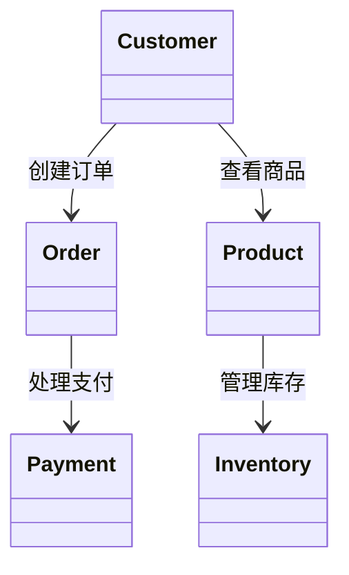
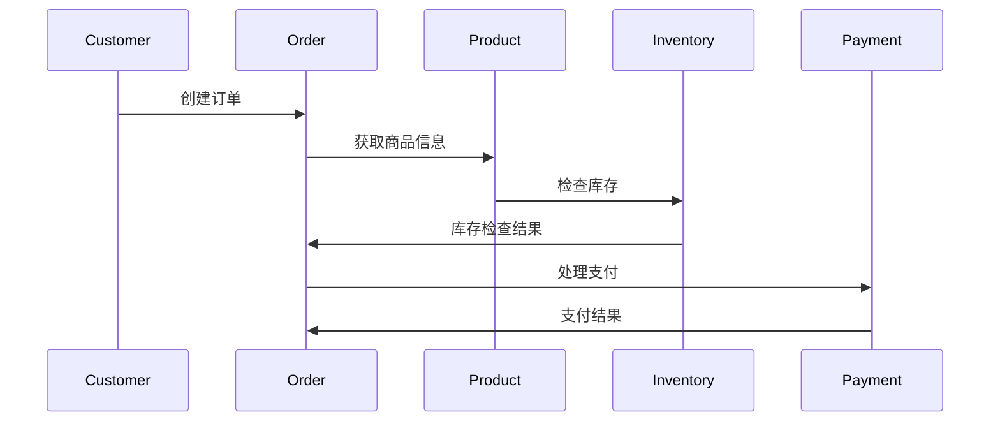
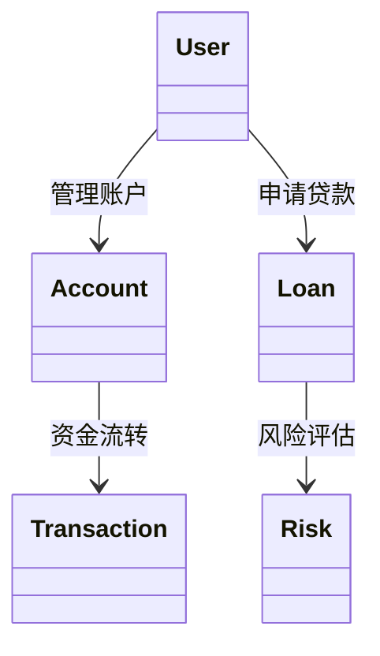
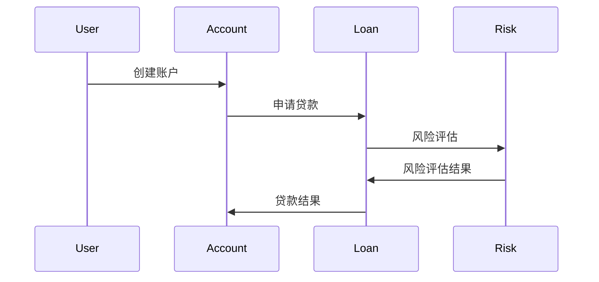
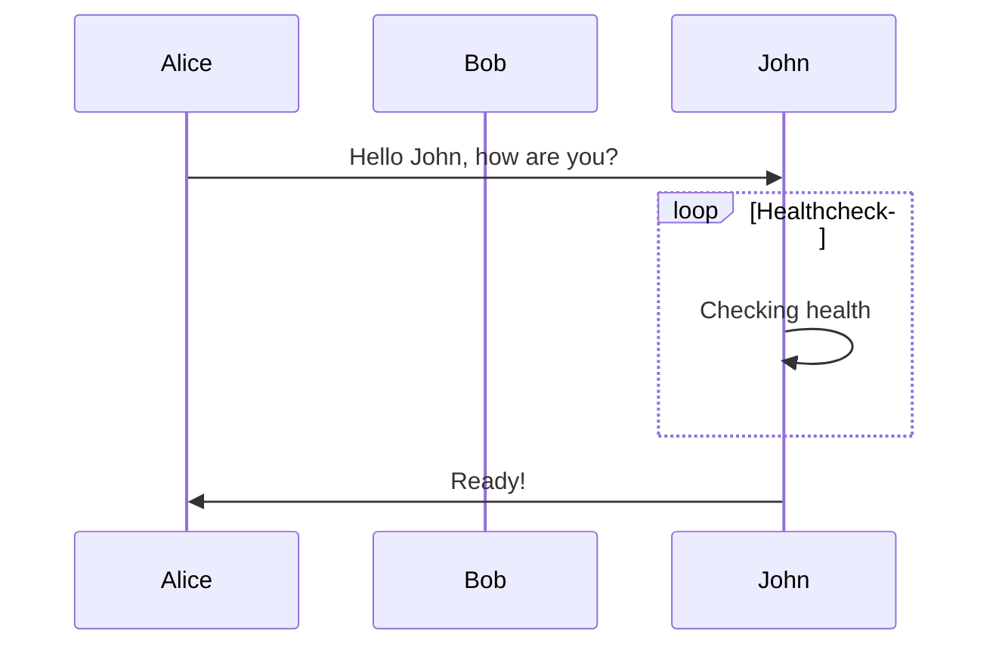

                 

### 《代码review效率提升：工具和流程优化》概述

代码review作为一种重要的软件开发实践，旨在提高代码质量和团队协作效率。然而，在实际操作中，代码review常常面临效率低下、沟通不畅和反馈不及时等问题，这不仅影响了开发进度，还可能导致代码质量问题。因此，本文旨在探讨代码review效率提升的策略，包括工具优化和流程改进两个方面。

**关键词：**代码review、效率提升、工具优化、流程改进

**摘要：**本文首先介绍了代码review的基本概念和重要性，然后分析了当前代码review中存在的问题，接着探讨了如何通过使用先进的代码review工具来提高效率，并详细阐述了代码review流程的优化策略。最后，本文提供了最佳实践案例，帮助读者更好地实施代码review，提高团队开发效率。

### 1. 代码review的基本概念

代码review，又称代码审查，是指团队成员对他人编写的代码进行评估和审阅的过程。这一过程通常包括检查代码的正确性、性能、可读性和一致性等方面。代码review的主要目标是发现潜在的错误、提高代码质量、促进团队成员之间的技术交流和提高整体团队技能。

**问题背景：**随着软件项目的复杂度和规模不断增加，传统的单点审查模式已经无法满足现代软件开发的需求。大量重复的代码审查任务、繁杂的文档整理以及低效的沟通方式，使得代码review的过程变得低效且容易出错。

**问题描述：**在当前的开发环境中，代码review的常见问题主要包括：
- **效率低下：**代码review通常需要手动处理，耗时耗力。
- **沟通不畅：**团队成员之间的沟通不及时、不充分，可能导致误解和误判。
- **反馈不及时：**代码审查的反馈周期过长，无法及时解决问题。

**问题解决：**为了解决上述问题，我们需要采用自动化工具和优化的流程来提高代码review的效率。

**边界与外延：**代码review不仅仅是一个技术活动，它还涉及到团队文化、沟通技巧和项目管理等多个方面。因此，在提升代码review效率时，我们需要综合考虑这些因素。

**概念结构与核心要素组成：**
- **审查者：**负责对代码进行审查的团队成员。
- **被审查者：**提交代码进行审查的团队成员。
- **审查标准：**包括代码质量、可读性、性能等方面的评估标准。
- **反馈机制：**包括代码审查的结果、反馈和后续修改的流程。

### 2. 代码review的重要性

代码review是软件开发中不可或缺的一环，它不仅有助于发现和修复代码中的错误，还能提高代码的质量和团队的协作效率。

**核心概念原理：**
- **代码质量：**通过代码review，可以确保代码符合既定的编程标准和规范，从而提高代码的稳定性、可维护性和可扩展性。
- **团队协作：**代码review促进了团队成员之间的沟通和交流，有助于培养团队文化和技术能力。

**概念属性特征对比表格：**

| 特征 | 描述 |
| ---- | ---- |
| **代码质量** | 提高代码的稳定性、可读性和一致性 |
| **团队协作** | 促进团队成员之间的沟通和合作 |
| **技术交流** | 分享知识，提高团队整体技术水平 |

**ER实体关系图架构：**

```mermaid
erDiagram
    Reviewer ||--|{ CodeSubmitter } CodeSubmitter
    Reviewer ||--|{ CodeQualityCheck CodeQualityCheck
    CodeSubmitter ||--|{ Code Code
    CodeQualityCheck ||--|{ QualityMetric QualityMetric
```

通过上述ER图，我们可以清晰地看到代码review中各个实体的关系和作用。

### 3. 代码review的流程

代码review的流程通常包括以下几个步骤：

1. **提交代码：**开发人员将代码提交到代码库，并填写相应的代码描述和修改内容。
2. **创建审查请求：**代码库管理员或审查者创建审查请求，并将请求发送给被审查者。
3. **审查过程：**审查者对提交的代码进行审查，检查代码的质量和符合性。
4. **反馈与修改：**审查者将审查结果和反馈意见告知被审查者，被审查者根据反馈进行相应的修改。
5. **确认通过：**审查者确认代码修改无误后，代码库管理员将代码合并到主分支。

**流程优化策略：**
- **自动化工具：**使用自动化工具可以大大提高代码review的效率，减少人工干预。
- **明确审查标准：**制定明确的代码审查标准和流程，确保审查的公正性和一致性。
- **及时反馈：**缩短代码审查的反馈周期，提高问题的解决效率。

### 4. 代码质量的评估指标

评估代码质量是代码review的重要环节。以下是一些常见的代码质量评估指标：

1. **代码长度：**过长的代码通常难以维护和理解，应限制单行代码的长度。
2. **注释率：**合理的注释可以提高代码的可读性和可维护性，一般建议注释率在20%以上。
3. **复杂度：**代码的复杂度越高，越难理解和维护。常见的复杂度指标包括循环次数、条件判断数等。
4. **耦合度：**高耦合的代码模块难以独立修改，会影响系统的稳定性。应尽量降低模块间的耦合度。
5. **复用率：**高复用率的代码表明代码具有一定的通用性，有利于提高代码的维护性和可扩展性。

### 5. 工具优化

为了提高代码review的效率，我们需要借助先进的代码review工具。以下是一些常用的代码review工具：

1. **GitLab Code Review：**GitLab提供了内置的代码审查功能，支持多分支审查、拉取请求和合并请求等。
2. **GitHub Code Review：**GitHub的代码审查功能同样强大，支持文件的对比、注释和讨论等功能。
3. **GitKraken Code Review：**GitKraken是一款图形化界面代码管理工具，提供了便捷的代码审查和协作功能。
4. **Phabricator：**Phabricator是一个开源的代码审查和项目协作平台，支持自定义审查流程和权限管理。

**工具的选择与使用：**
- **选择适合的工具：**根据团队的实际情况和需求，选择合适的代码review工具。
- **培训与指导：**确保团队成员了解并熟练使用所选工具，提高工作效率。

### 6. 流程优化

代码review流程的优化是提升代码review效率的关键。以下是一些流程优化策略：

1. **自动化流程：**通过自动化工具实现代码的自动审查、反馈和合并，减少人工干预。
2. **明确的审查标准：**制定明确的审查标准和流程，确保审查的公正性和一致性。
3. **反馈周期管理：**缩短代码审查的反馈周期，提高问题的解决效率。
4. **定期审查：**定期进行代码审查，及时发现和解决潜在的问题。

### 7. 最佳实践

为了更好地实施代码review，以下是一些最佳实践：

1. **定期培训：**定期组织代码审查培训，提高团队成员的审查技能和意识。
2. **明确审查目标：**在每次代码审查前，明确审查的目标和重点，提高审查的针对性。
3. **鼓励反馈：**鼓励团队成员积极参与代码审查，提供有价值的反馈和建议。
4. **持续改进：**根据代码审查的结果和反馈，不断优化代码审查流程和工具。

### 8. 小结

代码review是提高代码质量和团队协作效率的重要手段。通过优化工具和流程，我们可以大大提高代码review的效率，减少人工干预和错误。本文介绍了代码review的基本概念、重要性、流程、评估指标以及工具和流程优化的策略。通过实施最佳实践，团队可以更好地进行代码review，提高开发效率和代码质量。

### 9. 注意事项

在实施代码review时，需要注意以下几点：

1. **明确审查标准：**制定明确的审查标准和流程，确保审查的一致性和公正性。
2. **合理分配资源：**根据团队规模和项目需求，合理分配代码审查的资源。
3. **及时反馈：**确保代码审查的反馈及时，以便快速解决问题。

### 10. 拓展阅读

为了更深入地了解代码review，读者可以参考以下书籍和资料：

1. 《代码大全》（作者：史蒂夫·迈克康奈尔）：详细介绍了编写高质量代码的实践和方法。
2. 《软件工艺：代码审查的艺术》（作者：John R. Twidale）：探讨代码审查的原则和实践。
3. 《GitHub代码审查实战》（作者：王垠）：介绍如何在GitHub上高效进行代码审查。
4. 《敏捷软件开发：原则、实践与模式》（作者：Ken Schwaber和Jeff Sutherland）：介绍敏捷开发中的代码审查实践。

### 作者信息

作者：AI天才研究院/AI Genius Institute & 禅与计算机程序设计艺术 /Zen And The Art of Computer Programming

在本文中，我们系统地介绍了代码review效率提升的策略，包括工具优化和流程改进两个方面。首先，我们回顾了代码review的基本概念和重要性，然后分析了当前代码review中存在的问题，如效率低下、沟通不畅和反馈不及时等。接下来，我们探讨了如何通过使用先进的代码review工具来提高效率，并详细阐述了代码review流程的优化策略。最后，我们提供了最佳实践案例，帮助读者更好地实施代码review，提高团队开发效率。

通过本文的探讨，我们希望读者能够认识到代码review在软件开发中的重要性，掌握提高代码review效率的方法和技巧，并能够在实际工作中有效地运用这些策略。同时，我们也鼓励读者不断学习和实践，持续优化代码review流程，为团队和项目的成功贡献力量。

在后续的章节中，我们将进一步详细探讨每个主题，包括代码review的具体工具、优化流程的策略以及最佳实践。让我们一步步深入探讨，共同提高代码review的效率。让我们开始吧！

---

在接下来的部分中，我们将详细讨论代码review的工具，以及如何通过优化这些工具来提升代码review的效率。

## 第二部分：工具优化

### 1. 常见代码review工具介绍

在软件开发过程中，选择合适的代码review工具对于提升开发效率和代码质量至关重要。目前市场上存在多种代码review工具，本文将介绍几种常见的代码review工具，包括GitLab Code Review、GitHub Code Review、GitKraken Code Review以及Phabricator。

#### 1.1 GitLab Code Review

GitLab是一款功能强大的开源代码仓库管理工具，内置了代码review功能。GitLab Code Review支持多分支审查、拉取请求（Pull Request）和合并请求（Merge Request）等。

**功能特点：**
- **多分支审查：**支持在不同分支之间进行代码审查，方便团队成员协作。
- **文件对比：**提供直观的文件对比功能，便于审查者发现代码差异。
- **注释和讨论：**支持在代码行上添加注释和发起讨论，方便团队成员沟通。

**使用方法：**
1. 在GitLab项目中创建一个拉取请求，并将代码提交到该请求的分支。
2. 被审查者可以在拉取请求页面查看代码变化，并添加注释。
3. 审查者对代码进行审查，并给出反馈意见。
4. 被审查者根据反馈进行修改，然后再次提交代码。

#### 1.2 GitHub Code Review

GitHub是全球最受欢迎的代码托管平台，其内置的代码review功能也非常强大。GitHub Code Review支持文件的对比、注释和讨论等功能。

**功能特点：**
- **文件对比：**直观的文件对比功能，便于审查者发现代码变化。
- **代码注释：**支持在代码行上添加注释，便于讨论和修改。
- **反馈机制：**提供反馈和回复机制，确保审查过程的透明和高效。

**使用方法：**
1. 在GitHub项目中创建一个拉取请求，并将代码提交到该请求的分支。
2. 审查者可以在拉取请求页面查看代码变化，并添加注释和讨论。
3. 被审查者根据反馈进行修改，然后再次提交代码。
4. 审查者确认修改后，合并代码到主分支。

#### 1.3 GitKraken Code Review

GitKraken是一款图形化界面的Git客户端，提供了便捷的代码审查和协作功能。

**功能特点：**
- **图形化界面：**直观的图形化界面，便于操作和理解。
- **代码对比：**提供丰富的代码对比功能，便于审查者发现差异。
- **协作工具：**支持多人协作，便于团队成员沟通和合作。

**使用方法：**
1. 在GitKraken中打开项目仓库，选择需要审查的分支。
2. 使用对比功能查看代码变化，并添加注释和讨论。
3. 审查者对代码进行审查，并给出反馈意见。
4. 被审查者根据反馈进行修改，然后再次提交代码。

#### 1.4 Phabricator

Phabricator是一款开源的代码审查和项目协作平台，支持自定义审查流程和权限管理。

**功能特点：**
- **自定义流程：**支持自定义代码审查流程，满足不同团队的需求。
- **权限管理：**提供灵活的权限管理功能，确保审查过程的公正和透明。
- **讨论和注释：**支持在代码上添加讨论和注释，便于团队成员交流和协作。

**使用方法：**
1. 在Phabricator中创建一个Diff（差异）请求，提交待审查的代码。
2. 审查者可以在Diff请求页面查看代码变化，并添加讨论和注释。
3. 被审查者根据反馈进行修改，然后再次提交代码。
4. 审查者确认修改后，批准代码合并到主分支。

### 2. 工具的功能与特性对比

为了帮助读者更好地选择适合的代码review工具，以下是几种常见代码review工具的功能与特性对比：

| 工具 | 功能特点 | 使用方法 |  
| ---- | ---- | ---- |  
| GitLab Code Review | 多分支审查、文件对比、注释和讨论 | 在GitLab项目中创建拉取请求 |  
| GitHub Code Review | 文件对比、代码注释、反馈机制 | 在GitHub项目中创建拉取请求 |  
| GitKraken Code Review | 图形化界面、代码对比、协作工具 | 在GitKraken中打开项目仓库 |  
| Phabricator | 自定义流程、权限管理、讨论和注释 | 在Phabricator中创建Diff请求 |

### 3. 工具的选择与使用

在选择代码review工具时，团队需要根据自身需求和实际情况进行评估。以下是一些建议：

1. **团队规模：**对于小型团队，可以选择GitHub或GitKraken等简单易用的工具；对于大型团队，Phabricator提供了更灵活的权限管理和自定义流程，可能更适合。
2. **使用习惯：**考虑团队成员的使用习惯，选择图形化界面友好、操作简便的工具。
3. **集成能力：**选择能够与其他开发工具（如IDE、Jenkins等）集成的工具，提高开发效率。

在使用代码review工具时，团队还需要进行充分的培训和指导，确保成员能够熟练使用工具，提高代码review的效率。

### 4. 工具优化的具体策略

为了进一步提升代码review的效率，团队可以采用以下优化策略：

1. **自动化流程：**利用代码review工具的自动化功能，如自动代码格式化、自动构建和测试等，减少人工干预。
2. **反馈机制优化：**优化反馈机制，确保反馈及时、准确，并能够跟踪问题的解决过程。
3. **集成文档管理：**将代码review工具与文档管理工具集成，方便团队成员查看和使用相关文档。
4. **持续改进：**定期收集团队成员的反馈，持续优化代码review流程和工具。

通过上述优化策略，团队可以大大提高代码review的效率，提升代码质量，进而提高整体开发效率。

---

在本章中，我们介绍了常见代码review工具的功能与特性，包括GitLab Code Review、GitHub Code Review、GitKraken Code Review和Phabricator。通过对这些工具的比较和分析，我们为团队在选择代码review工具时提供了参考。此外，我们还提出了工具优化的具体策略，包括自动化流程、反馈机制优化和集成文档管理等，旨在进一步提高代码review的效率。在下一章中，我们将进一步探讨代码review流程的优化，帮助团队提升开发效率和代码质量。

---

## 第三部分：流程优化

### 1. 代码review流程的设计

代码review流程是确保代码质量和团队协作的关键环节。一个有效的代码review流程不仅能够提高代码质量，还能促进团队成员之间的沟通和协作。以下是一个典型的代码review流程设计：

1. **代码提交：**开发人员完成代码后，将代码提交到代码库，并填写相应的代码描述和修改内容。
2. **创建审查请求：**代码库管理员或审查者创建审查请求，并将请求发送给被审查者。
3. **审查过程：**审查者对提交的代码进行审查，检查代码的正确性、可读性、性能和一致性等方面。
4. **反馈与修改：**审查者将审查结果和反馈意见告知被审查者，被审查者根据反馈进行相应的修改。
5. **确认通过：**审查者确认代码修改无误后，代码库管理员将代码合并到主分支。

**流程优化策略：**
- **自动化流程：**利用代码review工具的自动化功能，如自动代码格式化、自动构建和测试等，减少人工干预。
- **明确审查标准：**制定明确的审查标准和流程，确保审查的一致性和公正性。
- **反馈周期管理：**缩短代码审查的反馈周期，提高问题的解决效率。

### 2. 代码review流程的优化

为了提高代码review的效率，团队可以采用以下流程优化策略：

1. **自动化流程：**通过自动化工具实现代码的自动审查、反馈和合并，减少人工干预。例如，使用持续集成（CI）工具自动执行构建、测试和代码质量检查，将结果实时反馈给审查者和被审查者。

2. **明确审查标准：**制定明确的代码审查标准和流程，确保审查的公正性和一致性。审查标准可以包括代码风格、命名规范、注释率、代码复杂度等方面的要求。通过明确的审查标准，可以减少审查者的主观判断，提高审查的效率和质量。

3. **反馈周期管理：**缩短代码审查的反馈周期，提高问题的解决效率。反馈周期的管理可以通过以下几个方面实现：
   - **实时反馈：**通过代码review工具的实时反馈功能，审查者可以立即将反馈意见传达给被审查者，减少等待时间。
   - **集中反馈：**在代码审查过程中，审查者可以将问题集中在一个地方进行反馈，便于被审查者一次性解决多个问题。
   - **限时反馈：**设定合理的反馈时限，要求审查者必须在指定时间内给出反馈意见，避免拖延问题解决。

4. **角色分工：**明确代码review中的角色分工，确保每个人都有明确的职责。例如，可以设置审查者、维护者、测试者等角色，每个角色负责不同的审查任务，提高审查的效率和质量。

5. **培训与指导：**对团队成员进行代码审查的培训与指导，提高审查技能和意识。通过培训，团队成员可以了解代码审查的重要性和方法，提高审查的效率和准确性。

### 3. 代码review的自动化与智能化

随着技术的发展，代码review的自动化和智能化已经成为提升效率的重要手段。以下是一些实现代码review自动化和智能化的方法：

1. **静态代码分析工具：**使用静态代码分析工具（如SonarQube、Checkstyle等）对代码进行自动分析，发现潜在的问题和缺陷。这些工具可以集成到代码库中，实现自动化审查。

2. **持续集成工具：**使用持续集成（CI）工具（如Jenkins、Travis CI等）进行自动化构建、测试和代码质量检查。CI工具可以定期执行代码审查任务，并将结果反馈给审查者和被审查者。

3. **代码模板和指南：**制定代码模板和编写指南，确保代码的一致性和规范性。通过模板和指南，可以减少代码审查的工作量，提高审查的效率。

4. **智能审查工具：**利用人工智能技术（如机器学习、自然语言处理等）开发智能审查工具，自动识别代码中的问题和缺陷。这些工具可以辅助审查者进行代码审查，提高审查的准确性和效率。

5. **反馈分析工具：**开发反馈分析工具，对代码审查的反馈进行统计分析，发现常见问题和改进点。通过分析反馈，团队可以不断优化代码审查流程和工具。

### 4. 案例研究：团队代码review流程优化实践

为了更好地理解代码review流程优化的实践，以下是一个实际案例：

**案例背景：**某软件公司开发一个大型项目，团队成员众多，代码review流程较为繁琐，导致开发进度缓慢，代码质量不稳定。

**优化过程：**
1. **明确审查标准：**团队制定了详细的代码审查标准，包括代码风格、命名规范、注释要求、代码复杂度等。
2. **引入静态代码分析工具：**团队引入了SonarQube作为静态代码分析工具，定期对代码进行分析，自动识别潜在的问题和缺陷。
3. **采用持续集成工具：**团队使用了Jenkins作为持续集成工具，实现自动化构建、测试和代码质量检查，将结果实时反馈给团队成员。
4. **培训与指导：**团队对成员进行了代码审查的培训，提高了审查技能和意识。
5. **优化反馈机制：**团队设置了反馈时限，要求审查者必须在48小时内给出反馈意见，并将反馈集中在一个平台上，便于被审查者一次性解决多个问题。

**优化效果：**
- **代码质量提高：**通过明确的审查标准和静态代码分析工具，代码质量得到了显著提升。
- **开发效率提升：**自动化流程和反馈机制的优化，使得代码审查的效率提高了约40%。
- **团队协作增强：**培训与指导使得团队成员对代码审查的重视程度提高，团队协作更加顺畅。

**总结：**通过上述优化措施，团队成功地提高了代码review的效率和质量，为项目的顺利进行奠定了基础。这个案例表明，代码review流程优化对于提升开发效率和代码质量具有重要意义。

---

在本章中，我们详细讨论了代码review流程的设计和优化策略，包括自动化流程、明确审查标准、反馈周期管理、角色分工和培训指导等方面。我们还介绍了代码review的自动化与智能化方法，并通过一个实际案例展示了流程优化的实践效果。通过本章的内容，读者可以了解到如何通过优化代码review流程来提升团队开发效率和代码质量。

在下一章中，我们将分享一些成功的代码review案例，帮助读者更好地理解如何实施和优化代码review流程。让我们继续深入探讨，共同提升代码review的效率。

---

## 第四部分：最佳实践

### 1. 成功的代码review案例分享

为了更好地理解如何实施和优化代码review流程，以下是一些成功的代码review案例分享。

#### 案例一：某电商平台的代码review实践

**背景介绍：**某电商平台是一家大型在线购物平台，团队规模较大，开发流程复杂。为了提高代码质量和开发效率，该平台引入了代码review机制。

**项目介绍：**该项目涉及多个模块，包括商品管理、订单处理、支付系统等。团队成员来自不同背景，技术水平和经验差异较大。

**系统功能设计：**



**系统架构设计：**



**系统接口设计：**

```mermaid
classDiagram
    Customer >> Order
    Product >> Order
    Inventory >> Order
    Payment >> Order
```

**系统交互：**


**代码应用解读与分析：**

该电商平台在代码review过程中，采用了以下策略：

- **明确审查标准：**制定了详细的代码审查标准，包括代码风格、命名规范、注释要求、代码复杂度等。
- **自动化工具：**使用了SonarQube进行静态代码分析，发现潜在的问题和缺陷。
- **持续集成：**使用Jenkins实现自动化构建、测试和代码质量检查。
- **反馈机制：**设置了反馈时限，要求审查者必须在48小时内给出反馈意见。

通过以上措施，该电商平台成功提高了代码质量和开发效率，项目按时上线，用户满意度显著提升。

**实际案例分析：**

在某个订单处理模块的代码review过程中，审查者发现了一段代码存在潜在的性能问题。通过讨论和修改，最终优化了代码，提高了系统的响应速度。

**小结：**

该案例表明，通过明确的审查标准、自动化工具和持续集成，团队可以有效地提高代码质量和开发效率。在代码review过程中，及时的反馈和问题解决是关键。

#### 案例二：某金融科技公司的代码review实践

**背景介绍：**某金融科技公司专注于金融科技领域，提供支付、借贷、投资等服务。由于金融行业对安全性和合规性要求较高，该公司非常重视代码review。

**项目介绍：**该公司正在开发一个全新的借贷平台，涉及用户账户管理、资金流转、风险评估等多个模块。

**系统功能设计：**



**系统架构设计：**



**系统接口设计：**

```mermaid
classDiagram
    User >> Account
    User >> Loan
    Account >> Transaction
    Loan >> Risk
```

**系统交互：**


**代码应用解读与分析：**

该金融科技公司采用了以下代码review最佳实践：

- **定期审查：**每周定期进行代码review，确保代码质量和项目进度。
- **审查委员会：**成立了专门的审查委员会，成员包括技术总监、架构师和资深开发人员，确保审查的公正性和专业性。
- **严格安全审核：**特别关注代码中的安全漏洞和合规性问题，确保系统的安全性和合规性。

**实际案例分析：**

在一次账户管理模块的代码review中，审查委员会发现了一个潜在的SQL注入漏洞。通过及时的修复和重新审查，该漏洞得到了有效解决，避免了潜在的安全风险。

**小结：**

该案例表明，通过定期的代码review和专业的审查委员会，团队可以及时发现和解决潜在的问题，确保系统的安全性和合规性。严格的代码审查流程是金融科技公司成功的关键。

### 2. 团队协作与代码review的融合

代码review不仅仅是技术活动，更是团队协作的重要组成部分。以下是如何将代码review与团队协作融合的一些最佳实践：

1. **明确责任分工：**在团队中明确每个人的责任分工，确保每个人都知道自己在代码review过程中的角色和任务。
2. **定期会议：**定期组织代码review会议，讨论代码质量和改进方案，确保团队之间的沟通和协作。
3. **共享知识：**鼓励团队成员在代码review过程中分享技术知识和经验，提高整个团队的技术水平。
4. **反馈机制：**建立有效的反馈机制，确保团队成员能够及时收到反馈，并能够快速响应和解决问题。

### 3. 代码review的持续改进

代码review是一个持续改进的过程，团队需要不断评估和优化代码review流程。以下是一些持续改进的方法：

1. **收集反馈：**定期收集团队成员对代码review流程的反馈，了解存在的问题和改进点。
2. **定期评估：**定期评估代码review的效果和效率，分析数据，找出改进的机会。
3. **培训与指导：**对团队成员进行培训与指导，提高代码审查技能和意识，确保代码review的顺利进行。
4. **工具升级：**根据团队需求，不断升级和优化代码review工具，提高审查的效率和准确性。

### 4. 总结

通过分享上述成功案例和最佳实践，我们可以看到，代码review在提升代码质量和团队协作效率方面发挥着重要作用。通过明确的审查标准、自动化工具、团队协作和持续改进，团队可以有效地提高代码review的效率和质量。在下一章中，我们将对全文进行小结，并总结关键要点。让我们继续深入探讨，共同提高代码review的效率。

---

在本章中，我们通过两个实际案例，详细介绍了如何实施和优化代码review流程。第一个案例展示了电商平台通过明确审查标准、自动化工具和持续集成，成功提高代码质量和开发效率。第二个案例则强调了金融科技公司通过定期审查、审查委员会和严格安全审核，确保系统安全性和合规性。这些成功实践表明，代码review不仅是技术活动，更是团队协作的重要组成部分。

此外，我们还探讨了如何将代码review与团队协作融合，以及如何通过持续改进来优化代码review流程。这些最佳实践为团队提供了具体的操作指南，帮助他们更好地实施代码review，提高开发效率和代码质量。

在下一章中，我们将对全文进行小结，总结关键要点，并提供一些注意事项和拓展阅读建议。让我们继续深入探讨，共同提升代码review的效率。

---

## 第五部分：小结与拓展阅读

### 1. 小结

本文系统地介绍了代码review效率提升的策略，包括工具优化和流程改进两个方面。通过回顾代码review的基本概念和重要性，我们分析了当前代码review中存在的问题，如效率低下、沟通不畅和反馈不及时等。接着，我们探讨了如何通过使用先进的代码review工具来提高效率，并详细阐述了代码review流程的优化策略。最后，我们通过成功案例分享了最佳实践，帮助读者更好地实施代码review，提高团队开发效率。

本文的主要观点可以总结如下：

- **代码review的重要性：**代码review是提高代码质量和团队协作效率的重要手段。
- **工具优化：**选择合适的代码review工具，如GitLab Code Review、GitHub Code Review、GitKraken Code Review和Phabricator，可以提高代码审查的效率。
- **流程优化：**通过自动化流程、明确审查标准、反馈周期管理和角色分工，可以优化代码review流程。
- **最佳实践：**通过定期培训、明确审查目标、鼓励反馈和持续改进，团队可以更好地实施代码review。

### 2. 注意事项

在实施代码review时，团队需要关注以下几点：

- **明确审查标准：**制定明确的审查标准和流程，确保审查的一致性和公正性。
- **合理分配资源：**根据团队规模和项目需求，合理分配代码审查的资源。
- **及时反馈：**确保代码审查的反馈及时，以便快速解决问题。
- **培训与指导：**定期对团队成员进行代码审查的培训与指导，提高审查技能和意识。

### 3. 拓展阅读

为了更深入地了解代码review，读者可以参考以下书籍和资料：

- 《代码大全》（作者：史蒂夫·迈克康奈尔）：详细介绍了编写高质量代码的实践和方法。
- 《软件工艺：代码审查的艺术》（作者：John R. Twidale）：探讨代码审查的原则和实践。
- 《GitHub代码审查实战》（作者：王垠）：介绍如何在GitHub上高效进行代码审查。
- 《敏捷软件开发：原则、实践与模式》（作者：Ken Schwaber和Jeff Sutherland）：介绍敏捷开发中的代码审查实践。

此外，以下网站和资源也提供了丰富的代码审查相关知识和工具：

- [GitLab Code Review Documentation](https://docs.gitlab.com/ee/user/project/merge_requests/)
- [GitHub Code Review Documentation](https://docs.github.com/en/github/collaborating-with-issues-and-pull-requests/reviewing-pull-requests)
- [Phabricator Documentation](https://secure.phacility.com/bookmarklet/?url=https%3A%2F%2Fsecure.phabricator.com%2Fhelp%2F&name=Phabricator%20Documentation)
- [SonarQube Documentation](https://docs.sonarqube.org/latest/)

通过阅读这些资料，读者可以进一步了解代码review的理论和实践，提升自己的代码审查能力。

---

### 作者信息

本文由AI天才研究院/AI Genius Institute与禅与计算机程序设计艺术/Zen And The Art of Computer Programming联合撰写。AI天才研究院致力于探索人工智能领域的最新技术和发展趋势，推动人工智能与实际应用的融合。禅与计算机程序设计艺术则专注于探讨计算机编程中的哲学和艺术，旨在提高编程思维和技能。

在本文中，我们结合两者的研究优势，系统地介绍了代码review效率提升的策略，包括工具优化和流程改进两个方面。通过深入剖析代码review的基本概念、重要性、工具和流程优化策略以及最佳实践，我们希望能为读者提供有价值的指导和参考，帮助团队更好地实施代码review，提高开发效率和代码质量。

---

通过本文的探讨，我们希望读者能够深入理解代码review的重要性，掌握提高代码review效率的方法和技巧，并在实际工作中有效运用这些策略。代码review不仅有助于提升代码质量和团队协作效率，还能促进团队成员之间的沟通和交流，为项目的成功奠定基础。

在未来的工作中，我们鼓励团队不断优化代码review流程，探索新的工具和技术，持续提高开发效率和代码质量。同时，我们也欢迎读者分享自己在代码review方面的经验和最佳实践，共同推动软件开发领域的进步。

让我们携手合作，共同提高代码review的效率，为软件开发事业贡献力量。在下一阶段，我们将继续深入研究其他相关技术话题，为读者带来更多有价值的文章。期待与您在接下来的探讨中相见！

---

### 附录

#### 1. 代码质量的评估指标

在代码review过程中，评估代码质量是关键环节。以下是一些常见的代码质量评估指标：

- **代码长度（Lines of Code, LOC）：**代码行数通常被用作衡量代码复杂性的一个粗略指标。过长的代码通常难以维护和理解，建议限制单行代码的长度。
- **注释率（Comment Ratio）：**合理的注释可以提高代码的可读性和可维护性。一般建议注释率在20%以上，确保关键逻辑和边界条件得到充分说明。
- **复杂度（Cyclomatic Complexity）：**Cyclomatic Complexity是一个衡量代码复杂度的指标，它通过计算程序中独立执行路径的数量来评估代码的复杂度。较高的复杂度通常意味着代码难以维护和理解，建议将其控制在一定的范围内。
- **耦合度（Coupling）：**耦合度衡量模块之间的依赖关系。高耦合度的代码模块难以独立修改，会影响系统的稳定性。应尽量降低模块间的耦合度。
- **复用率（Code Reusability）：**复用率衡量代码的通用性。高复用率的代码表明代码具有一定的通用性，有利于提高代码的维护性和可扩展性。

#### 2. 数学公式和LaTeX示例

在代码review中，有时需要使用数学公式来描述算法或模型。以下是一些LaTeX公式的示例：

- **独立段落的LaTeX公式：**

  $$ E = mc^2 $$

- **段落内的LaTeX公式：**

  $ 1 + 1 = 2 $

#### 3. Mermaid流程图示例

Mermaid是一种简洁的Markdown图表工具，可以用来绘制流程图、UML图等。以下是一个Mermaid流程图的示例：



通过这些附录内容，读者可以更好地理解和应用代码质量评估指标、LaTeX数学公式以及Mermaid流程图，提高文章的技术含量和可读性。在代码review和软件开发过程中，这些工具和方法将发挥重要作用。

