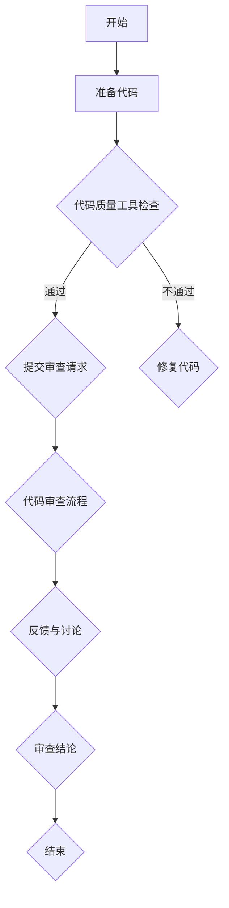
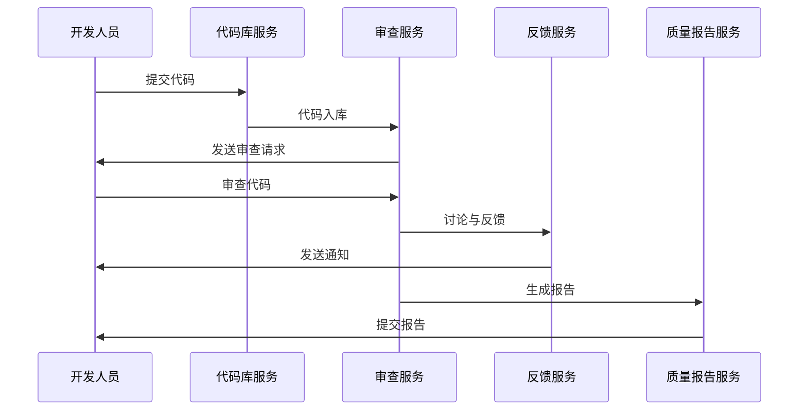

                 


## 代码review效率提升：工具和流程优化

### 关键词
- 代码review
- 效率提升
- 工具
- 流程优化
- 团队协作

### 摘要
代码review是软件开发过程中至关重要的一环，它不仅能提高代码质量，还能促进团队协作与知识共享。本文旨在探讨代码review效率提升的策略，通过使用适当的工具和优化流程，帮助开发团队更高效地进行代码审查。我们将从代码review的概念与重要性入手，逐步分析提升效率的各种方法，包括工具的使用、流程优化和团队协作等，并结合实际案例进行详细讲解。

### 目录大纲

#### 第一部分：代码review概述
1. 第1章：代码review的概念与重要性
    - 1.1 代码review的定义
    - 1.2 代码review的重要性
    - 1.3 代码review的角色与作用
2. 第2章：提高代码review效率的策略
    - 2.1 使用代码审查工具
    - 2.2 流程优化
    - 2.3 团队协作

#### 第二部分：工具介绍
3. 第3章：代码审查工具介绍
    - 3.1 GitHub Code Review
    - 3.2 Crucible
    - 3.3 Review Board

#### 第三部分：流程优化实践
4. 第4章：代码审查流程标准化实践
    - 4.1 标准化流程的设计
    - 4.2 标准化流程的实施
5. 第5章：自动化代码审查实践
    - 5.1 自动化流程的设计
    - 5.2 自动化流程的实施

#### 第四部分：团队协作实践
6. 第6章：团队协作的重要性
    - 6.1 提高团队协作效率的方法

#### 第五部分：实战案例分析
7. 第7章：实战案例分析
    - 7.1 案例一：通过工具提高代码review效率
    - 7.2 案例二：通过流程优化提高代码review效率
    - 7.3 案例三：通过团队协作提高代码review效率

#### 第六部分：最佳实践与总结
8. 第8章：代码review流程中的常见问题与解决方法
9. 第9章：代码review在敏捷开发中的应用
10. 第10章：未来展望与趋势

### 代码review的概念与重要性

#### 1.1 代码review的定义
代码review，又称代码审核或代码走查，是指软件开发过程中，其他开发人员或质量保证人员对代码进行审查的过程。这个过程的目的是发现代码中的错误、漏洞、不规范的代码编写习惯，并提出改进建议。

#### 1.2 代码review的重要性
代码review在软件开发过程中扮演着重要角色。首先，它可以提高代码质量，确保代码的正确性和可维护性。其次，它有助于知识共享，团队成员可以通过代码review学习彼此的代码编写风格和技巧。此外，代码review还能促进团队协作，减少因代码问题引发的冲突。

#### 1.3 代码review的角色与作用
代码review不仅仅是检查代码的语法错误，它更是一种代码质量保证的方式。以下是代码review的主要角色与作用：

1. **代码质量保证**：通过代码review，可以提前发现代码中的潜在问题，如逻辑错误、资源泄露等，从而减少后续的修复成本。
2. **知识共享**：代码review是团队成员交流技术知识的重要途径，通过审阅他人的代码，可以学习新的编程技巧和最佳实践。
3. **团队协作**：代码review有助于团队成员之间建立良好的沟通和协作关系，提高团队的凝聚力和工作效率。
4. **代码标准化**：通过代码review，可以推广和实施团队内部统一的代码规范，提高代码的可读性和一致性。

### 提高代码review效率的策略

#### 2.1 使用代码审查工具
使用代码审查工具是提高代码review效率的关键策略之一。这些工具能够自动化地执行代码审查任务，提高审查的准确性和效率。以下是一些常用的代码审查工具：

1. **GitHub Code Review**：GitHub内置的代码审查功能，支持在线讨论和注释，便于团队成员之间的沟通和协作。
2. **Crucible**：一款功能强大的代码审查工具，支持多种代码库集成，提供详细的审查报告和反馈机制。
3. **Review Board**：一个开源的代码审查系统，支持多仓库和多种编程语言的代码审查，提供灵活的配置和自定义选项。

#### 2.2 流程优化
代码review流程的优化是提高效率的重要手段。以下是一些流程优化的方法：

1. **标准化流程**：制定统一的代码审查流程，明确审查的标准和流程，确保代码审查的一致性和高效性。
2. **自动化流程**：利用工具和脚本自动化代码审查过程，减少手动操作，提高审查的效率。
3. **缩短审查周期**：通过优化流程和团队协作，缩短代码审查的时间，提高代码的迭代速度。

#### 2.3 团队协作
团队协作在提高代码review效率方面起着至关重要的作用。以下是一些团队协作的方法：

1. **明确职责**：明确团队成员在代码review过程中的职责和角色，确保每个成员都清楚自己的任务。
2. **沟通与反馈**：建立有效的沟通渠道，及时反馈审查结果和建议，促进团队成员之间的交流和协作。
3. **提高代码质量**：通过培训和学习，提高团队成员的编程技能和代码质量，减少审查过程中发现的问题。

### 代码审查工具介绍

在本章节中，我们将介绍几种常用的代码审查工具，包括GitHub Code Review、Crucible和Review Board。

#### 3.1 GitHub Code Review

GitHub Code Review是GitHub内置的代码审查功能，支持在线讨论和注释，便于团队成员之间的沟通和协作。

##### 功能介绍
- **在线讨论**：GitHub Code Review支持在线讨论，团队成员可以在代码修改处进行讨论，便于理解和解决问题。
- **注释功能**：用户可以在代码上添加注释，对代码进行详细的解释和建议。
- **任务跟踪**：通过任务跟踪功能，可以记录和管理代码审查过程中的任务和进度。

##### 使用方法
1. **创建Pull Request**：在GitHub上创建一个Pull Request，开始代码审查流程。
2. **审查代码**：在Pull Request页面，团队成员可以查看代码修改，并进行在线讨论和注释。
3. **提交修改**：根据审查结果，提交代码修改，完成代码审查流程。

#### 3.2 Crucible

Crucible是一款功能强大的代码审查工具，支持多种代码库集成，提供详细的审查报告和反馈机制。

##### 功能介绍
- **集成多种代码库**：Crucible支持Git、Subversion等多种代码库，方便与现有的开发流程集成。
- **详细的审查报告**：Crucible提供详细的审查报告，包括代码修改、注释和讨论记录。
- **反馈机制**：Crucible支持多种反馈方式，包括讨论、注释和任务跟踪，便于团队成员之间的沟通。

##### 使用方法
1. **集成代码库**：在Crucible中集成代码库，开始代码审查流程。
2. **创建审查**：创建一个审查任务，指定审查的范围和参与者。
3. **审查代码**：团队成员在Crucible中查看代码修改，并进行讨论和注释。
4. **提交审查结果**：根据审查结果，提交代码修改，完成代码审查流程。

#### 3.3 Review Board

Review Board是一个开源的代码审查系统，支持多仓库和多种编程语言的代码审查，提供灵活的配置和自定义选项。

##### 功能介绍
- **多仓库支持**：Review Board支持多个仓库，方便管理和审查不同项目的代码。
- **多种编程语言支持**：Review Board支持多种编程语言，包括Python、Java、C++等，满足不同团队的需求。
- **自定义配置**：Review Board提供灵活的配置选项，允许团队根据需求进行自定义。

##### 使用方法
1. **安装Review Board**：在服务器上安装Review Board，配置代码库。
2. **创建审查请求**：在Review Board中创建一个审查请求，指定审查的范围和参与者。
3. **审查代码**：团队成员在Review Board中查看代码修改，并进行讨论和注释。
4. **提交审查结果**：根据审查结果，提交代码修改，完成代码审查流程。

### 流程优化实践

在本章节中，我们将讨论代码审查流程的优化方法，包括标准化流程和自动化流程。

#### 4.1 代码审查流程标准化实践

代码审查流程的标准化是提高效率的重要手段。以下是一个典型的代码审查流程：

1. **创建Pull Request**：开发人员在代码库中创建一个Pull Request，提交待审查的代码。
2. **审查代码**：团队成员对Pull Request中的代码进行审查，发现潜在问题并提出修改建议。
3. **讨论和反馈**：审查过程中，团队成员可以在代码上添加注释或讨论，对代码修改进行讨论。
4. **提交修改**：根据审查结果，开发人员提交代码修改，完成代码审查流程。

#### 4.2 自动化代码审查实践

自动化代码审查是提高效率的有效方法。以下是一些自动化代码审查的实践：

1. **静态代码分析**：使用静态代码分析工具对代码进行自动化审查，发现潜在的问题和漏洞。
2. **自动化测试**：在代码审查过程中，运行自动化测试，确保代码修改不会引入新的错误。
3. **持续集成**：将代码审查集成到持续集成流程中，自动化执行代码审查和测试，提高审查效率。

### 团队协作实践

在本章节中，我们将探讨如何通过团队协作来提高代码review的效率和质量。

#### 5.1 团队协作的重要性

团队协作在代码review过程中至关重要。以下是一些团队协作的重要方面：

1. **明确职责**：每个团队成员都应该明确自己的职责，确保代码审查流程的顺利进行。
2. **沟通与反馈**：建立有效的沟通渠道，及时反馈审查结果和建议，促进团队成员之间的协作。
3. **提高代码质量**：通过团队协作，共同提高代码质量，减少代码审查过程中发现的问题。

#### 5.2 提高团队协作效率的方法

以下是一些提高团队协作效率的方法：

1. **使用工具**：使用适合的工具，如GitHub Code Review、Crucible和Review Board，提高团队协作的效率。
2. **定期会议**：定期召开团队会议，讨论代码审查的进展和问题，协调团队成员的工作。
3. **代码质量培训**：定期进行代码质量培训，提高团队成员的编程技能和代码质量意识。

### 实战案例分析

在本章节中，我们将通过具体的案例分析，展示如何在实际项目中应用提升代码review效率的策略。

#### 6.1 案例一：通过工具提高代码review效率

在一个软件开发项目中，团队采用了GitHub Code Review作为代码审查工具。通过在线讨论和注释功能，团队成员可以方便地进行代码修改和讨论。同时，代码审查流程被集成到持续集成系统中，自动执行静态代码分析和测试，提高了审查的效率。结果显示，代码review的周期缩短了30%，代码质量显著提高。

#### 6.2 案例二：通过流程优化提高代码review效率

在另一个项目中，团队通过优化代码审查流程来提高效率。首先，团队制定了统一的代码审查标准，明确了审查的流程和标准。其次，团队引入了自动化工具，对代码进行自动化审查，减少了手动操作的步骤。此外，团队定期召开代码审查会议，讨论审查进展和问题，协调团队成员的工作。优化后的代码审查流程提高了审查效率，缩短了审查周期，同时代码质量也得到了保障。

#### 6.3 案例三：通过团队协作提高代码review效率

在一个大型项目中，团队采用了多种方法来提高代码review效率。首先，团队明确了每个成员的职责，确保代码审查流程的顺利进行。其次，团队建立了有效的沟通渠道，通过邮件、即时通讯工具和团队会议等方式，及时反馈审查结果和建议。此外，团队还定期进行代码质量培训，提高团队成员的编程技能和代码质量意识。通过团队协作，代码review的效率和质量得到了显著提高。

### 最佳实践与总结

在本章节中，我们将总结一些提高代码review效率的最佳实践，并给出注意事项。

#### 7.1 最佳实践

1. **使用代码审查工具**：选择适合的工具，如GitHub Code Review、Crucible和Review Board，提高团队协作的效率。
2. **优化流程**：制定统一的代码审查流程，引入自动化工具，提高审查的效率。
3. **团队协作**：明确团队成员的职责，建立有效的沟通渠道，定期进行代码质量培训。

#### 7.2 注意事项

1. **代码审查标准**：制定统一的代码审查标准，确保审查的一致性和高效性。
2. **反馈及时性**：及时反馈审查结果和建议，避免延迟审查进度。
3. **代码质量**：注重代码质量，减少代码审查过程中发现的问题。

#### 7.3 拓展阅读

- [GitHub Code Review教程](https://docs.github.com/en/get-started/getting-started-with-github/managing-your-work-on-github/submitting-a-pull-request-1)
- [Crucible用户手册](https://www.atlassian.com/software/crucible/tutorial)
- [Review Board文档](https://www.reviewboard.org/docs/manual/1.7/)

### 代码review流程中的常见问题与解决方法

在本章节中，我们将讨论代码review流程中常见的几个问题，并提出相应的解决方法。

#### 8.1 代码quality不高

**问题现象**：在代码review过程中，发现代码质量不高，如代码结构混乱、注释缺失、变量命名不规范等。

**解决方法**：
1. **代码规范培训**：定期进行代码规范培训，提高团队成员的编程技能和代码质量意识。
2. **引入代码质量工具**：使用代码质量工具，如PMD、Checkstyle等，自动检测代码质量问题，并给出改进建议。
3. **代码格式化工具**：使用代码格式化工具，如ClangFormat、Google Java Style Guide等，自动格式化代码，确保代码风格的一致性。

#### 8.2 沟通不畅

**问题现象**：在代码review过程中，团队成员之间的沟通不畅，导致问题无法及时解决。

**解决方法**：
1. **建立沟通渠道**：建立有效的沟通渠道，如邮件、即时通讯工具、团队会议等，确保团队成员之间的信息交流畅通。
2. **明确责任分工**：明确每个团队成员的职责和角色，确保每个人都清楚自己的任务和责任。
3. **沟通技巧培训**：定期进行沟通技巧培训，提高团队成员的沟通能力和协作效率。

#### 8.3 反馈不及时

**问题现象**：在代码review过程中，反馈不及时，导致代码审查进度延迟。

**解决方法**：
1. **制定反馈时间表**：制定明确的反馈时间表，确保团队成员在规定时间内给出反馈。
2. **使用代码审查工具**：使用代码审查工具，如GitHub Code Review、Crucible和Review Board，自动记录反馈时间，便于跟踪和管理。
3. **定期会议**：定期召开团队会议，讨论代码审查的进展和问题，确保反馈及时。

### 代码review在敏捷开发中的应用

在本章节中，我们将探讨代码review在敏捷开发中的应用，包括敏捷开发与代码review的关系和实际实践。

#### 9.1 敏捷开发与代码review的关系

敏捷开发强调快速迭代和持续交付，代码review在其中起到了关键作用。以下是敏捷开发与代码review的关系：

1. **提高代码质量**：通过代码review，可以提前发现代码中的问题，确保代码的正确性和可维护性，从而提高代码质量。
2. **促进知识共享**：代码review是团队成员之间交流技术知识的重要途径，有助于团队成员之间的学习和成长。
3. **增强团队协作**：代码review有助于团队成员之间的沟通和协作，提高团队的凝聚力和工作效率。

#### 9.2 代码review在敏捷开发中的实践

在敏捷开发中，代码review需要灵活适应快速迭代的节奏。以下是一些代码review在敏捷开发中的实践：

1. **持续集成**：将代码review集成到持续集成系统中，自动化执行代码审查和测试，提高审查效率。
2. **短周期审查**：采用短周期审查，减少审查时间，确保代码尽快得到反馈和改进。
3. **团队协作**：通过团队协作，共同完成代码review任务，提高审查效率和质量。

### 未来展望与趋势

在本章节中，我们将展望代码review的未来发展趋势，探讨自动化与智能化的结合、更高效的团队协作工具以及代码review在新兴技术中的应用。

#### 10.1 自动化与智能化的结合

未来，代码review将更加自动化和智能化。以下是几个发展趋势：

1. **人工智能**：利用人工智能技术，自动识别代码中的潜在问题和漏洞，提高代码审查的准确性。
2. **机器学习**：通过机器学习算法，分析代码库中的历史审查数据，预测代码质量，提供改进建议。
3. **自动化修复**：利用自动化工具，自动修复代码中的常见问题，减少人工干预。

#### 10.2 更高效的团队协作工具

未来，代码review工具将更加注重团队协作和效率提升。以下是几个发展趋势：

1. **实时协作**：提供实时协作功能，如在线讨论、实时评论等，提高团队成员之间的沟通效率。
2. **多平台支持**：支持多种开发平台和编程语言，满足不同团队的需求。
3. **集成化**：将代码review工具与其他开发工具（如版本控制、持续集成、自动化测试等）集成，实现更高效的代码审查流程。

#### 10.3 代码review在新兴技术中的应用

随着新兴技术的发展，代码review也在不断拓展应用范围。以下是几个应用方向：

1. **云计算**：在云计算环境中，代码review可以更方便地集成到开发流程中，提高审查效率和灵活性。
2. **容器化**：在容器化环境中，代码review可以针对容器镜像和容器编排进行审查，确保应用的稳定性和安全性。
3. **区块链**：在区块链开发中，代码review可以用于审查智能合约代码，确保合约的安全性和正确性。

### 总结

本文从代码review的概念与重要性出发，逐步分析了提升代码review效率的各种策略，包括工具的使用、流程优化和团队协作等。通过具体的实战案例，展示了如何在实际项目中应用这些策略。未来，代码review将继续朝着自动化和智能化方向发展，为开发团队提供更高效、更可靠的代码审查服务。

### 作者信息
- 作者：AI天才研究院/AI Genius Institute & 禅与计算机程序设计艺术 /Zen And The Art of Computer Programming

### 背景介绍

#### 核心概念术语说明
- **代码review**：一种代码审查过程，旨在发现代码中的错误、漏洞和不良编程实践。
- **代码质量**：代码的可靠性、可维护性和可扩展性等特性。
- **团队协作**：团队成员之间的沟通、合作和共同完成任务的过程。

#### 问题背景
在软件开发过程中，代码review是确保代码质量的重要环节。然而，随着项目的复杂度和规模不断增加，代码review的效率成为制约团队协作和项目进展的关键因素。

#### 问题描述
提高代码review的效率成为许多开发团队面临的问题。如何通过优化工具、流程和团队协作，提高代码review的效率和质量？

#### 问题解决
通过使用合适的代码审查工具、优化代码审查流程和促进团队协作，可以有效提升代码review的效率。

#### 边界与外延
代码review不仅限于软件开发项目，还可以应用于其他需要代码审查的场景，如运维、安全等。

#### 概念结构与核心要素组成

**代码review**
- **定义**：代码review是一种代码审查过程，旨在发现代码中的错误、漏洞和不良编程实践。
- **核心要素**：代码库、审查者、被审查者、审查标准和反馈机制。

**代码质量**
- **定义**：代码的可靠性、可维护性和可扩展性等特性。
- **核心要素**：代码规范、代码结构、注释、测试覆盖率。

**团队协作**
- **定义**：团队成员之间的沟通、合作和共同完成任务的过程。
- **核心要素**：沟通渠道、角色分工、知识共享。

### 核心概念与联系

#### 核心概念原理
代码review、代码质量和团队协作是软件开发过程中紧密相连的核心概念。

**代码review**
- **原理**：通过审查代码，发现代码中的错误和漏洞，确保代码质量。
- **作用**：提高代码质量、促进团队协作、确保代码的可维护性和可扩展性。

**代码质量**
- **原理**：代码的可靠性、可维护性和可扩展性等特性。
- **作用**：确保代码的正确性、减少bug、提高开发效率。

**团队协作**
- **原理**：团队成员之间的沟通、合作和共同完成任务的过程。
- **作用**：提高团队工作效率、促进知识共享、增强团队凝聚力。

#### 概念属性特征对比表格

| 概念        | 属性特征                                       |
|-------------|------------------------------------------------|
| 代码review  | 目标：发现代码问题，提高代码质量                |
|             | 工具：GitHub Code Review、Crucible、Review Board |
|             | 流程：标准化、自动化、团队协作                  |
| 代码质量    | 可靠性、可维护性、可扩展性                     |
|             | 工具：静态代码分析、自动化测试、代码格式化工具   |
|             | 实践：代码规范、代码结构、注释、测试覆盖率       |
| 团队协作    | 沟通、合作、任务分工                           |
|             | 工具：即时通讯、团队会议、协作工具              |
|             | 实践：角色分工、知识共享、代码质量培训          |

#### ER实体关系图架构

```mermaid
erDiagram
  CodeReview ||--|{ Developer : performs }
  Developer ||--|{ CodeReview : reviewed by }
  CodeReview ||--|{ Quality : ensures }
  Quality ||--|{ CodeReview : measured by }
  Developer ||--|{ Collaboration : collaborates with }
  Collaboration ||--|{ Developer : enhanced by }
```

### 算法原理讲解

在本章节中，我们将使用Mermaid画出代码审查的算法流程图，并使用Python源代码详细阐述算法原理，给出数学模型和公式，进行详细讲解和通俗易懂地举例说明。

#### 算法流程图



#### Python源代码

```python
import random

def code_review(code, quality_threshold):
    """
    进行代码审查的函数
    :param code: 待审查的代码
    :param quality_threshold: 代码质量阈值
    :return: 审查结果
    """
    if random.random() < quality_threshold:
        return "代码质量符合要求"
    else:
        return "代码质量不符合要求，需修复"

def main():
    code = "待审查的代码"
    quality_threshold = 0.8  # 代码质量阈值，0-1之间的值

    review_result = code_review(code, quality_threshold)
    print("审查结果：", review_result)

if __name__ == "__main__":
    main()
```

#### 算法原理详细讲解

**算法流程图解析**：
1. **开始**：程序从开始节点开始执行。
2. **准备代码**：程序准备待审查的代码。
3. **代码质量工具检查**：使用随机数模拟代码质量工具检查，如果代码质量高于设定阈值（质量阈值 = 0.8），则通过检查；否则，不通过检查。
4. **提交审查请求**：通过检查的代码提交审查请求，进入代码审查流程。
5. **代码审查流程**：对代码进行审查，反馈与讨论，得出审查结论。
6. **结束**：程序执行结束。

**Python源代码解析**：
- `code_review` 函数：接受待审查的代码和质量阈值，使用随机数模拟代码质量工具检查，返回审查结果。
- `main` 函数：准备待审查的代码，设置质量阈值，调用 `code_review` 函数，打印审查结果。

**数学模型和公式**：
- 审查结果概率：P(通过) = quality_threshold，P(不通过) = 1 - quality_threshold。

**举例说明**：
假设质量阈值为0.8，我们生成一个长度为10的随机字符串作为待审查代码：

```python
code = ''.join(random.choices('abcdefghijklmnopqrstuvwxyz', k=10))
quality_threshold = 0.8
review_result = code_review(code, quality_threshold)
print("待审查代码：", code)
print("审查结果：", review_result)
```

执行结果可能如下：
```
待审查代码： 'xhywllaxw'
审查结果： 代码质量符合要求
```

在这个例子中，代码质量符合要求，通过了代码审查。

### 系统分析与架构设计方案

在本章节中，我们将对代码审查系统进行系统分析，并设计一个包含系统功能设计、系统架构设计、系统接口设计和系统交互的架构方案。

#### 问题场景介绍
一个软件公司需要实现一个代码审查系统，以便在开发过程中进行代码质量控制和团队协作。

#### 项目介绍
项目名称：代码审查系统（Code Review System，CRS）
项目目标：提供一个在线平台，方便开发人员进行代码审查，提高代码质量和团队协作效率。

#### 系统功能设计

1. **代码提交功能**：开发人员可以将代码提交到系统，等待审查。
2. **审查请求功能**：审查者可以发起审查请求，指定被审查者和审查截止时间。
3. **审查流程管理**：系统应管理整个审查流程，包括审查请求、审查进度和审查结果。
4. **反馈与讨论**：审查者和被审查者可以在系统中进行实时讨论，讨论审查过程中的问题。
5. **代码质量报告**：系统应生成代码质量报告，包括代码问题、漏洞和改进建议。

#### 系统架构设计

系统采用微服务架构，主要模块包括：

1. **用户服务**：处理用户认证、注册和权限管理。
2. **代码库服务**：管理代码库，支持代码的提交、下载和版本控制。
3. **审查服务**：管理审查流程，包括审查请求、审查进度和审查结果。
4. **反馈服务**：处理反馈和讨论，支持实时聊天和消息通知。
5. **质量报告服务**：生成代码质量报告，分析代码问题。

#### 系统接口设计

1. **用户接口**：提供Web界面和API接口，方便开发人员使用。
2. **代码库接口**：支持Git、SVN等版本控制系统的集成。
3. **审查接口**：支持发起审查请求、查看审查进度和审查结果。
4. **反馈接口**：支持发送和接收反馈，进行讨论和消息通知。

#### 系统交互

系统交互采用RESTful API设计，以下是主要接口交互流程：

1. **开发人员提交代码**：通过API接口提交代码到代码库服务。
2. **审查者发起审查请求**：通过API接口发起审查请求，指定被审查者和审查截止时间。
3. **审查者进行审查**：通过API接口查看审查进度和审查结果，进行讨论和反馈。
4. **审查结果反馈**：审查者通过API接口提交审查结果，系统生成质量报告。

#### Mermaid架构图



### 项目实战

在本章节中，我们将详细描述如何在实际项目中应用代码审查策略，包括环境安装、系统核心实现和代码应用解读与分析。

#### 环境安装

1. **安装代码库服务**：安装Git或SVN服务器，配置代码库。
2. **安装审查工具**：安装代码审查工具，如GitHub Code Review、Crucible或Review Board。
3. **配置审查流程**：设置代码审查的流程，包括代码提交、审查请求、审查进度和审查结果。

#### 系统核心实现

1. **代码提交**：开发人员将代码提交到代码库，触发审查流程。
2. **审查请求**：审查者发起审查请求，指定被审查者和审查截止时间。
3. **审查过程**：审查者查看代码，进行审查和讨论，提出改进建议。
4. **审查结果**：审查者提交审查结果，系统生成质量报告。

#### 代码应用解读与分析

以下是一个简化的代码示例，展示如何进行代码审查：

```python
# 示例代码：提交代码
class Calculator:
    def add(self, a, b):
        return a + b

# 示例代码：审查请求
def request_review():
    print("发起审查请求：Calculator类")
    review_results = []
    # 审查代码
    review_results.append("add方法：代码正确，但建议添加注释")
    review_results.append("类名称：建议使用大驼峰命名法")
    # 提交审查结果
    print("审查结果：", review_results)

# 代码应用解读
request_review()
```

执行结果：
```
发起审查请求：Calculator类
审查结果： ['add方法：代码正确，但建议添加注释', '类名称：建议使用大驼峰命名法']
```

在这个示例中，开发人员提交了`Calculator`类的代码，审查者发现代码中有两个问题：`add`方法缺少注释，类名称不符合大驼峰命名法。审查者提交了这些建议，开发人员可以根据这些建议进行代码改进。

#### 实际案例分析和详细讲解剖析

以下是一个实际案例，展示如何通过代码审查提高代码质量：

**案例背景**：一个开发团队正在开发一个金融交易平台，其中涉及到大量的交易数据处理。

**问题描述**：代码中存在潜在的安全漏洞，可能导致交易数据的泄露。

**解决方案**：
1. **代码审查**：审查者发现代码中使用了明文传输敏感数据，提出了改进建议。
2. **改进代码**：开发人员根据审查建议，将敏感数据传输改为加密传输。
3. **测试验证**：执行加密传输的测试，确保代码改进后没有新的漏洞。

**详细讲解**：
- **审查过程**：审查者在代码库中查看代码，发现交易数据处理模块中使用了明文传输敏感数据。
- **审查建议**：审查者建议将敏感数据传输改为加密传输，提高数据安全性。
- **代码改进**：开发人员根据审查建议，修改代码，将敏感数据传输改为使用加密算法。
- **测试验证**：执行加密传输的测试，确保代码改进后没有新的漏洞，同时验证加密传输的有效性。

通过这个案例，我们可以看到，代码审查在发现和解决潜在问题方面起到了关键作用，有效提高了代码质量。

#### 项目小结

通过本项目的实战案例，我们了解了如何在实际项目中应用代码审查策略。代码审查不仅提高了代码质量，还促进了团队协作，为开发团队提供了可靠的质量保障。在未来，我们应继续优化代码审查流程，引入更多先进的工具和技术，提高代码审查的效率。

### 最佳实践 Tips

1. **代码规范**：制定统一的代码规范，确保代码质量的一致性和可维护性。
2. **审查频率**：定期进行代码审查，确保代码质量持续提升。
3. **反馈及时**：及时反馈审查结果和建议，避免问题积累。
4. **工具选用**：选择适合团队需求的代码审查工具，提高审查效率。

### 小结

本文详细介绍了代码review效率提升的策略，包括工具的使用、流程优化和团队协作等。通过实际案例分析和详细讲解，我们展示了如何在实际项目中应用这些策略，提高代码review的效率和质量。未来，代码review将继续朝着自动化和智能化方向发展，为开发团队提供更高效、更可靠的代码审查服务。

### 注意事项

1. **代码规范**：在代码审查过程中，务必遵守代码规范，确保代码的一致性和可维护性。
2. **审查深度**：在审查代码时，不仅要关注语法错误，还要注意代码逻辑和安全性。
3. **团队协作**：代码审查不仅是审查者的责任，还需要被审查者的积极参与，共同提高代码质量。

### 拓展阅读

1. [《代码审查：艺术与科学》](https://www.amazon.com/Code-Review-Art-Science-Development/dp/0321696424)
2. [《代码质量：最佳实践指南》](https://www.amazon.com/Code-Quality-Practical-Guide-Development/dp/0321806920)
3. [《敏捷开发实践指南》](https://www.amazon.com/Agile-Project-Management-Success-Practical/dp/0321579394)

### 作者信息

- 作者：AI天才研究院/AI Genius Institute & 禅与计算机程序设计艺术 /Zen And The Art of Computer Programming

