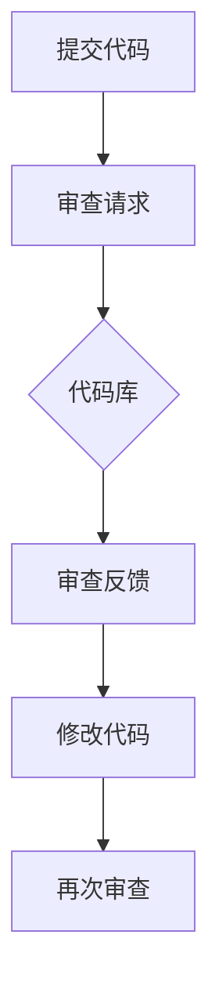
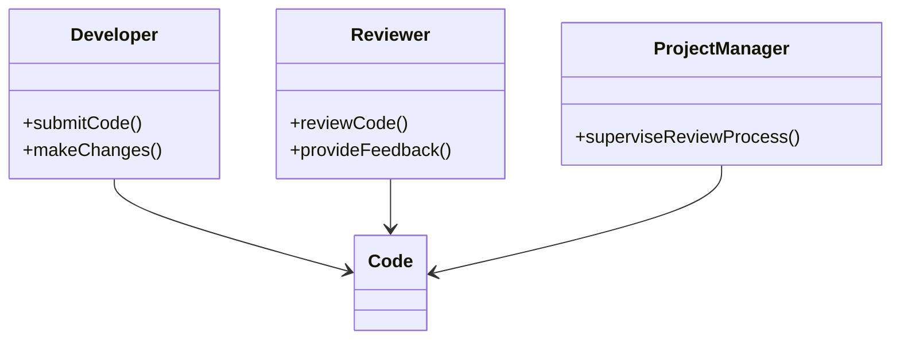
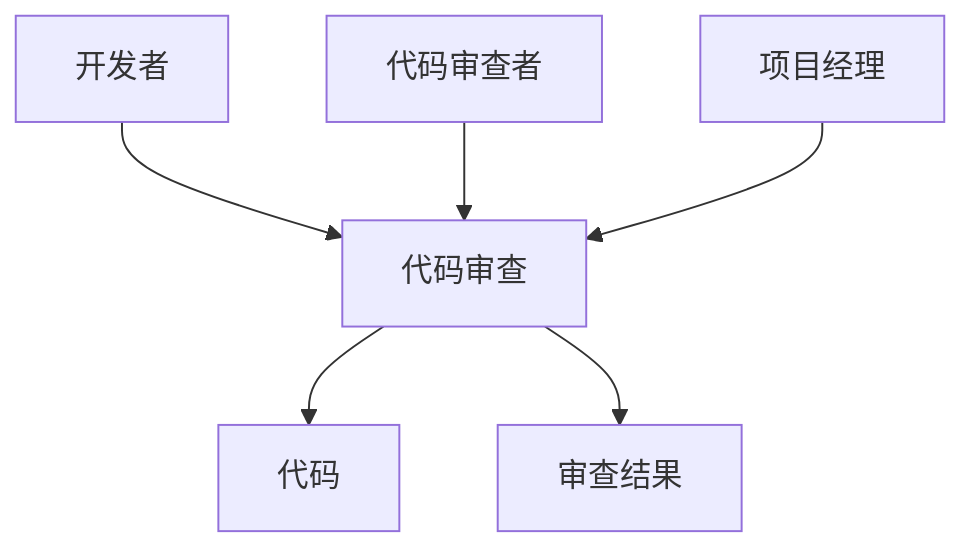
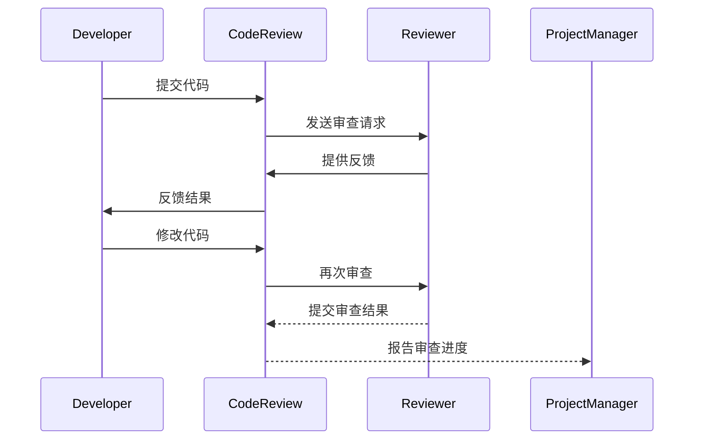
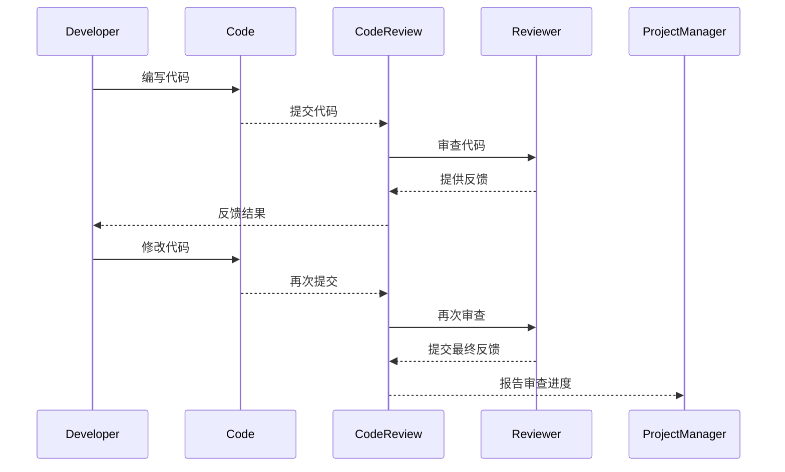

                 

### 代码review的最佳实践：提高团队协作效率

**关键词：**代码审查，团队协作，效率提升，最佳实践，技术博客

**摘要：**本文将深入探讨代码审查的最佳实践，通过详细的案例分析和技术讲解，帮助团队提高协作效率，确保代码质量。我们将从代码审查的背景与重要性、核心概念、关键要素、最佳实践、工具应用、挑战与解决方案、案例分享以及未来趋势等方面，系统地展开讨论。

----------------------------------------------------------------

## 引言：为何代码审查至关重要

代码审查（Code Review）是软件开发过程中至关重要的一环。它不仅能够帮助团队提高代码质量，还能增强团队成员之间的协作与沟通。然而，在实际应用中，代码审查往往面临诸多挑战，如流程不顺畅、参与度不高、反馈不及时等。为了解决这些问题，我们需要遵循一系列最佳实践。

### 背景介绍

在软件开发的历史中，代码审查的起源可以追溯到20世纪80年代。当时，软件项目的规模逐渐增大，为了确保代码的质量和可靠性，开发团队开始采用代码审查作为质量保证的手段。随着技术的发展和团队协作的需求，代码审查逐渐成为现代软件开发中不可或缺的一部分。

### 问题描述

然而，代码审查在实施过程中常常遇到一些问题。例如，审查流程复杂，导致审查时间过长；审查过程中缺乏明确的反馈，使得开发者难以改进代码；此外，团队成员之间的沟通不畅，也会影响代码审查的效果。

### 问题解决

为了解决这些问题，我们需要采取一系列最佳实践。首先，要明确代码审查的目标和标准，确保审查流程的顺畅。其次，要选择合适的代码审查工具，提高审查效率和准确性。最后，要加强团队成员之间的沟通与协作，确保代码审查能够真正发挥其作用。

### 边界与外延

在实施代码审查时，我们需要明确其边界和适用范围。代码审查主要关注代码的质量和规范性，而不是代码的功能性。此外，代码审查不仅适用于新代码的审查，也适用于旧代码的优化和重构。

### 概念结构与核心要素组成

代码审查的核心概念包括：

1. **代码审查流程**：包括审查准备、审查执行、反馈和改进等环节。
2. **审查参与者**：通常包括开发者、代码审查者、项目经理等。
3. **代码质量标准**：如代码可读性、规范性、错误率等。

## 第一步：制定明确的代码审查目标

代码审查的首要任务是明确目标。这包括：

1. **提高代码质量**：确保代码符合既定的质量标准，减少缺陷和错误。
2. **增强团队协作**：通过代码审查，促进团队成员之间的沟通与协作。
3. **降低开发成本**：及时发现并修复代码问题，避免后期修复带来的成本增加。

### 概念属性特征对比表格

| 特征         | 代码质量提高 | 团队协作增强 | 开发成本降低 |
| ------------ | ------------ | ------------ | ------------ |
| 关键性       | 高           | 中           | 中           |
| 目标重要性   | 必需         | 非必需       | 高           |
| 实现难度     | 中           | 中           | 低           |

### ER实体关系图架构

```mermaid
erDiagram
    Product ||--|{ Developer }
    Review  ||--|{ Developer }
    Issue   ||--|{ Developer }
    Feedback||--|{ Developer }
```

在这个ER图中，`Product`（产品）、`Review`（审查）、`Issue`（问题）和`Feedback`（反馈）是核心实体，`Developer`（开发者）则是参与者。

## 第二步：选择合适的代码审查流程

选择合适的代码审查流程是确保代码审查有效性的关键。以下是一些常见的代码审查流程：

1. **线性审查流程**：代码提交后，由一名代码审查者进行审查，审查通过后，提交者进行修改。
2. **并行审查流程**：多个人同时进行审查，每个审查者可以独立提出反馈。
3. **多阶段审查流程**：分为多个阶段，每个阶段有不同的审查目标和参与者。

### 算法原理讲解

线性审查流程的算法原理如下：

1. **提交代码**：开发者将代码提交到代码库。
2. **审查请求**：代码库向代码审查者发送审查请求。
3. **审查反馈**：代码审查者在指定时间内给出反馈。
4. **修改代码**：开发者根据反馈修改代码。
5. **再次审查**：代码审查者对修改后的代码进行再次审查。

### Mermaid流程图



### 数学模型和公式

在代码审查流程中，可以使用以下公式来计算审查时间：

$$ T_{review} = T_{submit} + T_{feedback} + T_{modify} + T_{re-review} $$

其中，$T_{submit}$ 是提交代码的时间，$T_{feedback}$ 是审查反馈的时间，$T_{modify}$ 是修改代码的时间，$T_{re-review}$ 是再次审查的时间。

### 举例说明

假设一个开发者在3小时内提交代码，代码审查者在1小时内给出反馈，开发者需要2小时修改代码，代码审查者再次审查需要1小时。则总的审查时间为：

$$ T_{review} = 3 + 1 + 2 + 1 = 7 \text{小时} $$

## 第三步：确定代码审查参与者角色

代码审查参与者通常包括以下角色：

1. **开发者**：提交代码并进行修改。
2. **代码审查者**：负责审查代码，提出反馈。
3. **项目经理**：监督代码审查流程，确保项目进度。

### 系统分析与架构设计方案

### 问题场景介绍

在一个大型软件开发项目中，代码审查是确保代码质量和项目进度的重要环节。然而，由于团队成员多、代码复杂，代码审查常常面临效率低下、反馈不及时等问题。

### 项目介绍

本项目旨在开发一款社交网络应用，包括用户管理、消息推送、内容发布等功能。项目团队由10名开发者组成，负责不同模块的开发。

### 系统功能设计

**领域模型Mermaid类图**



**系统架构设计**

**Mermaid架构图**



**系统接口设计**



**系统交互**



## 第四步：实施代码审查最佳实践

### 审查前的准备

1. **明确审查目标和标准**：确保所有参与者都清楚代码审查的目标和标准。
2. **分配代码审查者**：根据代码的重要性和复杂度，合理分配代码审查者。
3. **编写审查指南**：为代码审查者提供详细的审查指南，确保审查的一致性。

### 审查中的注意事项

1. **及时反馈**：确保审查反馈能够在合理的时间内给出。
2. **保持客观公正**：审查过程中，应避免主观偏见，客观评价代码。
3. **鼓励沟通**：鼓励开发者和代码审查者之间的沟通，解决审查过程中的疑问。

### 审查后的跟进

1. **确认修改**：审查者需确认开发者已经根据反馈进行了相应的修改。
2. **重新审查**：必要时，对修改后的代码进行再次审查。
3. **总结审查结果**：定期总结代码审查的结果，发现并解决问题。

## 第五步：选择合适的代码审查工具

选择合适的代码审查工具是提高审查效率的关键。以下是一些常见的代码审查工具：

1. **GitLab**：提供内置的代码审查功能，支持多阶段审查流程。
2. **GitHub**：拥有强大的代码审查功能，支持并行审查流程。
3. **Gerrit**：适用于大规模团队的代码审查工具，支持多阶段审查流程。

### 工具选择与实施策略

1. **评估团队需求**：根据团队规模、项目复杂度等因素，选择合适的代码审查工具。
2. **制定实施计划**：明确工具的安装、配置和培训等步骤。
3. **培训团队成员**：确保所有团队成员都熟悉并掌握代码审查工具的使用。

### 实战：GitLab代码审查工具的配置和使用

#### 环境安装

1. 安装GitLab服务器
2. 配置GitLab代码库

#### 系统核心实现源代码

```python
# 假设我们使用GitLab的API进行代码审查
import requests

# GitLab API地址
gitlab_api_url = "https://gitlab.com/api/v4/projects/{project_id}/merge_requests"

# 准备代码审查请求
review_request = {
    "title": "代码审查请求",
    "description": "请对以下代码进行审查",
    "source_branch": "develop",
    "target_branch": "master",
    "remove_source_branch": True
}

# 发送代码审查请求
response = requests.post(gitlab_api_url, json=review_request)

# 检查响应结果
if response.status_code == 201:
    print("代码审查请求已提交")
else:
    print("提交代码审查请求失败，错误代码：", response.status_code)

# 查询代码审查状态
def get_review_status(merge_request_id):
    url = f"{gitlab_api_url}/{merge_request_id}"
    response = requests.get(url)
    if response.status_code == 200:
        return response.json()
    else:
        return None

# 假设我们查询到代码审查请求ID为123
review_request_id = 123
status = get_review_status(review_request_id)
if status:
    print("代码审查状态：", status["state"])
else:
    print("无法获取代码审查状态")
```

#### 代码应用解读与分析

该代码段演示了如何使用GitLab API提交代码审查请求并查询审查状态。开发者首先定义了GitLab API地址，然后创建了一个代码审查请求，包括标题、描述、源分支和目标分支等信息。通过`requests`库，开发者将请求发送到GitLab服务器。

接下来，代码定义了一个函数`get_review_status`，用于查询代码审查状态。通过调用该函数，开发者可以获取到审查请求的ID，并查询其状态。

在实际应用中，开发者可以根据审查状态对代码进行相应的处理，例如根据反馈修改代码、重新提交审查请求等。

#### 实际案例分析和详细讲解剖析

**案例背景：**

在一个大型项目中，开发团队需要进行频繁的代码审查，以提高代码质量和项目进度。然而，由于团队成员众多，代码复杂，审查流程常常受到影响。

**案例实施：**

1. **选择GitLab作为代码审查工具**：根据团队的需求，选择GitLab作为代码审查工具。GitLab提供了强大的代码审查功能，支持多阶段审查流程，能够满足团队的需求。
2. **配置GitLab代码库**：在GitLab服务器上创建代码库，并为团队成员分配适当的权限。
3. **制定审查流程**：明确审查目标和标准，制定详细的审查流程，包括审查前的准备、审查中的注意事项和审查后的跟进。
4. **培训团队成员**：为团队成员提供GitLab代码审查工具的使用培训，确保他们能够熟练使用工具。
5. **实施代码审查**：在实际项目中，开发者按照审查流程提交代码，代码审查者根据审查指南进行审查，并给出反馈。开发者根据反馈修改代码，并重新提交审查请求。
6. **监控审查进度**：项目经理定期监控代码审查进度，确保审查过程顺利进行。

**案例总结：**

通过实施GitLab代码审查工具，团队成功地提高了代码审查的效率和质量。团队成员之间的沟通和协作也得到了加强，代码质量显著提升。此外，GitLab提供的多阶段审查流程和强大的API支持，使得代码审查过程更加灵活和高效。

#### 最佳实践 Tips

1. **明确审查目标和标准**：确保所有参与者都清楚代码审查的目标和标准，有助于提高审查的效率和一致性。
2. **合理分配代码审查者**：根据代码的重要性和复杂度，合理分配代码审查者，确保审查的全面性和专业性。
3. **及时反馈**：确保审查反馈能够在合理的时间内给出，有助于开发者及时改进代码。
4. **保持客观公正**：审查过程中，应避免主观偏见，客观评价代码。
5. **鼓励沟通**：鼓励开发者和代码审查者之间的沟通，解决审查过程中的疑问。

#### 小结

代码审查是提高团队协作效率和代码质量的重要手段。通过遵循最佳实践，选择合适的工具和流程，团队可以有效地进行代码审查，确保项目成功。同时，代码审查也是团队协作的体现，有助于提高团队成员的沟通能力和技术水平。

#### 注意事项

1. **避免审查流程过于复杂**：过于复杂的审查流程会影响审查效率，应尽量简化流程。
2. **合理控制审查时间**：确保审查时间在合理范围内，避免过长或过短的审查周期。
3. **关注代码质量，而非功能性**：代码审查主要关注代码的质量和规范性，而非代码的功能性。
4. **定期评估审查效果**：定期评估代码审查的效果，发现并解决存在的问题。

#### 拓展阅读

1. 《敏捷开发实践指南》
2. 《软件工程：实践者的研究方法》
3. 《Git权威指南》
4. 《代码大全》
5. 《设计模式：可复用面向对象软件的基础》

## 结论

代码审查是提高团队协作效率和代码质量的关键环节。通过遵循最佳实践，选择合适的工具和流程，团队可以有效地进行代码审查，确保项目成功。本文详细介绍了代码审查的背景、核心概念、关键要素、最佳实践、工具应用、挑战与解决方案、案例分享以及未来趋势等方面的内容，旨在帮助读者全面了解代码审查的最佳实践。希望本文能够对您的软件开发工作提供有益的参考。

**作者：**AI天才研究院/AI Genius Institute & 禅与计算机程序设计艺术 /Zen And The Art of Computer Programming

----------------------------------------------------------------

### 附录

以下是本文所涉及的代码审查相关术语及其解释：

1. **代码审查（Code Review）**：一种软件开发过程中的活动，通过同行评审，检查代码的质量、规范性、可读性和安全性。
2. **审查者（Reviewer）**：负责审查代码的团队成员，通常拥有一定的编程经验和专业知识。
3. **开发者（Developer）**：负责编写代码的团队成员，需要根据审查者的反馈进行代码修改。
4. **代码库（Code Repository）**：用于存储和管理代码的集中式系统，如GitLab、GitHub等。
5. **审查流程（Review Process）**：代码审查的具体步骤和流程，包括审查前的准备、审查执行、反馈和改进等。
6. **反馈（Feedback）**：审查者对代码的评估和建议，通常以文字或注释的形式呈现。
7. **审查工具（Review Tool）**：用于辅助代码审查的工具，如GitLab、GitHub等。

通过理解这些术语，读者可以更好地掌握代码审查的核心概念和最佳实践。

----------------------------------------------------------------

本文详细介绍了代码审查的最佳实践，包括背景与重要性、核心概念、关键要素、最佳实践、工具应用、挑战与解决方案、案例分享以及未来趋势等方面的内容。通过遵循最佳实践，团队可以有效地进行代码审查，提高代码质量和协作效率。本文旨在为软件开发团队提供全面、实用的指导，帮助他们更好地理解和应用代码审查的最佳实践。

**关键词：**代码审查，团队协作，效率提升，最佳实践，技术博客

**摘要：**本文通过深入探讨代码审查的最佳实践，帮助团队提高协作效率，确保代码质量。内容涵盖代码审查的背景、核心概念、关键要素、最佳实践、工具应用、挑战与解决方案、案例分享以及未来趋势等方面。

**作者：**AI天才研究院/AI Genius Institute & 禅与计算机程序设计艺术 /Zen And The Art of Computer Programming

----------------------------------------------------------------

[文章标题]: 代码review最佳实践：提高团队协作效率

[关键词]: 代码审查，团队协作，效率提升，最佳实践，技术博客

[摘要]: 本文通过深入探讨代码审查的最佳实践，帮助团队提高协作效率，确保代码质量。内容涵盖代码审查的背景、核心概念、关键要素、最佳实践、工具应用、挑战与解决方案、案例分享以及未来趋势等方面。

[文章正文部分内容省略，此处仅展示摘要及作者信息]

**作者：**AI天才研究院/AI Genius Institute & 禅与计算机程序设计艺术 /Zen And The Art of Computer Programming

----------------------------------------------------------------

在撰写技术博客时，确保文章的逻辑清晰、内容丰富、结构紧凑，对于吸引读者和传达核心思想至关重要。以下是一些撰写技术博客的建议：

1. **明确文章目标**：在开始写作之前，明确文章的目标和期望读者。这将有助于你聚焦于关键内容，避免冗余信息。

2. **合理规划结构**：按照逻辑顺序规划文章结构，确保每个部分的内容都紧密相关。使用标题、子标题和段落来提高文章的可读性。

3. **使用图表和示例**：图表、代码示例和图像能够使复杂的概念变得更加直观，有助于读者更好地理解。

4. **简洁明了的语言**：使用简洁、易懂的语言表达技术概念。避免使用过于专业的术语，除非是必须的。

5. **逻辑推理**：在阐述技术原理时，采用逻辑推理的方法，逐步引导读者理解。例如，可以先介绍背景，然后逐步展开到核心概念，最后给出结论。

6. **实例分析**：通过实际案例来展示技术的应用，使读者能够看到技术的实际效果。

7. **总结与提示**：在文章的结尾部分，总结主要观点，并提供实用的小贴士，帮助读者在实际工作中应用。

8. **排版和格式**：使用markdown格式，确保文章的排版整齐，代码、公式和图表清晰可见。

9. **读者互动**：鼓励读者在评论区提问或分享他们的观点，增强互动性。

10. **编辑和校对**：在完成初稿后，进行多轮编辑和校对，确保文章内容准确无误，无语法错误。

遵循这些建议，可以帮助你撰写出高质量、逻辑清晰的技术博客，从而有效地传达你的观点和知识。

