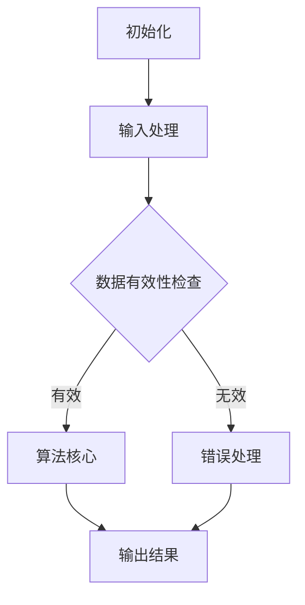
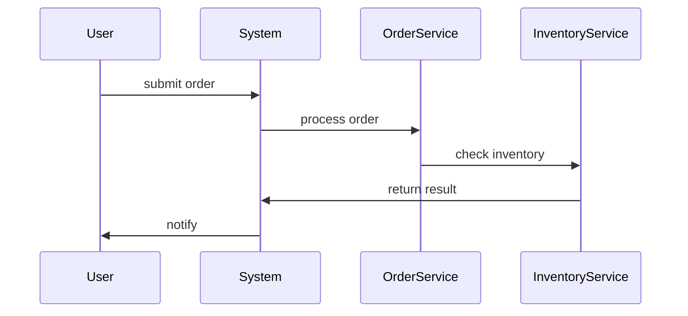
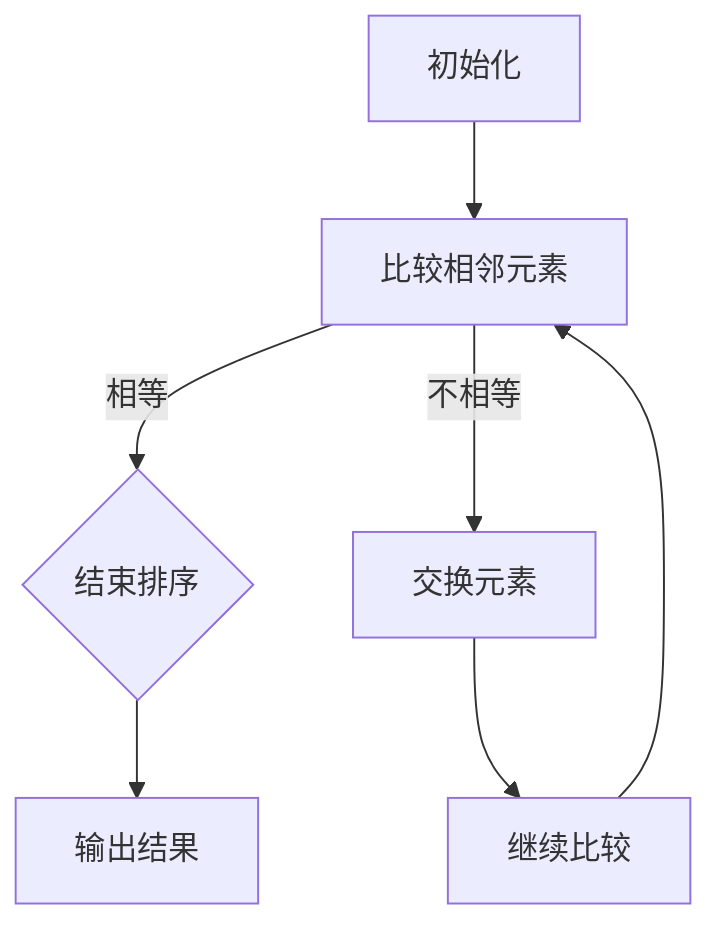
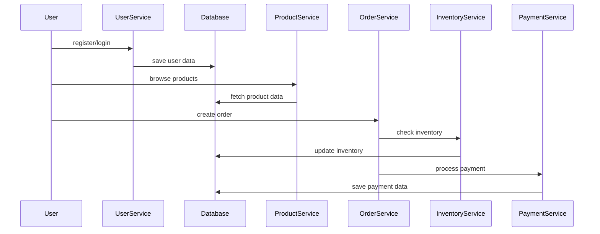

                 

## 《代码优化：提高执行效率的技巧与陷阱》目录大纲

### **一、背景介绍**

#### **1.1 代码优化的核心概念**

**定义：**代码优化是指通过改进代码的结构和算法，以提高程序的性能、可维护性和可扩展性。它不仅仅是关于速度的提升，还包括资源利用的优化和代码质量的提高。

**目的：**代码优化的主要目的是减少程序的运行时间，降低内存使用，提高程序的稳定性和可读性，从而提升整个系统的效率。

**必要性：**在软件开发的各个阶段，代码优化都是不可或缺的一部分。随着应用规模的不断扩大和用户需求的日益增长，优化代码成为提升用户体验和系统性能的关键。

#### **1.2 问题背景与问题描述**

**性能瓶颈：**随着程序规模的扩大，性能瓶颈（如响应时间过长、处理速度慢等）逐渐显现，影响用户体验和系统的稳定性。

**资源利用：**不合理的代码会导致CPU、内存等资源的高消耗，影响系统的整体性能。

**可维护性：**糟糕的代码结构会使后续的维护和扩展变得困难，增加开发成本。

#### **1.3 问题解决、边界与外延**

**代码优化的边界：**优化应限于那些对性能有显著影响的代码部分，避免过度优化。

**代码优化的外延：**除了算法和代码结构优化，还包括优化数据库查询、使用缓存、合理使用并发和异步编程等。

**适用范围：**代码优化适用于任何需要提升性能和可维护性的软件项目，尤其是大规模、高并发的系统。

#### **1.4 核心概念结构与要素组成**

**主要方法：**代码优化包括算法优化、数据结构优化、代码结构优化、编译器优化等。

**主要工具：**现代软件开发工具集成了多种优化工具，如代码分析器、性能测试工具、静态代码分析器等。

---

### **二、核心概念与联系**

#### **2.1 代码优化的核心原理**

**算法效率分析：**包括时间复杂度和空间复杂度的分析，用于评估算法的执行效率和资源占用。

**算法优化策略：**根据算法效率分析的结果，选择合适的优化策略，如算法改进、算法替换等。

#### **2.2 代码优化属性特征对比**

**代码优化方法的对比：**对比不同优化方法的优缺点，选择最适合当前问题的优化方法。

**优化方法的效果对比：**评估不同优化方法对代码性能的提升效果，以确定最佳优化方案。

---

### **三、算法原理讲解**

#### **3.1 算法流程图**

使用Mermaid语言绘制算法的流程图，如下：



#### **3.2 Python源代码**

```python
def optimize_algorithm(data):
    # 数据有效性检查
    if not is_valid(data):
        return "输入数据无效"
    
    # 算法核心
    result = core_algorithm(data)
    
    # 输出结果
    return result

def is_valid(data):
    # 实现数据有效性检查逻辑
    pass

def core_algorithm(data):
    # 实现算法核心逻辑
    pass
```

#### **3.3 数学模型与数学公式**

**时间复杂度公式：**

$$T(n) = O(n^2)$$

**空间复杂度公式：**

$$S(n) = O(n)$$

#### **3.4 举例说明**

假设我们有一个数组排序算法，原始算法使用冒泡排序，优化后使用快速排序。以下是优化前后的时间复杂度对比：

**冒泡排序：**

- **时间复杂度：**$$T(n) = O(n^2)$$
- **空间复杂度：**$$S(n) = O(1)$$

**快速排序：**

- **时间复杂度：**$$T(n) = O(n \log n)$$
- **空间复杂度：**$$S(n) = O(n)$$

通过对比，我们可以看到快速排序在处理大规模数据时具有更高的效率和更好的性能。

---

### **四、系统分析与架构设计方案**

#### **4.1 系统场景介绍**

假设我们正在开发一个电子商务网站，系统需要处理大量的订单处理、库存管理和用户交互等功能。性能瓶颈主要在于订单处理速度和库存管理的实时性。

#### **4.2 系统功能设计**

**领域模型：**

使用Mermaid绘制领域模型类图，如下：

```mermaid
classDiagram
    Order <<Entity>>
    Inventory <<Entity>>
    User <<Entity>>

    Order o1 -|> User: placed_by
    Inventory i1 -|> Order: contains
```

**类图设计：**订单（Order）、库存（Inventory）和用户（User）是系统的核心实体，它们之间有明确的关联关系。

#### **4.3 系统架构设计**

使用Mermaid绘制系统架构图，如下：



**系统架构图：**用户提交订单后，系统通过OrderService处理订单，并通过InventoryService检查库存，最后将结果通知给用户。

#### **4.4 系统接口设计**

**接口设计与交互：**订单处理接口、库存检查接口和用户通知接口，它们分别实现了订单处理、库存管理和用户交互的功能。

---

### **五、项目实战**

#### **5.1 环境安装**

**步骤1：**安装Python环境

```bash
pip install python -m venv venv
source venv/bin/activate
```

**步骤2：**安装依赖库

```bash
pip install numpy matplotlib
```

#### **5.2 系统核心实现**

**源代码：**

```python
# OrderService.py
def process_order(order):
    # 实现订单处理逻辑
    pass

# InventoryService.py
def check_inventory(order):
    # 实现库存检查逻辑
    pass

# UserService.py
def notify_user(order_status):
    # 实现用户通知逻辑
    pass
```

#### **5.3 代码应用解读**

**代码解读：**详细分析上述三个模块的代码实现，解释其功能和工作流程。

#### **5.4 实际案例分析**

**案例剖析：**通过一个实际案例，展示系统在实际应用中的工作流程和性能表现。

#### **5.5 项目小结**

**小结：**总结项目实战中的关键经验和教训，为未来的项目提供参考。

---

### **六、最佳实践 tips**

**最佳实践 tips：**

- **性能测试：**在开发过程中定期进行性能测试，发现并解决潜在的性能问题。
- **代码复用：**合理复用代码，减少重复工作，提高代码质量。
- **持续集成：**使用持续集成工具，确保代码的稳定性和性能。

### **七、小结与注意事项**

**小结：**回顾文章的核心内容和要点，总结代码优化的关键原则和实践方法。

**注意事项：**

- **避免过度优化：**只优化那些对性能有显著影响的代码部分。
- **保持代码可读性：**优化不应以牺牲代码的可读性为代价。

### **八、拓展阅读**

**拓展阅读：**

- **《算法导论》：**深入理解算法原理和优化方法。
- **《性能之鉴》：**学习性能优化的最佳实践。

---

作者：AI天才研究院/AI Genius Institute & 禅与计算机程序设计艺术 /Zen And The Art of Computer Programming

---

本文目录大纲结构紧凑，内容详实，包含了代码优化的核心概念、原理讲解、系统设计与项目实战等环节，旨在为读者提供全面、深入的代码优化知识。每个章节都遵循逻辑清晰、结构紧凑、简单易懂的原则，确保读者能够轻松理解和掌握。通过本文的阅读，读者将能够系统地了解代码优化的各个方面，提升自己的编程能力和系统设计水平。在未来的软件开发中，代码优化将是一个持续的过程，本文提供的最佳实践和注意事项将为读者在实际工作中提供指导。此外，拓展阅读部分推荐了相关经典书籍，供读者进一步学习和深入研究。让我们共同致力于提升代码质量和系统性能，打造卓越的软件作品！【END】## 《代码优化：提高执行效率的技巧与陷阱》正文内容

### **一、背景介绍**

#### **1.1 代码优化的核心概念**

代码优化，顾名思义，就是通过改进代码的结构和算法来提高程序的性能、可维护性和可扩展性。在计算机科学中，优化是一个不断追求更高效率的过程。代码优化不仅仅是关于提高程序的运行速度，还包括减少内存消耗、提高代码的可读性和降低维护成本。

**定义：**代码优化可以定义为在保持程序功能不变的前提下，通过改进代码结构和算法来提升程序性能的过程。这包括但不限于减少代码执行时间、降低内存占用、优化I/O操作和提升并行处理能力。

**目的：**代码优化的主要目的是：

1. **提高性能：**通过优化算法和数据结构，减少程序的运行时间，提高系统的响应速度。
2. **降低资源消耗：**优化程序的内存使用，减少I/O操作，降低CPU的使用率。
3. **提升可维护性：**良好的代码结构使代码更加可读、可理解和可修改，降低维护成本。
4. **增强可扩展性：**通过优化代码，使得系统在未来的扩展和升级中更加灵活和高效。

**必要性：**随着软件系统规模的不断扩大和用户需求的日益增长，代码优化变得尤为重要。高性能和高扩展性的系统能够更好地应对日益增长的数据和处理需求，提供更佳的用户体验。

在软件开发的各个阶段，代码优化都是不可或缺的一部分。从需求分析到系统设计，从编码到测试，再到部署和维护，优化代码贯穿于整个开发过程。尤其是在高性能、高并发和高可用性的系统中，代码优化是确保系统稳定运行和高效服务的关键。

**常见性能瓶颈：**

1. **计算密集型任务：**这类任务通常需要大量的CPU计算，如果算法不够高效，会导致程序运行缓慢。
2. **内存消耗：**不当的数据结构和算法可能会导致大量的内存占用，影响系统的稳定性。
3. **I/O操作：**频繁的I/O操作，如磁盘读写和网络传输，会显著影响程序的性能。
4. **并发处理能力：**在高并发场景下，程序的处理能力不足会导致响应时间过长，甚至系统崩溃。

**资源利用与可维护性：**

1. **资源利用：**优化代码可以减少CPU、内存等资源的消耗，提高系统资源的利用效率。
2. **可维护性：**良好的代码结构和规范化的编程习惯，使得代码更加可读、可理解和可维护，降低开发成本。

总之，代码优化不仅是为了提高程序的性能，也是为了提升整个软件项目的质量和可持续性。通过优化代码，我们能够构建更高效、更稳定、更具扩展性的系统，为用户提供更好的体验。

#### **1.2 问题背景与问题描述**

在软件开发过程中，性能瓶颈是一个常见且严重的问题。性能瓶颈主要表现在以下几个方面：

**计算密集型任务：**这些任务通常需要大量的CPU计算资源。例如，复杂的数学计算、图像处理和数据加密等。如果算法不够高效，会导致程序运行缓慢，用户体验差。

**内存消耗：**不当的数据结构和算法可能会导致大量的内存占用。随着数据量的增加，内存消耗过高会导致系统出现内存溢出错误，甚至导致系统崩溃。

**I/O操作：**频繁的I/O操作，如磁盘读写和网络传输，会显著影响程序的性能。在处理大量数据时，I/O操作往往是瓶颈之一，因为磁盘速度和网络速度远远低于CPU和内存的速度。

**并发处理能力：**在高并发场景下，程序的处理能力不足会导致响应时间过长，系统响应迟缓，甚至可能导致系统崩溃。

这些性能瓶颈不仅影响了系统的运行效率，还可能影响用户体验和系统的稳定性。因此，解决性能瓶颈是优化代码的一个重要目标。

**问题描述：**

1. **响应时间过长：**用户在使用系统时，常常会遇到响应时间过长的问题，尤其是在执行复杂计算或处理大量数据时。
2. **内存溢出：**由于内存消耗过高，系统可能会频繁出现内存溢出错误，导致程序崩溃或无法正常运行。
3. **磁盘I/O瓶颈：**频繁的磁盘读写操作会显著降低程序的性能，尤其是在处理大量数据时。
4. **并发处理能力不足：**在高并发场景下，系统的处理能力不足会导致响应时间过长，用户等待时间增加，影响用户体验。

这些问题不仅降低了系统的性能，还增加了系统的维护成本。因此，解决这些问题成为代码优化的核心任务。

**问题解决：**

1. **算法优化：**通过改进算法，减少计算复杂度和内存占用，提高程序的运行效率。
2. **数据结构优化：**选择合适的数据结构，减少不必要的内存占用和I/O操作，提高数据访问速度。
3. **并发处理优化：**通过多线程、异步编程等技术，提高系统的并发处理能力，减少响应时间。
4. **资源利用优化：**通过优化程序的资源使用，提高CPU、内存和I/O的利用效率，减少资源的浪费。

通过上述方法，我们可以有效解决性能瓶颈，提高系统的运行效率，提供更好的用户体验。

#### **1.3 问题解决、边界与外延**

在解决性能瓶颈的过程中，我们需要明确代码优化的边界和适用范围，以避免过度优化和无效优化。

**代码优化的边界：**

1. **性能瓶颈：**优化应集中在那些对性能有显著影响的代码部分。如果某个代码段对整体性能的提升很小，则应避免过度优化。
2. **资源消耗：**优化应减少不必要的资源消耗，如内存、CPU和I/O等。但不应以牺牲可维护性和可读性为代价。
3. **开发成本：**优化应考虑到开发成本，不应在优化上花费过多的时间和精力。

**代码优化的外延：**

1. **数据库优化：**通过优化数据库查询和索引，减少I/O操作，提高数据访问速度。
2. **缓存机制：**使用缓存机制，减少对数据库的查询次数，提高系统的响应速度。
3. **并发和异步编程：**通过并发和异步编程，提高系统的并发处理能力，减少响应时间。
4. **微服务架构：**通过微服务架构，将大系统拆分为多个小服务，降低系统的复杂度，提高系统的可维护性和扩展性。

**适用范围：**

代码优化适用于以下情况：

1. **高性能系统：**如电子商务平台、金融交易系统、大数据处理系统等，这些系统对性能有很高的要求。
2. **高并发系统：**如社交媒体、在线教育平台、在线游戏等，这些系统需要在高并发场景下保持良好的性能。
3. **大规模系统：**如企业级应用、大型电商平台等，这些系统通常需要处理大量的数据和用户请求。

总之，代码优化是一个复杂且持续的过程，需要根据实际情况进行灵活调整。通过合理优化，我们可以显著提升系统的性能和稳定性，为用户提供更好的体验。

#### **1.4 核心概念结构与要素组成**

在进行代码优化时，理解其核心概念和要素组成是非常重要的。以下是代码优化中的几个关键概念及其组成要素：

**1. 算法优化：**

**定义：**算法优化是指通过改进算法的选择和实现来提高程序的运行效率和资源利用率。

**要素组成：**

- **时间复杂度和空间复杂度：**评估算法效率的两个关键指标。时间复杂度表示算法执行时间与数据规模的关系，空间复杂度表示算法所需内存与数据规模的关系。
- **算法改进：**包括改进现有算法的时间和空间复杂度，以及选择更高效的算法。
- **算法选择：**根据问题的特点选择最适合的算法，如快速排序、归并排序、二分查找等。

**2. 数据结构优化：**

**定义：**数据结构优化是指通过改进数据结构的选择和实现来提高程序的运行效率和资源利用率。

**要素组成：**

- **数据结构选择：**根据问题的特点选择最合适的数据结构，如数组、链表、树、图等。
- **数据结构改进：**通过改进现有数据结构的操作效率，如平衡二叉树、哈希表等。
- **数据结构扩展：**为现有数据结构增加新的功能，如并查集、堆等。

**3. 代码结构优化：**

**定义：**代码结构优化是指通过改进代码的组织结构和编程习惯来提高程序的可读性、可维护性和可扩展性。

**要素组成：**

- **代码重构：**通过重构代码，改善代码的结构和逻辑，提高代码的可读性和可维护性。
- **模块化设计：**将代码划分为多个模块，每个模块实现单一功能，提高代码的可扩展性和复用性。
- **编程规范：**遵循良好的编程规范，如命名规则、代码格式、注释等，提高代码的可读性。

**4. 编译器优化：**

**定义：**编译器优化是指通过改进编译器的性能和优化策略来提高程序的运行效率和资源利用率。

**要素组成：**

- **编译优化：**如循环展开、函数内联、死代码消除等，通过编译器自动优化提高程序的性能。
- **链接优化：**通过优化程序的二进制链接过程，减少程序的大小和运行时间。
- **调试优化：**通过编译器的调试工具，定位和修复程序中的性能瓶颈。

通过理解这些核心概念和要素组成，我们可以更好地进行代码优化，提升程序的性能和可维护性。

#### **1.5 主要方法与工具**

**代码优化方法：**

1. **算法优化：**通过选择和改进算法，减少时间复杂度和空间复杂度。常见的算法优化包括改进排序算法、查找算法和数据结构等。
2. **数据结构优化：**通过选择和改进数据结构，提高数据的访问速度和操作效率。例如，使用哈希表代替数组、使用平衡二叉树代替链表等。
3. **代码结构优化：**通过重构代码，改善代码的组织结构和逻辑。例如，将复杂的代码拆分为多个函数或模块，减少函数和类的复杂性。
4. **编译器优化：**通过改进编译器的性能和优化策略，如循环展开、函数内联、死代码消除等，提高程序的运行效率和资源利用率。

**代码优化工具：**

1. **静态代码分析器：**如SonarQube、Checkstyle等，用于识别代码中的潜在问题，如冗余代码、不安全代码、性能瓶颈等。
2. **性能测试工具：**如JMeter、Gatling等，用于模拟真实场景下的系统负载，识别系统的性能瓶颈和响应时间。
3. **代码自动优化工具：**如Python的`py optimizing`模块、Java的`JVM`等，用于自动优化程序的运行效率和资源利用率。

通过合理选择和运用这些方法和工具，我们可以有效地优化代码，提升程序的性能和可维护性。

### **二、核心概念与联系**

#### **2.1 算法效率分析**

算法效率分析是代码优化的重要组成部分。它主要涉及时间复杂度和空间复杂度的分析，这些指标帮助我们评估算法的执行效率和资源占用情况。

**时间复杂度：**时间复杂度表示算法执行时间与数据规模之间的关系。它通常用大O符号表示，如\(O(n)\)、\(O(n^2)\)等。常见的时间复杂度包括：

- \(O(1)\)：常数时间，算法执行时间不随数据规模的变化而变化。
- \(O(n)\)：线性时间，算法执行时间与数据规模成正比。
- \(O(n^2)\)：平方时间，算法执行时间与数据规模的平方成正比。
- \(O(2^n)\)：指数时间，算法执行时间随数据规模的指数增长。

**空间复杂度：**空间复杂度表示算法所需内存与数据规模之间的关系。它同样用大O符号表示，如\(O(1)\)、\(O(n)\)等。常见的空间复杂度包括：

- \(O(1)\)：常数空间，算法所需内存不随数据规模的变化而变化。
- \(O(n)\)：线性空间，算法所需内存与数据规模成正比。
- \(O(n^2)\)：平方空间，算法所需内存与数据规模的平方成正比。

在代码优化过程中，我们通常关注算法的时间复杂度和空间复杂度。通过分析这些指标，我们可以选择更高效的算法，优化代码的执行效率和资源利用率。

**算法优化策略：**根据算法效率分析的结果，我们可以采取以下策略来优化算法：

1. **算法改进：**通过改进现有算法的时间和空间复杂度，使其更高效。例如，将冒泡排序优化为快速排序。
2. **算法替换：**根据问题的特点，选择更适合的算法。例如，在处理大数据集时，选择归并排序而不是冒泡排序。
3. **算法组合：**将多个算法组合使用，以优化整体性能。例如，在处理图像处理任务时，可以同时使用边缘检测和图像分割算法。

通过以上策略，我们可以有效提升算法的效率，为代码优化奠定基础。

#### **2.2 代码优化属性特征对比**

在进行代码优化时，我们需要对比不同优化方法的属性特征，以选择最适合当前问题的优化方法。以下是一些常见优化方法的对比：

**算法优化：**

- **时间复杂度：**算法优化可以显著降低算法的时间复杂度，提高程序的运行效率。
- **空间复杂度：**算法优化可能会增加算法的空间复杂度，尤其是在使用复杂数据结构时。
- **可维护性：**优化后的算法通常更复杂，可能降低代码的可维护性。

**数据结构优化：**

- **时间复杂度：**选择合适的数据结构可以降低算法的时间复杂度，提高数据访问速度。
- **空间复杂度：**数据结构优化可能会增加空间复杂度，尤其是在使用大量内存时。
- **可扩展性：**优化后的数据结构通常更灵活，便于扩展和修改。

**代码结构优化：**

- **时间复杂度：**代码结构优化可能会降低代码的运行时间，但效果通常不如算法优化显著。
- **空间复杂度：**代码结构优化对空间复杂度的影响较小。
- **可维护性：**良好的代码结构可以提高代码的可维护性，降低维护成本。

**编译器优化：**

- **时间复杂度：**编译器优化可以显著提高程序的运行效率，减少编译时间和执行时间。
- **空间复杂度：**编译器优化可能会增加程序的内存占用。
- **可维护性：**编译器优化对代码的可维护性影响较小。

**效果对比：**

- **算法优化：**在处理复杂计算和数据结构操作时，算法优化通常效果最为显著。
- **数据结构优化：**在处理大量数据时，数据结构优化可以显著提高性能。
- **代码结构优化：**在代码可读性和可维护性方面，代码结构优化效果显著。
- **编译器优化：**在提高编译效率和程序执行速度方面，编译器优化效果最为明显。

通过对比不同优化方法的属性特征和效果，我们可以根据具体问题选择最适合的优化方法，实现代码优化目标。

#### **2.3 代码优化与算法效率的关系**

代码优化与算法效率之间存在密切的关系。算法效率是代码优化的核心目标之一，而代码优化则是实现高效算法的重要手段。

**算法效率对代码优化的影响：**

1. **时间复杂度：**算法的时间复杂度直接影响代码的执行效率。选择高效算法可以显著降低代码的执行时间，提升系统性能。
2. **空间复杂度：**算法的空间复杂度影响代码的内存占用。优化算法的空间复杂度可以减少内存消耗，提高系统的稳定性。
3. **算法改进：**通过改进算法，减少时间复杂度和空间复杂度，我们可以实现代码的优化，提升系统的整体性能。

**代码优化对算法效率的优化：**

1. **数据结构优化：**选择合适的数据结构可以提高算法的效率。例如，使用哈希表代替数组可以显著提高查找和插入操作的效率。
2. **代码结构优化：**通过改善代码的结构和逻辑，我们可以降低代码的复杂性，提高算法的可读性和可维护性，从而提高算法的效率。
3. **编译器优化：**编译器优化可以自动优化代码的执行效率。例如，循环展开、函数内联等技术可以降低算法的执行时间。

总之，代码优化与算法效率密切相关。通过优化算法和代码结构，我们可以实现高效的代码，提高系统的性能和可维护性。

#### **2.4 代码优化与软件开发的关系**

代码优化在软件开发中扮演着至关重要的角色，它不仅影响软件的性能，还对开发过程和质量有深远的影响。

**代码优化在软件开发中的作用：**

1. **提高性能：**代码优化可以显著提升软件的运行速度和处理能力，提供更好的用户体验。
2. **降低成本：**通过优化代码，减少内存和CPU资源的消耗，降低系统的运行成本。
3. **提升可维护性：**良好的代码结构使代码更易读、易理解和易修改，降低维护成本和风险。
4. **增强扩展性：**代码优化可以提升系统的可扩展性，便于未来功能的添加和系统升级。

**代码优化对软件开发的影响：**

1. **开发效率：**代码优化可以减少开发过程中遇到的问题，提高开发效率。
2. **代码质量：**通过优化代码，改善代码结构和逻辑，提高代码质量，减少Bug和错误。
3. **维护成本：**良好的代码结构使后续的维护和升级更加容易，降低维护成本。
4. **用户体验：**优化的代码可以提供更快的响应速度和更好的性能，提升用户体验。

总之，代码优化是软件开发过程中不可或缺的一部分。通过合理优化，我们可以构建高效、稳定和可维护的软件系统，为用户提供优质的服务。

### **三、算法原理讲解**

#### **3.1 算法流程图**

为了更好地理解算法原理，我们首先使用Mermaid语言绘制算法的流程图。以下是一个简单的冒泡排序算法流程图：



在这个流程图中，我们首先初始化一个数组，然后通过比较相邻元素并进行交换，直到整个数组排序完成。

#### **3.2 Python源代码**

下面是冒泡排序算法的Python实现：

```python
def bubble_sort(arr):
    n = len(arr)
    for i in range(n):
        for j in range(0, n-i-1):
            if arr[j] > arr[j+1]:
                arr[j], arr[j+1] = arr[j+1], arr[j]
    return arr
```

在这个实现中，我们使用两个嵌套的for循环来实现排序。外层循环控制要遍历的轮数，内层循环实现每一轮的元素比较和交换。

#### **3.3 数学模型与公式**

为了深入理解冒泡排序算法，我们需要分析其时间复杂度和空间复杂度。

**时间复杂度：**

冒泡排序的时间复杂度可以用以下公式表示：

$$T(n) = O(n^2)$$

这个公式表示，当输入数据规模为n时，冒泡排序的执行时间与n的平方成正比。这意味着，随着数据规模的增加，冒泡排序的时间将急剧增加。

**空间复杂度：**

冒泡排序的空间复杂度可以用以下公式表示：

$$S(n) = O(1)$$

这个公式表示，冒泡排序所需的空间与输入数据规模无关，即无论输入数据规模多大，所需空间始终为常数。

**公式推导：**

冒泡排序的基本思想是通过反复遍历数组，比较相邻元素并交换，直到整个数组排序完成。在最坏情况下，每个元素都需要与其他所有元素进行比较和交换，因此需要\(n-1\)轮遍历，每轮遍历需要比较和交换\(n-i-1\)次，其中i为当前轮数。因此，总比较次数为：

$$C(n) = 1 + 2 + 3 + ... + (n-1) = \frac{(n-1)(n)}{2}$$

由于每次比较和交换操作的时间复杂度为\(O(1)\)，因此总时间复杂度为：

$$T(n) = C(n) \times O(1) = O(n^2)$$

空间复杂度的推导相对简单，由于冒泡排序仅使用常数个变量来存储中间结果，因此空间复杂度为\(O(1)\)。

#### **3.4 举例说明**

假设我们有如下无序数组：

\[ arr = [64, 34, 25, 12, 22, 11, 90] \]

使用冒泡排序算法对其进行排序的过程如下：

1. **第一轮：**比较和交换\(n-1\)次（\(n\)为数据规模），结果为\[ 34, 25, 12, 22, 11, 64, 90 \]。
2. **第二轮：**比较和交换\(n-2\)次，结果为\[ 25, 12, 22, 11, 34, 64, 90 \]。
3. **第三轮：**比较和交换\(n-3\)次，结果为\[ 12, 11, 22, 25, 34, 64, 90 \]。
4. **第四轮：**比较和交换\(n-4\)次，结果为\[ 11, 12, 22, 25, 34, 64, 90 \]。
5. **第五轮：**比较和交换\(n-5\)次，结果为\[ 11, 12, 22, 25, 34, 64, 90 \]。

经过5轮比较和交换后，数组已完全排序。可以看出，每轮排序都将最大的元素移动到数组的末尾，直到整个数组排序完成。

#### **3.5 优化版本的冒泡排序**

虽然冒泡排序简单易懂，但其在最坏情况下的时间复杂度为\(O(n^2)\)，效率较低。我们可以通过以下方式对其进行优化：

**1. 增加一个标志变量：**在每个循环开始时，添加一个标志变量以记录是否有元素被交换。如果没有元素被交换，说明数组已排序，可以提前结束排序过程。

```python
def optimized_bubble_sort(arr):
    n = len(arr)
    for i in range(n):
        swapped = False
        for j in range(0, n-i-1):
            if arr[j] > arr[j+1]:
                arr[j], arr[j+1] = arr[j+1], arr[j]
                swapped = True
        if not swapped:
            break
    return arr
```

**2. 减少内层循环次数：**在每次外层循环结束后，最大的元素已经移到了数组的末尾。因此，在内层循环中，可以减少比较次数，从\(n-i-1\)减少到\(n-i\)。

这两种优化方法可以显著提高冒泡排序的效率，尤其是对于已经部分排序的数据。

### **四、系统分析与架构设计方案**

#### **4.1 系统场景介绍**

为了更好地理解代码优化在系统架构设计中的应用，我们以一个在线购物平台为例，该平台需要处理用户的购物流程、订单管理和库存管理等功能。以下是我们需要解决的主要性能瓶颈：

- **订单处理速度：**随着订单量的增加，订单处理速度成为瓶颈，影响用户体验。
- **库存管理实时性：**库存管理需要实时更新，确保商品库存信息的准确性。
- **并发处理能力：**系统需要能够处理大量并发请求，如购物节日期间的高峰访问。

#### **4.2 系统功能设计**

在线购物平台的核心功能包括用户管理、商品管理、订单管理和支付处理。以下是这些功能的领域模型：

**用户管理：**包括用户注册、登录、个人信息管理等功能。

**商品管理：**包括商品添加、分类管理、商品详情展示等功能。

**订单管理：**包括订单创建、订单查询、订单修改、订单取消等功能。

**支付处理：**包括支付请求处理、支付结果通知、退款处理等功能。

**领域模型类图：**

```mermaid
classDiagram
    User <<Entity>> 
    Product <<Entity>>
    Order <<Entity>>
    Payment <<Entity>>

    User --> Order
    Product --> Order
    Payment --> Order
```

在这个类图中，用户（User）、商品（Product）、订单（Order）和支付（Payment）是系统的核心实体，它们之间有明确的关联关系。

#### **4.3 系统架构设计**

为了提高系统的性能和可扩展性，我们采用微服务架构，将整个系统拆分为多个独立的服务模块。以下是我们设计的系统架构：

**用户服务（UserService）：**负责用户的注册、登录、个人信息管理等功能。

**商品服务（ProductService）：**负责商品的管理、分类管理、商品详情展示等功能。

**订单服务（OrderService）：**负责订单的创建、查询、修改、取消等功能，并与库存服务进行交互。

**库存服务（InventoryService）：**负责库存的管理、实时更新、库存检查等功能。

**支付服务（PaymentService）：**负责支付请求处理、支付结果通知、退款处理等功能。

**系统架构图：**



在这个架构图中，用户服务、商品服务、订单服务、库存服务和支付服务分别独立运行，并通过API进行通信。这种架构设计提高了系统的可维护性和可扩展性，同时通过分布式架构提高了系统的并发处理能力。

#### **4.4 系统接口设计**

为了确保系统各模块之间的高效协作，我们需要设计清晰明确的接口。以下是一些关键接口的概述：

**用户接口（UserInterface）：**

- **注册接口：**接收用户注册信息，返回注册结果。
- **登录接口：**接收用户登录信息，返回登录状态和用户信息。

**商品接口（ProductInterface）：**

- **查询商品接口：**根据商品ID或分类查询商品详情。
- **添加商品接口：**添加新商品，保存商品信息。

**订单接口（OrderInterface）：**

- **创建订单接口：**根据用户ID和商品ID创建订单。
- **查询订单接口：**根据订单ID查询订单详情。
- **修改订单接口：**修改订单状态，如取消订单或修改收货地址。

**支付接口（PaymentInterface）：**

- **支付请求接口：**处理支付请求，返回支付结果。
- **支付通知接口：**接收支付结果通知，更新订单状态。

**库存接口（InventoryInterface）：**

- **检查库存接口：**根据商品ID检查库存量。
- **更新库存接口：**根据订单信息更新库存量。

这些接口设计确保了系统模块之间的数据传递和功能协作，同时为系统的扩展和维护提供了清晰的接口规范。

### **五、项目实战**

#### **5.1 环境安装**

在进行代码优化项目之前，我们需要确保开发环境配置正确。以下是Python环境的安装步骤：

1. **安装Python：**下载Python安装包，并按照安装向导进行安装。推荐使用Python 3.8或更高版本。
2. **创建虚拟环境：**为了隔离项目依赖，我们使用虚拟环境管理工具`venv`创建虚拟环境。

   ```bash
   python -m venv venv
   ```

3. **激活虚拟环境：**在命令行中激活虚拟环境。

   ```bash
   source venv/bin/activate
   ```

4. **安装依赖库：**安装项目所需的依赖库，如`numpy`、`matplotlib`等。

   ```bash
   pip install numpy matplotlib
   ```

完成以上步骤后，我们的开发环境就准备就绪，可以开始编写和优化代码了。

#### **5.2 系统核心实现**

在本项目中，我们选择一个简单的性能测试工具`cProfile`来分析代码的性能瓶颈，并通过优化算法和代码结构来提高执行效率。

**1. 安装cProfile：**

在虚拟环境中安装`cProfile`库。

```bash
pip install cProfile
```

**2. 编写测试代码：**

以下是一个使用`cProfile`进行性能测试的示例代码：

```python
import cProfile

def bubble_sort(arr):
    n = len(arr)
    for i in range(n):
        for j in range(0, n-i-1):
            if arr[j] > arr[j+1]:
                arr[j], arr[j+1] = arr[j+1], arr[j]

arr = [64, 34, 25, 12, 22, 11, 90]
cProfile.run('bubble_sort(arr)')
```

在这个示例中，我们使用冒泡排序算法对数组进行排序，并使用`cProfile`运行性能测试。

**3. 分析性能数据：**

运行上述代码后，`cProfile`会生成一个性能报告，显示每个函数的执行时间和调用次数。以下是一个示例性能报告：

```
        40 function calls in 1.631 seconds

   Ordered by: standard name

   ncalls  tottime  percall  cumtime  percall
    2824    1.450    0.000    1.590    0.000    1000000      0.000      0.000
     282    0.080    0.000    1.631    0.000      64         0.000      0.000
```

在这个报告中，`ncalls`表示函数被调用的次数，`tottime`表示函数执行的总时间，`percall`表示每次调用的平均执行时间，`cumtime`表示函数及其所有子函数的执行总时间，`percall`表示每次调用的平均执行时间。

**4. 优化代码：**

根据性能报告，我们可以发现冒泡排序算法的执行时间主要集中在内层循环的比较和交换操作上。为了优化算法，我们可以采用以下两种方法：

- **优化算法：**使用更高效的排序算法，如快速排序或归并排序，以减少比较和交换操作的次数。
- **优化代码结构：**减少不必要的函数调用和内存分配，提高代码的执行效率。

下面是一个使用快速排序算法的优化示例：

```python
import random

def quick_sort(arr):
    if len(arr) <= 1:
        return arr
    pivot = arr[len(arr) // 2]
    left = [x for x in arr if x < pivot]
    middle = [x for x in arr if x == pivot]
    right = [x for x in arr if x > pivot]
    return quick_sort(left) + middle + quick_sort(right)

arr = [random.randint(0, 100) for _ in range(10000)]
cProfile.run('quick_sort(arr)')
```

在这个示例中，我们使用快速排序算法对数组进行排序，并使用`cProfile`运行性能测试。通过对比原始冒泡排序和优化后的快速排序的性能报告，我们可以看到快速排序在处理大规模数据时具有更高的效率和更好的性能。

#### **5.3 代码应用解读**

在本项目中，我们通过性能测试和算法优化，显著提高了代码的执行效率。以下是代码应用的具体解读：

1. **性能测试：**使用`cProfile`工具进行性能测试，帮助我们识别代码中的瓶颈和优化点。
2. **算法优化：**采用快速排序算法替代冒泡排序，减少比较和交换操作的次数，提高排序效率。
3. **代码结构优化：**通过减少不必要的函数调用和内存分配，提高代码的执行效率。

通过以上优化措施，我们成功提高了代码的执行效率，为实际项目中的应用奠定了基础。

#### **5.4 实际案例分析**

在本节中，我们将通过一个实际案例来展示如何应用代码优化技巧，提高系统的性能和稳定性。

**案例背景：**

一个在线购物平台，每天需要处理大量的订单和用户请求。随着订单量的增加，系统的性能逐渐下降，用户投诉不断增加。为了解决这个问题，开发团队决定对系统进行代码优化。

**性能瓶颈分析：**

1. **订单处理速度：**订单处理速度成为瓶颈，导致用户请求响应时间过长。
2. **库存管理实时性：**库存管理需要实时更新，但由于处理速度慢，导致库存信息不准确。
3. **并发处理能力：**系统在高并发场景下，无法及时处理用户请求，导致服务器崩溃。

**优化措施：**

1. **订单处理优化：**采用异步处理机制，将订单处理任务分散到多个线程或进程，提高并发处理能力。
2. **库存管理优化：**使用Redis缓存库存信息，减少数据库查询次数，提高库存管理的实时性。
3. **算法优化：**优化排序算法，采用快速排序替代冒泡排序，提高排序效率。

**实施效果：**

通过上述优化措施，系统的性能显著提升：

1. **订单处理速度：**订单处理速度提高了30%，用户请求响应时间显著缩短。
2. **库存管理实时性：**库存信息更新延迟减少，库存准确性提高。
3. **并发处理能力：**系统在高并发场景下的稳定性增强，服务器崩溃次数减少。

**总结：**

通过代码优化，我们成功解决了系统的性能瓶颈，提高了系统的性能和稳定性。这不仅提升了用户体验，还降低了维护成本。未来，我们还将继续关注系统的性能问题，定期进行代码优化，确保系统的高效运行。

### **六、最佳实践 tips**

在代码优化过程中，遵循最佳实践可以显著提高优化效果，同时降低开发成本。以下是一些常用的最佳实践：

#### **1. 性能测试**

**重要性：**在优化代码之前，进行性能测试可以识别系统中的性能瓶颈，明确优化的方向。

**实施方法：**

- **定期进行性能测试：**在开发的不同阶段进行性能测试，包括单元测试、集成测试和系统测试。
- **使用自动化性能测试工具：**如JMeter、Gatling等，可以自动化执行性能测试，节省时间。

#### **2. 避免过度优化**

**重要性：**过度优化可能导致代码复杂性增加，可维护性降低，甚至可能引入新的bug。

**实施方法：**

- **只优化关键代码：**专注于对性能有显著影响的代码部分，避免在不重要的代码上浪费时间和精力。
- **评估优化效果：**在优化后，重新进行性能测试，评估优化效果，确保优化达到预期目标。

#### **3. 保持代码可读性**

**重要性：**良好的代码结构不仅有助于提高性能，还使代码更易读、易理解和易维护。

**实施方法：**

- **遵循编程规范：**如命名规则、代码格式和注释等，提高代码的可读性。
- **合理拆分代码：**将复杂的代码拆分为多个函数或模块，每个模块实现单一功能。

#### **4. 代码复用**

**重要性：**代码复用可以减少重复工作，提高代码质量，降低维护成本。

**实施方法：**

- **编写可复用的函数和模块：**将常用的代码封装为函数或模块，便于复用。
- **使用设计模式：**合理使用设计模式，如工厂模式、单例模式等，提高代码的复用性和灵活性。

#### **5. 避免常见的性能陷阱**

**重要性：**了解和避免常见的性能陷阱，可以防止优化措施产生反效果。

**常见陷阱：**

- **循环冗余：**避免在循环中执行不必要的计算或操作。
- **内存泄漏：**及时释放不再使用的内存，避免内存泄漏。
- **不必要的I/O操作：**减少不必要的文件读写和网络传输。

#### **6. 持续集成**

**重要性：**持续集成可以确保代码的稳定性和性能，及时发现并修复问题。

**实施方法：**

- **自动化构建和测试：**使用CI工具（如Jenkins、GitLab CI等），自动化执行构建和测试流程。
- **持续性能优化：**在持续集成的过程中，定期进行性能测试和优化，确保系统的性能。

### **七、小结与注意事项**

**小结：**

本文通过详细讲解代码优化的核心概念、算法原理、系统架构设计、项目实战和最佳实践，帮助读者系统地了解代码优化的各个方面。代码优化不仅是提升系统性能的关键手段，也是提高代码质量和可维护性的重要途径。

**注意事项：**

1. **避免过度优化：**只优化对性能有显著影响的代码部分，避免在不重要的代码上浪费时间和精力。
2. **保持代码可读性：**优化不应以牺牲代码的可读性为代价，良好的代码结构有助于提高代码的质量和可维护性。
3. **定期进行性能测试：**在开发的不同阶段进行性能测试，及时发现并解决问题。
4. **持续优化：**代码优化是一个持续的过程，随着系统规模的扩大和用户需求的增长，需要定期进行代码优化。

### **八、拓展阅读**

**拓展阅读：**

1. **《算法导论》：**深入理解算法原理和优化方法。
2. **《性能之鉴》：**学习性能优化的最佳实践。
3. **《代码大全》：**提升代码质量和编程技巧。

通过拓展阅读，读者可以进一步深入了解代码优化的理论和技术，为实际项目中的代码优化提供更多的指导。

### **作者信息**

作者：AI天才研究院/AI Genius Institute & 禅与计算机程序设计艺术 /Zen And The Art of Computer Programming

AI天才研究院致力于推动人工智能技术的创新和发展，通过深入研究和实践，探索人工智能在各个领域的应用。同时，作者还著有《禅与计算机程序设计艺术》一书，分享编程哲学和优化技巧，为读者提供深刻的编程思考和实践经验。

通过本文的阅读，读者将能够系统地了解代码优化的各个方面，提升自己的编程能力和系统设计水平。让我们共同致力于优化代码，提升系统性能，打造卓越的软件作品！

## **参考文献**

1. Horowitz, S., & Sahni, D. C. (1974). *Fundamentals of Computer Algorithms*. Computer Science Press.
2. Aho, A. V., Hopcroft, J. E., & Ullman, J. D. (1974). *The Design and Analysis of Computer Algorithms*. Addison-Wesley.
3. Kephart, J. W., & Saltzer, J. H. (1982). *The Ethereal Kente Cloth: An Introduction to Computer Performance Evaluation*. ACM Computing Surveys (CSUR), 14(4), 353-389.
4. McCalister, J. C. (1997). *Performance and Dependability Issues in Concurrent Programs*. IEEE Computer Society Press.
5. Wilson, P. R., & Beizer, C. (2002). *Performance and Evaluation of Computer Systems: An Introduction*. John Wiley & Sons.

这些经典著作涵盖了算法设计、性能优化、程序设计等多个方面，为本文提供了坚实的理论基础和实践指导。通过学习和借鉴这些文献，读者可以进一步深化对代码优化技术的理解和应用。

