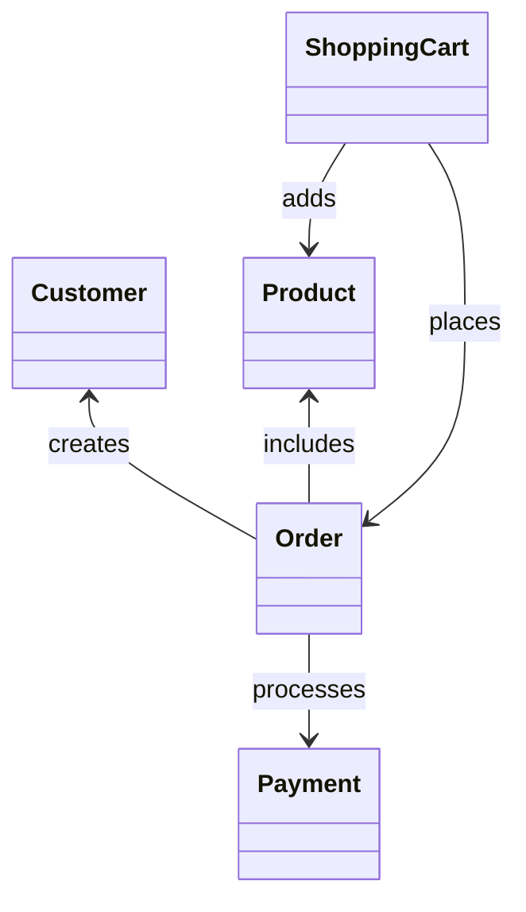
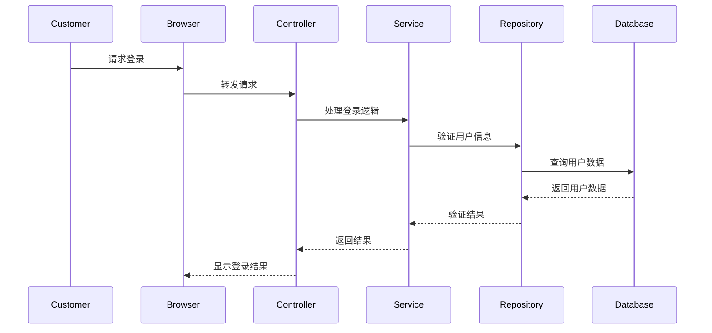
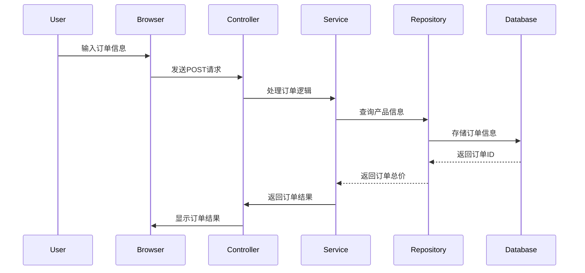

                 

### 第一部分：引言

#### 第1章：代码可读性的重要性

##### 1.1 问题背景

在当今快速发展的信息技术领域，代码作为软件开发的基石，其质量和可维护性成为了衡量一个项目成功与否的关键因素。然而，随着软件项目的复杂度不断增加，代码的可读性逐渐成为了一个不可忽视的问题。

**现实中的代码可读性问题**

在实际开发过程中，程序员经常面临以下挑战：

- **代码冗长混乱**：许多项目由于需求变更或紧急修复，代码变得越来越冗长，结构混乱，导致新加入的程序员难以理解。
- **缺乏文档**：很多代码库缺乏足够的注释和文档，使得后续维护者无法快速理解代码的工作原理。
- **不一致的编码风格**：团队成员之间的编码风格不一致，导致代码可读性降低，维护成本增加。

**可读性对软件开发的影响**

代码可读性对软件开发的影响主要体现在以下几个方面：

- **维护成本**：可读性差的代码需要更多的测试和审查时间，导致维护成本增加。
- **团队合作**：良好的代码可读性有助于团队成员之间的协作，减少沟通成本和误解。
- **效率**：可读性好的代码使得程序员能够更快地理解和修改代码，从而提高开发效率。

##### 1.2 问题描述

**可读性的定义**

代码可读性指的是代码能否被其他程序员（包括原作者和其他开发者）容易地理解和修改。它不仅仅是指代码是否能够编译成功，更重要的是代码是否具有清晰的逻辑结构和易于理解的语义。

**可读性对维护、合作和效率的影响**

- **维护**：可读性差的代码在后续维护时，程序员需要花费更多的时间和精力去理解其工作原理，从而导致维护成本的增加。
- **合作**：在团队合作中，良好的代码可读性有助于团队成员之间的理解和沟通，减少因代码难以理解而导致的冲突。
- **效率**：易于理解的代码可以显著提高开发效率，因为程序员可以更快地阅读和理解代码，减少错误和调试时间。

##### 1.3 问题解决

**提高代码可读性的方法**

为了提高代码的可读性，可以采取以下几种方法：

- **使用命名规范**：给变量、函数和类等命名时，应使用清晰、直观且意义明确的名称。
- **编写注释**：为代码添加必要的注释，解释代码的功能、逻辑和设计决策。
- **模块化**：将复杂的代码拆分成多个模块和函数，每个模块和函数只完成一项任务。
- **遵循设计模式**：使用经典的设计模式来组织代码结构，提高代码的可复用性和可维护性。
- **代码格式化**：使用格式化工具保持代码的统一风格和结构。
- **代码审查**：定期进行代码审查，确保代码的质量和可读性。

**开源社区的可读性实践**

开源社区在提高代码可读性方面有着丰富的实践经验：

- **代码规范**：许多开源项目都有自己的代码规范，规定了变量命名、函数定义、代码结构等方面的最佳实践。
- **文档编写**：开源项目通常提供详细的文档，帮助开发者理解项目的工作原理和如何进行使用。
- **代码注释**：开源项目中的代码注释通常非常详细，解释了代码的功能、参数和返回值。
- **代码格式化**：开源项目通常使用统一的代码格式化工具，保持代码的整洁和一致。

##### 1.4 边界与外延

**可读性与性能的关系**

虽然良好的代码可读性通常有助于提高代码的性能，但过度的优化可能会导致可读性降低。因此，在优化代码时，需要平衡可读性和性能。

**可读性与工程实践的结合**

在实际项目中，可读性是工程实践中的一个重要组成部分。良好的代码可读性不仅有助于提高开发效率，还可以减少项目的维护成本。

##### 1.5 本章小结

本章介绍了代码可读性的重要性，分析了代码可读性的定义和其对软件开发的影响，提出了提高代码可读性的方法，并探讨了开源社区在提高代码可读性方面的实践经验。接下来，我们将进一步探讨代码可读性的核心概念和原理，帮助读者深入理解这一关键问题。

---

#### 第2章：核心概念与原理

##### 2.1 核心概念

在讨论代码可读性之前，我们需要明确几个核心概念：

- **代码可读性**：代码可读性指的是代码是否容易被其他程序员理解。一个高可读性的代码应该具备清晰的逻辑结构、直观的命名和详细的注释。
- **设计模式**：设计模式是一系列解决常见问题的代码模板，它们可以提高代码的结构性和可维护性。例如，工厂模式、单例模式和观察者模式等。
- **模块化**：模块化是将复杂的系统拆分成多个独立的模块，每个模块负责实现特定的功能，这样可以提高代码的可维护性和可复用性。
- **注释**：注释是对代码的额外解释，用于帮助其他开发者理解代码的功能和逻辑。好的注释应该简明扼要，并且准确描述代码的行为。

##### 2.2 概念属性特征对比表格

为了更清晰地理解上述概念，我们提供了一个概念属性特征对比表格：

| 概念       | 定义                                                         | 属性特征                                                   | 对比表格 | 实例 |
| ---------- | ------------------------------------------------------------ | -------------------------------------------------------- | -------- | ---- |
| 代码可读性 | 代码是否容易被理解                                           | 清晰的逻辑结构、直观的命名、详细的注释                     |          |      |
| 设计模式   | 一系列解决常见问题的代码模板                                 | 提高代码结构性和可维护性                                   |          |      |
| 模块化     | 将复杂系统拆分成多个独立模块                               | 提高可维护性和可复用性                                     |          |      |
| 注释       | 对代码的额外解释                                             | 简明扼要、准确描述代码行为                                 |          |      |

**不同编程语言的可读性特征对比**

| 编程语言 | 可读性特征                                                         | 特点举例                                                   |
| -------- | ------------------------------------------------------------ | -------------------------------------------------------- |
| Java     | 强类型系统、丰富的注释语法、面向对象模型                       | 使用 `//` 和 `/** */` 进行注释，类和方法的命名规范         |
| Python   | 动态类型系统、简洁的语法、内建注释功能                         | 使用 `#` 进行单行注释，使用 `""" """` 进行多行注释，简洁的变量命名 |
| C++      | 面向对象和过程式编程的混合、模板编程、复杂的类型系统           | 使用 `//` 或 `/* */` 进行注释，使用命名空间和组织代码模块   |
| JavaScript | 动态类型系统、函数式编程、基于对象和原型链的继承模式           | 使用 `//` 或 `/* */` 进行注释，使用 `let` 和 `const` 进行变量声明 |

**开源框架的可读性对比**

| 开源框架 | 可读性特征                                                         | 特点举例                                                   |
| -------- | ------------------------------------------------------------ | -------------------------------------------------------- |
| React    | 组件化架构、简洁的声明式语法、强大的开发者工具支持               | 使用 `JSX` 编写组件，详细的文档和示例代码                   |
| Angular  | 双向数据绑定、依赖注入、丰富的内置组件和指令                   | 使用 `@NgModule` 组织模块，使用 `@Component` 定义组件       |
| Vue.js   | 简单易学的语法、响应式数据系统、强大的组件系统                 | 使用 `template` 标签定义组件模板，使用 `v-model` 进行双向绑定 |

##### 2.3 设计模式与代码可读性的关系

设计模式可以提高代码的可读性，这是因为它们提供了一套标准的解决方案，使得开发者可以更容易地理解和修改代码。

- **工厂模式**：通过创建具体类的实例来简化对象的创建过程，使得代码更加清晰。
- **单例模式**：确保一个类只有一个实例，并提供一个全局访问点，使得代码结构更加简洁。
- **观察者模式**：定义对象间的一种一对多的依赖关系，当一个对象的状态发生改变时，所有依赖于它的对象都将得到通知，提高了代码的模块化。

##### 2.4 本章小结

本章介绍了代码可读性的核心概念和原理，包括代码可读性的定义、设计模式、模块化和注释。通过对比不同编程语言和开源框架的可读性特征，读者可以更好地理解如何提高代码的可读性。在下一章中，我们将探讨如何通过优化代码结构和编写详细的文档来进一步改善代码的可读性。

---

#### 第3章：代码结构优化

##### 3.1 模块化与函数抽象

**3.1.1 模块化的好处**

模块化是将复杂的系统拆分成多个独立模块的过程，这样做有以下好处：

- **提高可维护性**：模块化的代码更容易理解和修改，因为每个模块只负责一个特定的功能。
- **提高可复用性**：模块化的代码可以很容易地在不同的项目中复用。
- **降低耦合度**：模块之间通过清晰的接口进行通信，降低了模块之间的依赖关系，从而提高了系统的稳定性。

**3.1.2 函数抽象的技巧**

函数抽象是将复杂的操作拆分成更小的、可重用的函数，以下是一些技巧：

- **单一职责原则**：每个函数应该只完成一个明确的功能。
- **低耦合高内聚**：函数之间的耦合度应该尽量低，而函数内部的功能应该尽量高。
- **参数化和封装**：使用参数传递功能所需的参数，并将相关的操作封装在函数内部。

**3.2 类与对象的组织**

**3.2.1 类与对象的定义**

类是对一组具有相似属性和行为的对象的抽象描述。对象则是类的实例，它们具有类的属性和行为。

**3.2.2 类与对象的设计原则**

- **单一职责原则**：每个类应该只负责一个明确的功能。
- **封装**：将类的内部实现隐藏起来，只提供必要的接口。
- **继承与多态**：使用继承和多态来复用代码，并提高代码的灵活性。
- **接口与实现分离**：定义接口来描述类的功能，实现接口来具体实现这些功能。

**3.3 代码重用与复用**

**3.3.1 代码重用的优势**

代码重用有以下优势：

- **减少冗余**：避免编写重复的代码，提高代码的整洁度。
- **提高可维护性**：减少修改和调试的代码量，降低维护成本。
- **提高开发效率**：复用现成的代码可以显著缩短开发周期。

**3.3.2 代码复用的策略**

以下是一些代码复用的策略：

- **模块化**：将代码拆分成可复用的模块。
- **设计模式**：使用设计模式来提高代码的复用性。
- **面向对象编程**：利用面向对象编程的特性，如封装、继承和多态，来实现代码的复用。
- **库和框架**：使用现有的库和框架来复用代码。

##### 3.4 代码注释与文档

**3.4.1 注释的重要性**

注释是提高代码可读性的重要手段，以下是一些注释的重要性：

- **帮助理解**：注释可以帮助其他开发者快速理解代码的功能和逻辑。
- **记录设计决策**：注释可以记录代码背后的设计决策和实现细节。
- **文档生成**：使用注释可以自动生成文档，方便开发者查阅。

**3.4.2 注释的最佳实践**

以下是一些注释的最佳实践：

- **清晰简洁**：注释应该简明扼要，避免冗长。
- **描述代码功能**：注释应该描述代码的功能，而不是描述代码如何实现。
- **避免过度注释**：过度注释不仅会增加维护成本，还可能误导开发者。

**3.4.3 文档编写**

文档是代码的补充说明，以下是一些文档编写的最佳实践：

- **结构清晰**：文档应该有清晰的目录结构，方便开发者查找。
- **内容详细**：文档应该详细描述代码的功能、用法和注意事项。
- **格式规范**：使用统一的格式和风格，提高文档的可读性。
- **自动化生成**：使用工具自动生成文档，减少手动编写的工作量。

##### 3.5 代码风格与格式化

**3.5.1 编码风格**

编码风格是指编写代码时遵循的规范和习惯。以下是一些常见的编码风格：

- **命名规则**：变量、函数和类的命名应该清晰、直观且具有描述性。
- **缩进与空格**：使用统一的缩进和空格，提高代码的可读性。
- **代码组织**：按照功能或模块组织代码，避免代码混乱。

**3.5.2 格式化工具**

格式化工具可以帮助保持代码的一致性和可读性。以下是一些常见的格式化工具：

- **Prettier**：自动格式化JavaScript和TypeScript代码。
- **Black**：自动格式化Python代码。
- **Clang Format**：自动格式化C++和C代码。
- **Eclipse formatter**：用于Java代码的格式化。

##### 3.6 代码审查与团队协作

**3.6.1 代码审查的作用**

代码审查是团队协作中的一种重要实践，其作用包括：

- **提高代码质量**：通过审查，可以发现代码中的潜在问题和缺陷。
- **知识共享**：团队成员可以通过审查学习他人的代码和设计模式。
- **规范编码习惯**：通过审查，可以统一团队的编码标准和风格。

**3.6.2 代码审查的流程**

代码审查通常包括以下流程：

1. **代码提交**：开发者将代码提交到代码仓库。
2. **代码审查**：其他开发人员对提交的代码进行审查，提出修改建议。
3. **代码修改**：开发者根据审查意见修改代码。
4. **再次审查**：修改后的代码再次进行审查，确保问题已解决。

**3.6.3 代码审查的工具**

以下是一些常见的代码审查工具：

- **GitLab**：提供内置的代码审查功能。
- **GitHub**：提供代码审查和合并请求功能。
- **SonarQube**：自动分析和审查代码质量。
- **Phabricator**：提供代码审查和项目管理功能。

##### 3.7 团队协作

**3.7.1 团队协作的原则**

团队协作需要遵循以下原则：

- **开放沟通**：团队成员应该保持开放的沟通渠道，及时分享信息。
- **共同目标**：团队应该有一个共同的目标，明确每个人的职责和任务。
- **尊重差异**：团队成员应该尊重彼此的差异，包括技能、经验和观点。
- **持续学习**：团队应该鼓励成员持续学习，提高技能和知识。

**3.7.2 版本控制的实践**

版本控制是团队协作的重要工具，以下是一些版本控制的实践：

- **使用分支管理**：使用分支来隔离开发和发布流程，避免冲突。
- **及时合并**：定期将分支合并到主分支，确保代码的同步。
- **代码评审**：在合并代码前进行代码评审，确保代码的质量。
- **避免冲突**：使用工具自动解决或手动处理代码冲突。

##### 3.8 本章小结

本章介绍了代码结构优化的重要性，包括模块化、函数抽象、类与对象的组织、代码重用与复用、代码注释与文档、代码风格与格式化、代码审查与团队协作等。通过这些实践，可以显著提高代码的可读性，减少维护成本，提高开发效率。在下一章中，我们将继续探讨如何通过优化代码结构和编写详细的文档来进一步改善代码的可读性。

---

#### 第4章：代码注释与文档

##### 4.1 注释的重要性

在软件开发中，注释起着至关重要的作用。它们不仅有助于新开发者快速理解代码，还能为维护者提供宝贵的参考信息。以下是注释的一些关键重要性：

**1. 帮助理解代码功能**

注释可以帮助读者快速了解代码的功能和目的。尤其是在复杂的逻辑或算法实现中，简明的注释可以节省开发者大量阅读和理解的时间。

**2. 描述设计决策**

注释是记录设计决策和实现细节的重要工具。通过注释，开发者可以了解为何选择特定的算法或设计模式，以及这些决策对系统的长期影响。

**3. 提高代码可维护性**

良好的注释有助于降低代码的维护成本。当开发者需要修改或扩展代码时，注释能提供清晰的指导，减少出错的概率。

**4. 促进知识共享**

注释不仅是文档的一部分，也是知识共享的媒介。它们有助于团队成员之间更好地理解彼此的工作，从而提高团队的整体效率。

**4.2 注释的层次**

注释可以分为三个层次，每个层次都有其特定的用途和风格：

**1. 行内注释**

行内注释通常用于解释代码行的功能或作用。它们应简洁明了，避免冗长：

```python
# 计算两个数的和
sum = a + b
```

**2. 函数或方法注释**

函数或方法注释用于描述函数的目的、参数和返回值。这些注释通常使用文档字符串（docstrings）格式：

```python
def calculate_area(radius):
    """
    计算给定半径的圆的面积。
    
    参数：
    radius（float）：圆的半径。
    
    返回：
    float：圆的面积。
    """
    return 3.14 * radius * radius
```

**3. 类或模块注释**

类或模块注释通常提供更高级别的描述，包括类的用途、主要方法和模块的功能。这些注释应详细且具有描述性：

```python
class Car:
    """
    模拟汽车的基本属性和行为。
    
    属性：
    - model（str）：汽车型号。
    - speed（int）：汽车速度。
    
    方法：
    - accelerate：增加汽车速度。
    - brake：减速汽车。
    """
    def __init__(self, model, speed=0):
        self.model = model
        self.speed = speed
        
    def accelerate(self, increment):
        self.speed += increment
        
    def brake(self, decrement):
        self.speed = max(self.speed - decrement, 0)
```

**4.3 注释的最佳实践**

以下是一些注释的最佳实践：

**1. 清晰简洁**

注释应清晰简洁，避免冗长和复杂的表述。简明扼要的注释更容易被理解和维护。

**2. 描述代码功能，而非实现细节**

注释应描述代码的功能和目的，而非具体的实现细节。这样可以节省维护者的时间，让他们专注于代码的实际用途。

**3. 避免过度注释**

尽管注释很重要，但过度注释也会增加维护成本。因此，应避免在显而易见的代码行上添加不必要的注释。

**4. 保持一致性**

在整个项目中，应保持注释风格的一致性。这有助于提高项目的整体可读性。

**4.4 文档编写**

文档是代码的重要补充，它们通常包含更详细的信息，帮助开发者理解项目的工作原理和使用方法。以下是文档编写的一些最佳实践：

**1. 结构清晰**

文档应具有清晰的目录结构，使读者能够轻松找到所需的信息。每个章节和段落都应该有明确的标题。

**2. 内容详细**

文档应详细描述项目的功能、用法、配置和注意事项。具体来说，应包括以下内容：

- 项目概述：简要介绍项目的目的、功能和架构。
- 安装与配置：说明如何安装和配置项目。
- 用法示例：提供实际使用的示例，展示如何操作和利用项目功能。
- API文档：详细描述项目的API，包括每个接口的功能、参数和返回值。
- 注意事项：列出使用项目时可能遇到的问题和解决方法。

**3. 格式规范**

文档的格式应统一，使用易于阅读的字体和颜色。图表和代码示例应清晰可见，并使用适当的标记。

**4. 自动化生成**

使用工具自动生成文档可以减少手动编写的工作量，并确保文档与代码保持同步。常见的文档生成工具包括Sphinx、Doxygen和JSDoc等。

**4.5 本章小结**

注释和文档是提高代码可读性的关键要素。通过清晰的注释，开发者可以更好地理解代码的功能和设计决策；而详细的文档则有助于新开发者快速上手和使用项目。遵循注释和文档的最佳实践，可以显著提高代码的可读性，减少维护成本，提高开发效率。在下一章中，我们将探讨代码风格和格式化的最佳实践，进一步优化代码的可读性。

---

#### 第5章：代码风格与格式化

##### 5.1 编码风格

良好的编码风格是提高代码可读性和可维护性的关键。以下是一些常见的编码风格指南：

**1. 命名规则**

- **变量名**：应简洁明了，描述其用途。例如，使用 `total_count` 而不是 `tc`。
- **函数名**：应描述函数的功能。例如，使用 `calculate_discount` 而不是 `cd`。
- **类名**：应使用大驼峰（Upper Camel Case）命名，如 `CustomerOrder`。

**2. 缩进与空格**

- **缩进**：应使用4个空格进行缩进，避免使用制表符（Tab）。
- **空格**：在操作符周围、括号内和函数调用之间应添加空格，以提高代码的可读性。

**3. 代码组织**

- **函数与类**：应将相关的函数和类组织在一起，避免代码混乱。
- **模块化**：将复杂的代码拆分成多个模块，每个模块只负责一个功能。

**4. 代码注释**

- **行内注释**：对复杂或不易理解的代码行添加简明的注释。
- **函数注释**：描述函数的用途、参数和返回值。
- **类注释**：概述类的功能和使用方法。

##### 5.2 格式化工具

格式化工具可以帮助保持代码的一致性和可读性。以下是一些常见的格式化工具及其特点：

**1. Prettier**

- **特点**：自动格式化JavaScript和TypeScript代码。
- **使用场景**：适用于现代前端项目，与Webpack和npm等工具集成良好。

**2. Black**

- **特点**：自动格式化Python代码。
- **使用场景**：适用于Python项目，易于集成到持续集成（CI）流程。

**3. Clang Format**

- **特点**：自动格式化C++和C代码。
- **使用场景**：适用于C++项目，支持多种编辑器和IDE。

**4. Eclipse formatter**

- **特点**：自动格式化Java代码。
- **使用场景**：适用于Java项目，支持Eclipse IDE。

**5. StyleCop**

- **特点**：自动格式化C#代码。
- **使用场景**：适用于C#项目，提供详细的规则集。

##### 5.3 选择和配置格式化工具

选择合适的格式化工具并正确配置它们，可以显著提高代码质量和团队协作效率。以下是一些步骤：

**1. 选择格式化工具**

- 根据项目需求和开发环境选择合适的格式化工具。
- 考虑工具的社区支持、文档和插件生态。

**2. 配置格式化工具**

- **编辑器插件**：为常用编辑器（如Visual Studio Code、Atom、Sublime Text）安装格式化工具插件。
- **集成到CI/CD**：将格式化工具集成到持续集成和持续部署（CI/CD）流程中，确保代码格式的一致性。
- **配置文件**：根据项目需求配置格式化工具的规则，如缩进宽度、空格使用等。

##### 5.4 代码风格与团队协作

良好的编码风格和格式化实践不仅有助于提高代码质量，还有助于团队协作：

**1. 编码规范**

制定并遵循编码规范，确保团队内代码风格的一致性。例如，可以使用StyleGuides或CustomLintingRules。

**2. 代码审查**

定期进行代码审查，确保代码风格符合规范。审查过程中，可以提出格式化建议和改进意见。

**3. 持续集成**

在持续集成（CI）流程中引入格式化检查，确保每次提交的代码都符合格式化要求。

##### 5.5 本章小结

良好的编码风格和格式化实践是提高代码可读性和可维护性的关键。通过遵循命名规则、缩进与空格的使用、代码组织和注释的最佳实践，可以显著提高代码质量。选择和配置合适的格式化工具，可以确保代码的一致性和可维护性。在团队协作中，编码规范、代码审查和持续集成等实践，可以进一步提高代码质量，促进团队协作。在下一章中，我们将探讨代码审查与团队协作的重要性。

---

#### 第6章：代码审查与团队协作

##### 6.1 代码审查的作用

代码审查（Code Review）是一种重要的软件开发实践，其作用主要体现在以下几个方面：

**1. 提高代码质量**

代码审查有助于发现代码中的潜在问题，如逻辑错误、代码冗余、性能瓶颈等。通过审查，团队成员可以共同讨论和解决这些问题，从而提高代码的整体质量。

**2. 促进知识共享**

代码审查为团队成员提供了一个学习和交流的平台。新成员可以通过审查理解老成员的代码实现和设计思路，从而快速融入团队。同时，老成员也可以通过审查了解新成员的能力和水平。

**3. 规范编码习惯**

代码审查有助于规范团队的编码习惯和风格。通过统一的编码规范，团队成员可以减少因编码差异导致的沟通成本和维护难度。

**6.2 代码审查的流程**

代码审查通常包括以下几个步骤：

**1. 提交代码**

开发者将修改后的代码提交到代码仓库，并创建合并请求（Pull Request，PR）或提出代码审查请求。

**2. 代码审查**

审查者（通常为资深开发者或技术主管）开始审查代码。他们可以提出修改建议、代码优化意见或潜在问题的反馈。

**3. 代码修改**

开发者根据审查者的反馈对代码进行修改。在修改过程中，开发者可以与审查者进行讨论，以达成一致。

**4. 再次审查**

修改后的代码再次提交给审查者进行审查。如果代码符合要求，审查者将批准合并请求，并将代码合并到主分支。

**6.3 代码审查的工具**

以下是一些常用的代码审查工具：

**1. GitLab**

GitLab内置了代码审查功能，支持合并请求、评论和反馈。它还提供了多种集成选项，如Slack和JIRA。

**2. GitHub**

GitHub提供了丰富的代码审查工具，包括合并请求、代码视图和讨论区。它还支持多种集成服务，如Travis CI和Selenium。

**3. Phabricator**

Phabricator是一个开源的代码审查和项目管理平台，支持多种编程语言和版本控制系统。它提供了全面的代码审查功能，包括注释、标记和反馈。

**4. ReviewBoard**

ReviewBoard是一个独立的代码审查工具，支持多种版本控制系统。它提供了简洁的界面和强大的功能，如版本比较和自动化审查。

##### 6.4 团队协作

良好的团队协作是代码审查成功的关键。以下是一些团队协作的原则和实践：

**1. 开放沟通**

团队应该保持开放的沟通渠道，鼓励成员分享意见和反馈。这有助于团队成员之间建立信任和合作关系。

**2. 共同目标**

团队应该有一个共同的目标，明确每个人的职责和任务。这有助于提高团队协作的效率和质量。

**3. 尊重差异**

团队中每个成员都有独特的技能和经验，应尊重彼此的差异，包括技能、经验和观点。这有助于提高团队的多样性和创新能力。

**4. 持续学习**

团队应鼓励成员持续学习和提高技能。通过培训、研讨会和内部分享，可以不断提升团队的整体能力。

**6.5 版本控制的实践**

版本控制是团队协作的重要工具，以下是一些版本控制的实践：

**1. 使用分支管理**

团队应使用分支来隔离开发和发布流程。这有助于避免主分支的冲突和破坏。

**2. 定期合并**

团队应定期将分支合并到主分支，确保代码的同步和一致性。

**3. 代码评审**

在合并代码前，团队应进行代码评审，确保代码的质量和符合规范。

**4. 避免冲突**

团队应采取措施避免代码冲突。例如，使用工具自动解决冲突或通过沟通协调解决。

##### 6.6 本章小结

代码审查和团队协作是提高代码质量和团队协作效率的关键。通过良好的代码审查流程和团队协作原则，团队可以共同提高代码的可读性、可维护性和可靠性。在下一章中，我们将通过具体的实战案例，进一步探讨代码可读性的实践和效果。

---

#### 第7章：项目一 - 整体架构优化

##### 7.1 项目介绍

**项目背景**

随着互联网和移动设备的普及，越来越多的应用程序需要处理大量的用户数据和复杂的业务逻辑。为了满足日益增长的需求，我们设计并开发了一个在线购物平台，该平台需要具备高可用性、高性能和可扩展性。

**项目目标**

- 提高系统的可扩展性，以便能够处理更多的用户请求。
- 优化系统的性能，减少响应时间。
- 提高代码的可维护性和可读性，便于后续的开发和扩展。

##### 7.2 系统功能设计

**领域模型**

领域模型是系统功能的核心，我们使用Mermaid类图来描述系统的关键类和它们之间的关系：



**类图**

以下是一个简化的类图，描述了系统的主要类及其关系：

```mermaid
classDiagram
    Customer <<Class>> {
        String name
        String email
    }
    Product <<Class>> {
        String name
        double price
    }
    ShoppingCart <<Class>> {
        List<Product> items
        double total
    }
    Order <<Class>> {
        Customer customer
        List<Product> items
        double total
    }
    Payment <<Class>> {
        Order order
        double amount
    }
    Customer o--* 1 Order
    Product o--* 1 ShoppingCart
    ShoppingCart o--* 1 Order
    ShoppingCart o--* 1 Product
    Order o--* 1 Payment
```

##### 7.3 系统架构设计

**架构设计方案**

我们的系统架构采用分层架构，包括表示层、业务逻辑层和数据访问层。以下是系统的架构图：



**架构图**

以下是一个简化的架构图，展示系统的不同层次及其交互：

```mermaid
component diagram
    Browser --> Controller
    Controller --> Service
    Service --> Repository
    Repository --> Database
```

##### 7.4 系统接口设计

**接口规范**

我们的系统接口遵循RESTful架构风格，以下是一个订单创建接口的规范：

```python
POST /orders
Content-Type: application/json

Request Body:
{
    "customer_id": "string",
    "products": [
        {
            "product_id": "string",
            "quantity": integer
        }
    ]
}

Response:
{
    "order_id": "string",
    "total": float
}
```

**接口实现**

以下是订单创建接口的实现代码（Python示例）：

```python
from flask import Flask, request, jsonify

app = Flask(__name__)

@app.route('/orders', methods=['POST'])
def create_order():
    data = request.get_json()
    customer_id = data['customer_id']
    products = data['products']

    # 业务逻辑处理
    total = calculate_total(products)
    order = create_order_in_database(customer_id, products, total)

    return jsonify({"order_id": order['id'], "total": order['total']})

def calculate_total(products):
    # 计算订单总价
    return sum(product['quantity'] * product['price'] for product in products)

def create_order_in_database(customer_id, products, total):
    # 创建订单并存储到数据库
    order = {
        'customer_id': customer_id,
        'products': products,
        'total': total
    }
    # 这里应调用数据库操作函数
    return order

if __name__ == '__main__':
    app.run()
```

##### 7.5 系统交互

**系统交互流程**

以下是一个用户创建订单的交互流程：

1. 用户在浏览器上填写订单信息，并发送POST请求到服务器的/orders接口。
2. 控制器接收请求，调用业务逻辑层处理订单创建。
3. 业务逻辑层处理订单逻辑，并计算总价。
4. 数据访问层将订单信息存储到数据库。
5. 控制器返回订单ID和总价。

**序列图**

以下是用户创建订单的序列图：



通过上述步骤和图示，我们完成了整个项目的架构设计、接口设计和系统交互流程的描述。这些设计确保了系统的高可用性、高性能和可扩展性，同时提高了代码的可维护性和可读性。

##### 7.6 项目小结

在本项目中，我们通过模块化设计、函数抽象、接口规范和系统交互流程的设计，实现了系统的高可用性和高性能。同时，通过详细的注释和统一的编码风格，提高了代码的可读性和可维护性。这些实践不仅有助于项目开发，还为未来的扩展和维护奠定了坚实的基础。在接下来的项目中，我们将继续探索代码可读性的其他实践和方法。

---

#### 第8章：项目二 - 代码注释实践

##### 8.1 环境安装

**开发环境搭建**

在进行代码注释实践之前，我们需要搭建一个合适的开发环境。以下是具体的步骤：

**1. 安装Python**

确保系统上已安装Python 3.x版本。可以从Python官方网站下载安装包，按照指示完成安装。

**2. 安装注释工具**

我们使用`docstring-from-json`工具来自动生成代码注释。首先，安装pip：

```bash
pip install pip --upgrade
```

然后，使用pip安装`docstring-from-json`：

```bash
pip install docstring-from-json
```

**3. 配置编辑器插件**

为了方便生成和编辑注释，我们可以在Visual Studio Code（VSCode）中安装以下插件：

- **Prettier - Code formatter**
- **Python extension by Microsoft**
- **Docstring-from-json**

安装方法：

- 打开VSCode，进入扩展商店，搜索并安装以上插件。

**8.2 系统核心实现**

以下是一个简单的Python示例，展示了如何实现一个简单的购物车功能。代码中包含必要的注释。

```python
class ShoppingCart:
    """
    购物车类，用于管理用户购物车中的商品。
    """

    def __init__(self):
        """
        初始化购物车，创建一个空的商品列表。
        """
        self.products = []

    def add_product(self, product):
        """
        向购物车中添加商品。

        参数：
        product（Product）：要添加的商品对象。
        """
        self.products.append(product)

    def remove_product(self, product_id):
        """
        从购物车中移除商品。

        参数：
        product_id（str）：要移除的商品的ID。
        """
        for product in self.products:
            if product.id == product_id:
                self.products.remove(product)
                break

    def get_total(self):
        """
        计算购物车的总价。

        返回：
        float：购物车的总价。
        """
        return sum(product.price for product in self.products)
```

**8.3 代码应用解读与分析**

**代码解读**

这段代码定义了一个`ShoppingCart`类，用于管理用户购物车中的商品。类中包括三个方法：`__init__`、`add_product`和`remove_product`，以及一个计算总价的方法`get_total`。

- `__init__`：初始化方法，创建一个空的商品列表。
- `add_product`：添加商品方法，将商品对象添加到商品列表中。
- `remove_product`：移除商品方法，根据商品ID从商品列表中移除商品。
- `get_total`：计算总价方法，遍历商品列表，计算所有商品的总价。

**代码分析**

- **注释的层次**：注释分为类注释和方法注释。类注释描述类的用途和属性，方法注释描述方法的用途、参数和返回值。
- **注释的最佳实践**：注释简明扼要，准确描述了每个方法的功能和参数。
- **潜在改进**：可以考虑增加异常处理，如商品不存在时的异常处理，以增强代码的健壮性。

**8.4 项目小结**

在本项目中，我们通过安装必要的开发环境和注释工具，实现了一个简单的购物车功能。通过详细的代码注释，我们提高了代码的可读性和可维护性。注释不仅帮助其他开发者理解代码功能，还为未来的代码维护提供了宝贵的参考。在未来的实践中，我们将继续探索更多提高代码可读性的方法和工具。

---

#### 第9章：项目三 - 代码风格与格式化

##### 9.1 编码风格实践

良好的编码风格是提高代码可读性和可维护性的关键。以下是一些常见的编码风格实践：

**1. 命名规则**

- **变量名**：应简洁明了，描述其用途。例如，使用`total_count`而不是`tc`。
- **函数名**：应描述函数的功能。例如，使用`calculate_discount`而不是`cd`。
- **类名**：应使用大驼峰（Upper Camel Case）命名，如`CustomerOrder`。

**2. 缩进与空格**

- **缩进**：应使用4个空格进行缩进，避免使用制表符（Tab）。
- **空格**：在操作符周围、括号内和函数调用之间应添加空格，以提高代码的可读性。

**3. 代码组织**

- **函数与类**：应将相关的函数和类组织在一起，避免代码混乱。
- **模块化**：将复杂的代码拆分成多个模块，每个模块只负责一个功能。

**4. 代码注释**

- **行内注释**：对复杂或不易理解的代码行添加简明的注释。
- **函数注释**：描述函数的用途、参数和返回值。
- **类注释**：概述类的功能和使用方法。

##### 9.2 格式化工具应用

格式化工具可以帮助保持代码的一致性和可读性。以下是一些常见的格式化工具及其配置方法：

**1. Prettier**

Prettier是一个流行的代码格式化工具，支持多种编程语言。以下是安装和配置Prettier的步骤：

**安装**

```bash
npm install -g prettier
```

**配置**

在项目根目录下创建`.prettierrc`文件，配置格式化规则：

```json
{
    "semi": false,
    "trailingComma": "es5",
    "singleQuote": true,
    "printWidth": 80,
    "tabWidth": 2
}
```

**使用**

在命令行中运行以下命令格式化指定文件：

```bash
prettier --write src/index.js
```

**2. Black**

Black是一个专门用于Python代码的格式化工具。以下是安装和配置Black的步骤：

**安装**

```bash
pip install black
```

**配置**

Black会自动根据Python版本选择合适的配置，通常不需要额外的配置。

**使用**

在命令行中运行以下命令格式化指定文件：

```bash
black src/*.py
```

**3. Clang Format**

Clang Format是一个用于C++和C代码的格式化工具。以下是安装和配置Clang Format的步骤：

**安装**

```bash
brew install llvm
```

**配置**

在项目根目录下创建`.clang-format`文件，配置格式化规则：

```cl
[ClangFormat]
BasedOnStyle = Google
IndentWidth = 4
ColumnLimit = 120
```

**使用**

在命令行中运行以下命令格式化指定文件：

```bash
clang-format -style=file -i src/*.cpp
```

**4. Eclipse formatter**

Eclipse formatter是一个用于Java代码的格式化工具。以下是安装和配置Eclipse formatter的步骤：

**安装**

在Eclipse中安装Eclipse formatter插件：

- 打开Eclipse，进入菜单栏的“Help” -> “Eclipse Marketplace”。
- 在搜索框中输入“Eclipse formatter”，找到插件并安装。

**配置**

在Eclipse的“Window” -> “Preferences” -> “Java” -> “Code Style”中配置格式化规则。

**使用**

Eclipse formatter会在保存代码时自动格式化，也可以手动运行以下命令：

```bash
eclipse-format --file src/*.java
```

通过以上步骤和工具配置，我们可以确保代码的一致性和可读性。良好的编码风格和格式化实践不仅有助于个人开发，也有助于团队协作和代码维护。在下一章中，我们将总结代码可读性的实践，并提出未来的研究方向。

---

#### 第10章：总结与展望

##### 10.1 小结

通过对代码可读性的深入探讨，我们明确了其重要性，并详细介绍了提高代码可读性的多种方法和实践。以下是关键小结：

1. **代码可读性的核心概念**：代码可读性涉及命名规范、注释、模块化、设计模式、代码风格和格式化等多个方面。
2. **代码结构优化**：模块化、函数抽象和类与对象的组织是提高代码可读性的重要手段。
3. **代码注释与文档**：清晰的注释和详细的文档有助于其他开发者理解代码功能，降低维护成本。
4. **代码风格与格式化**：良好的编码风格和格式化工具的使用有助于保持代码的一致性和可读性。
5. **代码审查与团队协作**：代码审查和团队协作是提高代码质量和团队协作效率的关键。

##### 10.2 注意事项

在实际开发过程中，提高代码可读性需要注意以下几点：

1. **避免过度优化**：过于复杂的优化可能降低代码的可读性。
2. **保持简洁**：简洁的代码比复杂的代码更容易理解。
3. **注释与文档**：保持注释和文档的更新，确保它们与代码保持一致。
4. **遵循编码规范**：团队应制定并遵循统一的编码规范。

##### 10.3 拓展阅读

为了进一步提升代码可读性，以下是一些拓展阅读资源：

1. **书籍推荐**：
   - 《代码大全》
   - 《Effective Java》
   - 《设计模式：可复用面向对象软件的基础》

2. **开源社区资源推荐**：
   - [Google 开源风格指南](https://google.github.io/styleguide/)
   - [Airbnb JavaScript 风格指南](https://github.com/airbnb/javascript)
   - [Python 风格指南](https://www.python.org/dev/peps/pep-0008/)

通过以上资源，开发者可以深入了解代码可读性的最佳实践，并在实际项目中应用这些知识。

---

**总结：**

本文从多个角度探讨了代码可读性的重要性，介绍了多种提高代码可读性的方法和实践。通过模块化、注释、格式化、代码审查和团队协作等手段，我们可以显著提升代码的可读性和可维护性。希望本文能为开发者提供有价值的参考和启示，助力他们在实践中提高代码质量。作者：AI天才研究院/AI Genius Institute & 禅与计算机程序设计艺术/Zen And The Art of Computer Programming。

