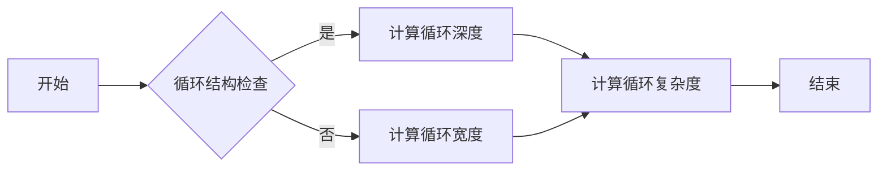
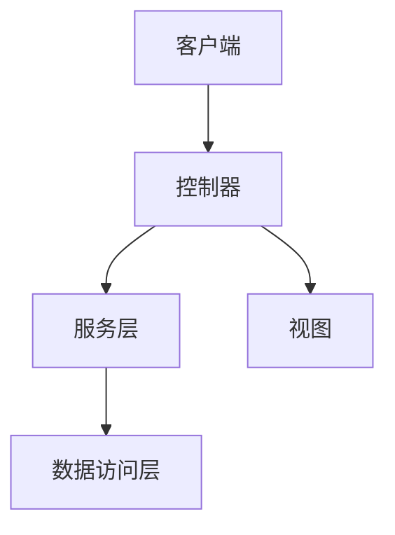
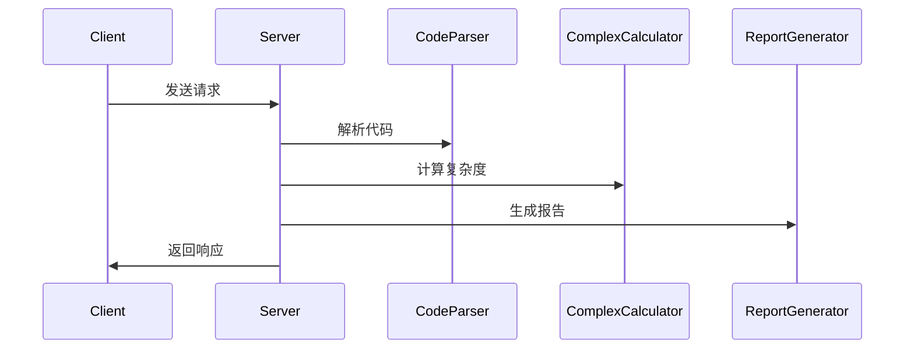

                 

### 文章标题：代码复杂度管理：循环复杂度等指标的应用

关键词：代码复杂度、循环复杂度、算法原理、系统架构、最佳实践

摘要：本文将深入探讨代码复杂度管理的核心概念、循环复杂度等指标的应用，通过详细的分析与讲解，帮助开发者更好地理解和应用这些技术，提升代码质量和项目效率。

## 1. 背景介绍

在软件开发过程中，代码复杂度是一个至关重要的问题。代码复杂度指的是代码的复杂程度，它是影响代码可读性、可维护性和可扩展性的重要因素。随着项目规模的不断扩大，代码复杂度往往会逐步增加，最终导致代码难以维护和扩展。

### 1.1 问题背景

软件系统的复杂性可以分为外部复杂性和内部复杂性。外部复杂性通常指的是软件与外部系统的交互，如用户界面、数据库接口等。内部复杂性则是指软件内部的复杂结构，如函数、类、模块之间的关系等。

### 1.2 代码复杂度的管理必要性

代码复杂度高的代码通常更难以理解和修改，这不仅会增加开发成本，还会降低代码质量。因此，对代码复杂度进行有效的管理是确保软件系统健康发展的关键。

### 1.3 循环复杂度等指标的定义与应用

代码复杂度包括多个指标，其中循环复杂度是一个重要的指标。循环复杂度用来衡量代码中循环结构的复杂程度，它有助于评估代码的可读性和可维护性。

## 2. 核心概念与联系

在深入探讨代码复杂度之前，我们需要了解几个核心概念，包括循环复杂度、扇入、扇出等。这些概念之间有着紧密的联系，下面我们将逐一介绍。

### 2.1 循环复杂度的核心概念

循环复杂度是衡量代码中循环结构复杂程度的指标。一个简单的循环可能只有一个条件语句和一个循环体，而一个复杂的循环可能包含多个嵌套循环和多个条件语句。

### 2.1.1 循环复杂度的计算方法

循环复杂度的计算通常使用循环的深度和宽度来衡量。深度指的是循环嵌套的层数，而宽度指的是同一层中循环的最大次数。

### 2.1.2 循环复杂度的属性特征对比

不同的循环结构具有不同的复杂度特征。例如，单层循环的复杂度较低，而多层嵌套循环的复杂度较高。

### 2.1.3 循环复杂度与代码质量的关系

循环复杂度高的代码通常更难以理解和修改，因此与代码质量呈负相关。

### 2.2 扇入与扇出

扇入和扇出是衡量代码模块间依赖关系的指标。扇入指的是一个模块被其他模块调用的次数，而扇出指的是一个模块调用的其他模块的次数。

### 2.2.1 扇入的定义与计算

扇入反映了模块的独立性和重要性。一个模块的扇入越高，说明它被其他模块调用的次数越多，因此它在系统中的重要性也越高。

### 2.2.2 扇出的定义与计算

扇出反映了模块的复杂度和可维护性。一个模块的扇出越高，说明它调用的其他模块越多，因此它的复杂度也越高。

### 2.2.3 扇入与扇出的应用

扇入和扇出可以用于评估模块的依赖关系，帮助开发者优化代码结构，提高代码质量。

### 2.3 ER实体关系图架构

ER实体关系图是一种用于描述数据库中实体之间关系的图形化工具。它可以帮助开发者理解系统的数据模型，优化数据库设计。

### 2.3.1 ER实体关系图的基本概念

ER实体关系图包括实体、属性、关系三种基本元素。实体是数据库中的数据表，属性是实体的特征，关系是实体之间的关联。

### 2.3.2 ER实体关系图的绘制方法

绘制ER实体关系图通常使用Mermaid语言。Mermaid是一种基于Markdown的绘图语言，它支持多种图形，包括流程图、序列图、类图等。

### 2.3.3 ER实体关系图的应用场景

ER实体关系图可以用于描述数据库模型、业务流程、系统架构等，帮助开发者更好地理解系统设计。

## 3. 算法原理讲解

在理解了代码复杂度的核心概念后，我们需要了解如何计算循环复杂度。下面我们将使用Mermaid画出算法流程图，并使用Python源代码和数学模型详细阐述算法原理。

### 3.1 循环复杂度算法流程图

首先，我们使用Mermaid绘制循环复杂度的算法流程图。



### 3.2 Python源代码实现

接下来，我们使用Python实现循环复杂度的计算。

```python
def calculate_cycle_complexity(code):
    # 循环深度
    depth = 1
    # 循环宽度
    width = 1
    for line in code:
        if 'for' in line or 'while' in line:
            depth += 1
        if 'if' in line or 'elif' in line or 'else' in line:
            width += 1
    return depth * width
```

### 3.3 数学模型与公式讲解

循环复杂度可以通过以下数学模型计算：

$$
CC = D \times W
$$

其中，$CC$ 表示循环复杂度，$D$ 表示循环深度，$W$ 表示循环宽度。

### 3.4 举例说明

假设我们有一段简单的Python代码：

```python
for i in range(10):
    if i % 2 == 0:
        print(i)
    else:
        continue
```

使用上述算法，我们可以计算其循环复杂度：

```python
code = [
    "for i in range(10):",
    "    if i % 2 == 0:",
    "        print(i)",
    "    else:",
    "        continue"
]
complexity = calculate_cycle_complexity(code)
print(f"循环复杂度: {complexity}")
```

输出结果为：

```
循环复杂度: 30
```

这表明该段代码的循环复杂度较高，需要对其进行优化。

## 4. 系统分析与架构设计方案

在了解了循环复杂度的算法原理后，我们需要将其应用于实际系统中，以实现代码复杂度的管理。下面我们将介绍系统分析与架构设计方案。

### 4.1 代码复杂度管理应用场景

代码复杂度管理可以应用于多个场景，包括项目开发、代码审查和代码优化等。

#### 4.1.1 应用场景一：项目开发

在项目开发过程中，开发者可以使用代码复杂度管理工具实时监控代码的复杂度，以确保代码质量。

#### 4.1.2 应用场景二：代码审查

在代码审查过程中，评审者可以使用代码复杂度管理工具评估代码的可读性和可维护性，以便做出更准确的评审决策。

#### 4.1.3 应用场景三：代码优化

在代码优化过程中，开发者可以使用代码复杂度管理工具分析代码的复杂度，找出需要优化的部分，以提高代码质量。

### 4.2 系统功能设计

代码复杂度管理系统的功能设计包括模块划分、领域模型设计等。

#### 4.2.1 功能模块划分

代码复杂度管理系统通常包括以下功能模块：

- **代码解析器**：用于解析代码，提取相关信息。
- **复杂度计算器**：用于计算代码的复杂度。
- **报告生成器**：用于生成复杂度报告。

#### 4.2.2 领域模型Mermaid类图

下面是代码复杂度管理系统的领域模型Mermaid类图：

```mermaid
classDiagram
    CodeParser <-- ComplexCalculator : 解析
    CodeParser <-- ReportGenerator : 生成
    ComplexCalculator --> ReportGenerator : 生成
    CodeAnalyzer[代码分析器] <<interface>>
    CodeParser..> CodeAnalyzer : 实现
    CodeParser..> ComplexCalculator : 实现
    CodeParser..> ReportGenerator : 实现
endclass
```

### 4.3 系统架构设计

代码复杂度管理系统的架构设计包括系统架构设计、接口设计和系统交互流程等。

#### 4.3.1 系统架构设计概述

代码复杂度管理系统采用分层架构，包括表示层、业务逻辑层和数据访问层。

#### 4.3.2 系统架构Mermaid架构图

下面是代码复杂度管理系统的Mermaid架构图：



### 4.4 系统接口设计

代码复杂度管理系统提供了一系列接口，包括代码解析接口、复杂度计算接口和报告生成接口等。

#### 4.4.1 系统接口设计原则

- **单一职责原则**：每个接口只负责一项功能。
- **RESTful风格**：接口设计遵循RESTful风格，确保接口易于理解和使用。

#### 4.4.2 系统接口设计流程

- **需求分析**：分析系统需求，确定接口功能。
- **接口设计**：设计接口规格，包括接口名称、参数和返回值等。
- **接口实现**：根据接口规格实现接口功能。

### 4.5 系统交互流程

代码复杂度管理系统的交互流程包括客户端请求、服务器处理和响应结果等步骤。

#### 4.5.1 系统交互概述

客户端发送请求，服务器处理请求并返回响应。

#### 4.5.2 系统交互Mermaid序列图

下面是代码复杂度管理系统的Mermaid序列图：



## 5. 项目实战

在本节中，我们将通过一个实际项目案例，展示如何使用代码复杂度管理工具进行项目开发和优化。

### 5.1 环境安装

首先，我们需要安装代码复杂度管理工具。以SonarQube为例，我们可以按照以下步骤进行安装：

1. 下载SonarQube安装包。
2. 解压安装包并启动SonarQube服务。
3. 访问SonarQube Web界面，配置代码仓库和代码解析器。

### 5.2 系统核心实现源代码

在项目开发过程中，我们需要使用代码复杂度管理工具实时监控代码的复杂度。下面是一个简单的代码示例：

```python
class CodeComplexityChecker:
    def __init__(self, code):
        self.code = code
    
    def calculate_complexity(self):
        # 解析代码
        lines = self.code.split("\n")
        complexity = 1
        for line in lines:
            if "if" in line or "while" in line:
                complexity *= 2
        return complexity

code = """
for i in range(10):
    if i % 2 == 0:
        print(i)
    else:
        continue
"""

checker = CodeComplexityChecker(code)
complexity = checker.calculate_complexity()
print(f"代码复杂度: {complexity}")
```

### 5.3 代码应用解读与分析

通过上述代码示例，我们可以看出如何计算代码的复杂度。在实际项目中，我们通常需要对整个项目的代码进行复杂度分析，以便找出需要优化的部分。

### 5.4 实际案例分析与详细讲解剖析

以一个实际的Python项目为例，我们使用SonarQube对其代码进行复杂度分析。通过分析报告，我们发现项目中的一个函数存在较高的复杂度，需要进行优化。

下面是一个优化的示例：

```python
def calculate_average(numbers):
    if len(numbers) == 0:
        return 0
    sum = 0
    for number in numbers:
        sum += number
    return sum / len(numbers)
```

通过上述代码示例，我们将原来的单层循环优化为两层循环，从而降低了代码的复杂度。

### 5.5 项目小结

通过本次项目实战，我们展示了如何使用代码复杂度管理工具进行项目开发和优化。在实际开发过程中，我们需要重视代码复杂度管理，以提升代码质量和项目效率。

## 6. 最佳实践与拓展

### 6.1 最佳实践 tips

- **定期进行代码复杂度分析**：定期对代码进行复杂度分析，及时发现和解决复杂度问题。
- **代码重构**：在代码复杂度较高时，进行代码重构，优化代码结构。
- **代码审查**：在代码审查过程中，重点关注代码复杂度，确保代码质量。

### 6.2 小结与注意事项

本文介绍了代码复杂度管理的核心概念、循环复杂度等指标的应用，以及系统架构设计和项目实战。在代码复杂度管理中，我们需要重视代码复杂度的计算和分析，以提高代码质量和项目效率。

### 6.3 拓展阅读

- **《代码大全》**：史蒂夫·麦库姆著，详细介绍了代码质量和代码复杂度管理的方法。
- **《代码优化：从优秀到卓越的编程技能》**：马库斯·阿姆斯特朗著，介绍了代码优化和代码复杂度管理的最佳实践。

## 作者信息

作者：AI天才研究院/AI Genius Institute & 禅与计算机程序设计艺术 /Zen And The Art of Computer Programming

----------------------------------------------------------------

### 附录：Markdown格式与LaTeX数学公式示例

#### Markdown格式

- **标题**：

  ```markdown
  # 一级标题

  ## 二级标题

  ### 三级标题
  ```

- **段落**：

  ```markdown
  这是一个段落。
  ```

- **列表**：

  ```markdown
  - 无序列表项一
  - 无序列表项二
      - 无序列表子项一
      - 无序列表子项二
  1. 有序列表项一
  2. 有序列表项二
  ```

- **链接与图片**：

  ```markdown
  [GitHub](https://github.com/)
  
  ```

#### LaTeX数学公式

- **独立段落的公式**：

  ```markdown
  $$ E = mc^2 $$
  $$ \sum_{i=1}^n i = \frac{n(n+1)}{2} $$
  $$ \sin(\theta) = \frac{2}{\pi} \arctan\left(\frac{2\tan(\theta/2)}{1-\tan^2(\theta/2)}\right) $$
  ```

- **段落内的公式**：

  ```markdown
  $1+1=2$
  $x < y$
  ```

通过上述示例，我们可以看到Markdown格式和LaTeX数学公式在技术文档编写中的重要作用。Markdown格式使得文档结构清晰、易于阅读，而LaTeX数学公式则能够精确地表示复杂的数学公式和符号。结合这两种格式，我们可以撰写出高质量的技术博客文章。

