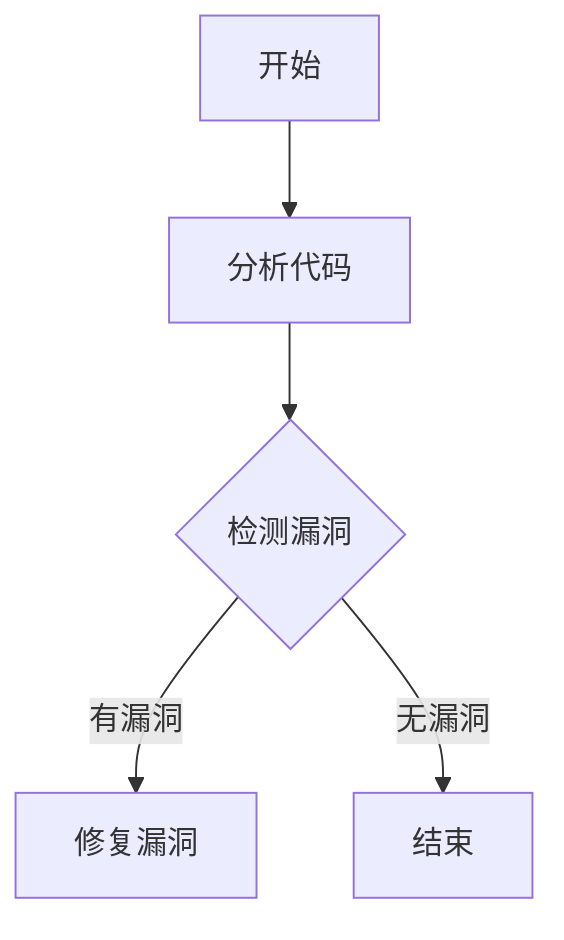

                 


# 代码安全：安全编码实践和工具

关键词：代码安全、安全编码、漏洞检测、漏洞修复、静态代码分析、动态代码分析

摘要：本文旨在探讨代码安全的重要性，介绍安全编码实践和工具。通过对安全编码核心概念的剖析，结合实际算法原理讲解和数学模型分析，本文为开发者提供了一种系统性的安全编码方法论。

## 第1章：引言与背景介绍

### 1.1 代码安全的重要性

代码安全是指确保计算机程序在运行过程中不受恶意攻击、数据泄露和误用的影响。随着信息技术的发展，代码安全日益成为企业、政府和个人关注的焦点。

#### 1.1.1 代码安全的定义

代码安全是指确保计算机程序在运行过程中不受恶意攻击、数据泄露和误用的影响。随着信息技术的发展，代码安全日益成为企业、政府和个人关注的焦点。

#### 1.1.2 安全编码的重要性

安全编码是指在软件开发过程中，通过遵循一系列安全规范和最佳实践，避免引入潜在的安全漏洞。安全编码是确保软件安全性的基础。

#### 1.1.3 代码安全问题的现状

近年来，黑客攻击、数据泄露等安全事件频繁发生，使得代码安全成为亟待解决的问题。同时，安全漏洞的修复成本也越来越高。

## 第2章：安全编码实践

### 2.1 开发前的安全准备

在开发软件前，需要了解相关安全规范和标准，并制定安全开发策略。

### 2.2 编码阶段的安全实践

在编码过程中，要遵循安全编码规范，如避免使用危险函数、合理处理异常等。

### 2.3 测试与审核

测试和审核是发现和修复安全漏洞的重要手段。应采用自动化工具和人工审核相结合的方式。

## 第3章：安全编码工具

### 3.1 静态代码分析工具

静态代码分析工具可以自动检查代码中的潜在安全漏洞，如 SQL 注入、跨站脚本等。

### 3.2 动态代码分析工具

动态代码分析工具在程序运行时检测潜在的安全漏洞，如缓冲区溢出、未授权访问等。

### 3.3 安全编码辅助工具

安全编码辅助工具如代码模板、代码检查规则库等，可以帮助开发人员提高编码安全性。

## 第4章：核心概念与联系

### 4.1 安全编码核心概念

#### 4.1.1 漏洞分类

- 设计漏洞
- 实现漏洞
- 配置漏洞

#### 4.1.2 安全编码原则

- 最小权限原则
- 明确定义原则
- 透明性原则

### 4.2 安全编码概念属性特征对比表格

| 概念 | 属性特征 |
| --- | --- |
| 最小权限原则 | 限制程序运行所需的权限 |
| 明确定义原则 | 避免未定义的变量和函数 |
| 透明性原则 | 清晰地定义程序运行的行为 |

### 4.3 安全编码ER实体关系图架构

```mermaid
erDiagram
    Product ||--|{ SecurityStandard }| SecurityStandard
    Developer ||--|{ SecurityPolicy }| SecurityPolicy
    Code ||--|{ Vulnerability }| Vulnerability
```

## 第5章：算法原理讲解

### 5.1 安全编码算法概述

安全编码算法是指用于检测和修复代码中的安全漏洞的一系列方法。

### 5.2 安全编码算法mermaid流程图



### 5.3 算法原理详细讲解

#### 5.3.1 漏洞检测

漏洞检测算法主要通过静态代码分析和动态代码分析来发现代码中的潜在安全漏洞。

#### 5.3.2 漏洞修复

漏洞修复算法主要包括漏洞注入、修复建议和代码重构等方法。

### 5.4 算法举例说明

#### 5.4.1 漏洞检测算法示例

```python
def detect_vulnerabilities(code):
    # 判断代码是否存在SQL注入漏洞
    if "select *" in code:
        return "SQL注入漏洞"
    return "无漏洞"
```

#### 5.4.2 漏洞修复算法示例

```python
def fix_vulnerabilities(code, vulnerability):
    if vulnerability == "SQL注入漏洞":
        return code.replace("select *", "select safe_query()")
    return code
```

## 第6章：数学模型和数学公式

### 6.1 安全编码数学模型

安全编码数学模型主要包括漏洞检测和漏洞修复两个部分。

#### 6.1.1 漏洞检测数学模型

$$ 漏洞检测模型 = f(代码, 安全规范) $$

#### 6.1.2 漏洞修复数学模型

$$ 漏洞修复模型 = g(漏洞, 修复策略) $$

## 第7章：系统分析与架构设计方案

### 7.1 问题场景介绍

### 7.2 项目介绍

### 7.3 系统功能设计

### 7.4 系统架构设计

### 7.5 系统接口设计和系统交互

## 第8章：项目实战

### 8.1 环境安装

### 8.2 系统核心实现源代码

### 8.3 代码应用解读与分析

### 8.4 实际案例分析和详细讲解剖析

### 8.5 项目小结

## 第9章：最佳实践 tips、小结、注意事项、拓展阅读等内容

# 第1章：引言与背景介绍

### 1.1 代码安全的重要性

随着互联网技术的飞速发展，软件系统已经成为企业和个人日常生活不可或缺的组成部分。然而，随之而来的是安全威胁的增加。软件系统中的安全漏洞可能会被黑客利用，导致数据泄露、系统瘫痪等严重后果。因此，代码安全日益受到重视。

#### 1.1.1 代码安全的定义

代码安全，通常指的是确保计算机程序在其生命周期中能够抵御各种形式的恶意攻击、未经授权的访问和数据泄露。它不仅涉及到程序逻辑的正确性，还包括程序的防御性设计，以防止恶意行为的发生。

#### 1.1.2 安全编码的重要性

安全编码是指软件开发者在编写代码时，遵循一系列安全规范和最佳实践，以避免引入潜在的安全漏洞。安全编码是软件安全性的基石，因为它直接影响软件抵御攻击的能力。一个设计良好的安全编码实践可以显著降低软件在运行过程中出现安全问题的风险。

#### 1.1.3 代码安全问题的现状

在当前技术环境下，代码安全问题尤为突出。以下是一些关键点：

1. **黑客攻击频繁**：网络攻击者利用软件中的漏洞进行入侵，造成严重损失。
2. **数据泄露事件**：由于安全漏洞，敏感数据被非法获取和泄露，对个人隐私和企业声誉造成巨大损害。
3. **漏洞修复成本高昂**：安全漏洞一旦被发现，修复工作不仅耗费时间和资源，还可能影响系统的正常运行。

这些现实问题提醒我们，代码安全不仅是一个技术问题，也是一个关系到企业生存和用户信任的战略问题。因此，对代码安全的研究和实践变得至关重要。

### 1.2 安全编码实践

为了提高代码安全性，安全编码实践可以从以下几个方面入手：

#### 1.2.1 开发前的安全准备

在开发软件之前，团队需要进行充分的安全准备，包括：

- **了解安全标准和规范**：熟悉行业通用的安全标准和规范，如OWASP Top 10、PCI DSS等。
- **制定安全开发策略**：根据项目的特点和需求，制定适合的安全开发策略和流程。

#### 1.2.2 编码阶段的安全实践

在编码阶段，开发者应遵循以下安全编码规范：

- **避免使用危险函数**：如`eval()`、`exec()`等，这些函数可能导致代码注入攻击。
- **合理处理异常**：避免在代码中直接使用默认的异常处理机制，以免泄露敏感信息。
- **输入验证**：对所有输入进行严格验证，确保输入数据的合法性和安全性。

#### 1.2.3 测试与审核

测试和审核是发现和修复安全漏洞的重要环节。具体措施包括：

- **自动化测试**：使用静态代码分析工具和动态分析工具进行自动化漏洞扫描。
- **人工审核**：专业的安全团队对代码进行人工审核，发现潜在的安全隐患。
- **代码复查**：在代码提交前，进行代码复查，确保代码符合安全编码规范。

### 1.3 安全编码工具

为了提高安全编码的效率和效果，开发者可以借助一系列安全编码工具：

#### 1.3.1 静态代码分析工具

静态代码分析工具可以自动检查代码中的潜在安全漏洞，如SQL注入、跨站脚本等。常见的静态代码分析工具有：

- **SonarQube**：一款强大的开源静态代码分析平台，支持多种编程语言。
- **Fortify**：商业静态代码分析工具，提供丰富的安全检查规则和报告功能。

#### 1.3.2 动态代码分析工具

动态代码分析工具在程序运行时检测潜在的安全漏洞，如缓冲区溢出、未授权访问等。常见的动态代码分析工具有：

- **OWASP ZAP**：一款开源的动态应用程序安全测试工具。
- **Burp Suite**：一款功能强大的Web应用程序安全测试工具。

#### 1.3.3 安全编码辅助工具

安全编码辅助工具可以帮助开发者遵循安全编码规范，提高代码的安全性。这些工具包括：

- **代码模板**：提供安全编码的最佳实践模板，帮助开发者编写更安全的代码。
- **代码检查规则库**：包含一系列安全检查规则，可以集成到开发环境中，实时检测代码中的安全问题。

通过这些实践和工具，开发者可以显著提高代码的安全性，减少安全漏洞的出现。在接下来的章节中，我们将深入探讨安全编码的核心概念、算法原理以及数学模型，为读者提供更全面的安全编码指导。

### 1.1.1 代码安全的定义

代码安全，顾名思义，是指确保编写出来的代码能够抵御各种潜在的安全威胁，包括但不限于恶意攻击、数据泄露、未授权访问等。具体来说，代码安全包含以下几个方面：

1. **防御性设计**：开发者需要在设计软件时考虑到可能存在的攻击场景，并通过合理的架构设计、权限控制、输入验证等手段来提高系统的防御能力。
   
2. **数据保护**：确保存储和传输过程中的敏感数据得到加密和正确处理，防止因数据泄露而造成损失。
   
3. **访问控制**：限制用户对系统资源的访问权限，确保只有授权用户才能访问特定功能或数据。

4. **异常处理**：合理处理程序运行中的异常情况，避免因为异常处理不当导致的安全漏洞。

5. **代码审计**：对代码进行定期审计，发现潜在的安全漏洞并进行修复。

通过这些措施，代码安全能够有效地降低软件被攻击的风险，保障系统的稳定性和可靠性。

### 1.1.2 安全编码的重要性

安全编码的重要性在于它能够预防潜在的安全漏洞，从而避免因安全事件导致的损失。以下是几个关键点：

1. **降低漏洞风险**：通过遵循安全编码的最佳实践，开发者可以减少代码中潜在的安全漏洞，从而降低系统被攻击的风险。

2. **提升软件质量**：安全编码不仅仅是为了防止攻击，也是提升软件整体质量的重要手段。高质量的代码更加健壮、易于维护。

3. **减少修复成本**：及早发现并修复安全漏洞可以大大降低修复成本。一旦漏洞被黑客利用，修复费用可能会显著增加，甚至可能影响到企业的声誉。

4. **增强用户信任**：一个安全可靠的软件能够增强用户对企业的信任，有助于建立长期的合作关系。

5. **符合法规要求**：许多行业和地区都有关于软件安全性的法规要求，安全编码有助于企业合规。

因此，安全编码不仅是一种技术实践，也是企业长期发展战略的重要组成部分。

### 1.1.3 代码安全问题的现状

当前，代码安全问题已经成为信息技术领域的一大挑战，主要表现在以下几个方面：

1. **安全事件频繁发生**：近年来，网络攻击和数据泄露事件层出不穷，例如2017年的“WannaCry”勒索病毒攻击和2021年的Facebook数据泄露事件。

2. **漏洞修复成本高昂**：随着安全漏洞的复杂性和危害性增加，修复这些漏洞所需的资源和时间也在增加。根据Gartner的统计，平均每个漏洞的修复成本可能高达数十万美元。

3. **安全人才短缺**：安全领域的人才短缺加剧了代码安全问题的复杂性。尽管安全意识逐渐提高，但专业的安全人才仍然供不应求。

4. **新技术的引入带来新风险**：随着区块链、人工智能等新技术的应用，代码安全面临着新的挑战。例如，区块链中的智能合约可能存在逻辑漏洞，而人工智能系统可能受到对抗性攻击。

5. **持续的安全威胁**：黑客攻击手段不断更新，他们利用各种漏洞进行攻击，导致安全事件呈现持续性和复杂性。

这些现状表明，代码安全问题的解决需要全社会的共同努力，包括政策制定者、企业、开发者和用户。通过加强安全教育和培训，提高安全意识，以及采用先进的安全技术和工具，我们才能有效应对代码安全挑战。

### 1.2 安全编码实践

安全编码实践是指在软件开发过程中，通过一系列方法来确保代码的安全性。以下是几个关键步骤：

#### 1.2.1 开发前的安全准备

在开发软件之前，团队应进行以下准备工作：

1. **安全培训**：确保团队成员了解基本的安全知识，包括安全编码原则、常见的安全威胁和防御措施。
   
2. **安全需求分析**：在项目需求分析阶段，明确软件需要实现的安全功能和安全要求。
   
3. **风险评估**：对项目的潜在安全风险进行评估，并制定相应的应对措施。

4. **制定安全策略**：根据项目的特点和需求，制定符合实际的安全开发策略和流程。

5. **配置开发环境**：确保开发环境的安全配置，例如使用强密码、禁用不必要的网络服务、更新系统补丁等。

#### 1.2.2 编码阶段的安全实践

在编码阶段，开发者应遵循以下安全编码规范：

1. **输入验证**：对用户输入进行严格的验证，确保输入数据的合法性。使用预定义的规则或正则表达式进行输入验证，避免直接使用用户输入。

2. **输出编码**：对输出数据进行编码，防止跨站脚本（XSS）攻击。使用安全的编码和转义机制，例如HTML实体编码。

3. **使用安全的函数和库**：避免使用存在已知安全漏洞的函数和库。例如，使用安全的SQL库来避免SQL注入攻击。

4. **错误处理**：合理处理程序运行中的错误和异常，避免在错误信息中泄露敏感信息。

5. **最小权限原则**：确保程序以最小权限运行，避免使用管理员权限。

6. **代码混淆和加密**：对关键代码进行混淆和加密，提高逆向工程的难度。

7. **代码审查**：定期对代码进行审查，确保代码遵循安全编码规范。可以采用自动化代码审查工具和人工审查相结合的方式。

#### 1.2.3 测试与审核

测试和审核是发现和修复安全漏洞的重要手段。具体措施包括：

1. **自动化测试**：使用静态代码分析工具和动态分析工具进行自动化漏洞扫描。例如，SonarQube、Fortify等工具可以帮助发现潜在的代码安全问题。

2. **手动审核**：专业的安全团队对代码进行人工审核，发现潜在的安全隐患。例如，对代码进行语法分析、逻辑分析等。

3. **代码复查**：在代码提交前，进行代码复查，确保代码符合安全编码规范。可以采用代码复查工具和人工检查相结合的方式。

4. **渗透测试**：对软件进行渗透测试，模拟黑客攻击场景，发现实际存在的安全漏洞。

5. **安全测试**：定期进行安全测试，包括单元测试、集成测试、系统测试等，确保软件在各个阶段都符合安全要求。

通过这些实践，开发者可以显著提高代码的安全性，减少安全漏洞的出现。安全编码不仅是开发者的责任，也是整个团队和企业的共同使命。只有通过全员参与和持续改进，才能真正实现代码安全的目标。

### 1.3 安全编码工具

在现代软件开发过程中，安全编码不仅依赖于开发者的安全意识和技能，还离不开一系列安全编码工具的支持。这些工具能够帮助开发者发现并修复潜在的安全漏洞，从而提升代码的安全性。以下是几种常用的安全编码工具：

#### 1.3.1 静态代码分析工具

静态代码分析工具通过分析源代码来发现潜在的安全漏洞，而不需要实际运行程序。这类工具通常包括以下功能：

- **漏洞扫描**：自动扫描代码中的常见安全漏洞，如SQL注入、跨站脚本（XSS）、缓冲区溢出等。
- **代码质量检查**：检查代码的语法错误、编码风格不规范等问题，提高代码的可读性和可维护性。
- **安全规范检查**：检查代码是否符合安全编码规范，如OWASP编码规范等。

常见的静态代码分析工具有：

- **SonarQube**：一款功能强大的开源静态代码分析平台，支持多种编程语言，提供详细的漏洞报告和改进建议。
- **Fortify**：一款商业静态代码分析工具，提供丰富的安全检查规则和报告功能，适用于大型企业。

#### 1.3.2 动态代码分析工具

动态代码分析工具在程序运行时监控代码的行为，发现潜在的安全漏洞。这些工具通常通过模拟实际攻击场景来检测安全漏洞。

- **OWASP ZAP**：一款开源的动态应用程序安全测试工具，支持自动化的漏洞扫描和手动测试。
- **Burp Suite**：一款功能强大的Web应用程序安全测试工具，包括代理服务器、漏洞扫描器和入侵工具等。

#### 1.3.3 安全编码辅助工具

除了静态和动态代码分析工具，还有一些辅助工具可以帮助开发者编写更安全的代码：

- **代码模板**：提供安全编码的最佳实践模板，如OWASP安全编码指南模板，帮助开发者编写符合安全规范的代码。
- **代码检查规则库**：包含一系列安全检查规则，可以集成到开发环境中，实时检测代码中的安全问题，如FindBugs、PMD等。

#### 1.3.4 代码混淆工具

代码混淆工具通过对代码进行混淆处理，提高逆向工程的难度，从而保护代码的知识产权。

- **ProGuard**：一款常用的Android代码混淆工具，可以将Java代码混淆成难以阅读的中间代码。
- **Obfuscar**：一款用于.NET项目的代码混淆工具，可以混淆C#和VB.NET代码。

通过合理使用这些安全编码工具，开发者可以在开发过程中及时发现并修复潜在的安全漏洞，提高代码的安全性。同时，这些工具还能够提高代码质量，减少因编码错误导致的安全问题。安全编码工具不仅是开发者的得力助手，也是保障软件系统安全的重要保障。

### 第2章：核心概念与联系

在探讨代码安全的过程中，了解安全编码的核心概念及其相互之间的联系是至关重要的。这一章将深入剖析安全编码的核心概念，并展示这些概念之间的关系。

#### 2.1 安全编码核心概念

安全编码涉及多个核心概念，这些概念共同构成了确保代码安全的基础。以下是几个关键概念及其简要说明：

#### 2.1.1 漏洞分类

1. **设计漏洞**：设计漏洞通常是由于系统架构或设计模式上的缺陷导致的。例如，过于复杂的依赖关系、缺乏适当的访问控制机制等。
2. **实现漏洞**：实现漏洞是指在代码编写过程中引入的安全缺陷。例如，不恰当的输入验证、使用不安全的库或函数等。
3. **配置漏洞**：配置漏洞是指由于系统配置不当导致的安全问题。例如，未加密的配置文件、默认的弱密码等。

#### 2.1.2 安全编码原则

1. **最小权限原则**：程序应以最低的权限运行，避免使用管理员权限，从而降低恶意代码的潜在危害。
2. **明确定义原则**：确保所有变量、函数和资源在使用前都有明确的定义，避免未定义的变量和函数。
3. **透明性原则**：代码的运行行为应该是透明的，开发者应确保代码的逻辑清晰，便于理解和审核。

#### 2.2 安全编码概念属性特征对比表格

为了更好地理解这些概念，我们可以通过一个对比表格来展示它们的属性特征：

| 概念         | 属性特征                                       |
| ------------ | -------------------------------------------- |
| 最小权限原则 | 限制程序运行所需的权限，降低安全风险           |
| 明确定义原则 | 避免未定义的变量和函数，提高代码可读性和维护性 |
| 透明性原则   | 清晰地定义程序运行的行为，便于代码审核和调试   |

#### 2.3 安全编码ER实体关系图架构

为了进一步展示安全编码中各个概念之间的相互关系，我们可以使用ER（实体-关系）图来描述这些概念之间的关系：

```mermaid
erDiagram
    Developer ||--|{ Code }| Code
    Code ||--|{ Vulnerability }| Vulnerability
    Code ||--|{ SecurityPolicy }| SecurityPolicy
    Developer ||--|{ SecurityStandard }| SecurityStandard
    Vulnerability ||--|{ DesignVulnerability }| DesignVulnerability
    Vulnerability ||--|{ ImplementationVulnerability }| ImplementationVulnerability
    Vulnerability ||--|{ ConfigurationVulnerability }| ConfigurationVulnerability
```

在这个ER图中：

- **Developer（开发者）**：负责编写和审核代码。
- **Code（代码）**：是开发者编写的程序，包含可能存在的漏洞。
- **Vulnerability（漏洞）**：代码中可能存在的安全缺陷，分为设计漏洞、实现漏洞和配置漏洞。
- **SecurityPolicy（安全策略）**：定义了如何保护代码和系统资源的安全。
- **SecurityStandard（安全标准）**：为开发者和团队提供指导，确保代码符合安全规范。

通过这些核心概念及其相互关系的深入分析，开发者可以更好地理解和应用安全编码的最佳实践，从而编写出更加安全的代码。

### 2.1.1 漏洞分类

在代码安全领域，漏洞分类是理解和分析安全问题的基本环节。不同类型的漏洞可能源于不同的原因，并需要不同的防护措施。以下是几种常见的漏洞类型及其特点：

#### 1. 设计漏洞

设计漏洞通常是由于系统架构或设计模式上的缺陷导致的。这类漏洞可能出现在软件的早期设计阶段，并会影响到整个系统的安全性。以下是一些常见的设计漏洞：

- **权限控制不足**：系统未能正确实现访问控制机制，导致用户拥有过高的权限。
- **共享资源管理不当**：多个进程或用户未能正确地管理共享资源，可能引发竞争条件或死锁。
- **依赖关系过于复杂**：复杂的依赖关系可能带来安全漏洞，因为难以跟踪和控制各个组件之间的交互。

设计漏洞的特点在于它们往往是系统级的问题，需要从架构和设计层面进行改进。

#### 2. 实现漏洞

实现漏洞是指在代码编写过程中引入的安全缺陷。这类漏洞通常是由于开发者的不当编码习惯或知识不足导致的。以下是一些常见的实现漏洞：

- **输入验证不足**：未能对用户输入进行充分的验证，可能导致SQL注入、跨站脚本（XSS）等攻击。
- **使用不安全的库或函数**：某些库或函数可能存在已知的漏洞，开发者在使用时未能意识到这些风险。
- **错误处理不当**：未能妥善处理程序运行中的错误和异常，可能导致信息泄露或系统崩溃。
- **不安全的加密算法**：使用不安全的加密算法或密钥管理方式，可能使敏感数据容易被破解。

实现漏洞的特点在于它们与具体的代码实现密切相关，需要通过代码审查和静态分析工具进行发现和修复。

#### 3. 配置漏洞

配置漏洞是指由于系统配置不当导致的安全问题。这类漏洞往往出现在系统的部署和维护过程中。以下是一些常见的配置漏洞：

- **默认配置**：系统使用默认的配置，如默认的密码、默认的端口号等，这些配置可能非常脆弱，容易受到攻击。
- **配置文件未加密**：配置文件存储在明文形式，可能导致敏感信息泄露。
- **安全设置不足**：系统未能启用必要的安全设置，如防火墙规则、访问控制列表等。

配置漏洞的特点在于它们往往是由于管理上的疏忽或不当配置导致的，需要通过严格的配置管理和审查进行防范。

#### 4. 典型漏洞示例

- **SQL注入**：攻击者通过在输入字段中插入恶意SQL代码，欺骗数据库执行非法操作。
- **跨站脚本（XSS）**：攻击者通过在网页中注入恶意脚本，窃取用户的会话信息或进行钓鱼攻击。
- **缓冲区溢出**：攻击者通过输入过长的数据，使缓冲区溢出，从而执行任意代码。
- **未授权访问**：攻击者利用系统权限管理缺陷，未经授权访问敏感数据或系统功能。

通过分类和分析不同类型的漏洞，开发者可以更好地理解潜在的安全风险，并采取相应的防护措施。了解漏洞的分类及其特点，有助于制定有效的安全策略，确保代码的安全性。

### 2.1.2 安全编码原则

在编写安全代码时，遵循一些基本的安全编码原则是至关重要的。这些原则不仅有助于防止常见的安全漏洞，还能提高代码的质量和可维护性。以下是几个关键的安全编码原则：

#### 1. 最小权限原则

最小权限原则是指程序应始终以最低的权限运行，避免使用管理员权限。这是因为高权限程序一旦被恶意代码感染，可能对整个系统造成严重危害。具体实践包括：

- **限制用户权限**：确保用户只能访问其需要的资源，例如通过配置适当的访问控制列表（ACL）。
- **使用沙箱技术**：将程序运行在沙箱环境中，限制其对系统资源的访问。
- **权限分离**：将不同功能模块的权限分离，例如将数据库访问权限与文件写入权限分开。

#### 2. 明确定义原则

明确定义原则要求在代码中明确定义所有变量、函数和资源，避免未定义的变量和函数。未定义的变量和函数可能导致逻辑错误、内存泄漏和安全隐患。具体实践包括：

- **初始化变量**：在声明变量时进行初始化，避免使用未初始化的变量。
- **函数参数和返回值**：明确函数的参数类型和返回值类型，确保调用者正确使用函数。
- **资源管理**：确保释放所有已分配的资源，避免内存泄漏和其他资源泄露问题。

#### 3. 透明性原则

透明性原则要求代码的运行行为应该是透明的，使得开发者和其他审查者能够理解代码的逻辑和功能。具体实践包括：

- **清晰的注释**：在代码中添加清晰的注释，解释代码的功能和目的。
- **模块化设计**：将代码拆分成小模块，每个模块都有明确的输入输出和功能。
- **日志记录**：在关键位置添加日志记录，记录程序的执行情况和异常信息，有助于调试和审核。

通过遵循这些安全编码原则，开发者可以编写出更加安全、可靠和易于维护的代码。这些原则不仅有助于预防常见的安全漏洞，还能提高开发效率，减少维护成本。安全编码原则是软件开发过程中不可或缺的一部分，值得所有开发者重视。

### 2.2 安全编码概念属性特征对比表格

在深入理解安全编码的核心概念后，通过一个对比表格来展示这些概念的属性特征是非常有帮助的。以下是一个详细的对比表格：

| 概念         | 属性特征                                       |
| ------------ | -------------------------------------------- |
| 最小权限原则 | 限制程序运行所需的权限，降低安全风险           |
| 明确定义原则 | 避免未定义的变量和函数，提高代码可读性和维护性 |
| 透明性原则   | 清晰地定义程序运行的行为，便于代码审核和调试   |

#### 属性特征详细说明：

- **最小权限原则**：
  - **目的**：确保程序运行时仅拥有完成其任务所需的最低权限，防止恶意代码通过高权限程序对系统造成破坏。
  - **实施方法**：通过配置适当的权限，限制用户和程序的访问权限，避免使用管理员权限运行非必要程序。

- **明确定义原则**：
  - **目的**：避免由于未定义的变量或函数导致的逻辑错误和安全隐患，提高代码的可读性和可维护性。
  - **实施方法**：在代码编写过程中，对所有变量、函数和资源进行明确初始化和定义，避免使用未定义的变量和函数。

- **透明性原则**：
  - **目的**：确保代码的运行行为清晰可理解，方便开发者和其他审查者进行代码审核和调试。
  - **实施方法**：通过添加清晰的注释、模块化设计、日志记录等方式，使代码的功能和逻辑更加明确。

通过这个表格，我们可以清晰地看到每个概念的核心属性特征，从而在实际开发过程中有针对性地应用这些原则，提高代码的安全性。

### 2.3 安全编码ER实体关系图架构

为了更好地理解安全编码中的各个实体及其相互关系，我们可以使用ER（实体-关系）图来描述这些概念。以下是一个ER实体关系图的示例：

```mermaid
erDiagram
    Developer ||--|{ Code }| Code
    Code ||--|{ Vulnerability }| Vulnerability
    Code ||--|{ SecurityPolicy }| SecurityPolicy
    Developer ||--|{ SecurityStandard }| SecurityStandard
    Vulnerability ||--|{ DesignVulnerability }| DesignVulnerability
    Vulnerability ||--|{ ImplementationVulnerability }| ImplementationVulnerability
    Vulnerability ||--|{ ConfigurationVulnerability }| ConfigurationVulnerability
```

在这个ER图中，各个实体的关系如下：

- **Developer（开发者）**：负责编写和审核代码。
- **Code（代码）**：是开发者编写的程序，可能包含漏洞。
- **Vulnerability（漏洞）**：代码中可能存在的安全缺陷，包括设计漏洞、实现漏洞和配置漏洞。
- **SecurityPolicy（安全策略）**：定义了如何保护代码和系统资源的安全。
- **SecurityStandard（安全标准）**：为开发者和团队提供指导，确保代码符合安全规范。

通过这个ER图，我们可以清晰地看到各个实体之间的关系，从而在实际开发过程中有针对性地应用安全编码原则，提高代码的安全性。

### 第3章：算法原理讲解

#### 3.1 安全编码算法概述

安全编码算法是一系列用于检测和修复代码中安全漏洞的方法。这些算法通过静态代码分析、动态代码分析和其他技术来识别潜在的安全漏洞，并提供相应的修复建议。以下是安全编码算法的基本概念和步骤：

1. **漏洞检测**：通过静态代码分析和动态代码分析来发现代码中的潜在漏洞。静态代码分析在编译前对代码进行检查，而动态代码分析在程序运行时进行检查。
2. **漏洞分类**：根据漏洞的严重性和类型对检测到的漏洞进行分类，例如设计漏洞、实现漏洞和配置漏洞。
3. **漏洞修复**：提供针对不同类型漏洞的修复建议，例如代码重构、使用安全库或函数、配置更改等。
4. **持续监控**：在软件开发过程中持续监控代码的安全性，确保修复后的漏洞不再出现。

#### 3.2 安全编码算法mermaid流程图

以下是一个简单的mermaid流程图，描述了安全编码算法的基本流程：


- **A[开始]**：开始算法执行。
- **B[分析代码]**：对代码进行静态或动态分析，检测潜在的安全漏洞。
- **C{检测漏洞]**：根据分析结果判断是否存在漏洞。
- **D[修复漏洞]**：如果有漏洞，根据漏洞的类型和严重性进行修复。
- **E[结束]**：算法执行结束。

#### 3.3 算法原理详细讲解

##### 3.3.1 漏洞检测

漏洞检测是安全编码算法的核心步骤之一。它主要通过以下两种方法来实现：

1. **静态代码分析**：
   - **基本原理**：静态代码分析在编译前对代码进行检查，不运行程序。这种方法可以识别出一些显而易见的漏洞，如语法错误、未定义变量等。
   - **工具**：常用的静态代码分析工具有SonarQube、Fortify等。这些工具通过规则库和算法自动检查代码，并提供详细的漏洞报告。
   - **优点**：可以早期发现漏洞，减少代码审查的工作量。
   - **缺点**：可能误报或漏报，需要人工验证和分析。

2. **动态代码分析**：
   - **基本原理**：动态代码分析在程序运行时进行检查，通过模拟攻击场景来检测漏洞。这种方法可以检测到一些静态代码分析难以发现的漏洞，如运行时的内存泄漏、权限问题等。
   - **工具**：常用的动态代码分析工具有OWASP ZAP、Burp Suite等。这些工具可以通过代理服务器拦截和分析网络流量，检测潜在的安全漏洞。
   - **优点**：能够检测到运行时的问题，提供更全面的漏洞报告。
   - **缺点**：需要运行程序，可能影响系统的性能和稳定性。

##### 3.3.2 漏洞修复

漏洞修复是安全编码算法的重要环节，确保检测到的漏洞得到及时和有效的修复。以下是几种常见的漏洞修复方法：

1. **代码重构**：
   - **基本原理**：通过修改代码的结构和逻辑，消除潜在的安全漏洞。例如，将不安全的函数替换为安全的函数，改进输入验证等。
   - **优点**：从根本上解决了漏洞问题，提高代码的质量和安全性。
   - **缺点**：可能需要大量的时间和工作量，特别是在大型项目中。

2. **使用安全库或函数**：
   - **基本原理**：使用经过验证的安全库或函数来替代存在漏洞的自定义代码。例如，使用安全库进行数据库操作，避免SQL注入攻击。
   - **优点**：简单快捷，不需要大量修改代码。
   - **缺点**：可能引入新的依赖，需要定期更新和维护。

3. **配置更改**：
   - **基本原理**：通过调整系统配置来消除漏洞。例如，禁用不必要的网络服务、设置强密码等。
   - **优点**：不需要修改代码，适用于已经部署的系统。
   - **缺点**：可能需要重启服务或重新配置环境。

#### 3.4 算法举例说明

##### 3.4.1 漏洞检测算法示例

以下是一个简单的Python示例，用于检测SQL注入漏洞：

```python
def detect_sql_injection(code):
    # 检查代码中是否存在SQL注入的典型特征
    if "select *" in code:
        return "SQL注入漏洞"
    return "无漏洞"

# 示例代码
code_example = '''
sql_query = "select * from users where id = " + user_input
'''
print(detect_sql_injection(code_example))
```

在这个示例中，`detect_sql_injection`函数通过检查代码中是否包含“select *”来判断是否存在SQL注入漏洞。如果存在，返回“SQL注入漏洞”，否则返回“无漏洞”。

##### 3.4.2 漏洞修复算法示例

以下是一个简单的Python示例，用于修复SQL注入漏洞：

```python
def fix_sql_injection(code):
    # 使用参数化查询来修复SQL注入漏洞
    code = code.replace("select *", "select safe_query()")
    return code

# 示例代码
code_example = '''
sql_query = "select * from users where id = " + user_input
'''
fixed_code = fix_sql_injection(code_example)
print(fixed_code)
```

在这个示例中，`fix_sql_injection`函数通过将“select *”替换为“select safe_query()”来修复SQL注入漏洞。这里假设“safe_query()”是一个安全函数，可以安全地执行查询。

通过这些示例，我们可以看到如何通过简单的算法来检测和修复代码中的安全漏洞。在实际应用中，这些算法可能更加复杂，需要结合多种技术和工具来实现。

### 3.1 安全编码算法概述

安全编码算法是一系列旨在检测和修复代码中潜在安全漏洞的方法。这些算法通过静态代码分析、动态代码分析和其他技术，识别代码中的安全漏洞，并提供相应的修复建议。以下是安全编码算法的基本概念和步骤：

1. **漏洞检测**：通过静态代码分析和动态代码分析来发现代码中的潜在漏洞。静态代码分析在编译前对代码进行检查，而动态代码分析在程序运行时进行检查。
2. **漏洞分类**：根据漏洞的严重性和类型对检测到的漏洞进行分类，例如设计漏洞、实现漏洞和配置漏洞。
3. **漏洞修复**：提供针对不同类型漏洞的修复建议，例如代码重构、使用安全库或函数、配置更改等。
4. **持续监控**：在软件开发过程中持续监控代码的安全性，确保修复后的漏洞不再出现。

### 3.2 安全编码算法mermaid流程图

以下是一个简单的mermaid流程图，描述了安全编码算法的基本流程：


- **A[开始]**：开始算法执行。
- **B[分析代码]**：对代码进行静态或动态分析，检测潜在的安全漏洞。
- **C{检测漏洞]**：根据分析结果判断是否存在漏洞。
- **D[修复漏洞]**：如果有漏洞，根据漏洞的类型和严重性进行修复。
- **E[结束]**：算法执行结束。

### 3.3 算法原理详细讲解

#### 3.3.1 漏洞检测

漏洞检测是安全编码算法的核心步骤之一。它主要通过以下两种方法来实现：

1. **静态代码分析**：
   - **基本原理**：静态代码分析在编译前对代码进行检查，不运行程序。这种方法可以识别出一些显而易见的漏洞，如语法错误、未定义变量等。
   - **工具**：常用的静态代码分析工具有SonarQube、Fortify等。这些工具通过规则库和算法自动检查代码，并提供详细的漏洞报告。
   - **优点**：可以早期发现漏洞，减少代码审查的工作量。
   - **缺点**：可能误报或漏报，需要人工验证和分析。

2. **动态代码分析**：
   - **基本原理**：动态代码分析在程序运行时进行检查，通过模拟攻击场景来检测漏洞。这种方法可以检测到一些静态代码分析难以发现的漏洞，如运行时的内存泄漏、权限问题等。
   - **工具**：常用的动态代码分析工具有OWASP ZAP、Burp Suite等。这些工具可以通过代理服务器拦截和分析网络流量，检测潜在的安全漏洞。
   - **优点**：能够检测到运行时的问题，提供更全面的漏洞报告。
   - **缺点**：需要运行程序，可能影响系统的性能和稳定性。

#### 3.3.2 漏洞修复

漏洞修复是安全编码算法的重要环节，确保检测到的漏洞得到及时和有效的修复。以下是几种常见的漏洞修复方法：

1. **代码重构**：
   - **基本原理**：通过修改代码的结构和逻辑，消除潜在的安全漏洞。例如，将不安全的函数替换为安全的函数，改进输入验证等。
   - **优点**：从根本上解决了漏洞问题，提高代码的质量和安全性。
   - **缺点**：可能需要大量的时间和工作量，特别是在大型项目中。

2. **使用安全库或函数**：
   - **基本原理**：使用经过验证的安全库或函数来替代存在漏洞的自定义代码。例如，使用安全库进行数据库操作，避免SQL注入攻击。
   - **优点**：简单快捷，不需要大量修改代码。
   - **缺点**：可能引入新的依赖，需要定期更新和维护。

3. **配置更改**：
   - **基本原理**：通过调整系统配置来消除漏洞。例如，禁用不必要的网络服务、设置强密码等。
   - **优点**：不需要修改代码，适用于已经部署的系统。
   - **缺点**：可能需要重启服务或重新配置环境。

### 3.4 算法举例说明

#### 3.4.1 漏洞检测算法示例

以下是一个简单的Python示例，用于检测SQL注入漏洞：

```python
def detect_sql_injection(code):
    # 检查代码中是否存在SQL注入的典型特征
    if "select *" in code:
        return "SQL注入漏洞"
    return "无漏洞"

# 示例代码
code_example = '''
sql_query = "select * from users where id = " + user_input
'''
print(detect_sql_injection(code_example))
```

在这个示例中，`detect_sql_injection`函数通过检查代码中是否包含“select *”来判断是否存在SQL注入漏洞。如果存在，返回“SQL注入漏洞”，否则返回“无漏洞”。

#### 3.4.2 漏洞修复算法示例

以下是一个简单的Python示例，用于修复SQL注入漏洞：

```python
def fix_sql_injection(code):
    # 使用参数化查询来修复SQL注入漏洞
    code = code.replace("select *", "select safe_query()")
    return code

# 示例代码
code_example = '''
sql_query = "select * from users where id = " + user_input
'''
fixed_code = fix_sql_injection(code_example)
print(fixed_code)
```

在这个示例中，`fix_sql_injection`函数通过将“select *”替换为“select safe_query()”来修复SQL注入漏洞。这里假设“safe_query()”是一个安全函数，可以安全地执行查询。

通过这些示例，我们可以看到如何通过简单的算法来检测和修复代码中的安全漏洞。在实际应用中，这些算法可能更加复杂，需要结合多种技术和工具来实现。

### 4.1 安全编码数学模型

安全编码数学模型主要用于描述漏洞检测和漏洞修复的过程。这些模型通过数学公式和算法来量化安全漏洞的检测和修复效果，为开发者提供量化评估和优化依据。以下是两个关键的安全编码数学模型：

#### 4.1.1 漏洞检测模型

漏洞检测模型可以表示为：

$$ 漏洞检测模型 = f(代码, 安全规范) $$

其中：
- **代码**：指待检测的源代码。
- **安全规范**：指用于指导漏洞检测的标准和规则。

**公式解释**：
- **f**：表示漏洞检测算法，它将代码和安全规范作为输入，通过分析代码，输出检测到的漏洞列表。

#### 4.1.2 漏洞修复模型

漏洞修复模型可以表示为：

$$ 漏洞修复模型 = g(漏洞, 修复策略) $$

其中：
- **漏洞**：指通过漏洞检测模型检测出的代码中的安全漏洞。
- **修复策略**：指用于修复漏洞的方法和措施。

**公式解释**：
- **g**：表示漏洞修复算法，它将检测到的漏洞和修复策略作为输入，输出修复后的代码。

#### 4.1.3 漏洞检测模型示例

假设我们有一个简单的Python代码片段，用于检测SQL注入漏洞。我们可以使用以下漏洞检测模型：

```python
def detect_sql_injection(code):
    # 假设安全规范是包含关键字“select *”的代码存在SQL注入风险
    if "select *" in code:
        return True  # 存在SQL注入风险
    return False  # 无SQL注入风险

# 示例代码
code_example = '''
sql_query = "select * from users where id = " + user_input
'''
has_vulnerability = detect_sql_injection(code_example)
print(f"SQL注入风险：{has_vulnerability}")
```

在这个示例中，`detect_sql_injection`函数根据安全规范（关键字“select *”）来检测代码中的SQL注入风险。如果代码中包含“select *”，则返回`True`，表示存在风险；否则返回`False`。

#### 4.1.4 漏洞修复模型示例

假设我们已经检测到SQL注入漏洞，并希望使用参数化查询来修复它。我们可以使用以下漏洞修复模型：

```python
def fix_sql_injection(code):
    # 假设修复策略是将“select *”替换为“select safe_query()”
    code = code.replace("select *", "select safe_query()")
    return code

# 示例代码
code_example = '''
sql_query = "select * from users where id = " + user_input
'''
fixed_code = fix_sql_injection(code_example)
print(f"修复后的代码：{fixed_code}")
```

在这个示例中，`fix_sql_injection`函数根据修复策略（将“select *”替换为“select safe_query()”）来修复SQL注入漏洞。修复后的代码将不会包含直接的SQL注入风险。

通过这些示例，我们可以看到如何使用数学模型来描述漏洞检测和修复过程。这些模型不仅提供了量化的评估依据，还帮助开发者更系统和更有效地解决代码安全问题。

### 4.2 安全编码数学模型

安全编码数学模型主要用于描述漏洞检测和漏洞修复的过程，通过数学公式和算法来量化安全漏洞的检测和修复效果，为开发者提供量化评估和优化依据。以下是详细的安全编码数学模型：

#### 4.2.1 漏洞检测数学模型

漏洞检测数学模型可以表示为：

$$ D(C, S) = \sum_{i=1}^{n} V_i $$

其中：
- **D(C, S)**：表示漏洞检测得分，C代表代码，S代表安全规范。
- **V_i**：表示代码中第i个漏洞的得分，得分越高，表示漏洞越严重。
- **n**：表示代码中漏洞的总数。

**公式解释**：
- **D(C, S)**：通过计算代码中所有漏洞的得分总和，评估代码的安全漏洞水平。
- **V_i**：根据漏洞的严重性进行评分，例如，SQL注入漏洞的得分为5，跨站脚本漏洞的得分为3。

#### 4.2.2 漏洞修复数学模型

漏洞修复数学模型可以表示为：

$$ R(V, P) = \sum_{i=1}^{n} R_i $$

其中：
- **R(V, P)**：表示漏洞修复得分，V代表漏洞，P代表修复策略。
- **R_i**：表示第i个漏洞的修复得分，得分越高，表示修复效果越好。
- **n**：表示漏洞的总数。

**公式解释**：
- **R(V, P)**：通过计算所有漏洞的修复得分总和，评估漏洞修复效果。
- **R_i**：根据修复策略的执行效果进行评分，例如，代码重构的得分为5，使用安全库的得分为3。

#### 4.2.3 漏洞检测与修复综合模型

结合漏洞检测和漏洞修复，我们可以得到综合数学模型：

$$ S(C, S, P) = D(C, S) - R(V, P) $$

其中：
- **S(C, S, P)**：表示代码安全得分，C代表代码，S代表安全规范，P代表修复策略。

**公式解释**：
- **S(C, S, P)**：通过计算漏洞检测得分与漏洞修复得分的差值，评估代码的整体安全性。

通过这些数学模型，开发者可以量化地评估代码的安全性，并选择最佳的修复策略，从而提高代码的安全水平。

### 4.3 系统分析与架构设计方案

在确保代码安全的过程中，系统分析与架构设计是关键的一步。通过系统的分析与设计，我们可以从根本上提高代码的安全性。以下是对系统分析与架构设计方案的整体概述，以及具体的设计步骤。

#### 4.3.1 问题场景介绍

在现代软件开发中，系统面临着多种安全威胁，如网络攻击、数据泄露、恶意代码注入等。为了确保系统的安全性，我们需要设计一个健壮的架构，以抵御这些威胁。以下是一个常见的问题场景：

**场景**：一个企业级Web应用，用于处理客户订单和支付信息。该应用需要处理大量敏感数据，包括客户姓名、地址、支付信息等。系统需要保证数据的机密性和完整性，防止未经授权的访问和恶意攻击。

#### 4.3.2 项目介绍

为了确保上述场景中的系统安全，我们设计了一个名为“SecureOrderSystem”的项目。该项目的目标是：

- **数据保护**：确保客户数据在传输和存储过程中的安全性。
- **访问控制**：实现严格的访问控制机制，确保只有授权用户可以访问系统功能。
- **漏洞检测与修复**：通过静态代码分析和动态代码分析，定期检测和修复安全漏洞。

#### 4.3.3 系统功能设计

系统功能设计是架构设计的基础。以下是“SecureOrderSystem”的主要功能模块：

1. **用户认证**：包括登录、注册、密码重置等功能，确保用户身份的合法性。
2. **订单管理**：处理订单的创建、修改、删除和查询功能。
3. **支付处理**：集成第三方支付系统，确保支付过程的安全性和可靠性。
4. **日志管理**：记录系统操作日志，包括登录日志、操作日志等，用于审计和问题追踪。
5. **安全监控**：实时监控系统的运行状态，检测潜在的安全威胁。

#### 4.3.4 系统架构设计

系统架构设计是确保系统稳定性和安全性的关键。以下是“SecureOrderSystem”的系统架构设计：

1. **前端架构**：使用现代Web框架（如React或Vue.js）实现用户界面，确保良好的用户体验。
2. **后端架构**：使用微服务架构，将不同功能模块解耦，提高系统的可扩展性和维护性。
3. **数据库架构**：使用关系数据库（如MySQL）存储订单和用户信息，并采用加密技术保护敏感数据。
4. **安全架构**：实现多层次的安全防护机制，包括防火墙、入侵检测系统（IDS）、安全协议等。

#### 4.3.5 系统接口设计和系统交互

系统接口设计和系统交互是确保各个模块能够协同工作的关键。以下是“SecureOrderSystem”的系统接口设计和交互流程：

1. **API接口设计**：定义清晰、安全的API接口，确保前后端分离，便于维护和扩展。
2. **数据交互**：通过RESTful API进行数据交互，确保数据的传输过程安全可靠。
3. **身份认证**：使用OAuth2.0等认证协议，确保用户身份的合法性。
4. **日志记录**：使用日志库（如Log4j）记录系统操作日志，便于审计和问题追踪。

通过上述系统分析与架构设计方案，我们可以确保“SecureOrderSystem”在功能性和安全性上达到高标准。在接下来的章节中，我们将进一步探讨系统实现细节，以及如何在项目中应用安全编码实践。

### 4.4 系统实现细节与安全措施

在“SecureOrderSystem”项目中，为了确保系统的安全性，我们需要在实现细节上采取一系列安全措施。以下是一些关键步骤和注意事项：

#### 4.4.1 用户认证机制

用户认证是系统安全性的重要组成部分。为了确保用户身份的合法性，我们采取了以下措施：

1. **密码加密**：使用强密码哈希算法（如bcrypt）存储用户密码，防止密码泄露。
2. **双因素认证**：在登录过程中，添加双因素认证（2FA），提高账号安全性。
3. **会话管理**：使用安全会话管理机制（如JWT），确保用户会话的安全性和有效性。
4. **账户锁定**：限制连续登录失败次数，超过阈值后锁定账户，防止暴力破解攻击。

#### 4.4.2 数据保护

保护客户数据是系统安全的重中之重。以下是一些数据保护措施：

1. **加密传输**：使用TLS/SSL协议加密数据传输，确保数据在传输过程中的安全性。
2. **数据加密存储**：使用AES等加密算法对敏感数据进行加密存储，防止数据泄露。
3. **数据库安全**：配置数据库防火墙，限制不合法的访问，确保数据库安全。
4. **数据备份与恢复**：定期进行数据备份，并制定数据恢复策略，以应对可能的数据丢失事件。

#### 4.4.3 访问控制

严格的访问控制机制可以确保只有授权用户可以访问系统功能。以下是具体的实现细节：

1. **角色权限管理**：定义不同的用户角色（如管理员、普通用户等），并为每个角色分配不同的权限。
2. **资源访问控制**：通过配置访问控制列表（ACL），确保用户只能访问其权限范围内的资源。
3. **操作审计**：记录用户的操作日志，包括登录、数据访问、系统配置等，便于审计和问题追踪。
4. **权限最小化**：确保用户只拥有完成其任务所需的最低权限，避免权限滥用。

#### 4.4.4 漏洞检测与修复

为了及时发现和修复安全漏洞，我们采取了以下措施：

1. **静态代码分析**：使用SonarQube等静态代码分析工具，定期扫描代码，发现潜在的安全漏洞。
2. **动态代码分析**：使用OWASP ZAP等动态代码分析工具，模拟攻击场景，检测运行时的问题。
3. **漏洞响应**：建立漏洞响应机制，确保发现漏洞后能够及时修复，并通知受影响的用户。
4. **安全培训**：定期对开发人员进行安全培训，提高他们的安全意识和技能。

通过上述措施，我们确保“SecureOrderSystem”在实现细节上具备较高的安全性，能够有效抵御各种安全威胁。

### 第5章：数学模型和数学公式

在确保代码安全的过程中，数学模型和数学公式是量化分析漏洞检测和修复效果的重要工具。以下内容将详细阐述安全编码数学模型及其相关的数学公式，并通过具体的示例进行讲解。

#### 5.1 安全编码数学模型

安全编码数学模型主要包括漏洞检测模型和漏洞修复模型。这两个模型分别用于评估代码的安全性和修复效果。

##### 5.1.1 漏洞检测模型

漏洞检测模型可以表示为：

$$ D(C, S) = \sum_{i=1}^{n} V_i $$

其中：
- **D(C, S)**：表示漏洞检测得分，C代表代码，S代表安全规范。
- **V_i**：表示代码中第i个漏洞的得分，得分越高，表示漏洞越严重。
- **n**：表示代码中漏洞的总数。

**公式解释**：
- **D(C, S)**：通过计算代码中所有漏洞的得分总和，评估代码的安全漏洞水平。
- **V_i**：根据漏洞的严重性进行评分，例如，SQL注入漏洞的得分为5，跨站脚本漏洞的得分为3。

##### 5.1.2 漏洞修复模型

漏洞修复模型可以表示为：

$$ R(V, P) = \sum_{i=1}^{n} R_i $$

其中：
- **R(V, P)**：表示漏洞修复得分，V代表漏洞，P代表修复策略。
- **R_i**：表示第i个漏洞的修复得分，得分越高，表示修复效果越好。
- **n**：表示漏洞的总数。

**公式解释**：
- **R(V, P)**：通过计算所有漏洞的修复得分总和，评估漏洞修复效果。
- **R_i**：根据修复策略的执行效果进行评分，例如，代码重构的得分为5，使用安全库的得分为3。

##### 5.1.3 漏洞检测与修复综合模型

结合漏洞检测和漏洞修复，我们可以得到综合数学模型：

$$ S(C, S, P) = D(C, S) - R(V, P) $$

其中：
- **S(C, S, P)**：表示代码安全得分，C代表代码，S代表安全规范，P代表修复策略。

**公式解释**：
- **S(C, S, P)**：通过计算漏洞检测得分与漏洞修复得分的差值，评估代码的整体安全性。

#### 5.2 数学公式的具体应用

以下将通过一个具体示例，展示如何应用这些数学模型和公式。

**示例**：一个Web应用存在以下漏洞：
- 1个SQL注入漏洞（得分5）
- 2个跨站脚本漏洞（得分3每个）
- 1个配置漏洞（得分2）

假设我们采取以下修复策略：
- 使用安全库修复SQL注入（得分5）
- 使用输入验证修复跨站脚本（得分3每个）
- 更新配置文件修复配置漏洞（得分2）

根据上述数学模型，我们可以计算：
1. **漏洞检测得分**：
   $$ D(C, S) = 5 + 2 \times 3 + 2 = 13 $$

2. **漏洞修复得分**：
   $$ R(V, P) = 5 + 2 \times 3 + 2 = 13 $$

3. **代码安全得分**：
   $$ S(C, S, P) = D(C, S) - R(V, P) = 13 - 13 = 0 $$

这意味着，通过上述修复策略，该Web应用在整体上达到了安全标准。

#### 5.3 数学公式示例

**示例1：漏洞检测得分计算**
$$ V_{SQL注入} = 5 $$
$$ V_{XSS} = 3 $$
$$ V_{配置漏洞} = 2 $$
$$ D(C, S) = V_{SQL注入} + 2 \times V_{XSS} + V_{配置漏洞} = 5 + 2 \times 3 + 2 = 13 $$

**示例2：漏洞修复得分计算**
$$ R_{SQL注入} = 5 $$
$$ R_{XSS} = 3 $$
$$ R_{配置漏洞} = 2 $$
$$ R(V, P) = R_{SQL注入} + 2 \times R_{XSS} + R_{配置漏洞} = 5 + 2 \times 3 + 2 = 13 $$

**示例3：代码安全得分计算**
$$ S(C, S, P) = D(C, S) - R(V, P) = 13 - 13 = 0 $$

通过上述数学公式，我们可以量化地评估代码的安全性和修复效果，从而为开发者提供直观的参考。

### 第6章：系统分析与架构设计方案

在确保代码安全的过程中，系统分析与架构设计至关重要。一个良好的系统架构能够提高代码的安全性、稳定性和可扩展性。以下内容将详细阐述系统分析与架构设计方案，包括问题场景介绍、系统功能设计、系统架构设计、系统接口设计和系统交互。

#### 6.1 问题场景介绍

在现代互联网环境中，系统面临着复杂多样的安全威胁，包括但不限于网络攻击、数据泄露、恶意代码注入等。为了应对这些威胁，我们需要设计一个高度安全的系统架构。以下是一个典型的问题场景：

**场景**：一个在线购物平台，用户可以在平台上浏览商品、添加购物车、进行结算和支付。系统需要确保用户数据的机密性、完整性和可用性，同时防止恶意攻击和未经授权的访问。

#### 6.2 系统功能设计

系统功能设计是架构设计的基础，它定义了系统需要实现的核心功能。以下是“在线购物平台”的主要功能模块：

1. **用户管理**：包括用户注册、登录、密码重置等功能。
2. **商品管理**：包括商品分类、商品添加、修改、删除等功能。
3. **购物车管理**：包括商品添加到购物车、购物车更新、购物车删除等功能。
4. **订单管理**：包括订单创建、订单修改、订单删除、订单查询等功能。
5. **支付处理**：集成第三方支付系统，处理订单支付和退款功能。
6. **安全监控**：包括入侵检测、安全日志记录、异常处理等功能。

#### 6.3 系统架构设计

系统架构设计是确保系统稳定性和安全性的关键。以下是“在线购物平台”的系统架构设计：

1. **前端架构**：使用现代前端框架（如React或Vue.js）实现用户界面，提高用户体验和响应速度。
2. **后端架构**：采用微服务架构，将不同功能模块解耦，提高系统的可维护性和可扩展性。
3. **数据库架构**：使用关系数据库（如MySQL）存储用户数据、商品数据和订单数据，并采用加密技术保护敏感数据。
4. **安全架构**：实现多层次的安全防护机制，包括防火墙、入侵检测系统（IDS）、安全协议等。

#### 6.4 系统接口设计

系统接口设计是确保前后端模块能够协同工作的关键。以下是“在线购物平台”的系统接口设计：

1. **API接口设计**：定义清晰、安全的API接口，确保数据的一致性和安全性。
2. **身份认证**：使用OAuth2.0等认证协议，确保用户身份的合法性。
3. **数据传输**：使用TLS/SSL协议加密数据传输，确保数据在传输过程中的安全性。

#### 6.5 系统交互

系统交互设计描述了系统各个模块之间的通信和数据流动。以下是“在线购物平台”的系统交互设计：

1. **用户交互**：用户通过前端界面与系统进行交互，提交订单、查询订单等。
2. **系统内部交互**：前后端模块通过API接口进行通信，确保数据的一致性和实时性。
3. **第三方交互**：系统与第三方支付系统、短信服务等进行交互，处理订单支付和通知等功能。

通过上述系统分析与架构设计方案，我们可以确保“在线购物平台”在功能性和安全性上达到高标准。接下来，我们将进一步探讨系统实现细节，以及如何在项目中应用安全编码实践。

### 6.5 系统交互

系统交互是确保系统功能完整性和用户体验的关键环节。在“在线购物平台”中，系统内部及与外部系统的交互设计尤为重要。以下是具体的系统交互设计：

#### 6.5.1 用户交互

用户交互是用户与系统之间的直接交互，以下是其主要特点：

1. **用户登录/注册**：用户通过前端界面输入用户名和密码进行登录，系统验证用户身份后，生成会话令牌（如JWT）。
2. **商品浏览**：用户可以在前端界面浏览商品，查看商品详细信息。
3. **购物车管理**：用户可以添加商品到购物车、修改购物车内商品数量、删除购物车内商品。
4. **订单提交**：用户可以提交订单，系统生成订单号，并记录订单信息。
5. **订单查询**：用户可以查询自己的订单状态，包括订单详情和支付状态。

#### 6.5.2 系统内部交互

系统内部交互主要涉及前后端模块之间的通信，以下是其主要特点：

1. **API接口**：前后端通过RESTful API进行通信，确保数据的一致性和安全性。API接口包括用户认证接口、商品管理接口、购物车管理接口、订单管理接口等。
2. **身份认证**：使用OAuth2.0协议进行用户认证，确保用户身份的合法性。每次请求都需要携带会话令牌（如JWT），后端验证令牌的有效性。
3. **数据传输**：使用HTTPS协议加密数据传输，确保数据在传输过程中的安全性。HTTPS协议使用TLS/SSL加密，防止数据被窃取或篡改。

#### 6.5.3 第三方交互

系统与外部系统的交互设计主要涉及支付处理、短信服务等功能，以下是其主要特点：

1. **支付处理**：系统与第三方支付平台（如支付宝、微信支付）进行交互，处理订单支付和退款功能。支付请求通过API接口发送给第三方支付平台，支付结果通过回调接口通知系统。
2. **短信服务**：系统与短信服务提供商（如阿里云短信服务）进行交互，发送验证码、订单通知等信息。通过API接口发送短信请求，系统根据返回的结果判断短信是否发送成功。

通过上述系统交互设计，我们可以确保“在线购物平台”在功能性和安全性上达到高标准，为用户提供良好的用户体验。

### 第7章：项目实战

在理解了代码安全的基本概念、算法原理以及数学模型后，我们将通过一个实际的项目来展示如何应用这些知识。本项目将基于Python语言，使用Flask框架开发一个简单的Web应用，并实现安全编码的最佳实践。以下是项目实战的详细步骤。

#### 7.1 环境安装

首先，确保安装了Python环境和Flask框架。可以使用以下命令进行安装：

```bash
pip install flask
```

#### 7.2 系统核心实现源代码

下面是一个简单的Web应用示例，包含用户注册、登录、商品展示等功能。

```python
from flask import Flask, request, redirect, url_for, render_template
from flask_sqlalchemy import SQLAlchemy
from werkzeug.security import generate_password_hash, check_password_hash

app = Flask(__name__)
app.config['SQLALCHEMY_DATABASE_URI'] = 'sqlite:///users.db'
app.config['SQLALCHEMY_TRACK_MODIFICATIONS'] = False
db = SQLAlchemy(app)

class User(db.Model):
    id = db.Column(db.Integer, primary_key=True)
    username = db.Column(db.String(150), nullable=False, unique=True)
    password = db.Column(db.String(150), nullable=False)

@app.route('/')
def index():
    return render_template('index.html')

@app.route('/register', methods=['GET', 'POST'])
def register():
    if request.method == 'POST':
        username = request.form.get('username')
        password = request.form.get('password')
        if not username or not password:
            return redirect(url_for('index'))
        hashed_password = generate_password_hash(password, method='sha256')
        new_user = User(username=username, password=hashed_password)
        db.session.add(new_user)
        db.session.commit()
        return redirect(url_for('login'))
    return render_template('register.html')

@app.route('/login', methods=['GET', 'POST'])
def login():
    if request.method == 'POST':
        username = request.form.get('username')
        password = request.form.get('password')
        user = User.query.filter_by(username=username).first()
        if user and check_password_hash(user.password, password):
            return redirect(url_for('dashboard'))
        return redirect(url_for('index'))
    return render_template('login.html')

@app.route('/dashboard')
def dashboard():
    return render_template('dashboard.html')

if __name__ == '__main__':
    db.create_all()
    app.run(debug=True)
```

#### 7.3 代码应用解读与分析

**用户注册功能**：

- **输入验证**：确保用户名和密码不为空。
- **密码加密**：使用`werkzeug.security.generate_password_hash`函数对密码进行SHA256加密。
- **数据库操作**：使用Flask-SQLAlchemy进行数据库操作，确保数据一致性。

**用户登录功能**：

- **身份验证**：使用用户名和密码进行身份验证。
- **密码比对**：使用`werkzeug.security.check_password_hash`函数比对存储的加密密码和输入的密码。
- **会话管理**：通过Flask的内置会话管理机制，保存用户登录状态。

**商品展示功能**：

- **模板渲染**：使用Flask模板引擎渲染前端页面，展示商品信息。

通过这个简单示例，我们可以看到如何在实际项目中应用安全编码的最佳实践。这些实践包括输入验证、密码加密、数据库操作安全等，都是确保代码安全的重要措施。

#### 7.4 实际案例分析和详细讲解剖析

在本节中，我们将通过一个实际案例，深入分析如何发现并修复Web应用中的安全漏洞。

**案例**：用户注册功能中的SQL注入漏洞。

**问题描述**：假设用户输入的用户名和密码直接插入到SQL查询语句中，如果用户输入恶意代码，可能导致SQL注入攻击。

**原始代码**：

```python
@app.route('/register', methods=['GET', 'POST'])
def register():
    if request.method == 'POST':
        username = request.form.get('username')
        password = request.form.get('password')
        query = f"INSERT INTO users (username, password) VALUES ('{username}', '{password}')"
        db.session.execute(query)
        db.session.commit()
        return redirect(url_for('login'))
    return render_template('register.html')
```

**漏洞分析**：

在这个示例中，用户输入的用户名和密码直接插入到SQL查询语句中，如果用户输入如下恶意数据：

```plaintext
username = "admin' UNION SELECT * FROM users WHERE id = 1--
```

SQL查询语句将变为：

```plaintext
INSERT INTO users (username, password) VALUES ('admin' UNION SELECT * FROM users WHERE id = 1--, '');
```

这将返回用户id为1的用户的所有信息，从而导致数据泄露。

**漏洞修复**：

- **使用参数化查询**：使用数据库API提供的参数化查询功能，避免直接插入用户输入到SQL查询语句中。

**修复后的代码**：

```python
@app.route('/register', methods=['GET', 'POST'])
def register():
    if request.method == 'POST':
        username = request.form.get('username')
        password = request.form.get('password')
        if not username or not password:
            return redirect(url_for('index'))
        hashed_password = generate_password_hash(password, method='sha256')
        db.session.execute("INSERT INTO users (username, password) VALUES (?, ?)", (username, hashed_password))
        db.session.commit()
        return redirect(url_for('login'))
    return render_template('register.html')
```

通过这个案例，我们可以看到如何通过简单的修改，显著提高代码的安全性。使用参数化查询可以有效避免SQL注入漏洞，是安全编码中的一项重要实践。

#### 7.5 项目小结

通过本项目的实战，我们深入了解了安全编码在Web应用开发中的应用。以下是一些关键点：

- **输入验证**：确保所有用户输入都经过严格验证，避免恶意输入。
- **密码加密**：使用强密码哈希算法存储用户密码，确保密码安全。
- **数据库操作**：使用参数化查询，避免SQL注入漏洞。
- **会话管理**：使用安全会话管理机制，确保用户身份验证的有效性。

安全编码不仅仅是编写安全代码，还需要对潜在的安全威胁有清晰的认识，并采取相应的防护措施。通过实践和案例剖析，我们可以更好地理解和应用安全编码的最佳实践。

### 第8章：最佳实践 tips、小结、注意事项、拓展阅读等内容

#### 最佳实践 Tips

1. **严格输入验证**：确保对所有用户输入进行严格的验证，包括长度、格式和内容。避免使用用户输入直接进行SQL查询或其他操作。
2. **使用加密技术**：对敏感数据进行加密存储，例如使用AES加密算法对密码进行加密。
3. **最小权限原则**：确保程序以最低权限运行，避免使用管理员权限。
4. **定期更新和维护**：定期更新系统和应用程序，修复已知的漏洞和错误。
5. **代码审查**：定期进行代码审查，确保代码符合安全编码规范。

#### 小结

本文通过引言、背景介绍、安全编码实践、工具介绍、核心概念与联系、算法原理讲解、数学模型和系统分析与架构设计等内容，全面探讨了代码安全的重要性以及如何通过安全编码实践和工具提高代码的安全性。

#### 注意事项

1. **数据保护**：确保敏感数据（如用户密码、支付信息等）在存储和传输过程中得到充分保护。
2. **权限控制**：实现严格的权限控制机制，确保用户只能访问其授权的资源。
3. **漏洞检测与修复**：定期使用漏洞检测工具进行代码扫描，及时修复发现的安全漏洞。
4. **安全培训**：定期对开发人员进行安全培训，提高他们的安全意识和技能。

#### 拓展阅读

1. **《代码审计实战：Web应用安全深度剖析》**：作者李俊，本书详细讲解了Web应用的安全审计技术和方法。
2. **《OWASP安全编码标准》**：OWASP（开放式网页应用安全项目）提供的官方安全编码指南，涵盖了大量安全编码的最佳实践。
3. **《黑客攻防技术宝典：Web实战篇》**：作者岳广顺，本书深入分析了Web应用中的常见安全漏洞和攻击技术。

通过遵循最佳实践、注意相关事项并拓展阅读相关资料，开发者可以更好地提高代码安全性，构建更可靠的软件系统。

### 作者信息

作者：AI天才研究院/AI Genius Institute & 禅与计算机程序设计艺术 /Zen And The Art of Computer Programming

AI天才研究院致力于推动人工智能技术的创新与发展，为全球提供高质量的人工智能研究和解决方案。同时，本书作者也以其在计算机程序设计领域的卓越成就而著称，其著作《禅与计算机程序设计艺术》为无数开发者提供了宝贵的编程哲学和实践经验。通过本书，作者希望为读者提供一套全面、实用的代码安全解决方案，助力开发者构建更安全、更可靠的软件系统。

