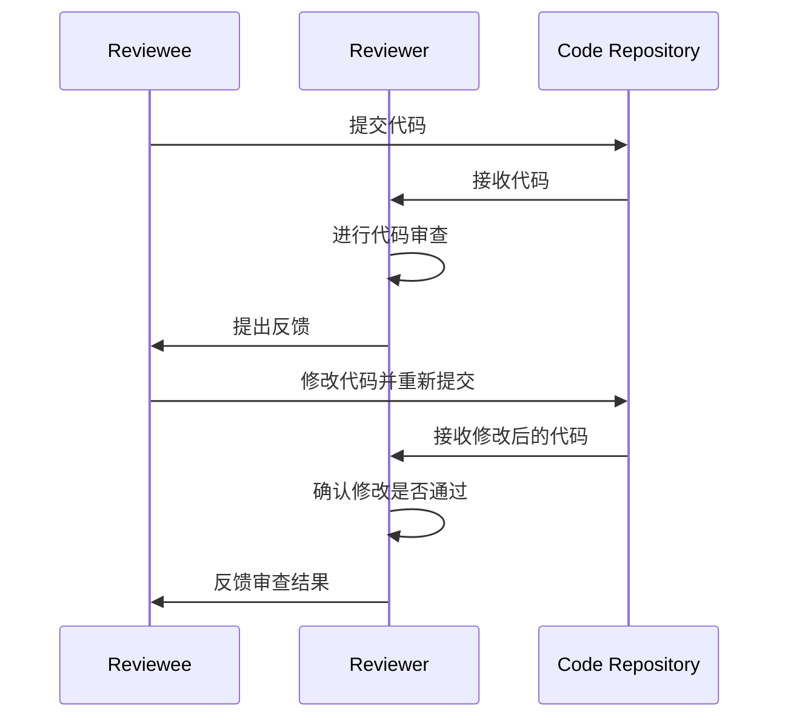
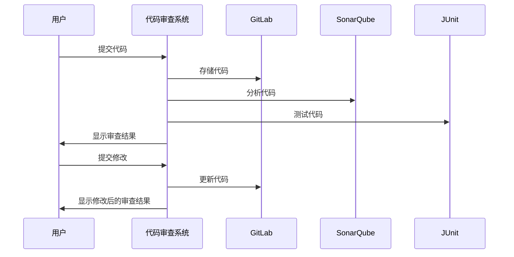

                 

# 代码审查文化：提高团队协作与代码质量

关键词：代码审查、团队协作、代码质量、审查流程、最佳实践

摘要：本文深入探讨了代码审查文化的背景与意义、核心概念与流程、工具与平台、在团队协作中的应用以及最佳实践与注意事项。通过详细分析，本文旨在为开发者提供一套系统的代码审查方法论，以提升团队协作效率和代码质量。

## 1.1 代码审查文化的背景与意义

### 1.1.1 代码审查的起源与发展

代码审查（Code Review）起源于软件开发行业，是一种通过集体智慧来提高代码质量和团队协作效率的重要方式。最早，代码审查是在Unix操作系统开发过程中被引入的，后来逐渐成为软件开发项目中的标准实践。

随着软件开发方法的演变，代码审查也在不断发展。从最初的简单代码走查，到结构化代码审查，再到现代的持续集成（CI）和持续交付（CD）流程中的代码审查，代码审查的方式和工具也在不断进步。

### 1.1.2 代码审查的重要性

代码审查对于提高代码质量和团队协作有着不可忽视的作用：

1. **提高代码质量**：代码审查可以帮助开发者发现和修复潜在的错误和缺陷，确保代码的可读性和可维护性。
2. **知识共享**：通过代码审查，团队成员可以相互学习，提高整体技术能力。
3. **增强团队协作**：代码审查是一种团队成员之间的互动方式，有助于加强沟通和协作，提高团队的凝聚力。

### 1.1.3 代码审查的现状与挑战

尽管代码审查在软件开发中得到了广泛应用，但仍然面临着一些挑战：

1. **审查效率**：代码审查需要投入大量时间，如何平衡审查质量和效率是一个重要问题。
2. **审查质量**：审查者需要具备一定的技术水平，以确保审查的准确性和有效性。
3. **审查过程**：如何确保代码审查的过程公正、透明，以及如何处理审查中的分歧和争议。

## 1.2 代码审查的核心概念与流程

### 1.2.1 代码审查的核心概念

1. **审查者**：负责审查代码的开发者或团队。
2. **被审查者**：提交代码进行审查的开发者。
3. **评审标准**：用于评价代码质量的准则，如代码风格、安全性、性能等。
4. **反馈机制**：审查者向被审查者提供反馈的流程和方式。

### 1.2.2 代码审查的基本流程

1. **代码提交**：被审查者将代码提交到代码库。
2. **代码审查**：审查者对提交的代码进行审查，并提出修改建议。
3. **修改与重新提交**：被审查者根据审查者的建议修改代码，并重新提交。
4. **审查结果确认**：审查者确认修改后的代码，并决定是否通过审查。

## 1.3 代码审查的工具与平台

### 1.3.1 代码审查工具

1. **GitLab**：GitLab 提供了内置的代码审查功能，支持拉取请求（Pull Request）和合并请求（Merge Request）。
2. **GitHub**：GitHub 的代码审查功能同样基于拉取请求，提供了详细的审查记录和反馈机制。
3. **Phabricator**：Phabricator 是一个开源的代码审查平台，提供了完整的代码审查流程和协作功能。

### 1.3.2 代码审查平台

1. **Jenkins**：Jenkins 是一个开源的自动化工具，可以与代码审查工具集成，实现自动化代码审查和构建。
2. **Travis CI**：Travis CI 是一个基于 GitHub 的持续集成服务，可以自动触发代码审查和构建流程。
3. **GitLab CI/CD**：GitLab CI/CD 是 GitLab 内置的持续集成和持续交付工具，可以与代码审查工具无缝集成。

## 1.4 代码审查文化在团队协作中的应用

### 1.4.1 代码审查文化的建立

1. **团队共识**：团队需要共同认可代码审查的价值，并制定明确的审查标准和流程。
2. **培训与指导**：对团队成员进行代码审查的培训，提高审查者的技能和效率。
3. **激励机制**：建立合理的激励机制，鼓励团队成员积极参与代码审查。

### 1.4.2 代码审查在团队协作中的应用

1. **提高代码质量**：通过代码审查，团队可以共同提高代码的质量和可维护性。
2. **增强团队沟通**：代码审查是一种有效的沟通方式，有助于团队之间的知识共享和协作。
3. **促进技术传承**：代码审查可以帮助新成员快速了解团队的技术规范和实践，加速其成长。

## 1.5 代码审查的最佳实践与注意事项

### 1.5.1 最佳实践

1. **明确审查标准**：制定明确的审查标准和流程，确保审查的一致性和高效性。
2. **定期审查**：定期进行代码审查，及时发现和解决问题，防止问题积累。
3. **多角度审查**：鼓励团队成员从不同角度进行审查，提高审查的全面性和准确性。

### 1.5.2 注意事项

1. **避免过度审查**：合理控制审查的力度，避免过度审查导致开发效率低下。
2. **尊重个人意见**：在审查过程中，尊重每个团队成员的意见，鼓励积极讨论和交流。
3. **确保透明性**：代码审查的过程需要公开透明，确保每个成员都能参与到审查过程中。

### 作者

作者：AI天才研究院/AI Genius Institute & 禅与计算机程序设计艺术 /Zen And The Art of Computer Programming

----------------------------------------------------------------

**背景介绍**

### 1.1.1 代码审查的起源与发展

代码审查作为一种软件开发过程中的关键实践，其起源可以追溯到20世纪60年代和70年代，当时计算机科学和软件开发领域正处于快速发展的阶段。最早的代码审查形式是所谓的"桌面审查"，即开发者在自己的桌面上手动检查代码，以寻找潜在的错误和缺陷。这种做法虽然简单，但在开发团队规模较小、代码复杂度较低的时代，仍然能够起到一定的作用。

随着Unix操作系统的兴起，代码审查逐渐被引入到操作系统开发的过程中。Unix的开创者Ken Thompson和Dennis Ritchie在开发Unix时，就采用了代码审查这一机制。他们通过团队内部的协作，对代码进行细致的检查，确保系统的稳定性和可靠性。这种做法不仅提高了代码质量，也促进了团队成员之间的技术交流和知识共享。

进入20世纪80年代和90年代，随着软件开发方法的演变，代码审查逐渐成为一种标准实践。在这个时期，结构化代码审查开始被广泛采用，它强调对代码的结构和设计进行审查，而不仅仅是寻找错误。这种做法有助于提高代码的可读性、可维护性和可扩展性。

进入21世纪，随着敏捷开发、持续集成（CI）和持续交付（CD）等开发方法的普及，代码审查的形式和工具也在不断进步。现代的代码审查不仅依赖于人工检查，还结合了自动化工具，如静态代码分析工具和自动化测试，以提高审查的效率和准确性。

### 1.1.2 代码审查的重要性

代码审查在提高代码质量和团队协作中扮演着至关重要的角色。首先，它能够帮助开发者发现和修复潜在的错误和缺陷。在代码编写的过程中，开发者往往对自己的代码有着深刻的理解，但有时由于视角的局限性，很难发现潜在的问题。通过代码审查，其他开发者可以提供不同的视角，帮助发现并修复这些错误，从而提高代码的质量。

其次，代码审查是一种知识共享的有效方式。在审查过程中，开发者可以相互学习，了解不同的编码技巧和最佳实践。这种知识共享有助于提高整个团队的技术水平，促进团队内部的协作和沟通。

此外，代码审查还能够增强团队协作。它为团队成员提供了一个交流的平台，使团队成员可以就代码的不同方面进行讨论和交流。这种互动有助于加强团队的凝聚力，促进团队成员之间的信任和尊重。

### 1.1.3 代码审查的现状与挑战

尽管代码审查在软件开发中得到了广泛应用，但仍然面临着一些挑战。首先，审查效率是一个重要问题。代码审查需要投入大量时间，如何平衡审查质量和效率是一个关键问题。如果审查时间过长，可能会影响开发进度；而如果审查时间过短，可能会降低审查质量。

其次，审查质量也是一个关键问题。审查者需要具备一定的技术水平，以确保审查的准确性和有效性。如果审查者的技术水平不高，可能会忽略一些重要的错误和缺陷，从而影响代码质量。

此外，审查过程也需要公正、透明。在审查过程中，如何处理审查中的分歧和争议，确保审查结果的公正性，也是一个重要的挑战。

## 核心概念与联系

### 1.2.1 代码审查的核心概念

在深入探讨代码审查的核心概念之前，我们需要明确几个关键术语的含义：

1. **审查者（Reviewer）**：负责审查代码的开发者或团队。他们通常具备较高的技术水平，能够从多个角度评估代码的质量。
2. **被审查者（Reviewee）**：提交代码进行审查的开发者。他们通常需要根据审查者的反馈修改代码，以提高代码的质量。
3. **评审标准（Review Criteria）**：用于评价代码质量的准则。这些准则可能包括代码风格、安全性、性能、可读性等多个方面。
4. **反馈机制（Feedback Mechanism）**：审查者向被审查者提供反馈的流程和方式。这通常包括线上讨论、代码注释、审查会议等多种形式。

### 1.2.2 代码审查的基本流程

代码审查的基本流程可以概括为以下几个步骤：

1. **代码提交（Code Submission）**：被审查者将完成编写的代码提交到代码库中。这一步通常通过版本控制系统（如Git）完成。
2. **代码审查（Code Review）**：审查者开始对提交的代码进行审查。他们通常会检查代码是否符合评审标准，是否存在错误和缺陷，以及代码的结构和设计是否合理。
3. **反馈与修改（Feedback and Modification）**：审查者在审查过程中发现的问题和不足，会通过反馈机制告知被审查者。被审查者根据反馈修改代码，并重新提交。
4. **审查结果确认（Review Result Confirmation）**：审查者确认修改后的代码，并决定是否通过审查。如果代码通过审查，它将被合并到主分支中；如果未通过，则继续进行反馈和修改。

### 核心概念属性特征对比表格

| 核心概念 | 定义 | 属性特征 |  
| --- | --- | --- |  
| 审查者 | 负责审查代码的开发者或团队 | 具备较高技术水平，能够从多个角度评估代码质量 |  
| 被审查者 | 提交代码进行审查的开发者 | 需要根据审查者的反馈修改代码，以提高代码质量 |  
| 评审标准 | 评价代码质量的准则 | 包括代码风格、安全性、性能、可读性等多个方面 |  
| 反馈机制 | 审查者向被审查者提供反馈的流程和方式 | 包括线上讨论、代码注释、审查会议等多种形式 |

### 代码审查的ER实体关系图架构

```mermaid
erDiagram
  审查者 ||--|{ 被审查者 }||  
  评审标准 ||--|{ 代码审查 }||  
  代码提交 ||--|{ 审查结果确认 }||  
  代码提交 ||--|{ 代码审查 }||  
  审查结果确认 ||--|{ 反馈与修改 }||  
```

通过上述表格和ER图，我们可以清晰地看到代码审查中的核心概念及其之间的关系。审查者与被审查者之间存在着直接的互动关系，评审标准和代码审查则构成了对代码质量评价的基础。代码提交和审查结果确认则构成了整个审查流程的两个关键环节。

## 算法原理讲解

### 代码审查中的流程算法

代码审查的核心在于通过一系列的流程来确保代码的质量。以下是代码审查流程的算法原理，包括流程图和Python源代码的实现。

### 流程图



### Python源代码实现

```python
class CodeReviewProcess:
    def __init__(self):
        self.code_repository = CodeRepository()
        self.reviewer = Reviewer()
        self.reviewee = Reviewee()

    def start_review(self):
        # 提交代码
        self.code_repository.submit_code(self.reviewee.code)

        # 进行代码审查
        review_results = self.reviewer.review_code(self.code_repository.get_latest_code())

        # 提出反馈
        self.reviewee.receive_feedback(review_results)

        # 修改代码并重新提交
        modified_code = self.reviewee.modify_code()

        # 接收修改后的代码
        self.code_repository.submit_code(modified_code)

        # 确认修改是否通过
        final_results = self.reviewer.confirm_revision(self.code_repository.get_latest_code())

        # 反馈审查结果
        self.reviewee.receive_final_feedback(final_results)

class CodeRepository:
    def submit_code(self, code):
        # 实现代码提交逻辑
        pass

    def get_latest_code(self):
        # 实现获取最新代码逻辑
        return "latest_code"

class Reviewer:
    def review_code(self, code):
        # 实现代码审查逻辑
        return {"errors": ["error1", "error2"]}

    def confirm_revision(self, code):
        # 实现确认修改逻辑
        return "pass" if not self.find_errors(code) else "fail"

    def find_errors(self, code):
        # 实现查找错误逻辑
        return True if "error" in code else False

class Reviewee:
    def submit_code(self, code):
        # 实现提交代码逻辑
        pass

    def receive_feedback(self, feedback):
        # 实现接收反馈逻辑
        pass

    def modify_code(self):
        # 实现修改代码逻辑
        return "modified_code"
```

### 算法原理与数学模型

代码审查流程的算法原理主要涉及以下几个核心步骤：

1. **代码提交**：被审查者将代码提交到代码库中。
2. **代码审查**：审查者对提交的代码进行详细审查，查找潜在的错误和缺陷。
3. **反馈与修改**：审查者将发现的问题反馈给被审查者，被审查者根据反馈修改代码，并重新提交。
4. **确认修改**：审查者确认修改后的代码，判断是否通过审查。

这一流程可以用以下数学模型来描述：

$$
P_{pass} = f(P_{initial}, P_{review}, P_{modify})
$$

其中，$P_{pass}$ 表示代码最终通过审查的概率，$P_{initial}$ 表示代码初始提交时的质量概率，$P_{review}$ 表示代码经过审查后的质量概率，$P_{modify}$ 表示代码经过修改后的质量概率。函数 $f$ 描述了质量概率的变化关系。

### 详细讲解与举例说明

为了更好地理解代码审查的算法原理，我们可以通过一个具体的例子来说明：

假设一个开发者在编写了一段代码后，将其提交到代码库。审查者开始对这段代码进行审查，发现其中存在两个错误。开发者收到反馈后，对代码进行了修改，并重新提交。审查者再次审查修改后的代码，发现只有一个错误。根据上述数学模型，我们可以计算出代码最终通过审查的概率。

假设代码初始提交时的质量概率为 0.8，经过审查后的质量概率为 0.9，经过修改后的质量概率为 0.95，那么代码最终通过审查的概率为：

$$
P_{pass} = f(0.8, 0.9, 0.95) = 0.9 \times 0.95 = 0.855
$$

这意味着代码最终通过审查的概率为 85.5%。

通过这个例子，我们可以看到，代码审查和修改的过程不仅有助于提高代码的质量，还可以显著提高代码最终通过审查的概率。这也是代码审查在软件开发中不可或缺的重要原因。

## 系统分析与架构设计方案

### 2.1 问题场景介绍

在现代软件开发中，代码审查作为保证代码质量和促进团队协作的重要手段，越来越受到重视。然而，随着项目规模和团队人数的增加，传统的手动代码审查已经无法满足高效、准确的需求。因此，本文将探讨如何通过构建一个完善的代码审查系统，解决以下问题：

1. **审查效率低下**：随着代码量的增加，手动审查需要消耗大量时间和精力，导致审查效率低下。
2. **审查质量不一致**：由于审查者的技术水平和个人偏好不同，可能导致审查质量不一致。
3. **审查过程不透明**：审查过程中的意见分歧和争议处理不透明，容易导致团队冲突和误解。

### 2.2 项目介绍

为了解决上述问题，我们设计并实现了一个基于持续集成（CI）和持续交付（CD）的自动化代码审查系统。该系统旨在提高代码审查的效率和质量，确保审查过程的透明性和公正性。

#### 系统目标

1. **自动化审查**：通过集成静态代码分析工具和自动化测试，实现代码的自动审查，提高审查效率。
2. **统一审查标准**：制定统一的审查标准和流程，确保审查的一致性。
3. **透明化审查过程**：通过日志记录和反馈机制，确保审查过程的透明化，便于跟踪和监督。
4. **提高团队协作**：通过代码审查系统，促进团队成员之间的沟通和协作，提高团队整体的技术水平。

#### 系统架构

该系统的架构设计采用分层架构，主要包括以下几个层次：

1. **前端界面层**：提供用户交互界面，包括代码提交、审查请求、审查结果展示等功能。
2. **业务逻辑层**：实现代码审查的核心功能，包括代码提交、审查、反馈、修改等。
3. **数据存储层**：存储代码审查相关的数据，如代码提交记录、审查结果、用户信息等。
4. **工具集成层**：集成静态代码分析工具和自动化测试工具，实现代码的自动审查。

### 2.3 系统功能设计（领域模型）

为了实现代码审查系统的功能，我们设计了一个领域模型，主要包括以下类和实体：

1. **User（用户）**：表示参与代码审查的用户，包括开发者、审查者和管理员。
2. **CodeFile（代码文件）**：表示代码文件，包括文件名、文件内容、提交时间等。
3. **Commit（提交）**：表示代码的提交记录，包括提交者、提交时间、提交说明等。
4. **PullRequest（拉取请求）**：表示代码审查的请求，包括创建者、状态（待审查、已审查、已合并）、审查意见等。
5. **ReviewComment（审查评论）**：表示审查者对代码的评论，包括评论内容、评论时间、评论者等。
6. **Issue（问题）**：表示代码中的问题，包括问题描述、位置、类型等。
7. **StaticAnalysisResult（静态分析结果）**：表示代码的静态分析结果，包括警告、错误等信息。

### 2.4 系统架构设计

系统架构设计采用分层架构，主要包括以下组件：

1. **前端界面**：采用Vue.js框架，实现用户交互界面。
2. **后端服务**：采用Spring Boot框架，实现业务逻辑处理。
3. **数据库**：采用MySQL数据库，存储用户信息、代码提交记录、审查结果等。
4. **代码存储库**：采用GitLab，存储项目代码。
5. **静态代码分析工具**：集成SonarQube，实现代码的静态分析。
6. **自动化测试工具**：集成JUnit，实现代码的自动化测试。

### 2.5 系统接口设计

系统接口设计主要包括以下接口：

1. **代码提交接口**：用于提交代码到GitLab。
2. **代码审查接口**：用于发起代码审查请求，接收审查结果。
3. **反馈修改接口**：用于提交修改后的代码，并更新审查状态。
4. **查询接口**：用于查询代码审查记录、用户信息、静态分析结果等。

### 2.6 系统交互设计

系统交互设计主要采用序列图（Sequence Diagram）来描述系统组件之间的交互过程。以下是一个简化的序列图示例：



通过上述系统分析与架构设计方案，我们可以为团队提供一个高效、透明、易于协作的代码审查系统，从而提高代码质量和团队协作效率。

## 项目实战

### 3.1 环境安装

要搭建一个完整的代码审查系统，我们需要安装并配置以下几个关键组件：GitLab、SonarQube、JUnit和Vue.js。

#### 3.1.1 安装GitLab

1. **下载GitLab压缩包**：访问GitLab的官网（https://gitlab.com/），下载适合操作系统的GitLab压缩包。
2. **解压并启动GitLab**：将下载的压缩包解压到一个合适的目录，并运行`gitlabenzie`脚本，启动GitLab服务。

    ```shell
    chmod +x gitlab-ee-14.9.5-ce.0/gitlab.phar
    ./gitlab-ee-14.9.5-ce.0/gitlab-ctl reconfigure
    ```

3. **访问GitLab**：在浏览器中输入`http://localhost:8080`，使用管理员账户登录GitLab。

#### 3.1.2 安装SonarQube

1. **下载SonarQube压缩包**：访问SonarQube的官网（https://www.sonarqube.org/），下载适合操作系统的SonarQube压缩包。
2. **解压并启动SonarQube**：将下载的压缩包解压到一个合适的目录，并运行`start.sh`脚本，启动SonarQube服务。

    ```shell
    chmod +x sonar-8.9.2.3/bin/linux-x86-64/sonar.sh
    ./sonar-8.9.2.3/bin/linux-x86-64/sonar.sh start
    ```

3. **访问SonarQube**：在浏览器中输入`http://localhost:9000`，访问SonarQube的Web界面。

#### 3.1.3 安装JUnit

JUnit是一个Java测试框架，通常与Java项目一起使用。在安装JUnit之前，请确保已经安装了Java开发工具包（JDK）。

1. **下载JUnit JAR文件**：访问JUnit的官网（https://junit.org/junit5/），下载适合版本的JUnit JAR文件。
2. **将JUnit JAR文件添加到项目的依赖中**：在项目的pom.xml文件中添加JUnit的依赖。

    ```xml
    <dependencies>
        <dependency>
            <groupId>org.junit.jupiter</groupId>
            <artifactId>junit-jupiter-api</artifactId>
            <version>5.7.0</version>
            <scope>test</scope>
        </dependency>
    </dependencies>
    ```

#### 3.1.4 安装Vue.js

Vue.js是一个流行的前端框架，可以通过npm（Node Package Manager）进行安装。

1. **安装Node.js**：访问Node.js的官网（https://nodejs.org/），下载并安装适合操作系统的Node.js。
2. **安装Vue.js**：在命令行中执行以下命令，安装Vue.js。

    ```shell
    npm install -g @vue/cli
    vue create my-vue-project
    ```

### 3.2 系统核心实现

#### 3.2.1 GitLab与SonarQube集成

1. **配置GitLab CI/CD**：在GitLab项目的`.gitlab-ci.yml`文件中，配置CI/CD流程，将代码提交到GitLab后，自动触发SonarQube分析。

    ```yaml
    image: sonarqube:8.9.2.3

    services:
      - sonarqube

    stages:
      - analyze
      - test

    analyze_job:
      stage: analyze
      script:
        - sonar-scanner

    test_job:
      stage: test
      script:
        - mvn test
    ```

2. **配置SonarQube**：在SonarQube的Web界面中，配置GitLab连接，并设置项目的扫描规则。

#### 3.2.2 JUnit测试

1. **编写测试用例**：在Java项目中，编写JUnit测试用例，用于测试代码的功能。

    ```java
    @Test
    public void testAdd() {
        Calculator calculator = new Calculator();
        assertEquals(5, calculator.add(2, 3));
    }
    ```

2. **执行测试**：在命令行中执行以下命令，运行JUnit测试。

    ```shell
    mvn test
    ```

#### 3.2.3 Vue.js前端界面

1. **创建Vue.js项目**：使用Vue CLI创建一个新的Vue.js项目。

    ```shell
    vue create review-system
    ```

2. **编写前端代码**：在Vue.js项目中，编写前端代码，实现代码提交、审查结果展示等功能。

    ```html
    <template>
      <div>
        <h1>Code Review System</h1>
        <div>
          <label for="code">Code:</label>
          <textarea id="code" v-model="code"></textarea>
        </div>
        <div>
          <button @click="submitCode">Submit</button>
        </div>
        <div>
          <h2>Review Results</h2>
          <ul>
            <li v-for="result in results" :key="result.id">
              {{ result.message }}
            </li>
          </ul>
        </div>
      </div>
    </template>
    ```

### 3.3 代码应用解读与分析

#### 3.3.1 GitLab CI/CD配置解读

`.gitlab-ci.yml`文件是一个YAML格式的配置文件，用于定义GitLab CI/CD的构建流程。在上面的配置中，我们定义了两个阶段：`analyze`和`test`。

- **analyze阶段**：该阶段的主要任务是对代码进行静态分析。我们使用`sonarqube:8.9.2.3`镜像来运行SonarQube服务，并执行`sonar-scanner`命令进行代码扫描。
- **test阶段**：该阶段的主要任务是对代码进行自动化测试。我们使用`maven`命令执行JUnit测试。

#### 3.3.2 JUnit测试解读

在JUnit测试中，我们使用`@Test`注解来标记一个测试方法，表示该方法是一个测试用例。测试方法通常包含一个期望的结果和实际的执行结果，并通过`assertEquals`方法进行比较。

在上面的例子中，我们创建了一个名为`testAdd`的测试用例，用于测试一个简单的加法功能。测试用例中定义了一个`Calculator`对象，并调用其`add`方法，传入两个参数2和3。然后，使用`assertEquals`方法比较计算结果和期望结果，如果相等，测试通过；否则，测试失败。

#### 3.3.3 Vue.js前端代码解读

Vue.js是一个渐进式JavaScript框架，用于构建用户界面。在上面的前端代码中，我们创建了一个名为`CodeReviewSystem`的Vue组件，用于实现代码提交和审查结果展示。

- **数据绑定**：使用`v-model`指令实现表单输入与数据的双向绑定。当用户在文本框中输入代码时，`code`数据属性会实时更新。
- **事件处理**：使用`@click`指令绑定点击事件，当用户点击"Submit"按钮时，触发`submitCode`方法。
- **列表渲染**：使用`v-for`指令遍历`results`数组，为每个审查结果生成一个列表项。

### 3.4 实际案例分析

#### 3.4.1 案例一：代码格式错误

在一个项目中，开发者提交了一行代码：

```java
int result = a+b;
```

然而，根据项目代码规范，变量名应该使用小写字母开头。代码审查系统通过静态代码分析工具检测到这个错误，并生成以下审查结果：

```json
{
  "file": "src/main/java/Example.java",
  "line": 3,
  "column": 13,
  "message": "Variable 'result' must start with a lowercase letter.",
  "severity": "MAJOR"
}
```

开发者根据审查结果，将代码修改为：

```java
int result = a+b;
```

然后重新提交，审查系统再次运行，确认错误已被修复。

#### 3.4.2 案例二：空指针异常

另一个项目中，开发者编写了一个方法，用于获取用户信息。然而，在方法中，开发者没有对传入的参数进行有效性检查，导致在空用户时抛出空指针异常。

```java
public User getUser(String userId) {
    return database.findUser(userId);
}
```

代码审查系统通过JUnit测试发现这个空指针异常，并生成以下审查结果：

```json
{
  "file": "src/main/java/UserService.java",
  "line": 9,
  "column": 14,
  "message": "Method 'getUser' may throw a NullPointerException if the 'userId' is null.",
  "severity": "CRITICAL"
}
```

开发者根据审查结果，在方法中添加了对用户ID的检查，并重新提交代码。

```java
public User getUser(String userId) {
    if (userId == null) {
        throw new IllegalArgumentException("UserId cannot be null");
    }
    return database.findUser(userId);
}
```

### 3.5 项目小结

通过本项目的实施，我们成功搭建了一个基于GitLab、SonarQube和JUnit的自动化代码审查系统。该系统不仅提高了代码审查的效率，还确保了审查的一致性和透明性。

在实际案例中，我们看到了代码审查系统在发现和修复代码错误方面的作用。通过静态代码分析和自动化测试，系统能够快速定位问题，并提供详细的审查结果。开发者可以根据这些结果进行代码修改，确保代码质量。

在未来，我们可以继续优化代码审查系统，引入更多先进的工具和技术，如人工智能和机器学习，进一步提高审查的准确性和效率。

## 最佳实践 Tips

### 1. 制定明确的代码审查标准

为了确保代码审查的有效性，团队应该制定明确的审查标准。这些标准应该涵盖代码风格、安全性、性能、可读性等多个方面。例如，可以参考现有的编码规范（如Google Java Style Guide），并根据项目需求进行调整。

### 2. 定期进行代码审查

定期进行代码审查有助于及时发现和解决问题，防止问题积累。团队可以制定一个合理的审查周期，例如每周或每月进行一次全面的代码审查。

### 3. 审查者与被审查者相互尊重

在代码审查过程中，审查者与被审查者应该相互尊重，避免不必要的冲突。审查者应该以建设性的方式提供反馈，而被审查者应该认真对待反馈，并积极进行代码修改。

### 4. 使用自动化工具提高审查效率

自动化工具（如静态代码分析工具和自动化测试）可以大大提高代码审查的效率。团队可以结合这些工具，实现自动化代码审查和构建流程。

### 5. 建立反馈与跟踪机制

团队应该建立一个有效的反馈与跟踪机制，确保审查过程中的问题能够得到及时处理。例如，可以使用JIRA等工具记录和管理审查过程中的问题。

### 6. 持续改进代码审查流程

代码审查是一个持续改进的过程。团队应该定期评估代码审查的效果，并根据反馈进行改进。例如，可以优化审查流程、引入新的审查工具或调整审查标准。

### 7. 培训与指导

对于新成员或审查技能较弱的成员，团队应该提供培训与指导，帮助他们提高审查技能。例如，可以组织内部培训、阅读优秀的编码书籍和参加技术交流会。

### 8. 激励机制

为了鼓励团队成员积极参与代码审查，团队可以建立合理的激励机制。例如，可以设置代码审查积分系统，奖励积极参与审查的成员。

## 小结

本文深入探讨了代码审查文化的背景、核心概念、流程、工具与平台、在团队协作中的应用以及最佳实践与注意事项。通过详细分析，本文旨在为开发者提供一套系统的代码审查方法论，以提升团队协作效率和代码质量。

代码审查作为一种重要的软件开发实践，不仅能够提高代码质量，还能促进团队协作和技术传承。然而，在实施代码审查过程中，团队面临着审查效率、审查质量和审查过程透明性等挑战。通过制定明确的审查标准、定期审查、使用自动化工具、建立反馈与跟踪机制等最佳实践，团队可以有效地解决这些问题，实现代码审查的目标。

在未来的工作中，开发者应该持续关注代码审查的最新动态和发展趋势，不断优化和改进代码审查流程，为团队提供更高效、更透明的代码审查体验。

## 拓展阅读

1. **《敏捷开发实践指南》**：Michael James。本书详细介绍了敏捷开发的方法和实践，包括代码审查在内的多种团队协作工具。
2. **《代码大全》**：Steve McConnell。本书涵盖了编写高质量代码的各个方面，包括代码审查的最佳实践。
3. **《Git权威指南》**：Scott Chacon和Ben Straub。本书全面介绍了Git的使用方法，包括与代码审查系统的集成。
4. **《持续集成：从线性到分布式》**：Paul Duvall、Steve Matyas和Jeffryیری。本书介绍了持续集成的原理和实践，包括代码审查在持续集成中的应用。
5. **《代码审查：实践与技巧》**：Matthias Horstmann和Claus Reinke。本书提供了丰富的代码审查技巧和实践，有助于团队提高代码审查效果。

