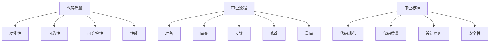
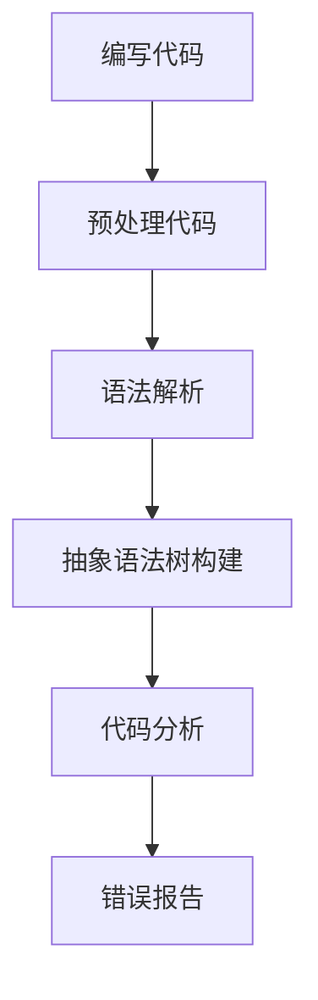
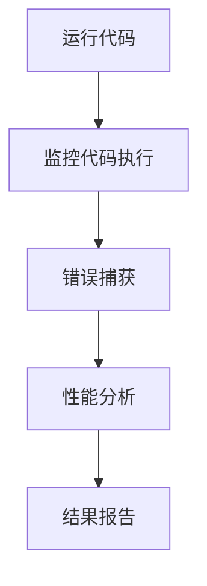
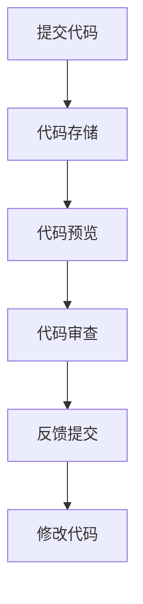
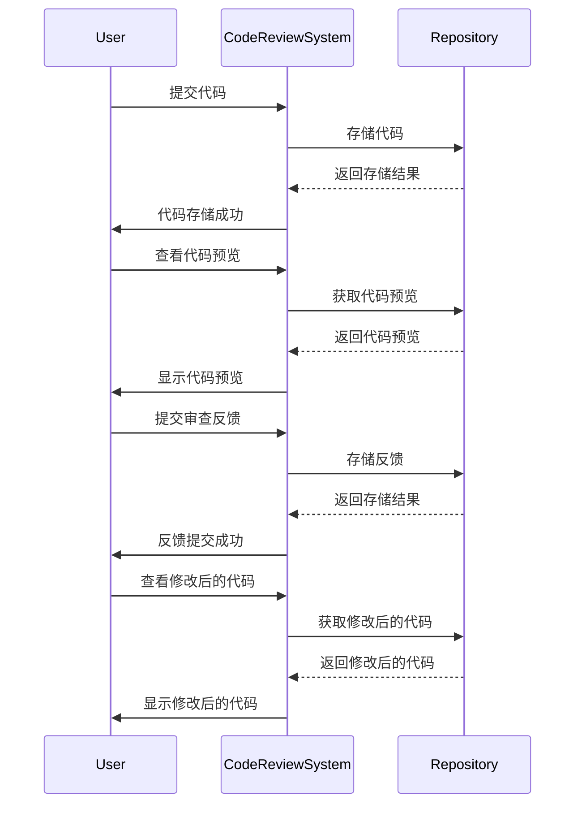
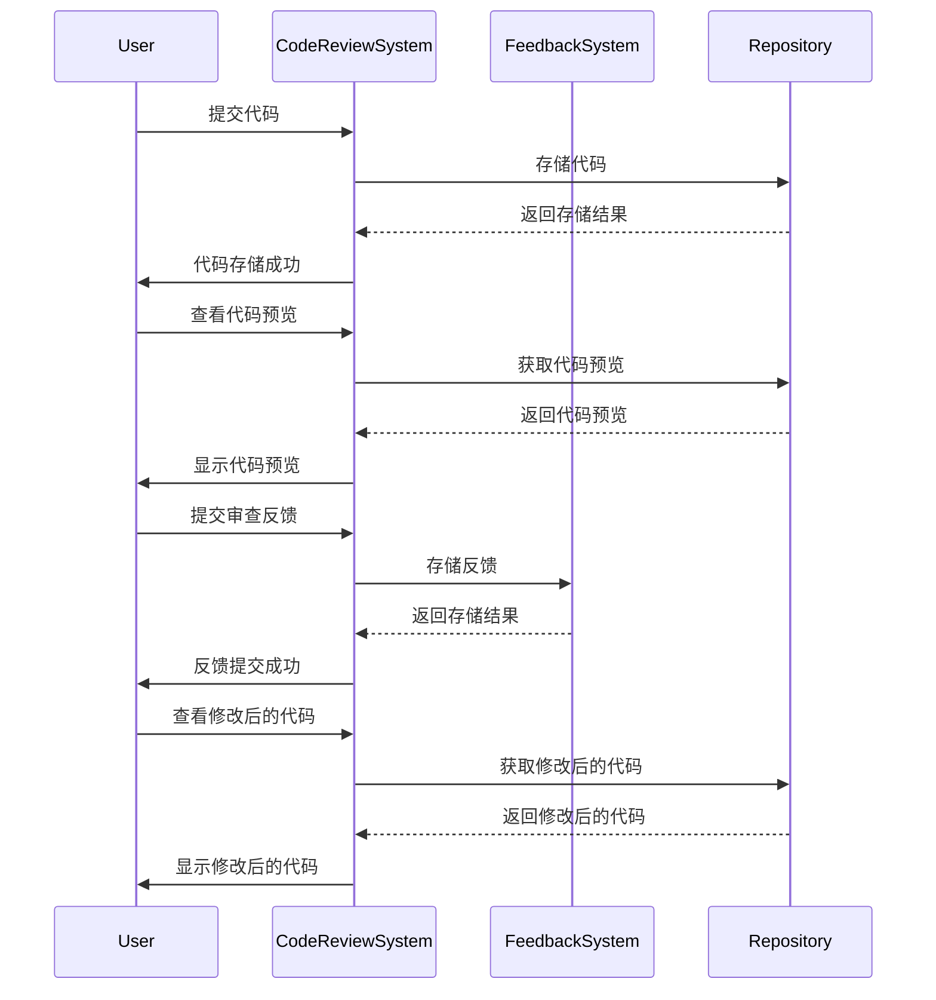

                 

# 代码审查最佳实践：提升团队代码质量

## 关键词

- 代码审查
- 代码质量
- 审查流程
- 静态代码分析
- 动态代码分析
- 代码审查系统
- 项目实战
- 最佳实践

## 摘要

本文旨在探讨代码审查的最佳实践，以提升团队代码质量。通过详细阐述代码审查的定义、重要性、核心概念、算法原理、系统设计与实现，以及项目实战等，本文将为读者提供一套完整的代码审查指南。同时，本文还将总结最佳实践，并提出注意事项和拓展阅读资源，帮助读者更好地理解和应用代码审查技术。

## 目录大纲

### 第一部分：代码审查概述

1. **代码审查的定义与重要性**
   - 代码审查的定义
   - 代码审查的重要性
   - 代码审查的现状

2. **代码审查的核心概念**
   - 代码质量
   - 审查流程
   - 审查标准
   - 核心概念联系图

### 第二部分：代码审查算法原理

1. **静态代码分析**
   - 静态代码分析原理
   - mermaid流程图
   - Python源代码示例

2. **动态代码分析**
   - 动态代码分析原理
   - mermaid流程图
   - Python源代码示例

### 第三部分：代码审查系统设计与实现

1. **代码审查系统架构设计**
   - 代码审查系统架构
   - mermaid架构图

2. **代码审查接口设计**
   - 接口设计
   - mermaid序列图

3. **代码审查系统交互**
   - 系统交互
   - mermaid序列图

### 第四部分：代码审查项目实战

1. **代码审查项目环境搭建**
   - 环境搭建
   - 实际案例

2. **代码审查核心实现**
   - 核心实现
   - 源代码分析
   - 应用解读

### 第五部分：最佳实践与拓展

1. **代码审查最佳实践**
   - 最佳实践 tips
   - 小结

2. **注意事项与拓展阅读**
   - 注意事项
   - 拓展阅读

## 第一部分：代码审查概述

### 第1章：代码审查的定义与重要性

#### 1.1 代码审查的定义

代码审查（Code Review）是一种软件开发过程中的活动，旨在通过团队内成员对代码进行审视和评估，以提高代码质量、发现潜在问题和提升团队协作水平。代码审查可以涵盖从需求分析、设计、编码到测试等多个阶段。

#### 1.2 代码审查的重要性

代码审查在软件开发过程中具有重要意义：

1. **提高代码质量**：通过代码审查，可以发现代码中的错误、漏洞和不规范的地方，从而提高代码质量。
2. **知识共享**：代码审查过程是团队成员之间知识共享和技能提升的机会，有助于团队整体技术水平的提高。
3. **团队合作**：代码审查有助于团队成员之间的沟通和协作，增强团队的凝聚力和合作意识。
4. **风险管理**：代码审查可以降低项目风险，减少因代码质量问题导致的后期维护成本和项目延迟。

#### 1.3 代码审查的现状

目前，代码审查在软件开发中越来越受到重视。许多企业已经开始将其纳入软件开发流程中，并不断探索和优化代码审查的最佳实践。然而，代码审查的实施仍然面临一些挑战，如审查流程不规范、审查标准不明确、人员能力不足等。

### 第2章：代码审查的核心概念

#### 2.1 代码质量

代码质量是代码审查的核心关注点。代码质量包括以下几个方面：

1. **功能性**：代码能够正确地实现需求和功能。
2. **可靠性**：代码在多种情况下都能稳定运行，不会出现异常。
3. **可维护性**：代码易于修改和维护，不会因为小改动而导致大的问题。
4. **性能**：代码的执行效率高，资源消耗低。

#### 2.2 审查流程

代码审查流程包括以下几个步骤：

1. **准备**：提交代码的团队成员准备审查。
2. **审查**：审查人员阅读代码，提出问题和建议。
3. **反馈**：审查人员将反馈结果反馈给提交者。
4. **修改**：提交者根据反馈结果进行修改。
5. **重审**：审查人员对修改后的代码进行再次审查。

#### 2.3 审查标准

审查标准是代码审查的重要依据，包括以下几个方面：

1. **代码规范**：遵循统一的代码规范，如命名规范、代码格式、注释规范等。
2. **代码质量**：代码应符合高质量标准，如功能性、可靠性、可维护性和性能。
3. **设计原则**：代码应遵循设计原则，如单一职责原则、开闭原则、里氏替换原则等。
4. **安全性**：代码应考虑安全性，避免潜在的安全漏洞。

#### 2.4 核心概念联系图

以下是一个核心概念联系图的示例，用于展示代码质量、审查流程和审查标准之间的关系：



## 第二部分：代码审查算法原理

### 第3章：静态代码分析

静态代码分析是一种在代码运行前对代码进行分析的技术，旨在发现潜在的错误和缺陷。以下是一个静态代码分析的mermaid流程图示例：



以下是一个Python源代码示例，用于展示静态代码分析的过程：

```python
# 示例：检查变量是否初始化

def function(x):
    # 如果x未初始化，则抛出异常
    if x is None:
        raise ValueError("x must be initialized")
    return x * 2
```

在这个示例中，我们可以使用Python的`ast`模块来构建抽象语法树（Abstract Syntax Tree，AST），然后对AST进行分析，检查变量是否初始化。以下是一个简单的AST分析代码示例：

```python
import ast

def check_variable_initialized(node):
    if isinstance(node, ast.Name):
        # 检查变量是否初始化
        if node.id not in local_variables:
            raise ValueError(f"{node.id} must be initialized")
    elif isinstance(node, ast.Assign):
        # 检查赋值语句
        for target in node.targets:
            if isinstance(target, ast.Name):
                local_variables.add(target.id)

def visit(node):
    if isinstance(node, ast.FunctionDef):
        local_variables = set()
        check_variable_initialized(node)
    ast.NodeVisitor.visit(self, node)

source_code = '''
def function(x):
    y = x * 2
    return y
'''

tree = ast.parse(source_code)
visitor = ast.NodeVisitor()
visitor.visit(tree)
```

### 第4章：动态代码分析

动态代码分析是一种在代码运行时对代码进行分析的技术，旨在发现实际运行中的错误和缺陷。以下是一个动态代码分析的mermaid流程图示例：



以下是一个Python源代码示例，用于展示动态代码分析的过程：

```python
# 示例：检查函数执行时间

import time

def function(x):
    time.sleep(x)
    return x * 2

start_time = time.time()
result = function(1)
end_time = time.time()

print(f"Function execution time: {end_time - start_time} seconds")
```

在这个示例中，我们使用Python的`time`模块来监控函数的执行时间。以下是一个简单的性能分析代码示例：

```python
import time

def measure_execution_time(function, *args, **kwargs):
    start_time = time.time()
    result = function(*args, **kwargs)
    end_time = time.time()
    print(f"Function execution time: {end_time - start_time} seconds")
    return result

def function(x):
    time.sleep(x)
    return x * 2

measure_execution_time(function, 1)
```

## 第三部分：代码审查系统设计与实现

### 第5章：代码审查系统架构设计

代码审查系统的架构设计是确保代码审查过程高效、有序的关键。以下是一个代码审查系统的mermaid架构图示例：



在这个架构图中，提交代码的团队成员将代码提交到代码存储，代码存储提供代码预览功能，审查人员可以在预览页面对代码进行审查，并将反馈提交给提交者。提交者根据反馈进行修改，然后重新提交代码。

### 第6章：代码审查接口设计

代码审查接口设计是代码审查系统的核心，它决定了系统的可扩展性和易用性。以下是一个代码审查接口设计的mermaid序列图示例：



在这个序列图中，用户通过代码审查系统提交代码，查看代码预览，提交审查反馈，并查看修改后的代码。

### 第7章：代码审查系统交互

代码审查系统的交互设计决定了系统的用户体验和效率。以下是一个代码审查系统交互的mermaid序列图示例：



在这个序列图中，用户通过代码审查系统提交代码，查看代码预览，提交审查反馈，并查看修改后的代码。代码审查系统与代码存储系统和反馈系统进行交互，确保整个流程的顺畅。

## 第四部分：代码审查项目实战

### 第8章：代码审查项目环境搭建

在开始代码审查项目之前，我们需要搭建一个合适的环境。以下是一个简单的环境搭建步骤：

1. **安装Git**：Git是一个版本控制工具，用于管理代码版本。可以从[Git官网](https://git-scm.com/downloads)下载并安装Git。
2. **安装代码审查工具**：常见的代码审查工具有GitLab、GitHub、Gitea等。以GitLab为例，可以从[GitLab官网](https://about.gitlab.com/installation/)下载并安装。
3. **配置代码仓库**：在代码审查工具中创建一个项目仓库，用于存储代码。
4. **添加团队成员**：将团队成员添加到代码仓库中，并分配适当的权限。

### 第9章：代码审查核心实现

代码审查的核心实现包括代码存储、代码预览、代码审查和反馈提交等功能。以下是一个简单的实现示例：

```python
# 示例：代码存储

import os
import json

class CodeRepository:
    def __init__(self, repository_path):
        self.repository_path = repository_path

    def store_code(self, code, filename):
        with open(os.path.join(self.repository_path, filename), 'w') as f:
            f.write(code)

    def load_code(self, filename):
        with open(os.path.join(self.repository_path, filename), 'r') as f:
            return f.read()

# 示例：代码预览

from flask import Flask, render_template

app = Flask(__name__)

class CodePreview:
    def __init__(self, repository):
        self.repository = repository

    def get_preview(self, filename):
        code = self.repository.load_code(filename)
        return render_template('code_preview.html', code=code)

app.add_url_rule('/preview/<filename>', view_func=CodePreview.get_preview, endpoint='code_preview')

# 示例：代码审查

from flask import request, redirect, url_for

class CodeReview:
    def __init__(self, repository):
        self.repository = repository

    def review_code(self, filename, feedback):
        with open(os.path.join(self.repository.path, filename + '.json'), 'w') as f:
            json.dump(feedback, f)

    def get_feedback(self, filename):
        with open(os.path.join(self.repository.path, filename + '.json'), 'r') as f:
            return json.load(f)

@app.route('/review/<filename>', methods=['POST'])
def review_code(filename):
    feedback = request.form.to_dict()
    review = CodeReview(repository)
    review.review_code(filename, feedback)
    return redirect(url_for('code_preview', filename=filename))

# 示例：反馈提交

from flask import render_template

class FeedbackSubmit:
    def __init__(self, repository):
        self.repository = repository

    def submit_feedback(self, filename, feedback):
        review = CodeReview(repository)
        feedback_file = review.get_feedback(filename)
        feedback_file['feedback'] = feedback
        with open(os.path.join(self.repository.path, filename + '.json'), 'w') as f:
            json.dump(feedback_file, f)

    def get_feedback_form(self, filename):
        feedback_file = review.get_feedback(filename)
        return render_template('feedback_form.html', feedback=feedback_file)

@app.route('/submit_feedback/<filename>', methods=['GET', 'POST'])
def submit_feedback(filename):
    if request.method == 'POST':
        feedback = request.form.to_dict()
        submit = FeedbackSubmit(repository)
        submit.submit_feedback(filename, feedback)
        return redirect(url_for('code_preview', filename=filename))
    else:
        return get_feedback_form(filename)
```

在这个示例中，我们使用了Python的Flask框架来实现代码存储、代码预览、代码审查和反馈提交等功能。首先，我们定义了一个`CodeRepository`类，用于代码的存储和加载。然后，我们定义了一个`CodePreview`类，用于代码的预览。接下来，我们定义了一个`CodeReview`类，用于代码的审查和反馈提交。最后，我们定义了一个`FeedbackSubmit`类，用于处理反馈的提交。

### 实际案例分析和详细讲解剖析

在本节中，我们将通过一个实际案例，对代码审查过程进行详细讲解和分析。

#### 案例背景

假设我们有一个开发团队，负责开发一个在线购物系统。团队成员包括前端开发人员、后端开发人员、测试人员和项目经理。项目经理要求团队成员在代码提交前进行代码审查，以提高代码质量。

#### 案例步骤

1. **提交代码**：前端开发人员小王完成了一个购物车的功能，并将代码提交到代码仓库。

2. **代码预览**：项目经理小李查看代码预览，发现代码中有一些格式不规范的地方。

3. **代码审查**：小李进行代码审查，发现代码中有一个函数的参数传递错误。小李将审查结果反馈给小王。

4. **修改代码**：小王根据小李的反馈，修改了代码中的错误，并重新提交。

5. **再次审查**：小李对修改后的代码进行再次审查，确认错误已被修复。

6. **反馈提交**：小李将审查结果和小王反馈的修改记录提交到代码仓库。

7. **代码合并**：项目经理将审查通过的代码合并到主分支，并进行测试。

#### 案例分析

在这个案例中，代码审查发挥了重要作用：

1. **提高代码质量**：通过代码审查，小王能够及时发现并修复代码中的错误，提高代码质量。

2. **知识共享**：小李的审查过程为团队其他成员提供了学习机会，有助于提高整个团队的技术水平。

3. **团队合作**：代码审查过程促进了团队成员之间的沟通和协作，增强了团队凝聚力。

4. **风险管理**：通过代码审查，项目经理能够及时发现潜在的问题，降低项目风险。

#### 案例小结

通过这个实际案例，我们可以看到代码审查在软件开发过程中的重要作用。代码审查不仅有助于提高代码质量，还有助于知识共享、团队合作和风险管理。为了确保代码审查的有效性，团队成员应遵循最佳实践，如明确审查标准、规范审查流程和及时反馈问题。

## 第五部分：最佳实践与拓展

### 第10章：代码审查最佳实践

#### 最佳实践 tips

1. **明确审查标准**：制定统一的代码规范和审查标准，确保团队成员在审查过程中有据可依。

2. **规范审查流程**：制定明确的审查流程，确保代码审查的每个环节都有序进行。

3. **及时反馈问题**：审查人员应尽快将发现的问题反馈给提交者，以便及时修正。

4. **鼓励知识共享**：鼓励团队成员在审查过程中分享经验和知识，提高团队整体技术水平。

5. **避免过度审查**：合理控制审查范围，避免因过度审查而导致项目进度延误。

#### 小结

代码审查是提高代码质量、促进团队协作和降低项目风险的重要手段。通过遵循最佳实践，团队成员可以更好地进行代码审查，提高代码质量，从而确保项目的成功。

### 第11章：注意事项与拓展阅读

#### 注意事项

1. **审查范围**：合理控制代码审查的范围，避免过度审查。

2. **审查频率**：根据项目进度和团队规模，合理调整代码审查的频率。

3. **审查人员能力**：确保审查人员具备足够的技能和经验，以便有效地进行代码审查。

4. **反馈及时性**：及时反馈问题，避免拖延修改。

#### 拓展阅读

1. **《代码大全》**：Steve McConnell的《代码大全》提供了丰富的代码审查技巧和最佳实践。

2. **《敏捷开发实践指南》**：Jeff Sutherland的《敏捷开发实践指南》介绍了敏捷开发中的代码审查方法和工具。

3. **《代码审查：实用指南》**：Paul Aminger和Rudolf Wille的《代码审查：实用指南》提供了详细的代码审查指南。

### 总结

代码审查是软件开发过程中不可或缺的一环，通过本文的介绍，我们了解了代码审查的定义、重要性、核心概念、算法原理、系统设计与实现，以及项目实战和最佳实践。希望通过本文，读者能够更好地理解和应用代码审查技术，提升团队代码质量。

## 作者信息

作者：AI天才研究院/AI Genius Institute & 禅与计算机程序设计艺术 /Zen And The Art of Computer Programming

（注：本文内容仅供参考，具体实施时请结合实际项目情况进行调整。）

