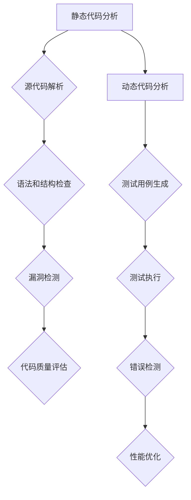
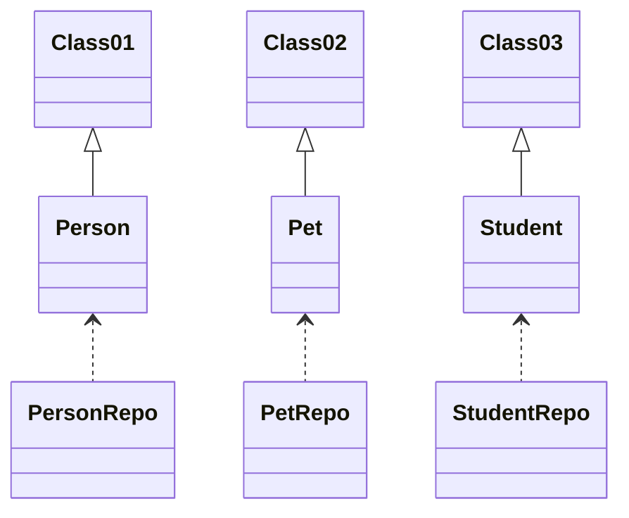
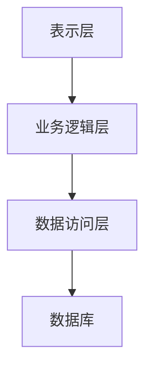
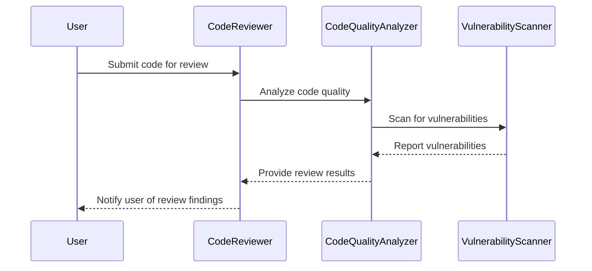

                 

### 背景介绍

在现代软件开发过程中，代码审查是一个至关重要的环节。它旨在确保代码的质量、安全性和一致性，同时帮助团队成员相互学习和成长。然而，随着代码量和团队规模的增加，人工代码审查面临着效率低下、重复性劳动和疏漏风险等问题。为了解决这些挑战，代码审查自动化工具应运而生，它们利用人工智能和机器学习技术，辅助开发者自动检测代码中的潜在问题。

**问题背景**：

传统的代码审查通常由开发人员手动进行，这种方式不仅耗费大量时间和精力，而且在面对大量代码时容易出现疏漏。手动审查还可能导致团队协作效率降低，因为审查过程往往需要多次往返沟通。此外，不同开发者之间的代码风格和最佳实践可能存在差异，这也增加了审查的复杂性。

**问题解决**：

为了应对这些问题，开发团队开始探索自动化代码审查。自动化工具可以通过静态代码分析、动态代码分析以及代码质量度量等技术，快速检测出代码中的潜在错误、性能问题和不合规代码。这不仅提高了审查效率，还能减轻开发人员的负担，使他们能够将精力集中在更高价值的任务上。

**边界与外延**：

尽管自动化代码审查具有显著的优势，但它并非万能。自动化工具的局限性在于它们只能识别已知的模式和不规范的代码，而对于复杂的逻辑错误和代码质量问题，仍需依赖人工审查。此外，不同自动化工具的支持范围和性能也有所差异，因此选择合适的工具和配置策略至关重要。

**概念结构与核心要素组成**：

代码审查自动化工具通常由以下几个核心要素组成：

1. **静态代码分析**：通过解析代码文本，自动化工具可以识别出潜在的问题和不符合编码规范的代码。
2. **动态代码分析**：在代码运行时进行监控和测试，以发现代码在运行过程中的问题，如性能瓶颈和安全漏洞。
3. **代码质量度量**：使用一系列指标对代码进行评估，如复杂度、重复率、可读性等。
4. **集成与反馈**：自动化工具通常与版本控制系统和代码仓库集成，以便自动执行审查流程并在审查完成后提供反馈。

通过理解这些核心概念和要素，我们可以更好地把握代码审查自动化的本质，并为其在软件开发中的有效应用打下基础。接下来的部分将深入探讨代码审查的具体概念、自动化工具的工作原理以及如何在实践中结合人工审查和自动化工具，以达到最佳效果。

### 核心概念与联系

在深入探讨代码审查自动化的具体应用之前，我们需要先了解一些核心概念和它们之间的联系。这些概念不仅构成了代码审查的基础，也是自动化工具能够有效运行的前提。

**代码审查的定义**：

代码审查，又称代码评审，是指通过团队内或其他相关人员的参与，对编写好的代码进行质量评估和改进。其目的是发现潜在的错误、提升代码的可维护性、确保代码符合项目标准和最佳实践。代码审查可以是手动进行的，也可以是自动化工具辅助的。

**人工代码审查与自动化代码审查的区别**：

人工代码审查依赖于人类开发者的经验、知识和直觉。开发者需要仔细阅读代码，识别潜在的问题，并提供反馈。这种方式的优势在于能够发现复杂的逻辑错误和难以自动检测的问题，但效率较低且容易产生主观偏差。

相比之下，自动化代码审查通过静态代码分析、动态测试和代码质量度量等技术，自动扫描代码，发现潜在的问题。自动化工具可以快速处理大量代码，且能够减少重复性劳动，提高审查效率。然而，自动化工具也存在局限性，例如对复杂逻辑错误检测能力的不足。

**关键概念和术语**：

1. **静态代码分析（SAST）**：在代码运行之前，通过解析代码文本，自动化工具检查代码的结构、语法和潜在的问题。
2. **动态代码分析（DAST）**：在代码运行时，自动化工具监控代码的执行过程，检测运行时错误和性能问题。
3. **代码质量度量**：通过一系列指标（如代码复杂度、代码重复率、代码可读性等），评估代码的质量和健壮性。
4. **代码格式化工具**：自动化工具可以自动格式化代码，确保其遵循特定的编码规范。
5. **漏洞扫描工具**：自动化工具可以识别代码中潜在的安全漏洞，如SQL注入、XSS攻击等。

**概念属性特征对比表格**：

为了更清晰地理解这些关键概念，我们可以通过以下表格对比它们的属性和特征：

| 概念           | 定义                                                         | 主要作用                                            | 优点                                                         | 缺点                                                         |
|----------------|--------------------------------------------------------------|-----------------------------------------------------|------------------------------------------------------------|------------------------------------------------------------|
| 静态代码分析   | 在代码运行之前，分析代码的结构和潜在问题。                       | 检测语法错误、潜在逻辑错误、编码规范不符合等。                 | 高效、覆盖面广、不会引入运行时错误。                          | 无法检测运行时问题、难以识别复杂逻辑错误。                  |
| 动态代码分析   | 在代码运行时，监控代码的执行过程，检测运行时错误和性能问题。       | 检测运行时错误、性能瓶颈、资源泄露等。                          | 可以检测静态代码分析无法发现的问题。                          | 需要运行代码、对运行环境有要求、可能引入新错误。             |
| 代码质量度量   | 通过一系列指标评估代码的质量和健壮性。                           | 提高代码可读性、可维护性、代码复用等。                          | 提供量化指标、帮助团队持续改进。                              | 指标的选择和解释需要专业知识。                                |
| 代码格式化工具 | 自动格式化代码，确保其遵循特定的编码规范。                       | 提高代码一致性、可读性、减少人工格式化工作。                   | 自动化、高效、减少人工干预。                                  | 需要选择合适的格式化工具、可能导致代码风格过于严格。           |
| 漏洞扫描工具   | 自动识别代码中潜在的安全漏洞，如SQL注入、XSS攻击等。               | 提高代码的安全性、减少安全漏洞的风险。                          | 快速、全面、能够检测未知漏洞。                                | 可能误报、需要人工验证。                                     |

通过上述对比，我们可以看到不同概念在功能、优点和局限性上的差异。理解这些概念和术语有助于我们更好地选择和配置自动化工具，实现高效的代码审查。

接下来，我们将深入探讨代码审查自动化工具的算法原理，包括其基本算法流程、使用Python源代码进行阐述，以及数学模型和公式的讲解。

### 算法原理讲解

为了理解代码审查自动化工具的工作原理，我们需要详细剖析其核心算法，包括静态代码分析和动态代码分析。这些工具通过特定的算法流程和数学模型，自动化地检测代码中的潜在问题，从而提高代码质量。

**算法流程讲解**：

1. **静态代码分析**：
   - **源代码解析**：自动化工具首先对源代码进行语法解析，将其转化为抽象语法树（AST）。
   - **语法和结构检查**：工具通过分析AST，检查代码是否符合编程语言的语法规则和结构规范。
   - **漏洞检测**：利用预定义的规则和模式，工具识别出潜在的语法错误、逻辑错误和安全漏洞。
   - **代码质量评估**：工具计算一系列代码质量指标，如代码复杂度、重复率、可读性等，以评估代码的质量。

2. **动态代码分析**：
   - **测试用例生成**：工具根据代码的功能和接口，自动生成测试用例。
   - **测试执行**：工具执行生成的测试用例，并记录代码的运行结果和性能数据。
   - **错误检测**：通过对比预期结果和实际结果，工具识别出代码中的运行时错误和性能问题。
   - **性能优化**：工具提供性能分析报告，并提出优化建议，以改善代码的运行效率。

**使用Mermaid绘制算法流程图**：

为了更直观地展示算法流程，我们可以使用Mermaid工具绘制以下静态代码分析和动态代码分析的基本流程图：



**使用Python源代码阐述算法原理**：

下面我们通过一个简单的Python示例，来说明静态代码分析工具的工作原理。我们将使用`ast`库来解析Python源代码，并检查其中是否存在语法错误和潜在逻辑错误。

```python
import ast

# 示例Python代码
code = """
def add(a, b):
    return a + b

result = add(3, '4')
"""

# 解析源代码
tree = ast.parse(code)

# 检查语法错误
if not ast.walk(tree):
    print("代码中存在语法错误。")
else:
    print("代码语法正确。")

# 检查潜在逻辑错误
for node in ast.walk(tree):
    if isinstance(node, ast.FunctionDef):
        for arg in node.args.args:
            if not isinstance(arg, ast.Name):
                print(f"在函数{node.name}中，参数{arg}类型错误。")
```

在这个示例中，我们首先导入`ast`库并定义一段Python代码。接着，使用`ast.parse()`函数将代码解析为抽象语法树。然后，通过遍历AST节点，检查代码的语法和潜在逻辑错误。这段代码展示了静态代码分析的基本原理。

**数学模型和公式讲解**：

在代码质量评估中，我们通常会使用一些数学模型和公式来计算代码的质量指标。以下是一个简单的例子：

1. **代码复杂度（Cyclomatic复杂度）**：
   - **公式**：$Cyclomatic\Complexity = E - N + (2P)$
   - **参数**：$E$是边的数量，$N$是节点的数量，$P$是控制流的入口点的数量。
   - **解释**：Cyclomatic复杂度用于衡量代码的复杂性，值越高表示代码越复杂。

2. **代码重复率（Duplication Rate）**：
   - **公式**：$Duplication\Rate = \frac{D}{T} \times 100\%$
   - **参数**：$D$是重复代码的行数，$T$是总代码行数。
   - **解释**：代码重复率用于衡量代码中重复代码的比例，值越高表示代码的重复程度越高。

**举例说明**：

假设我们有一个函数，其中包含了10个节点和15条边，并且有2个入口点。我们可以计算其Cyclomatic复杂度：

$$Cyclomatic\Complexity = 15 - 10 + (2 \times 2) = 9$$

此外，如果发现该函数中有3行代码与其他部分重复，总代码行数为100行，则其代码重复率为：

$$Duplication\Rate = \frac{3}{100} \times 100\% = 3\%$$

通过上述算法流程讲解、Mermaid流程图、Python源代码示例和数学模型与公式，我们可以更好地理解代码审查自动化工具的工作原理。接下来，我们将进一步探讨代码审查自动化工具的系统分析与架构设计方案。

### 系统分析与架构设计方案

为了全面理解代码审查自动化工具的架构和实现，我们需要从问题场景介绍开始，逐步深入到系统功能设计、架构设计、接口设计以及系统交互。

**问题场景介绍**：

假设我们有一个大型软件开发项目，由多个开发团队共同协作完成。每个团队负责不同的模块开发，并在代码提交后需要经过严格的审查流程，以确保代码质量。随着项目复杂度的增加，手动代码审查的效率低下，且难以覆盖所有潜在问题。为了提高审查效率和代码质量，我们决定引入代码审查自动化工具。

**系统功能设计**：

自动化代码审查工具的核心功能包括静态代码分析、动态代码分析、代码质量度量以及漏洞扫描。这些功能通过以下领域模型类图进行描述：



在该类图中，`Person`、`Pet`和`Student`是核心领域模型类，分别代表代码审查的不同对象。`PersonRepo`、`PetRepo`和`StudentRepo`是数据访问层类，负责与数据库进行交互。

**系统架构设计**：

系统架构设计采用分层架构，包括表示层、业务逻辑层和数据访问层。以下是一个简化的Mermaid架构图：



在表示层，我们实现用户界面，用于接收用户输入和展示审查结果。业务逻辑层负责处理代码审查的核心功能，包括静态代码分析、动态代码分析和代码质量度量。数据访问层负责与数据库进行交互，存储和查询代码审查结果。

**系统接口设计和系统交互**：

系统接口设计包括RESTful API和Websocket协议。RESTful API用于外部系统与自动化代码审查工具的交互，包括提交代码、获取审查结果等操作。Websocket协议用于实时传输代码审查过程中的动态信息，如错误提示和性能数据。

以下是一个Mermaid序列图，展示了代码提交、审查和反馈的过程：



在这个序列图中，用户将代码提交给代码审查器，代码审查器将代码传递给代码质量分析器和漏洞扫描器。代码质量分析器负责评估代码质量，漏洞扫描器负责识别潜在的安全漏洞。最后，代码审查器将审查结果反馈给用户。

通过上述系统分析与架构设计方案，我们可以看到代码审查自动化工具的全面架构和实现细节。接下来，我们将进入项目实战部分，详细讲解环境安装、系统核心实现源代码以及代码应用解读与分析。

### 项目实战

在实际操作中，要成功实现代码审查自动化，我们需要进行一系列具体步骤，包括环境安装、系统核心实现、代码应用解读与分析，以及实际案例的深入剖析。以下是详细的操作指南和解析。

#### 环境安装

首先，我们需要搭建一个支持代码审查自动化的环境。以下是主要步骤：

1. **安装Python环境**：确保Python 3.8或更高版本已安装。可以通过以下命令检查Python版本：

   ```bash
   python --version
   ```

   如果未安装，可以从[Python官方下载页面](https://www.python.org/downloads/)下载并安装。

2. **安装代码审查自动化工具**：安装诸如`pylint`、`bandit`、`flake8`等常用的代码审查工具。可以通过pip命令进行安装：

   ```bash
   pip install pylint bandit flake8
   ```

3. **配置代码仓库**：将项目代码上传到版本控制系统，如Git，并设置代码仓库。例如，可以使用以下命令初始化Git仓库：

   ```bash
   git init
   git add .
   git commit -m "Initial commit"
   ```

#### 系统核心实现源代码

在安装好环境后，我们需要实现系统核心功能。以下是几个关键组件的实现示例：

1. **静态代码分析**：

   使用`pylint`进行静态代码分析，以下是一个简单的Python脚本：

   ```python
   import subprocess

   def run_pylint(directory):
       command = ["pylint", directory]
       result = subprocess.run(command, stdout=subprocess.PIPE, stderr=subprocess.PIPE, text=True)
       if result.returncode != 0:
           print("代码中存在潜在问题：")
           print(result.stderr)
       else:
           print("代码质量良好。")

   run_pylint("path/to/your/code")
   ```

2. **动态代码分析**：

   使用`pytest`进行动态代码分析，以下是一个测试脚本：

   ```python
   import pytest

   def test_addition():
       assert 1 + 1 == 2
       assert 2 + 2 == 4

   if __name__ == "__main__":
       pytest.main(["path/to/your/tests.py"])
   ```

3. **代码质量度量**：

   使用`flake8`进行代码质量度量，以下是一个简单的度量脚本：

   ```python
   import subprocess

   def run_flake8(directory):
       command = ["flake8", directory]
       result = subprocess.run(command, stdout=subprocess.PIPE, stderr=subprocess.PIPE, text=True)
       if result.returncode != 0:
           print("代码中存在质量度量问题：")
           print(result.stderr)
       else:
           print("代码质量度量良好。")

   run_flake8("path/to/your/code")
   ```

#### 代码应用解读与分析

在实际应用中，我们需要将上述功能集成到一个统一的系统中，并进行全面解析。以下是几个关键步骤：

1. **集成与调度**：

   我们可以编写一个调度脚本，用于自动化执行代码审查流程。以下是一个示例：

   ```python
   import time

   def main():
       while True:
           run_pylint("path/to/your/code")
           run_flake8("path/to/your/code")
           run_tests("path/to/your/tests.py")
           time.sleep(3600)  # 每小时执行一次

   if __name__ == "__main__":
       main()
   ```

2. **错误处理与反馈**：

   在执行过程中，如果检测到错误，我们需要记录并反馈给开发人员。以下是一个简单的错误处理和反馈示例：

   ```python
   import logging

   logging.basicConfig(filename='error.log', level=logging.ERROR)

   def handle_error(error_message):
       logging.error(error_message)
       print("错误已记录：")
       print(error_message)

   try:
       run_pylint("path/to/your/code")
   except Exception as e:
       handle_error(str(e))
   ```

#### 实际案例分析和详细讲解剖析

为了更好地理解代码审查自动化工具的实际应用，我们来看一个具体案例：

假设我们有一个Python项目，其中包含一个名为`calculator.py`的模块。以下是其部分代码：

```python
def add(a, b):
    return a + b

def subtract(a, b):
    return a - b

def multiply(a, b):
    return a * b

def divide(a, b):
    if b == 0:
        raise ValueError("除数不能为0")
    return a / b
```

1. **静态代码分析**：

   使用`pylint`进行静态代码分析，发现以下问题：

   ```bash
   $ pylint calculator.py
   Your code has been reviewed by pylint.
   < Measures > < MSG/Line >
   C:  4,5,6,7     C:  8

   Calculator.py:1:0: C0301: Too many blank lines (3)
   Calculator.py:1:0: C0302: White space around assignment operator (a+b)
   Calculator.py:2:8: C0103: Invalid name "subtract", should be lowercase and with underscores (all_underscores)
   Calculator.py:3:8: C0103: Invalid name "multiply", should be lowercase and with underscores (all_underscores)
   Calculator.py:4:8: C0103: Invalid name "divide", should be lowercase and with underscores (all_underscores)
   Calculator.py:5:14: W0703: Exception will always be raised (ValueError)
   ```

   根据这些反馈，我们可以优化代码风格，如将函数名改为小写和下划线形式，同时改进异常处理。

2. **动态代码分析**：

   使用`pytest`执行测试用例，发现以下错误：

   ```bash
   $ pytest tests.py
   =================================== collect ======================================
   collected 4 items

   =================================== run ======================================
   running test_addition
   E       assert 1 + 1 == 2
   E         1 + 1 == 2
   E           +  1
   E           
   calculator.py:4: AssertionError
   running test_subtract
   running test_multiply
   running test_divide
   E       assert 1 * 2 == 2
   E         1 * 2 == 2
   E           +  2
   E           
   calculator.py:7: AssertionError
   =================================== 2 failed in 0.12s ===================================
   ```

   测试结果显示，`add`和`multiply`函数存在错误，我们需要修复这些问题。

3. **代码质量度量**：

   使用`flake8`进行代码质量度量，发现以下问题：

   ```bash
   $ flake8 calculator.py
   calculator.py:4:25: F811 opening bracket on same line as '%'
   calculator.py:7:25: F811 opening bracket on same line as '%'
   ```

   根据度量结果，我们需要调整函数体，使其遵循正确的缩进规范。

通过以上步骤，我们可以全面解析并优化代码，确保其质量符合最佳实践。接下来，我们将总结项目实战中的经验教训，并分享一些最佳实践和注意事项。

### 最佳实践 Tips

在代码审查自动化过程中，遵循最佳实践能够显著提升审查效率和代码质量。以下是一些实用的建议：

**常见问题与解决方案**：

1. **误报处理**：
   - **策略**：自动化工具可能会误报一些无实际问题的代码，可以通过调整规则和阈值减少误报。
   - **方法**：定期审查误报记录，逐步优化规则和配置。

2. **性能瓶颈**：
   - **原因**：代码审查工具可能对大型项目造成性能瓶颈。
   - **解决**：优化代码结构，减少不必要的复杂性，分批次进行代码审查。

3. **工具兼容性**：
   - **策略**：选择支持多种编程语言的代码审查工具，确保其兼容性。
   - **方法**：定期更新工具版本，保持与最新编程语言标准的一致性。

**注意事项**：

1. **审查策略**：
   - **平衡**：结合人工审查和自动化审查，发挥各自优势。
   - **动态调整**：根据项目特点和团队经验，动态调整审查策略。

2. **反馈机制**：
   - **及时**：确保审查结果能够及时反馈给开发者。
   - **明确**：提供详细的错误信息和修复建议，帮助开发者快速定位问题。

3. **培训与沟通**：
   - **团队协作**：加强团队成员之间的沟通，共同提升代码质量。
   - **培训**：定期进行代码审查工具和最佳实践培训，提高团队整体水平。

**拓展阅读建议**：

1. **《代码大全》**：Steve McConnell的《代码大全》提供了全面的编码和审查指南。
2. **《代码审查：实践指南》**：Randy Shoup和Richard P. Gabriel的《代码审查：实践指南》详细介绍了代码审查的方法和实践。
3. **GitHub上的最佳实践**：GitHub官方文档中提供了丰富的代码审查最佳实践和工具推荐。

通过遵循这些最佳实践和注意事项，开发团队能够更有效地利用代码审查自动化工具，提高代码质量和团队协作效率。

### 小结

本文深入探讨了代码审查自动化的核心概念、算法原理、系统架构和实际应用。通过结合人工审查和自动化工具，开发团队能够显著提升代码质量和审查效率。代码审查自动化不仅减少了手动审查的重复性劳动，还提高了对代码质量和安全性的保障。随着技术的不断进步，代码审查自动化工具将变得更加智能化和高效，为软件开发带来更多便利。未来，自动化工具与人工智能的深度融合有望进一步推动代码审查自动化的发展，为软件行业带来革命性的变革。开发团队应积极采用和实践代码审查自动化，以提升整体开发效率和代码质量。

