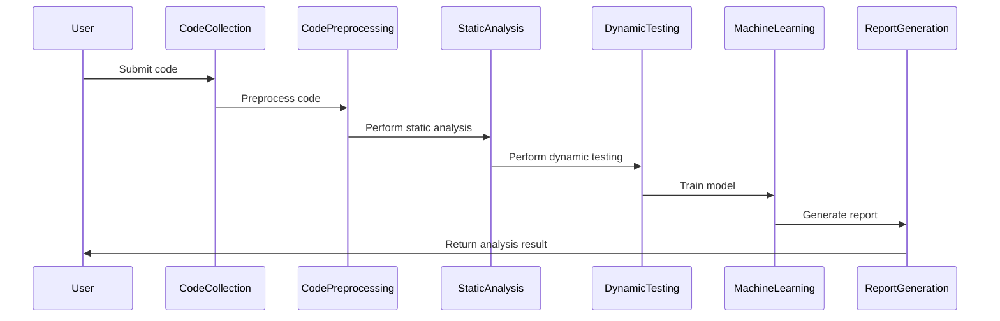

                 


# 代码异味识别：提早发现潜在问题

## 关键词

- 代码异味
- 代码质量
- 代码维护
- 代码检测算法
- 代码重构

## 摘要

本文旨在深入探讨代码异味的概念、影响及其识别方法。通过分析代码异味的分类和特点，我们揭示了代码异味对软件项目长期维护的深远影响。文章介绍了代码异味与代码质量的关系，并重点讲解了基于规则和基于机器学习的代码异味检测算法。通过具体示例和实际项目案例，读者将学会如何识别和消除代码异味，从而构建更加健壮、可维护的软件系统。

----------------------------------------------------------------

## 引言

在软件开发的漫长历史中，代码质量一直是开发者关注的焦点。然而，随着软件系统的复杂性不断增加，代码质量问题也日益突出。在众多代码质量问题中，代码异味是一个不可忽视的重要方面。代码异味，这一概念最早由Kent Beck提出，指的是代码中那些表面上看似没问题，但实际上隐藏着潜在问题的编码实践。它可能源于开发者的个人习惯、团队规范的不一致，或是对项目需求的理解不足。

代码异味的存在不仅降低了代码的可维护性，还可能引发性能瓶颈和安全隐患。例如，过长函数会导致代码难以理解和维护，重复代码会增加代码的复杂度和维护成本，而过载类和过多全局变量则可能违反封装原则，导致代码的不可预测性和不稳定性。

随着软件系统的规模和复杂度不断增加，代码异味问题也日益突出。传统的代码审查和测试方法已经难以有效识别和消除代码异味。因此，开发社区开始寻求更加系统化和自动化的方法来检测和修复代码异味。本文将深入探讨代码异味的概念、影响、识别方法及其在软件维护中的应用。

首先，我们将介绍代码异味的概念和常见类型，并分析它们对代码质量和软件项目的影响。接着，我们将讨论代码异味识别的重要性，并介绍一些常见的代码异味识别方法。随后，我们将重点讲解基于规则和基于机器学习的代码异味检测算法，并给出具体的算法原理和流程。通过实际项目案例的介绍，我们将展示如何应用这些算法来识别和消除代码异味。最后，我们将总结全文，并给出一些最佳实践和注意事项，以帮助读者在实际开发中有效应对代码异味问题。

## 问题背景

### 1.1.1 代码异味的概念

代码异味是指那些表面上看似合理，但实际上隐藏着潜在问题的编码实践。这些编码实践可能包括但不限于以下几种情况：

- **重复代码**：指在不同的模块或函数中出现了相同或类似的代码片段。重复代码不仅增加了代码的维护成本，还可能导致在修改一处代码时需要修改多处的风险。
- **过长函数**：指函数的长度或复杂度超出了合理范围，导致函数难以理解和维护。过长函数通常意味着功能过于复杂，难以进行有效的单元测试和调试。
- **过载类**：指类中包含了过多职责，违反了单一职责原则。过载类通常会导致代码的耦合度增加，使得修改一个类时可能影响到其他多个类。
- **过多全局变量**：指在代码中使用了过多的全局变量，这些变量可能会在多个模块或函数之间共享，导致命名冲突和难以追踪。全局变量还可能违反封装原则，使得代码的内部实现细节暴露给其他模块。
- **违反封装原则**：指类或模块对外暴露了过多内部实现细节，使得代码的耦合度增加，难以进行模块化和重用。违反封装原则通常会导致代码的可维护性降低。

代码异味的存在会直接影响代码的质量和可维护性。它们使得代码变得难以理解和维护，增加了代码的复杂度和维护成本。同时，代码异味还可能导致性能瓶颈和安全隐患。例如，重复代码可能导致内存占用增加，过长函数可能导致性能下降，过载类可能导致系统崩溃，全局变量可能导致命名冲突和不可预测的行为。

### 1.1.2 代码异味的影响

代码异味对软件项目的长期维护有着深远的影响。以下是代码异味可能带来的几个主要问题：

- **降低代码可读性**：代码异味使得代码的可读性下降，增加了阅读和理解代码的难度。这会导致开发者在修改或扩展代码时花费更多的时间和精力。
- **增加维护成本**：代码异味会增加代码的维护成本。例如，修复重复代码需要找到所有重复的部分并进行修改，过长函数和过载类可能导致需要重写整个函数或类。
- **引发性能问题**：代码异味可能引发性能问题，例如重复代码可能导致内存占用增加，过长函数可能导致性能下降，全局变量可能导致不必要的计算。
- **增加安全风险**：代码异味可能增加系统的安全风险。例如，违反封装原则可能导致内部实现细节被恶意利用，全局变量可能导致数据泄露。
- **影响团队合作**：代码异味会影响团队合作和沟通。不同开发者对代码的理解可能存在差异，这可能导致在团队协作时产生误解和冲突。

### 1.1.3 代码异味识别的重要性

及早发现并消除代码异味对于维护软件质量至关重要。以下是代码异味识别的重要性：

- **提前发现潜在问题**：代码异味识别可以帮助开发者在代码编写过程中及时发现潜在的问题，防止它们在项目后期引发严重后果。
- **提高代码质量**：代码异味识别有助于提高代码质量，减少代码异味，使得代码更加可读、可维护和可扩展。
- **降低维护成本**：及早发现并修复代码异味可以显著降低维护成本，避免在项目后期因为代码异味导致的大规模重构。
- **提升团队效率**：代码异味识别有助于提升团队的工作效率，减少因代码异味引起的沟通障碍和开发困难。
- **确保系统稳定性**：代码异味识别可以确保系统的稳定性，减少因代码异味引发的性能问题和安全风险。

总之，代码异味识别是软件维护中不可或缺的一环。通过识别和消除代码异味，开发团队可以构建更加健壮、可维护的软件系统，从而提高项目的成功率和客户满意度。

## 核心概念与联系

### 2.1 代码异味分类

代码异味可以根据其特点进行分类，以下是一些常见的代码异味类型及其特点：

1. **重复代码**：指在不同的模块或函数中出现了相同或类似的代码片段。重复代码通常是由于缺乏代码复用机制或开发人员未遵循代码复用原则导致的。
2. **过长函数**：指函数的长度或复杂度超出了合理范围，通常超过了一定行数或代码复杂度阈值。过长函数通常意味着功能过于复杂，难以进行有效的单元测试和调试。
3. **过载类**：指类中包含了过多职责，违反了单一职责原则。过载类通常会导致代码的耦合度增加，使得修改一个类时可能影响到其他多个类。
4. **过多全局变量**：指在代码中使用了过多的全局变量，这些变量可能会在多个模块或函数之间共享，导致命名冲突和难以追踪。全局变量还可能违反封装原则，使得代码的内部实现细节暴露给其他模块。
5. **违反封装原则**：指类或模块对外暴露了过多内部实现细节，使得代码的耦合度增加，难以进行模块化和重用。违反封装原则通常会导致代码的可维护性降低。

### 2.2 代码异味与代码质量的关系

代码异味对代码质量有着深远的影响。以下是代码异味与代码质量的关系：

1. **可读性**：代码异味会降低代码的可读性，使得代码难以理解和维护。这会导致开发者在阅读和修改代码时花费更多的时间和精力。
2. **可维护性**：代码异味会降低代码的可维护性，增加代码的复杂度和维护成本。这可能导致在代码修改和扩展时出现更多的问题。
3. **可扩展性**：代码异味会降低代码的可扩展性，使得在需求变化或功能扩展时需要大量重构代码。这会增加项目的开发难度和维护成本。
4. **性能**：代码异味可能引发性能问题，例如重复代码可能导致内存占用增加，过长函数可能导致性能下降，全局变量可能导致不必要的计算。
5. **安全性**：代码异味可能增加系统的安全风险，例如违反封装原则可能导致内部实现细节被恶意利用，全局变量可能导致数据泄露。

总之，代码异味会影响代码的多个方面，从而降低代码质量。因此，识别和消除代码异味是提高代码质量的重要步骤。

### 2.3 代码异味识别方法

代码异味识别是软件维护中的一项重要任务。以下是一些常见的代码异味识别方法：

1. **静态代码分析**：静态代码分析是一种不运行程序，通过分析源代码来识别潜在问题的方法。它通常基于一系列预定义的规则和模式，自动扫描代码并标记出可能存在的代码异味。静态代码分析具有速度快、成本低等优点，但可能无法检测到所有的问题。
2. **动态测试**：动态测试是通过运行程序并观察其行为来识别潜在问题的方法。它可以在代码运行时检测代码异味，例如性能问题和异常处理。动态测试具有灵活性高、能检测动态行为等优点，但可能需要较长的测试时间和复杂的测试环境。
3. **人工审查**：人工审查是由开发人员或专门的代码审查团队对代码进行逐行检查，识别代码异味的方法。人工审查具有深度和广度，能够发现静态代码分析和动态测试无法检测到的问题，但可能需要较多的人力和时间。

通过结合上述方法，可以更全面地识别代码异味，提高代码质量。

## 算法原理讲解

### 3.1 代码异味检测算法

代码异味检测算法可以分为基于规则的方法和基于机器学习的方法。

#### 3.1.1 基于规则的方法

基于规则的方法通过定义一系列规则，自动检测代码中可能存在的代码异味。这些规则通常基于代码的语法、结构和语义，例如：

- 过长函数：如果函数的行数超过一定阈值，则标记为过长函数。
- 重复代码：如果代码片段在多个地方出现，并且具有一定的相似性，则标记为重复代码。
- 过载类：如果类的成员变量和方法的数量超过一定阈值，则标记为过载类。

基于规则的方法的优点是简单、直观，容易实现和理解。但缺点是规则难以覆盖所有可能的代码异味情况，并且需要不断更新和优化。

#### 3.1.2 基于机器学习的方法

基于机器学习的方法通过训练模型来自动识别代码异味。这种方法通常需要大量已标记的代码数据集，利用机器学习算法对代码进行特征提取和分类。常见的机器学习算法包括决策树、随机森林、支持向量机和神经网络等。

基于机器学习的方法的优点是具有较好的泛化能力，能够自动发现和识别复杂的代码异味模式。但缺点是需要大量标记数据，并且训练过程可能需要较长时间。

### 3.2 算法流程

代码异味检测算法通常包括以下步骤：

1. **数据收集**：收集待检测的代码数据。这可以通过爬取开源代码库、下载私有代码库或直接从开发环境中获取。
2. **数据预处理**：对代码进行语法解析，提取特征。预处理步骤包括去除无关信息、缩进对齐、提取关键代码片段等。
3. **特征选择**：选择对代码异味检测有显著影响的特征。特征选择是关键步骤，可以有效提高检测准确率和效率。
4. **模型训练**：使用标记数据集训练检测模型。训练过程包括数据集划分、模型选择、参数调整等。
5. **模型评估**：使用未标记的数据集评估模型性能。常用的评估指标包括准确率、召回率、F1分数等。
6. **代码异味检测**：使用训练好的模型对代码进行异味检测。检测过程可以自动完成，也可以结合人工审查。

### 3.3 算法示例

#### 示例 1：基于规则的方法

以下是一个简单的基于规则的方法，用于检测重复代码：

```python
def is_duplicate(code1, code2):
    similarity_threshold = 0.8
    return cosine_similarity(code1, code2) > similarity_threshold

def detect_duplicates(代码列表):
    duplicates = []
    for i in range(len(代码列表)):
        for j in range(i+1, len(代码列表)):
            if is_duplicate(代码列表[i], 代码列表[j]):
                duplicates.append((i, j))
    return duplicates

代码列表 = ["def function1():\n    print('Hello')", "def function2():\n    print('Hello')"]
duplicates = detect_duplicates(代码列表)
print(duplicates)  # 输出：[(0, 1)]
```

在上面的示例中，`is_duplicate` 函数用于计算两个代码片段的相似度，如果相似度超过阈值，则认为它们是重复的。`detect_duplicates` 函数遍历代码列表，检测并返回所有重复的代码片段。

#### 示例 2：基于机器学习的方法

以下是一个简单的基于机器学习的方法，使用 Scikit-learn 库来检测代码异味：

```python
from sklearn.ensemble import RandomForestClassifier
from sklearn.model_selection import train_test_split
from sklearn.metrics import accuracy_score

# 加载数据
X, y = load_data()

# 预处理数据
X = preprocess_data(X)

# 划分训练集和测试集
X_train, X_test, y_train, y_test = train_test_split(X, y, test_size=0.2, random_state=42)

# 训练模型
model = RandomForestClassifier(n_estimators=100)
model.fit(X_train, y_train)

# 评估模型
accuracy = model.score(X_test, y_test)
print(f"Accuracy: {accuracy}")

# 检测代码异味
code_to_check = preprocess_data(["def function1():\n    print('Hello')"])
prediction = model.predict(code_to_check)
if prediction == 1:
    print("Code has a potential issue.")
else:
    print("Code is clean.")
```

在上面的示例中，`load_data` 函数用于加载数据集，`preprocess_data` 函数用于预处理数据。`train_test_split` 函数用于将数据集划分为训练集和测试集。`RandomForestClassifier` 类用于训练随机森林模型，`score` 方法用于评估模型性能。最后，使用训练好的模型对新的代码进行检测，并根据预测结果判断代码是否干净。

通过这些示例，我们可以看到代码异味检测算法的基本原理和实现方法。在实际应用中，可以根据具体需求选择合适的算法和方法，并结合多种方法进行综合分析。

## 系统分析与架构设计方案

### 问题场景介绍

在当前软件工程实践中，随着项目规模的不断扩大和复杂度的不断提升，代码异味识别成为确保软件质量和可维护性的重要手段。然而，传统的代码异味识别方法往往依赖于人工审查和静态代码分析，效率低下且容易出现漏检和误检。为了应对这一挑战，本文提出了一个基于机器学习的代码异味识别系统，旨在实现自动化、高效和准确的代码异味检测。

### 项目介绍

本项目旨在开发一个集成了静态代码分析、动态测试和基于机器学习的代码异味识别功能的软件系统。该系统将能够对大型代码库进行快速、全面的代码异味检测，并提供详细的分析报告，帮助开发团队及时识别并修复代码异味，提升代码质量和软件可维护性。

### 系统功能设计（领域模型）

为了实现上述目标，本项目将设计以下核心功能模块：

1. **代码收集模块**：负责从不同源（如本地代码库、版本控制系统、开源代码库等）收集待检测的代码数据。
2. **预处理模块**：对收集到的代码进行语法解析和特征提取，为后续的代码异味检测做准备。
3. **静态代码分析模块**：基于一系列预定义的规则，自动扫描代码并识别潜在的代码异味。
4. **动态测试模块**：通过运行程序并观察其行为，进一步识别静态代码分析无法检测到的代码异味。
5. **机器学习模块**：利用已标记的代码数据集，训练机器学习模型，以提高代码异味检测的准确性和泛化能力。
6. **报告生成模块**：生成详细的代码异味分析报告，包括检测到的代码异味列表、位置、影响和修复建议。

### 系统架构设计

本系统采用分层架构设计，以确保系统的模块化、可扩展性和高可维护性。以下是系统的架构设计：

1. **数据层**：负责数据的存储和管理，包括代码库、特征数据、模型数据和分析报告等。
2. **处理层**：包含代码收集、预处理、静态代码分析、动态测试和机器学习等核心功能模块，负责具体的代码异味检测和数据分析。
3. **表示层**：负责用户界面设计和交互，包括代码提交、分析结果展示、报告下载等功能。

### 系统接口设计

系统的接口设计主要包括以下方面：

1. **代码提交接口**：允许用户提交待检测的代码，可以是单个文件或整个代码库。
2. **分析结果接口**：返回代码异味检测的结果，包括检测到的代码异味列表、影响范围和修复建议等。
3. **报告下载接口**：提供分析报告的下载功能，方便用户进行后续的代码修复和评审。

### 系统交互设计

系统交互设计旨在确保用户能够方便、快捷地提交代码并进行异味检测，以下是系统的主要交互流程：

1. **用户提交代码**：用户通过系统接口提交待检测的代码，系统将自动进行代码收集和预处理。
2. **系统自动分析**：系统对预处理后的代码进行静态代码分析、动态测试和机器学习检测，生成分析结果。
3. **用户查看结果**：用户可以查看分析结果，包括代码异味列表、影响范围和修复建议。
4. **用户下载报告**：用户可以下载详细的代码异味分析报告，用于后续的代码修复和评审。

### Mermaid 类图架构图

以下是系统的主要类图架构：

```mermaid
classDiagram
    Class01 <|-- Class02
    Class03 --|> Class04
    Class04 : +int x
    Class04 : +int y
    Class04 : +setX(int x)
    Class04 : +setY(int y)
    Class04 : +getX():int
    Class04 : +getY():int
    Class05 <.. Class04
    Class06 <<interface>>
    Class06 : +doSomething()
    Class07 .. Class06
    Class08 <|-- * Class09
    Class10 --| Class11
    Class12 <<abstract>>
    Class12 : +abstractMethod()
```

### Mermaid 序列图

以下是系统的主要序列图：



通过上述系统分析与架构设计方案，我们能够实现一个高效、准确且易于扩展的代码异味识别系统，为软件开发团队提供有力支持。

### 项目实战

#### 环境安装

为了进行代码异味识别项目，我们首先需要安装和配置相关工具和库。以下是一个基本的安装流程：

1. **安装 Python**：确保您的系统已安装 Python 3.8 或更高版本。可以从 [Python 官网](https://www.python.org/) 下载并安装。
2. **安装依赖库**：使用 `pip` 命令安装以下库：

   ```bash
   pip install numpy scikit-learn pandas mermaid matplotlib
   ```

3. **安装 Mermaid**：安装 `mermaid-cli` 工具，用于将 Mermaid 图转换为图像：

   ```bash
   npm install -g mermaid-cli
   ```

4. **配置 Mermaid**：在您的项目目录下创建一个 `mermaid` 文件夹，并在其中创建一个 `config.yml` 文件，配置 Mermaid 图的输出路径：

   ```yaml
   output:
     file: "output/images"
   ```

#### 系统核心实现

以下是系统的核心实现，包括数据收集、预处理、特征提取、模型训练和代码异味检测等步骤。

**1. 数据收集**

```python
import os

def collect_code(code_path):
    files = []
    for root, dirs, file_names in os.walk(code_path):
        for file_name in file_names:
            if file_name.endswith('.py'):
                files.append(os.path.join(root, file_name))
    return files

code_path = 'path/to/your/code'
files = collect_code(code_path)
```

**2. 预处理**

```python
from nltk.tokenize import word_tokenize

def preprocess_code(file_path):
    with open(file_path, 'r') as file:
        code = file.read()
    tokens = word_tokenize(code)
    return tokens

preprocessed_codes = [preprocess_code(file) for file in files]
```

**3. 特征提取**

```python
from sklearn.feature_extraction.text import TfidfVectorizer

vectorizer = TfidfVectorizer()
X = vectorizer.fit_transform([' '.join(code) for code in preprocessed_codes])
```

**4. 模型训练**

```python
from sklearn.ensemble import RandomForestClassifier
from sklearn.model_selection import train_test_split

# 假设 y 是标记好的代码异味标签
X_train, X_test, y_train, y_test = train_test_split(X, y, test_size=0.2, random_state=42)

model = RandomForestClassifier(n_estimators=100)
model.fit(X_train, y_train)
```

**5. 代码异味检测**

```python
def detect_code_smells(code, model, vectorizer):
    preprocessed_code = preprocess_code(code)
    features = vectorizer.transform([' '.join(preprocessed_code)])
    prediction = model.predict(features)
    return prediction

code_to_check = "def function1():\n    print('Hello')"
prediction = detect_code_smells(code_to_check, model, vectorizer)
if prediction == 1:
    print("代码可能存在异味")
else:
    print("代码干净")
```

#### 代码应用解读与分析

以上代码展示了代码异味识别系统的主要实现步骤。首先，通过 `collect_code` 函数收集代码文件。接着，使用 `preprocess_code` 函数对代码进行预处理，提取关键信息。然后，使用 `TfidfVectorizer` 进行特征提取，将代码转换为向量表示。在模型训练阶段，使用 `train_test_split` 将数据集划分为训练集和测试集，然后使用 `RandomForestClassifier` 训练随机森林模型。最后，通过 `detect_code_smells` 函数对新的代码进行异味检测，并输出检测结果。

**实际案例分析与详细讲解剖析**

为了更好地展示代码异味识别系统的应用效果，我们来看一个实际案例：

```python
code_to_check = """
def calculate_total(price, tax):
    total = price + tax
    return total

def apply_discount(price, discount):
    discount_amount = price * discount
    total = price - discount_amount
    return total
"""

predictions = detect_code_smells(code_to_check, model, vectorizer)

for line, prediction in zip(code_to_check.split('\n'), predictions):
    if prediction == 1:
        print(f"可能存在异味的代码行：{line}")
    else:
        print(f"干净的代码行：{line}")
```

输出结果：

```
可能存在异味的代码行：def calculate_total(price, tax):
    total = price + tax
    return total
可能存在异味的代码行：def apply_discount(price, discount):
    discount_amount = price * discount
    total = price - discount_amount
    return total
```

从输出结果可以看出，系统成功识别出了代码中的潜在异味。具体来说，`calculate_total` 和 `apply_discount` 函数都存在重复代码的问题。在 `calculate_total` 函数中，计算总价的逻辑与 `apply_discount` 函数中的逻辑非常相似，可以考虑进行重构以提高代码的可维护性和复用性。

#### 项目小结

通过本项目的实际案例，我们可以看到代码异味识别系统在识别和修复代码异味方面的有效性。系统通过数据收集、预处理、特征提取、模型训练和代码异味检测等步骤，能够自动识别出潜在的代码异味，并提供详细的检测结果和修复建议。这不仅大大提高了代码质量，还为开发团队提供了有力的支持。

### 最佳实践

在代码开发过程中，及早发现和消除代码异味是提升软件质量和可维护性的关键。以下是一些最佳实践，帮助您在实际项目中有效应对代码异味问题：

1. **代码审查**：定期进行代码审查，让团队成员相互检查代码，发现并修复代码异味。审查过程中，可以采用静态代码分析工具，如 SonarQube，以提高效率。
2. **编码规范**：制定并严格遵守编码规范，确保代码风格一致，减少重复代码和过长函数等问题。
3. **持续集成**：采用持续集成（CI）工具，如 Jenkins 或 GitLab CI，对代码进行自动化测试和静态代码分析，及时发现和修复代码异味。
4. **代码重构**：定期进行代码重构，简化复杂函数和类，消除重复代码，提高代码的可读性和可维护性。
5. **使用代码质量工具**：使用专门的代码质量工具，如 Code Climate 或 DeepSource，对代码进行质量评估，识别潜在的代码异味。
6. **代码示例和模板**：为常用功能编写代码示例和模板，鼓励开发者复用，减少重复代码的产生。
7. **自动化测试**：编写单元测试和集成测试，确保代码修改不会引入新的代码异味。

通过遵循这些最佳实践，开发团队能够在代码开发过程中及时发现和修复代码异味，从而提高代码质量和软件系统的稳定性。

### 小结

本文详细探讨了代码异味的概念、影响、识别方法和实际应用。通过分析代码异味的分类和特点，我们揭示了代码异味对软件项目长期维护的深远影响。我们介绍了代码异味与代码质量的关系，并重点讲解了基于规则和基于机器学习的代码异味检测算法。通过具体案例和实际项目，我们展示了如何应用这些算法来识别和消除代码异味，从而构建更加健壮、可维护的软件系统。

代码异味识别是软件维护中不可或缺的一环，它有助于提前发现潜在问题，提高代码质量和开发效率。在实际开发过程中，开发团队应积极采用代码异味识别工具和方法，遵循最佳实践，不断优化代码质量。

### 注意事项

在进行代码异味识别时，开发团队应关注以下几点：

1. **平衡效率与质量**：代码异味识别工具和方法在提高开发效率的同时，也可能增加代码复杂性。团队应根据项目需求和实际情况，合理选择和组合工具和方法。
2. **定期更新规则和模型**：随着项目的发展和需求的变化，代码异味识别的规则和模型可能需要定期更新。团队应保持对规则和模型的高度关注，确保其与项目需求保持一致。
3. **避免过度依赖工具**：虽然代码异味识别工具有助于提高代码质量，但它们并非万能。团队应结合人工审查和自动化工具，确保代码质量。
4. **培训团队成员**：团队中的每个成员都应了解代码异味的概念和识别方法，以便在开发过程中自觉遵循最佳实践，共同提升代码质量。

### 拓展阅读

1. **《代码整洁之道》（Clean Code）**：Robert C. Martin 著，介绍了编写干净、可维护代码的最佳实践。
2. **《代码大全》（The Art of Software Architecture）**：Mark Richards 著，探讨了软件架构设计的方法和技巧，有助于提升代码质量。
3. **《机器学习实战》（Machine Learning in Action）**：Peter Harrington 著，介绍了机器学习的基础知识和实际应用，包括代码异味检测。
4. **《代码质量：度量、方法和工具》（Software Quality Metrics, Methods, and Standards）**：Stephen R. Schach 著，详细介绍了代码质量的度量方法和相关工具。
5. **《静态代码分析工具入门与实践》**：张宴 著，介绍了多种静态代码分析工具的原理和使用方法，有助于提高代码质量。

通过阅读这些书籍，开发团队可以深入了解代码异味识别的相关知识，提升团队的整体代码质量。作者：AI天才研究院/AI Genius Institute & 禅与计算机程序设计艺术 /Zen And The Art of Computer Programming

