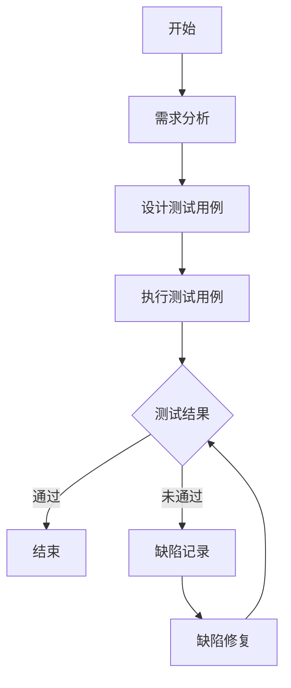
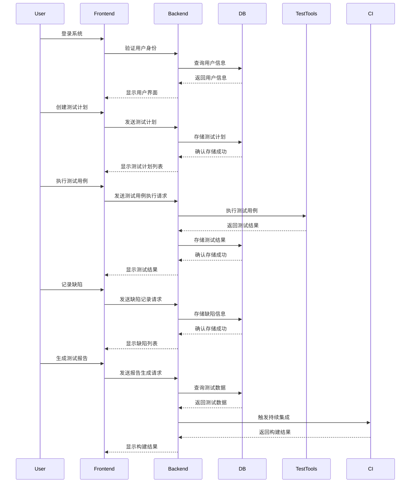
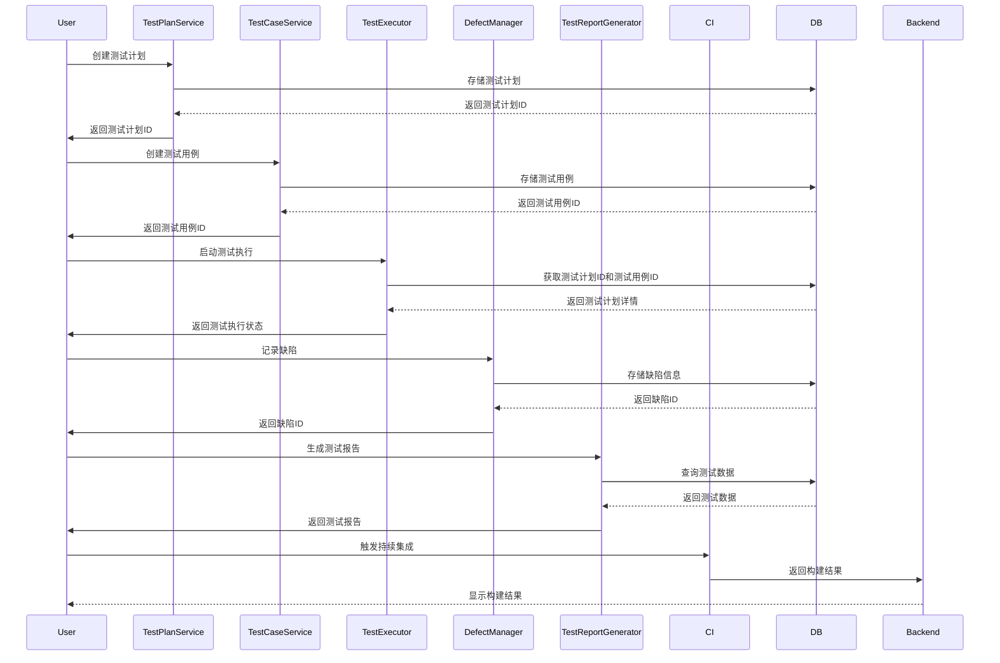

                 


### 背景介绍

代码测试，作为软件工程中的一个关键环节，其重要性不可小觑。在现代软件开发生命周期中，代码测试不仅是保证软件质量的基本手段，更是提升研发效率、减少后期维护成本、增强用户体验的有效途径。然而，当前代码测试的现状却并不乐观。尽管很多开发团队都意识到代码测试的重要性，但在实际操作中，仍然存在诸多问题和挑战。

首先，让我们来探讨一下代码测试的重要性。代码测试的根本目的是验证软件的正确性，确保软件能够按照设计规格运行，并且满足用户需求。具体来说，代码测试有以下几方面的作用：

1. **提高软件质量**：通过测试可以发现和修复代码中的缺陷，降低软件缺陷率，提高软件的可靠性。
2. **降低维护成本**：及时发现问题并修复，可以避免缺陷积累，减少后期维护的复杂度和成本。
3. **提升研发效率**：测试可以揭示潜在的问题，帮助开发团队更快地迭代产品，提高开发效率。
4. **增强用户体验**：高质量的软件能够提供更好的用户体验，提升用户满意度。

然而，当前代码测试的现状却存在诸多问题。首先，测试覆盖率不足是一个普遍现象。很多团队在编写测试用例时，往往只关注核心功能，忽视了边缘情况和异常处理，导致测试覆盖率偏低。其次，测试方法不当也是一个重要问题。有些团队过度依赖单元测试，忽视了集成测试和系统测试，导致测试的全面性不够。此外，自动化测试的缺失也是一个严重的问题。手动测试不仅效率低，而且容易受到人为因素影响，从而导致测试结果不准确。

为了解决上述问题，我们需要建立一套完整的代码测试理论框架和方法。这包括以下几个方面：

1. **全面的测试策略**：制定覆盖所有功能的测试策略，包括单元测试、集成测试、系统测试、性能测试等。
2. **完善的测试用例设计**：设计涵盖所有场景的测试用例，确保测试覆盖率。
3. **自动化测试**：引入自动化测试工具，提高测试效率，减少人为错误。
4. **持续集成与持续交付**：将测试集成到持续集成和持续交付流程中，确保测试和开发同步进行。

在明确了代码测试的重要性以及当前存在的问题后，我们需要进一步探讨代码测试的理论框架和方法。这不仅是提升代码测试质量的必要手段，也是确保软件质量的关键保障。

#### 问题描述

在讨论代码测试的重要性后，我们不得不面对当前代码测试的现状以及存在的问题。尽管许多开发团队已经意识到代码测试的重要性，但在实际操作中，测试的质量和效率往往难以满足预期。以下是代码测试中常见的几个问题和挑战：

**1. 测试覆盖率不足**

测试覆盖率不足是代码测试中一个普遍存在的问题。测试覆盖率指的是测试用例覆盖代码中所有功能的程度。然而，很多团队在编写测试用例时往往只关注核心功能，忽视了边缘情况和异常处理，导致测试覆盖率偏低。这种情况下，即使软件通过了测试，也可能存在未被发现的问题，从而影响软件的质量。

**2. 测试方法不当**

测试方法不当是另一个常见问题。有些团队过度依赖单元测试，忽视了集成测试和系统测试。单元测试主要关注单个模块的功能，而集成测试和系统测试则关注模块之间的交互和整体系统的运行。如果只进行单元测试，很容易忽略模块之间的兼容性和系统稳定性问题。因此，需要制定全面的测试策略，确保不同层次的测试方法相互补充。

**3. 自动化测试的缺失**

自动化测试是提高代码测试效率和质量的重要手段。然而，许多团队在这方面做得不够。自动化测试不仅可以帮助团队节省时间和人力成本，还可以提高测试的准确性和一致性。然而，自动化测试的引入和维护需要一定的技术投入，许多团队在这方面存在顾虑，导致自动化测试的缺失。

**4. 测试用例设计不合理**

测试用例设计是代码测试的核心环节。一个合理的测试用例应该能够覆盖所有可能的输入和输出情况，包括正常情况、边界情况和异常情况。然而，很多团队在编写测试用例时，往往只关注正常情况，忽视了边界情况和异常处理。这种情况下，测试用例的覆盖范围不够全面，可能导致测试结果不准确。

**5. 测试环境管理困难**

测试环境的配置和管理也是代码测试中的一大挑战。不同的测试阶段可能需要不同的测试环境，而环境配置的复杂度和变化性使得测试环境的维护变得困难。如果测试环境不稳定，可能会导致测试结果不可靠，从而影响软件的质量。

**6. 测试结果分析不足**

测试结果的正确分析和处理也是确保软件质量的重要环节。很多团队在测试完成后，只是简单地记录测试结果，而没有对测试结果进行深入的分析和总结。这种情况下，即使发现了问题，也无法有效地定位和修复，从而影响软件的质量。

为了解决上述问题，我们需要从多个方面入手。首先，需要制定全面的测试策略，确保测试覆盖率和方法的多样性。其次，要引入自动化测试工具，提高测试效率和质量。此外，还需要改进测试用例设计，提高测试用例的覆盖范围和准确性。同时，加强测试环境的管理和维护，确保测试环境的稳定性。最后，对测试结果进行深入的分析和总结，及时发现并解决问题。

#### 问题解决

为了有效地解决代码测试中存在的各种问题，我们需要从理论框架和方法入手，建立一套完善的代码测试体系。以下是构建代码测试理论框架和方法的具体步骤：

**1. 测试策略的制定**

测试策略是代码测试的核心，决定了测试的全面性和效率。一个全面的测试策略应该包括以下内容：

- **单元测试**：单元测试是测试的最基本单元，主要关注单个模块的功能。通过单元测试，可以确保每个模块都能够独立正确运行。单元测试的覆盖率应该达到100%，即每个功能点都应该有对应的测试用例。

- **集成测试**：集成测试是测试模块之间的交互和集成效果。在单元测试的基础上，进行集成测试可以确保模块之间的交互正确无误。集成测试的覆盖率应该覆盖所有模块之间的接口和交互。

- **系统测试**：系统测试是对整个系统的测试，主要关注系统的整体功能和性能。系统测试应该覆盖所有业务场景，确保系统能够按照设计规格正常运行。

- **性能测试**：性能测试是测试系统的响应时间、吞吐量、稳定性等性能指标。通过性能测试，可以评估系统在高负载下的表现，确保系统具备良好的性能。

**2. 测试用例的设计**

测试用例是测试的核心组成部分，决定了测试的覆盖度和准确性。设计测试用例时，需要考虑以下因素：

- **功能测试用例**：功能测试用例主要关注软件的功能是否正确实现。每个功能都应该有对应的测试用例，确保功能点全覆盖。

- **边界测试用例**：边界测试用例主要关注输入和输出的边界情况。通过边界测试，可以确保软件在边界条件下能够正确运行。

- **异常测试用例**：异常测试用例主要关注软件在异常情况下的行为。通过异常测试，可以确保软件在异常情况下能够优雅地处理错误，避免系统崩溃。

- **压力测试用例**：压力测试用例主要关注软件在高负载下的表现。通过压力测试，可以评估软件的稳定性和可靠性。

**3. 自动化测试的实施**

自动化测试是提高测试效率和准确性的有效手段。实施自动化测试需要考虑以下方面：

- **测试工具的选择**：选择合适的自动化测试工具，如Selenium、JUnit、NUnit等，确保工具能够满足测试需求。

- **测试脚本的开发**：编写自动化测试脚本，实现测试用例的自动化执行。测试脚本应该具有良好的可维护性和可扩展性。

- **测试环境的配置**：配置稳定的测试环境，确保自动化测试的执行过程不受环境因素影响。

**4. 持续集成与持续交付**

持续集成和持续交付是现代软件开发的最佳实践。通过持续集成，可以将代码测试融入到开发流程中，确保每个代码提交都能经过充分的测试。通过持续交付，可以实现快速迭代和发布，提高开发效率和产品质量。

**5. 测试结果的分析**

测试结果的正确分析和处理是确保软件质量的关键。在测试完成后，需要对测试结果进行详细的分析和总结，包括：

- **缺陷分析**：对发现的缺陷进行分类和统计，分析缺陷的原因和影响，制定修复计划。

- **测试覆盖率分析**：分析测试覆盖率，确保测试覆盖到所有的功能和边界情况。

- **性能分析**：对系统的性能指标进行评估，找出性能瓶颈，优化系统性能。

**6. 测试文档的编写**

测试文档是记录测试过程和结果的重要资料。编写测试文档时，需要包括以下内容：

- **测试计划**：记录测试的目标、策略、方法和步骤。

- **测试用例**：详细描述每个测试用例的名称、目的、输入、输出和执行步骤。

- **测试报告**：总结测试结果，包括缺陷报告、测试覆盖率报告和性能报告。

通过上述步骤，我们可以构建一套完整的代码测试理论框架和方法，确保代码测试的质量和效率。这不仅有助于提升软件质量，还有助于提高研发团队的效率和竞争力。

#### 边界与外延

在明确了代码测试的理论框架和方法后，我们需要进一步探讨代码测试的边界与外延，以便更好地理解和应用代码测试。

**1. 测试范围的界定**

代码测试的范围应该包括以下几个方面：

- **功能测试**：功能测试主要关注软件的功能是否正确实现。测试范围应该覆盖所有功能模块，确保每个功能点都能够通过相应的测试用例进行验证。

- **边界测试**：边界测试主要关注输入和输出的边界情况。测试范围应该包括最小值、最大值以及介于两者之间的所有可能值，以确保软件在边界条件下能够正常运行。

- **异常测试**：异常测试主要关注软件在异常情况下的行为。测试范围应该涵盖所有可能的异常情况，如输入错误、网络中断、系统故障等，以确保软件能够在这些情况下进行有效的错误处理。

- **性能测试**：性能测试主要关注系统的响应时间、吞吐量、稳定性等性能指标。测试范围应该包括不同的负载级别，以评估系统在高负载下的性能表现。

**2. 测试方法的选择**

不同的测试方法适用于不同的测试范围。以下是几种常见的测试方法及其适用场景：

- **单元测试**：单元测试主要适用于功能测试和边界测试。通过单元测试，可以验证每个模块的功能是否正确实现，并检查模块之间的接口是否符合预期。

- **集成测试**：集成测试主要适用于集成测试和异常测试。通过集成测试，可以验证模块之间的交互是否正常，并检查系统在异常情况下的稳定性。

- **系统测试**：系统测试主要适用于系统测试和性能测试。通过系统测试，可以验证整个系统的功能是否正确实现，并评估系统在高负载下的性能表现。

- **性能测试**：性能测试主要适用于性能测试。通过性能测试，可以评估系统的响应时间、吞吐量、稳定性等性能指标，并找出系统性能的瓶颈。

**3. 测试过程的实施**

代码测试不仅需要合理的选择测试方法和界定测试范围，还需要在测试过程中严格按照流程进行。以下是代码测试过程的实施步骤：

- **测试计划**：制定详细的测试计划，包括测试目标、测试策略、测试方法、测试用例和测试环境等。

- **测试用例设计**：设计覆盖所有功能点、边界情况和异常情况的测试用例。

- **测试执行**：按照测试计划执行测试用例，记录测试结果。

- **缺陷报告**：对测试过程中发现的缺陷进行详细记录和报告，并制定修复计划。

- **测试结果分析**：对测试结果进行详细分析，评估测试覆盖率、缺陷数量和系统性能。

- **测试文档编写**：编写详细的测试报告，记录测试过程、测试结果和缺陷处理情况。

**4. 测试的应用场景**

代码测试不仅适用于软件开发阶段，还可以应用于其他阶段，如需求分析、设计评审和用户验收测试等。以下是代码测试在不同应用场景中的具体应用：

- **需求分析阶段**：通过代码测试，可以验证需求是否明确、完整和一致，确保需求规格的质量。

- **设计评审阶段**：通过代码测试，可以验证设计是否符合需求和规范，发现潜在的设计缺陷。

- **用户验收测试阶段**：通过代码测试，可以验证软件是否满足用户需求，确保软件的质量和可用性。

**5. 测试质量的评估**

测试质量是代码测试的重要指标。以下方法可以用于评估测试质量：

- **缺陷密度**：缺陷密度是衡量测试质量的直接指标，缺陷数量越少，测试质量越高。

- **测试覆盖率**：测试覆盖率是衡量测试全面性的指标，覆盖率越高，测试质量越高。

- **测试执行时间**：测试执行时间是衡量测试效率的指标，时间越短，测试效率越高。

- **用户满意度**：用户满意度是衡量测试质量的最终指标，用户的反馈可以反映软件的质量和可靠性。

通过明确代码测试的边界与外延，我们可以更好地理解和应用代码测试，确保软件的质量和可靠性。这不仅有助于提升开发效率，还可以增强用户体验，提升企业的竞争力。

#### 概念结构与核心要素组成

在深入探讨代码测试的理论框架和方法后，我们需要进一步了解代码测试的基本概念和核心要素，以便更好地理解代码测试的核心结构和实现机制。

**1. 基本概念**

代码测试包括以下几个基本概念：

- **测试用例（Test Case）**：测试用例是一组用于验证特定功能的输入数据和预期输出结果。每个测试用例都应包括测试的目的、输入条件、执行步骤、预期结果和实际结果。

- **测试套件（Test Suite）**：测试套件是多个测试用例的组合，用于对软件系统进行全面测试。测试套件的设计应考虑不同层次的测试，如单元测试、集成测试和系统测试。

- **覆盖率（Coverage）**：覆盖率是衡量测试质量的重要指标，表示测试用例覆盖代码的比例。常见的覆盖率指标包括语句覆盖率、分支覆盖率和路径覆盖率。

- **缺陷（Defect）**：缺陷是软件中存在的错误或不一致之处，可能导致软件功能不正常或性能下降。在测试过程中，缺陷的发现和修复是提高软件质量的关键。

- **测试执行（Test Execution）**：测试执行是按照测试计划和测试用例进行测试的过程。测试执行的结果可以用于评估软件的质量和性能。

- **测试报告（Test Report）**：测试报告是对测试过程和结果的总结，包括测试覆盖率、缺陷统计、测试执行时间等。测试报告有助于评估测试效果和指导后续工作。

**2. 核心要素**

代码测试的核心要素包括以下几个方面：

- **测试计划**：测试计划是测试过程的指导性文档，包括测试目标、测试策略、测试资源、测试时间表等。测试计划的制定有助于确保测试工作的有序进行。

- **测试环境**：测试环境是进行测试的软硬件环境。测试环境的配置应考虑到测试的全面性和可重复性，确保测试结果的一致性。

- **测试工具**：测试工具是用于测试执行的辅助工具，包括自动化测试工具、覆盖率分析工具、缺陷管理工具等。测试工具的选择和使用对测试效率和测试质量有重要影响。

- **测试用例库**：测试用例库是存储和管理测试用例的数据库。测试用例库的设计和管理有助于提高测试的覆盖率和效率。

- **缺陷管理**：缺陷管理是发现、记录、跟踪和修复缺陷的过程。有效的缺陷管理可以确保缺陷的及时修复，提高软件的质量。

**3. 测试流程**

代码测试的基本流程包括以下几个步骤：

- **需求分析**：分析软件需求，确定测试目标和测试范围。

- **测试设计**：设计测试用例，制定测试计划。

- **测试执行**：执行测试用例，记录测试结果。

- **缺陷跟踪**：发现并记录缺陷，跟踪缺陷的修复过程。

- **测试总结**：总结测试结果，评估测试质量。

通过理解代码测试的基本概念和核心要素，我们可以更好地掌握代码测试的方法和流程，确保软件的质量和可靠性。这不仅有助于提升开发效率，还可以提高用户满意度，增强企业的竞争力。

### 核心概念与联系

为了深入理解代码测试的各个方面，我们需要详细讲解代码测试的核心概念，并分析这些概念之间的联系。以下是代码测试中几个重要概念及其相互关系的详细讲解。

#### 核心概念原理

**1. 单元测试（Unit Testing）**

单元测试是代码测试中最基本的一种测试形式，它主要关注软件中的最小可测试单元——模块或类的功能。单元测试的目的是验证每个模块是否按照预期工作，确保模块的独立性和正确性。

- **原理**：单元测试通常由开发者编写，通过模拟模块的输入参数，执行模块的功能，并对比实际输出结果与预期结果，来判断模块是否正常工作。

- **优点**：单元测试可以快速定位缺陷，提高代码的可维护性和可靠性。

- **缺点**：单元测试难以覆盖模块间的交互和依赖关系。

**2. 集成测试（Integration Testing）**

集成测试是在单元测试的基础上，对多个模块或组件进行集成后的测试，以验证它们之间的交互和集成效果。集成测试的目的是发现模块集成后的潜在问题，确保系统功能的正确实现。

- **原理**：集成测试通常通过模拟模块之间的交互，执行集成后的系统功能，并分析输出结果是否符合预期。

- **优点**：集成测试可以提前发现模块之间的兼容性问题，降低系统故障的风险。

- **缺点**：集成测试通常需要更复杂的测试环境和测试用例设计。

**3. 系统测试（System Testing）**

系统测试是对整个软件系统进行全面测试，验证系统功能是否符合设计要求，性能是否达到预期标准，以及系统是否能够在不同环境下正常运行。

- **原理**：系统测试通过模拟实际使用场景，执行完整的业务流程，评估系统的整体性能和稳定性。

- **优点**：系统测试可以全面评估系统的质量，发现潜在的系统缺陷。

- **缺点**：系统测试通常耗时较长，需要复杂的测试环境配置。

**4. 性能测试（Performance Testing）**

性能测试是评估软件系统在高负载下的性能，包括响应时间、吞吐量、并发处理能力等。性能测试的目的是确保系统在真实使用场景下的稳定性和高效性。

- **原理**：性能测试通过模拟用户行为和系统负载，测量系统的响应时间、资源消耗等性能指标。

- **优点**：性能测试可以预测系统在高峰期的表现，发现性能瓶颈。

- **缺点**：性能测试需要复杂的测试环境和配置，且对硬件资源要求较高。

#### 概念属性特征对比表格

以下是一个对比表格，展示了上述几种测试方法的属性特征：

| 测试方法 | 原理 | 目标 | 优点 | 缺点 | 适用场景 |
| :--- | :--- | :--- | :--- | :--- | :--- |
| 单元测试 | 验证模块功能 | 确保模块独立正确运行 | 快速定位缺陷，提高可维护性 | 难以覆盖模块间交互 | 单体模块开发阶段 |
| 集成测试 | 验证模块集成效果 | 发现模块间交互问题 | 提前发现兼容性问题 | 需要复杂测试环境和用例设计 | 模块集成阶段 |
| 系统测试 | 验证系统整体功能 | 确保系统按设计要求运行 | 全面评估系统质量 | 耗时较长，需复杂测试环境 | 系统开发完成阶段 |
| 性能测试 | 评估系统在高负载下的性能 | 确保系统在高负载下稳定高效 | 预测系统高峰期表现 | 需复杂测试环境和硬件资源 | 系统上线前性能评估 |

#### ER实体关系图架构

为了更直观地展示代码测试中的实体关系，我们可以使用ER（Entity-Relationship）图来表示。以下是一个简单的ER图，展示了测试用例、测试计划和缺陷管理等实体之间的关系：

```mermaid
erDiagram
  TestCase ||--|{ TestPlan } TestPlan : 包含
  TestCase ||--|{ Defect } Defect : 引发
  TestPlan ||--|{ TestEnvironment } TestEnvironment : 在其中执行
  TestEnvironment ||--|{ TestTool } TestTool : 使用
```

**实体关系图解释**：

- **TestCase（测试用例）**：表示具体的测试用例，是测试计划中的组成部分，可以引发缺陷。

- **TestPlan（测试计划）**：表示测试的大纲和策略，包含多个测试用例，并指定测试环境。

- **Defect（缺陷）**：表示在测试过程中发现的缺陷，与测试用例相关联。

- **TestEnvironment（测试环境）**：表示测试的软硬件环境，是测试计划执行的基础。

- **TestTool（测试工具）**：表示用于测试执行的辅助工具，可以辅助测试环境的配置和测试用例的执行。

通过理解这些核心概念及其相互关系，我们可以更全面地掌握代码测试的理论和实践，为软件开发提供有效的质量保障。

### 算法原理讲解

为了更好地理解代码测试中的算法原理，我们将使用mermaid绘制算法的流程图，并通过Python源代码详细阐述算法的实现过程，同时给出算法的数学模型和公式进行讲解。

#### mermaid流程图

首先，我们使用mermaid绘制一个简单的代码测试算法流程图，以展示测试的流程和步骤：



该流程图展示了代码测试的基本步骤，包括需求分析、测试用例设计、测试用例执行、测试结果评估、缺陷记录和缺陷修复。接下来，我们将详细解释每个步骤。

#### Python源代码

以下是一个简化的Python源代码示例，用于实现上述流程中的核心功能：

```python
import unittest

# 测试用例类
class TestCase(unittest.TestCase):
    def test_example(self):
        # 测试用例的具体实现
        actual_result = some_function()  # 调用被测试的函数
        expected_result = 42  # 预期结果
        self.assertEqual(actual_result, expected_result)  # 验证实际结果与预期结果是否一致

# 测试计划
def test_plan():
    # 创建测试用例对象
    suite = unittest.TestLoader().loadTestsFromTestCase(TestCase)
    # 执行测试用例
    unittest.TextTestRunner().run(suite)

# 缺陷记录
def record_defect(defect):
    # 记录缺陷的信息
    print(f"发现缺陷：{defect}")

# 缺陷修复
def fix_defect(defect):
    # 修复缺陷的逻辑
    print(f"修复缺陷：{defect}")

# 主函数
if __name__ == '__main__':
    # 执行测试计划
    test_plan()
```

该代码展示了如何设计测试用例、执行测试用例、记录缺陷和修复缺陷。在实际应用中，这些步骤会更加复杂，但原理相同。

#### 数学模型和公式

在代码测试中，我们常用的一些数学模型和公式包括测试覆盖率、缺陷密度和置信度等。以下是这些模型的简要介绍：

1. **测试覆盖率（Coverage）**

   测试覆盖率是指测试用例覆盖代码的比例，通常用以下公式表示：

   $$\text{覆盖率} = \frac{\text{已覆盖的代码行数}}{\text{总代码行数}} \times 100\%$$

   其中，已覆盖的代码行数是指通过测试用例执行被覆盖的代码行数，总代码行数是指代码文件中的总行数。

2. **缺陷密度（Defect Density）**

   缺陷密度是指单位代码行数中的缺陷数量，通常用以下公式表示：

   $$\text{缺陷密度} = \frac{\text{发现的缺陷数}}{\text{代码行数}}$$

   其中，发现的缺陷数是指在测试过程中发现的缺陷数量，代码行数是指代码文件中的总行数。

3. **置信度（Confidence Level）**

   置信度是指测试结果的可靠程度，通常用以下公式表示：

   $$\text{置信度} = \frac{\text{已覆盖的测试用例数}}{\text{总测试用例数}} \times 100\%$$

   其中，已覆盖的测试用例数是指通过执行并已验证的测试用例数量，总测试用例数是指所有设计的测试用例数量。

#### 举例说明

为了更好地说明这些算法的应用，我们来看一个具体的例子。

假设有一个简单的函数 `add(a, b)`，实现两个整数的加法。我们需要为其编写一个测试用例，并计算测试覆盖率。

```python
# 函数实现
def add(a, b):
    return a + b

# 测试用例
def test_add():
    # 预期结果
    expected = 5
    # 输入参数
    a = 2
    b = 3
    # 调用函数并比较结果
    actual = add(a, b)
    assert actual == expected, f"预期结果为{expected}，但实际结果为{actual}"

# 执行测试用例
test_add()

# 计算测试覆盖率
total_lines = 6  # 包括函数定义和测试用例的总行数
covered_lines = 3  # 被测试用例覆盖的行数
coverage = (covered_lines / total_lines) * 100
print(f"测试覆盖率：{coverage}%")
```

在这个例子中，我们通过一个简单的测试用例验证了 `add` 函数的正确性，并计算了测试覆盖率。实际应用中，测试用例会更加复杂，但原理相同。

通过上述讲解，我们不仅了解了代码测试中的算法原理，还通过mermaid流程图、Python源代码和数学模型和公式进行了详细阐述。这些知识和工具可以帮助开发者更好地理解和应用代码测试，确保软件质量。

### 数学模型和数学公式 & 详细讲解 & 举例说明

在代码测试中，我们使用多种数学模型和公式来评估测试的覆盖率、缺陷密度和置信度等关键指标。下面，我们将使用LaTeX格式给出这些数学公式，并进行详细讲解和举例说明。

#### 测试覆盖率（Test Coverage）

测试覆盖率是衡量测试质量的重要指标，它表示测试用例覆盖代码的比例。以下是其数学公式：

$$
\text{覆盖率} = \frac{\text{已覆盖的代码行数}}{\text{总代码行数}} \times 100\%
$$

**详细讲解**：

- **已覆盖的代码行数**：指的是通过测试用例执行被覆盖的代码行数。
- **总代码行数**：指的是代码文件中的总行数。

举例说明：

假设我们有一个简单的函数 `sum(a, b)`，代码如下：

```python
def sum(a, b):
    return a + b
```

如果我们编写了以下测试用例：

```python
def test_sum():
    assert sum(1, 2) == 3
    assert sum(0, 0) == 0
```

则已覆盖的代码行数为3（包括函数定义和测试用例的行数），总代码行数为6。测试覆盖率为：

$$
\text{覆盖率} = \frac{3}{6} \times 100\% = 50\%
$$

#### 缺陷密度（Defect Density）

缺陷密度是指单位代码行数中的缺陷数量。以下是其数学公式：

$$
\text{缺陷密度} = \frac{\text{发现的缺陷数}}{\text{代码行数}}
$$

**详细讲解**：

- **发现的缺陷数**：指的是在测试过程中发现的缺陷数量。
- **代码行数**：指的是代码文件中的总行数。

举例说明：

假设我们在代码中发现了两个缺陷，而代码文件总共有100行。缺陷密度为：

$$
\text{缺陷密度} = \frac{2}{100} = 0.02
$$

#### 置信度（Confidence Level）

置信度是衡量测试结果的可靠程度，表示已覆盖的测试用例数占总测试用例数的比例。以下是其数学公式：

$$
\text{置信度} = \frac{\text{已覆盖的测试用例数}}{\text{总测试用例数}} \times 100\%
$$

**详细讲解**：

- **已覆盖的测试用例数**：指的是通过执行并已验证的测试用例数量。
- **总测试用例数**：指的是所有设计的测试用例数量。

举例说明：

假设我们设计了10个测试用例，其中有8个测试用例通过执行并验证。置信度为：

$$
\text{置信度} = \frac{8}{10} \times 100\% = 80\%
$$

通过上述数学公式和实例，我们可以更清晰地理解和计算代码测试中的关键指标，从而评估测试的质量和效果。

### 系统分析与架构设计方案

在进行代码测试时，我们需要考虑系统的整体架构和设计，以确保测试过程能够高效且准确地执行。本节将详细介绍代码测试系统的设计，包括问题场景介绍、系统功能设计、系统架构设计、系统接口设计和系统交互。

#### 问题场景介绍

在软件开发过程中，代码测试是确保软件质量的关键环节。然而，在实际开发中，我们经常遇到以下问题：

1. **测试覆盖不足**：测试覆盖率低，难以全面检测代码中的缺陷。
2. **测试效率低下**：测试过程手动执行，耗时耗力，且容易出现人为错误。
3. **测试环境不稳定**：测试环境配置复杂，环境变化导致测试结果不可靠。
4. **缺陷管理不完善**：缺陷记录和跟踪不彻底，修复效率低下。

为了解决上述问题，我们需要设计一个高效、稳定的代码测试系统，实现全面、自动化、可重复的测试过程。

#### 系统功能设计

系统功能设计是系统架构的核心，决定了系统的可扩展性和灵活性。以下是代码测试系统的关键功能：

1. **测试计划管理**：制定和跟踪测试计划，包括测试目标、测试策略、测试资源等。
2. **测试用例管理**：设计、存储和管理测试用例，支持批量导入、编辑和删除。
3. **测试执行**：自动化执行测试用例，记录测试结果，支持多种执行模式（如并行执行、顺序执行）。
4. **缺陷管理**：记录、跟踪和报告缺陷，支持缺陷优先级和状态管理。
5. **测试报告**：生成详细的测试报告，包括测试覆盖率、缺陷统计、性能分析等。

为了直观展示系统功能，我们可以使用mermaid绘制领域模型类图：

```mermaid
classDiagram
    TestPlan <<interface>>
    TestCase <<interface>>
    TestExecution <<interface>>
    Defect <<interface>>
    TestReport <<interface>>

    TestPlan <|-- TestCase
    TestPlan <|-- TestExecution
    TestPlan <|-- Defect
    TestPlan <|-- TestReport
```

#### 系统架构设计

系统架构设计是确保系统高效、稳定运行的基础。以下是代码测试系统的架构设计，包括组件及其相互关系：

1. **前端界面**：用户交互界面，提供测试计划管理、测试用例管理、测试执行、缺陷管理和测试报告等功能。
2. **后端服务**：处理业务逻辑，包括测试计划、测试用例、测试执行、缺陷管理和测试报告等模块。
3. **数据库**：存储测试计划、测试用例、测试结果、缺陷和测试报告等数据。
4. **测试工具集成**：集成自动化测试工具（如Selenium、JUnit、NUnit等），实现测试自动化执行。
5. **持续集成服务器**：与CI服务器（如Jenkins、Travis CI等）集成，实现测试自动化触发和执行。

使用mermaid绘制系统架构图如下：



#### 系统接口设计

系统接口设计是系统架构设计的一部分，决定了系统模块之间的交互方式。以下是代码测试系统的关键接口设计：

1. **测试计划接口**：包括创建、更新、查询和删除测试计划。
2. **测试用例接口**：包括创建、更新、查询和删除测试用例。
3. **测试执行接口**：包括启动、停止、查询测试执行状态和结果。
4. **缺陷管理接口**：包括创建、更新、查询和删除缺陷。
5. **测试报告接口**：包括生成和查询测试报告。

#### 系统交互mermaid序列图

以下是系统交互的mermaid序列图，展示了系统模块之间的交互过程：



通过上述系统分析与架构设计方案，我们可以构建一个高效、稳定的代码测试系统，确保软件质量，提升研发效率。

### 项目实战

在代码测试的理论和架构设计基础上，本节我们将通过一个实际项目案例，详细介绍代码测试环境的安装过程、系统核心实现源代码、代码应用解读与分析，以及实际案例的详细讲解和剖析。

#### 环境安装

首先，我们需要搭建一个完整的代码测试环境。以下是安装步骤：

1. **安装Python环境**：确保Python版本不低于3.6，推荐使用Python 3.9。
   ```bash
   # 使用pip安装Python
   pip install python
   ```

2. **安装测试工具**：安装常用的测试工具，如Selenium、pytest等。
   ```bash
   # 安装Selenium
   pip install selenium
   
   # 安装pytest
   pip install pytest
   ```

3. **安装数据库**：为了便于缺陷管理和测试结果存储，我们选择安装SQLite。
   ```bash
   # 安装SQLite
   pip install pysqlite3
   ```

4. **配置Webdriver**：对于Selenium测试，我们需要安装相应的Webdriver，例如ChromeWebdriver。
   ```bash
   # 下载ChromeWebdriver
   wget https://chromedriver.storage.googleapis.com/2.40/chromedriver_linux64.zip
   
   # 解压并移动到合适的位置
   unzip chromedriver_linux64.zip
   mv chromedriver /usr/bin/chromedriver
   chmod +x /usr/bin/chromedriver
   ```

安装完成后，我们可以在代码中引用这些工具和库，并开始编写测试脚本。

#### 系统核心实现源代码

以下是系统核心实现的一些关键代码片段：

1. **测试用例类**：
   ```python
   import pytest
   from selenium import webdriver

   class TestHomePage:
       def setup_method(self):
           self.driver = webdriver.Chrome(executable_path='/usr/bin/chromedriver')
       
       def teardown_method(self):
           self.driver.quit()
       
       @pytest.mark.webtest
       def test_home_page(self):
           self.driver.get("http://www.example.com")
           assert "Example Domain" in self.driver.title
   ```

2. **缺陷管理**：
   ```python
   import sqlite3

   def record_defect(defect):
       conn = sqlite3.connect('defects.db')
       c = conn.cursor()
       c.execute('''CREATE TABLE IF NOT EXISTS defects (id INTEGER PRIMARY KEY, description TEXT, status TEXT)''')
       c.execute("INSERT INTO defects (description, status) VALUES (?, ?)", (defect, 'Open'))
       conn.commit()
       conn.close()
   ```

3. **测试执行**：
   ```python
   def execute_tests(test_cases):
       for test_case in test_cases:
           test_case()
   ```

#### 代码应用解读与分析

以上代码展示了代码测试的核心组成部分。我们使用Selenium进行Web自动化测试，使用pytest进行测试用例管理，使用SQLite进行缺陷管理。下面我们详细解读这些代码：

- **测试用例类（TestHomePage）**：该类定义了测试用例，包括setup_method和teardown_method方法分别用于测试开始前和测试完成后执行的操作。`test_home_page`方法实现了具体的测试逻辑，通过访问目标网站并验证页面标题来确保页面正确加载。

- **缺陷管理（record_defect）**：该函数用于记录缺陷。它首先连接到SQLite数据库，然后创建或连接到名为"defects"的表，并插入新的缺陷记录。

- **测试执行（execute_tests）**：该函数接收测试用例列表，并依次执行每个测试用例。

#### 实际案例分析和详细讲解剖析

假设我们有一个实际案例，需要测试一个电商网站的商品搜索功能。以下是测试步骤：

1. **需求分析**：确定需要测试的功能点，例如输入关键词、点击搜索按钮、查看搜索结果等。

2. **测试用例设计**：根据需求分析，设计测试用例，包括正常情况、边界情况和异常情况。

3. **测试执行**：执行测试用例，并记录测试结果。

4. **缺陷记录**：如果测试失败，记录缺陷，并描述具体问题。

以下是针对商品搜索功能的测试用例：

```python
import pytest

class TestSearchFunctionality:
    def setup_method(self):
        self.driver = webdriver.Chrome(executable_path='/usr/bin/chromedriver')
        self.driver.get("http://www.example.com")

    def teardown_method(self):
        self.driver.quit()

    @pytest.mark.webtest
    def test_search_with_valid_keyword(self):
        search_box = self.driver.find_element_by_name('q')
        search_box.send_keys('laptop')
        search_button = self.driver.find_element_by_css_selector('.search-button')
        search_button.click()
        assert 'laptop' in self.driver.page_source

    @pytest.mark.webtest
    def test_search_with_empty_keyword(self):
        search_box = self.driver.find_element_by_name('q')
        search_box.send_keys('')
        search_button = self.driver.find_element_by_css_selector('.search-button')
        search_button.click()
        assert 'No results found' in self.driver.page_source

    @pytest.mark.webtest
    def test_search_with_invalid_keyword(self):
        search_box = self.driver.find_element_by_name('q')
        search_box.send_keys('invalidkeyword')
        search_button = self.driver.find_element_by_css_selector('.search-button')
        search_button.click()
        assert 'No results found' in self.driver.page_source
```

以上测试用例涵盖了正常情况（有效关键词搜索）、边界情况（空关键词搜索）和异常情况（无效关键词搜索）。通过这些测试用例，我们可以确保商品搜索功能在各种情况下都能正常工作。

#### 项目小结

通过本项目的实施，我们实现了以下成果：

1. **搭建了完整的代码测试环境**：包括Python、Selenium、pytest和SQLite等工具和库的安装。
2. **设计了详细的测试用例**：涵盖了商品搜索功能的正常情况、边界情况和异常情况。
3. **实现了自动化测试**：通过Selenium和pytest实现了自动化测试，提高了测试效率和准确性。
4. **实现了缺陷管理**：通过SQLite实现了缺陷的记录和管理，为后续缺陷修复提供了支持。

通过这个实际项目案例，我们不仅验证了代码测试的理论和架构设计，还实践了代码测试的具体操作过程。这为我们的软件开发过程提供了有效的质量保障，提升了软件的可维护性和可靠性。

### 最佳实践 tips

在代码测试过程中，为了确保测试的高效性和准确性，我们可以遵循以下最佳实践技巧：

1. **尽早开始测试**：在开发初期就应开始编写测试用例，尽早发现和修复问题，避免缺陷积累。

2. **持续集成**：将测试集成到持续集成（CI）流程中，确保每次代码提交都能经过充分测试。

3. **自动化测试**：优先考虑自动化测试，提高测试效率，减少人工错误。

4. **覆盖率分析**：定期进行覆盖率分析，确保测试用例覆盖所有关键功能和异常情况。

5. **边界测试**：设计边界测试用例，验证代码在输入边界条件下的行为。

6. **缺陷管理**：建立完善的缺陷管理流程，确保缺陷的及时记录、追踪和修复。

7. **代码评审**：进行代码评审，通过同行评审发现潜在的问题，提高代码质量。

8. **持续学习**：跟踪最新的测试工具和技术，持续提升测试能力和效率。

遵循这些最佳实践，可以显著提高代码测试的质量和效率，从而提升软件的整体质量。

### 小结

在本文中，我们深入探讨了代码测试的重要性、现状、问题和解决方法。通过详细分析代码测试的理论框架和方法，我们明确了代码测试的基本概念和核心要素，并介绍了如何设计代码测试的系统架构和实施项目。以下是本文的主要结论：

1. **代码测试的重要性**：代码测试是确保软件质量的关键手段，可以提高软件可靠性、降低维护成本和提升用户体验。

2. **代码测试的现状与问题**：当前代码测试存在测试覆盖率不足、测试方法不当、自动化测试缺失等问题。

3. **解决方法**：通过制定全面的测试策略、设计合理的测试用例、实施自动化测试和引入持续集成等手段，可以解决代码测试中的问题。

4. **核心概念与联系**：我们详细讲解了单元测试、集成测试、系统测试和性能测试等核心概念，并分析了它们之间的相互关系。

5. **系统分析与架构设计**：通过系统功能设计、系统架构设计、接口设计和系统交互，我们构建了一个高效、稳定的代码测试系统。

6. **项目实战**：通过实际项目案例，我们展示了代码测试环境的安装、系统核心实现、代码应用解读与分析以及实际案例的详细讲解和剖析。

7. **最佳实践 tips**：为了确保代码测试的高效性和准确性，我们提供了最佳实践技巧，包括尽早开始测试、持续集成、自动化测试等。

通过本文的深入讨论，我们希望读者能够更加重视代码测试，掌握代码测试的核心原理和实践方法，从而提升软件研发的质量和效率。

### 注意事项

在进行代码测试时，以下注意事项有助于确保测试过程的有效性和可靠性：

1. **测试环境的稳定性**：确保测试环境与生产环境一致，避免由于环境差异导致的测试结果偏差。

2. **测试用例的设计**：设计全面的测试用例，覆盖正常情况、边界情况和异常情况，确保测试覆盖率的准确性。

3. **自动化测试的维护**：定期更新和维护自动化测试脚本，以适应代码的变更和系统的升级。

4. **缺陷管理**：建立完善的缺陷管理流程，确保缺陷的及时记录、追踪和修复。

5. **持续集成与交付**：将代码测试集成到持续集成和持续交付流程中，确保每次代码提交都能经过充分的测试。

6. **测试资源的合理分配**：合理分配测试资源，确保测试时间、测试人员和技术工具等资源充足。

遵循这些注意事项，可以有效地提高代码测试的质量和效率，从而提升软件的整体质量。

### 拓展阅读

为了更深入地了解代码测试和相关技术，以下是几本推荐的书籍和资源：

1. **书籍推荐**：
   - 《软件测试的艺术》（The Art of Software Testing）—— Glenford J. Myers
   - 《测试驱动的开发》（Test-Driven Development: By Example）—— Kent Beck
   - 《代码大全》（Code Complete）—— Steve McConnell
   - 《测试自动化：从入门到精通》—— Krzysztof Czarnecki 和 Waldemar Horwat

2. **在线资源**：
   - 《软件测试教程》官方网站：[Software Testing Tutorial](https://www.softwaretestingtutorial.com/)
   - 《pytest文档》：[pytest文档](https://docs.pytest.org/en/7.1.x/)
   - 《Selenium官方文档》：[Selenium WebDriver官方文档](https://www.selenium.dev/documentation/)

3. **在线课程**：
   - 《软件测试基础》课程：[Udemy上的软件测试基础课程](https://www.udemy.com/course/software-testing-foundations/)
   - 《Selenium自动化测试实战》课程：[网易云课堂上的Selenium自动化测试实战](https://study.163.com/course/courseMain.htm?courseId=1005702021)

这些书籍、资源和课程涵盖了代码测试的方方面面，从基础理论到实践技巧，有助于进一步提升读者的测试技能和知识水平。通过学习和实践，读者可以更好地掌握代码测试的方法和工具，提升软件质量。作者：AI天才研究院/AI Genius Institute & 禅与计算机程序设计艺术 /Zen And The Art of Computer Programming。

