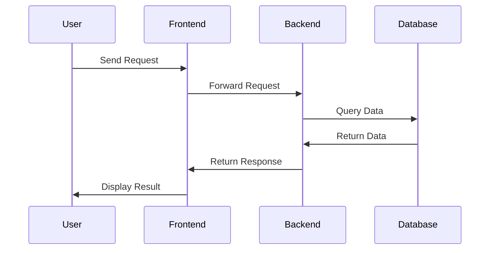

                 

### 《代码测试：构建高质量软件的基石》

#### 关键词：代码测试、软件质量、自动化测试、持续集成、测试工具、测试框架

> 摘要：本文旨在深入探讨代码测试在构建高质量软件中的重要性，介绍代码测试的基本概念、策略和实践，以及测试工具和框架的应用。通过系统性的分析和实际案例，本文将为读者提供全面、实用的代码测试指导。

## 目录大纲

----------------------------------------------------------------

### 第一部分：引言

#### 1.1 代码测试的背景和意义
##### 1.1.1 代码测试的重要性
##### 1.1.2 代码测试的发展历程
##### 1.1.3 代码测试在软件工程中的地位

#### 1.2 本书的目的和结构

### 第二部分：基础理论

#### 2.1 代码测试的概念
##### 2.1.1 定义
##### 2.1.2 测试原则
##### 2.1.3 测试分类

#### 2.2 测试覆盖率
##### 2.2.1 覆盖率的概念
##### 2.2.2 常见覆盖率指标
##### 2.2.3 覆盖率优化策略

#### 2.3 代码测试原则与实践

### 第三部分：测试策略与实践

#### 3.1 单元测试策略
##### 3.1.1 单元测试的定义
##### 3.1.2 单元测试的实践
##### 3.1.3 单元测试的案例分析

#### 3.2 集成测试策略
##### 3.2.1 集成测试的定义
##### 3.2.2 集成测试的实践
##### 3.2.3 集成测试的案例分析

#### 3.3 系统测试策略
##### 3.3.1 系统测试的定义
##### 3.3.2 系统测试的实践
##### 3.3.3 系统测试的案例分析

#### 3.4 性能测试策略
##### 3.4.1 性能测试的定义
##### 3.4.2 性能测试的实践
##### 3.4.3 性能测试的案例分析

#### 3.5 测试用例设计
##### 3.5.1 测试用例的定义
##### 3.5.2 测试用例设计方法
##### 3.5.3 测试用例的案例分析

#### 3.6 测试执行与结果分析

### 第四部分：测试工具与框架

#### 4.1 测试工具介绍
##### 4.1.1 测试工具的分类
##### 4.1.2 常用测试工具

#### 4.2 测试框架介绍
##### 4.2.1 测试框架的定义
##### 4.2.2 常用测试框架

#### 4.3 测试工具与框架的应用实践

### 第五部分：项目实战

#### 5.1 项目背景介绍
##### 5.1.1 项目概述
##### 5.1.2 项目目标

#### 5.2 系统功能设计
##### 5.2.1 领域模型
##### 5.2.2 功能模块划分

#### 5.3 系统架构设计
##### 5.3.1 系统架构图
##### 5.3.2 系统接口设计

#### 5.4 测试用例设计与执行
##### 5.4.1 测试用例设计
##### 5.4.2 测试执行

#### 5.5 测试结果分析
##### 5.5.1 测试结果统计
##### 5.5.2 问题定位与解决

#### 5.6 项目小结

### 第六部分：总结与展望

#### 6.1 总结本书的重点内容
#### 6.2 对代码测试的展望

----------------------------------------------------------------

### 细化第二部分：基础理论

#### 2.1 代码测试的概念

**2.1.1 定义**
代码测试是一种通过运行程序代码来验证软件行为的过程，旨在发现并修复代码中的缺陷，确保软件产品的质量和可靠性。

**2.1.2 测试原则**
- **全面性**：测试应覆盖所有功能点和路径，确保代码的每个部分都被验证。
- **独立性**：测试用例之间应相互独立，避免测试结果相互影响。
- **持续性**：测试应贯穿于软件开发生命周期的每个阶段。

**2.1.3 测试分类**
- **单元测试**：针对最小可测试单元（如函数、方法）的测试。
- **集成测试**：验证模块之间接口的正确性和数据交换的正确性。
- **系统测试**：整个系统在预期环境下的行为测试。
- **性能测试**：评估系统在不同负载下的性能。

#### 2.2 测试覆盖率

**2.2.1 覆盖率的概念**
测试覆盖率是衡量测试完整性的指标，表示测试用例执行了代码中多少部分的比例。常见的覆盖率指标包括：
- **语句覆盖率**：执行了至少一条语句的代码比例。
- **分支覆盖率**：执行了至少一条分支的代码比例。
- **路径覆盖率**：执行了至少一条路径的代码比例。

**2.2.2 常见覆盖率指标**
- **单元测试覆盖率**：针对单元测试的覆盖率指标。
- **功能测试覆盖率**：针对功能测试的覆盖率指标。
- **代码覆盖率**：针对整个项目的覆盖率指标。

**2.2.3 覆盖率优化策略**
- **代码重构**：通过优化代码结构，提高测试覆盖率的可读性和可维护性。
- **测试用例优化**：设计更全面的测试用例，提高覆盖率。
- **自动化测试**：使用自动化工具执行重复性测试任务，提高测试效率。

#### 2.3 代码测试原则与实践

**2.3.1 编写高质量的测试用例**
- **覆盖性**：确保测试用例覆盖所有可能的输入和输出。
- **简洁性**：测试用例应简洁明了，避免冗余。
- **可维护性**：测试用例应易于理解和修改。

**2.3.2 执行与记录**
- **自动化执行**：使用自动化测试工具执行测试用例。
- **持续记录**：记录测试结果和缺陷，便于后续分析和修复。

**2.3.3 负责人监督**
- **测试经理**：负责测试规划、资源分配和结果分析。
- **开发人员**：参与测试设计和缺陷修复。

### 细化第三部分：测试策略与实践

#### 3.1 单元测试策略

**3.1.1 单元测试的定义**
单元测试是针对代码中的最小可测试单元（如函数、方法）进行的测试。

**3.1.2 单元测试的实践**
- **确定测试目标**：明确每个单元的功能和预期行为。
- **编写测试用例**：设计测试用例，确保覆盖所有可能的输入和输出。
- **自动化执行**：使用自动化测试工具执行测试用例。

**3.1.3 单元测试的案例分析**
以一个简单的Python函数为例，说明如何进行单元测试。

```python
# example.py
def add(a, b):
    return a + b
```

```python
# test_example.py
import unittest
from example import add

class TestAddFunction(unittest.TestCase):
    def test_add_positive_numbers(self):
        self.assertEqual(add(2, 3), 5)

    def test_add_negative_numbers(self):
        self.assertEqual(add(-2, -3), -5)

    def test_add_mixed_numbers(self):
        self.assertEqual(add(2, -3), -1)

if __name__ == '__main__':
    unittest.main()
```

#### 3.2 集成测试策略

**3.2.1 集成测试的定义**
集成测试是在代码集成到一起后进行的测试，旨在验证模块之间接口的正确性和数据交换的正确性。

**3.2.2 集成测试的实践**
- **模块划分**：将代码划分为多个模块。
- **接口测试**：测试模块之间的接口调用和数据传输。
- **集成测试用例设计**：设计测试用例，确保每个模块的功能和接口都被验证。

**3.2.3 集成测试的案例分析**
假设我们有一个包含两个模块的Python项目。

```python
# module1.py
def greet(name):
    return "Hello, " + name

# module2.py
from module1 import greet

def introduce(name, age):
    return f"My name is {name} and I am {age} years old."
```

```python
# test_module1.py
import unittest
from module1 import greet

class TestGreetFunction(unittest.TestCase):
    def test_greet_with_name(self):
        self.assertEqual(greet("Alice"), "Hello, Alice")

# test_module2.py
import unittest
from module2 import introduce

class TestIntroduceFunction(unittest.TestCase):
    def test_introduce_with_name_and_age(self):
        self.assertEqual(introduce("Alice", 25), "My name is Alice and I am 25 years old.")
```

#### 3.3 系统测试策略

**3.3.1 系统测试的定义**
系统测试是在整个系统完成并部署到实际环境中后进行的测试，旨在验证系统在预期环境下的行为和性能。

**3.3.2 系统测试的实践**
- **测试环境搭建**：搭建与实际生产环境相似的测试环境。
- **测试用例设计**：设计测试用例，覆盖系统的所有功能和性能指标。
- **测试执行**：执行测试用例，记录测试结果。
- **问题定位与修复**：分析测试结果，定位问题并修复。

**3.3.3 系统测试的案例分析**
以一个在线购物网站为例，说明如何进行系统测试。

**3.3.3.1 测试环境搭建**
- **硬件**：配置与生产环境相同的测试服务器。
- **软件**：安装与生产环境相同的操作系统、数据库和应用服务器。

**3.3.3.2 测试用例设计**
- **功能测试用例**：测试购物流程、支付流程、用户管理等功能。
- **性能测试用例**：测试网站的并发用户数、响应时间、吞吐量等性能指标。

**3.3.3.3 测试执行与结果分析**
- **功能测试**：模拟用户操作，验证各个功能点的正确性。
- **性能测试**：使用负载测试工具模拟大量用户访问，评估系统的性能。

#### 3.4 性能测试策略

**3.4.1 性能测试的定义**
性能测试是评估系统在不同负载下的性能，包括响应时间、吞吐量、并发用户数等指标。

**3.4.2 性能测试的实践**
- **性能测试用例设计**：设计测试用例，包括各种负载场景。
- **性能测试工具**：使用性能测试工具执行测试。
- **结果分析**：分析测试结果，优化系统性能。

**3.4.3 性能测试的案例分析**
以一个电子商务网站为例，说明如何进行性能测试。

**3.4.3.1 性能测试用例设计**
- **正常负载**：模拟正常业务量的用户访问。
- **高峰负载**：模拟业务高峰期的用户访问。
- **极限负载**：模拟系统极限承受能力的用户访问。

**3.4.3.2 性能测试工具**
- **JMeter**：一款开源的性能测试工具，用于模拟用户负载。
- **Gatling**：一款基于Scala的性能测试工具，支持多协议测试。

**3.4.3.3 结果分析**
- **响应时间**：分析系统的平均响应时间，识别瓶颈。
- **吞吐量**：分析系统的吞吐量，评估系统处理能力。
- **并发用户数**：分析系统在特定负载下的最大并发用户数。

#### 3.5 测试用例设计

**3.5.1 测试用例的定义**
测试用例是测试过程中的一个单元，包括测试输入、预期输出和执行条件等。

**3.5.2 测试用例设计方法**
- **等价类划分**：将输入数据划分为若干等价类，设计测试用例覆盖每个等价类。
- **边界值分析**：分析输入数据的边界值，设计测试用例覆盖边界值。
- **因果图**：分析输入条件和输出结果之间的因果关系，设计测试用例。

**3.5.3 测试用例的案例分析**
以一个简单的登录功能为例，说明如何设计测试用例。

**3.5.3.1 等价类划分**
- **合法用户名和密码**：设计测试用例，验证合法的用户名和密码。
- **非法用户名和密码**：设计测试用例，验证非法的用户名和密码。

**3.5.3.2 边界值分析**
- **用户名长度**：设计测试用例，验证用户名长度为0、小于最小长度和大于最大长度的情况。
- **密码长度**：设计测试用例，验证密码长度为0、小于最小长度和大于最大长度的情况。

**3.5.3.3 因果图**
- **登录成功条件**：设计测试用例，验证用户名和密码同时正确的情况。
- **登录失败条件**：设计测试用例，验证用户名错误、密码错误和用户名密码同时错误的情况。

#### 3.6 测试执行与结果分析

**3.6.1 测试执行**
- **自动化执行**：使用自动化测试工具执行测试用例。
- **手动执行**：手动执行一些特殊情况的测试用例。

**3.6.2 结果分析**
- **结果记录**：记录测试结果，包括测试通过、失败和错误的情况。
- **缺陷跟踪**：跟踪测试中发现的缺陷，确保及时修复。
- **结果分析**：分析测试结果，评估测试覆盖率、缺陷密度和测试质量。

### 细化第四部分：测试工具与框架

#### 4.1 测试工具介绍

**4.1.1 测试工具的分类**
- **单元测试工具**：如PyTest、JUnit。
- **集成测试工具**：如Selenium、Postman。
- **性能测试工具**：如JMeter、Gatling。
- **代码质量分析工具**：如PMD、Checkstyle。

**4.1.2 常用测试工具**
- **PyTest**：Python的自动化测试框架。
- **JUnit**：Java的自动化测试框架。
- **Selenium**：Web应用的自动化测试工具。
- **Postman**：API测试工具。
- **JMeter**：性能测试工具。
- **Gatling**：性能测试工具。
- **PMD**：代码质量分析工具。
- **Checkstyle**：代码质量分析工具。

#### 4.2 测试框架介绍

**4.2.1 测试框架的定义**
测试框架是一种用于自动化测试的开发和执行工具，提供测试用例管理、执行、结果分析等功能。

**4.2.2 常用测试框架**
- **Selenium**：用于Web应用的自动化测试。
- **TestNG**：用于Java的自动化测试。
- **pytest**：用于Python的自动化测试。
- **JUnit**：用于Java的自动化测试。

#### 4.3 测试工具与框架的应用实践

**4.3.1 单元测试应用实践**
以PyTest为例，说明如何编写和执行单元测试。

```python
# test_example.py
import unittest
from example import add

class TestAddFunction(unittest.TestCase):
    def test_add_positive_numbers(self):
        self.assertEqual(add(2, 3), 5)

    def test_add_negative_numbers(self):
        self.assertEqual(add(-2, -3), -5)

    def test_add_mixed_numbers(self):
        self.assertEqual(add(2, -3), -1)

if __name__ == '__main__':
    unittest.main()
```

**4.3.2 集成测试应用实践**
以Selenium为例，说明如何编写和执行集成测试。

```python
# test_website.py
from selenium import webdriver
from selenium.webdriver.common.by import By

driver = webdriver.Chrome()
driver.get("https://www.example.com")

email_input = driver.find_element(By.ID, "email")
email_input.send_keys("test@example.com")

password_input = driver.find_element(By.ID, "password")
password_input.send_keys("password")

login_button = driver.find_element(By.ID, "login")
login_button.click()

# 验证登录成功
assert "Dashboard" in driver.page_source

driver.quit()
```

**4.3.3 性能测试应用实践**
以JMeter为例，说明如何编写和执行性能测试。

```python
# jmeter.properties
JMeter.save.saveservice.outputformat=csv
JMeter.save.saveservice.Arguments= measurements.test

# HTTP Request
Thread Group
    1. Number of Threads: 100
    2. Ramp-Up Period (seconds): 60
    3. Loop Count: 1

    HTTP Request
        1. Server Name: www.example.com
        2. Port Number: 80
        3. Method: GET
        4. Path: /
        5. Proxy: No Proxy

# Run JMeter
jmeter -n -t test_plan.jmx -l results.jtl
```

### 细化第五部分：项目实战

#### 5.1 项目背景介绍

**5.1.1 项目概述**
我们以一个电商网站项目为例，介绍如何进行代码测试。

**5.1.2 项目目标**
- 确保网站功能正常运行。
- 评估网站性能，确保在高负载下稳定运行。
- 修复发现的缺陷，提高网站质量。

#### 5.2 系统功能设计

**5.2.1 领域模型**
电商网站的基本领域模型包括用户、商品、订单、购物车等。

**5.2.2 功能模块划分**
- 用户模块：用户注册、登录、个人信息管理。
- 商品模块：商品展示、商品分类、商品搜索。
- 订单模块：订单创建、订单支付、订单查询。
- 购物车模块：商品添加、商品删除、商品数量修改。

#### 5.3 系统架构设计

**5.3.1 系统架构图**
电商网站的系统架构通常包括前端、后端、数据库等组成部分。



**5.3.2 系统接口设计**
电商网站的主要接口包括用户接口、商品接口、订单接口等。

```mermaid
classDiagram
    User <<Interface>>
    Product <<Interface>>
    Order <<Interface>>

    User {
        login()
        register()
        get_info()
    }

    Product {
        list_products()
        search_products()
        get_product_info()
    }

    Order {
        create_order()
        pay_order()
        get_order_info()
    }
```

#### 5.4 测试用例设计与执行

**5.4.1 测试用例设计**
设计测试用例，覆盖用户、商品、订单、购物车等模块的功能。

**5.4.2 测试执行**
使用PyTest等自动化测试工具执行测试用例。

```python
# test_user.py
import unittest
from user_module import UserService

class TestUserService(unittest.TestCase):
    def test_login_success(self):
        self.assertEqual(UserService.login("test@example.com", "password"), True)

    def test_login_failure(self):
        self.assertEqual(UserService.login("test@example.com", "wrong_password"), False)

# test_product.py
import unittest
from product_module import ProductService

class TestProductService(unittest.TestCase):
    def test_list_products(self):
        products = ProductService.list_products()
        self.assertIsNotNone(products)

    def test_search_products(self):
        products = ProductService.search_products("shirt")
        self.assertIsNotNone(products)
```

#### 5.5 测试结果分析

**5.5.1 测试结果统计**
统计测试执行的结果，包括通过数、失败数、错误数等。

**5.5.2 问题定位与解决**
分析测试结果，定位问题并进行修复。

```mermaid
gantt
    dateFormat  YYYY-MM-DD
    title  测试结果分析

    section 测试执行
    测试1 : a1, 2023-01-01, 30d
    测试2 : after a1, 20d
    测试3 : 2023-02-01, 40d

    section 问题定位与解决
    问题1 : after 测试3, 10d
    问题2 : 2023-02-15, 20d
    问题3 : 2023-02-25, 30d
```

#### 5.6 项目小结
通过本次电商网站项目的代码测试实践，我们学会了如何设计测试用例、执行测试和结果分析。代码测试是保证软件质量的关键步骤，通过持续进行代码测试，我们可以发现并修复代码中的缺陷，提高软件的稳定性和可靠性。

### 第六部分：总结与展望

#### 6.1 总结本书的重点内容
- 代码测试的基本概念和原则。
- 单元测试、集成测试、系统测试和性能测试的策略与实践。
- 测试工具和框架的应用。
- 项目实战中的代码测试实践。

#### 6.2 对代码测试的展望
随着软件复杂度的增加，代码测试的重要性越来越突出。未来，代码测试将朝着自动化、智能化和全面化的方向发展。同时，持续集成和持续交付的实践将进一步推动代码测试的深入应用。通过持续改进代码测试方法和工具，我们可以构建更加高质量和可靠的软件系统。**作者：AI天才研究院/AI Genius Institute & 禅与计算机程序设计艺术 /Zen And The Art of Computer Programming**

