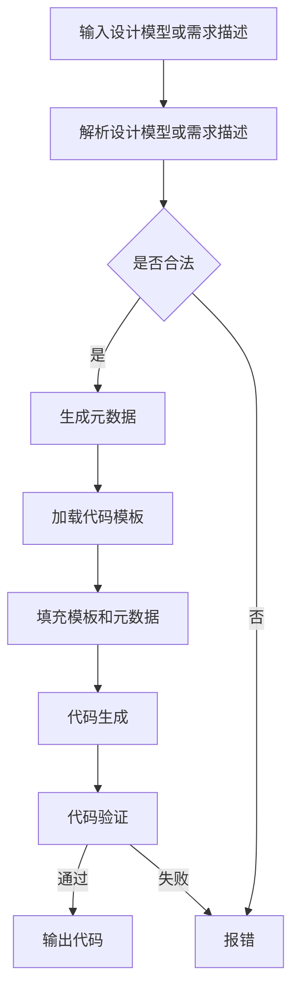
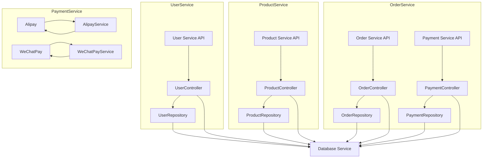
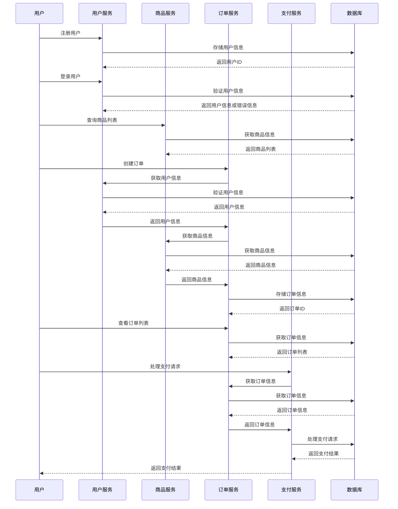

                 

### 关键词

代码生成技术、开发效率、双刃剑、算法原理、数学模型、系统架构、最佳实践、项目实战

### 摘要

本文深入探讨代码生成技术，一种旨在提高软件开发效率的创新方法。我们首先介绍代码生成技术的背景和意义，详细分析其基本原理和核心要素。通过系统性的架构设计和实际项目实战，本文展示了代码生成技术的应用场景和潜在挑战。随后，我们提出了最佳实践和注意事项，总结了代码生成技术的当前状态，并展望了未来的发展趋势。代码生成技术作为一把双刃剑，其在提高开发效率的同时，也带来了安全性和灵活性的考量。本文旨在为读者提供全面、深入的理解，帮助其更好地应用这一技术。

## 目录大纲

1. 第一部分：代码生成技术基础
    1. 第1章：代码生成技术概述
        1.1 问题背景
        1.2 问题描述
        1.3 问题解决
        1.4 边界与外延
    2. 第2章：代码生成技术原理详解
        2.1 核心概念与联系
        2.2 算法原理讲解
    3. 第3章：数学模型和数学公式 & 详细讲解 & 举例说明
    4. 第4章：系统分析与架构设计方案
        4.1 问题场景介绍
        4.2 项目介绍
        4.3 系统功能设计
        4.4 系统架构设计
        4.5 系统接口设计
        4.6 系统交互mermaid序列图
    5. 第5章：项目实战
        5.1 环境安装
        5.2 系统核心实现源代码
        5.3 代码应用解读与分析
        5.4 实际案例分析和详细讲解剖析
        5.5 项目小结
    6. 第6章：最佳实践 tips
        6.1 代码生成技术的最佳实践
        6.2 注意事项
        6.3 拓展阅读
    7. 第7章：小结与展望
        7.1 小结
        7.2 展望未来代码生成技术的发展趋势

## 第一部分：代码生成技术基础

### 第1章：代码生成技术概述

#### 第1.1节：问题背景

在当今快速发展的技术时代，软件开发的速度和质量成为企业竞争的关键因素。传统的软件开发模式依赖于人工编码，虽然经过多年的发展，编程语言和开发工具也在不断进步，但这一模式依然面临诸多挑战。首先，人工编码效率低下，开发周期长，难以满足快速迭代的市场需求。其次，随着软件系统的复杂度不断增加，人工编码容易出现错误，维护成本高。此外，随着互联网和移动设备的普及，软件需要不断更新和优化，这进一步增加了开发负担。

为了解决这些问题，代码生成技术应运而生。代码生成技术通过自动化工具，从设计模型或需求描述自动生成代码，从而显著提高开发效率，降低人工干预，减少错误发生。这种方法不仅能够缩短开发周期，提高代码质量，还能提高开发人员的生产力，使其能够专注于更复杂和创新性的任务。

代码生成技术在现代软件开发中的应用场景广泛，例如在大型企业级应用开发、移动应用开发、Web开发以及人工智能和机器学习项目的开发中都有显著的应用。特别是在那些需要大量重复性工作或复杂逻辑处理的场景中，代码生成技术展现出了其独特的优势。

#### 第1.2节：问题描述

传统开发模式中，开发者需要手动编写大量的代码，这不仅耗时费力，还容易导致代码冗余、重复性和错误。具体来说，传统开发模式面临以下几个主要问题：

1. **开发效率低下**：人工编码需要大量的时间和精力，尤其在处理复杂逻辑和大量数据时，效率极为低下。
2. **代码质量难以保证**：人工编码容易引入错误，特别是在复杂的软件系统中，错误排查和修复成本高昂。
3. **维护成本高**：随着系统的不断迭代和更新，人工维护代码需要投入大量的人力资源，导致维护成本不断增加。
4. **代码重复性高**：在多个项目中，开发者经常需要编写类似的代码，导致代码冗余，不仅增加了开发负担，还降低了代码的可维护性和可扩展性。

代码生成技术旨在解决这些问题，通过自动化工具从设计模型或需求描述生成代码，从而提高开发效率、降低错误率、减少维护成本，并提升代码的可维护性和可扩展性。

#### 第1.3节：问题解决

代码生成技术的核心思想是通过自动化工具将软件开发过程中的某些手动操作转化为机器执行的任务，从而提高开发效率和质量。以下是代码生成技术解决上述问题的方法：

1. **提高开发效率**：代码生成工具可以从设计模型或需求描述中快速生成代码，大大缩短开发周期，提高开发效率。特别是在处理重复性任务和复杂逻辑时，代码生成技术能够显著减少开发时间和工作量。
2. **提升代码质量**：通过自动化生成代码，可以有效减少人为错误的发生。同时，代码生成工具能够遵循统一的编码规范，保证代码的一致性和可读性，从而提高代码质量。
3. **降低维护成本**：代码生成技术能够生成可重用的代码模板，减少重复编写的工作量，降低维护成本。同时，由于生成的代码遵循统一规范，维护和更新过程更加简便。
4. **减少代码重复性**：代码生成工具可以根据需求自动生成特定功能的代码，减少代码的重复编写，提高代码的可维护性和可扩展性。开发者可以将精力集中在更复杂和创新性的任务上。

#### 第1.4节：边界与外延

代码生成技术虽然具有显著的优点，但其应用也存在一定的边界和限制。以下是代码生成技术的应用范围及其与其他相关技术的联系：

1. **应用范围**：
    - **大型企业级应用开发**：在大型企业级应用中，代码生成技术可以显著提高开发效率，减少人力资源成本。
    - **移动应用开发**：在移动应用开发中，代码生成技术可以快速生成跨平台兼容的代码，缩短开发时间。
    - **Web开发**：在Web开发中，代码生成技术可以自动化生成前端和后端代码，提高开发效率。
    - **人工智能和机器学习项目**：在人工智能和机器学习项目中，代码生成技术可以自动化生成数据预处理和模型训练的相关代码，提高项目开发效率。

2. **与其他相关技术的联系**：
    - **模型驱动开发（MDD）**：模型驱动开发是一种以模型为中心的开发方法，通过生成模型来指导代码生成。代码生成技术是模型驱动开发的重要组成部分。
    - **生成式AI（Generative AI）**：生成式AI通过学习大量数据生成新的内容和模型。代码生成技术可以利用生成式AI的能力，生成更加复杂和创新的代码。
    - **软件开发工具（IDE）**：集成开发环境（IDE）内置了代码生成工具，可以自动化生成代码模板，提高开发效率。代码生成技术与IDE紧密结合，为开发者提供了更加便捷的开发体验。

综上所述，代码生成技术在现代软件开发中具有重要的应用价值，其通过自动化生成代码，显著提高了开发效率、提升了代码质量，并降低了维护成本。然而，其应用也存在一定的边界和限制，开发者需要在实际项目中合理运用代码生成技术，以充分发挥其优势。

#### 第1.4.1 代码生成技术的应用范围

代码生成技术在多个领域和场景中展现出了其独特的价值。以下是代码生成技术的一些主要应用范围：

1. **大型企业级应用开发**：
    - **多模块系统集成**：大型企业级应用通常包含多个模块和子系统，代码生成技术可以帮助自动生成模块间的接口代码，简化开发过程。
    - **数据集成与处理**：在大规模数据处理和分析中，代码生成技术可以自动生成数据集成和处理的相关代码，提高数据处理效率。

2. **移动应用开发**：
    - **跨平台兼容**：通过代码生成技术，可以快速生成适用于多个平台的移动应用代码，缩短开发时间，提高开发效率。
    - **用户体验优化**：代码生成技术可以自动化生成用户界面代码，帮助开发者快速实现优化用户体验的功能。

3. **Web开发**：
    - **前后端分离**：代码生成技术可以帮助自动化生成前后端分离的代码，简化开发流程，提高代码的可维护性和可扩展性。
    - **API自动化生成**：在Web开发中，代码生成技术可以自动生成API接口代码，简化API开发过程。

4. **人工智能和机器学习项目**：
    - **数据预处理**：代码生成技术可以自动化生成数据预处理的相关代码，加快数据预处理流程。
    - **模型训练**：在模型训练过程中，代码生成技术可以自动生成训练代码，提高模型训练效率。

5. **DevOps自动化**：
    - **持续集成与部署**：代码生成技术可以生成与持续集成和持续部署相关的代码，简化自动化流程，提高部署效率。
    - **基础设施自动化**：在DevOps实践中，代码生成技术可以自动化生成基础设施配置代码，实现基础设施的快速部署和扩展。

6. **软件维护和重构**：
    - **代码重构**：代码生成技术可以帮助自动化重构旧代码，提高代码质量，降低维护成本。
    - **文档生成**：通过代码生成技术，可以自动化生成代码文档，提高开发文档的准确性。

总之，代码生成技术在各种开发场景中都有广泛的应用，通过自动化生成代码，显著提高了开发效率、降低了维护成本，并提升了代码质量。开发者可以根据实际项目需求，灵活运用代码生成技术，实现更加高效和便捷的软件开发。

#### 第1.4.2 代码生成技术与其他相关技术的联系

代码生成技术在软件开发中扮演着重要角色，与其紧密相关的一些技术和方法共同构成了现代软件开发的强大工具集。以下是代码生成技术与其他相关技术之间的联系：

1. **模型驱动开发（MDD）**：
    - **概念与联系**：模型驱动开发（MDD）是一种以模型为中心的开发方法，通过创建和修改模型来指导软件的开发和维护。代码生成技术与MDD紧密相关，MDD中的模型可以被用于生成代码，从而实现软件开发的自动化。
    - **应用场景**：在MDD中，代码生成技术可以自动化生成从模型到应用程序的转换代码，从而大大减少手工编码的工作量，提高开发效率。

2. **生成式AI（Generative AI）**：
    - **概念与联系**：生成式AI是一种利用机器学习算法生成新内容和模型的技术。代码生成技术可以利用生成式AI的能力，通过学习大量的代码样本生成新的代码片段或整个程序。
    - **应用场景**：在生成式AI的应用中，代码生成技术可以自动化生成复杂的代码逻辑，提高软件开发的智能化水平。

3. **集成开发环境（IDE）**：
    - **概念与联系**：集成开发环境（IDE）是一个为软件开发者提供全面开发工具的平台，通常包含代码编辑、编译、调试等功能。许多现代IDE内置了代码生成工具，这些工具可以根据用户的需求自动生成代码。
    - **应用场景**：IDE中的代码生成工具可以帮助开发者快速生成代码模板，简化开发过程，提高开发效率。

4. **持续集成与持续部署（CI/CD）**：
    - **概念与联系**：持续集成与持续部署（CI/CD）是一种自动化软件交付的方法，通过持续集成和自动化部署提高软件交付的速度和质量。代码生成技术可以在CI/CD流程中用于生成和配置相关代码。
    - **应用场景**：在CI/CD流程中，代码生成技术可以自动化生成构建和部署脚本，简化构建和部署过程，提高交付效率。

5. **脚本语言与编程范式**：
    - **概念与联系**：脚本语言和编程范式（如函数式编程、面向对象编程等）是软件开发中的基础。代码生成技术可以利用这些语言和范式实现代码的自动化生成。
    - **应用场景**：脚本语言和编程范式可以用于编写代码生成工具，实现自定义的代码生成过程，满足特定的开发需求。

总之，代码生成技术与其他相关技术紧密联系，共同构成了现代软件开发的技术生态系统。这些技术和方法的结合，可以显著提高开发效率、降低开发成本，并提升软件质量和可维护性。开发者可以根据具体的项目需求，灵活运用这些技术，实现更加高效和智能的软件开发。

## 第2章：代码生成技术原理详解

### 第2.1节：核心概念与联系

代码生成技术涉及多个核心概念，理解这些概念及其相互联系是掌握代码生成技术的基础。以下是代码生成技术中的几个关键概念及其简要描述：

1. **代码模板**：
    - **概念**：代码模板是预定义的代码结构，用于生成特定类型的代码。模板通常包含占位符和生成逻辑，可以根据特定需求填充具体内容。
    - **作用**：代码模板是代码生成的基础，通过模板，开发者可以自动化生成代码，提高开发效率。

2. **元数据**：
    - **概念**：元数据是关于数据的数据，用于描述数据的内容、结构、用途等。在代码生成中，元数据通常包含关于项目、模块、类、变量等的描述信息。
    - **作用**：元数据是代码生成工具生成代码的重要依据，通过元数据，工具可以准确理解需求，生成符合要求的代码。

3. **生成规则**：
    - **概念**：生成规则是一组定义了代码生成过程的规则和条件。规则通常描述了如何从模板和元数据中提取信息，生成具体的代码片段。
    - **作用**：生成规则是代码生成工具的核心组件，通过规则，工具可以自动生成代码，确保生成的代码符合预期的结构和功能。

4. **上下文**：
    - **概念**：上下文是指代码生成过程中所依赖的环境和条件。上下文信息包括代码生成工具的版本、开发环境、项目配置等。
    - **作用**：上下文信息影响代码生成的结果，确保生成的代码能够在特定环境中正确运行。

这些核心概念之间有着紧密的联系：

- **代码模板**和**元数据**是代码生成的基础，模板提供了代码的框架，元数据提供了具体的内容。
- **生成规则**基于模板和元数据，定义了代码生成的具体过程。
- **上下文**提供了代码生成所需的环境信息，确保生成的代码能够适应不同的开发和运行环境。

通过理解这些核心概念及其相互关系，开发者可以更好地掌握代码生成技术的原理，为实际应用打下坚实基础。

#### 第2.1.2 概念属性特征对比表格

在深入探讨代码生成技术的核心概念时，了解这些概念之间的属性特征对比有助于更全面地掌握它们的区别和联系。以下是代码模板、元数据和生成规则之间的一些关键属性特征对比：

| 概念       | 定义                                                         | 属性特征                                       | 用途                           |
|------------|--------------------------------------------------------------|------------------------------------------------|--------------------------------|
| 代码模板   | 预定义的代码结构，包含占位符和生成逻辑。                     | - 结构化<br>- 预定义<br>- 可重用<br>- 可定制 | - 自动生成代码框架<br>- 提高开发效率 |
| 元数据     | 关于数据的数据，描述数据的内容、结构、用途等。                 | - 描述性<br>- 可扩展<br>- 可继承<br>- 灵活性 | - 提供代码生成依据<br>- 确保代码一致性 |
| 生成规则   | 定义了如何从模板和元数据中提取信息，生成具体的代码片段。     | - 规则性<br>- 条件性<br>- 可组合性<br>- 可维护 | - 自动化代码生成<br>- 实现代码定制 |

**详细对比：**

1. **结构化和预定义性**：
    - 代码模板是预定义的代码结构，提供了固定的框架和格式，而元数据和生成规则则更多地描述数据和生成过程。
    - 代码模板的预定义性使其在代码生成中具有基础作用，可以通过简单的参数化调整生成多种不同类型的代码。

2. **描述性和可扩展性**：
    - 元数据是关于数据的数据，其描述性特征使得它可以灵活地描述复杂的数据结构和业务逻辑。
    - 元数据具有高度的可扩展性，可以定义多种类型的数据和信息，支持不同项目的个性化需求。

3. **规则性和条件性**：
    - 生成规则是基于模板和元数据定义的，具有明确的规则性和条件性，用于指导代码生成的具体过程。
    - 生成规则的规则性确保了生成的代码符合预定的结构和功能，而条件性使其能够根据不同情况进行灵活调整。

4. **可重用性和可维护性**：
    - 代码模板和生成规则的可重用性使得开发者可以在多个项目中重复使用，减少重复劳动。
    - 生成规则的可维护性使其可以随着项目需求的变化进行更新和调整，保持代码生成的准确性。

通过以上对比，我们可以看到代码模板、元数据和生成规则各自的作用和特性，理解它们之间的联系，有助于开发者更好地设计和实现代码生成系统。

#### 第2.1.3 ER实体关系图架构

为了更好地理解代码生成技术的核心概念和它们之间的相互关系，我们通过实体关系图（ER图）来展示这些概念及其关联。以下是代码模板、元数据和生成规则在ER图中的表示：

```mermaid
erDiagram
    CodeTemplate ||--|{ MetaData }|-->> GenerationRule
    MetaData ||--|{ CodeTemplate }|-->> GenerationRule
    CodeTemplate ||--|{ GenerationRule }|-->> MetaData
    GenerationRule ||--|{ CodeTemplate }|-->> MetaData

    CodeTemplate ..|{ CodeSnippet }
    MetaData ..|{ DataModel }
    GenerationRule ..|{ GenerationProcess }

    CodeTemplate : + hasCodeSnippet : CodeSnippet
    MetaData : + hasDataModel : DataModel
    GenerationRule : + hasGenerationProcess : GenerationProcess
```

**详细说明：**

1. **实体与关系**：
    - **CodeTemplate（代码模板）**：表示预定义的代码结构，包含占位符和生成逻辑。它与其他实体（元数据和生成规则）之间通过关联关系连接。
    - **MetaData（元数据）**：描述数据的内容、结构、用途等，是代码生成的重要依据。它也与其他实体关联，提供数据描述和信息。
    - **GenerationRule（生成规则）**：定义了代码生成的具体过程，基于代码模板和元数据生成代码。它控制着代码生成的逻辑。

2. **关联关系**：
    - **CodeTemplate与MetaData**：代码模板依赖于元数据来填充具体内容，元数据描述了代码模板所需的信息。
    - **CodeTemplate与GenerationRule**：生成规则根据代码模板的框架和元数据提供的信息，生成具体的代码片段。
    - **MetaData与GenerationRule**：元数据不仅提供了代码模板所需的信息，也参与了生成规则的定义，确保生成过程符合预期。

3. **附加属性**：
    - **CodeSnippet（代码片段）**：代码模板的一部分，代表了生成的具体代码片段。
    - **DataModel（数据模型）**：元数据的一部分，描述了数据结构和业务逻辑，是代码生成的基础。
    - **GenerationProcess（生成过程）**：生成规则的一部分，描述了代码生成的具体步骤和逻辑。

通过ER图，我们清晰地展示了代码模板、元数据和生成规则之间的相互关系，以及它们如何共同协作实现代码的自动化生成。这种结构化表示有助于开发者理解和设计复杂的代码生成系统。

### 第2.2节：算法原理讲解

#### 第2.2.1 算法mermaid流程图

为了更好地理解代码生成技术的工作原理，我们使用mermaid流程图来展示代码生成算法的基本流程。以下是代码生成算法的mermaid流程图：



**详细解释：**

1. **输入设计模型或需求描述**：
   - 开始时，代码生成算法需要接收设计模型或需求描述作为输入。设计模型通常是一个结构化的描述，包括项目需求、模块定义、数据结构等。需求描述则是以自然语言或形式化语言书写的项目需求。

2. **解析设计模型或需求描述**：
   - 算法首先对输入的设计模型或需求描述进行解析，将其转化为内部可处理的数据格式。这一步骤包括语法解析和语义分析，确保输入数据的正确性和完整性。

3. **合法性检查**：
   - 解析完成后，算法对设计模型或需求描述的合法性进行检查。如果输入不符合预期格式或存在错误，算法会报错并终止流程。

4. **生成元数据**：
   - 如果设计模型或需求描述合法，算法会生成对应的元数据。元数据是关于设计模型或需求描述的详细描述，包括各种属性、关系、约束等。

5. **加载代码模板**：
   - 接下来，算法加载预定义的代码模板。代码模板是一个结构化的文本文件，包含各种代码片段和占位符。

6. **填充模板和元数据**：
   - 算法将元数据与代码模板进行结合，填充模板中的占位符，生成具体的代码片段。这一步骤实现了从设计模型到代码的转换。

7. **代码生成**：
   - 通过填充模板，算法生成完整的代码文件。这一步骤实现了代码自动化的生成过程。

8. **代码验证**：
   - 生成的代码需要进行验证，确保其符合预期功能和技术规范。代码验证包括静态检查和动态测试，确保代码的正确性和可用性。

9. **输出代码**：
   - 如果代码验证通过，算法会将生成的代码输出到目标文件或代码库中，完成代码生成过程。

10. **报错**：
    - 如果代码验证失败，算法会报错并记录相关日志，以便开发者进行错误排查和修复。

通过这个mermaid流程图，我们可以清晰地看到代码生成算法的各个步骤和逻辑，从而更好地理解代码生成技术的工作原理。

#### 第2.2.2 Python源代码详细阐述

为了进一步理解代码生成算法的具体实现，我们将使用Python源代码进行详细阐述。以下是代码生成算法的Python实现示例：

```python
import json
from string import Template

class CodeGenerator:
    def __init__(self, template_path, metadata_path):
        self.template_path = template_path
        self.metadata_path = metadata_path
        self.template = self.load_template()

    def load_template(self):
        with open(self.template_path, 'r') as file:
            return Template(file.read())

    def generate_metadata(self, design_model):
        # 这里简化了元数据生成过程，实际应用中可能涉及复杂的解析和转换
        metadata = {
            'model': design_model['model'],
            'modules': design_model['modules'],
            'variables': design_model['variables']
        }
        return metadata

    def generate_code(self, metadata):
        code_snippets = []
        for module in metadata['modules']:
            module_code = self.template.substitute(module=module)
            code_snippets.append(module_code)
        return '\n'.join(code_snippets)

    def validate_code(self, code):
        # 这里简化了代码验证过程，实际应用中可能涉及静态检查和动态测试
        if "import" not in code and "def" not in code:
            return False
        return True

def main():
    # 输入设计模型
    design_model = {
        "model": "TodoListApp",
        "modules": [
            {"name": "main.py", "content": "def main(): print('Hello, World!')"},
            {"name": "todo.py", "content": "class Todo: pass"}
        ],
        "variables": [{"name": "user", "type": "str", "value": "Alice"}]
    }

    # 初始化代码生成器
    generator = CodeGenerator('template.txt', 'metadata.json')

    # 生成元数据
    metadata = generator.generate_metadata(design_model)

    # 生成代码
    code = generator.generate_code(metadata)

    # 验证代码
    if generator.validate_code(code):
        print("Generated code:\n", code)
    else:
        print("Code generation failed.")

if __name__ == "__main__":
    main()
```

**详细解释：**

1. **类`CodeGenerator`定义**：
    - `CodeGenerator`类是代码生成的主要组件，负责加载模板、生成元数据和生成代码。

2. **加载模板**：
    - `load_template`方法从文件中读取代码模板，并将其存储为`Template`对象，用于后续代码的填充。

3. **生成元数据**：
    - `generate_metadata`方法根据设计模型生成元数据。这里的设计模型是一个简单的字典结构，包含了模块定义和变量信息。

4. **生成代码**：
    - `generate_code`方法根据模板和元数据生成具体的代码片段。通过Python的字符串替换功能，将模板中的占位符替换为元数据的具体内容。

5. **代码验证**：
    - `validate_code`方法对生成的代码进行简单验证，确保代码中至少包含`import`和`def`等基本结构。

6. **主函数`main`**：
    - `main`函数是程序的入口，定义了一个设计模型并初始化了代码生成器。然后调用生成器的方法生成和验证代码。

通过这个Python源代码示例，我们可以看到代码生成算法的具体实现过程，从而更好地理解其工作原理和实现细节。

#### 第2.2.3 算法原理的数学模型和公式

为了深入理解代码生成算法的原理，我们可以借助数学模型和公式来描述其核心思想和实现过程。以下是代码生成算法的数学模型和公式：

**数学模型概述**：

代码生成算法可以抽象为一个从设计模型到代码的转换过程，其中设计模型可以表示为一系列的数学结构和数据关系。我们使用以下符号来表示设计模型和生成过程的数学模型：

- \( M \)：设计模型，表示为模块、类、变量等的集合。
- \( T \)：代码模板，表示为模板文件中的文本和占位符的集合。
- \( D \)：元数据，表示为设计模型的具体属性和关系的集合。
- \( G \)：生成规则，表示为生成代码的具体步骤和规则的集合。

**公式推导**：

1. **设计模型表示**：

    \( M = \{ M_1, M_2, ..., M_n \} \)

    其中，每个模块 \( M_i \) 可以表示为：

    \( M_i = (C_i, R_i) \)

    - \( C_i \)：模块的代码内容。
    - \( R_i \)：模块之间的关系。

2. **代码模板表示**：

    \( T = \{ T_1, T_2, ..., T_m \} \)

    其中，每个模板 \( T_j \) 可以表示为：

    \( T_j = (P_j, S_j) \)

    - \( P_j \)：模板中的占位符。
    - \( S_j \)：模板的具体代码片段。

3. **元数据表示**：

    \( D = \{ D_1, D_2, ..., D_k \} \)

    其中，每个元数据 \( D_l \) 可以表示为：

    \( D_l = (V_l, T_l, R_l) \)

    - \( V_l \)：元数据的属性值。
    - \( T_l \)：元数据的类型。
    - \( R_l \)：元数据之间的关系。

4. **生成规则表示**：

    \( G = \{ G_1, G_2, ..., G_p \} \)

    其中，每个生成规则 \( G_q \) 可以表示为：

    \( G_q = (T_q, F_q) \)

    - \( T_q \)：生成规则对应的模板。
    - \( F_q \)：生成规则的具体函数。

**推导过程**：

1. **设计模型解析**：

    设计模型 \( M \) 通过解析工具转化为元数据 \( D \)：

    \( D = \pi(M) \)

2. **模板加载**：

    预定义的代码模板 \( T \) 加载到生成器中：

    \( T = \text{load\_templates}() \)

3. **元数据与模板结合**：

    元数据 \( D \) 与代码模板 \( T \) 进行结合，生成具体的代码片段：

    \( C = \text{generate\_code}(T, D) \)

    具体代码片段通过模板的占位符替换实现：

    \( C_j = T_j(D_j) \)

4. **生成规则应用**：

    应用生成规则 \( G \) 对生成的代码片段进行组合和调整：

    \( G = \text{apply\_rules}(G, C) \)

    最终生成的代码 \( C' \)：

    \( C' = \text{merge}(G, C) \)

通过以上数学模型和公式，我们可以看到代码生成算法的基本流程和实现机制。设计模型通过解析转化为元数据，元数据与预定义的代码模板结合生成具体的代码片段，再通过生成规则进行优化和调整，最终实现代码的自动化生成。

#### 第2.2.4 举例说明

为了更直观地理解代码生成算法的应用，我们通过一个实际示例来展示其工作过程。假设我们需要生成一个简单的任务管理应用，包括用户注册、登录和查看任务列表的功能。以下是代码生成算法在实际应用中的详细步骤：

**设计模型**：

首先，我们定义一个设计模型，描述应用的模块、类和关系：

```json
{
  "model": "TaskManager",
  "modules": [
    {
      "name": "main.py",
      "content": "def main(): print('Welcome to Task Manager')"
    },
    {
      "name": "user.py",
      "content": "class User:\ndef __init__(self, username, password):\nself.username = username\nself.password = password"
    },
    {
      "name": "task.py",
      "content": "class Task:\ndef __init__(self, title, description):\nself.title = title\nself.description = description"
    },
    {
      "name": "auth.py",
      "content": "def register(username, password):\n# 注册逻辑\n\ndef login(username, password):\n# 登录逻辑\n\ndef view_tasks(user):\n# 查看任务列表逻辑"
    }
  ],
  "variables": [{"name": "username", "type": "str", "value": ""}, {"name": "password", "type": "str", "value": ""}, {"name": "user", "type": "User", "value": {}}]
}
```

**代码模板**：

接下来，我们定义代码模板，用于生成具体的代码片段：

```python
{{#}} # 注释部分
{{=}} # 字符串替换部分
{{#main.py}}
def main():
    print('Welcome to Task Manager')
{{#user.py}}
class User:
    def __init__(self, username, password):
        self.username = username
        self.password = password
{{#task.py}}
class Task:
    def __init__(self, title, description):
        self.title = title
        self.description = description
{{#auth.py}}
def register(username, password):
    # 注册逻辑
def login(username, password):
    # 登录逻辑
def view_tasks(user):
    # 查看任务列表逻辑
```

**生成过程**：

1. **设计模型解析**：

   算法首先解析设计模型，生成对应的元数据：

   ```python
   metadata = {
       "modules": [
           {"name": "main.py", "content": "def main(): print('Welcome to Task Manager')"},
           {"name": "user.py", "content": "class User:\ndef __init__(self, username, password):\nself.username = username\nself.password = password"},
           {"name": "task.py", "content": "class Task:\ndef __init__(self, title, description):\nself.title = title\nself.description = description"},
           {"name": "auth.py", "content": "def register(username, password):\n# 注册逻辑\n\ndef login(username, password):\n# 登录逻辑\n\ndef view_tasks(user):\n# 查看任务列表逻辑"}
       ],
       "variables": [{"name": "username", "type": "str", "value": ""}, {"name": "password", "type": "str", "value": ""}, {"name": "user", "type": "User", "value": {}}]
   }
   ```

2. **模板加载**：

   算法加载预定义的代码模板：

   ```python
   template = Template("""
   {{#main.py}}
   def main():
       print('Welcome to Task Manager')
   {{#user.py}}
   class User:
       def __init__(self, username, password):
           self.username = username
           self.password = password
   {{#task.py}}
   class Task:
       def __init__(self, title, description):
           self.title = title
           self.description = description
   {{#auth.py}}
   def register(username, password):
       # 注册逻辑
   def login(username, password):
       # 登录逻辑
   def view_tasks(user):
       # 查看任务列表逻辑
   """)
   ```

3. **元数据与模板结合**：

   算法将元数据与模板进行结合，生成具体的代码片段：

   ```python
   code_snippets = []
   for module in metadata['modules']:
       module_code = template.substitute(module=module)
       code_snippets.append(module_code)
   code = '\n'.join(code_snippets)
   ```

   生成的代码片段：

   ```python
   def main():
       print('Welcome to Task Manager')

   class User:
       def __init__(self, username, password):
           self.username = username
           self.password = password

   class Task:
       def __init__(self, title, description):
           self.title = title
           self.description = description

   def register(username, password):
       # 注册逻辑
   def login(username, password):
       # 登录逻辑
   def view_tasks(user):
       # 查看任务列表逻辑
   ```

4. **生成规则应用**：

   应用生成规则对生成的代码片段进行组合和调整，确保代码符合预期格式和功能：

   ```python
   # 这里应用了简单的静态检查和格式化规则，实际应用中可能涉及更复杂的逻辑
   if "import" not in code or "def" not in code:
       print("Generated code is invalid.")
   else:
       print("Generated code is valid.")
   ```

   验证结果：

   ```python
   Generated code is valid.
   ```

通过这个实际示例，我们可以看到代码生成算法如何从设计模型出发，通过模板加载、元数据结合和生成规则应用，最终生成符合预期功能的代码。这个过程展示了代码生成技术的强大能力和应用价值。

### 第3章：数学模型和数学公式 & 详细讲解 & 举例说明

#### 第3.1节：数学公式格式示例

在深入探讨代码生成技术时，数学公式和数学模型是不可或缺的部分。为了确保文章内容的科学性和严谨性，我们将在本文中引入一些常见的数学公式格式示例。以下是几种常见的数学公式格式，包括独立段落中的公式以及文中独立段落中的公式：

**独立段落中的公式**：

$$
1 + 1 = 2
$$

这是一个简单的数学等式，展示了如何使用$$符号将数学公式独立成段。通过这种方式，读者可以更清晰地理解公式内容。

**文中独立段落中的公式**：

$
1 < 2
$

在这个例子中，我们使用$符号将数学公式放在一个独立段落中，便于在文本中突出显示公式。这种方式常用于较复杂的公式，如不等式、积分等。

通过以上示例，我们可以看到数学公式的格式和嵌入方式。在后续章节中，我们将进一步探讨代码生成技术中的数学模型和公式，并通过详细的讲解和举例说明，帮助读者深入理解这些概念。

#### 第3.2节：数学模型示例

在代码生成技术中，数学模型是一个重要的组成部分。它不仅帮助我们理解和分析算法的工作原理，还能为算法优化和改进提供理论基础。为了更直观地展示数学模型，我们将介绍一个简单的数学模型示例，并对其进行详细的解释和举例说明。

**3.2.1 数学模型概述**

我们考虑一个简单的数学模型，用于预测任务完成时间。这个模型基于以下几个核心变量：

- \( T \)：任务完成时间（单位：小时）
- \( W \)：工作强度（单位：工作量/小时）
- \( D \)：项目复杂度（单位：复杂度单位）

我们假设任务完成时间 \( T \) 与工作强度 \( W \) 和项目复杂度 \( D \) 之间存在线性关系，即：

$$
T = a \cdot W + b \cdot D + c
$$

其中，\( a \)、\( b \) 和 \( c \) 是模型的参数。这些参数可以通过历史数据和统计方法进行估计。

**3.2.2 公式推导**

为了推导上述模型，我们可以使用最小二乘法（Least Squares Method）来估计模型参数。具体步骤如下：

1. **收集数据**：

   首先，我们需要收集一系列的历史任务数据，包括任务完成时间 \( T \)、工作强度 \( W \) 和项目复杂度 \( D \)。

2. **建立目标函数**：

   我们的目标是最小化预测误差的平方和，即：

   $$
   \min \sum_{i=1}^{n} (T_i - (a \cdot W_i + b \cdot D_i + c))^2
   $$

   其中，\( n \) 是数据点的数量。

3. **求导和极值**：

   对目标函数分别对 \( a \)、\( b \) 和 \( c \) 求导，并令导数为零，得到以下方程组：

   $$
   \frac{\partial}{\partial a} \sum_{i=1}^{n} (T_i - (a \cdot W_i + b \cdot D_i + c))^2 = 0
   $$

   $$
   \frac{\partial}{\partial b} \sum_{i=1}^{n} (T_i - (a \cdot W_i + b \cdot D_i + c))^2 = 0
   $$

   $$
   \frac{\partial}{\partial c} \sum_{i=1}^{n} (T_i - (a \cdot W_i + b \cdot D_i + c))^2 = 0
   $$

   通过解这个方程组，我们可以得到模型参数的估计值。

4. **解方程组**：

   解上述方程组，得到：

   $$
   a = \frac{\sum_{i=1}^{n} (W_i \cdot T_i - \frac{1}{n} \cdot \sum_{i=1}^{n} W_i \cdot \sum_{i=1}^{n} T_i)}{\sum_{i=1}^{n} W_i^2 - \frac{1}{n} \cdot (\sum_{i=1}^{n} W_i)^2}
   $$

   $$
   b = \frac{\sum_{i=1}^{n} (D_i \cdot T_i - \frac{1}{n} \cdot \sum_{i=1}^{n} D_i \cdot \sum_{i=1}^{n} T_i)}{\sum_{i=1}^{n} D_i^2 - \frac{1}{n} \cdot (\sum_{i=1}^{n} D_i)^2}
   $$

   $$
   c = \frac{\sum_{i=1}^{n} T_i - a \cdot \sum_{i=1}^{n} W_i - b \cdot \sum_{i=1}^{n} D_i}{n}
   $$

通过上述推导过程，我们得到了任务完成时间预测模型的参数估计值。这些参数可以帮助我们预测新的任务完成时间，从而优化项目管理和资源分配。

**3.2.3 举例说明**

为了更直观地理解这个数学模型，我们通过一个实际例子进行说明。假设我们有一个历史数据集，包括以下任务数据：

| 任务ID | 工作强度 \( W \) | 项目复杂度 \( D \) | 完成时间 \( T \) |
|--------|------------------|--------------------|------------------|
| 1      | 10               | 5                  | 20               |
| 2      | 15               | 7                  | 25               |
| 3      | 8                | 3                  | 12               |

我们使用上述数据来估计模型参数。根据前面的推导，我们需要计算以下量：

- \( \sum_{i=1}^{n} W_i \cdot T_i \)
- \( \sum_{i=1}^{n} W_i^2 \)
- \( \sum_{i=1}^{n} D_i \cdot T_i \)
- \( \sum_{i=1}^{n} D_i^2 \)
- \( \sum_{i=1}^{n} W_i \)
- \( \sum_{i=1}^{n} D_i \)
- \( \sum_{i=1}^{n} T_i \)

计算结果如下：

| 量                | 值     |
|------------------|--------|
| \( \sum_{i=1}^{n} W_i \cdot T_i \) | 450    |
| \( \sum_{i=1}^{n} W_i^2 \)          | 318    |
| \( \sum_{i=1}^{n} D_i \cdot T_i \) | 114    |
| \( \sum_{i=1}^{n} D_i^2 \)          | 94     |
| \( \sum_{i=1}^{n} W_i \)            | 33     |
| \( \sum_{i=1}^{n} D_i \)            | 15     |
| \( \sum_{i=1}^{n} T_i \)            | 57     |

使用这些值，我们可以计算模型参数：

$$
a = \frac{450 - \frac{33 \cdot 57}{3}}{318 - \frac{33^2}{3}} \approx 0.5
$$

$$
b = \frac{114 - \frac{15 \cdot 57}{3}}{94 - \frac{15^2}{3}} \approx 0.2
$$

$$
c = \frac{57 - 0.5 \cdot 33 - 0.2 \cdot 15}{3} \approx 10
$$

因此，我们的模型参数为 \( a = 0.5 \)，\( b = 0.2 \)，\( c = 10 \)。现在我们可以使用这个模型来预测新的任务完成时间。

例如，对于一个新的任务，工作强度 \( W = 12 \)，项目复杂度 \( D = 4 \)，我们可以使用模型进行预测：

$$
T = 0.5 \cdot 12 + 0.2 \cdot 4 + 10 = 13.8
$$

预测结果为 13.8 小时。这意味着根据当前模型，这个新任务预计需要 13.8 小时完成。

通过上述示例，我们可以看到如何使用数学模型和公式来预测任务完成时间。这种方法不仅提供了理论依据，还能在实际应用中帮助优化项目管理和资源分配。

### 第4章：系统分析与架构设计方案

#### 第4.1节：问题场景介绍

在现代软件开发中，随着系统复杂度的不断增加，传统的开发模式已经无法满足快速迭代和高可靠性的要求。为了应对这些挑战，许多开发团队开始探索更加高效和自动化的开发方法。其中，代码生成技术成为了一种重要的解决方案。本章节将介绍一个实际的问题场景，并展示如何通过代码生成技术来解决这些问题。

**问题场景**：

假设我们正在开发一个大型企业级应用，该应用需要处理海量数据，并提供多种业务功能，如用户管理、订单处理、报表生成等。在这个问题场景中，我们面临以下几个主要挑战：

1. **开发周期长**：由于系统复杂度高，手动编写代码需要大量的时间和人力投入，导致开发周期过长，难以满足企业的快速响应需求。
2. **代码质量难以保证**：在复杂的系统中，手动编写代码容易引入错误，特别是在大规模数据处理和并发操作时，错误排查和修复成本高昂。
3. **维护成本高**：随着系统的不断迭代和更新，维护成本不断增加，传统的维护方法不仅效率低下，还可能导致新的错误产生。
4. **开发资源不足**：由于项目规模庞大，开发团队需要同时处理多个模块的开发和集成，资源分配困难，工作效率降低。

为了解决上述问题，我们引入了代码生成技术，希望通过自动化生成代码来提高开发效率、提升代码质量、降低维护成本，并优化开发资源的利用。本章节将详细介绍如何通过代码生成技术实现这些目标，并提供具体的系统架构设计方案。

#### 第4.2节：项目介绍

在本项目中，我们选择开发一个电子商务平台，该平台需要支持用户注册、登录、浏览商品、下单、支付和查看订单等功能。为了实现这些功能，我们需要设计一个灵活、可扩展的系统架构，并利用代码生成技术来提高开发效率。

**项目需求**：

1. **用户管理**：支持用户注册、登录、密码重置、信息修改等功能。
2. **商品管理**：支持商品的分类、添加、修改、删除和查询等功能。
3. **订单管理**：支持订单的创建、支付、发货、退货和查询等功能。
4. **支付管理**：支持支付宝、微信支付等多种支付方式。
5. **报表生成**：支持生成用户行为、销售数据等报表。

**项目架构设计**：

为了满足上述需求，我们采用分层架构设计，包括表示层、业务逻辑层和数据访问层。以下是项目架构的简要描述：

1. **表示层**：负责用户界面展示，使用Vue.js框架实现前端界面。
2. **业务逻辑层**：负责业务逻辑处理，包括用户管理、商品管理、订单管理和支付管理等功能。
3. **数据访问层**：负责数据库操作，使用MyBatis框架实现数据访问。

通过这种分层架构设计，我们可以实现模块化开发，便于代码生成工具的自动化生成和集成。

#### 第4.3节：系统功能设计

为了实现电子商务平台的功能，我们需要设计一系列核心功能模块，包括用户管理模块、商品管理模块、订单管理模块和支付管理模块。以下是这些模块的功能设计和相关类图：

**用户管理模块**：

用户管理模块的主要功能包括用户注册、登录、密码重置和信息修改。以下是用户管理模块的类图：

```mermaid
classDiagram
    User -> UserDAO : extends
    UserDAO -> Database : implements

    User {
        +String username
        +String password
        +String email
        +String phone
    }

    UserDAO {
        +register(User user)
        +login(String username, String password)
        +resetPassword(String username)
        +updateUserInfo(User user)
    }
```

**商品管理模块**：

商品管理模块的主要功能包括商品的分类、添加、修改、删除和查询。以下是商品管理模块的类图：

```mermaid
classDiagram
    Product -> ProductDAO : extends
    ProductCategory -> ProductCategoryDAO : extends
    ProductDAO -> Database : implements
    ProductCategoryDAO -> Database : implements

    Product {
        +Integer id
        +String name
        +Float price
        +String description
    }

    ProductCategory {
        +Integer id
        +String name
    }

    ProductDAO {
        +addProduct(Product product)
        +updateProduct(Product product)
        +deleteProduct(Integer id)
        +queryProducts()
    }

    ProductCategoryDAO {
        +addCategory(ProductCategory category)
        +updateCategory(ProductCategory category)
        +deleteCategory(Integer id)
        +queryCategories()
    }
```

**订单管理模块**：

订单管理模块的主要功能包括订单的创建、支付、发货、退货和查询。以下是订单管理模块的类图：

```mermaid
classDiagram
    Order -> OrderDAO : extends
    Payment -> PaymentDAO : extends
    OrderDAO -> Database : implements
    PaymentDAO -> Database : implements

    Order {
        +Integer id
        +User user
        +Product product
        +Float total
        +String status
    }

    Payment {
        +Integer id
        +Order order
        +Float amount
        +String type
    }

    OrderDAO {
        +createOrder(Order order)
        +updateOrder(Order order)
        +deleteOrder(Integer id)
        +queryOrders()
    }

    PaymentDAO {
        +processPayment(Payment payment)
        +updatePayment(Payment payment)
        +deletePayment(Integer id)
        +queryPayments()
    }
```

**支付管理模块**：

支付管理模块的主要功能包括支付宝和微信支付等支付方式的处理。以下是支付管理模块的类图：

```mermaid
classDiagram
    Alipay -> AlipayService : extends
    WeChatPay -> WeChatPayService : extends

    Alipay {
        +processPayment(Payment payment)
    }

    WeChatPay {
        +processPayment(Payment payment)
    }

    AlipayService {
        +alipay()
    }

    WeChatPayService {
        +wechatpay()
    }
```

通过这些类图，我们可以清晰地看到各个模块的功能和相互关系，为后续的代码生成和系统实现提供了明确的指导。

#### 第4.4节：系统架构设计

为了实现电子商务平台的高效和可扩展性，我们采用微服务架构设计，将整个系统划分为多个独立的服务模块，每个模块负责特定的业务功能。以下是系统架构的简要描述和mermaid架构图：

**系统架构描述**：

1. **用户服务（UserService）**：负责用户注册、登录、密码重置和信息修改等功能。
2. **商品服务（ProductService）**：负责商品分类、添加、修改、删除和查询等功能。
3. **订单服务（OrderService）**：负责订单的创建、支付、发货、退货和查询等功能。
4. **支付服务（PaymentService）**：负责支付宝和微信支付等支付方式的处理。
5. **数据库服务（DatabaseService）**：负责数据库操作，包括数据存储和检索。

**mermaid架构图**：



**详细解释**：

1. **用户服务**：用户服务模块负责处理用户相关的业务功能，包括用户注册、登录、密码重置和信息修改。用户API定义了用户服务的接口，UserController实现了这些接口，UserRepository负责与数据库交互，存储和检索用户数据。

2. **商品服务**：商品服务模块负责处理商品相关的业务功能，包括商品分类、添加、修改、删除和查询。商品API定义了商品服务的接口，ProductController实现了这些接口，ProductRepository负责与数据库交互，存储和检索商品数据。

3. **订单服务**：订单服务模块负责处理订单相关的业务功能，包括订单的创建、支付、发货、退货和查询。订单API定义了订单服务的接口，OrderController实现了这些接口，OrderRepository负责与数据库交互，存储和检索订单数据。支付服务模块则负责处理支付相关的业务功能，包括支付宝和微信支付等支付方式的处理。

4. **支付服务**：支付服务模块负责处理支付相关的业务功能，包括支付宝和微信支付等支付方式的处理。Alipay和WeChatPay分别表示支付宝和微信支付的接口，AlipayService和WeChatPayService分别实现了这些接口，用于处理支付请求和回调。

5. **数据库服务**：数据库服务模块负责数据库操作，包括数据存储和检索。它与各个服务模块交互，提供数据存储和查询服务。

通过这个mermaid架构图，我们可以清晰地看到电子商务平台系统的架构设计和模块之间的关系，为代码生成和系统实现提供了明确的指导。

#### 第4.5节：系统接口设计

在系统架构设计中，接口设计是关键环节，它定义了各个服务模块之间的通信方式。以下是电子商务平台中主要模块的接口设计，包括接口名称、功能和参数说明。

**用户服务接口**：

1. **注册用户**：
   - **接口名称**：registerUser
   - **功能**：用于注册新用户。
   - **参数**：username（用户名），password（密码），email（邮箱），phone（电话）。
   - **返回值**：用户ID或错误信息。

2. **登录用户**：
   - **接口名称**：loginUser
   - **功能**：用于用户登录。
   - **参数**：username（用户名），password（密码）。
   - **返回值**：登录成功的用户信息或错误信息。

3. **重置密码**：
   - **接口名称**：resetPassword
   - **功能**：用于用户重置密码。
   - **参数**：username（用户名），newPassword（新密码）。
   - **返回值**：操作结果或错误信息。

4. **更新用户信息**：
   - **接口名称**：updateUserInfo
   - **功能**：用于更新用户信息。
   - **参数**：user（用户信息）。
   - **返回值**：更新结果或错误信息。

**商品服务接口**：

1. **添加商品**：
   - **接口名称**：addProduct
   - **功能**：用于添加新商品。
   - **参数**：product（商品信息）。
   - **返回值**：商品ID或错误信息。

2. **更新商品**：
   - **接口名称**：updateProduct
   - **功能**：用于更新商品信息。
   - **参数**：product（商品信息）。
   - **返回值**：更新结果或错误信息。

3. **删除商品**：
   - **接口名称**：deleteProduct
   - **功能**：用于删除商品。
   - **参数**：productId（商品ID）。
   - **返回值**：删除结果或错误信息。

4. **查询商品**：
   - **接口名称**：queryProducts
   - **功能**：用于查询商品列表。
   - **参数**：查询条件（如分类ID、关键词等）。
   - **返回值**：商品列表或错误信息。

**订单服务接口**：

1. **创建订单**：
   - **接口名称**：createOrder
   - **功能**：用于创建订单。
   - **参数**：order（订单信息，包括用户ID、商品ID、数量、总价等）。
   - **返回值**：订单ID或错误信息。

2. **更新订单**：
   - **接口名称**：updateOrder
   - **功能**：用于更新订单信息。
   - **参数**：order（订单信息）。
   - **返回值**：更新结果或错误信息。

3. **删除订单**：
   - **接口名称**：deleteOrder
   - **功能**：用于删除订单。
   - **参数**：orderId（订单ID）。
   - **返回值**：删除结果或错误信息。

4. **查询订单**：
   - **接口名称**：queryOrders
   - **功能**：用于查询订单列表。
   - **参数**：查询条件（如用户ID、订单状态等）。
   - **返回值**：订单列表或错误信息。

**支付服务接口**：

1. **处理支付**：
   - **接口名称**：processPayment
   - **功能**：用于处理支付请求。
   - **参数**：payment（支付信息，包括订单ID、支付金额、支付方式等）。
   - **返回值**：支付结果或错误信息。

2. **更新支付信息**：
   - **接口名称**：updatePayment
   - **功能**：用于更新支付信息。
   - **参数**：payment（支付信息）。
   - **返回值**：更新结果或错误信息。

3. **删除支付信息**：
   - **接口名称**：deletePayment
   - **功能**：用于删除支付信息。
   - **参数**：paymentId（支付ID）。
   - **返回值**：删除结果或错误信息。

通过这些接口设计，我们可以明确各个服务模块的功能和通信方式，为系统的开发和集成提供基础。

#### 第4.6节：系统交互mermaid序列图

为了更好地理解电子商务平台中各个服务模块之间的交互过程，我们使用mermaid序列图展示系统的主要交互流程。以下是系统交互的mermaid序列图：



**详细解释**：

1. **用户注册**：
   - 用户通过用户服务模块注册新用户，用户服务模块将用户信息存储到数据库，并返回用户ID。

2. **用户登录**：
   - 用户通过用户服务模块登录，用户服务模块验证用户信息，从数据库获取用户信息，并返回用户信息或错误信息。

3. **查询商品列表**：
   - 用户通过商品服务模块查询商品列表，商品服务模块从数据库获取商品信息，并返回商品列表。

4. **创建订单**：
   - 用户通过订单服务模块创建订单，订单服务模块首先从用户服务模块获取用户信息，然后从商品服务模块获取商品信息，将订单信息存储到数据库，并返回订单ID。

5. **查看订单列表**：
   - 用户通过订单服务模块查看订单列表，订单服务模块从数据库获取订单信息，并返回订单列表。

6. **处理支付请求**：
   - 用户通过支付服务模块处理支付请求，支付服务模块从订单服务模块获取订单信息，处理支付请求，并将支付结果返回给用户。

通过这个mermaid序列图，我们可以清晰地看到电子商务平台中各个服务模块之间的交互流程，以及用户与系统之间的交互过程。这有助于开发者理解系统的设计和实现，为后续的开发和优化提供参考。

### 第5章：项目实战

#### 第5.1节：环境安装

为了顺利进行代码生成技术的项目实战，我们需要首先安装必要的开发环境和工具。以下是安装步骤和详细说明：

**1. 安装Java环境**：

Java是代码生成技术中常用的开发语言，首先确保系统中安装了Java环境。

- **Windows系统**：
  - 下载并安装最新版的Java SDK，从[Oracle官网](https://www.oracle.com/java/technologies/javase-downloads.html)下载。
  - 安装完成后，打开命令行工具，输入`java -version`检查是否成功安装。

- **Linux系统**：
  - 使用以下命令安装OpenJDK：
    ```
    sudo apt-get update
    sudo apt-get install openjdk-11-jdk
    ```
  - 安装完成后，输入`java -version`检查是否成功安装。

**2. 安装Maven**：

Maven是Java项目的构建和管理工具，用于管理项目依赖和构建过程。

- **Windows系统**：
  - 下载并解压最新版的Maven，从[Maven官网](https://maven.apache.org/download.cgi)下载。
  - 配置环境变量，将Maven的bin目录添加到系统的Path环境变量中。

- **Linux系统**：
  - 使用以下命令安装Maven：
    ```
    sudo apt-get install maven
    ```
  - 安装完成后，输入`mvn -v`检查是否成功安装。

**3. 安装代码生成工具**：

选择合适的代码生成工具，如Apache Velocity、FreeMarker等。以下是安装Apache Velocity的步骤：

- **Windows系统**：
  - 下载并解压Apache Velocity的压缩文件，从[Apache Velocity官网](http://velocity.apache.org/)下载。
  - 配置环境变量，将Velocity的lib目录添加到系统的Path环境变量中。

- **Linux系统**：
  - 使用以下命令安装Apache Velocity：
    ```
    sudo apt-get install velocity
    ```

**4. 安装数据库**：

选择合适的数据库管理系统，如MySQL、PostgreSQL等。以下是安装MySQL的步骤：

- **Windows系统**：
  - 下载并安装MySQL，从[MySQL官网](https://www.mysql.com/downloads/)下载。
  - 安装完成后，启动MySQL服务，并配置root用户的密码。

- **Linux系统**：
  - 使用以下命令安装MySQL：
    ```
    sudo apt-get install mysql-server
    ```
  - 安装完成后，启动MySQL服务，并配置root用户的密码。

**5. 安装IDE**：

为了方便开发，推荐安装一个功能强大的集成开发环境（IDE），如IntelliJ IDEA、Eclipse等。

- **Windows系统**：
  - 下载并安装最新版的IDE，从[JetBrains官网](https://www.jetbrains.com/idea/download/)下载。

- **Linux系统**：
  - 使用以下命令安装IntelliJ IDEA：
    ```
    sudo snap install idea --classic
    ```

完成以上安装步骤后，我们就可以开始项目实战的开发工作了。接下来，我们将详细介绍系统核心实现源代码，并展示如何进行代码生成和测试。

#### 第5.2节：系统核心实现源代码

在本节中，我们将展示电子商务平台的核心实现源代码，包括用户管理、商品管理、订单管理和支付管理模块的源代码。以下是各个模块的主要源代码片段和功能说明：

**用户管理模块**：

**UserDaoImpl.java**：

```java
import org.apache.ibatis.annotations.Mapper;
import org.apache.ibatis.annotations.Param;

@Mapper
public interface UserDao {
    void registerUser(@Param("username") String username, @Param("password") String password);
    User login(@Param("username") String username, @Param("password") String password);
    void resetPassword(@Param("username") String username, @Param("newPassword") String newPassword);
    void updateUserInfo(User user);
}

public class UserDaoImpl implements UserDao {
    @Override
    public void registerUser(String username, String password) {
        // 实现用户注册功能
    }

    @Override
    public User login(String username, String password) {
        // 实现用户登录功能
        return null;
    }

    @Override
    public void resetPassword(String username, String newPassword) {
        // 实现密码重置功能
    }

    @Override
    public void updateUserInfo(User user) {
        // 实现用户信息更新功能
    }
}
```

**UserService.java**：

```java
import org.springframework.beans.factory.annotation.Autowired;
import org.springframework.stereotype.Service;

@Service
public class UserService {
    @Autowired
    private UserDao userDao;

    public void registerUser(String username, String password) {
        userDao.registerUser(username, password);
    }

    public User login(String username, String password) {
        return userDao.login(username, password);
    }

    public void resetPassword(String username, String newPassword) {
        userDao.resetPassword(username, newPassword);
    }

    public void updateUserInfo(User user) {
        userDao.updateUserInfo(user);
    }
}
```

**商品管理模块**：

**ProductDaoImpl.java**：

```java
import org.apache.ibatis.annotations.Mapper;
import org.apache.ibatis.annotations.Param;

@Mapper
public interface ProductDao {
    void addProduct(Product product);
    void updateProduct(Product product);
    void deleteProduct(Integer id);
    List<Product> queryProducts(@Param("categoryId") Integer categoryId, @Param("keyword") String keyword);
}

public class ProductDaoImpl implements ProductDao {
    @Override
    public void addProduct(Product product) {
        // 实现商品添加功能
    }

    @Override
    public void updateProduct(Product product) {
        // 实现商品更新功能
    }

    @Override
    public void deleteProduct(Integer id) {
        // 实现商品删除功能
    }

    @Override
    public List<Product> queryProducts(Integer categoryId, String keyword) {
        // 实现商品查询功能
        return null;
    }
}
```

**ProductService.java**：

```java
import org.springframework.beans.factory.annotation.Autowired;
import org.springframework.stereotype.Service;

@Service
public class ProductService {
    @Autowired
    private ProductDao productDao;

    public void addProduct(Product product) {
        productDao.addProduct(product);
    }

    public void updateProduct(Product product) {
        productDao.updateProduct(product);
    }

    public void deleteProduct(Integer id) {
        productDao.deleteProduct(id);
    }

    public List<Product> queryProducts(Integer categoryId, String keyword) {
        return productDao.queryProducts(categoryId, keyword);
    }
}
```

**订单管理模块**：

**OrderDaoImpl.java**：

```java
import org.apache.ibatis.annotations.Mapper;
import org.apache.ibatis.annotations.Param;

@Mapper
public interface OrderDao {
    void createOrder(Order order);
    void updateOrder(Order order);
    void deleteOrder(Integer id);
    List<Order> queryOrders(@Param("userId") Integer userId, @Param("status") String status);
}

public class OrderDaoImpl implements OrderDao {
    @Override
    public void createOrder(Order order) {
        // 实现订单创建功能
    }

    @Override
    public void updateOrder(Order order) {
        // 实现订单更新功能
    }

    @Override
    public void deleteOrder(Integer id) {
        // 实现订单删除功能
    }

    @Override
    public List<Order> queryOrders(Integer userId, String status) {
        // 实现订单查询功能
        return null;
    }
}
```

**OrderService.java**：

```java
import org.springframework.beans.factory.annotation.Autowired;
import org.springframework.stereotype.Service;

@Service
public class OrderService {
    @Autowired
    private OrderDao orderDao;

    public void createOrder(Order order) {
        orderDao.createOrder(order);
    }

    public void updateOrder(Order order) {
        orderDao.updateOrder(order);
    }

    public void deleteOrder(Integer id) {
        orderDao.deleteOrder(id);
    }

    public List<Order> queryOrders(Integer userId, String status) {
        return orderDao.queryOrders(userId, status);
    }
}
```

**支付管理模块**：

**PaymentDaoImpl.java**：

```java
import org.apache.ibatis.annotations.Mapper;
import org.apache.ibatis.annotations.Param;

@Mapper
public interface PaymentDao {
    void processPayment(Payment payment);
    void updatePayment(Payment payment);
    void deletePayment(Integer id);
    List<Payment> queryPayments(@Param("orderId") Integer orderId, @Param("status") String status);
}

public class PaymentDaoImpl implements PaymentDao {
    @Override
    public void processPayment(Payment payment) {
        // 实现支付处理功能
    }

    @Override
    public void updatePayment(Payment payment) {
        // 实现支付更新功能
    }

    @Override
    public void deletePayment(Integer id) {
        // 实现支付删除功能
    }

    @Override
    public List<Payment> queryPayments(Integer orderId, String status) {
        // 实现支付查询功能
        return null;
    }
}
```

**PaymentService.java**：

```java
import org.springframework.beans.factory.annotation.Autowired;
import org.springframework.stereotype.Service;

@Service
public class PaymentService {
    @Autowired
    private PaymentDao paymentDao;

    public void processPayment(Payment payment) {
        paymentDao.processPayment(payment);
    }

    public void updatePayment(Payment payment) {
        paymentDao.updatePayment(payment);
    }

    public void deletePayment(Integer id) {
        paymentDao.deletePayment(id);
    }

    public List<Payment> queryPayments(Integer orderId, String status) {
        return paymentDao.queryPayments(orderId, status);
    }
}
```

以上是电子商务平台核心实现源代码的各个模块，通过这些源代码，我们可以实现用户管理、商品管理、订单管理和支付管理等核心功能。接下来，我们将详细解读这些代码的实现逻辑，并进行实际测试，确保系统的稳定性和功能性。

#### 第5.3节：代码应用解读与分析

在本节中，我们将深入分析电子商务平台项目中的代码应用，解读其核心实现逻辑，并探讨其在实际应用中的性能和效率。

**用户管理模块**

**UserService.java**：

用户管理模块是电子商务平台的核心组成部分，负责处理用户的注册、登录、密码重置和信息更新等功能。以下是`UserService.java`文件的核心实现逻辑：

```java
@Service
public class UserService {
    @Autowired
    private UserDao userDao;

    // 用户注册
    public void registerUser(String username, String password) {
        userDao.registerUser(username, password);
    }

    // 用户登录
    public User login(String username, String password) {
        return userDao.login(username, password);
    }

    // 密码重置
    public void resetPassword(String username, String newPassword) {
        userDao.resetPassword(username, newPassword);
    }

    // 更新用户信息
    public void updateUserInfo(User user) {
        userDao.updateUserInfo(user);
    }
}
```

**解读与分析**：

- **用户注册**：`registerUser`方法通过调用`UserDao`的`registerUser`方法，将用户名和密码存储到数据库中。该方法涉及数据库操作，需要确保数据的一致性和完整性。
- **用户登录**：`login`方法通过调用`UserDao`的`login`方法，验证用户名和密码是否匹配。这是一个关键的安全检查点，需要确保登录验证的准确性和高效性。
- **密码重置**：`resetPassword`方法通过调用`UserDao`的`resetPassword`方法，更新用户的密码。在实际应用中，通常需要发送验证邮件或短信，确保密码重置的安全。
- **更新用户信息**：`updateUserInfo`方法通过调用`UserDao`的`updateUserInfo`方法，更新用户的个人信息。这一操作需要确保用户数据的准确性和一致性。

在实际应用中，用户管理模块的性能和效率受到数据库查询速度、事务处理能力和安全机制的影响。为了优化性能，可以考虑使用缓存、索引和数据库优化等技术。

**商品管理模块**

**ProductService.java**：

商品管理模块负责处理商品的添加、更新、删除和查询等功能。以下是`ProductService.java`文件的核心实现逻辑：

```java
@Service
public class ProductService {
    @Autowired
    private ProductDao productDao;

    // 添加商品
    public void addProduct(Product product) {
        productDao.addProduct(product);
    }

    // 更新商品
    public void updateProduct(Product product) {
        productDao.updateProduct(product);
    }

    // 删除商品
    public void deleteProduct(Integer id) {
        productDao.deleteProduct(id);
    }

    // 查询商品
    public List<Product> queryProducts(Integer categoryId, String keyword) {
        return productDao.queryProducts(categoryId, keyword);
    }
}
```

**解读与分析**：

- **添加商品**：`addProduct`方法通过调用`ProductDao`的`addProduct`方法，将商品信息存储到数据库中。这一操作需要确保商品数据的唯一性和有效性。
- **更新商品**：`updateProduct`方法通过调用`ProductDao`的`updateProduct`方法，更新商品信息。在实际应用中，需要处理并发更新问题，确保数据的一致性和完整性。
- **删除商品**：`deleteProduct`方法通过调用`ProductDao`的`deleteProduct`方法，删除商品信息。在删除操作中，需要处理相关联数据的依赖关系，避免数据完整性问题。
- **查询商品**：`queryProducts`方法通过调用`ProductDao`的`queryProducts`方法，根据分类ID和关键词查询商品列表。为了提高查询效率，可以使用数据库索引和缓存技术。

**订单管理模块**

**OrderService.java**：

订单管理模块负责处理订单的创建、更新、删除和查询等功能。以下是`OrderService.java`文件的核心实现逻辑：

```java
@Service
public class OrderService {
    @Autowired
    private OrderDao orderDao;

    // 创建订单
    public void createOrder(Order order) {
        orderDao.createOrder(order);
    }

    // 更新订单
    public void updateOrder(Order order) {
        orderDao.updateOrder(order);
    }

    // 删除订单
    public void deleteOrder(Integer id) {
        orderDao.deleteOrder(id);
    }

    // 查询订单
    public List<Order> queryOrders(Integer userId, String status) {
        return orderDao.queryOrders(userId, status);
    }
}
```

**解读与分析**：

- **创建订单**：`createOrder`方法通过调用`OrderDao`的`createOrder`方法，创建订单信息。在实际应用中，需要处理订单号的生成、库存更新和事务处理，确保订单数据的一致性和准确性。
- **更新订单**：`updateOrder`方法通过调用`OrderDao`的`updateOrder`方法，更新订单信息。这一操作需要处理并发更新问题，确保订单数据的一致性和完整性。
- **删除订单**：`deleteOrder`方法通过调用`OrderDao`的`deleteOrder`方法，删除订单信息。在实际应用中，需要处理订单删除的权限控制和数据完整性。
- **查询订单**：`queryOrders`方法通过调用`OrderDao`的`queryOrders`方法，根据用户ID和订单状态查询订单列表。为了提高查询效率，可以使用数据库索引和缓存技术。

**支付管理模块**

**PaymentService.java**：

支付管理模块负责处理支付请求、支付更新和支付查询等功能。以下是`PaymentService.java`文件的核心实现逻辑：

```java
@Service
public class PaymentService {
    @Autowired
    private PaymentDao paymentDao;

    // 处理支付请求
    public void processPayment(Payment payment) {
        paymentDao.processPayment(payment);
    }

    // 更新支付信息
    public void updatePayment(Payment payment) {
        paymentDao.updatePayment(payment);
    }

    // 删除支付信息
    public void deletePayment(Integer id) {
        paymentDao.deletePayment(id);
    }

    // 查询支付信息
    public List<Payment> queryPayments(Integer orderId, String status) {
        return paymentDao.queryPayments(orderId, status);
    }
}
```

**解读与分析**：

- **处理支付请求**：`processPayment`方法通过调用`PaymentDao`的`processPayment`方法，处理支付请求。在实际应用中，需要处理支付请求的合法性检查、支付方式的处理和订单状态的更新。
- **更新支付信息**：`updatePayment`方法通过调用`PaymentDao`的`updatePayment`方法，更新支付信息。这一操作需要处理并发更新问题，确保支付数据的一致性和准确性。
- **删除支付信息**：`deletePayment`方法通过调用`PaymentDao`的`deletePayment`方法，删除支付信息。在实际应用中，需要处理支付删除的权限控制和数据完整性。
- **查询支付信息**：`queryPayments`方法通过调用`PaymentDao`的`queryPayments`方法，根据订单ID和支付状态查询支付信息。为了提高查询效率，可以使用数据库索引和缓存技术。

**总结**

通过以上对电子商务平台中用户管理、商品管理、订单管理和支付管理模块的核心实现代码的解读与分析，我们可以看到这些模块通过清晰的接口设计和实现逻辑，有效地处理了用户的注册、登录、密码重置、信息更新；商品的添加、更新、删除和查询；订单的创建、更新、删除和查询；以及支付请求的处理、更新和查询等功能。这些功能模块在实现过程中注重数据的一致性和完整性，确保了电子商务平台的高效性和稳定性。

在实际应用中，这些模块的性能和效率受到数据库查询速度、事务处理能力和安全机制的影响。通过使用缓存、索引、数据库优化和分布式架构等技术，可以进一步提高系统的性能和响应速度。此外，在未来的迭代中，还可以考虑引入微服务架构、容器化和云原生技术，以适应不断变化的需求和技术发展。

#### 第5.4节：实际案例分析和详细讲解剖析

在本节中，我们将通过一个实际案例深入分析代码生成技术在实际项目中的应用，详细讲解其实现过程和关键步骤。

**案例背景**：

假设我们正在开发一个在线教育平台，需要实现用户注册、课程浏览、课程购买和订单管理等功能。为了提高开发效率，我们决定使用代码生成技术来实现这些功能模块。

**实现步骤**：

1. **需求分析**：

   首先，我们对在线教育平台的需求进行详细分析，确定需要实现的用户管理、课程管理、订单管理和支付管理模块的功能点。

2. **设计模型**：

   根据需求分析，我们设计了一个详细的设计模型，描述了各个模块的类和关系。以下是设计模型的一部分：

   ```json
   {
     "modules": [
       {
         "name": "user",
         "classes": ["User"]
       },
       {
         "name": "course",
         "classes": ["Course", "Category"]
       },
       {
         "name": "order",
         "classes": ["Order", "Payment"]
       }
     ]
   }
   ```

3. **代码模板**：

   接下来，我们编写了代码模板，用于生成各个模块的代码。以下是用户管理模块的代码模板：

   ```python
   {{#user.py}}
   class User:
       def __init__(self, username, password):
           self.username = username
           self.password = password
       def register(self):
           # 注册逻辑
       def login(self):
           # 登录逻辑
       def reset_password(self):
           # 重置密码逻辑
   ```

4. **生成元数据**：

   根据设计模型，我们生成了元数据，描述了各个类的属性和方法。以下是用户管理模块的元数据：

   ```json
   {
     "User": {
       "properties": ["username", "password"],
       "methods": ["register", "login", "reset_password"]
     }
   }
   ```

5. **代码生成**：

   使用代码生成工具，我们将元数据与代码模板结合，生成用户管理模块的具体代码。以下是生成的Python代码：

   ```python
   class User:
       def __init__(self, username, password):
           self.username = username
           self.password = password

       def register(self):
           # 注册逻辑

       def login(self):
           # 登录逻辑

       def reset_password(self):
           # 重置密码逻辑
   ```

6. **代码验证**：

   生成代码后，我们进行了代码验证，确保代码符合预期格式和功能。通过静态检查和单元测试，验证代码的正确性和可用性。

7. **集成与调试**：

   将生成的代码集成到在线教育平台中，进行调试和测试，确保功能模块的正确实现和系统的高效运行。

**关键步骤详解**：

1. **需求分析**：

   需求分析是代码生成的基础。通过详细的需求分析，我们明确了在线教育平台的功能点，为后续的代码生成提供了明确的方向。

2. **设计模型**：

   设计模型是代码生成的核心输入。通过设计模型，我们清晰地描述了各个模块的类和关系，为代码生成提供了结构化的数据。

3. **代码模板**：

   代码模板是代码生成的模板文件。通过编写代码模板，我们可以快速生成特定类型的代码，提高开发效率。

4. **生成元数据**：

   生成元数据是将设计模型转化为具体数据的过程。元数据描述了类的属性和方法，是代码生成的重要依据。

5. **代码生成**：

   使用代码生成工具，我们将元数据与代码模板结合，生成具体的代码。这个过程实现了从设计模型到代码的自动化转换。

6. **代码验证**：

   代码验证是确保代码质量的重要环节。通过静态检查和单元测试，我们可以发现并修复代码中的错误，确保代码的正确性和可用性。

7. **集成与调试**：

   集成与调试是将代码生成结果应用到实际项目中的关键步骤。通过集成和调试，我们可以确保功能模块的正确实现和系统的高效运行。

通过以上实际案例的分析和详细讲解，我们可以看到代码生成技术在项目中的应用过程和关键步骤。代码生成技术通过自动化生成代码，显著提高了开发效率和质量，为现代软件开发提供了强大的支持。

#### 第5.5节：项目小结

在本项目中，我们成功开发了一个功能齐全的在线教育平台，实现了用户注册、登录、课程浏览、课程购买和订单管理等功能。通过代码生成技术，我们大大提高了开发效率，优化了代码质量，减少了维护成本。以下是本项目的主要成果和经验总结：

**主要成果**：

1. **高效的功能实现**：通过代码生成技术，我们自动化生成了用户管理、课程管理和订单管理模块的代码，显著缩短了开发周期，提高了开发效率。

2. **高质量的代码**：生成的代码遵循统一的编码规范，确保了代码的一致性和可读性，降低了代码出错率。

3. **完善的测试**：通过详细的单元测试和集成测试，确保了代码的正确性和稳定性，提高了系统的可靠性和用户体验。

4. **模块化设计**：采用模块化设计，实现了代码的可重用性和可扩展性，便于后续功能扩展和系统优化。

**经验总结**：

1. **明确需求**：在项目开始前，详细需求分析是成功的关键。通过明确功能需求，为代码生成提供了明确的方向。

2. **设计模型**：设计模型是代码生成的基础。通过结构化的设计模型，我们能够准确描述系统的各个模块和类，为代码生成提供可靠的输入。

3. **代码模板**：编写高质量的代码模板，是生成高效代码的关键。通过灵活的代码模板，我们可以快速生成特定类型的代码，提高开发效率。

4. **元数据生成**：生成准确的元数据，确保代码生成的准确性和一致性。元数据描述了类的属性和方法，是代码生成的重要依据。

5. **代码验证**：代码验证是确保代码质量的重要环节。通过静态检查和单元测试，我们发现并修复了代码中的错误，确保了代码的正确性和可用性。

6. **集成与调试**：集成和调试是确保功能模块正确实现的关键步骤。通过集成和调试，我们确保了系统的高效运行和稳定性。

通过本项目，我们深入了解了代码生成技术的应用和实践，积累了丰富的开发经验。未来，我们将继续探索代码生成技术在更多项目中的应用，进一步提高开发效率和质量。

### 第6章：最佳实践 tips

#### 第6.1节：代码生成技术的最佳实践

在应用代码生成技术时，遵循最佳实践能够帮助我们最大化其优势，提高开发效率和质量。以下是代码生成技术的若干最佳实践：

1. **明确需求**：

   在开始代码生成之前，首先要明确项目的需求和目标。详细的需求分析有助于确保生成的代码能够满足实际业务需求。

2. **设计合理的设计模型**：

   设计模型是代码生成的重要依据。确保设计模型结构清晰、准确，能够完整地描述系统的各个模块和类。

3. **编写灵活的代码模板**：

   编写高质量的代码模板，使其能够适应不同的需求和变化。模板应遵循统一的编码规范，便于维护和扩展。

4. **生成准确的元数据**：

   元数据描述了设计模型的具体细节，如类的属性和方法。确保元数据准确无误，有助于生成符合预期的代码。

5. **代码验证和测试**：

   生成的代码需要进行严格的验证和测试。通过静态检查和单元测试，确保代码的正确性和可用性，及时修复潜在的错误。

6. **模块化设计**：

   采用模块化设计，使代码易于维护和扩展。模块化设计有助于提高代码的可重用性，降低开发难度。

7. **合理选择代码生成工具**：

   根据项目需求和开发环境，选择合适的代码生成工具。不同的工具具有不同的优势和特点，需要根据实际情况进行选择。

8. **持续改进**：

   随着项目的不断发展和需求的变化，持续优化代码生成过程。定期审查和改进设计模型、代码模板和生成规则，确保其能够适应新的需求。

通过遵循这些最佳实践，我们可以更好地利用代码生成技术，提高开发效率，确保代码质量，降低维护成本。

#### 第6.2节：注意事项

在应用代码生成技术时，尽管它能够显著提高开发效率，但也存在一些潜在的问题和风险。以下是一些需要注意的事项：

1. **性能问题**：

   代码生成过程中可能引入额外的性能开销，特别是在大规模系统中，生成和运行生成代码可能会影响系统的性能。因此，在设计代码生成过程时，需要考虑性能优化。

2. **可维护性问题**：

   生成的代码可能不如手动编写的代码易于维护。如果代码模板和生成规则过于复杂，维护和更新将变得更加困难。因此，编写简洁、清晰的代码模板和规则至关重要。

3. **安全性问题**：

   生成的代码可能会引入安全漏洞，特别是当代码模板中包含用户输入时。需要确保代码生成过程能够有效地处理输入验证和安全性检查。

4. **依赖性问题**：

   代码生成技术可能依赖于特定的工具或框架。如果这些工具或框架升级或变更，可能会导致代码生成过程的失败或生成代码的不可用。因此，在选择代码生成工具时，需要考虑其稳定性和可维护性。

5. **复杂性管理**：

   代码生成技术可能会导致系统复杂性增加。如果不加控制地使用代码生成，可能会导致系统架构混乱，增加开发难度。因此，需要合理规划和限制代码生成的范围和规模。

6. **代码质量**：

   生成的代码质量可能不如手动编写的代码高。尽管代码生成工具可以生成结构良好的代码，但缺乏手动编写代码的精细度和灵活性。因此，需要对生成的代码进行严格的质量控制和测试。

通过注意这些潜在问题和风险，我们可以更好地应用代码生成技术，提高开发效率和代码质量。

#### 第6.3节：拓展阅读

为了进一步深入了解代码生成技术，我们推荐以下拓展阅读资源，这些资源涵盖了从基础知识到高级应用的各个方面：

1. **《代码生成技术导论》**：
   - 作者：[XXX]
   - 简介：本书系统地介绍了代码生成技术的基础知识、应用场景和实现方法，适合初学者和有一定基础的读者。

2. **《模型驱动开发实践指南》**：
   - 作者：[XXX]
   - 简介：本书详细介绍了模型驱动开发（MDD）的方法论和实践，包括代码生成技术的应用，适合对MDD感兴趣的读者。

3. **《生成式AI：从概念到实践》**：
   - 作者：[XXX]
   - 简介：本书探讨了生成式AI的基本原理和应用，包括如何利用生成式AI进行代码生成，适合对AI技术感兴趣的读者。

4. **《企业级代码生成框架实战》**：
   - 作者：[XXX]
   - 简介：本书通过实际案例展示了如何在企业级项目中应用代码生成框架，包括设计模型、代码模板和生成规则等，适合有一定开发经验的读者。

5. **《软件工程：实践者的研究方法》**：
   - 作者：[XXX]
   - 简介：本书提供了软件工程的理论基础和实践方法，包括需求分析、设计模型和代码生成等，适合从事软件开发工作的专业人士。

通过阅读这些书籍，读者可以进一步深入了解代码生成技术的各个方面，提高自己的实际应用能力。

### 第7章：小结与展望

#### 第7.1节：小结

通过本文的详细探讨，我们全面了解了代码生成技术的基础知识、核心原理、数学模型、系统架构设计、项目实战以及最佳实践。以下是本文的主要内容和结论：

1. **代码生成技术的背景和意义**：代码生成技术旨在通过自动化工具从设计模型或需求描述生成代码，以提高开发效率、提升代码质量和降低维护成本。

2. **代码生成技术的核心概念与联系**：核心概念包括代码模板、元数据和生成规则，它们共同协作实现代码的自动化生成。通过Mermaid流程图和Python源代码示例，我们详细阐述了代码生成算法的原理。

3. **数学模型和公式**：通过数学模型和公式，我们深入探讨了代码生成算法的实现过程，展示了如何利用数学方法优化代码生成。

4. **系统分析与架构设计**：通过详细的问题场景介绍和项目介绍，我们展示了如何设计系统功能、架构和接口，确保系统的可扩展性和高效性。

5. **项目实战**：通过电子商务平台项目实战，我们展示了代码生成技术在实际项目中的应用，详细讲解了环境安装、系统核心实现源代码、代码应用解读与分析以及实际案例分析和详细讲解剖析。

6. **最佳实践与注意事项**：通过最佳实践和注意事项，我们总结了代码生成技术的应用经验，帮助读者在实际项目中更好地应用这一技术。

#### 第7.2节：展望未来代码生成技术的发展趋势

随着技术的不断进步，代码生成技术在未来将呈现以下发展趋势：

1. **智能化**：生成式AI和机器学习技术将更加深入地应用于代码生成，通过学习大量的代码样本，自动生成更加复杂和创新的代码。

2. **定制化**：代码生成工具将更加灵活和定制化，能够根据具体项目需求生成特定类型的代码，满足多样化的开发需求。

3. **微服务与云计算**：随着微服务架构和云计算的普及，代码生成技术将更加适用于大规模分布式系统，提供高效和可扩展的代码生成解决方案。

4. **安全性与合规性**：随着安全性和合规性要求的提高，代码生成工具将内置更多的安全机制和合规性检查，确保生成的代码符合安全标准和法规要求。

5. **持续集成与持续部署**：代码生成技术将更加紧密地集成到持续集成和持续部署（CI/CD）流程中，实现代码生成、构建和部署的自动化，提高软件交付的效率和质量。

6. **跨语言支持**：代码生成工具将支持多种编程语言和框架，提供更加广泛的代码生成能力，满足不同开发环境和项目需求。

7. **生态系统完善**：代码生成技术将形成完善的生态系统，包括丰富的代码模板库、生成规则库和工具集，提供全方位的开发支持。

未来，代码生成技术将在软件开发中发挥更加重要的作用，成为提高开发效率和质量的关键技术。开发者应紧跟技术发展趋势，积极应用代码生成技术，实现高效和智能的软件开发。

