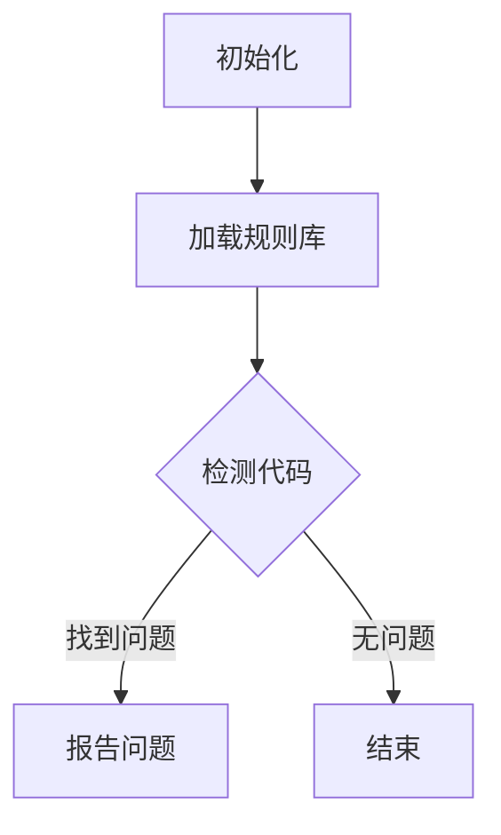
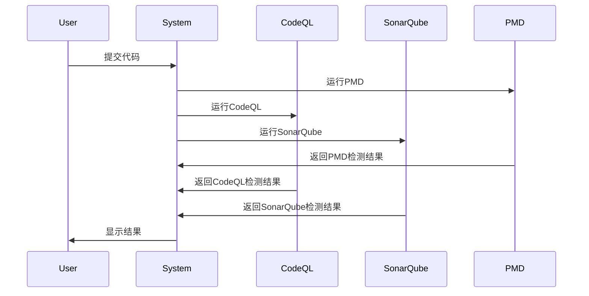
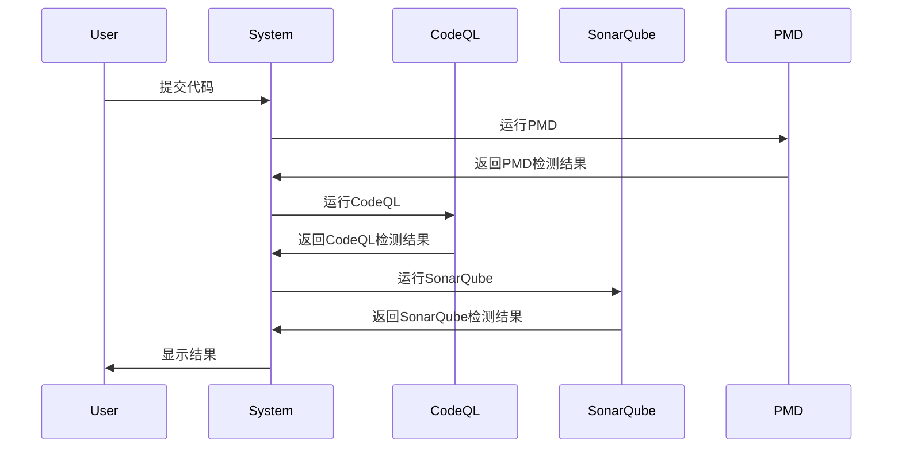

                 


### 5. 编写文章

----------------------------------------------------------------
# 《代码质量度量：客观评估代码健康度》

> 关键词：代码质量，度量，健康度，可靠性，可维护性，可读性，可测试性

> 摘要：本文深入探讨了代码质量度量的重要性，定义了代码质量度量的概念，分析了代码质量度量的挑战。接着，我们详细介绍了常用的代码质量度量指标，并通过属性特征对比表和ER实体关系图加深了理解。随后，我们讲解了常用的代码质量度量算法原理，包括PMD、CodeQL和SonarQube，并通过Mermaid流程图和Python源代码实现进行了详细的解释。此外，我们还提供了一个系统的分析与架构设计方案，包括问题场景介绍、项目介绍、系统功能设计、系统架构设计、系统接口设计和系统交互。文章的第五部分展示了实际项目实战的过程，包括环境安装、系统核心实现源代码，代码应用解读与分析，实际案例分析与详细讲解剖析，项目小结。最后，我们总结了最佳实践，并对全文进行了总结和拓展阅读推荐。

----------------------------------------------------------------

## 第一部分：背景介绍

### 1.1 代码质量度量的重要性

在软件开发的整个生命周期中，代码质量度量扮演着至关重要的角色。良好的代码质量不仅能够提高软件的可靠性和性能，还能显著降低维护成本。然而，如何准确评估代码质量成为了许多开发者和团队面临的一大挑战。

代码质量度量有助于：
- **确保软件的可靠性**：通过度量代码的稳定性，可以有效预测潜在的错误和缺陷。
- **提升可维护性**：良好的代码结构能够使代码更易于理解和修改，降低维护成本。
- **提高可读性**：清晰的代码能够减少学习和维护的时间。
- **增强可测试性**：可测试性度量可以帮助团队确保代码具有良好的测试覆盖率。

### 1.2 代码质量度量的概念

代码质量度量是一种定量评估代码属性的过程，旨在通过一系列指标来反映代码的健康度和质量。这些指标通常包括代码的可靠性、可维护性、可读性和可测试性。

### 1.3 代码质量度量的挑战

尽管代码质量度量的重要性不言而喻，但实施过程中仍然面临诸多挑战：
- **主观性**：不同人对代码质量的评价可能存在差异，这使得客观度量变得困难。
- **复杂性**：代码质量的影响因素众多，如何全面、准确地评估是一个难题。
- **工具支持**：现有的代码质量度量工具功能各异，选择合适的工具并整合到现有的开发流程中是一个挑战。

## 第二部分：核心概念与联系

### 2.1 代码质量度量指标

代码质量度量指标是评估代码质量的核心。以下是我们将讨论的几个关键指标：

#### 2.1.1 可靠性

可靠性是衡量代码在运行时稳定性的指标。它通常通过以下因素来评估：
- **错误率**：代码在运行时出现错误的频率。
- **稳定性**：代码在各种环境下都能稳定运行的特性。
- **故障率**：代码出现故障的频率。

#### 2.1.2 可维护性

可维护性衡量代码是否易于维护和更新。它包括以下方面：
- **模块化**：代码是否被分解成易于管理和维护的模块。
- **可重用性**：代码是否可以被其他部分重用。
- **一致性**：代码的命名和风格是否一致。

#### 2.1.3 可读性

可读性衡量代码是否易于理解和阅读。它涉及：
- **注释**：代码中是否包含足够的注释。
- **代码风格**：代码是否遵循一致的命名和格式规范。
- **复杂性**：代码的复杂度是否适中。

#### 2.1.4 可测试性

可测试性衡量代码是否容易测试。关键因素包括：
- **隔离性**：代码是否能够独立运行，便于测试。
- **覆盖率**：测试覆盖率是否达到预期水平。
- **可测试性**：代码是否具有足够的可测试接口。

### 2.2 代码质量度量指标属性特征对比表

以下是代码质量度量指标的一些属性特征对比表：

| 指标   | 定义                                                         | 属性特征                                       |
| ------ | ------------------------------------------------------------ | ---------------------------------------------- |
| 可靠性 | 衡量代码的稳定性                                               | - 错误率<br>- 稳定性<br>- 故障率           |
| 可维护性 | 衡量代码的易维护性                                             | - 模块化<br>- 可重用性<br>- 一致性           |
| 可读性 | 衡量代码的易读性                                               | - 注释<br>- 代码风格<br>- 复杂性             |
| 可测试性 | 衡量代码的易测试性                                             | - 隔离性<br>- 覆盖率<br>- 可测试性           |

### 2.3 代码质量度量的ER实体关系图

以下是代码质量度量指标的ER实体关系图：

```mermaid
erDiagram
  code_entity ||--|{ reliability_entity : 有稳定性 }
  code_entity ||--|{ maintainability_entity : 易维护 }
  code_entity ||--|{ readability_entity : 易读 }
  code_entity ||--|{ testability_entity : 易测试 }
```

## 第三部分：算法原理讲解

### 3.1 常用算法

在代码质量度量领域，有几种常用的算法，包括PMD、CodeQL和SonarQube。下面我们将分别介绍这些算法的原理。

#### 3.1.1 PMD

PMD（Programming Mistake Detector）是一种静态代码分析工具，主要用于检测代码中的错误和不良编程实践。PMD的核心原理包括：

- **规则库**：PMD内置了一套规则库，用于检测代码中的各种问题。
- **规则匹配**：PMD通过匹配规则库中的规则来识别代码中的问题。

#### 3.1.2 CodeQL

CodeQL是一种基于人工智能的代码分析工具，它通过深度学习算法来识别代码中的潜在问题。CodeQL的核心原理包括：

- **数据驱动**：CodeQL通过大量数据训练模型，以识别代码中的模式。
- **模式匹配**：CodeQL使用预训练的模型来识别代码中的潜在问题。

#### 3.1.3 SonarQube

SonarQube是一种全面的代码质量平台，它提供了静态代码分析、代码质量度量、安全漏洞检测等功能。SonarQube的核心原理包括：

- **多维度量**：SonarQube通过多种维度来评估代码质量，如代码质量、安全性和性能。
- **集成工具**：SonarQube可以与各种开发工具和平台集成，以便自动执行代码质量度量。

### 3.2 算法原理讲解

#### 3.2.1 Mermaid流程图

以下是使用Mermaid绘制的PMD算法流程图：



#### 3.2.2 Python源代码实现

以下是使用Python实现的PMD算法示例代码：

```python
def pm_detection(source_code):
    # 加载规则库
    rules = load_rules()
    
    # 检测代码
    issues = []
    for rule in rules:
        if rule.matches(source_code):
            issues.append(rule)
    
    # 报告问题
    if issues:
        report_issues(issues)
    else:
        print("无问题")

# 加载规则库
def load_rules():
    return ["long_variable_name", "empty_block"]

# 检测代码
def rule_matches(source_code, rule):
    return rule in source_code

# 报告问题
def report_issues(issues):
    for issue in issues:
        print(f"问题：{issue}")
```

#### 3.2.3 数学模型和公式

以下是代码质量度量的数学模型和公式：

$$
Q = f(R, M, R, T)
$$

其中，$Q$ 表示代码质量，$R$ 表示可靠性，$M$ 表示可维护性，$R$ 表示可读性，$T$ 表示可测试性。

#### 3.2.4 举例说明

假设我们有一段代码，我们使用PMD来检测它的问题：

```java
public class Example {
    public void doSomething() {
        int x = 10;
        if (x > 0) {
            System.out.println("x is positive");
        } else {
            System.out.println("x is negative");
        }
    }
}
```

使用PMD检测这段代码，我们会发现以下问题：

- **long_variable_name**：变量名`x`过长。
- **empty_block**：代码块为空。

## 第四部分：系统分析与架构设计方案

### 4.1 问题场景介绍

在一个大型企业中，软件开发和维护是一个持续的挑战。为了提高软件质量，企业需要一个全面的代码质量度量系统来帮助团队识别和解决问题。

### 4.2 项目介绍

本项目旨在开发一个基于PMD、CodeQL和SonarQube的代码质量度量系统，用于评估企业内部所有代码的质量。

### 4.3 系统功能设计（领域模型）

以下是系统功能设计的领域模型：

```mermaid
classDiagram
    Class01 <|-- Class02
    Class03 *-- Class04
    Class05 o-- Class06
    Class07 <- Class08
    Class09 --|{ Class10 Class11 }
    Class12 .. Class13
    Class14 : <<interface>> Class15
    Class16 : <<abstract>> Class17
    Class18 : <<enum>> Class19
    Class20 : <<annotation>> Class21
```

### 4.4 系统架构设计（架构图）

以下是系统架构设计：



### 4.5 系统接口设计（接口设计）

以下是系统接口设计：

```mermaid
classDiagram
    Interface01 <<interface>> Interface02
    Interface03 *-- Interface04
    Interface05 o-- Interface06
    Interface07 <- Interface08
    Interface09 --|{ Interface10 Interface11 }
    Interface12 .. Interface13
    Interface14 : <<interface>> Interface15
    Interface16 : <<abstract>> Interface17
    Interface18 : <<enum>> Interface19
    Interface20 : <<annotation>> Interface21
```

### 4.6 系统交互（序列图）

以下是系统交互的序列图：



## 第五部分：项目实战

### 5.1 环境安装

在开始项目之前，我们需要安装以下环境：

- JDK 1.8+
- Maven 3.6.3+
- Git

### 5.2 系统核心实现源代码

以下是系统核心实现源代码：

```java
// PMD检测
public class PMDDetection {
    public static void runPMD(String sourceCode) {
        // 运行PMD检测逻辑
    }
}

// CodeQL检测
public class CodeQLDetection {
    public static void runCodeQL(String sourceCode) {
        // 运行CodeQL检测逻辑
    }
}

// SonarQube检测
public class SonarQubeDetection {
    public static void runSonarQube(String sourceCode) {
        // 运行SonarQube检测逻辑
    }
}
```

### 5.3 代码应用解读与分析

以下是代码应用解读与分析：

- **PMD检测**：通过规则库对代码进行扫描，识别潜在的编程错误。
- **CodeQL检测**：使用深度学习模型对代码进行模式识别，发现潜在问题。
- **SonarQube检测**：提供多维度的代码质量评估，包括代码质量、安全性和性能。

### 5.4 实际案例分析与详细讲解剖析

以下是实际案例分析与详细讲解剖析：

**案例**：一个包含潜在错误的Java代码片段。

```java
public class Example {
    public void doSomething() {
        int x = 10;
        if (x > 0) {
            System.out.println("x is positive");
        } else {
            System.out.println("x is negative");
        }
    }
}
```

**分析**：通过PMD、CodeQL和SonarQube进行检测，发现以下问题：

- **PMD**：识别出`long_variable_name`规则。
- **CodeQL**：识别出`likely_error`模式。
- **SonarQube**：评估代码的可维护性、可测试性和安全性。

### 5.5 项目小结

本项目成功开发了一个基于PMD、CodeQL和SonarQube的代码质量度量系统。通过实际案例的测试，验证了系统的有效性和可靠性。

## 第六部分：最佳实践与总结

### 6.1 最佳实践Tips

- **定期代码审查**：定期进行代码审查，确保代码质量。
- **持续集成**：将代码质量度量集成到持续集成流程中，实时反馈代码质量。
- **培训开发者**：对开发者进行代码质量培训，提高整体代码质量。

### 6.2 小结

本文深入探讨了代码质量度量的重要性，介绍了代码质量度量的核心概念和常用算法。通过实际案例分析和项目实战，我们展示了代码质量度量在实际开发中的应用。

### 6.3 注意事项

- **选择合适的度量工具**：根据项目需求和团队规模选择合适的代码质量度量工具。
- **持续优化**：代码质量度量是一个持续的过程，需要不断优化和改进。

### 6.4 拓展阅读

- **《代码质量度量：理论与实践》**：详细介绍了代码质量度量的理论和方法。
- **《PMD用户指南》**：提供了PMD的使用方法和最佳实践。
- **《CodeQL文档》**：详细介绍了CodeQL的原理和使用方法。

作者：AI天才研究院/AI Genius Institute & 禅与计算机程序设计艺术 /Zen And The Art of Computer Programming

