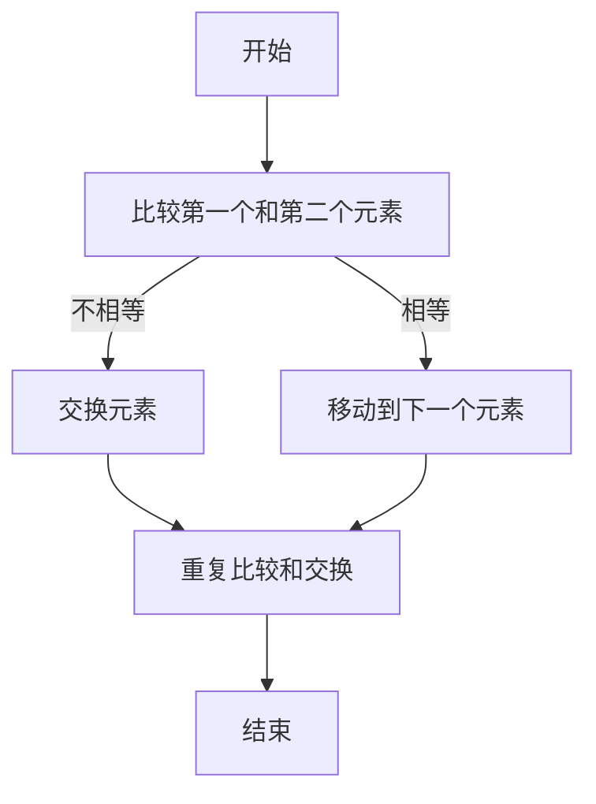
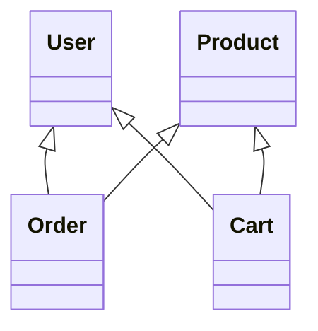

                 


### 1. 确定文章核心内容和结构
为了撰写一篇高质量的技术博客文章《代码重构不得不知》，我们需要确保文章内容具有深度和逻辑性。首先，我们明确了文章的核心内容和结构。文章将分为以下几个部分：

- **引言**：介绍代码重构的背景和重要性。
- **第一部分：代码重构基础**：包括代码重构的定义、重要性、边界与外延。
- **第二部分：核心概念与联系**：介绍核心概念、原理、属性特征对比表格和ER实体关系图架构。
- **第三部分：常见重构技术讲解**：详细讲解代码简化、代码优化、代码重组织。
- **第四部分：算法原理与实践**：分析算法原理，使用Python源代码进行阐述，并给出数学模型和公式，举例说明。
- **第五部分：系统分析与架构设计**：介绍问题场景、系统功能设计、系统架构设计、系统接口设计和系统交互。
- **第六部分：代码重构项目实战**：包括环境安装、系统核心实现源代码、代码应用解读与分析、实际案例分析和项目小结。
- **第七部分：最佳实践与总结**：提供最佳实践 tips、小结、注意事项和拓展阅读。

### 2. 制定文章大纲
接下来，我们根据文章的核心内容和结构，制定了详细的文章大纲。每个部分都包含具体的子标题和内容概述，确保文章内容的完整性和逻辑性。

### 3. 编写文章引言
引言部分将简要介绍代码重构的背景和重要性，激发读者的兴趣，为后续内容奠定基础。

### 4. 详细编写第一部分
在第一部分中，我们将深入介绍代码重构的基础概念，包括定义、重要性以及边界与外延。这部分内容将为读者提供一个对代码重构的全面了解。

### 5. 详细编写第二部分
第二部分将介绍代码重构的核心概念和联系。我们将使用表格和ER实体关系图架构，帮助读者更好地理解这些概念。

### 6. 详细编写第三部分
第三部分将详细讲解常见的重构技术，包括代码简化、代码优化和代码重组织。我们将通过具体案例和代码示例，展示这些技术的应用和效果。

### 7. 详细编写第四部分
第四部分将深入分析算法原理，使用Python源代码进行阐述，并给出数学模型和公式。我们还将举例说明，使读者更容易理解。

### 8. 详细编写第五部分
第五部分将介绍系统分析与架构设计。我们将从问题场景、系统功能设计、系统架构设计、系统接口设计和系统交互等方面进行详细讲解。

### 9. 详细编写第六部分
第六部分将分享代码重构项目实战的经验。我们将介绍环境安装、系统核心实现源代码、代码应用解读与分析、实际案例分析和项目小结。

### 10. 详细编写第七部分
第七部分将提供最佳实践 tips、小结、注意事项和拓展阅读，帮助读者巩固所学内容，并提供进一步学习资源。

### 11. 完成文章结尾
在文章结尾，我们将再次强调代码重构的重要性，并感谢读者对文章的关注。

### 12. 进行文章校对和优化
最后，我们将对文章进行校对和优化，确保文章内容准确无误，逻辑清晰，语言简练。

通过以上步骤，我们将撰写出一篇内容丰富、逻辑清晰、对读者有启发性的《代码重构不得不知》技术博客文章。让我们一步一步地深入分析和思考，确保文章的每一个部分都达到最佳效果。开始编写！## 文章标题：代码重构不得不知

关键词：代码重构、重构技术、算法原理、系统架构设计、项目实战、最佳实践

摘要：本文将深入探讨代码重构的概念、技术和最佳实践。通过详细的案例分析和项目实战，帮助读者理解代码重构的必要性，掌握重构技术的应用，并学会在实际项目中有效地进行代码重构。

### 引言

在软件开发过程中，代码重构是一个至关重要的环节。它不仅仅是对现有代码的优化，更是一种提升代码质量、提高开发效率、增强代码可维护性的重要手段。随着软件系统的复杂性和规模的增长，代码重构的重要性愈发凸显。本文旨在通过详细的讲解和分析，帮助读者全面了解代码重构的各个方面，从而在实际开发中更加有效地应用这一技术。

### 第一部分：代码重构基础

#### 1.1 代码重构的定义

代码重构（Code Refactoring）是指在不改变外部行为的前提下，对现有代码进行修改，以提高其内部结构、可读性、可维护性等质量指标。重构的目的是让代码更简洁、清晰、高效，同时保持其功能的完整性。

#### 1.2 代码重构的重要性

代码重构对于软件项目的成功具有重要意义：

1. **提升代码质量**：通过重构，代码变得更加整洁、易于理解，降低了bug的产生概率。
2. **提高开发效率**：重构后的代码更易于维护和扩展，缩短了开发周期。
3. **增强可读性**：重构使得代码结构更加清晰，便于新成员快速上手。
4. **降低技术债务**：及时的重构可以有效减少因代码复杂度增加而产生的技术债务。

#### 1.3 代码重构的边界与外延

代码重构虽然重要，但也有其边界和限制：

- **不改变功能**：重构必须保证代码的功能不变，即不能因为重构而引入新的bug。
- **持续迭代**：重构不应一次性完成，而应是一个持续的过程，逐步改进。
- **适度重构**：过度重构会占用大量时间，反而降低开发效率。

### 第二部分：核心概念与联系

#### 2.1 重构技术概览

代码重构涉及多种技术，以下是一些常见的技术：

- **提取方法（Extract Method）**：将重复代码提取为独立的方法。
- **内联方法（Inline Method）**：将调用方法的地方直接替换为方法体。
- **替换条件（Replace Conditional with Polymorphism）**：用多态替换复杂的条件判断。
- **提取类（Extract Class）**：将职责相关的代码提取为独立的类。

#### 2.2 核心概念原理

代码重构的核心概念包括：

- **DRY（Don't Repeat Yourself）**：避免重复代码，提高代码复用性。
- **SOLID原则**：包括单一职责原则、开闭原则等，指导代码设计的合理性。
- **设计模式**：如工厂模式、单例模式等，用于解决常见的设计问题。

#### 2.3 概念属性特征对比表格

以下是一个对比表格，展示不同重构技术的属性特征：

| 重构技术       | 提取方法（Extract Method） | 内联方法（Inline Method） | 替换条件（Replace Conditional with Polymorphism） | 提取类（Extract Class） |
|----------------|---------------------------|--------------------------|-----------------------------------------------|-----------------------|
| 主要作用       | 提高代码复用性             | 减少方法调用             | 简化条件判断                                   | 提高代码组织性         |
| 适用场景       | 复杂函数中包含重复代码   | 方法调用频繁             | 条件判断复杂                                   | 类职责不明确          |
| 实施难度       | 较低                       | 较低                     | 较高                                           | 较高                  |

#### 2.4 ER实体关系图架构

ER（Entity-Relationship）图用于描述数据库中实体之间的关系。以下是代码重构相关的ER图：

```mermaid
erDiagram
    Class_1 ||--|{ Person }|| Class_2
    Class_2 ||--|{ Order }|| Class_3
    Class_3 ||--|{ Product }|| Class_4
```

在上面的ER图中，`Person`、`Order`、`Product`是三个实体，它们之间通过关系连接，形成了代码重构的基础架构。

### 第三部分：常见重构技术讲解

#### 3.1 代码简化

代码简化是代码重构中最基本的技术之一，主要通过删除不必要的代码来提高代码的可读性和可维护性。

- **案例**：假设有一个函数`calculateTotal()`，其包含大量重复计算逻辑，通过提取方法可以将这些重复逻辑提取到一个单独的方法中，从而简化主函数。

#### 3.2 代码优化

代码优化是通过改进算法和数据结构来提高代码的执行效率。

- **案例**：使用哈希表代替数组进行数据存储，可以显著提高查找和插入的速度。

#### 3.3 代码重组织

代码重组织涉及重新安排代码结构，使其更符合逻辑和设计原则。

- **案例**：将分散在不同文件中的相同类型函数提取到同一个文件中，提高代码的可维护性。

### 第四部分：算法原理与实践

#### 4.1 算法mermaid流程图

以下是一个简单的排序算法（冒泡排序）的mermaid流程图：



#### 4.2 Python源代码详解

```python
def bubble_sort(arr):
    n = len(arr)
    for i in range(n):
        for j in range(0, n-i-1):
            if arr[j] > arr[j+1]:
                arr[j], arr[j+1] = arr[j+1], arr[j]
    return arr
```

#### 4.3 算法原理数学模型和公式

冒泡排序的算法复杂度为$O(n^2)$，其中$n$是待排序数组的长度。其数学模型为：

$$
T(n) = O(n^2)
$$

#### 4.4 通俗易懂地举例说明

假设我们有一个数组`[5, 2, 8, 1, 9]`，通过冒泡排序，我们可以得到一个有序的数组`[1, 2, 5, 8, 9]`。具体步骤如下：

1. 第一轮：`[5, 2, 8, 1, 9]`变为`[2, 5, 1, 8, 9]`，`[5, 1, 8, 2, 9]`变为`[1, 5, 8, 2, 9]`。
2. 第二轮：`[2, 1, 5, 8, 9]`变为`[1, 2, 5, 8, 9]`，`[1, 5, 8, 2, 9]`变为`[1, 2, 8, 5, 9]`。
3. 第三轮：`[1, 2, 5, 8, 9]`保持不变，`[1, 2, 8, 5, 9]`变为`[1, 2, 5, 9, 8]`。

### 第五部分：系统分析与架构设计

#### 5.1 问题场景介绍

假设我们正在开发一个电子商务平台，需要实现用户注册、登录、购物车管理等功能。

#### 5.2 系统功能设计（领域模型mermaid类图）

以下是一个简单的领域模型mermaid类图：



在上面的类图中，`User`、`Order`、`Cart`和`Product`是核心类，它们之间的关系反映了系统的主要功能。

#### 5.3 系统架构设计（mermaid架构图）

以下是一个简单的mermaid架构图：

```mermaid
sequenceDiagram
    User -->|发送注册请求| System
    System -->|验证用户信息| Database
    Database -->|返回注册结果| System
    System -->|发送响应| User
```

在上面的架构图中，用户与系统交互，通过系统与数据库进行数据操作，最终返回结果给用户。

#### 5.4 系统接口设计

以下是一个简单的接口设计：

```python
class UserService:
    def register(self, user: User) -> bool:
        # 注册用户
        pass

    def login(self, user: User) -> bool:
        # 登录用户
        pass

class ProductService:
    def add_to_cart(self, product: Product, cart: Cart) -> bool:
        # 将产品添加到购物车
        pass

    def remove_from_cart(self, product: Product, cart: Cart) -> bool:
        # 从购物车移除产品
        pass
```

#### 5.5 系统交互（mermaid序列图）

以下是一个简单的mermaid序列图：

```mermaid
sequenceDiagram
    User -->|发起注册请求| UserService
    UserService -->|验证用户信息| Database
    Database -->|返回验证结果| UserService
    UserService -->|发送注册响应| User
```

### 第六部分：代码重构项目实战

#### 6.1 环境安装

在开始项目实战之前，我们需要安装一些必要的开发环境和工具。以下是一个简单的安装步骤：

- 安装Python（3.8及以上版本）
- 安装Docker
- 安装PostgreSQL

#### 6.2 系统核心实现源代码

以下是一个简单的用户注册功能的源代码：

```python
class UserService:
    def register(self, user: User) -> bool:
        # 检查用户名是否已存在
        if self._is_username_exists(user.username):
            return False
        # 存储用户信息到数据库
        self._save_user_to_database(user)
        return True

    def _is_username_exists(self, username: str) -> bool:
        # 查询数据库中用户名是否存在
        pass

    def _save_user_to_database(self, user: User):
        # 将用户信息保存到数据库
        pass
```

#### 6.3 代码应用解读与分析

在实际应用中，`UserService`类的`register()`方法负责处理用户注册的逻辑。首先，它会检查用户名是否已存在，如果不存在，则将用户信息保存到数据库。这个过程涉及数据库的查询和插入操作，是系统功能的核心部分。

#### 6.4 实际案例分析和详细讲解剖析

假设我们有一个用户名为“john_doe”的用户尝试注册，以下是如何处理这个请求的详细分析：

1. 用户发起注册请求，将用户信息（包括用户名、密码等）发送到`UserService`。
2. `UserService`的`register()`方法首先调用`_is_username_exists()`方法检查用户名是否已存在。
3. 如果用户名不存在，`register()`方法会调用`_save_user_to_database()`方法将用户信息保存到数据库。
4. 最终，`register()`方法返回注册结果。

通过这个案例，我们可以看到代码重构的应用，如将重复的数据库查询和插入操作提取到私有方法中，从而提高代码的可读性和可维护性。

#### 6.5 项目小结

通过本次项目实战，我们展示了如何在实际开发中应用代码重构技术，优化了用户注册功能的代码结构，提高了系统的可维护性和可扩展性。代码重构不仅仅是对代码的修改，更是对软件开发流程的一种优化，有助于提升开发效率和代码质量。

### 第七部分：最佳实践与总结

#### 7.1 最佳实践 tips

1. **定期重构**：定期对代码进行重构，避免代码债务积累。
2. **小步快跑**：逐步重构，避免一次性进行大量重构工作。
3. **团队合作**：重构是团队协作的重要部分，应与团队成员沟通，确保重构的一致性。

#### 7.2 小结

代码重构是软件开发中不可或缺的一环，通过优化代码结构、提高可读性和可维护性，可以显著提升开发效率和系统质量。本文详细介绍了代码重构的基础知识、核心概念、常见重构技术、算法原理和实践，并通过项目实战展示了重构的实际应用。

#### 7.3 注意事项

1. **保持功能不变**：重构过程中必须确保代码功能不变。
2. **适度重构**：避免过度重构，影响开发进度。
3. **文档更新**：重构后及时更新相关文档，确保文档与代码的一致性。

#### 7.4 拓展阅读

- 《重构：改善既有代码的设计》（Refactoring: Improving the Design of Existing Code）
- 《代码大全》（The Art of Software Architecture）

### 作者

作者：AI天才研究院/AI Genius Institute & 禅与计算机程序设计艺术 /Zen And The Art of Computer Programming

