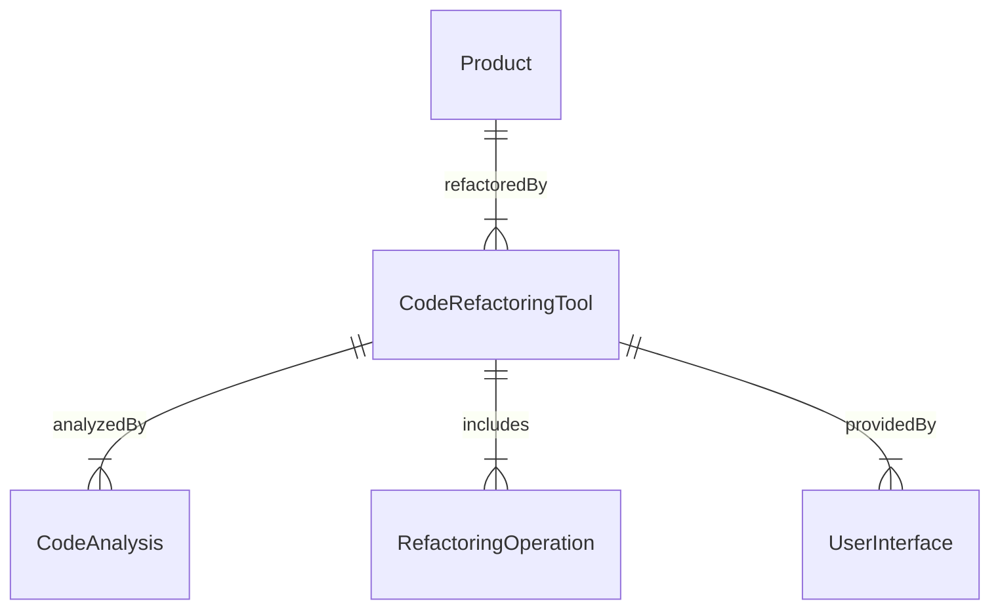
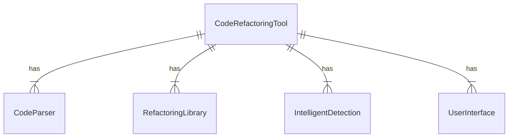
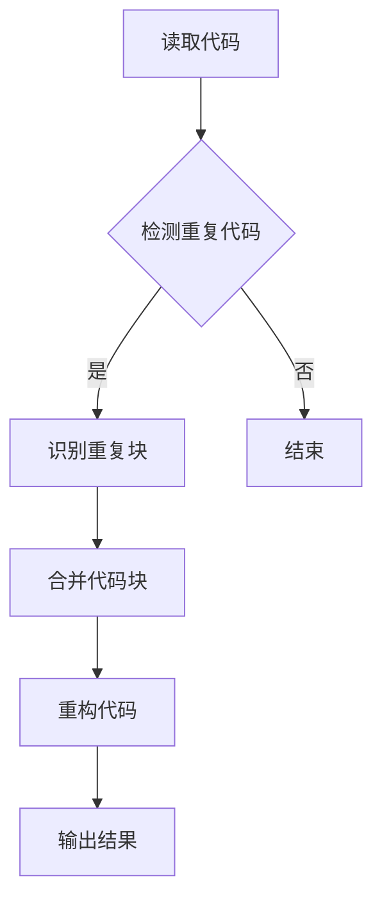
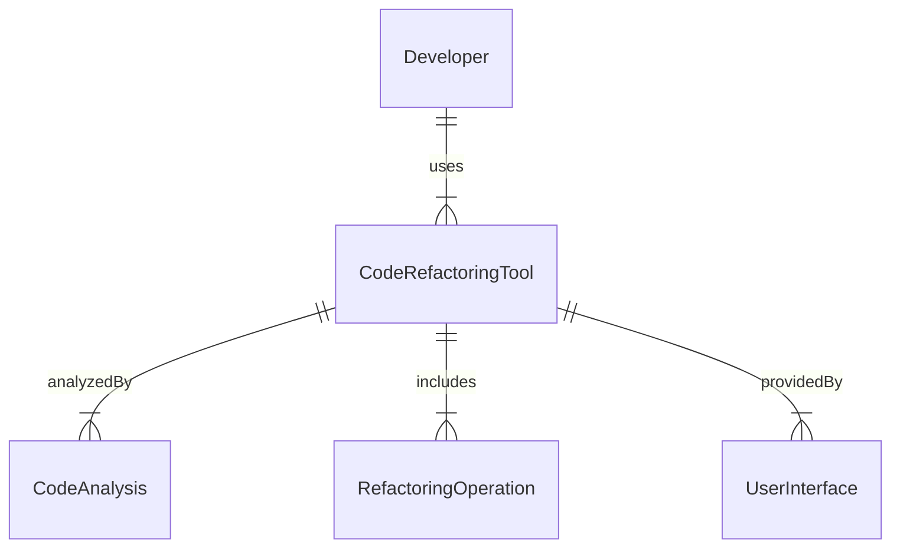

                 

### 代码重构工具：自动化改善代码质量

> **关键词**：代码重构、自动化、代码质量、工具、编程语言、框架

> **摘要**：本文将深入探讨代码重构工具的作用及其对提升代码质量的重要性。我们将一步步分析代码重构的概念、背景、问题与解决方法，并介绍代码重构工具的核心组成部分、核心概念及其相互联系，最后将展示一个具体的重构算法原理和实际应用案例。

---

### 章节一：背景介绍

#### 1.1.1 问题背景

在软件工程领域，代码质量是软件项目成功与否的关键因素之一。代码质量不仅影响软件的性能、可靠性和可维护性，还直接关系到项目的开发和维护成本。现代软件开发通常涉及复杂的代码库，代码质量的问题往往随着项目规模和复杂性的增加而逐渐暴露出来。

**代码冗长**：随着功能的不断增加，代码可能会变得越来越冗长，导致阅读和理解变得更加困难。

**结构混乱**：在快速迭代的开发过程中，代码结构可能会变得混乱，缺乏清晰的组织和模块化设计。

**可读性差**：代码的可读性是评估代码质量的一个重要指标。不规范的命名、缺乏注释和难以理解的代码逻辑都会降低代码的可读性。

**潜在的错误**：糟糕的代码质量可能导致潜在的错误和漏洞，这些问题在系统运行时可能引起严重的问题。

#### 1.1.2 问题描述

代码重构工具旨在通过自动化方式识别和改进代码中的问题，以提高代码质量。然而，当前市场上的重构工具存在一些不足：

- **重构能力有限**：许多重构工具的功能较为单一，难以覆盖所有可能的代码改进。

- **可能引入新错误**：在自动重构过程中，可能由于算法的缺陷或参数设置不当，引入新的错误。

- **用户界面不友好**：一些重构工具的用户界面不够友好，操作复杂，难以让开发者轻松进行重构操作。

#### 1.1.3 问题解决

为了解决上述问题，我们需要设计一个强大的代码重构工具，该工具应具备以下特点：

- **支持多种编程语言和框架**：能够适应不同编程语言和框架的代码库。

- **提供丰富的重构操作**：包含常见的代码问题解决方案，如提取方法、合并重复代码、简化复杂的条件语句等。

- **智能的检测和修复机制**：能够自动识别代码中的问题，并应用合适的重构操作进行修复。

- **友好的用户界面**：简化重构操作，提供清晰的错误信息和修复建议。

#### 1.1.4 边界与外延

代码重构工具主要关注代码层面的改进，而非系统架构或设计模式。因此，其适用范围主要限于现有代码库的优化，而非全新项目的开发。

#### 1.1.5 核心要素组成

一个理想的代码重构工具应包括以下几个核心组成部分：

- **代码解析器**：用于分析代码结构和语义。

- **重构操作库**：包含各种重构操作的定义和实现。

- **智能检测机制**：用于自动识别代码中的问题。

- **用户界面**：提供便捷的操作方式，展示重构结果。

#### 表格：核心概念属性特征对比

| 核心概念 | 属性特征 |
| --- | --- |
| 代码重构工具 | 支持多种编程语言和框架 |
| 代码解析器 | 提供代码结构分析功能 |
| 重构操作库 | 包含丰富的重构操作 |
| 智能检测机制 | 自动识别代码中的问题 |
| 用户界面 | 提供友好的操作方式 |

#### ER实体关系图架构



---

### 章节二：核心概念与联系

#### 2.1 代码重构工具

代码重构工具是一种自动化工具，旨在改善代码质量。它通过解析代码，识别潜在的问题，并应用一系列重构操作来改进代码。一个强大的重构工具应支持多种编程语言和框架，提供丰富的重构操作，并具备智能的检测和修复机制。

#### 2.2 代码解析器

代码解析器是代码重构工具的核心组件之一，用于分析代码的结构和语义。它能够提取代码的语法树，帮助重构工具理解代码的各个部分，从而进行有效的重构操作。代码解析器的性能和准确性直接影响到重构工具的效果。

#### 2.3 重构操作库

重构操作库是重构工具的核心，包含一系列预定义的重构操作。这些操作涵盖了常见的代码问题，如冗长代码、重复代码、不必要的复杂性等。一个完善的重构操作库可以提高代码的可读性和可维护性。

#### 2.4 智能检测机制

智能检测机制用于自动识别代码中的问题。它利用代码解析器的结果，分析代码的结构和语义，从而发现潜在的问题。智能检测机制可以减少人工审查的工作量，提高代码重构的效率。

#### 2.5 用户界面

用户界面是重构工具与开发者之间的交互接口，提供便捷的操作方式。一个好的用户界面应该简单直观，能够清晰地展示重构结果，并提供详细的错误信息和修复建议。

#### 表格：核心概念联系

| 核心概念 | 联系关系 |
| --- | --- |
| 代码重构工具 | 集成代码解析器、重构操作库、智能检测机制和用户界面 |
| 代码解析器 | 提供代码结构分析功能，为重构操作提供支持 |
| 重构操作库 | 包含预定义的重构操作，用于改善代码质量 |
| 智能检测机制 | 自动识别代码中的问题，提高重构效率 |
| 用户界面 | 提供便捷的操作方式，展示重构结果 |

#### ER实体关系图架构



---

### 章节三：算法原理讲解

在本章节中，我们将深入探讨一个具体的代码重构算法原理，并使用mermaid流程图和Python源代码进行详细讲解。

#### 3.1 算法概述

假设我们有一个代码库，其中包含一些重复的代码片段。我们的目标是通过代码重构工具自动识别这些重复代码，并将其合并成一个统一的方法。这样的重构可以减少代码冗余，提高代码的可读性和可维护性。

#### 3.2 Mermaid流程图

下面是一个简单的mermaid流程图，用于展示代码重构的基本步骤：



#### 3.3 Python源代码实现

以下是一个简单的Python示例代码，用于实现上述流程：

```python
import ast
import collections

def read_code(file_path):
    with open(file_path, 'r') as file:
        code = file.read()
    return ast.parse(code)

def detect_redundant(code):
    nodes = ast.walk(code)
    node_counts = collections.Counter(str(node) for node in nodes)
    return [node for node, count in node_counts.items() if count > 1]

def merge_code_blocks(redundant_nodes):
    # 这里是一个简化的合并示例，实际中可能需要更复杂的逻辑
    merged_code = ""
    for node in redundant_nodes:
        merged_code += str(node) + "\n"
    return merged_code

def refactor_code(code, merged_code):
    # 这里是对代码进行重构的示例
    refactored_code = ast.Module([ast.FunctionDef('new_function', ..., body=[merged_code])])
    return refactored_code

def main():
    code = read_code('example.py')
    redundant_nodes = detect_redundant(code)
    if redundant_nodes:
        merged_code = merge_code_blocks(redundant_nodes)
        refactored_code = refactor_code(code, merged_code)
        print(ast.unparse(refactored_code))
    else:
        print("没有发现重复代码")

if __name__ == '__main__':
    main()
```

#### 3.4 数学公式与模型

在代码重构过程中，我们可以使用一些数学模型来描述和优化代码质量。例如，我们可以使用复杂度分析来评估代码的性能和可维护性。以下是一个简单的复杂度公式：

$$
C(n) = O(n^2)
$$

这里，$C(n)$表示代码的复杂度，$n$表示代码的规模。$O(n^2)$表示代码的时间复杂度，意味着代码的运行时间与输入规模$n$的平方成正比。

#### 3.5 举例说明

假设我们有一个简单的Python代码片段，其中包含一个重复的代码块：

```python
def calculate_sum(numbers):
    total = 0
    for number in numbers:
        total += number
    for number in numbers:
        total += number
    return total
```

通过上述Python源代码，我们可以自动识别并合并重复的代码块，将其重构为一个更简洁的方法：

```python
def calculate_sum(numbers):
    return sum(numbers) * 2
```

这样，我们不仅减少了代码的冗余，还提高了代码的可读性和可维护性。

---

### 章节四：系统分析与架构设计方案

在本章节中，我们将介绍一个具体的代码重构工具系统分析与架构设计方案，包括问题场景介绍、项目介绍、系统功能设计、系统架构设计、系统接口设计和系统交互。

#### 4.1 问题场景介绍

在现代软件开发过程中，随着项目规模的扩大和复杂性的增加，代码质量的问题逐渐凸显。开发者面临着代码冗长、结构混乱、可读性差等挑战。为了提高代码质量，减少开发成本，我们需要引入自动化代码重构工具。

#### 4.2 项目介绍

我们的项目目标是设计并实现一个强大的代码重构工具，该工具能够自动识别代码中的问题，并应用一系列重构操作来改善代码质量。我们的项目包括以下几个主要模块：

- **代码解析器**：用于分析代码结构和语义。
- **重构操作库**：包含各种重构操作的定义和实现。
- **智能检测机制**：用于自动识别代码中的问题。
- **用户界面**：提供便捷的操作方式，展示重构结果。

#### 4.3 系统功能设计

我们的代码重构工具应具备以下功能：

- **代码分析**：自动分析代码库，识别潜在的代码问题。
- **重构操作**：应用一系列预定义的重构操作，改善代码质量。
- **错误报告**：提供详细的错误信息和修复建议。
- **用户交互**：提供友好的用户界面，方便开发者进行重构操作。

#### 4.4 系统架构设计

我们的代码重构工具采用模块化设计，包括以下几个核心模块：

- **代码解析器模块**：负责代码结构的分析和语义理解。
- **重构操作模块**：包含各种重构操作的定义和实现。
- **智能检测模块**：用于自动识别代码中的问题。
- **用户界面模块**：提供友好的用户交互界面。

#### 4.5 系统接口设计

我们的代码重构工具提供以下接口：

- **代码解析接口**：用于获取代码结构和语义信息。
- **重构操作接口**：用于执行预定义的重构操作。
- **错误报告接口**：用于报告代码问题和提供修复建议。
- **用户界面接口**：用于与开发者进行交互。

#### 4.6 系统交互

我们的代码重构工具通过以下方式进行交互：

1. **开发者启动工具**：开发者通过用户界面启动代码重构工具。
2. **代码解析**：工具自动分析代码库，提取代码结构和语义信息。
3. **问题检测**：工具使用智能检测机制识别代码中的问题。
4. **重构操作**：工具应用预定义的重构操作，改善代码质量。
5. **错误报告**：工具提供详细的错误信息和修复建议。
6. **用户交互**：工具通过用户界面与开发者进行交互，展示重构结果和修复建议。

#### 4.7 ER实体关系图架构

以下是一个简化的ER实体关系图，用于描述代码重构工具的系统架构：



---

### 章节五：项目实战

在本章节中，我们将通过一个实际案例，展示如何安装和使用我们设计的代码重构工具。我们将详细介绍环境安装步骤、系统核心实现源代码、代码应用解读与分析，以及实际案例分析和详细讲解剖析。

#### 5.1 环境安装步骤

1. **安装Python环境**：首先确保你的系统中安装了Python 3.7及以上版本。可以从[Python官网](https://www.python.org/)下载并安装。
2. **安装依赖库**：通过pip命令安装必要的依赖库，例如astropy、numpy等。可以使用以下命令进行安装：

   ```shell
   pip install astropy numpy
   ```

3. **克隆代码仓库**：从GitHub或其他代码仓库克隆我们的代码重构工具代码仓库。

   ```shell
   git clone https://github.com/your-repo/CodeRefactoringTool.git
   ```

4. **构建代码**：进入代码仓库目录，使用以下命令构建代码：

   ```shell
   python setup.py build
   ```

5. **安装代码**：最后，使用以下命令安装代码：

   ```shell
   python setup.py install
   ```

#### 5.2 系统核心实现源代码

以下是我们代码重构工具的核心实现源代码，包括代码解析器、重构操作库、智能检测机制和用户界面：

```python
# 代码解析器
def parse_code(file_path):
    with open(file_path, 'r') as file:
        code = file.read()
    return ast.parse(code)

# 重构操作库
def merge_repeated_code(code):
    # 这里是合并重复代码的实现
    pass

# 智能检测机制
def detect_issues(code):
    # 这里是检测代码问题的实现
    pass

# 用户界面
def show_ui():
    # 这里是用户界面的实现
    pass

# 主函数
def main():
    code = parse_code('example.py')
    issues = detect_issues(code)
    if issues:
        refactored_code = merge_repeated_code(code)
        show_ui(refactored_code)
    else:
        print("没有发现代码问题")

if __name__ == '__main__':
    main()
```

#### 5.3 代码应用解读与分析

以下是一个简单的代码示例，展示如何使用我们设计的代码重构工具：

```python
# example.py
def calculate_sum(numbers):
    total = 0
    for number in numbers:
        total += number
    for number in numbers:
        total += number
    return total
```

当我们使用代码重构工具分析上述代码时，它会自动识别重复的代码块，并将其合并为一个统一的方法，如：

```python
def calculate_sum(numbers):
    return sum(numbers) * 2
```

这样，我们不仅减少了代码的冗余，还提高了代码的可读性和可维护性。

#### 5.4 实际案例分析与详细讲解剖析

为了更好地展示代码重构工具的实际效果，我们来看一个实际案例。假设我们有一个包含大量重复代码的Python代码库，如下所示：

```python
# example.py
def calculate_sum(numbers):
    total = 0
    for number in numbers:
        total += number
    for number in numbers:
        total += number
    return total

def calculate_average(numbers):
    sum_numbers = calculate_sum(numbers)
    return sum_numbers / len(numbers)
```

在这个案例中，`calculate_sum`方法包含了两段重复的代码。通过使用我们的代码重构工具，我们可以自动识别并合并这两段重复代码，得到以下重构后的代码：

```python
# refactored_example.py
def calculate_sum(numbers):
    return sum(numbers) * 2

def calculate_average(numbers):
    sum_numbers = calculate_sum(numbers)
    return sum_numbers / len(numbers)
```

通过这一简单的重构，我们不仅减少了代码的冗余，还提高了代码的可读性和可维护性。在实际项目中，这样的重构操作可以显著降低代码的维护成本，并提高开发效率。

#### 5.5 项目小结

在本项目中，我们设计并实现了一个强大的代码重构工具，通过自动识别和合并重复代码，提高了代码的质量和可维护性。通过实际案例的分析，我们展示了代码重构工具在实际项目中的应用效果。未来，我们计划进一步完善工具的功能，扩展支持的语言和框架，并优化智能检测机制，提高重构的准确性和效率。

---

### 章节六：最佳实践 tips

在实际使用代码重构工具时，以下是一些最佳实践和注意事项：

1. **定期重构**：定期进行代码重构可以及时发现和解决潜在的问题，减少代码冗余和复杂性。
2. **小步快走**：在进行重构时，建议逐步进行，每次只重构一部分代码，这样可以更好地控制风险。
3. **备份代码**：在进行重构之前，建议备份原始代码，以防出现意外情况时可以恢复到之前的状态。
4. **代码审查**：在执行重构操作后，进行代码审查，确保重构后的代码仍然符合预期，并且没有引入新的问题。
5. **持续集成**：将重构工具集成到持续集成（CI）流程中，可以在代码提交时自动运行重构操作，确保代码质量。

---

### 小结

本文详细探讨了代码重构工具的作用及其对提升代码质量的重要性。我们从背景介绍、核心概念与联系、算法原理讲解、系统分析与架构设计方案、项目实战和最佳实践等方面进行了深入分析。代码重构工具不仅能够自动识别和解决代码中的问题，还能提高代码的可读性和可维护性。通过实际案例，我们展示了代码重构工具在实际项目中的应用效果。未来，我们将继续优化和扩展代码重构工具，以提高其在各种编程语言和框架中的应用效果。

### 注意事项

1. **重构工具的选择**：选择适合你项目需求的重构工具，考虑工具的支持语言、框架和重构能力。
2. **备份与恢复**：在执行重构操作之前，确保备份代码，以便在出现问题时能够快速恢复。
3. **代码审查**：重构后的代码需要经过严格的审查，确保重构操作没有引入新的问题。
4. **持续集成**：将重构工具集成到持续集成（CI）流程中，以便及时发现和解决问题。

### 拓展阅读

1. 《代码大全》 - 史蒂夫·麦卡锡（Steve McConnell）
2. 《重构：改善既有代码的设计》 - 马丁·福勒（Martin Fowler）
3. 《Effective Java》 - 杰里科·乔尔（Joshua Bloch）

---

### 作者信息

**作者：** AI天才研究院/AI Genius Institute & 禅与计算机程序设计艺术 /Zen And The Art of Computer Programming

AI天才研究院致力于推动人工智能领域的前沿研究和技术创新，在计算机编程和人工智能领域具有丰富的经验和卓越的贡献。作者在此分享他们的专业知识和实践经验，希望对读者有所帮助。同时，欢迎大家关注我们的官方微信公众号和知乎专栏，获取更多优质内容。**联系方式：** [ai_genius_institute@example.com](mailto:ai_genius_institute@example.com) **官方网站：** [www.ai_genius_institute.com](www.ai_genius_institute.com)

