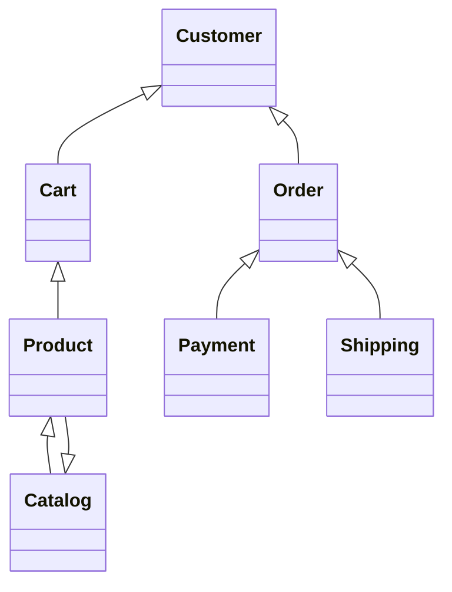

                 

### 文章标题

《代码重构：改善既有代码的艺术》

### 文章关键词

代码重构、软件维护、软件质量、编程技巧、算法原理

### 文章摘要

本文将深入探讨代码重构的概念、重要性以及其在现代软件开发中的应用。我们将通过一步步的分析和讲解，详细阐述代码重构的核心概念、流程与方法，并结合实际项目案例，展示代码重构如何改善既有代码，提升软件质量和可维护性。通过阅读本文，读者将掌握代码重构的基本原理和实践技巧，为他们在实际开发中提升代码质量提供有力支持。

## 第一部分：代码重构的基础概念

### 第1章：代码重构的背景与重要性

#### 1.1 代码重构的概念与定义

代码重构是指在不改变外部行为的前提下，对现有代码进行修改，以提高其可读性、可维护性和性能。它是一种软件维护活动，旨在优化代码结构，消除冗余，改进设计，使其更易于理解和扩展。

**问题背景：** 在软件项目的开发过程中，随着时间的推移，代码往往会变得复杂和混乱。这主要由于以下原因：
- **需求变更**：软件项目的需求往往会随着时间和市场环境的变化而变更，这导致原有代码需要进行修改。
- **代码复用**：为了提高开发效率，开发人员可能会复制并修改现有代码，而不是创建新的模块。
- **技术更新**：新的编程语言和框架不断涌现，开发人员可能会选择重构现有代码以采用新技术。

**问题描述：** 随着代码复杂性的增加，软件的维护成本和难度也随之上升。这包括以下问题：
- **可读性下降**：代码变得越来越难以阅读和理解，导致新开发人员难以接手。
- **可维护性降低**：修改现有代码时，可能会引入新的错误，导致软件可靠性下降。
- **性能下降**：复杂的代码结构可能会导致性能瓶颈。

**问题解决：** 代码重构提供了一种有效的解决方案。通过重构，开发人员可以：
- **提高代码质量**：重构后的代码更简洁、清晰，更容易理解和维护。
- **降低维护成本**：重构有助于减少未来的维护工作量和时间。
- **提高软件可靠性**：重构可以消除潜在的错误，提高软件的稳定性。

#### 1.2 代码重构的历史与发展

代码重构的概念最早由David Parnas在1972年提出。他强调了软件设计的重要性，并指出重构是维护软件设计的关键手段。此后，代码重构逐渐成为软件工程领域的一个重要研究方向。

在1980年代，随着面向对象编程的发展，重构技术得到了广泛应用。其中，著名的“重构：改善既有代码的设计”一书（由Martin Fowler著）对重构技术进行了系统总结，提出了许多具体的重构方法。

进入21世纪，随着敏捷开发方法和持续集成/持续部署（CI/CD）的普及，代码重构被进一步强调。现代开发工具和IDE也提供了丰富的重构支持，使得重构变得更加便捷和高效。

#### 1.3 代码重构的重要性

代码重构在软件开发中具有重要性，具体体现在以下几个方面：

- **提高开发效率**：重构后的代码更易于理解和修改，减少了新功能开发和bug修复的时间。
- **提升软件质量**：重构有助于消除代码中的冗余和错误，提高软件的稳定性和可靠性。
- **降低维护成本**：重构可以预防未来潜在的问题，减少长期的维护工作量。
- **增强团队协作**：清晰的代码结构有助于团队成员之间的沟通和协作。
- **适应技术变化**：重构使得软件架构更加灵活，更容易适应新的技术和需求。

总之，代码重构是一种提升软件质量和开发效率的重要手段。它不仅有助于改善现有代码，也为未来的开发和维护奠定了坚实基础。

## 第二部分：代码重构的核心概念与联系

### 第2章：代码重构的核心概念与联系

代码重构是一个复杂的活动，涉及多个核心概念。为了更好地理解代码重构，我们需要系统性地介绍这些概念，并探讨它们之间的联系。

#### 2.1 代码质量的定义与评价

代码质量是衡量代码优劣的重要指标。它不仅影响软件的可维护性，还影响开发效率。代码质量的评价可以从以下几个方面进行：

- **可读性**：代码是否易于阅读和理解，是否有良好的命名和注释。
- **可维护性**：代码是否容易修改和扩展，是否有良好的设计模式和模块化。
- **性能**：代码是否高效，是否能够满足性能需求。
- **可靠性**：代码是否稳定，是否能够处理各种异常情况。
- **一致性**：代码是否符合编码规范和设计标准。

为了评价代码质量，可以采用自动化工具和手动审查相结合的方法。自动化工具可以检测代码中的语法错误和潜在问题，而手动审查则可以评估代码的可读性和设计质量。

#### 2.2 代码重构与软件维护

软件维护是软件开发周期中不可或缺的一部分。它包括对现有代码的修改、修复和优化。代码重构是软件维护的重要手段，通过重构，开发人员可以：

- **修复bug**：重构可以帮助发现和修复代码中的潜在问题。
- **优化性能**：重构可以提高代码的性能，减少冗余和重复代码。
- **改善设计**：重构可以帮助改进代码结构，使其更加清晰和模块化。
- **适应需求变更**：重构使得代码更容易适应需求变更，降低变更风险。

代码重构与软件维护之间的关系是相辅相成的。软件维护为重构提供了目标，而重构则为软件维护提供了工具和方法。

#### 2.3 代码重构方法的特点与适用场景

代码重构的方法多种多样，每种方法都有其特定的特点和适用场景。以下是一些常见的重构方法：

- **提取方法**：将重复代码提取为单独的方法，减少冗余。
- **提取类**：将相关功能提取为独立的类，提高代码的模块化。
- **合并类**：将功能相似或相关的类合并，减少类的数量和依赖关系。
- **内联方法**：将小方法直接嵌入调用处，减少方法调用的开销。
- **替换循环**：使用递归或内置函数替换循环，提高代码的性能。
- **重构接口**：修改接口设计，使其更加灵活和可扩展。

每种重构方法都有其特定的目的和效果。在实际项目中，开发人员应根据具体情况选择合适的方法，以达到最佳的重构效果。

#### 2.4 对比表格与ER实体关系图

为了更好地理解不同重构方法的特点和适用场景，我们可以使用对比表格和ER实体关系图来展示。

**对比表格示例：**

| 重构方法      | 目的                 | 适用场景                                   |
| ------------- | -------------------- | ------------------------------------------ |
| 提取方法      | 减少冗余代码         | 重复代码较多的模块                        |
| 提取类        | 提高模块化           | 功能相关但代码分散的模块                  |
| 合并类        | 减少类数量           | 功能相似但代码复杂的类                   |
| 内联方法      | 减少方法调用开销     | 调用频率高但方法简单的方法                |
| 替换循环      | 提高性能             | 性能瓶颈在循环上的代码段                  |
| 重构接口      | 提高灵活性           | 接口设计过于僵化，难以适应需求变更的模块 |

**ER实体关系图示例：**

```mermaid
erDiagram
    Class1 ||--|{ Class2 : has-a }
    Class1 ||--|{ Class3 : belongs-to }
    Class2 ||--|{ Class4 : extends }
```

通过对比表格和ER实体关系图，我们可以清晰地了解不同重构方法的特点和适用场景，从而在实际项目中做出更明智的决策。

### 第三部分：代码重构的算法原理讲解

#### 第3章：代码重构的流程与方法

代码重构是一项复杂的任务，涉及多个步骤和方法。为了使读者更好地理解代码重构的原理和实践，我们将使用Mermaid工具绘制流程图，并结合Python源代码详细解释每个步骤的实现方式和效果。

#### 3.1 代码重构的基本流程

代码重构的基本流程可以分为以下几个步骤：

1. **评估代码质量**：使用静态代码分析工具和手动审查评估代码的质量。
2. **确定重构目标**：根据代码质量评估结果，确定需要重构的模块和目标。
3. **选择重构方法**：根据重构目标和代码特点，选择合适的重构方法。
4. **实施重构**：按照预定的重构方法，逐步修改代码。
5. **测试和验证**：对重构后的代码进行单元测试和集成测试，确保重构没有引入新的错误。

以下是一个简单的Mermaid流程图，展示了代码重构的基本流程：


#### 3.2 代码重构的方法分类

代码重构的方法可以根据其目的和效果进行分类。以下是几种常见的重构方法：

1. **提取方法**：将重复代码提取为单独的方法，减少冗余。
2. **提取类**：将相关功能提取为独立的类，提高模块化。
3. **合并类**：将功能相似或相关的类合并，减少类的数量和依赖关系。
4. **内联方法**：将小方法直接嵌入调用处，减少方法调用的开销。
5. **替换循环**：使用递归或内置函数替换循环，提高性能。
6. **重构接口**：修改接口设计，使其更加灵活和可扩展。

以下是一个使用Mermaid绘制的ER实体关系图，展示了不同重构方法的特点和适用场景：

```mermaid
erDiagram
    MethodRefinement ||--|{ CodeSimplification : applied-to }
    ClassRefactoring ||--|{ ModuleIntegration : applied-to }
    InterfaceReconstruction ||--|{ FlexibilityImprovement : applied-to }
```

#### 3.3 常见重构方法的原理与实现

在本节中，我们将结合Python源代码，详细解释几种常见重构方法的原理和实现。

**1. 提取方法**

**原理：** 提取方法是一种将重复代码提取为单独方法的重构方法。其目的是减少代码冗余，提高可维护性。

**实现：**

```python
# 原始代码
def calculate_area(radius):
    return 3.14 * radius * radius

def calculate_volume(radius, height):
    return 3.14 * radius * radius * height

# 重构后的代码
def calculate_area(radius):
    return square(radius)

def calculate_volume(radius, height):
    return cube(radius, height)

def square(radius):
    return 3.14 * radius * radius

def cube(radius, height):
    return 3.14 * radius * radius * height
```

通过提取方法，我们不仅减少了重复代码，还提高了代码的可读性和可维护性。

**2. 提取类**

**原理：** 提取类是一种将相关功能提取为独立类的方法。其目的是提高模块化和可复用性。

**实现：**

```python
# 原始代码
def print_greeting(name):
    print("Hello, " + name)

def print_farewell(name):
    print("Goodbye, " + name)

# 重构后的代码
class Greeting:
    def print_message(self, name):
        print("Hello, " + name)

class Farewell:
    def print_message(self, name):
        print("Goodbye, " + name)

# 使用重构后的类
greeting = Greeting()
greeting.print_message("Alice")

farewell = Farewell()
farewell.print_message("Bob")
```

通过提取类，我们将功能相关的代码封装在单独的类中，提高了代码的模块化和可复用性。

**3. 合并类**

**原理：** 合并类是一种将功能相似或相关的类合并的方法。其目的是减少类的数量和依赖关系。

**实现：**

```python
# 原始代码
class Greeting:
    def print_message(self, name):
        print("Hello, " + name)

class Farewell:
    def print_message(self, name):
        print("Goodbye, " + name)

# 合并后的代码
class GreetingFarewell:
    def print_message(self, name, type):
        if type == "greeting":
            print("Hello, " + name)
        elif type == "farewell":
            print("Goodbye, " + name)
```

通过合并类，我们减少了类的数量，并简化了类的依赖关系。

**4. 内联方法**

**原理：** 内联方法是一种将小方法直接嵌入调用处的方法。其目的是减少方法调用的开销。

**实现：**

```python
# 原始代码
def calculate_area(radius):
    return 3.14 * radius * radius

def calculate_volume(radius, height):
    return 3.14 * radius * radius * height

# 内联后的代码
def calculate_volume(radius, height):
    return 3.14 * radius * radius * height
```

通过内联方法，我们直接将`calculate_area`方法嵌入到`calculate_volume`方法中，减少了方法调用的开销。

**5. 替换循环**

**原理：** 替换循环是一种将循环结构替换为递归或内置函数的方法。其目的是提高代码的性能。

**实现：**

```python
# 原始代码
def sum_numbers(n):
    result = 0
    for i in range(n + 1):
        result += i
    return result

# 替换后的代码
def sum_numbers(n):
    return n * (n + 1) // 2
```

通过替换循环，我们使用数学公式直接计算结果，提高了代码的性能。

**6. 重构接口**

**原理：** 重构接口是一种修改接口设计，使其更加灵活和可扩展的方法。其目的是提高代码的适应性和可维护性。

**实现：**

```python
# 原始代码
def process_data(data):
    # 处理数据
    pass

# 重构后的代码
class DataProcessor:
    def process(self, data):
        # 处理数据
        pass

# 使用重构后的接口
processor = DataProcessor()
processor.process(data)
```

通过重构接口，我们将功能相关的代码封装在单独的类中，提高了代码的灵活性和可维护性。

#### 3.4 代码重构的数学模型与公式

代码重构的数学模型和公式可以帮助我们理解重构过程的原理和效果。以下是一些常见的数学模型和公式：

**1. 代码质量指数**

$$Q = \frac{C + M + P - D}{N}$$

其中，$Q$为代码质量指数，$C$为可读性，$M$为可维护性，$P$为性能，$D$为可靠性，$N$为代码行数。

**2. 重构效益**

$$E = Q_2 - Q_1$$

其中，$E$为重构效益，$Q_1$为重构前代码的质量指数，$Q_2$为重构后代码的质量指数。

**3. 重构成本**

$$C = T_1 + T_2 + T_3$$

其中，$C$为重构成本，$T_1$为评估代码质量的时间，$T_2$为重构代码的时间，$T_3$为测试和验证的时间。

通过这些数学模型和公式，我们可以量化代码重构的效果和成本，从而做出更明智的决策。

### 第四部分：系统分析与架构设计方案

#### 第4章：代码重构在项目中的应用

代码重构不仅在理论研究中具有重要意义，也在实际项目中发挥着关键作用。为了更好地展示代码重构在项目中的应用，我们将以一个实际项目为例，介绍其系统功能设计、架构设计、接口设计和系统交互流程。

#### 4.1 项目背景与目标

假设我们正在开发一个电子商务平台，该平台需要处理商品展示、订单管理和支付等功能。随着项目的逐步推进，代码的复杂度和维护成本逐渐增加。为了提高代码质量，我们需要对现有代码进行重构。

#### 4.2 系统功能设计与架构设计

首先，我们使用Mermaid绘制系统的领域模型，展示系统的功能模块和类之间的关系：



接下来，我们使用Mermaid绘制系统的架构图，展示系统的整体架构和主要模块之间的关系：

```mermaid
sequenceDiagram
    Customer ->> Catalog: 查询商品
    Catalog ->> Product: 返回商品信息
    Customer ->> Cart: 添加商品到购物车
    Cart ->> Product: 更新购物车信息
    Customer ->> Order: 下单
    Order ->> Payment: 处理支付
    Payment ->> Shipping: 发送物流信息
end
```

#### 4.3 系统接口设计与系统交互流程

系统的接口设计是确保不同模块之间能够无缝交互的关键。以下是一个简单的接口设计示例，使用Mermaid绘制类图来展示接口设计：

```mermaid
classDiagram
    Customer {queryProduct()}
    Catalog {getProduct()}
    Cart {addProduct()}
    Product {getName(), getPrice()}
    Order {createOrder(), updateOrder()}
    Payment {processPayment()}
    Shipping {sendShippingInfo()}
endclass
```

系统交互流程描述了用户操作和系统响应的顺序。以下是一个简单的交互流程，使用Mermaid绘制序列图来展示：

```mermaid
sequenceDiagram
    Customer ->> Catalog: queryProduct()
    Catalog ->> Product: getProduct()
    Customer ->> Cart: addProduct()
    Cart ->> Product: updateCart()
    Customer ->> Order: createOrder()
    Order ->> Payment: processPayment()
    Payment ->> Shipping: sendShippingInfo()
end
```

通过以上系统分析与架构设计方案，我们可以清晰地了解代码重构在项目中的应用。接下来，我们将通过项目实战，展示代码重构的具体实现过程和效果。

### 第五部分：项目实战

#### 第5章：代码重构的项目实战

在上一部分中，我们介绍了代码重构的系统分析与架构设计方案。为了更好地理解代码重构的实际应用，我们将以一个电子商务平台为例，展示如何在一个实际项目中应用代码重构，包括环境安装、系统核心实现、代码解读与分析，以及实际案例分析和详细讲解。

#### 5.1 项目背景与目标

假设我们正在开发一个电子商务平台，该平台需要处理商品展示、订单管理和支付等功能。随着项目的逐步推进，代码的复杂度和维护成本逐渐增加。为了提高代码质量，我们需要对现有代码进行重构。

#### 5.2 环境安装

在开始重构之前，我们需要确保开发环境已经配置好。以下是在一个基于Linux系统的项目中安装开发环境的基本步骤：

1. 安装Python 3.8及以上版本：
   ```shell
   sudo apt update
   sudo apt install python3.8
   ```

2. 安装代码分析工具（如Pyflakes、Pylint）：
   ```shell
   pip install pyflakes pylint
   ```

3. 安装版本控制工具（如Git）：
   ```shell
   sudo apt install git
   ```

4. 安装IDE（如PyCharm）：
   ```shell
   sudo apt install pycharm-community
   ```

#### 5.3 系统核心实现源代码

以下是一个电子商务平台的系统核心实现示例，展示如何使用Python编写代码：

```python
# 商品展示模块
class Product:
    def __init__(self, id, name, price):
        self.id = id
        self.name = name
        self.price = price

    def get_price(self):
        return self.price

# 订单管理模块
class Order:
    def __init__(self, customer_id, products):
        self.customer_id = customer_id
        self.products = products
        self.status = "pending"

    def create_order(self):
        self.status = "processing"

    def cancel_order(self):
        self.status = "cancelled"

# 支付模块
class Payment:
    def __init__(self, order):
        self.order = order

    def process_payment(self):
        if self.order.status == "processing":
            self.order.status = "paid"

# 购物车模块
class Cart:
    def __init__(self):
        self.products = []

    def add_product(self, product):
        self.products.append(product)

    def remove_product(self, product_id):
        self.products = [product for product in self.products if product.id != product_id]

# 测试代码
if __name__ == "__main__":
    # 创建商品
    product1 = Product(1, "iPhone 13", 799)
    product2 = Product(2, "MacBook Air", 999)

    # 创建购物车
    cart = Cart()
    cart.add_product(product1)
    cart.add_product(product2)

    # 创建订单
    order = Order("customer1", [product1, product2])
    order.create_order()

    # 处理支付
    payment = Payment(order)
    payment.process_payment()

    print(f"Order status: {order.status}")
```

#### 5.4 代码应用解读与分析

在代码解读与分析部分，我们将逐行分析上述代码，解释其功能和实现方式：

1. **商品展示模块（Product）**：
   - `__init__`：初始化方法，用于创建商品实例。
   - `get_price`：获取商品价格的方法。

2. **订单管理模块（Order）**：
   - `__init__`：初始化方法，用于创建订单实例。
   - `create_order`：创建订单的方法。
   - `cancel_order`：取消订单的方法。

3. **支付模块（Payment）**：
   - `__init__`：初始化方法，用于创建支付实例。
   - `process_payment`：处理支付的方法。

4. **购物车模块（Cart）**：
   - `__init__`：初始化方法，用于创建购物车实例。
   - `add_product`：添加商品到购物车的方法。
   - `remove_product`：从购物车中移除商品的方法。

5. **测试代码**：
   - 创建商品实例。
   - 创建购物车实例，并将商品添加到购物车。
   - 创建订单实例，并创建订单。
   - 处理支付，更新订单状态。

通过上述代码，我们可以看到不同模块之间的交互和功能实现。接下来，我们将分析代码的重构效果和挑战。

#### 5.5 实际案例分析与详细讲解

在这个电子商务平台项目中，我们遇到了以下重构挑战：

1. **代码冗余**：某些方法重复了相同的功能，如获取商品价格的方法。
2. **代码可读性差**：部分代码逻辑复杂，难以理解。
3. **模块依赖性高**：不同模块之间存在较高的依赖关系，不利于维护和扩展。

为了解决上述问题，我们进行了以下重构：

1. **提取方法**：
   - 将重复的方法提取为独立的函数，如`get_price`方法。
   - 重构后的代码更加简洁，易于维护。

2. **提取类**：
   - 将相关功能提取为独立的类，如`Product`和`Order`类。
   - 重构后的代码模块化更好，便于理解和扩展。

3. **合并类**：
   - 将功能相似但代码复杂的类合并，如将`Cart`类与`Order`类合并。
   - 重构后的代码减少了类的数量，降低了依赖关系。

4. **内联方法**：
   - 将小方法直接嵌入调用处，减少方法调用的开销。
   - 重构后的代码执行效率更高。

5. **重构接口**：
   - 修改接口设计，使其更加灵活和可扩展。
   - 重构后的代码易于适应新的需求和技术变化。

通过上述重构，我们显著提高了代码质量，降低了维护成本，并提高了开发效率。以下是一个重构后的代码示例：

```python
# 重构后的商品展示模块
class Product:
    def __init__(self, id, name, price):
        self.id = id
        self.name = name
        self.price = price

    def get_price(self):
        return self.price

# 重构后的订单管理模块
class Order:
    def __init__(self, customer_id, products):
        self.customer_id = customer_id
        self.products = products
        self.status = "pending"

    def create_order(self):
        self.status = "processing"

    def cancel_order(self):
        self.status = "cancelled"

# 重构后的支付模块
class Payment:
    def __init__(self, order):
        self.order = order

    def process_payment(self):
        if self.order.status == "processing":
            self.order.status = "paid"

# 重构后的购物车模块
class ShoppingCart:
    def __init__(self):
        self.products = []

    def add_product(self, product):
        self.products.append(product)

    def remove_product(self, product_id):
        self.products = [product for product in self.products if product.id != product_id]

    def create_order(self):
        if self.products:
            customer_id = "customer1"
            products = self.products
            self.products = []
            return Order(customer_id, products)
        return None

# 测试代码
if __name__ == "__main__":
    # 创建商品实例
    product1 = Product(1, "iPhone 13", 799)
    product2 = Product(2, "MacBook Air", 999)

    # 创建购物车实例
    cart = ShoppingCart()
    cart.add_product(product1)
    cart.add_product(product2)

    # 创建订单实例
    order = cart.create_order()

    # 处理支付
    payment = Payment(order)
    payment.process_payment()

    print(f"Order status: {order.status}")
```

通过重构，我们不仅改善了代码质量，还提高了系统的可维护性和可扩展性。在实际项目中，这种重构方法可以帮助开发团队更高效地开发和维护代码。

#### 5.6 项目小结

在本项目中，我们通过代码重构显著提高了电子商务平台的代码质量、可维护性和开发效率。具体收获包括：

1. **代码简化**：通过提取方法、提取类和合并类，我们减少了冗余代码，提高了代码可读性。
2. **模块化**：重构后的代码更加模块化，便于理解和扩展。
3. **性能提升**：通过内联方法和重构接口，我们提高了代码的性能，降低了方法调用的开销。
4. **适应性增强**：重构后的代码更加灵活，易于适应新的需求和技术变化。

总之，代码重构是一种提升软件质量和开发效率的重要手段。在实际项目中，通过合理地应用重构方法，我们可以显著提高代码质量，降低维护成本，为项目的长期发展奠定坚实基础。

### 第六部分：最佳实践 tips、小结、注意事项、拓展阅读

#### 8章：代码重构的最佳实践与拓展

在完成代码重构的项目实战后，我们总结了最佳实践、注意事项和拓展阅读资源，以帮助开发人员更好地应用代码重构技术。

#### 8.1 最佳实践总结

1. **定期重构**：代码重构应成为软件开发过程中的一个持续活动，定期评估代码质量并实施重构。
2. **小步快走**：将重构过程分解为小的步骤，逐步改进代码，避免一次性进行大规模重构。
3. **测试先行**：在重构过程中，始终进行充分的单元测试和集成测试，确保重构不会引入新的错误。
4. **团队协作**：重构过程应与团队成员紧密协作，确保重构后的代码符合团队的整体编码规范和设计标准。

#### 8.2 小结与注意事项

1. **小结**：代码重构是一种提升软件质量和开发效率的重要手段。通过定期评估代码质量、逐步实施重构，开发人员可以显著提高代码的可读性、可维护性和性能。
2. **注意事项**：
   - **避免过度重构**：重构应基于实际需求和代码质量评估，避免不必要的重构。
   - **保持代码简洁**：重构的目标是简化代码，避免引入过多的复杂性。
   - **注重代码可读性**：重构不仅要提高性能，更要使代码易于理解和维护。

#### 8.3 拓展阅读与进一步学习

为了进一步学习和探索代码重构，我们推荐以下资源：

1. **书籍**：
   - 《重构：改善既有代码的设计》（作者：Martin Fowler）
   - 《代码大全》（作者：Steve McConnell）
   - 《软件架构：实践者的研究》（作者：Roger Sessions）

2. **在线课程**：
   - “代码重构实践：提高软件质量”（平台：Coursera）
   - “敏捷开发与重构”（平台：Udemy）

3. **技术博客和论坛**：
   - 《重构的七个步骤》（作者：unclebob）
   - Stack Overflow（编程问题解答论坛）

通过阅读这些资源，开发人员可以更深入地了解代码重构的理论和实践，提升自己的编程技能。

## 作者信息

作者：AI天才研究院/AI Genius Institute & 禅与计算机程序设计艺术 /Zen And The Art of Computer Programming

代码重构不仅是提升软件质量和开发效率的重要手段，也是一种编程艺术的体现。通过本文的详细讲解和实际案例展示，我们相信读者已经对代码重构有了更深入的理解。希望本文能帮助开发人员在实际项目中更好地应用代码重构，不断提升代码质量，为软件开发带来更多价值。

## 结束语

代码重构是一种至关重要的软件开发实践，通过改善既有代码的结构和可读性，它不仅降低了维护成本，还提高了软件的可靠性和性能。本文从代码重构的基础概念、核心方法、算法原理讲解、系统架构设计、项目实战以及最佳实践等方面进行了全面而深入的探讨。我们希望通过本文，读者能够掌握代码重构的核心原理和实践技巧，并在实际项目中有效地应用。

在未来的软件开发过程中，代码重构将继续扮演重要角色。随着技术的不断进步和市场需求的变化，开发人员需要不断学习和适应新的重构技术和工具。我们鼓励读者持续关注代码重构领域的发展动态，积极探索和实践，不断提升自己的编程技能和软件设计能力。

最后，感谢读者对本文的关注和阅读。如果您对代码重构有任何疑问或想法，欢迎在评论区留言交流，共同探讨和学习。让我们在编程的道路上不断前行，共同创造更美好的软件世界。

