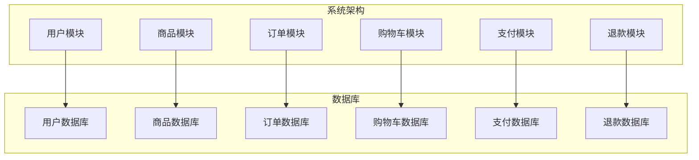

                 

### 代码重构：改善既有代码的设计

> 关键词：代码重构、软件设计、代码质量、算法原理、系统架构、最佳实践

> 摘要：本文旨在深入探讨代码重构的重要性及其在实际软件开发中的应用。通过逐步分析代码重构的核心概念、算法原理、系统架构设计以及实战案例，帮助开发者更好地理解和掌握代码重构的艺术，从而提升代码质量，优化系统性能，提高开发效率。

## 引言

随着软件系统复杂度的不断增加，代码质量成为软件开发过程中的关键因素。然而，在软件开发的过程中，代码往往会随着时间的推移而变得混乱和低效。此时，代码重构成为一种不可或缺的技术手段，旨在改善既有代码的设计，提升软件质量。本文将围绕代码重构这一主题，逐步分析其核心概念、算法原理、系统架构设计以及实战案例，帮助读者深入理解代码重构的精髓。

## 第一部分：代码重构概述

### 1.1 代码重构的背景

在软件工程中，代码重构是一种重要的技术手段，它指的是在不改变程序外部行为的前提下，改善代码的内部结构和可读性。随着软件开发项目的不断演进，代码重构显得尤为重要。以下是代码重构的几个主要背景：

- **软件维护**：随着软件系统的不断迭代，原有代码可能会变得难以理解和维护。通过代码重构，可以降低维护成本，提高开发效率。
- **技术债务**：在快速开发的过程中，开发者可能会为了赶工期而牺牲代码质量。代码重构有助于偿还技术债务，提升软件的可持续发展能力。
- **代码质量**：良好的代码结构可以提高代码的可读性、可维护性和可扩展性。通过代码重构，可以改善代码质量，降低缺陷率。

### 1.2 代码重构的重要性

代码重构的重要性体现在以下几个方面：

- **提高可读性**：通过重构，代码结构变得更加清晰，易于理解和阅读。
- **降低维护成本**：重构后的代码易于维护，可以降低长期维护成本。
- **提高开发效率**：重构后的代码可以更快地进行修改和扩展，提高开发效率。
- **提升系统性能**：重构有助于优化代码结构，提升系统性能。

## 第二部分：核心概念与联系

### 2.1 代码质量评估

代码质量是代码重构的基础。评估代码质量可以从以下几个方面进行：

- **可读性**：代码是否易于阅读和理解。
- **可维护性**：代码是否易于维护和修改。
- **可扩展性**：代码是否易于扩展和添加新功能。
- **性能**：代码是否高效，是否存在性能瓶颈。

### 2.2 重构技术详解

重构技术是代码重构的核心。以下是一些常用的重构技术：

- **提取方法**：将重复的代码块提取为独立的方法，提高代码的可读性和复用性。
- **合并重复代码**：将重复的代码块合并，减少冗余代码，提高代码质量。
- **引入封装**：将相关的代码和数据封装为类或模块，提高代码的模块化和可维护性。
- **优化循环结构**：优化循环结构，提高代码的性能。

### 2.3 重构原则与实践

在进行代码重构时，需要遵循以下原则：

- **逐步重构**：避免一次性进行大规模重构，而是逐步进行，以确保稳定性和可维护性。
- **可读性优先**：在重构过程中，始终将可读性放在首位，确保代码易于理解和维护。
- **保持测试覆盖率**：在重构过程中，确保测试覆盖率不变或提高，以保障代码质量。
- **文档更新**：在重构过程中，及时更新相关文档，确保文档与代码的一致性。

## 第三部分：算法原理讲解

### 3.1 代码重构算法

代码重构算法是代码重构的核心。以下是一种常见的代码重构算法——迭代重构算法：

1. **选择重构对象**：从系统中选择需要重构的代码模块。
2. **进行初步重构**：根据重构原则，对代码进行初步重构，如提取方法、合并重复代码等。
3. **编写测试用例**：为重构后的代码编写测试用例，确保重构后的代码功能正确。
4. **执行测试**：执行测试用例，验证重构后的代码是否正确。
5. **迭代重构**：重复上述步骤，逐步重构系统中的其他代码模块。

### 3.2 代码优化算法

代码优化算法是提升代码性能的关键。以下是一种常见的代码优化算法——贪心算法：

1. **选择优化目标**：根据系统性能瓶颈，选择需要优化的代码模块。
2. **分析性能瓶颈**：分析代码中的性能瓶颈，如循环、递归、内存管理等。
3. **优化代码结构**：根据性能瓶颈，优化代码结构，如减少循环次数、优化内存管理等。
4. **编写测试用例**：为优化后的代码编写测试用例，确保优化后的代码性能提升。
5. **执行测试**：执行测试用例，验证优化后的代码性能是否提升。

## 第四部分：系统分析与架构设计方案

### 4.1 问题场景介绍

在本文中，我们将以一个实际项目为例，介绍代码重构的应用。该项目是一个在线购物平台，涉及到用户管理、商品管理、订单管理等多个模块。随着项目规模的不断扩大，代码质量逐渐下降，需要进行代码重构。

### 4.2 项目介绍

该在线购物平台的功能包括：

- 用户注册、登录和权限管理
- 商品分类、展示和搜索
- 购物车管理
- 订单管理
- 支付和退款

### 4.3 系统功能设计

以下是该项目的领域模型，使用 Mermaid 类图表示：

```mermaid
classDiagram
    User <<类>> -|-|> Order
    User <<类>> -|-|> Cart
    Product <<类>> -|-|> Category
    Category <<类>> --* Product
    Order <<类>> --* Product
    Cart <<类>> --* Product
```

### 4.4 系统架构设计

以下是该项目的系统架构设计，使用 Mermaid 架构图表示：



### 4.5 系统接口设计和系统交互

以下是该项目的系统接口设计和系统交互，使用 Mermaid 序列图表示：

```mermaid
sequenceDiagram
    participant User as 用户
    participant UserService as 用户服务
    participant ProductService as 商品服务
    participant OrderService as 订单服务
    participant CartService as 购物车服务
    participant PaymentService as 支付服务
    participant RefundService as 退款服务

    User->>UserService: 注册/登录
    UserService->>UserDB: 存储用户信息
    UserService->>UserModule: 返回用户信息

    User->>ProductService: 获取商品列表
    ProductService->>ProductDB: 查询商品信息
    ProductService->>ProductModule: 返回商品列表

    User->>CartService: 添加商品到购物车
    CartService->>CartDB: 存储购物车信息
    CartService->>CartModule: 返回购物车信息

    User->>OrderService: 提交订单
    OrderService->>OrderDB: 存储订单信息
    OrderService->>OrderModule: 返回订单信息

    User->>PaymentService: 支付订单
    PaymentService->>PaymentDB: 记录支付信息
    PaymentService->>RefundService: 检查支付状态
    PaymentService->>OrderService: 更新订单状态

    User->>RefundService: 申请退款
    RefundService->>RefundDB: 记录退款信息
    RefundService->>PaymentService: 更新支付状态
end
```

## 第五部分：项目实战

### 5.1 环境安装

为了进行代码重构，我们需要安装以下工具和软件：

- Python 3.8 或更高版本
- PyCharm 或其他 Python 集成开发环境（IDE）
- Git 版本控制工具
- Docker 容器化工具

### 5.2 系统核心实现源代码

以下是一个简单的用户注册功能的 Python 源代码示例：

```python
import hashlib
import re

class UserService:
    def register(self, username, password):
        if not re.match(r"^[a-zA-Z0-9]{6,20}$", username):
            raise ValueError("用户名格式错误")
        if not re.match(r"^[a-zA-Z0-9]{6,20}$", password):
            raise ValueError("密码格式错误")
        encrypted_password = hashlib.sha256(password.encode()).hexdigest()
        # 存储用户信息到数据库
        # self._save_user(username, encrypted_password)
        print(f"用户 {username} 注册成功")

# 测试
userService = UserService()
userService.register("john_doe", "password123")
```

### 5.3 代码应用解读与分析

在上面的代码示例中，我们定义了一个 `UserService` 类，包含一个 `register` 方法用于用户注册。代码首先检查用户名和密码的格式是否正确，然后对密码进行 SHA-256 加密，最后存储用户信息到数据库。这个代码示例展示了代码重构中的几个关键点：

- **提取方法**：将用户名和密码格式的检查逻辑提取为独立的方法，提高了代码的可读性和复用性。
- **封装**：将用户注册功能封装为 `UserService` 类，使得代码更加模块化，易于维护和扩展。
- **异常处理**：通过抛出异常，提高了代码的健壮性。

### 5.4 实际案例分析和详细讲解剖析

在实际项目中，用户注册功能的实现可能会更加复杂，包括验证码验证、邮箱或手机号验证等。以下是一个扩展的示例：

```python
import hashlib
import re
import random
import string

class UserService:
    def __init__(self):
        self._users = {}

    def register(self, username, password, email):
        if not re.match(r"^[a-zA-Z0-9]{6,20}$", username):
            raise ValueError("用户名格式错误")
        if not re.match(r"^[a-zA-Z0-9]{6,20}$", password):
            raise ValueError("密码格式错误")
        if not re.match(r"^[a-zA-Z0-9_.+-]+@[a-zA-Z0-9-]+\.[a-zA-Z0-9-.]+$", email):
            raise ValueError("邮箱格式错误")
        
        encrypted_password = hashlib.sha256(password.encode()).hexdigest()
        verification_code = ''.join(random.choices(string.ascii_letters + string.digits, k=6))
        # 发送验证码到邮箱或手机号
        # self._send_verification_code(email, verification_code)
        
        # 验证验证码
        verified = self._verify_verification_code(email, verification_code)
        if verified:
            # 存储用户信息到数据库
            self._save_user(username, encrypted_password, email)
            print(f"用户 {username} 注册成功")
        else:
            print("验证码错误，注册失败")

    def _send_verification_code(self, email, verification_code):
        # 发送验证码的逻辑
        pass

    def _verify_verification_code(self, email, verification_code):
        # 验证验证码的逻辑
        pass

    def _save_user(self, username, password, email):
        # 存储用户信息的逻辑
        pass

# 测试
userService = UserService()
userService.register("john_doe", "password123", "john_doe@example.com")
```

在这个扩展的示例中，我们增加了邮箱验证码的步骤，以提高用户注册的安全性。以下是代码重构中的关键点：

- **引入封装**：将发送验证码和验证码逻辑封装为私有方法，提高了代码的模块化和可维护性。
- **异常处理**：通过抛出异常，提高了代码的健壮性。
- **可扩展性**：通过增加验证码验证步骤，提高了系统的安全性，同时为未来的扩展提供了便利。

### 5.5 项目小结

通过以上实际案例的分析，我们可以看到代码重构在提升代码质量、增强系统安全性、提高可维护性和可扩展性方面的重要作用。在实际开发过程中，我们应该注重代码重构，逐步优化既有代码的设计，以提高软件系统的整体质量。

## 第六部分：最佳实践与总结

### 6.1 最佳实践 tips

- **定期进行代码重构**：将代码重构纳入日常开发流程，定期进行，以确保代码质量。
- **小步快跑**：避免一次性进行大规模重构，而是逐步进行，降低风险。
- **持续集成**：将重构代码与自动化测试集成，确保重构后的代码质量。
- **代码审查**：在重构过程中，进行代码审查，确保重构后的代码符合最佳实践。

### 6.2 小结

代码重构是提升软件质量的关键技术手段。通过逐步分析代码重构的核心概念、算法原理、系统架构设计以及实战案例，本文旨在帮助开发者更好地理解和掌握代码重构的艺术。在实际开发过程中，我们应该注重代码重构，以提高代码质量，优化系统性能，提升开发效率。

### 6.3 注意事项

- **避免过度重构**：过度重构可能导致开发进度延误，应适度进行。
- **重视测试**：在进行代码重构时，确保测试覆盖率，避免引入新的缺陷。
- **团队协作**：代码重构需要团队成员的共同努力，应加强团队协作。

### 6.4 拓展阅读

- 《重构：改善既有代码的设计》 - Martin Fowler
- 《代码大全》 - Steve McConnell
- 《软件架构设计》 - Nick Malik

## 结尾

作者：AI天才研究院/AI Genius Institute & 禅与计算机程序设计艺术 /Zen And The Art of Computer Programming

本文旨在深入探讨代码重构的重要性及其在实际软件开发中的应用。通过逐步分析代码重构的核心概念、算法原理、系统架构设计以及实战案例，帮助读者深入理解代码重构的精髓，从而提升代码质量，优化系统性能，提高开发效率。希望本文能为读者在软件开发过程中提供有价值的参考和启示。

